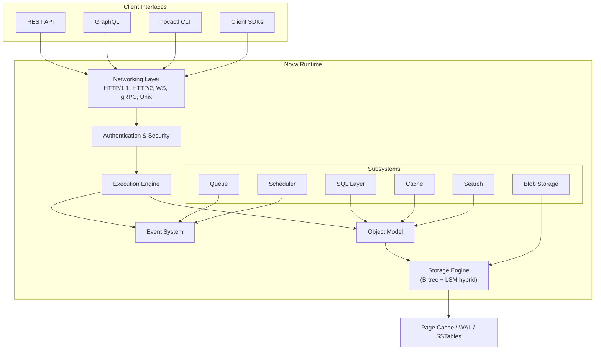

# Nova Runtime

> **Status: Implementation in Progress** — Phases 0–4 complete. 14 crates implemented with ~1,359 tests. See [Development Roadmap](docs/30-development-roadmap.md) for the full plan.

Nova Runtime is a lightweight backend runtime that collapses multiple infrastructure services into a single executable. It unifies database, cache, queue, scheduler, search, blob storage, authentication, and API runtime capabilities on commodity VPS hardware.

## Problem

Modern backend applications require a sprawl of infrastructure: PostgreSQL, Redis, RabbitMQ, Elasticsearch, S3, Auth0, and more. Each service adds operational complexity, deployment cost, failure modes, and resource overhead. On a small VPS, running even a subset of these services is impractical.

## Solution

Nova Runtime replaces this stack with a single `novad` binary — a unified runtime that provides database, caching, queuing, scheduling, full-text search, blob storage, authentication, and API serving from one process. Internally, it maintains modular subsystem boundaries with a shared execution pipeline, a single storage engine, a unified object model, and an event-driven architecture.

## Architecture Overview



## Core Principles

| Principle | Description |
|-----------|-------------|
| **One Storage Engine** | All persistent state flows through a single storage engine — no subsystem owns its own persistence |
| **One Object Model** | Every subsystem reads and writes using a unified data representation |
| **One Event Model** | All state changes produce events; subsystems communicate through events, not direct calls |
| **One Execution Pipeline** | Every operation passes through a unified pipeline for consistent authorization, validation, and observability |
| **No Duplicated Persistence** | A given piece of data lives in exactly one place |
| **No Duplicated Business Logic** | Business logic lives in exactly one subsystem |
| **Correctness > Performance** | Never sacrifice correctness for speed |

## Documentation

The complete architecture is specified across 30 documents in [`docs/`](docs/). Each document is a standalone engineering specification covering purpose, architecture (with mermaid diagrams), data structures, algorithms, interfaces, failure modes, recovery strategy, performance considerations, security, and testing.

| # | Document | What It Covers |
|---|----------|----------------|
| 01 | [Project Vision](docs/01-project-vision.md) | Mission, success criteria (10k ops/s target), system boundaries |
| 02 | [Core Principles](docs/02-core-principles.md) | 10 immutable design principles, trade-off hierarchy |
| 03 | [Glossary](docs/03-glossary.md) | 50+ defined terms, naming conventions, acronym registry |
| 04 | [Requirements Analysis](docs/04-requirements-analysis.md) | 89 functional requirements, MoSCoW prioritized, capacity planning |
| 05 | [Domain Model](docs/05-domain-model.md) | Document/Collection/Schema type system, validation, versioning |
| 06 | [High-Level Architecture](docs/06-high-level-architecture.md) | System block diagram, module dependencies, request lifecycle |
| 07 | [Runtime Architecture](docs/07-runtime-architecture.md) | Process model, thread pool, signal handling, graceful shutdown |
| 08 | [Storage Engine](docs/08-storage-engine.md) | Hybrid B-tree + LSM-tree, 4KB pages, WAL, compaction, MVCC |
| 09 | [Memory Model](docs/09-memory-model.md) | Arena/slab/page allocators, generational GC, memory budgeting |
| 10 | [Execution Engine](docs/10-execution-engine.md) | 6-stage pipeline, middleware chain, rate limiting, circuit breaker |
| 11 | [Event System](docs/11-event-system.md) | Pub-sub event bus, topic routing, delivery guarantees, backpressure |
| 12 | [Object Model](docs/12-object-model.md) | Type system (10 types), MessagePack serialization, schema evolution |
| 13 | [Networking](docs/13-networking.md) | TCP/TLS/Unix listeners, HTTP/1.1+2, WebSocket, gRPC, connection mgmt |
| 14 | [Configuration](docs/14-configuration.md) | 5-layer resolution (defaults→file→env→flags), hot-reload, schema |
| 15 | [Security](docs/15-security.md) | Threat model, AES-256-GCM at rest, TLS 1.3, audit logging, input validation |
| 16 | [Authentication](docs/16-authentication.md) | Password (argon2id), API keys, JWT, OAuth2/OIDC, RBAC, MFA |
| 17 | [Cache](docs/17-cache.md) | HashMap + TTL backends, LRU/LFU eviction, batch ops, TTL sweeper, event invalidation |
| 17 | [Queue](docs/17-queue.md) | FIFO/priority/delayed/DLQ, at-least-once, visibility timeout, consumer groups |
| 18 | [Scheduler](docs/18-scheduler.md) | Cron/delayed/one-shot jobs, time-wheel, DAG dependencies, retry (exp backoff) |
| 19 | [Search](docs/19-search.md) | BM25 scoring, inverted index, tokenization, fuzzy/boolean/phrase search |
| 20 | [Blob Storage](docs/20-blob-storage.md) | 1 MiB chunking, SHA-256 dedup, multipart upload, range requests |
| 21 | [SQL Layer](docs/21-sql-layer.md) | SQL subset (SELECT/JOIN/AGG/GROUP BY), recursive descent parser, iterator execution |
| 22 | [REST API](docs/22-rest-api.md) | 80+ endpoints grouped by subsystem, cursor pagination, sparse fieldsets |
| 23 | [GraphQL](docs/23-graphql.md) | Full SDL schema, DataLoader batching, subscriptions, complexity analysis |
| 24 | [CLI](docs/24-cli.md) | 30+ commands across all subsystems, profiles, shell completions |
| 25 | [SDK](docs/25-sdk.md) | TypeScript SDK with 9 typed clients, circuit breaker, auto-pagination |
| 26 | [Dashboard](docs/26-dashboard.md) | React SPA spec, wireframes, WebSocket live updates, component tree |
| 27 | [Testing Strategy](docs/27-testing-strategy.md) | Test pyramid (70/20/10), fuzzing, chaos engineering, CI pipeline |
| 28 | [Benchmark Strategy](docs/28-benchmark-strategy.md) | Latency/throughput/concurrency benchmarks, target numbers, regression detection |
| 29 | [Deployment](docs/29-deployment.md) | apt/Docker/static binary install, systemd, backup, monitoring, runbooks |
| 30 | [Development Roadmap](docs/30-development-roadmap.md) | 7-phase build plan, Gantt chart, dependency graph, staffing, milestones |

## Key Design Decisions

**Single-node first.** Nova Runtime is designed as a single-node system. Clustering and replication are explicitly deferred to a future phase. This keeps the initial implementation achievable and avoids premature distribution complexity.

**Hybrid B-tree + LSM-tree storage.** The storage engine uses a hybrid approach: B-tree for point reads on hot data, LSM-tree for write-heavy workloads and range scans. This provides balanced performance across diverse workloads without requiring separate engines.

**Event-driven communication.** Subsystems communicate through a shared event bus. A queue produces events when messages are enqueued/dequeued; the scheduler produces events when jobs execute; the SQL layer produces events on data mutations. Observability, audit logging, and future replication all consume the same event stream.

**Everything passes through the Execution Engine.** No operation bypasses the unified pipeline. This ensures every mutation is authorized, validated, logged, and audited. Individual subsystems implement their logic but never directly access storage or the network.

## Quick Start

### Prerequisites

- **Rust** 1.75+ (`curl --proto '=https' --tlsv1.2 -sSf https://sh.rustup.rs | sh`)
- **Node.js** 18+ and **npm** (`sudo apt install nodejs npm` or from [nodejs.org](https://nodejs.org))
- **Ports 8642 and 5173** must be free (see [troubleshooting](#troubleshooting))

### One-Command Setup

```bash
bash scripts/setup.sh
```

This builds the backend, installs dashboard dependencies, and creates a default config file.

### Start Everything

```bash
bash scripts/dev.sh
```

This starts both the backend (`novad` on port 8642) and the dashboard dev server (Vite on port 5173).

| Service | URL | Default Credentials |
|---------|-----|-------------------|
| Backend API | `http://127.0.0.1:8642` | — |
| Dashboard | `http://127.0.0.1:5173` | `admin` / `admin123` |
| GraphQL | `http://127.0.0.1:8642/graphql` | Bearer token from login |

### Manual Startup

```bash
# Terminal 1 — Backend
cargo build --bin novad
target/debug/novad --config novad.toml

# Terminal 2 — Dashboard
cd dashboard && npm run dev

# Terminal 3 — Seed data (optional)
bash scripts/seed.sh
```

### Seed Data

The seed script populates all subsystems with test data:

```bash
bash scripts/seed.sh
```

| Subsystem | What Gets Created |
|-----------|------------------|
| SQL | 5 tables (users, products, orders, logs, events), 160 rows |
| Cache | 10 cache keys |
| Queue | 5 queues, 29 messages |
| Scheduler | 10 scheduled jobs |
| Search | 2 indexes, 25 documents |
| Blob | 8 blobs (text, JSON, CSV, YAML, XML, SQL) |
| Auth | 2 extra users + 2 API keys |

> **Idempotent**: Safe to re-run. Drops existing tables before recreating.

### Troubleshooting

#### Port 8642 already in use

```bash
# Check what's using it
ss -tlnp | grep 8642

# Kill it
fuser -k 8642/tcp

# Then retry
bash scripts/dev.sh
```

#### Port 5173 already in use

```bash
fuser -k 5173/tcp
```

#### Dashboard shows empty collections

SQL tables are in-memory only — they don't survive a restart. Re-run the seed script:

```bash
bash scripts/seed.sh
```

(If SQL persistence is enabled, tables survive restarts automatically.)

#### Login fails

The admin user is bootstrapped on first startup. If you're running a fresh instance with no `data/` directory, wait a few seconds for startup to complete before logging in.

### API Overview

All API routes are at `http://127.0.0.1:8642`:

| Route | Method | Description |
|-------|--------|-------------|
| `/health` | GET | System health (status, uptime, memory, disk, subsystems) |
| `/api/v1/auth/login` | POST | Login with username/password |
| `/api/v1/auth/me` | GET | Current user info |
| `/api/v1/auth/api-keys` | GET/POST | List/create API keys |
| `/api/v1/sql/tables` | GET | List tables with row counts |
| `/api/v1/sql/tables/:name/schema` | GET | Table schema |
| `/api/v1/sql/query` | POST | Run SELECT query |
| `/api/v1/sql/execute` | POST | Run INSERT/UPDATE/DELETE/CREATE/DROP |
| `/api/v1/cache/stats` | GET | Cache statistics |
| `/api/v1/cache/keys` | GET | List cache keys |
| `/api/v1/cache/:key` | GET/DELETE | Get/delete cache entry |
| `/api/v1/queue/queues` | GET | List queues |
| `/api/v1/queue/:name/messages` | GET/POST/DELETE | Message CRUD |
| `/api/v1/scheduler/jobs` | GET | List scheduled jobs |
| `/api/v1/scheduler/jobs/:id/pause` | POST | Pause a job |
| `/api/v1/scheduler/jobs/:id/resume` | POST | Resume a job |
| `/api/v1/scheduler/jobs/:id/trigger` | POST | Trigger a job immediately |
| `/api/v1/search/indexes` | GET | List search indexes |
| `/api/v1/search/:index/documents` | GET/POST | Search document CRUD |
| `/api/v1/blob/files` | GET | List blobs |
| `/api/v1/blob/upload` | POST | Upload blob |
| `/api/v1/blob/:hash` | GET/DELETE | Get/delete blob |
| `/runtime/config` | GET | Runtime configuration |
| `/graphql` | POST | GraphQL endpoint |

**Login flow:**

```bash
# Login
curl -X POST http://127.0.0.1:8642/api/v1/auth/login \
  -H 'Content-Type: application/json' \
  -d '{"username":"admin","password":"admin123"}'

# Response: {"token_type":"Bearer","access_token":"nova_sess_...","expires_in":3600}

# Use the token for subsequent requests
curl -H "Authorization: Bearer nova_sess_..." http://127.0.0.1:8642/api/v1/sql/tables
```

### SQL Examples

```bash
# Create table
curl -X POST http://127.0.0.1:8642/api/v1/sql/execute \
  -H "Authorization: Bearer $TOKEN" \
  -H 'Content-Type: application/json' \
  -d '{"query":"CREATE TABLE users (id Integer, name Text, email Text)"}'

# Insert
curl -X POST http://127.0.0.1:8642/api/v1/sql/execute \
  -H "Authorization: Bearer $TOKEN" \
  -H 'Content-Type: application/json' \
  -d '{"query":"INSERT INTO users VALUES (1, '\''Alice'\'', '\''alice@example.com'\'')"}'

# Query
curl -X POST http://127.0.0.1:8642/api/v1/sql/query \
  -H "Authorization: Bearer $TOKEN" \
  -H 'Content-Type: application/json' \
  -d '{"query":"SELECT * FROM users"}'

# List tables
curl http://127.0.0.1:8642/api/v1/sql/tables \
  -H "Authorization: Bearer $TOKEN"
```

### Available CLI Commands

```bash
# Check backend health
curl http://127.0.0.1:8642/health | jq

# List all tables
curl http://127.0.0.1:8642/api/v1/sql/tables -H "Authorization: Bearer $(curl -s -X POST .../auth/login -d '{"username":"admin","password":"admin123"}' | python3 -c 'import sys,json;print(json.load(sys.stdin)["access_token"])')"

# Quick alias
alias nova='curl -sf -H "Authorization: Bearer $(curl -s -X POST http://127.0.0.1:8642/api/v1/auth/login -H Content-Type:application/json -d '{"username":"admin","password":"admin123"}' | python3 -c 'import sys,json;print(json.load(sys.stdin)["access_token"])')"'

# Use it
nova http://127.0.0.1:8642/api/v1/sql/tables
nova -X POST http://127.0.0.1:8642/api/v1/sql/query -H 'Content-Type: application/json' -d '{"query":"SELECT * FROM users LIMIT 5"}'
```

## Development Status

```
Phase 0: Foundations          ██████████ 100%  30 spec docs complete
Phase 1: Core Abstractions    ██████████ 100%  9 crates built, 85%+ code coverage
Phase 2: Runtime Core         ██████████ 100%  Execution Engine + novad alpha verified
Phase 3: Data Subsystems      ██████████ 100%  SQL, Cache, Search, Blob (172 tests)
Phase 4: Async Subsystems     ██████████ 100%  Queue, Scheduler, Auth (123 tests)
Phase 5: API & Tooling        ████████████ 100%  REST, GraphQL, SDK, Dashboard
Phase 6: Hardening            ░░░░░░░░░░   0%
```

**Completed crates:**

| Crate | Tests | Key Components |
|-------|-------|----------------|
| `nova-core` | 137+ | PageId, Lsn, Key, Value, RuntimeError (16 variants), 7 traits |
| `nova-config` | 127+ | 21-section Config, 5-layer resolution, hot-reload |
| `nova-memory` | 41+ | Arena/Slab/PageAlloc/Budget/Pool, MemoryManager, GC |
| `nova-storage` | 86+ | Page cache, WAL (11 record types), B+Tree, LSM, MVCC |
| `nova-object` | 90+ | Value (32 variants), SchemaRegistry, MessagePack |
| `nova-event` | 41+ | EventId (UUID v7), EventBus, sharded delivery, replay |
| `nova-security` | 85+ | InputValidator, Encryption, RateLimiter, AuditLogger |
| `nova-cli` | 86+ | 12 command groups, shell completions |
| `nova-executor` | 10+ | 6-stage pipeline, middleware, circuit breaker |
| `nova-api` | 6+ | HTTP server, health, admin endpoints |
| `nova-cache` | 43 | HashMap+Ttl backends, LRU/LFU, TTL sweeper |
| `nova-blob` | 37 | SHA-256 chunking, Merkle tree, dedup, GC |
| `nova-search` | 55 | BM25 scoring, Porter stemmer, query DSL |
| `nova-sql` | 37 | Full DML/DQL, GROUP BY, ORDER BY, constraints |
| `nova-queue` | 23 | Pull-model, visibility timeout, DLQ, dedup |
| `nova-scheduler` | 29 | TimeWheel, CronSchedule, dependency validation |
| `nova-auth` | 77 | Password/API Key/JWT, RBAC, TOTP MFA, brute-force detection |
| `novad` | 5+ | Subsystem wiring, graceful shutdown, SIGHUP handler |

**Total: ~1,359 tests across 18 crates.**

## Target Hardware

| Tier | CPU | RAM | Disk | Expected Throughput |
|------|-----|-----|------|-------------------|
| Minimum | 1 core | 512 MB | 10 GB | 1k ops/s |
| Reference | 4 cores | 8 GB | 100 GB | 10k ops/s |
| Recommended | 8 cores | 32 GB | 500 GB | 50k ops/s |

## License

MIT
