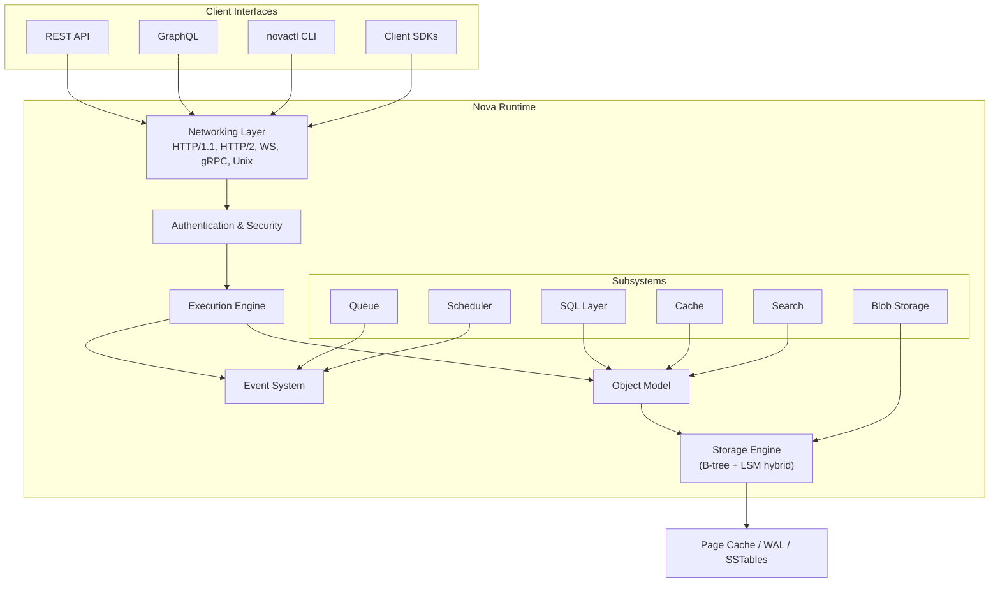

# Nova Runtime

> **Status: Under Development** — This project is in the architecture and documentation phase. No implementation has begun.

Nova Runtime is a lightweight backend runtime that collapses multiple infrastructure services into a single executable. It unifies database, cache, queue, scheduler, search, blob storage, authentication, and API runtime capabilities on commodity VPS hardware.

## Problem

Modern backend applications require a sprawl of infrastructure: PostgreSQL, Redis, RabbitMQ, Elasticsearch, S3, Auth0, and more. Each service adds operational complexity, deployment cost, failure modes, and resource overhead. On a small VPS, running even a subset of these services is impractical.

## Solution

Nova Runtime replaces this stack with a single `novad` binary — a unified runtime that provides database, caching, queuing, scheduling, full-text search, blob storage, authentication, and API serving from one process. Internally, it maintains modular subsystem boundaries with a shared execution pipeline, a single storage engine, a unified object model, and an event-driven architecture.

## Architecture Overview



## Core Principles

| Principle | Description |
|-----------|-------------|
| **One Storage Engine** | All persistent state flows through a single storage engine — no subsystem owns its own persistence |
| **One Object Model** | Every subsystem reads and writes using a unified data representation |
| **One Event Model** | All state changes produce events; subsystems communicate through events, not direct calls |
| **One Execution Pipeline** | Every operation passes through a unified pipeline for consistent authorization, validation, and observability |
| **No Duplicated Persistence** | A given piece of data lives in exactly one place |
| **No Duplicated Business Logic** | Business logic lives in exactly one subsystem |
| **Correctness > Performance** | Never sacrifice correctness for speed |

## Documentation

The complete architecture is specified across 30 documents in [`docs/`](docs/). Each document is a standalone engineering specification covering purpose, architecture (with mermaid diagrams), data structures, algorithms, interfaces, failure modes, recovery strategy, performance considerations, security, and testing.

| # | Document | What It Covers |
|---|----------|----------------|
| 01 | [Project Vision](docs/01-project-vision.md) | Mission, success criteria (10k ops/s target), system boundaries |
| 02 | [Core Principles](docs/02-core-principles.md) | 10 immutable design principles, trade-off hierarchy |
| 03 | [Glossary](docs/03-glossary.md) | 50+ defined terms, naming conventions, acronym registry |
| 04 | [Requirements Analysis](docs/04-requirements-analysis.md) | 89 functional requirements, MoSCoW prioritized, capacity planning |
| 05 | [Domain Model](docs/05-domain-model.md) | Document/Collection/Schema type system, validation, versioning |
| 06 | [High-Level Architecture](docs/06-high-level-architecture.md) | System block diagram, module dependencies, request lifecycle |
| 07 | [Runtime Architecture](docs/07-runtime-architecture.md) | Process model, thread pool, signal handling, graceful shutdown |
| 08 | [Storage Engine](docs/08-storage-engine.md) | Hybrid B-tree + LSM-tree, 4KB pages, WAL, compaction, MVCC |
| 09 | [Memory Model](docs/09-memory-model.md) | Arena/slab/page allocators, generational GC, memory budgeting |
| 10 | [Execution Engine](docs/10-execution-engine.md) | 6-stage pipeline, middleware chain, rate limiting, circuit breaker |
| 11 | [Event System](docs/11-event-system.md) | Pub-sub event bus, topic routing, delivery guarantees, backpressure |
| 12 | [Object Model](docs/12-object-model.md) | Type system (10 types), MessagePack serialization, schema evolution |
| 13 | [Networking](docs/13-networking.md) | TCP/TLS/Unix listeners, HTTP/1.1+2, WebSocket, gRPC, connection mgmt |
| 14 | [Configuration](docs/14-configuration.md) | 5-layer resolution (defaults→file→env→flags), hot-reload, schema |
| 15 | [Security](docs/15-security.md) | Threat model, AES-256-GCM at rest, TLS 1.3, audit logging, input validation |
| 16 | [Authentication](docs/16-authentication.md) | Password (argon2id), API keys, JWT, OAuth2/OIDC, RBAC, MFA |
| 17 | [Queue](docs/17-queue.md) | FIFO/priority/delayed/DLQ, at-least-once, visibility timeout, consumer groups |
| 18 | [Scheduler](docs/18-scheduler.md) | Cron/delayed/one-shot jobs, time-wheel, DAG dependencies, retry (exp backoff) |
| 19 | [Search](docs/19-search.md) | BM25 scoring, inverted index, tokenization, fuzzy/boolean/phrase search |
| 20 | [Blob Storage](docs/20-blob-storage.md) | 1 MiB chunking, SHA-256 dedup, multipart upload, range requests |
| 21 | [SQL Layer](docs/21-sql-layer.md) | SQL subset (SELECT/JOIN/AGG/GROUP BY), recursive descent parser, iterator execution |
| 22 | [REST API](docs/22-rest-api.md) | 80+ endpoints grouped by subsystem, cursor pagination, sparse fieldsets |
| 23 | [GraphQL](docs/23-graphql.md) | Full SDL schema, DataLoader batching, subscriptions, complexity analysis |
| 24 | [CLI](docs/24-cli.md) | 30+ commands across all subsystems, profiles, shell completions |
| 25 | [SDK](docs/25-sdk.md) | TypeScript SDK with 9 typed clients, circuit breaker, auto-pagination |
| 26 | [Dashboard](docs/26-dashboard.md) | React SPA spec, wireframes, WebSocket live updates, component tree |
| 27 | [Testing Strategy](docs/27-testing-strategy.md) | Test pyramid (70/20/10), fuzzing, chaos engineering, CI pipeline |
| 28 | [Benchmark Strategy](docs/28-benchmark-strategy.md) | Latency/throughput/concurrency benchmarks, target numbers, regression detection |
| 29 | [Deployment](docs/29-deployment.md) | apt/Docker/static binary install, systemd, backup, monitoring, runbooks |
| 30 | [Development Roadmap](docs/30-development-roadmap.md) | 7-phase build plan, Gantt chart, dependency graph, staffing, milestones |

## Key Design Decisions

**Single-node first.** Nova Runtime is designed as a single-node system. Clustering and replication are explicitly deferred to a future phase. This keeps the initial implementation achievable and avoids premature distribution complexity.

**Hybrid B-tree + LSM-tree storage.** The storage engine uses a hybrid approach: B-tree for point reads on hot data, LSM-tree for write-heavy workloads and range scans. This provides balanced performance across diverse workloads without requiring separate engines.

**Event-driven communication.** Subsystems communicate through a shared event bus. A queue produces events when messages are enqueued/dequeued; the scheduler produces events when jobs execute; the SQL layer produces events on data mutations. Observability, audit logging, and future replication all consume the same event stream.

**Everything passes through the Execution Engine.** No operation bypasses the unified pipeline. This ensures every mutation is authorized, validated, logged, and audited. Individual subsystems implement their logic but never directly access storage or the network.

## Quick Start

Nova Runtime is not yet implemented. Once available:

```bash
# Download the binary
curl -O https://releases.novaruntime.io/novad-latest-x86_64-linux

# Run with default configuration
./novad

# Or with a config file
./novad --config /etc/novad/novad.toml

# Interact via CLI
novactl runtime status
novactl db query "SELECT * FROM users LIMIT 10"
```

## Development Status

```
Phase 0: Foundations          ░░░░░░░░░░  0%  (planned)
Phase 1: Core Abstractions    ░░░░░░░░░░  0%
Phase 2: Runtime Core         ░░░░░░░░░░  0%
Phase 3: Data Subsystems      ░░░░░░░░░░  0%
Phase 4: Async Subsystems     ░░░░░░░░░░  0%
Phase 5: API & Tooling        ░░░░░░░░░░  0%
Phase 6: Hardening            ░░░░░░░░░░  0%
```

The project is currently in the **architecture and documentation phase**. All 30 specification documents are complete. Implementation will begin after the architecture review.

## Target Hardware

| Tier | CPU | RAM | Disk | Expected Throughput |
|------|-----|-----|------|-------------------|
| Minimum | 1 core | 512 MB | 10 GB | 1k ops/s |
| Reference | 4 cores | 8 GB | 100 GB | 10k ops/s |
| Recommended | 8 cores | 32 GB | 500 GB | 50k ops/s |

## License

MIT
