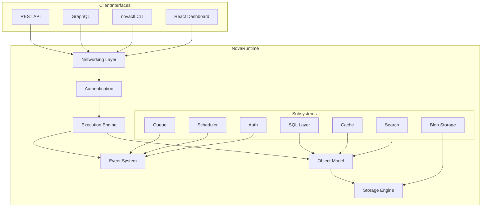

# Nova Runtime

[](https://opensource.org/licenses/MIT)
[](https://www.rust-lang.org/)
[](https://github.com/Icarus-afk/Nova-Runtime/actions)
[](https://www.docker.com/)
[](https://github.com/Icarus-afk/Nova-Runtime/actions)

**Nova Runtime is a high-performance, unified backend platform that consolidates database, cache, queue, scheduler, search, blob storage, authentication, and API runtime capabilities into a single executable.**

## Overview

Nova Runtime replaces the traditional sprawl of infrastructure services (PostgreSQL, Redis, RabbitMQ, Elasticsearch, S3, etc.) with a single optimized binary (`novad`). It provides:

- **Single Process Architecture:** All subsystems run within one process with shared memory and storage
- **Unified Storage Engine:** Hybrid B-tree + LSM-tree storage for balanced performance
- **Event-Driven Communication:** Subsystems communicate via a shared event bus
- **Consistent Execution Pipeline:** All operations pass through a unified pipeline for authorization, validation, and observability
- **Multi-Interface Access:** REST API, GraphQL, CLI, and React Dashboard
- **Runtime Configuration:** Modify settings without restart via API or SIGHUP

## Architecture



## Core Principles

1. **Single Storage Engine:** All persistent state flows through one storage engine - no subsystem owns its own persistence
2. **Unified Object Model:** Every subsystem reads and writes using the same data representation
3. **Event-Driven Communication:** All state changes produce events consumed by other subsystems
4. **Consistent Execution Pipeline:** Every operation passes through the same pipeline for authorization and validation
5. **No Duplicated Persistence:** Each piece of data lives in exactly one place
6. **No Duplicated Logic:** Business logic lives in exactly one subsystem
7. **Correctness First:** Never sacrifice correctness for performance

## Getting Started

### Prerequisites

- Rust 1.85+ ([installation guide](https://www.rust-lang.org/tools/install))
- Node.js 18+ for dashboard ([installation guide](https://nodejs.org))
- Docker (optional, for container deployment)

### Installation Options

#### Option 1: Docker Deployment (Recommended)

```bash
# Build the Docker image
docker build -t nova-runtime .

# Run the container
docker run -d \
  --name nova-runtime \
  -p 8642:8642 \
  -v nova_data:/var/lib/novad \
  nova-runtime

# Verify it's running
curl http://localhost:8642/health
```

#### Option 2: Build from Source

```bash
# Clone the repository
git clone https://github.com/Icarus-afk/Nova-Runtime.git
cd Nova-Runtime

# Build the release binary
cargo build --release

# Start the daemon
./target/release/novad

# Test the API
curl http://localhost:8642/health
```

#### Option 3: Development Setup

```bash
# Run the setup script
./scripts/setup.sh

# Start both backend and dashboard
./scripts/dev.sh

# Access services:
# - Backend API: http://127.0.0.1:8642
# - Dashboard: http://127.0.0.1:5173 (admin/admin123)
```

## Subsystems

Nova Runtime provides 12 integrated subsystems through a unified interface:

| Subsystem | Description | Key Features |
|-----------|-------------|--------------|
| **SQL** | SQL-compatible database | Tables, indexes, transactions, JOIN operations |
| **Cache** | Key-value store | TTL expiration, LRU/LFU eviction, batch operations |
| **Queue** | Message queue | FIFO/priority queues, delayed messages, dead letter queue |
| **Scheduler** | Job scheduler | Cron expressions, delayed jobs, job dependencies |
| **Search** | Full-text search | BM25 scoring, fuzzy search, boolean queries |
| **Blob** | Binary storage | Chunked storage, SHA-256 deduplication, range requests |
| **Auth** | Authentication | Users, API keys, JWT, role-based access control |
| **Event** | Event system | Pub/sub, topic routing, event replay |
| **Memory** | Memory management | Arena allocation, generational GC, memory budgeting |
| **Storage** | Storage engine | Hybrid B-tree/LSM, WAL, compaction, MVCC |
| **Config** | Configuration | TOML-based, runtime updates, validation |
| **Dashboard** | Web UI | React-based, real-time metrics, subsystem management |

## API Reference

### REST API

All endpoints are available at `http://localhost:8642`:

| Category | Base Path | Example Endpoints |
|----------|-----------|-------------------|
| System | / | `/health`, `/ready`, `/live`, `/metrics` |
| Auth | /api/v1/auth | `/login`, `/users`, `/api-keys` |
| SQL | /api/v1/sql | `/query`, `/execute`, `/tables` |
| Cache | /api/v1/cache | `/:key`, `/keys`, `/batch` |
| Queue | /api/v1/queues | `/:name/messages`, `/:name/stats` |
| Scheduler | /api/v1/scheduler | `/jobs`, `/jobs/:id/trigger` |
| Search | /api/v1/search | `/indexes`, `/indexes/:name/query` |
| Blob | /api/v1/blobs | `/:id`, `/:id/info` |
| Admin | /admin | `/config`, `/status` |

### GraphQL API

The GraphQL endpoint is available at `/graphql` with these main types:

```graphql
# Example query
query {
  system {
    health
    version
    uptime
  }
  sql {
    tables {
      name
      schema
    }
  }
  cache {
    stats
  }
}
```

### CLI Reference

The `novactl` command provides comprehensive management:

```bash
# System commands
novactl runtime status
novactl runtime metrics

# Subsystem commands
novactl sql query "SELECT * FROM users"
novactl cache get my_key
novactl queue list
novactl scheduler create "*/5 * * * *" "my_job"

# Configuration
novactl config get logging.level
novactl config set logging.level debug
```

## Configuration

### Configuration File

The primary configuration file is `novad.toml`:

```toml
[general]
data_dir = "/var/lib/novad"
max_connections = 1024
worker_threads = 4

[networking]
listen_address = "0.0.0.0"
listen_port = 8642

[logging]
level = "info"
format = "json"
file = "/var/log/novad.log"

[storage]
engine = "hybrid"
page_size = 4096
cache_size = 1073741824  # 1GB
```

### Runtime Configuration

Modify settings without restart:

```bash
# Update a setting
novactl config set logging.level debug

# View current config
novactl config get

# Reload config
kill -SIGHUP $(pidof novad)
```

## Deployment

### Production Deployment

```bash
# Systemd service example
cat > /etc/systemd/system/novad.service <<EOF
[Unit]
Description=Nova Runtime Daemon
After=network.target

[Service]
User=novad
Group=novad
ExecStart=/usr/local/bin/novad --config /etc/novad/novad.toml
Restart=always
RestartSec=5
LimitNOFILE=4096

[Install]
WantedBy=multi-user.target
EOF

# Enable and start
systemctl daemon-reload
systemctl enable novad
systemctl start novad
```

### Docker Deployment

```bash
# Build and run with persistent storage
docker build -t nova-runtime .
docker run -d \
  --name nova-runtime \
  -p 8642:8642 \
  -v nova_data:/var/lib/novad \
  -v nova_config:/etc/novad \
  nova-runtime
```

## Monitoring and Observability

### Health Checks

```bash
# Standard probes
curl http://localhost:8642/health
curl http://localhost:8642/ready
curl http://localhost:8642/live

# Detailed status
novactl runtime status
```

### Metrics

Prometheus-compatible metrics at `/metrics`:

```bash
curl http://localhost:8642/metrics
```

### Logging

Structured JSON logging to stdout and optional file:

```json
{
  "timestamp": "2023-11-15T12:34:56Z",
  "level": "info",
  "message": "Request completed",
  "method": "GET",
  "path": "/health",
  "status": 200,
  "duration_ms": 2.3,
  "subsystem": "api"
}
```

## Development

### Building

```bash
# Build all crates
cargo build --workspace

# Build specific crate
cargo build -p nova-api
```

### Testing

```bash
# Run all tests (~1,492 tests)
cargo test --workspace

# Run tests for specific crate
cargo test -p nova-sql

# Test coverage
cargo tarpaulin --workspace
```

### Dashboard Development

```bash
cd dashboard
npm install
npm run dev  # Development server at http://localhost:5173
npm run build # Production build
```

### Simulation and Benchmarking

```bash
# Run the simulator in headless mode
cargo run -p nova-sim -- --headless --ticks 10000 --output results.json

# Analyze results
jq '.summary' results.json
```

## Documentation

Complete documentation is available in the `docs/` directory:

| Document | Description |
|----------|-------------|
| [Introduction](docs/00-introduction.md) | Architecture overview and key concepts |
| [Getting Started](docs/01-getting-started.md) | Installation and basic usage |
| [Configuration](docs/02-configuration.md) | Complete configuration reference |
| [CLI Reference](docs/03-cli-reference.md) | All CLI commands and options |
| [REST API](docs/04-rest-api-reference.md) | All REST endpoints with examples |
| [GraphQL API](docs/05-graphql-api-reference.md) | GraphQL schema and operations |
| [Subsystems](docs/06-subsystems-overview.md) | Detailed subsystem documentation |
| [Deployment](docs/07-deployment.md) | Production deployment options |
| [Testing](docs/08-testing-simulation.md) | Testing framework and simulator |
| [Dashboard](docs/09-dashboard.md) | Dashboard architecture and usage |

## Community and Contributing

- **Issues:** [Report bugs or request features](https://github.com/Icarus-afk/Nova-Runtime/issues)
- **Discussions:** [Join the conversation](https://github.com/Icarus-afk/Nova-Runtime/discussions)
- **Contributing:** Pull requests welcome! See [CONTRIBUTING.md](CONTRIBUTING.md)
- **Code of Conduct:** Please follow our [Code of Conduct](CODE_OF_CONDUCT.md)

## Roadmap

The project is currently focused on:

1. Completing Phase 6 (Hardening) with:
   - TLS support
   - Unix socket listener
   - Advanced security features
   - Performance optimization
2. Expanding documentation and examples
3. Building community integrations

## License

Nova Runtime is licensed under the [MIT License](LICENSE).

---

> **Note:** Nova Runtime is under active development. Some features mentioned in the documentation may not be fully implemented. Check the issue tracker for current status.

Star this repository if you find it useful! The star count helps us prioritize development and attract contributors.