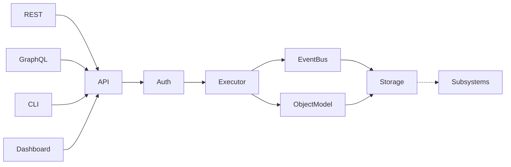

# Nova Runtime

[](LICENSE)
[](https://www.rust-lang.org)
[](#testing)
[](#docker)

**One binary replaces PostgreSQL + Redis + RabbitMQ + Elasticsearch + S3.** Nova Runtime is a single-process, unified backend (SQL, cache, queue, scheduler, search, blob, auth) with one storage engine, one event bus, and consistent REST/GraphQL/CLI access.


```mermaid
graph LR
  REST & GraphQL & CLI & Dashboard --> API --> Auth --> Executor --> EventBus & ObjectModel --> Storage
  Storage -.-> Subsystems
```

## 30-Second Start

```bash
git clone https://github.com/Icarus-afk/Nova-Runtime.git && cd Nova-Runtime
make setup && make dev
# Backend  http://127.0.0.1:8642/health  GraphQL http://127.0.0.1:8642/graphql
# Dashboard http://127.0.0.1:5173  (admin/admin123)
```

Verify:

```bash
curl http://127.0.0.1:8642/health | jq
./target/debug/novactl sql query "SELECT 1"
NOVA_URL=http://127.0.0.1:8642/api/v1 npx tsx examples/quickstart.ts
```

Docker (no Rust needed):

```bash
docker compose up --build
# http://127.0.0.1:8642/health + dashboard at :80 if enabled
```

## What’s Inside

| Subsystem | Endpoint | What it does |
|-----------|----------|--------------|
| **SQL** | `/api/v1/sql` | Tables, JOINs, transactions, `params: [$1]` binding, `limit`/`format` |
| **Cache** | `/api/v1/cache` | TTL, LRU, `pattern` filter (`*`/`?`), batch |
| **Queue** | `/api/v1/queues` | `delay_ms`, `visibility_timeout_ms`, `durable`/`max_length` |
| **Scheduler** | `/api/v1/scheduler` | Cron/interval, `timezone`, `action` payload, `enabled` |
| **Search** | `/api/v1/search` | Index registry with `fields` validation, `offset`/`limit` pagination |
| **Blob** | `/api/v1/blobs` | Multipart + raw, `namespace`, `prefix`/`limit`, SHA256 dedup |
| **Auth** | `/api/v1/auth` | bcrypt, `expires_at` on API keys, 5/min IP rate limit |
| **Event** | internal | Pub/sub, ordering shards, DLQ |

All routes except `/health|/ready|/live|/metrics|/openapi.json|/api/v1/auth/login` require `Authorization: Bearer <token>` (see `crates/nova-api/src/middleware.rs:89`).

## Configuration

No config file needed. Add `novad.toml` only to override defaults (see `docs/configuration.md`):

```toml
[general]
data_dir = "./data"
[networking]
listen_address = "127.0.0.1"
listen_port = 8642
```

Generate full template: `novactl config default > novad.toml` or `make init-config`. Env overrides: `NOVA_NETWORKING__LISTEN_PORT=8642`, `RUST_LOG=debug`.

## CLI & SDK

```bash
# CLI binary is `novactl` (alias `nova` also works for backward compat)
novactl runtime status   # or: nova runtime status
novactl sql query "SELECT * FROM demo"
novactl cache get hello
# SDK (defaults to http://127.0.0.1:8642/api/v1, reads NOVA_URL)
import { fromEnv } from '@novaruntime/sdk';
const nova = fromEnv({ type: 'token', token: process.env.NOVA_TOKEN! });
await nova.db.query('SELECT 1');
```

Binaries: `target/debug/novad` + `target/debug/novactl` (and `target/debug/nova` alias). Build via `make build` (`cargo build -p novad -p nova-cli`) or `cargo run --bin novactl -- --help`.

See `docs/cli.md`, `docs/sdk.md`, `sdk/README.md`.

## Troubleshooting

- `error: no bin target named 'novactl'` → `git pull` then `make build` (fixed in `crates/nova-cli/Cargo.toml:6` — now provides both `novactl` and `nova` bins, `Makefile` uses `-p nova-cli`)
- `port 8642 in use` → `lsof -i :8642` / change `novad.toml` `listen_port`
- `401 Unauthorized` → `novactl` needs `--api-key` or `NOVA_API_KEY`; dashboard auto-redirects to `/login`

## Docs

| Doc | Purpose |
|-----|---------|
| [Getting Started](docs/getting-started.md) | 2-min setup, health checks, first queries |
| [Architecture](docs/architecture.md) | Single storage, event bus, pipeline |
| [Configuration](docs/configuration.md) | `novad.toml` + env + hot reload |
| [API](docs/api.md) | REST + GraphQL, auth, pagination |
| [CLI](docs/cli.md) | `novactl` reference |
| [SDK](docs/sdk.md) | TypeScript SDK + examples |
| [Deployment](docs/deployment.md) | systemd, Docker, TLS via nginx |
| [Development](docs/development.md) | `make` targets, tests, `cargo` |
| [Compile Report](docs/compile-report.md) | Clean `cargo check` + 122 + 34 tests green |

## Development

```bash
make setup        # debug builds novad+novactl, npm install, creates novad.toml
make dev          # runs novad (8642) + vite (5173)
make test         # cargo + sdk + dashboard builds
make fmt && make lint
```

## License

MIT — see `LICENSE`.
