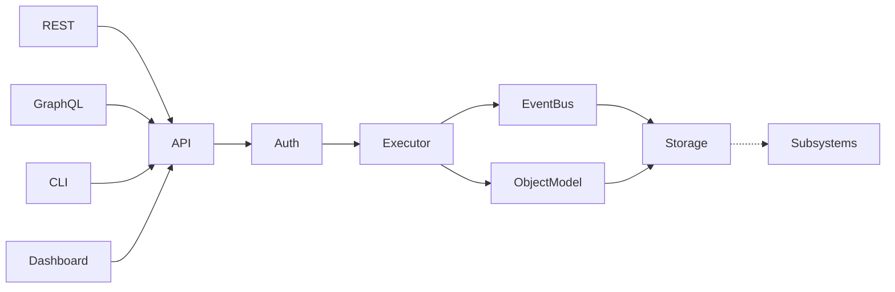

# Nova Runtime

[](LICENSE)
[](https://www.rust-lang.org)
[](#testing)
[](#docker)

**One binary replaces PostgreSQL + Redis + RabbitMQ + Elasticsearch + S3.** Nova Runtime is a single-process, unified backend — SQL, cache, queue, scheduler, search, blob storage, and auth all built in. One storage engine, one event bus, and a consistent REST / GraphQL / CLI / dashboard surface. No separate database daemons, no glue code between services.


```mermaid
graph LR
  REST & GraphQL & CLI & Dashboard --> API --> Auth --> Executor --> EventBus & ObjectModel --> Storage
  Storage -.-> Subsystems
```

> Building a new app? A single `novad` binary is the whole backend. See the [Bloom Market demo](examples/bloom-market/) for a complete, copy-paste example that uses every subsystem. `novad` is the daemon you run; `novactl` is its CLI.

---

## 30-Second Start

```bash
git clone https://github.com/Icarus-afk/Nova-Runtime.git && cd Nova-Runtime
make setup && make dev
# Backend  http://127.0.0.1:8642/health  GraphQL http://127.0.0.1:8642/graphql
# Dashboard http://127.0.0.1:5173
```

Verify:

```bash
curl http://127.0.0.1:8642/health | jq
./target/debug/novactl sql query "SELECT 1"
NOVA_USERNAME=admin NOVA_PASSWORD="YOUR_ADMIN_PASSWORD" npx tsx examples/quickstart.ts
```

Docker (no Rust needed):

```bash
docker compose up --build
# http://127.0.0.1:8642/health + dashboard at :80 if enabled
```

### First login: the admin password

On first boot Nova creates a default **`admin`** user. There is **no hardcoded password**:

- If `NOVA_ADMIN_PASSWORD` is set (recommended), that is the password.
- Otherwise Nova generates a **random** password and prints it once to the log:

  ```
  Bootstrapped default admin user 'admin'. Password: <random> (set NOVA_ADMIN_PASSWORD to override; change after first login)
  ```

Dashboard login: `http://127.0.0.1:5173` → user `admin`, password from the boot log (or your `NOVA_ADMIN_PASSWORD`). The CLI and SDK authenticate with `--api-key` or a login token — see [Auth](#auth) below.

---

## What's Inside

Every subsystem lives behind `/api/v1/*`, shares one storage engine, and is addressable over REST, GraphQL, the `novactl` CLI, the TypeScript SDK, or the dashboard.

| Subsystem | Endpoint | What it does |
|-----------|----------|--------------|
| **SQL** | `/api/v1/sql` | Tables, JOINs, aggregation, `$1` parameter binding, `limit`/`format` |
| **Cache** | `/api/v1/cache` | TTL, LRU eviction, `pattern` filter (`*`/`?`), batch get/set |
| **Queue** | `/api/v1/queues` | Durable FIFO, `delay_ms`, `visibility_timeout_ms`, ACK/poll/purge |
| **Scheduler** | `/api/v1/scheduler` | Cron / interval / one-shot jobs, `timezone`, pause/resume/trigger |
| **Search** | `/api/v1/search` | BM25 full-text index, field schemas (text/boost), pagination |
| **Blob** | `/api/v1/blobs` | Multipart + raw upload, `namespace`, SHA256 content dedup |
| **Auth** | `/api/v1/auth` | Users/roles, bcrypt, API keys with `expires_at`, 5/min IP rate limit |
| **Event** | internal | Pub/sub, ordering shards, DLQ |

### Example: one request per subsystem

All of the following use the same running binary:

```bash
# SQL
curl -s -X POST http://127.0.0.1:8642/api/v1/sql/query -H "Authorization: Bearer $TOKEN" \
  -H 'Content-Type: application/json' -d '{"query":"SELECT * FROM demo"}'

# Cache
curl -s -X POST http://127.0.0.1:8642/api/v1/cache/hello -H "Authorization: Bearer $TOKEN" \
  -H 'Content-Type: application/json' -d '{"value":{"msg":"world"},"ttl_ms":60000}'

# Queue
curl -s -X POST http://127.0.0.1:8642/api/v1/queues/myq/messages -H "Authorization: Bearer $TOKEN" \
  -H 'Content-Type: application/json' -d '{"messages":[{"body":{"hello":"queue"}}]}'

# Search
curl -s -X POST http://127.0.0.1:8642/api/v1/search/indexes/docs/query -H "Authorization: Bearer $TOKEN" \
  -H 'Content-Type: application/json' -d '{"query":"honey","limit":5}'

# Blob (multipart: name=file)
curl -s -X POST "http://127.0.0.1:8642/api/v1/blobs?namespace=img" -H "Authorization: Bearer $TOKEN" \
  -F "file=@photo.jpg"

# Scheduler
curl -s -X POST http://127.0.0.1:8642/api/v1/scheduler/jobs -H "Authorization: Bearer $TOKEN" \
  -H 'Content-Type: application/json' -d '{"name":"digest","type":"cron","schedule":"0 9 * * *"}'
```

See the [full API doc](docs/api.md) for every endpoint.

---

## Auth

Most routes require `Authorization: Bearer <token>`. **Public (no auth):** `/health`, `/ready`, `/live`, `/openapi.json`, `/api/v1/auth/login`, and `/api/v1/auth/refresh`. Everything else under `/api/v1/*` — plus `/metrics` and `/graphql` — requires a token (see `crates/nova-api/src/middleware.rs:127`).

```bash
# Get a token
TOKEN=$(curl -s -X POST http://127.0.0.1:8642/api/v1/auth/login \
  -H 'Content-Type: application/json' \
  -d '{"username":"admin","password":"'"$NOVA_ADMIN_PASSWORD"'"}' | jq -r .access_token)

# Use it
curl -s http://127.0.0.1:8642/api/v1/cache/foo -H "Authorization: Bearer $TOKEN"
```

- Login is rate-limited to **5 attempts/min per IP** → `429` with `retry_after_secs`.
- Tokens expire (`expires_in` seconds; refresh via `/api/v1/auth/refresh`).
- API keys (create via `POST /api/v1/auth/api-keys`) can be sent as `X-API-Key` and may set an `expires_at`.

---

## Configuration

No config file needed — Nova runs out of the box. Add `novad.toml` only to override defaults (see [docs/configuration.md](docs/configuration.md)):

```toml
[general]
data_dir = "./data"
[networking]
listen_address = "127.0.0.1"
listen_port = 8642
```

Generate the full commented template: `novactl config default > novad.toml` or `make init-config`. Env overrides use double underscores for nesting: `NOVA_NETWORKING__LISTEN_PORT=8642`, `RUST_LOG=debug`. Changes reload on `SIGHUP` or `novactl config set`.

---

## CLI (`novactl`)

The CLI binary is **`novactl`** (built by `make setup` at `target/debug/novactl`). Global flags:

```bash
novactl --config PATH    # path to novad.toml (some commands)
novactl --output table|json|yaml
novactl --address http://127.0.0.1:8642   # or NOVA_URL / NOVA_API_URL env
novactl --api-key nr_xxx                  # or NOVA_API_KEY env (sent as X-API-Key)
```

```bash
novactl runtime status            # daemon status
novactl sql query "SELECT * FROM demo"
novactl cache get hello
novactl queue publish myq '{"hello":1}'
novactl scheduler list
```

Subcommands: `runtime`, `config`, `auth`, `queue`, `scheduler`, `search`, `blob`, `sql`, `db`, `cache`, `completion`, `run`. Full reference in [docs/cli.md](docs/cli.md).

---

## SDK

`@novaruntime/sdk` (TypeScript) wraps the REST API with typed clients:

```ts
import { fromEnv } from '@novaruntime/sdk';
const nova = fromEnv({ type: 'token', token: process.env.NOVA_TOKEN! });
await nova.db.query('SELECT 1');
await nova.cache.set('k', { v: 1 }, { ttlMs: 60000 });
await nova.queue.create('myq');
```

Defaults to `http://127.0.0.1:8642/api/v1` (reads `NOVA_URL`). See [docs/sdk.md](docs/sdk.md) and [examples/quickstart.ts](examples/quickstart.ts). You can also write a plain Node client with `fetch` in ~80 lines — copy `examples/bloom-market/src/nova.js`.

---

## SQL Language Notes

Nova ships a real SQL engine, not a key-value shim. It intentionally keeps its surface small and predictable. The two rules below are the ones most likely to surprise you on a first project:

- **Bare column names only.** Qualifiers are not supported — write `seller_id = sid`, not `listings.seller_id = sellers.id`.
- **No `IF EXISTS` / `IF NOT EXISTS`.** Use plain `CREATE TABLE`, plain `DROP TABLE <name>` (dropping a missing table errors — guard it), and create indexes/users idempotently where needed.

That last point matters for JOINs: both tables' columns are flattened, so **join keys must have distinct names across the two tables**. A common pattern is to keep primary keys unique per table:

```sql
CREATE TABLE sellers (sid INTEGER PRIMARY KEY, username TEXT, stall TEXT);
CREATE TABLE listings (id INTEGER PRIMARY KEY, seller_id INTEGER, title TEXT, price REAL);
SELECT title, stall FROM listings JOIN sellers ON seller_id = sid;
```

Full parser rules and current features (JOIN, GROUP BY/HAVING, ORDER BY alias/ordinal, aggregation, `$1` params) are covered in [docs/api.md](docs/api.md#sql-api-v1sql).

---

## Troubleshooting

- **`error: no bin target named 'novactl'`** → `git pull` then `make build`. The CLI crate (`crates/nova-cli/Cargo.toml`) provides the `novactl` bin.
- **Port 8642 in use** → `lsof -i :8642` to find the old process and kill it, or change `listen_port` in `novad.toml`. `make dev` warns but will not kill an existing instance.
- **`401 Unauthorized` / login rejected** → the password is whatever was set at first boot (`NOVA_ADMIN_PASSWORD` or the random one in the boot log). It is *not* a hardcoded default. Reboot with `NOVA_ADMIN_PASSWORD="..." make dev` after `rm -rf data` to reset.
- **`429 too many login attempts`** → login is rate-limited to 5/min per IP; wait for `retry_after_secs`.
- **`expected From, got Dot` (SQL)** → you used a qualified column (`table.col`). Use bare column names.

---

## Demo Projects

| Project | What it demonstrates |
|---------|----------------------|
| [Bloom Market — fresh project template](examples/bloom-market/) | A marketplace exercise of **every** subsystem in one flow: SQL (JOIN/GROUP BY), BM25 search, TTL cache (cart), durable queue (orders), cron scheduler, blob (photos), auth. Best starting point for a new app. |
| [Taskboard (kanban)](examples/taskboard/) | Trello-style board: projects/tasks/comments, hot-task cache, notification queues, due-date scheduler, search index, attachments. |

Both are run with `npm run seed && npm run dev` once Nova is up; all state lives in Nova's `./data`.

---

## Docs

| Doc | Purpose |
|-----|---------|
| [Getting Started](docs/getting-started.md) | 2-min setup, health checks, first queries |
| [Architecture](docs/architecture.md) | One storage engine, event bus, execution pipeline |
| [Configuration](docs/configuration.md) | `novad.toml` + env + hot reload |
| [API](docs/api.md) | Full REST reference: auth, SQL, cache, queue, scheduler, search, blob, GraphQL, errors |
| [CLI](docs/cli.md) | `novactl` subcommand reference |
| [SDK](docs/sdk.md) | TypeScript SDK + examples |
| [Deployment](docs/deployment.md) | systemd, Docker, TLS via nginx |
| [Development](docs/development.md) | `make` targets, tests, adding a subsystem |

---

## Development

```bash
make setup        # debug builds novad+novactl, npm install, creates novad.toml
make dev          # runs novad (8642) + vite (5173)
make test         # cargo + sdk + dashboard builds
make fmt && make lint
```

Tests: `cargo test -p nova-storage --lib` (123), `cargo test -p nova-api --lib` (45) + `--test startup_shutdown` (6), `cargo test -p nova-sql --test sql_integration` (42). See [docs/development.md](docs/development.md).

---

## License

MIT — see `LICENSE`.