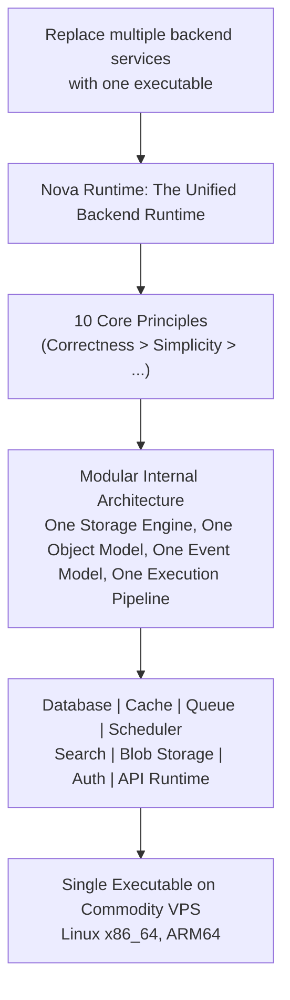
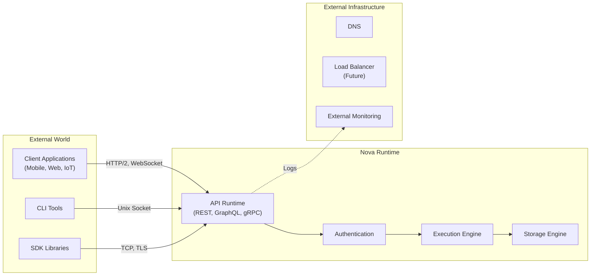
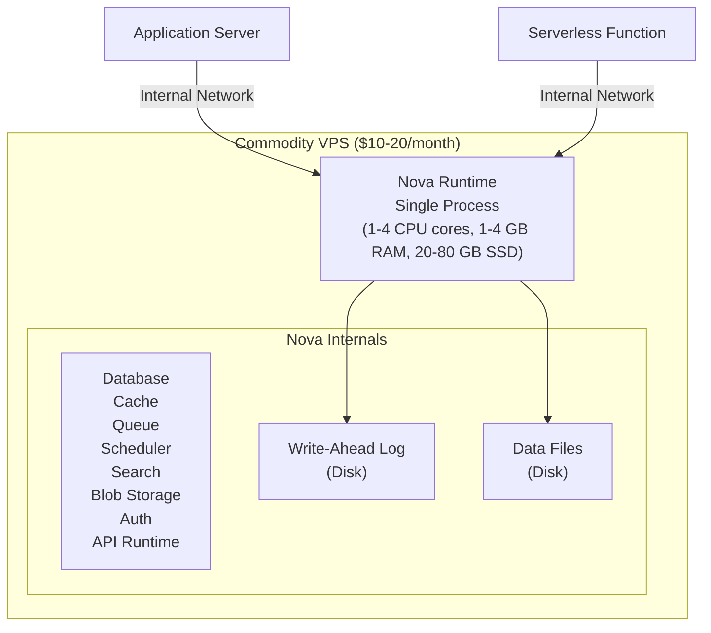
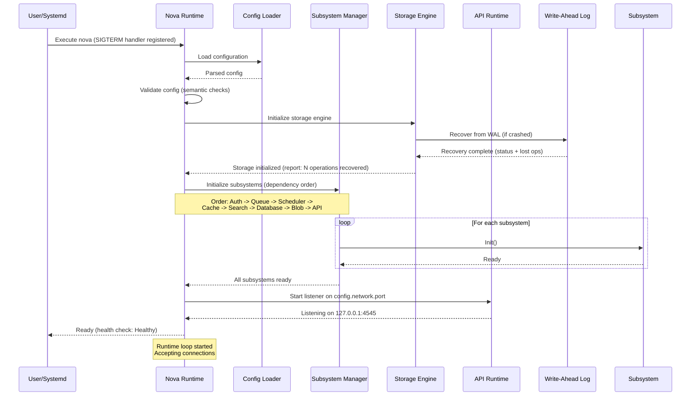
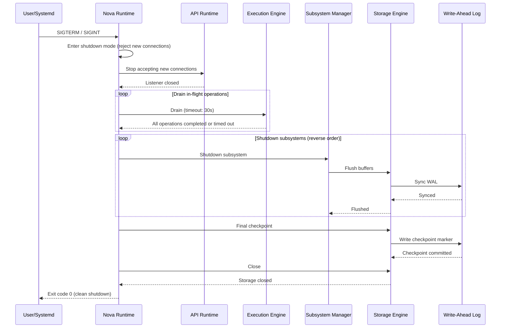
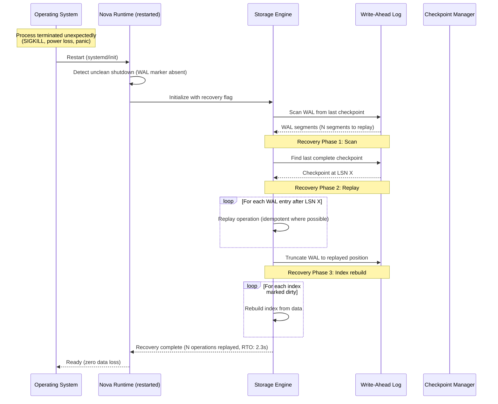

# 01 - Project Vision

## 1. Purpose

This document defines the long-term vision, mission, success criteria, and system boundaries for Nova Runtime. It serves as the north star for all architectural decisions, ensuring every subsystem aligns with the unified vision of a single-executable backend runtime.

## 2. Scope

This document covers:

- The mission statement and long-term vision for Nova Runtime
- Success criteria with measurable targets
- System boundaries: what Nova Runtime is and is not
- Motivation for unifying eight infrastructure services into one executable
- Target hardware profile and deployment model
- Problems solved and problems explicitly not solved
- Stakeholder analysis
- Competitive landscape and differentiation strategy
- Release roadmap and maturity model

This document does NOT cover:

- Detailed architecture of any subsystem (delegated to subsystem documents)
- Implementation details or code structure
- Specific API designs or data formats
- Testing or deployment strategies (delegated to later documents)

## 3. Responsibilities

The Project Vision document is responsible for:

- Articulating a clear, compelling vision that guides all subsequent design decisions
- Defining measurable success criteria that can be validated against
- Establishing system boundaries so engineers know what to build and what to reject
- Providing the rationale for unification to justify the architecture choices
- Documenting target hardware so performance budgets can be calculated
- Aligning stakeholders on what Nova Runtime will and will not do

## 4. Non Responsibilities

This document does NOT:

- Define specific technology stack choices (language, libraries, etc.)
- Specify API contracts or data formats
- Estimate development timelines or resource allocation
- Define team structure or development process
- Serve as a marketing document (all claims must be technically substantiated)

## 5. Architecture

### 5.1 Vision Pyramid



### 5.2 System Boundary Context



### 5.3 Target Deployment Topology



## 6. Data Structures

### 6.1 Success Criteria Record

```rust
struct SuccessCriteria {
    // Performance targets
    cache_p99_read_latency_us: u32,         // < 10,000 (10ms)
    cache_p50_read_latency_us: u32,          // < 500  (0.5ms)
    indexed_query_p99_latency_us: u32,       // < 50,000 (50ms)
    indexed_query_p50_latency_us: u32,       // < 5,000 (5ms)
    throughput_ops_per_second: u32,          // > 10,000
    throughput_write_ops_per_second: u32,    // > 2,000
    blob_throughput_mbps: u32,               // > 100
    max_concurrent_connections: u32,         // > 500
    
    // Reliability targets
    data_loss_on_clean_shutdown: bool,       // false (zero data loss)
    crash_recovery_max_seconds: u32,         // < 5
    max_annual_downtime_seconds: u32,        // < 3600 (one 9 of availability)
    rpo_seconds: u32,                        // < 1 (recovery point objective)
    rto_seconds: u32,                        // < 10 (recovery time objective)
    
    // Resource targets
    max_memory_mb: u32,                      // 1024 (idle), 2048 (peak)
    max_disk_gb: u32,                        // 80
    max_cpu_cores: u8,                       // 4
    cpu_usage_idle_percent: u8,              // < 5
    cpu_usage_loaded_percent: u8,            // < 80
    
    // Scale targets
    max_documents: u64,                      // 10,000,000
    max_collections: u32,                    // 10,000
    max_blob_size_mb: u32,                   // 10240
    max_queue_depth: u32,                    // 100,000
    max_scheduled_jobs: u32,                 // 50,000
    max_users: u32,                          // 10,000
}
```

### 6.2 Hardware Target Profile

```rust
struct HardwareProfile {
    tier: HardwareTier,  // Minimum, Recommended, Maximum
    
    // CPU
    cpu_architecture: CpuArch,     // x86_64 or ARM64
    cpu_min_cores: u8,             // 1
    cpu_rec_cores: u8,             // 2
    cpu_max_cores: u8,             // 4
    cpu_min_ghz: f32,              // 2.0
    cpu_rec_ghz: f32,              // 2.5
    cpu_cache: String,             // "L3 8MB+"
    
    // Memory
    ram_min_mb: u32,               // 1024
    ram_rec_mb: u32,               // 2048
    ram_max_mb: u32,               // 4096
    
    // Storage
    disk_min_gb: u32,              // 20
    disk_rec_gb: u32,              // 40
    disk_max_gb: u32,              // 80
    disk_type: DiskType,           // SSD (NVMe preferred), HDD not supported
    disk_iops_min: u32,            // 2000
    disk_iops_rec: u32,            // 5000
    disk_throughput_min_mbps: u32, // 100
    disk_throughput_rec_mbps: u32, // 300
    
    // Network
    network_bandwidth_mbps: u32,   // 1000 (gigabit)
    network_lan: bool,             // true
    network_public_ip: bool,       // true (optional)
    
    // OS
    os: Vec<OsType>,               // [Linux (kernel 5.4+)], Windows/macOS not supported
    filesystem: String,            // "ext4 or XFS"
    swap: bool,                    // false (swap must be disabled or not used)
}
```

### 6.3 Stakeholder Requirements Matrix

```rust
struct StakeholderRequirement {
    stakeholder: Stakeholder,      // SoloDeveloper, Startup, Enterprise, Platform
    priority: Priority,            // Critical, High, Medium, Low
    need: String,                  // "Single binary deployment"
    constraint: String,            // "Must run on $10 VPS"
    success_metric: String,        // "Deploy in under 60 seconds"
    
    enum Stakeholder {
        SoloDeveloper,             // Single developer building side projects
        Startup,                   // Small team, limited infrastructure budget
        Enterprise,                // Internal tools, departmental deployment
        PlatformTeam,              // Providing runtime for multiple applications
        EmbeddedSystems,           // IoT, edge computing (future)
    }
    
    enum Priority {
        Critical,    // Must have for any viable product
        High,        // Must have for production readiness
        Medium,      // Should have for competitive parity
        Low,         // Nice to have for differentiation
    }
}
```

### 6.4 Release Maturity Model

```rust
enum MaturityLevel {
    Alpha,           // Internal testing, core subsystems functional
    Beta,            // Public preview, feature-complete, performance not tuned
    ReleaseCandidate,// Production-ready, performance targets met, limited support
    Stable,          // Production-grade, full support, SLA commitments
    Mature,          // Enterprise-ready, advanced features, ecosystem tooling
}

struct MaturityCriteria {
    level: MaturityLevel,
    // Alpha criteria
    storage_engine_basic: bool,      // Write, read, delete documents
    execution_engine_basic: bool,    // Execute commands, basic validation
    one_subsystem_complete: bool,    // At least one subsystem fully functional
    
    // Beta criteria
    all_subsystems_functional: bool, // All 8 subsystems present
    basic_recovery: bool,            // Crash recovery functional
    auth_integration: bool,          // Authentication integrated
    basic_cli: bool,                 // CLI tool functional
    
    // RC criteria
    performance_targets_met: bool,   // All success criteria targets met
    fuzz_testing_passed: bool,       // 24h fuzz testing no panics
    security_audit_passed: bool,     // Third-party security audit
    docs_complete: bool,             // All 30 documents complete
    
    // Stable criteria
    production_deployments: u32,     // > 100 production deployments
    benchmark_suite: bool,           // Automated benchmarking
    migration_guides: bool,          // Upgrade paths documented
    
    // Mature criteria
    clustering_preview: bool,        // Multi-node clustering in preview
    sdk_languages: u8,               // > 5 official SDK languages
    enterprise_sso: bool,            // SAML, OIDC, LDAP integration
    audit_logging: bool,             // Complete audit trail
}
```

## 7. Algorithms

### 7.1 Capability Assessment Algorithm

The following algorithm determines whether Nova Runtime is the right solution for a given use case. This is used during the design phase to evaluate feature requests.

```
FUNCTION EvaluateFit(requirements: Requirements) -> FitScore
    
    // Score each dimension from -2 (antipattern) to +2 (ideal)
    score = 0
    max_score = 0
    
    // Infrastructure consolidation
    IF requirements.separate_services >= 3 THEN
        score += 2  // Strong fit: consolidating 3+ services
    ELSE
        score += 1  // Still beneficial
    END IF
    max_score += 2
    
    // Deployment model
    IF requirements.deployment == SingleBinary THEN
        score += 2
    ELSE IF requirements.deployment == DockerImage THEN
        score += 1
    ELSE IF requirements.deployment == Kubernetes THEN
        score -= 1  // Overkill - just use dedicated services
    END IF
    max_score += 2
    
    // Scale requirements
    IF requirements.expected_throughput <= 10000 THEN
        score += 2  // Sweet spot
    ELSE IF requirements.expected_throughput <= 50000 THEN
        score += 1  // Possible with hardware upgrade
    ELSE
        score -= 1  // Beyond target scale
    END IF
    max_score += 2
    
    // Consistency requirements
    IF requirements.consistency == Strong THEN
        score += 2  // Nova guarantees strong consistency
    ELSE IF requirements.consistency == Eventual THEN
        score += 0  // Works but doesn't leverage strength
    END IF
    max_score += 2
    
    // Data model
    IF requirements.data_model == Document THEN
        score += 2  // Native model
    ELSE IF requirements.data_model == Relational THEN
        score += 1  // Supported via SQL layer
    ELSE IF requirements.data_model == Graph THEN
        score -= 1  // Not designed for this
    END IF
    max_score += 2
    
    fit_percentage = CLAMP(score / max_score * 100, 0, 100)
    
    RETURN FitScore {
        percentage: fit_percentage,
        recommendation: {
            >= 80: "Excellent fit. Nova Runtime is ideal for this use case.",
            >= 50: "Good fit. Some compromises required.",
            >= 20: "Marginal fit. Consider alternative solutions.",
            < 20: "Poor fit. Nova Runtime is not designed for this."
        }[fit_percentage],
        concerns: IDENTIFY_CONCERNS(requirements)
    }
END FUNCTION
```

### 7.2 Hardware Sizing Algorithm

```
FUNCTION SizeHardware(
    expected_documents: u64,
    avg_document_size_bytes: u32,
    expected_users: u32,
    expected_throughput_ops: u32,
    blob_storage_gb: u32
) -> HardwareProfile

    // Memory calculation
    // Working set: index metadata + frequently accessed documents
    // Assume 10% of documents are in working set
    working_set_documents = expected_documents * 0.10
    document_index_overhead = expected_documents * 256     // 256 bytes per document index entry
    working_set_data = working_set_documents * avg_document_size_bytes
    internal_overhead = 128 * 1024 * 1024                   // 128 MB base overhead
    cache_allocation = 256 * 1024 * 1024                    // 256 MB cache buffer
    
    required_ram = document_index_overhead + working_set_data + internal_overhead + cache_allocation
    
    // CPU calculation
    // Each operation: ~100μs CPU time (estimated)
    required_cores = CEIL(expected_throughput_ops * 0.0001 / 0.7)  // 0.7 utilization target
    
    // Disk calculation
    document_storage = expected_documents * avg_document_size_bytes
    index_storage = expected_documents * 512               // 512 bytes indexes per document
    wal_overhead = document_storage * 0.2                   // 20% WAL overhead
    blob_storage_bytes = blob_storage_gb * 1024 * 1024 * 1024
    binary_size = 50 * 1024 * 1024                          // 50 MB binary
    temp_space = 1024 * 1024 * 1024                         // 1 GB temp space
    
    required_disk = document_storage + index_storage + wal_overhead + 
                    blob_storage_bytes + binary_size + temp_space
    
    // Round up to tier
    RETURN MATCH (required_ram, required_cores, required_disk) TO HardwareTier
    
END FUNCTION
```

### 7.3 Success Validation Protocol

This is the algorithm for validating that Nova Runtime meets its success criteria during benchmarking.

```
FUNCTION ValidateSuccessCriteria(config: BenchmarkConfig) -> ValidationReport
    
    report = ValidationReport { passed: 0, failed: 0, warnings: 0, details: [] }
    
    // 1. Throughput test
    throughput = RUN_THROUGHPUT_TEST(
        duration_seconds: 300,
        ramp_up_seconds: 30,
        operations: [Read, Write, Query, Delete],
        mix: {Read: 0.50, Write: 0.20, Query: 0.20, Delete: 0.10}
    )
    IF throughput.ops_per_second >= 10000 THEN
        report.passed++
        report.details.push("Throughput: " + throughput.ops_per_second + " ops/s (>=10000)")
    ELSE
        report.failed++
        report.details.push("Throughput: " + throughput.ops_per_second + " ops/s (<10000)")
    END IF
    
    // 2. Cache latency
    cache_latency = RUN_CACHE_LATENCY_TEST(
        operations: 100000,
        value_sizes: [64, 256, 1024, 4096]
    )
    IF cache_latency.p99_us <= 10000 THEN
        report.passed++
    ELSE
        report.failed++
    END IF
    
    // 3. Indexed query latency
    query_latency = RUN_QUERY_LATENCY_TEST(
        queries: 10000,
        dataset_size: 1000000,
        index_types: [Hash, BTree, FullText]
    )
    IF query_latency.p99_us <= 50000 THEN
        report.passed++
    ELSE
        report.failed++
    END IF
    
    // 4. Data loss test
    data_loss = RUN_CLEAN_SHUTDOWN_TEST(
        iterations: 10,
        operations_before_shutdown: 10000
    )
    IF data_loss.documents_lost == 0 THEN
        report.passed++
    ELSE
        report.failed++
    END IF
    
    // 5. Crash recovery
    crash = RUN_CRASH_RECOVERY_TEST(
        scenarios: [SigKill, PowerLoss, Panic, OOM],
        operations_before_crash: 50000
    )
    IF crash.max_recovery_time_s <= 5 AND crash.documents_lost == 0 THEN
        report.passed++
    ELSE
        report.failed++
    END IF
    
    // 6. Memory budget
    memory = RUN_MEMORY_TEST(
        duration_hours: 24,
        operations_per_second: 5000
    )
    IF memory.peak_mb <= 2048 THEN
        report.passed++
    ELSE
        report.failed++
    END IF
    
    RETURN report
END FUNCTION
```

## 8. Interfaces

### 8.1 Nova Runtime Entry Point

```rust
/// The main entry point for Nova Runtime.
/// 
/// # Parameters
/// - `config_path`: Path to configuration file (TOML/YAML/JSON)
/// - `mode`: RuntimeMode { Server, Init, Validate, Check, Version }
/// - `log_level`: LogLevel { Trace, Debug, Info, Warn, Error }
/// 
/// # Returns
/// - `ExitCode::Success(0)` on clean startup and shutdown
/// - `ExitCode::ConfigError(1)` if configuration is invalid
/// - `ExitCode::InitError(2)` if initialization fails
/// - `ExitCode::RuntimeError(3)` if runtime encounters fatal error
/// - `ExitCode::ResourceError(4)` if resource limits exceeded
/// 
/// # Process Lifecycle
/// 1. Parse CLI arguments
/// 2. Load and validate configuration
/// 3. Initialize subsystems in dependency order
/// 4. Start execution engine
/// 5. Begin accepting connections
/// 6. Run event loop until shutdown signal
/// 7. Graceful shutdown in reverse dependency order
/// 8. Flush all buffers
/// 9. Exit
fn nova_runtime_main(config_path: &str, mode: RuntimeMode, log_level: LogLevel) -> ExitCode;

enum RuntimeMode {
    Server,     // Normal operation
    Init,       // Initialize storage and exit
    Validate,   // Validate config and exit
    Check,      // Health check and report
    Version,    // Print version and exit
}

enum ExitCode {
    Success = 0,
    ConfigError = 1,
    InitError = 2,
    RuntimeError = 3,
    ResourceError = 4,
    SignalTerminated = 130,
}
```

### 8.2 Configuration Interface

```rust
/// Top-level configuration structure.
/// All fields have sensible defaults except `storage.path`.
/// 
/// # Constraints
/// - `storage.path` must be writable
/// - `network.port` must be 1024-65535 (privileged ports require capability)
/// - `resources.memory_limit_mb` must be >= 256
/// - `resources.disk_limit_mb` must be >= 1024
struct RuntimeConfig {
    /// General runtime identification
    instance_name: String,                  // Default: "nova"
    instance_id: Uuid,                      // Auto-generated if not provided
    
    /// Storage configuration
    storage: StorageConfig {
        path: PathBuf,                      // Required: path to data directory
        wal_path: Option<PathBuf>,          // Optional: separate WAL path
        max_size_mb: u64,                   // Default: 40960 (40 GB)
        compression: CompressionType,       // Default: None (options: None, LZ4, Zstd)
    },
    
    /// Network configuration
    network: NetworkConfig {
        host: String,                       // Default: "127.0.0.1"
        port: u16,                          // Default: 4545
        tls: Option<TlsConfig>,             // Optional TLS configuration
        max_connections: u32,               // Default: 1024
        connection_timeout_seconds: u32,    // Default: 30
        idle_timeout_seconds: u32,          // Default: 300
    },
    
    /// Resource limits
    resources: ResourceConfig {
        memory_limit_mb: u32,               // Default: 1024
        disk_limit_mb: u64,                 // Default: 40960
        cpu_quota_percent: u8,              // Default: 80 (0 = no limit)
        max_concurrent_operations: u32,     // Default: 256
    },
    
    /// Authentication configuration
    auth: AuthConfig {
        mode: AuthMode,                     // Default: None (options: None, Internal, JWT, OIDC)
        jwt_secret: Option<String>,         // Required if mode = JWT
        oidc_issuer: Option<String>,        // Required if mode = OIDC
        session_timeout_minutes: u32,       // Default: 60
    },
    
    /// Subsystem enablement
    subsystems: SubsystemConfig {
        enable_database: bool,              // Default: true
        enable_cache: bool,                 // Default: true
        enable_queue: bool,                 // Default: true
        enable_scheduler: bool,             // Default: true
        enable_search: bool,                // Default: true
        enable_blob_storage: bool,          // Default: true
        enable_auth: bool,                  // Default: true
        enable_api_runtime: bool,           // Default: true
    },
    
    /// Logging configuration
    logging: LogConfig {
        level: LogLevel,                    // Default: Info
        format: LogFormat,                  // Default: Text (options: Text, JSON)
        output: LogOutput,                  // Default: Stdout
        file_path: Option<PathBuf>,         // Required if output = File
    },
}

enum CompressionType { None, LZ4, Zstd }
enum AuthMode { None, Internal, JWT, OIDC }
enum LogLevel { Trace, Debug, Info, Warn, Error }
enum LogFormat { Text, JSON }
enum LogOutput { Stdout, Stderr, File }
```

### 8.3 Health Check Interface

```rust
/// Health check response returned by the /health endpoint.
struct HealthResponse {
    status: HealthStatus,                   // Healthy, Degraded, Unhealthy
    uptime_seconds: u64,                    // Seconds since process start
    version: String,                        // Semantic version string
    build_info: BuildInfo,                  // Build timestamp, commit hash
    
    // Subsystem health (one per enabled subsystem)
    subsystems: HashMap<SubsystemId, SubsystemHealth>,
    
    // Resource utilization
    resources: ResourceUtilization {
        memory_used_mb: u32,
        memory_available_mb: u32,
        disk_used_mb: u64,
        disk_available_mb: u64,
        cpu_usage_percent: f32,
        open_connections: u32,
        active_operations: u32,
    },
    
    // Storage engine status
    storage: StorageHealth {
        wal_status: WalStatus,             // Healthy, Lagging, Failed
        checkpoint_lag_bytes: u64,
        last_checkpoint_timestamp: u64,
        data_file_count: u32,
        data_file_size_mb: u64,
    },
}

enum HealthStatus { Healthy, Degraded, Unhealthy }
enum WalStatus { Healthy, Lagging, Failed }
enum SubsystemId { Database, Cache, Queue, Scheduler, Search, BlobStorage, Auth, ApiRuntime }

struct SubsystemHealth {
    status: HealthStatus,
    latency_p99_us: u32,
    error_count: u64,
    last_error: Option<String>,
    uptime_seconds: u64,
}
```

## 9. Sequence Diagrams

### 9.1 Nova Runtime Startup Sequence



### 9.2 Graceful Shutdown Sequence



### 9.3 Unplanned Crash Recovery Sequence



## 10. Failure Modes

### 10.1 Failure Mode: Unacceptable Performance

| Attribute | Value |
|-----------|-------|
| **Cause** | Throughput drops below 10,000 ops/s or latency exceeds P99 targets |
| **Detection** | Internal metrics monitoring, health check endpoint |
| **Effect** | User-facing slowdowns, timeouts |
| **Severity** | High |
| **Likelihood** | Medium (under-provisioned hardware, unexpected load spikes) |

**Contributing factors:**
- Hardware below minimum specification
- Bloat in data files requiring compaction
- Memory pressure causing swapping
- CPU contention from other processes
- Network bandwidth saturation

### 10.2 Failure Mode: Data Corruption

| Attribute | Value |
|-----------|-------|
| **Cause** | Hardware fault (bit rot, bad sector), software bug in storage engine |
| **Detection** | Checksum verification on read, periodic scrub |
| **Effect** | Incorrect query results, crashes on corrupted data |
| **Severity** | Critical |
| **Likelihood** | Low (but non-zero with commodity hardware) |

**Contributing factors:**
- Non-ECC memory on commodity VPS
- SSD aging and wear-leveling failures
- Filesystem bugs
- Kernel bugs in specific versions

### 10.3 Failure Mode: Resource Exhaustion

| Attribute | Value |
|-----------|-------|
| **Cause** | Memory, disk, or file descriptor exhaustion |
| **Detection** | Allocation failures, health check warnings |
| **Effect** | Crashes, OOM kills, write failures |
| **Severity** | High |
| **Likelihood** | Medium (unexpected data growth) |

**Contributing factors:**
- Unbounded collection growth
- Large blob storage without lifecycle policies
- Connection leaks
- Memory fragmentation

### 10.4 Failure Mode: Unrecoverable Crash

| Attribute | Value |
|-----------|-------|
| **Cause** | Software bug causing panic/crash before WAL flush |
| **Detection** | Recovery process fails or detects inconsistent state |
| **Effect** | Data loss up to RPO (max 1 second), manual intervention required |
| **Severity** | Critical |
| **Likelihood** | Very Low |

**Contributing factors:**
- Bugs in crash recovery path itself
- Hardware failure during WAL write
- Kernel filesystem bugs with direct I/O

### 10.5 Failure Mode: Security Breach

| Attribute | Value |
|-----------|-------|
| **Cause** | Authentication bypass, injection attack, privilege escalation |
| **Detection** | Audit logs, intrusion detection, anomaly monitoring |
| **Effect** | Unauthorized data access, data exfiltration, service compromise |
| **Severity** | Critical |
| **Likelihood** | Low (with proper mitigations) |

**Contributing factors:**
- Implementation bugs in auth subsystem
- Misconfiguration (e.g., auth disabled in production)
- Supply chain attack on dependencies
- TLS termination issues

### 10.6 Failure Mode: Configuration Error

| Attribute | Value |
|-----------|-------|
| **Cause** | Invalid configuration at startup |
| **Detection** | Config validation failure during init |
| **Effect** | Runtime fails to start |
| **Severity** | Medium |
| **Likelihood** | Medium |

**Contributing factors:**
- Manual configuration errors
- Version mismatch between binary and config
- Filesystem permission issues

## 11. Recovery Strategy

### 11.1 Performance Degradation Recovery

1. **Immediate:** Reject new connections at the API layer, return 503 Service Unavailable
2. **Diagnostic:** Dump internal metrics to log, identify bottleneck subsystem
3. **Automatic:** Trigger compaction if data fragmentation detected
4. **Automatic:** Evict cache entries under memory pressure
5. **Manual:** Operator can trigger index rebuild, increase resource limits, or restart
6. **Escalation:** If degradation persists > 5 minutes, emit alert to monitoring system

### 11.2 Data Corruption Recovery

1. **Detection:** Checksum mismatch logged immediately
2. **Isolation:** Mark affected pages/files as corrupt, redirect reads away
3. **Automatic:** If replica of data exists (WAL has uncheckpointed operations), replay from WAL
4. **Automatic:** Attempt read repair from checksummed WAL entries
5. **Manual:** Operator can restore from backup (external tooling)
6. **Last resort:** Export uncorrupted data, reinitialize, reimport

### 11.3 Resource Exhaustion Recovery

1. **Memory:** Immediately trigger cache eviction, reduce working set
2. **Disk:** Stop accepting write operations, return 507 Insufficient Storage
3. **Memory:** Trigger garbage collection (if applicable)
4. **Memory:** Reject low-priority operations first
5. **Escalation:** Attempt graceful shutdown before OOM killer
6. **Post-recovery:** Operator must investigate root cause, add monitoring

### 11.4 Unrecoverable Crash Recovery

1. **Detection:** Startup recovery process detects inconsistent state
2. **Automatic:** Attempt WAL replay from three checkpoints back
3. **Automatic:** If WAL consistent, replay and continue
4. **Manual:** If WAL also corrupt, initiate emergency restore procedure
5. **Manual:** Engage backup restoration process
6. **Post-recovery:** Root cause analysis, bug fix, regression test added

## 12. Performance Considerations

### 12.1 Performance Budget Breakdown

| Component | CPU Budget | Memory Budget | Latency Budget |
|-----------|-----------|--------------|----------------|
| Storage Engine | 30% | 40% | N/A (foundation) |
| Execution Engine | 15% | 10% | 100μs/op |
| Cache Subsystem | 5% | 20% | 10ms P99 |
| Search Subsystem | 15% | 10% | 50ms P99 |
| Queue Subsystem | 5% | 5% | 20ms P99 |
| Scheduler | 2% | 2% | 100ms P99 |
| Blob Storage | 10% | 3% | 200ms P99 |
| Auth Subsystem | 3% | 2% | 20ms P99 |
| API Runtime | 10% | 5% | 5ms overhead |
| Networking | 5% | 3% | 1ms overhead |

### 12.2 Scaling Characteristics

| Operation | Time Complexity | Memory Complexity | I/O Pattern |
|-----------|----------------|-------------------|-------------|
| Document read (by ID) | O(1) hash lookup | O(1) | Random read (1 page) |
| Document write | O(log N) tree insert | O(1) | Sequential WAL write + random data write |
| Index scan (equality) | O(log N) tree search | O(log N) | Sequential scan of index |
| Index scan (range) | O(log N + K) tree search | O(log N + K) | Sequential scan |
| Full-text search | O(K log N) inverted index | O(result set) | Index read + random doc reads |
| Cache get | O(1) hash lookup | O(1) | Memory read |
| Queue push | O(1) linked list append | O(1) | Sequential WAL write |
| Queue pop | O(1) linked list pop | O(1) | Sequential WAL write |
| Auth verify | O(1) token validation | O(1) | No I/O (cached keys) |
| Blob write | O(N) streaming | O(1) buffer | Sequential write |
| Blob read | O(N) streaming | O(1) buffer | Sequential read |

### 12.3 Target Hardware Benchmarks

| Hardware Tier | CPU | RAM | Disk | Expected Throughput |
|---------------|-----|-----|------|-------------------|
| Minimum | 1 core @ 2.0 GHz | 1 GB | 20 GB SSD | 5,000 ops/s |
| Recommended | 2 cores @ 2.5 GHz | 2 GB | 40 GB SSD | 15,000 ops/s |
| Performance | 4 cores @ 3.0 GHz | 4 GB | 80 GB NVMe | 30,000 ops/s |

### 12.4 Key Performance Drivers

- **Sequential WAL writes** are the bottleneck for write operations. Target: 100MB/s+ sequential write throughput.
- **Index traversals** are CPU-bound for in-memory indexes, I/O-bound for on-disk indexes.
- **Cache hit ratio** directly determines storage engine read load. Target: 90%+ cache hit ratio.
- **Memory-mapped I/O** eliminates copy overhead for large data accesses.
- **Arena allocation** reduces allocation overhead in hot paths.

## 13. Security

### 13.1 Threat Model Overview

| Threat | Attack Vector | Impact | Mitigation |
|--------|--------------|--------|------------|
| Unauthorized access | Network exposed API | Data breach | Auth mandatory by default, TLS required |
| Injection attacks | Query parameters, document fields | Data corruption | Parameterized queries, input validation |
| Privilege escalation | API endpoint manipulation | Full system compromise | Principle of least privilege, RBAC |
| Denial of service | Resource exhaustion | Service unavailability | Connection limits, rate limiting, backpressure |
| Data at rest compromise | Disk theft, VM snapshot | Data breach | Encryption at rest (future), filesystem permissions |
| Man-in-the-middle | Network interception | Credential theft | TLS 1.3 mandatory for remote connections |
| Side channel | Timing attacks | Information disclosure | Constant-time comparison for secrets |
| Supply chain | Malicious dependency | Full system compromise | Dependency audit, minimal dependencies, vendoring |

### 13.2 Security Posture

| Property | Stance |
|----------|--------|
| Authentication | Required by default for network connections |
| Authorization | Role-based access control (RBAC) |
| TLS | Required for remote connections, optional for loopback |
| Secrets management | External via environment/file, never in config |
| Audit logging | All auth events logged |
| Rate limiting | Per-connection and per-user rate limiting |
| Input validation | All inputs validated, maximum sizes enforced |
| Memory safety | Bounds-checked, no unsafe operations in hot path |
| Fuzzing | Continuous fuzz testing of all input parsers |

### 13.3 Security Assumptions

- The host operating system provides process isolation
- The filesystem enforces permission boundaries
- The hardware is trusted (no TPM/secure enclave required)
- Network is TLS-protected between client and Nova Runtime
- Configuration files are secured by the operating system

## 14. Testing

### 14.1 Success Criteria Validation Tests

| Test | Description | Pass/Fail Criteria |
|------|-------------|-------------------|
| Throughput benchmark | Run 300s mixed workload | >= 10,000 ops/s sustained |
| Cache latency benchmark | 100,000 cache operations | P99 latency < 10ms |
| Query latency benchmark | 10,000 indexed queries | P99 latency < 50ms |
| Clean shutdown test | 10 iterations shutdown/restart | Zero data loss |
| Crash recovery test | 5 crash scenarios, 50k ops each | Recovery < 5s, zero data loss |
| Memory stability test | 24h run at 5000 ops/s | Peak memory < 2048 MB |
| Disk limit test | Fill to 95% capacity, verify behavior | Graceful degradation, no crash |

### 14.2 Integration Test Matrix

| Scenario | Database | Cache | Queue | Scheduler | Search | Blob | Auth |
|----------|----------|-------|-------|-----------|--------|------|------|
| All subsystems enabled | ✓ | ✓ | ✓ | ✓ | ✓ | ✓ | ✓ |
| Minimal (DB only) | ✓ | - | - | - | - | - | - |
| DB + Cache | ✓ | ✓ | - | - | - | - | ✓ |
| Queue + Scheduler | - | - | ✓ | ✓ | - | - | ✓ |
| Full read-heavy | ✓ | ✓ | - | - | ✓ | ✓ | ✓ |
| Full write-heavy | ✓ | ✓ | ✓ | ✓ | - | ✓ | ✓ |

### 14.3 Performance Regression Tests

- Daily benchmark run comparing P50/P95/P99/P999 latencies
- Throughput comparison across builds
- Memory allocation profile comparison
- Disk write amplification measurement
- CPU profile comparison

### 14.4 Compatibility Tests

- Startup with empty data directory
- Startup with pre-populated data directory from previous version
- Rolling configuration changes (graceful reload)
- IPv4 and IPv6 connections
- Unix socket connections

## 15. Future Work

### 15.1 Phase 2: Multi-Node Clustering

- Active-passive replication with automatic failover
- Read replicas for horizontal read scaling
- Distributed WAL replication
- Consistent hash-based data sharding
- Raft-based consensus for metadata operations

### 15.2 Phase 3: Advanced Features

- Cross-collection transactions
- Foreign key-like constraints
- Materialized views
- Change data capture (CDC) streams
- Webhook subscriptions on data changes
- Full ACID transactions spanning multiple subsystems

### 15.3 Phase 4: Enterprise

- LDAP/SAML/OIDC enterprise SSO
- Audit logging with tamper-evident chains
- Hardware security module (HSM) integration
- Geographic data residency controls
- Multi-tenancy with resource isolation
- SLA-guaranteed resource reservations

## 16. Open Questions

1. **Language choice trade-offs**: The implementation language has not been selected. This decision affects memory safety guarantees, development velocity, ecosystem availability, and runtime performance. The primary candidates are Rust (memory safety, performance, no GC) and Go (simpler concurrency, faster development, larger GC overhead). A decision document should compare these trade-offs concretely.

2. **SQL compatibility level**: What subset of SQL should Nova Runtime support? Full SQL compliance is thousands of pages of specification. A minimum viable subset must be defined. Trade-off: more compatibility increases implementation complexity, less compatibility limits adoption.

3. **TLS termination model**: Should Nova Runtime terminate TLS directly, or rely on a reverse proxy (nginx, Caddy, Envoy)? Direct TLS simplifies deployment (single binary), but reverse proxy enables advanced features (certificate management, HTTP/2 termination, load balancing). Initial design: optional TLS with external proxy recommended for production.

4. **Blob storage integration**: Should blobs be stored in the same storage engine (simplicity) or mapped to the filesystem (performance)? Storing in the storage engine enables consistent backup and transactional guarantees. Filesystem mapping enables streaming large files without loading into memory. Decision: Use storage engine for metadata and small blobs (< 1MB), filesystem for large blobs.

5. **Authentication scope**: Should auth be per-collection, per-document, or per-operation? Finer-grained auth provides better security but adds complexity and latency. Initial design: per-collection with role-based access.

6. **Configuration format**: TOML vs YAML vs JSON vs custom DSL. TOML is simpler and less error-prone. YAML is more widely used in cloud-native ecosystems. Decision: Support all three with TOML as recommended default.

7. **Observability approach**: Built-in metrics endpoint vs OpenTelemetry export. Built-in is simpler for small deployments. OpenTelemetry is standard for larger ones. Decision: /metrics endpoint in Prometheus format + optional OpenTelemetry export.

## 17. References

### 17.1 Related Projects

- **SQLite**: Single-file database that inspired the simplicity-first approach. Nova Runtime extends this concept beyond databases to include cache, queue, and other backend services.
- **Redis**: In-memory cache and data structure server. Nova Runtime's cache subsystem draws from Redis's design but integrates with the unified storage engine.
- **etcd**: Distributed key-value store with Raft consensus. Nova Runtime's WAL design is inspired by etcd's approach, though Nova Runtime is single-node.
- **FoundationDB**: Distributed database with a layered architecture. Nova Runtime's "one storage engine" principle is similar to FoundationDB's approach.
- **PostgreSQL**: Full-featured relational database. Nova Runtime's SQL layer aims for a practical subset of PostgreSQL compatibility.
- **LiteFS**: Distributed filesystem for SQLite. Similar single-node-then-cluster evolution.
- **Turso**: Distributed SQLite edge database. Similar unified approach to database services.

### 17.2 Academic Papers

- Bernstein, P.A., Newcomer, E. "Principles of Transaction Processing" (2nd ed.)
- Gray, J., Reuter, A. "Transaction Processing: Concepts and Techniques"
- Hellerstein, J.M., et al. "Architecture of a Database System"
- Ousterhout, J. "The RAMCloud Storage System"
- Liskov, B., et al. "Persistence in the Cloud: The Need for a Unified Storage Model"

### 17.3 Standards

- IANA HTTP Status Code Registry
- RFC 7230-7235: HTTP/1.1
- RFC 7540: HTTP/2
- RFC 8446: TLS 1.3
- RFC 7519: JSON Web Token
- RFC 8259: JSON
- ISO/IEC 9075: SQL Standard (subset)
