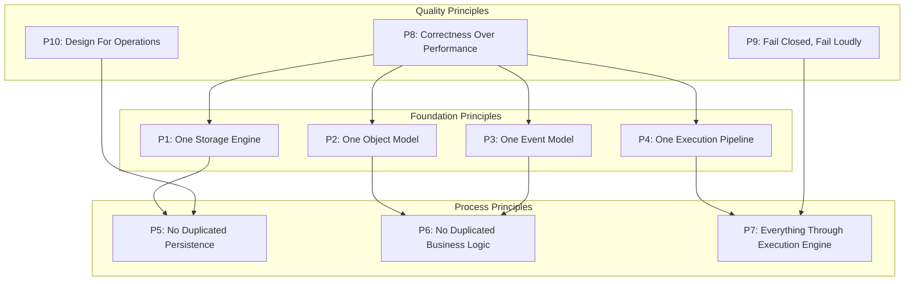
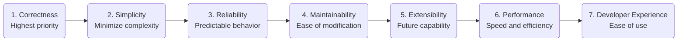
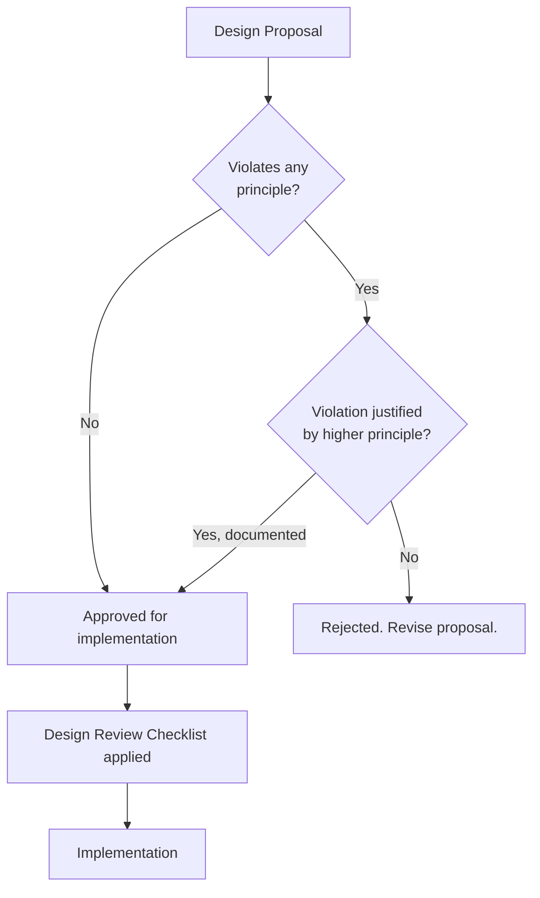
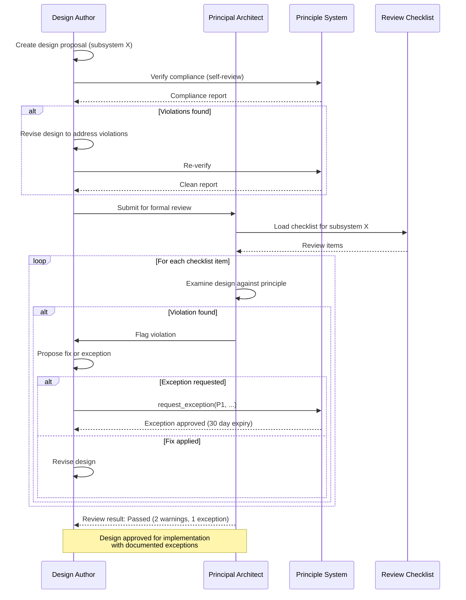
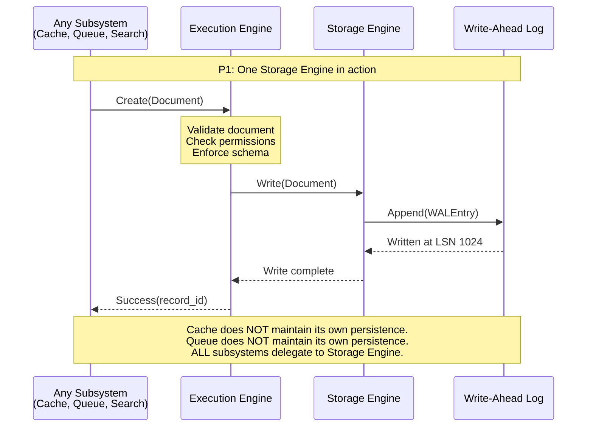
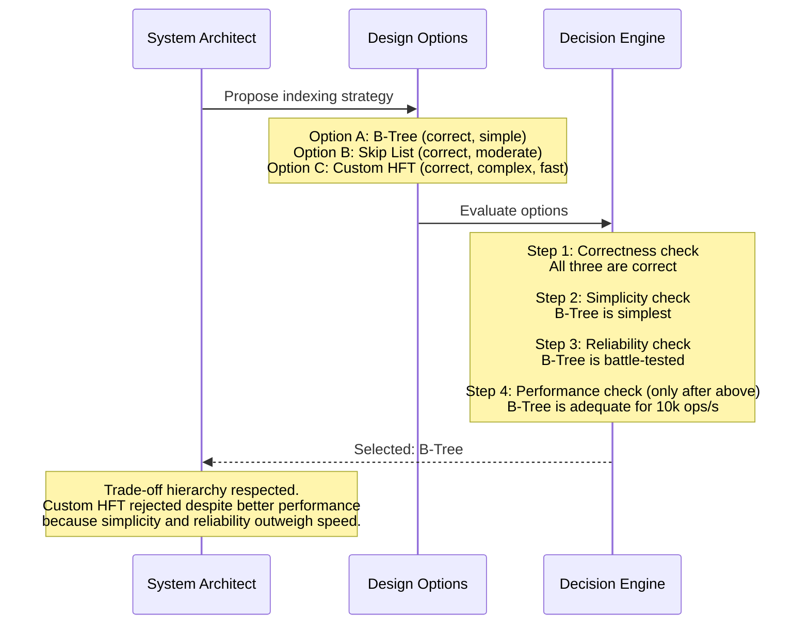

# 02 - Core Principles

## 1. Purpose

This document defines the ten core principles that govern every architectural decision in Nova Runtime. These principles are the immutable foundation of the system. Every subsystem design, every interface contract, every data structure, and every algorithm must conform to these principles. Any proposal that violates a principle must be rejected unless the principle itself is revised through a formal governance process.

## 2. Scope

This document covers:

- The ten core principles with detailed rationale for each
- The trade-off hierarchy and its application in decision-making
- The "One Storage Engine" rule and its implications
- The design review checklist derived from the principles
- Common principle violations and how to detect them
- Examples of principle-compliant and principle-violating designs
- The principle governance and revision process

This document does NOT cover:

- Specific subsystem designs (delegated to subsystem documents)
- Implementation details or coding standards
- Project management or team processes

## 3. Responsibilities

The Core Principles document is responsible for:

- Establishing the immutable architectural foundation of Nova Runtime
- Providing objective criteria for design review decisions
- Preventing architectural drift and principle violations
- Educating all contributors on the reasoning behind design decisions
- Serving as the authoritative reference for resolving design disputes
- Defining what "Nova-like" means in architectural terms

## 4. Non Responsibilities

This document does NOT:

- Specify technology stack or language choices
- Define API contracts or data formats
- Establish project governance or team processes
- Provide implementation guidance
- Replace the trade-off hierarchy for specific design decisions

## 5. Architecture

### 5.1 Principles Overview



### 5.2 Trade-off Hierarchy



### 5.3 Principle Enforcement Flow



## 6. Data Structures

### 6.1 Principle Definition

```rust
/// A core principle of Nova Runtime architecture.
struct Principle {
    /// Unique identifier (P1-P10)
    id: PrincipleId,
    
    /// Short name
    name: String,
    
    /// Category: Foundation, Process, or Quality
    category: PrincipleCategory,
    
    /// Complete statement of the principle
    statement: String,
    
    /// Why this principle exists
    rationale: String,
    
    /// What problems this principle prevents
    prevents: Vec<String>,
    
    /// What trade-offs this principle imposes
    tradeoffs: Vec<Tradeoff>,
    
    /// How to detect violations
    violation_patterns: Vec<String>,
    
    /// Example of compliant design
    compliant_example: String,
    
    /// Example of violating design
    violating_example: String,
}

enum PrincipleId {
    OneStorageEngine,        // P1
    OneObjectModel,          // P2
    OneEventModel,           // P3
    OneExecutionPipeline,    // P4
    NoDuplicatePersistence,  // P5
    NoDuplicateBusinessLogic,// P6
    EverythingThroughEngine, // P7
    CorrectnessOverPerf,     // P8
    FailClosedFailLoudly,    // P9
    DesignForOperations,     // P10
}

enum PrincipleCategory {
    Foundation,  // Structural, immutable
    Process,     // How subsystems interact
    Quality,     // Design behavior and standards
}

struct Tradeoff {
    /// What is given up
    cost: String,
    /// Why the cost is acceptable
    justification: String,
    /// What mitigations exist
    mitigation: Option<String>,
}
```

### 6.2 Design Review Checklist Item

```rust
/// One item in the design review checklist for a subsystem.
struct ReviewChecklistItem {
    /// The principle being checked
    principle_id: PrincipleId,
    
    /// The question the reviewer must answer
    question: String,
    
    /// How to verify compliance
    verification_method: String,
    
    /// What constitutes a violation
    violation_criteria: String,
    
    /// Severity of violation
    severity: ViolationSeverity,
}

enum ViolationSeverity {
    Blocker,    // Must fix before implementation
    Major,      // Should fix, may proceed with documented exception
    Minor,      // Recommend fix, not blocking
}
```

### 6.3 Principle Governance Record

```rust
/// Record of a principle change or exception.
struct PrincipleGovernanceRecord {
    /// Type of action
    action: GovernanceAction,
    
    /// Principle affected
    principle: PrincipleId,
    
    /// Rationale for the change or exception
    rationale: String,
    
    /// Who approved (must be Principal Architect or above)
    approved_by: String,
    
    /// Date of approval
    approval_date: Timestamp,
    
    /// Review date (exceptions must have expiry)
    review_date: Option<Timestamp>,
    
    /// Full context of the decision
    context_document: String,
}

enum GovernanceAction {
    AmendPrinciple,
    GrantException,
    RenewException,
    RevokeException,
}
```

### 6.4 Principle Cross-Reference Matrix

```rust
/// Maps each principle to the subsystems and documents it affects.
struct PrincipleMatrixEntry {
    principle: PrincipleId,
    affected_subsystems: Vec<SubsystemId>,
    affected_documents: Vec<String>,
    related_principles: Vec<PrincipleId>,
    conflicting_principles: Vec<PrincipleId>,
    // Example: OneStorageEngine affects Database, Cache, Queue,
    //          Scheduler, Search, Blob (all storage subsystems)
    //          Related: NoDuplicatePersistence
    //          Conflicting: Performance (slightly, due to indirection)
}
```

## 7. Algorithms

### 7.1 Design Compliance Verification

This algorithm is applied to every design proposal to verify principle compliance.

```
FUNCTION VerifyPrincipleCompliance(proposal: DesignProposal) -> ComplianceReport
    
    report = ComplianceReport { 
        status: Compliant, 
        violations: [],
        warnings: [],
        exceptions: []
    }
    
    // Check all 10 principles
    FOR EACH principle IN ALL_PRINCIPLES:
        IF NOT CHECK_PRINCIPLE(proposal, principle):
            // Check if exception exists
            IF HAS_EXCEPTION(proposal, principle):
                report.exceptions.push(ExceptionToPrinciple {
                    principle: principle,
                    approved: true,
                    expiry: GET_EXCEPTION_EXPIRY(proposal, principle)
                })
                CONTINUE
            END IF
            
            // Check if violation is justified by higher principle
            justification = FIND_HIGHER_PRINCIPLE_JUSTIFICATION(
                proposal, principle, proposal.violated_principle_justifications
            )
            
            IF justification.is_valid:
                report.warnings.push(Warning {
                    principle: principle,
                    message: "Violates " + principle.name + " but justified by " + 
                             justification.justifying_principle.name,
                    severity: "Major"
                })
            ELSE:
                report.violations.push(Violation {
                    principle: principle,
                    severity: principle.severity_if_violated,
                    message: "Unjustified violation of " + principle.name
                })
                report.status = NonCompliant
            END IF
        END IF
    END FOR
    
    RETURN report
END FUNCTION

FUNCTION CHECK_PRINCIPLE(proposal: DesignProposal, principle: Principle) -> Boolean
    
    SWITCH principle.id:
        CASE OneStorageEngine:
            // Does every data model use the storage engine?
            RETURN proposal.data_models.all(|m| m.storage_backend == StorageEngine)
        
        CASE OneObjectModel:
            // Does every subsystem use the same object model?
            RETURN proposal.object_usages.all(|u| u.model == CoreObjectModel)
        
        CASE OneEventModel:
            // Does every subsystem use the same event system?
            RETURN proposal.event_usages.all(|u| u.event_bus == CoreEventBus)
        
        CASE OneExecutionPipeline:
            // Does every operation pass through the execution engine?
            RETURN proposal.operation_paths.all(|p| p.includes(ExecutionEngine))
        
        CASE NoDuplicatePersistence:
            // Is every piece of data persisted in exactly one way?
            RETURN proposal.data_persistence.all(|d| d.storage_locations.len() == 1)
        
        CASE NoDuplicateBusinessLogic:
            // Is every business rule implemented in exactly one place?
            RETURN proposal.business_rules.all(|r| r.implementations.len() == 1)
        
        CASE EverythingThroughEngine:
            // Does every operation go through the execution engine?
            RETURN proposal.operations.all(|o| o.path.contains(ExecutionEngine))
        
        CASE CorrectnessOverPerf:
            // Is correctness preserved even at performance cost?
            RETURN proposal.correctness_guarantees >= proposal.perf_assumptions
        
        CASE FailClosedFailLoudly:
            // On any error, does the system fail closed?
            RETURN proposal.error_handling.all(|e| e.fail_safe == FailClosed)
        
        CASE DesignForOperations:
            // Are observability and operability designed in?
            RETURN proposal.operational_capabilities.all(|c| c.designed_in)
        
    END SWITCH
END FUNCTION
```

### 7.2 Trade-off Decision Algorithm

This algorithm guides design decisions when multiple options exist.

```
FUNCTION ApplyTradeOffHierarchy(options: Vec<DesignOption>) -> DesignOption
    
    // Sort options by correctness
    correct_options = options.filter(o -> o.is_correct)
    
    IF correct_options.is_empty():
        RAISE DesignError("No option satisfies correctness requirement")
    END IF
    
    // Among correct options, pick simplest
    simplest = correct_options.sort_by(o -> o.complexity_score).first()
    
    // Verify reliability
    IF NOT simplest.is_reliable:
        // Check reliability constraints
        reliable = simplest.filter_by_reliability()
        IF reliable:
            simplest = reliable.sort_by_complexity().first()
        END IF
    END IF
    
    // Consider maintainability for tie-breaking
    maintainable = simplest.sort_by_maintainability()
    
    // Only consider performance if all above are equal
    // Performance is never a primary decision factor
    
    RETURN simplest
END FUNCTION

// Complexity scoring function
FUNCTION CalculateComplexityScore(option: DesignOption) -> u32 {
    score = 0
    
    // Number of components
    score += option.components.len() * 10
    
    // Number of interfaces
    score += option.interfaces.len() * 15
    
    // Number of states (higher = more complex)
    score += option.states.len() * 20
    
    // Number of failure modes
    score += option.failure_modes.len() * 25
    
    // Dependencies on external systems
    score += option.external_dependencies.len() * 30
    
    // Configuration surface area
    score += option.config_options.len() * 5
    
    RETURN score
END FUNCTION
```

### 7.3 Principle Violation Detection Algorithm

```
FUNCTION DetectPrincipleViolation(code: SubsystemImplementation) -> Vec<Violation>
    
    violations = []
    
    // P1 Check: Direct file I/O outside storage engine
    FOR EACH file_operation IN code.file_operations:
        IF file_operation.caller NOT IN [StorageEngine, StorageEngineProxy]:
            violations.push(Violation {
                principle: "P1: One Storage Engine",
                location: file_operation.location,
                evidence: "Direct " + file_operation.type + " at " + file_operation.path
            })
        END IF
    END FOR
    
    // P2 Check: Custom serialization format outside object model
    FOR EEach serializer IN code.custom_serializers:
        IF serializer.format NOT IN [CoreObjectModel.supported_formats]:
            violations.push(Violation {
                principle: "P2: One Object Model",
                location: serializer.location,
                evidence: "Custom serializer: " + serializer.format
            })
        END IF
    END FOR
    
    // P3 Check: Custom event system outside event bus
    FOR EACH event_channel IN code.event_channels:
        IF event_channel NOT IN [CoreEventBus.channels]:
            violations.push(Violation {
                principle: "P3: One Event Model",
                location: event_channel.location,
                evidence: "Custom event channel: " + event_channel.name
            })
        END IF
    END FOR
    
    // P4 Check: Bypassing execution engine
    FOR EACH direct_call IN code.direct_calls_to_storage:
        IF NOT direct_call.via_execution_engine:
            violations.push(Violation {
                principle: "P4: One Execution Pipeline",
                location: direct_call.location,
                evidence: "Direct call to storage at " + direct_call.function
            })
        END IF
    END FOR
    
    // P5 Check: Duplicate persistence
    FOR EACH data_type IN code.data_types:
        backends = data_type.persistence_backends
        IF backends.len() > 1:
            violations.push(Violation {
                principle: "P5: No Duplicated Persistence",
                location: data_type.definition,
                evidence: data_type.name + " persisted in " + backends.join(", ")
            })
        END IF
    END FOR
    
    RETURN violations
END FUNCTION
```

## 8. Interfaces

### 8.1 Principle API

```rust
/// Core principles query interface.
trait PrincipleApi {
    /// Get the complete text of a principle.
    fn get_principle(id: PrincipleId) -> Result<Principle, UnknownPrincipleError>;
    
    /// Get all principles.
    fn list_principles(category: Option<PrincipleCategory>) -> Vec<Principle>;
    
    /// Check if a design proposal is compliant with all principles.
    fn verify_compliance(proposal: DesignProposal) -> ComplianceReport;
    
    /// Get the trade-off hierarchy.
    fn get_tradeoff_hierarchy() -> Vec<PriorityLevel>;
    
    /// Request a principle exception.
    fn request_exception(
        principle: PrincipleId,
        rationale: String,
        duration_days: u32,
        reviewer: String,
    ) -> Result<ExceptionRequest, ExceptionError>;
    
    /// Get all active exceptions.
    fn get_active_exceptions(principle: Option<PrincipleId>) -> Vec<PrincipleException>;
    
    /// Get the design review checklist for a subsystem type.
    fn get_review_checklist(subsystem_type: SubsystemType) -> Vec<ReviewChecklistItem>;
}

enum SubsystemType {
    StorageEngine,
    ExecutionEngine,
    ObjectModel,
    EventBus,
    Database,
    Cache,
    Queue,
    Scheduler,
    Search,
    BlobStorage,
    Authentication,
    ApiRuntime,
    Networking,
    Configuration,
    Security,
}
```

### 8.2 Design Review Interface

```rust
/// Design review process interface.
trait DesignReview {
    /// Submit a design for review.
    fn submit_for_review(
        design: DesignDocument,
        checklist: Vec<ReviewChecklistItem>
    ) -> ReviewId;
    
    /// Get review results.
    fn get_review_results(review_id: ReviewId) -> ReviewResults;
    
    /// Check a design element against a specific principle.
    fn check_principle_compliance(
        element: DesignElement,
        principle: PrincipleId
    ) -> ComplianceResult;
    
    /// Generate a violation report for a design.
    fn generate_violation_report(design: DesignDocument) -> ViolationReport;
    
    /// Get the governance history for a principle.
    fn get_principle_history(principle: PrincipleId) -> Vec<GovernanceRecord>;
}

struct ReviewResults {
    review_id: ReviewId,
    status: ReviewStatus,  // Pending, InProgress, Passed, Failed, Conditional
    violations: Vec<Violation>,
    warnings: Vec<Warning>,
    exceptions: Vec<PrincipleException>,
    reviewer: String,
    reviewed_at: Timestamp,
    comments: String,
}

enum ReviewStatus {
    Pending,
    InProgress,
    Passed,
    Failed,
    Conditional,  // Passed with conditions that must be addressed
}
```

## 9. Sequence Diagrams

### 9.1 Design Review Process



### 9.2 One Storage Engine Flow



### 9.3 Trade-off Hierarchy Applied: Indexing Decision



## 10. Failure Modes

### 10.1 Principle Violation: Subsystem-Owned Persistence

| Attribute | Value |
|-----------|-------|
| **Cause** | A subsystem implements its own persistence layer instead of using the storage engine |
| **Detection** | Code review, design review, static analysis of file I/O calls |
| **Effect** | Data fragmentation, inconsistent backup/recovery, duplicated WAL, increased complexity |
| **Severity** | Blocker - design must be rejected |
| **Likelihood** | Medium (common anti-pattern, especially for cache and queue) |

**Example violation:**
> "The Cache subsystem internally uses a HashMap stored to a file. This bypasses the storage engine, meaning cache data is not included in the global WAL, is not recovered on crash, and is not covered by backup procedures."

**Why it happens:**
- Developers are accustomed to Redis (own persistence model)
- Queue subsystems traditionally use dedicated message brokers
- Cache subsystems traditionally manage their own memory and persistence

**Prevention:**
- Design reviews must specifically check for file I/O outside storage engine
- The storage engine must expose efficient APIs for all access patterns
- Performance concerns about storage engine overhead must be benchmarked, not assumed

### 10.2 Principle Violation: Duplicate Business Logic

| Attribute | Value |
|-----------|-------|
| **Cause** | The same validation or transformation logic is implemented in multiple places |
| **Detection** | Code duplication analysis, design review |
| **Effect** | Logic divergence over time, inconsistent behavior, bugs in one copy not fixed in others |
| **Severity** | Major |
| **Likelihood** | High (especially between API layer and execution engine) |

**Example violation:**
> "Document schema validation is implemented in both the REST API handler AND the execution engine. A bug fix to one does not propagate to the other."

**Prevention:**
- All business logic lives in the execution engine
- API layer is a thin proxy that calls the execution engine
- No validation or transformation in API handlers beyond input parsing

### 10.3 Principle Violation: Bypassing Execution Engine

| Attribute | Value |
|-----------|-------|
| **Cause** | A subsystem directly calls the storage engine without going through the execution engine |
| **Detection** | Dependency analysis, code review, runtime monitoring |
| **Effect** | Security checks bypassed, validation skipped, inconsistent state |
| **Severity** | Blocker |
| **Likelihood** | Medium (internal subsystems may try to optimize) |

**Example violation:**
> "The API runtime directly reads from the storage engine to serve GET requests, bypassing authentication and authorization in the execution engine."

**Prevention:**
- Storage engine is visibility-controlled; only execution engine can call it directly
- All external entry points route through execution engine
- Performance concerns addressed by optimizing execution engine, not bypassing it

### 10.4 Principle Erosion

| Attribute | Value |
|-----------|-------|
| **Cause** | Gradual weakening of principles through accumulated exceptions |
| **Detection** | Governance audit, exception expiry tracking |
| **Effect** | System becomes a collection of special cases, complexity grows, principles lose meaning |
| **Severity** | Critical (long-term) |
| **Likelihood** | High over time without governance |

**Prevention:**
- All exceptions have expiry dates (max 90 days)
- Exception review is mandatory before renewal
- Exceptions are documented with clear justification
- Quarterly principle governance audit
- Public dashboard showing active exceptions per principle

### 10.5 Principle Misinterpretation

| Attribute | Value |
|-----------|-------|
| **Cause** | A principle is interpreted differently by different team members |
| **Detection** | Design review disagreements, inconsistent implementations |
| **Effect** | Inconsistent architecture, design disputes, rework |
| **Severity** | Major |
| **Likelihood** | High (especially for abstract principles) |

**Prevention:**
- Each principle has concrete compliant and violating examples
- The glossary defines all terms precisely
- Design review checklist provides specific questions for each principle
- Ambiguities are resolved by the Principal Architect and documented

## 11. Recovery Strategy

### 11.1 Violation Recovery (Design Phase)

If a principle violation is discovered during design review:

1. **Immediate:** Flag the violation and block the design approval
2. **Assessment:** Determine if the violation can be resolved by redesign
3. **Resolution:** Author revises design to eliminate the violation
4. **Verification:** Re-run compliance verification
5. **Exception:** If redesign is impossible, document exception with expiry
6. **Review:** Exception reviewed by Principal Architect

### 11.2 Violation Recovery (Implementation Phase)

If a principle violation is discovered during implementation:

1. **Immediate:** File a blocking issue, do not merge
2. **Impact analysis:** Determine scope of violation
3. **Refactoring plan:** Design changes needed to restore compliance
4. **Re-implementation:** Rewrite affected code
5. **Verification:** Full compliance re-check
6. **Retrospective:** Update design review process to catch this violation earlier

### 11.3 Violation Recovery (Post-Release)

If a principle violation is discovered after release:

1. **Assessment:** Determine severity and impact on running systems
2. **Hotfix:** If security or data integrity issue, prioritize immediate fix
3. **Migration plan:** Plan migration to compliant design
4. **Backward compatibility:** Ensure migration preserves existing data
5. **Rollout:** Deploy fix with appropriate caution
6. **Post-mortem:** Root cause analysis, process improvement

### 11.4 Principle Erosion Recovery

1. **Audit:** Comprehensive audit of all exceptions and violations
2. **Categorization:** Group by principle, severity, and duration
3. **Cleanup:** Attempt to resolve exceptions whose justification has expired
4. **Re-baseline:** Update principle documentation with new examples
5. **Strengthen:** Improve design review process to prevent recurrence
6. **Communicate:** Team education on the findings

## 12. Performance Considerations

### 12.1 Principle Impact on Performance

| Principle | Performance Impact | Mitigation |
|-----------|-------------------|------------|
| P1: One Storage Engine | Indirection adds latency (est. 5-15μs per op) | Storage engine optimized for low overhead, in-process calls |
| P4: One Execution Pipeline | Validation/auth adds latency (est. 20-50μs) | Avoidable by caching auth decisions within a session |
| P7: Everything Through Engine | Cannot bypass for hot paths | Engine designed for minimal overhead, sub-50μs per op |
| P5: No Duplicate Persistence | Eliminates write amplification trade-offs | Positive performance impact from reduced total I/O |

### 12.2 Acceptable Performance Cost of Principles

Each principle is expected to add measurable overhead. The following are the maximum acceptable costs for adhering to each principle:

```rust
struct PrinciplePerformanceBudget {
    principle: PrincipleId,
    max_latency_overhead_us: u32,   // Maximum additional latency per operation
    max_memory_overhead_bytes: u32, // Maximum additional memory per operation
    max_throughput_reduction_pct: u8, // Maximum throughput reduction
    
    // P1: One Storage Engine
    // Latency: 15μs    Memory: 64 bytes    Throughput: 5%
    // Rationale: One extra function call through storage engine API
    
    // P4: One Execution Pipeline  
    // Latency: 50μs    Memory: 256 bytes    Throughput: 10%
    // Rationale: Document validation, permission check, audit logging
    
    // P7: Everything Through Engine
    // Latency: 25μs    Memory: 128 bytes    Throughput: 8%
    // Rationale: Routing, context setup, operation registration
}
```

### 12.3 When Performance Trumps Principles (Exception Criteria)

Performance can justify a principle exception ONLY when:

1. **Measured, not estimated:** Performance data from benchmarks, not intuition
2. **Significant gap:** The performance gap is > 50% (not 5-10%)
3. **Cannot improve engine:** The execution engine cannot be optimized to close the gap
4. **Documented and timeboxed:** Exception with auto-expiry and scheduled re-evaluation
5. **User-visible impact:** The performance difference affects the user-facing success criteria

## 13. Security

### 13.1 Principle Security Implications

| Principle | Security Benefit | Security Risk |
|-----------|-----------------|---------------|
| P1: One Storage Engine | Single point for encryption, access control | Single point of failure for confidentiality |
| P4: One Execution Pipeline | All operations pass auth checks | Bottleneck for auth - must be fast enough |
| P7: Everything Through Engine | No backdoors bypassing security | Engine must be secure against all attack types |
| P9: Fail Closed, Fail Loudly | No silent data loss on errors | May cause availability issues |

### 13.2 Principle-Based Security Requirements

- **No subsystem can bypass the execution engine's security checks.**
  - Any code path that reads or writes data MUST pass through the execution engine.
  - This is enforced at the architecture level, not just convention.
  
- **Fail-closed means no data access on validation failure.**
  - If the execution engine cannot determine authorization, it denies access.
  - If document validation fails, the operation is rejected.
  
- **Fail-loudly means every failure is observable.**
  - All failures produce structured logs.
  - Critical failures trigger alerts.
  - Security-relevant failures are audited.

## 14. Testing

### 14.1 Principle Compliance Tests

| Test | What It Verifies | Frequency |
|------|------------------|-----------|
| No direct file I/O (P1) | Static analysis: no file operations outside storage engine | Per commit |
| Single serialization format (P2) | All data uses core object model serialization | Per commit |
| Single event bus (P3) | No custom event/message passing outside event bus | Per commit |
| Execution pipeline audit (P4) | All operations route through execution engine | Per commit |
| Persistence ownership (P5) | Each data type persisted in exactly one backend | Per commit |
| Logic duplication scan (P6) | No duplicated business rules across subsystems | Per release |
| Engine bypass detection (P7) | Runtime request tracing - all paths through engine | Per integration test |
| Correctness preservation (P8) | Fuzz testing with invariants | Continuous |
| Fail-closed verification (P9) | Error injection - verify closed behavior | Per release |
| Observability audit (P10) | Metrics, logs, traces for every operation | Per release |

### 14.2 Design Review Test Scenarios

| Scenario | Principles Tested | Expected Result |
|----------|------------------|-----------------|
| Cache proposes local HashMap persistence | P1, P5 | Rejected - must use storage engine |
| Queue proposes direct file append for speed | P1, P4, P7 | Rejected - must use storage engine via execution engine |
| API handler validates documents inline | P6 | Warning - logic duplication |
| Search engine proposes custom inverted index | P1, P2, P5 | Rejected - indexes must be in storage engine |
| Scheduler proposes polling a custom table | P4, P7 | Accepted with verification - if via execution engine |

### 14.3 Violation Injection Tests

```
// Test that violations are correctly detected
TEST("P1 Violation Detection") {
    // Create a subsystem that does direct file I/O
    fake_subsystem.direct_file_write("/tmp/test.db", data)
    
    // Verify detection
    violations = DetectPrincipleViolation(fake_subsystem.code)
    ASSERT violations.contains(principle: "P1: One Storage Engine")
    ASSERT violations.count == 1
}

TEST("P4 Violation Detection") {
    // Create a code path that bypasses execution engine
    fake_subsystem.storage.read(document_id)  // Direct call
    
    violations = DetectPrincipleViolation(fake_subsystem.code)
    ASSERT violations.contains(principle: "P4: One Execution Pipeline")
}

TEST("No False Positives") {
    // Storage engine doing file I/O is NOT a violation
    storage_engine.wal.append(entry)
    
    violations = DetectPrincipleViolation(storage_engine.code)
    ASSERT violations.is_empty()
}
```

## 15. Future Work

### 15.1 Automated Principle Enforcement

- Static analysis tool that automatically detects principle violations in code
- CI pipeline integration that rejects PRs with violations
- Runtime principle monitoring that detects violations in production

### 15.2 Principle Evolution

- Formal process for principle amendments based on operational experience
- Versioned principles with migration guides between versions
- Principle maturity model (draft, active, bedrock)

### 15.3 Cross-Project Principles

- Eventual adoption of Nova Runtime principles as standard practice
- Published reference architecture papers
- Integration with other systems that respect the same principles

## 16. Open Questions

1. **Exception governance granularity**: Should exceptions be granted at the subsystem level, operation level, or data type level? Finer granularity is more precise but adds administrative overhead. Initial approach: subsystem level with mandatory expiry.

2. **Principle conflict resolution**: When two principles conflict (e.g., P5 No Duplicate Persistence vs. P8 Correctness Over Performance for caching), how is the conflict resolved? The trade-off hierarchy says P8 > P5, but the nuances need documentation.

3. **Performance budget degradation**: What happens when actual performance overhead of principles exceeds budgets? Do we optimize the engine (good) or relax the principle (bad)? The principle should be: optimize first, exception second.

4. **Principle enforcement for tests**: Should test code be held to the same principles as production code? Test code has different requirements (direct state inspection may be needed). Approach: test utilities can access storage engine directly, but must be in `_test` files only.

5. **Principle documentation maintenance**: How are principles kept up to date with new examples and edge cases discovered during implementation? Proposal: running document with changelog, updated quarterly.

6. **Cross-cutting principle exceptions**: If one subsystem gets a principle exception, does the same exception apply to other subsystems? Or is each exception case-by-case? Precedent-based decision making with documented rationale.

## 17. References

### 17.1 Architectural Principles References

- **Unix Philosophy**: "Do one thing and do it well" - P1, P2, P3 are direct applications
- **PostgreSQL Design Principles**: Extensibility without sacrificing correctness
- **SQLite Design Philosophy**: Simplicity, reliability, and extensive testing (100% MC/DC)
- **Redis Design Principles**: Performance through simplicity, not complexity
- **FoundationDB Architecture**: Single key-value store backing multiple layers (P1 parallel)
- **Erlang/OTP Principles**: Let it crash, supervision trees, fail-fast

### 17.2 Papers and Resources

- Gamma, E., et al. "Design Patterns: Elements of Reusable Object-Oriented Software"
- Brooks, F. "No Silver Bullet — Essence and Accidents of Software Engineering"
- Hohpe, G., Woolf, B. "Enterprise Integration Patterns"
- Fowler, M. "Patterns of Enterprise Application Architecture"
- Humble, J., Farley, D. "Continuous Delivery"
- Nygard, M. "Release It! Design and Deploy Production-Ready Software"

### 17.3 Related Documents

- 01-Project-Vision.md (system boundaries)
- 03-Glossary.md (term definitions)
- 04-Requirements-Analysis.md (derived requirements from principles)
- 05-Domain-Model.md (object model, the P2 manifestation)
- 06-High-Level-Architecture.md (architectural application of principles)
