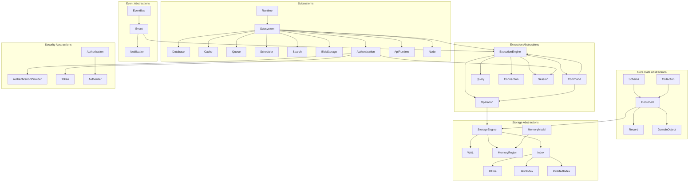
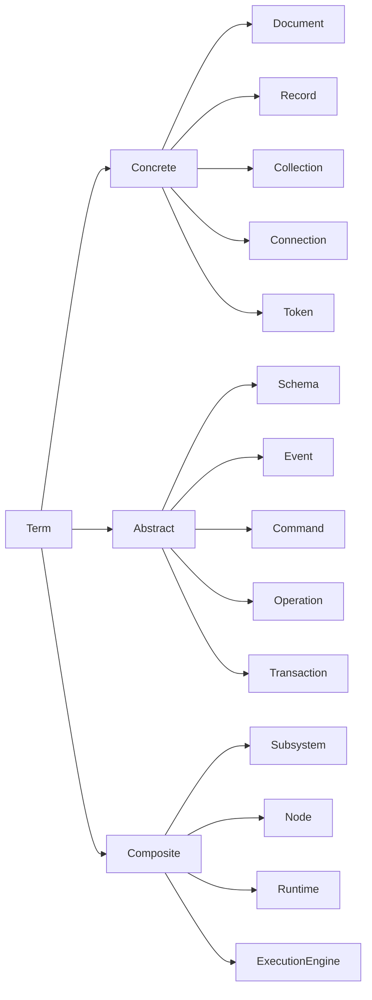
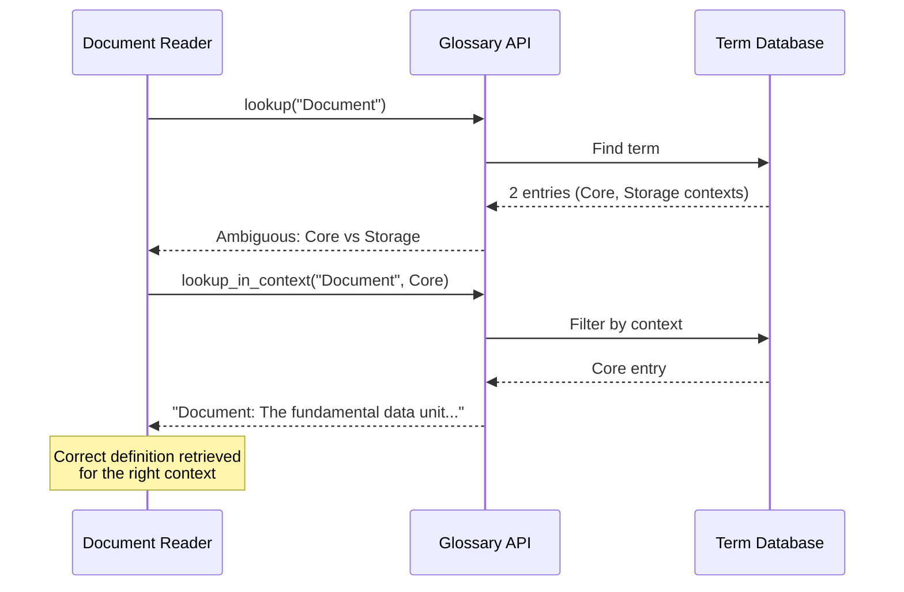
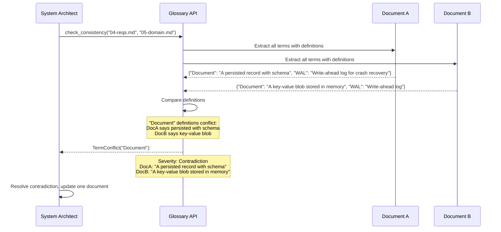

# 03 - Glossary

## 1. Purpose

This document defines every term used throughout the Nova Runtime project with precise, unambiguous definitions. The glossary ensures that all engineers, architects, and stakeholders share the same vocabulary, preventing misinterpretation of requirements, design documents, and code.

## 2. Scope

This document covers:

- Complete definitions of all domain terms used across Nova Runtime
- Naming conventions for types, variables, files, and subsystems
- Acronyms and abbreviations
- Cross-references between related terms
- Term lifecycle (how terms are added, modified, or deprecated)
- Context-specific meanings (when a term has different meanings in different contexts)

This document does NOT cover:

- Implementation-specific variable names (covered by coding standards)
- External technology terms not specific to Nova Runtime
- General software engineering terms (e.g., "function", "variable")

## 3. Responsibilities

The Glossary is responsible for:

- Providing authoritative definitions for all project-specific terminology
- Resolving ambiguity in design discussions and code reviews
- Ensuring consistency across all 30+ architecture documents
- Serving as the onboarding reference for new team members
- Evolving as the system design matures

## 4. Non Responsibilities

This document does NOT:

- Define general programming terms (e.g., class, function, variable)
- Define external protocol or technology terms (e.g., HTTP, TLS, TCP)
- Replace coding style guides or naming conventions for implementation
- Serve as a user-facing dictionary for Nova Runtime end users (separate document)

## 5. Architecture

### 5.1 Term Relationship Map



### 5.2 Term Classification Hierarchy



## 6. Data Structures

### 6.1 Glossary Entry

```rust
/// A single term in the Nova Runtime glossary.
struct GlossaryEntry {
    /// The term being defined (e.g., "Document", "Storage Engine")
    term: String,
    
    /// One-sentence definition
    short_definition: String,
    
    /// Comprehensive definition with all nuances
    full_definition: String,
    
    /// The context in which this term is used
    context: TermContext,
    
    /// Term classification
    classification: TermClassification,
    
    /// Related terms with relationship type
    relationships: Vec<TermRelationship>,
    
    /// Deprecation status
    status: TermStatus,
    
    /// Examples of correct usage
    examples: Vec<String>,
    
    /// Counterexamples of incorrect usage
    counterexamples: Vec<String>,
    
    /// When this term was defined or last revised
    last_updated: Timestamp,
    
    /// Version of the glossary when this term was added
    version_added: SemanticVersion,
}

enum TermContext {
    Core,           // Used across the entire system
    Storage,        // Storage engine and persistence
    Execution,      // Execution engine and operations
    Event,          // Event bus and event handling
    Subsystem,      // One of the 8 subsystems
    Security,       // Authentication and authorization
    Networking,     // Network communication
    Configuration,  // System configuration
    Operations,     // Deployment and operation
}

enum TermClassification {
    Concrete,   // A tangible entity (Document, Connection)
    Abstract,   // A concept or behavior (Event, Transaction)
    Composite,  // A grouping of other entities (Subsystem, Node)
}

enum TermStatus {
    Active,         // Currently in use
    Deprecated,     // Still in use but should not be used in new designs
    Removed,        // No longer part of the system; kept for historical reference
    Draft,          // Proposed but not yet approved
}

struct TermRelationship {
    related_term: String,
    relationship: RelationshipType,
    
    enum RelationshipType {
        IsA,               // Document is a Record
        HasA,              // Collection has Documents
        PartOf,            // Cache is part of Subsystem
        DependsOn,         // Queue depends on StorageEngine
        Produces,          // ExecutionEngine produces Events
        Consumes,          // EventBus consumes Events
        Precedes,          // Operation precedes Event
        Follows,           // Recovery follows Crash
        OppositeOf,        // Read is opposite of Write
        SynonymOf,         // Command is synonym of Operation
        Supersedes,        // Schema V2 supersedes Schema V1
        ConflictsWith,     // Durability conflicts with Performance
    }
}
```

### 6.2 Naming Convention Record

```rust
/// A naming convention rule.
struct NamingConvention {
    /// What the convention applies to
    applies_to: ConventionScope,
    
    /// The pattern to follow (regex or example)
    pattern: String,
    
    /// Example of correct naming
    example: String,
    
    /// Example of incorrect naming
    counterexample: String,
    
    /// Why this convention exists
    rationale: String,
}

enum ConventionScope {
    TypeName,
    FieldName,
    FunctionName,
    ModuleName,
    VariableName,
    ConstantName,
    FileName,
    DirectoryName,
    ConfigurationKey,
    EnvironmentVariable,
    ApiEndpoint,
    MetricName,
    LogField,
}
```

### 6.3 Acronym Registry

```rust
/// An acronym used in the project.
struct AcronymEntry {
    /// The acronym (uppercase)
    acronym: String,
    
    /// What it stands for
    expansion: String,
    
    /// Is this the preferred form?
    preferred: bool,
    
    /// Alternative expansions (if ambiguous)
    alternatives: Vec<String>,
    
    /// Notes on usage
    notes: String,
}

// Standard acronyms:
// LSN - Log Sequence Number
// RTO - Recovery Time Objective
// RPO - Recovery Point Objective
// WAL - Write-Ahead Log
// LSM - Log-Structured Merge-Tree
// MVCC - Multi-Version Concurrency Control
// ACID - Atomicity, Consistency, Isolation, Durability
// RBAC - Role-Based Access Control
// JWT - JSON Web Token
// OIDC - OpenID Connect
// TLS - Transport Layer Security
// VPS - Virtual Private Server
// IOPS - Input/Output Operations Per Second
// OOM - Out Of Memory
// TTL - Time To Live
// UUID - Universally Unique Identifier
// DSL - Domain-Specific Language
// CDC - Change Data Capture
// FSM - Finite State Machine
// LSN - Log Sequence Number (not Last Serial Number)
// MVCC - Multi-Version Concurrency Control
// MC/DC - Modified Condition/Decision Coverage
```

## 7. Algorithms

### 7.1 Term Resolution Algorithm

When a term is used in context, this algorithm determines its precise meaning.

```
FUNCTION ResolveTerm(
    term: String,
    context: TermContext,
    nearby_terms: Vec<String>
) -> ResolvedMeaning

    // Phase 1: Direct lookup
    entries = GLOSSARY.lookup(term)
    
    IF entries.is_empty():
        RETURN ResolvedMeaning {
            status: NotFound,
            suggestion: "Term '" + term + "' is not defined in the glossary. " +
                       "Is it a new term that needs definition?"
        }
    
    // Phase 2: Filter by context
    contextual_entries = entries.filter(e -> e.context == context)
    
    IF contextual_entries.len() == 1:
        RETURN ResolvedMeaning {
            status: ExactMatch,
            definition: contextual_entries[0].full_definition,
            confidence: 1.0
        }
    
    // Phase 3: If multiple contexts match, use nearby terms for disambiguation
    IF contextual_entries.len() > 1:
        // Score each entry by overlap with nearby terms
        scored = contextual_entries.map(entry -> {
            overlap = COUNT_OVERLAP(
                entry.relationships.map(r -> r.related_term),
                nearby_terms
            )
            return (entry, overlap)
        })
        
        best = scored.sort_by_descending(s -> s.overlap).first()
        
        IF best.overlap > 0:
            RETURN ResolvedMeaning {
                status: AmbiguousButResolved,
                definition: best.entry.full_definition,
                confidence: 0.7,
                note: "Resolved via term context. Verify correctness."
            }
        END IF
    END IF
    
    // Phase 4: Return the most general definition
    RETURN ResolvedMeaning {
        status: AmbiguousUnresolved,
        definition: entries[0].full_definition,
        confidence: 0.3,
        note: "Term is ambiguous in this context. " +
             "Available contexts: " + entries.map(e -> e.context).join(", ")
    }
END FUNCTION
```

### 7.2 Naming Convention Validation

```
FUNCTION ValidateNaming(
    name: String,
    scope: ConventionScope
) -> ValidationResult
    
    convention = NAMING_CONVENTIONS.get(scope)
    
    IF NOT convention:
        RETURN ValidationResult {
            valid: true,
            note: "No convention defined for scope: " + scope
        }
    END IF
    
    match = REGEX_MATCH(name, convention.pattern)
    
    IF match:
        RETURN ValidationResult {
            valid: true,
            note: "Matches convention for " + scope
        }
    ELSE:
        RETURN ValidationResult {
            valid: false,
            expected_pattern: convention.pattern,
            example: convention.example,
            note: "Does not match convention for " + scope + ". " +
                 "Expected: " + convention.example + ", Got: " + name
        }
    END IF
END FUNCTION
```

## 8. Interfaces

### 8.1 Glossary API

```rust
/// Programmatic interface for glossary queries.
trait GlossaryApi {
    /// Look up a term by name.
    fn lookup(term: &str) -> Result<GlossaryEntry, GlossaryError>;
    
    /// Look up a term by name in a specific context.
    fn lookup_in_context(
        term: &str, 
        context: TermContext
    ) -> Result<GlossaryEntry, GlossaryError>;
    
    /// Search terms by partial match.
    fn search(query: &str) -> Vec<GlossaryEntry>;
    
    /// Get all terms in a category.
    fn list_by_context(context: TermContext) -> Vec<GlossaryEntry>;
    
    /// Get all terms related to a given term.
    fn get_related(term: &str) -> Vec<TermRelationship>;
    
    /// Validate a name against naming conventions.
    fn validate_name(
        name: &str, 
        scope: ConventionScope
    ) -> ValidationResult;
    
    /// Resolve an ambiguous term.
    fn resolve_term(
        term: &str,
        context: TermContext,
        nearby_terms: &[&str]
    ) -> ResolvedMeaning;
    
    /// Check for term conflicts between two design documents.
    fn check_consistency(
        doc_a: &str,
        doc_b: &str
    ) -> Vec<TermConflict>;
}

enum GlossaryError {
    TermNotFound,
    AmbiguousTerm(Vec<TermContext>),
    InvalidContext,
}

struct TermConflict {
    term: String,
    definition_in_doc_a: String,
    definition_in_doc_b: String,
    severity: ConflictSeverity,
}

enum ConflictSeverity {
    Contradiction,    // Definitions directly conflict
    Ambiguity,        // Definitions differ in nuance
    Overlap,          // Definitions partially overlap
}
```

## 9. Sequence Diagrams

### 9.1 Term Resolution Flow



### 9.2 Cross-Document Consistency Check



## 10. Complete Term Definitions

### 10.1 Core Abstractions

#### Authentication Provider
| Property | Value |
|----------|-------|
| **Definition** | A pluggable module that authenticates users or services. The Authentication Provider validates credentials (password, token, certificate) and returns an identity. Multiple providers can be configured (e.g., internal user database, OIDC, JWT). |
| **Context** | Core, Security |
| **Classification** | Concrete |
| **Related Terms** | Authentication (is-part-of), Session (produces), Token (validates), Authorizer (consumes) |
| **Examples** | `InternalAuthProvider` validates username/password against stored credentials. `JwtAuthProvider` validates JWT tokens using a public key. `OidcAuthProvider` delegates to an external OpenID Connect provider. |
| **Counterexamples** | An Authentication Provider does NOT authorize access to specific resources. Authorization is handled by Authorizer. |

#### Authorizer
| Property | Value |
|----------|-------|
| **Definition** | The component that determines whether an authenticated identity has permission to perform a specific operation on a specific resource. The Authorizer evaluates access control policies and returns an allow/deny decision. |
| **Context** | Core, Security |
| **Classification** | Concrete |
| **Related Terms** | Authentication (precedes), Permission (evaluates), Role (uses), Policy (uses) |
| **Examples** | An Authorizer checks "Does user 'alice' have 'write' permission on collection 'orders'?" |
| **Counterexamples** | Identity verification is NOT authorization. Checking a password is authentication, not authorization. |

#### Backpressure
| Property | Value |
|----------|-------|
| **Definition** | A flow control mechanism where a receiver signals the sender to slow down when its buffers are full. Implemented via bounded queues with blocking or rejection. |
| **Context** | Core, Execution |
| **Classification** | Abstract |
| **Related Terms** | Queue (uses), EventBus (uses), Worker (applies-to) |
| **Examples** | When the Queue's in-memory buffer reaches capacity, it blocks the producer until space is available. |
| **Counterexamples** | Backpressure is NOT a queue full error. Backpressure is a mechanism for the receiver to slow the sender, not a rejection. |

#### Blob Store
| Property | Value |
|----------|-------|
| **Definition** | A subsystem for storing and retrieving large binary objects (blobs). Blobs are opaque byte sequences with associated metadata. The Blob Store differs from the Document store in that blobs are not indexed by content and are accessed by ID only. Blobs have a maximum size of 10 GB by default, up to 5 TB effective limit. |
| **Context** | Subsystem |
| **Classification** | Concrete |
| **Related Terms** | Document (differs-from), StorageEngine (depends-on), Blob (contains) |
| **Examples** | User-uploaded profile images, PDF files, video thumbnails, backup archives. |
| **Counterexamples** | Small JSON payloads (< 64KB) should be Documents, not Blobs. Structured data that needs indexing should be Documents. |

#### Bloom Filter
| Property | Value |
|----------|-------|
| **Definition** | A probabilistic data structure used to test set membership. May return false positives but never false negatives. Used in the Storage Engine to avoid unnecessary SSTable lookups. Configured with 10 bits per key (1% false positive rate). |
| **Context** | Storage |
| **Classification** | Concrete |
| **Related Terms** | SSTable (used-by), StorageEngine (uses), Index (complements) |
| **Examples** | Before reading an SSTable, the Storage Engine checks the Bloom Filter; if the key is not present, the SSTable is skipped entirely. |
| **Counterexamples** | A Bloom Filter is NOT a hash index. It can only test membership, not retrieve values. It may return false positives. |

#### Cache
| Property | Value |
|----------|-------|
| **Definition** | A subsystem that provides low-latency access to frequently used data. The Cache does NOT own its own persistence; it delegates to the Storage Engine. The Cache maintains in-memory key-value mappings with configurable TTL and eviction policy (LRU by default). Cache entries are always derivable from storage engine data; cache is never the source of truth. |
| **Context** | Subsystem |
| **Classification** | Concrete |
| **Related Terms** | StorageEngine (delegates-to), ExecutionEngine (routes-through), TTL (configures) |
| **Examples** | Caching the result of an expensive query for 60 seconds. Caching a user's session data. |
| **Counterexamples** | Cache is NOT a standalone key-value store like Redis. Cache does NOT persist data independently of the storage engine. |

#### Chunk
| Property | Value |
|----------|-------|
| **Definition** | A fixed-size subdivision of a blob. Default chunk size is 1 MiB. Each chunk is content-addressed using SHA-256 for deduplication and integrity verification. |
| **Context** | Storage |
| **Classification** | Concrete |
| **Related Terms** | BlobStore (uses), MerkleTree (verifies) |
| **Examples** | A 10 MiB file is split into 10 chunks of 1 MiB each. Each chunk is identified by its SHA-256 hash. |
| **Counterexamples** | A Chunk is NOT a Document. Chunks are opaque byte sequences; Documents are structured and schema-validated. |

#### Command
| Property | Value |
|----------|-------|
| **Definition** | A message representing an action to be performed by the Execution Engine. A Command has a type (create, read, update, delete, execute), a target (collection, queue, etc.), parameters, and metadata (timestamp, source, trace ID). Commands are validated by the Execution Engine before execution. |
| **Context** | Core, Execution |
| **Classification** | Abstract |
| **Related Terms** | Operation (produces), ExecutionEngine (processes), Query (is-a), Connection (carries) |
| **Examples** | `CreateDocument { collection: "users", data: { name: "Alice" } }` is a Command. |
| **Counterexamples** | A Query is a type of Command. An Event is NOT a Command (events report what happened, commands request what should happen). |

#### Compaction
| Property | Value |
|----------|-------|
| **Definition** | The process of merging multiple SSTable files into a single SSTable to reclaim space from deleted/overwritten records and maintain read performance. Size-tiered compaction is used: when N SSTables (default 4) exist at one level, they are merged into the next level. |
| **Context** | Storage |
| **Classification** | Abstract |
| **Related Terms** | SSTable (merges), LSM (part-of), StorageEngine (performs) |
| **Examples** | When level 0 has 4 SSTables covering overlapping key ranges, compaction merges them into a single SSTable at level 1. |
| **Counterexamples** | Compaction is NOT garbage collection. It is a structured merge process that preserves the sorted order of keys. |

#### Connection
| Property | Value |
|----------|-------|
| **Definition** | A communication channel between a client and Nova Runtime. Connections are protocol-specific (TCP, TLS, Unix socket, WebSocket) and have associated state including authentication status, session ID, and rate limiting counters. Connections have a configurable idle timeout (default 300 seconds) and maximum lifetime (default 24 hours). |
| **Context** | Core, Networking |
| **Classification** | Concrete |
| **Related Terms** | Session (spawns), Command (carries), ApiRuntime (manages) |
| **Examples** | A TCP connection from a Go SDK client on port 4545. A Unix socket connection from a local CLI tool. |
| **Counterexamples** | A Connection is NOT a Session. A connection may carry multiple sessions (HTTP/2 multiplexing). A connection does NOT authenticate; authentication establishes a session. |

#### Document
| Property | Value |
|----------|-------|
| **Definition** | The fundamental data unit in Nova Runtime. A Document is a self-describing, schema-validated data structure stored in a Collection. Every Document has a unique ID (UUID v7), a schema version, a creation timestamp, a last-modified timestamp, and user-defined fields. Documents are serialized in a binary format (similar to BSON) and stored by the Storage Engine. Maximum document size is 16 MB (including metadata). |
| **Context** | Core, Storage |
| **Classification** | Concrete |
| **Related Terms** | Collection (belongs-to), Schema (validated-by), Record (serialized-as), StorageEngine (persisted-by) |
| **Examples** | A user profile document: `{ id: "01ARZ3NDEKTSV4RRFFQ69G5FAV", name: "Alice", email: "alice@example.com", created_at: 2026-01-15T10:30:00Z }` |
| **Counterexamples** | A Document is NOT a row in a relational table (it has no fixed schema). A Document is NOT a blob (it is structured, indexed, and searchable). A Document is NOT a cache entry (it is the source of truth). |

#### Domain Object
| Property | Value |
|----------|-------|
| **Definition** | A typed wrapper around a Document that provides domain-specific behavior and validation. Domain Objects are defined by the user through schemas and are instantiated by the Object Model layer. A Domain Object adds field-level validation, computed fields, default values, and relationships to the raw Document data. |
| **Context** | Core |
| **Classification** | Abstract |
| **Related Terms** | Document (wraps), Schema (defines), ObjectModel (manages) |
| **Examples** | A `User` domain object wraps a user document and provides methods like `getFullName()`, `isActive()`, `sendWelcomeEmail()`. |
| **Counterexamples** | A Domain Object is NOT a Document. Documents are the storage format; Domain Objects are the in-memory representation with behavior. |

#### Event
| Property | Value |
|----------|-------|
| **Definition** | A record that something happened in the system. Events are immutable, timestamped, and ordered. They are produced by the Execution Engine after operations complete and are published to the Event Bus. Events have a type, a source, a timestamp, an optional payload, and a causal chain (parent event ID). Events are NOT persisted beyond the event bus buffer (typically 10,000 events in memory). |
| **Context** | Core, Event |
| **Classification** | Abstract |
| **Related Terms** | EventBus (published-to), Notification (derives-from), Operation (produced-by) |
| **Examples** | `DocumentCreated { document_id, collection, timestamp }`. `UserLoggedIn { user_id, ip_address, timestamp }`. |
| **Counterexamples** | An Event is NOT a Command. Events report what happened; Commands request what should happen. An Event is NOT persisted in the storage engine by default. |

#### Event Bus
| Property | Value |
|----------|-------|
| **Definition** | The central pub/sub channel for system events. All subsystems publish events to and subscribe to events from the Event Bus. The Event Bus supports: publish-subscribe (one-to-many), point-to-point (one-to-one for commands), event ordering within a partition, subscriber backpressure, and dead-letter queues for failed event handlers. The Event Bus is NOT persisted; events in flight may be lost on crash. |
| **Context** | Core, Event |
| **Classification** | Concrete |
| **Related Terms** | Event (carries), Subsystem (subscribes), ExecutionEngine (produces), Notification (delivers) |
| **Examples** | The Cache subsystem subscribes to `DocumentUpdated` events to invalidate cached entries. |
| **Counterexamples** | The Event Bus is NOT a message queue. It does NOT provide durable persistence or delivery guarantees. The Queue subsystem provides those guarantees. |

#### Execution Engine
| Property | Value |
|----------|-------|
| **Definition** | The central processing unit of Nova Runtime. Every operation passes through the Execution Engine, which validates commands, enforces security policies, executes business logic, coordinates subsystem interactions, and commits changes to the Storage Engine. The Execution Engine is the only component that can directly interact with the Storage Engine. It implements a pipeline architecture: Parse -> Validate -> Authorize -> Execute -> Notify. |
| **Context** | Core, Execution |
| **Classification** | Composite |
| **Related Terms** | Command (processes), Operation (manages), StorageEngine (calls), Subsystem (coordinates), Event (produces) |
| **Examples** | A `CreateDocument` command flows through the Execution Engine: parse the command -> validate the document against schema -> check write permission on the collection -> execute the write -> publish DocumentCreated event. |
| **Counterexamples** | The Execution Engine is NOT an HTTP router. Routing is handled by the API Runtime. The Execution Engine is NOT a database; it coordinates but does not persist data directly. |

#### Index
| Property | Value |
|----------|-------|
| **Definition** | A data structure that accelerates queries on Document fields. Indexes are managed by the Storage Engine and are transparent to users (the query planner chooses whether to use an index). Three index types are supported: Hash (exact-match queries), B-Tree (range queries, sorting), and Inverted (full-text search). Indexes are persisted in the Storage Engine and rebuilt on startup if marked dirty. |
| **Context** | Storage |
| **Classification** | Concrete |
| **Related Terms** | StorageEngine (manages), Query (uses), BTree (is-a), HashIndex (is-a), InvertedIndex (is-a) |
| **Examples** | A B-Tree index on the `email` field enables fast lookups of users by email address. |
| **Counterexamples** | An Index is NOT a Document. It is an auxiliary structure that accelerates queries but is always derivable from Documents. |

#### LSN (Log Sequence Number)
| Property | Value |
|----------|-------|
| **Definition** | A monotonically increasing 64-bit integer assigned to each WAL record. Used for recovery (replay from last checkpoint), replication positioning, and consistency checking. |
| **Context** | Storage |
| **Classification** | Abstract |
| **Related Terms** | WAL (identifies), Checkpoint (tracks), StorageEngine (assigns) |
| **Examples** | After a crash, the Storage Engine replays WAL entries starting from the LSN of the last checkpoint. |
| **Counterexamples** | LSN is NOT a timestamp. It is a logical sequence number that may not correspond to wall-clock time. |

#### Latch
| Property | Value |
|----------|-------|
| **Definition** | A lightweight synchronization primitive used for short-term mutual exclusion on in-memory data structures. Unlike a lock, latches are never held across I/O operations. Nova Runtime uses latch-free (lock-free) reads with optimistic concurrency control. |
| **Context** | Core, Storage |
| **Classification** | Concrete |
| **Related Terms** | MemoryRegion (protects), Index (uses), Worker (acquires) |
| **Examples** | A latch protects a B-Tree node during a split operation. The latch is held only for the duration of the split, not during disk I/O. |
| **Counterexamples** | A Latch is NOT a Lock. Latches are held for short durations and never across I/O. Locks may be held across transactions. |

#### MVCC (Multi-Version Concurrency Control)
| Property | Value |
|----------|-------|
| **Definition** | A concurrency control method where each write creates a new version of a record rather than overwriting the existing one. Readers see a consistent snapshot as of their transaction start time, avoiding read-write conflicts. Nova Runtime uses snapshot isolation. |
| **Context** | Core, Storage |
| **Classification** | Abstract |
| **Related Terms** | Transaction (uses), StorageEngine (implements), WAL (records-versions) |
| **Examples** | Two concurrent transactions can read the same document without blocking; each sees the version at their start time. |
| **Counterexamples** | MVCC does NOT eliminate write-write conflicts. Two concurrent writers to the same document will result in one being rejected or retried. |

#### Manifest
| Property | Value |
|----------|-------|
| **Definition** | A metadata file that records the current set of SSTable files, their key ranges, and the current compaction state. Checkpointed atomically to ensure crash consistency. |
| **Context** | Storage |
| **Classification** | Concrete |
| **Related Terms** | SSTable (tracks), StorageEngine (maintains), Checkpoint (updates) |
| **Examples** | On startup, the Storage Engine reads the Manifest to reconstruct the set of active SSTables without scanning the data directory. |
| **Counterexamples** | The Manifest is NOT a catalog of all documents. It only tracks SSTable-level metadata, not individual records. |

#### MemTable
| Property | Value |
|----------|-------|
| **Definition** | An in-memory write buffer in the LSM-tree. Writes are appended to the current MemTable; when it reaches a size threshold (default 64 MB), it becomes immutable and a new MemTable is created. Immutable MemTables are flushed to disk as SSTables. |
| **Context** | Storage |
| **Classification** | Concrete |
| **Related Terms** | LSM (part-of), SSTable (flushes-to), WAL (dually-written) |
| **Examples** | A write inserts data into the current MemTable and the WAL simultaneously. When the MemTable reaches 64 MB, it is frozen and a background flush creates an SSTable. |
| **Counterexamples** | A MemTable is NOT a cache. It is a write buffer that is persisted to disk when full. Data in the MemTable is also in the WAL for crash recovery. |

#### Memory Model
| Property | Value |
|----------|-------|
| **Definition** | The subsystem responsible for managing all memory within Nova Runtime. The Memory Model pre-allocates memory regions at startup, provides arena allocators for zero-allocation operation paths, handles memory-mapped I/O, and enforces memory budgets. It tracks allocation statistics and provides diagnostics. |
| **Context** | Core, Storage |
| **Classification** | Composite |
| **Related Terms** | MemoryRegion (contains), Cache (allocates), ExecutionEngine (uses) |
| **Examples** | Memory Model pre-allocates a 256 MB cache region, 64 MB index region, 32 MB WAL buffer. |
| **Counterexamples** | The Memory Model does NOT manage OS-level memory. It does NOT provide garbage collection. |

#### Memory Region
| Property | Value |
|----------|-------|
| **Definition** | A contiguous block of virtual memory managed by the Memory Model. Memory Regions are used for: the cache working set, index nodes, WAL buffer, and I/O buffers. Regions are pre-allocated at startup and are not pageable (mlock'd). Each region has a fixed capacity, current usage, and an optional backing store (for regions that can be paged to disk). |
| **Context** | Core, Storage |
| **Classification** | Concrete |
| **Related Terms** | MemoryModel (manages), Cache (uses), WAL (uses), Arena (allocates) |
| **Examples** | The cache region: 256 MB pre-allocated for cache entries. The index region: 64 MB for B-Tree nodes. |
| **Counterexamples** | A Memory Region is NOT a heap allocation. It is a pre-allocated pool. A Memory Region is NOT a file; it may be memory-mapped but is accessed as memory. |

#### Merkle Tree
| Property | Value |
|----------|-------|
| **Definition** | A hash tree where each leaf node contains the hash of a data block and each internal node contains the hash of its children. Used in Blob Storage to verify data integrity. The root hash uniquely identifies the entire data set. |
| **Context** | Storage |
| **Classification** | Concrete |
| **Related Terms** | BlobStore (uses), Chunk (hashes), Integrity (verifies) |
| **Examples** | When downloading a blob, the client can verify each chunk by comparing its hash against the Merkle Tree, without downloading the entire blob. |
| **Counterexamples** | A Merkle Tree is NOT a B-Tree. Merkle Trees are for integrity verification, not for indexing or searching. |

#### Multipart Upload
| Property | Value |
|----------|-------|
| **Definition** | A protocol for uploading large blobs in multiple parts (each 5 MiB to 5 GiB). Parts can be uploaded in parallel and independently retried. After all parts are uploaded, a complete request assembles them. |
| **Context** | Storage |
| **Classification** | Abstract |
| **Related Terms** | BlobStore (uses), Chunk (related-to) |
| **Examples** | A 100 GiB file is uploaded in 20 parts of 5 GiB each. If part 12 fails, only that part needs to be retried. |
| **Counterexamples** | Multipart Upload is NOT the same as chunking. Chunking is a storage-level subdivision; multipart upload is a client-visible protocol. |

#### Node
| Property | Value |
|----------|-------|
| **Definition** | A single running instance of Nova Runtime. In the initial design, a Node is standalone and single-process. In the future, a Node may be part of a cluster of nodes. Each Node has a unique ID, a configured role (leader/follower for future clustering), and owns a complete copy of the data. |
| **Context** | Core, Operations |
| **Classification** | Composite |
| **Related Terms** | Runtime (is-a), Subsystem (contains) |
| **Examples** | A Nova Runtime process running on `nova-1.example.com:4545`. |
| **Counterexamples** | A Node is NOT a cluster. A cluster contains multiple Nodes. |

#### Object Model
| Property | Value |
|----------|-------|
| **Definition** | The layer between Storage Engine and Subsystems that provides typed access to Documents. The Object Model handles serialization/deserialization, schema validation, type coercion, and relationship resolution. Every subsystem accesses data through the Object Model, ensuring consistent data representation across the system. |
| **Context** | Core |
| **Classification** | Abstract |
| **Related Terms** | Document (serializes), DomainObject (produces), Schema (validates) |
| **Examples** | The Object Model deserializes a raw byte sequence from Storage Engine into a typed `User` object. |
| **Counterexamples** | The Object Model does NOT store data. It transforms between storage format and in-memory representation. |

#### Operation
| Property | Value |
|----------|-------|
| **Definition** | A unit of work managed by the Execution Engine. An Operation wraps a Command with execution context: the authenticated identity, tracing information, deadline, and state (pending, running, completed, failed). Operations are the unit of observability (each operation produces metrics, logs, and traces). |
| **Context** | Core, Execution |
| **Classification** | Abstract |
| **Related Terms** | Command (wraps), ExecutionEngine (manages), Event (produces) |
| **Examples** | An Operation wraps a `CreateDocument` command with user `alice`, trace ID `abc123`, and a 5-second deadline. |
| **Counterexamples** | An Operation is NOT a thread. It is a logical unit of work that may be executed on any thread. |

#### Page
| Property | Value |
|----------|-------|
| **Definition** | The fundamental unit of storage I/O. Fixed at 4 KB. All reads and writes to the Storage Engine are page-aligned. The page cache caches recently accessed pages in memory. |
| **Context** | Storage |
| **Classification** | Concrete |
| **Related Terms** | StorageEngine (reads/writes), MemoryRegion (caches), Index (stores-in) |
| **Examples** | When reading a record, the Storage Engine reads the entire 4 KB page containing that record into the page cache. |
| **Counterexamples** | A Page is NOT a Document. A page is a physical I/O unit; a Document is a logical data entity that may span multiple pages. |

#### Queue
| Property | Value |
|----------|-------|
| **Definition** | A subsystem providing durable message queuing. Messages are persisted in the Storage Engine and can be produced/consumed with at-least-once delivery guarantees. The Queue supports: FIFO ordering, message TTL, dead-letter queues, batch consumption, and consumer groups. Messages are stored as Documents with queue-specific metadata. |
| **Context** | Subsystem |
| **Classification** | Concrete |
| **Related Terms** | StorageEngine (persists-in), Scheduler (related-to), Event (differs-from) |
| **Examples** | A background job queue. An order processing pipeline. A notification dispatch queue. |
| **Counterexamples** | The Queue is NOT the Event Bus. The Event Bus is for in-process communication; the Queue is for cross-process work distribution. Queue messages are durable; Event Bus events are not. |

#### RPO (Recovery Point Objective)
| Property | Value |
|----------|-------|
| **Definition** | The maximum acceptable data loss after a recovery. Nova Runtime targets RPO of zero (no data loss) with synchronous WAL mode. |
| **Context** | Core, Storage |
| **Classification** | Abstract |
| **Related Terms** | RTO (related-to), WAL (determines), StorageEngine (configures) |
| **Examples** | With synchronous WAL mode, every write is flushed to disk before acknowledgment, achieving RPO=0. |
| **Counterexamples** | RPO is NOT RTO. RPO measures data loss; RTO measures recovery time. |

#### RTO (Recovery Time Objective)
| Property | Value |
|----------|-------|
| **Definition** | The maximum acceptable time to recover from a failure. Nova Runtime targets RTO of 5 seconds for crash recovery. |
| **Context** | Core, Storage |
| **Classification** | Abstract |
| **Related Terms** | RPO (related-to), WAL (affects), Checkpoint (improves) |
| **Examples** | After a power failure, Nova Runtime recovers by replaying the WAL from the last checkpoint, completing within 5 seconds. |
| **Counterexamples** | RTO is NOT RPO. RTO measures recovery time; RPO measures data loss. |

#### Record
| Property | Value |
|----------|-------|
| **Definition** | The on-disk representation of a Document. A Record includes: a header (type tag, version, checksum, size), the serialized document data, and an optional index pointer. Records are written to the Storage Engine's data files and referenced by the WAL. |
| **Context** | Storage |
| **Classification** | Concrete |
| **Related Terms** | Document (serializes), StorageEngine (writes), WAL (references) |
| **Examples** | A Record with header `[0x01, version=1, crc32, size=1024]` followed by the BSON-encoded document data. |
| **Counterexamples** | A Record is NOT a Document. A Record is the physical storage format; a Document is the logical data entity. |

#### Runtime
| Property | Value |
|----------|-------|
| **Definition** | The top-level abstraction for a running Nova Runtime instance. The Runtime initializes subsystems, starts the execution engine, opens network listeners, and manages the process lifecycle (startup, running, draining, shutdown). There is exactly one Runtime instance per process. |
| **Context** | Core |
| **Classification** | Composite |
| **Related Terms** | Node (same-as), Subsystem (contains), ExecutionEngine (contains) |
| **Examples** | The `NovaRuntime` struct that is created in `main()` and manages the process lifecycle. |
| **Counterexamples** | The Runtime is NOT the same as the Execution Engine. The Runtime is the process container; the Execution Engine is the processing core. |

#### SSTable (Sorted String Table)
| Property | Value |
|----------|-------|
| **Definition** | An immutable, sorted file format used in the LSM-tree. Contains data blocks, an index block mapping key ranges to offsets, and a bloom filter block. SSTables are created by flushing MemTables and rewritten during compaction. |
| **Context** | Storage |
| **Classification** | Concrete |
| **Related Terms** | LSM (part-of), MemTable (flushes-from), Compaction (rewrites), BloomFilter (embedded-in) |
| **Examples** | An SSTable at level 1 contains all records with keys in range ["apple", "banana"] sorted and indexed for efficient lookup. |
| **Counterexamples** | An SSTable is NOT a WAL segment. SSTables are immutable, sorted, and indexed; WAL segments are append-only and not sorted. |

#### Scheduler
| Property | Value |
|----------|-------|
| **Definition** | A subsystem for executing operations at specified times. The Scheduler supports: one-shot jobs (run at time T), recurring jobs (cron expressions), and delayed jobs (run after N seconds). Jobs are stored as Documents in the Storage Engine. The Scheduler polls for due jobs at a configurable interval (default 1 second) and submits them to the Execution Engine. |
| **Context** | Subsystem |
| **Classification** | Concrete |
| **Related Terms** | Queue (uses-for-execution), ExecutionEngine (submits-to), StorageEngine (persists-in) |
| **Examples** | "Send reminder email every day at 9 AM." "Delete expired sessions every hour." "Execute backup in 30 minutes." |
| **Counterexamples** | The Scheduler is NOT a cron daemon. Jobs are managed within Nova Runtime, not as OS processes. The Scheduler does NOT execute jobs; it submits them to the Queue for execution. |

#### Schema
| Property | Value |
|----------|-------|
| **Definition** | A formal definition of the structure of a Document. Specifies field names, types, default values, validation rules, and indexing hints. Schemas are versioned and support additive evolution (new fields can be added, existing fields cannot be removed or changed). Stored in the Schema Registry within the Object Model. |
| **Context** | Core |
| **Classification** | Abstract |
| **Related Terms** | Document (defines), ObjectModel (stores), DomainObject (validates) |
| **Examples** | A User schema defines fields: name (string, required), email (string, required, unique), age (integer, optional, min=0). |
| **Counterexamples** | A Schema is NOT a Document. It describes the structure of Documents but is not itself a stored data record. |

#### Search
| Property | Value |
|----------|-------|
| **Definition** | A subsystem for full-text and structured search over Documents. The Search subsystem maintains inverted indexes in the Storage Engine and provides ranked search results with relevance scoring, highlighting, and faceted filtering. Search indexes are updated asynchronously after document writes. |
| **Context** | Subsystem |
| **Classification** | Concrete |
| **Related Terms** | StorageEngine (stores-indexes), Index (uses), Document (searches) |
| **Examples** | Searching for "blue widget" across a product catalog and getting ranked results. |
| **Counterexamples** | The Search subsystem is NOT Elasticsearch. It is lightweight, single-node, and does not support distributed search. |

#### Segment
| Property | Value |
|----------|-------|
| **Definition** | A self-contained index partition in the Search subsystem. Each segment contains an inverted index, a term dictionary, and stored fields. Segments are immutable once written; new documents create new segments. Periodically, segments are merged to consolidate the index. |
| **Context** | Storage |
| **Classification** | Concrete |
| **Related Terms** | Search (uses), InvertedIndex (contains), Compaction (merges) |
| **Examples** | When a new document is indexed, a new segment is created. Over time, multiple small segments are merged into larger ones. |
| **Counterexamples** | A Segment is NOT an SSTable. They serve different purposes: segments are for search indexes, SSTables are for the LSM-tree storage. |

#### Session
| Property | Value |
|----------|-------|
| **Definition** | An authenticated conversation between a client and Nova Runtime. A Session is established after successful authentication and lasts until logout, timeout (default 60 minutes of inactivity), or revocation. Sessions carry identity information, permissions, and metadata. Sessions may be stateful (stored in cache) or stateless (encoded in JWT). |
| **Context** | Core, Security |
| **Classification** | Concrete |
| **Related Terms** | Connection (carries), Authentication (establishes), Token (encodes), Cache (stores) |
| **Examples** | An API key session: client sends API key, server validates, establishes session for subsequent requests. |
| **Counterexamples** | A Session is NOT a Connection. A Connection is the transport channel; a Session is the authenticated context. |

#### Storage Engine
| Property | Value |
|----------|-------|
| **Definition** | The single, unified persistence layer for ALL data in Nova Runtime. The Storage Engine manages: the Write-Ahead Log (WAL) for crash recovery, data files for long-term storage, indexes for query acceleration, and a buffer pool for caching. NO subsystem has its own persistence; every subsystem delegates to the Storage Engine. The Storage Engine provides ACID transactions with serializable isolation for single-document operations. |
| **Context** | Core, Storage |
| **Classification** | Composite |
| **Related Terms** | WAL (contains), Index (manages), ExecutionEngine (called-by), Document (stores), Record (writes) |
| **Examples** | Every `CreateDocument` call writes a WAL entry first, then updates the data file and indexes. |
| **Counterexamples** | The Storage Engine is NOT a database. It is the persistence foundation that the Database subsystem uses. The Storage Engine does NOT understand collections, schemas, or business logic. |

#### Subsystem
| Property | Value |
|----------|-------|
| **Definition** | A modular component of Nova Runtime that provides a specific service. There are eight subsystems: Database, Cache, Queue, Scheduler, Search, Blob Storage, Authentication, and API Runtime. Subsystems share the Storage Engine, Object Model, Event Bus, and Execution Engine. No subsystem owns its own persistence. Subsystems communicate through the Execution Engine and Event Bus. |
| **Context** | Core |
| **Classification** | Composite |
| **Related Terms** | Database (is-a), Cache (is-a), Queue (is-a), Scheduler (is-a), Search (is-a), BlobStorage (is-a), Authentication (is-a), ApiRuntime (is-a) |
| **Examples** | The Database subsystem provides CRUD operations. The Cache subsystem provides TTL-based caching. |
| **Counterexamples** | A Subsystem is NOT a microservice. Subsystems are in-process modules. A Subsystem is NOT independent; it shares core infrastructure with all other subsystems. |

#### Tick
| Property | Value |
|----------|-------|
| **Definition** | A periodic pulse in the Scheduler's time wheel. The time wheel advances by one tick at a fixed interval (default 100ms for high-frequency timer wheel, 1s for the main wheel). Ticks trigger the dispatch of scheduled jobs whose time has arrived. |
| **Context** | Subsystem |
| **Classification** | Abstract |
| **Related Terms** | TimeWheel (advances), Scheduler (uses), Job (dispatches) |
| **Examples** | Every 100ms, the high-frequency time wheel advances one tick, checking for sub-second scheduled jobs. |
| **Counterexamples** | A Tick is NOT the same as a second. It is an abstract time unit whose real duration depends on configuration. |

#### Time Wheel
| Property | Value |
|----------|-------|
| **Definition** | A hierarchical timer data structure used by the Scheduler. Consists of a circular buffer where each slot represents a time interval. Jobs are placed in the slot corresponding to their delay. The wheel advances one slot per tick. Higher-precision wheels (100ms) handle sub-second scheduling; the main wheel (1s resolution) handles longer intervals. |
| **Context** | Subsystem |
| **Classification** | Concrete |
| **Related Terms** | Scheduler (uses), Tick (advances), Job (schedules) |
| **Examples** | A job scheduled for 500ms from now is placed in slot 5 of the 100ms-precision wheel (5 ticks × 100ms). |
| **Counterexamples** | The Time Wheel is NOT a job queue. It is a timer data structure. When a tick fires, jobs are submitted to the Queue for execution. |

#### Transaction
| Property | Value |
|----------|-------|
| **Definition** | A logical unit of work that comprises one or more operations. Transactions in Nova Runtime are single-document atomic by default. Multi-document transactions are a future feature. Each operation within a transaction sees a consistent snapshot of data. Transactions are either committed (all changes visible) or rolled back (no changes visible). |
| **Context** | Core, Storage |
| **Classification** | Abstract |
| **Related Terms** | Operation (contains), WAL (records), StorageEngine (manages) |
| **Examples** | A document update reads the document, applies changes, and writes back — all within one transaction. |
| **Counterexamples** | A Transaction is NOT a Command. A Command is a request; a Transaction is the execution unit. A Transaction may contain multiple Commands. |

#### WAL (Write-Ahead Log)
| Property | Value |
|----------|-------|
| **Definition** | A circular buffer of fixed-size segments (default 64 MB). An append-only, sequentially-written log that records every mutation to the Storage Engine before the mutation is applied to data files. The WAL is the source of truth for crash recovery. Entries are: operation type, document ID, before-image, after-image, checksum (CRC32C), LSN. WAL segments are rotated after reaching 64 MB. Checkpoints periodically truncate the WAL by flushing committed data to data files. |
| **Context** | Storage |
| **Classification** | Concrete |
| **Related Terms** | StorageEngine (uses), Checkpoint (truncates), LSN (identifies), CrashRecovery (replays) |
| **Examples** | Before updating a document, the Storage Engine writes an entry: `[UPDATE, doc_123, before, after, crc32, LSN=4096]` to the WAL. |
| **Counterexamples** | The WAL is NOT a data file. It is a temporary log that is truncated after checkpoints. The WAL alone does not contain the full database state. |

#### Worker
| Property | Value |
|----------|-------|
| **Definition** | A thread (or async task) that executes operations from the Execution Engine's work queue. Workers are managed by a thread pool (default: number of CPU cores, min: 2, max: 16). Each worker picks up operations, executes them through the pipeline, and returns results. Workers are stateless and can execute any operation type. |
| **Context** | Core, Execution |
| **Classification** | Concrete |
| **Related Terms** | ExecutionEngine (uses), Operation (executes), ThreadPool (manages) |
| **Examples** | A worker picks up a `CreateDocument` operation, validates it, stores it, and returns the document ID. |
| **Counterexamples** | A Worker is NOT an Operation. A Worker executes Operations. A Worker is NOT a Subsystem. It is part of the Execution Engine. |

### 10.2 Naming Conventions Table

| Scope | Pattern | Example | Counterexample | Rationale |
|-------|---------|---------|---------------|-----------|
| Type names | `PascalCase` | `StorageEngine`, `ExecutionEngine` | `storage_engine` | Standard Rust/Go convention for exported types |
| Field names | `snake_case` | `document_id`, `created_at` | `documentId`, `createdAt` | Rust convention; consistent with serde defaults |
| Function names | `snake_case` | `create_document`, `validate_schema` | `createDocument`, `CreateDocument` | Rust convention |
| Module names | `snake_case` | `storage_engine`, `execution_engine` | `storageEngine`, `StorageEngine` | Rust convention |
| Constants | `UPPER_SNAKE_CASE` | `MAX_DOCUMENT_SIZE`, `DEFAULT_PORT` | `maxDocumentSize`, `MaxDocumentSize` | Rust convention |
| Config keys | `snake_case` | `storage.path`, `network.port` | `storagePath`, `networkPort` | TOML convention; hierarchical |
| Environment vars | `UPPER_SNAKE_CASE` with `NOVA_` prefix | `NOVA_STORAGE_PATH`, `NOVA_PORT` | `STORAGE_PATH`, `nova_port` | Namespace collision prevention |
| API endpoints | `kebab-case` | `/api/v1/documents`, `/api/v1/collections/{id}` | `/api/v1/documents/createDocument` | REST convention; lowercase |
| Metric names | `snake_case` with `nova_` prefix | `nova_operations_total`, `nova_cache_hits` | `operations.total`, `cache-hits` | Prometheus convention |
| Log fields | `snake_case` | `operation_id`, `latency_us` | `operationId`, `latency-us` | Structured logging convention |

### 10.3 Commonly Confused Terms

| Term A | Term B | Key Difference |
|--------|--------|---------------|
| Command | Event | Command requests an action; Event records an action that happened |
| Command | Operation | Command is the request message; Operation is the execution context around the command |
| Document | Record | Document is the logical data entity; Record is the physical on-disk format |
| Document | Domain Object | Document is raw data; Domain Object adds typed behavior |
| Connection | Session | Connection is transport channel; Session is authenticated identity context |
| Cache | Storage Engine | Cache is volatile and derivable; Storage Engine is persistent and authoritative |
| Queue | Event Bus | Queue provides durable message persistence; Event Bus provides in-process pub/sub |
| Scheduler | Queue | Scheduler creates timed job entries; Queue executes the jobs |
| WAL | Data File | WAL is append-only log for crash recovery; Data File contains committed data |
| Subsystem | Module | Subsystem provides external service; Module is internal code organization |
| Runtime | Node | Runtime is the executable abstraction; Node is a deployed instance |
| Authentication | Authorization | Authentication verifies identity; Authorization verifies permissions |
| Error | Failure | Error is a handled exceptional condition; Failure is a crash or unrecoverable state |

### 10.4 Acronyms and Abbreviations

| Acronym | Expansion | Usage Notes |
|---------|-----------|-------------|
| LSN | Log Sequence Number | Monotonically increasing 64-bit integer; used for WAL ordering and checkpoint tracking |
| RTO | Recovery Time Objective | 5 seconds maximum for crash recovery |
| RPO | Recovery Point Objective | Targets zero data loss with synchronous WAL mode. |
| WAL | Write-Ahead Log | The crash recovery mechanism |
| LSM | Log-Structured Merge-Tree | An append-only index structure. Nova Runtime uses a hybrid B-tree + LSM-tree design: B-tree for point reads on hot data, LSM-tree for write-heavy workloads and range scans. |
| MVCC | Multi-Version Concurrency Control | Snapshot isolation: each write creates a new version; readers see a consistent snapshot as of transaction start time. |
| ACID | Atomicity, Consistency, Isolation, Durability | Single-document ACID in initial release |
| RBAC | Role-Based Access Control | The authorization model |
| JWT | JSON Web Token | One of the authentication methods |
| OIDC | OpenID Connect | One of the authentication methods |
| TLS | Transport Layer Security | Mandatory for remote connections |
| VPS | Virtual Private Server | The target deployment environment |
| IOPS | Input/Output Operations Per Second | Key performance metric for storage |
| OOM | Out Of Memory | A failure mode |
| TTL | Time To Live | Used in Cache and Queue subsystems |
| UUID | Universally Unique Identifier | Document IDs are UUID v7 (time-ordered) |
| DSL | Domain-Specific Language | May be used for query language |
| CDC | Change Data Capture | Future feature for streaming changes |
| FSM | Finite State Machine | Used in connection and operation lifecycle |
| RPC | Remote Procedure Call | gRPC is one of the API protocols |

## 11. Failure Modes

### 11.1 Term Ambiguity

| Attribute | Value |
|-----------|-------|
| **Cause** | A term has different meanings in different contexts |
| **Detection** | Cross-document consistency check, design review disagreements |
| **Effect** | Inconsistent implementation, wasted effort, bugs |
| **Severity** | Medium |
| **Likelihood** | High (especially for abstract terms like "Operation", "Command") |

**Prevention:**
- Each term must have a precise definition with context tags
- Cross-document consistency checks in CI
- Design reviews must verify term usage

### 11.2 Term Proliferation

| Attribute | Value |
|-----------|-------|
| **Cause** | Engineers create new terms instead of reusing existing ones |
| **Detection** | Glossary audit; finding terms with single use |
| **Effect** | Vocabulary grows unmanageably, confusion increases |
| **Severity** | Medium |
| **Likelihood** | High over time |

**Prevention:**
- New terms require Principal Architect approval
- Before adding a term, search for existing terms with similar meaning
- Quarterly glossary cleanup

### 11.3 Naming Convention Violation

| Attribute | Value |
|-----------|-------|
| **Cause** | Engineer ignores or is unaware of naming conventions |
| **Detection** | Automated naming convention validation in CI |
| **Effect** | Inconsistent codebase, review friction |
| **Severity** | Low |
| **Likelihood** | High |

**Prevention:**
- Automated validation in CI pipeline
- Linting rules that enforce conventions
- Quick reference table in developer onboarding

### 11.4 Deprecated Term Usage

| Attribute | Value |
|-----------|-------|
| **Cause** | Engineer uses an old term that has been replaced |
| **Detection** | Glossary-aware linting |
| **Effect** | Inconsistent documentation, confusion |
| **Severity** | Low |
| **Likelihood** | Medium |

**Prevention:**
- Deprecated terms remain in glossary with "Deprecated" status and replacement
- Automated detection of deprecated term usage in new documents
- Migration guides for term changes

## 12. Recovery Strategy

### 12.1 Term Ambiguity Resolution

1. **Identify:** Determine which documents use the term inconsistently
2. **Analyze:** Decide if the term has genuinely different meanings or if one usage is incorrect
3. **Decide:** Either split into two terms (each with a precise definition) or unify under one definition
4. **Update:** Modify all documents to use the resolved definition
5. **Verify:** Run cross-document consistency check
6. **Announce:** Notify the team of the resolution

### 12.2 Naming Convention Migration

1. **Deprecate:** Mark old convention as deprecated
2. **Automate:** Create codemod script to rename all instances
3. **Execute:** Run codemod, review changes
4. **Validate:** Run automated convention check
5. **Document:** Update convention table with effective date

## 13. Performance Considerations

### 13.1 Glossary Query Performance

| Operation | Complexity | Expected Latency |
|-----------|------------|-----------------|
| Exact term lookup | O(1) hash map | < 1μs |
| Context-filtered lookup | O(1) + O(K) filter | < 2μs |
| Partial search | O(N) scan (N = terms) | < 10μs (N < 500) |
| Cross-document check | O(N * M) N=terms, M=docs | < 100ms |

### 13.2 Naming Convention Validation Performance

Validation is a constant-time regex match. With fewer than 30 conventions, total validation time per name is < 5μs. Not a performance concern.

## 14. Security

### 14.1 Glossary Security Considerations

- The glossary itself contains no secrets or credentials
- Term definitions are not security-sensitive
- Naming conventions must not reveal system internals in user-facing names
- No security-specific concerns for the glossary

## 15. Testing

### 15.1 Glossary Validation Tests

| Test | What It Verifies |
|------|-----------------|
| No circular definitions | Term A defines itself using Term B which uses Term A |
| No orphan definitions | Every referenced term has an entry |
| No unused terms | Every defined term is referenced at least once in documents |
| Self-consistency | A term's definition does not contradict its usage in examples |
| Cross-referencing | All relationships are bidirectional where appropriate |
| Naming convention coverage | Every scope has at least one convention |
| Acronym uniqueness | No two acronyms expand to the same phrase |

## 16. Future Work

### 16.1 Automated Glossary Management

- Glossary-as-code: terms defined in YAML, validated in CI
- Automated term extraction from design documents
- Term usage tracking across the entire codebase
- Machine-readable glossary export for tooling

### 16.2 Multi-Language Glossary

- Glossary entries with translations for international teams
- Terminology alignment with external standards

## 17. Open Questions

1. **Glossary tooling**: Should the glossary be maintained as a Markdown document (human-readable, harder to validate) or a structured format like YAML/JSON (machine-validatable, harder to read)? Hybrid approach: YAML source with Markdown rendering.

2. **Term versioning**: When a term's definition changes, how do we handle references in already-published documents? Semantic versioning of glossary with changelog.

3. **User-facing glossary**: Should there be a simplified glossary for end users? The current glossary is engineering-focused. A user-facing glossary would emphasize concepts relevant to API consumers.

4. **Multi-language support**: Should terms be defined in English only, or with translations for non-native speakers? English only for source of truth; translations are derivative.

5. **Glossary governance**: Who approves new terms? How many reviewers? Proposal: Principal Architect approval for new terms; team review for definition changes.

## 18. References

### 18.1 Related Documents

- 02-Core-Principles.md (defines principles that use glossary terms)
- 04-Requirements-Analysis.md (uses glossary terms in requirements)
- 05-Domain-Model.md (uses glossary terms in data models)
- 06-High-Level-Architecture.md (uses glossary terms in architecture)

### 18.2 External References

- ISO/IEC/IEEE 24765:2017 "Systems and Software Engineering — Vocabulary"
- Eric Evans, "Domain-Driven Design: Tackling Complexity in the Heart of Software"
- Martin Fowler, "Patterns of Enterprise Application Architecture"
- Rust API Guidelines (for naming conventions)
- Prometheus Data Model (for metric naming conventions)
