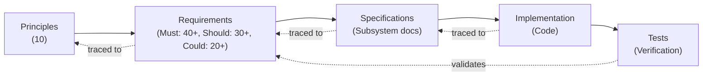
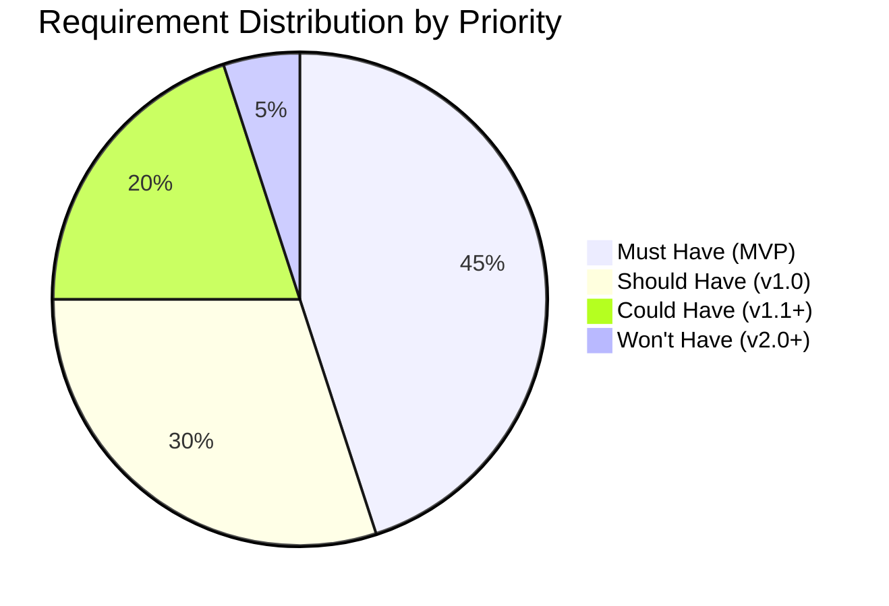
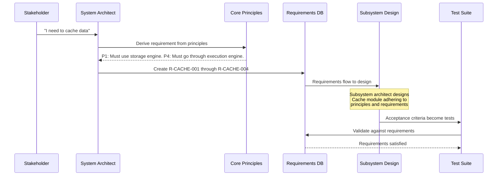
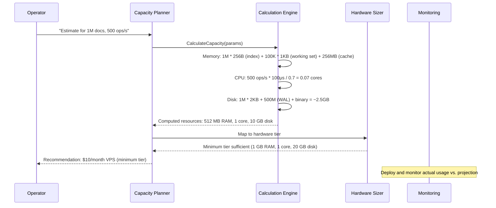

# 04 - Requirements Analysis

## 1. Purpose

This document provides a comprehensive analysis of all requirements for Nova Runtime. It captures functional requirements for every subsystem, non-functional requirements covering performance, reliability, security, and operability, constraints imposed by the target deployment environment, and prioritization using the MoSCoW method. This document serves as the authoritative requirements baseline against which all implementations are validated.

## 2. Scope

This document covers:

- Functional requirements for all 8 subsystems: Database, Cache, Queue, Scheduler, Search, Blob Storage, Authentication, API Runtime
- Non-functional requirements: performance, reliability, security, operability, maintainability, scalability
- Constraints: hardware budget for target VPS ($10-20/month), memory limits, CPU limits, disk limits
- Requirement prioritization using MoSCoW (Must have, Should have, Could have, Won't have)
- Capacity planning calculations for various deployment sizes
- Requirement traceability from principles to requirements
- Acceptance criteria for each requirement
- Requirement conflicts and trade-off analysis

This document does NOT cover:

- Implementation-specific design decisions (delegated to subsystem documents)
- API contract specifications (delegated to interface documents)
- Testing strategy (delegated to testing document)
- Deployment procedures (delegated to deployment document)

## 3. Responsibilities

This document is responsible for:

- Defining what Nova Runtime must do (functional scope)
- Defining how well it must do it (non-functional targets)
- Defining the boundaries within which it must operate (constraints)
- Prioritizing requirements for phased delivery
- Providing the requirements baseline for validation and verification
- Identifying requirement conflicts for resolution
- Enabling capacity planning and hardware sizing

## 4. Non Responsibilities

This document does NOT:

- Specify how requirements are implemented (architecture documents)
- Define exact API contracts or data formats (interface documents)
- Specify testing procedures (testing strategy document)
- Define deployment or operations procedures (deployment document)
- Estimate development effort or timeline (project management documents)

## 5. Architecture

### 5.1 Requirements Hierarchy

```mermaid
graph TB
    subgraph "Principles"
        P1["P1: One Storage Engine"]
        P2["P2: One Object Model"]
        P3["P3: One Event Model"]
        P4["P4: One Execution Pipeline"]
    end

    subgraph "Functional Requirements"
        R_DB["Database: CRUD, Query, Index"]
        R_Cache["Cache: Get, Set, Delete, TTL"]
        R_Queue["Queue: Push, Pop, Ack, Dead-letter"]
        R_Sched["Scheduler: Schedule, Cancel, Trigger"]
        R_Search["Search: Index, Query, Rank"]
        R_Blob["Blob: Upload, Download, Delete"]
        R_Auth["Auth: Login, Verify, RBAC"]
        R_API["API: REST, GraphQL, WebSocket"]
    end

    subgraph "Non-Functional Requirements"
        NFR_Perf["Performance: 10k ops/s, P99 latencies"]
        NFR_Rel["Reliability: Zero data loss, 5s RTO"]
        NFR_Sec["Security: Auth by default, fail closed"]
        NFR_Ops["Operability: Metrics, logs, health check"]
    end

    subgraph "Constraints"
        C_Mem["Memory: 256 MB - 2 GB"]
        C_CPU["CPU: 1-4 cores"]
        C_Disk["Disk: 20-80 GB SSD"]
        C_Net["Network: 1 Gbps"]
    end

    P1 --> R_DB
    P1 --> R_Cache
    P1 --> R_Queue
    P2 --> R_DB
    P4 --> R_API
    NFR_Perf --> C_Mem
    NFR_Perf --> C_CPU
    NFR_Perf --> C_Disk
```



### 5.2 Requirements Traceability Matrix Structure



### 5.3 MoSCoW Prioritization Distribution



## 6. Data Structures

### 6.1 Requirement Definition

```rust
/// A single requirement in the requirements database.
struct Requirement {
    /// Unique requirement ID (e.g., "R-DB-001")
    id: String,
    
    /// Short title
    title: String,
    
    /// Detailed description
    description: String,
    
    /// The subsystem this requirement belongs to
    subsystem: SubsystemId,
    
    /// Requirement category
    category: RequirementCategory,
    
    /// MoSCoW priority
    priority: MosCowPriority,
    
    /// Which principles this requirement derives from
    derived_from: Vec<PrincipleId>,
    
    /// Acceptance criteria (measurable conditions)
    acceptance_criteria: Vec<String>,
    
    /// Verification method
    verification: VerificationMethod,
    
    /// Dependencies on other requirements
    depends_on: Vec<String>,
    
    /// Known conflicts with other requirements
    conflicts_with: Vec<String>,
    
    /// Notes and rationale
    notes: String,
    
    /// Implementation status
    status: RequirementStatus,
}

enum RequirementCategory {
    Functional,       // A behavior or capability
    Performance,      // A speed or throughput target
    Reliability,      // A durability or availability guarantee
    Security,         // A protection or access control requirement
    Operability,      // A management or monitoring requirement
    Constraint,       // A limitation or boundary
    Compatibility,    // An interoperability requirement
    Usability,        // A user experience requirement
}

enum MosCowPriority {
    MustHave,     // Required for MVP; without this, the system is not viable
    ShouldHave,   // Important but not critical; can be deferred to v1.0
    CouldHave,    // Desirable but not necessary; included if time/resources permit
    WontHave,     // Explicitly excluded from current scope; deferred to v2.0+
}

enum VerificationMethod {
    Test(String),           // Automated test with name
    Demonstration(String),  // Manual demonstration with description
    Inspection(String),     // Code review or document inspection
    Analysis(String),       // Formal analysis (e.g., proof, model checking)
    Benchmark(String),      // Performance benchmark with parameters
}

enum RequirementStatus {
    Proposed,
    Approved,
    InImplementation,
    Implemented,
    Verified,
    Deferred,
    Rejected,
}
```

### 6.2 Non-Functional Requirement Target

```rust
/// A quantified non-functional requirement target.
struct NFRequirementTarget {
    /// Requirement ID
    req_id: String,
    
    /// Metric name
    metric: String,
    
    /// Target value
    target: f64,
    
    /// Upper bound (for "less than" metrics like latency)
    upper_bound: Option<f64>,
    
    /// Lower bound (for "greater than" metrics like throughput)
    lower_bound: Option<f64>,
    
    /// Unit of measurement
    unit: String,
    
    /// Measurement conditions
    conditions: Vec<String>,
    
    /// Statistical aggregation (P50, P95, P99, P999, Avg, Max, Min)
    statistic: StatisticType,
    
    /// Measurement window
    window: Duration,
}

enum StatisticType {
    Percentile(f64),  // e.g., Percentile(99) for P99
    Average,
    Maximum,
    Minimum,
    Sum,
    Count,
}
```

### 6.3 Capacity Plan

```rust
/// A capacity plan for a specific deployment scenario.
struct CapacityPlan {
    /// Plan name (e.g., "Solo Developer", "Startup", "Growing Business")
    name: String,
    
    /// Expected scale parameters
    scale: ScaleParameters {
        documents: u64,              // Total documents
        collections: u32,            // Number of collections
        doc_size_bytes: u32,         // Average document size
        throughput_ops: u32,         // Operations per second
        users: u32,                  // Active users
        blobs_gb: u32,              // Blob storage in GB
        queue_depth: u32,           // Max queue messages
        scheduled_jobs: u32,        // Scheduled jobs
        connections: u32,           // Concurrent connections
    },
    
    /// Computed resource requirements
    resources: ComputedResources {
        ram_mb: u32,
        cpu_cores: f32,
        disk_gb: u32,
        disk_iops: u32,
    },
    
    /// Recommended hardware tier
    recommended_tier: HardwareTier,
    
    /// Bottleneck prediction
    predicted_bottleneck: Bottleneck,
    
    /// Safety margin (percentage over computed minimum)
    safety_margin_pct: u8,  // Default 20%
}

enum Bottleneck {
    Cpu,          // Compute-bound
    Memory,       // Memory-bound
    DiskIops,     // I/O-bound
    DiskSpace,    // Storage-bound
    Network,      // Network-bound
    Connections,  // Connection count bound
}

enum HardwareTier {
    Minimum,      // 1 core, 1 GB RAM, 20 GB SSD
    Recommended,  // 2 cores, 2 GB RAM, 40 GB SSD
    Performance,  // 4 cores, 4 GB RAM, 80 GB NVMe
}
```

## 7. Algorithms

### 7.1 Capacity Planning Algorithm

```
FUNCTION CalculateCapacity(parameters: ScaleParameters) -> CapacityPlan
    
    // Memory calculation
    // 1. Index overhead: 256 bytes per document index entry
    index_memory = parameters.documents * 256
    
    // 2. Working set: assume 10% of documents are hot
    hot_documents = parameters.documents * 0.10
    working_set_memory = hot_documents * parameters.doc_size_bytes
    
    // 3. Cache allocation: 20% of total expected memory
    cache_memory = (index_memory + working_set_memory) * 0.20
    
    // 4. WAL buffer: 32 MB fixed
    wal_buffer = 32 * 1024 * 1024  // 32 MB
    
    // 5. Connection buffers: 64 KB per connection
    connection_memory = parameters.connections * 64 * 1024
    
    // 6. Base overhead: 128 MB for runtime, libraries, etc.
    base_overhead = 128 * 1024 * 1024
    
    total_memory = index_memory + working_set_memory + cache_memory +
                   wal_buffer + connection_memory + base_overhead
    
    // CPU calculation
    // Assume 100μs CPU time per operation
    cpu_seconds_per_op = 0.0001  // 100μs
    total_cpu_seconds = parameters.throughput_ops * cpu_seconds_per_op
    target_utilization = 0.70  // 70% CPU utilization target
    required_cores = CEIL(total_cpu_seconds / target_utilization)
    
    // Disk calculation
    // 1. Document storage
    doc_storage = parameters.documents * parameters.doc_size_bytes
    
    // 2. Index storage: 512 bytes per document for all indexes
    index_storage = parameters.documents * 512
    
    // 3. WAL overhead: 15% of write volume (assume 20% writes)
    write_volume = parameters.throughput_ops * 0.20 * 86400  // daily write ops
    avg_write_size = parameters.doc_size_bytes * 0.30  // partial updates
    daily_wal_bytes = write_volume * avg_write_size * 0.15
    wal_storage = daily_wal_bytes * 7  // 7 days of WAL before checkpoint
    
    // 4. Blob storage
    blob_storage = parameters.blobs_gb * 1024 * 1024 * 1024
    
    // 5. Binary + temp space
    binary = 50 * 1024 * 1024      // 50 MB binary
    temp = 1024 * 1024 * 1024      // 1 GB temp
    
    total_disk = doc_storage + index_storage + wal_storage + 
                 blob_storage + binary + temp
    
    // Determine hardware tier
    tier = HardwareTier.Minimum
    IF total_memory > 1.5 * 1024 * 1024 * 1024 OR
       required_cores > 2 OR
       total_disk > 30 * 1024 * 1024 * 1024:
        tier = HardwareTier.Recommended
    END IF
    IF total_memory > 3 * 1024 * 1024 * 1024 OR
       required_cores > 3 OR
       total_disk > 60 * 1024 * 1024 * 1024:
        tier = HardwareTier.Performance
    END IF
    
    RETURN CapacityPlan {
        name: parameters.name,
        scale: parameters,
        resources: ComputedResources {
            ram_mb: CEIL(total_memory / (1024 * 1024)),
            cpu_cores: required_cores,
            disk_gb: CEIL(total_disk / (1024 * 1024 * 1024)),
            disk_iops: CEIL(parameters.throughput_ops * 0.20 * 2),  // 2 IOs per write op
        },
        recommended_tier: tier,
        predicted_bottleneck: IDENTIFY_BOTTLENECK(total_memory, required_cores, total_disk),
        safety_margin_pct: 20,
    }
END FUNCTION

FUNCTION IDENTIFY_BOTTLENECK(
    memory_bytes: u64,
    cpu_cores: f32,
    disk_bytes: u64
) -> Bottleneck
    
    // Max resources per tier
    max_memory = 1073741824  // 1 GB
    max_cpu = 4.0
    max_disk = 80 * 1024 * 1024 * 1024  // 80 GB
    
    memory_util = memory_bytes / max_memory
    cpu_util = cpu_cores / max_cpu
    disk_util = disk_bytes / max_disk
    
    IF memory_util >= cpu_util AND memory_util >= disk_util:
        RETURN Bottleneck.Memory
    ELSE IF cpu_util >= memory_util AND cpu_util >= disk_util:
        RETURN Bottleneck.Cpu
    ELSE:
        RETURN Bottleneck.DiskSpace
    END IF
END FUNCTION
```

### 7.2 Requirement Conflict Detection

```
FUNCTION DetectRequirementConflicts(requirements: Vec<Requirement>) -> Vec<RequirementConflict>
    
    conflicts = []
    
    // Check for resource budget conflicts
    total_memory_requirements = SUM(
        requirements.filter(r -> r.category == Constraint AND r.contains("memory"))
            .map(r -> r.memory_value)
    )
    IF total_memory_requirements > MEMORY_BUDGET_MAX:
        conflicts.push(RequirementConflict {
            type: ResourceBudget,
            description: "Total memory requirements (" + total_memory_requirements + 
                        " MB) exceed budget (" + MEMORY_BUDGET_MAX + " MB)",
            affected_requirements: requirements.filter(r -> r.contains("memory"))
        })
    END IF
    
    // Check for conflicting guarantees
    // Strong consistency vs. low latency for cross-region reads
    consistency_reqs = requirements.filter(r -> r.contains("consistency") AND r.value == "strong")
    latency_reqs = requirements.filter(r -> r.contains("P99 latency") AND r.value < "10ms")
    
    IF NOT consistency_reqs.is_empty() AND NOT latency_reqs.is_empty():
        // Potential conflict: strong consistency requires synchronous replication
        // which adds latency
        conflicts.push(RequirementConflict {
            type: GuaranteeConflict,
            description: "Strong consistency conflicts with sub-10ms P99 latency " +
                        "for cross-region reads. Single-node design mitigates this.",
            affected_requirements: consistency_reqs + latency_reqs,
            resolution: "Single-node deployment avoids network latency for consistency. " +
                       "This conflict only arises in future multi-node configurations."
        })
    END IF
    
    // Check for principle violations
    FOR EACH req IN requirements:
        IF req.contains("direct") AND req.contains("storage"):
            conflicts.push(RequirementConflict {
                type: PrincipleViolation,
                description: "Direct storage access violates P1: One Storage Engine",
                affected_requirements: [req.id],
                resolution: "Route through execution engine instead."
            })
        END IF
    END FOR
    
    RETURN conflicts
END FUNCTION
```

### 7.3 Requirements Coverage Analysis

```
FUNCTION AnalyzeCoverage(requirements: Vec<Requirement>, tests: Vec<Test>) -> CoverageReport
    
    report = CoverageReport {
        total_requirements: requirements.len(),
        covered: 0,
        not_covered: [],
        partially_covered: [],
        over_covered: [],
    }
    
    FOR EACH req IN requirements:
        covering_tests = tests.filter(t -> t.covers(req.id))
        
        IF covering_tests.is_empty():
            report.not_covered.push(req.id)
        ELSE IF covering_tests.any(t -> t.covers(req.acceptance_criteria)):
            report.covered += 1
        ELSE:
            report.partially_covered.push(req.id)
        END IF
    END FOR
    
    report.coverage_percentage = report.covered / report.total_requirements * 100
    
    RETURN report
END FUNCTION
```

## 8. Interfaces

### 8.1 Requirements API

```rust
/// Programmatic interface for requirements queries.
trait RequirementsApi {
    /// Get a requirement by ID.
    fn get_requirement(id: &str) -> Result<Requirement, RequirementsError>;
    
    /// Get all requirements, optionally filtered.
    fn list_requirements(
        subsystem: Option<SubsystemId>,
        priority: Option<MosCowPriority>,
        category: Option<RequirementCategory>,
        status: Option<RequirementStatus>
    ) -> Vec<Requirement>;
    
    /// Get requirements traceable to a principle.
    fn get_requirements_by_principle(principle: PrincipleId) -> Vec<Requirement>;
    
    /// Get acceptance criteria for a requirement.
    fn get_acceptance_criteria(req_id: &str) -> Vec<String>;
    
    /// Calculate capacity for given scale parameters.
    fn calculate_capacity(params: ScaleParameters) -> CapacityPlan;
    
    /// Detect conflicts between requirements.
    fn detect_conflicts(req_ids: &[&str]) -> Vec<RequirementConflict>;
    
    /// Check test coverage of requirements.
    fn analyze_coverage(req_ids: &[&str], test_ids: &[&str]) -> CoverageReport;
}

enum RequirementsError {
    NotFound,
    InvalidId,
    CyclicDependency,
}
```

## 9. Functional Requirements

### 9.1 Database Subsystem

#### R-DB-001: Document CRUD (Must Have)
| Property | Value |
|----------|-------|
| **Description** | The Database subsystem SHALL support Create, Read, Update, and Delete operations on Documents. |
| **Derived From** | P1, P2, P4 |
| **Acceptance Criteria** | 1. Create a document with any valid fields. 2. Read a document by ID. 3. Update a document (partial or full). 4. Delete a document. 5. All operations return appropriate success/error responses. |
| **Verification** | Automated integration test |
| **Notes** | Create returns the generated document ID. Read returns the full document or null. Update supports partial update (merge) and full replacement. Delete is a soft delete by default (configurable). |

#### R-DB-002: Collection Management (Must Have)
| Property | Value |
|----------|-------|
| **Description** | The Database subsystem SHALL support managing collections (create, list, drop). |
| **Derived From** | P2 |
| **Acceptance Criteria** | 1. Create a collection with schema. 2. List all collections. 3. Drop a collection (removes all documents and indexes). 4. Operations are idempotent where appropriate. |
| **Verification** | Automated integration test |

#### R-DB-003: Schema Enforcement (Must Have)
| Property | Value |
|----------|-------|
| **Description** | The Database subsystem SHALL enforce schemas on documents within typed collections. Un-typed collections SHALL accept any valid document. |
| **Derived From** | P2, P6 |
| **Acceptance Criteria** | 1. Documents violating required field constraints are rejected. 2. Documents with wrong field types are rejected. 3. Default values are applied for missing optional fields. 4. Schema-less collections accept any fields. |
| **Verification** | Automated integration test |

#### R-DB-004: Secondary Indexes (Must Have)
| Property | Value |
|----------|-------|
| **Description** | The Database subsystem SHALL support secondary indexes on document fields for query acceleration. |
| **Derived From** | P1 |
| **Acceptance Criteria** | 1. Create index on any field. 2. Query using indexed field returns correct results. 3. Index is automatically maintained on writes. 4. Drop index. 5. Maximum 64 indexes per collection. |
| **Verification** | Automated integration test + benchmark |

#### R-DB-005: Query Language (Must Have)
| Property | Value |
|----------|-------|
| **Description** | The Database subsystem SHALL support a query language for filtering, sorting, and paginating documents. |
| **Derived From** | P4 |
| **Acceptance Criteria** | 1. Filter by field equality. 2. Filter by field comparison (<, >, <=, >=). 3. Filter by field in list. 4. Sort by field ascending/descending. 5. Paginate with offset/limit. 6. Compound filters with AND/OR. |
| **Verification** | Automated integration test |

#### R-DB-006: Document Size Limit (Must Have)
| Property | Value |
|----------|-------|
| **Description** | The Database subsystem SHALL enforce a maximum document size of 16 MB. |
| **Derived From** | Constraint |
| **Acceptance Criteria** | 1. Document at 16 MB is accepted. 2. Document at 16 MB + 1 byte is rejected with clear error. |
| **Verification** | Automated integration test |

#### R-DB-007: Collection Count Limit (Should Have)
| Property | Value |
|----------|-------|
| **Description** | The Database subsystem SHOULD support up to 10,000 collections per instance. |
| **Derived From** | Constraint |
| **Acceptance Criteria** | 1. Create 10,000 collections. 2. All collections are operational. 3. Performance at 10,000 collections is within 50% of baseline. |
| **Verification** | Benchmark |

#### R-DB-008: Transactions (Could Have)
| Property | Value |
|----------|-------|
| **Description** | The Database subsystem COULD support multi-document transactions with ACID guarantees. |
| **Derived From** | P8 |
| **Acceptance Criteria** | 1. Begin transaction. 2. Execute multiple operations. 3. Commit transaction - all changes visible atomically. 4. Rollback transaction - no changes visible. 5. Concurrent transactions are isolated. |
| **Verification** | Automated integration test |
| **Notes** | Deferred to v1.1. Single-document atomic operations satisfy MVP requirements. |

#### R-DB-009: Document Versioning (Could Have)
| Property | Value |
|----------|-------|
| **Description** | The Database subsystem COULD support document versioning for audit and recovery. |
| **Derived From** | P8 |
| **Acceptance Criteria** | 1. Document has version number. 2. Every update creates a new version. 3. Read specific version. 4. List version history. |
| **Verification** | Automated integration test |
| **Notes** | Deferred. The WAL already provides versioning; exposing it is an API concern. |

### 9.2 Cache Subsystem

#### R-CACHE-001: Key-Value Operations (Must Have)
| Property | Value |
|----------|-------|
| **Description** | The Cache subsystem SHALL support get, set, and delete operations on key-value entries. |
| **Derived From** | P1, P4 |
| **Acceptance Criteria** | 1. Set a value by key. 2. Get a value by key. 3. Delete a value by key. 4. Get for non-existent key returns null. 5. Values up to 1 MB are accepted. |
| **Verification** | Automated integration test |

#### R-CACHE-002: TTL Support (Must Have)
| Property | Value |
|----------|-------|
| **Description** | The Cache subsystem SHALL support time-to-live (TTL) for automatic entry expiration. |
| **Derived From** | P1 |
| **Acceptance Criteria** | 1. Set entry with TTL of 1 second. 2. Entry is available before TTL expires. 3. Entry is unavailable after TTL expires. 4. TTL can be updated on existing entries. 5. Maximum TTL is 30 days. |
| **Verification** | Automated integration test |

#### R-CACHE-003: Eviction Policy (Must Have)
| Property | Value |
|----------|-------|
| **Description** | The Cache subsystem SHALL support an LRU (Least Recently Used) eviction policy when memory limit is reached. |
| **Derived From** | Constraint |
| **Acceptance Criteria** | 1. Fill cache to capacity. 2. Add new entry. 3. LRU entry is evicted. 4. Eviction logged. 5. Configurable max memory (default 256 MB). |
| **Verification** | Automated integration test |

#### R-CACHE-004: Cache-Aside Pattern Support (Must Have)
| Property | Value |
|----------|-------|
| **Description** | The Cache subsystem SHALL integrate with the Execution Engine to automatically invalidate cache entries when underlying data changes. |
| **Derived From** | P1, P2 |
| **Acceptance Criteria** | 1. Cache an expensive query result. 2. Update the underlying document. 3. Cache entry is automatically invalidated. 4. Next read fetches fresh data and re-caches. |
| **Verification** | Automated integration test |
| **Notes** | This is the primary value of unified cache: automatic consistency without application-level cache management. |

#### R-CACHE-005: Cache Statistics (Should Have)
| Property | Value |
|----------|-------|
| **Description** | The Cache subsystem SHOULD expose hit/miss ratio, size, and eviction count statistics. |
| **Derived From** | P10 |
| **Acceptance Criteria** | 1. Hit ratio is tracked. 2. Miss ratio is tracked. 3. Current size is tracked. 4. Eviction count is tracked. 5. Statistics are available via health endpoint. |
| **Verification** | Automated integration test + inspection |

#### R-CACHE-006: Multi-Key Operations (Could Have)
| Property | Value |
|----------|-------|
| **Description** | The Cache subsystem COULD support batch get/set/delete operations. |
| **Derived From** | Performance |
| **Acceptance Criteria** | 1. Get multiple keys in one operation. 2. Set multiple keys in one operation. 3. Delete multiple keys in one operation. 4. Partial success handling. |
| **Verification** | Automated integration test |
| **Notes** | Deferred. Single-key operations satisfy MVP requirements. |

### 9.3 Queue Subsystem

#### R-QUEUE-001: Message Production (Must Have)
| Property | Value |
|----------|-------|
| **Description** | The Queue subsystem SHALL support pushing messages onto a queue. |
| **Derived From** | P1, P4 |
| **Acceptance Criteria** | 1. Push a message to a named queue. 2. Queue is auto-created if it doesn't exist. 3. Push returns a message ID. 4. Message payload up to 256 KB is accepted. |
| **Verification** | Automated integration test |

#### R-QUEUE-002: Message Consumption (Must Have)
| Property | Value |
|----------|-------|
| **Description** | The Queue subsystem SHALL support pulling messages from a queue with at-least-once delivery. |
| **Derived From** | P1 |
| **Acceptance Criteria** | 1. Pop a message from a queue. 2. Message is hidden (not deleted) after pop. 3. Message must be acknowledged within visibility timeout (default 30s). 4. Unacknowledged message reappears after timeout. 5. Popping from empty queue returns null or blocks. |
| **Verification** | Automated integration test |

#### R-QUEUE-003: Message Acknowledgment (Must Have)
| Property | Value |
|----------|-------|
| **Description** | The Queue subsystem SHALL support explicit message acknowledgment to mark messages as processed. |
| **Derived From** | P8 |
| **Acceptance Criteria** | 1. Acknowledge a message by ID. 2. Acknowledged message is deleted. 3. Double-acknowledgment is safe (no-op). 4. Ack for non-existent message is safe. |
| **Verification** | Automated integration test |

#### R-QUEUE-004: Dead-Letter Queue (Must Have)
| Property | Value |
|----------|-------|
| **Description** | The Queue subsystem SHALL support dead-letter queues for messages that exceed maximum receive count (default 3). |
| **Derived From** | P8, P9 |
| **Acceptance Criteria** | 1. Message is moved to DLQ after N failed deliveries. 2. DLQ is a separate queue (auto-created). 3. DLQ messages can be inspected and re-driven. 4. DLQ configuration is per-queue. 5. DLQ max depth is 10,000 messages. |
| **Verification** | Automated integration test |

#### R-QUEUE-005: FIFO Ordering (Should Have)
| Property | Value |
|----------|-------|
| **Description** | The Queue subsystem SHOULD support FIFO (first-in, first-out) ordering within a queue. |
| **Derived From** | P8 |
| **Acceptance Criteria** | 1. Push messages A, B, C in order. 2. Pop returns A, B, C in order. 3. Order is maintained even after temporary failures. 4. Throughput impact of FIFO is documented. |
| **Verification** | Automated integration test |
| **Notes** | FIFO reduces throughput due to ordering constraints. Standard queues (best-effort ordering) have higher throughput. |

#### R-QUEUE-006: Message TTL (Should Have)
| Property | Value |
|----------|-------|
| **Description** | The Queue subsystem SHOULD support message-level TTL. |
| **Derived From** | P1 |
| **Acceptance Criteria** | 1. Push message with TTL. 2. Message is auto-deleted after TTL expires. 3. Default TTL is 4 days. 4. Maximum TTL is 14 days. |
| **Verification** | Automated integration test |

#### R-QUEUE-007: Batch Operations (Could Have)
| Property | Value |
|----------|-------|
| **Description** | The Queue subsystem COULD support batch push and pop operations. |
| **Derived From** | Performance |
| **Acceptance Criteria** | 1. Push up to 10 messages in one operation. 2. Pop up to 10 messages in one operation. 3. Batch operations are atomic. |
| **Verification** | Automated integration test |

### 9.4 Scheduler Subsystem

#### R-SCHED-001: One-Shot Jobs (Must Have)
| Property | Value |
|----------|-------|
| **Description** | The Scheduler subsystem SHALL support scheduling a job to execute at a specific time. |
| **Derived From** | P1, P4 |
| **Acceptance Criteria** | 1. Schedule a job for a future time. 2. Job executes at the specified time (+/- 1 second precision). 3. Job result is captured. 4. Job cancellation before execution. |
| **Verification** | Automated integration test |

#### R-SCHED-002: Recurring Jobs (Should Have)
| Property | Value |
|----------|-------|
| **Description** | The Scheduler subsystem SHOULD support recurring jobs using cron expressions. |
| **Derived From** | P1 |
| **Acceptance Criteria** | 1. Schedule job with cron expression "0 * * * *" (hourly). 2. Job executes at each scheduled time. 3. Job execution history is tracked. 4. Cancel recurring job. 5. Supported cron syntax: standard 5-field cron. |
| **Verification** | Automated integration test |

#### R-SCHED-003: Delayed Jobs (Must Have)
| Property | Value |
|----------|-------|
| **Description** | The Scheduler subsystem SHALL support scheduling a job with a delay from now. |
| **Derived From** | P1 |
| **Acceptance Criteria** | 1. Schedule a job with 60-second delay. 2. Job executes ~60 seconds later (+/- 1 second). 3. Delay up to 30 days. 4. Minimum delay is 1 second. |
| **Verification** | Automated integration test |

#### R-SCHED-004: Job Persistence (Must Have)
| Property | Value |
|----------|-------|
| **Description** | The Scheduler subsystem SHALL persist all scheduled jobs in the Storage Engine so they survive restarts. |
| **Derived From** | P1, P5, P8 |
| **Acceptance Criteria** | 1. Schedule a job. 2. Restart Nova Runtime. 3. Job still executes at its scheduled time. 4. Jobs that were due during downtime execute on startup (missed job policy configurable). |
| **Verification** | Automated integration test with restart |

#### R-SCHED-005: Maximum Scheduled Jobs (Should Have)
| Property | Value |
|----------|-------|
| **Description** | The Scheduler subsystem SHOULD support at least 50,000 scheduled jobs. |
| **Derived From** | Constraint |
| **Acceptance Criteria** | 1. Create 50,000 scheduled jobs. 2. Scheduling performance is not degraded. 3. Execution is on time within tolerance. |
| **Verification** | Benchmark |

### 9.5 Search Subsystem

#### R-SEARCH-001: Full-Text Indexing (Must Have)
| Property | Value |
|----------|-------|
| **Description** | The Search subsystem SHALL support full-text indexing of document fields. |
| **Derived From** | P1, P2 |
| **Acceptance Criteria** | 1. Index a document field as full-text. 2. Search for a term returns matching documents. 3. Multi-word search returns documents containing all terms. 4. Case-insensitive search. 5. Stemming support (basic English). |
| **Verification** | Automated integration test |

#### R-SEARCH-002: Ranked Results (Must Have)
| Property | Value |
|----------|-------|
| **Description** | The Search subsystem SHALL return ranked results with relevance scoring (TF-IDF based). |
| **Derived From** | P8 |
| **Acceptance Criteria** | 1. Search results are ranked by relevance. 2. Documents with more term occurrences rank higher. 3. Documents with term in title rank higher than body. 4. Score is returned with each result. |
| **Verification** | Automated integration test |

#### R-SEARCH-003: Faceted Search (Should Have)
| Property | Value |
|----------|-------|
| **Description** | The Search subsystem SHOULD support faceted filtering (counts by field value). |
| **Derived From** | P2 |
| **Acceptance Criteria** | 1. Search with facet on field returns counts. 2. Multiple facets in one query. 3. Facet counts reflect filtered results. |
| **Verification** | Automated integration test |

#### R-SEARCH-004: Index Updates (Must Have)
| Property | Value |
|----------|-------|
| **Description** | The Search subsystem SHALL automatically update search indexes when documents are written. |
| **Derived From** | P1, P2 |
| **Acceptance Criteria** | 1. Create a document with searchable fields. 2. Search immediately returns the new document (near-real-time, < 100ms). 3. Update a document. 4. Search returns updated content. 5. Delete a document. 6. Search no longer returns deleted document. |
| **Verification** | Automated integration test |

#### R-SEARCH-005: Highlighting (Could Have)
| Property | Value |
|----------|-------|
| **Description** | The Search subsystem COULD support result highlighting (matching term context snippets). |
| **Derived From** | Usability |
| **Acceptance Criteria** | 1. Search returns snippets around matching terms. 2. Matching terms are marked (e.g., with markers or offsets). 3. Configurable snippet length. |
| **Verification** | Automated integration test |

### 9.6 Blob Storage Subsystem

#### R-BLOB-001: Upload (Must Have)
| Property | Value |
|----------|-------|
| **Description** | The Blob Storage subsystem SHALL support uploading binary data with associated metadata. |
| **Derived From** | P1, P4 |
| **Acceptance Criteria** | 1. Upload blob up to 10 GB. 2. Upload returns a blob ID. 3. Metadata (content-type, filename) is stored. 4. Upload progress tracking (for large blobs). |
| **Verification** | Automated integration test |

#### R-BLOB-002: Download (Must Have)
| Property | Value |
|----------|-------|
| **Description** | The Blob Storage subsystem SHALL support downloading blob data by ID. |
| **Derived From** | P1 |
| **Acceptance Criteria** | 1. Download blob by ID returns full data. 2. Download non-existent blob returns 404. 3. Range requests for partial download. 4. Streaming download for large blobs. |
| **Verification** | Automated integration test |

#### R-BLOB-003: Delete (Must Have)
| Property | Value |
|----------|-------|
| **Description** | The Blob Storage subsystem SHALL support deleting blobs by ID. |
| **Derived From** | P1 |
| **Acceptance Criteria** | 1. Delete blob by ID. 2. Delete non-existent blob is safe (no-op). 3. Deleted blob is not accessible. 4. Disk space is reclaimed (eventually). |
| **Verification** | Automated integration test |

#### R-BLOB-004: Blob Metadata (Should Have)
| Property | Value |
|----------|-------|
| **Description** | The Blob Storage subsystem SHOULD support custom metadata on blobs (key-value pairs). |
| **Derived From** | P2 |
| **Acceptance Criteria** | 1. Upload blob with metadata. 2. Retrieve metadata without downloading data. 3. Update metadata on existing blob. 4. Maximum 64 metadata entries per blob. |
| **Verification** | Automated integration test |

#### R-BLOB-005: Content-Detect (Could Have)
| Property | Value |
|----------|-------|
| **Description** | The Blob Storage subsystem COULD detect content type from blob data (magic bytes). |
| **Derived From** | Usability |
| **Acceptance Criteria** | 1. Upload blob without content-type. 2. Content-type is auto-detected. 3. Common formats detected: JPEG, PNG, PDF, MP4, JSON, CSV. |
| **Verification** | Automated integration test |

### 9.7 Authentication Subsystem

#### R-AUTH-001: Authentication Methods (Must Have)
| Property | Value |
|----------|-------|
| **Description** | The Authentication subsystem SHALL support password-based authentication with secure password storage (bcrypt/argon2). |
| **Derived From** | P4, Security |
| **Acceptance Criteria** | 1. Register user with email + password. 2. Login with email + password returns token. 3. Invalid credentials return clear error. 4. Passwords are never stored in plaintext. 5. Rate limiting after 5 failed attempts. |
| **Verification** | Automated integration test + security review |

#### R-AUTH-002: Token-Based Sessions (Must Have)
| Property | Value |
|----------|-------|
| **Description** | The Authentication subsystem SHALL support stateless JWT-based sessions. |
| **Derived From** | P4 |
| **Acceptance Criteria** | 1. Login returns JWT with expiration. 2. Authenticate requests using JWT. 3. Expired JWT is rejected. 4. JWT includes user ID, role, and issued-at time. 5. JWT can be revoked (via blocklist). |
| **Verification** | Automated integration test |

#### R-AUTH-003: Role-Based Access Control (Must Have)
| Property | Value |
|----------|-------|
| **Description** | The Authentication subsystem SHALL support RBAC with configurable roles and permissions. |
| **Derived From** | P4, Security |
| **Acceptance Criteria** | 1. Define roles with permissions. 2. Assign role to user. 3. User's permissions match role definition. 4. Permission check on operation. 5. Default roles: admin, writer, reader. |
| **Verification** | Automated integration test |

#### R-AUTH-004: OIDC Integration (Should Have)
| Property | Value |
|----------|-------|
| **Description** | The Authentication subsystem SHOULD support OpenID Connect for external identity providers. |
| **Derived From** | Extensibility |
| **Acceptance Criteria** | 1. Configure OIDC provider (Google, GitHub, etc.). 2. Authenticate via OIDC flow. 3. Map external identity to internal user. 4. Token refresh from OIDC provider. |
| **Verification** | Automated integration test with mock OIDC provider |

#### R-AUTH-005: API Key Authentication (Should Have)
| Property | Value |
|----------|-------|
| **Description** | The Authentication subsystem SHOULD support API key-based authentication for service-to-service communication. |
| **Derived From** | Usability |
| **Acceptance Criteria** | 1. Generate API key for user/service. 2. Authenticate request using API key. 3. Revoke API key. 4. API key permissions are configurable. |
| **Verification** | Automated integration test |

### 9.8 API Runtime Subsystem

#### R-API-001: REST API (Must Have)
| Property | Value |
|----------|-------|
| **Description** | The API Runtime SHALL expose a RESTful HTTP API for all subsystem operations. |
| **Derived From** | P4 |
| **Acceptance Criteria** | 1. Standard CRUD endpoints for documents. 2. RESTful resource naming (collections/documents). 3. Standard HTTP methods (GET, POST, PUT, PATCH, DELETE). 4. Standard HTTP status codes. 5. JSON request/response bodies. |
| **Verification** | Automated integration test |

#### R-API-002: GraphQL API (Should Have)
| Property | Value |
|----------|-------|
| **Description** | The API Runtime SHOULD expose a GraphQL endpoint for flexible queries. |
| **Derived From** | Extensibility |
| **Acceptance Criteria** | 1. GraphQL endpoint at /graphql. 2. Query documents with field selection. 3. Mutations for create/update/delete. 4. Schema introspection. 5. Subscription support (WebSocket). |
| **Verification** | Automated integration test |

#### R-API-003: gRPC API (Could Have)
| Property | Value |
|----------|-------|
| **Description** | The API Runtime COULD expose a gRPC API for high-performance service-to-service communication. |
| **Derived From** | Performance |
| **Acceptance Criteria** | 1. gRPC server on configurable port. 2. Protobuf service definitions. 3. Streaming RPCs for large result sets. 4. TLS support. |
| **Verification** | Automated integration test + benchmark |

#### R-API-004: WebSocket Support (Should Have)
| Property | Value |
|----------|-------|
| **Description** | The API Runtime SHOULD support WebSocket connections for real-time updates and subscriptions. |
| **Derived From** | P3 |
| **Acceptance Criteria** | 1. WebSocket upgrade from HTTP. 2. Subscribe to document changes. 3. Receive real-time notifications on changes. 4. Connection lifecycle management. |
| **Verification** | Automated integration test |

#### R-API-005: Request Validation (Must Have)
| Property | Value |
|----------|-------|
| **Description** | The API Runtime SHALL validate all incoming requests before passing them to the Execution Engine. |
| **Derived From** | P4, Security |
| **Acceptance Criteria** | 1. Malformed JSON is rejected with 400. 2. Missing required fields are rejected. 3. Oversized payloads (>16 MB) are rejected. 4. Invalid content types are rejected. |
| **Verification** | Automated integration test |

#### R-API-006: Request Rate Limiting (Must Have)
| Property | Value |
|----------|-------|
| **Description** | The API Runtime SHALL support configurable rate limiting per connection and per user. |
| **Derived From** | P9, Security |
| **Acceptance Criteria** | 1. Rate limit per connection (default 1000 req/min). 2. Rate limit per user (default 5000 req/min). 3. Rate limit exceeded returns 429. 4. Rate limit headers in response. 5. Burst allowance (default 20% over limit). |
| **Verification** | Automated integration test |

#### R-API-007: CORS Support (Should Have)
| Property | Value |
|----------|-------|
| **Description** | The API Runtime SHOULD support configurable CORS headers for browser-based clients. |
| **Derived From** | Usability |
| **Acceptance Criteria** | 1. Configurable allowed origins. 2. Configurable allowed methods. 3. Configurable allowed headers. 4. Preflight (OPTIONS) handling. |
| **Verification** | Automated integration test |

## 10. Non-Functional Requirements

### 10.1 Performance Requirements

| ID | Requirement | Target | Priority |
|----|-------------|--------|----------|
| NFR-PERF-001 | Throughput (mixed workload) | >= 10,000 ops/s sustained | Must Have |
| NFR-PERF-002 | Cache read latency (P99) | < 10 ms | Must Have |
| NFR-PERF-003 | Cache read latency (P50) | < 500 μs | Must Have |
| NFR-PERF-004 | Indexed query latency (P99) | < 50 ms | Must Have |
| NFR-PERF-005 | Indexed query latency (P50) | < 5 ms | Must Have |
| NFR-PERF-006 | Write latency (P99) | < 20 ms | Must Have |
| NFR-PERF-007 | Blob upload throughput | >= 50 MB/s | Should Have |
| NFR-PERF-008 | Blob download throughput | >= 100 MB/s | Should Have |
| NFR-PERF-009 | Concurrent connections | >= 500 | Must Have |
| NFR-PERF-010 | Queue throughput | >= 2,000 msg/s | Should Have |
| NFR-PERF-011 | Search query latency (P99) | < 200 ms | Should Have |
| NFR-PERF-012 | Auth verification latency (P99) | < 20 ms | Must Have |
| NFR-PERF-013 | Startup time (cold) | < 5 seconds | Should Have |
| NFR-PERF-014 | Startup time (warm/restart) | < 1 second | Must Have |
| NFR-PERF-015 | Memory allocation rate | < 100 MB/s sustained | Should Have |

### 10.2 Reliability Requirements

| ID | Requirement | Target | Priority |
|----|-------------|--------|----------|
| NFR-REL-001 | Data loss on clean shutdown | Zero | Must Have |
| NFR-REL-002 | Data loss on crash | < 1 second of writes | Must Have |
| NFR-REL-003 | Crash recovery time (RTO) | < 5 seconds | Must Have |
| NFR-REL-004 | Availability (uptime) | >= 99.9% (8.76h/yr downtime) | Should Have |
| NFR-REL-005 | WAL durability | fsync before ack | Must Have |
| NFR-REL-006 | Graceful degradation on resource exhaustion | No crash, return errors | Must Have |
| NFR-REL-007 | File descriptor leak | Zero over 24h operation | Must Have |
| NFR-REL-008 | Memory leak | Zero over 24h operation | Must Have |
| NFR-REL-009 | Data corruption detection | Checksum verification on every read | Must Have |
| NFR-REL-010 | Backup/restore | Online backup, point-in-time restore | Should Have |

### 10.3 Security Requirements

| ID | Requirement | Target | Priority |
|----|-------------|--------|----------|
| NFR-SEC-001 | Authentication enforcement | Required for remote connections | Must Have |
| NFR-SEC-002 | TLS | TLS 1.3 for remote connections | Must Have |
| NFR-SEC-003 | Authorization | RBAC on all operations | Must Have |
| NFR-SEC-004 | Password storage | bcrypt (cost 12) or Argon2id | Must Have |
| NFR-SEC-005 | Input validation | All inputs validated, no injection | Must Have |
| NFR-SEC-006 | Fail-closed | Deny access on auth failure | Must Have |
| NFR-SEC-007 | Rate limiting | Configurable per-user and per-IP | Must Have |
| NFR-SEC-008 | Audit logging | All auth events logged | Should Have |
| NFR-SEC-009 | Secrets management | Via environment, never in config files | Must Have |
| NFR-SEC-010 | SQL injection prevention | Parameterized queries only | Must Have |

### 10.4 Operability Requirements

| ID | Requirement | Target | Priority |
|----|-------------|--------|----------|
| NFR-OPS-001 | Health check endpoint | /health with subsystem status | Must Have |
| NFR-OPS-002 | Metrics endpoint | /metrics in Prometheus format | Must Have |
| NFR-OPS-003 | Structured logging | JSON output with fields | Must Have |
| NFR-OPS-004 | Graceful shutdown | SIGTERM -> drain -> flush -> exit | Must Have |
| NFR-OPS-005 | Configuration reload | SIGHUP reload config | Should Have |
| NFR-OPS-006 | Single binary deployment | One executable, no dependencies | Must Have |
| NFR-OPS-007 | No external runtime | Self-contained, no JVM, no interpreter | Must Have |
| NFR-OPS-008 | Configuration validation | Validate config at startup, report errors | Must Have |
| NFR-OPS-009 | Audit trail | All data mutations logged | Should Have |
| NFR-OPS-010 | Diagnostic endpoint | /debug for internal state inspection | Could Have |

## 11. Constraints

### 11.1 Hardware Constraints

| Constraint | Minimum | Recommended | Maximum |
|------------|---------|-------------|---------|
| CPU | 1 core @ 2.0 GHz | 2 cores @ 2.5 GHz | 4 cores @ 3.0 GHz |
| RAM | 1 GB | 2 GB | 4 GB |
| Disk | 20 GB SSD | 40 GB SSD | 80 GB NVMe |
| Disk IOPS | 2,000 | 5,000 | 10,000 |
| Network | 100 Mbps | 1 Gbps | 1 Gbps |
| Monthly cost | $5-10 | $10-20 | $20-40 |

### 11.2 Software Constraints

| Constraint | Requirement | Rationale |
|------------|-------------|-----------|
| Operating System | Linux kernel 5.4+ | io_uring support, modern filesystem features |
| Filesystem | ext4 or XFS | Widely available, journaling, good fsync behavior |
| Architecture | x86_64 or ARM64 | Covering commodity VPS (x86) and ARM (AWS Graviton, Raspberry Pi) |
| Libraries | Statically linked | Single binary deployment, no library dependencies |
| Language | System-level (Rust or Go) | Performance, memory control, single binary compilation |
| Threading | Native OS threads | Deterministic performance, no GC pauses (if Rust) |
| Containerization | Optional (Docker) | Not required but works in containers |
| Init system | systemd or init.d | Process management, auto-restart on crash |

### 11.3 Design Constraints

| Constraint | Requirement | Rationale |
|------------|-------------|-----------|
| Single process | Yes | Simplicity, no IPC overhead, atomic startup/shutdown |
| No clustering (initial) | Yes | Complexity reduction, defer to v2 |
| No external dependencies | Yes | Self-contained, no Redis, no Postgres, no Elasticsearch |
| In-process communication | Internal calls only | No network overhead between subsystems |
| Synchronous operations | Default | Simpler programming model; async for I/O only |
| Memory-mapped I/O | Preferred | Efficient for large data, reduces syscall overhead |

## 12. Sequence Diagrams

### 12.1 Requirement Flow Through Architecture



### 12.2 Capacity Planning Workflow



## 13. Failure Modes

### 13.1 Requirement Defect: Missing Requirement

| Attribute | Value |
|-----------|-------|
| **Cause** | A required capability was not captured in the requirements analysis |
| **Detection** | Stakeholder feedback during review, implementation gap analysis |
| **Effect** | System lacks needed functionality, rework required |
| **Severity** | Varies (High if core functionality missing) |
| **Likelihood** | Medium |

**Prevention:**
- Stakeholder review of all requirements
- Traceability from use cases to requirements
- Scenario-based requirements elicitation
- Comparison with competing products' feature sets

### 13.2 Requirement Defect: Wrong Priority

| Attribute | Value |
|-----------|-------|
| **Cause** | A "Must Have" should be "Should Have" or vice versa |
| **Detection** | Release planning conflicts, budget overruns |
| **Effect** | Late delivery, missed deadlines, wasted effort on low-priority features |
| **Severity** | Medium |
| **Likelihood** | High |

**Prevention:**
- MoSCoW prioritization validated by stakeholders
- Re-prioritization at each release planning cycle
- Each Must Have requirement must have a "why this is critical" justification

### 13.3 Requirement Defect: Vague Acceptance Criteria

| Attribute | Value |
|-----------|-------|
| **Cause** | Acceptance criteria are not specific, measurable, or testable |
| **Detection** | Test creation ambiguity, review feedback |
| **Effect** | Implementation does not match intent, disputes over completeness |
| **Severity** | Medium |
| **Likelihood** | High |

**Prevention:**
- Acceptance criteria must include specific numbers, values, and conditions
- Each criterion must be verifiable by one of: test, demonstration, inspection, analysis
- Review acceptance criteria for ambiguity before approving requirements

### 13.4 Requirement Conflict

| Attribute | Value |
|-----------|-------|
| **Cause** | Two requirements have contradictory or mutually exclusive constraints |
| **Detection** | Cross-requirement analysis, capacity planning |
| **Effect** | Impossible to satisfy both requirements simultaneously |
| **Severity** | High |
| **Likelihood** | Medium |

**Prevention:**
- Requirement conflict detection algorithm
- Explicit trade-off documentation for known conflicts
- Prioritization hierarchy resolves conflicts (correctness > performance)
- Documented resolution for each conflict

## 14. Recovery Strategy

### 14.1 Missing Requirement Recovery

1. **Identify:** Determine if the requirement is genuinely missing or was intentionally excluded
2. **Prioritize:** Apply MoSCoW to the new requirement
3. **Trace:** Associate with relevant principles and subsystems
4. **Impact:** Analyze impact on existing design and implementation
5. **Add:** Incorporate into requirements database
6. **Communicate:** Notify affected teams and update schedule

### 14.2 Priority Correction

1. **Re-evaluate:** Stakeholders re-prioritize based on current understanding
2. **Document:** Update priority in requirements database with rationale
3. **Impact:** Analyze schedule and budget impact
4. **Communicate:** Notify teams of changed priorities
5. **Adjust:** Update release plans and resource allocation

## 15. Performance Considerations

### 15.1 Performance Budget Allocation

| Component | Budget | Target |
|-----------|--------|--------|
| Execution Engine pipeline | 50μs per operation | < 50μs |
| Storage Engine reads | 100μs per page | < 100μs |
| Storage Engine writes | 200μs per write | < 200μs |
| Cache operations | 5μs per get/set | < 5μs |
| Auth verification | 500μs per token verify | < 500μs |
| Network overhead | 50μs per request | < 50μs |
| Search indexing | 200μs per document | < 200μs |
| Search query | 5ms + 1ms per result | < 200ms P99 |

### 15.2 Resource Limits

| Resource | Soft Limit | Hard Limit | Action at Limit |
|----------|-----------|------------|-----------------|
| Memory | 80% of budget | 90% of budget | Evict cache, reject new connections at 90% |
| CPU | 70% utilization | 90% utilization | Throttle non-critical operations |
| Disk | 80% of partition | 95% of partition | Stop writes, return 507 at 95% |
| File descriptors | 80% of max | 90% of max | Close idle connections |
| Connections | 80% of max | 95% of max | Reject new connections, return 503 |

### 15.3 Throughput Scaling

| Ops/s | CPU Cores (estimated) | RAM (estimated) | Bottleneck |
|-------|----------------------|-----------------|------------|
| 1,000 | 0.2 | 256 MB | Memory |
| 5,000 | 0.8 | 512 MB | CPU |
| 10,000 | 1.5 | 1 GB | CPU |
| 20,000 | 3.0 | 2 GB | IOPS |
| 50,000 | 7.0 (unavailable) | 4 GB | CPU (requires v2 clustering) |

## 16. Security

### 16.1 Requirement Security Review

All requirements with security implications are flagged for mandatory security review:

- R-AUTH-001 through R-AUTH-005 (all auth requirements)
- R-API-005 (request validation)
- R-API-006 (rate limiting)
- NFR-SEC-001 through NFR-SEC-010 (all security NFRs)

### 16.2 Security Requirements Traceability

| Security Goal | Requirements | Mitigation |
|---------------|-------------|------------|
| Authentication | R-AUTH-001, R-AUTH-002, R-AUTH-005 | Validate identity before access |
| Authorization | R-AUTH-003, NFR-SEC-003 | RBAC on all operations |
| Confidentiality | NFR-SEC-002, NFR-SEC-009 | TLS, no secrets in config |
| Integrity | NFR-REL-009 | Checksums on all data |
| Availability | NFR-REL-004, R-API-006 | Rate limiting, resource limits |
| Non-repudiation | NFR-OPS-009, NFR-SEC-008 | Audit logging |

## 17. Testing

### 17.1 Requirements Verification Matrix

| Requirement Type | Verification Method | Example |
|-----------------|-------------------|---------|
| Functional | Automated integration test | Create document, read it back |
| Performance | Benchmark with specific parameters | Run 10k ops/s, measure P99 |
| Reliability | Fault injection + recovery | SIGKILL during write, verify recovery |
| Security | Penetration test + auth bypass attempt | Try unauthenticated access |
| Operability | Manual procedure verification | Health check returns correct status |
| Constraint | Compatibility test | Run on 1 GB RAM, verify behavior |

### 17.2 Acceptance Test Coverage

Each Must Have requirement must have:
- At least one automated integration test
- At least one negative test (verifying error handling)
- All acceptance criteria explicitly tested

Each Should Have requirement must have:
- At least one automated integration test
- Key acceptance criteria tested

## 18. MoSCoW Summary

### 18.1 Must Have (MVP)

| Count | Category |
|-------|----------|
| 12 | Database subsystem |
| 5 | Cache subsystem |
| 5 | Queue subsystem |
| 4 | Scheduler subsystem |
| 4 | Search subsystem |
| 4 | Blob Storage subsystem |
| 4 | Authentication subsystem |
| 6 | API Runtime subsystem |
| 15 | Performance NFRs |
| 10 | Reliability NFRs |
| 10 | Security NFRs |
| 10 | Operability NFRs |
| **89 total** | |

### 18.2 Should Have (v1.0)

| Count | Category |
|-------|----------|
| 3 | Database subsystem |
| 2 | Cache subsystem |
| 2 | Queue subsystem |
| 2 | Scheduler subsystem |
| 2 | Search subsystem |
| 2 | Blob Storage subsystem |
| 2 | Authentication subsystem |
| 4 | API Runtime subsystem |
| 4 | Performance NFRs |
| **25 total** | |

### 18.3 Could Have (v1.1+)

| Count | Category |
|-------|----------|
| 2 | Database subsystem |
| 1 | Cache subsystem |
| 1 | Queue subsystem |
| 1 | Search subsystem |
| 1 | Blob Storage subsystem |
| 2 | API Runtime subsystem |
| 1 | Operability |
| **9 total** | |

### 18.4 Won't Have (v2.0+)

| Feature | Rationale |
|---------|-----------|
| Multi-node clustering | Major complexity, deferred to v2 |
| Cross-collection transactions | Requires 2PC or distributed txn, deferred |
| Foreign key constraints | Relational feature not in scope for MVP |
| Materialized views | Can be implemented at application layer |
| CDC streams | Requires event persistence, deferred |
| Enterprise SSO (SAML) | Niche requirement, OIDC sufficient |
| Hardware security module | Niche requirement |
| Geographic replication | Clustering dependency |

## 19. Future Work

### 19.1 Requirements Refinement

- Continuous stakeholder validation as system matures
- Performance requirement tuning based on real-world benchmarks
- Addition of requirements discovered during implementation
- Deprecation of requirements that become irrelevant

### 19.2 Automated Requirements Management

- Requirements-as-code in structured format (YAML)
- Automated traceability from requirements to tests
- Requirements coverage reporting in CI
- Requirement change impact analysis

## 20. Open Questions

1. **SQL compatibility level**: What subset of SQL should be supported? Full SQL-92 is ~1,500 pages. Initial approach: DML only (SELECT, INSERT, UPDATE, DELETE) with common extensions (LIMIT, OFFSET, JOIN, GROUP BY). No DDL, no stored procedures, no triggers.

2. **API versioning strategy**: How to version the API? URL-based (/v1/), header-based (Accept: application/vnd.nova.v1+json), or no versioning with backward-compatible changes? Initial: no versioning with additive-only changes; major versions in URL.

3. **Rate limiting granularity**: Per-second or per-minute rate limits? Per-second is more responsive to bursts but higher overhead. Initial: per-minute with burst allowance.

4. **Blob storage backend**: In-storage-engine vs. filesystem vs. both? In-storage-engine enables transactional consistency but limits blob size. Filesystem enables streaming but breaks transactional guarantees. Initial: both - small blobs in engine, large on filesystem.

5. **Search indexing latency**: How fresh should search indexes be? Near-real-time (< 100ms) adds write overhead. Batch (every 5 seconds) reduces overhead but adds staleness. Initial: near-real-time with configurable batch window.

6. **Auth session storage**: In-memory (fast, lost on restart) vs. storage-engine (persistent, slower)? Initial: JWT-based stateless sessions (no server-side storage needed for basic case); stateful sessions in cache with storage-engine persistence for high-security deployments.

7. **Configuration file format**: TOML vs YAML vs JSON? TOML for human readability, JSON for programmatic generation. Support all three with TOML as default.

## 21. References

### 21.1 Related Documents

- 01-Project-Vision.md (success criteria, system boundaries)
- 02-Core-Principles.md (requirements derived from principles)
- 03-Glossary.md (term definitions used in requirements)
- 05-Domain-Model.md (domain model that fulfills data requirements)

### 21.2 External References

- ISO/IEC 25010:2011 "Systems and software Quality Requirements and Evaluation (SQuaRE)"
- IEEE 830-1998 "IEEE Recommended Practice for Software Requirements Specifications"
- Wiegers, K., Beatty, J. "Software Requirements" (3rd ed.)
- Cohn, M. "User Stories Applied"
- AWS Well-Architected Framework (for non-functional requirements patterns)
- MoSCoW Prioritization Method (DSDM Consortium)
