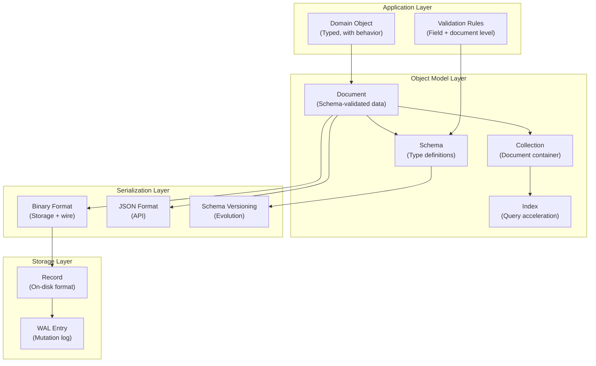
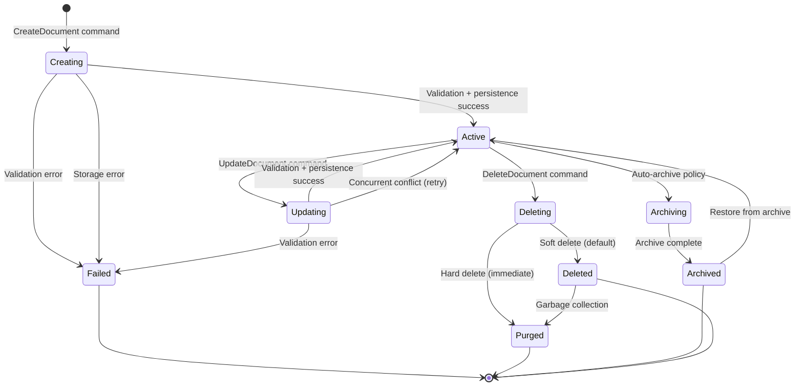
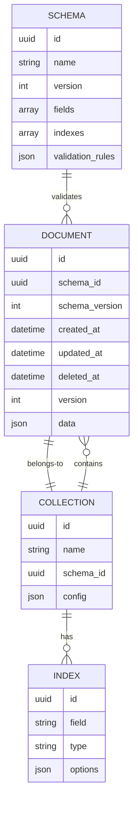
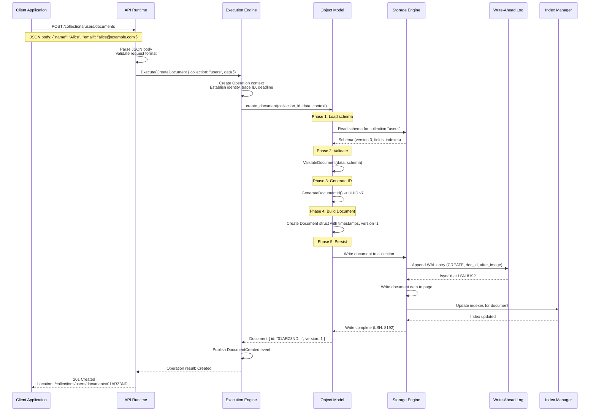
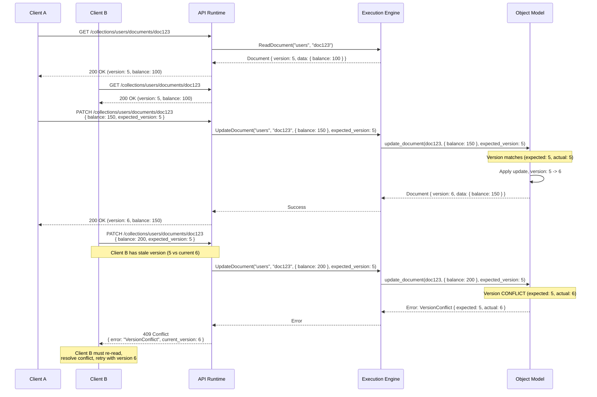
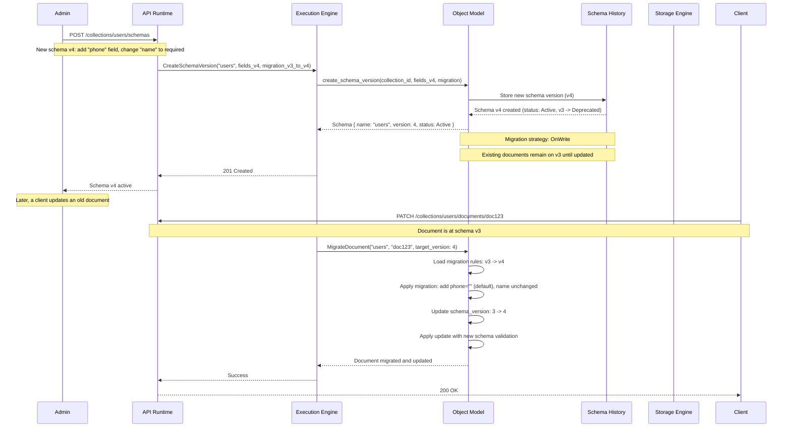

# 05 - Domain Model

## 1. Purpose

This document defines the complete domain model for Nova Runtime. The domain model is the conceptual foundation of the entire system — it defines what data looks like, how it is structured, how it relates, and how it behaves over its lifecycle. Every subsystem, every API, and every persistence decision derives from this domain model.

## 2. Scope

This document covers:

- The Document structure: every field, type, and constraint
- Typed schemas: schema definition language, field types, validation rules
- Relationships between domain objects: references, embedded documents, collections
- Object lifecycle: creation, updates, deletion, archival, garbage collection
- Serialization format: binary encoding, wire format, storage format
- Schema versioning: evolution strategies, migration, compatibility
- Validation rules: field-level, document-level, cross-document
- Collection model: container behavior, configuration, capabilities
- Type system: scalar types, compound types, special types
- Index model: index types, definitions, maintenance

This document does NOT cover:

- Storage engine internals (delegated to Storage Engine document)
- Execution engine pipeline (delegated to Execution Engine document)
- API layer specifics (delegated to REST/GraphQL documents)
- Subsystem-specific models (delegated to subsystem documents)

## 3. Responsibilities

The Domain Model document is responsible for:

- Defining the single, authoritative data model for all of Nova Runtime
- Ensuring consistency across all subsystems that read, write, or transform data
- Providing the type system that underpins schemas, indexes, and queries
- Defining the serialization format for storage and network transfer
- Establishing schema evolution rules for backward compatibility
- Serving as the single source of truth for data structure definitions

## 4. Non Responsibilities

This document does NOT:

- Define how data is stored on disk (Storage Engine document)
- Define how data is queried or manipulated (Execution Engine document)
- Define API request/response formats (API documents)
- Define caching behavior (Cache subsystem document)
- Define search indexing behavior (Search subsystem document)

## 5. Architecture

### 5.1 Domain Model Layers



### 5.2 Object Lifecycle State Machine



### 5.3 Schema and Document Relationship



## 6. Data Structures

### 6.1 Document

```rust
/// The fundamental data unit in Nova Runtime.
/// Every piece of user data stored in the system is a Document.
/// Total overhead: 80 bytes (fixed header) + field data.
struct Document {
    /// Universally unique identifier (UUID v7 - time-ordered)
    /// 16 bytes: time_high (6) + time_mid (2) + version (2) + variant (1) + node (5)
    /// Enables time-ordered clustering for B-Tree efficiency
    id: Uuid,                           // 16 bytes
    
    /// Collection this document belongs to
    collection_id: Uuid,                // 16 bytes
    
    /// Schema version used when this document was last written
    /// Enables schema evolution: readers can use this to select
    /// the correct deserialization logic
    schema_version: U32,                // 4 bytes
    
    /// Monotonically increasing version counter
    /// Starts at 1, incremented on every update
    /// Used for optimistic concurrency control
    version: U64,                       // 8 bytes
    
    /// Timestamp when the document was created
    /// Nanosecond precision, UTC
    created_at: Timestamp,              // 8 bytes
    
    /// Timestamp when the document was last modified
    /// Updated on every mutation
    updated_at: Timestamp,              // 8 bytes
    
    /// Timestamp when the document was soft-deleted
    /// NULL if not deleted (Option<Timestamp>)
    deleted_at: Option<Timestamp>,      // 8 bytes (0 = None)
    
    /// The actual document data, schema-validated
    /// Encoded in the internal binary format (see Serialization)
    /// Maximum: 16,777,184 bytes (16 MB - 32 bytes header)
    data: Bytes,                        // variable, max 16 MB
    
    // Total fixed overhead: 68 bytes + data
    // Total with all options: ~80 bytes
}

/// Constraints on Document:
/// - id must be non-nil UUID v7
/// - schema_version must be >= 1
/// - version must be >= 1
/// - created_at must be <= updated_at
/// - data must be valid per schema identified by schema_version
/// - data must be <= 16,777,184 bytes
```

### 6.2 Collection

```rust
/// A container for Documents.
/// Collections are the primary organizational unit in Nova Runtime.
/// They are analogous to tables in SQL or collections in MongoDB.
struct Collection {
    /// Unique identifier
    id: Uuid,                          // 16 bytes
    
    /// Human-readable name
    /// Must match: ^[a-zA-Z][a-zA-Z0-9_]{2,63}$
    /// 3-64 characters, alphanumeric + underscore, starting with letter
    name: String,                       // 3-64 bytes (UTF-8)
    
    /// Optional schema binding
    /// If set, all documents in this collection must conform to this schema
    schema_id: Option<Uuid>,           // 16 bytes (0 = None)
    
    /// Collection configuration
    config: CollectionConfig,          // variable
    
    /// Timestamps
    created_at: Timestamp,             // 8 bytes
    updated_at: Timestamp,             // 8 bytes
    
    /// Document count (approximate, for statistics)
    /// Updated periodically, not in real-time
    document_count: U64,               // 8 bytes
    
    /// Total data size (approximate, for statistics)
    data_size_bytes: U64,              // 8 bytes
}

struct CollectionConfig {
    /// Whether to soft-delete (default: true)
    soft_delete: bool,                 // 1 byte
    
    /// Whether to enforce schema (default: true for typed, false for untyped)
    enforce_schema: bool,              // 1 byte
    
    /// Maximum document size in bytes (default: 16 MB)
    max_document_size: U32,            // 4 bytes
    
    /// Default TTL for documents in seconds (0 = no TTL, max: 2,592,000 = 30 days)
    default_ttl_seconds: Option<U32>,  // 4 bytes (0 = None)
    
    /// Archive policy
    archive_policy: Option<ArchivePolicy>, // variable
    
    /// Maximum number of indexes (default: 16, max: 64)
    max_indexes: U8,                   // 1 byte
    
    /// Whether to enable history/versioning (default: false)
    enable_versioning: bool,           // 1 byte
}

struct ArchivePolicy {
    /// Age in seconds after which documents are auto-archived
    /// Minimum: 2,592,000 (30 days)
    archive_after_seconds: U64,        // 8 bytes
    
    /// Compression algorithm for archived data
    compression: CompressionType,      // 1 byte (None, LZ4, Zstd)
    
    /// Whether archived documents are still queryable (slower)
    queryable: bool,                   // 1 byte
}

enum CompressionType {
    None,  // No compression
    LZ4,   // Fast compression/decompression
    Zstd,  // Better compression ratio, slower
}
```

### 6.3 Schema

```rust
/// Defines the structure of documents within a typed collection.
/// Schema evolution is handled via versioning (see SchemaVersion).
struct Schema {
    /// Unique identifier
    id: Uuid,                           // 16 bytes
    
    /// Human-readable name
    name: String,                       // 1-128 bytes
    
    /// Version number (starts at 1, increments on schema changes)
    version: U32,                       // 4 bytes
    
    /// The collection this schema is associated with
    collection_id: Uuid,                // 16 bytes
    
    /// Field definitions
    fields: Vec<FieldDefinition>,       // variable
    
    /// Index definitions
    indexes: Vec<IndexDefinition>,      // variable
    
    /// Document-level validation rules
    validation_rules: Vec<ValidationRule>, // variable
    
    /// Timestamps
    created_at: Timestamp,              // 8 bytes
    updated_at: Timestamp,              // 8 bytes
    
    /// Status of this schema version
    status: SchemaStatus,               // 1 byte
    
    /// Migration rules from previous version
    migration: Option<MigrationRule>,   // variable
}

enum SchemaStatus {
    Active,       // Current version, new documents use this
    Deprecated,   // Still valid for reading, but new docs should use newer version
    Archived,     // Historical, only used for reading very old documents
}

struct FieldDefinition {
    /// Field name (e.g., "user.email", "address.city")
    /// Dotted notation for nested fields
    path: String,                       // variable
    
    /// Data type
    field_type: FieldType,              // 1 byte
    
    /// Whether this field is required
    required: bool,                     // 1 byte
    
    /// Default value (for optional fields)
    default_value: Option<Value>,       // variable
    
    /// Validation constraints for this field
    constraints: Vec<FieldConstraint>,  // variable
    
    /// Human-readable description
    description: Option<String>,        // variable
}

enum FieldType {
    // Scalar types
    Null,              // 0 bytes - represents absence of value
    Bool,              // 1 byte
    I8,                // 1 byte - signed 8-bit integer
    I16,               // 2 bytes - signed 16-bit integer
    I32,               // 4 bytes - signed 32-bit integer
    I64,               // 8 bytes - signed 64-bit integer
    U8,                // 1 byte - unsigned 8-bit integer
    U16,               // 2 bytes - unsigned 16-bit integer
    U32,               // 4 bytes - unsigned 32-bit integer
    U64,               // 8 bytes - unsigned 64-bit integer
    F32,               // 4 bytes - IEEE 754 single precision
    F64,               // 8 bytes - IEEE 754 double precision
    String,            // variable - UTF-8 encoded string, max 65,535 bytes
    Bytes,             // variable - binary data, max 16 MB
    Date,              // 4 bytes - days since Unix epoch (int32)
    DateTime,          // 8 bytes - nanoseconds since Unix epoch
    Timestamp,         // 8 bytes - same as DateTime
    Uuid,              // 16 bytes - UUID
    Decimal128,        // 16 bytes - IEEE 754 decimal128
    
    // Compound types
    Array(FieldType),      // variable - homogeneous array
    Map(FieldType),        // variable - homogeneous map (string keys)
    Document,              // variable - nested document (no fixed schema)
    
    // Special types
    Any,                   // variable - any type, no validation
    Reference,             // 16 bytes - UUID reference to another document
    GeoPoint,              // 16 bytes - (longitude, latitude) as f64 pair
    GeoShape,              // variable - GeoJSON geometry
    Vector(f32),           // variable - embedding vector for similarity search
}

impl FieldType {
    fn discriminant_size(&self) -> usize {
        match self {
            Null => 0,
            Bool => 1,
            I8 | U8 => 1,
            I16 | U16 => 2,
            I32 | U32 | F32 => 4,
            I64 | U64 | F64 | Date | DateTime | Timestamp | Uuid | Decimal128 | GeoPoint => 8,
            Reference => 16,
            String => 0,  // variable
            Bytes => 0,   // variable
            Array(_) => 0, // variable
            Map(_) => 0,   // variable
            Document => 0, // variable
            Any => 0,      // variable
            GeoShape => 0, // variable
            Vector(_) => 0, // variable
        }
    }
}

struct FieldConstraint {
    constraint_type: ConstraintType,
    value: ConstraintValue,
}

enum ConstraintType {
    MinLength(U32),           // Minimum string length
    MaxLength(U32),           // Maximum string length (default 65,535)
    MinValue(f64),            // Minimum numeric value
    MaxValue(f64),            // Maximum numeric value
    Pattern(String),          // Regex pattern for strings
    Enum(Vec<Value>),         // Allowed values
    Range(Value, Value),      // Inclusive range
    Unique,                   // Unique across collection
    Required,                 // Non-null constraint
    Immutable,                // Cannot be changed after creation
}

struct ValidationRule {
    /// Name for error reporting
    name: String,
    
    /// Validation expression (simplified predicate language)
    /// Example: "age >= 0 AND age <= 150"
    /// Example: "email CONTAINS '@'"
    /// Example: "status IN ['active', 'inactive']"
    expression: String,
    
    /// Error message template
    error_message: String,
    
    /// Severity (Error rejects, Warning logs)
    severity: RuleSeverity,
}

enum RuleSeverity {
    Error,    // Document is rejected
    Warning,  // Document is accepted with warning logged
}

struct MigrationRule {
    /// Source schema version
    from_version: U32,
    
    /// Target schema version
    to_version: U32,
    
    /// Migration function or expression
    /// Transforms data from old format to new format
    /// Syntax: field mapping expressions
    /// Example: "user.name = user.first_name + ' ' + user.last_name"
    mapping: String,
    
    /// Whether migration is backward-compatible
    backward_compatible: bool,
    
    /// Whether migration is lossless
    lossless: bool,
    
    /// Migration strategy
    strategy: MigrationStrategy,
}

enum MigrationStrategy {
    /// Transform on read (document stays in old format on disk,
    /// transformed to new format when read)
    OnRead,
    
    /// Transform on write (document is transformed when next updated)
    OnWrite,
    
    /// Background migration (gradually migrate all documents in background)
    Background {
        batch_size: U32,       // Documents per batch
        max_speed: U32,        // Documents per second
    },
    
    /// Immediate migration (rewrite all documents now)
    /// Only for small collections or planned downtime
    Immediate {
        max_downtime_seconds: U32,
    },
}
```

### 6.4 Index

```rust
/// An index on a collection that accelerates queries.
struct IndexDefinition {
    /// Unique identifier
    id: Uuid,                           // 16 bytes
    
    /// The collection this index belongs to
    collection_id: Uuid,                // 16 bytes
    
    /// Index name (unique per collection)
    name: String,                       // 1-64 bytes
    
    /// The field path to index (e.g., "user.email", "addresses[].zip")
    field_path: String,                 // variable
    
    /// Index type
    index_type: IndexType,              // 1 byte
    
    /// Index options
    options: IndexOptions,              // variable
    
    /// Current status
    status: IndexStatus,                // 1 byte
    
    /// Stats
    size_bytes: U64,                    // 8 bytes
    entry_count: U64,                   // 8 bytes
}

enum IndexType {
    /// Hash index: O(1) exact match lookups
    /// Best for: equality queries, unique constraints
    /// Not for: range queries, sorting, partial matches
    Hash,
    
    /// B-Tree index: O(log N) lookups, O(log N + K) range scans
    /// Best for: equality, range queries, sorting
    /// Supports: <, <=, ==, >=, >, BETWEEN, IN, ORDER BY
    BTree,
    
    /// Inverted index: O(K) full-text search
    /// Best for: text search, relevance ranking
    /// Supports: term search, phrase search, prefix search
    Inverted {
        /// Tokenizer configuration
        tokenizer: TokenizerConfig,
        
        /// Language for stemming
        language: String,  // "english", "none"
        
        /// Whether to store term positions (for phrase queries)
        store_positions: bool,  // default: false
    },
    
    /// Spatial index: R-Tree based
    /// Best for: geo-distance queries, bounding box
    /// Deferred: not in MVP
    Spatial {
        geo_type: GeoType,  // Point, LineString, Polygon
    },
}

struct TokenizerConfig {
    /// Minimum token length (default: 2)
    min_token_length: U8,
    
    /// Maximum token length (default: 50)
    max_token_length: U8,
    
    /// Stop words list
    stop_words: Vec<String>,
    
    /// Whether to lowercase (default: true)
    lowercase: bool,
    
    /// Whether to apply stemming (default: false)
    stemming: bool,
}

struct IndexOptions {
    /// Whether the index enforces uniqueness (valid for Hash and BTree)
    unique: bool,
    
    /// Whether the index is sparse (only indexes documents with the field)
    sparse: bool,
    
    /// Whether the index is built in background (vs blocking)
    background: bool,
    
    /// Partial filter expression (only index matching documents)
    /// Example: "status = 'active'"
    partial_filter: Option<String>,
    
    /// Expire documents after this many seconds (TTL index)
    /// Only valid for BTree indexes on DateTime fields
    expire_after_seconds: Option<U64>,
}

enum IndexStatus {
    Creating,    // Index is being built
    Active,      // Index is operational
    Updating,    // Index is being rebuilt
    Corrupt,     // Index is corrupt, needs rebuild
    Deleting,    // Index is being deleted
}
```

### 6.5 Value

```rust
/// A dynamically-typed value in the Nova Runtime type system.
/// Used for field values, default values, and query parameters.
enum Value {
    Null,
    Bool(bool),
    I8(i8),
    I16(i16),
    I32(i32),
    I64(i64),
    U8(u8),
    U16(u16),
    U32(u32),
    U64(u64),
    F32(f32),
    F64(f64),
    String(String),
    Bytes(Vec<u8>),
    Date(i32),                    // Days since Unix epoch
    DateTime(i64),                // Nanoseconds since Unix epoch
    Timestamp(i64),               // Nanoseconds since Unix epoch
    Uuid([u8; 16]),
    Decimal128([u8; 16]),
    Array(Vec<Value>),
    Map(BTreeMap<String, Value>),
    Document(BTreeMap<String, Value>),
    GeoPoint { lon: f64, lat: f64 },
    GeoShape(GeoJsonGeometry),    // Variable
    Vector(Vec<f32>),             // Embedding vector
}

impl Value {
    /// Size of the value in bytes (serialized form estimate)
    fn serialized_size(&self) -> u64 {
        match self {
            Null => 1,
            Bool(_) => 2,
            I8(_) | U8(_) => 2,
            I16(_) | U16(_) => 3,
            I32(_) | U32(_) | F32(_) => 5,
            I64(_) | U64(_) | F64(_) | Date(_) | DateTime(_) | Timestamp(_) => 9,
            Uuid(_) => 17,
            Decimal128(_) => 17,
            String(s) => 1 + 4 + s.len() as u64,  // type tag + length + data
            Bytes(b) => 1 + 4 + b.len() as u64,
            Array(items) => 1 + 4 + items.iter().map(|v| v.serialized_size()).sum::<u64>(),
            Map(entries) => 1 + 4 + entries.iter().map(|(k, v)| 4 + k.len() as u64 + v.serialized_size()).sum::<u64>(),
            Document(entries) => 1 + 4 + entries.iter().map(|(k, v)| 4 + k.len() as u64 + v.serialized_size()).sum::<u64>(),
            GeoPoint { .. } => 17,
            GeoShape(_) => 1 + 4 + todo!(),
            Vector(v) => 1 + 4 + (v.len() * 4) as u64,
        }
    }
    
    /// Convert to JSON value for API serialization
    fn to_json(&self) -> serde_json::Value { todo!() }
    
    /// Create from JSON value
    fn from_json(value: serde_json::Value) -> Result<Self, ValidationError> { todo!() }
}
```

### 6.6 Schema Version History

```rust
/// Tracks all versions of a schema for evolution management.
struct SchemaVersionHistory {
    /// The schema ID (consistent across versions)
    schema_id: Uuid,
    
    /// All versions, ordered by version number
    versions: Vec<SchemaVersionEntry>,
    
    /// Current active version
    active_version: U32,
}

struct SchemaVersionEntry {
    /// Version number
    version: U32,
    
    /// The schema definition at this version
    schema: Schema,
    
    /// When this version was created
    created_at: Timestamp,
    
    /// Migration from previous version (None for version 1)
    migration_from_prev: Option<MigrationRule>,
    
    /// Number of documents still using this version
    /// (decreases as documents are migrated forward)
    document_count: U64,
    
    /// Status
    status: SchemaStatus,
}

/// Constraints on Schema Version History:
/// - version numbers are sequential (1, 2, 3, ...)
/// - each version must be backward-compatible unless explicit breaking change
/// - breaking changes require a migration rule
/// - a schema can never be deleted, only deprecated
/// - at most 1,000 versions per schema (practical limit for safety)
```

### 6.7 Document Reference

```rust
/// A reference from one document to another.
/// Uses UUID-based references to maintain consistency.
struct DocumentReference {
    /// The collection containing the referenced document
    collection_id: Uuid,
    
    /// The referenced document's ID
    document_id: Uuid,
    
    /// Optional display label (denormalized for convenience)
    label: Option<String>,
    
    /// Reference type (for semantic meaning)
    ref_type: ReferenceType,
}

enum ReferenceType {
    /// Strong reference: prevents deletion of target
    /// Deleting a strongly-referenced document fails unless the reference is removed
    Strong,
    
    /// Weak reference: target can be deleted independently
    /// Read returns null if target is deleted (no integrity enforcement)
    Weak,
    
    /// Soft reference: purely informational
    /// No integrity checks, used for denormalized relationships
    Soft,
}

/// Constraints:
/// - Strong references create a reference count on the target document
/// - Target document cannot be hard-deleted while strong references exist
/// - Soft-delete is allowed (reference returns deleted document)
/// - Weak references may dangle if target is hard-deleted
```

### 6.8 Validation Error

```rust
/// Structured validation error for schema violations.
struct ValidationError {
    /// Human-readable error message
    message: String,
    
    /// Path to the field that failed validation
    field_path: String,
    
    /// The validation rule that was violated
    constraint: Option<ConstraintType>,
    
    /// The value that failed validation
    invalid_value: Option<Value>,
    
    /// Expected value or constraint description
    expected: Option<String>,
    
    /// Error code for programmatic handling
    code: ValidationErrorCode,
}

enum ValidationErrorCode {
    RequiredFieldMissing,
    FieldTypeMismatch,
    ValueOutOfRange,
    StringTooLong,
    StringTooShort,
    PatternMismatch,
    ValueNotAllowed,      // Enum constraint
    UniqueConstraintViolation,
    ImmutableFieldViolation,
    MaxDocumentSizeExceeded,
    InvalidNestedDocument,
    CircularReference,
    InvalidDocumentReference,
    SchemaVersionMismatch,
    ValidationRuleFailed,
    CollectionNotFound,
    SchemaNotFound,
}
```

## 7. Algorithms

### 7.1 Document Validation Algorithm

```
FUNCTION ValidateDocument(
    document: Document,
    schema: Schema,
    collection: Collection
) -> Vec<ValidationError>
    
    errors = []
    
    // Phase 1: Structural validation
    // Check document size
    IF document.data.serialized_size() > collection.config.max_document_size:
        errors.push(ValidationError {
            code: MaxDocumentSizeExceeded,
            field_path: "$",
            message: "Document exceeds maximum size of " + 
                     collection.config.max_document_size + " bytes"
        })
        RETURN errors  // Early return on structural violation
    END IF
    
    // Phase 2: No schema - only size validation
    IF schema IS None:
        RETURN errors  // Schema-less collection accepts any valid-size document
    END IF
    
    // Phase 3: Schema validation
    data = DESERIALIZE(document.data)
    
    // Phase 3a: Required field check
    FOR EACH field IN schema.fields WHERE field.required:
        IF NOT data.has_path(field.path):
            errors.push(ValidationError {
                code: RequiredFieldMissing,
                field_path: field.path,
                message: "Required field '" + field.path + "' is missing"
            })
        END IF
    END FOR
    
    // Phase 3b: Type validation
    FOR EACH (path, value) IN data.flatten():
        field_def = schema.fields.find(f -> f.path == path)
        IF field_def IS Some:
            IF NOT TYPE_CHECK(value, field_def.field_type):
                errors.push(ValidationError {
                    code: FieldTypeMismatch,
                    field_path: path,
                    message: "Expected " + field_def.field_type + 
                             " but got " + value.type_name()
                })
            END IF
            
            // Phase 3c: Constraint validation
            FOR EACH constraint IN field_def.constraints:
                constraint_errors = CHECK_CONSTRAINT(value, constraint)
                errors.extend(constraint_errors)
            END FOR
        END IF
    END FOR
    
    // Phase 3d: Document-level validation rules
    FOR EACH rule IN schema.validation_rules:
        IF NOT EVALUATE_EXPRESSION(rule.expression, data):
            errors.push(ValidationError {
                code: ValidationRuleFailed,
                field_path: "$",
                message: rule.error_message
            })
        END IF
    END FOR
    
    // Phase 4: Unique constraint check (requires DB lookup)
    unique_indexes = schema.indexes.filter(i -> i.options.unique)
    FOR EACH index IN unique_indexes:
        value = data.get_path(index.field_path)
        IF value IS Some:
            IF CHECK_UNIQUE(value, index):
                errors.push(ValidationError {
                    code: UniqueConstraintViolation,
                    field_path: index.field_path,
                    message: "Value already exists for unique index '" + 
                             index.name + "'"
                })
            END IF
        END IF
    END FOR
    
    RETURN errors
END FUNCTION

FUNCTION TYPE_CHECK(value: Value, expected_type: FieldType) -> Boolean
    SWITCH (value, expected_type):
        CASE (Null, _): RETURN false  // Null only matches Null type (or Any)
        CASE (_, Null): RETURN false
        CASE (_, Any): RETURN true
        CASE (Bool(_), Bool): RETURN true
        CASE (I8(_), I8): RETURN true
        CASE (I16(_), I16 | I32 | I64 | F64): RETURN true  // Numeric widening
        CASE (I32(_), I32 | I64 | F64): RETURN true
        CASE (I64(_), I64 | F64): RETURN true
        CASE (U8(_), U8 | U16 | U32 | U64 | F64): RETURN true
        CASE (U16(_), U16 | U32 | U64 | F64): RETURN true
        CASE (U32(_), U32 | U64 | F64): RETURN true
        CASE (U64(_), U64 | F64): RETURN true
        CASE (F32(_), F32 | F64): RETURN true
        CASE (F64(_), F64): RETURN true
        CASE (String(_), String): RETURN true
        CASE (Bytes(_), Bytes): RETURN true
        CASE (Date(_), Date): RETURN true
        CASE (DateTime(_), DateTime | Timestamp): RETURN true
        CASE (Timestamp(_), DateTime | Timestamp): RETURN true
        CASE (Uuid(_), Uuid): RETURN true
        CASE (Decimal128(_), Decimal128): RETURN true
        CASE (Array(items), Array(element_type)):
            RETURN items.all(item -> TYPE_CHECK(item, element_type))
        CASE (Map(entries), Map(value_type)):
            RETURN entries.values().all(v -> TYPE_CHECK(v, value_type))
        CASE (Document(_), Document): RETURN true  // Schema-less nested doc
        CASE (GeoPoint{..}, GeoPoint): RETURN true
        CASE (GeoShape(_), GeoShape): RETURN true
        CASE (Vector(_), Vector(_)): RETURN true
        DEFAULT: RETURN false
    END SWITCH
END FUNCTION
```

### 7.2 Document ID Generation

```
FUNCTION GenerateDocumentId() -> Uuid
    // UUID v7: time-ordered UUID with random suffix
    // Format: (48-bit timestamp) | (12-bit version=0111) | (62-bit random) | (2-bit variant=10)
    
    // This produces IDs that sort chronologically,
    // enabling efficient B-Tree insertion clustering
    
    timestamp_ms = CURRENT_TIME_MS()                  // 48-bit Unix timestamp in milliseconds
    version_bits = 0b0111                             // 4-bit version field (UUID v7)
    random_a = RANDOM_U62()                           // 62-bit random value
    variant_bits = 0b10                               // 2-bit variant (RFC 4122)
    
    // Layout:
    // Bytes 0-5:  48-bit timestamp (big-endian)
    // Bytes 6-7:  4-bit version + 12-bit random
    // Bytes 8-15: 62-bit random + 2-bit variant
    
    uuid = Uuid([
        timestamp_ms >> 40,            // Byte 0: timestamp bits 47-40
        timestamp_ms >> 32,            // Byte 1: timestamp bits 39-32
        timestamp_ms >> 24,            // Byte 2: timestamp bits 31-24
        timestamp_ms >> 16,            // Byte 3: timestamp bits 23-16
        timestamp_ms >> 8,             // Byte 4: timestamp bits 15-8
        timestamp_ms & 0xFF,           // Byte 5: timestamp bits 7-0
        (random_a >> 36) | 0x70,       // Byte 6: version (0111) + high random
        (random_a >> 28) & 0xFF,       // Byte 7: random
        (random_a >> 20) & 0xFF,       // Byte 8: random
        (random_a >> 12) & 0xFF,       // Byte 9: random
        (random_a >> 10) & 0x3F | 0x80,// Byte 10: variant (10) + random
        (random_a >> 2) & 0xFF,        // Byte 11: random
        (random_a << 6) & 0xFF,        // Byte 12: random
        RANDOM_U8(),                    // Byte 13: random (extra entropy)
        RANDOM_U8(),                    // Byte 14: random
        RANDOM_U8(),                    // Byte 15: random
    ])
    
    RETURN uuid
END FUNCTION
```

### 7.3 Schema Migration Algorithm

```
FUNCTION MigrateDocument(
    document: Document,
    target_schema: Schema,
    history: SchemaVersionHistory
) -> Result<Document, MigrationError>
    
    current_version = document.schema_version
    target_version = target_schema.version
    
    IF current_version == target_version:
        RETURN Ok(document)  // Already at target version
    END IF
    
    IF current_version > target_version:
        RETURN Err(MigrationError {
            message: "Cannot migrate to older version (" + +current_version + " > " + 
                     +target_version + ")"
        })
    END IF
    
    // Find migration path: current -> current+1 -> ... -> target
    data = DESERIALIZE(document.data)
    
    FOR version = current_version + 1 TO target_version:
        entry = history.versions.find(v -> v.version == version)
        
        IF entry IS None:
            RETURN Err(MigrationError {
                message: "Missing schema version " + version + " in history"
            })
        END IF
        
        migration = entry.migration_from_prev
        
        IF migration IS Some:
            // Apply migration rules
            data = APPLY_MIGRATION(data, migration)
        END IF
    END FOR
    
    // Update document metadata
    updated = Document {
        ..document,
        schema_version: target_version,
        updated_at: NOW(),
        version: document.version + 1,  // Migration counts as an update
        data: SERIALIZE(data),
    }
    
    RETURN Ok(updated)
END FUNCTION

FUNCTION APPLY_MIGRATION(
    data: BTreeMap<String, Value>,
    migration: MigrationRule
) -> BTreeMap<String, Value>
    
    // Parse migration expressions and transform data
    // Simple field mapping:
    //   "user.name = user.first_name + ' ' + user.last_name"
    //   "address = address.old_address"
    //   "DROP field_x"
    
    FOR EACH mapping_expr IN migration.mapping:
        EXECUTE_MAPPING(data, mapping_expr)
    END FOR
    
    RETURN data
END FUNCTION
```

### 7.4 Document Lifecycle State Transitions

```
FUNCTION ApplyLifecycleTransition(
    document: Document,
    command: LifecycleCommand,
    context: ExecutionContext
) -> Result<Document, LifecycleError>
    
    SWITCH command:
        CASE Create:
            IF document.id IS None:
                document.id = GenerateDocumentId()
            END IF
            IF document.created_at IS None:
                document.created_at = NOW()
            END IF
            document.updated_at = NOW()
            document.version = 1
            document.schema_version = context.schema.version
            document.deleted_at = None
            
            // Validate before creation
            errors = ValidateDocument(document, context.schema, context.collection)
            IF NOT errors.is_empty():
                RETURN Err(LifecycleError::ValidationFailed(errors))
            END IF
            RETURN Ok(document)
        
        CASE Update(new_data):
            IF document.deleted_at IS Some:
                RETURN Err(LifecycleError::DocumentDeleted(document.id))
            END IF
            
            // Check optimistic concurrency
            IF context.expected_version IS Some AND 
               context.expected_version != document.version:
                RETURN Err(LifecycleError::VersionConflict {
                    expected: context.expected_version,
                    actual: document.version
                })
            END IF
            
            // Merge new data into existing
            merged = DEEP_MERGE(document.data, new_data)
            document.data = merged
            document.version += 1
            document.updated_at = NOW()
            
            // Validate
            errors = ValidateDocument(document, context.schema, context.collection)
            IF NOT errors.is_empty():
                RETURN Err(LifecycleError::ValidationFailed(errors))
            END IF
            
            // Check TTL
            IF context.collection.config.default_ttl_seconds IS Some:
                ttl = context.collection.config.default_ttl_seconds
                // No action on update; TTL is checked on read
            END IF
            
            RETURN Ok(document)
        
        CASE Delete(soft: true):
            IF document.deleted_at IS Some:
                RETURN Err(LifecycleError::AlreadyDeleted(document.id))
            END IF
            
            // Check strong references
            ref_count = GET_REFERENCE_COUNT(document.id)
            IF ref_count > 0:
                RETURN Err(LifecycleError::HasStrongReferences {
                    document_id: document.id,
                    reference_count: ref_count
                })
            END IF
            
            document.deleted_at = NOW()
            document.version += 1
            document.updated_at = NOW()
            RETURN Ok(document)
        
        CASE Delete(soft: false):
            // Hard delete
            // Note: this is handled by storage engine; here we just validate
            RETURN Ok(document)  // Storage engine handles actual removal
        
        CASE Restore:
            IF document.deleted_at IS None:
                RETURN Err(LifecycleError::NotDeleted(document.id))
            END IF
            
            document.deleted_at = None
            document.version += 1
            document.updated_at = NOW()
            RETURN Ok(document)
        
        CASE Purge:
            // Permanent removal - no return
            // Handled by garbage collection after deletion grace period
            RETURN Ok(document)
    
    END SWITCH
END FUNCTION
```

## 8. Interfaces

### 8.1 Object Model API

```rust
/// Core Object Model interface.
/// Every subsystem accesses data through this interface.
trait ObjectModel {
    // Document operations
    
    /// Create a new document in a collection.
    /// Returns the document with generated ID.
    fn create_document(
        collection_id: Uuid,
        data: Value,
        context: ExecutionContext,
    ) -> Result<Document, ObjectModelError>;
    
    /// Read a document by ID.
    /// Returns None if document does not exist (or is soft-deleted).
    fn read_document(
        collection_id: Uuid,
        document_id: Uuid,
        context: ExecutionContext,
    ) -> Result<Option<Document>, ObjectModelError>;
    
    /// Update a document (partial update - merges new data).
    fn update_document(
        collection_id: Uuid,
        document_id: Uuid,
        data: Value,
        expected_version: Option<U64>,
        context: ExecutionContext,
    ) -> Result<Document, ObjectModelError>;
    
    /// Replace a document (full replacement).
    fn replace_document(
        collection_id: Uuid,
        document_id: Uuid,
        data: Value,
        expected_version: Option<U64>,
        context: ExecutionContext,
    ) -> Result<Document, ObjectModelError>;
    
    /// Soft-delete a document.
    fn delete_document(
        collection_id: Uuid,
        document_id: Uuid,
        context: ExecutionContext,
    ) -> Result<(), ObjectModelError>;
    
    /// Hard-delete a document (permanent).
    fn purge_document(
        collection_id: Uuid,
        document_id: Uuid,
        context: ExecutionContext,
    ) -> Result<(), ObjectModelError>;
    
    // Collection operations
    
    /// Create a collection.
    fn create_collection(
        name: &str,
        schema: Option<Schema>,
        config: CollectionConfig,
        context: ExecutionContext,
    ) -> Result<Collection, ObjectModelError>;
    
    /// Get a collection by name.
    fn get_collection(
        name: &str,
        context: ExecutionContext,
    ) -> Result<Option<Collection>, ObjectModelError>;
    
    /// List all collections (paginated).
    fn list_collections(
        pagination: Pagination,
        context: ExecutionContext,
    ) -> Result<PaginatedResult<Collection>, ObjectModelError>;
    
    /// Drop a collection and all its documents.
    fn drop_collection(
        collection_id: Uuid,
        context: ExecutionContext,
    ) -> Result<(), ObjectModelError>;
    
    // Schema operations
    
    /// Create a new schema version.
    fn create_schema_version(
        collection_id: Uuid,
        fields: Vec<FieldDefinition>,
        indexes: Vec<IndexDefinition>,
        validation_rules: Vec<ValidationRule>,
        migration: Option<MigrationRule>,
        context: ExecutionContext,
    ) -> Result<Schema, ObjectModelError>;
    
    /// Get current schema for a collection.
    fn get_current_schema(
        collection_id: Uuid,
        context: ExecutionContext,
    ) -> Result<Option<Schema>, ObjectModelError>;
    
    /// Get a specific schema version.
    fn get_schema_version(
        schema_id: Uuid,
        version: U32,
        context: ExecutionContext,
    ) -> Result<Option<Schema>, ObjectModelError>;
    
    // Index operations
    
    /// Create an index.
    fn create_index(
        collection_id: Uuid,
        definition: IndexDefinition,
        context: ExecutionContext,
    ) -> Result<IndexDefinition, ObjectModelError>;
    
    /// Drop an index.
    fn drop_index(
        index_id: Uuid,
        context: ExecutionContext,
    ) -> Result<(), ObjectModelError>;
    
    /// List indexes for a collection.
    fn list_indexes(
        collection_id: Uuid,
        context: ExecutionContext,
    ) -> Result<Vec<IndexDefinition>, ObjectModelError>;
    
    // Validation
    
    /// Validate a document without creating it.
    fn validate_document(
        collection_id: Uuid,
        data: Value,
        schema_version: Option<U32>,
        context: ExecutionContext,
    ) -> Result<Vec<ValidationError>, ObjectModelError>;
    
    // Migration
    
    /// Migrate a document to the latest schema version.
    fn migrate_document(
        collection_id: Uuid,
        document_id: Uuid,
        target_version: U32,
        context: ExecutionContext,
    ) -> Result<Document, ObjectModelError>;
}

enum ObjectModelError {
    CollectionNotFound(Uuid),
    DocumentNotFound(Uuid),
    DocumentDeleted(Uuid),
    VersionConflict { expected: U64, actual: U64 },
    ValidationFailed(Vec<ValidationError>),
    SchemaNotFound(Uuid),
    SchemaVersionNotFound { schema_id: Uuid, version: U32 },
    MigrationFailed(String),
    IndexNotFound(Uuid),
    DuplicateIndex(String),
    UniqueConstraintViolation { index: String, value: String },
    ReferenceExists { document_id: Uuid, reference_count: U64 },
    MaxIndexLimitExceeded { current: U8, max: U8 },
    MaxDocumentSizeExceeded { size: U64, max: U64 },
    Internal(String),
}
```

### 8.2 Serialization Interface

```rust
/// Serialization and deserialization interface.
trait Serialization {
    /// Serialize a Value into the internal binary format.
    fn serialize(value: &Value) -> Vec<u8>;
    
    /// Deserialize from the internal binary format.
    fn deserialize(data: &[u8]) -> Result<Value, DeserializationError>;
    
    /// Serialize a Document to JSON (for API responses).
    fn document_to_json(doc: &Document) -> Result<Vec<u8>, SerializationError>;
    
    /// Deserialize a Document from JSON (for API requests).
    fn document_from_json(
        data: &[u8],
        schema: Option<&Schema>,
    ) -> Result<Value, DeserializationError>;
    
    /// Serialize a Document to the storage binary format.
    fn document_to_record(doc: &Document) -> Vec<u8>;
    
    /// Deserialize a Document from the storage binary format.
    fn document_from_record(data: &[u8]) -> Result<Document, DeserializationError>;
    
    /// Get the serialized size of a value.
    fn serialized_size(value: &Value) -> u64;
}

enum DeserializationError {
    InvalidHeader,
    ChecksumMismatch { expected: u32, actual: u32 },
    UnsupportedVersion(u32),
    InvalidFieldType(u8),
    TruncatedData,
    InvalidUtf8,
    NestedTooDeep(u32),     // Max nesting depth exceeded (default 64)
    UnexpectedEndOfData,
}

enum SerializationError {
    ValueTooLarge(u64),
    UnsupportedType,
}
```

## 9. Sequence Diagrams

### 9.1 Document Creation Flow



### 9.2 Document Update with Version Conflict



### 9.3 Schema Migration Flow



## 10. Failure Modes

### 10.1 Schema Migration Failure

| Attribute | Value |
|-----------|-------|
| **Cause** | Migration rule cannot be applied to existing data (e.g., required field with no default and no existing data) |
| **Detection** | Migration algorithm returns MigrationError |
| **Effect** | Document migration fails, document stays at old schema version, application-level errors on read |
| **Severity** | High |
| **Likelihood** | Medium |

**Prevention:**
- Schema changes must be backward-compatible (additive) unless explicit breaking change
- Required fields must have default values when added to existing schema
- Migration rules must be tested against sample data from all previous versions
- Migration must be validated before schema version is activated

### 10.2 Schema Version Explosion

| Attribute | Value |
|-----------|-------|
| **Cause** | Too many schema versions created, causing performance degradation in version lookup and migration path traversal |
| **Detection** | Schema version count monitoring, migration time increase |
| **Effect** | Slow migrations, increased memory usage for version metadata |
| **Severity** | Medium |
| **Likelihood** | Low |

**Prevention:**
- Enforce maximum 1,000 schema versions per schema
- Archive old versions after N versions
- Warning at 100 versions, blocking at 1,000
- Schema compaction: periodically consolidate small incremental changes

### 10.3 Document Version Explosion

| Attribute | Value |
|-----------|-------|
| **Cause** | Rapid updates to the same document, creating many versions |
| **Detection** | Version number overflow (U64 max is 2^64 - 1, unlikely but rapid increases cause storage bloat) |
| **Effect** | Increased storage usage, slower reads due to version chain traversal |
| **Severity** | Medium |
| **Likelihood** | Low |

**Prevention:**
- Version history retention policy (keep last N versions, or versions within T days)
- Configurable per collection
- Default: keep last 100 versions or versions within 30 days

### 10.4 Document Size Limit Exceeded

| Attribute | Value |
|-----------|-------|
| **Cause** | Application attempts to store data exceeding 16 MB per document |
| **Detection** | Validation returns MaxDocumentSizeExceeded error |
| **Effect** | Document creation/update rejected |
| **Severity** | Low |
| **Likelihood** | Medium |

**Recovery:**
- Application should use Blob Storage for large data and store a reference in the document
- Error message includes the size limit and actual size
- Collection-level max_document_size can be configured lower (but not higher than 16 MB)

### 10.5 Schema Enforcement Bypass

| Attribute | Value |
|-----------|-------|
| **Cause** | Bug or direct storage engine access bypasses schema validation |
| **Detection** | Data integrity check reveals schema-invalid documents |
| **Effect** | Corrupted data that violates schema constraints |
| **Severity** | Critical |
| **Likelihood** | Very Low (architectural enforcement) |

**Prevention:**
- Schema validation is enforced in the Object Model layer, which is the ONLY way to write data
- Storage engine does not accept writes directly (must go through execution engine -> object model)
- Periodic data integrity checks scan for schema-violating documents

## 11. Recovery Strategy

### 11.1 Migration Failure Recovery

1. **Immediate:** Migration fails, document remains at old version
2. **Log:** Details of the failure are logged with document ID and field
3. **Alert:** Admin is alerted to migration failure
4. **Manual:** Admin can fix the document data manually or adjust migration rules
5. **Retry:** Migration can be retried after fix
6. **Background:** If OnWrite migration, the next write will retry migration

### 11.2 Schema Version Explosion Recovery

1. **Archive:** Move old schema versions (> 100 versions back) to archive storage
2. **Compact:** Merge consecutive compatible schema changes into single version
3. **Update:** Remove archived versions from active metadata
4. **Verify:** Ensure all documents can still be read (using migration chains to archived versions if needed)

### 11.3 Schema Violation Recovery

1. **Detect:** Identify documents that violate current schema
2. **Isolate:** Flag documents as schema-violating in metadata
3. **Alert:** Notify admin of data integrity issue
4. **Repair:** Either fix the documents to match schema, or update schema to match documents
5. **Verify:** Re-check data integrity
6. **Prevent:** Root cause analysis to prevent recurrence

## 12. Performance Considerations

### 12.1 Serialization Performance

| Operation | Throughput (estimated) | Latency (estimated) |
|-----------|----------------------|-------------------|
| Serialize small doc (1 KB) | 200,000 ops/s | 5 μs |
| Deserialize small doc (1 KB) | 150,000 ops/s | 7 μs |
| Serialize large doc (1 MB) | 2,000 ops/s | 500 μs |
| Deserialize large doc (1 MB) | 1,500 ops/s | 650 μs |
| JSON serialize (1 KB) | 100,000 ops/s | 10 μs |
| JSON deserialize (1 KB) | 80,000 ops/s | 12 μs |

### 12.2 Validation Performance

| Operation | Throughput (estimated) | Notes |
|-----------|----------------------|-------|
| No schema (schema-less collection) | 500,000 ops/s | Only size check |
| Simple validation (5 fields, no constraints) | 200,000 ops/s | Type checks only |
| Complex validation (20 fields, 10 constraints) | 50,000 ops/s | Full validation |
| Unique constraint check | 10,000 ops/s | Requires index lookup |

### 12.3 Memory Characteristics

| Structure | Size | Notes |
|-----------|------|-------|
| Document header (fixed) | 68 bytes | + variable data |
| Schema (100 fields) | ~5 KB | In memory |
| Schema version entry | ~200 bytes | Per version |
| Index definition | ~100 bytes | Per index |
| Validation rule | ~500 bytes | Per rule |
| Document ID (UUID v7) | 16 bytes | Binary format |

### 12.4 Complexity Analysis

| Operation | Time Complexity | I/O Complexity | Notes |
|-----------|----------------|---------------|-------|
| Document create (no schema) | O(1) | O(1) write | Single WAL append |
| Document create (with schema) | O(F) where F = fields | O(1) write | Field validation |
| Document create (with indexes) | O(F + I log N) | O(1 + I) write | Index maintenance |
| Document read (by ID) | O(1) hash lookup | O(1) read | Direct page access |
| Document update | O(F + I log N) | O(1 + I) write | WAL + index update |
| Document delete (soft) | O(R) where R = ref count | O(1) write | Reference check |
| Schema validation | O(F + C) | O(1) | F fields, C constraints |
| Unique check | O(log N) | O(log N) | Index lookup |
| Schema migration | O(V * F) | O(1) write | V versions to traverse |

## 13. Security

### 13.1 Domain Model Security Considerations

| Concern | Risk | Mitigation |
|---------|------|------------|
| Schema injection | Malicious schema definition triggers bugs | Schema definition validated, field types restricted to known set |
| Document injection | Malicious document data bypasses validation | All documents validated against schema before persistence |
| ID collision | Two documents with same ID | UUID v7 with 62 bits of randomness; collision probability ~2^-62 |
| Version manipulation | Bypass optimistic concurrency checks | Version is server-managed, not client-supplied |
| Schema version downgrade | Force-read document with wrong schema | Schema version is read-only after creation; migration direction enforced |
| Reference cycle | Two documents reference each other, preventing deletion | Detection of circular references on deletion |
| Field path injection | Path traversal in field paths | Field path validated against allowed paths, no ".." allowed |
| Large document DoS | Overly large document exhausts memory | Max document size enforcement before parsing |

### 13.2 Security Validation Rules

- Document IDs are generated server-side (client-provided IDs are not trusted)
- Schema versions monotonically increase (no version downgrade)
- Field paths are validated against a strict grammar
- Unique constraints are checked atomically with write operations
- Immutable fields cannot be modified after creation
- Soft-deleted documents retain their data but are excluded from normal queries
- Schema definitions cannot be deleted, only deprecated

## 14. Testing

### 14.1 Domain Model Tests

| Test Category | Tests | Description |
|---------------|-------|-------------|
| **Document lifecycle** | 12 tests | Create, read, update, delete, restore, purge through full lifecycle |
| **Validation** | 25 tests | Every constraint type, error codes, nested validation |
| **Serialization** | 20 tests | Round-trip for all types, edge cases, maximum sizes |
| **Schema** | 15 tests | Create, update, deprecate, delete prevention |
| **Migration** | 20 tests | Forwards, backwards, multiple versions, rollback |
| **Index** | 10 tests | Create, update, rebuild, drop, unique enforcement |
| **References** | 8 tests | Strong/weak/soft reference behavior, deletion prevention |
| **ID generation** | 5 tests | UUID v7 format, uniqueness, time-ordering |
| **Concurrency** | 10 tests | Version conflicts, concurrent creation, race conditions |
| **Edge cases** | 15 tests | Empty documents, maximum size, null fields, special characters |

### 14.2 Property-Based Tests

```rust
// Round-trip serialization: serialize(deserialize(data)) should return original data
property("Serialization round-trip") {
    for_all(value: ArbitraryValue, |v| {
        let bytes = serialize(&v);
        let v2 = deserialize(&bytes).unwrap();
        assert_eq!(v, v2);
    })
}

// Validation: valid documents pass, invalid documents fail
property("Schema validation correctness") {
    for_all(schema: ArbitrarySchema, doc: ArbitraryDocument, |s, d| {
        let errors = ValidateDocument(&d, &s, &collection);
        if errors.is_empty() {
            // Document conforms to schema - verify all constraints
            assert!(document_conforms_to_schema(&d, &s));
        } else {
            // At least one constraint is violated
            assert!(document_violates_schema(&d, &s, &errors));
        }
    })
}

// ID ordering: IDs generated later sort after IDs generated earlier
property("UUID v7 time-ordering") {
    for_all(t1: Timestamp, t2: Timestamp where t2 > t1, |t1, t2| {
        let id1 = generate_id_at(t1);
        let id2 = generate_id_at(t2);
        assert!(id1 < id2);
    })
}

// Migration: migrating document retains all unmapped data
property("Migration preserves unmapped fields") {
    for_all(schema_v1: Schema, schema_v2: Schema, migration: Migration, doc: Document where doc.schema_version == 1, |v1, v2, m, d| {
        let preserved_fields = get_unmapped_fields(v1, v2, m);
        let migrated = MigrateDocument(&d, &v2, &history).unwrap();
        for field in preserved_fields {
            assert_eq!(get_field(&d, &field), get_field(&migrated, &field));
        }
    })
}
```

### 14.3 Chaos Tests

- Random field mutations during serialization validation
- Concurrent read/write to same document from 10 threads
- Schema migration during active writes
- Maximum nesting depth (64 levels) with valid data
- Maximum document size (16 MB) with random binary content
- Unicode edge cases (4-byte UTF-8, zero-width characters, emoji sequences)
- NaN and Infinity floating-point values (must be rejected)

## 15. Future Work

### 15.1 Domain Model Extensions

- **Polymorphic collections**: Collections that can contain documents of different schema types, discriminated by a type field
- **Computed fields**: Fields whose values are computed from other fields (e.g., `full_name = first_name + ' ' + last_name`)
- **Document triggers**: Server-side functions that execute on document lifecycle events
- **Soft schema enforcement**: Warn on schema violations but allow them (for gradual migration)
- **Custom validators**: User-defined validation functions beyond the built-in constraint system
- **JSON Schema compatibility**: Support JSON Schema as an alternative schema definition format

### 15.2 Advanced Index Types

- **Vector indexes**: For similarity search on embedding vectors (RAG, semantic search)
- **Full-text search indexes**: With language-aware tokenization, stemming, and scoring
- **Spatial indexes**: R-Tree for geo queries
- **Partial indexes**: Index only documents matching a filter expression
- **Covering indexes**: Include additional fields in the index to avoid document lookups

## 16. Open Questions

1. **Null handling**: How should null values interact with unique indexes? SQL says NULLs are not equal. MongoDB says each null is unique. Recommendation: SQL-style (nulls are not equal, multiple documents can have null for a unique field).

2. **Nested document addressing**: How should nested fields be addressed in queries and indexes? JSON path (e.g., `address.city`) or dot notation (e.g., `address.city`)? Both are equivalent. Decision: dot notation for simplicity, with bracket notation (`address["city"]`) for field names with special characters.

3. **Array field indexing**: How should indexes on array fields work? Option 1: multikey index (MongoDB-style - index each array element). Option 2: no array indexing (simpler). Option 3: only index the array as a whole. Decision: multikey indexes for MVP (most flexible), with performance documentation.

4. **Schema migration tooling**: Should migration be automatic or require explicit triggering? Automatic (OnWrite) is simpler for users. Explicit (require migration command) gives more control. Hybrid: OnWrite by default with ability to trigger background migration.

5. **Maximum nesting depth**: What is the practical maximum document nesting depth? MongoDB default is 100. Recommendation: 64 levels, configurable per collection.

6. **Timestamp precision**: Nanosecond precision is high overhead for storage. Should we use microsecond precision? Decision: nanosecond internally (for future), microsecond in serialization (saves 1-2 bytes per timestamp).

7. **Encoding format**: Binary format choice: MessagePack, BSON, CBOR, or custom? BSON is proven in document databases. CBOR has IETF standard. Custom gives optimal performance for Nova's specific needs. Decision: custom binary format based on BSON concepts but optimized for Nova's type system.

8. **Case sensitivity**: Should field names be case-sensitive? MongoDB is case-sensitive. SQLite is case-insensitive for column names. Decision: case-sensitive for performance, with documentation warning against relying on case distinctions.

## 17. References

### 17.1 Related Documents

- 02-Core-Principles.md (P2: One Object Model drives this document)
- 03-Glossary.md (term definitions)
- 04-Requirements-Analysis.md (requirements that the domain model fulfills)
- 08-Storage-Engine.md (how domain objects are stored)
- 09-Memory-Model.md (how domain objects are represented in memory)
- 12-Object-Model.md (detailed object model implementation)

### 17.2 External References

- **BSON Specification**: http://bsonspec.org/ (binary JSON format inspiration)
- **UUID v7 Draft**: https://www.ietf.org/archive/id/draft-peabody-dispatch-new-uuid-format-04.html
- **JSON Schema**: https://json-schema.org/ (schema definition format reference)
- **MongoDB Document Model**: https://www.mongodb.com/document-databases (document model comparison)
- **MongoDB Schema Validation**: https://www.mongodb.com/docs/manual/core/schema-validation/
- **PostgreSQL JSON Types**: https://www.postgresql.org/docs/current/datatype-json.html
- **CBOR**: https://cbor.io/ (binary data format alternative)
- **Apache Avro**: https://avro.apache.org/ (schema evolution patterns)
