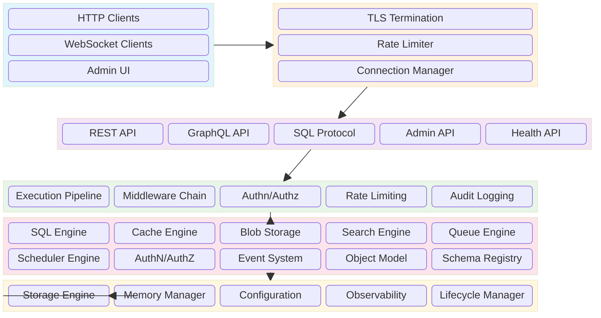
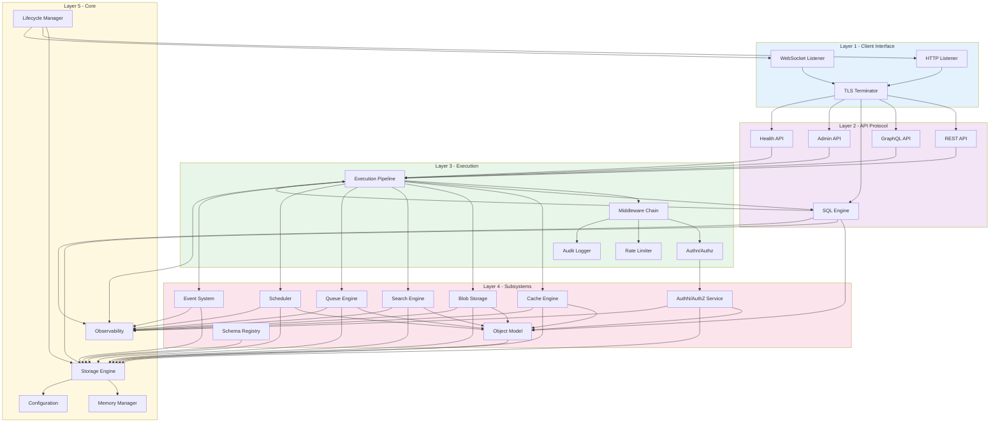
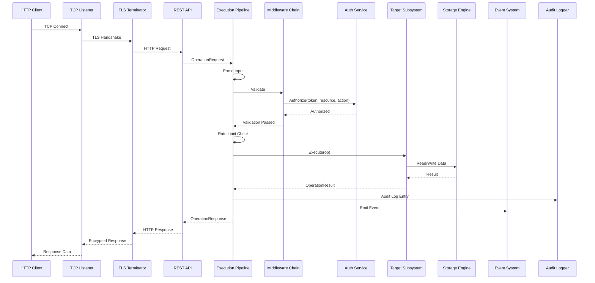
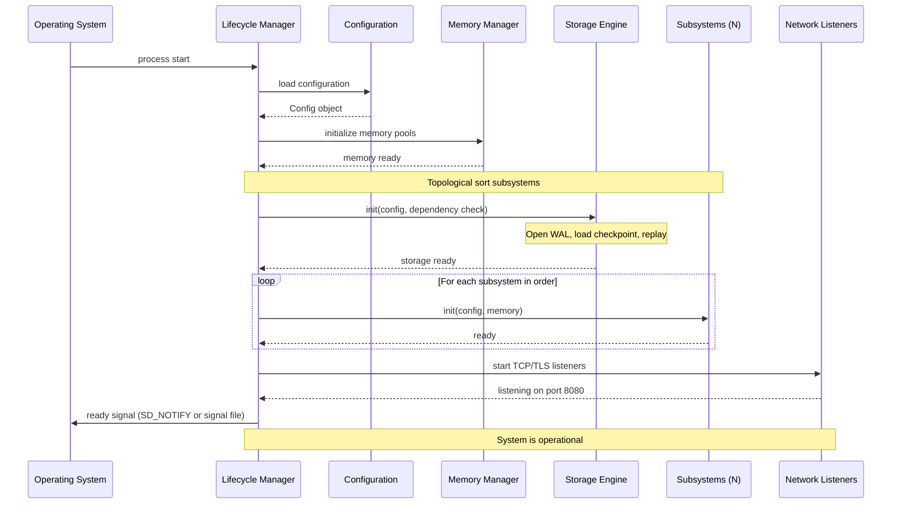
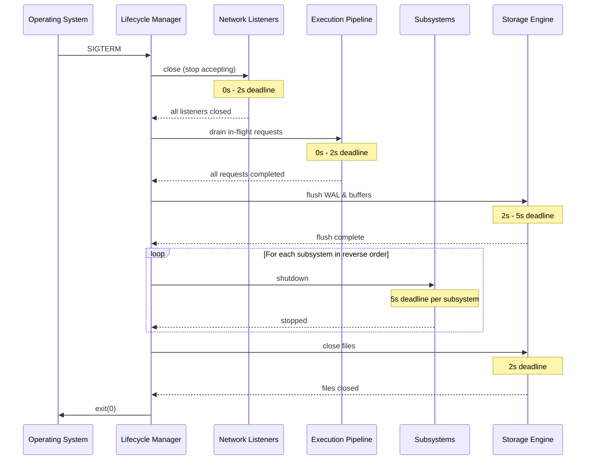
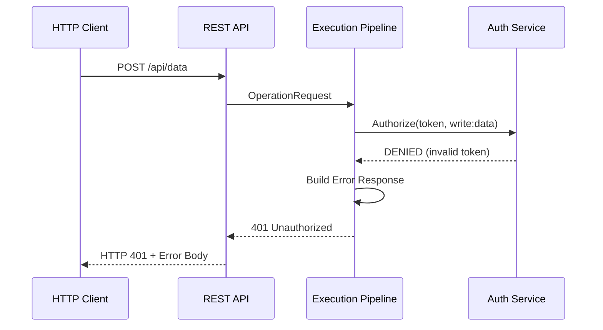
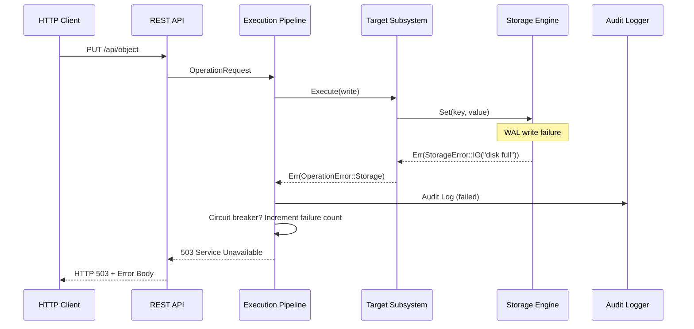

# 06 — High-Level Architecture

## 1. Purpose

This document defines the overall system architecture of Nova Runtime, showing how every subsystem connects, communicates, and cooperates. It serves as the top-level map from which all other architecture documents derive. A senior engineer must be able to understand the complete system structure, data flow, and module dependencies from this document alone.

Nova Runtime is a single-executable backend runtime that unifies Database, Cache, Queue, Scheduler, Search, Blob Storage, Authentication, and API Runtime into one process. Every operation passes through a unified execution pipeline. There is exactly one storage engine, one object model, and one event model.

## 2. Scope

This document covers:

- System block diagram showing all subsystems and their interconnections
- The four unification principles (One Storage Engine, One Object Model, One Event Model, One Execution Pipeline)
- Request lifecycle: from client socket through API layer, execution engine, storage engine, and back
- Module dependency graph with strict layering rules
- Startup sequence and initialization ordering
- Shutdown sequence and graceful termination protocol
- Inter-subsystem communication boundaries
- Configuration architecture
- Observability architecture (logging, metrics, tracing)
- Build architecture (single binary, feature flags)

Out of scope: detailed internal design of individual subsystems (covered in docs 07-10 and beyond), deployment topology, clustering.

## 3. Responsibilities

The high-level architecture is responsible for:

- Defining the complete set of subsystems and their ownership boundaries
- Enforcing the One-Engine rule: exactly one storage engine, one object model, one event model, one execution pipeline
- Specifying the module dependency graph such that there are no circular dependencies between subsystems
- Defining the startup/dependency ordering so that subsystems initialize in the correct sequence
- Specifying the request lifecycle so that every operation follows a predictable path through the system
- Defining inter-subsystem communication contracts (synchronous calls, event emission, shared memory)
- Establishing the observability substrate (tracing, metrics, logging) that all subsystems use uniformly
- Setting the build-time architecture (single binary, compile-time feature selection)

## 4. Non Responsibilities

The high-level architecture is NOT responsible for:

- Detailed internal design of any individual subsystem (handled per-subsystem docs)
- Algorithm selection within subsystems
- Exact API surface of individual components
- Performance tuning parameters
- Deployment or operational runbooks
- Clustering or multi-node coordination (future work)
- Client SDK design (future work)
- Dashboard UI architecture (future work)

## 5. Architecture

### 5.1 System Block Diagram



### 5.2 Layered Architecture

Nova Runtime is organized into five strict layers. Each layer may only depend on layers below it.

| Layer | Name | Components | Depends On |
|-------|------|------------|------------|
| 1 | Client Interface | HTTP Listener, WebSocket Listener, TLS | Layer 2 |
| 2 | API Protocol | REST, GraphQL, SQL Protocol, Admin, Health | Layer 3 |
| 3 | Execution | Pipeline, Middleware, Auth, Rate Limit, Audit | Layer 4 |
| 4 | Subsystems | SQL, Cache, Blob, Search, Queue, Scheduler, AuthN, Events, Object Model, Schema | Layer 5 |
| 5 | Core Infrastructure | Storage Engine, Memory Manager, Config, Observability, Lifecycle | None |

**Dependency rule:** A component in layer N may import and call components from layer N or higher-numbered layers (deeper in the stack). It may NEVER import from a lower-numbered layer. This prevents cycles and ensures the execution pipeline is always the entry point.

**Phase 4 completion (2026-07-03):** Layer 4 (Subsystems) was extended with three async subsystems — Queue Engine (`nova-queue`), Scheduler Engine (`nova-scheduler`), and AuthN/AuthZ Service (`nova-auth`). All three integrate with the execution pipeline (Layer 3) via the standard `Subsystem` trait and use the unified storage engine, object model, and event system (Layer 5).

### 5.3 The Four Unification Principles

#### 5.3.1 One Storage Engine

There is exactly one storage engine in Nova Runtime. Every subsystem that persists data (SQL, Cache, Blob, Search, Queue, Scheduler, Authentication, Schema Registry) uses the same storage engine. There is no direct filesystem access, no embedded SQLite, no separate key-value store. The storage engine exposes:

- A key-value API (Get, Set, Delete, Scan, Batch)
- Transaction support (snapshot isolation)
- Range queries (for search indexing)
- Blob storage (objects up to 16 TiB)
- Queue operations (persistent FIFO backed by storage engine)
- Schema persistence

**Rationale:** Eliminates duplicated persistence logic, ensures consistent durability guarantees, simplifies backups, reduces code surface for bugs.

**Alternatives considered:**
- Embedded SQLite per subsystem: rejected due to inconsistent fsync policies, no unified transactions, no single backup point.
- Separate engine per subsystem: rejected due to N complexity, N resource usage.
- Single storage engine: chosen for simplicity, consistency, and resource efficiency.

#### 5.3.2 One Object Model

All data in Nova Runtime is represented as NovaObjects. A NovaObject has:

- A unique ID (128-bit UUIDv7)
- A type identifier (string namespace)
- A schema version (monotonic integer)
- A set of typed fields
- A set of indexes that reference it
- Metadata (created_at, updated_at, expires_at, owner)
- An ACL governing access

The object model is the universal representation that subsystems use. The SQL engine returns NovaObjects. The Cache engine caches NovaObjects. The Queue engine enqueues NovaObject references. The Search engine indexes NovaObjects.

**Rationale:** A universal data representation eliminates N mapping layers between subsystems. Any subsystem can operate on any object without conversion.

#### 5.3.3 One Event Model

All state changes in Nova Runtime produce events. Events are first-class entities with:

- A unique event ID (128-bit UUIDv7)
- A timestamp (monotonic nanosecond)
- A source subsystem identifier
- An event type (created, updated, deleted, expired, etc.)
- The affected object ID and type
- An optional payload (previous state, delta, etc.)
- A routing key for subscribers

Subsystems subscribe to events via the Event System. Storage engine mutations emit events. Cache invalidations react to events. Queue delivery emits events. Scheduler task completion emits events.

**Rationale:** A single event bus prevents point-to-point notification chains. Subsystems remain decoupled. Observability captures all state changes at a single point.

#### 5.3.4 One Execution Pipeline

Every operation that mutates system state passes through the execution pipeline. The pipeline enforces:

1. Parse: Input validation and type coercion
2. Validate: Business rule validation
3. Authorize: Access control check
4. Execute: Delegate to the target subsystem
5. Log: Structured audit log
6. Notify: Emit events

**Rationale:** Security, auditing, and observability cannot be bypassed. Every mutation is traceable. Every mutation is authorized. Every mutation is logged.

### 5.4 Module Dependency Graph



### 5.5 Configuration Architecture

Nova Runtime uses a single configuration file (TOML format, default path /etc/novad/novad.toml and ./novad.toml). Configuration is loaded at startup and is immutable for the lifetime of the process (no hot-reload of security-sensitive settings).

Configuration hierarchy:

1. Built-in defaults (compiled into binary)
2. Configuration file (novad.toml)
3. Environment variables (NOVA_*)
4. CLI flags (--flag)

Later sources override earlier ones. CLI flags take highest precedence.

Configuration sections:

```toml
[server]
host = "127.0.0.1"
port = 8080
tls_cert_path = ""
tls_key_path = ""
max_connections = 1024
connection_timeout_ms = 30000
read_timeout_ms = 10000
write_timeout_ms = 10000

[storage]
data_dir = "/var/lib/novad/data"
wal_dir = "/var/lib/novad/wal"
page_size = 4096
block_cache_size_mb = 256
wal_fsync_policy = "every_write"
compression = "zstd"
compression_level = 3
bloom_filter_bits_per_key = 10
max_blob_size_mb = 10240

[memory]
max_memory_mb = 1024
arena_block_size_mb = 64
slab_page_size = 4096
gc_interval_ms = 1000
gc_threshold_pct = 80

[execution]
max_concurrent_ops = 256
pipeline_queue_depth = 1024
default_operation_timeout_ms = 5000
rate_limit_default_per_sec = 1000
circuit_breaker_threshold = 50
circuit_breaker_window_ms = 10000

[observability]
log_level = "info"
log_format = "json"
tracing_enabled = true
metrics_flush_interval_ms = 10000

[auth]
default_session_ttl_sec = 3600
max_session_ttl_sec = 86400
password_hash_rounds = 12
token_secret = ""
```

### 5.6 Observability Architecture

All subsystems emit structured logs and metrics through a unified observability interface:

```
Tracing: OpenTelemetry-compatible span-based distributed tracing
  - Every operation gets a trace_id (128-bit)
  - Every pipeline stage gets a span within the trace
  - Spans include duration, status, error info

Metrics: Prometheus-compatible counter, gauge, histogram
  - System-level: CPU, memory, goroutines, open FDs, GC stats
  - Request-level: rate, latency (p50/p95/p99/p999), error rate, throughput
  - Storage-level: page cache hit rate, WAL fsync latency, compaction duration
  - Pool-level: connection pool sizes, queue depths, goroutine counts

Logging: Structured JSON logs to stdout (redirectable to file)
  - Fields: timestamp, level, trace_id, span_id, subsystem, message, error, duration_ms
  - Levels: debug, info, warn, error, fatal
  - Rate-limited error logging to prevent log storms
```

## 6. Data Structures

### 6.1 SubsystemDescriptor

```rust
struct SubsystemDescriptor {
    id: SubsystemId,           // 1 byte enum
    name: String,              // human-readable name, max 64 chars
    version: SemVer,           // 3x u16: major.minor.patch
    dependencies: Vec<SubsystemId>, // subsystems that must start before this one
    priority: StartupPriority, // enum: Critical | High | Normal | Low | Last
    state: SubsystemState,     // current lifecycle state
    health: HealthStatus,      // current health check result
}
```

### 6.2 RequestEnvelope

```rust
struct RequestEnvelope {
    trace_id: u128,            // 128-bit trace ID (UUIDv7)
    span_id: u64,              // 64-bit span ID
    user_session: Option<Session>, // authenticated user session
    deadline: Instant,         // absolute deadline for operation
    cancellation_token: CancellationToken, // cooperative cancellation
    protocol: Protocol,        // enum: Http | WebSocket | Sql | Admin | Internal
    operation: OperationRequest, // the actual operation payload
    metadata: HashMap<String, String>, // max 16 entries, max 256 bytes each
}
```

### 6.3 ResponseEnvelope

```rust
struct ResponseEnvelope {
    trace_id: u128,
    span_id: u64,
    status: StatusCode,        // enum: Ok | BadRequest | Unauthorized | etc.
    body: ResponseBody,        // enum (see below)
    duration_ns: u64,          // wall-clock duration of operation
    error: Option<ErrorInfo>,  // present only on error
    warnings: Vec<String>,     // max 8 warnings
}
```

### 6.4 LayeredDependency

```rust
enum Layer {
    ClientInterface = 1,
    ApiProtocol = 2,
    Execution = 3,
    Subsystems = 4,
    CoreInfrastructure = 5,
}

struct DependencyEntry {
    source: ModuleId,          // source module
    target: ModuleId,          // target module
    layer: Layer,              // layer of the source
    target_layer: Layer,       // layer of the target
    // Invariant: target_layer >= layer (deeper or same)
}
```

### 6.5 SystemMetrics

```rust
struct SystemMetrics {
    uptime_seconds: u64,
    active_connections: u64,
    active_operations: u64,
    pipeline_queue_depth: u64,
    storage_block_cache_hits: u64,
    storage_block_cache_misses: u64,
    storage_wal_bytes_written: u64,
    storage_compactions_running: u32,
    memory_arena_used_bytes: u64,
    memory_slab_used_bytes: u64,
    memory_gc_cycles_completed: u64,
    cpu_user_ns: u64,
    cpu_system_ns: u64,
    io_read_bytes: u64,
    io_write_bytes: u64,
    io_read_ops: u64,
    io_write_ops: u64,
    fd_count: u32,
    goroutine_count: u32,      // or thread count depending on runtime
}
```

## 7. Algorithms

### 7.1 Startup Ordering Algorithm

The Lifecycle Manager determines startup order by:

1. Build a dependency graph from all SubsystemDescriptors
2. Perform a topological sort on the graph
3. If cycles are detected, log fatal error and exit (code 78)
4. Group subsystems by priority level
5. Start each priority level sequentially
6. Within a priority level, start subsystems in dependency order
7. For each subsystem:
   a. Initialize configuration
   b. Initialize memory pools
   c. Call subsystem init() function
   d. Wait for ready signal (or timeout at 30s)
   e. Mark SubsystemState as Running
   f. Register health check callback
8. After all subsystems started, start network listeners (Layer 1 and 2)
9. Signal readiness to parent process (if under supervisor)

```
function StartupSequence(descriptors):
    graph = BuildDependencyGraph(descriptors)
    order = TopologicalSort(graph)
    if order contains cycle:
        Fatal("Circular dependency detected")

    for priority in [Critical, High, Normal, Low, Last]:
        for subsystem in order where subsystem.priority == priority:
            InitSubsystem(subsystem, timeout=30s)
            subsystem.state = Running

    StartNetworkListeners()
    SignalReady()
```

### 7.2 Shutdown Algorithm

Graceful shutdown proceeds in reverse order of startup:

1. Stop accepting new connections (listener close)
2. Wait for in-flight requests to complete (deadline: 2 seconds)
3. Flush WAL and storage buffers (deadline: 3 seconds)
4. Stop subsystems in reverse startup order (deadline: 5 seconds per subsystem)
5. Close storage engine files (deadline: 2 seconds)
6. Exit process

```
function ShutdownSequence():
    Listener.close()                    // stop accepting
    DrainInFlightRequests(timeout=2s)   // wait for active requests
    StorageEngine.Flush(timeout=3s)     // flush all buffers
    for subsystem in reverse(order):
        subsystem.Shutdown(timeout=5s)  // graceful shutdown
    StorageEngine.Close(timeout=2s)     // close files
    os.Exit(0)
```

### 7.3 Request Lifecycle Algorithm

Every external request follows this path through the system:

```
function HandleRequest(raw_connection, protocol):
    envelope = ParseRequest(raw_connection)
    trace = Trace.Start(envelope.trace_id)

    // Layer 2 -> Layer 3
    pipeline = SelectPipeline(protocol)
    result = pipeline.Execute(envelope)

    // Build response
    response = BuildResponse(result)
    response.trace_id = envelope.trace_id
    response.duration_ns = trace.Elapsed()

    // Layer 2 -> Layer 1
    SendResponse(raw_connection, response)
    trace.End()
```

### 7.4 Cross-Subsystem Communication Rules

Subsystems communicate through three mechanisms only:

1. **Synchronous calls via execution pipeline:** Subsystem A never calls subsystem B directly. Both are called through the pipeline. The pipeline orchestrates multi-subsystem operations.

2. **Events via Event System:** Subsystem A emits an event. Subsystem B subscribes to events. Communication is asynchronous and decoupled.

3. **Shared memory via Object Model:** Both subsystems access the same NovaObject through the Object Model. No data copying between subsystems.

**Forbidden patterns:**
- Direct function calls between subsystems (violates layer independence)
- Shared mutable state without going through the execution pipeline
- Side-channel communication (files, env vars, signals)
- Internal HTTP calls between subsystems

## 8. Interfaces

### 8.1 LifecycleManager Interface

```rust
trait LifecycleManager {
    /// Initialize all subsystems in dependency order.
    /// Returns error if any critical subsystem fails to start.
    fn initialize(config: &Config) -> Result<(), StartupError>;

    /// Signal all subsystems to begin shutdown.
    /// Blocks until shutdown complete or timeout.
    fn shutdown(timeout: Duration) -> Result<(), ShutdownError>;

    /// Register a callback invoked before shutdown begins.
    fn on_shutdown(callback: Box<dyn FnOnce()>);

    /// Get current state of all subsystems.
    fn status() -> SystemStatus;

    /// Block until all subsystems are running.
    fn wait_ready(timeout: Duration) -> Result<(), TimeoutError>;
}
```

### 8.2 Subsystem Trait

```rust
trait Subsystem {
    /// Unique identifier for this subsystem.
    fn id() -> SubsystemId;

    /// Human-readable name.
    fn name() -> &'static str;

    /// Initialize the subsystem. Called during startup.
    /// Must complete within the configured timeout (default 30s).
    fn init(config: &Config, memory: &MemoryManager) -> Result<(), InitError>;

    /// Gracefully shut down. Must complete within the configured timeout.
    fn shutdown(timeout: Duration) -> Result<(), ShutdownError>;

    /// Perform a health check. Returns Ok(()) if healthy.
    fn health_check() -> Result<HealthStatus, HealthError>;

    /// List of subsystem IDs that must start before this one.
    fn dependencies() -> Vec<SubsystemId>;
}
```

### 8.3 Observability Interface

```rust
trait Observability {
    /// Create a new trace span.
    fn start_span(trace_id: u128, parent_span_id: Option<u64>, name: &str) -> Span;

    /// Record a metric observation.
    fn record_metric(name: &str, value: f64, labels: &[(&str, &str)]);

    /// Emit a structured log entry.
    fn log(level: LogLevel, message: &str, fields: &[(&str, &str)]);

    /// Increment a counter metric.
    fn increment_counter(name: &str, by: u64, labels: &[(&str, &str)]);

    /// Observe a duration for histogram metrics.
    fn observe_duration(name: &str, duration: Duration, labels: &[(&str, &str)]);
}
```

### 8.4 Configuration Provider Interface

```rust
trait ConfigProvider {
    /// Get a configuration value by key path.
    fn get<T: Deserialize>(key: &str) -> Result<Option<T>, ConfigError>;

    /// Get all configuration values under a prefix.
    fn get_section(prefix: &str) -> Result<HashMap<String, Value>, ConfigError>;

    /// Watch for configuration changes (future: hot-reload of non-sensitive keys).
    fn watch(key: &str, callback: Box<dyn Fn(Value)>) -> Result<(), ConfigError>;
}
```

## 9. Sequence Diagrams

### 9.1 Request Lifecycle (Success)



### 9.2 Startup Sequence



### 9.3 Shutdown Sequence



### 9.4 Error: Authorization Failure



### 9.5 Error: Storage Engine Failure During Operation



## 10. Failure Modes

### 10.1 Circular Dependency

| Field | Value |
|-------|-------|
| Cause | Two or more subsystems declare mutual dependencies |
| Effect | Startup fails with fatal error, process exits code 78 |
| Detection | Topological sort during startup initialization |
| Severity | Critical (prevents startup entirely) |

### 10.2 Subsystem Init Timeout

| Field | Value |
|-------|-------|
| Cause | Subsystem initialization exceeds 30s timeout |
| Effect | Startup fails, process exits code 71 |
| Detection | Timer started when subsystem init begins |
| Severity | Critical (prevents startup entirely) |

### 10.3 Storage Engine Init Failure

| Field | Value |
|-------|-------|
| Cause | Data directory inaccessible, WAL corruption, incompatible version |
| Effect | No persistence possible, process exits code 75 |
| Detection | Storage engine init returns error |
| Severity | Critical (no subsystem can function) |

### 10.4 Memory Budget Exceeded

| Field | Value |
|-------|-------|
| Cause | Subsystem requests more memory than allocated budget |
| Effect | Request denied, subsystem must degrade gracefully |
| Detection | Memory manager enforces budget per subsystem |
| Severity | High (affects operation but not process) |

### 10.5 Shutdown Timeout

| Field | Value |
|-------|-------|
| Cause | Subsystem fails to shut down within its deadline |
| Effect | Process continues shutdown sequence, subsystem is forcefully terminated |
| Detection | Timer started when subsystem shutdown initiated |
| Severity | High (potential data loss if storage engine not flushed) |

### 10.6 Configuration Error

| Field | Value |
|-------|-------|
| Cause | Invalid configuration file, missing required key, type mismatch |
| Effect | Startup fails, process exits code 78 |
| Detection | Config parser returns error |
| Severity | Critical (prevents startup) |

### 10.7 Port Conflict

| Field | Value |
|-------|-------|
| Cause | Configured port already in use by another process |
| Effect | Startup fails, process exits code 73 |
| Detection | TCP bind returns EADDRINUSE |
| Severity | Critical (prevents startup) |

## 11. Recovery Strategy

### 11.1 Circular Dependency Recovery

No automatic recovery. This is a build-time bug. Action:
1. Identify the cycle from the dependency graph
2. Fix module declarations
3. Rebuild and restart

### 11.2 Subsystem Init Timeout Recovery

1. Process exits with code 71
2. Operator inspects logs for the stuck subsystem
3. Operator may increase init timeout in configuration and restart
4. If subsystem repeatedly fails to init, disable it via configuration feature flag and restart without it

### 11.3 Storage Engine Init Failure Recovery

1. Process exits with code 75
2. Operator checks:
   a. Data directory exists and is writable (check permissions)
   b. Disk space is sufficient (require at least 256 MB free)
   c. WAL directory exists and is writable
   d. Storage version in data files matches binary version
3. If storage is corrupted, operator may restore from last backup
4. Restart after resolution

### 11.4 Memory Budget Exceeded Recovery

1. Subsystem receives OOM error from memory manager
2. Subsystem should cancel non-critical operations and return memory
3. Memory pressure event is logged and alerted via metrics
4. If system-wide memory exceeds 95% of max_memory_mb, subsystems enter memory pressure mode (reduce cache sizes, defer non-critical GC, reject new low-priority operations)

### 11.5 Shutdown Timeout Recovery

1. Lifecycle manager logs "subsystem X shutdown timed out after 5s"
2. Lifecycle manager continues to next subsystem in reverse order
3. If storage engine times out:
   a. Attempt emergency flush of WAL (1s deadline)
   b. If flush fails, data loss since last checkpoint is possible
   c. On next restart, WAL replay will recover to last consistent state
4. Operator should inspect logs and file system

### 11.6 Configuration Error Recovery

1. Process exits with code 78
2. Operator validates configuration file:
   a. Run novad --check-config to validate without starting
   b. Check for typos, missing values, invalid TOML
3. Fix configuration and restart

### 11.7 Port Conflict Recovery

1. Process exits with code 73
2. Operator checks what is using the port (ss -tlnp | grep <port>)
3. Either stop the conflicting process or change nova configuration
4. Restart

## 12. Performance Considerations

### 12.1 Request Latency Budget

| Stage | Budget | P99 Target |
|-------|--------|------------|
| Network I/O | 1ms | 5ms |
| TLS Handshake | 5ms | 20ms |
| API Protocol Parse | 0.5ms | 2ms |
| Pipeline: Parse | 0.1ms | 0.5ms |
| Pipeline: Validate | 0.5ms | 2ms |
| Pipeline: Authorize | 1ms | 5ms |
| Pipeline: Execute | varies | varies |
| Pipeline: Audit | 0.1ms | 0.5ms |
| Pipeline: Notify | 0.05ms | 0.2ms |
| Response Serialization | 0.5ms | 2ms |

Total target: <10ms P50, <50ms P95, <200ms P99 for simple operations.

### 12.2 Memory Budget Allocation (Default: 1024 MB)

| Subsystem | Budget | Percentage |
|-----------|--------|------------|
| Storage Engine Block Cache | 256 MB | 25% |
| Memory Manager Internal | 64 MB | 6.25% |
| SQL Engine | 128 MB | 12.5% |
| Cache Engine | 128 MB | 12.5% |
| Queue Engine | 64 MB | 6.25% |
| Search Engine | 64 MB | 6.25% |
| Blob Storage | 64 MB | 6.25% |
| Connection Buffers | 64 MB | 6.25% |
| Execution Pipeline | 32 MB | 3.125% |
| Event System | 32 MB | 3.125% |
| Auth Service | 16 MB | 1.56% |
| Scheduler | 16 MB | 1.56% |
| Observability | 16 MB | 1.56% |
| Reserved/Fallback | 80 MB | 7.81% |

### 12.3 Connection Concurrency

- Max connections: 1024 (configurable)
- Max concurrent pipeline operations: 256
- Pipeline queue depth: 1024 (beyond this, connections are rejected with 503)
- Connection buffer size: 64 KB per connection (for headers, small payloads)
- Large payloads streamed through temporary buffers allocated from blob storage arena

### 12.4 Bottleneck Analysis

The storage engine is the universal bottleneck. All subsystems depend on it. Mitigations:

1. Block cache (256 MB default) reduces disk reads
2. Bloom filters reduce unnecessary index lookups
3. LSM-tree write buffer absorbs write bursts
4. Latch-free read paths prevent writer blocking
5. WAL batching groups small writes into larger fsyncs
6. Compression reduces I/O volume at cost of CPU

The execution pipeline is the second potential bottleneck. Mitigations:

1. Bounded task queue prevents unbounded memory growth
2. Rate limiting prevents overload
3. Circuit breaker prevents cascading failures
4. Operation priorities ensure critical operations are not starved

## 13. Security

### 13.1 Threat Model

| Threat | Vector | Impact | Mitigation |
|--------|--------|--------|------------|
| Unauthorized access | Network | Data breach | Authentication + Authorization on every operation |
| Privilege escalation | API | Unauthorized data access | Fine-grained ACLs, validated on every request |
| Denial of service | Network | Service unavailability | Rate limiting, connection limits, circuit breaker |
| Data tampering | Network | Data corruption | TLS in transit, checksums at rest |
| Data exfiltration | Network | Data breach | TLS, audit logging, rate limiting on reads |
| Configuration tampering | Filesystem | Security bypass | File permissions (0600), path validation |
| Memory disclosure | Process | Credential leak | Zero-copy with explicit clearing, mlocks for secrets |
| Timing side-channel | Network | Information disclosure | Constant-time comparison for secrets |

### 13.2 Attack Surface

```
External attack surface:
  - TCP port (configurable, default 8080)
  - TLS termination (if configured)
  - HTTP endpoints (all public API routes)
  - WebSocket connections
  - Admin API (separate port, localhost-only by default)

Internal attack surface:
  - Unix socket for local admin commands
  - Shared memory segments (future clustering)
  - Signal handlers
```

### 13.3 Security Mitigations by Layer

| Layer | Mitigations |
|-------|-------------|
| Client Interface | TLS 1.3 only, HSTS, connection rate limiting, IP-based allow/deny lists |
| API Protocol | Input validation, request size limits (1 MB default, 16 MB max), schema validation |
| Execution | Per-operation authorization, rate limiting per user, audit logging |
| Subsystems | ACL enforcement, data isolation between tenants |
| Core Infrastructure | Encrypted WAL (future), data checksums, memory isolation |

### 13.4 Secret Handling

- TLS private keys: loaded into memory at startup, mlocks to prevent swapping
- Auth tokens: stored in memory only, never logged, never persisted in plaintext
- Passwords: bcrypt/PBKDF2 hashed with per-user salt, never stored in plaintext
- API keys: hashed with HMAC-SHA256 before storage, only prefix visible in logs
- Configuration secrets: environment variable injection, file permissions 0600

## 14. Testing

### 14.1 Integration Tests

| Test | Description |
|------|-------------|
| StartupSequence | Verify all subsystems start in dependency order |
| ShutdownSequence | Verify graceful shutdown completes within timeouts |
| RequestLifecycle | Trace a request through all layers, verify correct processing |
| FullPipeline | Submit operation via REST, verify it reaches storage engine and returns |
| EventPropagation | Verify mutations emit events that reach subscribers |
| ConfigurationReload | Verify config file loading and environment variable override |
| TLSHandshake | Verify TLS 1.3 termination works correctly |

### 14.2 Failure Injection Tests

| Test | Description |
|------|-------------|
| SubsystemInitFailure | Mock a subsystem that fails init, verify startup halts with correct exit code |
| SubsystemCrash | Kill a subsystem goroutine, verify graceful degradation |
| StorageFailure | Inject I/O errors into storage engine, verify error propagation |
| MemoryPressure | Exhaust memory budget, verify subsystems enter pressure mode |
| SignalHandling | Send SIGTERM/SIGINT/SIGQUIT, verify shutdown sequence |

### 14.3 Property-Based Tests

| Property | Description |
|----------|-------------|
| NoCircularDependencies | For any set of subsystem declarations, the dependency graph is acyclic |
| ShutdownCompletes | Given any state, shutdown sequence terminates within bounded time |
| RequestIdempotency | Replaying the same request produces the same result (for idempotent operations) |
| LifecycleOrdering | Subsystem init order respects dependency declarations |

### 14.4 Chaos Tests

| Test | Description |
|------|-------------|
| RandomCrash | Randomly kill process, verify WAL recovery produces consistent state |
| NetworkFlap | Rapid connect/disconnect cycles, verify connection pool recovers |
| ResourceExhaustion | Fill disk while writing, verify graceful error handling |
| ConcurrentShutdown | Trigger shutdown while requests are in flight, verify no hang |

## 15. Future Work

1. **Hot-reload configuration** for non-security-sensitive settings (log levels, cache sizes, rate limits)
2. **Multi-process architecture** with shared memory for better isolation (future clustering)
3. **Dynamic subsystem registration** allowing third-party plugins
4. **Automatic subsystem health recovery** - restart failed subsystems without full process restart
5. **Rolling configuration upgrades** without full restart
6. **Seccomp/landlock sandboxing** for subsystem isolation
7. **Encrypted WAL at rest** for compliance use cases
8. **Unix socket support** for local-only deployments
9. **gRPC protocol support** in addition to REST/GraphQL/SQL
10. **Tiered storage** (hot/warm/cold) with automatic data migration

## 16. Open Questions

1. **Should the admin API be on a separate port by default?** Current design says localhost-only separate port. Alternative: share main port with path-based routing (/admin/*). Trade-off: separate port is more secure but more complex to deploy behind load balancers.

2. **Should configuration support includes/imports?** Current: single file. Future: imports for secrets file, per-subsystem config files. Trade-off: simplicity vs flexibility.

3. **Should observability be its own subsystem or a core service?** Current: core service (Layer 5) that all subsystems depend on. Alternative: make it a subsystem (Layer 4). Trade-off: if core, observability is always available for subsystem initialization. If subsystem, it could be disabled for minimal deployments.

4. **Should the startup timeout be configurable per subsystem?** Current: uniform 30s. Alternative: per-subsystem timeout in configuration. Trade-off: simplicity vs accommodating slow-starting subsystems (like search index rebuild).

5. **Should the shutdown sequence attempt to restart failed subsystems instead of continuing?** Current: continue shutdown after timeout. Alternative: implement internal supervisor that restarts failed subsystems. Trade-off: simplicity vs resilience.

6. **Should subsystems be able to register custom health checks?** Current: each subsystem provides exactly one health_check method. Alternative: allow multiple health check endpoints per subsystem. Trade-off: simplicity vs granularity.

## 17. References

1. **TOML Configuration Format** - https://toml.io/en/
2. **OpenTelemetry Specification** - https://opentelemetry.io/docs/specs/otel/
3. **Prometheus Metrics Exposition Format** - https://prometheus.io/docs/concepts/data_model/
4. **UUIDv7 Specification (RFC 9562)** - https://www.rfc-editor.org/rfc/rfc9562
5. **Graceful Shutdown Pattern** - https://learn.microsoft.com/en-us/azure/patterns/graceful-shutdown
6. **Circuit Breaker Pattern** - https://martinfowler.com/bliki/CircuitBreaker.html
7. **Structured Logging** - https://www.honeycomb.io/blog/structured-logging
8. **Layered Architecture Pattern** - https://www.oreilly.com/library/view/software-architecture-patterns/9781098134286/
9. **TLS 1.3 (RFC 8446)** - https://www.rfc-editor.org/rfc/rfc8446
10. **Twelve-Factor App (Config section)** - https://12factor.net/config
