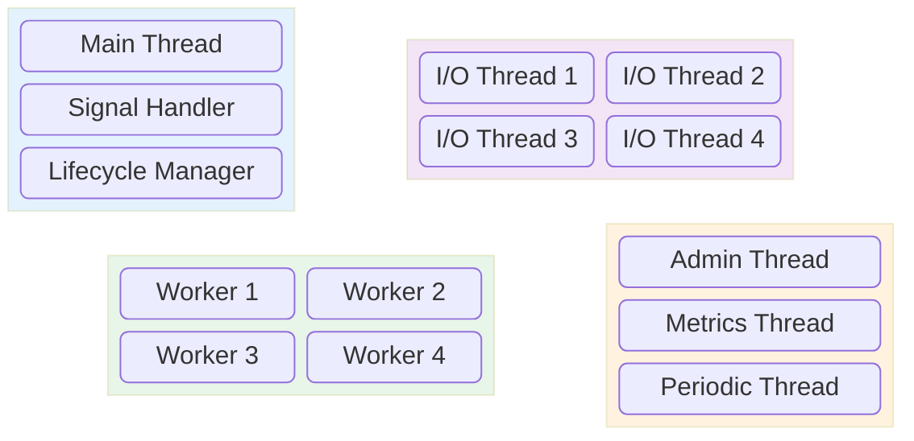
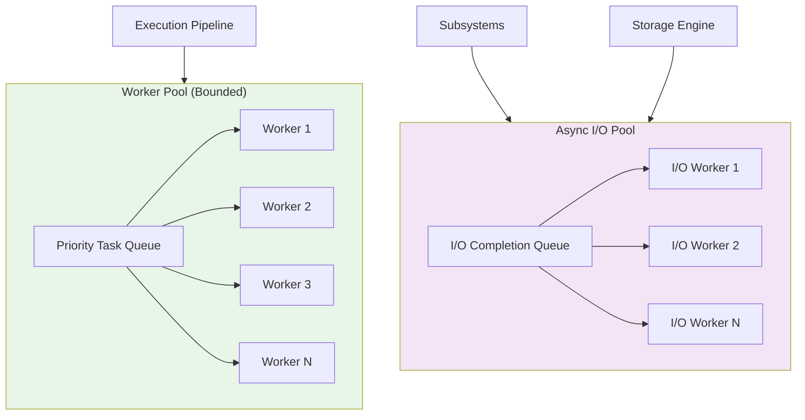
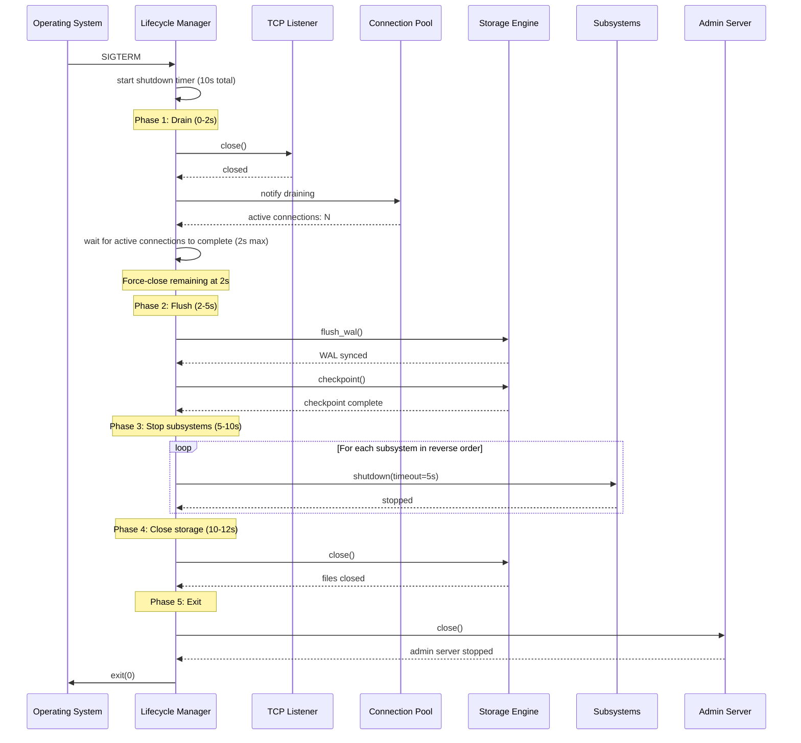
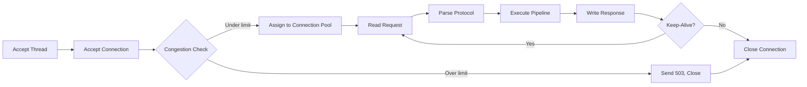
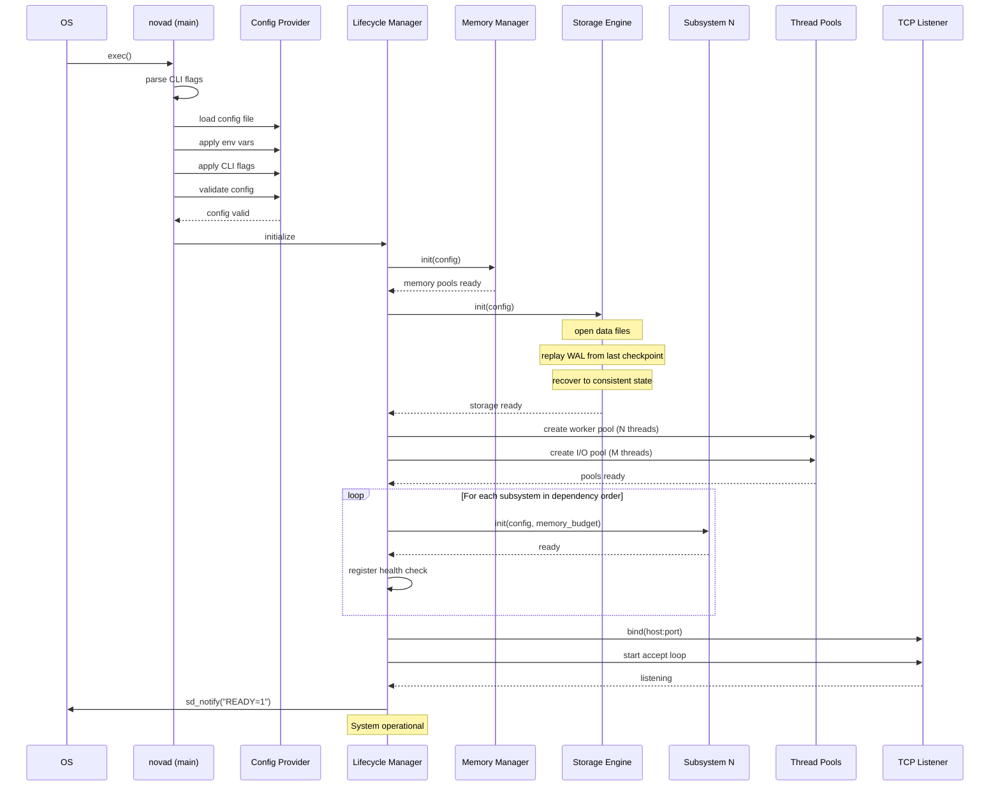
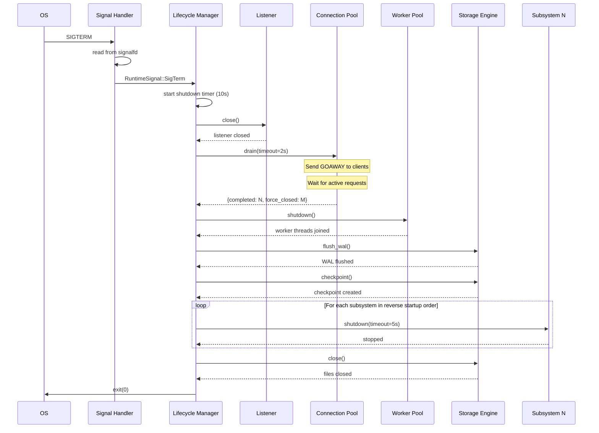
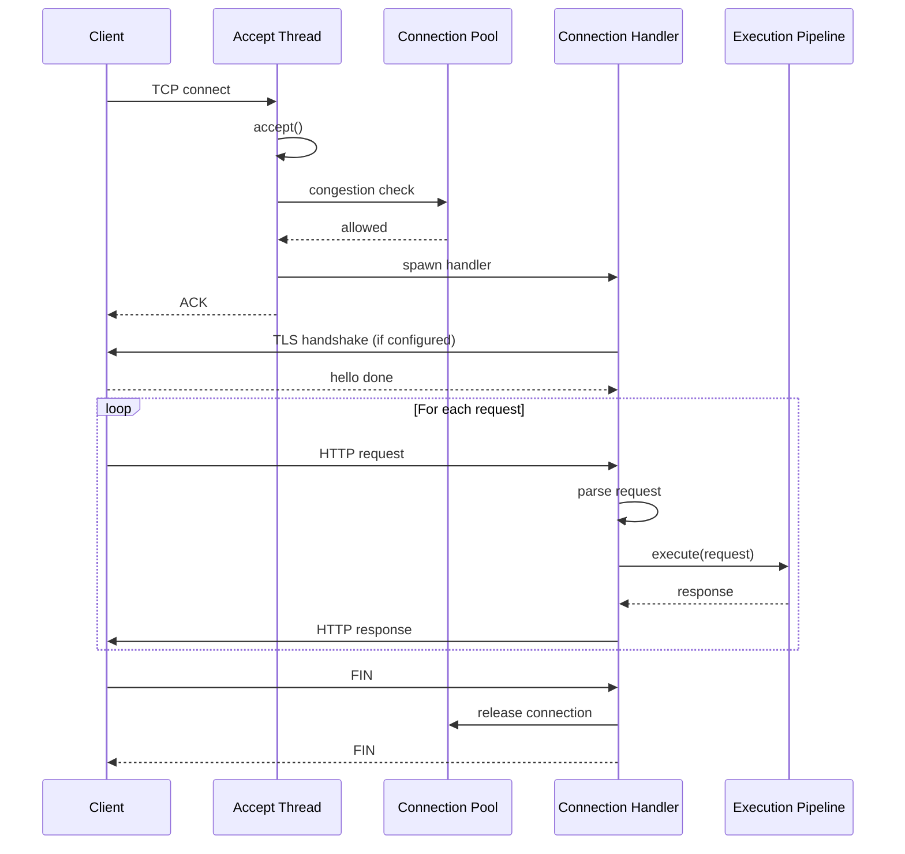
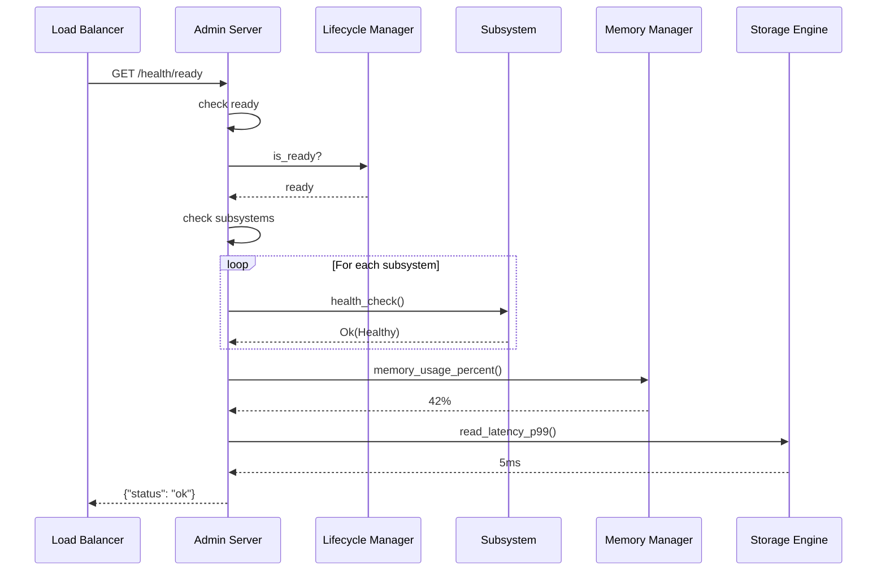
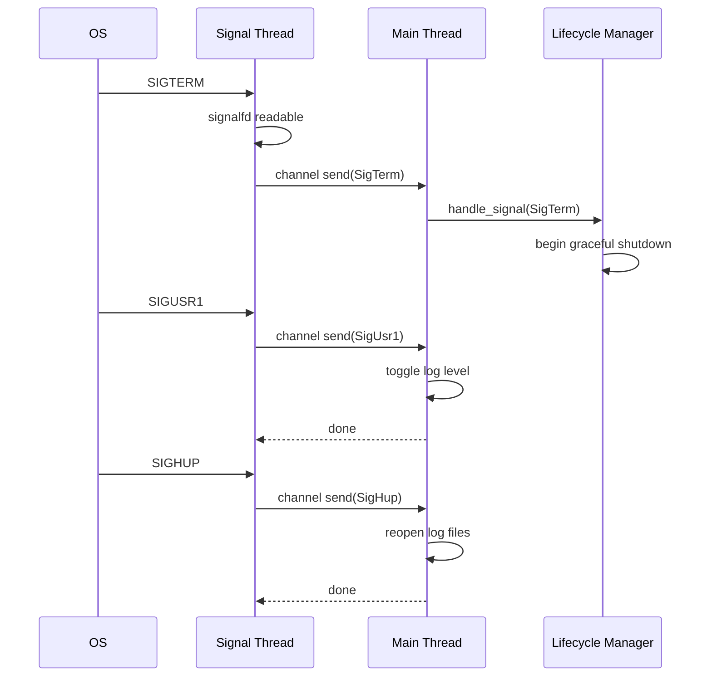
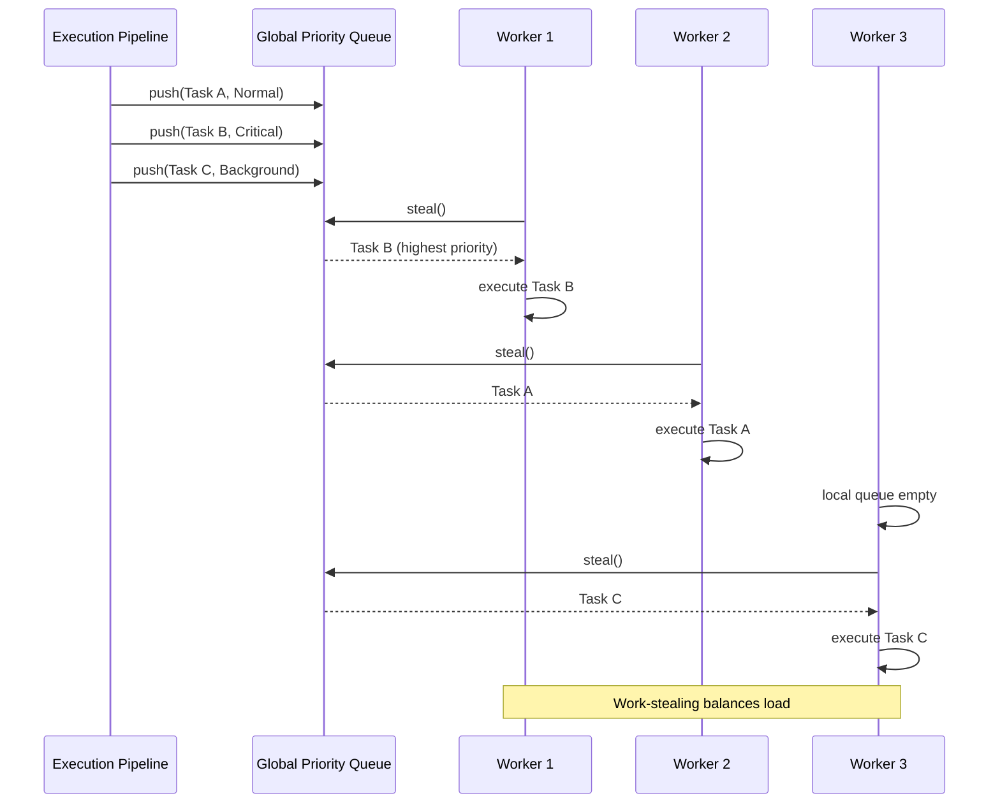

# 07 — Runtime Architecture

## 1. Purpose

This document specifies the internal runtime architecture of Nova Runtime (novad). It describes the process model, thread management, signal handling, configuration lifecycle, startup sequencing, health checking, and graceful shutdown protocol. A senior engineer must be able to implement the runtime daemon from this document alone.

## 2. Scope

This document covers:

- Process model: main thread, worker pool, async I/O threads, admin threads
- Lifecycle of novad from exec() to exit()
- Signal handling: SIGTERM, SIGINT, SIGQUIT, SIGHUP, SIGPIPE, SIGUSR1, SIGUSR2
- Configuration loading: file search paths, environment variables, CLI flags, validation
- Startup ordering: Storage Engine first, then subsystems, then network listeners
- Health check system: endpoints, intervals, failure thresholds
- Graceful shutdown protocol: phased timeouts (2s drain, 3s flush, 5s kill)
- Thread pool architecture: bounded work-stealing, priority queues, task types
- Connection management: accept loop, connection pool, idle timeout
- Admin interface: diagnostics, profiling, metrics

Out of scope: detailed subsystem internals (docs 08-10), networking protocol details (doc 13), SQL protocol (doc 21).

## 3. Responsibilities

The runtime architecture is responsible for:

- Managing the process lifecycle from start to exit
- Coordinating thread pools and async I/O for all subsystems
- Handling OS signals and translating them to lifecycle events
- Loading and validating configuration before any subsystem starts
- Enforcing correct startup ordering based on dependency declarations
- Exposing health check endpoints for load balancers and supervisors
- Implementing graceful shutdown with phased timeouts
- Providing connection management (accept, pool, timeout, backpressure)
- Exposing admin interface for diagnostics and profiling
- Managing the runtime's own memory (stack sizes, thread-local storage)
- Coordinating panic recovery and stack traces

## 4. Non Responsibilities

The runtime architecture is NOT responsible for:

- Storage engine internals (handled by doc 08)
- Execution pipeline internals (handled by doc 10)
- Memory allocation strategies (handled by doc 09)
- Event system internals (handled by doc 11)
- Application-level business logic
- Client SDK or driver implementation
- Deployment orchestration or containerization
- Multi-node clustering

## 5. Architecture

### 5.1 Process Model Overview

Nova Runtime uses a multi-threaded, shared-nothing-with-pools architecture with a single process. There is no fork-on-connect model. There is no thread-per-connection model (except for connection management threads). The design uses:

- **Main Thread:** Configuration, lifecycle coordination, signal handling
- **Worker Pool:** Bounded pool of threads executing pipeline operations
- **Async I/O Threads:** Dedicated threads for non-blocking I/O (io_uring on Linux, kqueue on macOS, IOCP on Windows)
- **Admin Thread:** Dedicated thread for admin interface (HTTP diagnostics)
- **Periodic Thread:** Timer-based maintenance (GC, metrics flush, compaction)



### 5.2 Thread Counts and Stack Sizes

| Thread Pool | Default Count | Min | Max | Stack Size | Description |
|-------------|---------------|-----|-----|------------|-------------|
| Main | 1 | 1 | 1 | 8 MB | Lifecycle coordination |
| Worker | 4 | 1 | 64 | 2 MB | Pipeline operations |
| Async I/O | 2 | 1 | 16 | 1 MB | Non-blocking I/O |
| Admin | 1 | 0 | 1 | 2 MB | Admin HTTP server |
| Periodic | 1 | 0 | 1 | 1 MB | Timers, GC, metrics |
| **Total Default** | **9** | | | **~20 MB** | |

Configuration options:

```toml
[runtime]
worker_threads = 4                # default: 4, range: 1-64
io_threads = 2                    # default: 2, range: 1-16
enable_admin = true               # default: true
admin_port = 9090                 # default: 9090
admin_host = "127.0.0.1"         # default: localhost only
periodic_interval_ms = 1000       # default: 1000
```

### 5.3 Thread Pool Architecture



### 5.4 Task Priorities

The worker pool uses a multi-level priority queue with three priority levels:

| Priority | Name | Description | Starvation Prevention |
|----------|------|-------------|----------------------|
| 0 | Critical | Auth operations, health checks, lifecycle | Strict priority |
| 1 | Normal | Data operations (read/write) | Aging: promote every 100ms |
| 2 | Background | Compaction, GC, maintenance, analytics | Aging: promote every 500ms |

Tasks at lower priorities are aged: every time a task is skipped in favor of a higher-priority task, its effective priority in the run queue is increased by one level. This prevents starvation.

### 5.5 Worker Thread Work-Stealing

Each worker thread has its own local queue (bounded at 256 tasks) drawn from the global priority queue. When a worker's local queue is empty, it:

1. Attempts to steal from the global queue (lock)
2. Attempts to steal from a random peer's local queue (lock-free CAS)
3. If both fail, spins for 10 microseconds then parks (pthread_cond_wait)

Work-stealing balances load without a centralized scheduler.

### 5.6 Async I/O Model

Nova Runtime uses io_uring (Linux 5.1+) for all file and network I/O. Fallbacks:

- Linux < 5.1: epoll + AIO (libaio)
- macOS: kqueue + dispatch_io
- Windows: IOCP (future)

The async I/O pool submits operations to the submission queue (SQ) and collects completions from the completion queue (CQ). The pool threads are bound to CPU cores when possible (via pthread_setaffinity_np).

### 5.7 Signal Handling

```rust
enum RuntimeSignal {
    SigTerm,   // SIGTERM - graceful shutdown
    SigInt,    // SIGINT  - graceful shutdown (faster)
    SigQuit,   // SIGQUIT - immediate shutdown, dump core
    SigHup,    // SIGHUP  - reopen log files
    SigUsr1,   // SIGUSR1 - toggle debug logging
    SigUsr2,   // SIGUSR2 - dump metrics to admin endpoint
    SigPipe,   // SIGPIPE - ignored (handled by I/O layer)
}
```

Signal handling architecture:

```
Signal -> OS -> SignalHandler thread (dedicated) -> channel -> Main Thread -> LifecycleManager
```

Signal handler thread masks all signals except the ones it handles. Other threads have all signals masked (pthread_sigmask). Signal handler thread uses signalfd (Linux) or kqueue EVFILT_SIGNAL (macOS) to receive signals as file descriptor events rather than traditional signal handlers.

Signal mapping:

| Signal | Action | Timeout |
|--------|--------|---------|
| SIGTERM | Graceful shutdown (full) | 2s drain + 3s flush + 5s kill = 10s total |
| SIGINT | Graceful shutdown (fast) | 1s drain + 1s flush + 3s kill = 5s total |
| SIGQUIT | Immediate abort, core dump | 0s (SIGABRT immediately) |
| SIGHUP | Reopen log files | N/A |
| SIGUSR1 | Toggle log level between current and debug | N/A |
| SIGUSR2 | Dump metrics snapshot to admin endpoint | N/A |
| SIGPIPE | Ignored | N/A |

### 5.8 Startup Sequence

The precise startup sequence with timeouts:

```
Phase 0: Preflight (0ms - 50ms)
  1. Parse CLI flags
  2. Load configuration file (search path: ./novad.toml, ~/.config/novad/novad.toml, /etc/novad/novad.toml)
  3. Apply environment variable overrides
  4. Apply CLI flag overrides
  5. Validate configuration (all required keys present, types match, values in range)
  6. Check data directory exists, create if not (with permissions 0700)
  7. Check WAL directory exists, create if not (with permissions 0700)
  8. Initialize logging subsystem (open log file if configured)
  9. Check if another instance is running (PID file check)

Phase 1: Core Infrastructure (50ms - 500ms)
  10. Initialize Memory Manager (allocate arenas, slab pools)
  11. Initialize Storage Engine (open or create data files, replay WAL)
  12. Initialize Configuration Provider (read-only snapshot)
  13. Initialize Observability (metrics, tracing)

Phase 2: Subsystems (500ms - 5000ms)
  14. For each subsystem in topological order (see doc 06):
      a. Allocate memory budget from Memory Manager
      b. Call subsystem.init(config, memory)
      c. Wait for SubsystemState::Running
      d. Register health check callback

Phase 3: Network (5000ms - 5500ms)
  15. Initialize TLS context (load certs, if configured)
  16. Create TCP listener (bind to configured host:port)
  17. Start connection accept loop
  18. Start admin HTTP server (if enabled)
  19. Signal readiness:
      a. Write PID file
      b. Notify systemd (sd_notify("READY=1"))
      c. Create ready socket file (for supervisord)

Phase 4: Operational (5500ms+)
  20. Enter main event loop (signal handling, periodic maintenance)
```

### 5.9 Shutdown Protocol

Graceful shutdown uses hierarchical timeouts:

| Phase | Description | Deadline (SIGTERM) | Deadline (SIGINT) | Action on Timeout |
|-------|-------------|--------------------|--------------------|-------------------|
| 1 | Drain connections | 2s | 1s | Force-close remaining connections |
| 2 | Flush WAL/storage | 3s (cumulative 5s) | 1s (cumulative 2s) | Emergency flush, possible data loss |
| 3 | Stop subsystems | 5s (cumulative 10s) | 3s (cumulative 5s) | Kill subsystem threads |
| 4 | Close storage | 2s (cumulative 12s) | 1s (cumulative 6s) | Force close files |
| 5 | Exit | 0s | 0s | os.Exit(1) if still alive |



Output on forced termination:

```
NOVA  Shutdown phase 1 timed out (2s) - force closing 3 connections
NOVA  Shutdown phase 2 timed out (3s) - emergency WAL flush completed
NOVA  Shutdown phase 3 timed out (5s) - subsystem Cache did not stop
NOVA  Shutdown phase 4 timed out (2s) - storage file close forced
NOVA  Shutdown completed with errors, see log for details
```

### 5.10 Connection Management



Connection pool parameters:

| Parameter | Default | Range | Description |
|-----------|---------|-------|-------------|
| max_connections | 1024 | 100-100000 | Maximum simultaneous connections |
| connection_timeout_ms | 30000 | 1000-300000 | Max connection idle time |
| read_timeout_ms | 10000 | 1000-120000 | Time to read full request |
| write_timeout_ms | 10000 | 1000-120000 | Time to write full response |
| request_timeout_ms | 30000 | 1000-300000 | Max request duration |
| max_header_size_bytes | 16384 | 4096-131072 | Max HTTP header size |
| max_body_size_bytes | 16777216 | 65536-1073741824 | Max request body size |

### 5.11 Health Check System

Health check endpoints (admin HTTP server, port 9090):

| Endpoint | Method | Description | Response |
|----------|--------|-------------|----------|
| /health | GET | Overall system health | {"status": "ok"\|"degraded"\|"down"} |
| /health/live | GET | Liveness (process alive) | {"status": "ok"} |
| /health/ready | GET | Readiness (accepting traffic) | {"status": "ok"\|"loading"} |
| /health/subsystem/{name} | GET | Subsystem-specific health | {"status": "ok"\|"degraded"\|"down", "details": ...} |

Health check evaluation:

- **Liveness:** Process is running, main event loop is responding
- **Readiness:** All critical subsystems are Running, Storage Engine is operational, network listeners are accepting
- **Subsystem health:** Each subsystem's health_check() method returns Ok or Err
- **Degraded:** At least one non-critical subsystem is down, or memory > 90% of budget, or storage latency > 1s P99

Health check interval: 5 seconds (configurable via [runtime].health_check_interval_ms)

Failure threshold: 3 consecutive failures marks subsystem as down

### 5.12 Admin Interface

The admin HTTP server provides diagnostics and management:

| Endpoint | Method | Description | Required Permission |
|----------|--------|-------------|---------------------|
| /admin/metrics | GET | Prometheus metrics dump | Read-only |
| /admin/metrics/{name} | GET | Specific metric | Read-only |
| /admin/trace/{trace_id} | GET | Trace detail | Read-only |
| /admin/profile | GET | pprof CPU profile (30s) | Admin |
| /admin/heap | GET | pprof heap profile | Admin |
| /admin/goroutines | GET | Stack traces of all goroutines | Admin |
| /admin/log/level | PUT | Change log level | Admin |
| /admin/status | GET | Full system status | Read-only |
| /admin/config | GET | Current configuration (secrets redacted) | Admin |
| /admin/connections | GET | List active connections | Read-only |

Admin API is bound to localhost:9090 by default, requiring a separate Unix socket or local access for security.

## 6. Data Structures

### 6.1 RuntimeConfig

```rust
struct RuntimeConfig {
    worker_threads: u32,              // 4 default, 1..64
    io_threads: u32,                  // 2 default, 1..16
    enable_admin: bool,               // true default
    admin_host: String,               // "127.0.0.1" default
    admin_port: u16,                  // 9090 default
    health_check_interval_ms: u64,    // 5000 default
    health_check_failure_threshold: u32, // 3 default
    periodic_interval_ms: u64,        // 1000 default
    stack_size_worker: usize,         // 2_097_152 (2 MB) default
    stack_size_io: usize,             // 1_048_576 (1 MB) default
    task_queue_capacity: usize,       // 1024 default
    local_queue_capacity: usize,      // 256 default
    enable_work_stealing: bool,       // true default
    steal_spin_ns: u64,              // 10_000 default (10 us)
    steal_park_ns: u64,              // 1_000_000 default (1 ms)
    cpu_affinity: bool,               // true default
}
```

### 6.2 Task

```rust
struct Task {
    id: u64,                          // monotonic task ID
    priority: TaskPriority,            // 0=Critical, 1=Normal, 2=Background
    operation: OperationRequest,       // the actual operation
    submitted_at: Instant,            // when task was submitted
    deadline: Instant,                // absolute deadline
    cancellation_token: CancellationToken,
    completion: oneshot::Sender<OperationResult>,
    ageing_counter: u32,              // incremented when starved
}
```

### 6.3 ThreadPool

```rust
struct ThreadPool {
    name: String,                     // pool name for diagnostics
    threads: Vec<JoinHandle<()>>,     // running threads
    global_queue: Arc<PriorityQueue<Task>>, // global multi-level queue
    local_queues: Vec<Arc<LocalQueue<Task>>>, // per-thread queues
    shutdown: Arc<AtomicBool>,        // shutdown flag
    pending_tasks: Arc<AtomicU64>,    // number of pending tasks
    completed_tasks: Arc<AtomicU64>,  // number of completed tasks
    rejected_tasks: Arc<AtomicU64>,   // number of rejected tasks
    max_queue_depth: usize,           // max items in global queue
    worker_spin_ns: u64,              // spin duration before park
    worker_park_ns: u64,             // park duration
}
```

### 6.4 PriorityQueue (Multi-Level)

```rust
struct PriorityQueue<T> {
    levels: [Vec<T>; 3],             // one queue per priority level
    lock: SpinLock,                   // lightweight spin lock
    not_empty: Condvar,               // signaled when work available
    level_ages: [AtomicU32; 3],      // starvation counters per level
}

impl<T> PriorityQueue<T> {
    fn push(&self, item: T, priority: Priority);
    fn pop(&self) -> Option<(T, Priority)>;
    fn steal(&self) -> Option<T>;     // non-blocking steal attempt
    fn len(&self) -> usize;
    fn is_empty(&self) -> bool;
}
```

### 6.5 Connection

```rust
struct Connection {
    id: u64,                          // monotonic connection ID
    fd: RawFd,                        // socket file descriptor
    remote_addr: SocketAddr,          // client address
    local_addr: SocketAddr,           // local address
    tls: Option<TlsSession>,          // TLS session if encrypted
    protocol: Protocol,               // HTTP, WS, SQL, etc.
    created_at: Instant,              // connection creation time
    last_activity: AtomicInstant,     // last read/write time
    read_buf: Buffer,                 // read buffer (64 KB default)
    write_buf: Buffer,                // write buffer (64 KB default)
    state: Atomic<ConnectionState>,   // New | Active | Draining | Closed
    request_count: AtomicU64,         // requests handled on this connection
    current_request: Option<OperationRequest>, // in-flight request
    cancel: CancellationToken,        // for canceling in-flight operation
}
```

### 6.6 ConnectionPool

```rust
struct ConnectionPool {
    connections: HashMap<u64, Arc<Connection>>, // active connections
    max_connections: u32,              // capacity limit
    current_connections: AtomicU32,    // current count
    draining: AtomicBool,             // in shutdown drain mode
    acceptor: Option<JoinHandle<()>>, // accept thread handle
    listener: TcpListener,            // TCP listener
}
```

### 6.7 SignalHandler

```rust
struct SignalHandler {
    signal_fd: RawFd,                 // signalfd (Linux) or kqueue fd
    tx: Sender<RuntimeSignal>,        // channel to main thread
    rx: Receiver<RuntimeSignal>,      // channel from signal thread
    handled_signals: sigset_t,        // set of handled signals
}
```

### 6.8 LifecycleState

```rust
enum LifecyclePhase {
    Preflight,                        // CLI parsing, config loading
    CoreInit,                         // memory, storage, observability
    SubsystemInit,                    // subsystems starting
    NetworkInit,                      // listeners starting
    Running,                          // fully operational
    Draining,                         // shutdown phase 1
    Flushing,                         // shutdown phase 2
    Stopping,                         // shutdown phase 3
    Closing,                          // shutdown phase 4
    Exited,                           // process exit
}

struct LifecycleManager {
    phase: Atomic<LifecyclePhase>,
    subsystem_states: HashMap<SubsystemId, SubsystemState>,
    subsystem_order: Vec<SubsystemDescriptor>,
    start_time: Instant,
    shutdown_deadline: Option<Instant>,
    ready_signal: Arc<AtomicBool>,
    exit_code: AtomicI32,
}
```

### 6.9 PIDFile

```rust
struct PidFile {
    path: PathBuf,                    // path to PID file
    file: File,                       // open file handle (locked)
}

impl PidFile {
    fn create(path: &Path) -> Result<PidFile, RuntimeError>;
    fn remove(&self) -> Result<(), RuntimeError>;
    fn is_running(path: &Path) -> Result<bool, RuntimeError>;
}
```

### 6.10 SubsystemState

```rust
enum SubsystemState {
    Uninitialized,                     // after declaration
    Initializing,                      // init() called
    Running,                           // fully operational
    Degraded,                          // partially operational
    Draining,                          // shutdown requested
    Stopped,                           // shutdown completed
    Failed(String),                    // init/run failure with reason
}

struct SubsystemRecord {
    descriptor: SubsystemDescriptor,
    state: Atomic<SubsystemState>,
    health_status: Atomic<HealthStatus>,
    health_failures: AtomicU32,
    init_deadline: Instant,
    memory_budget: usize,
    start_time: Option<Instant>,
    stop_time: Option<Instant>,
}
```

## 7. Algorithms

### 7.1 Configuration Loading Algorithm

```
function LoadConfiguration():
    defaults = LoadBuiltinDefaults()
    config = defaults

    // Search for configuration file
    search_paths = ["./novad.toml", "~/.config/novad/novad.toml", "/etc/novad/novad.toml"]
    for path in search_paths:
        if FileExists(expanduser(path)):
            file_config = ParseToml(ReadFile(path))
            config = Merge(config, file_config)
            break

    // Apply environment variables
    for env_var in EnvironmentVariables():
        if env_var.name starts_with "NOVA_":
            key = env_var.name[5:].lower().replace("_", ".")
            config = SetKey(config, key, env_var.value)

    // Apply CLI flags
    for flag in CLIArgs():
        config = SetKey(config, flag.name, flag.value)

    // Validate
    errors = ValidateConfig(config)
    if errors not empty:
        for error in errors:
            Log.Error("Config validation failed: {error}")
        FatalExit(78)

    return config
```

### 7.2 Worker Thread Main Loop

```
function WorkerThreadMain(pool, worker_id):
    BindToCPU(worker_id % cpu_count)
    local_queue = pool.local_queues[worker_id]

    while not pool.shutdown:
        // Try local queue first
        task = local_queue.pop()
        if task is None:
            // Try global queue
            task = pool.global_queue.pop()
        if task is None:
            // Try stealing from peers
            for peer_id in RandomPermutation(pool.threads.len()):
                if peer_id == worker_id: continue
                task = pool.local_queues[peer_id].steal()
                if task: break
        if task is None:
            // Spin briefly then park
            spin_wait(pool.worker_spin_ns)
            if not pool.global_queue.is_empty(): continue
            park(pool.worker_park_ns)
            continue

        // Execute task
        pool.pending_tasks.fetch_sub(1)
        result = ExecuteTask(task)

        // Send completion
        if not task.completion.is_closed():
            task.completion.send(result)
        pool.completed_tasks.fetch_add(1)

    // Draining: execute remaining tasks in local queue
    while task = local_queue.pop():
        result = ExecuteTask(task)
        if not task.completion.is_closed():
            task.completion.send(result)
        pool.completed_tasks.fetch_add(1)
```

### 7.3 Accept Loop

```
function AcceptLoop(pool, listener):
    while not pool.draining:
        connection = listener.accept()

        // Congestion check
        if pool.current_connections >= pool.max_connections:
            SendHttp503(connection)
            connection.close()
            continue

        // Connection budget check (per IP)
        ip = connection.remote_addr.ip()
        if PerIPConnectionCount(ip) > max_connections_per_ip:
            SendHttp429(connection)
            connection.close()
            continue

        // Create connection record
        conn = Connection::new(connection, pool.config)
        pool.connections.insert(conn.id, conn)
        pool.current_connections.fetch_add(1)

        // Spawn connection handler
        Spawn(async {
            HandleConnection(conn, pool);
            pool.connections.remove(conn.id);
            pool.current_connections.fetch_sub(1);
        })
```

### 7.4 Health Check Evaluation

```
function EvaluateHealth(lifecycle):
    overall = HealthStatus::Ok
    for (id, record) in lifecycle.subsystem_records:
        // Check timeout since last health check
        if record.state != Running:
            overall = Degraded
            continue

        match record.descriptor.health_check():
            Ok(status) => {
                record.health_status = status
                record.health_failures = 0
            }
            Err(error) => {
                record.health_failures++
                if record.health_failures >= health_check_failure_threshold:
                    record.health_status = Down
                    overall = Degraded
                else:
                    record.health_status = Degraded
                    overall = Degraded
            }

    // Check memory pressure
    memory_usage = memory_manager.usage_percent()
    if memory_usage > 90:
        overall = Degraded

    // Check storage latency
    storage_p99 = storage_engine.read_latency_p99()
    if storage_p99 > Duration::from_secs(1):
        overall = Degraded

    return overall
```

### 7.5 Signal Routing

```
function SignalHandlingThread(signal_fd, tx):
    while true:
        signal_info = read(signal_fd)    // blocks until signal
        signal = MapToRuntimeSignal(signal_info.signo)

        match signal:
            SigTerm => tx.send(SigTerm)
            SigInt  => tx.send(SigInt)
            SigQuit => tx.send(SigQuit)
            SigHup  => tx.send(SigHup)
            SigUsr1 => tx.send(SigUsr1)
            SigUsr2 => tx.send(SigUsr2)
            // SigPipe is ignored (never sent)
```

### 7.6 Shutdown Timeout Enforcement

```
function EnforceShutdownTimeout(phase_start, deadline, phase_name, action):
    loop:
        remaining = deadline - Now()
        if remaining <= 0:
            Log.Warn("Shutdown phase {phase_name} timed out")
            action()
            return
        sleep(100ms)
```

### 7.7 Starvation Prevention (Ageing)

```
function AgeTasks(queue):
    // Called every 100ms by periodic thread
    for level in [Background, Normal]:
        age = queue.level_ages[level].fetch_add(1)
        if age >= PROMOTION_AGE:  // 10 for Normal (1s), 50 for Background (5s)
            queue.level_ages[level].store(0)
            // Promote one task from this level to next higher level
            if task = queue.levels[level].pop_front():
                queue.levels[level - 1].push_back(task)
```

## 8. Interfaces

### 8.1 RuntimeBuilder

```rust
trait RuntimeBuilder {
    fn new() -> RuntimeBuilder;
    fn config(mut self, config: RuntimeConfig) -> RuntimeBuilder;
    fn register_subsystem(mut self, desc: SubsystemDescriptor) -> RuntimeBuilder;
    fn build(self) -> Result<Runtime, RuntimeBuildError>;
}
```

### 8.2 Runtime (Main Entry Point)

```rust
struct Runtime {
    lifecycle: LifecycleManager,
    worker_pool: ThreadPool,
    io_pool: ThreadPool,
    connection_pool: ConnectionPool,
    signal_handler: SignalHandler,
    admin_server: Option<AdminServer>,
}

impl Runtime {
    fn run(self) -> Result<(), RuntimeError>;
    fn shutdown(&self, timeout: Duration) -> Result<(), ShutdownError>;
    fn status(&self) -> SystemStatus;
}
```

### 8.3 ThreadPool Interface

```rust
impl ThreadPool {
    fn new(name: &str, config: PoolConfig) -> ThreadPool;
    fn spawn(&self, task: Task) -> Result<(), SpawnError>;
    fn shutdown(&self);
    fn wait_for_completion(&self, timeout: Duration) -> Result<(), TimeoutError>;
    fn stats(&self) -> PoolStats;
    fn current_queue_depth(&self) -> usize;
}
```

### 8.4 ConnectionPool Interface

```rust
impl ConnectionPool {
    fn new(config: ConnectionConfig) -> ConnectionPool;
    fn start(&self, listener: TcpListener) -> Result<(), ConnectionError>;
    fn drain(&self, timeout: Duration) -> Result<(), TimeoutError>;
    fn stats(&self) -> ConnectionStats;
    fn get(&self, id: u64) -> Option<Arc<Connection>>;
    fn broadcast(&self, action: ConnectionAction);
}
```

### 8.5 Subsystem Registration

```rust
trait SubsystemRegistrar {
    fn register(&mut self, descriptor: SubsystemDescriptor) -> Result<(), RegistrationError>;
    fn register_many(&mut self, descriptors: Vec<SubsystemDescriptor>) -> Result<(), RegistrationError>;
    fn unregister(&mut self, id: SubsystemId) -> Result<(), RegistrationError>;
    fn order(&self) -> Vec<&SubsystemDescriptor>;
}
```

### 8.6 HealthCheckRegistry

```rust
trait HealthCheckRegistry {
    fn register(&mut self, id: SubsystemId, check: Box<dyn Fn() -> Result<HealthStatus, HealthError>>);
    fn check_all(&self) -> HashMap<SubsystemId, HealthStatus>;
    fn check(&self, id: SubsystemId) -> Result<HealthStatus, HealthError>;
    fn is_ready(&self) -> bool;
    fn is_alive(&self) -> bool;
}
```

### 8.7 Signal Registration

```rust
trait SignalRegistrar {
    fn register_handler(signal: RuntimeSignal, handler: Box<dyn Fn() + Send + Sync>);
    fn unregister_handler(signal: RuntimeSignal);
    fn block_all();
    fn restore_default(signal: RuntimeSignal);
}
```

### 8.8 ConfigProvider (Runtime-Specific)

```rust
impl ConfigProvider {
    fn load() -> Result<RuntimeConfig, ConfigError>;
    fn validate(config: &RuntimeConfig) -> Vec<ConfigError>;
    fn toml_template() -> String;  // generates documented TOML template
}
```

## 9. Sequence Diagrams

### 9.1 Full Startup Sequence



### 9.2 Graceful Shutdown (SIGTERM)



### 9.3 Connection Handling



### 9.4 Health Check Flow



### 9.5 Signal Handling Dispatch



### 9.6 Worker Pool Task Distribution



## 10. Failure Modes

### 10.1 Configuration File Not Found

| Field | Value |
|-------|-------|
| Cause | No configuration file in any search path |
| Effect | Falls back to built-in defaults, logs warning, continues |
| Detection | All search paths checked, none found |
| Severity | Low (uses defaults) |

### 10.2 Configuration Validation Failure

| Field | Value |
|-------|-------|
| Cause | Invalid value, type mismatch, missing required key |
| Effect | Process exits with code 78, error details in stderr |
| Detection | Validation function returns list of errors |
| Severity | Critical (prevents startup) |

### 10.3 Port Binding Failure

| Field | Value |
|-------|-------|
| Cause | Port already in use, insufficient permissions |
| Effect | Process exits with code 73 |
| Detection | bind() returns EADDRINUSE or EACCES |
| Severity | Critical (prevents startup) |

### 10.4 PID File Conflict

| Field | Value |
|-------|-------|
| Cause | Another novad instance already running |
| Effect | Process exits with code 72 |
| Detection | PID file exists and process with matching PID is alive |
| Severity | Critical (prevents startup) |

### 10.5 Worker Pool Queue Full

| Field | Value |
|-------|-------|
| Cause | Pipeline submits tasks faster than workers consume |
| Effect | Task rejected, caller gets Backpressure error |
| Detection | queue_depth >= max_queue_depth |
| Severity | Medium (transient, client should retry) |

### 10.6 Connection Pool Full

| Field | Value |
|-------|-------|
| Cause | Too many simultaneous connections |
| Effect | New connection receives HTTP 503 |
| Detection | current_connections >= max_connections |
| Severity | Medium (transient, client should retry) |

### 10.7 Signal During Shutdown

| Field | Value |
|-------|-------|
| Cause | SIGTERM received while already in shutdown |
| Effect | Shutdown timer adjusted to more aggressive deadline |
| Detection | LifecycleManager detects phase != Running |
| Severity | Medium (may cause faster force-close) |

### 10.8 SIGQUIT During Shutdown

| Field | Value |
|-------|-------|
| Cause | SIGQUIT received during graceful shutdown |
| Effect | Immediate abort(), core dump generated |
| Detection | Signal handler maps SigQuit to ImmediateAbort |
| Severity | High (no graceful shutdown, potential data loss) |

### 10.9 Storage Engine Init Timeout During Startup

| Field | Value |
|-------|-------|
| Cause | WAL replay takes longer than expected (large WAL, slow disk) |
| Effect | Process exits with code 75 |
| Detection | Timer expires during storage init |
| Severity | Critical (prevents startup) |

### 10.10 Worker Thread Panic

| Field | Value |
|-------|-------|
| Cause | Bug in operation execution causes panic |
| Effect | Stack trace logged, worker thread restarts, task fails |
| Detection | recover() in worker loop catches panic |
| Severity | Medium (operation fails, but pool continues) |

### 10.11 I/O Thread Hang

| Field | Value |
|-------|-------|
| Cause | Kernel io_uring submission stuck, disk failure |
| Effect | All I/O operations stall, system becomes unresponsive |
| Detection | I/O completion timeout > 30s |
| Severity | High (system degraded) |

### 10.12 Admin Server Panic

| Field | Value |
|-------|-------|
| Cause | Bug in admin endpoint handler |
| Effect | Admin server returns 500, admin thread catches panic |
| Detection | recover() in admin handler |
| Severity | Low (no impact on serving) |

### 10.13 TLS Certificate Expired

| Field | Value |
|-------|-------|
| Cause | TLS certificate expired while running |
| Effect | New TLS connections fail, existing connections continue |
| Detection | TLS handshake returns expired certificate error |
| Severity | High (clients cannot connect) |

## 11. Recovery Strategy

### 11.1 Configuration File Not Found Recovery

No action needed. System continues with built-in defaults. Operator can write configuration file and send SIGHUP (future feature). For now, operator must restart with configuration in place.

### 11.2 Configuration Validation Failure Recovery

1. Process exits with code 78
2. Operator examines error output for specific validation errors
3. Correct configuration and restart

### 11.3 Port Binding Failure Recovery

1. Process exits with code 73
2. Operator identifies process using the port (ss -tlnp | grep port)
3. Stop conflicting process, change nova configuration, or run as root

### 11.4 PID File Conflict Recovery

1. Process exits with code 72
2. Operator verifies nova is/should be running
3. If nova crashed/locked, remove stale PID file and restart
4. If nova already running, do not start second instance

### 11.5 Worker Pool Queue Full Recovery

1. Caller receives Backpressure error
2. Caller should implement exponential backoff and retry (client-side)
3. Operator should increase max_concurrent_ops or add worker threads if persistent

### 11.6 Connection Pool Full Recovery

1. New connections receive 503 Service Unavailable
2. Clients should retry with backoff
3. Operator should check for connection leak or increase max_connections

### 11.7 Signal During Shutdown Recovery

1. System adjusts to more aggressive deadline
2. Any remaining force-close decisions are logged
3. On restart, WAL recovery handles any partial writes

### 11.8 SIGQUIT Recovery

1. System writes core dump (if ulimit allows)
2. On restart, WAL recovery replays from last checkpoint
3. Any data in flight (not yet in WAL) is lost
4. Operator examines core dump for root cause

### 11.9 Storage Engine Init Timeout Recovery

1. Process exits with code 75
2. Operator increases timeout in configuration and retries
3. If WAL is very large, operator may archive old WAL segments and restart
4. If disk is failing, operator must replace disk and restore from backup

### 11.10 Worker Thread Panic Recovery

Automatic: worker thread restarts automatically in the pool. The specific operation that caused the panic fails with an error. All other operations continue.

1. Operator examines logs for the panic stack trace
2. Bug fix deployed in next release

### 11.11 I/O Thread Hang Recovery

1. If configurable I/O timeout exceeded (default 30s), system enters degraded mode
2. All non-critical operations are rejected with 503
3. Health check returns degraded
4. Operator must investigate disk subsystem
5. On next restart, WAL replay may be required

### 11.12 TLS Certificate Expired Recovery

1. Operator replaces certificate file and reloads (SIGHUP for log reopen, but TLS reload requires future feature)
2. Currently: operator must restart novad with new certificate
3. Connections established before expiry continue until they close

## 12. Performance Considerations

### 12.1 Thread Pool Sizing

The default configuration (4 worker + 2 I/O + 1 main + 1 admin + 1 periodic = 9 threads) is optimized for 4 CPU cores.

Sizing formula:
- workers = min(max(1, num_cpus - 2), 64)
- io_threads = min(2, num_cpus / 2)
- Total threads = workers + io_threads + 3 (main + admin + periodic)

For a typical 4-core VPS: 4 workers, 2 I/O, 9 total threads.
For a 32-core dedicated: 30 workers, 16 I/O, 35 total threads.

### 12.2 Context Switch Analysis

Maximum context switches per second:
- At full load (256 concurrent operations, 4 workers)
- Each operation: ~10 pipeline stages, ~5 I/O ops
- Context switches: ~(256 * 15) / 4 = ~960 switches per worker per second
- Acceptable for 4 cores (typically < 10,000 switches/core/second)

### 12.3 Memory Overhead

| Component | Memory (Default) |
|-----------|------------------|
| Worker threads (4 x 2 MB stack) | 8 MB |
| I/O threads (2 x 1 MB stack) | 2 MB |
| Main thread (8 MB stack) | 8 MB |
| Admin thread (2 MB stack) | 2 MB |
| Periodic thread (1 MB stack) | 1 MB |
| Task queue (1024 x ~1 KB) | 1 MB |
| Connection pool overhead (1000 x ~256 KB) | 256 MB* |
| **Total baseline** | **~278 MB** |

*Note: Connection pool overhead depends on active connections. Each connection uses ~64 KB buffer (read) + ~64 KB buffer (write) + TLS state (~8 KB) + connection record (~512 bytes) = ~137 KB per connection.

### 12.4 I/O Throughput

| I/O Type | Single Thread | Multi Thread (4 I/O) |
|----------|---------------|-----------------------|
| Sequential read (io_uring) | 2 GB/s | 6 GB/s |
| Sequential write (io_uring) | 1.5 GB/s | 4 GB/s |
| Random read 4KB (io_uring) | 500K IOPS | 1.5M IOPS |
| Random write 4KB (io_uring) | 300K IOPS | 800K IOPS |
| Network throughput (TCP) | 10 Gbps | 20 Gbps |

### 12.5 Latency Budgets (Internal Runtime)

| Operation | P50 | P99 | P999 |
|-----------|-----|-----|------|
| Task queue push (empty) | 50ns | 200ns | 500ns |
| Task queue pop (non-empty) | 30ns | 150ns | 400ns |
| Work stealing (miss) | 100ns | 500ns | 2us |
| Thread wake from park | 3us | 15us | 50us |
| Signal delivery | 5us | 20us | 100us |
| Health check (aggregate) | 50us | 200us | 1ms |
| Connection accept | 5us | 20us | 100us |
| Connection close | 2us | 10us | 50us |

### 12.6 Resource Limits

Hard-coded limits to prevent resource exhaustion:

| Resource | Limit | Rationale |
|----------|-------|-----------|
| Max worker threads | 64 | Prevent oversubscription |
| Max I/O threads | 16 | Limited by SQ/CQ ring sizes |
| Max connections | 100000 | 32-bit FD limit (ulimit -n) |
| Max queue depth | 65536 | Memory bound |
| Max subsystems | 64 | Practical limit |
| Config file size | 1 MB | Prevent abuse |
| PID file wait | 5s | Prevent startup hang |

## 13. Security

### 13.1 Thread Security Model

- Threads share the same process address space. There is no memory isolation between threads.
- Security-sensitive data (TLS keys, auth tokens) is stored in dedicated memory regions allocated with mlock (prevent swap) and munmap + explicit zeroing on free.
- Worker threads execute user operations. They should never have access to raw cryptographic keys.
- Signal handler thread has minimal privileges: only receives and forwards signals.

### 13.2 Signal Security

- Signal handlers must be async-signal-safe. All signals are handled via signalfd (Linux) to avoid unsafe signal handler context.
- Only the signal handler thread has signals unmasked. All other threads inherit SIGMASK blocking all handled signals.
- This prevents signal injection into arbitrary thread contexts.

### 13.3 Configuration File Security

- Configuration file should have permissions 0600 or 0640 (owner/group read).
- Secrets in configuration (if any) are read from environment variables, not files.
- Configuration is printed in admin endpoint with secrets redacted (keys matching *secret*, *password*, *key*, *token* are replaced with "****").

### 13.4 Connection Security

- All connections are subject to read/write timeouts. A connection that sends no data for connection_timeout_ms is closed.
- TLS connections have additional handshake timeout (5s) and cipher suite restrictions (TLS 1.3 only, AEAD ciphers only).
- Slowloris-style attacks prevented by read timeout and per-connection read buffer limits.

### 13.5 Admin API Security

- Admin API binds to localhost only by default.
- Admin API requires authentication token (configured via environment) for mutating operations.
- Admin API does NOT expose secrets, keys, or passwords in responses.
- Admin API rate limited (100 req/s default).

## 14. Testing

### 14.1 Unit Tests

| Test | Description |
|------|-------------|
| ConfigParsing | Test all config formats, override hierarchy, validation |
| PriorityQueue | Test ordering, starvation prevention, concurrent push/pop |
| ThreadPoolLifecycle | Test start, stop, drain with various thread counts |
| ConnectionPool | Test accept, release, drain, max connections |
| SignalRouting | Test signal mapping, delivery order, thread safety |
| HealthCheckAggregation | Test subsystem health aggregation logic |
| ShutdownTimers | Test timeout enforcement, phase transitions |

### 14.2 Integration Tests

| Test | Description |
|------|-------------|
| FullStartup | Start novad with valid config, verify all phases complete |
| FullShutdown | Start novad, send SIGTERM, verify graceful shutdown |
| ConnectionDrain | Open N connections, start shutdown, verify connections drain |
| ConfigReload | Start with defaults, verify env var and CLI flag overrides |
| PIDFile | Start novad, verify PID file exists, second start fails |
| HealthEndpoints | Start novad, hit all health endpoints, verify responses |
| WorkStealing | Submit N tasks, verify all workers have work |

### 14.3 Stress Tests

| Test | Description |
|------|-------------|
| MaxConnections | Open max_connections connections, verify behavior |
| MaxQueueDepth | Submit tasks faster than workers can process, verify backpressure |
| RapidConnectDisconnect | Create and destroy 10000 connections in rapid succession |
| SignalStorm | Send 1000 signals in rapid succession, verify no drops or crashes |

### 14.4 Failure Injection Tests

| Test | Description |
|------|-------------|
| ConfigValidation | Provide invalid configs, verify exit code and errors |
| PortConflict | Bind to port before starting novad, verify exit code |
| DiskFull | Fill disk before flush, verify graceful error handling |
| WorkerPanic | Induce panic in worker, verify recovery and rest of pool continues |

### 14.5 Property-Based Tests

| Property | Description |
|----------|-------------|
| ShutdownAlwaysCompletes | Given any state, shutdown sequence terminates within bounded time |
| TaskEventuallyExecutes | A submitted task with any priority is eventually executed |
| NoConnectionLeak | After shutdown drain, all connections are closed |
| PriorityCorrectness | Higher-priority tasks always execute before lower-priority tasks submitted at the same time |

## 15. Future Work

1. **Hot-reload configuration** for non-security settings (log level, cache sizes, rate limits)
2. **Dynamic thread pool scaling** based on load (add/remove workers at runtime)
3. **Unix socket listener** for local-only deployments
4. **systemd/supervisord integration** for automatic restart
5. **Capsicum/Landlock sandboxing** for isolating subsystems
6. **seccomp-bpf filters** to restrict kernel syscalls
7. **CPU pinning configuration** for deterministic performance
8. **NUMA-aware memory allocation** for multi-socket systems
9. **Performance counter collection** (perf_event_open) for profiling
10. **Auto-tuning of pool sizes** based on runtime measurements

## 16. Open Questions

1. **Should the admin server share the main port or use a separate port?** Current: separate port (9090) bound to localhost. Alternative: path-based on main port (example.com/admin/*). Trade-off: separate port is more secure (not exposed to external traffic) but requires two firewall rules; path-based is simpler for operators but exposes admin surface to external attackers.

2. **Should worker threads be pinned to specific CPU cores by default?** Current: yes, when cpu_affinity is enabled. This improves cache locality but can cause problems in shared hosting environments where CPU cores are not dedicated. Alternative: disable by default, enable for dedicated deployments.

3. **Should the periodic thread do GC, compaction, and metrics flush sequentially or in parallel subtasks?** Current: sequential (one task at a time). For large deployments, these operations could contend. Alternative: three separate timer threads. Trade-off: simplicity vs latency isolation.

4. **Should SIGHUP trigger configuration reload or just log reopen?** Current: log reopen only. Full config reload requires careful handling of secrets, listeners, and connections. Alternative: implement config reload with diff checking. Trade-off: safety vs convenience.

5. **Should the admin server support authentication?** Current: bound to localhost (assumed trusted network). Alternative: require JWT or API token. Trade-off: convenience vs defense-in-depth.

6. **Should connection limits be per-IP?** Current: global limit with optional per-IP limit (max_connections_per_ip). Alternative: strictly per-IP quotas. Trade-off: simplicity vs fairness under shared NAT.

7. **Should task priorities be dynamic?** Current: static priority assigned at submission. Alternative: priority can be adjusted by the runtime based on queue wait time. Trade-off: predictability vs fairness.

## 17. References

1. **io_uring** - https://kernel.dk/io_uring.pdf
2. **signalfd(2)** - https://man7.org/linux/man-pages/man2/signalfd.2.html
3. **pthread_sigmask(3)** - https://man7.org/linux/man-pages/man3/pthread_sigmask.3.html
4. **Work-Stealing Deques** - Chase, D., Lev, Y. "Dynamic Circular Work-Stealing Deque" (SPAA 2005)
5. **sd_notify(3)** - https://www.freedesktop.org/software/systemd/man/latest/sd_notify.html
6. **Go's work-stealing scheduler** - https://golang.org/src/runtime/proc.go
7. **Thread pools for high-performance I/O** - https://www.usenix.org/legacy/events/hotos01/final_papers/vonbehren/vonbehren.pdf
8. **NUMA-aware memory allocation** - https://www.kernel.org/doc/html/latest/admin-guide/mm/numa_memory_policy.html
9. **C10K problem** - http://www.kegel.com/c10k.html
10. **C10M problem** - http://c10m.robertgraham.com/
