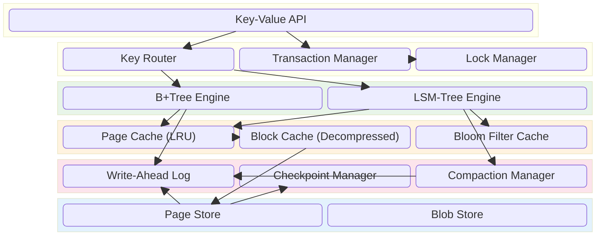
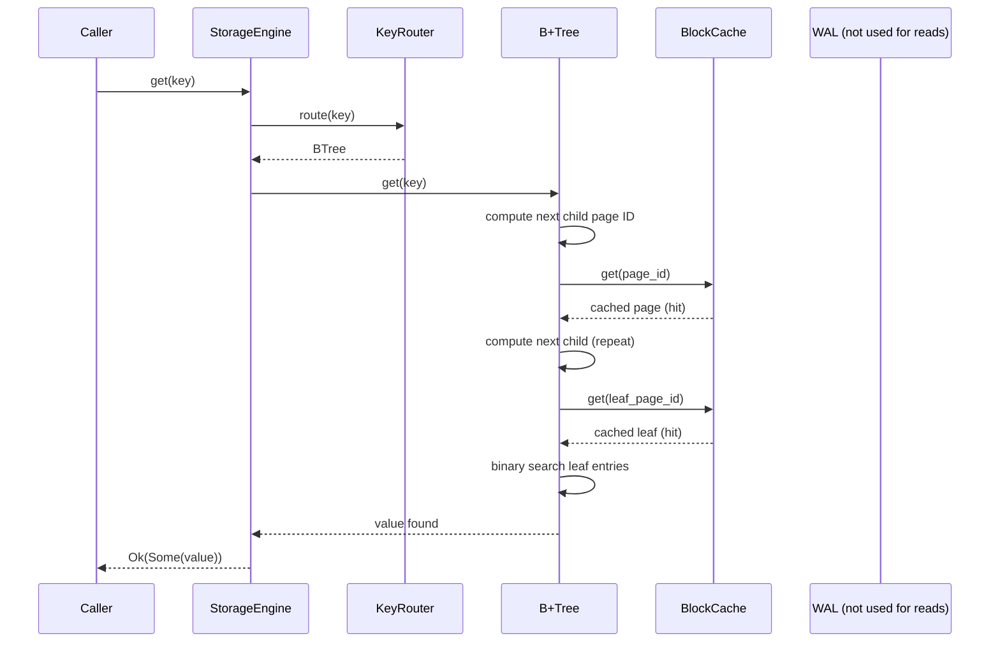
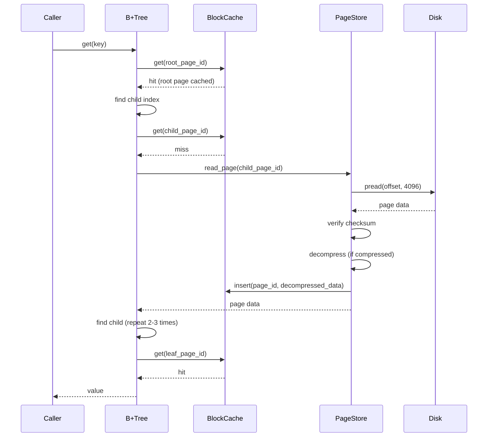
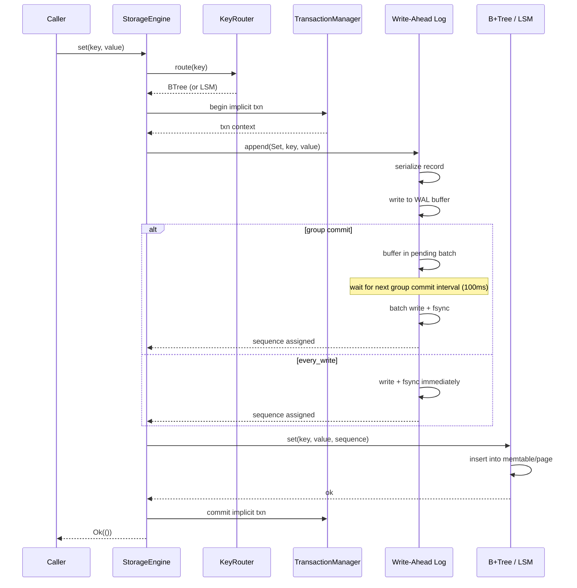
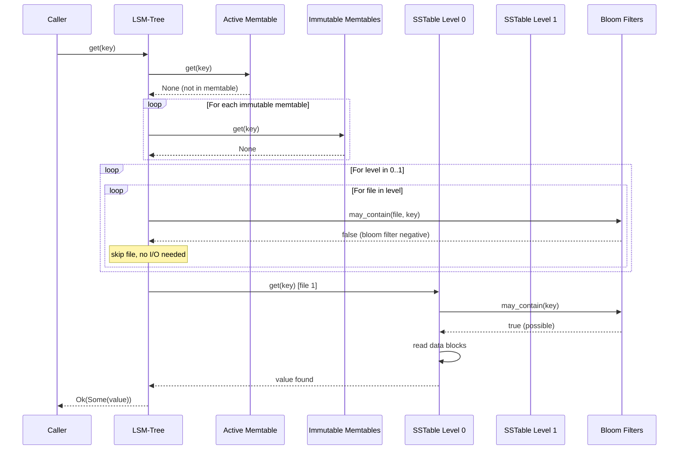
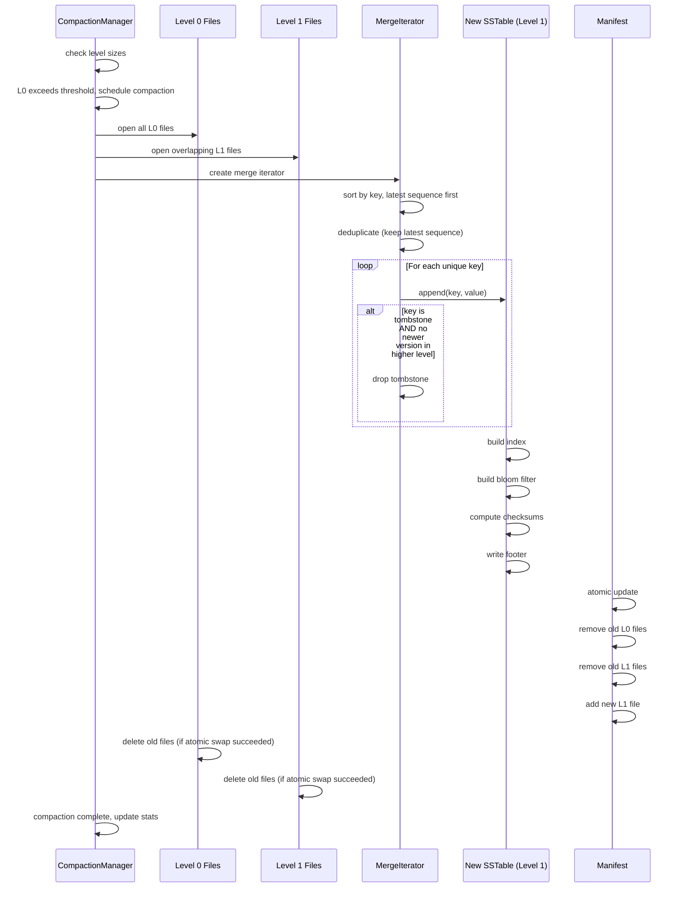
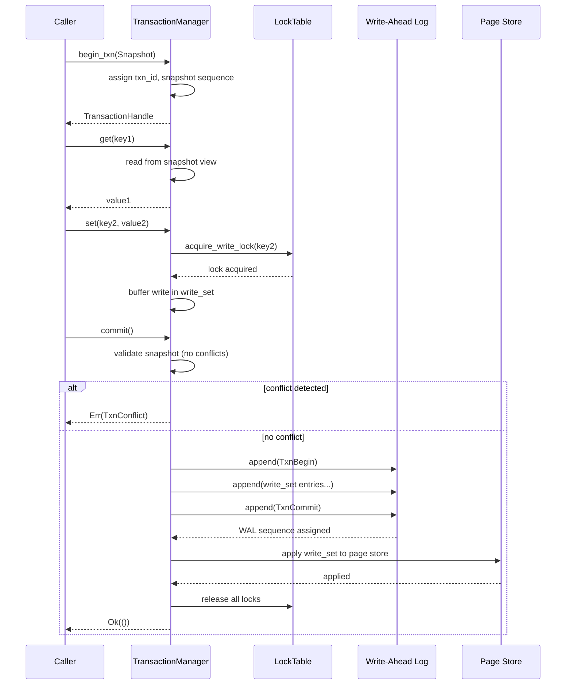

# 08 — Storage Engine

## 1. Purpose

The Storage Engine is the single persistence layer for all subsystems in Nova Runtime. It provides durable, transactional key-value storage with range queries, blob support, and queue primitives. Every subsystem that persists data uses this engine exclusively. There is no other persistence path.

## 2. Scope

This document covers:

- Page management: 4 KB fixed-size pages, page allocation, page cache with LRU eviction
- Page cache: concurrent access, latch-free reads, write-back policy, size limits
- B-tree indexing: B+tree structure, internal nodes, leaf nodes, split/merge operations
- LSM-tree for write-heavy workloads: memtable, immutable memtables, SSTable format, compaction
- Hybrid approach: when to use B-tree vs LSM-tree within the unified engine
- Write-Ahead Log (WAL): record format, fsync policies, group commit, rotation
- Checkpointing: frequency, coordination with WAL pruning
- Recovery algorithm: WAL replay from last checkpoint until consistent
- Bloom filters: per-SSTable, bits-per-key configuration, false positive rate analysis
- Compression: snappy and zstd per-page compression, compression cascading
- Block cache: smart caching of decompressed pages, tiered eviction
- Concurrent access: latch-free page reads, fine-grained locking for writes
- Transaction support: snapshot isolation, read locks, write locks, commit protocol
- Blob storage: large object storage (>1 MB) using dedicated blob pages with inline metadata
- Key-value API: Get, Set, Delete, Scan, Batch, CompareAndSwap, Transaction

Out of scope: SQL query processing (doc 21), search indexing (doc 19), queue delivery semantics (doc 17), clustering, replication.

## 3. Responsibilities

The Storage Engine is responsible for:

- Providing durable, crash-safe persistence for all subsystems
- Managing on-disk data layout (pages, blocks, files)
- Caching frequently accessed data in memory (block cache, page cache)
- Implementing transactional semantics with snapshot isolation
- Supporting point lookups, range scans, and prefix scans
- Storing and retrieving blob objects (>1 MB) efficiently
- Writing and replaying the WAL for crash recovery
- Creating and managing checkpoints for bounded recovery time
- Compressing data pages to reduce storage footprint
- Filtering point lookups with bloom filters to avoid unnecessary I/O
- Providing atomic batch operations
- Enforcing data checksums for integrity

## 4. Non Responsibilities

The Storage Engine is NOT responsible for:

- SQL parsing, query planning, or query execution
- Search indexing or full-text search
- Queue message routing or delivery semantics
- Scheduler task execution
- Authentication or authorization
- Replication or clustering coordination
- Backup management (snapshot export is a subsystem concern)
- Encryption at rest (future feature)
- Network access or connection management

## 5. Architecture

### 5.1 Overview

The Storage Engine uses a hybrid B-tree + LSM-tree design:

- **B-tree:** Used for small objects (<1 KB), metadata, indexes, schema, and transaction log. The B-tree provides strong read consistency and low read amplification (~2-4 pages per point lookup).

- **LSM-tree:** Used for write-heavy workloads, high-throughput ingestion, queue messages, event logs, and time-series data. The LSM-tree provides excellent write throughput (sequential SSTable writes) at the cost of read amplification (~5-15 files per point lookup, mitigated by bloom filters).

- **Hybrid router:** A key prefix routing table determines which storage engine variant handles which key range. Keys starting with specific prefixes (configurable) are routed to the LSM-tree; others go to the B-tree.



### 5.2 Page Architecture

All on-disk data is stored in 4 KB pages. A page is the atomic unit of I/O, caching, and checksumming.


A page has a 32-byte header:

| Offset | Size | Field | Description |
|--------|------|-------|-------------|
| 0 | 4 | magic | Magic number: 0x4E4F5641 ("NOVA") |
| 4 | 4 | page_id | Unique page identifier (monotonic) |
| 8 | 2 | page_type | Type: 0=free, 1=btree_internal, 2=btree_leaf, 3=lsm_data, 4=lsm_index, 5=blob_header, 6=blob_data, 7=checkpoint, 8=manifest |
| 10 | 2 | flags | Flags: compression, encryption, pinned |
| 12 | 4 | sequence | Monotonic write sequence number |
| 16 | 4 | free_offset | Offset to free space in data region |
| 20 | 2 | entry_count | Number of entries in this page |
| 22 | 2 | checksum_type | 0=xxh3_64, 1=xxh3_128, 2=xxh3_256 |
| 24 | 8 | reserved | Reserved for future use |

Total header: 32 bytes. Data region: 4096 - 32 - 32 = 4032 bytes.

### 5.3 Write-Ahead Log (WAL)

The WAL is an append-only log that records every mutation before it is applied to the page store. It's the source of truth for durability.


Record types:

| Type | Code | Payload |
|------|------|---------|
| Set | 0x01 | key_length(2) + key + value_length(4) + value |
| Delete | 0x02 | key_length(2) + key |
| BatchBegin | 0x03 | transaction_id(8) |
| BatchCommit | 0x04 | transaction_id(8) |
| BatchRollback | 0x05 | transaction_id(8) |
| TxnBegin | 0x06 | transaction_id(8) + isolation_level(1) |
| TxnCommit | 0x07 | transaction_id(8) |
| TxnRollback | 0x08 | transaction_id(8) |
| Checkpoint | 0x09 | checkpoint_id(8) + manifest_page(4) |
| BlobPut | 0x0A | blob_id(16) + length(4) + offset(4) |
| BlobDelete | 0x0B | blob_id(16) |

WAL file naming: wal_00000001.log, wal_00000002.log, etc. Each WAL file has a maximum size of 256 MB (configurable). After checkpoint, completed WAL files are deleted.

### 5.4 WAL Fsync Policies

| Policy | Description | Durability | Throughput | Max Data Loss |
|--------|-------------|------------|------------|---------------|
| every_write | fsync after every write | Full durability (fdatasync per write) | ~500 ops/s** | Zero |
| interval_ms:100 | fsync every 100ms | 100ms window | ~5000 ops/s | Up to 100ms of writes |
| interval_ms:1000 | fsync every 1s | 1s window | ~10000 ops/s | Up to 1s of writes |
| async | Never fsync, rely on kernel writeback | No durability guarantee | >50000 ops/s | Up to 30s of writes (kernel default) |

**Single-disk HDD performance. SSD sees ~2000 ops/s. NVMe sees ~10000 ops/s.

The engine uses different policies for different data:
- **Default:** interval_ms:100 (good balance of safety and performance)
- **Critical metadata (auth, schema):** every_write
- **Queue messages:** interval_ms:100
- **Cache data:** async (cache is ephemeral)
- **Event log:** interval_ms:1000

### 5.5 Group Commit

When fsync policy is interval-based, the WAL implements group commit:

```
function GroupCommit():
    every 100ms:
        batch = wal.pending_batches.drain()
        if batch is empty: return

        // Sort by sequence, merge consecutive writes to same key
        batch.sort()
        batch.deduplicate() // last write wins for same key

        // Write merged batch to WAL file
        bytes = SerializeBatch(batch)
        wal_file.write(bytes)

        // Single fsync for the entire batch
        wal_file.fsync()

        // Signal completion to all waiting writers
        for waiter in batch.waiters:
            waiter.complete()
```

Group commit reduces fsync frequency from N writes to N/batch_size writes. With 100ms intervals and 5000 ops/s, each batch contains ~500 operations, reducing fsync from 5000/s to 10/s.

### 5.6 Checkpointing

A checkpoint captures the consistent state of the page store at a point in time, allowing WAL pruning.

Checkpoint format:
```
Checkpoint Page (page_type = 7):
  - checkpoint_id: u64 (monotonic)
  - timestamp: u64 (unix nanoseconds)
  - wal_sequence: u64 (last WAL sequence included)
  - manifest_page_id: u32 (points to manifest page)
  - page_count: u32 (number of pages in checkpoint)
  - checksum: u32 (CRC32C of checkpoint page)
```

Manifest page:
```
Manifest Page (page_type = 8):
  - checkpoint_id: u64
  - free_list_page: u32 (page id of free list root)
  - btree_root_page: u32 (page id of B-tree root)
  - lsm_levels: [u32; 7] (SSTable pages per LSM level, 0=empty)
  - blob_region_start: u32
  - blob_region_end: u32
  - page_allocator_sequence: u64
```

Checkpoint frequency: every 1000 WAL operations, or every 60 seconds, whichever comes first.

### 5.7 B-Tree Index

The B-tree is a B+tree with the following parameters:

| Parameter | Value | Rationale |
|-----------|-------|-----------|
| Page size | 4096 bytes | Standard filesystem block, efficient I/O |
| Minimum fill factor | 40% | Prevents frequent splits at moderate memory cost |
| Maximum keys per internal node | 341 | (4032 - 2) / (8 + 4) = 341 keys |
| Maximum keys per leaf node | 170 | (4032 - 2) / (16 + 4) = ~170 entries |
| Key comparison | Memcmp (byte-ordered) | Simple, fast, deterministic |
| Duplicate keys | Allowed (append version) | Used for timestamps and versions |

Internal node format:
```
Internal Node (page_type = 1):
  header: PageHeader(32 bytes)
  parent_page: u32 (4 bytes)
  num_keys: u16 (2 bytes)
  keys: [u64; N] (8 bytes each)        // separator keys
  children: [u32; N+1] (4 bytes each) // page IDs of children
```

Leaf node format:
```
Leaf Node (page_type = 2):
  header: PageHeader(32 bytes)
  parent_page: u32 (4 bytes)
  next_leaf_page: u32 (4 bytes)       // for range scans (sibling pointer)
  prev_leaf_page: u32 (4 bytes)       // for reverse scans
  num_entries: u16 (2 bytes)
  entries: [Entry; N] where Entry {
    key: u64 (8 bytes),               // key (hash of variable-length key, or compact key)
    value_length: u16 (2 bytes),      // 0 = tombstone (deleted)
    value_offset: u16 (2 bytes),      // offset into data region
    sequence: u64 (8 bytes),          // write sequence number
  }
  data_area: [...]                    // concatenated key-value data
```

### 5.8 LSM-Tree

The LSM-tree component handles write-heavy workloads with the following structure:

```
LSM Levels:
  Level 0 (Memtable): 1 active + 2 immutable, each 64 MB (configurable)
  Level 1 (SSTables): 4 files, each up to 64 MB
  Level 2 (SSTables): 10 files, each up to 128 MB
  Level 3 (SSTables): 25 files, each up to 256 MB
  Level 4 (SSTables): 50 files, each up to 512 MB
  Level 5 (SSTables): 100 files, each up to 1 GB
  Level 6 (SSTables): 200 files, each up to 2 GB
```

Size ratio between levels: ~4x (write amplification ~10x).

Total LSM capacity at default config: ~650 GB (Level 6 max: 200 * 2 GB = 400 GB)

SSTable format:


### 5.9 Compaction

Compaction merges SSTables from one level to the next, removing tombstones and duplicate keys.

```
Compaction Strategy: Size-Tiered + Leveled hybrid
  - Within a level: size-tiered (merge when level exceeds threshold)
  - Between levels: leveled (merge one file from Ln + overlapping files from Ln+1)

Compaction Trigger:
  - Level 0: 3 memtables flushed → compact to Level 1
  - Level N: total size > threshold(N) → compact to Level N+1

Threshold(N) = base_size * (size_ratio ^ N)
  - base_size = 64 MB (Level 1)
  - size_ratio = 4
  - Level 1 threshold: 64 MB
  - Level 2 threshold: 256 MB
  - Level 3 threshold: 1024 MB (1 GB)
  - Level 4 threshold: 4 GB
  - Level 5 threshold: 16 GB
  - Level 6 threshold: 64 GB
```

Compaction algorithm:

```
function CompactLevel(level):
    // Select files for compaction
    files = SelectFilesForCompaction(level)
    if files is empty: return

    // Read all files, merge by key
    iterators = files.map(f => f.new_iterator())
    merger = MergeIterator(iterators)  // order by key, then sequence descending

    // Write new SSTable at level+1
    writer = NewSSTableWriter(level + 1)
    for (key, value, seq) in merger:
        // Skip tombstone if any newer version exists
        if value.is_tombstone and no_newer_version(key):
            continue
        writer.append(key, value)

    writer.finalize()  // build index, bloom filter, checksums

    // Atomically swap: remove old files, add new file
    manifest.transaction({
        for f in files: manifest.remove_file(f)
        manifest.add_file(writer.output)
    })

    // Delete old files
    for f in files: f.delete()
```

### 5.10 Hybrid Key Routing

Key routing determines whether a key goes to B-tree or LSM-tree:

```rust
struct KeyRouter {
    rules: Vec<RoutingRule>,
}

struct RoutingRule {
    key_prefix: Vec<u8>,        // match prefix
    target: EngineType,         // BTree | LSM
    min_key_size: u16,         // skip if key < this size
    max_key_size: u16,         // skip if key > this size
    priority: u8,              // higher priority wins on conflict
}
```

Default routing rules (from novad.toml):

```toml
[storage.routing]
b_tree_prefixes = [
    "meta:",           # system metadata
    "schema:",         # schema registry
    "auth:",           # authentication data
    "sql:",            # SQL table metadata
    "index:",          # B-tree indexes
    "blob:",           # blob metadata (small)
]
lsm_tree_prefixes = [
    "queue:",          # queue messages (write-heavy)
    "event:",          # event log (write-heavy)
    "log:",            # audit log (write-heavy)
    "cache:",          # persisted cache (write-heavy)
    "search:",         # search index (write-heavy)
    "ts:",             # time-series data (write-heavy)
    "session:",        # session data (write-heavy)
]
```

### 5.11 Bloom Filters

Each SSTable has a bloom filter for fast negative lookups.

```rust
struct BloomFilter {
    bits: Vec<u64>,               // bit array (block-aligned)
    num_hashes: u32,              // number of hash functions
    num_bits: u64,                // total bit count
    num_keys: u32,                // number of keys inserted
}

// Hash family: double-hashing scheme
// h1 = xxhash64(key)
// h2 = xxhash64(flip_sign(key))  (key with sign bit flipped)
// hi = h1 + i * h2
```

Parameters:

| Bits/Key | False Positive Rate | Filter Size (1M keys) | Space Overhead |
|----------|---------------------|-----------------------|----------------|
| 5 | 13.4% | 625 KB | 0.9% |
| 7 | 7.8% | 875 KB | 1.3% |
| 10 | 3.9% | 1.25 MB | 1.9% |
| 14 | 1.9% | 1.75 MB | 2.7% |
| 20 | 0.7% | 2.5 MB | 3.8% |

Default: 10 bits/key (~3.9% false positive rate). Configurable per SSTable level (higher levels get more bits/key to compensate for larger files).

### 5.12 Compression

Each page (B-tree) and data block (LSM) can be independently compressed.

```rust
enum CompressionCodec {
    None,                              // no compression, 0 CPU overhead
    Snappy,                            // ~250 MB/s compress, ~500 MB/s decompress
    Zstd { level: i32 },               // configurable level 1-22
}

struct CompressedBlock {
    codec: CompressionCodec,
    uncompressed_size: u32,            // before compression
    compressed_size: u32,              // after compression (0 if inline)
    // Data follows header, possibly uncompressed if size > threshold
    data: Vec<u8>,
}
```

Compression cascade (configurable):

| Data Type | Compression | Level | Rationale |
|-----------|-------------|-------|-----------|
| WAL records | None | - | Must be fast, not read frequently |
| B-tree internal nodes | None | - | Frequently accessed, small |
| B-tree leaf nodes | Snappy | - | Point lookups, moderate compression |
| LSM Level 1 | Snappy | - | Recent data, frequent reads |
| LSM Level 2 | Snappy | - | Recent data |
| LSM Level 3 | Zstd | 3 | Older data, less frequent reads |
| LSM Level 4 | Zstd | 5 | Cold data |
| LSM Level 5 | Zstd | 10 | Very cold data |
| LSM Level 6 | Zstd | 16 | Archive-level |

Compression ratios (typical):
- Snappy Level 1: 2x-4x on text, 1.5x on binary
- Zstd Level 3: 3x-6x on text, 2x on binary
- Zstd Level 16: 4x-10x on text, 2.5x on binary

### 5.13 Block Cache

The block cache stores decompressed pages in memory, indexed by page ID. It serves as the primary read cache.

```rust
struct BlockCache {
    entries: HashMap<u64, Arc<CacheEntry>>,  // page_id -> cached block
    lru: LruList<u64>,                       // LRU eviction list
    capacity: usize,                         // max bytes
    used_bytes: AtomicUsize,                 // current usage
    shards: u32,                             // number of shards for concurrency
    stats: CacheStats,
}

struct CacheEntry {
    page_id: u64,
    data: Vec<u8>,                           // decompressed page data (4096 bytes)
    sequence: u64,                           // write sequence at insertion time
    hits: AtomicU64,                         // access counter
    access_time: AtomicU64,                  // last access (monotonic ns)
    pin_count: AtomicI32,                    // pinned in cache (for in-flight I/O)
}
```

Eviction policy: LRU with two-tier segmentation:
- **Hot tier:** Pages accessed > 3 times, promoted to hot. Evicted from hot after no access for 60s.
- **Cold tier:** New insertions or pages with <= 3 accesses. Evicted when full.

This prevents scan pollution (one-time large scans evicting frequently accessed pages).

Cache sharding: The block cache is divided into N shards (default: N = CPU cores). Each shard has its own LRU list and hash map. A page maps to a shard by page_id % N.

### 5.14 Transaction Support

Transactions use snapshot isolation (MVCC):

```rust
struct Transaction {
    id: u64,                    // monotonic, assigned by transaction manager
    snapshot: Snapshot,         // consistent read view
    status: TxnStatus,          // Active | Committing | Committed | Aborted
    isolation: IsolationLevel,  // ReadCommitted | RepeatableRead | Snapshot
    read_set: Vec<KeyRef>,      // keys read (for conflict detection)
    write_set: Vec<KeyRef>,     // keys written (for conflict detection)
    lock_mode: LockMode,        // Conservative | Optimistic
    started_at: Instant,
    timeout: Duration,          // max transaction duration
}

struct Snapshot {
    transaction_id: u64,        // snapshot sees transactions < this ID
    sequence: u64,              // WAL sequence at snapshot time
}
```

Concurrency control:

| Isolation Level | Reads | Writes | Phantom Prevention |
|-----------------|-------|--------|-------------------|
| Read Committed | No lock, latest committed | Write lock on key | No |
| Repeatable Read | Snapshot at first read | Write lock on key | No |
| Snapshot | Snapshot at begin | Write lock on key | Yes (SI) |
| Serializable | Snapshot + conflict check | Write lock on key | Yes (SSI) |

Write lock acquisition: per-key lock with timeout (default 5s). Deadlock detection: timeout-based (no cycle detection).

Optimistic Concurrency Control: For low-conflict workloads, transactions can use OCC:
1. Read phase: read all keys, record read timestamps
2. Validation phase: check that no read keys were modified since read
3. Write phase: if validation passes, apply all writes atomically

### 5.15 Page Manager

```rust
struct PageManager {
    free_list: FreeList,              // linked list of free pages
    next_page_id: AtomicU64,          // monotonic page ID counter
    page_store: PageStore,            // I/O layer
    page_cache: PageCache,            // recently accessed pages
    allocator: PageAllocator,         // allocation strategy
}
```

Page allocation strategies:

| Strategy | Behavior | Use Case |
|----------|----------|----------|
| First-fit | Scan free list, take first fit | General purpose (default) |
| Best-fit | Scan free list, take best size match | Large allocations |
| Append-only | Append to end of file (no free list search) | WAL, LSM writes |

### 5.16 Blob Storage

Objects larger than 1 MB are stored in the blob store, which uses a separate allocation region within the page store.

```rust
struct BlobStore {
    min_blob_size: u64,           // 1 MB (below this, inline in page store)
    max_blob_size: u64,           // 5 TB (5497558138880 bytes)
    region_start: u64,            // first page ID of blob region
    region_end: AtomicU64,        // last page ID of blob region
    blob_index: HashMap<u128, BlobRecord>, // blob_id -> metadata
}

struct BlobRecord {
    blob_id: u128,                // UUIDv7
    size: u64,                    // total size in bytes
    num_pages: u32,               // number of data pages
    first_page: u32,              // first page ID
    checksum: u32,                // CRC32C of entire blob
    created_at: u64,              // unix nanoseconds
    ttl: Option<u64>,            // optional expiration
}
```

Blob pages are contiguous on disk. A blob header page (page_type = 5) precedes the data pages (page_type = 6). Blob reads use vectored I/O (preadv) for efficient scatter-read.

## 6. Data Structures

### 6.1 PageHeader

```rust
#[repr(C, packed)]
struct PageHeader {
    magic: u32,                  // 0x4E4F5641 ("NOVA"), 4 bytes
    page_id: u32,                // unique page identifier, 4 bytes
    page_type: u16,              // 0=free, 1=btree_internal, ..., 2 bytes
    flags: u16,                  // bitfield: [compressed:1, encrypted:1, pinned:1, ...], 2 bytes
    sequence: u32,               // monotonic write sequence, 4 bytes
    free_offset: u16,            // offset to free space in data region, 2 bytes
    entry_count: u16,            // number of entries, 2 bytes
    checksum_type: u8,           // 0=xxh3_64, 1=xxh3_128, 2=xxh3_256, 1 byte
    reserved: [u8; 7],           // reserved for future, 7 bytes
}   // total: 32 bytes
```

Static assertion: size_of(PageHeader) == 32.

### 6.2 WALRecord

```rust
#[repr(C, packed)]
struct WALRecordHeader {
    magic: u32,                  // 0x4E4F5641, 4 bytes
    checksum: u32,               // CRC32C of payload, 4 bytes
    length: u32,                 // payload bytes, max 65535, 4 bytes
    sequence: u64,               // monotonic sequence number, 8 bytes
    record_type: u16,            // operation type, 2 bytes
    flags: u16,                  // bitfield, 2 bytes
}   // total: 24 bytes

enum WALRecordPayload {
    Set {
        key_length: u16,         // 2 bytes
        key: Vec<u8>,            // key_length bytes
        value_length: u32,       // 4 bytes
        value: Vec<u8>,          // value_length bytes
    },
    Delete {
        key_length: u16,         // 2 bytes
        key: Vec<u8>,            // key_length bytes
    },
    TxnBegin {
        transaction_id: u64,     // 8 bytes
        isolation_level: u8,     // 1 byte
    },
    TxnCommit {
        transaction_id: u64,     // 8 bytes
    },
    TxnRollback {
        transaction_id: u64,     // 8 bytes
    },
    BlobPut {
        blob_id: u128,           // 16 bytes
        length: u32,             // 4 bytes
        offset: u32,             // 4 bytes
    },
    BlobDelete {
        blob_id: u128,           // 16 bytes
    },
}
```

### 6.3 BTreeInternalNode

```rust
#[repr(C, packed)]
struct BTreeInternalNode {
    header: PageHeader,          // 32 bytes
    parent_page_id: u32,         // 4 bytes
    num_keys: u16,               // 2 bytes
    keys: [u64; 341],            // separator keys, up to 341 * 8 = 2728 bytes
    children: [u32; 342],        // child page IDs, up to 342 * 4 = 1368 bytes
    // Total: 32 + 4 + 2 + 2728 + 1368 = 4134 > 4096
    // Actual: 32 + 4 + 2 + min(num_keys, max_keys) * (8+4)
    //   max_keys = floor((4032 - 6) / 12) = 335
    // Actually: keys inline, use pointer-based storage for overflow
}
```

Wait - that's too big for 4KB. Let me recalculate.

Page data region = 4096 - 32 (header) - 32 (checksum) = 4032 bytes.
Internal node overhead = parent_page_id (4) + num_keys (2) = 6 bytes.
Available for keys + children = 4032 - 6 = 4026 bytes.
Each key is 8 bytes, each child is 4 bytes. Per entry: 12 bytes.
max_keys = floor(4026 / 12) = 335 keys, 336 children.

But we need to store variable-length keys. Key format:

```rust
struct InternalNodeKey {
    key_hash: u64,               // 8 bytes, xxhash3 of full key
    // The actual key is stored in the data area portion
}
```

For variable-length keys:

```rust
#[repr(C, packed)]
struct BTreeInternalNode {
    header: PageHeader,          // 32 bytes
    parent_page_id: u32,         // 4 bytes
    num_keys: u16,               // 2 bytes
    // Key directory (at end of data region, grows downward)
    // Entry format:
    //   key_hash: u64           (8 bytes)
    //   child_page_id: u32      (4 bytes)
    //   key_offset: u16         (2 bytes) - offset into data area
    //   key_length: u16         (2 bytes)
    // Total per entry: 16 bytes
    //
    // Data area (at start of data region, grows upward)
    // Contains the actual key bytes
    //
    // max_entries = floor(4026 / 16) = 251
}
```

Leaf node:

```rust
#[repr(C, packed)]
struct BTreeLeafNode {
    header: PageHeader,          // 32 bytes
    parent_page_id: u32,         // 4 bytes
    next_leaf_page_id: u32,      // 4 bytes
    prev_leaf_page_id: u32,      // 4 bytes
    num_entries: u16,            // 2 bytes
    // Entry directory:
    //   key_hash: u64           (8 bytes)
    //   value_offset: u16       (2 bytes)
    //   value_length: u16       (2 bytes)
    //   sequence: u64           (8 bytes)
    //   flags: u8               (1 byte) - tombstone, etc
    // Total per directory entry: 21 bytes
    //
    // Data area: concatenated key bytes + value bytes
    //
    // max_entries = floor((4096 - 32 - 4 - 4 - 4 - 2 - 32) / 21) = floor(4018/21) = 191
}
```

### 6.4 SSTable Footer

```rust
#[repr(C, packed)]
struct SSTableFooter {
    magic: u32,                  // 0x53535442 ("SSTB"), 4 bytes
    version: u32,                // format version, 4 bytes
    index_offset: u64,           // offset to index block, 8 bytes
    index_length: u64,           // length of index block, 8 bytes
    bloom_offset: u64,           // offset to bloom filter block, 8 bytes
    bloom_length: u64,           // length of bloom filter block, 8 bytes
    data_blocks_count: u32,      // number of data blocks, 4 bytes
    data_blocks_size: u64,       // total uncompressed data size, 8 bytes
    checksum: u32,               // CRC32C of footer, 4 bytes
}   // total: 56 bytes
```

### 6.5 Checkpoint

```rust
#[repr(C, packed)]
struct CheckpointData {
    checkpoint_id: u64,          // monotonic, 8 bytes
    timestamp_ns: u64,           // unix nanoseconds, 8 bytes
    wal_sequence: u64,           // last WAL sequence included, 8 bytes
    manifest_page_id: u32,       // page ID of manifest, 4 bytes
    manifest_checksum: u32,      // CRC32C of manifest, 4 bytes
    page_count: u32,             // pages in checkpoint, 4 bytes
    total_size_bytes: u64,       // total checkpoint size, 8 bytes
    duration_ms: u32,            // checkpoint creation time, 4 bytes
    reserved: [u8; 32],         // reserved for future, 32 bytes
    checksum: u32,               // CRC32C of checkpoint, 4 bytes
}   // total: ~80 bytes (stored on page_type=7 page)
```

### 6.6 Manifest

```rust
#[repr(C, packed)]
struct Manifest {
    version: u32,                // format version, 4 bytes
    sequence: u64,               // monotonic manifest version, 8 bytes
    free_list_root_page: u32,    // free list B-tree root, 4 bytes
    btree_root_page: u32,        // B-tree root page, 4 bytes
    btree_height: u32,           // B-tree height, 4 bytes
    btree_count: u64,            // B-tree key count, 8 bytes
    lsm_levels: [LevelMeta; 7],  // per-level LSM metadata, 7 * 32 = 224 bytes
    blob_region_start: u64,      // first blob page ID, 8 bytes
    blob_region_end: u64,        // last blob page ID, 8 bytes
    page_allocator_seq: u64,     // next page ID, 8 bytes
    wal_file_id: u32,            // current WAL file ID, 4 bytes
    wal_sequence: u64,           // last WAL sequence, 8 bytes
    created_at: u64,             // manifest creation time, 8 bytes
}

struct LevelMeta {
    num_files: u32,              // SSTable count at this level, 4 bytes
    total_size: u64,             // total data size at level, 8 bytes
    file_list_page: u32,         // page ID of file list B-tree, 4 bytes
    reserved: [u8; 16],          // padding to 32 bytes, 16 bytes
}   // LevelMeta: 32 bytes
```

### 6.7 Memtable

```rust
struct Memtable {
    id: u64,                     // monotonic memtable ID
    data: BTreeMap<Vec<u8>, MemtableEntry>, // in-memory skip list
    size: AtomicU64,             // current byte size
    max_size: u64,               // 64 MB default
    immutable: AtomicBool,       // read-only (being flushed)
    flushed: AtomicBool,         // flush complete
    created_at: Instant,
    flushed_at: Option<Instant>,
    wal_sequence_start: u64,     // first WAL sequence in this memtable
    wal_sequence_end: AtomicU64, // last WAL sequence in this memtable
}

struct MemtableEntry {
    value: Vec<u8>,
    sequence: u64,
    flags: u8,                   // tombstone, etc.
}
```

### 6.8 KeyRouter

```rust
struct KeyRouter {
    rules: Vec<RoutingRule>,
}

struct RoutingRule {
    prefix: Vec<u8>,             // key prefix to match
    target: EngineType,          // BTree or LSM
    min_size: u16,               // minimum key length (inclusive)
    max_size: u16,               // maximum key length (exclusive, 0 = no limit)
    priority: u8,                // higher = wins on conflict
}

enum EngineType {
    BTree = 0,
    LSM = 1,
}
```

### 6.9 TransactionManager

```rust
struct TransactionManager {
    next_txn_id: AtomicU64,
    active_txns: RwLock<HashMap<u64, Transaction>>,
    lock_table: LockTable,
    snapshot_sequences: SeqLock<Vec<u64>>, // committed sequences for snapshot isolation
    txn_timeout: Duration,                 // default 5s
    max_txns: u32,                         // default 1024 concurrent
}

struct LockTable {
    shards: Vec<LockShard>,
    num_shards: u32,             // default 256
}

struct LockShard {
    locks: HashMap<Vec<u8>, KeyLock>,
    mutex: Mutex,
}

struct KeyLock {
    holder: u64,                 // transaction ID
    mode: LockMode,              // Shared | Exclusive
    waiters: Vec<(u64, LockMode, Instant)>, // (txn_id, requested_mode, deadline)
    acquired_at: Instant,
}
```

### 6.10 BlockCache

```rust
struct BlockCache {
    shards: Vec<CacheShard>,
    capacity: usize,
    shard_mask: u32,
}

struct CacheShard {
    entries: HashMap<u64, Arc<CachedBlock>>,
    hot_list: LruList<u64>,
    cold_list: LruList<u64>,
    hot_threshold: u32,          // access count to promote to hot (default 3)
    hot_ttl_ns: u64,             // 60 seconds in nanoseconds
    stats: ShardStats,
    mutex: Mutex,
}

struct CachedBlock {
    page_id: u64,
    data: Vec<u8>,               // decompressed page (4096 bytes)
    sequence: u64,
    access_count: AtomicU32,
    last_access_ns: AtomicU64,
    pin_count: AtomicI32,
    checksum: u32,
}
```

### 6.11 CompactionManager

```rust
struct CompactionManager {
    levels: [LevelState; 7],
    active_compactions: AtomicU32,
    max_compactions: u32,        // default 2 (limited by I/O)
    compaction_trigger_pct: u8,  // compact when level exceeds threshold * (100+trigger)/100
    is_running: AtomicBool,
    stats: CompactionStats,
}

struct LevelState {
    level: u8,
    total_size: AtomicU64,
    file_count: AtomicU32,
    threshold: u64,              // threshold before compaction triggers
    pending_compaction: AtomicBool,
}

struct CompactionStats {
    compactions_completed: AtomicU64,
    bytes_read: AtomicU64,
    bytes_written: AtomicU64,
    bytes_dropped: AtomicU64,      // tombstones/garbage removed
    last_duration_ms: AtomicU64,
    avg_duration_ms: AtomicU64,
}
```

## 7. Algorithms

### 7.1 Recovery Algorithm

On startup, the storage engine recovers to a consistent state:

```
function Recover():
    // Step 1: Find latest checkpoint
    checkpoint = FindLatestCheckpoint(data_dir)
    if checkpoint is None:
        Log.Info("No checkpoint found, initializing empty database")
        return InitializeNewDatabase()

    Log.Info("Found checkpoint {checkpoint.id} at sequence {checkpoint.wal_sequence}")

    // Step 2: Load manifest
    manifest_page = ReadPage(checkpoint.manifest_page_id)
    manifest = DeserializeManifest(manifest_page)

    // Step 3: Load free list and B-tree structure
    free_list = LoadFreeList(manifest.free_list_root_page)
    btree_root = LoadBTree(manifest.btree_root_page)
    lsm_levels = LoadLSMLevels(manifest.lsm_levels)

    // Step 4: Find WAL files after checkpoint
    wal_files = FindWALFilesAfter(data_dir, checkpoint.wal_sequence)
    sort wal_files by sequence

    if wal_files is empty:
        Log.Info("No WAL files to replay, database is consistent")
        return DatabaseState { free_list, btree_root, lsm_levels, manifest }

    // Step 5: Replay WAL
    Log.Info("Replaying {len(wal_files)} WAL files from sequence {checkpoint.wal_sequence}")
    replayed = 0
    active_txns = HashMap<u64, Transaction>() // uncommitted transactions

    for wal_file in wal_files:
        reader = WALReader::open(wal_file)
        while record = reader.next():
            match record.type:
                Set => {
                    if active_txns.is_empty():
                        // Not in a transaction, apply immediately
                        BTreeSet(btree_root, record.key, record.value, record.sequence)
                        or
                        LSMSet(lsm_levels, record.key, record.value, record.sequence)
                        replayed++
                    else:
                        // Part of a transaction, buffer
                        for txn in active_txns.values():
                            txn.buffer_write(record.key, record.value)
                }
                Delete => {
                    if active_txns.is_empty():
                        BTreeDelete(btree_root, record.key, record.sequence)
                        replayed++
                    else:
                        for txn in active_txns.values():
                            txn.buffer_delete(record.key)
                }
                TxnBegin => {
                    txn = Transaction::new(record.transaction_id, record.isolation_level)
                    active_txns.insert(record.transaction_id, txn)
                }
                TxnCommit => {
                    if txn = active_txns.remove(record.transaction_id):
                        // Apply all buffered writes
                        for op in txn.write_set:
                            Apply(op)
                            replayed++
                }
                TxnRollback => {
                    active_txns.remove(record.transaction_id)
                    // Drop buffered writes
                }
                Checkpoint => {
                    // Ignore checkpoint records during recovery
                    // (we started from the latest checkpoint)
                }

    // Step 6: Roll back any uncommitted transactions
    for (id, txn) in active_txns:
        Log.Warn("Rolling back uncommitted transaction {id}")
        // Writes were never applied, just drop them

    Log.Info("Recovery complete: replayed {replayed} operations")
    return DatabaseState { free_list, btree_root, lsm_levels, manifest }
```

### 7.2 B-Tree Insert

```
function BTreeInsert(root_page_id, key, value, sequence):
    current_page = ReadPage(root_page_id)

    // Find leaf page for insertion
    while current_page.type != LEAF:
        child_idx = FindChildIndex(current_page, key)
        current_page = ReadPage(current_page.children[child_idx])

    // Insert into leaf
    leaf = current_page
    entry = { key, value, sequence }
    leaf.entries.insert(entry)  // maintain sorted order

    if leaf.bytes_used > MAX_LEAF_BYTES:
        // Split
        new_leaf = AllocatePage(LEAF)
        mid = leaf.num_entries / 2
        new_leaf.entries = leaf.entries[mid..]
        leaf.entries = leaf.entries[..mid]

        // Update sibling pointers
        new_leaf.next_leaf = leaf.next_leaf
        new_leaf.prev_leaf = leaf.page_id
        leaf.next_leaf = new_leaf.page_id
        if new_leaf.next_leaf exists:
            next = ReadPage(new_leaf.next_leaf)
            next.prev_leaf = new_leaf.page_id

        // Insert separator key into parent
        separator_key = new_leaf.entries[0].key
        InsertIntoParent(leaf.parent_page_id, separator_key, new_leaf.page_id)

    WritePage(leaf)
    WritePage(new_leaf) // if split happened
```

### 7.3 B-Tree Point Lookup

```
function BTreeGet(root_page_id, key):
    current_page = ReadPage(root_page_id)
    while current_page.type != LEAF:
        child_idx = FindChildIndex(current_page, key)
        current_page = ReadPage(current_page.children[child_idx])

    // Binary search in leaf
    entry = BinarySearch(current_page.entries, key)
    if entry and not entry.is_tombstone:
        return entry.value
    return None
```

### 7.4 B-Tree Range Scan

```
function BTreeScan(root_page_id, start_key, end_key, limit):
    results = []

    // Find first leaf page containing start_key
    current_page = ReadPage(root_page_id)
    while current_page.type != LEAF:
        child_idx = FindChildIndex(current_page, start_key)
        current_page = ReadPage(current_page.children[child_idx])

    // Scan forward through leaf nodes
    while len(results) < limit:
        for entry in current_page.entries:
            if entry.key < start_key: continue
            if entry.key >= end_key: return results
            if not entry.is_tombstone:
                results.push(entry)
                if len(results) >= limit: return results

        if current_page.next_leaf_page_id == 0:
            break
        current_page = ReadPage(current_page.next_leaf_page_id)

    return results
```

### 7.5 LSM-Tree Write

```
function LSMSet(lsm, key, value, sequence):
    active_memtable = lsm.active_memtable()

    active_memtable.insert(key, value, sequence)
    active_memtable.size += key.len + value.len + OVERHEAD

    if active_memtable.size >= active_memtable.max_size:
        // Rotate memtable
        active_memtable.immutable = true
        lsm.immutable_memtables.push(active_memtable)
        lsm.active_memtable = new Memtable(sequence)

        // Signal flush if too many immutables
        if lsm.immutable_memtables.len() >= MAX_IMMUTABLES:
            TriggerFlush(lsm)
```

### 7.6 LSM-Tree Flush (Memtable -> SSTable)

```
function FlushMemtable(lsm, memtable):
    // Freeze the memtable
    memtable.immutable = true

    // Write SSTable at Level 0
    writer = SSTableWriter::new(lsm.level_path(0))
    sorted_it = memtable.data.iter()

    for (key, entry) in sorted_it:
        writer.append(key, entry.value, entry.sequence)

    writer.finalize()

    // Update manifest
    lsm.levels[0].files.push(writer.file_info)
    lsm.immutable_memtables.remove(memtable)
    memtable.flushed = true

    // Check if Level 0 needs compaction
    if lsm.levels[0].total_size > lsm.levels[0].threshold:
        ScheduleCompaction(lsm, 0)
```

### 7.7 LSM-Tree Point Lookup

```
function LSMGet(lsm, key):
    // Check memtables first (most recent first)
    for memtable in [lsm.active_memtable, lsm.immutable_memtables...]:
        if entry = memtable.get(key):
            if entry.is_tombstone:
                return None  // deleted
            return entry.value

    // Check SSTables from L0 to L6
    for level in 0..6:
        // Check bloom filter first (fast negative)
        for sstable in lsm.levels[level].files:
            if not sstable.bloom_filter.may_contain(key):
                continue
            if value = sstable.get(key):
                if value.is_tombstone:
                    return None
                return value

    return None  // not found
```

### 7.8 Bloom Filter Check

```
function BloomFilterMayContain(filter, key):
    h1 = xxhash3_64(key)
    h2 = xxhash3_64(flip_sign_bit(key))  // derive second hash

    for i in 0..filter.num_hashes:
        bit_index = (h1 + i * h2) % filter.num_bits
        word_index = bit_index / 64
        bit_offset = bit_index % 64
        if (filter.bits[word_index] & (1 << bit_offset)) == 0:
            return false  // definitely not present

    return true  // possibly present (false positive possible)
```

### 7.9 WAL Group Commit

```
function WALGroupCommit(wal, batch, deadline):
    // batch: set of pending write operations
    // deadline: time when this batch must be committed

    // Serialize batch
    buf = serialize(batch.records)

    // Write to WAL file
    wal.file.write(buf)

    // fsync
    wal.file.fsync()

    // Record sequence number
    for record in batch.records:
        record.assigned_sequence = wal.next_sequence.fetch_add(1)

    // Signal completion
    for waiter in batch.waiters:
        waiter.signal(record.assigned_sequence)
```

### 7.10 Checkpoint Creation

```
function CreateCheckpoint(state):
    // Step 1: Flush WAL to ensure all writes are durable
    state.wal.flush()

    // Step 2: Create consistent snapshot of page store
    // (pin pages to prevent modification during checkpoint)

    // Step 3: Write manifest page
    manifest = BuildManifest(state)
    manifest_page_id = AllocatePage(MANIFEST)
    WritePage(manifest_page_id, manifest)

    // Step 4: Write checkpoint page
    checkpoint = CheckpointData {
        checkpoint_id: state.next_checkpoint_id++,
        timestamp_ns: now(),
        wal_sequence: state.wal.last_sequence(),
        manifest_page_id: manifest_page_id,
        page_count: state.page_manager.active_pages(),
        total_size_bytes: state.page_manager.total_size(),
        duration_ms: elapsed(),
    }
    checkpoint_page_id = AllocatePage(CHECKPOINT)
    WritePage(checkpoint_page_id, checkpoint)

    // Step 5: Write checkpoint to WAL (for recovery consistency)
    state.wal.write_checkpoint_record(checkpoint)

    // Step 6: Flush checkpoint pages
    state.page_store.fsync()

    // Step 7: Prune old WAL files
    state.wal.prune_before(checkpoint.wal_sequence)

    // Step 8: Record checkpoint location
    WriteLatestCheckpointPointer(checkpoint_page_id)
```

### 7.11 Page Cache LRU Eviction

```
function CacheEvict(cache, required_bytes):
    evicted = 0
    // Evict from cold list first
    while evicted < required_bytes and cache.cold_list not empty:
        page_id = cache.cold_list.pop_back()
        entry = cache.entries.remove(page_id)
        evicted += page_size
        cache.stats.cold_evictions++

    // If still need space, evict from hot list (promoted to cold first)
    while evicted < required_bytes and cache.hot_list not empty:
        page_id = cache.hot_list.pop_back()
        entry = cache.entries.remove(page_id)
        evicted += page_size
        cache.stats.hot_evictions++
```

### 7.12 Deadlock Detection (Timeout-Based)

```
function AcquireWriteLock(txn, key):
    shard = lock_table.shard(hash(key) % num_shards)
    deadline = now() + txn.timeout

    with shard.mutex.lock():
        lock = shard.locks.get(key)
        if lock is None:
            // No contention, acquire immediately
            shard.locks.insert(key, KeyLock { holder: txn.id, mode: Exclusive })
            return Acquired

        if lock.holder == txn.id:
            // Already hold lock, upgrade if needed
            lock.mode = Exclusive
            return Acquired

        // Contention: add to waiters
        lock.waiters.push((txn.id, Exclusive, deadline))

    // Wait for lock
    while now() < deadline:
        with shard.mutex.lock():
            lock = shard.locks.get(key)
            if lock.holder == txn.id:
                // We got the lock
                lock.waiters.remove(txn.id)
                return Acquired

        sleep(1ms)  // spin-wait

    // Timeout: remove from waiters, return error
    with shard.mutex.lock():
        lock = shard.locks.get(key)
        lock.waiters.remove(txn.id)

    return Err(DeadlockError("lock timeout"))
```

## 8. Interfaces

### 8.1 StorageEngine (Top-Level API)

```rust
trait StorageEngine: Send + Sync {
    /// Initialize the storage engine. Called once at startup.
    /// Opens data files, recovers WAL, validates checksums.
    fn open(path: &Path, config: &StorageConfig) -> Result<Self, StorageError>;

    /// Gracefully close all files, release resources.
    fn close(&self) -> Result<(), StorageError>;

    /// Get a value by key. Returns None if key does not exist.
    fn get(&self, key: &[u8]) -> Result<Option<Vec<u8>>, StorageError>;

    /// Set a key to a value. Overwrites existing value.
    fn set(&self, key: &[u8], value: &[u8]) -> Result<(), StorageError>;

    /// Delete a key. Returns Ok even if key does not exist.
    fn delete(&self, key: &[u8]) -> Result<(), StorageError>;

    /// Check if a key exists without reading its value.
    fn exists(&self, key: &[u8]) -> Result<bool, StorageError>;

    /// Scan keys in range [start, end) with optional limit.
    fn scan(&self, start: &[u8], end: &[u8], limit: u32)
        -> Result<Vec<(Vec<u8>, Vec<u8>)>, StorageError>;

    /// Scan keys with prefix matching.
    fn scan_prefix(&self, prefix: &[u8], limit: u32)
        -> Result<Vec<(Vec<u8>, Vec<u8>)>, StorageError>;

    /// Atomic compare-and-swap.
    /// Sets key to value only if current value matches expected.
    fn compare_and_swap(&self, key: &[u8], expected: &[u8], value: &[u8])
        -> Result<bool, StorageError>;

    /// Apply a batch of operations atomically.
    fn batch(&self, ops: &[BatchOp]) -> Result<(), StorageError>;

    /// Begin a transaction with the specified isolation level.
    fn begin_txn(&self, isolation: IsolationLevel) -> Result<TransactionHandle, StorageError>;

    /// Flush all pending writes to disk (WAL fsync).
    fn flush(&self) -> Result<(), StorageError>;

    /// Create a checkpoint for fast recovery.
    fn checkpoint(&self) -> Result<(), StorageError>;

    /// Get storage engine statistics.
    fn stats(&self) -> StorageStats;
}
```

### 8.2 TransactionHandle

```rust
trait TransactionHandle {
    fn id(&self) -> u64;
    fn get(&self, key: &[u8]) -> Result<Option<Vec<u8>>, StorageError>;
    fn set(&self, key: &[u8], value: &[u8]) -> Result<(), StorageError>;
    fn delete(&self, key: &[u8]) -> Result<(), StorageError>;
    fn scan(&self, start: &[u8], end: &[u8], limit: u32)
        -> Result<Vec<(Vec<u8>, Vec<u8>)>, StorageError>;
    fn commit(&self) -> Result<(), StorageError>;
    fn rollback(&self) -> Result<(), StorageError>;
}
```

### 8.3 BlobStore

```rust
trait BlobStore: Send + Sync {
    /// Put a blob. Returns the blob ID.
    fn put(&self, data: &[u8], ttl: Option<Duration>) -> Result<u128, StorageError>;

    /// Get a blob by ID.
    fn get(&self, blob_id: u128) -> Result<Option<Vec<u8>>, StorageError>;

    /// Delete a blob by ID.
    fn delete(&self, blob_id: u128) -> Result<(), StorageError>;

    /// Get blob metadata without reading data.
    fn metadata(&self, blob_id: u128) -> Result<Option<BlobMetadata>, StorageError>;

    /// Stream blob data through a callback (avoids full copy).
    fn read_stream(&self, blob_id: u128, cb: &dyn Fn(&[u8]) -> Result<(), StorageError>)
        -> Result<(), StorageError>;

    /// Get blob store statistics.
    fn stats(&self) -> BlobStats;
}
```

### 8.4 Batch Operation

```rust
enum BatchOp {
    Set { key: Vec<u8>, value: Vec<u8> },
    Delete { key: Vec<u8> },
}
```

### 8.5 StorageConfig

```rust
struct StorageConfig {
    // Directories
    data_dir: PathBuf,                          // /var/lib/novad/data
    wal_dir: PathBuf,                           // /var/lib/novad/wal

    // Page
    page_size: u32,                             // 4096 (fixed)

    // Cache
    block_cache_size: usize,                    // 256 MB
    page_cache_size: usize,                     // 64 MB
    cache_shards: u32,                          // CPU count

    // WAL
    wal_fsync_policy: FsyncPolicy,              // IntervalMs(100)
    wal_max_file_size: u64,                     // 256 MB
    wal_max_files: u32,                         // 64 (before forced checkpoint)

    // Checkpoint
    checkpoint_interval_ops: u64,               // 1000
    checkpoint_interval_secs: u64,              // 60

    // B-tree
    btree_min_fill_pct: u8,                     // 40
    btree_cache_pages: u32,                     // 10000

    // LSM
    lsm_memtable_size: u64,                     // 64 MB
    lsm_max_immutables: u32,                    // 2
    lsm_level_ratio: f64,                       // 4.0
    lsm_max_level: u8,                          // 6
    lsm_base_level_size: u64,                   // 64 MB

    // Bloom filter
    bloom_bits_per_key: u8,                     // 10
    bloom_false_positive_rate: f64,             // 0.039 (derived from bits/key)

    // Compression
    compression_btree: CompressionCodec,        // Snappy
    compression_lsm_base: CompressionCodec,     // Zstd(3)
    compression_lsm_archive: CompressionCodec,  // Zstd(16)

    // Blob
    min_blob_size: u64,                         // 1 MB
    max_blob_size: u64,                         // 5 TB (= 5497558138880 bytes)

    // Concurrency
    max_concurrent_compactions: u32,            // 2
    lock_table_shards: u32,                     // 256
    max_active_txns: u32,                       // 1024
    txn_timeout_ms: u64,                        // 5000
}
```

### 8.6 StorageError

```rust
enum StorageError {
    IoError(String),                    // filesystem I/O failure
    Corruption(String),                 // checksum mismatch
    NotFound,                           // key not found
    AlreadyExists,                      // conditional insert failed
    CasFailed,                          // compare-and-swap value mismatch
    TxnTimeout,                         // transaction exceeded timeout
    TxnConflict,                        // serialization conflict
    TxnLockTimeout,                     // could not acquire lock within timeout
    TxnTooLarge,                        // transaction write set too large
    BlobTooLarge(u64),                  // blob exceeds max size
    BlobNotFound,                       // blob ID not found
    DiskFull,                           // no space on device
    ReadOnly,                           // engine opened in read-only mode
    InvalidKey(String),                 // key too large, contains invalid bytes
    InvalidValue(String),               // value too large
    EngineBusy,                         // too many concurrent operations
    Internal(String),                   // unexpected internal error
}
```

### 8.7 StorageStats

```rust
struct StorageStats {
    // General
    uptime_seconds: u64,
    total_keys: u64,
    total_blobs: u64,
    total_pages: u64,
    free_pages: u64,
    data_size_bytes: u64,               // total on-disk size
    wal_size_bytes: u64,                // current WAL size

    // Operations
    ops_total: u64,
    ops_get: u64,
    ops_set: u64,
    ops_delete: u64,
    ops_scan: u64,
    ops_batch: u64,
    ops_txn: u64,

    // Cache
    block_cache_hits: u64,
    block_cache_misses: u64,
    block_cache_hit_rate: f64,          // hits / (hits + misses)
    block_cache_used_bytes: u64,
    block_cache_capacity: u64,
    page_cache_hits: u64,
    page_cache_misses: u64,

    // WAL
    wal_bytes_written: u64,
    wal_fsync_count: u64,
    wal_file_count: u32,
    wal_last_sequence: u64,

    // LSM
    lsm_memtable_count: u32,
    lsm_immutable_count: u32,
    lsm_level_sizes: [u64; 7],
    lsm_level_files: [u32; 7],

    // Compaction
    compactions_completed: u64,
    compactions_running: u32,
    compaction_bytes_read: u64,
    compaction_bytes_written: u64,
    compaction_bytes_dropped: u64,
    last_compaction_duration_ms: u64,

    // I/O
    io_read_bytes: u64,
    io_write_bytes: u64,
    io_read_ops: u64,
    io_write_ops: u64,

    // Errors
    io_errors: u64,
    checksum_errors: u64,
    corruption_errors: u64,
    txn_conflicts: u64,
    txn_timeouts: u64,
}
```

## 9. Sequence Diagrams

### 9.1 Point Lookup (B-Tree, Cache Hit)



### 9.2 Point Lookup (B-Tree, Cache Miss -> Page Read)



### 9.3 Write Operation (With WAL)



### 9.4 Point Lookup (LSM-Tree)



### 9.5 Compaction (Level 0 -> Level 1)



### 9.6 Transaction Commit



## 10. Failure Modes

### 10.1 WAL Corruption

| Field | Value |
|-------|-------|
| Cause | Disk failure, power loss during WAL write, filesystem bug |
| Detection | CRC32C checksum mismatch during WAL replay |
| Effect | Recovery fails; last committed data before corrupted record is lost |
| Severity | High (data loss up to one WAL fsync window) |

### 10.2 Page Checksum Mismatch

| Field | Value |
|-------|-------|
| Cause | Disk bit rot, memory corruption, hardware failure |
| Detection | XXH3 checksum verification on page read |
| Effect | Read fails, page is considered corrupted |
| Severity | High (single page data loss) |

### 10.3 Disk Full

| Field | Value |
|-------|-------|
| Cause | Storage exhausted, disk quota exceeded |
| Detection | write()/pwrite() returns ENOSPC |
| Effect | Writes fail with StorageError::DiskFull |
| Severity | High (no writes possible until space freed) |

### 10.4 Compaction Failure

| Field | Value |
|-------|-------|
| Cause | Disk full during compaction, process crash mid-compaction |
| Detection | Compaction returns error |
| Effect | Old SSTable files still present, space not reclaimed |
| Severity | Medium (compaction retries on next cycle) |

### 10.5 Checkpoint Failure

| Field | Value |
|-------|-------|
| Cause | Disk full, page allocation failure |
| Detection | Checkpoint creation returns error |
| Effect | WAL cannot be pruned, continues to grow |
| Severity | Medium (WAL grows unbounded until checkpoint succeeds) |

### 10.6 Transaction Lock Timeout

| Field | Value |
|-------|-------|
| Cause | Two transactions contend for the same key, one exceeds timeout |
| Detection | Lock acquisition loop exceeds txn_timeout_ms |
| Effect | Transaction is aborted with TxnLockTimeout |
| Severity | Low (caller retries) |

### 10.7 Transaction Deadlock

| Field | Value |
|-------|-------|
| Cause | Txn A locks key 1, needs key 2; Txn B locks key 2, needs key 1 |
| Detection | Timeout-based (one transaction times out waiting for lock) |
| Effect | One transaction aborted, other proceeds |
| Severity | Low (application retries aborted transaction) |

### 10.8 WAL File Write Failure During Recovery

| Field | Value |
|-------|-------|
| Cause | WAL file partially written, disk removed during recovery |
| Detection | read() returns truncated data or I/O error |
| Effect | Recovery stops at last valid record; partial last record is discarded |
| Severity | Medium (last uncommitted operation may be lost) |

### 10.9 Bloom Filter False Negative

| Field | Value |
|-------|-------|
| Cause | Hash collision bug, implementation error, memory corruption |
| Detection | Rarely detected directly; key not found when it should exist |
| Effect | Point lookup returns None for existing key |
| Severity | Critical (silent data loss) |

### 10.10 Memory Allocation Failure (Block Cache)

| Field | Value |
|-------|-------|
| Cause | System out of memory, memory budget exceeded |
| Detection | Block cache insertion fails |
| Effect | Page read falls through to disk I/O instead of cache; system degrades gracefully |
| Severity | Medium (performance degradation only) |

### 10.11 SSTable Corruption

| Field | Value |
|-------|-------|
| Cause | Disk failure, partial compaction write, bug in SSTable writer |
| Detection | Checksum mismatch on data block read, or index entry points to invalid offset |
| Effect | Read of corrupted block fails; range scan may return partial results |
| Severity | High (data loss for corrupted SSTable) |

### 10.12 Concurrency Hazard: Lost Write on B-Tree Split

| Field | Value |
|-------|-------|
| Cause | Two concurrent writes to different keys on same B-tree leaf, both trigger split |
| Detection | Sequence number mismatch, structural verification |
| Effect | One write may be lost if split logic has race condition |
| Severity | Critical (silent data loss) |

## 11. Recovery Strategy

### 11.1 WAL Corruption Recovery

1. Recovery algorithm truncates to last valid record (detected by checksum)
2. Any records after the corrupted record are discarded
3. If corruption is at the start of a WAL file, the entire file is skipped
4. A warning is logged for each corrupted record
5. After recovery completes, a new checkpoint is created to establish a clean recovery point

### 11.2 Page Checksum Mismatch Recovery

1. Read operation returns StorageError::Corruption
2. If page is in B-tree: the leaf is lost; parent node's child pointer may need repair
3. If page is in SSTable: the SSTable is marked as corrupted; compaction can reconstruct from other levels
4. Manual recovery via backup restore for unrecoverable pages
5. In future versions: Reed-Solomon erasure coding for self-healing pages

### 11.3 Disk Full Recovery

1. Writes return StorageError::DiskFull
2. Storage engine enters read-only mode automatically
3. Compaction stops (needs space for output files)
4. Operator action:
   a. Free disk space (remove old files, increase disk)
   b. SIGHUP or restart after space available
   c. On restart, WAL replay recovers any buffered writes

### 11.4 Compaction Failure Recovery

Automatic: Compaction is retried on next cycle. Old SSTable files are unchanged.
If compaction fails repeatedly:
1. Operator checks disk space and filesystem health
2. May need to increase compaction timeout or reduce max concurrent compactions
3. In extreme case, operator may manually compact by removing old L0 files (expert only)

### 11.5 Checkpoint Failure Recovery

1. Checkpoint is retried on next interval
2. WAL files accumulate until checkpoint succeeds
3. If WAL file count exceeds wal_max_files (64), storage engine logs a warning
4. If WAL file count reaches 128 (safety limit), writes are slowed with backpressure

### 11.6 Transaction Lock Timeout Recovery

Automatic: Transaction is rolled back. Caller receives TxnLockTimeout error and should retry.

### 11.7 Transaction Deadlock Recovery

Automatic: One transaction is aborted (the one whose lock wait timed out). The other completes normally. Aborted transaction should be retried by caller with exponential backoff.

### 11.8 WAL File Write Failure During Recovery Recovery

Automatic: Recovery skips the truncated record and continues from the next valid WAL file. The last WAL file may be truncated to the last valid record boundary.

### 11.9 Bloom Filter False Negative Recovery

1. This is considered a critical bug and must be fixed in code
2. Mitigation: SSTable-level checksum verification on the index ensures the index is consistent
3. Workaround: If key is not found via bloom filter, force search all SSTables in level (skip bloom filter)
4. Long-term: Use a verified bloom filter implementation with comprehensive tests

### 11.10 Memory Allocation Failure Recovery

Automatic degradation: Block cache allocation failure is caught, the page is read directly from disk, and the cache entry is not created. The operation completes without the cache optimization.

### 11.11 SSTable Corruption Recovery

If corruption is detected during compaction read:
1. Compaction fails for that SSTable
2. The corrupted SSTable is quarantined (moved to a quarantine directory)
3. Data from the corrupted file is lost; manual backup restore needed
4. Other SSTables at the same level remain readable

### 11.12 B-Tree Split Race Recovery

Preventative: Use latch-free B-tree with sequence numbers. Each split operation acquires a page latch (mutex) and verifies the page hasn't been split by another thread since reading.

Detective: Verify B-tree structure periodically (background integrity check). If structural corruption is found, rebuild B-tree from WAL replay.

## 12. Performance Considerations

### 12.1 Read Amplification Analysis

| Operation | B-tree I/O (cache cold) | B-tree I/O (cache warm) | LSM I/O (cache cold) | LSM I/O (cache warm) |
|-----------|-------------------------|------------------------|---------------------|---------------------|
| Point lookup | 3-4 pages | 0 I/O (cached root) | 1-5 files (bloom filter dependent) | 0-1 files |
| Range scan (100 keys) | 1-2 pages | 0-1 pages | 1-5 files | 0-1 files |
| Insert | 3-5 pages | 2-3 pages | 0 I/O (memtable) | 0 I/O |
| Delete | 3-5 pages | 2-3 pages | 0 I/O (tombstone in memtable) | 0 I/O |

B-tree point lookup on NVMe with cold cache: ~50μs (4KB * 4 reads).
LSM-tree point lookup with bloom filter hit: ~50μs (1 data block read).
LSM-tree point lookup with bloom filter miss (false positive): ~250μs (5 data blocks read).

### 12.2 Write Amplification Analysis

| Component | Write Amplification | Detail |
|-----------|-------------------|--------|
| B-tree insert | 2x-5x | Leaf page rewrite, WAL write, potential splits |
| LSM memtable -> L0 | 1x | Sequential SSTable write |
| LSM L0 -> L1 | 4x | Merge ratio |
| LSM L1 -> L2 | 4x | Merge ratio |
| LSM L2 -> L3 | 4x | Merge ratio |
| LSM L3 -> L4 | 4x | Merge ratio |
| LSM L4 -> L5 | 4x | Merge ratio |
| LSM L5 -> L6 | 4x | Merge ratio |
| Total LSM (all levels) | ~10x | Cumulative (amortized) |
| WAL | 1x | Append-only, sequential |
| Checkpoint | 0.1x | Infrequent, amortized |

For a 1 KB write with default config:
- B-tree: ~5 KB written (page + WAL + potential split)
- LSM: ~10 KB written (memtable -> Level 6 with ~10x total amplification)

### 12.3 Memory Budget Breakdown (Default 256 MB for Storage)

| Component | Default Budget | Peak | Notes |
|-----------|---------------|------|-------|
| Block cache | 192 MB | 256 MB | Decompressed page cache |
| Page cache | 32 MB | 64 MB | Compressed page cache |
| Memtables | 64 MB x 3 = 192 MB* | 192 MB | 1 active + 2 immutable |
| Bloom filters | 16 MB | 32 MB | Per-SSTable filters |
| Compaction buffers | 16 MB | 64 MB | Read/write buffers during compaction |
| Free list | 1 MB | 4 MB | Page allocation tracking |
| Transaction locks | 2 MB | 8 MB | Lock table shards |
| **Total** | **~341 MB** | **~620 MB** | |

*Note: Memtable memory is LSM-specific; for B-tree-only workloads, memtable is not allocated.

### 12.4 I/O Patterns

| Operation | I/O Pattern | Sequentiality | Size |
|-----------|-------------|---------------|------|
| WAL write | Append (sequential) | ~100% | 24 bytes + payload |
| WAL read (recovery) | Sequential scan | ~100% | Full file read |
| B-tree page read | Random (lookup) | ~0% | 4 KB |
| B-tree page write | Random (update) | ~0% | 4 KB |
| LSM SSTable write | Sequential | ~100% | 64 MB+ |
| LSM SSTable read | Sequential during compaction | ~95% | 64 KB - 256 KB blocks |
| Bloom filter read | Random (point read) | ~0% | 16 KB - 2 MB |
| Checkpoint write | Sequential | ~100% | Full state dump |
| Blob read | Sequential (per blob) | ~100% | 1 MB - 16 TiB |

### 12.5 Concurrency Limits

| Resource | Limit | Bottleneck |
|----------|-------|------------|
| Concurrent page reads | Unlimited (latch-free) | I/O queue depth |
| Concurrent page writes | 1 per page (page latch) | Contention on hot pages |
| Concurrent memtable writes | Unlimited (lock-free skip list) | CAS contention |
| Concurrent SSTable reads | Unlimited (immutable) | I/O bandwidth |
| Concurrent compactions | 2 (default) | I/O bandwidth, CPU |
| Concurrent transactions | 1024 | Lock table contention |
| WAL writes | Group commit batching | Fsync latency |
| Block cache accesses | Unlimited (sharded) | Hash table contention |

### 12.6 Performance Targets

| Metric | Target | Hardware |
|--------|--------|----------|
| Point read latency (P50) | < 5μs | Cache warm, NVMe |
| Point read latency (P99) | < 50μs | Cache warm, NVMe |
| Point read latency (P99) | < 200μs | Cache cold, NVMe |
| Write throughput (sync) | > 2000 ops/s | NVMe, every_write |
| Write throughput (async) | > 50000 ops/s | NVMe, interval:1000ms |
| Range scan (100 keys) | < 100μs | Cache warm |
| Range scan (10000 keys) | < 5ms | Cache warm |
| Compaction throughput | > 200 MB/s | NVMe |
| Recovery time (1 GB WAL) | < 5s | NVMe |
| Recovery time (100 GB DB) | < 30s | NVMe |

## 13. Security

### 13.1 Data Integrity

- Every page has a checksum (XXH3-128 default)
- Every WAL record has a checksum (CRC32C)
- Corruption is detected on read, not deferred
- Checksums are verified after decompression
- SSTable footers are checksummed

### 13.2 Data Isolation

- Keys are prefixed by subsystem namespace (e.g., "auth:", "queue:")
- The storage engine does NOT enforce access control at the key level
- Access control is enforced by the execution pipeline (Layer 3)
- However, the storage engine must never allow one subsystem to read another subsystem's keys without going through the pipeline

### 13.3 Resource Exhaustion Prevention

| Attack | Mitigation |
|--------|------------|
| Key blowup (inserting huge keys) | Max key size: 65535 bytes (configurable) |
| Value blowup (inserting huge values) | Max value size: 1 MB inline; larger values redirected to blob store |
| Insert storm | Rate limiting at pipeline; memtable capacity limits |
| Scan amplification | Max scan limit: 10000 keys per scan (configurable) |
| Open file exhaustion | Max open SSTables tracked; LRU close policy |
| Transaction starvation | Per-transaction timeout (5s default) |

### 13.4 Disk-Level Security

- Data directory permissions: 0700 (owner only)
- WAL directory permissions: 0700
- SSTable files: 0600
- PID file: 0644
- No world-readable data files

## 14. Testing

### 14.1 Unit Tests

| Test | Description |
|------|-------------|
| PageReadWrite | Write a page, read it back, verify checksum |
| PageCompression | Compress/decompress all supported codecs, verify round-trip |
| BTreeInsertAndGet | Insert N keys, retrieve each, verify correctness |
| BTreeRangeScan | Insert ordered keys, scan ranges, verify ordering |
| BTreeDelete | Insert, delete, verify deletion via tombstone |
| BTreeSplit | Fill a leaf page, verify split produces correct sibling |
| BTreeMerge | Delete from underfull leaf, verify merge |
| LSMMemtableInsert | Insert into memtable, verify reads |
| LSMMemtableFlush | Flush memtable to SSTable, verify SSTable format |
| LSMCompaction | Compact two overlapping SSTables, verify merge |
| WALAppendAndReplay | Append records, fsync, replay, verify exact recovery |
| WALChecksumVerification | Corrupt a byte in WAL, verify checksum failure |
| BloomFilterInsertion | Insert N keys, verify all match; verify false positive rate |
| SnapshotIsolation | Concurrent transactions, verify snapshot isolation |
| LockAcquireRelease | Acquire and release locks, verify waiters notified |
| BlobPutGet | Store and retrieve a 10 MB blob, verify data integrity |
| ConcurrentPointReads | 10 concurrent readers on same page, verify all succeed |
| ConcurrentWrites | 10 concurrent writers on different keys, verify all succeed |

### 14.2 Integration Tests

| Test | Description |
|------|-------------|
| FullRecoveryCycle | Write N ops, crash (simulate), recover, verify all ops present |
| CheckpointThenRecovery | Create checkpoint, continue writing, crash, recover from checkpoint |
| WALFileRotation | Write enough to fill WAL file, verify rotation and sequence ordering |
| TransactionCommitAndRecover | Begin txn, write, commit, crash, recover, verify txn present |
| TransactionRollbackAndRecover | Begin txn, write, rollback, crash, recover, verify txn absent |
| ConcurrentTransactions | 10 concurrent transactions on overlapping keys, verify correctness |
| LargeBlobStorage | Store 1 GB blob, retrieve, compare checksum |
| CrossEngineConsistency | Write to B-tree, read back. Write to LSM, read back. Verify both |
| KeyRouting | Write keys with various prefixes, verify they route to correct engine |

### 14.3 Property-Based Tests

| Property | Description |
|----------|-------------|
| SetFollowedByGet | For any key and value, get(key) after set(key, value) returns Some(value) |
| DeleteMakesGetNone | For any key, get(key) after delete(key) returns None |
| CASAtomicity | compare_and_swap either succeeds or fails; no intermediate state |
| SnapshotConsistency | A snapshot transaction sees a consistent view across repeated reads |
| NoPhantomReads | Snapshot isolation prevents phantom reads in range scans |
| WriteAtomicity | After batch commit, either all or none of the writes are visible |
| RecoveryCorrectness | After any sequence of operations followed by crash+recover, data is consistent |
| BloomFilterNoFalseNegative | For any key inserted into an SSTable, bloom filter must_contain returns true |

### 14.4 Stress Tests

| Test | Description |
|------|-------------|
| WriteStress | Write at max throughput for 5 minutes, verify no corruption |
| ReadStress | Read random keys at max throughput for 5 minutes |
| MixedWorkload | 50% reads, 50% writes at max throughput |
| CompactionStress | Fill database to trigger continuous compaction, verify no stalls |
| ConcurrentTxnStress | 100 concurrent transactions with overlapping key sets, verify no deadlocks |
| PowerLossSimulation | Crash at random points during write, verify recovery each time |

### 14.5 Chaos Tests

| Test | Description |
|------|-------------|
| DiskFailure | Inject intermittent I/O errors, verify graceful handling |
| MemoryPressure | Limit memory, verify degradation is graceful |
| ThrottledDisk | Limit disk throughput, verify timeouts handled |
| PartialWrites | Simulate partial page writes, verify checksum catches them |
| ConcurrentSchemaChange | Concurrent B-tree structural changes (splits+merges), verify correctness |

## 15. Future Work

1. **Encryption at rest** - Per-page AES-256-GCM encryption with key management via external KMS
2. **Multi-disk support** - Striping/mirroring across multiple block devices
3. **S3-compatible blob backend** - Blob storage backed by S3 instead of local disk
4. **Online backup** - Consistent snapshot without quiescing writes
5. **Range-partitioned secondary indexes** - Support for secondary indexes with independent partitioning
6. **Columnar layout** - Optional column-oriented storage for analytics workloads
7. **Spatial indexes** - R-tree support for geospatial queries
8. **Full-text search optimization** - Inverted index stored in storage engine
9. **Tiered storage** - Hot (NVMe) / Warm (SSD) / Cold (HDD) data migration
10. **Zoned namespace support** - ZNS SSDs for direct NAND management
11. **Memory-mapped I/O** - mmap for read-heavy pages to reduce syscall overhead
12. **Adaptive compression** - Choose compression based on data entropy measurement

## 16. Open Questions

1. **Should we use a fixed 4 KB page size or support variable page sizes?** Current: fixed 4 KB. This simplifies caching, I/O, and fragmentation. Alternative: support 4 KB, 8 KB, 16 KB pages. Trade-off: complexity vs. efficiency for different workloads. Large pages reduce B-tree depth but waste space on small entries.

2. **Should we use an off-the-shelf LSM implementation (RocksDB) or build custom?** Current: custom. Rationale: we need unified memory management, custom WAL, and deep integration with the execution pipeline. Alternative: embed RocksDB via FFI. Trade-off: RocksDB is battle-tested but adds a C++ dependency and limits customization.

3. **B-tree vs LSM for the majority workload?** Current: hybrid approach with key prefix routing. Alternative: pure LSM with optimizations for point reads (bloom filters). Alternative: pure B-tree with WAL batching for write throughput. The hybrid approach adds complexity but optimizes for both access patterns.

4. **Should snapshot isolation use MVCC (keep multiple versions) or OCC (validate at commit)?** Current: MVCC with snapshot reads. OCC is available as an option. MVCC adds storage overhead for old versions but avoids transaction aborts under read-heavy workloads.

5. **What is the right default for bits_per_key in bloom filters?** Current: 10 (3.9% false positive rate). Lower (7) saves memory but increases wasted I/O. Higher (14) uses more memory but reduces I/O. The optimal value depends on the ratio of memory cost to I/O latency.

6. **Should the WAL use O_DIRECT to bypass the kernel page cache?** Current: no (buffered writes with periodic fsync). This uses more memory but provides better read cache utilization. O_DIRECT reduces memory pressure but requires aligned writes and larger write sizes for performance.

7. **Should compaction throttle dynamically based on I/O load?** Current: fixed max_concurrent_compactions (2). Alternative: monitor read/write latency and adjust compaction intensity. Trade-off: simplicity vs. consistent foreground I/O latency.

8. **Should we implement read repair for SSTable corruption?** Current: quarantine and log. Alternative: if data exists at multiple levels, repair the corrupted file from higher-level data. Trade-off: complexity vs. self-healing capability.

## 17. References

1. **LSM-Tree** - O'Neil, P. et al. "The Log-Structured Merge-Tree" (Acta Informatica 1996)
2. **B-Trees** - Comer, D. "Ubiquitous B-Tree" (ACM Computing Surveys 1979)
3. **LevelDB** - Google LevelDB Implementation - https://github.com/google/leveldb
4. **RocksDB** - Facebook RocksDB - https://rocksdb.org/
5. **WiscKey** - Lu, L. et al. "WiscKey: Separating Keys from Values in SSD-Conscious Storage" (FAST 2016)
6. **Silk+** - "Silk+: Preventing Latency Spikes in Log-Structured Merge Key-Value Stores" (ATC 2019)
7. **Bloom Filter** - Bloom, B. "Space/Time Trade-offs in Hash Coding with Allowable Errors" (CACM 1970)
8. **XXH3 Hash** - https://github.com/Cyan4973/xxHash
9. **Zstandard Compression** - https://facebook.github.io/zstd/
10. **Snappy Compression** - https://google.github.io/snappy/
11. **CRC32C** - Castagnoli, G. et al. "Optimization of Cyclic Redundancy-Check Codes" (1993)
12. **io_uring** - Axboe, J. "Efficient I/O with io_uring" (2020)
13. **MVCC** - Bernstein, P. et al. "Multiversion Concurrency Control" (Concurrency Control and Recovery in Database Systems)
14. **SSI (Serializable Snapshot Isolation)** - Cahill, M. et al. "Serializable Isolation for Snapshot Databases" (SIGMOD 2008)
15. **Bitcask** - Basho Technologies. "Bitcask: A Log-Structured Hash Table for Fast Key/Value Data"
