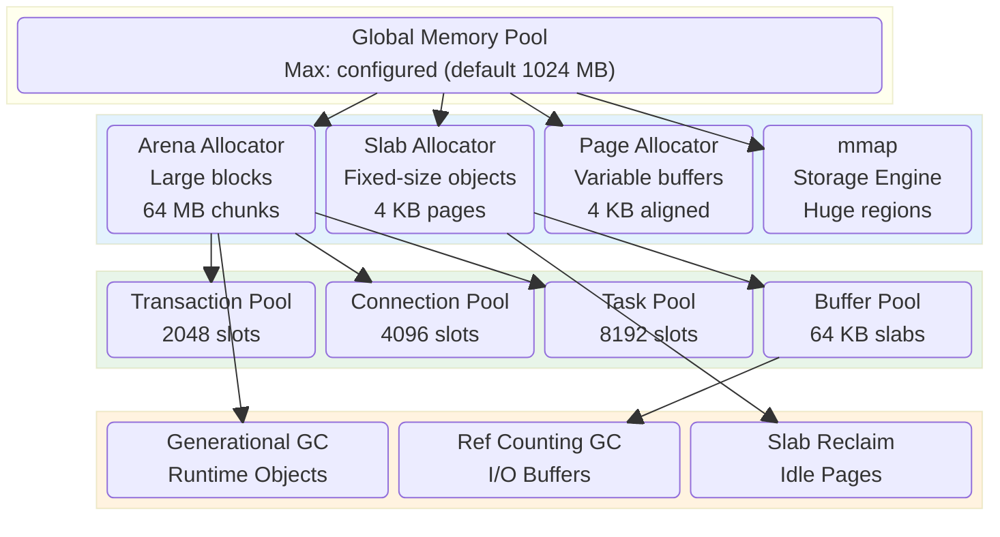
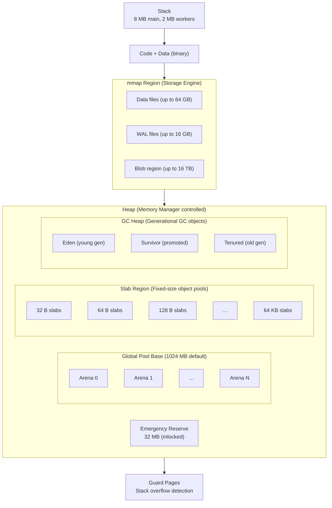
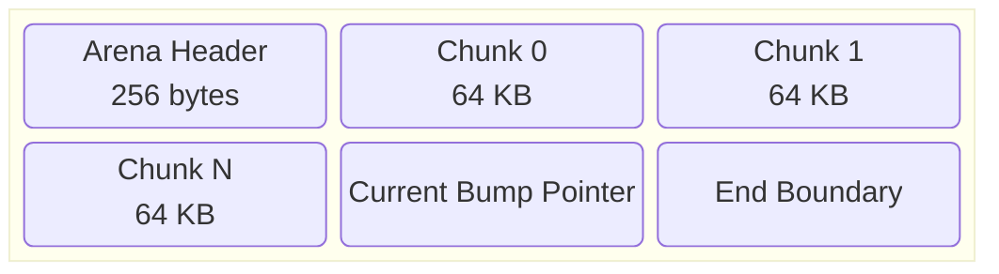
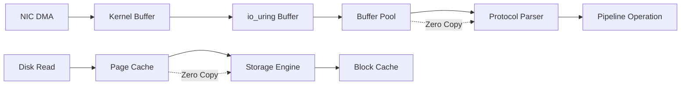
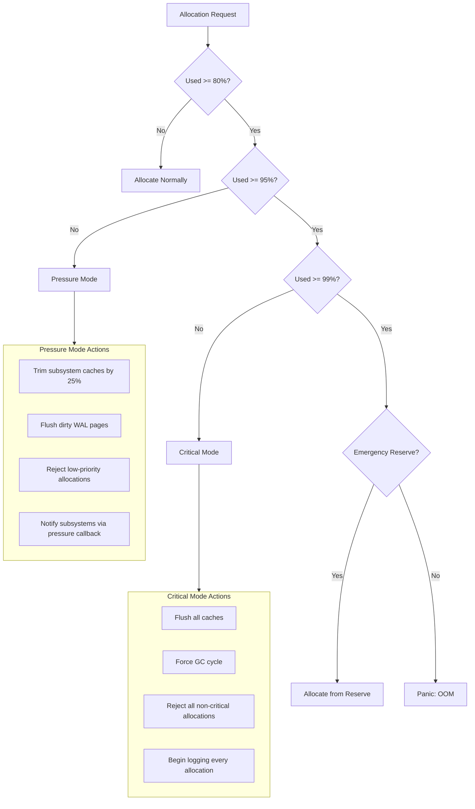
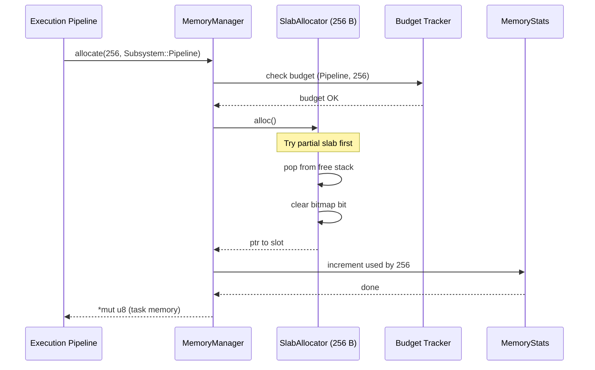
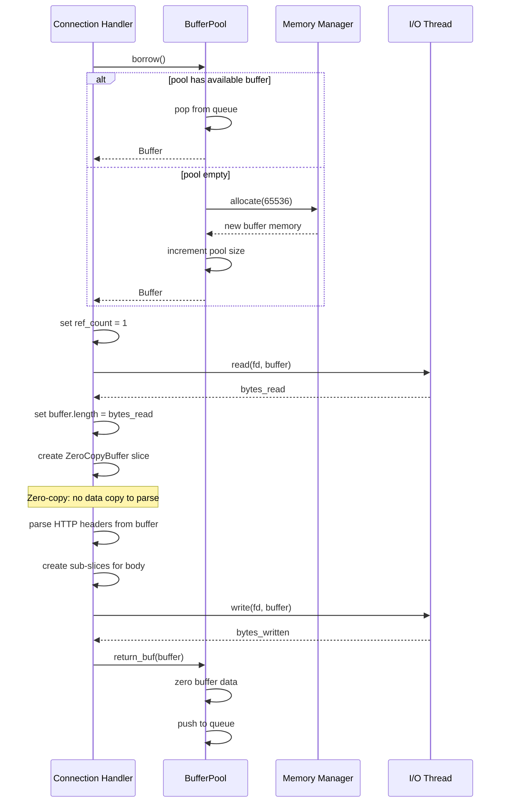
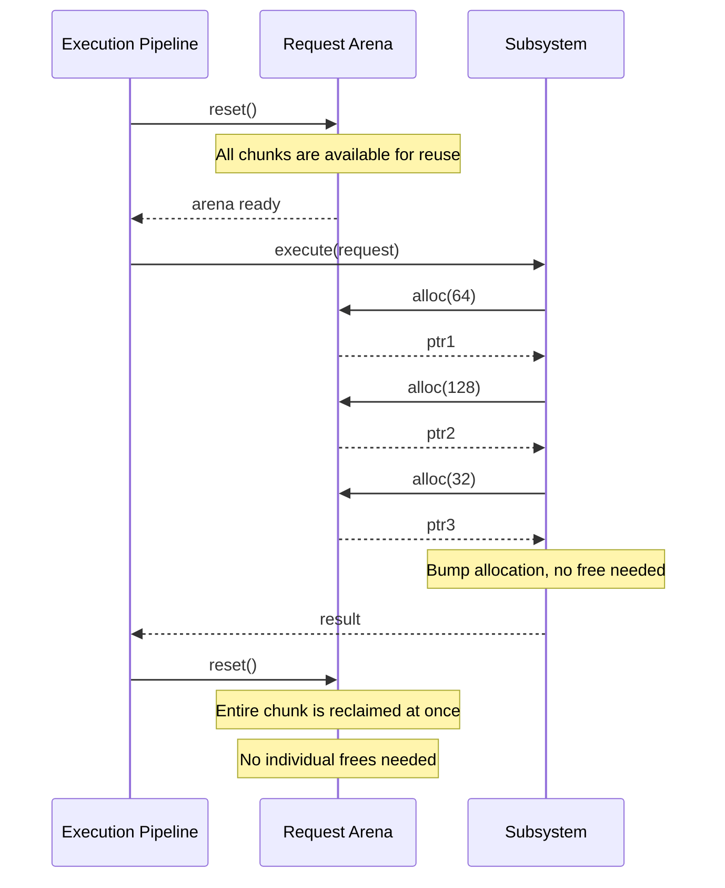
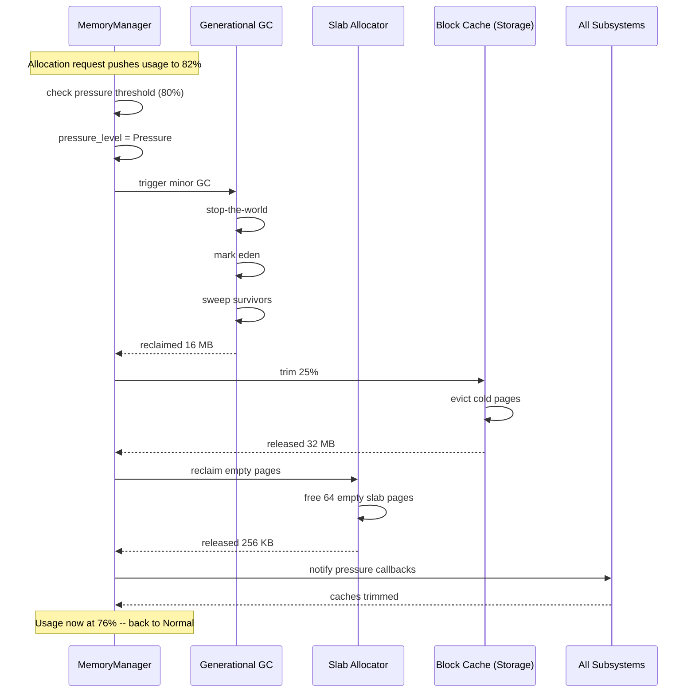
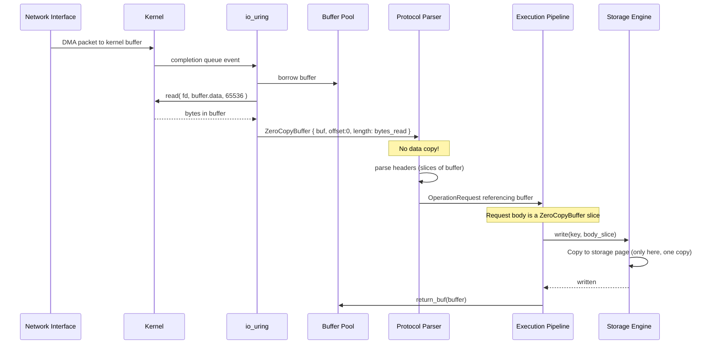

# 09 — Memory Model

## 1. Purpose

This document defines the memory management architecture of Nova Runtime. It specifies how memory is allocated, tracked, reclaimed, and optimized across all subsystems. The memory model is designed for predictability, low fragmentation, and cache efficiency while supporting the diverse allocation patterns of database storage, network I/O, and request processing.

## 2. Scope

This document covers:

- Arena allocation: contiguous memory regions for bulk allocation
- Slab allocator: fixed-size object allocation for cache-efficient reuse
- Page-based allocation: variable-size allocations for buffers and I/O
- Garbage collection: generational GC for runtime objects, reference counting for I/O buffers
- Memory pooling: pre-allocated pools for hot objects (connections, tasks, records)
- Zero-copy I/O: direct buffer management for network and disk
- mmap integration: memory-mapped storage engine access
- Memory budgeting: per-subsystem allocation limits with global cap
- Out-of-memory handling: pressure detection, graceful degradation, emergency reserves
- Swap prevention: mlock for critical data, RWO memory regions

Out of scope: virtual memory management, kernel memory management, NUMA node topology, huge pages (future work).

## 3. Responsibilities

The Memory Manager is responsible for:

- Managing all heap-allocated memory within Nova Runtime
- Providing specialized allocators for different object sizes and lifetimes
- Enforcing per-subsystem memory budgets
- Detecting and responding to memory pressure before OOM occurs
- Reducing memory fragmentation through arena and slab allocation
- Enabling zero-copy I/O paths for network and disk operations
- Preventing sensitive data from being swapped to disk
- Tracking memory usage for monitoring and diagnostics
- Providing memory statistics and profiling data
- Coordinating with the GC for runtime object cleanup

## 4. Non Responsibilities

The Memory Manager is NOT responsible for:

- Kernel memory management (page tables, DMA, etc.)
- NUMA policy (future work)
- Huge page management (future work)
- File system page cache management
- TLS/SSL session cache (handled by TLS layer)
- Connection buffer management (handled by connection pool, but uses memory manager APIs)
- Disk-level write buffering (handled by storage engine)

## 5. Architecture

### 5.1 Memory Hierarchy Overview



### 5.2 Allocator Selection Guide

| Object Type | Size Range | Lifetime | Allocator | Rationale |
|-------------|-----------|----------|-----------|-----------|
| Pipeline operations | 128-1024 B | Request (short) | Slab (128 B, 256 B, 512 B, 1 KB) | High allocation rate, fixed sizes |
| Connection buffers | 64 KB | Connection lifetime | Buffer Pool | Large, pooled for reuse |
| HTTP headers | 1-16 KB | Request (short) | Arena (temporary arena) | Variable size, short-lived |
| Storage pages | 4 KB | Long (cached) | Page Allocator | Page-aligned, 4 KB fixed |
| WAL records | 24 B + payload | Transient (written then freed) | Slab (64 B, 128 B) | High rate, small |
| B-tree nodes | 4 KB | Long (until evicted) | Page Allocator | Page-aligned I/O buffers |
| SSTable bloom filters | 64 KB - 2 MB | Level lifetime | Arena (pinned) | Large, moderate lifetime |
| Compaction buffers | 64 KB - 16 MB | Compaction duration | Arena (temporary) | Large, short-lived |
| Transaction records | 64-512 B | Transaction duration | Slab (128 B) | Moderate rate, TTL-bound |
| Event payloads | 32-4096 B | Event propagation | Arena (thread-local) | Variable, short-lived |
| TLS session data | 8-64 KB | Connection lifetime | Slab (8 KB, 16 KB, 64 KB) | Fixed sizes, rare allocation |
| Object model instances | 32-256 B | User-defined | GC-managed heap | Variable, long-lived |
| String data | Variable | Various | Arena (dedicated) | Fragmentation risk, bulk alloc |

### 5.3 Memory Layout

Process virtual memory layout:



### 5.4 Arena Allocator

The arena allocator provides bulk allocation from large contiguous memory regions. Arenas are used for objects with similar lifetimes and for temporary allocations.



```rust
struct Arena {
    name: String,                       // diagnostic name
    chunks: Vec<ArenaChunk>,            // allocated chunks
    current_chunk: AtomicU32,            // index of active chunk
    bump: AtomicUsize,                   // bump pointer within current chunk
    chunk_size: usize,                   // size per chunk (default 64 KB)
    total_allocated: AtomicUsize,
    total_used: AtomicUsize,
    growth_policy: ArenaGrowth,          // Linear | Exponential | Fixed
    thread_safe: bool,                   // atomic bump vs. thread-local
}

struct ArenaChunk {
    data: *mut u8,                       // chunk base address
    size: usize,                         // chunk capacity
    used: usize,                         // bytes used within chunk
    index: u32,
}
```

Arena allocation algorithm:

```
function ArenaAlloc(arena, size):
    // Align to 8 bytes
    size = align_up(size, 8)

    // Try bump allocation in current chunk
    current = arena.current_chunk.load()
    chunk = arena.chunks[current]
    offset = arena.bump.fetch_add(size)

    if offset + size <= chunk.size:
        // Success: return bump pointer
        return chunk.data + offset

    // Need new chunk
    if arena.growth == Linear:
        new_size = arena.chunk_size * 2^current  // double each chunk
    elif arena.growth == Exponential:
        new_size = arena.chunk_size
    else: // Fixed
        new_size = size

    new_chunk = AllocateChunk(max(new_size, size))
    arena.chunks.push(new_chunk)
    arena.current_chunk.store(arena.chunks.len() - 1)
    arena.bump.store(size)

    return new_chunk.data
```

Arena types:

| Arena Type | Lifetime | Chunk Size | Growth | Thread Safe | Use Case |
|------------|----------|------------|--------|-------------|----------|
| Request Arena | Per-request | 4 KB | Fixed | No (thread-local) | HTTP headers, parse results |
| Session Arena | Per-connection | 64 KB | Linear | No (per-connection) | Session state |
| Compaction Arena | Per-compaction | 16 MB | Fixed | No (single-thread) | Compaction buffers |
| Subsystem Arena | Per-subsystem | 1 MB | Exponential | Yes | Subsystem internal allocations |
| Global Arena | Process-wide | 64 MB | Exponential | Yes | Large shared structures |

### 5.5 Slab Allocator

The slab allocator manages fixed-size objects for cache-efficient reuse. Each slab is a page (4 KB) divided into equal-sized slots.

```rust
struct SlabAllocator {
    size_class: usize,                  // slot size (8, 16, 32, 64, 128, 256, 512, 1024, 2048, 4096)
    slabs: Vec<SlabPage>,               // active slabs
    partial: Vec<usize>,                // indices of slabs with free slots
    empty: Vec<usize>,                  // indices of completely free slabs
    object_count: AtomicU64,
    object_capacity: AtomicU64,
}

struct SlabPage {
    data: *mut u8,                      // page-aligned allocation (4 KB)
    free_stack: Vec<u16>,              // stack of free slot indices
    // Bitmap of free slots (4096 / size_class bits)
    free_bitmap: [u64; (4096 / size_class + 63) / 64],
    num_slots: u16,                     // slots per page
    num_free: AtomicU16,
    partial_index: Option<usize>,       // index in parent's partial list
}

// Pre-computed slab size classes:
//   8, 16, 32, 64, 128, 256, 512, 1024, 2048, 4096
//
// For a 4 KB page:
//   Size 8:   512 slots, 64 bytes bitmap (512 bits)
//   Size 16:  256 slots, 32 bytes bitmap
//   Size 32:  128 slots, 16 bytes bitmap
//   Size 64:   64 slots,  8 bytes bitmap
//   Size 128:  32 slots,  4 bytes bitmap
//   Size 256:  16 slots,  2 bytes bitmap
//   Size 512:   8 slots,  1 byte  bitmap
//   Size 1024:  4 slots,  1 byte  bitmap
//   Size 2048:  2 slots,  1 byte  bitmap
//   Size 4096:  1 slot,   1 byte  bitmap
```

Slab allocation:

```
function SlabAlloc(slab, size_class):
    // Find the size class (round up to nearest power of 2)
    size = RoundUpPowerOf2(size_class)
    allocator = slab.allocators[size]

    // Try to get from a partial slab
    if allocator.partial not empty:
        slab_idx = allocator.partial.last()
        page = allocator.slabs[slab_idx]

        // Pop from free stack
        slot = page.free_stack.pop()
        page.num_free.fetch_sub(1)

        // Clear bitmap bit
        ClearBit(page.free_bitmap, slot)

        if page.num_free == 0:
            // Slab is now full, remove from partial
            allocator.partial.pop()

        return page.data + slot * size

    // Try empty slab
    if allocator.empty not empty:
        slab_idx = allocator.empty.pop()
        page = allocator.slabs[slab_idx]
        page.free_stack = Range(0..page.num_slots).rev().collect()
        slot = page.free_stack.pop()
        page.num_free.store(page.num_slots - 1)
        ClearBit(page.free_bitmap, 0)
        allocator.partial.push(slab_idx)

        return page.data + slot * size

    // Allocate new slab page
    page = AllocatePage(4 KB)
    page.num_slots = 4096 / size
    page.free_stack = Range(0..page.num_slots).rev().collect()
    slot = page.free_stack.pop()
    page.num_free.store(page.num_slots - 1)
    ClearBit(page.free_bitmap, 0)
    allocator.partial.push(allocator.slabs.len())
    allocator.slabs.push(page)

    return page.data + slot * size
```

Slab free:

```
function SlabFree(ptr, size_class):
    size = RoundUpPowerOf2(size_class)
    allocator = slab.allocators[size]

    // Determine which slab page this pointer belongs to
    page_base = AlignDownToPage(ptr)
    page_idx = FindSlabByBase(allocator, page_base)

    if page_idx is None:
        PANIC("Double free or invalid pointer")

    page = allocator.slabs[page_idx]
    slot = (ptr - page_base) / size

    // Push to free stack
    page.free_stack.push(slot)
    SetBit(page.free_bitmap, slot)
    page.num_free.fetch_add(1)

    if page.num_free == page.num_slots:
        // Slab is now empty, move from partial to empty
        allocator.partial.swap_remove(page.partial_index)
        allocator.empty.push(page_idx)
        // Optionally: reclaim empty slab page to OS after threshold

    // If reclaim threshold reached, free empty slabs
    if allocator.empty.len() > MAX_EMPTY_SLABS:
        page_to_free = allocator.empty.pop()
        FreePage(allocator.slabs[page_to_free].data)
        allocator.slabs.swap_remove(page_to_free)
```

### 5.6 Page-Based Allocator

For page-aligned allocations (primarily storage engine pages, 4 KB each):

```rust
struct PageAllocator {
    free_pages: Vec<*mut u8>,           // returned pages ready for reuse
    active_pages: AtomicUsize,          // currently allocated
    max_pages: usize,                   // limit (max_memory / page_size)
    page_size: usize,                   // 4096 fixed
    mmap_threshold: usize,              // >16 pages use mmap
}
```

### 5.7 Buffer Pool

For network I/O buffers (64 KB each, frequently reused):

```rust
struct BufferPool {
    pool: CrossbeamQueue<Buffer>,       // lock-free MPSC queue
    buffer_size: usize,                 // 64 KB
    max_buffers: usize,                 // pool capacity (4096 default)
    allocated: AtomicUsize,             // current pool size
    misses: AtomicU64,                  // pool underflow count
}

struct Buffer {
    data: Vec<u8>,                      // exactly buffer_size
    offset: usize,                      // read position
    length: usize,                      // write position
    ref_count: AtomicI32,              // reference count for zero-copy
}
```

### 5.8 Generational GC (Runtime Objects)

Objects managed by the Nova Object Model use a generational garbage collector:

```rust
struct GenerationalGC {
    eden: Region,                       // young generation (64 MB default)
    survivor: Region,                   // survivor space (8 MB default)
    tenured: Region,                    // old generation (remaining budget)
    eden_threshold: usize,             // 80% of eden triggers minor GC
    promotion_age: u8,                  // 3 = promote after 3 survivors
    roots: Vec<*mut GCObject>,          // GC roots (stack, globals)
    threads: Vec<GcThreadState>,        // per-thread allocation buffers
    stats: GCStats,
}

struct GCObject {
    header: GcHeader,                   // 16 bytes: mark word + class pointer
    // user data follows
}

struct GcHeader {
    mark_word: AtomicU64,              // mark bit (1) + age (7 bits) + identity hash (24 bits) + lock (32 bits)
    class_ptr: *const GcClass,          // pointer to class descriptor
}
```

GC algorithm: Tri-color mark-sweep with generational hypothesis.

```
function MinorGC(gc):
    // Stop-the-world (all threads paused at safepoints)
    StopTheWorld()

    // Step 1: Find roots
    // Scan all thread-local allocation buffers for live references

    // Step 2: Mark from roots in Eden
    mark_queue = gc.roots
    while mark_queue not empty:
        obj = mark_queue.pop()
        if obj in eden and not Marked(obj):
            Mark(obj)
            for ref in References(obj):
                mark_queue.push(ref)

    // Step 3: Copy survivors
    for obj in eden:
        if Marked(obj):
            // Increment age
            obj.age++
            if obj.age >= PROMOTION_AGE:
                // Promote to tenured
                CopyToTenured(obj)
            else:
                // Copy to survivor
                CopyToSurvivor(obj)

    // Step 4: Reclaim Eden
    Eden.Reset()
    Swap(eden, survivor)

    // Resume threads
    StartTheWorld()
```

Safepoints: Threads check for GC requests at:
- Every allocation
- Every mutex lock acquisition
- Every cross-thread message send
- Every I/O wait

### 5.9 Reference Counting (I/O Buffers)

I/O buffers use atomic reference counting for deterministic lifetime management:

```rust
struct RefCounted<T> {
    inner: *mut Inner<T>,
}

struct Inner<T> {
    ref_count: AtomicI32,               // starts at 1
    data: T,
}

impl<T> RefCounted<T> {
    fn new(data: T) -> Self {
        let inner = Box::new(Inner { ref_count: AtomicI32::new(1), data });
        RefCounted { inner: Box::into_raw(inner) }
    }

    fn clone(&self) -> Self {
        self.inner.ref_count.fetch_add(1, Acquire);
        RefCounted { inner: self.inner }
    }

    fn drop(&mut self) {
        if self.inner.ref_count.fetch_sub(1, Release) == 1 {
            // Last reference: reclaim
            let _ = unsafe { Box::from_raw(self.inner) };
        }
    }
}
```

### 5.10 Memory Budgeting

```rust
struct MemoryBudget {
    total: usize,                         // global max (default 1024 MB)
    used: AtomicUsize,                    // current total usage
    emergency_reserve: usize,             // reserved = 32 MB (mlocked)
    subsystems: HashMap<SubsystemId, Budget>, // per-subsystem budgets
    pressure_threshold: f64,              // 0.80 = start pressure mode
    critical_threshold: f64,              // 0.95 = start emergency mode
    oom_protection: AtomicBool,           // prevent actual OOM kill
}

struct Budget {
    max: usize,                           // subsystem maximum
    used: AtomicUsize,                    // current usage
    peak: AtomicUsize,                    // peak usage (for diagnostics)
    priority: BudgetPriority,             // Critical | High | Normal | Low
    can_borrow: bool,                     // can exceed budget if global has room
}
```

Memory pressure levels:

| Level | Threshold | Action |
|-------|-----------|--------|
| Normal | < 80% | No restrictions |
| Pressure | 80-95% | Trim caches, reduce GC thresholds, reject low-priority allocations |
| Critical | 95-99% | Reject all non-critical allocations, flush caches aggressively |
| Emergency | > 99% | Panic with OOM trace (better than kernel OOM kill) |

### 5.11 Zero-Copy I/O Path

Network reads and disk reads use shared buffers to avoid copying:



```rust
struct ZeroCopyBuffer {
    buf: RefCounted<Buffer>,             // shared buffer
    offset: usize,                       // view offset within buffer
    length: usize,                       // view length
}

impl ZeroCopyBuffer {
    fn slice(&self, start: usize, end: usize) -> Self {
        // No copy: just adjust offset and length
        ZeroCopyBuffer {
            buf: self.buf.clone(),
            offset: self.offset + start,
            length: end - start,
        }
    }

    fn to_vec(&self) -> Vec<u8> {
        // Explicit copy when needed
        self.as_slice().to_vec()
    }

    fn as_slice(&self) -> &[u8] {
        unsafe {
            std::slice::from_raw_parts(
                self.buf.data.as_ptr().add(self.offset),
                self.length
            )
        }
    }
}
```

### 5.12 mmap Integration

The storage engine uses mmap for large read-only data regions:

```rust
struct MappedRegion {
    addr: *mut u8,                       // mmap base address
    length: usize,                       // region size
    fd: RawFd,                           // backing file (or -1 for anonymous)
    flags: MmapFlags,                    // MAP_SHARED, MAP_PRIVATE, etc.
}

impl MappedRegion {
    fn map_file(path: &Path, offset: u64, length: usize) -> Result<Self, MmapError> {
        let fd = open(path, O_RDONLY)?;
        let addr = mmap(
            ptr::null_mut(),
            length,
            PROT_READ,
            MAP_SHARED | MAP_POPULATE,
            fd,
            offset,
        )?;
        Ok(MappedRegion { addr, length, fd, flags: MAP_SHARED })
    }

    fn map_anonymous(length: usize) -> Result<Self, MmapError> {
        let addr = mmap(
            ptr::null_mut(),
            length,
            PROT_READ | PROT_WRITE,
            MAP_PRIVATE | MAP_ANONYMOUS,
            -1,
            0,
        )?;
        Ok(MappedRegion { addr, length, fd: -1, flags: MAP_PRIVATE })
    }

    fn unmap(&self) -> Result<(), MmapError> {
        munmap(self.addr, self.length)
    }

    fn advise(&self, advice: MmapAdvice) -> Result<(), MmapError> {
        madvise(self.addr, self.length, advice)
    }
}
```

mmap usage in storage engine:

| Region | Size | Access Pattern | madvise Hint | Flags |
|--------|------|----------------|-------------|-------|
| SSTable Level 4+ | 256 MB - 2 GB | Read mostly | MADV_RANDOM | MAP_SHARED |
| SSTable Level 0-3 | 64 MB - 256 MB | Read frequently | MADV_WILLNEED | MAP_SHARED |
| WAL files | 256 MB | Write sequentially | MADV_SEQUENTIAL | MAP_SHARED |
| Bloom filter cache | 32 MB | Read randomly | MADV_RANDOM | MAP_PRIVATE |
| Blob store | 1 MB - 16 TB | Read/write | MADV_RANDOM | MAP_SHARED |

### 5.13 Out-of-Memory Handling



### 5.14 Swap Prevention

```rust
struct MlockManager {
    regions: Vec<MlockRegion>,
}

struct MlockRegion {
    addr: *mut u8,
    length: usize,
    purpose: &'static str,              // diagnostic label
}

impl MlockManager {
    fn lock(&mut self, addr: *mut u8, length: usize, purpose: &'static str) {
        unsafe {
            let result = libc::mlock(addr, length);
            assert_eq!(result, 0, "mlock failed for {}: {}", purpose, errno());
        }
        self.regions.push(MlockRegion { addr, length, purpose });
    }

    fn unlock_all(&mut self) {
        for region in &self.regions {
            unsafe { libc::munlock(region.addr, region.length); }
        }
    }
}
```

Locked memory regions:

| Region | Size | Purpose |
|--------|------|---------|
| Emergency reserve | 32 MB | Guarantee OOM handling path has memory |
| TLS private keys | 64 KB | Prevent crypto key leakage to swap |
| Auth token cache | 128 KB | Prevent session tokens on disk |
| GC roots | 4 KB | Prevent GC root loss |
| WAL write buffer | 64 KB | Prevent data loss during fsync |

## 6. Data Structures

### 6.1 MemoryManager (Top-Level)

```rust
struct MemoryManager {
    // Global
    config: MemoryConfig,
    global_used: AtomicUsize,
    global_peak: AtomicUsize,
    global_max: usize,
    emergency_reserve: Option<MlockedPool>,

    // Allocators
    arenas: HashMap<String, Arc<Arena>>,
    slabs: HashMap<usize, Arc<SlabAllocator>>,
    page_allocator: Arc<PageAllocator>,
    buffer_pool: Arc<BufferPool>,

    // GC
    gc: Option<GenerationalGC>,          // only if runtime object model enabled

    // Budgeting
    budgets: HashMap<SubsystemId, Budget>,
    pressure_callbacks: Vec<Box<dyn Fn(PressureLevel) + Send + Sync>>,

    // Statistics
    stats: MemoryStats,
    profiling: Bool,                     // enable detailed allocation tracing
}
```

### 6.2 MemoryConfig

```rust
struct MemoryConfig {
    max_memory: usize,                   // 1073741824 (1 GB) default
    arena_block_size: usize,             // 67108864 (64 MB) default
    slab_page_size: usize,               // 4096 default
    gc_interval_ms: u64,                 // 1000 default
    gc_threshold_pct: u8,                // 80 default
    enable_gc: bool,                     // true default
    enable_profiling: bool,              // false default
    pressure_threshold: f64,             // 0.80
    critical_threshold: f64,             // 0.95
    emergency_reserve_size: usize,       // 33554432 (32 MB)
    max_empty_slabs: u32,                // 256
    buffer_pool_size: usize,             // 4096
    buffer_size: usize,                  // 65536 (64 KB)
    mlock_enabled: bool,                 // true default
    subsystem_budgets: Vec<SubsystemBudgetConfig>,
}

struct SubsystemBudgetConfig {
    subsystem_id: SubsystemId,
    max_bytes: usize,
    can_borrow: bool,
    priority: BudgetPriority,
}
```

### 6.3 MemoryStats

```rust
struct MemoryStats {
    // Global
    total_allocated_bytes: AtomicU64,
    total_freed_bytes: AtomicU64,
    current_used_bytes: AtomicUsize,
    peak_used_bytes: AtomicUsize,
    global_max_bytes: AtomicUsize,

    // Arena
    arena_count: AtomicU32,
    arena_total_chunks: AtomicU32,
    arena_total_bytes: AtomicU64,
    arena_used_bytes: AtomicU64,

    // Slab
    slab_allocator_count: AtomicU32,
    slab_page_count: AtomicU32,
    slab_slot_capacity: AtomicU64,
    slab_slot_used: AtomicU64,
    slab_empty_pages: AtomicU32,
    slab_reclaimed_pages: AtomicU64,

    // Page allocator
    page_allocated: AtomicU64,
    page_freed: AtomicU64,
    page_active: AtomicU64,

    // Buffer pool
    buffer_pool_available: AtomicU32,
    buffer_pool_allocated: AtomicU32,
    buffer_pool_misses: AtomicU64,

    // GC
    gc_minor_cycles: AtomicU64,
    gc_major_cycles: AtomicU64,
    gc_eden_used: AtomicUsize,
    gc_survivor_used: AtomicUsize,
    gc_tenured_used: AtomicUsize,
    gc_pause_ns_sum: AtomicU64,
    gc_last_pause_ns: AtomicU64,

    // Budget
    budget_exceeded_count: AtomicU64,
    pressure_events: AtomicU64,
    critical_events: AtomicU64,
    allocations_rejected: AtomicU64,

    // mmap
    mmap_regions: AtomicU32,
    mmap_total_bytes: AtomicU64,

    // Zero-copy
    zero_copy_operations: AtomicU64,
    bytes_saved_by_zero_copy: AtomicU64,

    // Fragmentation
    fragmentation_ratio: AtomicF64,      // measured periodically
}
```

### 6.4 GcClass

```rust
struct GcClass {
    name: &'static str,                  // class name for diagnostics
    size: usize,                         // instance size (including header)
    alignment: usize,                    // alignment requirement
    has_finalizer: bool,                 // needs finalize() call
    trace_fn: Option<fn(*mut GCObject, &mut Vec<*mut GCObject>)>, // trace references
    finalize_fn: Option<fn(*mut GCObject)>, // destructor
}
```

### 6.5 GcThreadState

```rust
struct GcThreadState {
    thread_id: ThreadId,
    local_alloc_buffer: [u8; 8192],     // 8 KB TLAB
    local_alloc_offset: usize,
    safepoint_requested: AtomicBool,
    in_gc: bool,
}
```

### 6.6 PressureLevel

```rust
enum PressureLevel {
    Normal,
    Pressure { pct: f64 },               // 80-95%
    Critical { pct: f64 },              // 95-99%
    Emergency { pct: f64 },             // >99%
}
```

### 6.7 BudgetPriority

```rust
enum BudgetPriority {
    Critical = 0,                        // always allowed, even in Critical pressure
    High = 1,                            // allowed in Pressure, denied in Critical
    Normal = 2,                          // allowed in Normal, denied in Pressure
    Low = 3,                             // only allowed in Normal, first to deny
}
```

## 7. Algorithms

### 7.1 Memory Initialization

```
function InitMemory(config):
    mm = MemoryManager {
        config: config,
        global_max: config.max_memory,
        global_used: 0,
        global_peak: 0,
    }

    // Pre-allocate emergency reserve
    if config.mlock_enabled:
        reserve = mmap_anonymous(config.emergency_reserve_size)
        mlock(reserve, config.emergency_reserve_size)
        mm.emergency_reserve = Some(MlockedPool(reserve))

    // Initialize slab allocators for each size class
    for size in [8, 16, 32, 64, 128, 256, 512, 1024, 2048, 4096, 8192, 16384, 32768, 65536]:
        mm.slabs.insert(size, SlabAllocator::new(size, config.slab_page_size))

    // Initialize buffer pool
    mm.buffer_pool = BufferPool::new(config.buffer_pool_size, config.buffer_size)

    // Initialize GC if enabled
    if config.enable_gc:
        mm.gc = GenerationalGC::new(config.max_memory * 0.25) // 25% of memory for GC
        RegisterGCForSafepoints()

    // Initialize per-subsystem budgets
    for budget_config in config.subsystem_budgets:
        mm.budgets.insert(budget_config.subsystem_id, Budget {
            max: budget_config.max_bytes,
            used: 0,
            peak: 0,
            priority: budget_config.priority,
            can_borrow: budget_config.can_borrow,
        })

    // Register pressure callback for GC
    mm.pressure_callbacks.push(|level| {
        if level >= Pressure:
            TriggerGC()
    })

    return mm
```

### 7.2 Memory Allocation with Budget Enforcement

```
function TrackedAllocate(mm, subsystem_id, size, alignment):
    // Check global pressure
    global_pct = mm.global_used.load() as f64 / mm.global_max as f64
    pressure = DeterminePressureLevel(global_pct)

    if pressure >= Critical and subsystem_budget.priority > High:
        // Try emergency reserve
        if reserve = mm.emergency_reserve:
            return reserve.alloc(size)
        else:
            return Err(OOM("Critical pressure, allocation denied"))

    // Check subsystem budget
    budget = mm.budgets.get(subsystem_id)
    if budget.used + size > budget.max:
        if budget.can_borrow and mm.global_used + size < mm.global_max * 0.95:
            // Allow borrowing from global pool
        else:
            Log.Warn("Budget exceeded: {subsystem_id}, current={budget.used}, max={budget.max}")
            budget.exceeded_count++
            return Err(OOM("Budget exceeded"))

    // Perform actual allocation based on size
    if size <= 65536:
        // Use slab for small objects
        slab_size = RoundUpPowerOf2(max(size, 8))
        ptr = SlabAlloc(mm.slabs[slab_size])
    elif size <= 1048576: // 1 MB
        // Use page allocator
        ptr = PageAlloc(mm.page_allocator, size)
    else:
        // Use arena for large objects
        ptr = ArenaAlloc(mm.arenas["global"], size)

    mm.global_used.fetch_add(size)
    budget.used.fetch_add(size)

    if mm.global_used > mm.global_peak:
        mm.global_peak = mm.global_used

    return ptr
```

### 7.3 Memory Free

```
function TrackedFree(mm, ptr, size, subsystem_id):
    // Determine which allocator based on address and size
    if IsSlabAllocated(ptr):
        slab_size = FindSlabSize(ptr)
        SlabFree(ptr, slab_size)
    elif IsPageAllocated(ptr):
        PageFree(mm.page_allocator, ptr)
    else:
        // Arena memory: freed when arena is reset/destroyed
        // Individual arena frees are no-ops
        return

    mm.global_used.fetch_sub(size)
    if subsystem_id:
        if budget = mm.budgets.get(subsystem_id):
            budget.used.fetch_sub(size)
```

### 7.4 GC Trigger Algorithm

```
function ShouldTriggerGC(mm):
    eden_used = mm.gc.eden.used.load()
    eden_total = mm.gc.eden.total
    eden_pct = eden_used as f64 / eden_total as f64

    // Trigger conditions:
    if eden_pct >= mm.gc.eden_threshold:        // 80% eden filled
        return MinorGC
    if mm.global_used > mm.global_max * 0.80:   // 80% global memory used
        return FullGC
    if LastGCPause() > 100ms:                    // last GC was slow
        return FullGC
    if TimeSinceLastGC() > 5000ms:               // periodic trigger (5s)
        return MinorGC

    return NoGC
```

### 7.5 Buffer Pool Borrow/Return

```
function BorrowBuffer(pool):
    match pool.pool.pop():
        Some(buffer) => {
            buffer.ref_count.store(1)
            buffer.offset = 0
            buffer.length = 0
            return buffer
        }
        None => {
            pool.misses.fetch_add(1)
            // Allocate new buffer
            data = AllocateAligned(pool.buffer_size, 4096)
            return Buffer { data, offset: 0, length: 0, ref_count: 1 }
        }

function ReturnBuffer(pool, buffer):
    if buffer.ref_count.load() != 0:
        Log.Warn("Buffer returned with active references")
        // Force-release
    buffer.ref_count.store(0)
    buffer.data.zero() // security: clear before reuse
    pool.pool.push(buffer)
```

### 7.6 Memory Profiling

```
function ProfileAllocation(ptr, size, source_location):
    // Record allocation trace
    trace = StackTrace()
    profile.allocations.push(AllocationRecord {
        ptr,
        size,
        timestamp: now(),
        trace,
        source: source_location,
    })

function ProfileSnapshot():
    // Dump current allocation state
    snapshot = {
        total_used: profile.total_used,
        top_allocations: profile.allocations
            .sorted_by_size()
            .take(100)
            .map(|a| { size: a.size, trace: a.trace, source: a.source }),
        by_subsystem: profile.by_subsystem.clone(),
        fragmentation: MeasureFragmentation(),
    }
    return snapshot
```

### 7.7 Fragmentation Measurement

```
function MeasureFragmentation():
    // For slab allocators: (total_slots - used_slots) / total_slots
    slab_frag = 0
    for (size, allocator) in mm.slabs:
        total = allocator.object_capacity.load()
        used = allocator.object_count.load()
        if total > 0:
            frag = 1.0 - (used as f64 / total as f64)
            slab_frag = max(slab_frag, frag)

    // For arena: (total_allocated - total_used) / total_allocated
    arena_frag = 0
    for arena in mm.arenas.values():
        if arena.total_allocated > 0:
            frag = 1.0 - (arena.total_used as f64 / arena.total_allocated as f64)
            arena_frag = max(arena_frag, frag)

    return max(slab_frag, arena_frag)
```

## 8. Interfaces

### 8.1 MemoryManager Public API

```rust
impl MemoryManager {
    /// Create the global memory manager.
    fn new(config: MemoryConfig) -> Self;

    /// Allocate memory with subsystem tracking.
    fn allocate(&self, size: usize, subsystem: SubsystemId) -> Result<*mut u8, OomError>;

    /// Allocate zero-initialized memory.
    fn allocate_zeroed(&self, size: usize, subsystem: SubsystemId) -> Result<*mut u8, OomError>;

    /// Allocate with alignment.
    fn allocate_aligned(&self, size: usize, alignment: usize, subsystem: SubsystemId)
        -> Result<*mut u8, OomError>;

    /// Free memory.
    fn free(&self, ptr: *mut u8, size: usize, subsystem: SubsystemId);

    /// Reallocate (grow/shrink).
    fn reallocate(&self, ptr: *mut u8, old_size: usize, new_size: usize, subsystem: SubsystemId)
        -> Result<*mut u8, OomError>;

    /// Register a pressure callback.
    fn on_pressure(&self, callback: Box<dyn Fn(PressureLevel) + Send + Sync>);

    /// Get current pressure level.
    fn pressure_level(&self) -> PressureLevel;

    /// Trigger garbage collection.
    fn trigger_gc(&self);

    /// Get memory statistics snapshot.
    fn stats(&self) -> MemoryStats;

    /// Enable/disable memory profiling.
    fn set_profiling(&self, enabled: bool);

    /// Take a profiling snapshot.
    fn profile_snapshot(&self) -> ProfileSnapshot;
}
```

### 8.2 Arena API

```rust
impl Arena {
    /// Create a new arena.
    fn new(name: &str, chunk_size: usize, growth: ArenaGrowth, thread_safe: bool) -> Self;

    /// Allocate from the arena.
    fn alloc(&self, size: usize) -> *mut u8;

    /// Allocate with alignment.
    fn alloc_aligned(&self, size: usize, alignment: usize) -> *mut u8;

    /// Reset all chunks (free all allocations).
    fn reset(&self);

    /// Get total bytes allocated.
    fn total_allocated(&self) -> usize;

    /// Get bytes used within allocated chunks.
    fn total_used(&self) -> usize;

    /// Get arena diagnostics.
    fn diagnostics(&self) -> ArenaDiagnostics;
}
```

### 8.3 SlabAllocator API

```rust
impl SlabAllocator {
    /// Create a slab allocator for a given size class.
    fn new(size_class: usize, page_size: usize) -> Self;

    /// Allocate a slot.
    fn alloc(&self) -> *mut u8;

    /// Free a slot.
    fn free(&self, ptr: *mut u8);

    /// Get number of allocated objects.
    fn object_count(&self) -> u64;

    /// Reclaim empty slabs back to OS.
    fn reclaim(&self, max_pages: u32) -> u32;

    /// Get statistics.
    fn stats(&self) -> SlabStats;
}
```

### 8.4 BufferPool API

```rust
impl BufferPool {
    /// Create a buffer pool.
    fn new(capacity: usize, buffer_size: usize) -> Self;

    /// Borrow a buffer from the pool.
    fn borrow(&self) -> Buffer;

    /// Return a buffer to the pool.
    fn return_buf(&self, buf: Buffer);

    /// Get pool statistics.
    fn stats(&self) -> BufferPoolStats;

    /// Resize pool capacity.
    fn set_capacity(&self, new_capacity: usize);
}
```

### 8.5 GC API

```rust
impl GenerationalGC {
    /// Allocate a GC-managed object.
    fn alloc(&self, class: &GcClass) -> *mut GCObject;

    /// Force a minor GC cycle.
    fn minor_gc(&self);

    /// Force a full GC cycle.
    fn full_gc(&self);

    /// Register a GC root.
    fn register_root(&self, root: *mut GCObject);

    /// Unregister a GC root.
    fn unregister_root(&self, root: *mut GCObject);

    /// Check if GC is needed.
    fn should_collect(&self) -> GcTrigger;

    /// Get GC statistics.
    fn stats(&self) -> GCStats;
}
```

### 8.6 ZeroCopyBuffer API

```rust
impl ZeroCopyBuffer {
    /// Create from a buffer pool buffer.
    fn from_buffer(buf: Buffer) -> Self;

    /// Create a sub-slice (no copy).
    fn slice(&self, start: usize, end: usize) -> Self;

    /// Convert to owned Vec (copy).
    fn to_vec(&self) -> Vec<u8>;

    /// Read into a writer (avoids intermediate copy).
    fn write_to(&self, writer: &mut dyn Write) -> io::Result<()>;

    /// Get length.
    fn len(&self) -> usize;

    /// Check if empty.
    fn is_empty(&self) -> bool;
}
```

### 8.7 MmapManager API

```rust
impl MmapManager {
    /// Memory-map a file.
    fn map_file(&self, path: &Path, offset: u64, length: usize)
        -> Result<MappedRegion, MmapError>;

    /// Create anonymous mapping.
    fn map_anonymous(&self, length: usize) -> Result<MappedRegion, MmapError>;

    /// Unmap a region.
    fn unmap(&self, region: &MappedRegion) -> Result<(), MmapError>;

    /// Apply madvise hint.
    fn advise(&self, region: &MappedRegion, advice: MmapAdvice) -> Result<(), MmapError>;

    /// Pre-fault pages into memory.
    fn prefault(&self, region: &MappedRegion) -> Result<(), MmapError>;

    /// Lock region in memory (prevent swap).
    fn lock(&self, region: &MappedRegion) -> Result<(), MmapError>;

    /// Get total mapped bytes.
    fn total_mapped(&self) -> u64;
}
```

### 8.8 OomError

```rust
enum OomError {
    BudgetExceeded { subsystem: SubsystemId, current: usize, max: usize },
    GlobalLimitReached { current: usize, max: usize },
    CriticalPressure { current: usize, max: usize },
    EmergencyReserveExhausted,
    AllocationFailed { size: usize, reason: String },
}
```

## 9. Sequence Diagrams

### 9.1 Slab Allocation for a Pipeline Task



### 9.2 Buffer Pool Borrow for Network Read



### 9.3 Arena Reset for Request Lifetime



### 9.4 Memory Pressure Response



### 9.5 Zero-Copy I/O Through Path



## 10. Failure Modes

### 10.1 Global OOM

| Field | Value |
|-------|-------|
| Cause | Memory usage exceeds global_max + emergency_reserve |
| Detection | TrackedAllocate returns OOM error |
| Effect | Allocation fails, caller must handle gracefully |
| Severity | High (may cause cascade failures) |

### 10.2 Budget Exhaustion

| Field | Value |
|-------|-------|
| Cause | Subsystem exceeds its memory budget |
| Detection | Allocation pre-check against budget |
| Effect | Allocation returns BudgetExceeded error |
| Severity | Medium (subsystem must degrade gracefully) |

### 10.3 GC Pause Storms

| Field | Value |
|-------|-------|
| Cause | Rapid Eden allocation triggers back-to-back GC cycles |
| Detection | GC cycle interval < 10ms |
| Effect | Application pauses, latency spikes |
| Severity | High (latency degradation) |

### 10.4 Slab Fragmentation

| Field | Value |
|-------|-------|
| Cause | Mismatched allocation/free patterns leave many partially-filled slabs |
| Detection | Fragmentation ratio > 50% |
| Effect | Memory is wasted but allocation still succeeds |
| Severity | Medium (reduced effective capacity) |

### 10.5 mlock Failure

| Field | Value |
|-------|-------|
| Cause | RLOCKED limit per process exceeded, insufficient privileges |
| Detection | mlock() returns error |
| Effect | Emergency reserve not locked, may be swapped |
| Severity | Medium (possible data leakage to swap) |

### 10.6 Double Free

| Field | Value |
|-------|-------|
| Cause | Bug: free called twice on same pointer |
| Detection | Slab/page allocator detects double free via metadata |
| Effect | PANIC with stack trace |
| Severity | Critical (process termination) |

### 10.7 Use-After-Free

| Field | Value |
|-------|-------|
| Cause | Bug: pointer accessed after free |
| Detection | Hard to detect; use AddressSanitizer in debug builds |
| Effect | Memory corruption, potential security vulnerability |
| Severity | Critical (data corruption, RCE risk) |

### 10.8 mmap Exhaustion

| Field | Value |
|-------|-------|
| Cause | Too many mmap calls hit vm.max_map_count limit |
| Detection | mmap() returns ENOMEM |
| Effect | Storage engine cannot open new SSTable files |
| Severity | High (compaction stalls) |

## 11. Recovery Strategy

### 11.1 Global OOM Recovery

1. Emergency reserve allocation of 32 MB is used for the OOM error path itself
2. The requesting subsystem receives a clear OOM error
3. Subsystem should:
   a. Cancel the current operation and return an error to the client
   b. Free any memory it can (drop caches, release buffers)
   c. Not retry until pressure level returns to Normal
4. If OOM occurs during emergency reserve allocation: immediate panic with diagnostic dump
5. Operator should increase max_memory in configuration and restart

### 11.2 Budget Exhaustion Recovery

1. Subsystem receives BudgetExceeded error
2. Subsystem should:
   a. Drop non-essential caches
   b. Return memory to the global pool
   c. Reject new operations with 503 Service Unavailable
3. If subsystem repeatedly exceeds budget despite trimming:
   a. Increase subsystem budget in configuration
   b. Or reduce workload

### 11.3 GC Pause Storm Recovery

1. The GC rate-limits itself: after a pause, it skips the next scheduled GC interval
2. If pause storms persist:
   a. Increase eden size (reduces GC frequency at cost of memory)
   b. Reduce allocation rate by adding backpressure to pipeline
   c. Monitor for allocation hot spots
3. In extreme cases: disable GC temporarily (defer to next GC trigger)

### 11.4 Slab Fragmentation Recovery

1. Periodically (every 60s), the slab allocator scans for completely empty pages and returns them to the OS
2. Partial fragmentation is accepted (trade-off: fragmentation vs. allocation speed)
3. If fragmentation > 50%:
   a. Trigger a compaction cycle that moves objects from partial slabs to full slabs
   b. This is expensive and only done when critical

### 11.5 mlock Failure Recovery

1. Log a warning and continue without mlock
2. The emergency reserve is still in-memory but may be swapped
3. If memory contains sensitive data (TLS keys, auth tokens):
   a. Operator should run novad with CAP_IPC_LOCK capability
   b. Or set /etc/security/limits.conf memlock sufficiently high

### 11.6 Double Free Recovery

No recovery possible. The process panics with a diagnostic stack trace. The double-free is caught by:
- Slab allocator: metadata corruption detection
- Debug builds: canary values around slab slots

### 11.7 Use-After-Free Recovery

Prevention only:
- Debug builds: -fsanitize=address
- Release builds: use of arena/slab with deterministic lifetimes
- Production: no immediate detection, rely on correctness

### 11.8 mmap Exhaustion Recovery

1. Log a warning with current map count and limit
2. The storage engine should unmap less-frequently-accessed regions
3. If unavoidable: increase vm.max_map_count via sysctl
4. Long-term: use large mmap regions instead of many small ones

## 12. Performance Considerations

### 12.1 Allocation Path Cost

| Allocator | Allocation | Free | Notes |
|-----------|-----------|------|-------|
| Slab (hot cache) | 15-30 ns | 15-30 ns | Free stack pop/push |
| Slab (cold cache) | 50-100 ns | 50-100 ns | Cache miss for slab metadata |
| Arena bump | 5-10 ns | 0 ns (reset) | Fastest possible allocation |
| Page allocator | 100-500 ns | 100-500 ns | Depends on free list state |
| Buffer pool (hit) | 10-20 ns | 10-20 ns | Lock-free pop/push |
| Buffer pool (miss) | 1-5 μs | - | New allocation |
| GC object (eden) | 10-20 ns | 0 ns | Bump pointer, no free cost |
| mmap | 10-100 μs | 10-100 μs | syscall overhead |
| malloc (libc) | 50-200 ns | 50-200 ns | For comparison only |

### 12.2 GC Pause Targets

| GC Type | Target Pause | Max Pause | Frequency |
|---------|-------------|-----------|-----------|
| Minor GC | < 1ms | < 5ms | Every 1-5 seconds |
| Full GC | < 10ms | < 50ms | Every 30-300 seconds |

### 12.3 Memory Overhead by Allocator

| Allocator | Overhead per Allocation | Reason |
|-----------|------------------------|--------|
| Slab | 0 bytes (fixed size, no header) | Slots are known by position |
| Arena | 0 bytes (bump pointer) | No individual headers |
| Page allocator | 0 bytes | Pages are exact |
| Buffer pool | 0 bytes (pooled) | Pre-sized buffers |
| GC object | 16 bytes (GcHeader) | Mark word + class pointer |
| malloc (comparison) | 8-16 bytes | libc allocator header |

### 12.4 Cache Line Utilization

| Structure | Size | Cache Lines (64 B) | Access Pattern |
|-----------|------|--------------------|----------------|
| Slab free bitmap | Varies | 1-16 | Hot (checked every alloc/free) |
| Arena chunk ptr | 8 bytes | 1 (shared) | Very hot (bump pointer) |
| Buffer header | 24 bytes | 1 | Moderate |
| GcHeader | 16 bytes | 1 | Hot during GC mark phase |
| RefCount inner | 4 + data | 1 + data | Cold (only decremented on free) |

### 12.5 TLB Pressure

- mmap regions for storage engine: up to 16 TB virtual address space
- Huge pages (2 MB) reduce TLB pressure from ~4M entries to ~8K
- Future: use MAP_HUGETLB or transparent huge pages for large regions

### 12.6 Memory Ordering

All atomic operations use the minimum required ordering:

| Operation | Ordering | Rationale |
|-----------|----------|-----------|
| Slab free stack push | Release | Publish free slot to other threads |
| Slab free stack pop | Acquire | Observe free slot from other threads |
| RefCount increment | Relaxed | No ordering constraints |
| RefCount decrement | Release | Ensure reads complete before free |
| Bump pointer | Relaxed (x86) / Acquire (ARM) | CPU-dependent |
| Budget counter update | Relaxed | Approximate tracking |
| GC mark bit | SeqCst | Must synchronize all threads |

## 13. Security

### 13.1 Data Sanctity

- All slabs and buffers are zeroed on free (prevents information disclosure)
- Sensitive data memory (TLS keys, passwords) is explicitly zeroed before free
- mlock prevents sensitive memory from being swapped to disk
- Guard pages (PROT_NONE mprotect) on both sides of thread stacks detect overflow

### 13.2 Memory Corruption Defense

| Defense | Mechanism | Overhead |
|---------|-----------|----------|
| Canary values (debug) | 8-byte canary before/after each slab slot | 16 bytes per slot |
| Page guard | PROT_NONE pages between regions | 4 KB per region |
| Address sanitizer | Debug build with -fsanitize=address | 2x memory, 5x CPU |
| Double-free detection | Slab free stack poisoning | Negligible |

### 13.3 Resource Exhaustion Prevention

| Attack | Mitigation |
|--------|------------|
| Memory exhaustion via API | Per-subsystem budgets, global limit, emergency reserve |
| GC trigger flooding | GC rate limiting, minimum interval between GCs |
| Slab fragmentation | Periodic empty page reclamation |
| mmap exhaustion | mmap region limit per process |
| Buffer pool drain | New buffer allocation with backpressure |

### 13.4 Thread Safety

The Memory Manager is thread-safe for all public operations. Internal locking strategy:

| Component | Locking Strategy | Contention Level |
|-----------|-----------------|------------------|
| Arena bump pointer | Atomic fetch_add | Low (per-arena) |
| Slab allocator | Atomic free stack + Mutex for list ops | Low (per-size-class) |
| Page allocator | Mutex | Low (infrequent) |
| Buffer pool | Crossbeam queue (lock-free) | Very low |
| GC | Stop-the-world (all threads) | High but infrequent |
| Budget counters | Atomic operations | Low |

## 14. Testing

### 14.1 Unit Tests

| Test | Description |
|------|-------------|
| SlabAllocFree | Allocate and free all slots in a slab, verify cycle |
| SlabMultiSize | Test all size classes, verify correct size |
| SlabFragmentation | Allocate/free in random order, verify no leaks |
| ArenaBumpAlloc | Allocate increasing sizes, verify bump pointer |
| ArenaReset | Allocate, reset, allocate again, verify reuse |
| BufferPoolCycle | Borrow, use, return, borrow again, verify reuse |
| BufferPoolExhaustion | Borrow more than capacity, verify new allocation |
| MmapMapUnmap | Map anonymous region, unmap, verify no leak |
| MlockRegion | Lock region, verify locked, unlock, verify unlocked |
| ZeroCopySlice | Create buffer, slice, verify data and no copy |
| BudgetTracking | Allocate with budget, exceed, verify error |
| PressureDetection | Fill memory to pressure threshold, verify callbacks |

### 14.2 Integration Tests

| Test | Description |
|------|-------------|
| FullAllocatorIntegration | Allocate via all paths, verify stats correctness |
| CrossThreadSlabAccess | Two threads allocate/free from same slab, verify no corruption |
| ArenaFromMultipleThreads | Multiple threads allocate from shared arena, verify correctness |
| GcWithAllocators | Allocate GC objects alongside slab objects, verify no interference |
| MemoryPressureEscalation | Gradually increase memory pressure, verify each threshold triggers correct actions |

### 14.3 Stress Tests

| Test | Description |
|------|-------------|
| SlabAllocStress | 32 threads allocate/free randomly from slab for 60s, verify no crash |
| ArenaAllocStress | 32 threads allocate from shared arena for 60s, verify linear growth |
| GcStress | Continuous allocation of GC objects, verify GC cycles complete |
| MixStress | Mix of slab, arena, GC, buffer pool allocations from 64 threads for 120s |

### 14.4 Memory Leak Detection

| Test | Description |
|------|-------------|
| OperationLeak | Execute 100000 operations, verify memory returns to baseline |
| ConnectionLeak | Open and close 10000 connections, verify memory returns to baseline |
| TransactionLeak | Begin and commit 10000 transactions, verify memory returns to baseline |
| CompactionLeak | Run 100 compactions, verify memory returns to baseline |

### 14.5 Property-Based Tests

| Property | Description |
|----------|-------------|
| AllocFreeNoLeak | For any allocation pattern, freeing all allocations returns all memory |
| ArenaResetReclaimsAll | Arena reset makes all memory available for next allocation cycle |
| BufferPoolCorrectness | Borrowed buffer has exactly buffer_size bytes, zeroed |
| SlabSlotUniqueness | No two concurrent allocations return the same slab slot |
| BudgetNonNegative | Subsystem used bytes never exceeds max bytes |

### 14.6 Address Sanitizer Runs

| Test | Description |
|------|-------------|
| BufferOverflow | Allocate slab slot, write beyond slot, verify ASAN catches |
| UseAfterFree | Free slab slot, read from it, verify ASAN catches |
| DoubleFree | Free slab slot twice, verify ASAN catches |

## 15. Future Work

1. **Huge page support** - 2 MB / 1 GB pages for mmap regions to reduce TLB pressure
2. **NUMA-aware allocation** - Bind allocators to specific NUMA nodes for locality
3. **Transparent huge pages** - madvise(MADV_HUGEPAGE) for large data structures
4. **Automatic memory budget tuning** - Adjust budgets based on real-time usage patterns
5. **Thread-local allocation** - Thread-local slab caches to reduce contention
6. **Memory compression** - Compress cold pages under memory pressure
7. **Memory deduplication** - Kernel same-page merging (KSM) for identical pages
8. **Off-heap storage** - Direct allocation from DAX (persistent memory)
9. **Memory bandwidth monitoring** - Track bandwidth per-allocator for bottleneck detection
10. **Offline memory analysis** - Dump allocation graph for post-mortem analysis
11. **Slab defragmentation** - Compact partially-filled slabs to reduce fragmentation
12. **Adaptive GC** - Tune GC thresholds based on allocation rate and heap size

## 16. Open Questions

1. **Should we use jemalloc/tcmalloc instead of custom slab+arena?** Current: custom. Rationale: custom allocators give us exact control over memory layout for the GC and zero-copy paths. However, libc malloc is still used for allocations that don't fit our patterns. Alternative: use jemalloc for general allocations, slab only for hot objects. Trade-off: jemalloc is better tuned for general workloads; custom gives us integrated budgeting.

2. **Should the GC be concurrent (on-the-fly) or stop-the-world?** Current: stop-the-world. Rationale: simpler, fewer bugs, predictable pause times are acceptable (<5ms). Alternative: concurrent marking (like Go GC). Trade-off: STW is simpler but blocks all threads; concurrent GC adds complexity but reduces pause times.

3. **Should we use mmap for all storage engine reads?** Current: mmap for cold data, system calls for hot data. Rationale: mmap avoids syscall overhead but adds page fault latency. Alternative: use mmap everywhere with MADV_RANDOM/MADV_WILLNEED hints. Alternative: use pread/pwrite everywhere. Trade-off: mmap is simpler for random access; pread is more predictable under memory pressure.

4. **What is the correct default max_memory for a 1 GB VPS?** Current: 1024 MB (90% of physical). This leaves room for the kernel page cache, other processes. On a dedicated machine, 90-95% of physical memory is appropriate. On shared hosting, 50% may be safer.

5. **Should the emergency reserve be configurable?** Current: fixed at 32 MB. This is enough for OOM error handling path (~1 MB) plus some emergency GC work (~16 MB). On machines with very little memory (<256 MB), this may be too large.

6. **Should buffer pool sizes be dynamically adjustable?** Current: fixed at configuration time. Alternative: dynamically grow/shrink based on load. Trade-off: predictability vs. adaptability.

7. **Should we use 64-byte slab slots (L1 cache line size)?** Current: size classes start at 8 bytes. For maximum cache efficiency, we could add a 64-byte size class aligned to cache lines. However, 64 bytes wastes space for smaller objects.

## 17. References

1. **The Slab Allocator** - Bonwick, J. "The Slab Allocator: An Object-Caching Kernel Memory Allocator" (USENIX 1994)
2. **jemalloc** - Evans, J. "A Scalable Concurrent malloc(3) Implementation for FreeBSD" (BSDCan 2006)
3. **tcmalloc** - Google TCMalloc - https://google.github.io/tcmalloc/
4. **Generational GC** - Lieberman, H. and Hewitt, C. "A Real-Time Garbage Collector Based on the Lifetimes of Objects" (CACM 1983)
5. **Tri-color Marking** - Dijkstra, E. et al. "On-the-Fly Garbage Collection: An Exercise in Cooperation" (CACM 1978)
6. **Arena Allocation** - Hanson, D. "Fast Allocation and Deallocation of Memory Based on Object Lifetimes" (Software: Practice and Experience 1990)
7. **mmap(2)** - Linux Programmer's Manual - https://man7.org/linux/man-pages/man2/mmap.2.html
8. **mlock(2)** - Linux Programmer's Manual - https://man7.org/linux/man-pages/man2/mlock.2.html
9. **madvise(2)** - Linux Programmer's Manual - https://man7.org/linux/man-pages/man2/madvise.2.html
10. **Zero-Copy Networking** - https://www.kernel.org/doc/html/latest/networking/zero-copy.html
11. **Lock-Free Data Structures** - Herlihy, M. and Shavit, N. "The Art of Multiprocessor Programming"
12. **Crossbeam** - Crossbeam Synchronization Library - https://github.com/crossbeam-rs/crossbeam
