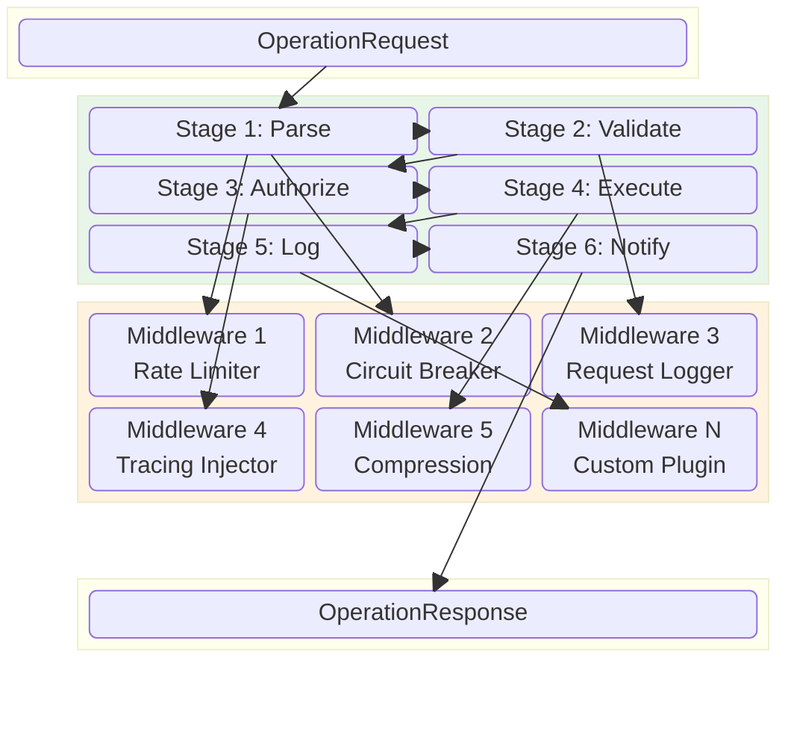
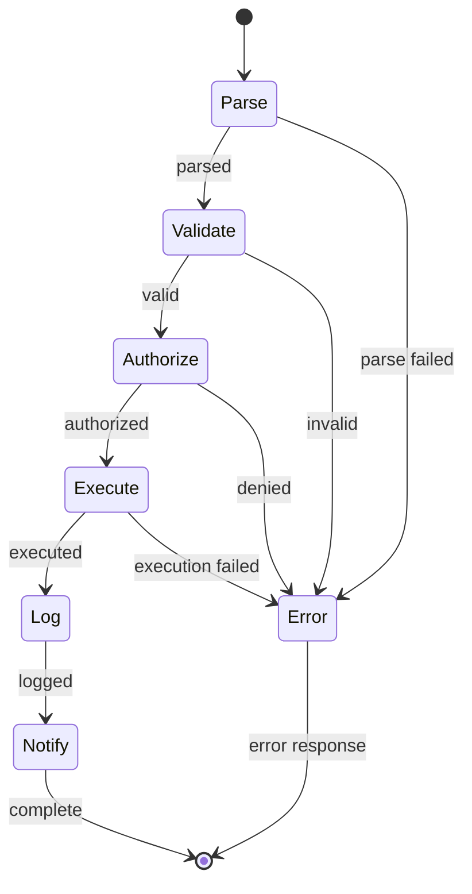
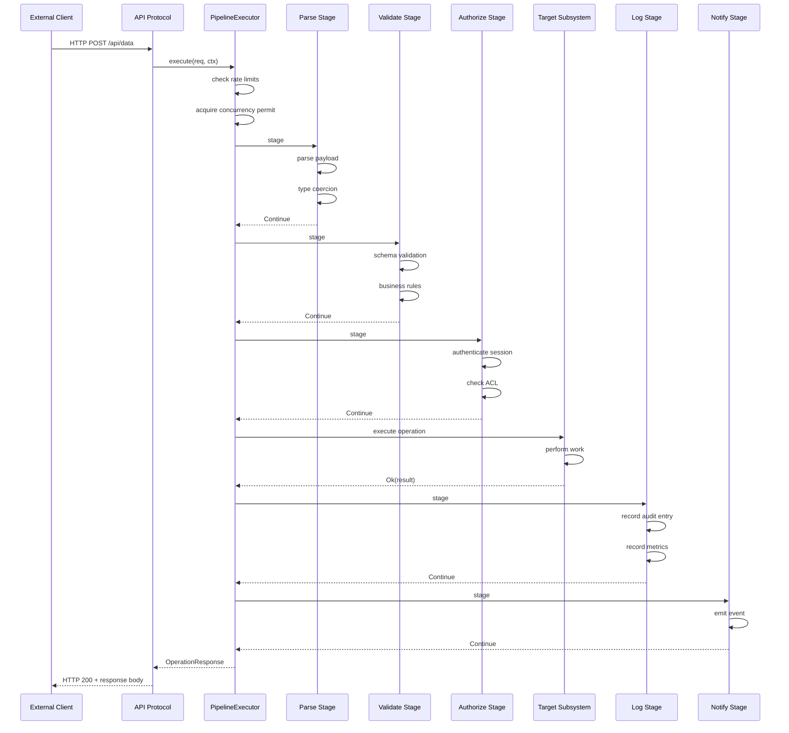
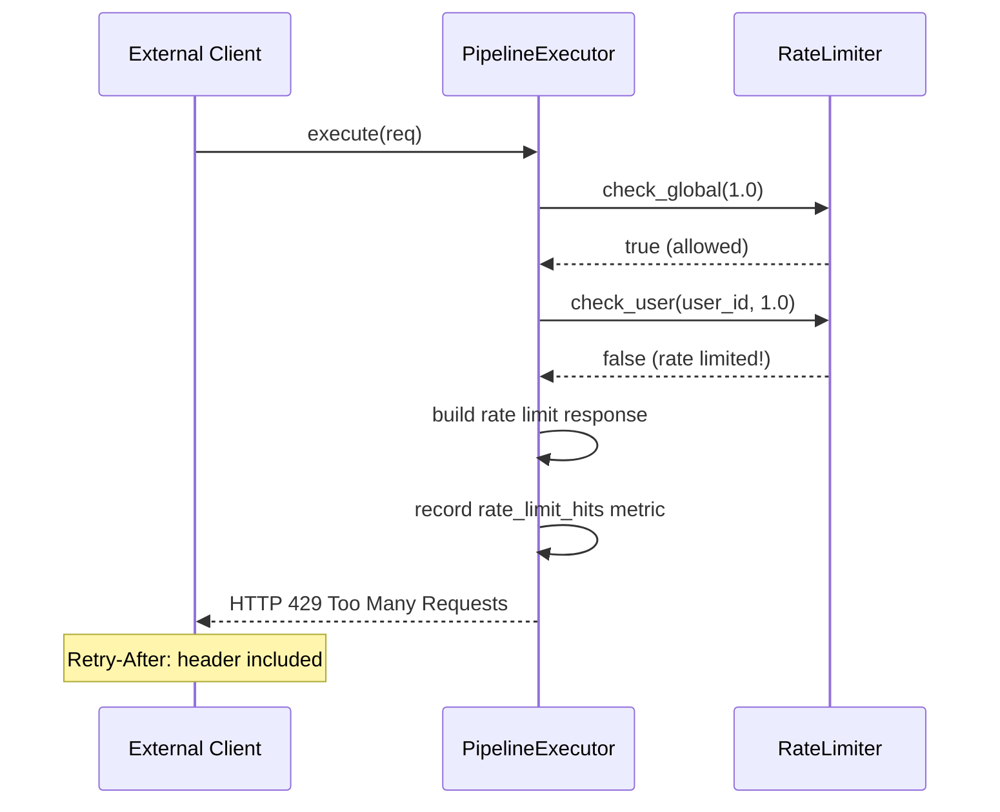
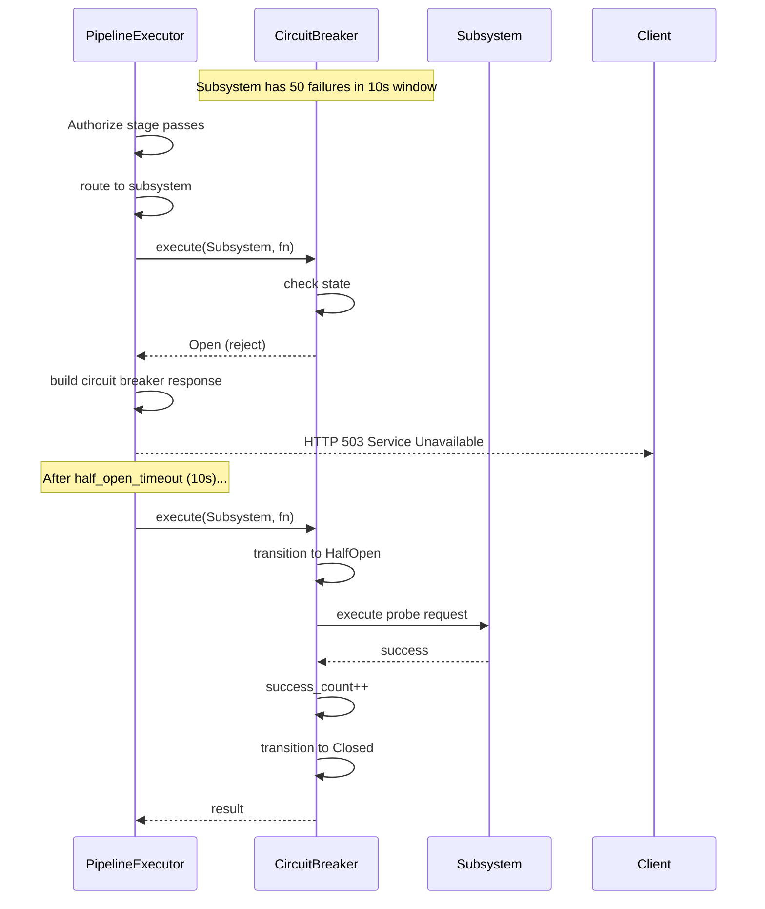
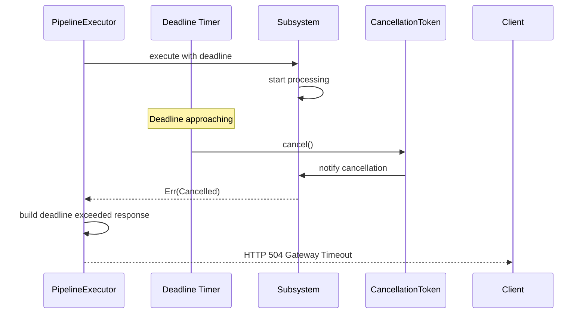
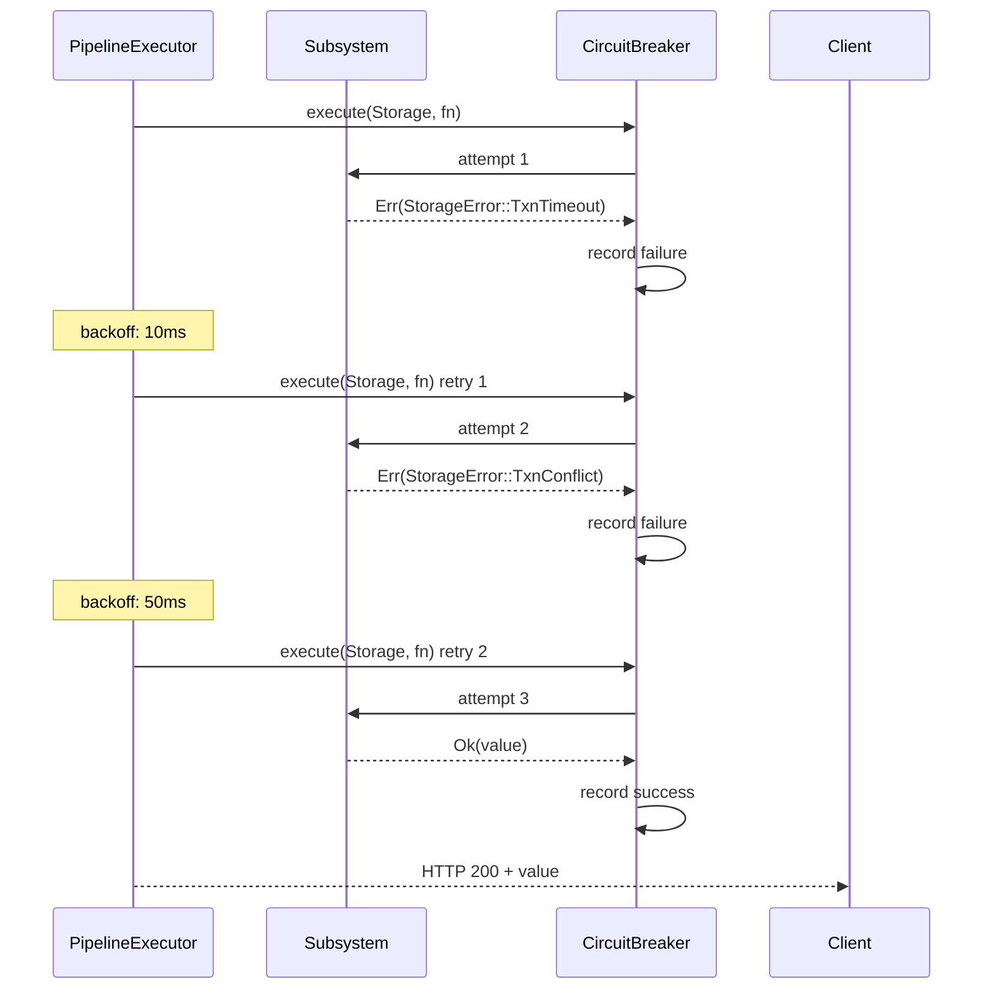
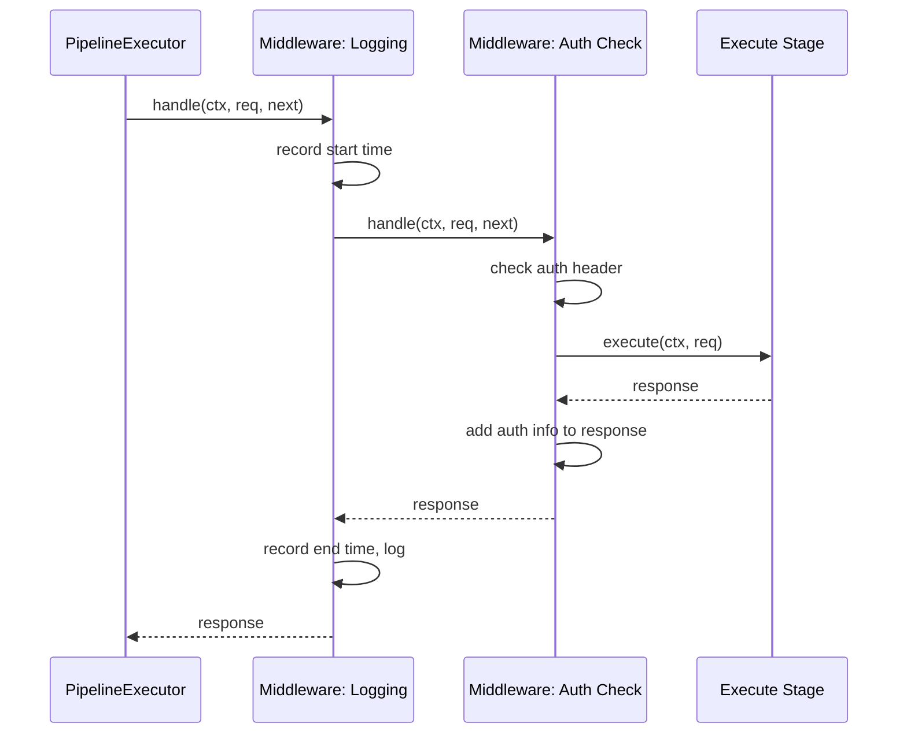
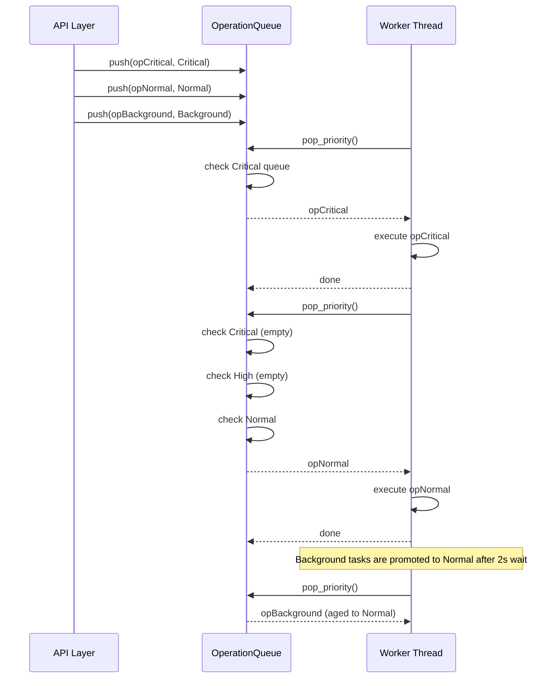

# 10 — Execution Engine

## 1. Purpose

The Execution Engine is the unified pipeline through which every operation in Nova Runtime passes. It enforces the One Execution Pipeline principle: no operation bypasses the pipeline. The pipeline provides a consistent framework for parsing, validation, authorization, execution, audit logging, and event notification.

## 2. Scope

This document covers:

- Operation lifecycle: parse -> validate -> authorize -> execute -> log -> notify
- Pipeline architecture: stages, middleware chain, filters
- Middleware interface: registration, ordering, short-circuit
- Operation context: trace ID, user session, deadline, cancellation
- Rate limiting: token bucket algorithm, per-user and global limits
- Circuit breaker: failure counting, half-open state, recovery
- Operation queuing: bounded queue, priority levels, backpressure
- Deadline propagation: from client request through pipeline to storage
- Cancellation propagation: cooperative cancellation via tokens
- Concurrency model: async/await with bounded task queue
- OperationRequest and OperationResponse structures
- Plugin/middleware interface for extensibility

Out of scope: individual subsystem internals (docs 08, 11-20), network protocol handling (doc 13), event system internals (doc 11).

## 3. Responsibilities

The Execution Engine is responsible for:

- Processing every operation through a fixed set of pipeline stages
- Parsing and validating all inputs before any subsystem is called
- Checking authorization for every operation that accesses data
- Executing operations by delegating to the appropriate subsystem
- Recording audit log entries for every mutation
- Emitting events for every state change
- Enforcing rate limits to protect against overload
- Detecting failures and opening circuit breakers to prevent cascading
- Managing operation timeouts and cancellation
- Providing a plugin interface for custom middleware and extensions
- Maintaining operation context (tracing, session, metadata) throughout the pipeline
- Ensuring the pipeline cannot be bypassed

## 4. Non Responsibilities

The Execution Engine is NOT responsible for:

- Network protocol parsing (handled by Layer 2, API Protocol)
- TLS termination (handled by Layer 1, Client Interface)
- Storage engine internals (handled by doc 08)
- Memory management (handled by doc 09)
- Event system internals (handled by doc 11)
- Authentication credential verification (handled by Auth service)
- Long-running task execution (handled by Scheduler, doc 18)
- Result caching (handled by Cache engine)
- Data transformation or aggregation (handled by subsystems)

## 5. Architecture

### 5.1 Pipeline Overview



### 5.2 Pipeline Execution Model

```rust
enum PipelineResult {
    Continue,                  // continue to next stage
    ShortCircuit(OperationResponse), // return immediately (e.g., rate limited)
    Error(PipelineError),      // pipeline-level error
}
```

Each stage is a function:

```rust
type StageFn = fn(
    ctx: &mut OperationContext,
    req: &mut OperationRequest,
) -> PipelineResult;
```

Stages are composed in order. If any stage returns ShortCircuit or Error, subsequent stages are skipped. The pipeline ensures that for every input OperationRequest, exactly one OperationResponse is produced.

### 5.3 Middleware Chain

Middleware wraps stages to add cross-cutting concerns:

```rust
type MiddlewareFn = Box<dyn Fn(
    ctx: &mut OperationContext,
    req: &mut OperationRequest,
    next: &dyn StageFn,
) -> PipelineResult + Send + Sync>;
```

Middleware can:
- Inspect and modify the request before the stage
- Inspect and modify the response after the stage
- Short-circuit before the stage (e.g., rate limiter returns 429)
- Measure and record timing
- Add fields to the operation context

```mermaid
flowchart LR
    subgraph MiddlewareChain
        direction TB
        MW1[Rate Limiter<br/>Before: check token bucket<br/>After: (none)]
        MW2[Circuit Breaker<br/>Before: check state<br/>After: record success/failure]
        MW3[Request Logger<br/>Before: record start time<br/>After: log duration]
        MW4[Auth Injector<br/>Before: inject session<br/>After: (none)]
    end

    subgraph Stage[Target Stage]
        EXEC[Execute Operation]
    end

    Input --> MW1
    MW1 -->|Continue| MW2
    MW1 -->|ShortCircuit 429| Output
    MW2 -->|Continue| MW3
    MW2 -->|ShortCircuit 503| Output
    MW3 --> MW4
    MW4 --> Stage
    Stage --> MW4
    MW4 --> MW3
    MW3 --> MW2
    MW2 --> MW1
    MW1 --> Output
```

### 5.4 Operation Context

Every operation has a context that is carried through the pipeline:

```rust
struct OperationContext {
    // Identity
    trace_id: u128,                      // UUIDv7
    span_id: u64,                        // monotonic span ID within trace
    parent_span_id: Option<u64>,         // parent span (for nested operations)
    user_session: Option<Session>,       // authenticated user (None for anonymous)
    source_addr: SocketAddr,             // client IP address

    // Lifecycle
    deadline: Instant,                   // absolute deadline
    cancellation_token: CancellationToken, // cooperative cancellation
    operation_priority: Priority,        // Critical | High | Normal | Background

    // Metadata
    protocol: Protocol,                  // Http | WebSocket | Sql | Admin | Internal
    subsystem: SubsystemId,              // target subsystem
    operation_type: OperationType,       // Read | Write | Delete | Admin
    metadata: HashMap<String, String>,   // user-defined metadata (max 16 entries, 256 bytes each)

    // Pipeline state
    stage: PipelineStage,                // current stage
    stage_elapsed: Duration,             // time spent in current stage
    total_elapsed: Duration,             // time since pipeline start
    retry_count: u8,                     // number of retries (0 = first attempt)

    // Internal
    kv_store: HashMap<String, Value>,    // middleware communication channel
    logger: &'static dyn Log,            // scoped logger
}
```

### 5.5 Operation Types

```rust
enum OperationType {
    // Data operations
    Get,                                // read a single object
    List,                               // list/scan objects
    Create,                             // create a new object
    Update,                             // update an existing object
    Delete,                             // delete an object
    Patch,                              // partial update

    // Query operations
    Query,                              // SQL query
    Search,                             // full-text search

    // Queue operations
    Enqueue,                            // add to queue
    Dequeue,                            // remove from queue
    Peek,                               // peek at queue (no dequeue)
    Ack,                                // acknowledge message

    // Scheduler operations
    Schedule,                           // schedule a task
    Cancel,                             // cancel a scheduled task

    // Blob operations
    BlobPut,                            // upload blob
    BlobGet,                            // download blob
    BlobDelete,                         // delete blob

    // Auth operations
    Authenticate,                       // log in
    Authorize,                          // check permission
    CreateToken,                        // create API token
    RevokeToken,                        // revoke API token

    // Admin operations
    Health,                             // health check
    Metrics,                            // get metrics
    Config,                             // view configuration
    Profile,                            // profiling data
    AdminAction,                        // administrative action
}
```

### 5.6 OperationRequest

```rust
struct OperationRequest {
    // Core
    operation_type: OperationType,       // type of operation
    target: OperationTarget,             // what to operate on

    // Parameters
    params: HashMap<String, Value>,      // operation-specific parameters

    // Payload
    payload: Option<Vec<u8>>,            // operation payload (e.g., object data)
    payload_size: u64,                   // payload size in bytes

    // Options
    options: OperationOptions,           // behavior options

    // Internal (set by pipeline)
    sequence: u64,                       // pipeline sequence number
    submitted_at: Instant,               // when submitted to pipeline
}

enum OperationTarget {
    Object { type_name: String, id: Option<u128> },
    Collection { type_name: String },
    Queue { name: String },
    Schedule { task_id: Option<u128> },
    Blob { blob_id: Option<u128> },
    Auth { realm: String },
    Admin { endpoint: String },
    System,
}

struct OperationOptions {
    consistency: Consistency,            // Eventual | Strong
    durability: Durability,              // Async | Sync | Durable
    ttl: Option<Duration>,               // time-to-live
    priority: Priority,                   // operation priority
    idempotency_key: Option<u128>,       // for deduplication
    timeout: Option<Duration>,           // operation-specific timeout
    max_retries: u8,                     // max retry count (default: 3)
    tracing: bool,                       // enable detailed tracing
}
```

### 5.7 OperationResponse

```rust
struct OperationResponse {
    // Status
    status: StatusCode,                  // Ok | Created | etc.
    success: bool,

    // Data
    data: Option<Value>,                 // response data
    data_size: u64,                      // response data size

    // Metadata
    trace_id: u128,                      // echo back the trace ID
    duration_ns: u64,                    // total pipeline duration

    // Error
    error: Option<ErrorInfo>,            // error details on failure

    // Diagnostics
    warnings: Vec<String>,               // max 8
    stage_timings: Vec<StageTiming>,     // per-stage timing breakdown
}

struct ErrorInfo {
    code: ErrorCode,                     // machine-readable error code
    message: String,                     // human-readable message
    details: Value,                      // structured error details
    retryable: bool,                     // if true, caller may retry
    retry_after_ms: Option<u64>,         // suggested retry delay
}

struct StageTiming {
    stage: PipelineStage,
    duration_ns: u64,
    status: StageStatus,                 // Success | Skipped | ShortCircuit | Error
}
```

### 5.8 Status Codes

```rust
enum StatusCode {
    // Success (2xx)
    Ok = 200,
    Created = 201,
    Accepted = 202,                      // async operation
    NoContent = 204,

    // Client Error (4xx)
    BadRequest = 400,
    Unauthorized = 401,
    Forbidden = 403,
    NotFound = 404,
    MethodNotAllowed = 405,
    Conflict = 409,                      // CAS failure
    Gone = 410,                          // resource deleted
    TooManyRequests = 429,
    RequestTooLarge = 413,
    UnprocessableEntity = 422,

    // Server Error (5xx)
    InternalError = 500,
    NotImplemented = 501,
    ServiceUnavailable = 503,
    GatewayTimeout = 504,
    InsufficientStorage = 507,
    CircuitBreakerOpen = 503,             // maps to 503
    DeadlineExceeded = 504,
    Cancelled = 499,                     // client cancelled
}
```

### 5.9 Pipeline Stages Detail



#### Stage 1: Parse

Responsibilities:
1. Extract operation type from the request
2. Decode payload format (JSON, MessagePack, CBOR)
3. Type-coerce parameters to expected types
4. Set default values for missing optional parameters
5. Validate operation target exists and is valid

```
function ParseStage(ctx, req):
    // 1. Identify operation type
    req.operation_type = IdentifyOperation(req)

    // 2. Parse payload based on content type
    match req.content_type:
        Json => req.payload = ParseJson(req.raw_payload)
        MsgPack => req.payload = ParseMsgPack(req.raw_payload)
        Cbor => req.payload = ParseCbor(req.raw_payload)
        Binary => // leave as-is for blob operations

    // 3. Type coercion
    for (key, value) in req.params:
        expected_type = GetExpectedType(req.operation_type, key)
        req.params[key] = Coerce(value, expected_type)

    // 4. Set defaults
    req.options.timeout = req.options.timeout
        .unwrap_or(ctx.default_operation_timeout)
    req.options.max_retries = req.options.max_retries
        .unwrap_or(DEFAULT_MAX_RETRIES)

    // 5. Validate target
    if not IsValidTarget(req.target):
        return Error(BadRequest("Invalid operation target"))

    return Continue
```

#### Stage 2: Validate

Responsibilities:
1. Schema validation (if operation involves typed objects)
2. Business rule validation
3. Parameter range validation
4. Payload size limit check
5. Idempotency key deduplication

```
function ValidateStage(ctx, req):
    // 1. Schema validation
    if schema = GetSchema(req.target):
        validation = ValidateAgainstSchema(req.payload, schema)
        if not validation.valid:
            return Error(BadRequest(validation.errors))

    // 2. Business rules
    match req.operation_type:
        Delete => CheckDeleteRules(req.target)
        Enqueue => CheckQueueSize(req.target)
        BlobPut => CheckBlobSize(req.payload_size)

    // 3. Parameter ranges
    for (key, value) in req.params:
        constraints = GetConstraints(req.operation_type, key)
        if constraints and not WithinRange(value, constraints):
            return Error(BadRequest("{key} out of range"))

    // 4. Payload size
    if req.payload_size > MAX_PAYLOAD_SIZE:
        return Error(RequestTooLarge(
            "Payload {req.payload_size} exceeds max {MAX_PAYLOAD_SIZE}"
        ))

    // 5. Idempotency check
    if key = req.options.idempotency_key:
        if previous = GetIdempotencyResult(key):
            return ShortCircuit(previous)
        StoreIdempotencyKey(key)

    return Continue
```

#### Stage 3: Authorize

Responsibilities:
1. Authenticate user session from token
2. Resolve ACL for the operation target
3. Check permission: does user have the required action on the target?
4. Attach resolved permissions to context

```
function AuthorizeStage(ctx, req):
    // 1. Authenticate
    session = AuthenticateRequest(ctx, req)
    ctx.user_session = session

    // 2. Resolve ACL
    acl = ResolveACL(req.target)

    // 3. Check permission
    required_action = GetRequiredAction(req.operation_type)
    if not acl.allows(session.user, required_action):
        ctx.logger.warn("Authorization denied",
            user = session.user.id,
            target = req.target,
            action = required_action
        )
        return Error(Forbidden("Insufficient permissions"))

    // 4. Attach to context
    ctx.metadata.insert("acl_check", "passed")
    ctx.metadata.insert("authz_subject", session.user.id.to_string())

    return Continue
```

#### Stage 4: Execute

Responsibilities:
1. Route to the correct subsystem based on operation type
2. Apply deadline from context
3. Execute the operation with the subsystem
4. Handle subsystem errors and translate to pipeline errors
5. Apply retry logic for transient failures

```
function ExecuteStage(ctx, req):
    // 1. Route to subsystem
    subsystem = RouteToSubsystem(req.operation_type)

    // 2. Apply deadline
    deadline = ctx.deadline
    timeout = remaining_time(deadline)
    if timeout <= 0:
        return Error(DeadlineExceeded("Operation timed out before execution"))

    // 3. Execute with retry
    attempts = 0
    loop:
        attempts++
        result = subsystem.execute_with_deadline(req, timeout)

        match result:
            Ok(response) => {
                ctx.stage_elapsed = elapsed()
                return Continue
            }
            Err(error) if error.retryable
                       and attempts <= req.options.max_retries
                       and remaining_time(deadline) > 0 => {
                backoff = calculate_backoff(attempts)
                sleep(min(backoff, remaining_time(deadline)))
                timeout = remaining_time(deadline)
            }
            Err(error) => {
                return PipelineError(error)
            }

    return Continue
```

#### Stage 5: Log

Responsibilities:
1. Record audit log entry for mutations
2. Record operation metrics (latency, status, size)
3. Attach stage timing breakdown to response

```
function LogStage(ctx, req, response):
    // 1. Audit log for mutations
    if IsMutation(req.operation_type):
        audit_entry = AuditEntry {
            timestamp: now(),
            trace_id: ctx.trace_id,
            user: ctx.user_session.map(|s| s.user.id),
            operation: req.operation_type,
            target: req.target,
            status: response.status,
            client_ip: ctx.source_addr,
        }
        audit_log.append(audit_entry)

    // 2. Metrics
    record_metric("pipeline.duration_ns", ctx.total_elapsed,
        labels: ["operation", req.operation_type,
                 "status", response.status])
    record_metric("pipeline.throughput", 1,
        labels: ["operation", req.operation_type])

    // 3. Stage timing
    response.stage_timings = ctx.stage_timings.clone()

    return Continue
```

#### Stage 6: Notify

Responsibilities:
1. Emit events for state changes
2. Notify subscribers via event system
3. Flush event buffer if needed

```
function NotifyStage(ctx, req, response):
    // 1. Emit events for mutations
    if IsMutation(req.operation_type) and response.success:
        event = NovaEvent {
            id: generate_uuidv7(),
            timestamp: now(),
            source: SubsystemId::Pipeline,
            event_type: MapToEventType(req.operation_type),
            object_id: GetObjectId(req.target),
            object_type: GetObjectType(req.target),
            payload: Some(response.data),
            routing_key: GetRoutingKey(req.target),
        }
        event_system.emit(event)

    // 2. For reads, emit access event (if tracking enabled)
    if IsRead(req.operation_type)
       and ctx.metadata.contains("audit_reads"):
        event_system.emit(AccessEvent { ... })

    return Continue
```

### 5.10 Rate Limiting

The rate limiter uses a token bucket algorithm:

```rust
struct TokenBucket {
    tokens: AtomicF64,                   // current token count
    capacity: f64,                       // max tokens (burst limit)
    refill_rate: f64,                    // tokens per second
    last_refill: AtomicInstant,          // last refill timestamp
}

impl TokenBucket {
    fn new(rate_per_sec: f64, burst: f64) -> Self {
        TokenBucket {
            tokens: AtomicF64::new(burst),
            capacity: burst,
            refill_rate: rate_per_sec,
            last_refill: AtomicInstant::new(Instant::now()),
        }
    }

    fn try_consume(&self, tokens: f64) -> bool {
        self.refill();

        loop {
            let current = self.tokens.load(Ordering::Acquire);
            if current < tokens {
                return false; // rate limited
            }
            if self.tokens.compare_exchange(
                current, current - tokens,
                Ordering::Release, Ordering::Relaxed
            ).is_ok() {
                return true; // consumed successfully
            }
            // CAS failed, retry
        }
    }

    fn refill(&self) {
        let now = Instant::now();
        let last = self.last_refill.load(Ordering::Acquire);
        let elapsed = now.duration_since(last).as_secs_f64();

        if elapsed > 0.0 {
            let added = elapsed * self.refill_rate;
            if self.last_refill.compare_exchange(
                last, now,
                Ordering::Release, Ordering::Relaxed
            ).is_ok() {
                self.tokens.fetch_add(added, Ordering::Relaxed);
                // Clamp to capacity
                let current = self.tokens.load(Ordering::Acquire);
                if current > self.capacity {
                    self.tokens.store(self.capacity, Ordering::Release);
                }
            }
        }
    }
}
```

Rate limit hierarchy:

```rust
struct RateLimiter {
    global: TokenBucket,                 // global limit (default: 10000/s)
    per_user: HashMap<u128, TokenBucket>, // per-authenticated-user (default: 100/s)
    per_ip: HashMap<IpAddr, TokenBucket>, // per-source-IP (default: 1000/s)
    per_operation: HashMap<OperationType, TokenBucket>, // per-operation (default: varies)
}
```

Rate limit configuration:

```toml
[execution.rate_limits]
global_per_sec = 10000
global_burst = 20000
user_per_sec = 100
user_burst = 200
ip_per_sec = 1000
ip_burst = 2000

[execution.rate_limits.operations]
Get = 5000
List = 500
Create = 1000
Update = 1000
Delete = 500
Search = 200
Enqueue = 2000
Dequeue = 2000
BlobPut = 100
BlobGet = 500
```

### 5.11 Circuit Breaker

```rust
enum CircuitState {
    Closed,                              // normal operation
    Open(Instant),                       // rejecting requests, timeout running
    HalfOpen,                            // probing recovery
}

struct CircuitBreaker {
    state: Atomic<CircuitState>,
    failure_count: AtomicU64,
    success_count: AtomicU64,
    failure_threshold: u64,              // 50 failures default
    success_threshold: u64,              // 10 successes to close
    half_open_timeout_ms: u64,           // 10000 (10s)
    window_ms: u64,                      // sliding window: 10000 (10s)
    last_state_change: AtomicInstant,
    per_subsystem: HashMap<SubsystemId, CircuitState>,
}

impl CircuitBreaker {
    fn call<F, T>(&self, subsystem: SubsystemId, f: F) -> Result<T, CircuitError>
    where F: Fn() -> Result<T, StorageError>
    {
        let state = self.get_state(subsystem);

        match state {
            Open(until) if Instant::now() < until => {
                return Err(CircuitError::Open("Circuit breaker open"));
            }
            Open(_) => {
                // Transition to Half-Open
                self.transition(subsystem, CircuitState::HalfOpen);
            }
            _ => {}
        }

        // Execute the operation
        match f() {
            Ok(result) => {
                self.record_success(subsystem);
                if self.should_close(subsystem) {
                    self.transition(subsystem, CircuitState::Closed);
                }
                Ok(result)
            }
            Err(err) if self.is_tracked_failure(&err) => {
                self.record_failure(subsystem);
                if self.should_open(subsystem) {
                    self.transition(
                        subsystem,
                        CircuitState::Open(Instant::now() + Duration::from_millis(
                            self.half_open_timeout_ms
                        )),
                    );
                }
                Err(err.into())
            }
            Err(err) => Err(err.into()),
        }
    }
}
```

Circuit breaker thresholds:

| Subsystem | Failure Threshold | Success Threshold | Half-Open Timeout |
|-----------|-------------------|-------------------|-------------------|
| Storage Engine | 50 errors / 10s | 10 consecutive | 10s |
| Cache Engine | 20 errors / 10s | 5 consecutive | 5s |
| Queue Engine | 30 errors / 10s | 10 consecutive | 10s |
| Search Engine | 40 errors / 10s | 10 consecutive | 30s |
| Auth Service | 10 errors / 10s | 5 consecutive | 5s |

### 5.12 Operation Queuing and Priorities

When all worker threads are busy, operations are queued in a priority queue:

```rust
struct OperationQueue {
    queues: [Vec<PendingOperation>; 4], // Critical, High, Normal, Background
    capacity: usize,                     // 1024 total default
    current_depth: AtomicUsize,
    rejected_count: AtomicU64,
}

struct PendingOperation {
    request: OperationRequest,
    context: OperationContext,
    completion: oneshot::Sender<OperationResponse>,
    submitted_at: Instant,
    deadline: Instant,
}
```

Priority scheduling:

| Priority | Queue | Max Depth | Starvation Prevention | Max Wait Time |
|----------|-------|-----------|----------------------|---------------|
| Critical | 0 | 64 | Strict priority, always served first | 100ms |
| High | 1 | 128 | Served after Critical | 500ms |
| Normal | 2 | 512 | Served after High; aged to High after 500ms | 2s |
| Background | 3 | 320 | Served after Normal; aged to Normal after 2s | 10s |

Queue admission policy:

```
function EnqueueOperation(queue, op):
    if queue.current_depth >= queue.capacity:
        op.completion.send(ServiceUnavailable("Queue full"))
        queue.rejected_count++
        return

    priority = op.request.options.priority
    target_queue = queue.queues[priority]

    if target_queue.len() >= queue.capacity_by_priority[priority]:
        // Try to age lowest-priority item and demote this one
        // Or reject the lowest-priority item
        if priority != Background:
            // Reject the new one
            op.completion.send(ServiceUnavailable("Priority queue full"))
            return
        else:
            // Replace oldest background task
            oldest = target_queue.pop_front()
            oldest.completion.send(ServiceUnavailable("Replaced by newer task"))

    target_queue.push_back(op)
    queue.current_depth.fetch_add(1)
```

### 5.13 Deadline Propagation

Deadlines flow from external clients through to storage operations:

```
Client timeout -> HTTP timeout -> Pipeline deadline -> Subsystem deadline -> Storage Engine deadline
```

```rust
fn propagate_deadline(ctx: &OperationContext, max_time: Duration) -> Instant {
    let deadline = ctx.deadline;
    let now = Instant::now();

    if deadline <= now {
        return now; // already expired
    }

    // Leave 10% margin for pipeline overhead
    let margin = deadline.saturating_duration_since(now) * 0.1;

    // Propagate deadline minus margin
    deadline - margin
}
```

Default timeouts by operation type:

| Operation Type | Default Timeout | Notes |
|----------------|-----------------|-------|
| Get (key-value) | 2s | Fast point lookup |
| Get (blob) | 30s | Large blob transfer |
| List (100 items) | 5s | Moderate scan |
| List (10000 items) | 30s | Large scan |
| Create | 5s | May trigger index updates |
| Update | 5s | May trigger index updates |
| Delete | 5s | Cascade deletes |
| Search | 10s | Full-text search |
| Enqueue | 2s | Simple append |
| Dequeue | 5s | May wait for message |
| Authenticate | 3s | Password hashing is slow |
| BlobPut | 60s | Large uploads |
| Query (SQL) | 30s | Complex queries |
| Admin | 30s | Diagnostics |

### 5.14 Cancellation Propagation

Cancellation uses cooperative cancellation tokens:

```rust
struct CancellationToken {
    cancelled: AtomicBool,
    callbacks: Mutex<Vec<Box<dyn Fn() + Send>>>,
}

impl CancellationToken {
    fn new() -> Self;
    fn cancel(&self);                       // trigger cancellation
    fn is_cancelled(&self) -> bool;
    fn on_cancel(&self, cb: Box<dyn Fn() + Send>); // register callback
}

// Usage in pipeline:
function ExecuteWithCancellation(subsystem, req, token):
    // Check cancellation before starting
    if token.is_cancelled():
        return Err(Cancelled("Operation cancelled"))

    // Register cancellation callback for in-flight operations
    token.on_cancel(|| {
        subsystem.cancel_in_flight(req.trace_id);
    });

    // Execute with periodic cancellation check
    result = subsystem.execute(req, |progress| {
        if token.is_cancelled():
            return Err(Cancelled("Operation cancelled"))
        Ok(progress)
    });

    return result
```

Cancellation sources:
1. Client disconnects (HTTP connection closed)
2. Deadline exceeded (timeout)
3. Circuit breaker opens
4. Shutdown sequence begins

### 5.15 Concurrency Model

```rust
struct PipelineExecutor {
    worker_pool: Arc<ThreadPool>,          // bounded thread pool
    operation_queue: Arc<OperationQueue>,   // priority queue
    max_concurrent: Semaphore,              // 256 permits
    rate_limiter: Arc<RateLimiter>,
    circuit_breaker: Arc<CircuitBreaker>,
    active_operations: AtomicU64,
    total_operations: AtomicU64,
}

impl PipelineExecutor {
    async fn execute(&self, req: OperationRequest, ctx: OperationContext)
        -> OperationResponse
    {
        // 1. Check rate limits
        if !self.check_rate_limits(&ctx) {
            return self.build_rate_limit_response(&ctx);
        }

        // 2. Acquire concurrency permit
        let permit = self.max_concurrent.acquire().await;

        // 3. Submit to worker pool
        let (tx, rx) = oneshot::channel();
        let task = PendingOperation {
            request: req,
            context: ctx,
            completion: tx,
        };

        self.enqueue(task);

        // 4. Wait for completion with deadline
        let result = tokio::time::timeout(
            ctx.deadline - Instant::now(),
            rx,
        ).await;

        match result {
            Ok(Ok(response)) => response,
            Ok(Err(_)) => self.build_internal_error(&ctx),
            Err(_) => self.build_deadline_exceeded(&ctx),
        }
    }

    fn enqueue(&self, task: PendingOperation) {
        self.active_operations.fetch_add(1);
        self.total_operations.fetch_add(1);
        self.operation_queue.push(task);
    }
}
```

### 5.16 Retry Logic

```rust
fn calculate_backoff(attempt: u8) -> Duration {
    // Exponential backoff with jitter
    // attempt 1: 10ms base jitter
    // attempt 2: 50ms
    // attempt 3: 250ms
    // attempt 4+: 1000ms cap
    let base = Duration::from_millis(10u64.pow(attempt));
    let capped = min(base, Duration::from_secs(1));
    let jitter = rand::duration(0, capped / 2);
    capped + jitter
}

fn is_retryable(error: &StorageError) -> bool {
    match error {
        StorageError::TxnTimeout => true,
        StorageError::TxnConflict => true,
        StorageError::TxnLockTimeout => true,
        StorageError::EngineBusy => true,
        StorageError::DiskFull => false,
        StorageError::Corruption(_) => false,
        StorageError::IoError(_) => true,
        _ => false,
    }
}
```

Retry policy by operation type:

| Operation Type | Max Retries | Backoff Strategy | Idempotent? |
|---------------|-------------|------------------|-------------|
| Get | 3 | 10ms, 50ms, 250ms | Yes |
| List | 2 | 10ms, 50ms | Yes |
| Create | 0 | N/A | No (usually) |
| Update | 3 | 10ms, 50ms, 250ms | Yes (if idempotency key) |
| Delete | 3 | 10ms, 50ms, 250ms | Yes (idempotent) |
| Enqueue | 3 | 10ms, 50ms, 250ms | Yes (dedup key) |
| Dequeue | 2 | 10ms, 50ms | Yes |
| Authenticate | 1 | 10ms | Yes |
| BlobPut | 2 | 100ms, 1s | Yes (resumable) |

## 6. Data Structures

### 6.1 PipelineConfig

```rust
struct PipelineConfig {
    // Concurrency
    max_concurrent_ops: u32,               // 256 default
    pipeline_queue_depth: u32,             // 1024 default
    worker_threads: u32,                   // 4 default

    // Timeouts
    default_operation_timeout_ms: u64,     // 5000 default
    max_operation_timeout_ms: u64,         // 60000 default

    // Rate limiting
    rate_limit_default_per_sec: u64,       // 1000 default
    rate_limit_global_per_sec: u64,        // 10000 default
    rate_limit_global_burst: u64,          // 20000 default
    rate_limit_user_per_sec: u64,          // 100 default
    rate_limit_ip_per_sec: u64,            // 1000 default

    // Circuit breaker
    circuit_breaker_threshold: u64,        // 50 default
    circuit_breaker_window_ms: u64,        // 10000 default
    circuit_breaker_half_open_timeout_ms: u64, // 10000 default
    circuit_breaker_success_threshold: u64, // 10 default

    // Middleware
    middleware_order: Vec<String>,          // ordered middleware names

    // Audit
    audit_enabled: bool,                   // true default
    audit_include_payloads: bool,          // false default
    audit_max_entry_size: u32,             // 4096 default

    // Idempotency
    idempotency_key_ttl_secs: u64,         // 86400 (24h) default
    max_idempotency_keys: u32,             // 100000 default

    // Retry
    max_retries: u8,                       // 3 default
    retry_base_delay_ms: u64,              // 10 default
    retry_max_delay_ms: u64,               // 1000 default
}
```

### 6.2 MiddlewareRegistration

```rust
struct MiddlewareRegistration {
    name: String,                           // unique middleware name
    stage: PipelineStage,                   // which stage to wrap
    order: u32,                             // execution order within stage
    middleware: MiddlewareFn,               // the middleware function
    enabled: bool,                          // can be toggled at runtime
    config: HashMap<String, Value>,         // middleware-specific config
}
```

### 6.3 PendingOperation

```rust
struct PendingOperation {
    request: OperationRequest,
    context: OperationContext,
    completion: oneshot::Sender<OperationResponse>,
    enqueued_at: Instant,
    deadline: Instant,
    retry_count: u8,
    priority_age: u32,                      // starvation counter
}
```

### 6.4 PipelineMetrics

```rust
struct PipelineMetrics {
    // Throughput
    operations_total: AtomicU64,
    operations_by_type: HashMap<OperationType, AtomicU64>,
    operations_by_status: HashMap<StatusCode, AtomicU64>,

    // Latency (nanoseconds)
    latency_histogram: HdrHistogram,         // 1us to 60s, 3 significant digits
    stage_latency: HashMap<PipelineStage, HdrHistogram>,

    // Queue
    queue_depth: AtomicU64,
    queue_rejected: AtomicU64,
    queue_wait_time: HdrHistogram,

    // Rate limiting
    rate_limit_hits: AtomicU64,
    rate_limit_waived: AtomicU64,           // priority bypass count

    // Circuit breaker
    circuit_opens: AtomicU64,
    circuit_half_opens: AtomicU64,
    circuit_closes: AtomicU64,
    circuit_rejected: AtomicU64,

    // Retry
    retry_attempts: AtomicU64,
    retry_successes: AtomicU64,
    retry_exhaustions: AtomicU64,

    // Cancellation
    cancelled_operations: AtomicU64,
    deadline_exceeded: AtomicU64,

    // Errors
    parse_errors: AtomicU64,
    validation_errors: AtomicU64,
    authorization_errors: AtomicU64,
    execution_errors: AtomicU64,

    // Current state
    active_operations: AtomicU64,
    current_queue_depth: AtomicU64,
    current_rate_limit_remaining: AtomicU64,
}
```

### 6.5 AuditEntry

```rust
struct AuditEntry {
    id: u128,                                // UUIDv7
    timestamp: u64,                          // unix nanoseconds
    trace_id: u128,
    user_id: Option<u128>,
    session_id: Option<u128>,
    source_addr: IpAddr,
    source_port: u16,
    protocol: Protocol,
    operation: OperationType,
    target: OperationTarget,
    status: StatusCode,
    error: Option<String>,
    duration_ns: u64,
    payload_size: u64,
    idempotency_key: Option<u128>,
    metadata: HashMap<String, String>,       // max 8 entries
    // payload: Option<Vec<u8>>,             // Only if audit_include_payloads
}
```

### 6.6 IdempotencyRecord

```rust
struct IdempotencyRecord {
    key: u128,                               // idempotency key
    trace_id: u128,                          // original operation trace
    response: OperationResponse,             // cached response
    created_at: Instant,
    ttl: Duration,
    expires_at: Instant,
}
```

## 7. Algorithms

### 7.1 Pipeline Execution Algorithm

```
function RunPipeline(request, context):
    // Create initial context
    ctx = OperationContext {
        trace_id: context.trace_id,
        span_id: generate_span_id(),
        stage: Parse,
        deadline: context.deadline,
        cancellation_token: context.cancellation_token,
        ...
    }

    req = request
    response = None

    // Run stages sequentially
    stages = [Parse, Validate, Authorize, Execute, Log, Notify]

    for stage in stages:
        ctx.stage = stage
        stage_start = now()

        // Apply middleware for this stage
        middleware_chain = GetMiddlewareForStage(stage)

        // Execute stage through middleware chain
        result = RunMiddlewareChain(middleware_chain, ctx, req,
                    |ctx, req| { stage.fn(ctx, req) })

        ctx.stage_elapsed = now() - stage_start
        ctx.stage_timings.push({ stage, ctx.stage_elapsed, result.status })

        match result:
            Continue => continue
            ShortCircuit(resp) => {
                response = resp
                break
            }
            Error(err) => {
                response = BuildErrorResponse(ctx, req, err)
                break
            }

    // Run remaining stages with the response
    // Log and Notify still run even on error
    for stage in [Log, Notify]:
        if not already_run(stage):
            RunStage(stage, ctx, req, response)

    // Finalize response
    response.trace_id = ctx.trace_id
    response.duration_ns = ctx.total_elapsed
    response.stage_timings = ctx.stage_timings

    return response
```

### 7.2 Middleware Chain Execution

```
function RunMiddlewareChain(middleware, ctx, req, stage_fn):
    // Compose middleware from inner to outer
    // So middleware[0] runs first (before stage), last (after stage)

    composed = stage_fn
    for mw in middleware.reverse():
        // Each middleware wraps the next function
        current = composed
        composed = |ctx, req| { mw(ctx, req, current) }

    // Execute the composed chain
    return composed(ctx, req)
```

### 7.3 Rate Limiting Algorithm

```
function CheckRateLimits(ctx, req):
    // 1. Check global limit
    if not global_bucket.try_consume(1.0):
        ctx.metrics.rate_limit_hits++
        return false

    // 2. Check per-user limit
    if user_id = ctx.user_session.user.id:
        user_bucket = GetOrCreateUserBucket(user_id)
        if not user_bucket.try_consume(1.0):
            ctx.metrics.rate_limit_hits++
            return false

    // 3. Check per-IP limit
    if ip = ctx.source_addr.ip():
        ip_bucket = GetOrCreateIpBucket(ip)
        if not ip_bucket.try_consume(1.0):
            ctx.metrics.rate_limit_hits++
            return false

    // 4. Check per-operation limit
    op_bucket = GetOrCreateOperationBucket(req.operation_type)
    if not op_bucket.try_consume(1.0):
        ctx.metrics.rate_limit_hits++
        return false

    // 5. Priority bypass: high-priority ops get a separate bucket
    if req.options.priority == Critical:
        // Critical ops have their own budget
        critical_bucket = GetCriticalBucket()
        if not critical_bucket.try_consume(1.0):
            // Critical ops are never rate-limited
            // Log warning but allow through
            ctx.metrics.rate_limit_waived++

    return true
```

### 7.4 Circuit Breaker State Machine

```
function ShouldOpen(circuit, subsystem):
    // Check if failure count in window exceeds threshold
    failures = circuit.failure_count[subsystem].load()
    threshold = circuit.failure_threshold

    if failures >= threshold:
        return true

    // Check error rate (alternative trigger)
    window_errors = circuit.window_errors[subsystem]
    window_total = circuit.window_total[subsystem]
    if window_total > 100: // minimum sample size
        error_rate = window_errors / window_total
        if error_rate > 0.5: // 50% error rate
            return true

    return false

function ShouldClose(circuit, subsystem):
    successes = circuit.success_count[subsystem].load()
    return successes >= circuit.success_threshold

function ShouldHalfOpen(circuit, subsystem):
    state = circuit.state[subsystem].load()
    match state:
        Open(timeout_start) => {
            return now() >= timeout_start + circuit.half_open_timeout
        }
        _ => false
```

### 7.5 Idempotency Algorithm

```
function CheckIdempotency(key, operation_type):
    // 1. Check if key exists and is still valid
    record = idempotency_cache.get(key)

    if record is None:
        // New operation, store key
        idempotency_cache.insert(IdempotencyRecord {
            key,
            trace_id: current_trace_id,
            response: None,  // not completed yet
            created_at: now(),
            ttl: IDEMPOTENCY_TTL,
            expires_at: now() + IDEMPOTENCY_TTL,
        })
        return None // no previous result, continue

    // 2. Check if operation completed
    if record.response is Some:
        return Some(record.response) // return cached response

    // 3. Operation is in-flight
    // Check if it's still valid or expired
    if record.created_at + IDEMPOTENCY_IN_FLIGHT_TIMEOUT < now():
        // Previous attempt may have failed, allow retry
        // But only for GET/HEAD operations or if idempotent
        return None // allow retry

    // 4. Duplicate in-flight operation
    return Some(Conflict("Operation with this idempotency key is in progress"))
```

### 7.6 Deadline Enforcement

```
function EnforceDeadline(ctx, subsystem_fn):
    deadline = ctx.deadline
    remaining = deadline - Instant::now()

    if remaining <= Duration::ZERO:
        return Err(DeadlineExceeded("Operation timed out"))

    // Run with timeout
    match timeout(remaining, subsystem_fn()).await:
        Ok(result) => result,
        Err(_) => {
            // Deadline exceeded
            ctx.cancellation_token.cancel()
            Err(DeadlineExceeded("Operation exceeded deadline"))
        }
```

## 8. Interfaces

### 8.1 PipelineExecutor

```rust
impl PipelineExecutor {
    /// Create a new pipeline executor with the given configuration.
    fn new(config: PipelineConfig, worker_pool: Arc<ThreadPool>) -> Self;

    /// Execute an operation through the pipeline.
    async fn execute(&self, req: OperationRequest, ctx: OperationContext)
        -> OperationResponse;

    /// Register middleware.
    fn register_middleware(&self, registration: MiddlewareRegistration)
        -> Result<(), RegistrationError>;

    /// Remove middleware by name.
    fn unregister_middleware(&self, name: &str) -> Result<(), RemovalError>;

    /// Get pipeline metrics snapshot.
    fn metrics(&self) -> PipelineMetrics;

    /// Get current pipeline status.
    fn status(&self) -> PipelineStatus;

    /// Drain all in-flight operations (for shutdown).
    async fn drain(&self, timeout: Duration) -> Result<(), DrainError>;

    /// Update rate limit configuration at runtime.
    fn update_rate_limits(&self, config: RateLimitConfig)
        -> Result<(), ConfigError>;
}
```

### 8.2 Stage Interface

```rust
trait PipelineStage: Send + Sync {
    fn name(&self) -> &'static str;
    fn stage_type(&self) -> PipelineStage;
    fn execute(&self, ctx: &mut OperationContext, req: &mut OperationRequest)
        -> PipelineResult;
}
```

### 8.3 Middleware Interface

```rust
trait Middleware: Send + Sync {
    fn name(&self) -> &'static str;
    fn stage(&self) -> PipelineStage;

    fn handle(
        &self,
        ctx: &mut OperationContext,
        req: &mut OperationRequest,
        next: &dyn Fn(
            &mut OperationContext,
            &mut OperationRequest
        ) -> PipelineResult,
    ) -> PipelineResult;
}
```

### 8.4 RateLimiter Interface

```rust
impl RateLimiter {
    fn new(config: RateLimitConfig) -> Self;
    fn check(&self, ctx: &OperationContext, req: &OperationRequest) -> Result<(), RateLimitError>;
    fn check_global(&self, tokens: f64) -> bool;
    fn check_user(&self, user_id: u128, tokens: f64) -> bool;
    fn check_ip(&self, ip: IpAddr, tokens: f64) -> bool;
    fn check_operation(&self, op: OperationType, tokens: f64) -> bool;
    fn update_config(&self, config: RateLimitConfig);
    fn stats(&self) -> RateLimitStats;
}
```

### 8.5 CircuitBreaker Interface

```rust
impl CircuitBreaker {
    fn new(config: CircuitBreakerConfig) -> Self;
    fn execute<F, T>(&self, subsystem: SubsystemId, operation: F)
        -> Result<T, CircuitError>
    where
        F: Fn() -> Result<T, StorageError>;
    fn state(&self, subsystem: SubsystemId) -> CircuitState;
    fn force_open(&self, subsystem: SubsystemId);
    fn force_close(&self, subsystem: SubsystemId);
    fn reset(&self, subsystem: SubsystemId);
    fn stats(&self) -> CircuitBreakerStats;
}
```

### 8.6 AuditLogger Interface

```rust
impl AuditLogger {
    fn new(config: AuditConfig) -> Self;
    fn log(&self, entry: AuditEntry) -> Result<(), AuditError>;
    fn log_mutation(&self, ctx: &OperationContext, req: &OperationRequest, resp: &OperationResponse);
    fn log_read(&self, ctx: &OperationContext, req: &OperationRequest);
    fn query(&self, filter: AuditFilter) -> Result<Vec<AuditEntry>, AuditError>;
    fn stats(&self) -> AuditStats;
}
```

### 8.7 OperationQueue Interface

```rust
impl OperationQueue {
    fn new(capacity: usize) -> Self;
    fn push(&self, op: PendingOperation) -> Result<(), QueueFullError>;
    fn pop(&self) -> Option<PendingOperation>;
    fn pop_priority(&self) -> Option<PendingOperation>;
    fn len(&self) -> usize;
    fn is_empty(&self) -> bool;
    fn cancel_all(&self, reason: &str);
    fn drain(&self, deadline: Instant) -> Vec<PendingOperation>;
    fn stats(&self) -> QueueStats;
}
```

### 8.8 PipelineStatus

```rust
struct PipelineStatus {
    is_running: bool,
    is_draining: bool,
    active_operations: u64,
    queue_depth: usize,
    queue_capacity: usize,
    rate_limiter_status: RateLimiterStatus,
    circuit_breaker_status: CircuitBreakerStatus,
    middleware_count: u32,
    uptime_seconds: u64,
    last_metrics_snapshot: PipelineMetrics,
}
```

## 9. Sequence Diagrams

### 9.1 Successful Operation Through Full Pipeline



### 9.2 Rate Limited Operation



### 9.3 Circuit Breaker Open



### 9.4 Operation Timeout



### 9.5 Retry on Transient Failure



### 9.6 Middleware Processing



### 9.7 Priority Queue Dispatching



## 10. Failure Modes

### 10.1 Pipeline Deadlock

| Field | Value |
|-------|-------|
| Cause | Circular wait between pipeline stages and subsystem (e.g., storage operation in auth middleware) |
| Detection | Operation timeout triggers; all workers stuck |
| Effect | Pipeline stalls, no operations complete |
| Severity | Critical (complete service unavailability) |

### 10.2 Rate Limiter Memory Exhaustion

| Field | Value |
|-------|-------|
| Cause | Too many unique users/IPs create too many token buckets |
| Detection | Memory budget exceeded |
| Effect | Bucket creation fails, traffic allowed without limit |
| Severity | High (rate limiting disabled) |

### 10.3 Circuit Breaker False Open

| Field | Value |
|-------|-------|
| Cause | Transient spike in errors causes circuit to open unnecessarily |
| Detection | High rate of 503 responses during normal operation |
| Effect | Operations rejected despite subsystem being healthy |
| Severity | Medium (degraded throughput) |

### 10.4 Idempotency Cache Memory Leak

| Field | Value |
|-------|-------|
| Cause | Idempotency keys not evicted after TTL, or TTL too long |
| Detection | Memory usage grows monotonically |
| Effect | Memory leak, eventual OOM |
| Severity | Medium (eventual crash) |

### 10.5 Middleware Panic

| Field | Value |
|-------|-------|
| Cause | Bug in third-party middleware plugin |
| Detection | recover() in middleware chain catches panic |
| Effect | Operation fails, other operations unaffected |
| Severity | Low (single operation failure) |

### 10.6 Audit Log Write Failure

| Field | Value |
|-------|-------|
| Cause | Storage engine unavailable, disk full |
| Detection | AuditLog::log returns error |
| Effect | Audit entry lost; operation still succeeds (fail-open) |
| Severity | Medium (compliance gap) |

### 10.7 Cancellation Token Leak

| Field | Value |
|-------|-------|
| Cause | Callbacks registered on cancellation token not cleaned up |
| Detection | Memory growth, callback list grows unbounded |
| Effect | Memory leak, cancelled operations call stale callbacks |
| Severity | Medium (memory leak, potential use-after-free) |

### 10.8 Priority Inversion

| Field | Value |
|-------|-------|
| Cause | Low-priority operation holds a lock needed by high-priority operation |
| Detection | High-priority operations experience unexpected latency |
| Effect | Priority system defeated |
| Severity | Low (performance only) |

### 10.9 Retry Storm

| Field | Value |
|-------|-------|
| Cause | All requests to a failing subsystem retry simultaneously |
| Detection | Load on subsystem increases exponentially |
| Effect | Subsystem fails harder, cascading failure |
| Severity | High (cascading failure) |

## 11. Recovery Strategy

### 11.1 Pipeline Deadlock Recovery

1. Automatic: All operations have deadlines. When deadline expires, the operation is cancelled.
2. After all in-flight operations time out (max: default_timeout = 5s), pipeline recovers.
3. Prevention: Ensure middleware never calls subsystems directly. Use async channels instead of synchronous calls.
4. Detection: Monitor active_operations. If it remains at max_concurrent for > 10s, log a deadlock warning.

### 11.2 Rate Limiter Memory Exhaustion Recovery

1. Rate limiter caps the number of tracked users at max_tracked_users (10000 default)
2. When exceeding cap, the least recently used user bucket is evicted
3. LRU behavior is acceptable: a user who hasn't sent a request recently will get a fresh bucket with full tokens

### 11.3 Circuit Breaker False Open Recovery

1. Automatic: Circuit breaker transitions to Half-Open after half_open_timeout_ms (10s)
2. A single successful probe request closes the circuit
3. If false opens persist: adjust failure_threshold upward or increase window_ms
4. Manual override: admin endpoint to force-close circuit breaker

### 11.4 Idempotency Cache Memory Leak Recovery

1. Scheduled eviction thread runs every 60s
2. Removes all records where expires_at < now()
3. If cache exceeds max_idempotency_keys (100000), oldest entries are evicted (FIFO)

### 11.5 Middleware Panic Recovery

1. recover() in middleware chain catches the panic
2. Stack trace is logged
3. Operation returns 500 InternalError
4. Middleware is disabled after 3 panics within 60s (circuit breaker for middleware)
5. Operator examines logs and fixes/replaces the middleware

### 11.6 Audit Log Write Failure Recovery

1. Audit failure is logged but operation continues (fail-open for audit)
2. If audit is configured as "required" (audit_required = true in config), operation fails
3. Default: fail-open (audit loss is acceptable over service unavailability)

### 11.7 Cancellation Token Leak Recovery

1. On operation completion (success or failure), cancellation token is explicitly drained
2. All callbacks are removed
3. Token is optionally returned to a pool for reuse

### 11.8 Priority Inversion Recovery

1. Priorities are advisory, not enforced by locks
2. If priority inversion is detected (via metrics), the operation queue can temporarily boost the priority of the lock-holding operation
3. Long-term solution: use priority inheritance on mutexes

### 11.9 Retry Storm Recovery

1. Retry with exponential backoff + jitter naturally spreads retry attempts
2. Circuit breaker opens after failure_threshold, preventing further retries
3. If a retry storm is detected (>50% of operations are retries), pipeline enters "degraded" mode:
   a. New operations are rate-limited more aggressively
   b. Retry budget is reduced (max_retries -= 1 per level)
   c. Backoff multipliers are increased

## 12. Performance Considerations

### 12.1 Pipeline Stage Latency Budget

| Stage | Target P50 | Target P99 | Max P99 | Allocation |
|-------|-----------|-----------|---------|------------|
| Parse | 10μs | 100μs | 500μs | 1 request arena allocation |
| Validate | 20μs | 200μs | 1ms | Schema lookup (cached) |
| Authorize | 100μs | 1ms | 5ms | Token verification + ACL check |
| Execute | varies | varies | varies | Subsystem-dependent |
| Log | 10μs | 50μs | 200μs | Buffered write |
| Notify | 5μs | 30μs | 100μs | Event emit |
| Middleware overhead | 5μs | 30μs | 100μs | Per-middleware |

### 12.2 Concurrency Limits

| Resource | Default | Max | Bottleneck |
|----------|---------|-----|------------|
| Concurrent operations | 256 | 4096 | Memory (each needs ~16 KB) |
| Queue depth | 1024 | 65536 | Memory (each ~1 KB) |
| Worker threads | 4 | 64 | CPU |
| Rate limiter buckets | 10000 | 1000000 | Memory (~128 bytes each) |
| Idempotency records | 100000 | 1000000 | Memory (~256 bytes each) |
| Middleware chain length | 10 | 50 | CPU (each adds latency) |

### 12.3 Memory Per Operation

| Component | Size | Notes |
|-----------|------|-------|
| OperationRequest | ~512 B | headers + params |
| OperationContext | ~1024 B | session, metadata, KV store |
| OperationResponse | ~256 B | status, error info |
| Payload buffer | payload_size | up to 16 MB (streamed for >64 KB) |
| Stage timings | ~100 B | 6 stages x ~16 B |
| Audit entry (temporary) | ~256 B | released after write |
| **Total per operation** | **~2 KB + payload** | |

### 12.4 Throughput Estimates

| Operation Type | Single Node Throughput (4 cores) | Bottleneck |
|---------------|---------------------------------|------------|
| Point read (cache hit) | >50000 ops/s | Pipeline overhead |
| Point read (cache miss) | ~10000 ops/s | Storage engine I/O |
| Point write (sync WAL) | ~2000 ops/s | WAL fsync |
| Point write (interval WAL) | ~10000 ops/s | Memtable insert |
| Range scan (100 items) | ~5000 ops/s | Storage engine scan |
| Search query | ~1000 ops/s | Search index traversal |
| Enqueue | ~15000 ops/s | Queue append |
| Dequeue | ~10000 ops/s | Queue pop + delete |
| Authenticate | ~5000 ops/s | Password hashing (bcrypt rounds=12) |
| BlobPut (1 MB) | ~200 ops/s | Network + storage I/O |

### 12.5 Rate Limiter Performance

| Operation | Latency | Lock Contention |
|-----------|---------|-----------------|
| Token bucket check (global) | ~50ns | Low (atomic CAS) |
| Token bucket check (per-user) | ~100ns | Low (atomic CAS + hash lookup) |
| Token bucket refill | ~20ns | Very low |
| Bucket creation | ~500ns | Moderate (mutex) |

### 12.6 Circuit Breaker Performance

| Operation | Latency | Notes |
|-----------|---------|-------|
| Check state (closed) | ~20ns | Atomic load |
| Check state (open) | ~40ns | Atomic load + timestamp compare |
| Record success | ~50ns | Atomic increment |
| Record failure | ~50ns | Atomic increment |
| State transition | ~200ns | Atomic CAS + timestamp write |

## 13. Security

### 13.1 Pipeline Bypass Prevention

The execution pipeline is the ONLY path to execute operations. All entry points must use the pipeline:

```rust
// Forbidden: direct subsystem access
subsystem.execute(req); // MUST NOT EXIST

// Required: through pipeline
let ctx = OperationContext::new(req);
pipeline_executor.execute(req, ctx).await;
```

Enforcement:
1. All subsystem methods are private to the pipeline module
2. Only the pipeline module can call subsystem execute methods
3. API layer receives a PipelineExecutor reference, not subsystem references
4. Audit: the pipeline verifies that every mutation has passed through all stages

### 13.2 Authorization at Every Stage

Even if a previous stage had authorization information, the Execute stage re-checks:
1. The user session attached to the context hasn't been tampered with (HMAC-signed)
2. The operation's target is within the authorized scope
3. The user hasn't been deactivated since the Authorize stage

### 13.3 Input Validation Depth

| Attack | Mitigation |
|--------|------------|
| SQL injection | Executed via parameters, not string interpolation |
| NoSQL injection | Type coercion, key validation |
| Prototype pollution | Payload parsed with disabled prototype extension |
| XML entity expansion | XML parsing with entity expansion disabled (max depth: 16) |
| Billion laughs attack | XML max entity count: 100, max depth: 16 |
| Zip bomb | Max payload size: 16 MB (configurable) |
| JSON depth | Max JSON nesting: 32 levels |
| Serialization attack | Only JSON/MessagePack/CBOR, no native serialization |

### 13.4 Audit Log Security

- Audit entries are write-only (cannot be modified after creation)
- Audit entries include the trace_id linking to the original operation context
- Audit logs are stored in the storage engine (append-only stream)
- Audit logs are never truncated during normal operation

### 13.5 Idempotency Key Cache Security

- Idempotency records contain the full response (including potentially sensitive data)
- Only the idempotency key owner can retrieve the cached response
- Idempotency keys are bound to the user session
- A user cannot read another user's idempotency records

## 14. Testing

### 14.1 Unit Tests

| Test | Description |
|------|-------------|
| PipelineStageOrder | Verify stages execute in correct order |
| StageShortCircuit | Stage 2 returns ShortCircuit, verify stages 3+ not called |
| MiddlewareComposition | Verify middleware wrapping order is correct |
| MiddlewareShortCircuit | Middleware returns ShortCircuit, verify stage not called |
| TokenBucketCorrectness | Verify token consumption, refill, capacity |
| TokenBucketConcurrency | 10 threads concurrently consuming tokens, verify correctness |
| CircuitBreakerOpenClose | Verify state transitions: closed->open->half-open->closed |
| CircuitBreakerThresholds | Verify exactly failure_threshold failures open the circuit |
| OperationQueuePriority | Verify Critical ops served before Normal, Normal before Background |
| OperationQueueStarvation | Verify Background ops eventually promoted to Normal |
| DeadlinePropagation | Verify deadline is propagated and enforced in subsystem call |
| CancellationToken | Verify cancellation notification reaches registered callbacks |
| IdempotencyDedup | Same key, same operation: verify cached response returned |
| IdempotencyTTL | Verify expired idempotency keys are not returned |
| RetryBackoff | Verify backoff sequence: 10ms, 50ms, 250ms, 1000ms |

### 14.2 Integration Tests

| Test | Description |
|------|-------------|
| FullPipelineRoundTrip | Submit operation via API, verify pipeline stages in logs |
| PipelineWithRateLimiting | Generate traffic exceeding rate limits, verify 429 responses |
| PipelineWithCircuitBreaker | Inject errors into subsystem until circuit opens, verify 503 |
| PipelineWithRetries | Inject transient errors, verify retries succeed |
| PipelineWithCancellation | Submit long operation, cancel it mid-flight, verify cancellation |
| PipelineWithPriority | Submit mixed priority operations, verify order |
| MiddlewarePluginIntegration | Register custom middleware, verify it executes in correct position |
| AuditLogIntegration | Execute mutations, verify audit log entries written |
| EventNotificationIntegration | Execute mutations, verify events emitted and received by subscribers |

### 14.3 Stress Tests

| Test | Description |
|------|-------------|
| MaxThroughput | Saturate pipeline with simple operations, measure max throughput |
| QueueBackpressure | Exceed queue capacity, verify backpressure behavior |
| ConcurrentRateLimits | 100 concurrent users hitting rate limits, verify fairness |
| RetryStorm | Induce mass transient failures, verify retry storm mitigation |
| MiddlewareChainOverhead | 20 middleware in chain, measure overhead per middleware |
| IdempotencyKeyStorm | 10000 concurrent idempotent requests, verify correct dedup |

### 14.4 Property-Based Tests

| Property | Description |
|----------|-------------|
| PipelineAlwaysReturns | For any valid input, pipeline always produces exactly one response |
| IdempotencyCorrectness | First and second call with same key produce same result |
| NoStarvation | Every queued operation is eventually executed |
| RateLimiterFairness | N users at M requests/sec: each user gets approximately equal throughput |
| CircuitBreakerSafety | After N failures, circuit eventually opens |
| RetryAmplification | Total retry attempts ≤ max_retries * consecutive_failures |

### 14.5 Chaos Tests

| Test | Description |
|------|-------------|
| SubsystemCrash | Crash target subsystem mid-operation, verify graceful error handling |
| PipelinePanic | Induce panic in middleware, verify recovery and other operations continue |
| AuditLogFailure | Disable storage during audit logging, verify operation still succeeds |
| DeadlineHit | Submit operations with impossible deadlines, verify all fail with DeadlineExceeded |
| ConcurrentShutdownWithPipeline | Start shutdown while operations are in-flight, verify drain completes |

## 15. Future Work

1. **Distributed tracing integration** - Export spans to Jaeger/Zipkin via OTLP
2. **Adaptive rate limiting** - Dynamically adjust rate limits based on system load
3. **AI-driven retry strategy** - Predict optimal retry timing based on failure patterns
4. **Pipeline hot-reload** - Add/remove middleware without restart
5. **Multi-region idempotency** - Cross-region idempotency key coordination (future clustering)
6. **Bulk operation batching** - Execute multiple operations as a single pipeline pass
7. **Pipeline versioning** - Multiple pipeline versions for gradual migration
8. **WebAssembly middleware** - Run user-provided middleware in sandboxed WASM runtime
9. **Operation tracing in admin UI** - Visualize pipeline execution in real-time
10. **Cost accounting** - Track per-operation resource usage (CPU, memory, I/O)

## 16. Open Questions

1. **Should Log and Notify stages run on failure?** Current: yes. These stages run even if Execute fails, to ensure failed operations are audited. Alternative: only run Log/Notify on success. Trade-off: running on failure provides full audit trail but adds latency to error paths.

2. **Should rate limiting use a sliding window or token bucket?** Current: token bucket. Simpler, allows bursts. Sliding window is more precise for "requests per second exactly." Trade-off: token bucket is burstier but easier to implement lock-free.

3. **Should the circuit breaker be per-subsystem or per-operation-type?** Current: per-subsystem. This groups all operations to a subsystem together. Alternative: per-operation-type (e.g., read vs write circuit breaker separate). Trade-off: per-subsystem is simpler; per-operation-type prevents writes from failing just because reads are failing.

4. **Should the pipeline support streaming operations?** Current: all operations produce a complete response. For very large results (blobs, search results), a streaming mechanism would reduce memory pressure. Trade-off: streaming adds complexity to the pipeline model. Future work.

5. **Should audit logging be synchronous or asynchronous?** Current: synchronous (Log stage blocks). This ensures audit entries are written before the client receives a response. Alternative: asynchronous (fire-and-forget). Trade-off: synchronous adds latency but guarantees audit; asynchronous is faster but may lose entries on crash.

6. **Should middleware be run in parallel or serial?** Current: serial. Middleware can modify the request and later the response. Parallel middleware would require merging responses, which is complex and error-prone.

7. **What is the correct queue depth for most workloads?** Current: 1024. For a system handling 10000 ops/s with average latency of 10ms, Little's Law gives us 10000 * 0.01 = 100 concurrent operations. Queue depth of 1024 provides ~10x headroom.

## 17. References

1. **Pipeline Pattern** - https://www.oreilly.com/library/view/software-architecture-patterns/9781098134286/
2. **Middleware Pattern** - https://www.enterpriseintegrationpatterns.com/patterns/messaging/PipesAndFilters.html
3. **Token Bucket Algorithm** - Tanenbaum, A. "Computer Networks" (5th Edition)
4. **Circuit Breaker Pattern** - Nygard, M. "Release It! Design and Deploy Production-Ready Software"
5. **Exponential Backoff** - https://aws.amazon.com/blogs/architecture/exponential-backoff-and-jitter/
6. **Rate Limiting Strategies** - https://konghq.com/blog/how-to-design-a-scalable-rate-limiting-algorithm/
7. **HdrHistogram** - https://hdrhistogram.org/
8. **Structured Logging** - https://www.honeycomb.io/blog/structured-logging
9. **Little's Law** - Little, J. "A Proof for the Queueing Formula: L = λW" (Operations Research 1961)
10. **Cancellation Tokens in .NET** - https://learn.microsoft.com/en-us/dotnet/standard/threading/cancellation-in-managed-threads
11. **Priority Inheritance Protocol** - Sha, L. et al. "Priority Inheritance Protocols: An Approach to Real-Time Synchronization" (IEEE Transactions on Computers 1990)
12. **Fail-Open vs Fail-Close** - https://www.ncsc.gov.uk/collection/design-patterns/fail-secure
