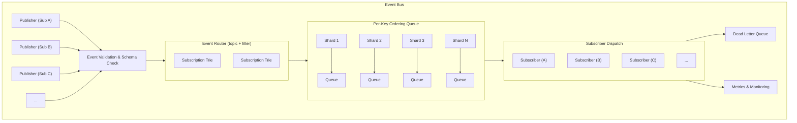
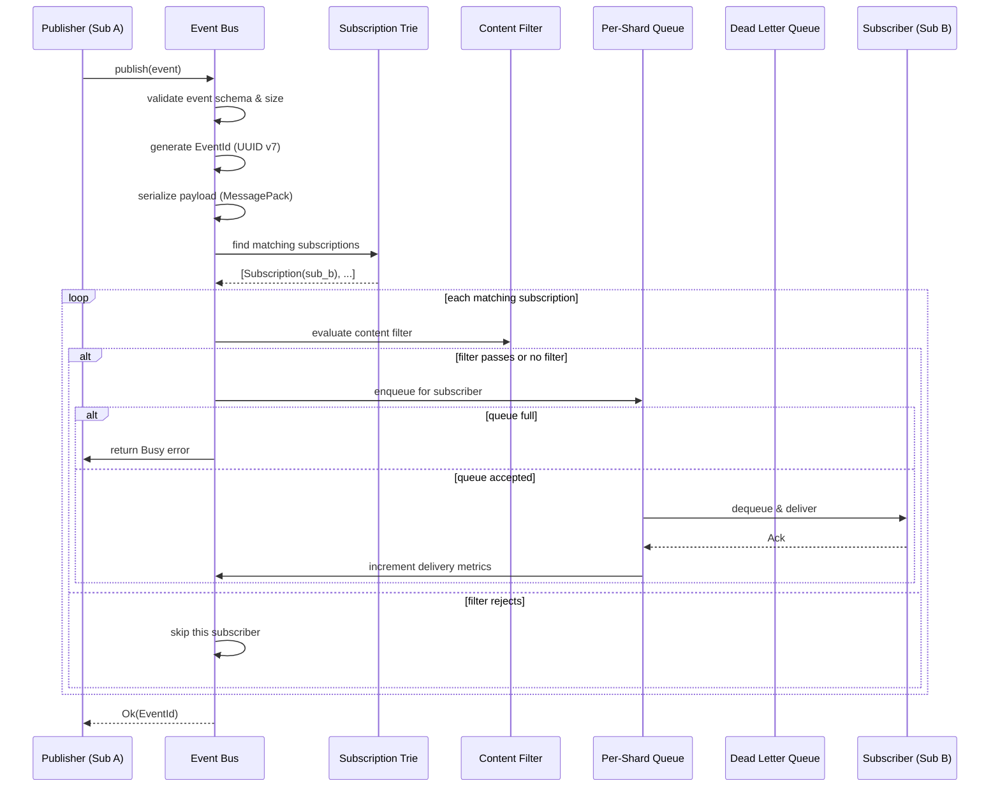
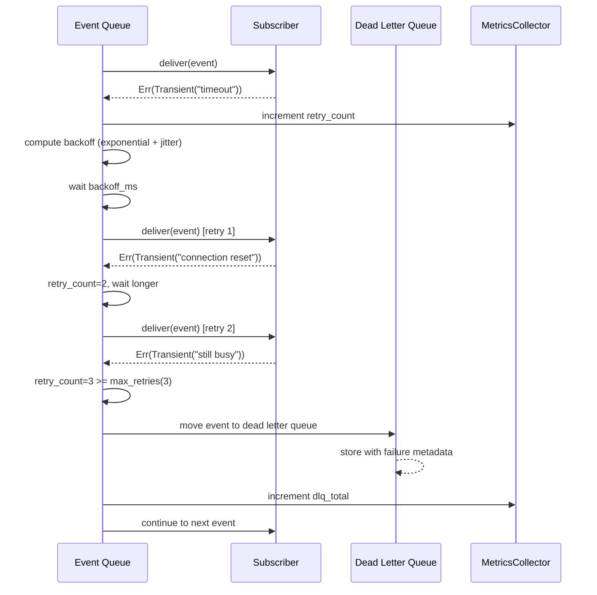
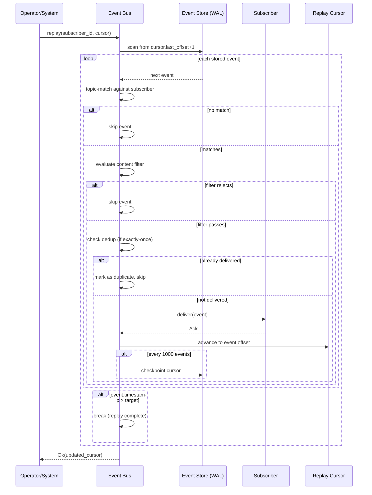
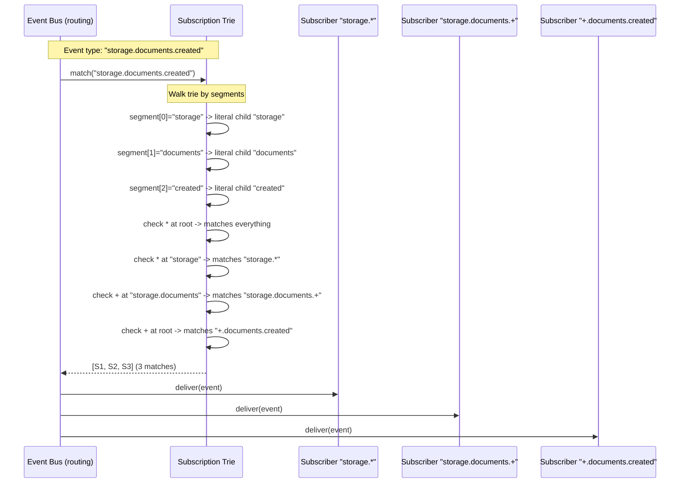
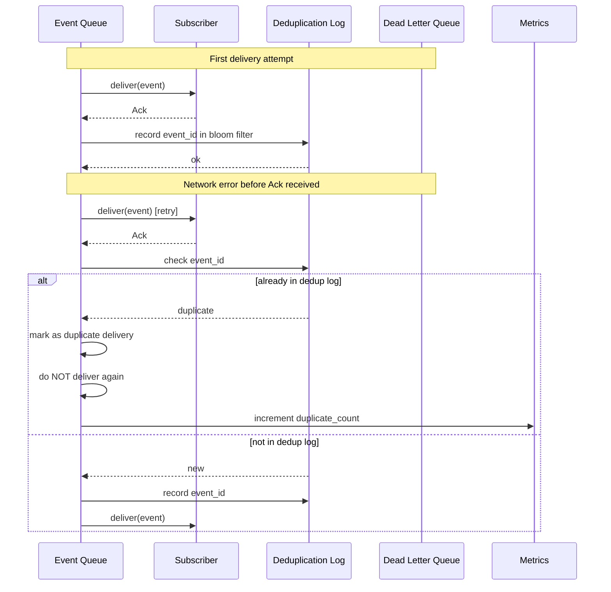

# 11. Event System

## 1. Purpose

The Event System provides the internal publish-subscribe event bus that enables loosely coupled communication between all Nova Runtime subsystems. It is the implementation of the "One Event Model" core principle — every state change, every lifecycle transition, every cross-subsystem notification flows through a single, unified event infrastructure. The Event System ensures that subsystems (Storage Engine, Execution Engine, Queue, Scheduler, Search, Authentication, API Runtime) can communicate without direct dependencies, enabling modularity, observability, and replayability.

## 2. Scope

This document covers the complete internal event subsystem: event structure and lifecycle, publisher and subscriber interfaces, subscription patterns (topic-based and content-based), delivery guarantees, backpressure mechanisms, event ordering, filtering, dead letter queue, retention policies, event replay, serialization format, and the integration points with every subsystem. This document does NOT cover external webhook delivery (covered in REST API doc), business-level event sourcing (covered in Application doc), or cluster-wide event replication (future work).

## 3. Responsibilities

- Provide a high-throughput, low-latency internal event bus
- Define and enforce the unified event structure
- Manage event subscriptions (topic, content-based, wildcard)
- Guarantee delivery ordering per key
- Implement backpressure with bounded queues and rejection
- Maintain dead letter queue for failed deliveries
- Enforce event retention policies (time-based, size-based)
- Provide event replay capability for recovery and catch-up
- Integrate with the Execution Engine for event-driven processing
- Expose metrics for monitoring (publish rate, delivery rate, queue depth, lag)
- Support distributed trace context propagation across events
- Validate event schemas at publish time

## 4. Non Responsibilities

- External webhook delivery or fan-out to external systems
- Cross-cluster event replication (future distributed mode)
- Business-level event sourcing (application responsibility using the Event System)
- Long-term event archival (delegated to Blob Storage)
- Event schema registry management (embedded in Object Model)
- Durable event storage across restarts (WAL-based durability is Storage Engine responsibility)
- Direct message broker functionality for external clients (use Queue subsystem)

## 5. Architecture



### 5.1 Core Components

**Event Bus**: Central singleton that coordinates event flow. Owns subscription registry, routing logic, backpressure management, and metrics collection.

**Publisher**: Any subsystem component that emits events. Publishes through the Event Bus interface. Does NOT have direct knowledge of subscribers.

**Subscriber**: Any subsystem component that consumes events. Registers interest via topics with optional content filters.

**Subscription Trie**: A trie-based data structure for O(k) topic matching (k = topic segment count). Supports exact match, wildcard single-segment (+), and wildcard multi-segment (*).

**Per-Key Ordering Queue**: A sharded set of FIFO queues, one per ordering key hash. Ensures events with the same key are delivered in publication order. Events without a key are unordered (any shard).

**Dead Letter Queue**: A bounded, persistent queue for events that failed delivery after maximum retries. Persisted via Storage Engine.

### 5.2 Integration with Execution Engine

Every event publication passes through the Execution Engine pipeline (see doc 10). The Execution Engine wraps event publication with its lifecycle hooks (before_publish, after_publish, on_publish_error). This ensures:

1. All event publications are observable by the Execution Engine
2. Events can be intercepted, transformed, or rejected by middleware
3. Event publication is included in execution traces
4. Event-driven processing chains are visible end-to-end

## 6. Data Structures

### 6.1 Event

```rust
/// Unique event identifier (UUID v7 — time-sortable)
struct EventId {
    value: [u8; 16],         // 16 bytes — UUID v7 binary
}

impl EventId {
    fn new() -> Self;         // Generates UUID v7 with current timestamp
    fn timestamp(&self) -> u64; // Extracts embedded Unix millisecond timestamp
    fn from_bytes(bytes: [u8; 16]) -> Self;
    fn to_bytes(&self) -> [u8; 16];
}

/// Event type identifier — hierarchical dotted string
/// Examples: "storage.document.created", "auth.user.login", "queue.task.completed"
struct EventType {
    segments: Vec<String>,    // Split on '.', e.g., ["storage", "document", "created"]
    canonical: String,        // Full dotted string cache
}

impl EventType {
    fn new(canonical: &str) -> Result<Self, ValidationError>;
    fn segment(&self, n: usize) -> Option<&str>;
    fn depth(&self) -> usize;
    fn matches(&self, pattern: &TopicPattern) -> bool;
}

/// Source identifier — which subsystem/component published the event
struct EventSource {
    subsystem: Subsystem,     // enum: Storage, Execution, Auth, Queue, Scheduler, Search, Blob, Api
    component: String,        // e.g., "wal", "compactor", "session_manager"
    node_id: String,          // Local node identifier
    instance_id: String,      // Unique instance boot identifier
}

/// Trace context for distributed tracing propagation
struct TraceContext {
    trace_id: [u8; 16],       // 16 bytes
    span_id: [u8; 8],         // 8 bytes
    parent_span_id: Option<[u8; 8]>,  // 8 bytes, None for root spans
    sampled: bool,            // Whether this trace should be sampled
    baggage: HashMap<String, String>, // Key-value baggage items
}

/// Event metadata — system-level fields, not application data
struct EventMetadata {
    event_id: EventId,
    event_type: EventType,
    source: EventSource,
    trace_context: TraceContext,
    timestamp: u64,                // Unix milliseconds, from EventId or overridden
    ordering_key: Option<String>,  // Key for per-key ordering; None = no ordering
    content_type: String,          // MIME type of payload: "application/x-msgpack"
    payload_size: u32,             // Pre-serialized payload size in bytes
    ttl_ms: u64,                   // Time-to-live in milliseconds from timestamp
    priority: EventPriority,       // Low, Normal, High, Critical
    persistent: bool,              // Whether to persist via WAL for replay
    schema_version: u32,           // Payload schema version number
}

enum EventPriority {
    Low = 0,
    Normal = 1,
    High = 2,
    Critical = 3,
}

/// Complete event structure
struct Event {
    metadata: EventMetadata,
    payload: Vec<u8>,             // MessagePack-encoded bytes
}

/// Total minimum overhead: ~196 bytes (metadata) + payload
/// Target maximum payload: 64 KB (before serialization)
/// Absolute maximum payload: 16 MB (configurable via server config)
```

### 6.2 Subscription

```rust
/// Topic subscription pattern
/// Supports:
///   "storage.documents.*"        — all storage documents events
///   "storage.documents.+"        — immediate child only
///   "auth.*.login"               — any auth subsystem login
///   "*"                          — all events (subscribe to everything)
struct TopicPattern {
    segments: Vec<PatternSegment>,  // Parsed segments
    canonical: String,
}

enum PatternSegment {
    Literal(String),    // Exact match: "documents"
    SingleWildcard,     // Single level: "+"
    MultiWildcard,      // Multi level: "*"
}

impl TopicPattern {
    fn new(pattern: &str) -> Result<Self, InvalidPatternError>;
    fn matches(&self, event_type: &EventType) -> bool;
}

/// Content filter predicate — optional filter applied after topic match
struct ContentFilter {
    expression: FilterExpr,   // AST of filter expression
}

enum FilterExpr {
    FieldEquals { field: Vec<String>, value: Value },
    FieldExists { field: Vec<String> },
    FieldMatches { field: Vec<String>, regex: String },
    FieldIn { field: Vec<String>, values: Vec<Value> },
    FieldRange { field: Vec<String>, min: Value, max: Value },
    Not(Box<FilterExpr>),
    And(Vec<FilterExpr>),
    Or(Vec<FilterExpr>),
}

/// Delivery guarantee for a subscription
enum DeliveryGuarantee {
    AtMostOnce,     // Fire and forget, no retry
    AtLeastOnce,    // Retry on failure, ack required, may duplicate
    ExactlyOnce,    // At-least-once + deduplication on subscriber side
}

/// Subscriber identity
struct SubscriberId {
    id: String,               // Unique identifier
    subsystem: Subsystem,
    name: String,             // Human-readable name for debugging
}

/// Subscription registration
struct Subscription {
    id: Uuid,
    subscriber: SubscriberId,
    topic: TopicPattern,
    content_filter: Option<ContentFilter>,
    delivery_guarantee: DeliveryGuarantee,
    max_retries: u32,              // 0 for AtMostOnce, configurable for AtLeastOnce
    retry_backoff_ms: u64,         // Base backoff in ms (exponential: base * 2^attempt)
    max_backoff_ms: u64,           // Cap on backoff
    queue_capacity: usize,         // Subscriber's input queue capacity
    created_at: u64,               // Unix milliseconds
    active: bool,
    consumer_group: Option<String>, // For competing consumer pattern
}
```

### 6.3 Queue Structures

```rust
/// Bounded queue for an event shard
struct EventQueue {
    shard_id: u16,                          // 0..65535
    buffer: RingBuffer<Event>,              // Lock-free ring buffer
    capacity: usize,                        // Fixed capacity (configurable)
    overflow_policy: OverflowPolicy,
    metrics: QueueMetrics,
}

enum OverflowPolicy {
    DropNewest,       // Drop newest event (acceptable for AtMostOnce)
    DropOldest,       // Drop oldest unprocessed event
    RejectPublisher,  // Backpressure: return error to publisher (recommended default)
    BlockPublisher,   // Block publisher until space available (dangerous)
}

struct QueueMetrics {
    enqueued: AtomicU64,
    dequeued: AtomicU64,
    dropped: AtomicU64,
    rejected: AtomicU64,
    current_depth: AtomicUsize,
    max_depth: AtomicUsize,
}

/// Dead letter entry
struct DeadLetterEntry {
    event: Event,                     // Original event
    failed_subscriber: SubscriberId,  // Which subscriber failed
    failure_reason: String,           // Error message
    failure_timestamp: u64,           // When it failed
    retry_count: u32,                 // How many times it was retried
    last_error: String,               // Last error detail
}
```

### 6.4 Event Store (for persistent events)

```rust
/// Persisted event record for replay
struct StoredEvent {
    offset: u64,                  // Monotonically increasing offset in store
    event_id: EventId,
    event_type: EventType,
    timestamp: u64,
    ordering_key: Option<String>,
    payload: Vec<u8>,              // Serialized event bytes
    trace_context: [u8; 40],       // Fixed-size trace context (or empty)
}

/// Replay cursor — position in event stream for catch-up
struct ReplayCursor {
    subscriber_id: SubscriberId,
    last_processed_offset: u64,
    last_processed_timestamp: u64,
    target_timestamp: Option<u64>, // Replay up to this time (None = replay all)
}
```

### 6.5 Wire Format (MessagePack)

```rust
// MessagePack serialization schema for Event:
//
// map(8) {
//   "v": uint 1,                 // format version
//   "id": binary 16,             // UUID v7 bytes
//   "t": string,                 // event type dotted
//   "s": map(2) {                // source
//     "s": int,                  // subsystem enum
//     "c": string,               // component name
//   },
//   "ts": uint,                  // timestamp ms
//   "k": string / nil,           // ordering key
//   "tr": binary 40 / nil,       // trace context (16+8+8+8 bytes)
//   "p": binary,                 // payload bytes
// }
//
// Typical wire size: ~64 bytes overhead + payload
// Maximum wire size: 16 MB + 256 bytes overhead
```

## 7. Algorithms

### 7.1 Event Publication

```
Algorithm: PublishEvent

Input:
  event: Event (partially constructed, metadata not yet filled)
  bus: EventBus

Output:
  Result<EventId, PublishError>

Steps:
  1. Validate event:
     a. Check payload_size <= max_payload_size (default 64KB, configurable to 16MB)
     b. Validate event_type matches registered schema (if schema validation enabled)
     c. Check event_type is not empty and has at least 2 segments
  2. Assign event_id:
     a. Generate UUID v7 (time-sortable unique identifier)
     b. Set metadata.event_id = event_id
     c. Set metadata.timestamp = event_id.timestamp() if not explicitly set
  3. Execute pre-publish hooks (Execution Engine middleware):
     a. For each registered middleware:
        - Call before_publish(event)
        - If middleware returns Reject(PublishError), abort and return error
        - If middleware transforms event, use transformed version
  4. Serialize event:
     a. Encode metadata + payload using MessagePack
     b. Verify serialized size within limits
  5. Route event:
     a. Query subscription trie for matching subscriptions:
        - Walk trie by event_type segments
        - Collect all exact matches, single-wildcard matches, multi-wildcard matches
        - For multi-wildcard matches, check remaining segments recursively
     b. For each matching subscription with content_filter:
        - Evaluate filter against event payload
        - Skip if filter rejects
     c. For each passing subscription:
        - Determine target shard (if ordering_key present: hash(ordering_key) % N_SHARDS;
          otherwise: random shard)
        - Attempt to enqueue into subscriber's per-shard EventQueue
  6. Handle queue overflow:
     a. If queue is full:
        - If OverflowPolicy == RejectPublisher:
          - Return error Busy(error) to publisher
          - Increment rejected counter
        - If OverflowPolicy == DropNewest:
          - Drop current event, return Ok
        - If OverflowPolicy == DropOldest:
          - Dequeue oldest, drop it, enqueue current
        - If OverflowPolicy == BlockPublisher:
          - Block until space available (with timeout)
  7. If event.metadata.persistent == true:
     a. Write event to EventStore (WAL-backed)
     b. On write failure: set event.metadata.persistent = false
        (best-effort persistence, do not fail publication)
  8. Execute post-publish hooks:
     a. For each registered middleware:
        - Call after_publish(event)
  9. Return Ok(event_id)

Complexity:
  - Validation: O(s) where s = payload size (schema validation may add O(s) for parsing)
  - Routing: O(k + m) where k = event_type segment count, m = matched subscriptions
  - Filter evaluation: O(f + p) where f = filter complexity, p = payload parse cost
  - Enqueue: O(1) (lock-free ring buffer push)
  - Total: O(s + k + m + f + p) — dominated by serialization for large payloads
```

### 7.2 Subscription Matching (Trie)

```
Algorithm: FindMatchingSubscriptions

Data Structure: SubscriptionTrie
  - Root node has children map: HashMap<String, TrieNode>
  - Each TrieNode:
    - literal_children: HashMap<String, TrieNode>   // exact segment match
    - single_wildcard: Option<Box<TrieNode>>         // "+" match
    - multi_wildcard: Option<Box<TrieNode>>          // "*" match — captures remainder
    - subscriptions_at_this_node: Vec<Subscription>  // subscriptions registered here

Algorithm: MatchEventType(event_type: EventType) -> Vec<Subscription>

Function match_recursive(node, segment_index):
  result = Vec<Subscription>
  
  // Include any subscriptions registered at "*" from ancestor matches
  if node.multi_wildcard is Some:
    result.extend(node.multi_wildcard.subscriptions_at_this_node)
    // "*" consumes all remaining, so add all "*" subscribers at this node
  
  // Base case: no more segments
  if segment_index >= event_type.segments.len():
    result.extend(node.subscriptions_at_this_node)
    return result
  
  segment = event_type.segments[segment_index]
  
  // Try literal match
  if node.literal_children.contains(segment):
    result.extend(match_recursive(node.literal_children[segment], segment_index + 1))
  
  // Try single wildcard "+"
  if node.single_wildcard is Some:
    result.extend(match_recursive(node.single_wildcard, segment_index + 1))
  
  // Try multi-wildcard "*" — matches this and all remaining segments
  if node.multi_wildcard is Some:
    result.extend(node.multi_wildcard.subscriptions_at_this_node)
    // Also try matching remaining segments against "*"'s children
    result.extend(match_recursive(node.multi_wildcard, segment_index + 1))
    // But also: if "*" is registered as subscriber, it matched (already added above)
  
  return result

Complexity: O(k + m) worst case
  - k = number of segments in event_type (trie depth)
  - m = total number of matching subscriptions returned
  - Worst case: "*" subscription matches everything, returns all subscriptions
  
Note: Subscription trie is read-optimized. Writes (register/unregister) are OOP = O(k)
  and use read-write lock. Reads use RCU (Read-Copy-Update) for lock-free reads.
```

### 7.3 Per-Key Ordering

```
Algorithm: ShardSelection

Input:
  ordering_key: Option<String>
  shard_count: u16 (power of 2, default 64)

Output:
  shard_id: u16 (0..shard_count-1)

Steps:
  1. If ordering_key is None:
     a. Return fast_random() % shard_count
  2. Compute hash = SHA3-256(ordering_key.bytes())
     Note: SHA3-256 chosen over faster hashes to guarantee
     distribution uniformity and avoid collision attacks
  3. shard_id = (hash[0..2] as u16) % shard_count
  4. Return shard_id

Guarantee:
  - Events with same ordering_key always map to same shard
  - Single consumer goroutine per shard processes events sequentially
  - Within a shard, events are delivered in FIFO order
  - No ordering guarantee across different ordering_keys

Shard count: Fixed at startup, power of 2
  - Default: 64
  - Minimum: 1 (no ordering, all events unordered)
  - Maximum: 4096 (limited by memory: each shard queue has capacity)
```

### 7.4 Delivery with Retry (AtLeastOnce)

```
Algorithm: DeliverEvents(subscriber_id, shard_id)

Runs in a dedicated async task per (subscriber, shard) pair.

Steps:
  Loop:
    1. Dequeue event from subscriber's EventQueue[shard_id]
       - Block until event available or shutdown signal
    2. Set retry_count = 0
    3. Loop (retry):
       a. Call subscriber.handle(event)
       b. If handle returns Ok(Ack):
          - Break retry loop (success)
       c. If handle returns Ok(Nack):
          - Event is rejected by subscriber (not a transient error)
          - Move event to DeadLetterQueue
          - Break retry loop
       d. If handle returns Err(transient):
          - retry_count += 1
          - If retry_count > subscription.max_retries:
            - Move event to DeadLetterQueue
            - Break retry loop
          - Compute backoff = min(
              subscription.retry_backoff_ms * 2^retry_count,
              subscription.max_backoff_ms
            )
          - Add jitter: backoff *= random(0.5, 1.5)
          - Sleep for backoff duration
          - Continue retry loop
       e. If handle returns Err(fatal):
          - Move event to DeadLetterQueue
          - Break retry loop
    4. If subscription.delivery_guarantee == ExactlyOnce:
       a. Record event_id in deduplication log (bounded bloom filter)
       b. Trim deduplication log periodically

Complexity:
  - Happy path: O(1) dequeue + O(p) handler execution (p = processing time)
  - Retry path: O(r * p) where r = retry count
  - Memory: O(capacity) per subscriber queue
```

### 7.5 Event Replay

```
Algorithm: ReplayEvents

Input:
  subscriber: SubscriberId
  cursor: ReplayCursor
  bus: EventBus

Output:
  Result<ReplayCursor, ReplayError>

Steps:
  1. Validate cursor:
     a. Check subscriber exists and is active
     b. If cursor.last_processed_offset == 0, start from earliest available
  2. Open EventStore scan from cursor.last_processed_offset + 1:
     a. Read sequentially from WAL-backed event log
     b. Apply rate limiting: max 10,000 events per second per subscriber
  3. For each stored event:
     a. If event.timestamp > cursor.target_timestamp (if set):
        - Break (replay complete)
     b. Topic-match against subscriber's subscription
     c. If no match, skip
     d. Evaluate content filter if present
     e. If filter rejects, skip
     f. If exactly-once delivery:
        - Check deduplication log for event_id
        - If already delivered, skip (mark as duplicate in metrics)
     g. Deliver event to subscriber handler:
        - Use same retry/dead-letter logic as normal delivery
     h. Advance cursor to event.offset
     i. Periodically checkpoint cursor to storage (every 1000 events)
  4. Return updated cursor

Use cases:
  - Recovery after subscriber crash
  - New subscriber catching up to current state
  - Re-indexing search after schema change
  - Regenerating cache after corruptio
  - Debugging by replaying events to a debug subscriber

Performance characteristics:
  - Sequential scan: O(n) where n = events scanned
  - Rate-limited: max 10K events/sec/subscriber (configurable)
  - Checkpoint granularity: 1000 events (configurable)
  - Memory: O(1) stream processing
```

### 7.6 Dead Letter Queue Processing

```
Algorithm: DeadLetterProcessing

DeadLetterQueue is a persistent bounded queue (max 100,000 entries).
Each entry has:
  - event (serialized)
  - subscriber_id
  - failure_reason
  - failure_timestamp
  - retry_count
  - last_error

Operations:

PUT(dlq_entry):
  1. If DLQ size >= max_entries (100,000):
     a. Remove oldest 10% of entries (10,000 entries)
     b. Log warning: "DLQ at capacity, dropping oldest entries"
  2. Write entry to DLQ storage (WAL-backed)

GET(limit=100):
  1. Query DLQ for entries ordered by failure_timestamp ASC
  2. Return up to `limit` entries

RETRY(dlq_entry_id):
  1. Load entry from DLQ
  2. Create new delivery task for the stored event
  3. Use same retry logic as fresh event
  4. If successful, remove from DLQ
  5. If fails again, update retry_count and failure_timestamp in DLQ entry

DELETE(dlq_entry_id):
  1. Remove entry from DLQ storage
  2. Log administrative action to audit log

DLQ monitoring:
  - Alert when DLQ size > 10,000 (configurable threshold)
  - Alert when any single subscriber has > 1,000 entries
  - Expose DLQ metrics: size, oldest_entry_age, per-subscriber count
```

### 7.7 Content Filter Evaluation

```
Algorithm: EvaluateFilter(filter: ContentFilter, payload: Value) -> bool

Function eval(expr: FilterExpr, payload: Value) -> bool:
  match expr:
    FieldEquals { field, value }:
      actual = get_field(payload, field)  // navigate nested fields
      return actual == value
    
    FieldExists { field }:
      return get_field(payload, field) is not None
    
    FieldMatches { field, regex }:
      actual = get_field(payload, field)
      if actual is String:
        return regex_match(regex, actual)
      return false
    
    FieldIn { field, values }:
      actual = get_field(payload, field)
      return actual in values
    
    FieldRange { field, min, max }:
      actual = get_field(payload, field)
      return actual >= min AND actual <= max
    
    Not(inner):
      return NOT eval(inner, payload)
    
    And(children):
      for child in children:
        if NOT eval(child, payload):
          return false
      return true
    
    Or(children):
      for child in children:
        if eval(child, payload):
          return true
      return false

Performance:
  - Filter evaluation requires deserializing payload from MessagePack
  - Deserialization is O(p) where p = payload size
  - Filter expression evaluation is O(f) where f = expression complexity
  - Filters with regex are significantly more expensive
  - Content filters are evaluated AFTER topic match (topic match is cheaper)
```

## 8. Interfaces

### 8.1 EventBus Public API

```rust
trait EventBus: Send + Sync {
    /// Publish an event to the bus
    /// Returns the assigned EventId on success
    /// Errors: PayloadTooLarge, Busy (backpressure), InvalidEventType, ValidationError
    fn publish(&self, event: Event) -> Result<EventId, PublishError>;

    /// Publish with explicit ordering key
    fn publish_with_key(&self, event: Event, ordering_key: &str) -> Result<EventId, PublishError>;

    /// Create a typed event builder for safe event construction
    fn event(&self, event_type: &str) -> EventBuilder;

    /// Register a subscriber
    /// Returns subscription ID for management
    fn subscribe(&self, subscription: Subscription) -> Result<Uuid, SubscribeError>;

    /// Unregister a subscriber by ID
    fn unsubscribe(&self, subscription_id: Uuid) -> Result<(), UnsubscribeError>;

    /// Pause delivery to a subscriber (events queue but are not delivered)
    fn pause_subscriber(&self, subscription_id: Uuid) -> Result<(), PauseError>;

    /// Resume delivery to a paused subscriber
    fn resume_subscriber(&self, subscription_id: Uuid) -> Result<(), ResumeError>;

    /// Get current bus metrics snapshot
    fn metrics(&self) -> BusMetrics;

    /// Replay events for a subscriber from a cursor
    fn replay(&self, subscriber_id: SubscriberId, cursor: ReplayCursor) -> Result<ReplayCursor, ReplayError>;

    /// Get dead letter queue entries
    fn dlq_entries(&self, limit: u32, offset: u32) -> Result<Vec<DeadLetterEntry>, DlqError>;

    /// Retry a dead letter entry
    fn dlq_retry(&self, entry_id: Uuid) -> Result<(), DlqError>;

    /// Delete a dead letter entry
    fn dlq_delete(&self, entry_id: Uuid) -> Result<(), DlqError>;

    /// Register middleware (for Execution Engine integration)
    fn register_middleware(&self, middleware: Box<dyn EventMiddleware>) -> Result<(), MiddlewareError>;
}

/// Event builder for type-safe event construction
struct EventBuilder {
    bus: Weak<dyn EventBus>,
    event_type: EventType,
    source: EventSource,
    ordering_key: Option<String>,
    ttl_ms: u64,
    priority: EventPriority,
    persistent: bool,
    content_type: String,
    schema_version: u32,
}

impl EventBuilder {
    fn source(mut self, subsystem: Subsystem, component: &str) -> Self;
    fn ordering_key(mut self, key: &str) -> Self;
    fn ttl(mut self, ttl_ms: u64) -> Self;
    fn priority(mut self, priority: EventPriority) -> Self;
    fn persistent(mut self, persistent: bool) -> Self;
    fn schema_version(mut self, version: u32) -> Self;

    /// Build and publish the event
    fn publish<T: Serialize>(self, payload: &T) -> Result<EventId, PublishError>;
}
```

### 8.2 Subscriber Interface

```rust
trait EventSubscriber: Send + Sync {
    /// Return the subscriber's unique identity
    fn id(&self) -> SubscriberId;

    /// Return the topic pattern to subscribe to
    fn topic(&self) -> TopicPattern;

    /// Return optional content filter
    fn content_filter(&self) -> Option<ContentFilter> { None }

    /// Return delivery guarantee
    fn delivery_guarantee(&self) -> DeliveryGuarantee { DeliveryGuarantee::AtLeastOnce }

    /// Return max retries (0 = no retry)
    fn max_retries(&self) -> u32 { 3 }

    /// Handle a delivered event
    /// Return Ok(Ack) on successful processing
    /// Return Ok(Nack) if event is invalid and should be dead-lettered
    /// Return Err(transient) to trigger retry
    /// Return Err(fatal) to trigger dead-letter immediately
    fn handle(&self, event: Event) -> Result<DeliveryDecision, DeliveryError>;
}

enum DeliveryDecision {
    Ack,
    Nack,   // Reject permanently (dead letter)
}

/// Optional hook for subscriber lifecycle
trait EventSubscriberLifecycle: EventSubscriber {
    /// Called when subscription is registered
    fn on_subscribe(&self, subscription_id: Uuid);

    /// Called when subscription is unregistered
    fn on_unsubscribe(&self);

    /// Called when subscriber is paused
    fn on_pause(&self);

    /// Called when subscriber is resumed
    fn on_resume(&self);
}
```

### 8.3 Middleware Interface

```rust
trait EventMiddleware: Send + Sync {
    /// Called before event is published to subscribers
    /// Return Ok(()) to continue
    /// Return Err(Reject(error)) to abort publication
    /// Return Ok(()) after modifying event in-place
    fn before_publish(&self, event: &mut Event) -> Result<(), MiddlewareAction>;

    /// Called after event has been enqueued to all subscribers
    fn after_publish(&self, event: &Event, result: &Result<EventId, PublishError>);

    /// Called when a subscriber fails to process an event
    fn on_delivery_failure(&self, event: &Event, subscriber: &SubscriberId, error: &DeliveryError);
}

enum MiddlewareAction {
    Continue,
    Reject(PublishError),
    Transform,  // Event was modified
}
```

### 8.4 Error Types

```rust
enum PublishError {
    PayloadTooLarge { size: u32, max: u32 },      // Payload exceeds maximum
    InvalidEventType { reason: String },            // Malformed event type string
    ValidationError { field: String, reason: String }, // Schema validation failure
    Busy { reason: String },                        // Backpressure rejection
    ShuttingDown,                                   // System is shutting down
    Internal(String),                               // Unexpected internal error
}

enum SubscribeError {
    InvalidPattern { reason: String },              // Malformed topic pattern
    DuplicateSubscription,                          // Already registered
    InvalidSubscriber,                              // Subscriber validation failed
    Internal(String),
}

enum DeliveryError {
    Transient(String),    // Retryable error (e.g., network timeout, resource contention)
    Fatal(String),        // Non-retryable error (e.g., deserialization failure, invalid state)
}

enum ReplayError {
    SubscriberNotFound,
    InvalidCursor,
    EventStoreUnavailable,
    Cancelled,
    Internal(String),
}
```

### 8.5 Metrics

```rust
struct BusMetrics {
    // Publication metrics
    events_published_total: u64,         // Total events published
    events_published_by_type: HashMap<String, u64>, // Per-type counts
    publish_errors_total: u64,           // Total publish failures
    publish_latency_p50: f64,            // P50 latency in microseconds
    publish_latency_p99: f64,            // P99 latency in microseconds
    payload_bytes_total: u64,            // Total payload bytes published

    // Delivery metrics
    events_delivered_total: u64,         // Total events delivered
    events_acked_total: u64,             // Total successful deliveries
    events_nacked_total: u64,            // Total rejected by subscriber
    events_dlq_total: u64,               // Total dead-lettered
    delivery_retries_total: u64,         // Total retry attempts
    delivery_latency_p50: f64,           // Subscriber delivery latency P50
    delivery_latency_p99: f64,           // Subscriber delivery latency P99

    // Queue metrics
    queue_depth_total: usize,            // Total events in all queues
    queue_depth_by_subscriber: HashMap<String, usize>, // Per-subscriber depth
    queue_rejected_total: u64,           // Total rejections due to full queues
    queue_dropped_total: u64,            // Total events dropped (overflow)

    // Subscription metrics
    active_subscriptions: u32,           // Current active subscription count
    paused_subscriptions: u32,           // Currently paused subscriptions
    subscriber_count: u32,               // Unique subscriber count

    // Replay metrics
    replay_events_total: u64,
    replay_active_count: u32,

    // DLQ metrics
    dlq_size: u32,
    dlq_oldest_entry_age_secs: f64,
}
```

## 9. Sequence Diagrams

### 9.1 Basic Event Publication and Delivery



### 9.2 Delivery Failure and Retry



### 9.3 Event Replay



### 9.4 Wildcard Subscription Matching



### 9.5 Exactly-Once Delivery Deduplication



## 10. Failure Modes

### 10.1 Queue Overflow (Backpressure)

| Cause | Effect | Detection |
|-------|--------|-----------|
| Subscriber processing slower than publish rate | Subscriber queue fills up | Queue depth metric, rejection rate increase |
| Subscriber deadlock / hang | All subscriber queues fill up | No delivery acknowledgments, queue depth at capacity |
| Publish storm (10x+ normal rate) | Multiple subscriber queues fill up | Publish rate spike, rejection rate spike |

**Impact**: Publisher receives `Busy` error. Events may be dropped (depending on OverflowPolicy). Cascading failures if publisher doesn't handle rejection gracefully.

### 10.2 Subscriber Crash

| Cause | Effect | Detection |
|-------|--------|-----------|
| Panic in subscriber handle() | Events queue but aren't consumed | Queue depth grows, no Acks, last ack timestamp stale |
| Subscriber process terminated | Same as above | Health check failure, queue depth growth |

**Impact**: Events accumulate in subscriber queue. If queue capacity exceeded, backpressure propagates to publishers. Dead letter threshold may trigger.

### 10.3 Event Store Write Failure

| Cause | Effect | Detection |
|-------|--------|-----------|
| Storage Engine unavailable | Persistent events cannot be written | publish() returns error |
| Disk full | Event store write fails | Write error, storage engine alert |
| WAL corruption | Event store unreadable | Recovery failure, consistency check error |

**Impact**: Non-persistent events continue to flow. Persistent events either fail to publish or degrade to non-persistent (best-effort). Replay capability compromised.

### 10.4 Subscription Trie Corruption

| Cause | Effect | Detection |
|-------|--------|-----------|
| Race condition during concurrent register/unregister | Missing subscribers, events routed incorrectly | Event count mismatch, subscribers not receiving events |
| Memory corruption | Trie returns wrong results | Chaos monkey, watchdog assertions |

**Impact**: Events delivered to wrong subscribers or not delivered at all. Very difficult to detect in production.

### 10.5 Dead Letter Queue Full

| Cause | Effect | Detection |
|-------|--------|-----------|
| Sustained subscriber failures | DLQ exceeds capacity | DLQ size metric, alert |
| Misconfigured subscription | All events fail delivery | DLQ growth rate alert |

**Impact**: Oldest DLQ entries are dropped (FIFO eviction). Events lost permanently without manual intervention.

### 10.6 Ordering Key Collision

| Cause | Effect | Detection |
|-------|--------|-----------|
| Hash collision on different ordering keys | Events for different keys processed sequentially | Hard to detect, may appear as increased latency for low-volume keys |
| Insufficient shard count | Too many keys map to same shard | Uneven shard depth metrics |

**Impact**: Processing concurrency lower than expected for some keys. No correctness impact (ordering guarantee still holds within shard).

### 10.7 Event Serialization Failure

| Cause | Effect | Detection |
|-------|--------|-----------|
| Payload contains non-serializable types | publish() returns error | Serialization error in publish path |
| Schema version mismatch | Subscriber cannot deserialize payload | Deserialization error in subscriber handle() |

**Impact**: Publication fails. Delivery fails (event goes to DLQ). Schema evolution planning required.

### 10.8 Memory Exhaustion

| Cause | Effect | Detection |
|-------|--------|-----------|
| Large number of queued events | Memory usage grows | RSS metric, OOM risk |
| Subscriber queues at capacity with large payloads | Memory pressure | Queue depth x average payload size metric |
| Too many subscriptions registered | Subscription trie memory usage | Subscriber count metric |

**Impact**: System OOM if memory limits not enforced. Performance degradation under memory pressure. GC pressure in managed languages.

## 11. Recovery Strategy

### 11.1 Queue Overflow Recovery

1. **Immediate**: Backpressure causes publisher to receive `Busy` error. Publisher should back off with exponential backoff (100ms base, 5s max, jitter 0.5-1.5x).
2. **Short-term**: If subscriber is slow, increase subscriber capacity in configuration and restart subscriber. If subscriber is hung, restart subscriber process.
3. **Medium-term**: Auto-scale subscriber processing capacity (if supported). Increase queue capacity configuration.
4. **Long-term**: Monitor subscriber processing latency and set up alerting when P99 latency exceeds threshold (default: 1 second).

### 11.2 Subscriber Crash Recovery

1. **Detection**: Health check timeout (default: 30s without ack). Dead subscriber detector runs every 10 seconds.
2. **Action**: Unresponsive subscriber is paused automatically after 60 seconds of no activity. Events remain queued.
3. **Recovery**: When subscriber re-registers, it receives accumulated events from its queue. If subscriber was gone long enough and retention policy expired events, use replay to catch up.
4. **Cleanup**: If subscriber does not return within retention window, events are discarded. Admin must trigger replay if events are needed.

### 11.3 Event Store Recovery

1. **Write failure during publish**: Event is downgraded to non-persistent. publish() returns success (degraded mode). Warning logged. Metrics incremented.
2. **Event store corruption**: Trigger full WAL recovery (see Storage Engine doc). If WAL is unrecoverable, event store is rebuilt from last consistent checkpoint. Events between checkpoint and corruption are lost (acceptable for at-most-once, problematic for at-least-once).
3. **Disk space low**: Stop persisting events. Flush alert. Admin must free space or extend storage.

### 11.4 DLQ Recovery

1. **Monitor DLQ**: Alert when DLQ size > 10,000 or per-subscriber DLQ count > 1,000.
2. **Investigate**: Examine DLQ entries to identify root cause (subscriber bug, schema mismatch, invalid event).
3. **Repair options**:
   a. Fix subscriber bug, restart subscriber, retry DLQ entries via `dlq_retry`.
   b. If events are invalid, delete from DLQ via `dlq_delete`.
   c. If schema mismatch, deploy schema-compatible subscriber version, retry.
4. **Bulk retry**: Admin can retry all entries for a subscriber with rate limiting (100/sec max).

### 11.5 Data Plane Recovery after Total Failure

If the Event Bus itself crashes:
1. **On restart**: Event Bus reconstructs subscription trie from subscriber registrations (subscribers must re-register after startup).
2. **Non-persistent events**: Lost. Subscribers must reconcile state via other means.
3. **Persistent events**: Available via Event Store. Subscribers can trigger replay to catch up.
4. **In-flight events**: Events that were in queues but not yet delivered are lost. Subscribers should handle duplicates via idempotency or deduplication.

### 11.6 Ordering Recovery After Shard Reassignment

Currently not supported (single-node). Future distributed mode will require:
- Key-to-shard mapping must persist across restarts.
- Shard reassignment requires draining queue, flushing state, then migrating.
- During migration, events with same key may be temporarily out of order.

## 12. Performance Considerations

### 12.1 Throughput Targets

| Scenario | Target | Measurement |
|----------|--------|-------------|
| Small event (256B payload), no subscriber | 1,000,000 events/sec | Throughput of publish() |
| Small event, 1 subscriber | 500,000 events/sec | End-to-end from publish to ack |
| Medium event (4KB payload), 3 subscribers | 100,000 events/sec | End-to-end delivery |
| Large event (64KB payload), 1 subscriber | 10,000 events/sec | End-to-end delivery |
| Content filter on 4KB payload | 50,000 events/sec | Filter evaluation throughput |
| Event replay (4KB payload) | 10,000 events/sec | Replay throughput per subscriber |

### 12.2 Memory Budget

| Component | Memory | Calculation |
|-----------|--------|-------------|
| Event metadata overhead | 196 bytes x events in flight | Per-event struct in queue |
| Per-shard ring buffer | 64 KB x shard count | Default 64 x 64 KB = 4 MB |
| Per-subscriber queue | capacity x avg_event_size | Default 1024 x 64 KB = 64 MB |
| Subscription trie | ~200 bytes x subscription | 10,000 subscriptions = 2 MB |
| Content filters | variable | Filter AST size per subscription |
| Dead letter queue | entries x avg_event_size | 100,000 x 64 KB = 6.4 GB max |
| Buffer pool for serialization | 8 KB per worker thread | 8 threads x 8 KB = 64 KB |

**Default total memory budget**: ~256 MB for event system with 100 subscribers, 64 shards, average 4KB event.

### 12.3 CPU Budget

| Operation | CPU Cost | Per-event |
|-----------|----------|-----------|
| UUID v7 generation | ~100ns | 1x per publish |
| MessagePack serialization | ~50ns/byte | Payload-size dependent |
| Trie lookup (10 levels) | ~200ns | 1x per publish |
| Content filter evaluation | ~500ns + parse | 1x per matching subscription |
| Ring buffer enqueue | ~50ns (lock-free) | 1x per subscriber match |
| Ring buffer dequeue | ~50ns | 1x per delivery |

**CPU cost per event**: ~1μs + payload_serialization (small event, 1 subscriber)
**Maximum throughput**: ~1M events/sec/core (small events, simple routing)

### 12.4 Contention Points

1. **Subscription trie read-write lock**: Subscriber registration/unregistration acquires write lock. Event routing uses RCU for lock-free reads. Write contention is acceptable if registrations are infrequent (< 100/sec).
2. **Per-shard ring buffer head pointer**: Single producer, single consumer per shard. Lock-free with atomic head/tail. No contention.
3. **Metrics counters**: Atomic operations, low contention.
4. **Event Store writes**: Sequential WAL append. Contention only if Storage Engine is saturated.

### 12.5 Latency Budgets

| Operation | P50 Target | P99 Target | P999 Target |
|-----------|------------|------------|-------------|
| publish() | 10μs | 100μs | 1ms |
| Delivery to subscriber | 50μs | 500μs | 5ms |
| Content filter evaluation | 5μs | 50μs | 500μs |
| Full end-to-end (small event) | 100μs | 1ms | 10ms |

### 12.6 Optimization Strategies

1. **Zero-copy deserialization**: Subscribers that only read specific fields can use MessagePack zero-copy accessors instead of full deserialization.
2. **Batch delivery**: Group multiple events into batch delivery to reduce dispatch overhead (configurable: default 1, max 100).
3. **Pre-allocated buffers**: Ring buffers pre-allocate slots. No heap allocation in hot path.
4. **Payload pooling**: Large payloads (>4KB) use a slab allocator to reduce GC pressure.
5. **Shard affinity**: Pin shard consumer goroutines to specific CPU cores for cache locality.

## 13. Security

### 13.1 Threat Model

| Threat | Vector | Impact | Mitigation |
|--------|--------|--------|------------|
| Event injection | Malicious publisher publishes fake events | False state changes, data corruption | All publishers authenticated via Execution Engine; event types validated against schema registry |
| Event eavesdropping | Process memory dump | Sensitive data in payloads | Sensitive payloads encrypted; event bus runs in-process (no network exposure) |
| Denial of service | Rapid publish of many events | Queue overflow, resource exhaustion | Per-publisher rate limiting (token bucket, configurable); max publish rate per source |
| Subscription hijacking | Register malicious subscriber | Intercept sensitive events | Subscription registration requires auth token; subscriber identity verified by Execution Engine |
| Replay attack | Capture and replay persistent events | Duplicate processing, state corruption | Exactly-once deduplication; idempotency keys in payloads |
| Side-channel timing | Measure processing time per event type | Information disclosure | Constant-time operations for auth-related events (if applicable) |

### 13.2 Security Controls

1. **Event schema validation**: All events validated against registered schema. Reject events with unexpected fields or types.
2. **Payload size limits**: Enforce max payload size at publish boundary. Default: 64KB. Configurable up to 16MB.
3. **Rate limiting**: Per-source-subscriber rate limiting. Token bucket: 10,000 tokens/sec per source, burst 20,000.
4. **Audit logging**: All subscription registration/unregistration logged. DLQ administrative actions logged. Event publication volume above threshold logged.
5. **Memory safety**: All event data in safe Rust (or equivalent). No unsafe pointer manipulation in event paths.
6. **Secrets in payloads**: Event payloads should not contain secrets. If necessary, payload fields can be marked `sensitive` in schema — these fields are redacted in logs and trace context.

### 13.3 Secure Configuration

- Event system must be disabled by default if listening on external interfaces (in-process only by design).
- Authentication for subscription management (register/unregister) enforced through Execution Engine.
- Maximum subscription count: default 10,000, configurable.
- DLQ access restricted to admin role.

## 14. Testing

### 14.1 Unit Tests

| Test | Description | Coverage |
|------|-------------|----------|
| EventId generation | UUID v7 timestamp ordering, uniqueness | 10 test cases |
| Topic pattern parsing | Valid patterns, invalid patterns, edge cases | 25 test cases |
| Trie matching | Exact match, single wildcard, multi wildcard, combinations | 40 test cases |
| Content filter evaluation | All filter types, nested conditions, edge cases | 30 test cases |
| MessagePack serialization | Round-trip, size limits, field ordering | 20 test cases |
| Ring buffer operations | Push/pop, overflow, empty, concurrent access | 15 test cases |
| Delivery guarantee logic | AtMostOnce, AtLeastOnce, ExactlyOnce | 15 test cases |
| Backoff computation | Exponential, jitter range, max cap | 10 test cases |

### 14.2 Integration Tests

| Test | Description | Coverage |
|------|-------------|----------|
| Publish + single subscriber | Basic happy path | 1 event type, 1 subscriber |
| Publish + multiple subscribers | Fan-out to N subscribers | 5 subscribers, same topic |
| Publish + wildcard subscriber | Wildcard pattern matching | Multi-level wildcard |
| Publish + content filter | Filter-based subscription | 10 filter patterns |
| Backpressure test | Publisher faster than subscriber | Verify Busy errors returned |
| Dead letter flow | Retry exhaustion → DLQ | Verify DLQ entry created |
| DLQ retry | Retry from DLQ → successful delivery | Verify entry removed |
| Event replay | Replay from cursor | Verify all matching events delivered |
| Subscriber pause/resume | Pause → events queue → resume → events delivered | Verify no events lost |
| Exactly-once dedup | Duplicate delivery → deduplicated | Verify handler called once |

### 14.3 Property-Based Tests

| Property | Description | Random Inputs |
|----------|-------------|---------------|
| Event ordering per key | Events with same key delivered in order | Random ordering keys, random delays, concurrent publishers |
| No event duplication (exactly-once) | Each event delivered at most once to subscriber | Random retry scenarios, random failures |
| Content filter soundness | Filter matches exactly the set of events satisfying predicate | Random payloads, random filter expressions |
| Trie correctness | All matching subscribers receive event, no non-matching subscriber receives | Random event types, random subscriptions |
| Backpressure boundedness | Memory bounded by queue capacity regardless of publish rate | Maximum publish rate, minimum subscriber speed |
| DLQ capacity | DLQ never exceeds max entries | Continuous failures, max entries limit |

### 14.4 Chaos Tests

| Test | Description |
|------|-------------|
| Random subscriber crash | Kill subscriber process at random intervals during load |
| Publish surge | 100x normal publish rate for 10 seconds |
| Queue full cascade | Induce full queues on all subscribers simultaneously |
| Subscription trie corruption | Inject bad data into trie |
| Event Store failure | Simulate WAL write failure during sustained load |
| Memory pressure | Reduce available memory to 50% during operation |
| Concurrent register/unregister | Rapid subscription changes during high-throughput publish |

### 14.5 Edge Cases

| Edge Case | Expected Behavior |
|-----------|-------------------|
| Event type with 100 segments | Trie handles deep paths (performance: O(k)) |
| Empty payload | Published successfully, payload_size=0 |
| Maximum payload (16MB) | Published if configured, rejected otherwise |
| Ordering key with 10KB length | Hashed, no performance impact |
| 10,000 concurrent subscriptions | Trie handles 10K entries, memory ~2MB |
| Subscription pattern "a.*.b.*.c" | Multi-wildcard in multiple positions |
| Event TTL = 0 | Event expires immediately, never delivered |
| Priority inversion | High priority events promoted in queue |
| Subscriber that never acks | After timeout, retry until max, then DLQ |
| Event during shutdown | Best-effort delivery, remaining events persisted if persistent |

## 15. Future Work

1. **Cluster-wide event replication**: Replicate events across nodes for distributed operation. Requires consensus for ordering (Raft). Per-key ordering shards would map to Raft groups.
2. **Event sourcing framework**: Higher-level abstraction built on Event System for application-level event sourcing with snapshots and projection rebuilding.
3. **Event schema registry**: Formal schema registry with compatibility checking (backward, forward, full) and automatic schema versioning.
4. **Outbox pattern support**: Transactional outbox integration with Storage Engine — events published atomically with storage mutations.
5. **Delayed/delivery scheduled events**: Events published with a future delivery timestamp, stored until ready.
6. **Event compaction**: Log compaction for persistent event store — keep only latest event per key (key-value style).
7. **Priority queue**: True priority-based delivery where high-priority events bypass normal queues.
8. **Batch subscription**: Subscriber receives batches of events instead of single events for efficiency.
9. **Webhook bridge**: Automatic forwarding of matching events to external webhook endpoints.
10. **Event filtering at source**: Push-down of content filters to avoid unnecessary serialization for non-matching subscribers.

## 16. Open Questions

1. **Should persistent events be the default?** Currently persistent=false is default (best performance, no durability). For correctness-critical paths (auth decisions, storage mutations), persistent=true should be mandatory. Consider making persistent=true the default and requiring opt-out for performance-critical paths.

2. **How to handle backpressure across subsystems?** When Queue subsystem fills up, it should backpressure all the way to the API layer via Event Bus → Execution Engine → API handler. Current design propagates as Busy error, but caller must handle retry. Should the Event Bus automatically apply backpressure to the publisher's execution context?

3. **Should the Event Bus support event transformation?** Current design has middleware for pre/post hooks. Should middleware be able to transform (split, aggregate, enrich) events? This adds complexity but enables powerful patterns. Decision: defer to future work, start with simple middleware hooks.

4. **Single-writer vs. multi-writer per shard queue?** Current design uses SPSC (single producer, single consumer) ring buffer per shard. With multiple publishers, enqueue is MPSC. Does the concurrency overhead justify the simplicity? Decision: use MPSC with atomic CAS for enqueue, SPSC for dequeue. Acceptable overhead.

5. **How to handle event schema evolution in the replay path?** Old events may have been serialized with an older schema version. Subscribers receiving replayed events must handle multiple schema versions. Options: (a) schema migration on read, (b) versioned deserialization in subscriber, (c) re-publish with current schema on replay. Decision: (b) — subscriber handles versioned deserialization.

6. **Is the shard count fixed or dynamic?** Fixed at startup simplifies implementation but prevents online reconfiguration. Dynamic sharding requires consistent hashing with virtual nodes and rebalancing. Decision: fixed at startup for v1, consistent hashing for future distributed mode.

7. **Should DLQ be per-subscriber or global?** Per-subscriber DLQ provides isolation but increases complexity. Global DLQ is simpler but makes per-subscriber monitoring harder. Decision: global DLQ with subscriber_id index column.

8. **What is the maximum acceptable latency for event delivery?** Target P99 < 1ms for same-process delivery. If subscribers do blocking I/O, latency increases significantly. Consider offloading subscriber processing to dedicated thread pool.

## 17. References

- **Uuid v7**: RFC 9562 — UUID v7 time-ordered values
- **MessagePack**: https://msgpack.org/ — Binary serialization format
- **Disruptor pattern**: Martin Fowler, LMAX Disruptor — Lock-free ring buffer pattern
- **RCU (Read-Copy-Update)**: Paul E. McKenney — Lock-free read-side synchronization
- **Pub/sub trie routing**: Redis Pub/Sub pattern matching (PSUBSCRIBE)
- **Exactly-once semantics**: "Exactly-Once Delivery May Not Be Exactly What You Want" — Pat Helland
- **Backpressure**: Reactive Streams specification, backpressure protocol
- **Exponential backoff**: AWS SDK retry strategy, Google API design guide
- **Bloom filter deduplication**: "Space/Time Trade-offs in Hash Coding with Allowable Errors" — Burton Bloom
- **Event sourcing**: Martin Fowler, "Event Sourcing" pattern
- **NATS**: CNCF NATS messaging system — topic-based pub/sub with wildcards
