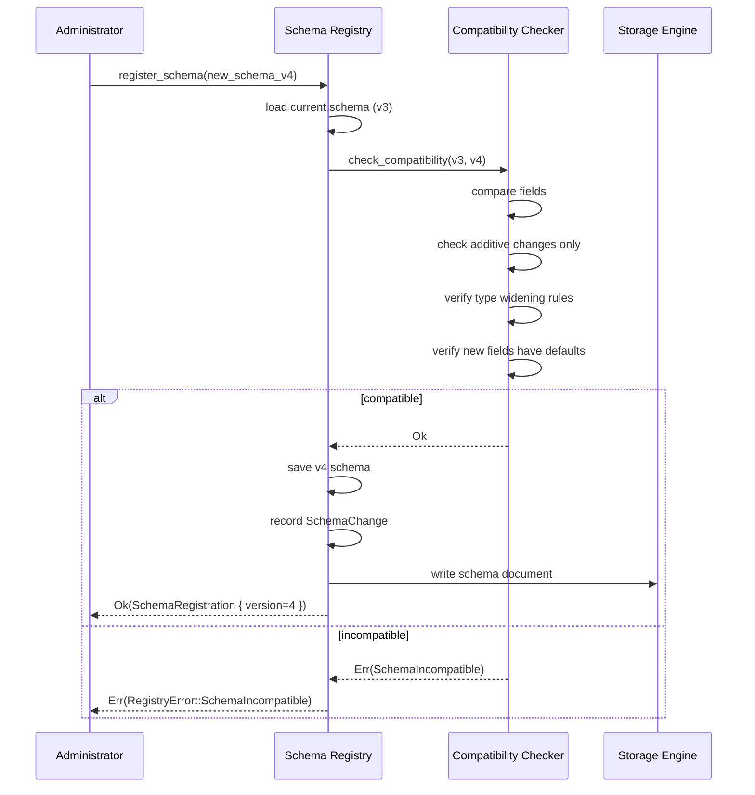
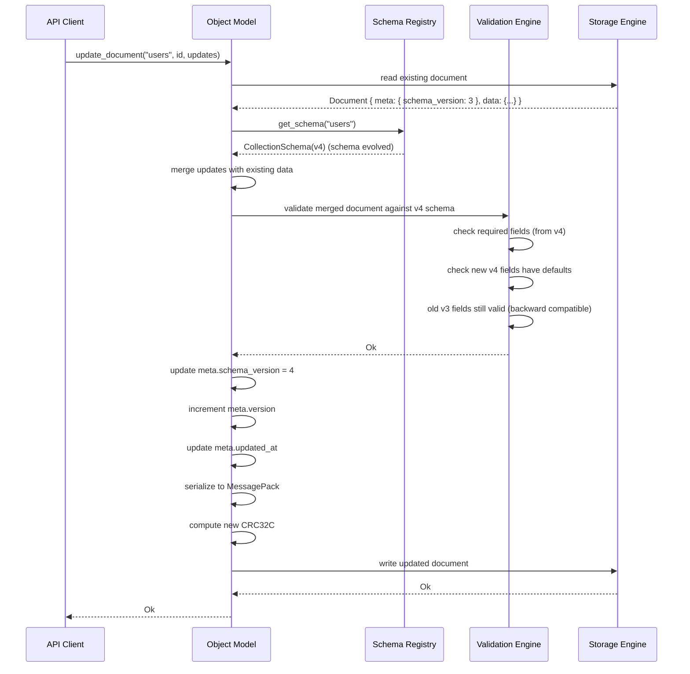
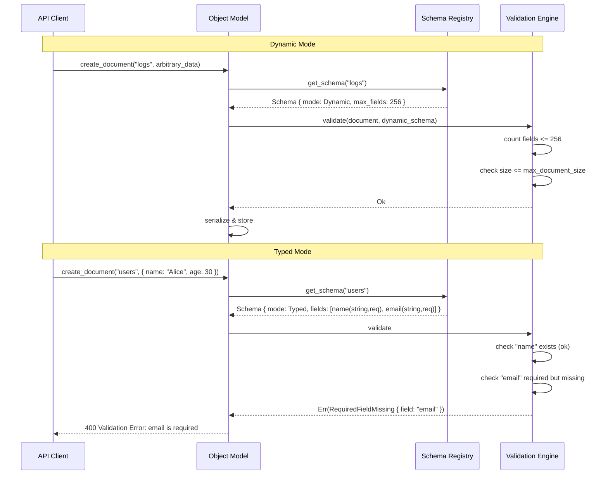
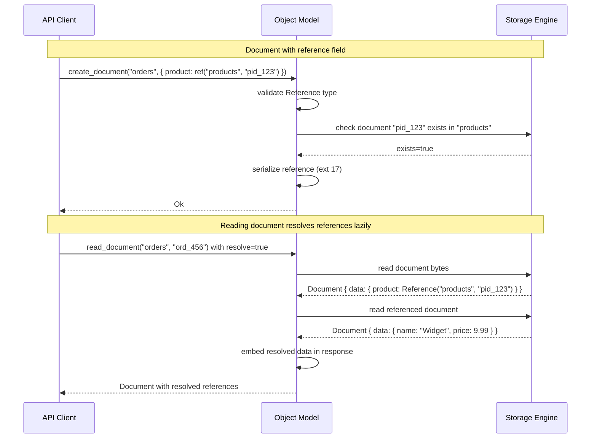

# 12. Object Model

## 1. Purpose

The Object Model defines the unified data representation for all data flowing through Nova Runtime. It is the implementation of the "One Object Model" core principle — every subsystem (Database, Cache, Queue, Scheduler, Search, Blob Storage, Authentication, API Runtime) uses the same type system, the same serialization format, and the same schema definition language. No subsystem may invent its own data representation. The Object Model ensures that data can be passed between subsystems without translation, validated once at system boundaries, and stored uniformly in the Storage Engine.

## 2. Scope

This document covers the complete Nova Object Model: the document type system (all scalar and compound types), schema definition format (both dynamic and typed schemas), validation rules, default values, computed fields, reference/relationship patterns, indexing hints embedded in schemas, schema evolution rules, serialization format (binary MessagePack on wire, structured in memory), and size limits. This document does NOT cover query language (SQL/GraphQL layer), storage engine page format, or network protocol framing.

## 3. Responsibilities

- Define the complete set of primitive and compound data types
- Define the schema definition language (SDDL — Nova Schema Definition Language)
- Enforce validation rules at document creation and mutation
- Manage default values and computed field computation
- Support dynamic (schemaless) and typed (schema-required) modes
- Define reference types for document relationships
- Embed indexing hints for the Storage Engine
- Manage schema evolution with backward-compatible rules
- Provide binary serialization (MessagePack) and in-memory representation
- Enforce document size limits (64KB default, configurable to 16MB)
- Provide type coercion rules for safe type conversion

## 4. Non Responsibilities

- Query planning or optimization (Search/SQL layer responsibility)
- Storage layout or page format (Storage Engine responsibility)
- Network serialization framing (Networking layer responsibility)
- Authentication or authorization (Authentication subsystem responsibility)
- Schema registry distribution across cluster (future work)
- Migration of existing data on schema evolution (application responsibility, guided by Object Model rules)

## 5. Architecture

```mermaid
flowchart TB
    subgraph OMLayer["Object Model Layer"]
        subgraph SR["Schema Registry"]
            CSA["Collection Schema A"]
            CSB["Collection Schema B"]
            CSC["Collection Schema C"]
        end

        subgraph TS["Type System"]
            Prim["Primitive<br/>string, int64, float64,<br/>bool, datetime, binary"]
            Comp["Compound<br/>array, object"]
            Spec["Special<br/>reference, decimal, geojson"]
        end

        subgraph VE["Validation Engine"]
            TC["Type Checking"]
            RD["Required / Default"]
            CVR["Custom Validation Rules"]
        end

        subgraph SRE["Serialization Engine"]
            MP["MessagePack Encoder/Decoder"]
            IM["In-Memory Document"]
        end

        subgraph SEE["Schema Evolution Engine"]
            Vrs["Versioning"]
            CC["Compat Checking"]
            MPn["Migration Planner"]
        end

        SR --> TS
        TS --> VE
        VE --> SRE
        SRE --> SEE
    end
```



### 5.1 Integration with Storage Engine

The Object Model produces serialized documents that are stored as pages in the Storage Engine. Each document is:
1. Validated against its collection schema (if typed mode)
2. Serialized to MessagePack binary format
3. Optionally compressed (zstd level 3, for documents > 512 bytes)
4. Passed to the Storage Engine for page allocation and indexing

The Storage Engine does NOT interpret document contents — it stores opaque binary blobs with index entries generated from the Object Model's indexing hints. Schema information is stored separately in the Schema Registry (also as documents in the Storage Engine, in the `_schema` system collection).

## 6. Data Structures

### 6.1 Type System

```rust
/// The Nova type system — every possible data type in the system
enum NovaType {
    // Primitives
    Null,
    Bool,
    Int8,
    Int16,
    Int32,
    Int64,
    UInt8,
    UInt16,
    UInt32,
    UInt64,
    Float32,
    Float64,
    String { max_length: Option<u32> },
    Binary { max_length: Option<u32> },
    Date,
    Time,
    DateTime,               // RFC 3339 with nanosecond precision
    Duration,               // Nanosecond duration
    Decimal { precision: u8, scale: u8 }, // Fixed-point decimal

    // Compounds
    Array { element_type: Box<NovaType>, max_items: Option<u32> },
    Object { fields: Vec<FieldDef>, additional_fields: bool },
    Map { value_type: Box<NovaType> },  // String-keyed map

    // Special
    Reference { collection: String },   // Document reference
    Any,                                 // Dynamic: any type allowed
    Union(Vec<NovaType>),                // Union type (one of N types)
    Optional(Box<NovaType>),             // Nullable wrapper
    GeoPoint,                            // { lat: f64, lon: f64 }
    GeoShape,                            // GeoJSON geometry
    Vector { dimensions: u16 },          // Embedding vector for search
}

/// Field definition within an object schema
struct FieldDef {
    name: String,
    field_type: NovaType,
    required: bool,
    default: Option<Value>,
    computed: Option<ComputedField>,
    description: String,           // Documentation string
    index: Option<IndexHint>,      // Index hint for storage engine
    unique: bool,                  // Unique constraint
    sensitive: bool,               // Redact in logs/metrics
    validate: Vec<ValidationRule>, // Custom validation rules
}

/// Index hint — tells the Storage Engine what index to build
enum IndexHint {
    /// Standard B-tree index (default for indexed fields)
    BTree { order: u8 },           // B-tree order (default: 4)
    /// Hash index for exact-match lookups
    Hash,
    /// Full-text search index
    FullText { language: String, tokenizer: String },
    /// Geospatial index (R-tree)
    Geospatial,
    /// Vector index (HNSW)
    Vector { m: u16, ef_construction: u16, distance: DistanceMetric },
    /// Composite index (multiple fields)
    Composite { fields: Vec<String>, order: Vec<SortOrder> },
}

enum SortOrder { Ascending, Descending }

enum DistanceMetric {
    Cosine,
    Euclidean,
    DotProduct,
}
```

### 6.2 Schema Definition

```rust
/// Collection schema — defines the structure of documents in a collection
struct CollectionSchema {
    /// Schema version (monotonically increasing)
    version: u32,
    
    /// Collection name (must match `[a-zA-Z_][a-zA-Z0-9_]{0,127}`)
    collection: String,
    
    /// Human-readable description
    description: String,
    
    /// Schema mode
    mode: SchemaMode,
    
    /// Document field definitions
    fields: Vec<FieldDef>,
    
    /// Computed field definitions
    computed_fields: Vec<ComputedFieldDef>,
    
    /// Index definitions
    indexes: Vec<IndexDef>,
    
    /// Default values for the document itself
    defaults: HashMap<String, Value>,
    
    /// Validation rules at document level
    validation: Vec<ValidationRule>,
    
    /// Maximum document size in bytes
    max_document_size: u32,           // Default: 65536
    
    /// Schema metadata
    metadata: HashMap<String, String>,
    
    /// Schema evolution history
    changelog: Vec<SchemaChange>,
    
    /// Created/last modified timestamps
    created_at: u64,
    updated_at: u64,
}

enum SchemaMode {
    /// Dynamic — no schema enforcement. Documents can have any fields.
    /// Useful for migration, prototyping, or heterogeneous data.
    Dynamic { max_fields: u32 },      // Default: 256
    
    /// Typed — schema enforced on all documents.
    /// Unknown fields are rejected (unless Object.additional_fields = true).
    Typed,
    
    /// Mixed — typed with optional dynamic extension.
    /// Schema fields are validated; additional dynamic fields allowed.
    Mixed { max_dynamic_fields: u32 }, // Default: 64
}

/// Index definition
struct IndexDef {
    name: String,
    fields: Vec<IndexField>,
    unique: bool,
    sparse: bool,           // Only index documents with the field
    index_type: IndexHint,
    options: IndexOptions,
}

struct IndexField {
    field: String,
    order: SortOrder,
}

struct IndexOptions {
    /// For full-text indexes
    language: Option<String>,
    tokenizer: Option<String>,
    
    /// For vector indexes
    vector_dimensions: Option<u16>,
    vector_distance: Option<DistanceMetric>,
    vector_m: Option<u16>,              // HNSW m parameter
    vector_ef_construction: Option<u16>,
    
    /// For TTL indexes (auto-expire documents)
    expire_after_seconds: Option<u64>,
    
    /// For partial indexes
    partial_filter: Option<String>,     // Expression string
}
```

### 6.3 Document

```rust
/// A document — the fundamental data unit in Nova Runtime
/// Every document belongs to exactly one collection.
struct Document {
    /// System-managed metadata (not part of user data)
    meta: DocumentMeta,
    
    /// User data fields (validated against schema in Typed mode)
    data: HashMap<String, Value>,
}

/// Document system metadata
struct DocumentMeta {
    /// Globally unique document ID (UUID v7)
    id: [u8; 16],
    
    /// Collection this document belongs to
    collection: String,
    
    /// Schema version used when this document was written
    schema_version: u32,
    
    /// Created timestamp (Unix milliseconds)
    created_at: u64,
    
    /// Last modified timestamp (Unix milliseconds)
    updated_at: u64,
    
    /// Document version number (starts at 1, incremented on each mutation)
    version: u64,
    
    /// Document size in bytes (serialized MessagePack)
    size: u32,
    
    /// Checksum of serialized payload (CRC32C)
    checksum: u32,
    
    /// Tags for organization
    tags: Vec<String>,
    
    /// Expiration timestamp (Unix milliseconds, 0 = no expiration)
    expires_at: u64,
    
    /// Status
    status: DocumentStatus,
}

enum DocumentStatus {
    Active,
    Archived,
    Deleted,    // Soft delete, awaiting compaction
}

/// A value in the Nova type system
/// This is the in-memory representation
enum Value {
    Null,
    Bool(bool),
    Int8(i8),
    Int16(i16),
    Int32(i32),
    Int64(i64),
    UInt8(u8),
    UInt16(u16),
    UInt32(u32),
    UInt64(u64),
    Float32(f32),
    Float64(f64),
    String(String),
    Binary(Vec<u8>),
    Date { year: i32, month: u8, day: u8 },
    Time { hour: u8, min: u8, sec: u8, nano: u32 },
    DateTime { secs: i64, nsecs: u32 }, // Unix timestamp
    Duration { nanos: i64 },
    Decimal { value: [u8; 16], precision: u8, scale: u8 }, // 128-bit fixed-point
    Array(Vec<Value>),
    Object(HashMap<String, Value>),
    Map(HashMap<String, Value>),
    Reference { collection: String, id: [u8; 16] },
    GeoPoint { lat: f64, lon: f64 },
    GeoShape(GeoJsonGeometry),
    Vector(Vec<f32>),
}
```

### 6.4 Computed Fields

```rust
/// Computed field definition
struct ComputedFieldDef {
    name: String,
    field_type: NovaType,
    expression: ComputedExpr,
    stored: bool,          // false = computed on read, true = stored with document
}

enum ComputedExpr {
    /// Reference another field
    FieldRef(String),
    
    /// Arithmetic: +, -, *, /, %
    Arithmetic {
        op: ArithmeticOp,
        left: Box<ComputedExpr>,
        right: Box<ComputedExpr>,
    },
    
    /// String operations
    Concat(Vec<ComputedExpr>),
    Substring { expr: Box<ComputedExpr>, start: i64, length: i64 },
    Lower(Box<ComputedExpr>),
    Upper(Box<ComputedExpr>),
    Trim(Box<ComputedExpr>),
    
    /// Conditional
    If {
        condition: Box<ComputedExpr>,
        then_expr: Box<ComputedExpr>,
        else_expr: Box<ComputedExpr>,
    },
    
    /// Coalesce (first non-null)
    Coalesce(Vec<ComputedExpr>),
    
    /// Type conversion
    Cast { expr: Box<ComputedExpr>, target_type: NovaType },
    
    /// Aggregations over subqueries (limited)
    Count(String),          // Count of array field
    Sum(String),            // Sum of array field values
    
    /// Literal values
    Literal(Value),
}
```

### 6.5 Validation Rules

```rust
/// Validation rule
enum ValidationRule {
    /// String/regex pattern match
    Pattern { field: String, regex: String, error_message: String },
    
    /// Numeric range
    Range { field: String, min: Option<Value>, max: Option<Value> },
    
    /// String length
    Length { field: String, min: Option<u32>, max: Option<u32> },
    
    /// Array item count
    ItemCount { field: String, min: Option<u32>, max: Option<u32> },
    
    /// Custom JavaScript expression (sandboxed)
    Custom { expression: String, language: String },  // "javascript" | "expr"
    
    /// Field comparison between two fields
    Compare {
        field_a: String,
        op: ComparisonOp,
        field_b: String,
    },
    
    /// Unique across collection (alternative to index unique)
    Unique { field: String, scope: Option<String> },
}

enum ComparisonOp {
    Equals, NotEquals, LessThan, LessThanOrEqual, GreaterThan, GreaterThanOrEqual,
}
```

### 6.6 Schema Evolution

```rust
/// Schema change record
struct SchemaChange {
    version: u32,
    timestamp: u64,
    changes: Vec<SchemaChangeOp>,
    description: String,
    author: String,         // Who made the change
}

/// Allowed schema evolution operations (ADDITIVE ONLY)
/// No destructive operations are allowed.
enum SchemaChangeOp {
    /// Add a new field (must have default or be nullable)
    AddField {
        field: FieldDef,
        reason: String,
    },
    
    /// Make a required field optional (relaxing constraint)
    MakeOptional {
        field: String,
        reason: String,
    },
    
    /// Extend a field type (widen, never narrow)
    /// Allowed: int32→int64, float32→float64, string(100)→string(200)
    WidenField {
        field: String,
        new_type: NovaType,
        reason: String,
    },
    
    /// Add a new index
    AddIndex {
        index: IndexDef,
        reason: String,
    },
    
    /// Add an enum value (if field is enum-like)
    AddEnumValue {
        field: String,
        value: String,
        reason: String,
    },
    
    /// Add a default value to a field
    AddDefault {
        field: String,
        default: Value,
        reason: String,
    },
    
    /// Deprecate a field (field still exists and is readable, but new documents
    /// should not use it, and it will be removed in a future schema version)
    DeprecateField {
        field: String,
        deprecation_message: String,
        removal_version: Option<u32>,
    },
}
```

### 6.7 Wire Format

```rust
// MessagePack serialization for Document:
//
// Map (4) {
//   "m": Map(9) {             // metadata
//     "i": binary 16,          // document ID
//     "c": string,             // collection
//     "sv": uint,              // schema version
//     "ca": uint,              // created_at
//     "ua": uint,              // updated_at
//     "v": uint,               // document version
//     "s": uint,               // serialized size
//     "ck": binary 4,          // CRC32C checksum
//     "ex": uint / nil,        // expires_at
//   },
//   "d": Map(...) {            // document data
//     "field1": <typed_value>,
//     "field2": <typed_value>,
//     ... 
//   },
//   "sv": uint,                // schema version (redundant for fast path)
//   "sig": binary 64,          // optional signature
// }
//
// Type encoding in MessagePack:
// Null:      nil
// Bool:      true/false
// Int:       int8..int64 (msgpack integer)
// Float:     float32/float64 (msgpack float)
// String:    str (msgpack string)
// Binary:    bin (msgpack binary)
// DateTime:  ext 8 (12 bytes: 8 bytes secs + 4 bytes nsecs)
// Decimal:   ext 16 (16 bytes: 128-bit big-endian value)
// Array:     array (msgpack array)
// Object:    map (msgpack map)
// Reference: ext 17 (1 byte collection_len + collection + 16 bytes id)
// GeoPoint:  ext 18 (16 bytes: f64 lat + f64 lon)
// GeoShape:  ext 19 (msgpack-encoded GeoJSON)
// Vector:    bin (msgpack binary, little-endian f32 array)
// Duration:  ext 9 (8 bytes: i64 nanos)
// Date:      ext 10 (4 bytes: packed year-month-day)
// Time:      ext 11 (7 bytes: hour+min+sec+nano)
```

## 7. Algorithms

### 7.1 Document Validation

```
Algorithm: ValidateDocument

Input:
  document: Document (parsed into Value::Object)
  schema: CollectionSchema (optional, None if Dynamic mode)

Output:
  Result<(), ValidationError>

Steps:
  1. If schema.mode == Dynamic:
     a. Check data field count <= schema.max_fields (default 256)
     b. Check total serialized size <= schema.max_document_size
     c. Return Ok (no further validation for dynamic mode)
  
  2. If schema.mode == Typed:
     a. For each field_def in schema.fields:
        - Find field value in document.data
        - If field_def.required and value is None/Null:
          - Return Err(RequiredFieldMissing { field: field_def.name })
        - If value is not None:
          - Call ValidateType(value, field_def.field_type)
          - If field_def.validate is non-empty:
            - Call ValidateCustomRules(value, field_def.validate)
        - If value is None and field_def.default is Some:
          - Apply field_def.default to document
        - If value is None and field_def.computed is Some:
          - Compute value from field_def.computed.expression
          - Set computed value in document
     b. Check for unknown fields:
        - For each key in document.data:
          - If key not in schema.fields and field_def.type.additional_fields == false:
            - Return Err(UnknownField { field: key })
     c. Execute document-level validation rules (schema.validation):
        - For each rule, evaluate against full document
  
  3. If schema.mode == Mixed:
     a. Apply Typed validation for known fields
     b. Allow unknown fields up to schema.max_dynamic_fields
  
  4. Check index constraints:
     a. For each index with unique=true:
        - Extract indexed field values
        - Check uniqueness against Storage Engine index
        - If duplicate: return Err(DuplicateKey { index, value })

Complexity: O(f + n + r)
  - f = number of fields in schema
  - n = number of fields in document
  - r = number of validation rules
```

### 7.2 Type Validation

```
Algorithm: ValidateType

Input:
  value: Value
  expected: NovaType

Output:
  Result<(), TypeError>

Steps:
  Match (expected, value):
    (Null, _): Ok if value is Null
    (Bool, Bool(_)): Ok
    (Int8, Int8(v)): Ok if v in [-128, 127]
    (Int8, Int64(v)): Ok if v in [-128, 127]; auto-coerce
    (Int64, _): Ok for any int variant; auto-coerce
    (Float64, _): Ok for Float32, Float64; auto-coerce
    (String { max_length }, String(s)):
      if max_length.is_some() and s.len() > max_length.unwrap():
        Err(StringTooLong { max: max_length.unwrap() })
      else: Ok
    (Binary { max_length }, Binary(b)):
      if max_length.is_some() and b.len() > max_length.unwrap():
        Err(BinaryTooLong { max: max_length.unwrap() })
      else: Ok
    (DateTime, DateTime(_)): Ok
    (DateTime, Int64(ts)): Ok (coerce from Unix timestamp)
    (DateTime, String(s)): Ok if s is valid RFC 3339 (parse and convert)
    (Decimal { precision, scale }, Decimal { value, .. }):
      Check precision and scale match
      Ok
    (Array { element_type, max_items }, Array(items)):
      if max_items.is_some() and items.len() > max_items.unwrap():
        Err(ArrayTooLong { max: max_items.unwrap() })
      for item in items:
        ValidateType(item, element_type)? // recursive
      Ok
    (Object { fields, additional_fields }, Object(map)):
      for field_def in fields:
        Find key = field_def.name in map
        ValidateType(value, field_def.type)?
      if !additional_fields:
        Check no unknown keys
      Ok
    (Reference { collection }, Reference { collection: c, .. }):
      if c != collection:
        Err(InvalidReference { expected: collection, actual: c })
      Ok
    (Any, _): Ok (accept any value)
    (Union(types), _):
      for type_opt in types:
        if ValidateType(value, type_opt).is_ok():
          return Ok
      Err(TypeMismatch { expected, actual })
    (Optional(inner), Null): Ok
    (Optional(inner), _): ValidateType(value, inner)?
    (GeoPoint, GeoPoint { .. }): Ok
    (Vector { dimensions }, Vector(v)):
      if v.len() != dimensions:
        Err(VectorDimensionMismatch { expected: dimensions, actual: v.len() })
      Ok
    (_, _): Err(TypeMismatch { expected, actual: typeof(value) })
```

### 7.3 Schema Evolution Compatibility Check

```
Algorithm: CheckSchemaCompatibility

Input:
  old_schema: CollectionSchema (current schema)
  new_schema: CollectionSchema (proposed schema)
  direction: EvolutionDirection  // Forward or Backward

Output:
  Result<(), SchemaIncompatible>

Steps:
  1. If new_schema.version <= old_schema.version:
     return Err(SchemaVersionNotIncreasing)
  
  2. For each old_field in old_schema.fields:
     a. Find corresponding new_field in new_schema.fields (by name)
     b. If new_field is None:
        - Check: was old_field deprecated with removal_version > old_schema.version?
        - If not deprecated: Err(DestructiveChange { field: old_field.name })
        - If deprecated with valid removal_version: continue (allowed removal)
     c. If new_field exists:
        - Check type compatibility:
          - Allowed changes (widening only):
            - int32 → int64, uint32 → uint64, int8 → int16 → int32 → int64
            - float32 → float64
            - string(N) → string(M) where M >= N
            - binary(N) → binary(M) where M >= N
            - Optional(T) → Optional(U) where T→U is widening
            - Array(T) → Array(U) where T→U is widening
          - Disallowed changes (narrowing):
            - int64 → int32, float64 → float32, string(100) → string(50)
            - Any → Null, Object → String, etc.
        - Check required → optional change:
          - If old_field.required == true and new_field.required == false:
            - Allowed (relaxing constraint)
          - If old_field.required == false and new_field.required == true:
            - Err(StrengtheningConstraint { field: old_field.name })
        - Check default value change:
          - If old_field.default changed: Allowed (lazy migration)
        - Check index change:
          - Adding indexes: allowed
          - Removing indexes: Err(DestructiveIndexChange)
          - Changing index type: Err(DestructiveIndexChange)
  
  3. For each new_field in new_schema.fields not in old_schema:
     a. New field must have a default value or be Optional
     b. If no default and not Optional: Err(NewFieldRequired { field: new_field.name })
  
  4. Check schema mode change:
     a. Dynamic → Typed: Err(SchemaModeStrengthening)
     b. Dynamic → Mixed: Allowed
     c. Mixed → Typed: Warning (logged, not rejecting — some docs may have extra fields)
     d. Typed → Dynamic: Warning (allowed but not recommended)
  
  5. Return Ok (schema evolution is compatible)

Complexity: O(f1 + f2) where f1 = old fields, f2 = new fields
```

### 7.4 Document Serialization

```
Algorithm: SerializeDocument

Input:
  document: Document
  schema: Option<CollectionSchema>

Output:
  Result<Vec<u8>, SerializationError>

Steps:
  1. Compute dynamic fields (if schema has computed fields):
     For each computed_field_def in schema.computed_fields:
       If computed_field_def.stored:
         Evaluate expression with current document data
         Store result in document.data
  
  2. Assign document metadata:
     a. If document.meta.id is all zeros: generate UUID v7
     b. If document.meta.created_at == 0: set to current timestamp
     c. Set document.meta.updated_at = current timestamp
     d. Increment document.meta.version (or set to 1 if new)
     e. Set document.meta.schema_version = schema.version (if schema exists)
  
  3. Serialize metadata to MessagePack:
     a. Write metadata map with system fields
     b. Compute metadata size
  
  4. Serialize document data to MessagePack:
     a. Recursive encoding of Value tree
     b. For each field, encode as (key, value) pair
     c. Use type-specific MessagePack encodings (see wire format)
  
  5. Concatenate metadata + data sections:
     a. Compute total = metadata_size + data_size
     b. Check total <= schema.max_document_size (if schema exists)
        or total <= global max_document_size (default 64KB, max 16MB)
     c. If exceeds: return Err(DocumentTooLarge)
  
  6. Compute CRC32C checksum of serialized bytes
  7. Prepend or embed checksum in metadata
  8. Return serialized bytes

Complexity: O(n) where n = document tree size in nodes
```

### 7.5 Document Deserialization

```
Algorithm: DeserializeDocument

Input:
  bytes: Vec<u8>
  expected_schema: Option<CollectionSchema>  // optional, for typed mode

Output:
  Result<Document, DeserializationError>

Steps:
  1. Parse MessagePack envelope:
     a. Verify first byte is fixmap/map marker
     b. Expect exactly 4 keys: "m", "d", "sv", "sig" (optional)
  
  2. Parse metadata section ("m"):
     a. Extract metadata fields from map
     b. Validate required fields: id, collection, created_at, updated_at, version
     c. Validate CRC32C checksum:
        - Compute CRC32C of data section
        - Compare with stored checksum
        - If mismatch: return Err(ChecksumMismatch)
     d. Parse optional fields: expires_at, tags, status
  
  3. Parse data section ("d"):
     a. Recursively decode MessagePack into Value tree
     b. Handle extension types (ext 8-19) for DateTime, Decimal, Reference, etc.
     c. If expected_schema is Some:
        - Call ValidateDocument on parsed data
        - If validation fails: return Err(ValidationError)
     d. If expected_schema is None (dynamic mode):
        - Return parsed data as-is
  
  4. Build Document struct:
     a. Populate DocumentMeta from metadata section
     b. Populate Document.data from data section
  
  5. Return Document

Complexity: O(n) where n = document tree size
```

### 7.6 Type Coercion

```
Algorithm: CoerceValue

Input:
  value: Value
  target_type: NovaType

Output:
  Result<Value, CoercionError>

Purpose: Automatically coerce values to expected types
         where safe and unambiguous.

Coercion rules (ordered by safety):

  String:
    - Bool→String: "true"/"false"
    - Int→String: decimal string representation
    - Float→String: minimal decimal representation
    - DateTime→String: RFC 3339 format
    - Binary→String: UTF-8 decode (may fail)
    - Decimal→String: fixed-point decimal representation
  
  Int64:
    - String→Int64: parse decimal string
    - Float→Int64: truncate (warning on precision loss)
    - UInt64→Int64: fail if value > i64::MAX
    - Bool→Int64: 0/1
    - DateTime→Int64: Unix timestamp seconds
  
  Float64:
    - String→Float64: parse float string
    - Int→Float64: safe (may lose precision for > 2^53)
    - Decimal→Float64: safe (may lose precision)
  
  DateTime:
    - String→DateTime: parse RFC 3339, ISO 8601
    - Int64→DateTime: interpret as Unix seconds (or ms if magnitude > 10^12)
    - Float→DateTime: interpret as Unix seconds with fractional
  
  Decimal:
    - String→Decimal: parse fixed-point string
    - Int→Decimal: safe conversion
    - Float→Decimal: round to specified scale (potential precision loss)
  
  Array:
    - Values in array coerced individually to element_type
    - Non-array value wrapped in single-element array (if element_type matches)
  
  Object:
    - Field values coerced individually to field types
    - Missing optional fields left as Null
    - Unknown fields dropped in Typed mode

  NOT coerced (must match exactly):
    - Binary: no implicit conversion to/from other types
    - Reference: must be Reference type
    - GeoPoint: must be GeoPoint type
    - Vector: must be Vector type
    - Bool: no coercion from non-bool (too ambiguous)
```

## 8. Interfaces

### 8.1 Schema Registry API

```rust
/// Schema Registry — manages collection schemas
trait SchemaRegistry: Send + Sync {
    /// Register a new schema
    /// If collection exists, performs compatibility check against current schema
    fn register_schema(&self, schema: CollectionSchema) -> Result<SchemaRegistration, RegistryError>;

    /// Get the active schema for a collection
    fn get_schema(&self, collection: &str) -> Result<CollectionSchema, RegistryError>;

    /// Get a specific schema version for a collection
    fn get_schema_version(&self, collection: &str, version: u32) -> Result<CollectionSchema, RegistryError>;

    /// Get all schema versions for a collection
    fn get_schema_history(&self, collection: &str) -> Result<Vec<SchemaChange>, RegistryError>;

    /// Check compatibility of a proposed schema change without applying
    fn check_compatibility(&self, old_version: u32, new_schema: &CollectionSchema) -> Result<(), CompatibilityError>;

    /// List all collections with registered schemas
    fn list_collections(&self) -> Result<Vec<String>, RegistryError>;

    /// Delete a collection schema (only if collection is empty)
    fn delete_collection(&self, collection: &str) -> Result<(), RegistryError>;

    /// Reload schemas from storage (called on startup)
    fn load_schemas(&self) -> Result<(), RegistryError>;
}

struct SchemaRegistration {
    collection: String,
    version: u32,
    is_new: bool,           // true if first registration
}

enum RegistryError {
    CollectionNotFound,
    SchemaIncompatible { details: String },
    SchemaParseError { line: u32, message: String },
    VersionConflict { current: u32, attempted: u32 },
    InvalidCollectionName { reason: String },
    CollectionNotEmpty { document_count: u64 },
    Internal(String),
}

enum CompatibilityError {
    DestructiveChange { description: String },
    StrengtheningConstraint { description: String },
    NewFieldRequired { field: String },
    IndexRemoval { index: String },
    TypeNarrowing { field: String, old_type: NovaType, new_type: NovaType },
    SchemaModeStrengthening,
}
```

### 8.2 Document Validation API

```rust
/// Document validation engine
trait DocumentValidator: Send + Sync {
    /// Validate a document against a schema
    fn validate(&self, document: &Value, schema: &CollectionSchema) -> Result<(), ValidationErrors>;

    /// Validate a value against a type
    fn validate_type(&self, value: &Value, nova_type: &NovaType) -> Result<(), TypeError>;

    /// Coerce a value to a target type
    fn coerce(&self, value: Value, target_type: &NovaType) -> Result<Value, CoercionError>;

    /// Apply default values from schema to document
    fn apply_defaults(&self, document: &mut Value, schema: &CollectionSchema);

    /// Compute computed fields for a document
    fn compute_fields(&self, document: &Value, schema: &CollectionSchema) -> Result<HashMap<String, Value>, ComputationError>;

    /// Evaluate a single computed expression
    fn evaluate_expression(&self, expr: &ComputedExpr, document: &Value) -> Result<Value, ComputationError>;
}

struct ValidationErrors {
    errors: Vec<ValidationError>,
}

enum ValidationError {
    RequiredFieldMissing { field: String },
    TypeMismatch { field: String, expected: NovaType, actual: NovaType },
    StringTooLong { field: String, max: u32, actual: u32 },
    BinaryTooLong { field: String, max: u32, actual: u32 },
    ArrayTooLong { field: String, max: u32, actual: u32 },
    UnknownField { field: String },
    DuplicateKey { index: String, value: String },
    PatternMismatch { field: String, regex: String },
    RangeViolation { field: String, min: Option<String>, max: Option<String> },
    CustomRuleFailed { field: String, rule: String, message: String },
    InvalidReference { field: String, collection: String, document_id: String },
    VectorDimensionMismatch { field: String, expected: u16, actual: usize },
}

enum TypeError { /* ... similar to ValidationError ... */ }
enum CoercionError { /* ... */ }
enum ComputationError { /* ... */ }
```

### 8.3 Document API (Object Model Layer)

```rust
/// High-level document operations (used by Storage Engine)
trait ObjectModel: Send + Sync {
    /// Create a new document
    /// Validates against schema, applies defaults, serializes
    fn create_document(&self, collection: &str, data: Value) -> Result<Document, DocumentError>;

    /// Read and deserialize a document
    fn read_document(&self, collection: &str, bytes: &[u8]) -> Result<Document, DocumentError>;

    /// Update an existing document
    /// Validates updated fields against schema, re-serializes
    fn update_document(&self, document: &mut Document, updates: Value) -> Result<(), DocumentError>;

    /// Delete a document (mark as deleted)
    fn delete_document(&self, document: &mut Document) -> Result<(), DocumentError>;

    /// Serialize document to wire format
    fn serialize(&self, document: &Document) -> Result<Vec<u8>, DocumentError>;

    /// Deserialize from wire format
    fn deserialize(&self, bytes: &[u8]) -> Result<Document, DocumentError>;

    /// Get the size of a document in serialized form
    fn document_size(&self, document: &Document) -> u32;

    /// Check if a document matches a filter expression (for content filtering)
    fn matches_filter(&self, document: &Document, filter: &FilterExpr) -> bool;

    /// Extract indexable fields from a document (for index maintenance)
    fn extract_index_values(&self, document: &Document, indexes: &[IndexDef]) -> HashMap<String, Vec<IndexValue>>;
}

enum DocumentError {
    Validation(ValidationErrors),
    Serialization(String),
    Deserialization(String),
    DocumentTooLarge { size: u32, max: u32 },
    ChecksumMismatch { expected: u32, computed: u32 },
    CollectionNotFound,
    Internal(String),
}
```

### 8.4 SDK (Schema Definition)

```rust
/// Nova Schema Definition Language (SDDL) — text format for defining schemas
///
/// Syntax (TOML-based):
///
/// ```toml
/// [schema]
/// collection = "users"
/// version = 1
/// mode = "typed"
/// description = "User account documents"
///
/// [[schema.fields]]
/// name = "id"
/// type = "string"
/// required = true
/// description = "Unique user identifier"
///
/// [[schema.fields]]
/// name = "email"
/// type = "string"
/// required = true
/// unique = true
/// validate = [{ pattern = "^[^@]+@[^@]+\\.[^@]+$" }]
/// description = "User email address"
///
/// [[schema.fields]]
/// name = "profile"
/// type = "object"
/// required = false
/// [schema.fields.fields]
/// name = "display_name"
/// type = "string"
/// required = false
/// default = ""
///
/// [[schema.fields]]
/// name = "created_at"
/// type = "datetime"
/// required = true
/// default = { now = true }
///
/// [[schema.indexes]]
/// name = "email_idx"
/// fields = ["email"]
/// unique = true
///
/// [[schema.indexes]]
/// name = "created_idx"
/// fields = ["created_at"]
/// index_type = "btree"
/// ```

/// SDDL parser
trait SddlParser {
    /// Parse a TOML-formatted schema definition
    fn parse_toml(&self, input: &str) -> Result<CollectionSchema, SddlParseError>;
    
    /// Parse a YAML-formatted schema definition
    fn parse_yaml(&self, input: &str) -> Result<CollectionSchema, SddlParseError>;
    
    /// Serialize a schema to TOML format
    fn to_toml(&self, schema: &CollectionSchema) -> Result<String, SddlSerializeError>;
    
    /// Serialize a schema to YAML format
    fn to_yaml(&self, schema: &CollectionSchema) -> Result<String, SddlSerializeError>;
}

struct SddlParseError {
    line: u32,
    column: u32,
    message: String,
}
```

## 9. Sequence Diagrams

### 9.1 Document Creation with Validation

```mermaid
sequenceDiagram
    participant Client as API Client
    participant API as REST/GraphQL API
    participant OM as Object Model
    participant Schema as Schema Registry
    participant Val as Validation Engine
    participant SE as Storage Engine
    
    Client->>API: POST /collections/users/docs
    API->>OM: create_document("users", data)
    OM->>Schema: get_schema("users")
    Schema-->>OM: CollectionSchema(v3)
    
    OM->>Val: validate(document, schema)
    
    Val->>Val: check required fields
    Val->>Val: validate types
    Val->>Val: check constraints (unique, pattern)
    Val->>Val: apply defaults
    
    alt validation fails
        Val-->>OM: ValidationErrors
        OM-->>API: Err(DocumentError::Validation)
        API-->>Client: 400 Bad Request + errors
    else validation passes
        Val-->>OM: Ok
        OM->>OM: compute computed fields
        OM->>OM: serialize to MessagePack
        OM->>OM: compute CRC32C checksum
        OM->>SE: write document bytes
        SE-->>OM: Ok(document_id)
        OM-->>API: Ok(Document { id, ... })
        API-->>Client: 201 Created + document
    end
```



### 9.2 Schema Evolution



### 9.3 Document Update with Schema Versioning



### 9.4 Dynamic vs Typed Mode



### 9.5 Reference Resolution



## 10. Failure Modes

### 10.1 Schema Validation Failure

| Cause | Effect | Detection |
|-------|--------|-----------|
| Document does not match schema | Document rejected, error returned to caller | publish() returns ValidationErrors |
| Schema changes underneath existing documents | Existing documents may not conform to new schema (if schema evolution bug) | Background validation job detects mismatches |

**Impact**: Document creation/update fails. Operator must fix the document or schema.

### 10.2 Serialization Failure

| Cause | Effect | Detection |
|-------|--------|-----------|
| Value contains non-serializable type (e.g., NaN, Infinity) | Serialization returns error | Unit test, fuzz testing |
| Document exceeds max_document_size | Document rejected | Validation in serialize path |
| MessagePack encoder internal error | Corrupted output, potential storage corruption | CRC32C checksum mismatch on read |

**Impact**: Document cannot be stored. Data loss if checksum mismatch is not caught.

### 10.3 Schema Registry Corruption

| Cause | Effect | Detection |
|-------|--------|-----------|
| Storage Engine corruption affecting schema collection | Schema unreadable at startup | Load failure on startup, fallback to cached schema |
| Race condition during concurrent schema writes | Schema version conflict | Register_schema returns VersionConflict |
| Manual editing of schema storage | Invalid schema, parse errors | Parse error on next load |

**Impact**: New documents cannot be validated. Existing documents readable but validation disabled until schema recovered.

### 10.4 Reference Integrity Failure

| Cause | Effect | Detection |
|-------|--------|-----------|
| Referenced document deleted | Orphan reference | Read-time check fails |
| Referenced document in different collection | InvalidReference error | Validation fails at create time |
| Circular references | Infinite resolution loop | Depth limit on reference resolution (max 16 levels) |

**Impact**: Document read succeeds but reference resolution fails. Application must handle broken references.

### 10.5 Schema Evolution Errors

| Cause | Effect | Detection |
|-------|--------|-----------|
| Destructive schema change attempted (field removal) | Schema registration rejected | Compatibility check fails |
| Backward incompatible type change | Existing documents fail validation on read | Read-time validation error |
| Schema version overflow (u32 max) | Cannot register new version | Version increment fails |

**Impact**: Schema registration fails. Read failures on documents written with old schema.

### 10.6 Type Coercion Ambiguity

| Cause | Effect | Detection |
|-------|--------|-----------|
| String "123abc" coerced to Int64 | Coercion fails | Coercion error |
| Float 3.14159 coerced to Int64 | Truncation to 3 (precision loss) | Warning logged, no error |
| Large int coerced to Float64 | Precision loss above 2^53 | Warning, no error |

**Impact**: Data precision loss. Silent data corruption if coercion is too aggressive.

### 10.7 Checksum Mismatch

| Cause | Effect | Detection |
|-------|--------|-----------|
| Storage medium bit rot | CRC32C computed on read != stored checksum | Deserialization error |
| Bug in serialization (different CRC computation) | Same effect | Consistency check |
| Memory corruption during write | Document stored with bad checksum | Read-time detection |

**Impact**: Document cannot be deserialized. Data loss. Must restore from backup or replay.

## 11. Recovery Strategy

### 11.1 Schema Registry Recovery

1. **Schema unreadable on startup**: Fall back to cached schema (serialized to separate, non-corruptible location: `_schema_cache` file). Cache updated on each successful schema registration. If cache also corrupt, reject startup until operator restores schema from backup.
2. **Schema version conflict**: Reject the registration. Operator must reconcile schema versions manually (delete conflicting schema, re-register with correct version).
3. **Invalid schema in storage**: Reject on parse. Log exact parse error with line/column. Operator must correct schema definition and re-upload.

### 11.2 Document Validation Recovery

1. **Document fails validation on read (schema evolution issue)**: Log warning. Return document with warning about schema mismatch. Do NOT block reads — this would violate availability. Optionally, trigger background re-validation to identify all affected documents.
2. **Validation error on write**: Return error to caller. Caller must fix document and retry. No automatic recovery possible since schema violation is intentional by caller.

### 11.3 Checksum Mismatch Recovery

1. **On read**: Return `ChecksumMismatch` error. Document is not returned. Log the event with document ID and collection.
2. **For critical data**: Automatic retry from replica (if available). Initiate background repair: read from WAL if available, restore from backup.
3. **For non-critical data**: Log and skip. Background scrubber identifies and reports all corrupt documents.
4. **Self-healing**: If WAL has the original document, trigger automatic rewrite of corrupt document. If WAL does not have it (older than retention), operator must restore from backup.

### 11.4 Reference Integrity Recovery

1. **Orphan reference detected on read**: Log warning. Return reference as unresolved (include collection + id but no resolved data). Do not fail read.
2. **Background reference checker**: Periodic job scans collections for references and validates target documents exist. Reports orphans to admin.
3. **Deleting referenced document**: If a document is referenced by another document, delete is blocked by default. Operator can force delete (which breaks references). Force delete logs an audit event.

### 11.5 Type Coercion Recovery

1. **Coercion failure**: Return `CoercionError`. Caller must provide value of correct type. No automatic fallback.
2. **Precision loss warning**: Log warning but proceed. Operator should be alerted via monitoring if precision loss rate exceeds threshold.
3. **NaN/Infinity handling**: Serialization rejects NaN and Infinity in float values. Caller must sanitize. Alternative: serialize as Null (configurable via `nan_as_null` schema option).

## 12. Performance Considerations

### 12.1 Serialization Performance

| Operation | Throughput | Latency |
|-----------|------------|---------|
| Serialize 1KB document | 500,000 docs/sec | ~2μs |
| Serialize 64KB document | 20,000 docs/sec | ~50μs |
| Deserialize 1KB document | 400,000 docs/sec | ~2.5μs |
| Deserialize 64KB document | 15,000 docs/sec | ~65μs |
| Validate 1KB document (10 fields) | 200,000 docs/sec | ~5μs |
| Coerce simple type | 2,000,000 ops/sec | ~0.5μs |

### 12.2 Memory Characteristics

| Component | Memory | Notes |
|-----------|--------|-------|
| In-memory Value (small) | ~32 bytes + data | Null/Bool/Int64 variants |
| In-memory Value (string, 100 chars) | ~160 bytes | String struct + heap allocation |
| In-memory Object (10 fields) | ~800 bytes | HashMap overhead |
| DocumentMeta | ~128 bytes | Fixed-size struct |
| Serialized document (1KB) | 1,024 bytes | MessagePack binary |
| Schema in memory (10 fields) | ~5 KB | FieldDef array + type tree |
| Schema in memory (100 fields) | ~50 KB | Full schema definition |

### 12.3 Schema Cache Performance

Schema registry maintains an in-memory LRU cache of schemas:
- **Cache size**: 10,000 schemas (default)
- **Cache entry size**: ~2 KB average
- **Total cache memory**: ~20 MB
- **Cache lookup**: O(1) hash table
- **Cache miss**: WAL-backed read + parse (sub-millisecond)

### 12.4 Optimization Strategies

1. **Lazy schema loading**: Schemas loaded on first access, not at startup. Schema count is typically small (< 1000 collections).
2. **Zero-copy deserialization**: For read-only access to specific fields, use MessagePack zero-copy accessors to avoid full parse. Up to 10x faster for field extraction.
3. **Pre-computed serialization size**: Schema tracks expected serialized size per field. Budget check is O(1) using size estimates instead of O(n) full pre-serialization.
4. **Batch schema operations**: Schema registrations are batched for performance (max 100ms delay for batch commit).
5. **Value interning**: Frequently used strings (field names, enum values) are interned. Reduces memory and comparison cost.
6. **Arena allocation for documents**: Documents on the hot path use arena allocation to reduce allocator contention.

### 12.5 Size Limits

| Parameter | Default | Minimum | Maximum | Rationale |
|-----------|---------|---------|---------|-----------|
| Document size | 64 KB | 1 B | 16 MB | Balance between flexibility and memory safety |
| String length | 64 KB | 0 | 16 MB | Max string same as max document |
| Binary length | 64 KB | 0 | 16 MB | Same as string |
| Array items | 10,000 | 0 | 1,000,000 | Prevent pathological cases |
| Object fields | 256 | 0 | 65,536 | Schema field count limit |
| Map entries | 10,000 | 0 | 1,000,000 | Same as array |
| Decimal precision | 38 | 1 | 76 | IEEE 754 decimal128 range |
| Decimal scale | 0 | 0 | precision | Scale must not exceed precision |
| Vector dimensions | 384 | 1 | 4096 | Common embedding model limits |
| Schema versions | 1 | 1 | ~4B (u32::MAX) | Practically unlimited |
| Reference resolution depth | 16 | 1 | 64 | Prevent infinite cycles |
| Dynamic mode max fields | 256 | 1 | 65,536 | Prevent schema-less abuse |

## 13. Security

### 13.1 Threat Model

| Threat | Vector | Impact | Mitigation |
|--------|--------|--------|-----------|
| Document injection | API inserts document with malicious payload | Storage corruption, query injection | Schema validation on all inputs; field type enforcement |
| Schema poisoning | Register malicious schema | Subvert validation rules, allow bad data | Schema registration requires admin auth; schema validated for consistency |
| Type confusion | Exploit coercion to bypass type checks | Data corruption, security bypass | Strict mode coercion (fail on ambiguity); explicit type required for security-critical fields |
| Billion laughs attack | Deeply nested document | Stack overflow, resource exhaustion | Max nesting depth (default: 64 levels); iterative parser, not recursive |
| Large document DoS | Upload maximum size documents repeatedly | Memory exhaustion, disk fill | Document per-collection rate limiting; max_document_size per schema |
| Reference hijacking | Reference document in restricted collection | Access document outside permissions | Reference validation includes authorization check |
| Decimal overflow | Decimal with extreme precision/scale | Precision loss, financial corruption | Decimal bounded to 76 precision; scale validated |
| Schema version exhaustion | Rapid schema version creation | Storage fill, confusion | Max schema versions per collection (1000 default); rate limit schema changes |

### 13.2 Security Controls

1. **Input validation at boundary**: All document data validated against schema at API boundary. No document reaches Storage Engine without validation.
2. **Schema change authorization**: Schema changes require admin role. Schema change audit logged with author identity.
3. **Nesting depth limit**: Maximum nesting depth of 64 levels. Enforced during serialization and deserialization.
4. **Circular reference protection**: Reference resolution depth limited to 16. Cycle detection using visited-set tracking.
5. **Sensitive field redaction**: Fields marked `sensitive: true` are redacted in logs, metrics, and error messages. Only available in raw document read.
6. **Deterministic serialization**: Map fields are serialized in sorted key order. Prevents canonicalization attacks.
7. **Constant-time comparisons**: Checksum and reference ID comparisons use constant-time comparison to prevent timing attacks.

### 13.3 Secure Defaults

- Dynamic mode is NOT the default. New collections default to Typed mode.
- `max_document_size` defaults to 64KB (not 16MB).
- `max_fields` defaults to 256.
- Reference validation is enabled by default.
- Sensitive field marking is available for PII fields.

## 14. Testing

### 14.1 Unit Tests

| Test | Description | Coverage |
|------|-------------|----------|
| Type validation | Each NovaType validates correctly | 50+ test cases per type |
| Type coercion | All coercion rules, edge cases | 40 test cases |
| Schema parsing | SDDL parsing from TOML/YAML | 30 test cases |
| Schema compatibility check | All allowed/disallowed changes | 25 test cases |
| Default application | Defaults applied correctly in all modes | 20 test cases |
| Computed fields | Expression evaluation | 25 test cases |
| Checksum computation | CRC32C correctness | 10 test cases |
| Reference resolution | Valid, invalid, circular | 15 test cases |
| Serialization round-trip | Serialize then deserialize yields same document | 100 test cases |
| Size limit enforcement | Boundaries tested | 10 test cases |
| Nesting depth | 64-level depth check | 5 test cases |
| MessagePack extension types | All ext types read/write correctly | 16 test cases |

### 14.2 Integration Tests

| Test | Description |
|------|-------------|
| Create + Read document | Full round-trip through Object Model and Storage Engine |
| Dynamic mode document | Arbitrary fields accepted |
| Typed mode document | Schema enforced |
| Mixed mode document | Typed fields validated, additional fields allowed |
| Schema evolution | v1→v2 compatible change, documents written with both versions |
| Schema evolution rejection | Destructive change rejected |
| Reference document | Create, read with resolution, delete blocked |
| Large document | 64KB document, 16MB document, limit exceeded |
| Deeply nested document | 64 levels, 65+ levels |
| Concurrent schema registration | Multiple simultaneous registrations |
| Schema cache reload | Schemas reloaded from storage |

### 14.3 Property-Based Tests

| Property | Description |
|----------|-------------|
| Serialization round-trip identity | ∀ doc: deserialize(serialize(doc)) == doc |
| Validation monotonicity | A document that passes Typed validation also passes Dynamic validation |
| Schema evolution backward compatibility | Documents written with schema vN can be read with schema vN+1 |
| Coercion idempotency | coerce(coerce(v, T), T) == coerce(v, T) |
| No reference cycles | Reference resolution terminates within 16 steps |
| Deterministic serialization | Same document always produces same bytes (deterministic map ordering) |
| Checksum detection | Any single bit flip in serialized bytes causes checksum mismatch |

### 14.4 Chaos Tests

| Test | Description |
|------|-------------|
| Random schema changes | Apply random compatible schema changes during sustained read/write load |
| Schema corruption | Corrupt schema document in storage; verify cache fallback works |
| Partial write | Storage Engine returns partial write; verify CRC32C catches it |
| Null storm | Documents with all-null values for optional fields at high throughput |
| Type confusion injection | Send values that don't match schema types |
| Schema version rollover | Create 1000+ schema versions rapidly |
| Cross-collection reference deletion | Delete documents that are referenced from other collections |

### 14.5 Edge Cases

| Edge Case | Expected Behavior |
|-----------|-------------------|
| Empty string field | Accepted (if not required) |
| String with null bytes | Accepted (embedded nulls OK in binary/string) |
| Float NaN/Infinity | Rejected (cannot be serialized) |
| UUID v7 as string | Accepted as string; can also be stored as Reference for typed links |
| Empty array `[]` | Accepted (array with 0 items) |
| Array with mixed types | Rejected in Typed mode; accepted in Dynamic mode |
| Object with 255 fields | Accepted (under 256 limit) |
| Object with 257 fields | Rejected in Typed mode; accepted in Dynamic mode up to max_fields |
| DateTime year 0 | Accepted (proleptic Gregorian calendar) |
| DateTime year 10,000 | Rejected (year must fit in i32) |
| Decimal 0.0000000000 | Accepted (scale preserved) |
| Vector with 4096 dimensions | Accepted (max dimensions) |
| Nested object 63 levels deep | Accepted |
| Nested object 64 levels deep | Rejected |
| Reference to self | Accepted (self-reference allowed, depth limit still enforced) |
| Schema with 1000 fields | Accepted (within limits) |
| Schema version u32::MAX | Next version would overflow; manual reset required |

## 15. Future Work

1. **Enum type**: First-class enum type with string/integer variants and defined value set.
2. **Intersection/union types**: Compound type composition — a field that must satisfy multiple type constraints.
3. **Custom scalar types**: User-defined scalar types with validation and serialization logic.
4. **JSON Schema compatibility**: Ability to import/export schemas as JSON Schema (draft 2020-12).
5. **Protobuf compatibility**: Generate .proto files from schemas for gRPC interop.
6. **Schema inheritance**: Schema A extends Schema B — inherits fields, indexes, and validation.
7. **Multi-collection references**: References that can point to documents in any of N collections.
8. **Cascade operations**: On document update/delete, automatically update/delete referencing documents.
9. **Materialized computed fields**: Computed fields that are stored and incrementally updated on dependency changes.
10. **Schema templates**: Parameterized schemas (e.g., `audit_log<T>` where T is the audited entity type).
11. **Soft schema enforcement**: Warning mode where schema violations are logged but not rejected (for migration).
12. **GraphQL schema generation**: Automatic GraphQL schema generation from SDDL schemas.
13. **OpenAPI schema generation**: Generate OpenAPI 3.1 schemas from SDDL for REST API documentation.
14. **Schema diff tool**: CLI tool to show the diff between two schema versions.
15. **Default value expressions**: Default values as expressions (e.g., `now()`, `uuid()`, `sequence()`).

## 16. Open Questions

1. **Should decimal use IEEE 754 decimal128 or a custom implementation?** IEEE 754 decimal128 is standard but has limited library support in some languages. A custom implementation gives more control but risks incompatibility. Decision: Use IEEE 754 decimal128 encoding for wire format, provide both a high-level API (string-based construction) and low-level API (byte array) to handle library limitations.

2. **How strict should default type coercion be?** Current design prefers failing on ambiguity over silent coercion. But for user-friendliness, some coercion (e.g., string "42" → int 42) is expected. Where is the line? Decision: Coerce only where lossless and unambiguous. String-to-number coercion allowed if entire string is a valid number literal. Coercion from float to int is NOT allowed (potential precision loss). Coercion from int to float is allowed with warning.

3. **Should computed fields be Turing-complete?** Current design limits expressions to a safe subset (no loops, no external calls). Is this sufficient for real use cases? Decision: v1 uses limited expression language. Custom validation rules can use sandboxed JavaScript (QuickJS) if more power is needed.

4. **Should the Object Model support document inheritance (like database table inheritance)?** Single-table inheritance vs. multiple collections with references. Single-table is simpler but leads to sparse documents. Multiple collections are normalized but require joins. Decision: No inheritance for v1. Use references/relationships. Revisit when query layer is more mature.

5. **How to handle schema migration for large collections (100M+ documents)?** Background migration with read-repair approach: documents are lazily migrated when read/written. A background job can proactively migrate documents. Migration progress is tracked by counting documents with old schema_version.

6. **Should the Object Model support document-level access control (field-level security)?** This is a common requirement for multi-tenant apps. But it crosses into Auth territory. Decision: Document-level security is deferred to the Auth subsystem. The Object Model provides metadata fields for ownership/ACL but does not enforce them.

7. **What is the maximum practical nesting depth?** 64 levels is generous for any real use case. Protobuf's default limit is 100. JSON's typical nesting is < 10. 64 is a safe upper bound that prevents stack overflow while accommodating deeply nested configuration documents.

8. **Should there be a separate "schema as code" deployment pipeline?** Schema changes should be version-controlled and deployed through CI/CD, not made at runtime. Current design allows both. Should we add a "schema freezing" mode where runtime schema changes are disabled? Decision: Optional freeze mode. Collection schemas can be locked with `schema_frozen: true`.

## 17. References

- **MessagePack**: https://msgpack.org/ — Binary serialization format specification
- **UUID v7**: RFC 9562 — Time-ordered UUIDs
- **CRC32C**: Castagnoli CRC-32 — Hardware-accelerated CRC on modern CPUs
- **Decimal128**: IEEE 754-2008 — Decimal floating-point arithmetic
- **GeoJSON**: RFC 7946 — GeoJSON geometry specification
- **JSON Schema**: https://json-schema.org/ — JSON Schema specification (inspiration for validation rules)
- **Protobuf**: Google Protocol Buffers — Inspiration for schema evolution rules
- **Avro**: Apache Avro — Schema evolution and binary format inspiration
- **Cap'n Proto**: https://capnproto.org/ — Zero-copy serialization inspiration
- **QuickJS**: https://bellard.org/quickjs/ — Embedded JavaScript engine for custom validation
- **Zigzag encoding**: Variable-length integer encoding used in MessagePack
- **HNSW**: "Efficient and robust approximate nearest neighbor search using Hierarchical Navigable Small World graphs" — Vector index algorithm
- **R-tree**: "R-trees: A Dynamic Index Structure for Spatial Searching" — Guttman 1984
