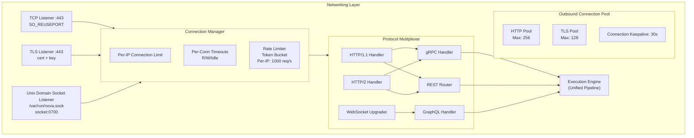
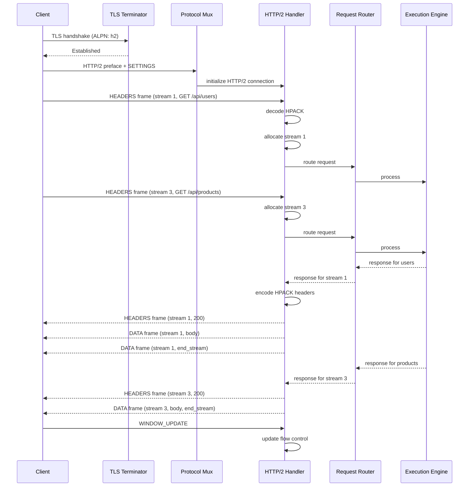
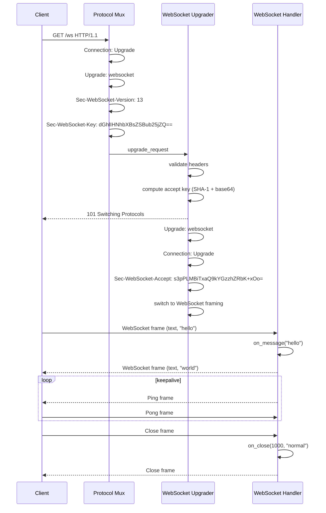
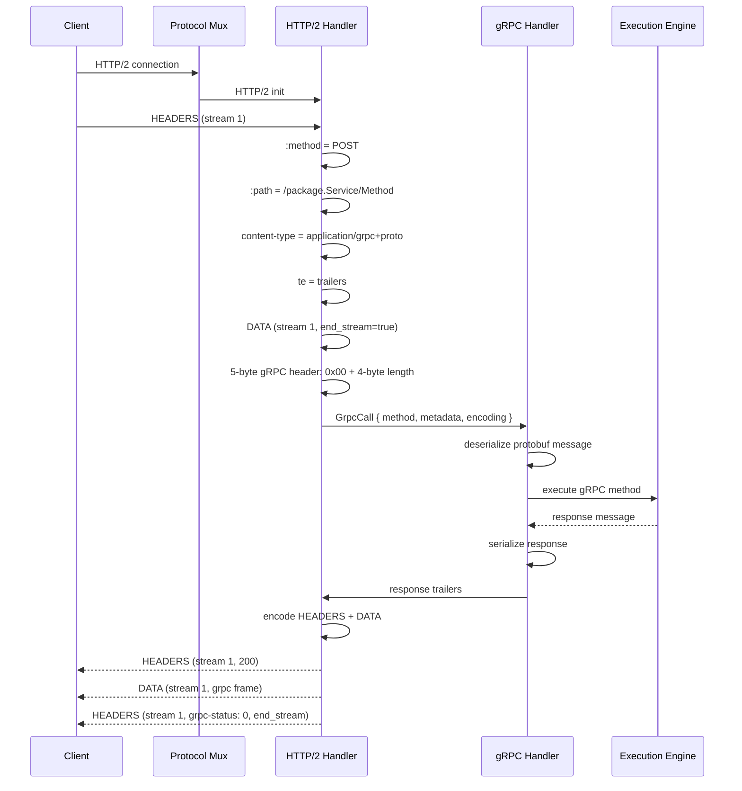
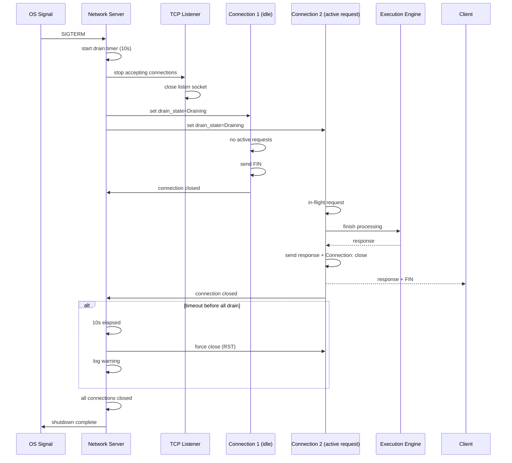

# 13. Networking

> **Implementation Status:** The actual networking layer uses axum with HTTP/1.1 and WebSocket support. HTTP/2, gRPC, Unix sockets, TLS listeners, and multiple listener support described in this spec are not implemented. The server listens on a single `127.0.0.1:8642` address.

## 1. Purpose

The Networking subsystem provides all network protocol handling for Nova Runtime. It is the external communication boundary through which all clients interact with the system. The Networking layer implements TCP listeners, TLS termination, HTTP/1.1 and HTTP/2 serving, WebSocket upgrade, gRPC transport (over HTTP/2), Unix domain socket support, connection management, rate limiting, and graceful shutdown. Every external request — whether REST API, GraphQL, gRPC, WebSocket, or internal IPC — enters through this layer and is routed to the Execution Engine for processing.

## 2. Scope

This document covers all network protocols, listeners, connection management, TLS configuration, protocol negotiation, HTTP/1.1 and HTTP/2 server implementation, WebSocket handling, gRPC transport, Unix domain socket listener, connection pooling for outbound connections, rate limiting, backpressure signaling, request size limits, timeouts, graceful connection draining, and all networking configuration parameters. This document does NOT cover DNS resolution (system-level), cluster networking (future distributed mode), or load balancer configuration (deployment-specific).

## 3. Responsibilities

- Manage TCP listeners on configurable ports with SO_REUSEPORT for socket sharding
- Terminate TLS 1.3 (required) with TLS 1.2 fallback (optional)
- Implement HTTP/1.1 and HTTP/2 protocol handlers with ALPN negotiation
- Support WebSocket upgrade from HTTP/1.1 and HTTP/2
- Implement gRPC transport layer over HTTP/2
- Provide Unix domain socket listener for local IPC
- Manage connection limits, per-client connection quotas
- Enforce read/write timeouts and idle timeout
- Enforce request size limits
- Implement rate limiting per connection and per IP
- Signal backpressure to clients when server is overloaded
- Manage graceful connection draining on shutdown
- Maintain outbound connection pool for inter-service calls (future)
- Expose connection-level metrics (active, idle, error counts)
- Handle protocol negotiation (TLS ALPN, HTTP upgrade)

## 4. Non Responsibilities

- Application-level routing (Execution Engine responsibility)
- Authentication/authorization (Auth subsystem)
- DNS resolution (operating system responsibility)
- Network-level firewalling (infrastructure responsibility)
- Load balancing across nodes (future distributed mode)
- Service mesh integration (deployment-specific)
- DDoS protection at network level (infrastructure responsibility)

## 5. Architecture



### 5.1 Core Components

**TCP Listener**: Accepts incoming TCP connections. Uses SO_REUSEPORT for socket sharding across worker threads. Each listener is configured for a specific address:port pair.

**TLS Terminator**: Handles TLS handshake, certificate loading, cipher suite negotiation. Supports TLS 1.3 mandatory, TLS 1.2 optional. ALPN for protocol negotiation.

**Connection Manager**: Manages connection lifecycle. Enforces per-IP connection limits, read/write/idle timeouts, rate limiting (token bucket per IP per endpoint). Tracks connection state for graceful draining.

**Protocol Multiplexer**: After TLS termination (or directly for plaintext), determines protocol from first bytes:
- HTTP/1.1: read request line
- HTTP/2: read connection preface (PRI * HTTP/2.0)
- WebSocket: detect Upgrade header in HTTP/1.1
- gRPC: detected via Content-Type header (application/grpc) in HTTP/2

**Outbound Connection Pool**: Manages connections to external services. Supports HTTP/1.1 keepalive and HTTP/2 multiplexing. Max connections per host, idle timeout, connection reuse.

### 5.2 Integration with Execution Engine

Every request that passes through the Networking layer is converted to an internal representation and sent to the Execution Engine. The Execution Engine processes the request and returns a response, which is then serialized back to the appropriate protocol format. This ensures:

1. All external requests pass through the unified execution pipeline
2. Network protocols are interchangeable — same logic serves REST, GraphQL, and gRPC
3. Request validation happens once, at the Execution Engine boundary
4. Middleware (auth, logging, rate limiting) applies uniformly regardless of protocol

## 6. Data Structures

### 6.1 Listener Configuration

```rust
/// Listener configuration
struct ListenerConfig {
    /// Listen address (IP + port or Unix socket path)
    address: ListenAddress,
    
    /// Protocol family
    protocol: ProtocolFamily,
    
    /// TLS configuration (None = plaintext)
    tls: Option<TlsConfig>,
    
    /// Maximum concurrent connections
    max_connections: u32,                     // Default: 1024
    
    /// Per-IP maximum connections
    max_connections_per_ip: u32,              // Default: 64
    
    /// Connection backlog
    backlog: u32,                             // Default: 512
    
    /// SO_REUSEPORT enabled (for socket sharding)
    reuse_port: bool,                         // Default: true
    
    /// TCP keepalive configuration
    tcp_keepalive: TcpKeepaliveConfig,
    
    /// Socket buffer sizes
    socket_send_buffer_size: Option<u32>,     // Default: None (OS default)
    socket_recv_buffer_size: Option<u32>,     // Default: None (OS default)
    
    /// TCP_NODELAY (disable Nagle's algorithm)
    tcp_nodelay: bool,                        // Default: true
    
    /// Fast Open (TFO) configuration
    tcp_fast_open: TcpFastOpenConfig,
    
    /// Accept thread pool size
    accept_threads: u16,                      // Default: number of CPU cores
    
    /// Enable/disable listener
    enabled: bool,
}

enum ListenAddress {
    Tcp { host: String, port: u16 },
    Unix { path: String, permissions: u32 },  // Unix socket file permissions
}

enum ProtocolFamily {
    Auto,         // HTTP/1.1 + HTTP/2 with ALPN
    Http1Only,
    Http2Only,
    Http1AndHttp2,
    Grpc,
    WebSocket,    // Dedicated WebSocket listener
    Raw,          // Raw TCP (for future custom protocols)
}

struct TlsConfig {
    /// Certificate and key paths
    certificate_path: String,
    private_key_path: String,
    private_key_password: Option<String>,     // Encrypted key support
    
    /// CA certificate for client certificate verification (mTLS)
    ca_certificate_path: Option<String>,
    
    /// Minimum TLS version
    min_version: TlsVersion,                  // Default: 1.3
    
    /// Allowed cipher suites
    cipher_suites: Vec<String>,               // Empty = all secure defaults
    
    /// Enable TLS 1.2 fallback
    enable_tls12: bool,                       // Default: false (1.3 only)
    
    /// ALPN protocols (default: ["h2", "http/1.1"])
    alpn_protocols: Vec<String>,
    
    /// Client certificate verification mode
    client_auth: ClientAuthMode,              // Default: None
    
    /// Session cache configuration
    session_cache: TlsSessionCacheConfig,
    
    /// OCSP stapling
    ocsp_stapling: OcspStaplingConfig,
}

enum TlsVersion {
    Tls10,        // Disabled by default, security risk
    Tls11,        // Disabled by default, security risk
    Tls12,        // Optional fallback
    Tls13,        // Required minimum
}

enum ClientAuthMode {
    None,               // No client certificate
    Request,            // Request but don't require
    Require,            // Require valid client certificate
    RequireAndVerify,   // Require + verify against CA
}

struct TlsKeepaliveConfig {
    /// Idle time before keepalive probe (Linux: tcp_keepalive_time)
    idle_seconds: u32,          // Default: 300 (5 minutes)
    
    /// Interval between probes (Linux: tcp_keepalive_intvl)
    probe_interval_seconds: u32, // Default: 75
    
    /// Number of probes before declaring dead (Linux: tcp_keepalive_probes)
    probe_count: u32,           // Default: 9
}

struct TcpFastOpenConfig {
    enabled: bool,              // Default: false
    queue_size: u32,            // Default: 256 (Linux: /proc/sys/net/ipv4/tcp_fastopen)
}

struct TlsSessionCacheConfig {
    enabled: bool,              // Default: true
    capacity: u32,              // Default: 2048 sessions
    ttl_seconds: u32,           // Default: 300 (5 minutes)
}

struct OcspStaplingConfig {
    enabled: bool,              // Default: false
    responder_url: Option<String>,  // Override OCSP responder URL
    refresh_interval_seconds: u32,  // Default: 3600 (1 hour)
}
```

### 6.2 Connection Management

```rust
/// Connection state
struct Connection {
    /// Unique connection ID
    id: u64,
    
    /// Connection metadata
    peer_addr: SocketAddr,
    local_addr: SocketAddr,
    
    /// Protocol after negotiation
    protocol: NegotiatedProtocol,
    
    /// TLS state
    tls: Option<TlsConnectionState>,
    
    /// Connection timestamps
    established_at: u64,        // Unix milliseconds
    last_activity_at: u64,      // Unix milliseconds
    
    /// Connection limits
    max_concurrent_streams: u32, // HTTP/2 max concurrent streams
    current_streams: u32,
    
    /// Rate limiter state (token bucket)
    rate_limiter: RateLimiterState,
    
    /// Request tracking
    total_requests: u64,
    total_bytes_received: u64,
    total_bytes_sent: u64,
    
    /// Connection drain state
    drain_state: DrainState,
    drain_deadline: Option<u64>,
}

enum NegotiatedProtocol {
    Http1Plain,
    Http1Tls,
    Http2Plain,     // h2c
    Http2Tls,       // h2
    WebSocket,
    Grpc,
    GrpcWeb,        // gRPC-Web (for browser clients)
    UnixSocket,
}

struct TlsConnectionState {
    version: TlsVersion,
    cipher_suite: String,
    server_name: Option<String>,     // SNI
    client_certificate: Option<Vec<u8>>, // DER-encoded client cert
    session_id: Option<Vec<u8>>,
    resumed: bool,                   // Session resumption
}

enum DrainState {
    Active,               // Normal operation
    Draining,             // No new requests, finishing in-flight
    DrainComplete,        // All requests finished, ready to close
    Closed,               // Connection closed
}

/// Rate limiter state
struct RateLimiterState {
    /// Token bucket parameters
    tokens_per_second: u32,         // Default: 1000
    burst_size: u32,                // Default: 2000
    current_tokens: f64,
    last_refill_at: u64,
    
    /// Per-endpoint limits (overrides)
    endpoint_limits: HashMap<String, EndpointLimit>,
}

struct EndpointLimit {
    path_pattern: String,           // Glob pattern: "/api/v1/users/*"
    tokens_per_second: u32,
    burst_size: u32,
}
```

### 6.3 HTTP Protocol Structures

```rust
/// HTTP request (internal representation)
struct HttpRequest {
    /// Request metadata
    method: HttpMethod,
    path: String,
    query: HashMap<String, Vec<String>>,
    headers: HeaderMap,
    protocol: HttpProtocol,
    
    /// Body
    body: Body,
    
    /// Connection info
    connection: ConnectionInfo,
    
    /// Trace context (extracted from headers)
    trace_context: TraceContext,
    
    /// Request ID (generated if not in headers)
    request_id: String,
}

struct HttpMethod {
    enum Method {
        Get, Head, Post, Put, Patch, Delete, Options, Trace, Connect,
    }
}

struct HttpProtocol {
    enum Protocol {
        Http10,
        Http11,
        Http2,
    }
}

struct ConnectionInfo {
    peer_addr: SocketAddr,
    local_addr: SocketAddr,
    connection_id: u64,
    tls: bool,
    tls_version: Option<String>,
    server_name: Option<String>,
}

/// HTTP response
struct HttpResponse {
    status: StatusCode,
    headers: HeaderMap,
    body: Body,
    trailers: Option<HeaderMap>,   // HTTP/2 trailers
}

/// Body types
enum Body {
    Empty,
    Bytes(Vec<u8>),
    Stream(Box<dyn Stream<Item = Bytes> + Send>),  // Streaming response
    File(FileDescriptor),                           // Zero-copy file serving
}

/// Header map (case-insensitive keys, multiple values per key)
struct HeaderMap {
    headers: Vec<(HeaderName, HeaderValue)>,
}

struct HeaderName(String);  // Lowercased interned string
struct HeaderValue(Vec<u8>);
```

### 6.4 HTTP/2 Specific Structures

```rust
/// HTTP/2 connection configuration
struct Http2Config {
    /// HPACK decoder table size
    header_table_size: u32,                 // Default: 4096
    
    /// Per-stream flow control window
    initial_stream_window_size: u32,        // Default: 65535
    
    /// Per-connection flow control window
    initial_connection_window_size: u32,    // Default: 65535
    
    /// Maximum concurrent streams per connection
    max_concurrent_streams: u32,            // Default: 256
    
    /// Maximum frame size
    max_frame_size: u32,                    // Default: 16384
    
    /// Maximum header list size
    max_header_list_size: u32,             // Default: 8192
    
    /// Ping interval (for keepalive)
    ping_interval_seconds: u32,             // Default: 30
    
    /// Ping timeout
    ping_timeout_seconds: u32,              // Default: 10
    
    /// Immediately reset streams that exceed max_concurrent
    strict_concurrent_streams: bool,        // Default: true
}

/// HTTP/2 frame types (internal)
enum Http2Frame {
    Data { stream_id: u32, data: Bytes, end_stream: bool, padded: bool },
    Headers { stream_id: u32, headers: HeaderMap, end_stream: bool, end_headers: bool, priority: Option<Priority> },
    Priority { stream_id: u32, exclusive: bool, depends_on: u32, weight: u8 },
    ResetStream { stream_id: u32, error_code: Http2ErrorCode },
    Settings { settings: Vec<(Http2SettingId, u32)> },
    PushPromise { stream_id: u32, promised_stream_id: u32, headers: HeaderMap },
    Ping { opaque_data: [u8; 8] },
    GoAway { last_stream_id: u32, error_code: Http2ErrorCode, debug_data: Option<Vec<u8>> },
    WindowUpdate { stream_id: u32, increment: u32 },
    Continuation { stream_id: u32, headers: Bytes, end_headers: bool },
}

enum Http2ErrorCode {
    NoError = 0,
    ProtocolError = 1,
    InternalError = 2,
    FlowControlError = 3,
    SettingsTimeout = 4,
    StreamClosed = 5,
    FrameSizeError = 6,
    RefusedStream = 7,
    Cancel = 8,
    CompressionError = 9,
    ConnectError = 10,
    EnhanceYourCalm = 11,
    InadequateSecurity = 12,
    Http11Required = 13,
}
```

### 6.5 WebSocket Structures

```rust
/// WebSocket frame
struct WebSocketFrame {
    fin: bool,
    opcode: WebSocketOpcode,
    mask: Option<[u8; 4]>,
    payload: Vec<u8>,
}

enum WebSocketOpcode {
    Continuation = 0x0,
    Text = 0x1,
    Binary = 0x2,
    Close = 0x8,
    Ping = 0x9,
    Pong = 0xA,
}

struct WebSocketConfig {
    /// Maximum frame size
    max_frame_size: u32,                    // Default: 65536
    
    /// Maximum message size (aggregated frames)
    max_message_size: u32,                  // Default: 1 MB
    
    /// Ping interval (server sends ping)
    ping_interval_seconds: u32,             // Default: 30
    
    /// Close timeout
    close_timeout_seconds: u32,             // Default: 5
    
    /// Enable per-message deflate extension
    permessage_deflate: bool,               // Default: true
    
    /// Compression level (0-9)
    compression_level: u8,                  // Default: 6
    
    /// Auto-respond to pings
    auto_pong: bool,                        // Default: true
}
```

### 6.6 gRPC Structures

```rust
/// gRPC call context
struct GrpcCall {
    /// Full method name: /package.Service/Method
    method: String,
    
    /// Deadline (Unix nanoseconds)
    deadline: Option<u64>,
    
    /// Metadata
    metadata: HeaderMap,
    
    /// Message encoding
    encoding: GrpcEncoding,
    
    /// Message type from Content-Type
    message_type: GrpcMessageType,
}

enum GrpcEncoding {
    Identity,   // No compression
    Gzip,
    Deflate,
    Snappy,
    Zstd,
}

enum GrpcMessageType {
    ProtoBuf,        // application/grpc+proto
    Json,            // application/grpc+json
    MessagePack,     // application/grpc+msgpack (custom extension)
}

/// gRPC frame (over HTTP/2 data frames)
struct GrpcFrame {
    /// 5-byte header: 1 byte flags + 4 bytes length
    flags: u8,
    /// LSB: 0 = uncompressed, 1 = compressed
    is_compressed: bool,
    message_length: u32,
    /// Message data
    data: Vec<u8>,
}

/// gRPC status codes (subset of standard gRPC)
enum GrpcStatus {
    Ok = 0,
    Cancelled = 1,
    Unknown = 2,
    InvalidArgument = 3,
    DeadlineExceeded = 4,
    NotFound = 5,
    AlreadyExists = 6,
    PermissionDenied = 7,
    ResourceExhausted = 8,
    FailedPrecondition = 9,
    Aborted = 10,
    OutOfRange = 11,
    Unimplemented = 12,
    Internal = 13,
    Unavailable = 14,
    DataLoss = 15,
    Unauthenticated = 16,
}
```

### 6.7 Outbound Connection Pool

```rust
/// Outbound connection pool configuration
struct OutboundPoolConfig {
    /// Maximum connections per host
    max_connections: u32,                   // Default: 256
    
    /// Maximum idle connections
    max_idle_connections: u32,              // Default: 64
    
    /// Idle timeout
    idle_timeout_seconds: u32,              // Default: 30
    
    /// Connection lifetime (max age)
    max_lifetime_seconds: u32,              // Default: 600 (10 minutes)
    
    /// Connection timeout
    connect_timeout_ms: u32,               // Default: 5000
    
    /// Request timeout
    request_timeout_ms: u32,               // Default: 30000
    
    /// TLS configuration for outbound connections
    tls: Option<OutboundTlsConfig>,
    
    /// Protocol preference
    prefer_http2: bool,                     // Default: true
    
    /// Retry configuration
    retry: OutboundRetryConfig,
}

struct OutboundTlsConfig {
    /// Skip certificate verification (development only)
    insecure_skip_verify: bool,             // Default: false
    
    /// CA certificate for verification
    ca_certificate_path: Option<String>,
    
    /// Client certificate for mTLS
    client_certificate_path: Option<String>,
    client_key_path: Option<String>,
    
    /// Server name override
    server_name_override: Option<String>,
}

struct OutboundRetryConfig {
    max_retries: u32,                       // Default: 3
    base_delay_ms: u32,                     // Default: 100
    max_delay_ms: u32,                      // Default: 5000
    retry_on_status: Vec<u16>,              // Default: [502, 503, 504]
}

/// Pooled connection
struct PooledConnection {
    id: u64,
    host: String,
    protocol: NegotiatedProtocol,
    created_at: u64,
    last_used_at: u64,
    idle_since: Option<u64>,
    in_use: bool,
    http2_available_streams: u32,
}
```

### 6.8 Request Limits

```rust
/// Request size and timeout limits
struct RequestLimits {
    /// Maximum request header size
    max_header_size: u32,                   // Default: 8192 (8 KB)
    
    /// Maximum request body size
    max_body_size: u64,                     // Default: 10485760 (10 MB)
    
    /// Maximum request body for specific content types
    max_body_size_by_type: HashMap<String, u64>,  // "application/json" → 2MB
    
    /// Maximum URL length
    max_url_length: u16,                    // Default: 4096
    
    /// Maximum query parameters
    max_query_parameters: u16,             // Default: 64
    
    /// Maximum headers
    max_headers: u16,                       // Default: 64
    
    /// Maximum header value size
    max_header_value_size: u16,             // Default: 4096
    
    /// Read timeout
    read_timeout_ms: u64,                   // Default: 30000 (30s)
    
    /// Write timeout
    write_timeout_ms: u64,                  // Default: 60000 (60s)
    
    /// Idle timeout (keepalive)
    idle_timeout_ms: u64,                   // Default: 120000 (2 min)
    
    /// Request timeout (total)
    request_timeout_ms: u64,                // Default: 60000 (60s)
    
    /// Graceful shutdown drain timeout
    drain_timeout_ms: u64,                 // Default: 10000 (10s)
}
```

## 7. Algorithms

### 7.1 Protocol Negotiation

```
Algorithm: NegotiateProtocol

Input:
  connection: TcpStream
  tls: Option<TlsConfig>
  server_config: ServerConfig

Output:
  NegotiatedProtocol

Steps:
  1. If TLS is configured:
     a. Perform TLS handshake:
        - Load certificate and private key
        - Present certificate to client
        - Negotiate TLS version (1.3 preferred, 1.2 fallback)
        - Negotiate cipher suite
        - Perform ALPN negotiation (advertise ["h2", "http/1.1"])
     b. Get ALPN result from TLS session
     c. If ALPN result == "h2": return Http2Tls
     d. If ALPN result == "http/1.1": return Http1Tls
     e. If no ALPN: fall back to HTTP/1.1 detection
  
  2. If plaintext (no TLS):
     a. Read first 24 bytes with 5-second timeout
     b. If bytes == "PRI * HTTP/2.0\r\n\r\nSM\r\n\r":
        - HTTP/2 starting preface
        - Return Http2Plain (h2c)
     c. If bytes match HTTP/1.1 request line pattern:
        - "GET /path HTTP/1.1\r\n..."
        - Return Http1Plain
     d. If bytes contain "GET /path HTTP/1.1" with Upgrade header:
        - Check for "Connection: Upgrade" and "Upgrade: websocket"
        - Return WebSocket (after upgrade handshake)
     e. If bytes contain "Content-Type: application/grpc":
        - Return Grpc
     f. If unknown:
        - Log warning, treat as HTTP/1.1 (most compatible default)
        - Return Http1Plain
  
  3. If Unix domain socket:
     a. Same as plaintext detection (step 2)
  
  4. Return detected protocol

Complexity: O(1) — constant time for initial byte inspection
```

### 7.2 Connection Acceptance and Rate Limiting

```
Algorithm: AcceptConnection

Input:
  listener: TcpListener
  connection_manager: ConnectionManager

Output:
  Result<Connection, RejectReason>

Steps:
  1. Accept TCP connection (non-blocking):
     a. Accept new socket from listener
     b. Set TCP_NODELAY (disable Nagle)
     c. Set socket send/recv buffer sizes
     d. Enable TCP keepalive with configured parameters
  
  2. Check global connection limit:
     a. active_connections = connection_manager.active_count
     b. If active_connections >= max_connections:
        - Send HTTP 503 (if protocol determined) or TCP RST
        - Increment rejected_connections_global metric
        - Return Err(GlobalLimitReached)
  
  3. Check per-IP connection limit:
     a. peer_ip = connection.peer_addr.ip()
     b. ip_count = connection_manager.connections_per_ip[peer_ip]
     c. If ip_count >= max_connections_per_ip:
        - Send HTTP 429 or TCP RST
        - Increment rejected_connections_ip metric
        - Return Err(PerIpLimitReached)
  
  4. Assign connection ID (monotonically increasing u64)
  5. Create Connection struct with initial state:
     a. Set established_at = now()
     b. Initialize rate limiter token bucket
     c. Set drain_state = Active
     d. Initialize counters to zero
  
  6. Register in connection_manager:
     a. Add to active_connections map
     b. Increment per-IP counter
     c. Schedule idle timeout watchdog
  
  7. Return Connection

Algorithm: RateLimitRequest

Input:
  connection: Connection
  request: HttpRequest

Output:
  Result<(), RateLimitDecision>

Steps:
  1. Refill tokens:
     a. elapsed = now() - connection.rate_limiter.last_refill_at
     b. refill = elapsed * connection.rate_limiter.tokens_per_second / 1000
     c. connection.rate_limiter.current_tokens = min(
          connection.rate_limiter.current_tokens + refill,
          connection.rate_limiter.burst_size
        )
     d. connection.rate_limiter.last_refill_at = now()
  
  2. Check per-endpoint override:
     a. For each endpoint_limit:
        - If request.path matches endpoint_limit.path_pattern
        - Use endpoint_limit.tokens_per_second/burst_size for this check
  
  3. Determine cost:
     a. base_cost = 1.0 (1 token per request)
     b. If request body > 0: body_cost = request.body.size() / 1024.0
     c. total_cost = base_cost + body_cost
  
  4. Check tokens:
     a. If connection.rate_limiter.current_tokens >= total_cost:
        - connection.rate_limiter.current_tokens -= total_cost
        - Return Ok (allow request)
     b. Else:
        - Compute retry_after = (total_cost - current_tokens) / tokens_per_second * 1000
        - Return Err(RateLimited { retry_after_ms: retry_after })
  
  5. Update connection.total_requests counter

Complexity: O(e) where e = endpoint_limits count (typically < 100)
```

### 7.3 HTTP/2 Stream Multiplexing

```
Algorithm: Http2StreamManagement

Input:
  http2_connection: Http2Connection
  frame: Http2Frame

Output:
  Dispatched to stream handler

Steps:
  1. Receive frame from connection
  2. Validate frame:
     a. Check stream ID is valid (odd = client-initiated for server)
     b. Check stream ID not in closed state (ignore RST on closed streams)
     c. Check frame size <= max_frame_size
     d. Check no header compression error
  
  3. Route frame by type:

     SETTINGS:
       a. Apply settings (ACK required)
       b. Update connection flow control windows
       c. Send SETTINGS ACK
       d. Apply server settings (from Http2Config)

     HEADERS / CONTINUATION:
       a. If new stream:
          - Check max_concurrent_streams not exceeded
          - If exceeded: send RST_STREAM with REFUSED_STREAM
          - Allocate new Stream struct
          - Begin header decompression (HPACK)
       b. If existing stream:
          - Continue header decompression
       c. On end_headers:
          - Process headers (extract :method, :path, :scheme, :authority)
          - Validate pseudo-header fields
          - Dispatch to request handler

     DATA:
       a. Check stream is in HalfClosedRemote or Open state
       b. Apply flow control:
          - Decrement connection window
          - Decrement stream window
          - If window exceeded: RST_STREAM with FLOW_CONTROL_ERROR
       c. Append data to stream buffer
       d. If end_stream: close stream for input
       e. Send WINDOW_UPDATE when window drops below threshold

     RST_STREAM:
       a. Terminate stream processing
       b. Clean up stream state
       c. Return any pending error to handler

     WINDOW_UPDATE:
       a. Increment connection or stream flow control window
       b. Unblock any waiting writes
  
     PING:
       a. If PING with ACK flag: ignore
       b. If PING without ACK: respond with ACK + same data
  
     GOAWAY:
       a. Set peer_going_away flag
       b. Process last_stream_id — stop initiating new streams
       c. Begin graceful shutdown of remaining streams

     PRIORITY:
       a. Update stream dependency tree
       b. Reorder scheduling weights

  4. On stream completion (both ends closed):
     a. Keep stream state for a short period (default: 5s) for in-order delivery
     b. After grace period, fully reclaim stream resources

Complexity: O(1) per frame, O(s) for stream state management (s = active streams)
```

### 7.4 Connection Draining (Graceful Shutdown)

```
Algorithm: GracefulDrain

Input:
  server: Server
  signal: ShutdownSignal (SIGTERM, SIGINT, SIGHUP)

Steps:
  1. Stop accepting new connections:
     a. Close all TCP listeners (stop accept loop)
     b. Start drain timer (default: 10 seconds)
  
  2. For each active connection:
     a. Set connection.drain_state = Draining
     b. If HTTP/1.1: send "Connection: close" header on next response
     c. If HTTP/2: send GOAWAY frame with:
        - last_stream_id = last accepted stream
        - error_code = NO_ERROR
        - Accept new streams only if they arrived before GOAWAY
     d. Set drain_deadline = now() + drain_timeout_ms
  
  3. Wait for connections to drain:
     a. For each draining connection:
        - In-flight requests continue processing normally
        - No new requests accepted on this connection
        - When all streams/requests complete: close connection
     b. Periodically check (every 100ms):
        - If no more active connections: proceed to step 4
        - If drain_timeout_ms elapsed: proceed to step 4
  
  4. Force close remaining connections:
     a. For each connection still in Draining state:
        - Log warning: "Force closing connection {id}, {n} in-flight requests"
        - Send TCP RST (immediate close, no FIN handshake)
        - Increment force_closed_connections metric
     b. Clear connection_manager state
  
  5. Signal server shutdown complete

Total drain time: min(drain_timeout_ms, max_in_flight_request_time)
  - Default drain timeout: 10 seconds
  - Force close after deadline to prevent hang during restart
```

### 7.5 TLS Session Resumption

```
Algorithm: TlsSessionResumption

Input:
  tls_session: TlsServerSession
  session_cache: TlsSessionCache

Output:
  Resumed (ticket-based) or Full handshake

Steps:
  1. Receive ClientHello:
     a. Extract session_id (for session ID-based resumption)
     b. Extract session_ticket extension (for ticket-based resumption)
  
  2. If session_ticket present:
     a. Decrypt ticket using server-side ticket key
     b. Validate ticket hasn't expired (check timestamp)
     c. If valid:
        - Restore session parameters (cipher suite, master secret)
        - Skip full handshake
        - Return Resumed
     d. If invalid/expired:
        - Issue new ticket
        - Fall through to full handshake
  
  3. If session_id present (TLS 1.2 fallback):
     a. Look up session in cache
     b. If found and valid:
        - Restore session
        - Return Resumed
     c. If not found:
        - Perform full handshake
        - Store new session in cache
  
  4. Full handshake:
     a. Send ServerHello with new session parameters
     b. Send Certificate
     c. Send ServerHelloDone
     d. Receive ClientKeyExchange
     e. Send ChangeCipherSpec + Finished
     f. Receive ChangeCipherSpec + Finished
     g. Generate and send new session ticket
  
  5. Return FullHandshake

Performance:
  - Full handshake: ~1-5ms (RTT-dependent)
  - Resumed handshake (ticket): ~0.1-1ms
  - Session cache hit rate target: > 90% (with appropriate TTL)

Key rotation:
  - Ticket key rotated every 24 hours (default)
  - Previous two keys retained for ticket validation during overlap period
```

### 7.6 WebSocket Upgrade

```
Algorithm: WebSocketUpgrade

Input:
  request: HttpRequest (HTTP/1.1 GET with Upgrade headers)

Output:
  Result<WebSocketConnection, HttpError>

Steps:
  1. Validate upgrade request:
     a. Method must be GET
     b. "Connection: Upgrade" header must be present
     c. "Upgrade: websocket" header must be present
     d. "Sec-WebSocket-Version: 13" (only v13 supported)
     e. "Sec-WebSocket-Key" must be present and base64-encoded (16 bytes)
     f. If any validation fails: return 400 Bad Request
  
  2. Check origin (if configured):
     a. If allowed_origins configured:
        - Check "Origin" header against allowed list
        - If not allowed: return 403 Forbidden
  
  3. Compute accept key:
     a. Concatenate key + "258EAFA5-E914-47DA-95CA-C5AB0DC85B11"
     b. Compute SHA-1 hash
     c. Base64 encode the hash → accept_key
  
  4. Switch to WebSocket protocol:
     a. Send 101 Switching Protocols response with:
        - "Upgrade: websocket"
        - "Connection: Upgrade"
        - "Sec-WebSocket-Accept: {accept_key}"
  
     b. Upgrade TCP stream to WebSocket framing:
        - Configure WebSocketConfig
        - Enable permessage-deflate if negotiated
        - Begin reading/writing WebSocket frames
  
  5. Return WebSocketConnection

Complexity: O(1) — fixed number of hash operations
```

## 8. Interfaces

### 8.1 Server Lifecycle

```rust
/// Networking server
trait NetworkServer: Send + Sync {
    /// Start listening on all configured listeners
    /// Returns immediately (non-blocking), server runs in background
    fn start(&self) -> Result<(), ServerError>;
    
    /// Graceful shutdown
    /// Blocks until drain completes or timeout
    fn shutdown(&self) -> Result<(), ServerError>;
    
    /// Check if server is running
    fn is_running(&self) -> bool;
    
    /// Get server metrics snapshot
    fn metrics(&self) -> NetworkMetrics;
    
    /// Reload TLS certificates (SIGHUP)
    fn reload_tls(&self) -> Result<(), TlsReloadError>;
}

enum ServerError {
    BindError { address: String, reason: String },
    TlsError { reason: String },
    ConfigError { reason: String },
    AlreadyRunning,
    NotRunning,
    ShutdownTimeout { force_closed: u32 },
    Internal(String),
}
```

### 8.2 Connection Manager

```rust
trait ConnectionManager: Send + Sync {
    /// Register a new connection
    fn register_connection(&self, conn: Connection) -> Result<(), ConnectionError>;
    
    /// Unregister a connection (on close)
    fn unregister_connection(&self, conn_id: u64);
    
    /// Get connection by ID
    fn get_connection(&self, conn_id: u64) -> Option<Connection>;
    
    /// Get all connections for a peer IP
    fn get_connections_by_ip(&self, ip: IpAddr) -> Vec<Connection>;
    
    /// Get active connection count
    fn active_count(&self) -> u32;
    
    /// Get per-IP connection counts
    fn per_ip_counts(&self) -> HashMap<IpAddr, u32>;
    
    /// Apply rate limit for a request
    fn check_rate_limit(&self, conn_id: u64, request: &HttpRequest) -> Result<(), RateLimitError>;
    
    /// Mark connection as draining
    fn begin_drain(&self, conn_id: u64, deadline: u64);
    
    /// Get all connections in draining state
    fn draining_connections(&self) -> Vec<Connection>;
    
    /// Force close a connection
    fn force_close(&self, conn_id: u64);
    
    /// Get connection metrics
    fn metrics(&self) -> ConnectionMetrics;
}

struct ConnectionMetrics {
    active_connections: u32,
    idle_connections: u32,
    draining_connections: u32,
    total_connections_accepted: u64,
    total_connections_closed: u64,
    total_requests_served: u64,
    total_bytes_received: u64,
    total_bytes_sent: u64,
    rejected_global_limit: u64,
    rejected_per_ip_limit: u64,
    rate_limited_requests: u64,
    force_closed_connections: u64,
}
```

### 8.3 HTTP Handler

```rust
/// HTTP request handler (called by protocol multiplexer)
trait HttpHandler: Send + Sync {
    /// Handle an HTTP request
    /// Returns an HTTP response
    fn handle_request(&self, request: HttpRequest) -> Result<HttpResponse, HttpError>;
    
    /// Handle streaming request (request body as stream)
    fn handle_streaming_request(
        &self,
        request: HttpRequest,
        body: Pin<Box<dyn Stream<Item = Result<Bytes, HttpError>> + Send>>,
    ) -> Pin<Box<dyn Stream<Item = Result<HttpResponse, HttpError>> + Send>>;
}

enum HttpError {
    BadRequest(String),
    NotFound(String),
    MethodNotAllowed(String),
    RequestTimeout,
    PayloadTooLarge { max: u64, actual: u64 },
    Internal(String),
    ServiceUnavailable(String),
}

impl HttpError {
    fn status_code(&self) -> u16;
    fn to_response(&self) -> HttpResponse;
}
```

### 8.4 WebSocket Handler

```rust
/// WebSocket event handler
trait WebSocketHandler: Send + Sync {
    /// Called when a new WebSocket connection is established
    fn on_open(&self, conn: &WebSocketConnection);
    
    /// Called when a text message is received
    fn on_message(&self, conn: &WebSocketConnection, message: String);
    
    /// Called when a binary message is received
    fn on_binary(&self, conn: &WebSocketConnection, data: Vec<u8>);
    
    /// Called when a ping is received
    fn on_ping(&self, conn: &WebSocketConnection, data: Vec<u8>);
    
    /// Called when a pong is received
    fn on_pong(&self, conn: &WebSocketConnection, data: Vec<u8>);
    
    /// Called when the connection is closing
    fn on_close(&self, conn: &WebSocketConnection, code: u16, reason: String);
    
    /// Called on error
    fn on_error(&self, conn: &WebSocketConnection, error: WebSocketError);
}

struct WebSocketConnection {
    id: u64,
    connection_id: u64,
    path: String,
    protocol: Option<String>,    // Sub-protocol negotiated
    extensions: Vec<String>,     // Negotiated extensions
    
    // Methods
    fn send_text(&self, message: &str) -> Result<(), WebSocketError>;
    fn send_binary(&self, data: &[u8]) -> Result<(), WebSocketError>;
    fn send_ping(&self, data: &[u8]) -> Result<(), WebSocketError>;
    fn close(&self, code: u16, reason: &str) -> Result<(), WebSocketError>;
}
```

### 8.5 gRPC Handler

```rust
/// gRPC method handler
trait GrpcHandler: Send + Sync {
    /// Handle a unary gRPC call (request → response)
    fn handle_unary(
        &self,
        call: GrpcCall,
        request: Vec<u8>,
    ) -> Result<Vec<u8>, GrpcStatus>;
    
    /// Handle a server-streaming call (request → stream of responses)
    fn handle_server_streaming(
        &self,
        call: GrpcCall,
        request: Vec<u8>,
    ) -> Pin<Box<dyn Stream<Item = Result<Vec<u8>, GrpcStatus>> + Send>>;
    
    /// Handle a client-streaming call (stream of requests → response)
    fn handle_client_streaming(
        &self,
        call: GrpcCall,
        requests: Pin<Box<dyn Stream<Item = Result<Vec<u8>, GrpcStatus>> + Send>>,
    ) -> Pin<Box<dyn Future<Output = Result<Vec<u8>, GrpcStatus>> + Send>>;
    
    /// Handle a bidirectional streaming call
    fn handle_bidi_streaming(
        &self,
        call: GrpcCall,
        requests: Pin<Box<dyn Stream<Item = Result<Vec<u8>, GrpcStatus>> + Send>>,
    ) -> Pin<Box<dyn Stream<Item = Result<Vec<u8>, GrpcStatus>> + Send>>;
}
```

### 8.6 Outbound Connection Pool

```rust
/// Outbound connection pool
trait OutboundPool: Send + Sync {
    /// Send an HTTP request (auto-selects connection from pool)
    fn send_request(&self, request: HttpRequest, host: &str) -> Result<HttpResponse, PoolError>;
    
    /// Send a request with custom timeout
    fn send_request_with_timeout(
        &self,
        request: HttpRequest,
        host: &str,
        timeout_ms: u64,
    ) -> Result<HttpResponse, PoolError>;
    
    /// Get connection health status
    fn host_health(&self, host: &str) -> HostHealth;
    
    /// Pre-warm connections to a host
    fn prewarm(&self, host: &str, count: u32) -> Result<(), PoolError>;
}

struct HostHealth {
    host: String,
    active_connections: u32,
    idle_connections: u32,
    pending_requests: u32,
    error_rate: f64,            // Last 60 seconds
    average_latency_ms: f64,
    last_error_at: Option<u64>,
    healthy: bool,
}

enum PoolError {
    ConnectionTimeout,
    RequestTimeout,
    NoAvailableConnection,
    HostUnreachable,
    TlsError(String),
    ProtocolError(String),
    AllHostsUnhealthy,
    Internal(String),
}
```

### 8.7 Metrics

```rust
/// Networking metrics snapshot
struct NetworkMetrics {
    // Listener metrics
    listeners: Vec<ListenerMetrics>,
    
    // Connection metrics
    connections: ConnectionMetrics,
    
    // Protocol metrics
    http1_requests: u64,
    http2_requests: u64,
    http2_streams_active: u32,
    websocket_connections: u32,
    websocket_messages_sent: u64,
    websocket_messages_received: u64,
    grpc_calls: u64,
    grpc_active_streams: u32,
    
    // Performance metrics
    request_latency_p50: f64,    // Milliseconds
    request_latency_p99: f64,
    request_latency_p999: f64,
    
    // Error metrics
    request_errors_4xx: u64,
    request_errors_5xx: u64,
    protocol_errors: u64,
    tls_handshake_errors: u64,
    
    // TLS metrics
    tls_full_handshakes: u64,
    tls_resumed_handshakes: u64,
    tls_session_cache_hits: u64,
    tls_session_cache_misses: u64,
    
    // Rate limiting
    rate_limited_requests_total: u64,
    backpressure_signals_sent: u64,
    
    // Outbound pool
    outbound_pool: OutboundPoolMetrics,
}

struct ListenerMetrics {
    address: String,
    protocol: String,
    tls: bool,
    accepted: u64,
    closed: u64,
    active: u32,
    errors: u64,
}

struct OutboundPoolMetrics {
    total_connections: u32,
    active_connections: u32,
    idle_connections: u32,
    requests_queued: u64,
    requests_completed: u64,
    connection_errors: u64,
    timeout_errors: u64,
}
```

## 9. Sequence Diagrams

### 9.1 HTTP/1.1 Request Lifecycle

```mermaid
sequenceDiagram
    participant Client
    participant Listener as TCP Listener
    parser participant CM as Connection Manager
    participant TLS as TLS Terminator
    participant Mux as Protocol Mux
    participant H1 as HTTP/1.1 Handler
    participant Router as Request Router
    participant EE as Execution Engine

    Client->>Listener: TCP SYN
    Listener->>Listener: accept (SO_REUSEPORT)
    Listener->>CM: register connection
    CM-->>Listener: Ok
    
    Client->>TLS: TLS ClientHello
    TLS->>TLS: TLS 1.3 handshake
    TLS->>TLS: ALPN: http/1.1
    TLS-->>Client: TLS ServerHello + Finished
    
    Client->>Mux: HTTP/1.1 request
    Mux->>Mux: parse request line
    Mux->>Mux: parse headers (limit: 8KB)
    Mux->>CM: check rate limit
    CM-->>Mux: Ok
    Mux->>Mux: read body (limit: 10MB)
    Mux->>H1: HttpRequest
    
    H1->>Router: route request
    Router->>EE: execute query/mutation
    EE-->>Router: Result
    
    Router-->>H1: HttpResponse
    H1->>Mux: serialize response
    Mux-->>Client: HTTP/1.1 response
    
    alt keepalive
        Client->>Mux: Next request (reuse connection)
    else close
        Client->>Client: Connection close
        Mux->>CM: unregister connection
    end
```

### 9.2 HTTP/2 Stream Multiplexing



### 9.3 WebSocket Upgrade



### 9.4 gRPC Unary Call



### 9.5 Graceful Shutdown



## 10. Failure Modes

### 10.1 Port Binding Failure

| Cause | Effect | Detection |
|-------|--------|-----------|
| Port already in use | Listener fails to start | Bind error on startup |
| Insufficient privileges | Cannot bind to privileged port (< 1024) | Permission denied error |
| Address already in use (without SO_REUSEPORT) | Bind error | AddressInUse error |

**Impact**: Server fails to start. Must resolve port conflict.

### 10.2 TLS Certificate Failure

| Cause | Effect | Detection |
|-------|--------|-----------|
| Certificate expired | TLS handshake fails for clients | TLS alerts, monitoring alerts |
| Private key inaccessible | TLS listener fails to start | Startup error |
| Certificate chain incomplete | Some clients reject connection | Intermittent TLS errors |
| OCSP responder unavailable | Cannot verify certificate status | OCSP fetch timeout |

**Impact**: Clients cannot connect over TLS. Fallback to plaintext if configured (not recommended).

### 10.3 Connection Exhaustion

| Cause | Effect | Detection |
|-------|--------|-----------|
| Too many concurrent clients | New connections rejected | Connection global limit reached metric |
| Connection leak (client doesn't close) | All connections consumed | Active connections at max, idle connections high |
| Slow clients (slowloris attack) | Connections held open with slow send | Long idle times, low throughput per connection |

**Impact**: Legitimate clients cannot connect. Denial of service.

### 10.4 Memory Exhaustion

| Cause | Effect | Detection |
|-------|--------|-----------|
| Large request bodies on many connections | Memory usage spikes | RSS growth, OOM risk |
| HTTP/2 stream state per connection | Memory per active stream | Stream count metric high |
| HPACK table per HTTP/2 connection | Memory per connection | Connection count × HPACK table size |

**Impact**: OOM killer terminates process. Degraded performance under memory pressure.

### 10.5 HTTP/2 Protocol Errors

| Cause | Effect | Detection |
|-------|--------|-----------|
| Client sends malformed frames | RST_STREAM or GOAWAY sent | Protocol error metrics |
| HPACK decoding failure | Connection error | Compression error metric |
| Flow control window starvation | Stream stalls | Zero window update rate metric |
| SETTINGS frame flood | CPU spike processing settings | Settings frame rate metric |

**Impact**: Individual streams or entire connections reset. Client retry required.

### 10.6 TLS Handshake Failure

| Cause | Effect | Detection |
|-------|--------|-----------|
| Cipher suite mismatch | Handshake failure | TLS alert metric |
| TLS version mismatch | Handshake failure | Version negotiation failure |
| Client certificate validation failure | Connection rejected (mTLS) | Client auth failure metric |
| SNI mismatch | Wrong certificate presented | SNI mismatch warning |

**Impact**: Client connection rejected. Logged for security monitoring.

### 10.7 Backpressure Cascading

| Cause | Effect | Detection |
|-------|--------|-----------|
| Execution Engine overloaded | Response latency increases | Request latency P99 increase |
| Slow upstream services | Connection pool exhaustion | Pool queue depth increase |
| Rate limiting triggered | Clients receive 429 | Rate limit metric increase |

**Impact**: Client-perceived slowdown. Backpressure propagates from Storage Engine → Execution Engine → Network → Client.

### 10.8 Outbound Connection Pool Exhaustion

| Cause | Effect | Detection |
|-------|--------|-----------|
| All connections to upstream in use | New requests queued | Pending requests metric increase |
| Upstream unreachable | Connections fail to establish | Connection error metric increase |
| Connection leaks in pool | Pool fills with dead connections | Stale connection count increase |

**Impact**: Internal services cannot reach upstream dependencies. Cascading failures.

## 11. Recovery Strategy

### 11.1 Port Binding Failure Recovery

1. Log the exact bind error (address, port, reason). Exit with clear error message suggesting resolution.
2. If address already in use, suggest checking for another instance: `lsof -i :<port>` (Linux) or equivalent.
3. If permission denied, suggest using `CAP_NET_BIND_SERVICE` capability or port > 1024.
4. If other listener configured on alternative port, server may still start (partial failure mode).

### 11.2 TLS Certificate Failure Recovery

1. **Expired certificate**: Auto-renew via Let's Encrypt/ACME protocol (if configured). Certificate reload via SIGHUP without restart. If ACME not configured, log warning 30 days before expiry.
2. **Key access failure**: Log error and fail startup. Do NOT start without TLS (unless explicit `tls_optional: true`).
3. **Certificate reload**: `reload_tls()` reloads certificates from configured paths. Called on SIGHUP. If reload fails, old certificate continues to be used. Log error.

### 11.3 Connection Exhaustion Recovery

1. **Reactive**: When connection count approaches limit (80% threshold), log warning. New connections receive 503 Service Unavailable with `Retry-After` header.
2. **Proactive**: Reduce idle timeout to close idle connections faster. Enable TCP keepalive to detect dead peers.
3. **Connection leak detection**: Background task scans for connections idle > idle_timeout * 2. Force close with warning log.

### 11.4 Memory Exhaustion Recovery

1. **Per-connection limits**: Enforce max_body_size per request. Reject oversized bodies with 413 Payload Too Large.
2. **Stream limits**: Enforce max_concurrent_streams per HTTP/2 connection.
3. **Memory monitoring**: If RSS exceeds configurable threshold (default: 80% of system memory), begin graceful degradation:
   - Reduce max_concurrent_streams by 25%
   - Reduce max_header_size by 50%
   - Reject new connections with 503
   - Log memory pressure warning

### 11.5 HTTP/2 Protocol Error Recovery

1. **Per-stream errors**: Send RST_STREAM with appropriate error code. Continue processing other streams on same connection.
2. **Connection-level errors**: Send GOAWAY with last_stream_id. Close connection after in-flight streams complete. Client must reconnect.
3. **HPACK errors**: Fatal connection error. Close connection immediately. Log error for investigation.

### 11.6 TLS Handshake Failure Recovery

1. Log the failure with client IP, TLS version, cipher suite attempted, and error reason.
2. If client uses unsupported TLS version, include supported versions in TLS alert.
3. Rate limit TLS handshake attempts per IP (default: 10/sec) to mitigate brute force.

### 11.7 Backpressure Recovery

1. **Detect overload**: Monitor request queue depth in Execution Engine. If depth > threshold, begin rate limiting at Networking layer.
2. **Apply backpressure**: Return 429 Too Many Requests with `Retry-After: <seconds>` header. Token bucket refill rate reduced by 50% during overload.
3. **Recover**: When queue depth drops below threshold (sustained for 30 seconds), gradually restore normal rate limits over 10 seconds (to avoid thundering herd).

### 11.8 Outbound Pool Recovery

1. **Connection timeout**: Retry with backoff (100ms base, 5s max, 3 retries). Circuit breaker pattern: after 10 consecutive failures to a host, mark as unhealthy for 30 seconds.
2. **Pool full**: Queue request up to `max_pending` (default: 256). If queue full, return error to caller. Increase pool size temporarily if sustained demand.
3. **Health check**: Background task pings upstream hosts every 10 seconds. Restores healthy status when ping succeeds.

## 12. Performance Considerations

### 12.1 Throughput Targets

| Scenario | Target | Measurement |
|----------|--------|-------------|
| HTTP/1.1 pipelining | 50,000 req/s | Single connection, small requests |
| HTTP/2 multiplexing (100 streams) | 200,000 req/s | Single connection, 100 concurrent streams |
| HTTP/2 multiplexing (1000 connections) | 1,000,000 req/s | 1000 connections × 100 streams each |
| TLS 1.3 full handshake | 10,000 handshakes/s | Single core |
| TLS 1.3 session resumption | 50,000 handshakes/s | Single core (session ticket) |
| WebSocket messages (small) | 500,000 msg/s | Echo server, single connection |
| gRPC unary calls | 100,000 calls/s | 1000 connections, small messages |
| Static file serving (zero-copy) | 5 Gbps throughput | sendfile/splice |

### 12.2 Memory Budget

| Component | Memory | Notes |
|-----------|--------|-------|
| Per-TCP connection | ~4 KB | Kernel buffer + socket struct |
| Per-TLS connection | ~8 KB | TLS session state + buffers |
| Per-HTTP/1.1 connection | ~16 KB | Request/response buffers |
| Per-HTTP/2 connection | ~64 KB | HPACK table + stream table |
| Per-HTTP/2 stream | ~4 KB | In-flight request/response state |
| Per-WebSocket connection | ~32 KB | Frame buffer + deflate state |
| Per-outbound pooled connection | ~8 KB | Socket + metadata |

**Default memory budget**: 256 MB for networking (handles ~10,000 concurrent connections).

### 12.3 CPU Budget

| Operation | CPU Cost | Per-request |
|-----------|----------|-------------|
| TCP accept | ~500ns | 1x |
| TLS 1.3 handshake (full) | ~100μs | 1x per connection lifetime |
| TLS 1.3 short record decrypt | ~1μs per 16KB | For each TLS record |
| HTTP/1.1 parse (small request) | ~2μs | 1x |
| HTTP/2 frame decode | ~500ns | Per frame |
| HPACK encode 10 headers | ~2μs | 1x per response |
| HPACK decode 10 headers | ~3μs | 1x per request |
| WebSocket frame encode | ~300ns | Per frame |
| gRPC message framing | ~1μs | Per message |
| Token bucket rate check | ~100ns | Per request |

### 12.4 Zero-Copy Optimization

For responses that serve static files or large blobs:
1. Use `sendfile()` system call for file-to-socket transfer (Linux).
2. Use `splice()` for pipe-to-socket transfer.
3. Use `MSG_ZEROCOPY` for large buffer transmissions (kernel 4.14+).
4. Avoid copying between user/kernel boundaries for large payloads.

### 12.5 SO_REUSEPORT Socket Sharding

SO_REUSEPORT allows multiple sockets to bind to the same port. The kernel distributes incoming connections across sockets (hash-based on 4-tuple).

Benefits:
- Eliminates accept() thundering herd
- Each worker thread has its own accept queue
- Lock-free accept per thread
- Near-linear scaling with core count

Configuration:
- One listener socket per `accept_threads` (default: number of CPU cores)
- Each socket in a separate thread pinned to its own CPU core
- Connection accepted and processed on same thread (thread-per-core model)

### 12.6 Connection Limits Table

| Parameter | Default | Min | Max | Rationale |
|-----------|---------|-----|-----|-----------|
| Max connections | 1024 | 64 | 100000 | Balance memory vs scale |
| Max connections/IP | 64 | 1 | 10000 | Prevent single-client abuse |
| Backlog | 512 | 128 | 65535 | Accept queue depth |
| Read timeout | 30s | 1s | 300s | Slow client protection |
| Write timeout | 60s | 1s | 300s | Slow network protection |
| Idle timeout | 120s | 10s | 3600s | Keepalive resource cleanup |
| Request timeout | 60s | 1s | 3600s | Total request SLA |
| Rate limit | 1000 req/s | 0 | 100000 | Per IP, base rate |
| Burst size | 2000 | rate | rate*10 | Allow short bursts |

## 13. Security

### 13.1 Threat Model

| Threat | Vector | Impact | Mitigation |
|--------|--------|--------|------------|
| TLS downgrade | Man-in-the-middle forces TLS 1.0/1.1 | Eavesdropping, tampering | TLS 1.3 required; TLS 1.2 as configurable fallback only; 1.0/1.1 rejected by default |
| Certificate spoofing | Attacker presents fake cert | Impersonation | Certificate validation; OCSP stapling; CA pinning optional |
| Slowloris DoS | Slow HTTP headers sent byte-by-byte | Connection exhaustion | Read timeout; minimum throughput rate (1 byte/sec minimum) |
| HTTP/2 rapid reset | Rapid stream creation/RST cycle | CPU exhaustion | Rate limit stream creation (100/sec per connection) |
| HPACK bomb | Compressed headers that decompress to huge size | Memory exhaustion | Max header list size (8KB uncompressed limit) |
| Request smuggling | Ambiguous content-length/transfer-encoding | Cache poisoning, request hijacking | Strict RFC 7230 compliance; reject ambiguous requests |
| WebSocket hijacking | Cross-origin WebSocket connection | Data exfiltration | Origin validation; Same-Origin Policy enforcement |
| gRPC reflection abuse | Enumerate all gRPC methods | Information disclosure | gRPC reflection disabled by default; require auth |
| TLS renegotiation | TLS renegotiation attack | Plaintext injection | TLS renegotiation disabled (TLS 1.3 does not support renegotiation) |
| Side-channel timing | Timing attack on private key operations | Key extraction | Constant-time crypto operations; all major TLS libraries implement this |

### 13.2 Security Controls

1. **TLS minimum version**: TLS 1.3 required. TLS 1.2 only with explicit configuration. TLS 1.0/1.1 never accepted.
2. **Cipher suite restriction**: Only AEAD ciphers allowed (AES-GCM, ChaCha20-Poly1305). No RC4, 3DES, CBC mode ciphers.
3. **Perfect Forward Secrecy**: Only ECDHE and DHE key exchanges. No static RSA key exchange.
4. **HSTS header**: Sent on all HTTPS responses (`Strict-Transport-Security: max-age=31536000; includeSubDomains`).
5. **Security headers**:
   - `X-Content-Type-Options: nosniff`
   - `X-Frame-Options: DENY`
   - `X-XSS-Protection: 0` (deprecated but harmless)
   - `Referrer-Policy: strict-origin-when-cross-origin`
   - `Content-Security-Policy: default-src 'self'` (configurable)
   - `Permissions-Policy: camera=(), microphone=(), geolocation=()`
6. **Request validation**: All incoming requests validated for malformed syntax. Reject with 400 Bad Request.
7. **Response splitting prevention**: Header values sanitized (no CR/LF injection).
8. **Path traversal prevention**: URL paths normalized and validated. `..` traversal blocked.
9. **Method override prevention**: Only HTTP methods allowed as configured. POST method override via `X-HTTP-Method-Override` header optionally configurable.
10. **Client IP extraction**: `X-Forwarded-For` header used only from trusted proxies (configurable proxy CIDR ranges).

### 13.3 Rate Limiting Strategy

- **Per-IP rate limit**: Token bucket, 1000 req/s default, 2000 burst
- **Per-connection rate limit**: Same token bucket applied at connection level
- **Per-endpoint rate limit**: Configurable per path pattern (e.g., `/api/v1/auth/login`: 20 req/s)
- **Global rate limit**: Optional total server-wide rate limit (default: disabled)
- **Rate limit headers**: `X-RateLimit-Limit`, `X-RateLimit-Remaining`, `X-RateLimit-Reset` sent on all responses
- **Rate limit exceeded**: 429 Too Many Requests with `Retry-After` header

### 13.4 Secure Defaults

- TLS enabled by default (auto-generate self-signed cert for development)
- Plaintext listener disabled by default
- TLS 1.2 fallback disabled by default
- All timeouts set to reasonable defaults (not infinite)
- Request body limits enforced (10MB default)
- WebSocket origin validation enabled
- gRPC reflection disabled
- Unix socket permissions 0700 (owner-only)

## 14. Testing

### 14.1 Unit Tests

| Test | Description | Coverage |
|------|-------------|----------|
| HTTP/1.1 request parsing | Valid requests, edge cases, malformed | 40 test cases |
| HTTP/1.1 response formatting | All status codes, headers, chunked encoding | 30 test cases |
| HTTP/2 frame encode/decode | All frame types, flags, stream IDs | 50 test cases |
| HTTP/2 HPACK encode/decode | Static table, dynamic table, Huffman | 25 test cases |
| HTTP/2 flow control | Window updates, stream/connection limits | 20 test cases |
| TLS session resumption | Full handshake, ticket-based, ID-based | 15 test cases |
| WebSocket frame encode/decode | All opcodes, masking, fragmentation | 20 test cases |
| WebSocket upgrade handshake | Valid, missing headers, wrong version | 15 test cases |
| gRPC frame encode/decode | 5-byte header, compression flag | 10 test cases |
| Token bucket rate limiter | Refill, consume, burst, overflow | 15 test cases |
| Connection ID generation | Uniqueness, monotonicity | 5 test cases |
| Rate limit endpoint matching | Glob pattern match against paths | 10 test cases |

### 14.2 Integration Tests

| Test | Description |
|------|-------------|
| HTTP/1.1 request-response cycle | Full request processing through all layers |
| HTTP/2 multiplexed requests | 100 concurrent streams on one connection |
| HTTP/1.1 to HTTP/2 protocol detection | ALPN negotiation |
| TLS handshake + HTTP/1.1 | Full TLS 1.3 handshake then HTTP |
| TLS handshake + HTTP/2 | ALPN "h2" negotiation |
| WebSocket upgrade + message exchange | Upgrade, send text, receive text, close |
| gRPC unary call | Full gRPC lifecycle with protobuf messages |
| gRPC server streaming | Multiple response messages |
| gRPC client streaming | Multiple request messages |
| gRPC bidirectional streaming | Concurrent message exchange |
| Unix domain socket | HTTP/1.1 over UDS |
| Connection draining | Graceful shutdown with active requests |
| Rate limiting | Exceed rate, get 429, wait, retry |
| Request size limits | Exceed max_body_size, get 413 |
| Idle timeout | Connection idle → timeout → close |
| Keepalive with pipelining | Multiple HTTP/1.1 requests on same connection |
| Multiple listeners | TCP + TLS + UDS simultaneously |

### 14.3 Performance Tests

| Test | Description | Target |
|------|-------------|--------|
| HTTP/1.1 throughput | Maximum requests/second with keepalive | 100,000 req/s |
| HTTP/2 throughput | Maximum requests/second with multiplexing | 500,000 req/s |
| TLS handshake rate | New TLS connections/second | 10,000/s |
| TLS resumption rate | Resumed TLS connections/second | 50,000/s |
| WebSocket throughput | Messages/second through echo server | 500,000 msg/s |
| gRPC throughput | Unary calls/second | 100,000 calls/s |
| Concurrent connections | Maximum sustained concurrent connections | 10,000 |
| Streaming throughput | Throughput for large streaming responses | 5 Gbps |
| Rate limiter overhead | Additional latency with rate limiting | < 10μs |
| Graceful drain time | Time to drain N active connections | < 10s |

### 14.4 Chaos Tests

| Test | Description |
|------|-------------|
| Random TLS renegotiation attempts | Must be rejected |
| Partial writes on TLS connections | Must not leak data |
| HTTP/2 SETTINGS flood | Must not exhaust CPU |
| Rapid stream create/reset | Must not leak memory |
| Slow client (1 byte/sec) | Must timeout and close |
| Large headers (10,000 headers) | Must reject with 431 |
| Malformed HPACK input | Must not panic |
| Too many concurrent WebSocket connections | Must enforce limit |
| TLS certificate rotation during active connections | Old cert continues, new connections use new cert |
| Network partition simulation | Outbound pool circuit breaker activates |
| Simultaneous SIGHUP during high load | TLS cert reload succeeds without dropping connections |

### 14.5 Security Tests

| Test | Description |
|------|-------------|
| TLS 1.0/1.1 connection attempt | Must be rejected |
| Weak cipher suite negotiation | Must be rejected |
| Client certificate validation (mTLS) | Must validate chain |
| HTTP request smuggling | Must reject ambiguous requests |
| Path traversal in URL | Must normalize and reject `..` |
| CRLF injection in headers | Must sanitize header values |
| Slowloris attack simulation | Must timeout and close |
| HTTP/2 rapid reset attack | Must rate-limit and close |
| WebSocket cross-origin check | Must reject disallowed origins |
| gRPC reflection without auth | Must reject unauthenticated requests |
| HPACK bomb attack | Must enforce header size limits |
| TLS session hijack attempt | Must reject forged session tickets |

## 15. Future Work

1. **HTTP/3 (QUIC)**: Add HTTP/3 support over QUIC for reduced latency, improved multiplexing (no head-of-line blocking), and better mobile performance.
2. **Connection migration**: Support TCP connection migration for zero-downtime restarts (reuse connections across process restarts via `SO_REUSEPORT` + fd passing).
3. **Advanced load shedding**: Implement coordinated load shedding with Execution Engine — adaptive rate limit adjustment based on system load.
4. **Proxy protocol v2**: Support PROXY protocol for passing through client IP from load balancers (HAProxy, AWS NLB, etc.).
5. **WebTransport**: Support WebTransport protocol (HTTP/3-based replacement for WebSocket).
6. **gRPC-Web**: First-class support for gRPC-Web transport for browser clients (currently supported via content-type detection, needs dedicated handler).
7. **Connection pooling for HTTP/2**: Currently supports HTTP/1.1 keepalive pool and HTTP/2 multiplexing. Future: unified pool that negotiates best protocol per upstream.
8. **TLS early data (0-RTT)**: Support TLS 1.3 early data for idempotent requests to reduce latency.
9. **Kernel TLS (kTLS)**: Use kernel-level TLS offload for reduced CPU usage on large transfers.
10. **io_uring integration**: Use Linux io_uring for async I/O on listeners (reduced syscall overhead).
11. **Dynamic listener configuration**: Add/remove listeners at runtime without restart (via admin API).
12. **Access log streaming**: Structured access log streaming to configured output (file, stdout, event bus).
13. **DNS service discovery**: Dynamic resolution of upstream hosts for outbound pool, with health-based weighted selection.
14. **mTLS for inter-service communication**: Internal mTLS between Nova Runtime components (for future distributed mode).

## 16. Open Questions

1. **Should we support HTTP/1.0?** HTTP/1.0 is still used by some legacy clients and monitoring systems. Cost: minimal implementation effort. Benefit: compatibility. Decision: Support HTTP/1.0 for backward compatibility but log warning. HTTP/1.0 clients get `Connection: close` (no keepalive).

2. **H2C (cleartext HTTP/2) support?** h2c is not supported by browsers but is used by some internal tools and proxies. Decision: Support h2c for flexibility but disabled by default. Enable via `protocol_family: Http1AndHttp2` with `Http2Plain` support.

3. **What is the optimal HTTP/2 initial window size?** RFC 7541 default: 65,535 bytes. For high-latency links, larger windows (1MB+) improve throughput. For low-latency, smaller windows reduce memory. Decision: Start with RFC default (65,535). Make configurable via `initial_stream_window_size` and `initial_connection_window_size`.

4. **Should WebSocket permessage-deflate be enabled by default?** Compression improves bandwidth but adds CPU cost and per-frame latency. For text-heavy protocols (JSON over WebSocket), compression is beneficial. For binary protocols (game state, audio), compression may hurt. Decision: Enabled by default, configurable with compression level 6.

5. **gRPC message encoding: protocol buffers only, or support JSON/MessagePack?** Protobuf is the standard gRPC encoding. JSON is useful for debugging. MessagePack aligns with internal serialization. Decision: Support all three. Protobuf for production (best performance, schema enforcement). JSON for dev/debug. MessagePack for internal services.

6. **How to handle TLS certificate auto-renewal?** ACME/Let's Encrypt integration: automatic certificate issuance and renewal. But this requires the server to be reachable on port 80 (HTTP-01 challenge) or port 443 (TLS-ALPN-01). Decision: Support TLS-ALPN-01 challenge (requires port 443). HTTP-01 challenge optional for backward compatibility.

7. **Should Unix domain socket support credential passing (SO_PEERCRED)?** For local IPC, knowing the peer's UID/GID enables socket-level authentication. This is useful for admin tools and local CLI. Decision: Support SO_PEERCRED on Unix sockets. Expose peer UID/GID in ConnectionInfo for middleware to use in auth decisions.

8. **What is the right strategy for handling TLS session ticket key rotation?** Stateless tickets with rotating keys: each ticket contains encrypted session state. Keys rotated every 24 hours, previous 2 keys retained for validation. This eliminates server-side session cache while maintaining resumption capability.

## 17. References

- **HTTP/1.1**: RFC 7230-7235 — HTTP/1.1 message syntax, semantics, caching, authentication
- **HTTP/2**: RFC 7540 — HTTP/2 binary protocol, HPACK, flow control, stream multiplexing
- **HPACK**: RFC 7541 — HTTP/2 header compression
- **TLS 1.3**: RFC 8446 — Transport Layer Security version 1.3
- **TLS 1.2**: RFC 5246 — Transport Layer Security version 1.2 (fallback only)
- **ALPN**: RFC 7301 — Application-Layer Protocol Negotiation
- **WebSocket**: RFC 6455 — WebSocket protocol
- **WebSocket permessage-deflate**: RFC 7692 — WebSocket per-message compression
- **gRPC**: https://grpc.io/docs/ — gRPC specification
- **gRPC-Web**: https://github.com/grpc/grpc-web — gRPC for browser clients
- **SO_REUSEPORT**: Linux man 7 socket — Socket SO_REUSEPORT option
- **TCP keepalive**: Linux man 7 tcp — TCP keepalive parameters
- **Token bucket**: "Token bucket traffic policing" — Wikipedia
- **ACME**: RFC 8555 — Automatic Certificate Management Environment (Let's Encrypt)
- **HSTS**: RFC 6797 — HTTP Strict Transport Security
- **OCSP Stapling**: RFC 6961 — TLS Certificate Status Request extension
- **sendfile**: Linux man 2 sendfile — Zero-copy file transmission
- **io_uring**: https://kernel.dk/io_uring.pdf — Linux async I/O framework
