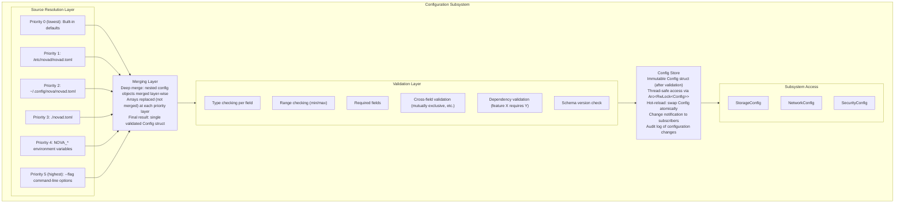
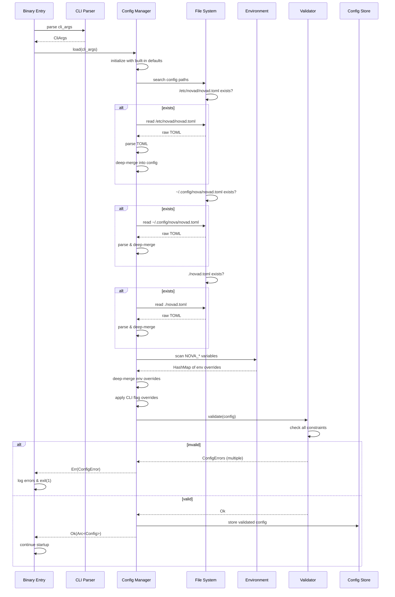
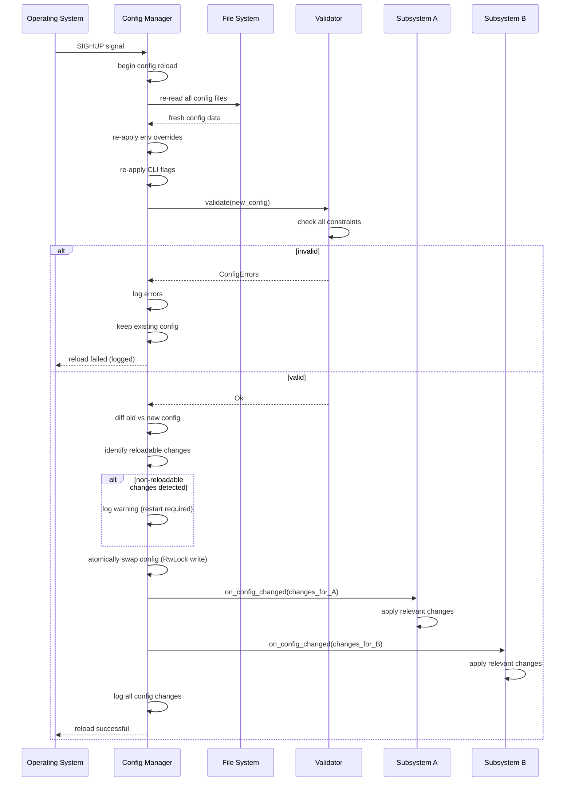
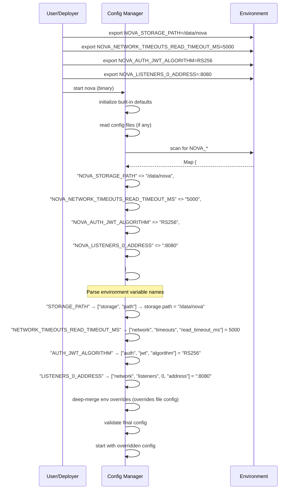
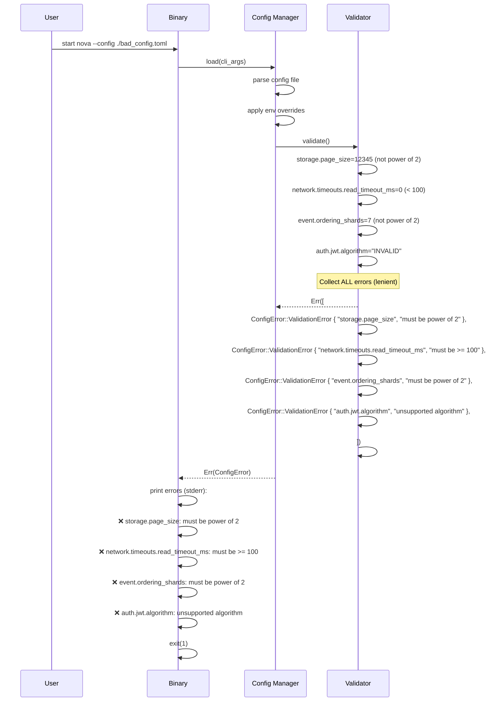

# 14. Configuration

## 1. Purpose

The Configuration subsystem provides a unified, hierarchical configuration system for Nova Runtime. It manages all configuration parameters — server settings, subsystem options, TLS certificates, storage paths, network interfaces, rate limits, and feature flags — through a consistent interface with multiple override layers: file (TOML/YAML), environment variables, command-line flags, and hot-reload via SIGHUP. The Configuration system ensures that every parameter has a validated default, every source of truth is clear, and every change is auditable.

## 2. Scope

This document covers the complete configuration management system: configuration file format (TOML primary, YAML secondary), environment variable naming convention (NOVA_ prefix), command-line flag parsing, configuration search paths, hot-reload mechanisms, validation at startup, configuration versioning, schema definition, secrets management principles, the default configuration shipped with the binary, and the complete configuration schema with all fields, types, defaults, and descriptions. This document does NOT cover runtime API-based configuration changes (future admin API), per-request overrides, or cluster-wide configuration distribution.

## 3. Responsibilities

- Define and enforce the complete configuration schema
- Parse configuration from multiple sources with priority ordering
- Manage configuration search paths (`/etc/novad/`, `~/.config/nova/`, `./novad.toml`)
- Support hot-reload of configuration on SIGHUP (for supported parameters)
- Validate configuration at startup and on hot-reload
- Provide type-safe access to configuration values
- Support environment variable override for all configuration parameters
- Support command-line flag override for common parameters
- Manage secrets via environment variables or external vault (never in config file)
- Ship a complete default configuration
- Log configuration changes for audit purposes
- Expose current configuration via admin endpoint

## 4. Non Responsibilities

- Runtime API-based configuration changes (future admin API v2)
- Per-request or per-session configuration overrides
- Cluster-wide configuration distribution (future distributed mode)
- Feature flag management for A/B testing (application responsibility)
- Dynamic plugin configuration (future plugin system)
- Configuration encryption at rest (delegated to OS/filesystem)

## 5. Architecture



### 5.1 Configuration Priority

Each configuration source has a priority level. Higher priority overrides lower priority on a per-key basis (deep merge):

| Priority | Source | Example | Override Level |
|----------|--------|---------|----------------|
| 0 | Built-in defaults | Compiled into binary | Base values |
| 1 | System config | `/etc/novad/novad.toml` | System-wide defaults |
| 2 | User config | `~/.config/nova/novad.toml` | Per-user overrides |
| 3 | Local config | `./novad.toml` | Project-specific overrides |
| 4 | Environment vars | `NOVA_STORAGE_PATH=/data` | Container/deployment config |
| 5 | CLI flags | `--storage-path /data` | One-time overrides |

**Array semantics**: At each priority level, arrays are replaced entirely (not merged). This prevents accidental duplication (e.g., multiple `--listen` flags replace rather than accumulate, unless explicitly documented as cumulative).

### 5.2 Hot-Reload

On SIGHUP signal:
1. Configuration subsystem re-reads all file sources
2. Re-applies environment variable overrides
3. Re-validates the complete configuration
4. If valid: atomically swaps the global Config struct
5. Notifies all registered subscribers of changed parameters
6. If invalid: logs error, keeps existing configuration, continues running

**Reloadable parameters**: Only safe-to-change-at-runtime parameters support hot-reload:
- Logging level and output
- Rate limits
- Timeout values
- Feature flags
- Listener TLS certificates
- Cache TTLs

**Non-reloadable parameters** (require restart):
- Storage path
- Listen addresses (add/remove listeners — future work)
- Authentication provider configuration
- Storage engine page size
- Maximum document size

### 5.3 Schema Versioning

Configuration files include a `config_version` field (integer, starting at 1). On startup:
1. Parse config file
2. Check `config_version` against current version
3. If version matches: apply config normally
4. If version is behind: apply compatibility transforms (forward-compatible)
5. If version is ahead (unrecognized): warn but attempt to apply known fields, ignore unknown fields

## 6. Data Structures

### 6.1 Root Configuration

```rust
/// Root configuration structure — represents the complete configuration
struct Config {
    /// Configuration schema version
    config_version: u32,                          // Default: 1, Current: 1
    
    /// Node identity
    node: NodeConfig,
    
    /// Global settings
    global: GlobalConfig,
    
    /// Storage engine configuration
    storage: StorageConfig,
    
    /// Networking configuration
    network: NetworkConfig,
    
    /// Event system configuration
    event: EventConfig,
    
    /// Execution engine configuration
    execution: ExecutionConfig,
    
    /// Cache subsystem configuration
    cache: CacheConfig,
    
    /// SQL layer configuration
    sql: SQLConfig,
    
    /// Queue subsystem configuration
    queue: QueueConfig,
    
    /// Scheduler subsystem configuration
    scheduler: SchedulerConfig,
    
    /// Search subsystem configuration
    search: SearchConfig,
    
    /// Blob storage subsystem configuration
    blob: BlobConfig,
    
    /// Authentication subsystem configuration
    auth: AuthConfig,
    
    /// API runtime configuration
    api: ApiConfig,
    
    /// Security configuration
    security: SecurityConfig,
    
    /// Logging configuration
    logging: LoggingConfig,
    
    /// Metrics configuration
    metrics: MetricsConfig,
    
    /// Tracing configuration
    tracing: TracingConfig,
}
```

### 6.2 Node Configuration

```rust
struct NodeConfig {
    /// Unique node name (auto-generated from hostname if empty)
    name: String,                                // Default: hostname
    
    /// Node ID (auto-generated UUID v7 if empty)
    id: String,                                  // Default: UUID v7
    
    /// Data directory (all persistent state stored here)
    data_dir: String,                            // Default: /var/lib/novad
    
    /// Temporary directory
    temp_dir: String,                             // Default: /tmp/novad
    
    /// Maximum system memory usage (0 = auto-detect 80% of total)
    max_memory_bytes: u64,                       // Default: 0 (auto)
    
    /// Maximum CPU cores to use (0 = all available)
    max_cpus: u16,                               // Default: 0 (all)
    
    /// Enforce NUMA awareness
    numa_aware: bool,                            // Default: false
    
    /// Enable/disable specific subsystems
    enabled_subsystems: Vec<String>,             // Default: all enabled
    
    /// Feature flags
    features: HashMap<String, bool>,             // Default: empty
}

// Validation:
// - name: must match [a-zA-Z0-9_-]{1,64}
// - data_dir: must exist (created if not found)
// - max_memory_bytes: must be >= 64MB or 0
// - max_cpus: must be <= number of CPUs or 0
```

### 6.3 Global Configuration

```rust
struct GlobalConfig {
    /// Environment: production, staging, development
    environment: Environment,                    // Default: production
    
    /// Default collection (for dynamic schemas)
    default_collection: String,                  // Default: "default"
    
    /// Maximum document size in bytes
    max_document_size: u32,                      // Default: 65536 (64KB)
    
    /// Maximum documents per page (list queries)
    max_page_size: u32,                          // Default: 100
    
    /// Default page size
    default_page_size: u32,                      // Default: 20
    
    /// Timezone for date/time operations
    timezone: String,                            // Default: "UTC"
    
    /// Default locale
    locale: String,                              // Default: "en-US"
    
    /// Maintenance window (cron expression for auto-maintenance)
    maintenance_schedule: Option<String>,        // Default: None
    
    /// Admin contact email
    admin_email: Option<String>,                  // Default: None
}

enum Environment {
    Production,
    Staging,
    Development,
}
```

### 6.4 Storage Configuration

```rust
struct StorageConfig {
    /// Storage engine backend
    engine: StorageEngine,                      // Default: LsmBTree
    
    /// Path to WAL directory (within data_dir by default)
    wal_path: String,                           // Default: "{data_dir}/wal"
    
    /// Path to data files directory
    data_path: String,                          // Default: "{data_dir}/data"
    
    /// WAL segment size
    wal_segment_size: u32,                      // Default: 67108864 (64MB)
    
    /// WAL page size
    wal_page_size: u16,                         // Default: 4096 (4KB)
    
    /// Storage page size
    page_size: u16,                             // Default: 8192 (8KB)
    
    /// B-tree order
    btree_order: u8,                            // Default: 4
    
    /// LSM compaction strategy
    compaction_strategy: CompactionStrategy,    // Default: Tiered
    
    /// LSM target file size (level 0)
    lsm_base_file_size: u64,                    // Default: 67108864 (64MB)
    
    /// LSM maximum level
    lsm_max_level: u8,                          // Default: 7
    
    /// LSM bloom filter false positive rate
    bloom_false_positive_rate: f64,             // Default: 0.01 (1%)
    
    /// Write buffer size
    write_buffer_size: u64,                     // Default: 67108864 (64MB)
    
    /// Maximum write buffer count before flush
    max_write_buffers: u8,                      // Default: 4
    
    /// Synchronization mode
    sync_mode: SyncMode,                        // Default: Full
    
    /// Background compaction threads
    compaction_threads: u8,                     // Default: 2
    
    /// Cache size for data blocks
    block_cache_size: u64,                      // Default: 268435456 (256MB)
    
    /// Enable/disable WAL
    wal_enabled: bool,                          // Default: true
    
    /// WAL retention policy
    wal_retention: WalRetention,
    
    /// Auto-recovery on corruption
    auto_recovery: bool,                        // Default: true
}

enum StorageEngine { LsmBTree, BTree, Lsm }
enum CompactionStrategy { Tiered, Leveled, SizeTiered }
enum SyncMode { Full, Reduced, None }  // Full=fdatasync, Reduced=fsync dir, None=no sync
```

### 6.5 Network Configuration

```rust
struct NetworkConfig {
    /// TCP listener configurations
    listeners: Vec<ListenerConfig>,             // Default: [{address: ":443", tls: auto}]
    
    /// Outbound connection pool configuration
    outbound: OutboundPoolConfig,
    
    /// HTTP/2 settings
    http2: Http2Config,
    
    /// WebSocket settings
    websocket: WebSocketConfig,
    
    /// Request limits
    limits: RequestLimits,
    
    /// Connection timeouts
    timeouts: TimeoutConfig,
    
    /// Rate limiting defaults
    rate_limiting: RateLimitingConfig,
    
    /// Trusted proxies (CIDR ranges for X-Forwarded-For)
    trusted_proxies: Vec<String>,               // Default: empty
    
    /// Proxy protocol support
    proxy_protocol: bool,                       // Default: false
    
    /// Access log configuration
    access_log: AccessLogConfig,
    
    /// Enable/disable specific protocols
    enable_http1: bool,                         // Default: true
    enable_http2: bool,                         // Default: true
    enable_websocket: bool,                     // Default: true
    enable_grpc: bool,                          // Default: true
    enable_unix_socket: bool,                   // Default: true (only if path configured)
}

struct ListenerConfig {
    /// Listen address (IP:port or path for Unix socket)
    address: String,                            // Default: ":443"
    
    /// Protocol(s) to accept
    protocol: String,                           // Default: "auto"
    
    /// TLS configuration (inline)
    tls: Option<TlsListenerConfig>,
    
    /// Unix socket permissions
    unix_permissions: Option<u32>,              // Default: 0700
    
    /// Maximum concurrent connections
    max_connections: u32,                       // Default: 1024
    
    /// SO_REUSEPORT
    reuse_port: bool,                           // Default: true
    
    /// Enabled
    enabled: bool,                              // Default: true
}

struct TlsListenerConfig {
    cert_path: String,
    key_path: String,
    ca_path: Option<String>,
    min_version: String,                        // Default: "1.3"
    enable_tls12: bool,                         // Default: false
}

struct TimeoutConfig {
    read_timeout_ms: u64,                       // Default: 30000
    write_timeout_ms: u64,                      // Default: 60000
    idle_timeout_ms: u64,                       // Default: 120000
    request_timeout_ms: u64,                    // Default: 60000
    drain_timeout_ms: u64,                      // Default: 10000
    connect_timeout_ms: u64,                    // Default: 5000
    tls_handshake_timeout_ms: u64,              // Default: 5000
}

struct RateLimitingConfig {
    /// Default per-IP tokens per second
    default_tokens_per_second: u32,             // Default: 1000
    
    /// Default per-IP burst size
    default_burst_size: u32,                    // Default: 2000
    
    /// Per-endpoint overrides
    endpoint_limits: Vec<EndpointRateLimit>,    // Default: empty
    
    /// Global rate limit (across all connections)
    global_tokens_per_second: Option<u32>,      // Default: None (disabled)
    global_burst_size: Option<u32>,
    
    /// Enable rate limit headers
    send_rate_limit_headers: bool,              // Default: true
}

struct EndpointRateLimit {
    path_pattern: String,                       // e.g., "/api/v1/auth/login"
    method: Option<String>,                     // e.g., "POST", null = all methods
    tokens_per_second: u32,
    burst_size: u32,
}

struct AccessLogConfig {
    enabled: bool,                              // Default: false
    path: String,                               // Default: "{data_dir}/logs/access.log"
    format: String,                             // Default: "combined" (Apache combined)
    rotation: LogRotation,
}

struct LogRotation {
    max_size_bytes: u64,                        // Default: 104857600 (100MB)
    max_files: u32,                             // Default: 10
    compress: bool,                             // Default: true
}
```

### 6.6 Event System Configuration

```rust
struct EventConfig {
    /// Maximum event payload size
    max_payload_size: u32,                      // Default: 65536 (64KB)
    
    /// Number of per-key ordering shards
    ordering_shards: u16,                       // Default: 64
    
    /// Default subscriber queue capacity
    default_queue_capacity: usize,              // Default: 1024
    
    /// Default overflow policy
    overflow_policy: String,                    // Default: "reject" (RejectPublisher)
    
    /// Default delivery guarantee
    default_delivery_guarantee: String,         // Default: "at_least_once"
    
    /// Default max retries
    default_max_retries: u32,                   // Default: 3
    
    /// Default retry backoff (ms)
    default_retry_backoff_ms: u64,              // Default: 100
    
    /// Default max backoff (ms)
    default_max_backoff_ms: u64,                // Default: 10000
    
    /// Dead letter queue max entries
    dlq_max_entries: u32,                       // Default: 100000
    
    /// Event store retention
    event_retention: EventRetention,
    
    /// Enable persistent events by default
    persistent_by_default: bool,                // Default: false
    
    /// Event replay rate limit (events/sec per subscriber)
    replay_rate_limit: u32,                     // Default: 10000
    
    /// Maximum subscriptions per subscriber
    max_subscriptions_per_subscriber: u32,      // Default: 100
}

struct EventRetention {
    /// Retention policy: time-based, size-based, or both
    policy: String,                             // Default: "time" (time-based)
    
    /// Time-based retention (seconds)
    max_age_seconds: u64,                       // Default: 86400 (24 hours)
    
    /// Size-based retention (bytes)
    max_size_bytes: u64,                        // Default: 1073741824 (1GB)
    
    /// Compaction interval
    compaction_interval_seconds: u64,           // Default: 3600 (1 hour)
}
```

### 6.7 Execution Engine Configuration

```rust
struct ExecutionConfig {
    /// Maximum concurrent executions
    max_concurrent: u32,                        // Default: 1024
    
    /// Execution timeout (milliseconds)
    execution_timeout_ms: u64,                  // Default: 30000 (30s)
    
    /// Worker thread count
    worker_threads: u16,                        // Default: CPU cores
    
    /// Queue depth per worker
    worker_queue_depth: u32,                    // Default: 1024
    
    /// Middleware chain configuration
    middleware: Vec<MiddlewareConfig>,
    
    /// Enable/disable execution tracing
    tracing_enabled: bool,                      // Default: false
    
    /// Maximum trace depth
    max_trace_depth: u16,                       // Default: 64
    
    /// Execution plan cache
    plan_cache_size: u32,                       // Default: 10000
    
    /// Enable JIT compilation of execution plans
    plan_jit: bool,                             // Default: false
}

struct MiddlewareConfig {
    name: String,                               // e.g., "auth", "rate_limit", "audit"
    enabled: bool,                              // Default: true
    config: HashMap<String, Value>,             // Middleware-specific config
    order: u32,                                 // Execution order (lower = first)
}
```

### 6.8 Cache Configuration

```rust
struct CacheConfig {
    /// Cache backend type: "memory", "hybrid", "redis"
    backend_type: String,                       // Default: "memory"
    
    /// Maximum cache size (bytes)
    max_size: u64,                              // Default: 536870912 (512MB)
    
    /// Default TTL (seconds)
    default_ttl_secs: u64,                      // Default: 300 (5 minutes)
    
    /// Maximum item size
    max_item_size_bytes: u32,                   // Default: 65536 (64KB)
    
    /// Eviction policy: "lru", "lfu", "ttl", "fifo"
    eviction_policy: String,                    // Default: "lru"
    
    /// Redis URL (only used when backend_type == "redis")
    redis_url: Option<String>,                  // Default: None
    
    /// Enable/disable cache
    enabled: bool,                              // Default: true
    
    /// Memory-only cache configuration
    memory: MemoryCacheConfig,
    
    /// Hybrid cache (memory + disk) configuration
    hybrid: Option<HybridCacheConfig>,
}

**Environment variable overrides:**

| Variable | Example | Overrides |
|----------|---------|-----------|
| `NOVA_CACHE_BACKEND_TYPE` | `redis` | `cache.backend_type` |
| `NOVA_CACHE_MAX_SIZE` | `1073741824` | `cache.max_size` |
| `NOVA_CACHE_DEFAULT_TTL_SECS` | `600` | `cache.default_ttl_secs` |
| `NOVA_CACHE_EVICTION_POLICY` | `lfu` | `cache.eviction_policy` |
| `NOVA_CACHE_REDIS_URL` | `redis://:pass@host:6379` | `cache.redis_url` |

struct MemoryCacheConfig {
    /// Number of shards for concurrent access
    shards: u16,                                // Default: 64
    
    /// Segmented cache (percentages for different tiers)
    segments: Vec<f64>,                         // Default: [0.5, 0.3, 0.2]
}

struct HybridCacheConfig {
    /// Disk cache path
    disk_path: String,                          // Default: "{data_dir}/cache"
    
    /// Disk cache max size
    disk_max_size_bytes: u64,                   // Default: 4294967296 (4GB)
    
    /// Write-back interval (ms)
    writeback_interval_ms: u64,                 // Default: 1000
    
    /// Disk segment size
    disk_segment_size: u32,                     // Default: 1048576 (1MB)
}
```

### 6.9 Queue Configuration

```rust
struct QueueConfig {
    /// Default queue configuration
    default: QueueTypeConfig,
    
    /// Per-queue overrides
    queues: Vec<QueueTypeConfig>,
    
    /// Dead letter queue config
    dead_letter: DlqConfig,
}

struct QueueTypeConfig {
    /// Queue name pattern (glob)
    name_pattern: String,                       // Default: "*"
    
    /// Delivery semantics
    delivery_semantics: String,                 // Default: "at_least_once"
    
    /// Message timeout (seconds)
    message_timeout_seconds: u64,               // Default: 30
    
    /// Maximum message size
    max_message_size: u32,                      // Default: 65536 (64KB)
    
    /// Maximum delivery attempts
    max_delivery_attempts: u32,                 // Default: 3
    
    /// Long poll wait time (seconds)
    long_poll_wait_seconds: u32,                // Default: 20
    
    /// Batch size for batch operations
    batch_size: u32,                            // Default: 10
    
    /// Retention (seconds, 0 = no limit)
    retention_seconds: u64,                     // Default: 604800 (7 days)
}

struct DlqConfig {
    max_entries: u32,                           // Default: 10000
    retention_seconds: u64,                     // Default: 2592000 (30 days)
    max_retry_per_entry: u32,                   // Default: 3
}

**Environment variable overrides:**

| Variable | Example | Overrides |
|----------|---------|-----------|
| `NOVA_QUEUE_DEFAULT_MESSAGE_TIMEOUT_SECONDS` | `60` | `queue.default.message_timeout_seconds` |
| `NOVA_QUEUE_DEFAULT_MAX_MESSAGE_SIZE` | `131072` | `queue.default.max_message_size` |
| `NOVA_QUEUE_DEFAULT_MAX_DELIVERY_ATTEMPTS` | `5` | `queue.default.max_delivery_attempts` |
| `NOVA_QUEUE_DEFAULT_LONG_POLL_WAIT_SECONDS` | `30` | `queue.default.long_poll_wait_seconds` |
| `NOVA_QUEUE_DEFAULT_BATCH_SIZE` | `20` | `queue.default.batch_size` |
| `NOVA_QUEUE_DEFAULT_RETENTION_SECONDS` | `1209600` | `queue.default.retention_seconds` |
| `NOVA_QUEUE_DEFAULT_DELIVERY_SEMANTICS` | `at_most_once` | `queue.default.delivery_semantics` |
| `NOVA_QUEUE_DEAD_LETTER_MAX_ENTRIES` | `50000` | `queue.dead_letter.max_entries` |
| `NOVA_QUEUE_DEAD_LETTER_RETENTION_SECONDS` | `5184000` | `queue.dead_letter.retention_seconds` |
```

### 6.10 Scheduler Configuration

```rust
struct SchedulerConfig {
    /// Scheduler clock resolution (ms)
    tick_ms: u64,                               // Default: 1000 (1 second)
    
    /// Maximum scheduled jobs
    max_jobs: u32,                              // Default: 10000
    
    /// Default job timeout (seconds)
    default_job_timeout_seconds: u64,           // Default: 3600 (1 hour)
    
    /// History retention
    history_retention_seconds: u64,             // Default: 604800 (7 days)
    
    /// Timezone for cron expressions
    timezone: String,                           // Default: "UTC"
    
    /// Enable/disable scheduler
    enabled: bool,                              // Default: true
}

**Environment variable overrides:**

| Variable | Example | Overrides |
|----------|---------|-----------|
| `NOVA_SCHEDULER_TICK_MS` | `500` | `scheduler.tick_ms` |
| `NOVA_SCHEDULER_MAX_JOBS` | `50000` | `scheduler.max_jobs` |
| `NOVA_SCHEDULER_DEFAULT_JOB_TIMEOUT_SECONDS` | `7200` | `scheduler.default_job_timeout_seconds` |
| `NOVA_SCHEDULER_HISTORY_RETENTION_SECONDS` | `2592000` | `scheduler.history_retention_seconds` |
| `NOVA_SCHEDULER_TIMEZONE` | `America/New_York` | `scheduler.timezone` |
| `NOVA_SCHEDULER_ENABLED` | `false` | `scheduler.enabled` |
```

### 6.11 Search Configuration

```rust
struct SearchConfig {
    /// Index storage path
    index_path: String,                         // Default: "{data_dir}/search"
    
    /// Maximum index size
    max_index_size_bytes: u64,                  // Default: 1073741824 (1GB)
    
    /// Maximum result set size
    max_limit: u32,                             // Default: 100
    
    /// Default result set size
    default_limit: u32,                         // Default: 10
    
    /// BM25 ranking parameter k1 (term saturation)
    bm25_k1: f64,                               // Default: 1.2
    
    /// BM25 ranking parameter b (length normalization)
    bm25_b: f64,                                // Default: 0.75
    
    /// Maximum Levenshtein distance for fuzzy queries
    fuzzy_max_distance: u8,                     // Default: 2
    
    /// Highlight snippet length in characters
    highlight_snippet_len: u16,                 // Default: 150
    
    /// Maximum number of highlight snippets per result
    highlight_max_snippets: u8,                 // Default: 3
    
    /// Tokenizer configuration
    tokenizer: TokenizerConfig,
    
    /// Index refresh interval (milliseconds)
    refresh_interval_ms: u64,                   // Default: 1000
    
    /// Segment merge threshold (number of segments before merge)
    merge_segment_threshold: u32,               // Default: 10
    
    /// Enable/disable search
    enabled: bool,                              // Default: true
}

**Environment variable overrides:**

| Variable | Example | Overrides |
|----------|---------|-----------|
| `NOVA_SEARCH_DEFAULT_LIMIT` | `25` | `search.default_limit` |
| `NOVA_SEARCH_MAX_LIMIT` | `500` | `search.max_limit` |
| `NOVA_SEARCH_BM25_K1` | `1.5` | `search.bm25_k1` |
| `NOVA_SEARCH_BM25_B` | `0.85` | `search.bm25_b` |
| `NOVA_SEARCH_FUZZY_MAX_DISTANCE` | `1` | `search.fuzzy_max_distance` |
| `NOVA_SEARCH_REFRESH_INTERVAL_MS` | `500` | `search.refresh_interval_ms` |
| `NOVA_SEARCH_MERGE_SEGMENT_THRESHOLD` | `5` | `search.merge_segment_threshold` |

struct TokenizerConfig {
    /// Default language
    language: String,                           // Default: "en"
    
    /// Custom tokenizer definitions
    custom: HashMap<String, String>,            // Default: empty
    
    /// Maximum token length
    max_token_length: u16,                      // Default: 64
    
    /// Filter stop words
    filter_stop_words: bool,                    // Default: true
    
    /// Enable stemming
    stemming: bool,                             // Default: true
}
```

### 6.12 Blob Storage Configuration

```rust
struct BlobConfig {
    /// Data directory for blob chunks
    data_dir: String,                           // Default: "{data_dir}/blobs"
    
    /// Chunk size for chunked blob uploads
    chunk_size: u32,                            // Default: 4194304 (4MB)
    
    /// Maximum blob size
    max_blob_size: u64,                         // Default: 10737418240 (10GB)
    
    /// Maximum total blob storage
    max_total_size: u64,                        // Default: 10737418240 (10GB)
    
    /// Storage layout
    layout: String,                             // Default: "content_hash" (content-addressed)
    
    /// Garbage collection interval (seconds)
    gc_interval_secs: u64,                      // Default: 3600 (1 hour)
    
    /// GC grace period before reclaiming orphaned chunks (seconds)
    gc_grace_period_secs: u64,                  // Default: 86400 (24 hours)
    
    /// Directory nesting depth for chunk storage
    chunk_nesting_depth: u8,                    // Default: 2
    
    /// Compress blobs
    compression: BlobCompression,
    
    /// Enable/disable blob storage
    enabled: bool,                              // Default: true
    
    /// Deduplication
    deduplication: bool,                        // Default: true
}

**Environment variable overrides:**

| Variable | Example | Overrides |
|----------|---------|-----------|
| `NOVA_BLOB_DATA_DIR` | `/mnt/nova/blobs` | `blob.data_dir` |
| `NOVA_BLOB_CHUNK_SIZE` | `8388608` | `blob.chunk_size` |
| `NOVA_BLOB_MAX_BLOB_SIZE` | `21474836480` | `blob.max_blob_size` |
| `NOVA_BLOB_GC_INTERVAL_SECS` | `7200` | `blob.gc_interval_secs` |
| `NOVA_BLOB_GC_GRACE_PERIOD_SECS` | `172800` | `blob.gc_grace_period_secs` |
| `NOVA_BLOB_CHUNK_NESTING_DEPTH` | `3` | `blob.chunk_nesting_depth` |

struct BlobCompression {
    algorithm: String,                          // Default: "zstd"
    level: u8,                                  // Default: 3
    min_size_to_compress: u32,                  // Default: 1024
}
```

### 6.13 SQL Layer Configuration

```rust
struct SQLConfig {
    /// Maximum batch size for batch INSERT/UPDATE operations
    max_batch_size: u32,                        // Default: 1000
    
    /// Maximum number of columns in a table
    max_columns: u16,                           // Default: 256
    
    /// Default LIMIT for SELECT queries (0 = no limit)
    default_limit: u32,                         // Default: 100
}

// Validation:
// - max_batch_size: must be >= 1 and <= 100000
// - max_columns: must be >= 1 and <= 4096
```

**Environment variable overrides:**

| Variable | Example | Overrides |
|----------|---------|-----------|
| `NOVA_SQL_MAX_BATCH_SIZE` | `5000` | `sql.max_batch_size` |
| `NOVA_SQL_MAX_COLUMNS` | `128` | `sql.max_columns` |
| `NOVA_SQL_DEFAULT_LIMIT` | `50` | `sql.default_limit` |

### 6.14 Authentication Configuration

```rust
struct AuthConfig {
    /// Authentication backend
    backend: AuthBackend,                       // Default: Internal
    
    /// Internal auth configuration
    internal: InternalAuthConfig,
    
    /// OAuth/OIDC configuration
    oidc: Option<OidcConfig>,
    
    /// LDAP configuration
    ldap: Option<LdapConfig>,
    
    /// JWT configuration
    jwt: JwtConfig,
    
    /// Session configuration
    session: SessionConfig,
    
    /// Rate limiting for auth endpoints
    auth_rate_limits: RateLimitingConfig,
    
    /// Enable/disable authentication
    enabled: bool,                              // Default: true
}

enum AuthBackend {
    Internal,    // Built-in user/password store
    Oidc,        // OpenID Connect (Google, Azure AD, etc.)
    Ldap,        // LDAP/Active Directory
    Multi,       // Multiple backends
}

struct InternalAuthConfig {
    /// Password hashing algorithm
    password_hashing: String,                   // Default: "argon2id"
    
    /// Argon2 configuration
    argon2: Argon2Config,
    
    /// Password policy
    password_policy: PasswordPolicy,
    
    /// Account lockout
    lockout: LockoutConfig,
}

struct Argon2Config {
    /// Memory cost (KB)
    memory_cost_kb: u32,                        // Default: 19456 (19MB)
    
    /// Time cost (iterations)
    time_cost: u32,                             // Default: 2
    
    /// Parallelism
    parallelism: u32,                           // Default: 1
    
    /// Output length (bytes)
    output_length: u32,                         // Default: 32
}

struct PasswordPolicy {
    min_length: u8,                             // Default: 8
    max_length: u8,                             // Default: 128
    require_uppercase: bool,                    // Default: true
    require_lowercase: bool,                    // Default: true
    require_digit: bool,                        // Default: true
    require_special: bool,                      // Default: true
    expiration_days: u32,                       // Default: 90
    history_count: u8,                          // Default: 5
}

struct LockoutConfig {
    max_attempts: u8,                           // Default: 5
    lockout_duration_seconds: u32,              // Default: 900 (15 minutes)
    lockout_increment: bool,                    // Default: true (increase lockout each time)
}

struct JwtConfig {
    /// Signing algorithm
    algorithm: String,                          // Default: "RS256"
    
    /// Access token TTL (seconds)
    access_token_ttl_seconds: u32,              // Default: 3600 (1 hour)
    
    /// Refresh token TTL (seconds)
    refresh_token_ttl_seconds: u32,             // Default: 2592000 (30 days)
    
    /// Issuer
    issuer: String,                            // Default: "nova-runtime"
    
    /// JWKS endpoint (for OIDC)
    jwks_url: Option<String>,
    
    /// Key path (for RSA)
    private_key_path: Option<String>,
    public_key_path: Option<String>,
    
    /// Secret key (for HMAC — not recommended for production)
    hmac_secret: Option<String>,               // NEVER IN CONFIG FILE, env only
}

struct SessionConfig {
    /// Session storage backend
    backend: String,                            // Default: "cache"
    
    /// Session TTL (seconds)
    ttl_seconds: u32,                           // Default: 86400 (24 hours)
    
    /// Session cookie configuration
    cookie: CookieConfig,
}

struct CookieConfig {
    name: String,                               // Default: "nova_session"
    domain: Option<String>,
    path: String,                               // Default: "/"
    secure: bool,                               // Default: true
    http_only: bool,                             // Default: true
    same_site: String,                          // Default: "lax" (Strict, Lax, None)
    max_age_seconds: Option<u32>,               // Default: None (session cookie)
}

**Environment variable overrides:**

| Variable | Example | Overrides |
|----------|---------|-----------|
| `NOVA_AUTH_BACKEND` | `oidc` | `auth.backend` |
| `NOVA_AUTH_ENABLED` | `false` | `auth.enabled` |
| `NOVA_AUTH_INTERNAL_PASSWORD_HASHING` | `bcrypt` | `auth.internal.password_hashing` |
| `NOVA_AUTH_INTERNAL_ARGON2_MEMORY_COST_KB` | `4096` | `auth.internal.argon2.memory_cost_kb` |
| `NOVA_AUTH_INTERNAL_ARGON2_TIME_COST` | `3` | `auth.internal.argon2.time_cost` |
| `NOVA_AUTH_INTERNAL_PASSWORD_POLICY_MIN_LENGTH` | `12` | `auth.internal.password_policy.min_length` |
| `NOVA_AUTH_INTERNAL_LOCKOUT_MAX_ATTEMPTS` | `10` | `auth.internal.lockout.max_attempts` |
| `NOVA_AUTH_INTERNAL_LOCKOUT_DURATION_SECONDS` | `1800` | `auth.internal.lockout.lockout_duration_seconds` |
| `NOVA_AUTH_JWT_ALGORITHM` | `ES256` | `auth.jwt.algorithm` |
| `NOVA_AUTH_JWT_ACCESS_TOKEN_TTL_SECONDS` | `7200` | `auth.jwt.access_token_ttl_seconds` |
| `NOVA_AUTH_JWT_REFRESH_TOKEN_TTL_SECONDS` | `5184000` | `auth.jwt.refresh_token_ttl_seconds` |
| `NOVA_AUTH_JWT_ISSUER` | `my-nova` | `auth.jwt.issuer` |
| `NOVA_AUTH_SESSION_BACKEND` | `memory` | `auth.session.backend` |
| `NOVA_AUTH_SESSION_TTL_SECONDS` | `43200` | `auth.session.ttl_seconds` |
| `NOVA_AUTH_SESSION_COOKIE_NAME` | `my_session` | `auth.session.cookie.name` |
| `NOVA_AUTH_SESSION_COOKIE_SECURE` | `true` | `auth.session.cookie.secure` |
| `NOVA_AUTH_SESSION_COOKIE_SAME_SITE` | `strict` | `auth.session.cookie.same_site` |
```

### 6.15 API Configuration

```rust
struct ApiConfig {
    /// REST API configuration
    rest: RestApiConfig,
    
    /// GraphQL configuration
    graphql: GraphQlConfig,
    
    /// gRPC configuration
    grpc: GrpcApiConfig,
    
    /// Admin API
    admin: AdminApiConfig,
}

struct RestApiConfig {
    /// Base path
    base_path: String,                          // Default: "/api/v1"
    
    /// CORS configuration
    cors: CorsConfig,
    
    /// JSON serialization options
    json: JsonConfig,
    
    /// Enable/disable REST API
    enabled: bool,                              // Default: true
}

struct CorsConfig {
    allowed_origins: Vec<String>,               // Default: ["*"]
    allowed_methods: Vec<String>,               // Default: ["GET", "POST", "PUT", "PATCH", "DELETE"]
    allowed_headers: Vec<String>,               // Default: ["Content-Type", "Authorization"]
    expose_headers: Vec<String>,                // Default: ["X-Request-Id"]
    allow_credentials: bool,                    // Default: false
    max_age_seconds: u32,                       // Default: 86400
}

struct JsonConfig {
    /// Serialize enum as strings (vs integers)
    enum_as_string: bool,                       // Default: true
    
    /// Pretty-print JSON responses (development only)
    pretty_print: bool,                         // Default: false
    
    /// Date format
    date_format: String,                        // Default: "rfc3339"
    
    /// Field naming convention
    field_naming: String,                       // Default: "camelCase"
}

struct GraphQlConfig {
    /// Enable GraphQL playground (development only)
    playground_enabled: bool,                   // Default: false
    
    /// Maximum query depth
    max_query_depth: u16,                       // Default: 16
    
    /// Maximum query complexity
    max_query_complexity: u32,                  // Default: 1000
    
    /// Enable/disable GraphQL
    enabled: bool,                              // Default: true
}

struct AdminApiConfig {
    /// Bind address (default: separate listener on localhost)
    bind_address: Option<String>,                // Default: "127.0.0.1:9000"
    
    /// Unix socket path
    unix_socket: Option<String>,                // Default: "{data_dir}/admin.sock"
    
    /// Enable/disable admin API
    enabled: bool,                              // Default: true
    
    /// Require authentication for admin API
    require_auth: bool,                         // Default: true
}
```

### 6.16 Security Configuration

```rust
struct SecurityConfig {
    /// Encryption at rest
    encryption_at_rest: EncryptionAtRestConfig,
    
    /// Encryption key management
    key_management: KeyManagementConfig,
    
    /// Audit logging
    audit: AuditConfig,
    
    /// Secrets management
    secrets: SecretsConfig,
    
    /// Rate limiting defaults
    rate_limiting: RateLimitingConfig,
}

struct EncryptionAtRestConfig {
    enabled: bool,                              // Default: false
    algorithm: String,                          // Default: "AES-256-GCM"
    key_provider: String,                       // Default: "env" (environment variable)
    key_env_var: String,                        // Default: "NOVA_ENCRYPTION_KEY"
    key_path: Option<String>,                   // Alternative: file path to key
    key_rotation_interval_days: u32,            // Default: 90
}

struct KeyManagementConfig {
    /// Master key provider
    master_key_provider: String,                // Default: "env"
    
    /// Key derivation function
    kdf: String,                                // Default: "HKDF-SHA256"
    
    /// Enable automatic key rotation
    auto_rotation: bool,                        // Default: false
    
    /// Key directory
    key_directory: String,                      // Default: "{data_dir}/keys"
}

struct AuditConfig {
    /// Audit log path
    log_path: String,                           // Default: "{data_dir}/audit.log"
    
    /// Audit events to log
    events: Vec<String>,                        // Default: ["auth.*", "storage.write", "config.change"]
    
    /// Include request/response bodies in audit
    include_bodies: bool,                       // Default: false
    
    /// Exclude paths from audit
    exclude_paths: Vec<String>,                 // Default: ["/health", "/metrics"]
    
    /// Audit log retention
    retention_seconds: u64,                     // Default: 2592000 (30 days)
}

struct SecretsConfig {
    /// Secrets provider
    provider: String,                           // Default: "env"
    
    /// Vault configuration (if provider == "vault")
    vault: Option<VaultConfig>,
    
    /// Env var prefix for secrets
    env_prefix: String,                         // Default: "NOVA_SECRET_"
}

struct VaultConfig {
    address: String,
    token: String,                              // NEVER IN CONFIG FILE
    mount_path: String,                         // Default: "secret/nova"
    tls_skip_verify: bool,                      // Default: false
}
```

### 6.17 Logging Configuration

```rust
struct LoggingConfig {
    /// Log level
    level: String,                              // Default: "info"
    
    /// Log format
    format: String,                             // Default: "json" (json, text, structured)
    
    /// Log output
    output: String,                             // Default: "stderr" (stderr, stdout, file)
    
    /// File path (if output == "file")
    file_path: String,                          // Default: "{data_dir}/logs/nova.log"
    
    /// Log rotation
    rotation: LogRotation,
    
    /// Component-specific log levels
    component_levels: HashMap<String, String>,  // Default: empty
    
    /// Enable/disable logging
    enabled: bool,                              // Default: true
    
    /// Colors (development only)
    colors: bool,                               // Default: false
    
    /// Include source location
    include_location: bool,                     // Default: false
    
    /// Sampling rate (0.0 - 1.0, 1.0 = log all)
    sampling_rate: f64,                         // Default: 1.0
}
```

### 6.18 Metrics Configuration

```rust
struct MetricsConfig {
    /// Metrics export format
    format: String,                             // Default: "prometheus"
    
    /// Metrics endpoint path (for HTTP)
    http_path: String,                          // Default: "/metrics"
    
    /// Enable/disable metrics
    enabled: bool,                              // Default: true
    
    /// Metrics collectors
    collectors: MetricsCollectors,
}

struct MetricsCollectors {
    process: bool,                              // Default: true (CPU, memory, FD count)
    storage: bool,                              // Default: true (WAL size, cache hit rate)
    network: bool,                              // Default: true (connections, throughput)
    event: bool,                                // Default: true (publish/subscribe rates)
    execution: bool,                            // Default: true (execution latency, throughput)
    http: bool,                                 // Default: true (request count, latency)
    custom: bool,                               // Default: true (user-defined metrics)
}
```

### 6.19 Tracing Configuration

```rust
struct TracingConfig {
    /// Tracing backend
    backend: String,                            // Default: "none" (none, stdout, jaeger, otlp)
    
    /// Service name
    service_name: String,                       // Default: "nova-runtime"
    
    /// Sampling rate (0.0 - 1.0)
    sampling_rate: f64,                         // Default: 0.1
    
    /// Maximum trace duration (ms)
    max_trace_duration_ms: u64,                 // Default: 10000
    
    /// Jaeger configuration
    jaeger: Option<JaegerConfig>,
    
    /// OTLP configuration
    otlp: Option<OtlpConfig>,
}

struct JaegerConfig {
    agent_host: String,                         // Default: "127.0.0.1"
    agent_port: u16,                            // Default: 6831
}

struct OtlpConfig {
    endpoint: String,                           // Default: "http://127.0.0.1:4318"
    headers: HashMap<String, String>,
    protocol: String,                           // Default: "grpc" (grpc, http/protobuf)
}
```

## 7. Algorithms

### 7.1 Configuration Loading

```
Algorithm: LoadConfiguration

Input:
  cli_args: CliArgs (parsed command-line arguments)
  env_vars: HashMap<String, String> (OS environment variables)

Output:
  Result<Config, ConfigError>

Steps:
  1. Initialize config with built-in defaults (Priority 0):
     a. Create Config struct with all fields set to defaults
     b. Defaults are compiled into binary (see §7.4)
  
  2. Determine config search paths:
     a. System: /etc/novad/novad.toml (if exists)
     b. User: ~/.config/nova/novad.toml (if exists)
     c. Local: ./novad.toml (if exists)
     d. Custom: --config path (if provided via CLI)
  
  3. For each config file in priority order (1..4):
     a. Try to read file
     b. If file doesn't exist: skip (warning in development mode)
     c. Parse file content:
        - Detect format by extension: .toml → TOML, .yaml/.yml → YAML
        - Parse into intermediate HashMap<String, ConfigValue>
     d. Check config_version:
        - If version > current version: warn but continue (forward compat)
        - If version is old: apply compatibility transforms
     e. Deep-merge into current config:
        - For each key in config file:
          - If key exists in current: override
          - If key doesn't exist: warn (ignore in production, error in development)
          - Nested objects merged recursively
          - Arrays replaced entirely
     f. Collect errors for all invalid keys (don't fail on first)

  4. Apply environment variable overrides (Priority 5):
     a. Scan env vars for NOVA_ prefix
     b. Parse NOVA_SECTION_KEY pattern:
        - NOVA_STORAGE_PATH → config.storage.path
        - NOVA_NETWORK_LISTENERS_0_ADDRESS → config.network.listeners[0].address
        - Arrays: NOVA_SECTION_KEY_INDEX_SUBKEY
     c. Parse value as appropriate type (string, number, bool, JSON for complex)
     d. Deep-merge into config
  
  5. Apply CLI flag overrides (Priority 6):
     a. Map CLI flags to config paths
     b. Override individual values
     c. --config is already handled (used for file loading)
  
  6. Validate complete configuration:
     a. Call validate_config(config) → Result
     b. If validation fails: return ConfigErrors with all errors
  
  7. Create ConfigKeyStore from validated config:
     a. Key every path for efficient access
     b. Build subsystem-specific config views
  
  8. Log startup configuration:
     a. Log all non-sensitive config values
     b. Log config sources used (which files, env vars, flags)
     c. Redact secrets (passwords, keys, tokens)
  
  9. Return Config (immutable, thread-safe)

Complexity: O(f + e + c)
  - f = total config file size (parsing)
  - e = number of environment variables scanned
  - c = number of config keys validated
```

### 7.2 Configuration Validation

```
Algorithm: ValidateConfig

Input:
  config: Config

Output:
  Result<(), Vec<ConfigError>>

Steps:
  1. Initialize error accumulator: errors = []

  2. Validate storage config:
     a. page_size must be power of 2 (4096, 8192, 16384, 32768)
     b. wal_segment_size >= wal_page_size * 64
     c. btree_order must be >= 2 and <= 32
     d. lsm_max_level must be >= 1 and <= 10
     e. bloom_false_positive_rate must be > 0.0 and <= 0.1
     f. write_buffer_size >= page_size * 64
     g. compaction_threads >= 1 and <= CPU cores
     h. data_dir path must be valid (writable check deferred to startup)

  3. Validate network config:
     a. Each listener address must be valid (IP:port or Unix path)
     b. Port must be 1-65535 for TCP listeners
     c. TLS cert_path and key_path must exist (if TLS configured)
     d. min_tls_version must be "1.2" or "1.3"
     e. read_timeout_ms >= write_timeout_ms / 2 (read faster than write)
     f. max_connections >= max_connections_per_ip
     g. Rate limit tokens_per_second >= burst_size / 10 (burst not >10x rate)
     h. At least one listener must be enabled

  4. Validate event config:
     a. ordering_shards must be power of 2 (1, 2, 4, 8, ..., 4096)
     b. default_queue_capacity >= 64
     c. default_max_retries <= 100
     d. dlq_max_entries <= 1000000
     e. Overflow policy must be one of: "reject", "drop_newest", "drop_oldest", "block"

  5. Validate execution config:
     a. max_concurrent >= 1
     b. worker_threads >= 1 and <= CPU cores * 2
     c. execution_timeout_ms >= 100 and <= 3600000 (1 hour)
     d. middleware order values must be unique

  6. Validate auth config:
     a. If algorithm is valid for JWT
     b. password_policy.min_length <= password_policy.max_length
     c. lockout.max_attempts >= 1
     d. Session TTL >= 60 seconds
     e. Cookie secure = true if TLS enabled (enforced)

  7. Validate cross-config dependencies:
     a. If storage.encryption_at_rest enabled, security.encryption_at_rest must be configured
     b. If auth enabled, at least one auth backend configured
     c. If network listener has TLS, tls config must be complete
     d. If blob storage enabled, storage_path must not conflict with data_dir
     e. If search enabled, index_path must be writable

  8. Validate data_dir:
     a. All data subdirectories must not be nested in conflicting ways

  9. If errors non-empty: return Err(errors)
  10. Return Ok

Validation is lenient: collect ALL errors before returning.
This allows users to fix all issues at once rather than iterating.
```

### 7.3 Environment Variable Parsing

```
Algorithm: ParseEnvVar

Input:
  key: String (e.g., "NOVA_STORAGE_WAL_PATH")
  value: String (e.g., "/data/wal")

Output:
  (config_path: Vec<String>, parsed_value: ConfigValue)

Steps:
  1. Strip NOVA_ prefix from key
     Example: "STORAGE_WAL_PATH"
  
  2. Split on first underscore to get section
     Example: ["STORAGE", "WAL_PATH"]
     → section = "STORAGE".to_lowercase() = "storage"
     → remainder = "WAL_PATH"
  
  3. Process remainder by splitting on underscore:
     Example: "WAL_PATH" → ["WAL", "PATH"]
     → ["wal", "path"]
     → config_path = ["storage", "wal", "path"]
  
  4. Handle array indices:
     If any segment ends with integer (e.g., "LISTENER_0_ADDRESS"):
     → Parse "0" as usize
     → config_path = ["network", "listener", 0, "address"]
  
  5. Parse value:
     a. If value is "true" or "false" (case-insensitive): bool
     b. If value is a valid integer: i64 (range checked against field type)
     c. If value is a valid float: f64
     d. If value starts with '[' or '{': JSON parse (for arrays/objects)
     e. Otherwise: string
  
  6. Return (config_path, parsed_value)

Naming convention:
  NOVA_<SECTION>_<KEY>           → config.section.key
  NOVA_<SECTION>_<SUB>_<KEY>     → config.section.sub.key
  NOVA_<SECTION>_<INDEX>_<KEY>   → config.section[index].key  (for arrays)
  
Examples:
  NOVA_STORAGE_PATH=/nova/data         → storage.path = "/nova/data"
  NOVA_NETWORK_TIMEOUTS_READ_TIMEOUT_MS=5000  → network.timeouts.read_timeout_ms = 5000
  NOVA_NETWORK_LISTENERS_0_ADDRESS=:8080       → network.listeners[0].address = ":8080"
  NOVA_AUTH_JWT_ALGORITHM=RS256                → auth.jwt.algorithm = "RS256"
  NOVA_FEATURES={"analytics":true,"beta":false} → features = { analytics: true, beta: false }
```

### 7.4 Built-in Defaults

The following is the default configuration shipped with the binary. These values are compiled in, NOT read from a file. Users can override any value through higher-priority sources.

```toml
# ============================================================================
# Nova Runtime — Default Configuration
# This is the built-in default configuration. It is NOT a file that ships
# with the binary; these values are compiled into the binary and used when
# no configuration file is found.
# ============================================================================

config_version = 1

[node]
name = ""                    # Auto-generated from hostname
id = ""                      # Auto-generated UUID v7
data_dir = "/var/lib/novad"
temp_dir = "/tmp/novad"
max_memory_bytes = 0         # Auto: 80% of total system memory
max_cpus = 0                 # Auto: all available CPUs
numa_aware = false
enabled_subsystems = []      # All subsystems enabled
features = {}

[global]
environment = "production"
default_collection = "default"
max_document_size = 65536    # 64 KB
max_page_size = 100
default_page_size = 20
timezone = "UTC"
locale = "en-US"

[storage]
engine = "lsm_btree"
wal_path = ""                # {data_dir}/wal
data_path = ""               # {data_dir}/data
wal_segment_size = 67108864  # 64 MB
wal_page_size = 4096         # 4 KB
page_size = 8192             # 8 KB
btree_order = 4
compaction_strategy = "tiered"
lsm_base_file_size = 67108864 # 64 MB
lsm_max_level = 7
bloom_false_positive_rate = 0.01
write_buffer_size = 67108864 # 64 MB
max_write_buffers = 4
sync_mode = "full"
compaction_threads = 2
block_cache_size = 268435456 # 256 MB
wal_enabled = true
auto_recovery = true

[network]
# Default listener: TLS on port 443
[[network.listeners]]
address = ":443"
protocol = "auto"
enabled = true
reuse_port = true
max_connections = 1024

[network.listeners.tls]
min_version = "1.3"
enable_tls12 = false

[network.timeouts]
read_timeout_ms = 30000
write_timeout_ms = 60000
idle_timeout_ms = 120000
request_timeout_ms = 60000
drain_timeout_ms = 10000
connect_timeout_ms = 5000
tls_handshake_timeout_ms = 5000

[network.rate_limiting]
default_tokens_per_second = 1000
default_burst_size = 2000
send_rate_limit_headers = true

[network.limits]
max_header_size = 8192
max_body_size = 10485760    # 10 MB
max_url_length = 4096
max_query_parameters = 64
max_headers = 64
max_header_value_size = 4096

[event]
max_payload_size = 65536
ordering_shards = 64
default_queue_capacity = 1024
overflow_policy = "reject"
default_delivery_guarantee = "at_least_once"
default_max_retries = 3
default_retry_backoff_ms = 100
default_max_backoff_ms = 10000
dlq_max_entries = 100000
persistent_by_default = false
replay_rate_limit = 10000
max_subscriptions_per_subscriber = 100

[event.retention]
policy = "time"
max_age_seconds = 86400     # 24 hours
max_size_bytes = 1073741824 # 1 GB
compaction_interval_seconds = 3600

[execution]
max_concurrent = 1024
execution_timeout_ms = 30000
worker_threads = 0           # Auto: CPU cores
worker_queue_depth = 1024
tracing_enabled = false
max_trace_depth = 64
plan_cache_size = 10000
plan_jit = false

[cache]
backend_type = "memory"
max_size = 536870912  # 512 MB
default_ttl_secs = 300
max_item_size_bytes = 65536
eviction_policy = "lru"
enabled = true

[cache.memory]
shards = 64
segments = [0.5, 0.3, 0.2]

[queue.default]
name_pattern = "*"
delivery_semantics = "at_least_once"
message_timeout_seconds = 30
max_message_size = 65536
max_delivery_attempts = 3
long_poll_wait_seconds = 20
batch_size = 10
retention_seconds = 604800  # 7 days

[queue.dead_letter]
max_entries = 10000
retention_seconds = 2592000 # 30 days
max_retry_per_entry = 3

[scheduler]
tick_ms = 1000
max_jobs = 10000
default_job_timeout_seconds = 3600
history_retention_seconds = 604800
timezone = "UTC"
enabled = true

[sql]
max_batch_size = 1000
max_columns = 256
default_limit = 100

[search]
index_path = ""             # {data_dir}/search
max_index_size_bytes = 1073741824 # 1 GB
max_limit = 100
default_limit = 10
bm25_k1 = 1.2
bm25_b = 0.75
fuzzy_max_distance = 2
highlight_snippet_len = 150
highlight_max_snippets = 3
refresh_interval_ms = 1000
merge_segment_threshold = 10
enabled = true

[search.tokenizer]
language = "en"
max_token_length = 64
filter_stop_words = true
stemming = true

[blob]
data_dir = ""                # {data_dir}/blobs
chunk_size = 4194304         # 4 MB
max_blob_size = 10737418240  # 10 GB
max_total_size = 10737418240 # 10 GB
layout = "content_hash"
gc_interval_secs = 3600
gc_grace_period_secs = 86400
chunk_nesting_depth = 2
enabled = true
deduplication = true

[blob.compression]
algorithm = "zstd"
level = 3
min_size_to_compress = 1024

[auth]
backend = "internal"
enabled = true

[auth.internal]
password_hashing = "argon2id"

[auth.internal.argon2]
memory_cost_kb = 19456
time_cost = 2
parallelism = 1
output_length = 32

[auth.internal.password_policy]
min_length = 8
max_length = 128
require_uppercase = true
require_lowercase = true
require_digit = true
require_special = true
expiration_days = 90
history_count = 5

[auth.internal.lockout]
max_attempts = 5
lockout_duration_seconds = 900
lockout_increment = true

[auth.jwt]
algorithm = "RS256"
access_token_ttl_seconds = 3600
refresh_token_ttl_seconds = 2592000
issuer = "nova-runtime"

[auth.session]
backend = "cache"
ttl_seconds = 86400

[auth.session.cookie]
name = "nova_session"
path = "/"
secure = true
http_only = true
same_site = "lax"

[api.rest]
base_path = "/api/v1"
enabled = true

[api.rest.cors]
allowed_origins = ["*"]
allowed_methods = ["GET", "POST", "PUT", "PATCH", "DELETE"]
allowed_headers = ["Content-Type", "Authorization"]
expose_headers = ["X-Request-Id"]
allow_credentials = false
max_age_seconds = 86400

[api.rest.json]
enum_as_string = true
pretty_print = false
date_format = "rfc3339"
field_naming = "camelCase"

[api.graphql]
playground_enabled = false
max_query_depth = 16
max_query_complexity = 1000
enabled = true

[api.admin]
bind_address = "127.0.0.1:9000"
enabled = true
require_auth = true

[logging]
level = "info"
format = "json"
output = "stderr"
enabled = true
colors = false
include_location = false
sampling_rate = 1.0

[logging.rotation]
max_size_bytes = 104857600  # 100 MB
max_files = 10
compress = true

[metrics]
format = "prometheus"
http_path = "/metrics"
enabled = true

[metrics.collectors]
process = true
storage = true
network = true
event = true
execution = true
http = true
custom = true

[tracing]
backend = "none"
service_name = "nova-runtime"
sampling_rate = 0.1
max_trace_duration_ms = 10000
```

### 7.5 Hot-Reload Change Detection

```
Algorithm: DetectConfigChanges

Input:
  old_config: Config
  new_config: Config

Output:
  changes: Vec<ConfigChange>
  subsystems_to_notify: Vec<Subsystem>

Steps:
  1. Initialize changes = []
  2. Initialize subsystems_to_notify = Set()
  
  3. Compare each section:
     
     Logging changes (always reloadable):
       if level changed: changes.push(("logging.level", old, new))
       if format changed: changes.push(...)
       if output changed: changes.push(...)
       subsystems_to_notify.insert(LoggingSubsystem)
     
     Network changes (partially reloadable):
       if rate_limiting changed: changes.push(...)
       subsystems_to_notify.insert(NetworkSubsystem)
       if timeouts changed: changes.push(...)
       subsystems_to_notify.insert(NetworkSubsystem)
       if tls cert/key paths changed: changes.push(...)
       subsystems_to_notify.insert(NetworkSubsystem)
       if listeners changed (add/remove): NOT RELOADABLE
       changes.push(...)
     
     Event changes:
       if rate limits or retry config changed: reloadable
       subsystems_to_notify.insert(EventSubsystem)
     
     Cache changes:
       if TTL or eviction policy changed: reloadable
       subsystems_to_notify.insert(CacheSubsystem)
     
     Auth changes:
       if rate limits changed: reloadable
       if backend changed: NOT RELOADABLE
     
     Feature flags:
       All feature flag changes are reloadable
       subsystems_to_notify.insert(AllSubsystems)
   
  4. For each subsystem in subsystems_to_notify:
     a. Call subsystem.on_config_change(changes)
     b. Subsystem applies relevant changes internally
  
  5. Log all changes at INFO level (with old and new values)
  6. If any changes were NOT reloadable:
     a. Log WARNING: "Non-reloadable config changes detected: restart required"
     b. List the changed parameters
     c. Changes are applied but will log warning

Complexity: O(c) where c = total number of config fields
```

## 8. Interfaces

### 8.1 Configuration Loading API

```rust
/// Configuration manager
trait ConfigManager: Send + Sync {
    /// Load and validate configuration (called at startup)
    fn load(&self, cli_args: &CliArgs) -> Result<Arc<Config>, ConfigError>;
    
    /// Reload configuration (called on SIGHUP)
    fn reload(&self) -> Result<Arc<Config>, ConfigError>;
    
    /// Get the current configuration
    fn current(&self) -> Arc<Config>;
    
    /// Subscribe to configuration changes
    fn subscribe(&self, subscriber: Box<dyn ConfigSubscriber>) -> SubscriptionId;
    
    /// Unsubscribe from configuration changes
    fn unsubscribe(&self, id: SubscriptionId);
    
    /// Get a specific configuration value by path (for debugging/admin)
    fn get_value(&self, path: &str) -> Result<ConfigValue, ConfigAccessError>;
    
    /// Get the sources of all config values (audit)
    fn config_sources(&self) -> Vec<ConfigSourceInfo>;
}

/// Configuration change subscriber
trait ConfigSubscriber: Send + Sync {
    /// Subsystem name
    fn name(&self) -> &str;
    
    /// Called when configuration changes
    /// Only called for reloadable changes relevant to this subsystem
    fn on_config_changed(&self, changes: &[ConfigChange]);
}

struct ConfigChange {
    path: String,               // e.g., "logging.level"
    old_value: Option<String>,   // Human-readable
    new_value: String,
    reloadable: bool,
}

struct ConfigSourceInfo {
    path: String,               // Config key path
    source: ConfigSource,       // Which source provided this value
    source_line: Option<u32>,   // Line number in config file
    value: String,              // Current value (redacted if sensitive)
}

enum ConfigSource {
    BuiltinDefault,
    SystemConfig,
    UserConfig,
    LocalConfig,
    EnvironmentVariable,
    CommandLineFlag,
}

/// Command-line argument parser
struct CliArgs {
    /// Config file paths
    config: Vec<String>,                // --config /etc/novad/novad.toml
    
    /// Boolean flags
    version: bool,                      // --version
    help: bool,                         // --help
    daemonize: bool,                    // --daemonize
    
    // Common overrides (convenience flags)
    data_dir: Option<String>,           // --data-dir
    listen: Vec<String>,                // --listen :443
    log_level: Option<String>,          // --log-level debug
    log_format: Option<String>,         // --log-format json
    
    /// Raw flags for arbitrary config override
    /// --set storage.page_size=16384
    raw_overrides: Vec<(String, String)>,
}

enum ConfigError {
    FileNotFound { path: String },
    ParseError { path: String, line: u32, column: u32, message: String },
    UnknownField { path: String, key: String },
    ValidationError { path: String, message: String },
    MissingRequired { path: String },
    TypeMismatch { path: String, expected: String, got: String },
    VersionMismatch { config_version: u32, current_version: u32 },
    Internal { message: String },
}

impl std::fmt::Display for ConfigError {
    fn fmt(&self, f: &mut std::fmt::Formatter<'_>) -> std::fmt::Result {
        match self {
            ConfigError::FileNotFound { path } => write!(f, "Config file not found: {path}"),
            ConfigError::ParseError { path, line, column, message } =>
                write!(f, "Parse error in {path}:{line}:{column}: {message}"),
            ConfigError::UnknownField { path, key } =>
                write!(f, "Unknown configuration key '{key}' in {path}"),
            ConfigError::ValidationError { path, message } =>
                write!(f, "Validation error for '{path}': {message}"),
            ConfigError::MissingRequired { path } =>
                write!(f, "Missing required configuration: {path}"),
            ConfigError::TypeMismatch { path, expected, got } =>
                write!(f, "Type mismatch for '{path}': expected {expected}, got {got}"),
            ConfigError::VersionMismatch { config_version, current_version } =>
                write!(f, "Config version {config_version} is newer than current version {current_version}"),
            ConfigError::Internal { message } =>
                write!(f, "Internal configuration error: {message}"),
        }
    }
}
```

### 8.2 Subsystem Configuration Access

```rust
/// Each subsystem receives its own read-only configuration view.
/// This ensures subsystems can't accidentally modify global config.

impl StorageConfig {
    fn from_config(config: &Config) -> Self { /* extract storage subsection */ }
    fn wal_path(&self) -> &str;
    fn data_path(&self) -> &str;
    fn page_size(&self) -> u16;
    fn wal_enabled(&self) -> bool;
    fn sync_mode(&self) -> SyncMode;
    fn block_cache_size(&self) -> u64;
    fn bloom_false_positive_rate(&self) -> f64;
    fn compaction_strategy(&self) -> CompactionStrategy;
    fn lsm_max_level(&self) -> u8;
    fn encryption_at_rest_enabled(&self) -> bool;
}

impl NetworkConfig {
    fn from_config(config: &Config) -> Self;
    fn listeners(&self) -> &[ListenerConfig];
    fn timeouts(&self) -> &TimeoutConfig;
    fn rate_limiting(&self) -> &RateLimitingConfig;
    fn limits(&self) -> &RequestLimits;
    fn http2(&self) -> &Http2Config;
    fn websocket(&self) -> &WebSocketConfig;
    fn trusted_proxies(&self) -> &[String];
    fn access_log(&self) -> &AccessLogConfig;
}

impl EventConfig {
    fn from_config(config: &Config) -> Self;
    fn ordering_shards(&self) -> u16;
    fn default_queue_capacity(&self) -> usize;
    fn dlq_max_entries(&self) -> u32;
    fn retention(&self) -> &EventRetention;
}

impl SecurityConfig {
    fn from_config(config: &Config) -> Self;
    fn encryption_at_rest(&self) -> &EncryptionAtRestConfig;
    fn audit(&self) -> &AuditConfig;
}

impl SQLConfig {
    fn from_config(config: &Config) -> Self;
    fn max_batch_size(&self) -> u32;
    fn max_columns(&self) -> u16;
    fn default_limit(&self) -> u32;
}

impl AuthConfig {
    fn from_config(config: &Config) -> Self;
    fn jwt(&self) -> &JwtConfig;
    fn session(&self) -> &SessionConfig;
    fn internal(&self) -> &InternalAuthConfig;
    fn backend(&self) -> &AuthBackend;
}

impl ApiConfig {
    fn from_config(config: &Config) -> Self;
    fn rest(&self) -> &RestApiConfig;
    fn graphql(&self) -> &GraphQlConfig;
    fn admin(&self) -> &AdminApiConfig;
}
```

## 9. Sequence Diagrams

### 9.1 Startup Configuration Loading



### 9.2 Hot-Reload (SIGHUP)



### 9.3 Environment Variable Override



### 9.4 Configuration Validation Errors



## 10. Failure Modes

### 10.1 Config File Parse Error

| Cause | Effect | Detection |
|-------|--------|-----------|
| TOML syntax error | Config file cannot be parsed | Parse error with line/column |
| YAML indentation error | Same | Parse error |
| UTF-8 encoding error | Same | Byte sequence error |
| Binary file detected | Refused | Magic byte detection (< 0x20) |

**Impact**: Server fails to start. Clear error message with exact location in file.

### 10.2 Configuration Validation Failure

| Cause | Effect | Detection |
|-------|--------|-----------|
| Invalid value (out of range) | Config rejected | Validation error reported |
| Conflicting settings | Config rejected | Cross-field validation fails |
| Missing required field | Config rejected | Required field check |
| Type mismatch | Config rejected | Type validation fails |

**Impact**: Server fails to start with all validation errors listed. No partial startup.

### 10.3 Environment Variable Parse Error

| Cause | Effect | Detection |
|-------|--------|-----------|
| Invalid NOVA_ variable name | Variable ignored with warning | Unknown key warning logged |
| Cannot parse value as expected type | Variable ignored | Type parse error logged |
| Unknown nested key | Variable ignored | Unknown key warning |

**Impact**: Variable silently ignored (in production) or logged warning (in development). Server continues with other configuration.

### 10.4 Hot-Reload Failure

| Cause | Effect | Detection |
|-------|--------|-----------|
| New config contains errors | Reload rejected, old config unchanged | Validation error logged |
| Config file deleted between reloads | File not found on reload | FileNotFound error logged |
| Permission denied on config file | File not readable | Permission error logged |
| Out-of-memory during reload | Process may crash | OOM handler (if available) |

**Impact**: Old configuration continues to be used. Warning logged. Admin must fix config file and send SIGHUP again.

### 10.5 Config Version Mismatch

| Cause | Effect | Detection |
|-------|--------|-----------|
| Config file has config_version > binary expects | Unknown fields ignored, known fields applied | Version mismatch warning logged |
| Config file has config_version < binary expects | Compatibility transforms applied | Version migration notice logged |

**Impact**: Forward-compatible (newer config with older binary): may miss new features. Backward-compatible (older config with newer binary): works with defaults for new fields.

### 10.6 Secrets Exposure

| Cause | Effect | Detection |
|-------|--------|-----------|
| Secret value in config file (e.g., password) | Secret visible in file on disk | Security audit scan |
| Secret value logged at startup | Secret in logs | Redaction check |
| Secret in environment variable listing | Secret visible via `env` | /proc exposure |

**Impact**: Credential exposure. Security incident.

## 11. Recovery Strategy

### 11.1 Config File Parse Error Recovery

1. Print clear error: file path, line number, column number, error message. Include the offending line with a caret (^) pointing to the error.
2. Exit with code 1. Do NOT start with partial config.
3. User fixes the file, restarts.

### 11.2 Validation Failure Recovery

1. Print ALL validation errors (not just first one). Each error includes the config key path, the invalid value, and the expected constraint.
2. Exit with code 1. Do NOT start with invalid config.
3. User fixes errors, restarts.

### 11.3 Hot-Reload Failure Recovery

1. Log error details. Old configuration continues to be used.
2. If config file was deleted or permissions changed, admin must restore file and resend SIGHUP.
3. If config contains validation errors, admin must fix errors and resend SIGHUP.

### 11.4 Secrets Exposure Recovery

1. **Immediate**: Revoke exposed secrets. Generate new secrets.
2. **Root cause**: Determine how secret ended up in config file. Remind team of policy: secrets go in environment variables (`NOVA_SECRET_*`) or external vault (HashiCorp Vault), NEVER in config file.
3. **Prevention**: Config file parser explicitly rejects known secret key patterns (those containing `password`, `secret`, `key`, `token` in the path) and logs a security warning if found.
4. **Audit log**: Any config file read that includes a known secret pattern triggers a security audit event.

## 12. Performance Considerations

### 12.1 Startup Time

| Phase | Time | Notes |
|-------|------|-------|
| Config file parsing | < 10ms per 100KB file | TOML/YAML parser optimized |
| Environment variable scan | < 1ms | Linear scan of env block |
| Validation | < 1ms | O(c) where c = config fields |
| Total startup config time | < 20ms | Dominated by file I/O |

### 12.2 Memory Budget

| Component | Memory | Notes |
|-----------|--------|-------|
| Parsed Config struct | ~10 KB | All fields with defaults |
| Config file parse tree (intermediate) | ~50 KB | Before merging, freed after |
| Config overlay sources | ~2 KB per source | Source tracking for each key |
| Subsystem config views | ~500 bytes each | Extracted subsections |
| **Total** | **< 100 KB** | Negligible compared to other subsystems |

### 12.3 Hot-Reload Overhead

| Operation | Time | Notes |
|-----------|------|-------|
| Re-parse all config files | < 10ms | Same as startup parse |
| Re-validate | < 1ms | |
| Diff and notify subscribers | < 1ms | |
| Config swap (RwLock write) | < 100ns | |
| **Total hot-reload** | **< 15ms** | Non-blocking, fast |

### 12.4 Access Costs

| Operation | Cost | Frequency |
|-----------|------|-----------|
| Config read (Arc::clone) | ~10ns | Per request (many times) |
| Config read (field access) | ~1ns | Per lookup |
| Config write (during reload) | ~100ns | Rare (SIGHUP) |
| Environment variable read (startup) | ~1μs per var | Once at startup |

## 13. Security

### 13.1 Threat Model

| Threat | Vector | Impact | Mitigation |
|--------|--------|--------|------------|
| Config file tampering | Unauthorized write access to config file | Server misconfiguration, security bypass | File permissions: 0600 (owner read/write only); config file ownership check |
| Secrets in config file | Password/token stored in novad.toml | Credential exposure | Config file parser warns on known secret patterns; secrets policy enforced by validation |
| Environment variable leakage | /proc/<pid>/environ read | Secret exposure | mlock() sensitive env vars after reading; zero-on-free |
| Config poisoning via env vars | Set malicious NOVA_ variable | Override critical security settings | Env vars cannot override certain security paths (`security.*`, `auth.jwt.private_key_path`) |
| SIGHUP injection | Malicious SIGHUP signal | Config reload with attacker-controlled file | Signal handler validates config before applying; no external signal should trigger reload (only root/owner) |
| Path traversal via data_dir | Set data_dir to /etc/passwd | Overwrite system files | Path validation: data_dir must be absolute, must not contain `..`, must not be a system directory |
| Config file race condition | Read config while attacker modifies | Partial or inconsistent config | Config file read is atomic (read entire file, then parse); no partial reads |

### 13.2 Security Controls

1. **Secret redaction**: Config values containing passwords, keys, tokens are automatically redacted (replaced with `******`) in logs, metrics, and admin API output.
2. **Immutable security paths**: Certain config paths cannot be overridden by environment variables or CLI flags:
   - `security.*`
   - `auth.jwt.private_key_path`
   - `auth.jwt.hmac_secret` (env var override allowed only with explicit `NOVA_AUTH_JWT_HMAC_SECRET`)
   - `auth.oidc.client_secret`
   - `storage.encryption.key`
3. **Config file permissions**: On startup, check that config file permissions are 0600 or more restrictive. Warn if permissions are too permissive. Error in production mode.
4. **Validated before applying**: Every configuration change (startup and reload) goes through full validation. Invalid config is rejected entirely.
5. **Audit trail**: All configuration changes are logged with timestamp, old value (redacted), new value (redacted), and source (file, env, CLI, SIGHUP).

### 13.3 Secure Defaults

- TLS 1.3 required, TLS 1.2 disabled by default
- Production mode enabled by default (development mode must be explicit)
- Secrets cannot be in config files
- Config file permissions validated
- Admin API bound to localhost:9000 by default (not exposed)
- CORS defaults to allow all origins (but should be locked down in production)
- Rate limiting enabled by default
- Audit logging available but disabled by default (must be explicitly enabled)

## 14. Testing

### 14.1 Unit Tests

| Test | Description | Coverage |
|------|-------------|----------|
| Default config loading | Load with no files, env vars, or flags | 5 test cases |
| TOML config parsing | Valid TOML, edge cases, errors | 20 test cases |
| YAML config parsing | Valid YAML, edge cases, errors | 20 test cases |
| Environment variable parsing | All naming patterns, edge cases | 25 test cases |
| CLI flag parsing | All flag types, combinations | 15 test cases |
| Config deep merge | All priority levels, nested merge | 15 test cases |
| Array handling in merge | Replace semantics, index addressing | 10 test cases |
| Config validation | All validation rules, cross-field checks | 40 test cases |
| Hot-reload change detection | Diff logic, reloadable categorization | 15 test cases |
| Secret redaction | All secret patterns, edge cases | 10 test cases |
| Config version compatibility | Forward/backward compat transforms | 10 test cases |
| Path validation | Traversal, absolute, relative, system paths | 10 test cases |

### 14.2 Integration Tests

| Test | Description |
|------|-------------|
| Full startup config flow | Files + env vars + CLI flags merged correctly |
| Invalid config causes exit | Server exits with code 1, errors printed to stderr |
| Valid config starts server | Server starts and listens on configured ports |
| SIGHUP reload success | Config changes applied, subsystems notified |
| SIGHUP reload failure | Invalid config rejected, old config continues |
| Environment variable override | NOVA_* variables override file values |
| CLI flag override | --flags override file and env values |
| Priority ordering | Confirm flag > env > local > user > system > default |
| All-env-var config | Server configured entirely through environment variables |
| Config from non-default path | --config /path/to/custom/config.toml |

### 14.3 Property-Based Tests

| Property | Description |
|----------|-------------|
| Merge idempotency | Merging same config twice yields same result |
| Priority transitivity | If A > B and B > C, then A > C for all keys |
| Validation completeness | Every invalid config is rejected; every valid config is accepted |
| Round-trip serialization | Serialize Config to TOML, parse back to Config, values unchanged |
| Redaction determinism | Same secret value always redacted the same way |
| No unknown keys | Every config file key maps to a valid config path |
| Default coverage | Every config field has a valid default |

### 14.4 Chaos Tests

| Test | Description |
|------|-------------|
| Missing config file | Server starts with all defaults |
| Empty config file | Server starts with all defaults |
| Corrupted config file (random bytes) | Parse error, server exits with helpful message |
| Partially corrupted config file | Parse error with line/column |
| Maximum size config file (1MB) | Parser handles large files without OOM |
| Deeply nested config (100 levels) | Validation handles deep nesting |
| All env vars set simultaneously | ~200 NOVA_ variables, no conflicts |
| SIGHUP during shutdown | Reload is blocked during shutdown |
| SIGHUP during SIGHUP | Serialized (lock), second is queued or dropped |
| Config with unicode values | UTF-8 strings handled correctly |
| Config with extremely long values | 1MB string value handled within limits |

### 14.5 Security Tests

| Test | Description |
|------|-------------|
| Secret in config file | Warning logged, secret not in startup log |
| Secret in env var | Processed correctly, not leaked in logs |
| Config file with world-readable permissions | Warning in dev, error in production |
| Path traversal in data_dir | Rejected with validation error |
| Invalid config value injection | Rejected by validation |
| Config override of security paths | Blocked by immutable path enforcement |

## 15. Future Work

1. **Dynamic API-based configuration**: Add admin API endpoints for runtime configuration changes (GET/PUT /admin/config). Changes validated and applied without SIGHUP.
2. **Configuration diff tool**: CLI tool `nova config diff <file1> <file2>` to show semantic differences between configurations.
3. **Configuration migration tool**: `nova config migrate <old_config>` to auto-upgrade config versions.
4. **Configuration validation as a service**: `nova config validate <file>` — validate config file without starting server.
5. **Configuration templates**: Environment-aware configuration templates (development, staging, production profiles).
6. **Configuration profiles**: Named configuration profiles that can be activated at startup (e.g., `--profile high-availability`).
7. **Configuration encryption**: Encrypt sensitive config sections with a master key (backed by OS keychain or TPM).
8. **Configuration rollback**: Track configuration history in storage, support rollback via API or flag.
9. **Configuration schema generation**: Auto-generate JSON Schema or TOML schema from Config struct for IDE support.
10. **CLI config editing**: Interactive CLI tool to view and modify configuration at runtime.

## 16. Open Questions

1. **Should configuration be stored in the Storage Engine for self-discovery?** Storing config in the Storage Engine enables "configuration as a document" pattern — config changes are versioned, audited, and replicated. But it creates a chicken-and-egg problem: the Storage Engine needs the config to start. Decision: Config stored in files for bootstrap; optionally synced to a `_config` collection after startup for runtime management.

2. **How to handle configuration for embedded/edge deployments?** On resource-constrained devices (64MB RAM, slow storage), the default config should auto-detect and select appropriate values. Decision: Add `global.environment = "edge"` mode with aggressive memory limits (max_memory 32MB, block_cache 16MB, etc.).

3. **Should we support configuration profiles (inheritance)?** E.g., `config.active_profiles = ["base", "monitoring", "production"]` where profiles are partial config files merged in order. This enables reusable config fragments. Decision: Defer to v2. For v1, users can use include directives or configuration management tools.

4. **How should configuration changes interact with running operations?** When rate limits change during hot-reload, in-flight requests use the old or new limit? Decision: New limit applies to new requests. In-flight requests continue with the limit that was in effect when they started.

5. **Should there be a permission system for configuration access?** Admin API config access should be restricted. CLI access should respect OS permissions (root/sudo). Decision: Admin API requires auth. CLI checks file ownership/permissions. Config changes in production require confirmation.

6. **How to handle secrets rotation at runtime?** Config reload handles certificate rotation but what about database passwords or API keys? Decision: Secrets are loaded on-demand from env vars or vault at startup, not from config file. Runtime rotation requires external vault watch or admin API with secrets re-read.

## 17. References

- **TOML**: https://toml.io/ — Tom's Obvious Minimal Language (primary config format)
- **YAML**: https://yaml.org/ — YAML Ain't Markup Language (secondary config format)
- **XDG Base Directory**: https://specifications.freedesktop.org/basedir-spec/ — Config file search path specification
- **12-Factor App**: https://12factor.net/config — Config stored in environment variables
- **SIGHUP**: POSIX signal for hangup; traditional daemon reload notification
- **Argon2**: RFC 9106 — Memory-hard password hashing algorithm
- **HKDF**: RFC 5869 — HMAC-based Key Derivation Function
- **Prometheus naming**: https://prometheus.io/docs/practices/naming/ — Inspiration for metrics naming convention
- **OTLP**: OpenTelemetry Protocol — Tracing export format
- **HashiCorp Vault**: https://www.vaultproject.io/ — External secrets management
