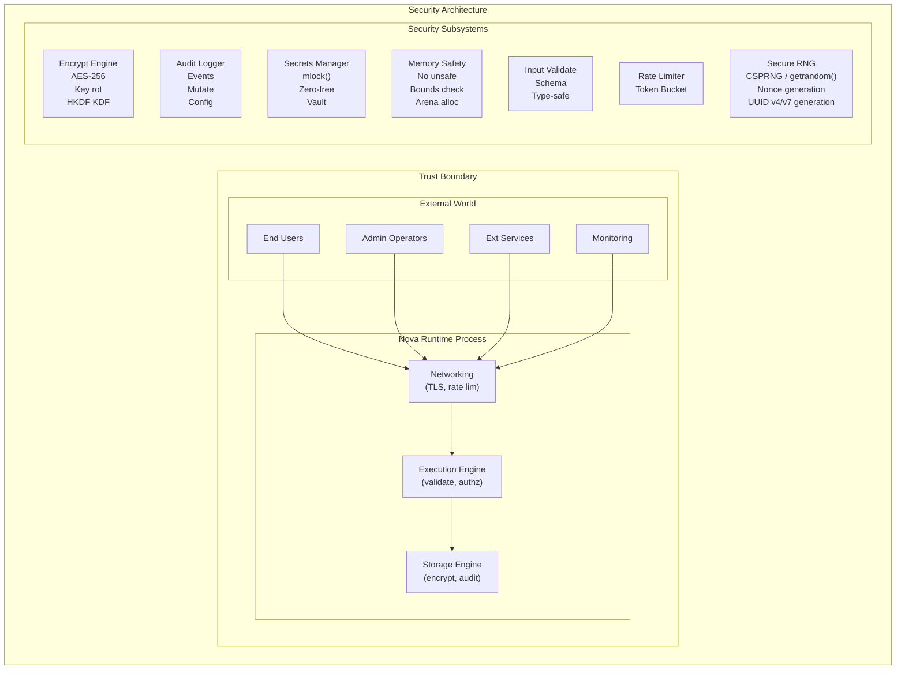
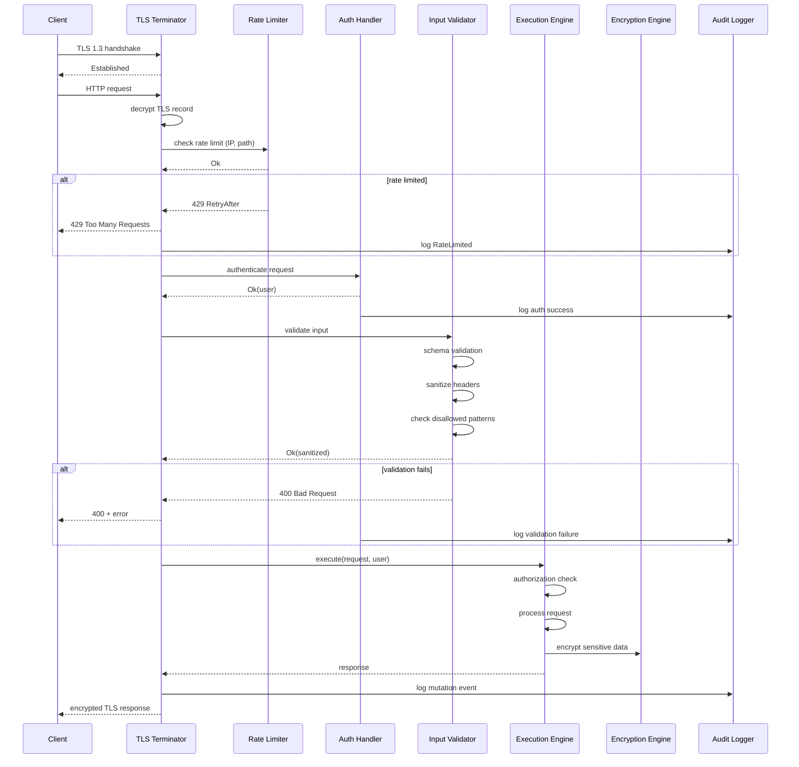
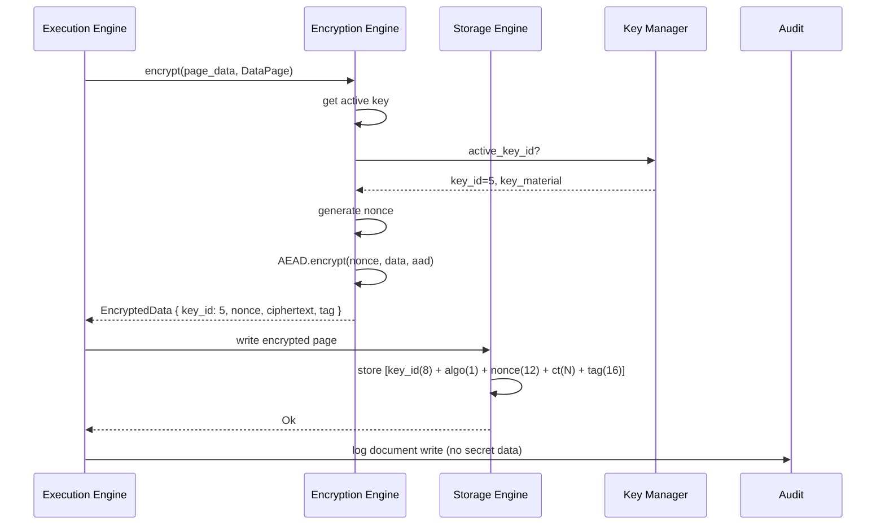
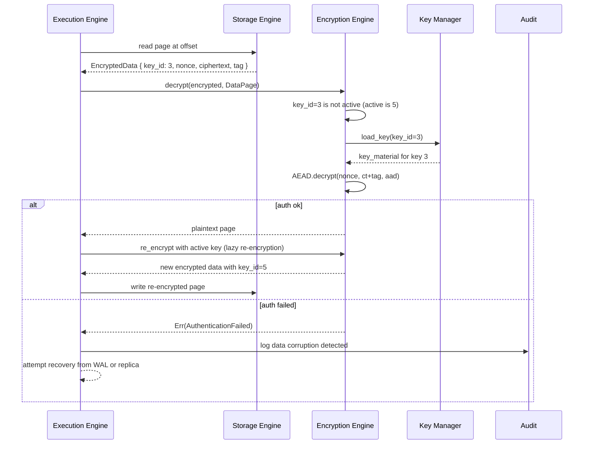
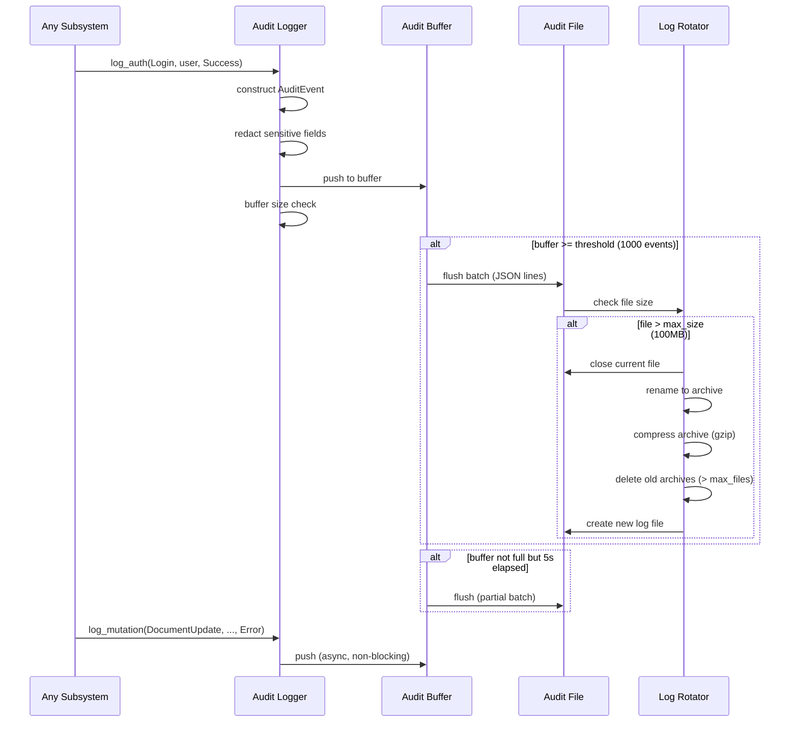
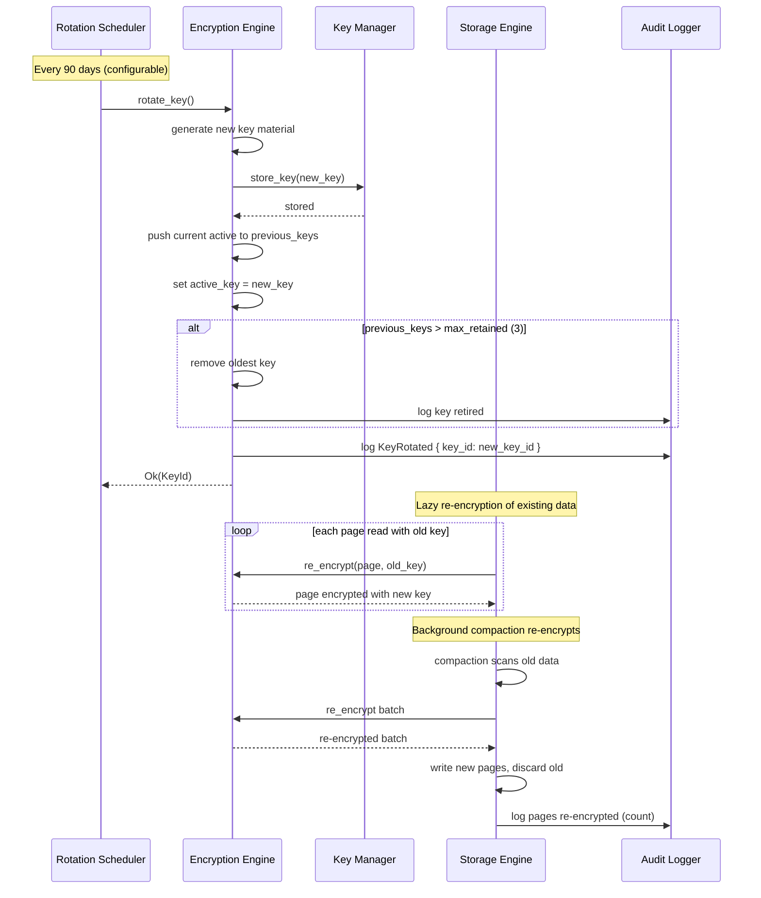

# 15. Security

## 1. Purpose

The Security architecture document defines the comprehensive security posture of Nova Runtime. It describes the threat model, security controls, encryption strategies (at rest and in transit), memory safety guarantees, input validation framework, injection prevention, rate limiting, audit logging, secrets handling, and the complete security review process. Security is not a single subsystem — it is an architectural property that permeates every layer of the system. This document ensures that security is designed in from the start, not bolted on after implementation.

## 2. Scope

This document covers the system-wide security architecture: threat model with attack vectors and trust boundaries, encryption at rest (WAL and data file encryption using AES-256-GCM with key rotation), encryption in transit (TLS 1.3 with mTLS support), memory safety guarantees (no unsafe code in critical paths, bounds checking everywhere), input validation (all API inputs validated against schema), injection prevention (parameterized queries, no eval), rate limiting (token bucket per IP per endpoint), audit logging (all auth decisions and data mutations logged), secrets handling (keys in memory with mlock, zero-on-free), security testing strategy (fuzzing, penetration testing, dependency scanning), and the complete security review checklist. This document does NOT cover physical security of servers (infrastructure responsibility), network-level DDoS mitigation (infrastructure responsibility), or application-level authorization policies (Auth subsystem responsibility, built on top of security primitives described here).

## 3. Responsibilities

- Define and enforce the system-wide security threat model
- Implement encryption at rest for all persistent state (WAL, data files, indexes)
- Implement encryption in transit for all network communication
- Ensure memory safety in all critical code paths
- Enforce input validation at every system boundary
- Prevent injection attacks (query injection, command injection, path traversal)
- Implement rate limiting to prevent abuse and DoS
- Maintain comprehensive audit logging of security-relevant events
- Manage secrets throughout their lifecycle (creation, storage, rotation, destruction)
- Provide secure random number generation for all cryptographic operations
- Enforce secure defaults — every feature should be secure by default
- Conduct regular security reviews and penetration testing
- Maintain a security vulnerability disclosure and response process

## 4. Non Responsibilities

- Physical security of hardware (datacenter/cloud provider responsibility)
- Network-level DDoS mitigation (infrastructure/CDN responsibility)
- Operating system hardening (system administrator responsibility)
- Application-level authorization policies (Auth subsystem, using these primitives)
- Third-party dependency vulnerability management (CI/CD pipeline, but monitored here)
- User-facing security features like 2FA (Auth subsystem feature)
- Compliance certification (SOC2, HIPAA, PCI-DSS — guided by this document)

## 5. Architecture

### 5.1 Security Architecture Overview



### 5.2 Trust Boundaries

Nova Runtime defines three trust boundaries:

1. **External Boundary** (Network-facing): Between external clients and the Networking layer. All traffic must pass TLS termination. Rate limiting applied. Input validation at protocol level.

2. **Execution Boundary** (API-facing): Between the Networking layer and the Execution Engine. All requests are authenticated and authorized. Input validated against schemas. Injection prevention enforced.

3. **Storage Boundary** (Data-facing): Between the Execution Engine and the Storage Engine. Data is encrypted at rest. Audit logging for all mutations. Access control enforced.

### 5.3 Defense in Depth

Nova Runtime employs defense in depth — multiple independent security controls at each layer:

- **Layer 1 (Network)**: TLS 1.3, rate limiting, connection limits, request size limits, header validation
- **Layer 2 (Protocol)**: HTTP/2 support, method validation, path normalization
- **Layer 3 (Auth)**: Authentication (JWT, session, OIDC), authorization (RBAC/ABAC)
- **Layer 4 (Input)**: Schema validation, type coercion, size enforcement, nesting limits
- **Layer 5 (Execution)**: Middleware chain, sandboxing, query parameterization
- **Layer 6 (Storage)**: Encryption at rest, WAL encryption, checksum validation
- **Layer 7 (Memory)**: Safe language (Rust), bounds checking, mlock for secrets

### 5.4 Security Principles Applied

1. **Least Privilege**: Each subsystem has access only to the data and operations it requires.
2. **Secure by Default**: Default configurations are secure; unsafe options must be explicitly enabled.
3. **Fail Secure**: On failure, deny access by default. No fallback to insecure modes.
4. **Complete Mediation**: Every access is checked; no cached authorization without re-verification.
5. **Defense in Depth**: Multiple independent security controls at each layer.
6. **Open Design**: Security does not depend on secrecy of design; only on secrecy of keys.
7. **Psychological Acceptability**: Security controls do not unduly burden legitimate users.
8. **Least Common Mechanism**: Minimize shared mechanisms (shared memory, global state).

## 6. Data Structures

### 6.1 Encryption Engine

```rust
/// Encryption engine — handles all encryption/decryption operations
struct EncryptionEngine {
    /// Active encryption key
    active_key: KeyWrapper,
    /// Previous keys (for decrypting data encrypted before rotation)
    previous_keys: Vec<KeyWrapper>,
    /// Key rotation policy
    rotation_policy: KeyRotationPolicy,
    /// Key provider
    key_provider: Box<dyn KeyProvider>,
}

struct KeyWrapper {
    id: KeyId,                      // 8-byte unique key identifier
    key: [u8; 32],                  // AES-256 key (32 bytes)
    created_at: u64,                // Unix milliseconds
    expires_at: u64,                // Unix milliseconds (0 = no expiry)
    algorithm: EncryptionAlgorithm,
}

struct KeyId {
    value: [u8; 8],                 // Random, globally unique within system
}

enum EncryptionAlgorithm {
    Aes256Gcm,                      // AES-256-GCM with 12-byte nonce + 16-byte tag
    Aes256GcmSiv,                   // AES-256-GCM-SIV (nonce-misuse resistant)
    ChaCha20Poly1305,               // ChaCha20-Poly1305 (for systems without AES-NI)
}

struct EncryptedData {
    key_id: KeyId,                  // 8 bytes — identifies which key encrypted this
    algorithm: EncryptionAlgorithm, // 1 byte
    nonce: [u8; 12],               // 12 bytes — unique per encryption operation
    ciphertext: Vec<u8>,           // Variable — encrypted payload
    tag: [u8; 16],                 // 16 bytes — authentication tag
}

// Total overhead: 37 bytes per encrypted payload
// Wire format for encrypted page:
//   [8 bytes key_id][1 byte algorithm][12 bytes nonce][N bytes ciphertext][16 bytes tag]

/// Key provider trait
trait KeyProvider: Send + Sync {
    fn load_active_key(&self) -> Result<KeyWrapper, KeyError>;
    fn load_key(&self, key_id: KeyId) -> Result<KeyWrapper, KeyError>;
    fn generate_key(&self) -> Result<KeyWrapper, KeyError>;
    fn store_key(&self, key: &KeyWrapper) -> Result<(), KeyError>;
    fn list_keys(&self) -> Result<Vec<KeyId>, KeyError>;
    fn delete_key(&self, key_id: KeyId) -> Result<(), KeyError>;
}

enum KeyError {
    KeyNotFound,
    KeyExpired,
    KeyCorrupted,
    ProviderUnavailable(String),
    PermissionDenied,
    Internal(String),
}
```

### 6.2 Audit Log

```rust
/// Audit event — records a security-relevant occurrence
struct AuditEvent {
    id: [u8; 16],                    // Event ID (UUID v7)
    timestamp: u64,                  // Unix milliseconds
    category: AuditCategory,
    action: AuditAction,
    actor: AuditActor,
    resource: AuditResource,
    result: AuditResult,
    context: HashMap<String, String>,
    request_id: Option<String>,
}

enum AuditCategory {
    Authentication,     // Login, logout, token refresh, MFA
    Authorization,      // Permission check, access denied
    DataMutation,       // Create, update, delete of documents
    SchemaChange,       // Schema registration, evolution
    ConfigurationChange, // Config modification (including hot-reload)
    SecuritySetting,    // Security-relevant config change
    EncryptionEvent,    // Key creation, rotation, deletion
    NetworkEvent,       // Connection limit reached, rate limit exceeded
    AdminAction,        // Administrative operations
    SystemEvent,        // Startup, shutdown, health changes
}

enum AuditAction {
    Login, LoginFailed, Logout, TokenRefresh, TokenRevoke,
    MfaChallenge, MfaVerified, MfaFailed,
    PasswordChange, PasswordReset,
    DocumentCreate, DocumentRead, DocumentUpdate, DocumentDelete,
    SchemaRegister, SchemaUpdate, SchemaDelete,
    ConfigReload, ConfigChange, ConfigReset,
    KeyCreated, KeyRotated, KeyDeleted, KeyCompromised,
    ConnectionRejected, RateLimited, TlsHandshakeFailed,
    Startup, Shutdown, AdminCommand,
}

struct AuditActor {
    actor_type: ActorType,
    id: String,
    name: Option<String>,
    ip_address: Option<IpAddr>,
    session_id: Option<String>,
}

enum ActorType {
    User, Admin, Service, System, Anonymous,
}

struct AuditResource {
    resource_type: ResourceType,
    id: Option<String>,
    collection: Option<String>,
    path: Option<String>,
}

enum ResourceType {
    Document, Collection, Schema, Config, Key, User, Session, Connection,
}

struct AuditResult {
    status: AuditStatus,
    error_code: Option<String>,
    error_message: Option<String>,
    duration_ms: u64,
}

enum AuditStatus {
    Success, Denied, Failure, Error,
}

enum AuditOutput {
    File { path: String, rotation: LogRotation },
    Stdout, Stderr, EventBus,
    Multiple(Vec<AuditOutput>),
}
```

### 6.3 Secrets Manager

```rust
/// Secrets manager — handles lifecycle of secrets
struct SecretsManager {
    provider: SecretsProvider,
    mlocked_keys: Vec<KeyWrapper>,      // Keys pinned in memory (mlock)
}

enum SecretsProvider {
    Environment { prefix: String },
    File { directory: String },
    Vault {
        address: String,
        mount_path: String,
        tls_skip_verify: bool,
    },
    Keychain { service: String },       // macOS only
}

impl SecretsManager {
    fn get_secret(&self, name: &str) -> Result<SecretValue, SecretError>;
    fn set_secret(&self, name: &str, value: &SecretValue) -> Result<(), SecretError>;
    fn delete_secret(&self, name: &str) -> Result<(), SecretError>;
    fn list_secrets(&self) -> Result<Vec<String>, SecretError>;
}

struct SecretValue {
    data: Vec<u8>,
    metadata: SecretMetadata,
}

impl SecretValue {
    fn as_str(&self) -> Result<&str, SecretError>;
    fn as_bytes(&self) -> &[u8];
    fn zeroize(self);       // Zeros memory on drop
}

// Drop implementation zeros memory before freeing
impl Drop for SecretValue {
    fn drop(&mut self) {
        // Zeroize using volatile write to prevent compiler optimization
        for byte in self.data.iter_mut() {
            unsafe { std::ptr::write_volatile(byte, 0u8); }
        }
    }
}
```

### 6.4 Rate Limiter

```rust
/// Rate limiter — token bucket per IP per endpoint
struct RateLimiter {
    ip_buckets: HashMap<IpAddr, TokenBucket>,
    global_bucket: Option<TokenBucket>,
    endpoint_limits: Vec<EndpointRateLimit>,
    cleanup_interval_seconds: u64,   // Default: 60
    bucket_ttl_seconds: u64,         // Default: 300
    metrics: RateLimiterMetrics,
}

struct TokenBucket {
    tokens_per_second: f64,
    burst_size: f64,
    current_tokens: f64,
    last_refill_at: u64,
    last_request_at: u64,
}

impl TokenBucket {
    fn try_consume(&mut self, count: f64, now_ms: u64) -> Result<(), u64> {
        let elapsed_ms = now_ms - self.last_refill_at;
        let refill = elapsed_ms as f64 * self.tokens_per_second / 1000.0;
        self.current_tokens = (self.current_tokens + refill).min(self.burst_size);
        self.last_refill_at = now_ms;
        if self.current_tokens >= count {
            self.current_tokens -= count;
            self.last_request_at = now_ms;
            Ok(())
        } else {
            let needed = count - self.current_tokens;
            let retry_after_ms = (needed / self.tokens_per_second * 1000.0).ceil() as u64;
            Err(retry_after_ms)
        }
    }
}

struct EndpointRateLimit {
    path_pattern: String,
    method: Option<String>,
    tokens_per_second: f64,
    burst_size: f64,
    cost_per_request: f64,      // Default: 1.0
    cost_per_byte: f64,         // Default: 0.001 (1 token per KB)
}
```

### 6.5 Memory Safety Guarantees

```rust
/// Memory safety rules enforced across the codebase
///
/// RULES:
/// 1. NO unsafe code in critical paths:
///    - Network protocol parsing, input validation, encryption/decryption
///    - Authentication/authorization, storage engine page handling
///    - Serialization/deserialization of user data
///
/// 2. Bounds checking:
///    - All array/slice accesses use checked indexing or iterators
///    - No raw pointer arithmetic on user data
///    - FFI boundaries use validated lengths
///
/// 3. Integer overflow:
///    - All arithmetic uses checked/wrapping/saturating explicitly
///    - No implicit overflow (debug mode panics on overflow)
///    - Size counters use u64 (wrapping prevented by checks)
///
/// 4. String handling:
///    - All user-supplied strings validated for UTF-8
///    - String lengths bounded by configuration limits
///    - No null-byte injection (strings stored with explicit length)
///
/// 5. Secret handling:
///    - Secrets stored in mlocked memory (cannot be swapped to disk)
///    - Zero-on-free for all secret values
///    - Secrets not copied unnecessarily (use references)
///    - Secrets not logged, serialized, or exposed in error messages
///
/// 6. Concurrency:
///    - Data races prevented by Rust's ownership model
///    - No global mutable state without synchronization
///    - Locking is explicit and documented
///    - Deadlock prevention: consistent lock ordering, try_lock with timeout
///
/// 7. Panic safety:
///    - No unwrap() in production code (use expect with context or proper error handling)
///    - Panics in worker threads are caught and logged, thread is restarted
///    - Critical operations (encryption, auth) use fallible APIs only
///    - Storage engine uses transactional semantics for crash safety
```

### 6.6 Input Validation

```rust
struct InputValidation {
    max_body_size: u64,
    allowed_content_types: Vec<String>,
    required_headers: Vec<String>,
    header_validations: Vec<HeaderValidation>,
    query_validations: Vec<QueryValidation>,
    body_schema: Option<SchemaRef>,
    max_nesting_depth: u8,              // Default: 64
    disallowed_patterns: Vec<String>,   // e.g., ["<script", "DROP TABLE"]
}

struct HeaderValidation {
    name: String,
    required: bool,
    pattern: Option<String>,
    max_length: Option<u16>,
}

struct QueryValidation {
    name: String,
    required: bool,
    param_type: QueryParamType,
    max_length: Option<u16>,
    allowed_values: Option<Vec<String>>,
}

enum QueryParamType {
    String, Integer, Float, Boolean, Array(Box<QueryParamType>),
}
```

### 6.7 Secure Random Generator

```rust
/// Secure random number generator (CSPRNG)
struct SecureRng {
    /// OS-level entropy source: getrandom() on Linux,
    /// BCryptGenRandom() on Windows, getentropy() on BSD
    inner: OsRng,
}

impl SecureRng {
    fn fill_bytes(&self, buf: &mut [u8]);
    fn next_u64(&self) -> u64;
    fn next_u32(&self) -> u32;
    fn uuid_v4(&self) -> [u8; 16];
    fn alphanumeric_string(&self, length: usize) -> String;
    fn session_id(&self) -> String;        // 32-byte hex string
}

/// Nonce generator — guarantees unique nonces per process lifetime
struct NonceGenerator {
    counter: AtomicU64,
    random_suffix: [u8; 4],
}

impl NonceGenerator {
    fn new(rng: &SecureRng) -> Self;
    /// Generate a unique nonce
    /// Format: [8 bytes big-endian counter][4 bytes random suffix]
    fn next_nonce(&self) -> [u8; 12];
}

// Counter starts at random value to avoid collision across restarts
// With 2^64 possible counter values, uniqueness is guaranteed
```

### 6.8 TLS Security Configuration

```rust
struct TlsSecurityConfig {
    min_version: TlsVersion,                    // Default: 1.3
    cipher_suites: Vec<String>,                 // Default: AEAD only
    disable_tls12: bool,                        // Default: true
    hsts: HstsConfig,
    certificate_pins: Vec<CertificatePin>,
    ocsp_stapling: OcspConfig,
    session_resumption: SessionResumptionConfig,
    mtls: MtlsConfig,
}

struct HstsConfig {
    enabled: bool,                              // Default: true
    max_age_seconds: u32,                       // Default: 31536000 (1 year)
    include_subdomains: bool,                   // Default: true
    preload: bool,                              // Default: false
}

struct CertificatePin {
    domain_pattern: String,
    hash_algorithm: String,                     // "sha256"
    spki_hash: String,                          // Base64-encoded SPKI hash
}

struct SessionResumptionConfig {
    tickets_enabled: bool,                      // Default: true
    ticket_key_rotation_interval_seconds: u32,  // Default: 86400 (24h)
    max_previous_keys: u8,                      // Default: 2
}

struct MtlsConfig {
    enabled: bool,                              // Default: false
    ca_certificate_path: String,
    verify_mode: MtlsVerifyMode,
}

enum MtlsVerifyMode {
    VerifyCertificate,
    VerifyAndAuthorize { allowed_identities: Vec<String> },
}
```

## 7. Algorithms

### 7.1 Encryption at Rest

```
Algorithm: EncryptPage

Input:
  plaintext: Vec<u8> (page-sized, 4096-16384 bytes)
  page_type: PageType (WAL, DataPage, IndexPage)
  encryption_engine: EncryptionEngine

Output:
  encrypted: EncryptedData

Steps:
  1. Select encryption key:
     a. Use active_key from encryption_engine
     b. If active_key is expired (past expires_at):
        - Trigger key rotation
        - Use newly generated active_key
  2. Generate nonce:
     a. nonce = nonce_generator.next_nonce()
     b. Format: [8 bytes atomic counter][4 bytes random suffix]
     c. Guaranteed unique per process lifetime
  3. Encrypt:
     a. Create AEAD cipher instance with active_key
     b. Construct AAD (Additional Authenticated Data):
        - [8 bytes key_id][8 bytes page_type code][8 bytes data length]
     c. ciphertext = AEAD.encrypt(nonce, plaintext, aad)
     d. Returns ciphertext + 16-byte authentication tag
  4. Assemble EncryptedData:
     a. key_id = active_key.id; algorithm = active_key.algorithm
     b. nonce = generated nonce
     c. ciphertext = ciphertext[..len-16] (exclude tag)
     d. tag = ciphertext[len-16..]
  5. Write to storage (37 bytes overhead per page):
     [8b key_id][1b algo][12b nonce][N bytes ciphertext][16b tag]
  6. Return EncryptedData

Algorithm: DecryptPage

Input:
  encrypted: EncryptedData
  encryption_engine: EncryptionEngine

Output:
  plaintext: Vec<u8>

Steps:
  1. Load encryption key:
     a. Try active_key first (fast path for current key)
     b. If key_id doesn't match active, search previous_keys
     c. If not found locally, request from key_provider.load_key(key_id)
     d. If key not found: return Err(KeyNotFound)
  2. Decrypt:
     a. Create AEAD cipher instance with loaded key
     b. Reconstruct AAD: [8b key_id][8b page_type][8b data_length]
     c. Construct ct_with_tag = ciphertext ++ tag
     d. plaintext = AEAD.decrypt(nonce, ct_with_tag, aad)
     e. If authentication fails:
        - Return Err(DecryptionError::AuthenticationFailed)
        - Log security alert, increment decryption_failure metric
  3. Return plaintext

Complexity: O(n) where n = page size
  - AES-256-GCM: ~1 GB/s with AES-NI hardware acceleration
  - ChaCha20-Poly1305: ~0.5 GB/s without hardware acceleration
```

### 7.2 Key Derivation (Master Key to Data Key)

```
Algorithm: DeriveDataKey
Input:  master_key[32], context string, salt[16]
Output: derived_key[32]

Steps:
  1. HKDF-SHA256 (RFC 5869) Extract:
     PRK = HMAC-SHA256(salt, master_key)
  2. HKDF Expand:
     T(1) = HMAC-SHA256(PRK, T(0) || context || 0x01)
     derived_key = T(1)[..32]
  3. Verify key quality (not all zeros)
  4. Return derived_key

Context strings:
  - "nova-storage-wal-v1"      — WAL encryption
  - "nova-storage-data-v1"     — Data page encryption
  - "nova-storage-index-v1"    — Index page encryption
  - "nova-auth-jwt-signing-v1" — JWT signing key
  - "nova-auth-session-v1"     — Session encryption
  - "nova-tls-session-ticket"  — TLS session ticket encryption
```

### 7.3 Key Rotation

```
Algorithm: RotateEncryptionKey

Input: encryption_engine, key_provider

Steps:
  1. Generate new key:
     a. new_key_id = secure_random(8 bytes)
     b. new_key_material = secure_random(32 bytes)
     c. new_key = KeyWrapper {
         id: new_key_id, key: new_key_material,
         created_at: now(), expires_at: now() + rotation_interval,
         algorithm: current_algorithm
       }
  2. Store new key via key_provider.store_key(new_key)
  3. Rotate in encryption_engine:
     a. Push current active_key to previous_keys
     b. Set active_key = new_key
     c. If previous_keys exceeds max_retained_keys (default: 2):
        - Remove oldest key from previous_keys
        - This key can no longer decrypt new data
        - Old encrypted data using this key is re-encrypted lazily
  4. Schedule lazy re-encryption:
     a. Storage engine gradually re-encrypts old pages with new key
     b. Re-encryption triggered on compaction or read
     c. Re-encryption is background, non-blocking
  5. Log audit event: KeyRotated { key_id: new_key_id }

Rotation interval: 90 days (configurable)
Max previous keys retained: 2 (provides 180-day re-encryption window)
```

### 7.4 Audit Logging

```
Algorithm: WriteAuditEvent

Input: category, action, actor, resource, result, context
Output: Writes audit event to configured output(s)

Steps:
  1. Construct AuditEvent:
     a. id = UUID v7 (time-ordered)
     b. timestamp = now()
     c. Set all fields from parameters
     d. If include_bodies: include request body from context
     e. Redact sensitive fields:
        - Passwords → "******"
        - Tokens → "tok_****" (first 4 chars preserved for correlation)
        - Encryption keys → "key_****"
  2. Apply filters:
     a. Check category >= min_category (hierarchical filter)
     b. Check path not in excluded_paths
     c. If filtered out: skip (drop event silently)
  3. Serialize event:
     a. Format: JSON (one event per line, newline-delimited)
     b. Fields: id, ts, cat, act, actor, resource, result, ctx, req_id
     c. Timestamp in RFC 3339 format with milliseconds
  4. Write to output:
     a. File output:
        - Append to current log file
        - If file > max_size: rotate (rename, compress old, create new)
        - Rotate asynchronously (non-blocking)
     b. EventBus output:
        - Publish to internal event bus on "audit.*" topic
        - Non-blocking publish (fire and forget for audit)
     c. Stdout/Stderr:
        - Write to output stream, flush periodically
  5. Buffer management:
     a. Batch up to buffer_size events (default: 1000) before flush
     b. Flush every 5 seconds even if buffer not full
     c. On shutdown: flush remaining buffered events (synchronous)

Complexity: O(1) per event (amortized)
Buffer: 1000 events (~100KB), flushed every 5 seconds or on buffer full
```

### 7.5 Rate Limiting Algorithm

```
Algorithm: RateLimitRequest

Input:
  ip_addr: IpAddr
  path: String
  method: String
  body_size: u64

Output:
  Ok(()) or Err(RetryAfter)

Steps:
  1. Determine rate limit config:
     a. Match path against endpoint_limits (first match wins)
     b. If no match: use default per-IP rate limit
     c. If global rate limit configured: check global bucket
  2. Compute request cost:
     a. cost = endpoint.cost_per_request
     b. cost += body_size * endpoint.cost_per_byte
  3. Check global bucket (if configured):
     a. Get or create global TokenBucket
     b. Try consume: if denied: return Err(global retry_after)
  4. Check per-IP bucket:
     a. Get or create per-IP TokenBucket
     b. Clean stale buckets (no activity > bucket_ttl_seconds)
     c. Try consume: if denied: return Err(per-IP retry_after)
  5. Update metrics:
     a. Increment allowed_requests
  6. Return Ok

Cleanup: Background task runs every cleanup_interval_seconds (default: 60s)
  - Removes buckets with last_request_at > bucket_ttl_seconds ago
  - Prevents memory leak from IP address churn

Complexity: O(e) where e = number of endpoint rate limits (typically < 100)
```

### 7.6 Input Validation and Injection Prevention

```
Algorithm: ValidateAndSanitizeInput

Input:
  request: HttpRequest
  validation: InputValidation

Output:
  Result<SanitizedRequest, ValidationError>

Steps:
  1. Validate HTTP method:
     a. Check method is in allowed list
     b. If not: return 405 Method Not Allowed
  2. Validate Content-Type:
     a. Check content_type header in allowed_content_types
     b. If not: return 415 Unsupported Media Type
  3. Validate headers:
     a. For each required header: check presence
     b. For each header_validation: check pattern and max_length
     c. Sanitize header values:
        - Strip CR/LF characters (prevent HTTP response splitting)
        - Reject null bytes
  4. Validate URL path:
     a. Normalize: collapse "..", remove duplicate slashes
     b. Check path traversal: reject paths containing ".."
     c. Check path length <= max_url_length
  5. Validate query parameters:
     a. For each expected parameter: check type, length, allowed values
     b. Reject unexpected parameters (or ignore, based on mode)
     c. Sanitize: strip HTML tags, null bytes
  6. Validate request body:
     a. Check body_size <= max_body_size
     b. If body_schema provided:
        - Deserialize body according to Content-Type
        - Validate against schema
        - Reject if schema violation
     c. Check max_nesting_depth on parsed body
     d. Apply disallowed_patterns:
        - Scan body for regex patterns (e.g., SQL injection, XSS)
        - Reject if pattern matches (log security event)
  7. Parameterize all queries:
     a. Any query sent to Storage Engine uses parameterized API
     b. No string interpolation in query building
     c. User input is always bound as parameters, never concatenated
  8. Return sanitized request

Never eval(): No user input is ever passed to eval() or exec()
  - Expressions use AST-based evaluation, not string eval
  - Custom validation uses sandboxed JavaScript (QuickJS) with no I/O
```

### 7.7 Secret Zeroization

```
Algorithm: ZeroizeSecret

Input: secret: SecretValue

Steps:
  1. Overwrite secret.data with zeros:
     for i in 0..secret.data.len():
       volatile_write(&secret.data[i], 0)
     Note: volatile_write prevents compiler from optimizing away the zeroing
  2. Clear metadata:
     secret.metadata.created_at = 0
     secret.metadata.version = 0
  3. Free the allocation:
     secret.data = Vec::new() (empty vec, underlying buffer zeroed)
  4. OS-level memory lock release:
     If the memory was mlocked, munlock the pages

mlock() usage:
  - Called when secret is first loaded:
    mlock(ptr, len) — pins pages in RAM, prevents swapping
  - Called on zeroize:
    munlock(ptr, len) — releases lock, then zeros + frees
  - Partial page handling:
    mlock/munlock operate on pages. Secrets smaller than page size
    still lock an entire page (typically 4KB). Acceptable overhead
    for the security benefit.
```

## 8. Interfaces

### 8.1 Encryption API

```rust
/// Encryption engine public API
trait EncryptionEngine: Send + Sync {
    /// Encrypt plaintext data
    fn encrypt(&self, plaintext: &[u8], context: &EncryptionContext) -> Result<Vec<u8>, EncryptionError>;

    /// Decrypt previously encrypted data
    fn decrypt(&self, ciphertext: &[u8], context: &EncryptionContext) -> Result<Vec<u8>, EncryptionError>;

    /// Rotate the active encryption key
    fn rotate_key(&self) -> Result<KeyId, EncryptionError>;

    /// Get the active key ID
    fn active_key_id(&self) -> KeyId;

    /// Check if a key exists and is valid
    fn key_exists(&self, key_id: KeyId) -> bool;

    /// Re-encrypt data with the current active key
    fn re_encrypt(&self, data: &[u8], old_key_id: KeyId, context: &EncryptionContext) -> Result<Vec<u8>, EncryptionError>;
}

struct EncryptionContext {
    purpose: EncryptionPurpose,   // WAL, DataPage, IndexPage, Session, etc.
    aad: Vec<u8>,                 // Additional Authenticated Data
}

enum EncryptionPurpose {
    WalPage,
    DataPage,
    IndexPage,
    SessionData,
    SecretValue,
    AuditLog,
}

enum EncryptionError {
    KeyNotFound,
    KeyExpired,
    AuthenticationFailed,
    EncryptError(String),
    DecryptError(String),
    KeyRotationFailed(String),
    Internal(String),
}
```

### 8.2 Audit Logger API

```rust
/// Audit logger — records security-relevant events
trait AuditLogger: Send + Sync {
    /// Log an audit event
    fn log(&self, event: AuditEvent);

    /// Convenience method for common audit events
    fn log_auth(&self, action: AuditAction, actor: AuditActor, result: AuditResult);
    fn log_mutation(&self, action: AuditAction, actor: AuditActor, resource: AuditResource, result: AuditResult);
    fn log_config_change(&self, actor: AuditActor, changes: &[ConfigChange], result: AuditResult);
    fn log_security_event(&self, action: AuditAction, actor: AuditActor, context: HashMap<String, String>);

    /// Flush buffered events
    fn flush(&self) -> Result<(), AuditError>;

    /// Get audit log statistics
    fn stats(&self) -> AuditStats;
}

struct AuditStats {
    events_total: u64,
    events_buffered: usize,
    events_dropped: u64,
    bytes_written: u64,
    last_flush_at: u64,
    errors_total: u64,
}

enum AuditError {
    WriteError(String),
    RotationError(String),
    BufferFull,
    Internal(String),
}
```

### 8.3 Secrets Manager API

```rust
/// Secrets manager public API
trait SecretsManager: Send + Sync {
    /// Get a secret by name
    fn get(&self, name: &str) -> Result<SecretValue, SecretError>;

    /// Store a secret
    fn set(&self, name: &str, value: &[u8]) -> Result<(), SecretError>;

    /// Delete a secret
    fn delete(&self, name: &str) -> Result<(), SecretError>;

    /// List all secret names
    fn list(&self) -> Result<Vec<String>, SecretError>;

    /// Check if a secret exists
    fn exists(&self, name: &str) -> bool;
}

enum SecretError {
    NotFound,
    AccessDenied,
    ProviderUnavailable(String),
    InvalidName,
    Internal(String),
}
```

### 8.4 Rate Limiter API

```rust
/// Rate limiter public API
trait RateLimiter: Send + Sync {
    /// Check if a request is allowed
    fn check(&self, ip: IpAddr, path: &str, method: &str, body_size: u64) -> Result<(), RateLimitStatus>;

    /// Get current rate limit status for an IP
    fn status(&self, ip: IpAddr) -> RateLimitInfo;

    /// Update endpoint rate limit configuration (hot-reload)
    fn update_endpoint_limits(&self, limits: Vec<EndpointRateLimit>);

    /// Get rate limiter metrics
    fn metrics(&self) -> RateLimiterMetrics;

    /// Clean up stale buckets
    fn cleanup(&self);
}

struct RateLimitStatus {
    retry_after_ms: u64,
    limit: u64,
    remaining: u64,
    reset_at: u64,
}

struct RateLimitInfo {
    current_tokens: f64,
    tokens_per_second: f64,
    burst_size: f64,
    last_request_at: u64,
    is_throttled: bool,
}
```

### 8.5 Secure RNG API

```rust
/// Secure random number generator public API
trait SecureRngProvider: Send + Sync {
    fn fill_bytes(&self, buf: &mut [u8]);
    fn next_u64(&self) -> u64;
    fn next_u32(&self) -> u32;
    fn uuid_v4(&self) -> [u8; 16];
    fn uuid_v7(&self) -> [u8; 16];    // Time-ordered UUID
    fn alphanumeric(&self, len: usize) -> String;
    fn session_id(&self) -> String;
    fn api_key(&self) -> String;       // e.g., "nova_" + 32 hex chars
}
```

### 8.6 Security Manager (Coordinator)

```rust
/// Central security manager — coordinates all security subsystems
trait SecurityManager: Send + Sync {
    /// Access to individual subsystems
    fn encryption(&self) -> Arc<dyn EncryptionEngine>;
    fn audit(&self) -> Arc<dyn AuditLogger>;
    fn secrets(&self) -> Arc<dyn SecretsManager>;
    fn rate_limiter(&self) -> Arc<dyn RateLimiter>;
    fn rng(&self) -> Arc<dyn SecureRngProvider>;

    /// Validate all security configuration
    fn validate_security_config(&self, config: &Config) -> Result<(), Vec<SecurityConfigError>>;

    /// Run security self-test (on startup)
    fn self_test(&self) -> Result<SecurityTestResults, SecurityTestError>;

    /// Get comprehensive security status
    fn status(&self) -> SecurityStatus;
}

struct SecurityStatus {
    encryption: EncryptionStatus,
    audit: AuditStatus,
    secrets: SecretsProviderStatus,
    tls: TlsStatus,
    rate_limiting: RateLimitingStatus,
    last_self_test: Option<SecurityTestResults>,
    security_events_24h: u64,
}

struct EncryptionStatus {
    active_key_id: String,
    key_age_days: f64,
    key_expires_in_days: f64,
    previous_keys_count: u32,
    encryption_enabled: bool,
}

struct TlsStatus {
    min_version: String,
    cert_expires_in_days: f64,
    cert_subject: String,
    cert_issuer: String,
    mtls_enabled: bool,
}
```

## 9. Sequence Diagrams

### 9.1 Secure Request Lifecycle



### 9.2 Encryption at Rest (Write Path)



### 9.3 Encryption at Rest (Read Path)



### 9.4 Audit Event Flow



### 9.5 Key Rotation



## 10. Failure Modes

### 10.1 Encryption Key Compromise

| Cause | Effect | Detection |
|-------|--------|-----------|
| Attacker gains access to key material | All encrypted data readable | Key access audit log, unauthorized decryption pattern |
| Weak key generation | Key can be brute-forced | Key entropy test at generation time |
| Key leaked via memory dumps | Key extracted from core dump | Memory dump analysis, mlock failure detection |

**Impact**: All data encrypted with compromised key is readable by attacker. Data confidentiality lost. Integrity still protected by authentication tag (attacker cannot modify data without detection).

### 10.2 Encryption Key Loss

| Cause | Effect | Detection |
|-------|--------|-----------|
| Key storage deleted/corrupted | Cannot decrypt data | Decryption failure with KeyNotFound |
| Key provider unavailable (Vault down) | Cannot load keys | key_provider.load_key() returns error |
| Key rotation with data loss | Data encrypted with deleted key | Old data fails to decrypt |

**Impact**: Permanent data loss if key cannot be recovered. All data encrypted with lost key is unreadable.

### 10.3 Encryption Authentication Failure

| Cause | Effect | Detection |
|-------|--------|-----------|
| Data corruption (bit rot) | AEAD authentication fails | Decryption failure with AuthenticationFailed |
| Storage medium corruption | Same | Same |
| Wrong key used for decryption | Same | Same |
| Tampered data (attacker modified ciphertext) | Same | Same |

**Impact**: Data return error. Cannot distinguish between corruption and attack. Recovery depends on redundancy.

### 10.4 Rate Limiter Bypass

| Cause | Effect | Detection |
|-------|--------|-----------|
| IP spoofing via X-Forwarded-For | Rate limiter applies to spoofed IP | Multiple rate limits hit from different IPs, same behavior |
| Distributed attack (many IPs) | Per-IP limits ineffective | Total request rate exceeds global threshold |
| Rate limiter crash | No rate limiting applied | Metrics show zero denied_requests |

**Impact**: Service overload, potential DoS, resource exhaustion.

### 10.5 Audit Log Failure

| Cause | Effect | Detection |
|-------|--------|-----------|
| Disk full on audit log path | Audit events cannot be written | Write error, event dropped |
| Audit buffer overflow | Events dropped (oldest) | events_dropped counter increases |
| Audit log rotation failure | Current log grows unbounded | File size alert, rotation error |

**Impact**: Security events lost. Cannot reconstruct security incidents during the gap period.

### 10.6 Secret Manager Failure

| Cause | Effect | Detection |
|-------|--------|-----------|
| Vault unreachable | Secrets unavailable | ProviderUnavailable error |
| Environment variable missing | Secret not found | NotFound error on startup |
| Secret expired | Cannot use secret | Key expiration detected on load |

**Impact**: Service cannot start (if critical secret missing) or degrades gracefully (if non-critical).

### 10.7 Memory Safety Violation

| Cause | Effect | Detection |
|-------|--------|-----------|
| Unsafe code in critical path | Potential memory corruption | Code review, unsafe audit |
| Buffer overflow (unchecked index) | Memory corruption, RCE potential | Fuzz testing, bounds checking |
| Use-after-free | Crash or arbitrary code execution | ASAN, MIRI testing |

**Impact**: Critical security vulnerability. Potential remote code execution.

## 11. Recovery Strategy

### 11.1 Key Compromise Recovery

1. **Immediate**: Rotate the compromised key immediately. Generate new key. Revoke old key's ability to encrypt (but retain for decryption of old data).
2. **Re-encrypt**: Trigger full re-encryption of all data encrypted with compromised key. Priority order: WAL > Data pages > Index pages.
3. **Audit**: Log KeyCompromised event with full details. Investigate how key was compromised (memory dump, insider, etc.).
4. **Rotation cadence**: Reduce key rotation interval from 90 to 7 days temporarily.
5. **Security review**: Full security review of key management practices.

### 11.2 Key Loss Recovery

1. **Check backup**: If key was backed up (recommended), restore from backup. Key backup is encrypted with master key from offline storage.
2. **Check key provider**: If Vault-based, check Vault status. If Vault is down, restore Vault, keys should be available.
3. **No recovery possible**: If key is permanently lost and no backup exists, data encrypted with that key is permanently lost. Restore from data backup (pre-encryption).

### 11.3 Data Corruption Recovery

1. **Single page corruption**: Attempt recovery from WAL replay. If WAL has the original data, replay the mutation.
2. **Multiple page corruption**: Restore affected pages from backup. Apply WAL replay to catch up.
3. **Widespread corruption**: Restore entire data directory from backup. Apply WAL from last checkpoint.
4. **Unrecoverable**: If backup and WAL are both corrupted, data is permanently lost. This should be prevented by the Storage Engine's crash recovery mechanisms.

### 11.4 Rate Limiter Failure Recovery

1. **Rate limiter crash**: Restart rate limiter subsystem. Buckets are reset (all IPs start fresh). Traffic is allowed momentarily until buckets refill logic stabilizes.
2. **IP spoofing**: Configure trusted_proxies CIDR ranges. Only X-Forwarded-For headers from trusted proxies are accepted. For untrusted sources, use direct TCP connection IP.
3. **Distributed DoS**: Enable global rate limiter as second line of defense. Use connection limits per IP as first line.

### 11.5 Audit Log Failure Recovery

1. **Disk full**: Stop audit logging if disk is full. Log warning. Rotate/compress/archive old logs to free space. Resume logging.
2. **Buffer overflow**: Increase buffer size temporarily. Log event_dropped count. Investigate source of audit storm (misconfiguration, attack).
3. **Audit log corruption**: Archive corrupted log file. Start new log file. Use separate log shipping (event bus output) as redundancy.

### 11.6 Graceful Degradation

In case of security subsystem failure, Nova Runtime follows this degradation path:

| Subsystem Failure | Degraded Behavior | Allowed? |
|------------------|-------------------|----------|
| Encryption key unavailable (read) | Can read old data, cannot write new | Yes |
| Encryption key unavailable (write) | Block writes (fail secure) | Yes |
| Audit logger full | Drop audit events, continue serving | Yes |
| Rate limiter failed | Allow all traffic (no limiter) | Yes, with warning |
| Secrets manager failed | Block operations needing secrets | Yes |
| TLS certificate expired | Continue serving (old cert), warn | Yes, with alert |
| Input validation failed | Reject all requests (fail secure) | Yes |

**Principle**: Fail secure by default. When security subsystems fail, the default behavior is to deny rather than allow.

## 12. Performance Considerations

### 12.1 Encryption Overhead

| Operation | Throughput | Latency Overhead |
|-----------|------------|------------------|
| AES-256-GCM encrypt (4KB page) | 1,000,000 ops/s | ~1μs |
| AES-256-GCM decrypt (4KB page) | 800,000 ops/s | ~1.25μs |
| AES-256-GCM encrypt (64KB page) | 100,000 ops/s | ~10μs |
| ChaCha20-Poly1305 encrypt (4KB) | 500,000 ops/s | ~2μs |
| Key derivation (HKDF) | 50,000 ops/s | ~20μs |
| Key generation (secure_random) | 1,000,000 ops/s | ~1μs |
| Nonce generation | 10,000,000 ops/s | ~0.1μs |

### 12.2 Audit Logging Overhead

| Operation | Throughput | Latency Overhead |
|-----------|------------|------------------|
| Audit event (buffered, no flush) | 5,000,000 ops/s | ~0.2μs |
| Audit event (with flush) | 50,000 ops/s | ~20μs |
| Audit event (with file rotation) | 5,000 ops/s | ~200μs (rare) |

### 12.3 Rate Limiting Overhead

| Operation | Throughput | Latency Overhead |
|-----------|------------|------------------|
| Token bucket check (cache hit) | 10,000,000 ops/s | ~0.1μs |
| Token bucket check (cache miss) | 1,000,000 ops/s | ~1μs |
| Bucket cleanup (1000 buckets) | 100 ops/s | ~10μs |

### 12.4 Memory Overhead

| Component | Memory | Notes |
|-----------|--------|-------|
| Encryption keys (3 keys) | ~300 bytes | 3 x 100 bytes |
| Nonce generator | ~32 bytes | Atomic counter + suffix |
| Rate limiter buckets (10,000 IPs) | ~2 MB | 200 bytes per bucket |
| Audit buffer (1000 events) | ~100 KB | Before flush |
| Secrets in memory (mlocked) | Variable | Typically < 1 MB |
| Secure RNG state | ~256 bytes | OS entropy |

### 12.5 Performance Budget

| Operation | Budget | Notes |
|-----------|--------|-------|
| Per-request encryption overhead | < 50μs | For typical 4KB document |
| Per-request rate limit check | < 5μs | |
| Per-request audit logging | < 10μs | Buffered |
| Per-connection TLS handshake | < 5ms | With session resumption |
| Key rotation (entire process) | < 1 hour | Background, non-blocking |

## 13. Security

### 13.1 Threat Model

| Threat | Vector | Impact | Mitigation |
|--------|--------|--------|------------|
| Data breach (storage) | Physical access to disk, stolen backups | All data readable | AES-256-GCM encryption at rest; key separate from data |
| Data breach (network) | TLS interception, MITM | Traffic intercepted | TLS 1.3 mandatory; certificate pinning; HSTS |
| Data breach (memory) | Core dump, memory analysis, swap | Secrets in memory | mlock() for secrets; zero-on-free; no secrets in swap |
| SQL injection | Unsanitized query input | Data exfiltration | Parameterized queries only; no string concatenation |
| Path traversal | ../ in URLs | Read/write arbitrary files | Path normalization; reject "/../"; chroot-like data_dir isolation |
| XSS | Unescaped output in admin UI | Session theft | CSP headers; output encoding; no HTML rendering of user data |
| CSRF | Cross-site request forgery | State change via user session | CSRF tokens on state-changing endpoints; SameSite cookies |
| JWT tampering | Modified JWT payload | Privilege escalation | JWT signature verification; RS256 minimum |
| Weak password | Brute force password guess | Account compromise | Argon2id password hashing; lockout after 5 attempts; rate limiting |
| Session hijacking | Stolen session cookie | Impersonation | httpOnly+Secure+SameSite cookies; session binding to IP (optional) |
| DoS (resource exhaustion) | Many concurrent requests | Service unavailability | Rate limiting; connection limits; request size limits; timeouts |
| DoS (slowloris) | Slow HTTP headers | Connection exhaustion | Read timeout; minimum throughput rate enforcement |
| TLS downgrade | Force TLS 1.0/1.1 | Weak encryption | TLS 1.3 required; 1.2 configurable and deprecated |
| Certificate forgery | Fake certificate | Impersonation | OCSP stapling; certificate pinning; CA verification |
| Replay attack | Re-send captured request | Duplicate state change | AEAD nonce uniqueness; idempotency keys; timestamp validation |
| Side channel (timing) | Measure crypto operation times | Key extraction | Constant-time crypto operations (all standard libraries) |
| Side channel (power) | Power analysis | Key extraction | Not mitigated (requires physical access; out of scope) |
| Supply chain | Compromised dependency | Backdoor in runtime | Dependency scanning; vendored critical deps; signature verification |

### 13.2 Attack Surface

```
Attack Surface Summary:

Network:
  - TCP port listeners (TLS termination)
  - HTTP/1.1 and HTTP/2 parsers
  - WebSocket upgrade path
  - gRPC message parsing
  - Unix domain socket

API:
  - REST endpoints (CRUD operations)
  - GraphQL queries and mutations
  - gRPC method calls
  - Admin API endpoints
  - Metrics endpoint
  - WebSocket subscriptions

Input:
  - JSON, MessagePack, Protobuf, TOML, YAML parsers
  - Query parameters
  - HTTP headers
  - URL paths
  - File uploads

Processing:
  - Execution engine middleware chain
  - Schema validation engine
  - Computed field expression evaluator
  - Search query parser
  - Auth token validation
  - Session management

Storage:
  - WAL files
  - Data page files
  - Index files
  - Blob storage files
  - Configuration files
  - Audit log files

External Dependencies:
  - TLS library (rustls)
  - HTTP parser (hyper)
  - MessagePack library (rmp-serde)
  - Protobuf library (prost)
  - JWT library (jsonwebtoken)
  - Regex engine (regex)
```

### 13.3 Security Controls by Layer

**Layer 1 — Network Security**:
- TLS 1.3 required, TLS 1.2 as explicit opt-in fallback
- AEAD cipher suites only (AES-GCM, ChaCha20-Poly1305)
- Certificate validation with OCSP stapling
- Certificate pinning for critical deployments
- Rate limiting per IP + per endpoint
- Connection limits per IP
- Read/write/idle timeouts
- Maximum header size (8KB) and body size (10MB default)

**Layer 2 — Protocol Security**:
- HTTP method validation
- Path normalization and traversal prevention
- Header sanitization (CRLF injection prevention)
- WebSocket origin validation
- gRPC reflection disabled by default
- Protocol version enforcement

**Layer 3 — Authentication & Authorization**:
- JWT-based authentication (RS256+)
- Session-based auth with secure cookies
- OIDC/OAuth2 integration
- mTLS for service-to-service auth
- Role-based access control (RBAC)
- Attribute-based access control (ABAC) — future
- Password hashing with Argon2id

**Layer 4 — Input Validation**:
- Schema validation for all API inputs
- Type coercion with strict rules (no silent data loss)
- Size enforcement at every level
- Nesting depth limits (64 levels)
- Pattern matching for disallowed content
- Null byte injection prevention

**Layer 5 — Execution Security**:
- Parameterized queries (no string interpolation)
- No eval() or exec() on user input
- Sandboxed expression evaluation (QuickJS with no I/O)
- Execution timeouts (30s default)
- Resource limits per execution context

**Layer 6 — Storage Security**:
- AES-256-GCM encryption at rest (WAL, data, indexes)
- Per-page authentication tags (tamper detection)
- CRC32C checksums on all documents
- Encrypted WAL with integrity verification
- Key rotation with lazy re-encryption

**Layer 7 — Memory Security**:
- Safe Rust (no unsafe in critical paths)
- Bounds checking on all array accesses
- Integer overflow protection (checked arithmetic)
- mlock() for encryption keys and secrets
- Zero-on-free for all secret material
- No stack traces in production error messages

### 13.4 Secure Configuration Checklist

```
Security Checklist — Items verified at startup and during security review:

[ ] TLS 1.3 is enabled and TLS 1.2 is disabled (unless explicitly needed)
[ ] TLS certificate is valid and not expired
[ ] Certificate chain is complete
[ ] Private key has correct permissions (0600)
[ ] HSTS is enabled for HTTPS listeners
[ ] Encryption at rest is enabled
[ ] Encryption key is stored securely (Vault or env var, not in config file)
[ ] Encryption key is backed up securely
[ ] Key rotation interval is set (default: 90 days)
[ ] Password hashing uses Argon2id with adequate parameters
[ ] Password policy meets minimum requirements (8+ chars, mixed case, digits, special)
[ ] Account lockout is enabled (5 attempts, 15 min lockout)
[ ] Rate limiting is enabled with appropriate thresholds
[ ] CORS is configured appropriately (not wildcard in production)
[ ] Session cookies set Secure+HttpOnly+SameSite
[ ] JWT uses RS256 or stronger (not HS256 with weak secret)
[ ] JWT access token TTL is appropriate (<= 1 hour)
[ ] Audit logging is enabled for auth and mutation events
[ ] Access log is enabled
[ ] Max document size is appropriate (64KB default)
[ ] Config file permissions are 0600
[ ] Secrets are NOT in config file
[ ] Admin API is not exposed externally
[ ] gRPC reflection is disabled (or requires auth)
[ ] WebSocket origin validation is configured
[ ] Dependency vulnerabilities are scanned (CI/CD)
[ ] Data directory permissions are 0700
[ ] Core dump generation is disabled (ulimit -c 0)
```

### 13.5 Vulnerability Disclosure Process

```
1. Report: Security issues reported to security@nova-runtime.io
   - PGP-encrypted email preferred
   - Public key available at https://nova-runtime.io/security.asc
   - Bug bounty program (future)

2. Triage (within 24 hours):
   - Acknowledge receipt
   - Assess severity (CVSS 3.1)
   - Determine affected versions

3. Develop fix (within 7 days for critical, 30 days for moderate):
   - Develop patch
   - Review patch
   - Test patch

4. Release:
   - Patch release with CVE identifier
   - Security advisory published
   - Credits to reporter (if desired)

5. Post-mortem:
   - Root cause analysis
   - Preventive measures
   - Update security documentation
```

## 14. Testing

### 14.1 Unit Tests

| Test | Description | Coverage |
|------|-------------|----------|
| Encryption round-trip | Encrypt then decrypt returns original | 20 cases (all algorithms, various sizes) |
| Encryption authentication failure | Wrong key, tampered ciphertext | 10 cases |
| Key derivation correctness | HKDF with known vectors | 5 cases |
| Key rotation | Rotate, encrypt with new, decrypt old | 5 cases |
| Rate limiter token bucket | Refill, consume, burst, overflow | 15 cases |
| Rate limiter cleanup | Stale bucket eviction | 5 cases |
| Audit event construction | All fields, redaction | 15 cases |
| Audit log rotation | File rotation at size limit | 5 cases |
| Secret zeroization | Memory cleared after drop | 5 cases (checked via pointer after free) |
| Input validation | All validation rules, edge cases | 30 cases |
| Secure RNG | Distribution, uniqueness | 10 cases |
| Nonce uniqueness | 100,000 generated nonces, no collisions | 1 case |
| Path traversal detection | All traversal patterns | 10 cases |
| Disallowed pattern detection | XSS, SQL injection patterns | 10 cases |
| Memory safety compile checks | No unsafe in critical paths | CI check |

### 14.2 Integration Tests

| Test | Description |
|------|-------------|
| Full encryption pipeline | Encrypt -> Write -> Read -> Decrypt |
| Key rotation with live traffic | Rotate key while reading/writing |
| Rate limiter with real HTTP requests | 1000 requests, verify rate limit headers |
| Audit logging to file | Events written, rotated, compressed |
| Secrets from environment | Load secrets via NOVA_SECRET_ vars |
| TLS handshake with various clients | Chrome, curl, grpcurl, custom |
| mTLS connection | Client certificate verified |
| HSTS header sent | Response includes Strict-Transport-Security |
| CORS headers correct | Cross-origin request allowed/denied |
| SQL injection attempt | Parameterized query prevents injection |
| Path traversal attempt | URL normalized, access denied |
| Large payload rejected | Body > max_body_size returns 413 |

### 14.3 Security Tests (Fuzzing)

| Test | Description |
|------|-------------|
| HTTP parser fuzzing | Random bytes as HTTP requests |
| JSON parser fuzzing | Malformed JSON, deep nesting, repeated keys |
| MessagePack parser fuzzing | Corrupted MessagePack, invalid ext types |
| Protobuf parser fuzzing | Malformed protobuf wire format |
| TLS input fuzzing | Invalid TLS records, handshake messages |
| URL path fuzzing | Path traversal, unicode, null bytes, long paths |
| Header fuzzing | CRLF injection, very long values, many headers |
| JWT fuzzing | Tampered payload, invalid signatures, alg none |

Tools: cargo-fuzz (Rust), OSS-Fuzz integration
Target: 1 billion fuzz iterations per component before production release

### 14.4 Property-Based Tests

| Property | Description |
|----------|-------------|
| Encryption round-trip: decrypt(encrypt(d, k), k) == d | For all valid keys and data |
| Encryption fails with wrong key: decrypt(encrypt(d, k1), k2) == Err | For all key pairs |
| Rate limiter monotonicity: more requests == fewer tokens | Always true |
| Audit redaction completeness: no secret values in audit events | All secret patterns redacted |
| Input validation idempotency: validate(validate(r)) == validate(r) | Double validation same as single |
| Nonce uniqueness: no two next_nonce() calls return same value | For 2^64 calls |
| Key derivation domain separation: different context strings produce different keys | For all contexts |

### 14.5 Penetration Testing

Pre-release penetration testing scope:

| Test | Method | Frequency |
|------|--------|-----------|
| Web application scan | OWASP ZAP, Burp Suite | Each release |
| Dependency scan | cargo-audit, trivy | Each build |
| Static analysis | clippy, cargo-check, semgrep | Each build |
| Dynamic analysis | Valgrind, ASAN, MIRI | Nightly |
| Fuzz testing | cargo-fuzz, OSS-Fuzz | Continuous |
| Manual pentest | Third-party security firm | Annual |
| Bug bounty | HackerOne/Intigriti | Future |

### 14.6 Chaos Tests

| Test | Description |
|------|-------------|
| Key provider failure (Vault down) | Service degrades gracefully |
| Encryption hardware failure (AES-NI disabled) | Falls back to software crypto |
| Rate limiter memory exhaustion | Buckets evicted, continues |
| Audit disk full | Events dropped, service continues |
| TLS certificate expires | Continues with expired cert, alert fired |
| Secrets env var unset | Startup fails with clear error |
| Clock skew (NTP failure) | Token bucket drift, nonce counter unaffected |
| Simultaneous key rotation + high load | Rotation completes, no data loss |
| Rate limiter clock rollback | Current tokens clamped to burst_size max |

## 15. Future Work

1. **Hardware Security Module (HSM) support**: Store and perform encryption operations using TPM, Nitro Key, or dedicated HSM.

2. **Homomorphic encryption for search**: Enable search over encrypted data without decryption. Compute on ciphertext directly.

3. **Attribute-Based Encryption (ABE)**: Encrypt documents such that only users with specific attributes can decrypt them.

4. **Zero-knowledge proofs**: Support ZKP for authentication without revealing credentials.

5. **Dynamic secrets**: Short-lived secrets that auto-expire (e.g., database passwords that rotate every hour).

6. **Confidential computing**: Support for Intel SGX, AMD SEV, or AWS Nitro Enclaves for compute isolation.

7. **Compliance automation**: Automated evidence collection for SOC 2, HIPAA, PCI-DSS, GDPR.

8. **Security information and event management (SIEM) integration**: Export audit events to SIEM systems (Splunk, ELK, Datadog).

9. **Advanced rate limiting**: Sliding window, adaptive rate limiting based on system load, behavioral analysis.

10. **Web Application Firewall (WAF) integration**: ModSecurity rules, OWASP CRS integration.

11. **Certificate transparency**: Submit certificates to CT logs, monitor for mis-issuance.

12. **Automated certificate management**: ACME/Let's Encrypt integration for automatic certificate issuance and renewal.

## 16. Open Questions

1. **Should encryption at rest be mandatory or optional?** Mandatory adds overhead and key management complexity. Optional means some deployments will run without encryption. Decision: Encryption at rest is optional but strongly recommended. Motivation: developer workstations may not need it, and key management burden may be too high for small deployments. However, all deployments should encrypt at rest in production.

2. **Which encryption algorithm should be default?** AES-256-GCM is hardware-accelerated on most CPUs (AES-NI). ChaCha20-Poly1305 is faster on mobile/ARM without hardware acceleration. Decision: Auto-detect AES-NI support; use AES-256-GCM if available, ChaCha20-Poly1305 otherwise. Allow explicit override.

3. **How to handle key management for single-node deployments without Vault?** Options: (a) environment variable with base64-encoded key, (b) key file with restricted permissions, (c) auto-generated key stored in data directory (encrypted with machine-specific key). Decision: Support all three. Auto-generated key with TPM-backed encryption for the key file is the recommended default for single-node deployments.

4. **Should we implement our own cryptography or depend on libraries?** Never implement cryptography yourself. Depend on well-audited libraries (RustCrypto, ring, rustls). Our role is proper key management and secure composition.

5. **How to handle cross-node key distribution in future clustered mode?** Options: (a) all nodes share the same encryption key (simpler, less secure), (b) each node has its own key (more secure, but read-rebalance requires re-encryption), (c) use a KMS (AWS KMS, GCP Cloud KMS, HashiCorp Vault). Decision: Use KMS for cluster mode. Each node gets key from KMS, key never leaves the KMS boundary (envelope encryption).

6. **Should rate limiting be stateful or stateless?** Stateful (token buckets per IP) provides better control but requires memory. Stateless (probability-based) is simpler but less precise. Decision: Stateful token buckets with periodic cleanup. Memory overhead is minimal (200 bytes per active IP, ~2MB for 10,000 IPs).

7. **How granular should audit events be?** Event-level (every auth decision, every mutation) is comprehensive but generates high volume. Session-level (log only security-relevant events) reduces volume but may miss details. Decision: Event-level audit for auth and data mutations. Higher-level events (config changes, key operations) added as needed. Configurable minimum category to reduce noise.

8. **Should we support field-level encryption (searchable encryption)?** Encrypting individual fields within a document allows different access levels for different fields. But it prevents server-side search on encrypted fields. Decision: Defer to future work. For v1, encrypt at page level.

## 17. References

- **TLS 1.3**: RFC 8446 — Transport Layer Security version 1.3
- **AES-GCM**: RFC 5288 — AES Galois/Counter Mode for TLS
- **AEAD**: RFC 5116 — Authenticated Encryption with Associated Data
- **HKDF**: RFC 5869 — HMAC-based Extract-and-Expand Key Derivation Function
- **Argon2**: RFC 9106 — Memory-hard password hashing
- **CSPRNG**: NIST SP 800-90A — Recommendation for Random Number Generation
- **OWASP Top 10**: https://owasp.org/www-project-top-ten/ — Web application security risks
- **OWASP ASVS**: https://owasp.org/ASVS/ — Application Security Verification Standard
- **OWASP Cheat Sheet Series**: https://cheatsheetseries.owasp.org/
- **RFC 7230**: HTTP/1.1 message syntax and routing
- **JWT Best Practices**: https://datatracker.ietf.org/doc/html/rfc8725 — JWT implementation best practices
- **Memory safety**: "The Rust Programming Language" — Chapter 4 (Ownership), Chapter 20 (Unsafe)
- **mlock**: Linux man 2 mlock — Lock memory to prevent swapping
- **Constant-time crypto**: "BearSSL Documentation" — Constant-time implementation guidelines
- **Key management**: NIST SP 800-57 — Recommendation for Key Management
- **Rate limiting**: "Token bucket" algorithm, "Generic Cell Rate Algorithm" (GCRA)
- **Zero-on-free**: OpenSSL's secure memory allocation, libsodium's sodium_memzero
- **HSTS**: RFC 6797 — HTTP Strict Transport Security
- **Certificate pinning**: RFC 7469 — Public Key Pinning Extension for HTTP (HPKP)
- **OCSP Stapling**: RFC 6961 — TLS Certificate Status Request extension
- **Audit logging**: NIST SP 800-92 — Guide to Computer Security Log Management
- **Fuzzing**: "cargo-fuzz" — Rust fuzz testing, libFuzzer integration
- **Vulnerability disclosure**: ISO 29147 — Vulnerability disclosure process
- **SIEM**: NIST SP 800-137 — Information Security Continuous Monitoring
