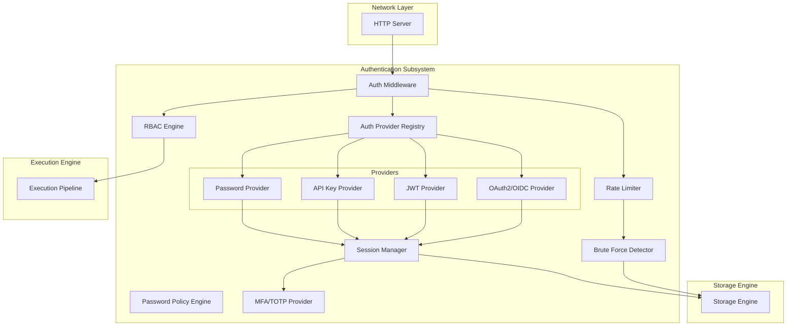
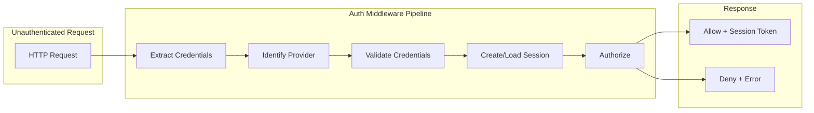
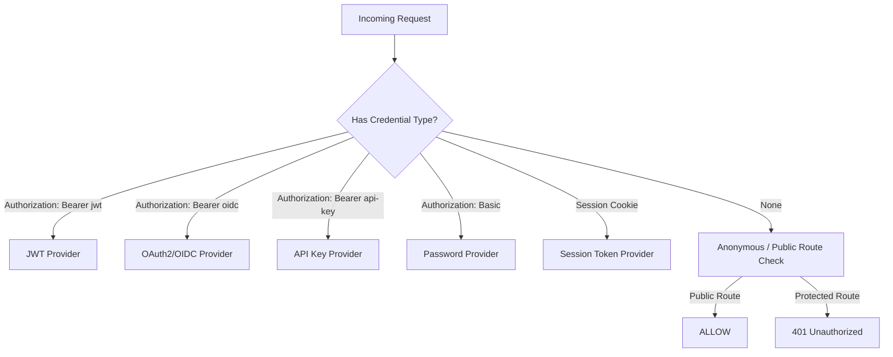
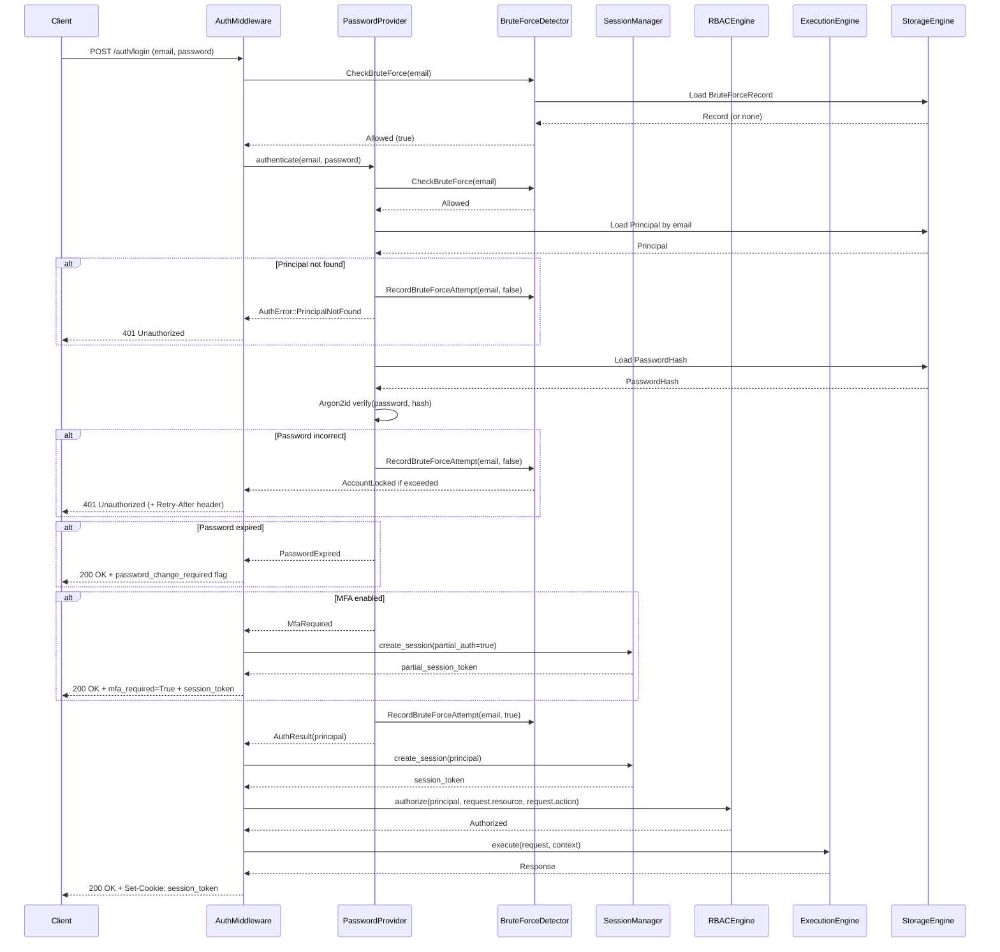
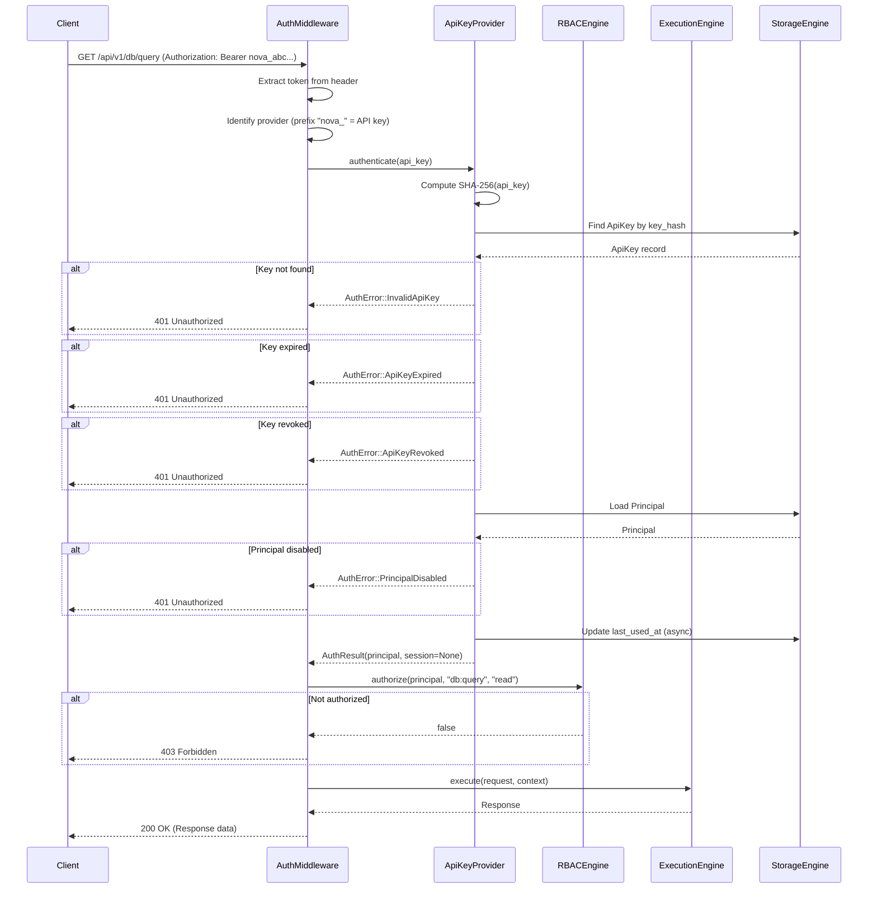
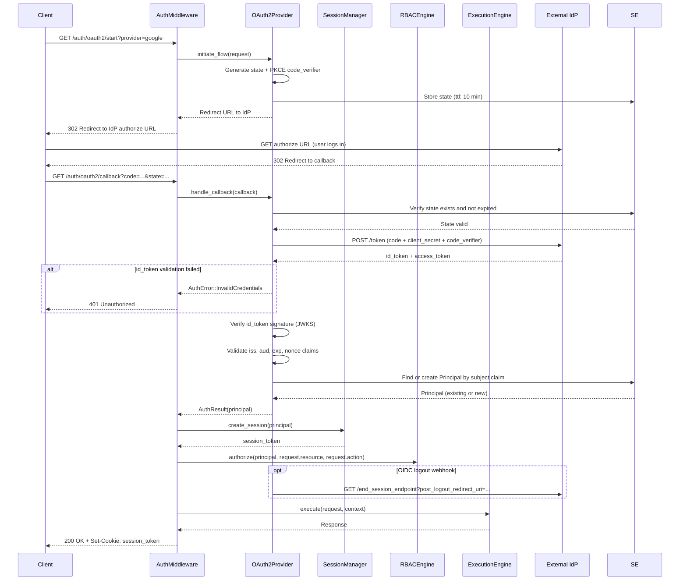
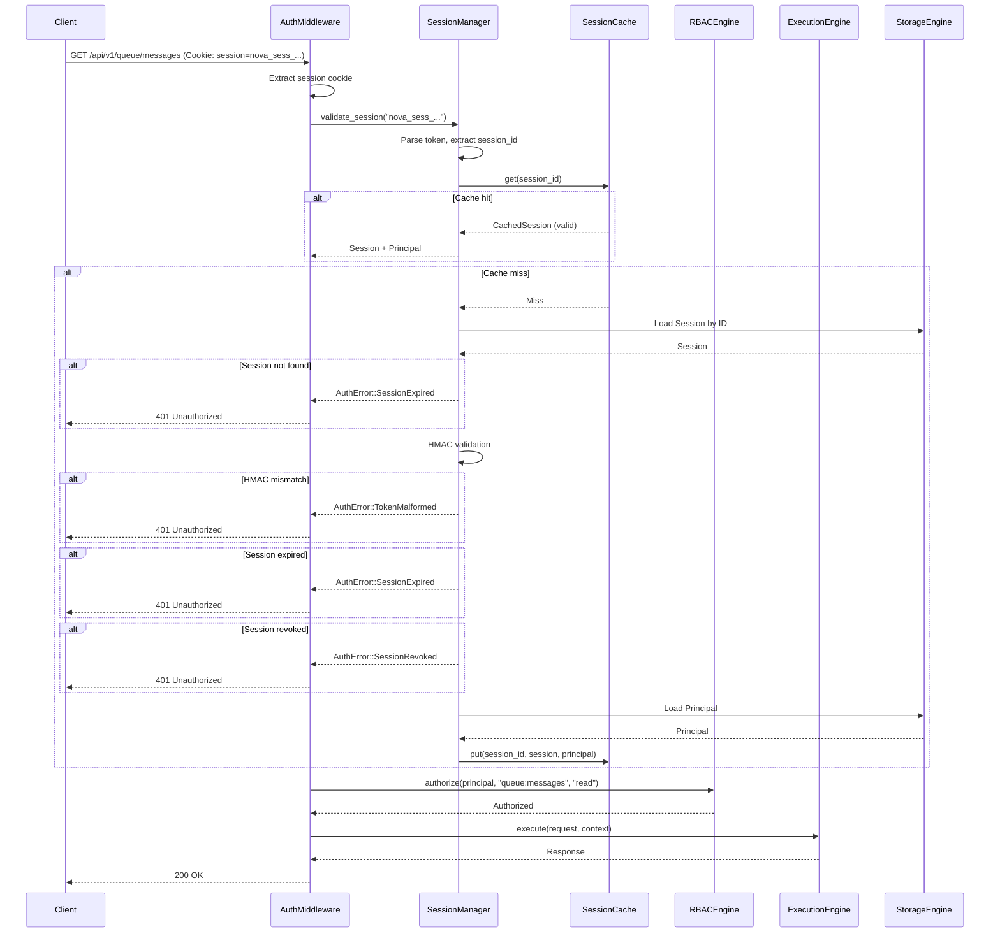
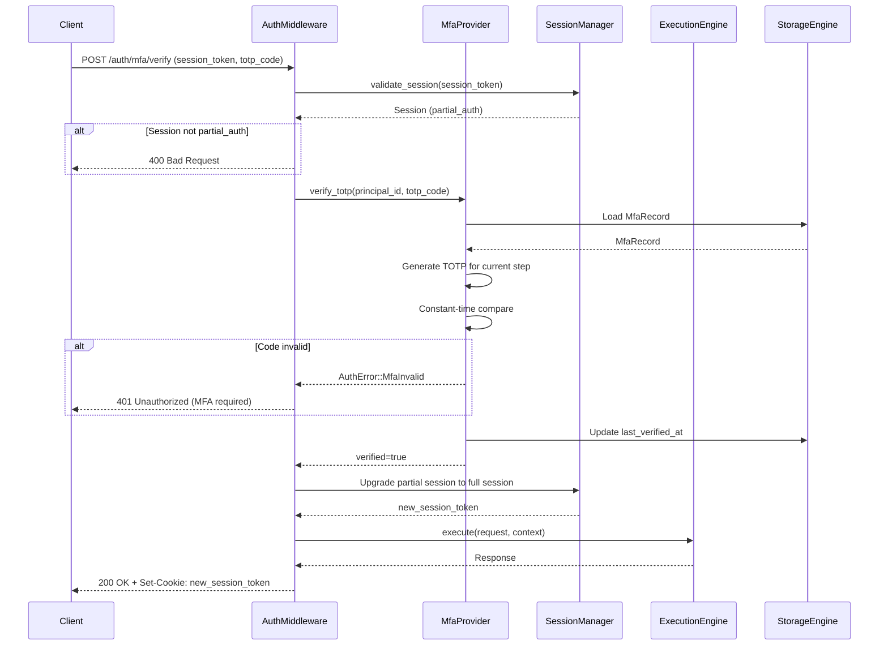
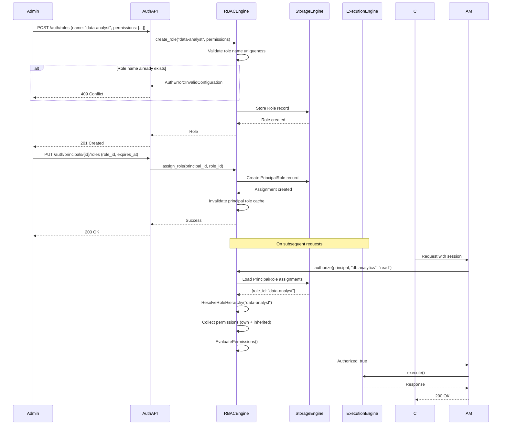

# 16. Authentication Subsystem

> **Implementation Status:** The actual implementation uses bcrypt for password hashing, not argon2id as described in this spec. JWT with HMAC-SHA256 is implemented. Argon2id, MFA/TOTP, WebAuthn, and API key prefixes are not implemented. Session management exists in-memory only (no Redis/SQLite backend).

## 1. Purpose

The Authentication subsystem provides identity verification, session management, authorization enforcement, and credential security for Nova Runtime. It ensures that every request reaching the Execution Engine can be attributed to a verified principal and that the principal possesses the required permissions for the requested operation. The subsystem acts as the security gateway between the network layer (inbound requests) and the Execution Engine, preventing unauthenticated or unauthorized access to any runtime resource.

## 2. Scope

This document covers all authentication and authorization mechanisms within Nova Runtime:

- Authentication providers (password/hash, API keys, JWT, OAuth2/OIDC)
- Session management (creation, storage, expiry, refresh, revocation)
- Role-Based Access Control (RBAC) with role hierarchy
- Permission model (resource:action verbs)
- Built-in roles (admin, developer, read-only)
- Custom role definition
- Authentication middleware integration with the Execution Engine
- Password policies (minimum length, complexity, history, rotation)
- Rate limiting on authentication endpoints
- Brute force protection (account lockout with exponential backoff)
- Session revocation and invalidation
- API key creation, rotation, and revocation
- Multi-factor authentication (TOTP) support

Out of scope: TLS/mTLS termination (handled by Networking subsystem, doc 13), audit logging (handled by Security subsystem, doc 15), identity federation beyond OAuth2/OIDC.

## 3. Responsibilities

- Verify identity claims from authentication providers
- Issue and validate session tokens
- Store and retrieve session state
- Enforce password policies during credential creation and update
- Detect and mitigate brute force login attempts
- Evaluate authorization requests against the RBAC model
- Provide authentication middleware for the Execution Engine pipeline
- Manage API key lifecycle (creation, validation, rotation, revocation)
- Support OAuth2/OIDC code and token exchange flows
- Generate and verify TOTP tokens for multi-factor authentication
- Maintain role and permission hierarchies

## 4. Non Responsibilities

- TLS termination or certificate management (handled by Networking)
- Audit log storage and query (handled by Security)
- Identity provider discovery (OAuth2 well-known endpoints are consumed, not published)
- User profile data storage beyond authentication needs
- External identity synchronization (SCIM is future work)
- Session replication across nodes (clustering is future work)
- Fine-grained attribute-based access control (ABAC is future work)

## 5. Architecture

### 5.1 High-Level Architecture



### 5.2 Authentication Flow Architecture



### 5.3 Provider Resolution



## 6. Data Structures

### 6.1 Principal

```rust
struct Principal {
    /// Unique identifier for the principal (UUIDv4)
    id: [u8; 16],                    // 16 bytes
    /// Principal type: user, service_account, api_key_identity
    principal_type: PrincipalType,   // 1 byte enum
    /// Display name
    name: String,                     // variable, max 256 bytes
    /// Email address (for user principals)
    email: Option<String>,            // variable, max 320 bytes
    /// Email verified timestamp (Unix nanoseconds)
    email_verified_at: Option<i64>,   // 8 bytes
    /// Reference to tenant/organization
    tenant_id: Option<[u8; 16]>,     // 16 bytes
    /// Whether the principal is active
    enabled: bool,                    // 1 byte
    /// Creation timestamp (Unix nanoseconds)
    created_at: i64,                  // 8 bytes
    /// Last modification timestamp (Unix nanoseconds)
    updated_at: i64,                  // 8 bytes
}
// Total: ~72 bytes + variable string fields
// Storage: Stored as a record in the principals table of Storage Engine
```

### 6.2 Password Hash Record

```rust
struct PasswordHash {
    /// Reference to principal
    principal_id: [u8; 16],          // 16 bytes
    /// Argon2id encoded hash string
    hash: String,                     // variable, ~128 bytes
    /// Hash algorithm version (for rotation)
    algorithm_version: u32,           // 4 bytes
    /// Password last changed timestamp (Unix nanoseconds)
    changed_at: i64,                  // 8 bytes
    /// Number of previous passwords stored (for history)
    previous_hashes: Vec<String>,     // variable, max 24 entries
}
// Total: ~28 bytes + hash string + history
// Storage: Stored as record in the password_hashes table
```

### 6.3 Session

```rust
struct Session {
    /// Session ID (UUIDv4) - used as the session token value
    id: [u8; 16],                    // 16 bytes
    /// Principal who owns this session
    principal_id: [u8; 16],          // 16 bytes
    /// Session type: bearer, cookie
    session_type: SessionType,       // 1 byte enum
    /// Session creation timestamp (Unix nanoseconds)
    created_at: i64,                 // 8 bytes
    /// Session expiry timestamp (Unix nanoseconds)
    expires_at: i64,                 // 8 bytes
    /// Last access timestamp (Unix nanoseconds)
    last_accessed_at: i64,           // 8 bytes
    /// IP address at session creation
    created_ip: Option<[u8; 16]>,    // 16 bytes (IPv6 or IPv4-mapped)
    /// User agent string
    user_agent: Option<String>,       // variable, max 512 bytes
    /// Claims/attributes attached to session
    claims: HashMap<String, Value>,   // variable
    /// Whether session is revoked
    revoked: bool,                    // 1 byte
    /// Revocation timestamp (Unix nanoseconds)
    revoked_at: Option<i64>,          // 8 bytes
    /// MFA verified for this session
    mfa_verified: bool,               // 1 byte
    /// MFA verification timestamp
    mfa_verified_at: Option<i64>,     // 8 bytes
}
// Total: ~84 bytes + variable fields
// Storage: Stored as record in the sessions table
// Cache: Hot sessions kept in memory with LRU eviction
```

### 6.4 API Key

```rust
struct ApiKey {
    /// Internal key ID (UUIDv4)
    id: [u8; 16],                    // 16 bytes
    /// Principal who owns this key
    principal_id: [u8; 16],          // 16 bytes
    /// Key name/label for management UI
    name: String,                     // variable, max 128 bytes
    /// Key prefix (first 8 chars) for identification
    prefix: String,                   // 8 bytes (ASCII)
    /// Blinded key hash (SHA-256 of full key)
    key_hash: [u8; 32],              // 32 bytes
    /// Key hash algorithm version
    hash_version: u32,               // 4 bytes
    /// Key role assignment
    role_id: Option<[u8; 16]>,       // 16 bytes
    /// Key-specific permissions (overrides)
    permissions: Vec<Permission>,     // variable
    /// Creation timestamp (Unix nanoseconds)
    created_at: i64,                  // 8 bytes
    /// Expiry timestamp (Unix nanoseconds), None = no expiry
    expires_at: Option<i64>,          // 8 bytes
    /// Last used timestamp (Unix nanoseconds)
    last_used_at: Option<i64>,        // 8 bytes
    /// Whether key is revoked
    revoked: bool,                    // 1 byte
    /// Revocation timestamp
    revoked_at: Option<i64>,          // 8 bytes
}
// Total: ~120 bytes + variable fields
// Storage: Stored as record in the api_keys table
```

### 6.5 Role

```rust
struct Role {
    /// Role ID (UUIDv4)
    id: [u8; 16],                    // 16 bytes
    /// Role name (unique within tenant)
    name: String,                     // variable, max 64 bytes
    /// Role description
    description: Option<String>,      // variable, max 512 bytes
    /// Role type: builtin or custom
    role_type: RoleType,             // 1 byte enum
    /// Parent role ID for hierarchy (None = root)
    parent_role_id: Option<[u8; 16]>, // 16 bytes
    /// Permissions granted by this role
    permissions: Vec<Permission>,     // variable
    /// Maximum role hierarchy depth
    hierarchy_depth: u32,            // 4 bytes
    /// Tenant scope (None = global role)
    tenant_id: Option<[u8; 16]>,     // 16 bytes
    /// Creation timestamp (Unix nanoseconds)
    created_at: i64,                  // 8 bytes
    /// Last modification timestamp (Unix nanoseconds)
    updated_at: i64,                  // 8 bytes
}
// Total: ~70 bytes + variable fields
```

### 6.6 Permission

```rust
struct Permission {
    /// Resource pattern (e.g., "db:users", "queue:*", "blob:private/*")
    resource: String,                 // variable, max 256 bytes
    /// Action verb (e.g., "read", "write", "delete", "admin", "*")
    action: String,                   // variable, max 32 bytes
    /// Effect: Allow (true) or Deny (false)
    effect: PermissionEffect,        // 1 byte
    /// Condition expression (optional, for future ABAC)
    condition: Option<Condition>,     // variable
}
```

### 6.7 Principal-Role Assignment

```rust
struct PrincipalRole {
    /// Principal ID
    principal_id: [u8; 16],          // 16 bytes
    /// Role ID
    role_id: [u8; 16],              // 16 bytes
    /// Assignment timestamp (Unix nanoseconds)
    assigned_at: i64,                 // 8 bytes
    /// Assignor principal ID
    assigned_by: [u8; 16],          // 16 bytes
    /// Expiry of role assignment (None = no expiry)
    expires_at: Option<i64>,          // 8 bytes
}
// Total: 56 bytes
```

### 6.8 Brute Force Record

```rust
struct BruteForceRecord {
    /// Identifier key (e.g., "login:user:<email>", "login:ip:<addr>")
    key: String,                      // variable, max 256 bytes
    /// Failure count
    failure_count: u32,              // 4 bytes
    /// First failure timestamp (Unix nanoseconds)
    first_failure_at: i64,           // 8 bytes
    /// Last failure timestamp (Unix nanoseconds)
    last_failure_at: i64,            // 8 bytes
    /// Lockout expiry (None = not locked)
    locked_until: Option<i64>,        // 8 bytes
    /// Window reset timestamp (Unix nanoseconds)
    window_reset_at: i64,            // 8 bytes
}
// Total: ~36 bytes + key
```

### 6.9 MFA/TOTP Record

```rust
struct MfaRecord {
    /// Principal ID
    principal_id: [u8; 16],          // 16 bytes
    /// MFA type: totp, sms, email, backup_code
    mfa_type: MfaType,               // 1 byte enum
    /// TOTP secret (encrypted at rest)
    secret: [u8; 20],                 // 20 bytes (HMAC-SHA1 key)
    /// Whether MFA is enabled
    enabled: bool,                    // 1 byte
    /// Backup codes (SHA-256 hashed)
    backup_codes: Vec<[u8; 32]>,     // 32 bytes each, max 10
    /// Last verified timestamp
    last_verified_at: Option<i64>,    // 8 bytes
    /// Created at
    created_at: i64,                  // 8 bytes
}
// Total: ~54 bytes + backup codes
```

### 6.10 Rate Limit State (In-Memory)

```rust
struct RateLimitState {
    /// Rate limit key
    key: String,                      // variable
    /// Request count in current window
    count: u32,                      // 4 bytes
    /// Window start timestamp (Unix nanoseconds)
    window_start: i64,               // 8 bytes
    /// Window duration in nanoseconds
    window_duration: i64,            // 8 bytes
    /// Maximum requests per window
    max_requests: u32,               // 4 bytes
}
// Total: 24 bytes + key
// NOTE: Stored in-memory only, never persisted
// Uses sharded atomic counters for performance
```

### 6.11 Authentication Token (Wire Format)

```rust
enum AuthToken {
    /// Bearer token from Authorization header
    Bearer {
        /// Raw token string
        token: String,                // variable, max 4096 bytes
    },
    /// Basic authentication
    Basic {
        /// Username/email
        username: String,             // variable, max 320 bytes
        /// Password
        password: String,             // variable, max 4096 bytes
    },
    /// Session cookie
    SessionCookie {
        /// Session ID
        session_id: String,           // variable, 36 bytes (UUID string)
        /// CSRF token (if applicable)
        csrf_token: Option<String>,   // variable, max 128 bytes
    },
}
```

## 7. Algorithms

### 7.1 Password Verification

```
Algorithm: VerifyPassword
Input:
  - principal_id: UUID
  - password: String (cleartext, max 4096 bytes)
  - current_time: i64

Output:
  - success: bool
  - needs_rehash: bool

Steps:
  1. Load PasswordHash record for principal_id from Storage Engine
     If no record exists, return (false, false)
  
  2. Parse the hash string to extract algorithm, salt, and parameters:
     Format: "$argon2id$v=19$m=19456,t=2,p=1$<base64-salt>$<base64-hash>"
     - Memory: 19456 KiB (~19 MB)
     - Iterations: 2
     - Parallelism: 1
     - Salt length: 16 bytes (random)
     - Hash length: 32 bytes
  
  3. Compute hash using Argon2id with stored parameters and provided password
     Use constant-time comparison to prevent timing attacks
  
  4. If mismatch:
     Return (false, false)
  
  5. If match:
     a. Check if algorithm_version < CURRENT_ALGORITHM_VERSION
     b. Check if memory cost < CURRENT_MINIMUM_MEMORY
     c. Check if iterations < CURRENT_MINIMUM_ITERATIONS
     If any check fails, set needs_rehash = true
  
  6. Return (true, needs_rehash)
```

### 7.2 Session Token Generation

```
Algorithm: GenerateSessionToken
Input:
  - principal_id: UUID
  - session_type: SessionType (bearer | cookie)
  - ttl_seconds: u64 (default: 86400 for bearer, 604800 for cookie)
  - created_ip: Option<[u8; 16]>
  - user_agent: Option<String>
  - claims: HashMap<String, Value>
  - current_time: i64

Output:
  - session_token: String
  - expires_at: i64

Steps:
  1. Generate session_id = UUIDv4 (16 random bytes)
  
  2. Compute session_token:
     Format: "nova_sess_<base64url(session_id + hmac)>"
     Where:
       hmac = HMAC-SHA256(
         key = SESSION_SIGNING_KEY (from configuration),
         data = session_id + principal_id + expires_at
       )
     Take first 16 bytes of HMAC output
  
  3. Create Session struct:
     id = session_id
     principal_id = principal_id
     session_type = session_type
     created_at = current_time
     expires_at = current_time + (ttl_seconds * 1_000_000_000)
     last_accessed_at = current_time
     created_ip = created_ip
     user_agent = user_agent
     claims = claims
     revoked = false
     mfa_verified = false
  
  4. Store Session in Storage Engine:
     - Primary index: session_id
     - Secondary index: principal_id + expires_at (for cleanup)
     - Set TTL on record to expires_at for automatic cleanup
  
  5. Add session_token to in-memory session cache:
     - Cache size: 100,000 entries
     - Eviction: LRU
     - TTL match: expires_at - current_time
  
  6. Return (session_token, expires_at)
```

### 7.3 Session Validation

```
Algorithm: ValidateSession
Input:
  - session_token: String
  - current_time: i64
  - required_mfa: bool

Output:
  - principal: Option<Principal>
  - session: Option<Session>

Steps:
  1. Parse session_token:
     If format != "nova_sess_<payload>", return (None, None)
     Decode base64url payload to get session_id (16 bytes) and hmac_signature (16 bytes)
  
  2. Check in-memory session cache:
     If found and not expired and not revoked:
       If required_mfa and not session.mfa_verified:
         Return (None, session) with MFA required error
       Update last_accessed_at in cache (async)
       Return cached principal and session
  
  3. Load Session from Storage Engine:
     If not found, return (None, None)
  
  4. Validate HMAC:
     expected_hmac = HMAC-SHA256(
       key = SESSION_SIGNING_KEY,
       data = session_id + session.principal_id + session.expires_at
     )
     first_16_bytes = truncate(expected_hmac, 16)
     If constant_time_compare(first_16_bytes, hmac_signature) == false:
       Return (None, None)
  
  5. Check expiry:
     If current_time >= session.expires_at:
       Delete session from Storage Engine and cache
       Return (None, None)
  
  6. Check revocation:
     If session.revoked == true:
       Return (None, None)
  
  7. Check MFA requirement:
     If required_mfa and not session.mfa_verified:
       Return (None, session) with MFA required error
  
  8. Load Principal from Storage Engine or cache:
     If not found or not enabled:
       Return (None, None)
  
  9. Update session in cache (LRU, update last_accessed_at):
     Write-back to Storage Engine best-effort (non-blocking)
  
  10. Return (principal, session)
```

### 7.4 RBAC Authorization

```
Algorithm: Authorize
Input:
  - principal: Principal
  - session: Option<Session>
  - required_resource: String (e.g., "db:users")
  - required_action: String (e.g., "write")
  - context: HashMap<String, Value> (request context for conditions)

Output:
  - authorized: bool
  - matched_rule: Option<String> (for audit)

Steps:
  1. If principal.principal_type == ServiceAccount:
     Load API key permissions AND role permissions
  
  2. Load all roles assigned to principal:
     a. Query PrincipalRole table for principal_id
     b. For each role, load Role record
     c. Resolve role hierarchy from leaf to root
     d. Collect all permissions, last match wins (deny overrides allow)
  
  3. If session has claims with permissions (delegated):
     Intersect with role permissions
  
  4. Permission matching algorithm:
     For each permission in collected set (in order from most recent to least recent):
       a. Match required_resource against permission.resource:
          - Exact match: "db:users" matches "db:users"
          - Wildcard segment: "db:*" matches "db:users", "db:tokens"
          - Wildcard suffix: "blob:private/*" matches "blob:private/doc.pdf"
          - Wildcard only: "*" matches everything
          - Glob-style: "queue:orders.*" matches "queue:orders.create"
       b. Match required_action against permission.action:
          - Same wildcard rules as resource
          - Action hierarchy: "*" > "admin" > "write" > "read"
            "write" implies "read" check (write permission includes read)
            "admin" implies all actions
            "*" implies all actions  
       c. If both match:
          If permission.effect == Deny:
            Return (false, "Deny rule matched: <resource>:<action>")
          If permission.effect == Allow:
            Set last_match = Allow
  
  5. Check built-in role permissions for unauthenticated resources:
     Some resources have public access configured
  
  6. Return based on last_match:
     If last_match == Allow: Return (true, "Allow rule matched: <resource>:<action>")
     If no match: Return (false, "No matching permission rule")
  
  7. Note on deny priority:
     Deny always overrides Allow regardless of order.
     This is implemented by checking deny rules after the full allow scan:
     If any deny matches, authorization is denied.
```

### 7.5 Role Hierarchy Resolution

```
Algorithm: ResolveRoleHierarchy
Input:
  - role_id: UUID
  - max_depth: u32 (default: 10)

Output:
  - permissions: Vec<Permission>
  - resolved_role_ids: Vec<UUID>

Steps:
  1. Initialize empty permission set
  2. Initialize empty visited set (cycle detection)
  3. Initialize queue with role_id
  4. Initialize depth counter = 0

  5. While queue is not empty and depth < max_depth:
     a. current_role_id = queue.pop_front()
     b. If current_role_id in visited:
        Continue (cycle detected, skip)
     c. Add current_role_id to visited
     d. Load Role record
     e. Prepend role.permissions to permission set
        (parent permissions have lower priority than child)
     f. If role.parent_role_id is Some:
        Queue parent_role_id
     g. depth += 1

  6. If depth >= max_depth:
     Log warning: "Role hierarchy exceeds max depth, truncating"
     Return partial result

  7. Return (permissions, visited as resolved_role_ids)
```

### 7.6 Brute Force Detection

```
Algorithm: CheckBruteForce
Input:
  - identifier: String (email, username, or IP address)
  - current_time: i64

Output:
  - allowed: bool
  - retry_after_seconds: u64

Constants:
  WINDOW_DURATION = 300_000_000_000  (5 minutes in nanoseconds)
  MAX_FAILURES_PER_WINDOW = 5
  LOCKOUT_BASE_DURATION = 30_000_000_000  (30 seconds in nanoseconds)
  LOCKOUT_MULTIPLIER = 2.0  (exponential backoff)
  LOCKOUT_MAX_DURATION = 3_600_000_000_000  (1 hour in nanoseconds)

Steps:
  1. Load BruteForceRecord for identifier from Storage Engine
     If no record exists, return (true, 0)

  2. If record.locked_until is Some and current_time < locked_until:
     retry_after = (locked_until - current_time) / 1_000_000_000  (convert to seconds)
     Return (false, ceil(retry_after))

  3. If current_time >= record.window_reset_at:
     # Window has expired, reset counter
     record.failure_count = 0
     record.first_failure_at = current_time
     record.window_reset_at = current_time + WINDOW_DURATION

  4. If record.failure_count >= MAX_FAILURES_PER_WINDOW:
     # Lock the account
     lockout_duration = min(
       LOCKOUT_BASE_DURATION * (LOCKOUT_MULTIPLIER ^ (record.failure_count - MAX_FAILURES_PER_WINDOW)),
       LOCKOUT_MAX_DURATION
     )
     record.locked_until = current_time + lockout_duration
     Persist record
     retry_after = lockout_duration / 1_000_000_000
     Return (false, ceil(retry_after))

  5. Return (true, 0)
```

```
Algorithm: RecordBruteForceAttempt
Input:
  - identifier: String
  - success: bool
  - current_time: i64

Steps:
  1. Load BruteForceRecord for identifier
     If no record exists, create new

  2. If success:
     # Successful login resets counter
     Delete BruteForceRecord
     Return

  3. # Failed attempt
  4. If current_time >= record.window_reset_at:
     # Start new window
     record.failure_count = 1
     record.first_failure_at = current_time
     record.window_reset_at = current_time + WINDOW_DURATION
  5. Else:
     record.failure_count += 1

  6. record.last_failure_at = current_time

  7. If record.failure_count >= MAX_FAILURES_PER_WINDOW:
     lockout_duration = min(
       LOCKOUT_BASE_DURATION * (LOCKOUT_MULTIPLIER ^ (record.failure_count - MAX_FAILURES_PER_WINDOW)),
       LOCKOUT_MAX_DURATION
     )
     record.locked_until = current_time + lockout_duration

  8. Persist record to Storage Engine
```

### 7.7 API Key Generation

```
Algorithm: GenerateApiKey
Input:
  - principal_id: UUID
  - name: String
  - role_id: Option<UUID>
  - permissions: Vec<Permission>
  - expires_at: Option<i64>
  - current_time: i64

Output:
  - api_key_id: UUID
  - full_api_key: String  (SHOWN ONCE AND NOT STORED)
  - api_key_record: ApiKey

Steps:
  1. Generate api_key_id = UUIDv4
  
  2. Generate 32 random bytes (key_material)
  
  3. Encode key_material as base62 (alphanumeric, no special chars):
     Format: "nova_<prefix>_<base62(32_bytes)>"
     Where prefix = first 8 chars of lowercase hex of SHA-256(api_key_id)
     Total length: 5 + 8 + 1 + 43 = 57 characters
  
  4. Compute key_hash = SHA-256(full_api_key)
  
  5. Construct ApiKey record:
     All fields populated from inputs and generated values
  
  6. Store ApiKey in Storage Engine:
     - Primary index: api_key_id
     - Unique index: key_hash (for fast lookup)
     - Note: full_api_key is NEVER stored

  7. Return (api_key_id, full_api_key, api_key_record)
```

### 7.8 TOTP Verification

```
Algorithm: VerifyTOTP
Input:
  - principal_id: UUID
  - totp_code: String (6 digits)
  - current_time: i64

Output:
  - verified: bool

Constants:
  TOTP_STEP = 30  (seconds)
  TOTP_ALLOWED_DRIFT = 1  (steps before and after, total 3 windows)
  TOTP_DIGITS = 6
  TOTP_ALGORITHM = HMAC-SHA1

Steps:
  1. Load MfaRecord for principal_id
     If not found or not enabled, return false

  2. Compute current_step = floor(current_time / 1_000_000_000 / TOTP_STEP)

  3. For offset in [-TOTP_ALLOWED_DRIFT, 0, TOTP_ALLOWED_DRIFT]:
     a. counter_step = current_step + offset
     b. counter_bytes = big_endian_encode(counter_step, 8 bytes)
     c. hmac = HMAC-SHA1(secret, counter_bytes)  // 20 bytes
     d. offset_bits = hmac[19] & 0x0F
     e. binary_code = (hmac[offset_bits] & 0x7F) << 24 |
                      (hmac[offset_bits+1] & 0xFF) << 16 |
                      (hmac[offset_bits+2] & 0xFF) << 8 |
                      (hmac[offset_bits+3] & 0xFF)
     f. totp = binary_code % (10 ^ TOTP_DIGITS)
     g. Format as zero-padded 6-digit string
     h. If constant_time_compare(formatted_totp, totp_code):
        Update last_verified_at in MfaRecord
        Return true

  4. Return false
```

### 7.9 Password Policy Enforcement

```
Algorithm: EnforcePasswordPolicy
Input:
  - password: String
  - principal_id: UUID
  - current_time: i64

Output:
  - valid: bool
  - errors: Vec<String>

Policy Configuration (defaults):
  MIN_LENGTH = 12
  MAX_LENGTH = 128
  REQUIRE_UPPERCASE = true
  REQUIRE_LOWERCASE = true
  REQUIRE_DIGIT = true
  REQUIRE_SPECIAL = true
  SPECIAL_CHARS = "!@#$%^&*()_+-=[]{}|;':\",./<>?"
  MAX_CONSECUTIVE_REPEAT = 3
  HISTORY_COUNT = 24  (cannot reuse last 24 passwords)
  MIN_PASSWORD_AGE_SECONDS = 86400  (1 day, prevent rapid cycling)
  MAX_PASSWORD_AGE_SECONDS = 7776000  (90 days)

Steps:
  1. Initialize empty errors list

  2. Length checks:
     If password.length < MIN_LENGTH:
       errors.push("Password must be at least {MIN_LENGTH} characters")
     If password.length > MAX_LENGTH:
       errors.push("Password must be at most {MAX_LENGTH} characters")

  3. Character class checks:
     If REQUIRE_UPPERCASE and no uppercase char:
       errors.push("Password must contain an uppercase letter")
     If REQUIRE_LOWERCASE and no lowercase char:
       errors.push("Password must contain a lowercase letter")
     If REQUIRE_DIGIT and no digit:
       errors.push("Password must contain a digit")
     If REQUIRE_SPECIAL and no special char:
       errors.push("Password must contain a special character")

  4. Consecutive repeat check:
     For i in 0..password.length - MAX_CONSECUTIVE_REPEAT:
       substring = password[i..i+MAX_CONSECUTIVE_REPEAT]
       If all characters in substring are the same:
         errors.push("Password must not contain {MAX_CONSECUTIVE_REPEAT} or more consecutive identical characters")
         Break

  5. History check:
     Load PasswordHash record
     For each previous_hash in record.previous_hashes:
       If Argon2id.verify(password, previous_hash) == true:
         errors.push("Password has been used recently. Cannot reuse last {HISTORY_COUNT} passwords")
         Break

  6. Age check:
     If password was changed recently:
       age = current_time - record.changed_at
       If age < MIN_PASSWORD_AGE_SECONDS:
         errors.push("Password was changed too recently. Wait {MIN_PASSWORD_AGE_SECONDS - age} seconds")
  
  7. If password age exceeds MAX_PASSWORD_AGE_SECONDS:
     Set force_change flag on principal (login flow checks this)

  8. Return (errors.is_empty(), errors)
```

### 7.10 Permission Evaluation Order

```
Algorithm: EvaluatePermissions
Input:
  - role_permissions: Vec<Permission>  (resolved from role hierarchy)
  - direct_permissions: Option<Vec<Permission>>  (from API key or session)
  - required_resource: String
  - required_action: String

Output:
  - Effect (Allow | Deny | NoMatch)

Steps:
  1. Merge permissions:
     all_permissions = role_permissions
     If direct_permissions is Some:
       Prepend direct_permissions to all_permissions
       (Direct permissions override role permissions)

  2. Initialize effect = NoMatch

  3. For each permission in all_permissions (most specific first):
     a. If resource_match(permission.resource, required_resource):
        If action_match(permission.action, required_action):
          If permission.effect == Deny:
            Return Deny immediately
          If permission.effect == Allow:
            effect = Allow

  4. Return effect

Helper: resource_match(pattern, resource):
  - If pattern == "*": return true
  - If pattern.ends_with("/*"):
      prefix = pattern.trim_suffix("/*")
      return resource == prefix || resource.starts_with(prefix + "/") || resource.starts_with(prefix + ":")
  - If pattern.contains("*"):
      Convert to regex: escape regex chars, replace "*" with "[^:]*"
      Return regex_match(pattern, resource)
  - Return pattern == resource

Helper: action_match(pattern, action):
  - If pattern == "*" or pattern == "admin": return true
  - If pattern == action: return true
  - If pattern == "write" and action == "read": return true (write implies read)
  - If pattern == "delete" and (action == "read" or action == "write"): return true
  - Return false
```

## 8. Interfaces

### 8.1 AuthProvider Trait

```rust
/// Trait implemented by all authentication providers.
trait AuthProvider {
    /// The provider name (e.g., "password", "api_key", "jwt", "oauth2").
    fn name(&self) -> &str;

    /// Extract credentials from the raw request.
    /// Returns None if this provider cannot handle the request.
    fn extract_credentials(&self, request: &Request) -> Result<Option<Credentials>, AuthError>;

    /// Validate credentials and return the authenticated principal.
    /// Returns the principal and any session claims.
    fn authenticate(&self, credentials: &Credentials) -> Result<AuthResult, AuthError>;

    /// Initiate an authentication flow (for OAuth2/OIDC redirect).
    fn initiate_flow(&self, request: &FlowRequest) -> Result<FlowResponse, AuthError>;

    /// Handle a callback from an external provider (for OAuth2/OIDC).
    fn handle_callback(&self, callback: &CallbackRequest) -> Result<AuthResult, AuthError>;
}
```

### 8.2 Auth Middleware

```rust
/// Authentication middleware for the Execution Engine pipeline.
struct AuthMiddleware {
    providers: Vec<Box<dyn AuthProvider>>,
    session_manager: Arc<SessionManager>,
    rbac_engine: Arc<RbacEngine>,
    rate_limiter: Arc<RateLimiter>,
    brute_force_detector: Arc<BruteForceDetector>,
    mfa_provider: Arc<MfaProvider>,
    config: AuthConfig,
}

impl AuthMiddleware {
    /// Create new auth middleware with configured providers.
    fn new(
        storage_engine: Arc<StorageEngine>,
        config: AuthConfig,
    ) -> Self;

    /// Authenticate and authorize a request before execution.
    /// This is the main entry point called by the Execution Engine.
    fn process_request(
        &self,
        request: &mut Request,
        context: &mut ExecutionContext,
    ) -> Result<AuthDecision, AuthError>;
    
    /// Authenticate without authorization (for login endpoints).
    fn authenticate_only(
        &self,
        request: &Request,
    ) -> Result<AuthResult, AuthError>;
    
    /// Explicitly authorize an already-authenticated principal.
    fn authorize_only(
        &self,
        principal: &Principal,
        session: Option<&Session>,
        resource: &str,
        action: &str,
        context: &HashMap<String, Value>,
    ) -> Result<bool, AuthError>;
    
    /// Refresh a session, extending its TTL.
    fn refresh_session(&self, session_token: &str) -> Result<String, AuthError>;
    
    /// Revoke a session.
    fn revoke_session(&self, session_id: &[u8; 16]) -> Result<(), AuthError>;
    
    /// Revoke all sessions for a principal.
    fn revoke_all_principal_sessions(&self, principal_id: &[u8; 16]) -> Result<u64, AuthError>;
}
```

### 8.3 Session Manager

```rust
struct SessionManager {
    storage: Arc<StorageEngine>,
    cache: Arc<SessionCache>,
    signing_key: [u8; 32],
    config: SessionConfig,
}

impl SessionManager {
    fn new(storage: Arc<StorageEngine>, config: SessionConfig, signing_key: [u8; 32]) -> Self;
    
    /// Create a new session for the principal.
    fn create_session(
        &self,
        principal_id: &[u8; 16],
        session_type: SessionType,
        ttl_seconds: u64,
        created_ip: Option<[u8; 16]>,
        user_agent: Option<String>,
        claims: HashMap<String, Value>,
    ) -> Result<(Session, String), AuthError>;
    // Returns (session_record, session_token_string)
    // Error conditions:
    //   - PrincipalNotFound: principal_id does not exist
    //   - PrincipalDisabled: principal is not enabled
    //   - StorageError: underlying storage failure
    //   - SessionLimitExceeded: principal has too many active sessions
    
    /// Validate a session token and return the session and principal.
    fn validate_session(
        &self,
        session_token: &str,
    ) -> Result<Option<(Session, Principal)>, AuthError>;
    // Error conditions:
    //   - SessionExpired: token is valid but expired
    //   - SessionRevoked: token was explicitly revoked
    //   - TokenMalformed: token format is invalid
    
    /// Refresh a session token, returning a new token.
    fn refresh_session(&self, session_token: &str) -> Result<String, AuthError>;
    // Error conditions:
    //   - Same as validate_session
    //   - RefreshNotAllowed: session type does not support refresh
    
    /// Revoke a specific session.
    fn revoke_session(&self, session_id: &[u8; 16]) -> Result<(), AuthError>;
    
    /// Revoke all sessions for a principal.
    fn revoke_all_sessions(&self, principal_id: &[u8; 16]) -> Result<u64, AuthError>;
    // Returns count of revoked sessions
    
    /// Clean up expired sessions (called periodically by maintenance task).
    fn cleanup_expired(&self) -> Result<u64, AuthError>;
    // Returns count of removed sessions
}
```

### 8.4 RBAC Engine

```rust
struct RbacEngine {
    storage: Arc<StorageEngine>,
    role_cache: Arc<RoleCache>,
    config: RbacConfig,
}

impl RbacEngine {
    fn new(storage: Arc<StorageEngine>, config: RbacConfig) -> Self;
    
    /// Check if principal is authorized for resource:action.
    fn authorize(
        &self,
        principal: &Principal,
        session: Option<&Session>,
        resource: &str,
        action: &str,
        context: &HashMap<String, Value>,
    ) -> Result<bool, AuthError>;
    // Error conditions:
    //   - RoleNotFound: assigned role no longer exists
    //   - CircularHierarchy: role hierarchy has a cycle
    //   - HierarchyTooDeep: role hierarchy exceeds max depth
    //   - StorageError: underlying storage failure
    
    /// Assign a role to a principal.
    fn assign_role(
        &self,
        principal_id: &[u8; 16],
        role_id: &[u8; 16],
        assigned_by: &[u8; 16],
        expires_at: Option<i64>,
    ) -> Result<(), AuthError>;
    
    /// Remove a role assignment from a principal.
    fn unassign_role(
        &self,
        principal_id: &[u8; 16],
        role_id: &[u8; 16],
    ) -> Result<(), AuthError>;
    
    /// List all roles for a principal (resolved with hierarchy).
    fn list_principal_roles(
        &self,
        principal_id: &[u8; 16],
    ) -> Result<Vec<Role>, AuthError>;
    
    /// Create a custom role.
    fn create_role(
        &self,
        name: &str,
        description: Option<&str>,
        parent_role_id: Option<&[u8; 16]>,
        permissions: Vec<Permission>,
        tenant_id: Option<&[u8; 16]>,
    ) -> Result<Role, AuthError>;
    
    /// Update a role's permissions.
    fn update_role(
        &self,
        role_id: &[u8; 16],
        permissions: Vec<Permission>,
    ) -> Result<(), AuthError>;
    
    /// Delete a role (fails if assigned to any principal).
    fn delete_role(&self, role_id: &[u8; 16]) -> Result<(), AuthError>;
    
    /// List all permissions resolved for a principal.
    fn resolve_permissions(
        &self,
        principal_id: &[u8; 16],
    ) -> Result<Vec<Permission>, AuthError>;
}
```

### 8.5 Password Provider

```rust
struct PasswordProvider {
    storage: Arc<StorageEngine>,
    policy: Arc<PasswordPolicyEngine>,
    brute_force: Arc<BruteForceDetector>,
    config: PasswordConfig,
}

impl PasswordProvider {
    fn new(storage: Arc<StorageEngine>, config: PasswordConfig) -> Self;
    
    /// Authenticate with email/username and password.
    fn authenticate(&self, email: &str, password: &str) -> Result<AuthResult, AuthError>;
    // Error conditions:
    //   - PrincipalNotFound: email does not match any principal
    //   - InvalidPassword: password does not match hash
    //   - AccountLocked: brute force lockout active
    //   - PasswordExpired: password age exceeds max age
    //   - MfaRequired: authentication succeeded but MFA is required
    
    /// Set or update password for a principal.
    fn set_password(
        &self,
        principal_id: &[u8; 16],
        new_password: &str,
    ) -> Result<(), AuthError>;
    // Error conditions:
    //   - PasswordTooWeak: policy validation failed
    //   - PasswordReused: password in history
    //   - PasswordChangedTooSoon: min age not met
    
    /// Verify current password (for password change flow).
    fn verify_current_password(
        &self,
        principal_id: &[u8; 16],
        current_password: &str,
    ) -> Result<bool, AuthError>;
    
    /// Force password change at next login.
    fn require_password_change(&self, principal_id: &[u8; 16]) -> Result<(), AuthError>;
}
```

### 8.6 API Key Provider

```rust
struct ApiKeyProvider {
    storage: Arc<StorageEngine>,
    rbac: Arc<RbacEngine>,
    config: ApiKeyConfig,
}

impl ApiKeyProvider {
    fn new(storage: Arc<StorageEngine>, rbac: Arc<RbacEngine>, config: ApiKeyConfig) -> Self;
    
    /// Authenticate with an API key.
    fn authenticate(&self, api_key: &str) -> Result<AuthResult, AuthError>;
    // Error conditions:
    //   - InvalidApiKey: key format or hash does not match
    //   - ApiKeyExpired: key has passed expiration
    //   - ApiKeyRevoked: key was explicitly revoked
    //   - PrincipalDisabled: owning principal is disabled
    
    /// Create a new API key.
    fn create_key(
        &self,
        principal_id: &[u8; 16],
        name: &str,
        role_id: Option<&[u8; 16]>,
        expires_at: Option<i64>,
    ) -> Result<ApiKeyCreateResult, AuthError>;
    // Returns: (api_key_record, full_key_string)
    // full_key_string is shown once and NOT stored
    
    /// Rotate an API key (revoke old, create new with same permissions).
    fn rotate_key(
        &self,
        key_id: &[u8; 16],
    ) -> Result<ApiKeyCreateResult, AuthError>;
    
    /// Revoke an API key.
    fn revoke_key(&self, key_id: &[u8; 16]) -> Result<(), AuthError>;
    
    /// List all API keys for a principal.
    fn list_principal_keys(
        &self,
        principal_id: &[u8; 16],
    ) -> Result<Vec<ApiKey>, AuthError>;
    // Note: full keys are not returned, only metadata and prefix
    
    /// List recently used keys (for security audit).
    fn list_recently_used_keys(
        &self,
        since: i64,
    ) -> Result<Vec<ApiKey>, AuthError>;
}
```

### 8.7 Password Policy Engine

```rust
struct PasswordPolicyEngine {
    config: PasswordPolicyConfig,
}

impl PasswordPolicyEngine {
    fn new(config: PasswordPolicyConfig) -> Self;
    
    /// Validate password against all policy rules.
    fn validate(
        &self,
        password: &str,
        principal_id: &[u8; 16],
    ) -> Result<(), Vec<PasswordPolicyViolation>>;
    // Returns Ok(()) if valid, Err with list of violations if invalid
    // Violations include: TooShort, TooLong, MissingUppercase,
    //   MissingLowercase, MissingDigit, MissingSpecial,
    //   ConsecutiveRepeatedChars, RecentlyUsed, ChangedTooSoon
    
    /// Calculate password strength score (0-100).
    fn calculate_strength(&self, password: &str) -> u32;
    // 0-20: Very Weak, 21-40: Weak, 41-60: Fair, 61-80: Strong, 81-100: Very Strong
    
    /// Check if password requires rotation.
    fn needs_rotation(&self, password_hash: &PasswordHash) -> bool;
    
    /// Get remaining seconds before password expiry.
    fn time_until_expiry(&self, password_hash: &PasswordHash) -> i64;
    
    /// Add password to history for a principal.
    fn add_to_history(
        &self,
        password_hash: &mut PasswordHash,
        new_hash: String,
    ) -> Result<(), AuthError>;
    // Manages ring buffer of HISTORY_COUNT entries
}
```

### 8.8 Rate Limiter

```rust
struct RateLimiter {
    shards: Vec<HashMap<String, RateLimitState>>,
    config: RateLimitConfig,
}

impl RateLimiter {
    fn new(config: RateLimitConfig) -> Self;
    
    /// Check if request should be rate limited.
    /// Returns allowed status and headers for response.
    fn check_rate_limit(
        &self,
        key: &str,
        max_requests: u32,
        window_duration: Duration,
        current_time: i64,
    ) -> RateLimitResult;
    // RateLimitResult contains:
    //   - allowed: bool
    //   - remaining: u32
    //   - reset_at: i64
    //   - retry_after: u64 (seconds)
    
    /// Configuration per endpoint type:
    fn get_endpoint_limits(&self) -> HashMap<&str, (u32, Duration)>;
    // Default limits:
    //   - "login": (5, 60s)  - 5 requests per minute
    //   - "register": (3, 300s) - 3 requests per 5 minutes
    //   - "password_reset": (3, 300s)
    //   - "api_key_create": (10, 60s)
    //   - "session_refresh": (30, 60s)
    //   - "default": (100, 60s)
}
```

### 8.9 MFA Provider

```rust
struct MfaProvider {
    storage: Arc<StorageEngine>,
    config: MfaConfig,
}

impl MfaProvider {
    fn new(storage: Arc<StorageEngine>, config: MfaConfig) -> Self;
    
    /// Generate a new TOTP secret for a principal.
    fn generate_totp_secret(&self, principal_id: &[u8; 16]) -> Result<TotpSetupResult, AuthError>;
    // Returns: secret_key, otpauth_uri, qr_code_data
    
    /// Enable TOTP after verifying initial setup code.
    fn enable_totp(
        &self,
        principal_id: &[u8; 16],
        verification_code: &str,
    ) -> Result<Vec<String>, AuthError>;
    // Returns: backup codes (shown once)
    
    /// Verify a TOTP code.
    fn verify_totp(
        &self,
        principal_id: &[u8; 16],
        code: &str,
    ) -> Result<bool, AuthError>;
    
    /// Disable MFA for a principal.
    fn disable_mfa(&self, principal_id: &[u8; 16], password: &str) -> Result<(), AuthError>;
    
    /// Generate backup codes.
    fn generate_backup_codes(&self, principal_id: &[u8; 16]) -> Result<Vec<String>, AuthError>;
    // Returns 10 codes (each 8 alphanumeric characters)
    
    /// Verify a backup code (consumes it).
    fn verify_backup_code(
        &self,
        principal_id: &[u8; 16],
        code: &str,
    ) -> Result<bool, AuthError>;
    
    /// Check if principal has MFA enabled.
    fn has_mfa_enabled(&self, principal_id: &[u8; 16]) -> Result<bool, AuthError>;
}
```

### 8.10 AuthResult (Common Response)

```rust
struct AuthResult {
    /// Authenticated principal
    principal: Principal,
    /// Created session (for credential-based auth)
    session: Option<Session>,
    /// Session token string
    session_token: Option<String>,
    /// Provider that authenticated the request
    provider: String,
    /// Whether MFA is required to complete authentication
    mfa_required: bool,
    /// Whether password change is required
    password_change_required: bool,
    /// Additional claims from the authentication
    claims: HashMap<String, Value>,
}
```

### 8.11 AuthDecision (Middleware Output)

```rust
enum AuthDecision {
    /// Request is allowed to proceed
    Allow {
        principal: Principal,
        session: Option<Session>,
    },
    /// Request requires authentication
    Unauthenticated {
        challenge: Vec<AuthChallenge>,
    },
    /// Request is forbidden
    Forbidden {
        reason: String,
        required_permissions: Vec<String>,
    },
    /// MFA required to complete authentication
    MfaRequired {
        session_token: String,
        mfa_providers: Vec<String>,
    },
    /// Rate limited
    RateLimited {
        retry_after_seconds: u64,
    },
    /// Account is locked
    AccountLocked {
        retry_after_seconds: u64,
    },
}

struct AuthChallenge {
    scheme: String,   // "Bearer", "Basic", "Cookie"
    realm: String,    // "Nova Runtime"
    params: HashMap<String, String>,
}
```

### 8.12 Error Types

```rust
enum AuthError {
    // Credential errors
    InvalidCredentials(String),
    PrincipalNotFound,
    PrincipalDisabled,
    
    // Session errors
    SessionExpired,
    SessionRevoked,
    TokenMalformed,
    RefreshNotAllowed,
    SessionLimitExceeded(u64),  // max sessions
    
    // MFA errors
    MfaRequired,
    MfaInvalid,
    MfaNotConfigured,
    
    // Password errors
    PasswordTooWeak(Vec<PasswordPolicyViolation>),
    PasswordReused,
    PasswordChangedTooSoon,
    PasswordExpired,
    
    // Account lockout
    AccountLocked(u64),  // retry_after_seconds
    AccountTemporarilyLocked(u64),
    
    // API key errors
    InvalidApiKey,
    ApiKeyExpired,
    ApiKeyRevoked,
    
    // Rate limiting
    RateLimited(u64),  // retry_after_seconds
    
    // RBAC errors
    Unauthorized(String, Vec<String>),  // (reason, required_permissions)
    RoleNotFound,
    CircularHierarchy,
    HierarchyTooDeep(u32),
    
    // Storage errors
    StorageError(String),
    
    // Configuration errors
    InvalidConfiguration(String),
    ProviderNotConfigured(String),
    
    // Internal errors
    Internal(String),
}
```

## 9. Sequence Diagrams

### 9.1 Password Authentication Flow



### 9.2 API Key Authentication Flow



### 9.3 OAuth2/OIDC Authentication Flow



### 9.4 Session Validation Pipeline



### 9.5 MFA Verification Flow



### 9.6 Role Assignment and Permission Resolution



## 10. Failure Modes

### 10.1 Authentication Provider Failure

| Failure | Cause | Effect |
|---------|-------|--------|
| Provider unavailable | OAuth2 IdP is down | Auth fails for OAuth2 users; password/API key auth unaffected |
| Provider misconfigured | Missing client_id, client_secret, or JWKS endpoint | All auth attempts through provider return InternalError |
| Provider returns invalid data | IdP returns malformed tokens | Auth attempt fails with InvalidCredentials |
| Clock skew > 300s | System clock differs from IdP clock | JWT validation fails (nbf/exp checks); TOTP codes fail |

### 10.2 Session Failure

| Failure | Cause | Effect |
|---------|-------|--------|
| Session token leaked | Logging, XSS, MITM | Attacker can impersonate user |
| Session cache full | >100k sessions in memory | New sessions still work (backed by storage); latency increases |
| Session storage unavailable | Storage Engine failure | New sessions cannot be created; existing validated sessions still work from cache |
| Session cleanup delayed | Maintenance task not running | Expired sessions accumulate; storage grows unbounded |
| HMAC signing key rotated | Key rotation without grace period | All existing sessions invalidated |

### 10.3 RBAC Failure

| Failure | Cause | Effect |
|---------|-------|--------|
| Role hierarchy cycle | Role accidentally linked to itself | Authorization evaluation fails with CircularHierarchy error |
| Orphaned permissions | Role deleted while assigned | Permissions silently disappear for principals |
| Cache inconsistency | Role permissions updated but cache not invalidated | Stale permissions enforced for cache TTL duration |
| Permission explosion | Too many roles/permissions saved | Authorization latency increases linearly |
| Built-in role modified | Admin deviates from defaults | Unexpected permission changes across system |

### 10.4 Brute Force Failure

| Failure | Cause | Effect |
|---------|-------|--------|
| Brute force record lost | Storage Engine failure | Attacker can attempt unlimited logins |
| Brute force record not cleaned | Successful login but record not deleted | User might be locked out after successful login |
| IP-based blocking affects shared IPs | Corporate NAT, cloud provider | Legitimate users blocked |
| Timing attack on lockout check | Inefficient lockout check path | Attacker can determine account existence |

### 10.5 MFA Failure

| Failure | Cause | Effect |
|---------|-------|--------|
| TOTP secret lost | Storage Engine corruption | User cannot authenticate; requires admin recovery |
| Backup codes exhausted | All codes used | User locked out if device lost |
| Device lost | User cannot generate TOTP | Requires backup codes or admin reset |
| Clock skew > 2 steps | Phone clock drifts | TOTP codes fail; resolved by allowing drift window |

### 10.6 Rate Limiter Failure

| Failure | Cause | Effect |
|---------|-------|--------|
| Rate limiter state lost | Process restart | All rate limit counters reset; burst of requests allowed |
| Shard imbalance | Hash collision on keys | One shard fills; others underutilized |
| Memory exhaustion | Too many rate limit keys | Rate limiter evicts old entries; counters reset |

### 10.7 Cryptographic Failures

| Failure | Cause | Effect |
|---------|-------|--------|
| Weak random number generator | System entropy exhausted | Predictable session tokens and API keys |
| Hash collision | Theoretical SHA-256 collision | Two different API keys might match same hash (negligible risk) |
| Argon2id parameter change | Memory cost increased | Password verification with old params still works; rehash triggered |
| Signing key compromise | Key leaked via logs or backup | Attacker can forge session tokens |

## 11. Recovery Strategy

### 11.1 Provider Failure Recovery

| Failure | Recovery |
|---------|---------|
| OAuth2 IdP unavailable | 1. Auth middleware falls back to other providers for non-OAuth users. 2. Automatic retry with exponential backoff (3 attempts, 1s/5s/25s). 3. Health check endpoint monitors IdP availability. 4. Admin alert if IdP unavailable > 60s. |
| Provider misconfigured | 1. Configuration validation on startup detects missing fields. 2. Startup fails with clear error message. 3. Runtime reconfiguration via admin API without restart. |
| Clock skew | 1. NTP daemon running on host. 2. JWT validation allows 300s clock skew (configurable). 3. TOTP verification allows 3-step window (90s). 4. Admin alert if skew > 100ms from NTP. |

### 11.2 Session Failure Recovery

| Failure | Recovery |
|---------|---------|
| Session token leaked | 1. Immediate revocation via admin API. 2. Revoke all sessions for principal. 3. Rotate any API keys. 4. Audit log investigation. |
| Session cache overloaded | 1. Increase cache size limit via configuration. 2. Cache is LRU, so least-used sessions naturally evicted. 3. Storage Engine backup always available. |
| Storage Engine unavailable for sessions | 1. Cache-only mode: validated sessions in cache continue to work. 2. New session creation fails gracefully. 3. Once storage recovers, backlog processed. |
| Signing key rotation | 1. Support key versioning: old signing key retained for grace period (default 5 min). 2. Tokens signed with old key validated against old key. 3. New tokens signed with new key. 4. After grace period, old key discarded. |

### 11.3 RBAC Failure Recovery

| Failure | Recovery |
|---------|---------|
| Circular hierarchy | 1. Cycle detection during role creation/update prevents new cycles. 2. Algorithm uses visited set to detect existing cycles on evaluation. 3. Admin API returns clear error identifying the cycle path. |
| Orphaned permissions | 1. Role deletion blocked if role is assigned. 2. Admin must unassign role from all principals first. 3. Periodic consistency checker audits role assignments. |
| Cache inconsistency | 1. Cache TTL: role permissions cached for max 60 seconds. 2. Manual cache invalidation via admin API. 3. On any role update, its cache entry and all child role entries invalidated. |

### 11.4 Brute Force Recovery

| Failure | Recovery |
|---------|---------|
| Legitimate user locked out | 1. Admin can unlock via admin API. 2. Password reset flow bypasses lockout. 3. Lockout auto-expires (max 1 hour). |
| Record corrupted | 1. On read error, treat as no record (allow attempt). 2. Background repair task scans for corrupted records. |
| Shared IP blocking | 1. Rate limiter uses email-based key primarily, IP secondarily. 2. Admin can whitelist IP ranges. 3. Captcha challenge for suspicious IPs (future). |

### 11.5 MFA Recovery

| Failure | Recovery |
|---------|---------|
| Device lost / TOTP secret lost | 1. Backup codes (10 codes, each usable once). 2. Admin can disable MFA for user (requires admin password + confirmation). 3. Alternative MFA method (email codes) if configured. 4. Recovery flow with identity verification (future). |
| Clock skew | 1. TOTP verification allows 3-step window (current step -1, current, current +1). 2. NTP synchronization on server. 3. Mobile app drift detection. |

### 11.6 Rate Limiter Recovery

| Failure | Recovery |
|---------|---------|
| State lost on restart | 1. Rate limiting resets, which is acceptable (burst of traffic allowed briefly). 2. Persistent rate limit state for critical endpoints (login) via Storage Engine. |
| Memory exhaustion | 1. Oldest entries evicted first (LRU). 2. Shard count configurable. 3. Alert when memory usage > 80% of limit. |

## 12. Performance Considerations

### 12.1 Computational Complexity

| Operation | Complexity | Notes |
|-----------|------------|-------|
| Password verification (Argon2id) | O(1), ~100ms | Deliberately slow (memory-hard, 19 MB, 2 iterations) |
| Password hashing (Argon2id) | O(1), ~100ms | Same as verification for new passwords |
| Session token creation | O(1), ~10µs | Single HMAC + storage write |
| Session token validation | O(1), ~5µs (cached) / ~100µs (storage) | Cache hit is fast path |
| API key validation | O(1), ~10µs | Single SHA-256 + storage lookup |
| RBAC authorization | O(R × P), where R = roles, P = permissions per role | Typically < 1µs for typical cases (1-5 roles, 10-50 permissions) |
| TOTP verification | O(1), ~5µs | 3 HMAC-SHA1 operations |
| Brute force check | O(1), ~10µs | Single storage lookup |
| Rate limit check | O(1), ~1µs | Atomic counter increment in sharded map |

### 12.2 Memory Usage

| Component | Memory | Notes |
|-----------|--------|-------|
| Session cache | 100,000 sessions × ~500 bytes = ~50 MB | LRU eviction |
| Role cache | 1,000 roles × ~1 KB = ~1 MB | TTL-based refresh |
| Rate limiter shards | 16 shards × 10,000 entries × 64 bytes = ~10 MB | Ephemeral state |
| Permission evaluation | O(R × P) temporary allocation | Freed after request |
| Argon2id during verification | ~19 MB per concurrent verification | Configurable memory cost |

### 12.3 I/O Characteristics

| Operation | I/O Pattern | Frequency |
|-----------|-------------|-----------|
| Session cache lookup | In-memory (no I/O) | Every authenticated request |
| Session storage lookup | 1 Storage Engine read | Cache miss (rare for active sessions) |
| Role/permission load | 1-5 Storage Engine reads | Per request (with caching) |
| Brute force check | 1 Storage Engine read + 1 write (on failure) | Per login attempt |
| Password verification | 1 Storage Engine read | Per login |
| Rate limit check | No I/O (in-memory) | Per request |
| TOTP setup | 1 Storage Engine write | Rare (per user) |

### 12.4 Concurrency

- All auth operations are designed for high concurrency:
  - Session cache uses `RwLock` with read-preferred semantics
  - Rate limiter uses sharded `Mutex` (shard count = 2× CPU cores)
  - Storage Engine handles concurrent reads/writes natively
  - Cache invalidation uses atomic flags (epoch-based)
- Argon2id is CPU-bound and memory-bound; concurrent verifications are limited by available memory
  - Maximum concurrent password verifications: `available_memory / 19 MB`
  - Recommendation: 4 concurrent verifications on 1 GB RAM systems

### 12.5 Bottlenecks

- **Argon2id**: Primary bottleneck for login. 100ms per verification limits to ~10 logins/second/core.
  - Mitigation: Reasonable limit; authentication is infrequent compared to other operations.
- **Session cache miss**: ~100µs penalty for storage round-trip.
  - Mitigation: Large cache (100k entries) and session reuse patterns minimize misses.
- **Deep role hierarchy**: Permission evaluation time increases with hierarchy depth.
  - Mitigation: Max depth 10, cache resolved permissions per principal.

## 13. Security

### 13.1 Threat Model

| Threat | Vector | Impact | Severity |
|--------|--------|--------|----------|
| Credential theft | Phishing, keylogging, MITM | Full account compromise | Critical |
| Session hijacking | XSS, network sniffing, token leak | Impersonation | Critical |
| API key theft | Logs, source code, config files | Permanent access (until revoked) | High |
| Brute force | Automated password guessing | Account compromise | High |
| Privilege escalation | Permission manipulation | Unauthorized access to resources | Critical |
| Timing attack | Precise response time measurement | Information leakage | Medium |
| CSRF | Cross-site request forgery | Unauthorized actions | Medium |
| Replay attack | Captured valid request | Unauthorized repeated action | Medium |
| MFA bypass | Backup code theft, social engineering | Account compromise despite MFA | High |
| JWT confusion algorithm | Algorithm switching (RS256 -> HS256) | Token forgery | Critical |
| OAuth2 code injection | CSRF on callback | Account takeover | Critical |
| Session fixation | Attacker sets victim's session ID | Impersonation | Medium |
| Enumeration attack | Different responses for existing/non-existing users | Information leakage | Low |

### 13.2 Mitigations

| Threat | Mitigation |
|--------|------------|
| Credential theft | 1. Argon2id makes offline cracking expensive. 2. MFA required for sensitive operations. 3. Password policies enforce complexity. 4. Rate limiting and brute force protection. 5. TLS required for all auth endpoints. |
| Session hijacking | 1. Session token HMAC prevents forgery. 2. Token bound to IP (optional, configurable). 3. Short session TTL (24h for bearer, 7d for cookie). 4. Refresh rotation invalidates old token. 5. Session revocation on logout. 6. Secure, HttpOnly, SameSite cookies. |
| API key theft | 1. Full key shown once; stored as SHA-256 hash. 2. Key prefix for identification. 3. Key rotation support. 4. Scoped permissions per key. 5. Expiration dates. 6. Revocation on detection. |
| Brute force | 1. Per-account exponential backoff (30s -> 1h). 2. Per-IP rate limiting. 3. Progressive delay on failed attempts. 4. Alert on >10 failures in 5 minutes. |
| Privilege escalation | 1. Deny-overrides permission model. 2. Principal validation on every request. 3. Role hierarchy depth limit (10). 4. Built-in roles immutable (but copyable). 5. Audit logging for role changes. |
| Timing attack | 1. Constant-time comparison for passwords, API keys, TOTP, HMAC. 2. Generic error messages (don't reveal which field is wrong). 3. Random delay for failed auth (jitter ±20ms). |
| CSRF | 1. Double-submit cookie pattern. 2. SameSite=Strict cookie attribute. 3. CSRF token in forms. 4. Origin/Referer header validation. |
| Replay attack | 1. Session token single-use on refresh. 2. Nonce for sensitive operations (optional). 3. Timestamp validation within ±5min. |
| JWT algorithm confusion | 1. Strict algorithm whitelist. 2. Reject "alg: none". 3. Validate `typ` header. 4. Use asymmetric keys (RS256/ES256) for third-party JWTs. |
| OAuth2 code injection | 1. PKCE (Proof Key for Code Exchange) required. 2. State parameter with CSRF token. 3. Nonce validation in id_token. |
| Enumeration attack | 1. Same response for invalid user and invalid password. 2. Random delay on auth failure. 3. Rate limit applies uniformly. |

### 13.3 Password Storage

- Algorithm: Argon2id (winner of PHC)
- Version: v=19 (0x13)
- Memory: 19456 KiB (~19 MB) — configurable, minimum 16384 KiB
- Iterations: 2 — configurable, minimum 1
- Parallelism: 1 — no parallelism for single-threaded verification
- Salt: 16 random bytes per password
- Hash output: 32 bytes
- Encoded format: `$argon2id$v=19$m=19456,t=2,p=1$<base64-salt>$<base64-hash>`
- Key length: 32 bytes (256 bits)

### 13.4 Session Token Security

- Token format: `nova_sess_<base64url(session_id[16] + hmac[16])>`
- Total wire length: 5 + 44 = 49 characters
- HMAC key: 32 bytes from configuration, auto-generated on first start
- HMAC algorithm: HMAC-SHA256
- Token entropy: 128 bits (session_id) + 128 bits (signature) = 256 bits total
- Storage: SHA-256 of session token for lookup (never raw token in DB)

### 13.5 API Key Security

- Full key format: `nova_<prefix>_<base62(32 random bytes)>`
- Prefix: first 8 hex chars of `SHA-256(api_key_id)`
- Random material: 32 bytes (256 bits) from CSPRNG
- Total entropy: 256 bits
- Storage: SHA-256 full hash only
- Rate: Max 10 API keys per principal

### 13.6 Transport Security

- All authentication endpoints require TLS (handled by Networking subsystem)
- Auth middleware adds security headers:
  - `Strict-Transport-Security: max-age=31536000; includeSubDomains`
  - `X-Content-Type-Options: nosniff`
  - `X-Frame-Options: DENY`
  - `Cache-Control: no-store` (auth responses)
  - `Set-Cookie: ...; Secure; HttpOnly; SameSite=Strict; Path=/`

### 13.7 Cryptographic Key Management

| Key | Purpose | Storage | Rotation | Length |
|-----|---------|---------|----------|--------|
| Session signing key | HMAC session tokens | Config file (auto-generated) | Manual (with grace period) | 32 bytes |
| TOTP secrets | MFA codes | Storage Engine (encrypted at rest) | Per-user reset | 20 bytes |
| API key material | Random generation | Never stored | Per-key rotation | 32 bytes |
| Argon2id salt | Password hashing | PasswordHash record | Per-password change | 16 bytes |
| OAuth2 client secret | OAuth2 flow | Config file | Manual | 32+ bytes |

## 14. Testing

### 14.1 Unit Tests

```
Test Suite: PasswordProvider
  - test_password_verification_success
  - test_password_verification_failure_wrong_password
  - test_password_verification_nonexistent_user
  - test_password_verification_disabled_user
  - test_password_hash_update_on_algorithm_upgrade
  - test_password_history_enforcement
  - test_password_change_min_age

Test Suite: SessionManager
  - test_session_creation
  - test_session_validation_cache_hit
  - test_session_validation_cache_miss
  - test_session_expiry
  - test_session_revocation
  - test_session_token_hmac_validation
  - test_session_token_malformed
  - test_session_refresh
  - test_session_limit_exceeded
  - test_concurrent_session_creation

Test Suite: ApiKeyProvider
  - test_api_key_generation_format
  - test_api_key_authentication
  - test_api_key_expiration
  - test_api_key_revocation
  - test_api_key_rotation
  - test_api_key_hash_not_reversible
  - test_api_key_prefix_extraction

Test Suite: RbacEngine
  - test_single_role_authorization
  - test_role_hierarchy_inheritance
  - test_role_hierarchy_deny_override
  - test_wildcard_resource_matching
  - test_wildcard_action_matching
  - test_action_hierarchy_write_includes_read
  - test_action_hierarchy_admin_includes_all
  - test_deny_overrides_allow
  - test_no_match_returns_deny
  - test_circular_hierarchy_detection
  - test_hierarchy_depth_limit
  - test_permission_cache_invalidation
  - test_builtin_role_permissions

Test Suite: BruteForceDetector
  - test_initial_attempt_allowed
  - test_max_failures_triggers_lockout
  - test_lockout_expiry
  - test_exponential_backoff
  - test_successful_login_resets_counter
  - test_window_reset
  - test_multiple_identifiers_independent
  - test_lockout_max_duration_capped

Test Suite: RateLimiter
  - test_rate_limit_allows_within_window
  - test_rate_limit_blocks_after_limit
  - test_rate_limit_window_reset
  - test_rate_limit_different_keys_independent
  - test_rate_limit_shard_distribution
  - test_concurrent_rate_limit_increment

Test Suite: PasswordPolicyEngine
  - test_minimum_length_enforcement
  - test_maximum_length_enforcement
  - test_uppercase_requirement
  - test_lowercase_requirement
  - test_digit_requirement
  - test_special_character_requirement
  - test_consecutive_repeat_detection
  - test_password_strength_scoring
  - test_history_enforcement
  - test_minimum_age_enforcement
  - test_maximum_age_enforcement

Test Suite: TOTPProvider
  - test_totp_generation
  - test_totp_verification_current_window
  - test_totp_verification_adjacent_window
  - test_totp_verification_outside_window
  - test_totp_secret_generation
  - test_backup_code_generation_and_verification
  - test_backup_code_single_use
  - test_backup_code_exhaustion
  - test_mfa_enable_disable_flow

Test Suite: AuthMiddleware
  - test_unauthenticated_request_to_public_route
  - test_unauthenticated_request_to_protected_route
  - test_authenticated_request_authorized
  - test_authenticated_request_unauthorized
  - test_rate_limited_request
  - test_mfa_required_response
  - test_account_locked_response
  - test_provider_selection_based_on_credential_type
  - test_credential_extraction_from_different_sources
```

### 14.2 Integration Tests

```
Test Suite: Full Authentication Flow
  - test_password_login_and_session_creation
  - test_password_login_with_mfa
  - test_api_key_authentication_end_to_end
  - test_jwt_authentication_with_rs256
  - test_session_cookie_persistence_across_requests
  - test_session_token_refresh_flow
  - test_logout_and_session_revocation
  - test_password_reset_flow
  - test_mfa_enable_disable_flow
  - test_role_assignment_and_permission_check
  - test_custom_role_creation_and_assignment

Test Suite: Authorization Scenarios
  - test_admin_has_full_access
  - test_developer_can_read_write_but_not_delete
  - test_readonly_can_only_read
  - test_service_account_scoped_to_single_resource
  - test_delegated_permissions_from_session_claims
  - test_cross_tenant_isolation
  - test_public_resource_accessible_without_auth
  - test_private_resource_rejects_unauthenticated

Test Suite: Security Scenarios
  - test_brute_force_lockout_after_5_failures
  - test_rate_limiting_at_5_login_attempts_per_minute
  - test_constant_time_comparison_no_timing_leak
  - test_session_hijacking_prevention
  - test_api_key_stored_as_hash_not_plaintext
  - test_password_stored_as_argon2id
  - test_mfa_bypass_attempt
  - test_csrf_protection_on_state_changing_endpoints
  - test_session_invalidation_on_password_change
```

### 14.3 Property-Based Tests

```
Property: Session Token
  - For any valid session token, validate(token) returns the correct principal
  - For any modified session token, validate(token) returns None (bit flip test)
  - Session tokens are unique (no collision)
  - Two different sessions for same principal produce different tokens

Property: Permission Evaluation
  - allow(resource, action) AND deny(resource, action) => deny
  - allow(*, *) covers all resources and actions
  - deny(*, *) denies all resources and actions
  - write implies read (if write allowed, read is also allowed)
  - admin implies all actions

Property: Role Hierarchy
  - Role hierarchy is a DAG (no cycles)
  - Permission inheritance is transitive (A->B->C, C inherits A's permissions)
  - Hierarchy depth never exceeds max_depth
  - Child permissions override parent permissions

Property: Brute Force
  - After N failures in window W, lockout activates
  - Lockout duration increases exponentially with each window
  - Lockout duration never exceeds MAX_LOCKOUT
  - Successful login resets the counter

Property: Rate Limiting
  - Within window, limit L allows exactly L requests
  - Request L+1 in same window is denied
  - After window resets, limit resets
```

### 14.4 Chaos Tests

```
Test: Storage Engine Failure During Auth
  - Simulate Storage Engine crash during session creation
  - Verify session is not created and error returned
  - Simulate Storage Engine crash during session validation
  - Verify cached sessions continue to work
  - Verify new sessions fail gracefully

Test: Concurrent Auth Flood
  - Send 1000 concurrent login requests for same account
  - Verify rate limiting and brute force protection work
  - Verify no race conditions in failure counting
  - Verify no deadlocks in session creation

Test: Clock Manipulation
  - Simulate clock skew of +500s
  - Verify TOTP codes still work with drift window
  - Verify JWT validation still works with configured skew
  - Verify session expiry is calculated correctly

Test: Resource Exhaustion
  - Fill rate limiter memory to max
  - Verify oldest entries correctly evicted
  - Fill session cache to max
  - Verify LRU eviction works
  - Create maximum number of API keys for principal
  - Verify limit enforcement
```

### 14.5 Edge Cases

```
- Empty password: rejected at validation layer
- Extremely long password (100k chars): rejected at transport layer (max 4096 from client)
- Unicode password: normalized with NFKC before hashing
- Session token with invalid characters: rejected at parse step
- Session token from non-existent session: returns unauthenticated
- API key with uppercase/lowercase: case-sensitive
- Multiple Authorization headers: first valid wins
- Concurrent session creation for same principal: both succeed (no race)
- Role assigned to non-existent principal: returns error
- Self-assignment of roles: prevented (principal cannot assign roles to themselves)
- Expired session refresh: returns error, client must re-authenticate
- TOTP code generated but not yet valid (future step): rejected
- Backup code reuse: rejected (codes single-use)
- Rate limit key with special characters: normalized to lowercase and hashed
```

## 15. Future Work

1. **OAuth2/OIDC Provider**: Let Nova Runtime act as an OAuth2/OIDC provider for third-party apps
2. **SCIM Provisioning**: System for Cross-domain Identity Management for user/group sync
3. **Attribute-Based Access Control (ABAC)**: Fine-grained authorization with conditions (e.g., "allow read if resource.owner_id == principal.id AND time_of_day < 18:00")
4. **Federated Authentication**: SAML, LDAP, Active Directory integration
5. **WebAuthn/Passkeys**: Passwordless authentication with FIDO2
6. **Session Replication**: Distribute sessions across cluster nodes
7. **Adaptive MFA**: Risk-based authentication (location, device, behavior anomalies)
8. **Just-In-Time (JIT) Provisioning**: Auto-create users on first OAuth2 login
9. **User Impersonation**: Admin ability to act as another user (with audit trail)
10. **API Key Constraints**: IP whitelisting, referrer restrictions per key
11. **Auth Hook/Webhook**: Custom authentication logic via webhook
12. **Account Recovery Workflow**: Email-based recovery with identity verification
13. **Security Questions**: Optional additional verification layer
14. **Session Activity Monitoring**: Real-time detection of anomalous session behavior
15. **Passwordless Email/Magic Link**: One-time login links
16. **Cross-Origin Resource Sharing (CORS)**: Fine-grained CORS for auth endpoints

## 16. Open Questions

1. **Session storage granularity**: Should sessions be stored in Storage Engine (durable) or in-memory only (faster but lost on restart)? Decision: Storage Engine for durability, in-memory cache for performance. Trade-off: restart loses cached sessions but Storage Engine sessions survive.

2. **JWT vs opaque session tokens**: JWTs are self-contained (no server-side lookup) but cannot be revoked without a blacklist. Opaque tokens require server-side state but support immediate revocation. Decision: Use opaque tokens (nova_sess_*) for first-party sessions, JWTs for third-party (OAuth2/OIDC integration). Could migrate to JWT for sessions if revocation list is acceptable.

3. **Argon2id memory cost**: Higher memory (~100 MB) is more secure but limits concurrent authentications. Lower memory (~19 MB) allows more concurrency. Decision: Start with 19 MB (2 iterations), make configurable. Default balances security and concurrency on 1 GB VPS.

4. **Brute force scope**: Should we track per-IP, per-account, or both? Decision: Both. Per-account prevents targeted attacks. Per-IP prevents distributed attacks. Combined approach has higher storage cost but better protection.

5. **Rate limit persistence**: Should rate limit state survive restarts? For login endpoints, persistence is valuable to prevent burst after restart. For general endpoints, reset is acceptable. Decision: In-memory for general, Storage Engine-backed for auth endpoints.

6. **Password history depth**: More history entries improve security but increase storage. Decision: 24 entries (2 years of monthly changes). Configurable.

7. **MFA enforcement level**: Should MFA be optional, required for admin, or required for all? Decision: Configurable per tenant. Default: optional for users, required for admin role. This allows gradual adoption.

8. **API key scope granularity**: Should API keys support per-key permissions independent of role, or always derive from role? Decision: Both. Key can be assigned a role (inherits permissions) with optional override permissions. This provides flexibility for fine-grained access.

9. **Cross-tenant sessions**: Should a session be scoped to a single tenant or allow cross-tenant access? Decision: Session is scoped to principal's default tenant. Cross-tenant access requires explicit tenant switch with re-authentication.

10. **Token binding**: Should session tokens be bound to IP address, user agent, or both? Decision: Optional IP binding (configurable). User agent stored but not enforced (too variable). IP binding prevents token theft across networks but breaks for mobile users on network change.

## 17. References

1. **Argon2**: Biryukov, A., Dinu, D., & Khovratovich, D. (2017). Argon2: the memory-hard function for password hashing and other applications. Password Hashing Competition.
   - https://github.com/P-H-C/phc-winner-argon2

2. **OAuth 2.0**: Hardt, D. (2012). The OAuth 2.0 Authorization Framework. RFC 6749.
   - https://tools.ietf.org/html/rfc6749

3. **OpenID Connect**: Sakimura, N., Bradley, J., Jones, M., de Medeiros, B., & Mortimore, C. (2014). OpenID Connect Core 1.0.
   - https://openid.net/specs/openid-connect-core-1_0.html

4. **JSON Web Token (JWT)**: Jones, M., Bradley, J., & Sakimura, N. (2015). JSON Web Token (JWT). RFC 7519.
   - https://tools.ietf.org/html/rfc7519

5. **TOTP**: M'Raihi, D., Machani, S., Pei, M., & Rydell, J. (2011). TOTP: Time-Based One-Time Password Algorithm. RFC 6238.
   - https://tools.ietf.org/html/rfc6238

6. **HOTP**: M'Raihi, D., Bellare, M., Hoornaert, F., Naccache, D., & Ranen, O. (2005). HOTP: An HMAC-Based One-Time Password Algorithm. RFC 4226.
   - https://tools.ietf.org/html/rfc4226

7. **PKCE**: Sakimura, N., Bradley, J., & Agarwal, N. (2015). Proof Key for Code Exchange by OAuth Public Clients. RFC 7636.
   - https://tools.ietf.org/html/rfc7636

8. **RBAC**: Sandhu, R., Coyne, E., Feinstein, H., & Youman, C. (1996). Role-Based Access Control Models. IEEE Computer, 29(2), 38-47.

9. **OWASP Authentication Cheat Sheet**: OWASP. Authentication Best Practices.
   - https://cheatsheetseries.owasp.org/cheatsheets/Authentication_Cheat_Sheet.html

10. **OWASP Password Storage Cheat Sheet**: OWASP. Password Storage Best Practices.
    - https://cheatsheetseries.owasp.org/cheatsheets/Password_Storage_Cheat_Sheet.html

11. **HMAC**: Krawczyk, H., Bellare, M., & Canetti, R. (1997). HMAC: Keyed-Hashing for Message Authentication. RFC 2104.
    - https://tools.ietf.org/html/rfc2104

12. **PKCS#5: Password-Based Cryptography**: RSA Laboratories. PKCS #5 v2.1.
    - http://www.emc.com/emc-plus/rsa-labs/standards-initiatives/pkcs5.htm

13. **NIST SP 800-63B**: Digital Identity Guidelines - Authentication and Lifecycle Management.
    - https://pages.nist.gov/800-63-3/sp800-63b.html

14. **CSPRNG Requirements**: NIST SP 800-90A Rev. 1 - Recommendation for Random Number Generation Using Deterministic Random Bit Generators.
