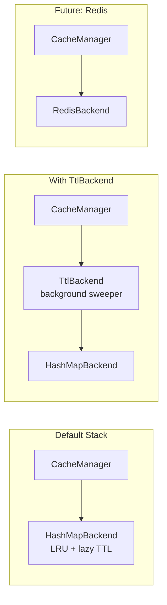
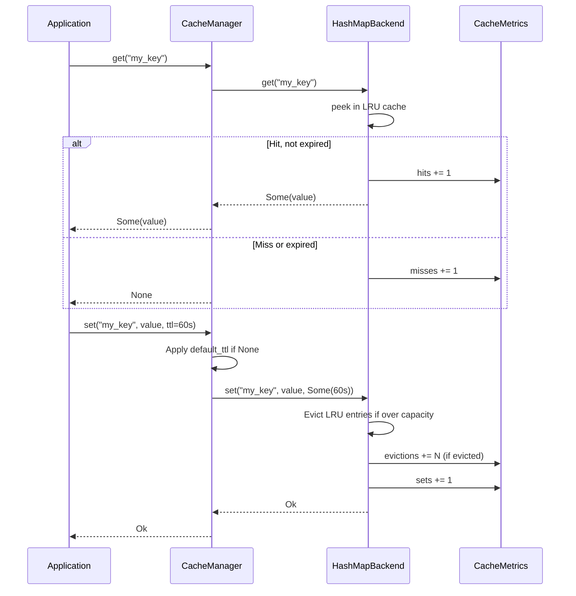
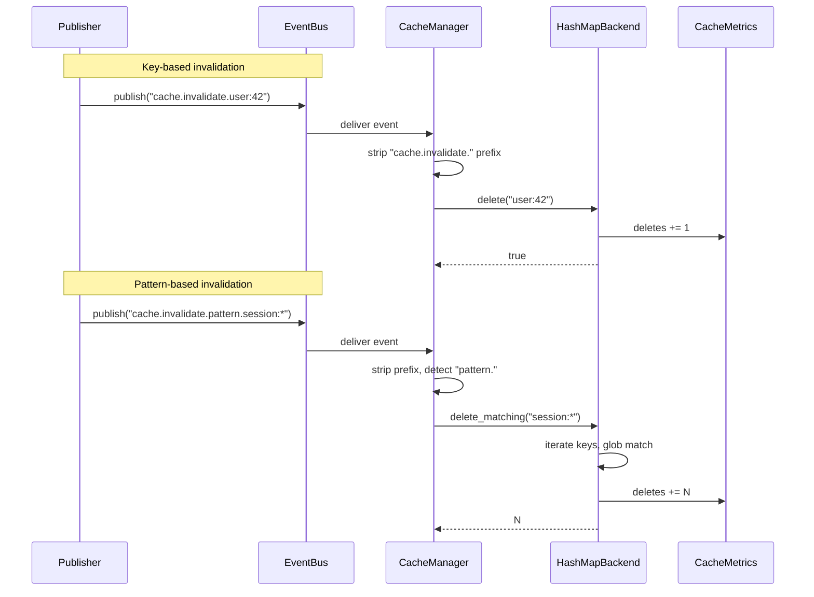
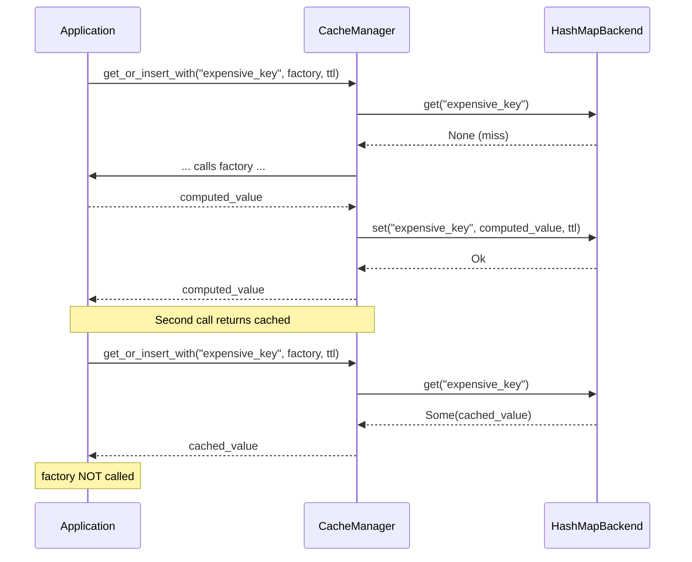

# 17. Cache Subsystem

## 1. Purpose

The Cache subsystem provides an in-memory, ephemeral key-value cache layer within Nova Runtime. It reduces latency and load on the Storage Engine by caching frequently accessed data, computed results, and session state. The cache is explicitly not a source of truth — entries may be evicted, expire, or be invalidated at any time. Applications use it for performance, not durability.

## 2. Scope

This document covers the complete cache subsystem:

- Key-value storage with `String` keys and `Vec<u8>` values
- Multiple backend implementations (in-memory HashMap, TTL wrapper, Redis planned)
- Configurable eviction policies (LRU default, LFU, TTL, LruWithTtl, NoEviction)
- Per-key TTL with lazy expiry and background sweeper
- Event-driven invalidation (key-based and glob-pattern-based)
- Batch operations (get_many, set_many, delete_many, get_or_insert_with)
- Metrics tracking (hits, misses, evictions, sets, deletes, hit rate)
- Configuration via CacheConfig with sensible defaults
- Integration with nova-event for cache invalidation
- 40+ unit and integration tests

Out of scope: Persistent/persisted cache (future), Redis backend (planned but not yet implemented), write-through cache (future), distributed cache with cluster-wide consistency (future), automatic memory pressure integration (future).

## 3. Responsibilities

- Store and retrieve byte-vector values by string key
- Enforce maximum cache size with byte-level accounting
- Evict entries when capacity is exceeded (LRU by default)
- Support per-key TTL with lazy expiry on get/exists
- Run background TTL sweeper for proactive expiry cleanup
- Provide atomic get-or-insert-with for cache-aside pattern
- Support batch get, set, and delete operations
- Expose metrics (hits, misses, evictions, sets, deletes, hit rate)
- Subscribe to event bus for key-based and pattern-based invalidation
- Support filtering cache entries by glob pattern for bulk invalidation
- Serve as a building block for higher-level caching (query cache, session cache, etc.)

## 4. Non Responsibilities

- Persistent or durable storage (handled by Storage Engine)
- Distributed cache coherence across nodes (clustering is future)
- Automatic serialization/deserialization beyond raw bytes (handled by caller)
- Cache warming or pre-population (future)
- Full-text search or queryable cache (handled by Search subsystem)
- Message queuing or streaming (handled by Queue subsystem)
- Transactional consistency with the Storage Engine
- Cross-request cache sharing without explicit TTL or invalidation

## 5. Architecture

### 5.1 High-Level Architecture

```mermaid
graph TD
    subgraph "Cache Subsystem"
        CM[CacheManager]
        BE[CacheBackend trait]
        MT[CacheMetrics]
        CF[CacheConfig]

        subgraph "Backends"
            HB[HashMapBackend]
            TB[TtlBackend]
            RB[Redis Backend<br/>(planned)]
        end

        subgraph "Eviction Policies"
            LRU[LRU]
            LFU[LFU]
            TTL[TTL]
            LW[LruWithTtl]
            NE[NoEviction]
        end
    end

    subgraph "Event System"
        EB[EventBus]
    end

    subgraph "Execution Engine"
        EE[Execution Pipeline]
    end

    subgraph "nova-config"
        NC[Runtime Config]
    end

    NC --> CF
    CF --> CM
    CM --> BE
    BE --> HB
    BE --> TB
    BE --> RB
    HB --> MT
    CM --> EB
    EE --> CM
```

### 5.2 Backend Composition



## 6. Data Structures

### 6.1 CacheEntry

```rust
struct CacheEntry {
    /// Raw byte value
    value: Vec<u8>,                         // variable
    /// Creation timestamp (wall clock)
    created_at: Instant,                     // 8 bytes
    /// Expiry deadline (None = no expiry)
    expires_at: Option<Instant>,             // 8 bytes + tag
    /// Number of times this entry has been accessed
    access_count: u64,                       // 8 bytes
}
```

### 6.2 CacheMetrics

```rust
struct CacheMetrics {
    hits: AtomicU64,       // Total cache hits
    misses: AtomicU64,     // Total cache misses
    evictions: AtomicU64,  // Total evictions (capacity + TTL)
    sets: AtomicU64,       // Total set operations
    deletes: AtomicU64,    // Total delete operations
}

impl CacheMetrics {
    fn hit_rate(&self) -> f64;
    // Returns hits / (hits + misses), or 0.0 if no accesses
}
```

### 6.3 CacheConfig

```rust
struct CacheConfig {
    /// Max cache size in bytes (default: 128 MiB)
    max_size: usize,
    /// Default TTL in seconds (default: 300, 0 = no default)
    default_ttl_secs: u64,
    /// Eviction policy (default: Lru)
    eviction_policy: EvictionPolicy,
    /// Backend type (default: HashMap)
    backend_type: BackendType,
    /// Redis connection URL (for Redis backend, planned)
    redis_url: Option<String>,
}
```

### 6.4 EvictionPolicy

```rust
enum EvictionPolicy {
    Lru,          // Least Recently Used — evict oldest accessed
    Lfu,          // Least Frequently Used — evict least accessed (planned)
    Ttl,          // Time-To-Live — evict only expired entries
    LruWithTtl,   // LRU with TTL awareness — evict expired first, then LRU
    NoEviction,   // No eviction — fail on capacity exceeded
}
```

### 6.5 BackendType

```rust
enum BackendType {
    HashMap,  // In-memory HashMap (default)
    Redis,    // Redis remote cache (planned)
}
```

### 6.6 CacheError

```rust
enum CacheError {
    NotFound(String),         // Key not present (not necessarily an error)
    CapacityExceeded,         // NoEviction policy and cache full
    Serialization(String),    // Serialization failure
    Backend(String),          // Backend-specific error
    Internal(String),         // Internal logic error
}
```

## 7. Core Trait: CacheBackend

```rust
#[async_trait]
trait CacheBackend: Send + Sync {
    // Core operations
    async fn get(&self, key: &CacheKey) -> Result<Option<CacheValue>>;
    async fn set(&self, key: CacheKey, value: CacheValue, ttl: Option<Duration>) -> Result<()>;
    async fn delete(&self, key: &CacheKey) -> Result<bool>;
    async fn exists(&self, key: &CacheKey) -> Result<bool>;
    async fn flush(&self) -> Result<()>;
    async fn len(&self) -> Result<usize>;
    async fn is_empty(&self) -> Result<bool> { /* default impl */ }

    // Batch operations (default impls iterate — backends override for atomicity)
    async fn get_or_insert_with(&self, key: CacheKey, f: ..., ttl: Option<Duration>) -> Result<CacheValue>;
    async fn get_many(&self, keys: &[CacheKey]) -> Result<Vec<(CacheKey, CacheValue)>>;
    async fn set_many(&self, items: Vec<(CacheKey, CacheValue, Option<Duration>)>) -> Result<()>;
    async fn delete_many(&self, keys: &[CacheKey]) -> Result<usize>;

    // Enumeration and pattern invalidation
    async fn keys(&self) -> Result<Vec<CacheKey>>;
    async fn delete_matching(&self, pattern: &str) -> Result<usize>;

    // Background TTL maintenance
    fn start_ttl_sweeper(self: Arc<Self>, interval: Duration) -> JoinHandle<()>;
}
```

## 8. Backends

### 8.1 HashMapBackend

The primary in-memory backend. Uses `parking_lot::RwLock<LruCache<String, CacheEntry>>` for concurrency with fine-grained locking. Tracks byte-level capacity via an `AtomicU64` counter. Eviction:

- **On set**: if the new entry would exceed `max_bytes`, the LRU entry is popped and eviction counter incremented. Repeats until capacity is available.
- **Lazy TTL on get/exists**: before returning a value, checks `entry.expires_at` against `Instant::now()`. If expired, the entry is removed from the cache and treated as a miss.
- **Background sweeper**: the optional `start_ttl_sweeper` task periodically scans all entries and removes expired ones proactively, preventing stale entries from occupying space.

Entry size is computed as `key.len() + value.len()`. When an entry is overwritten, the old size is subtracted from the byte counter before adding the new size.

### 8.2 TtlBackend

A decorator backend that wraps any inner `CacheBackend` with a TTL expiry map. Maintains a separate `RwLock<HashMap<CacheKey, Instant>>` mapping keys to their expiry deadlines. On `get`, checks the expiry map before delegating to the inner backend. The `start_ttl_sweeper` method runs a background loop that scans the expiry map and deletes expired keys from both the map and the inner backend. This backend is useful when the inner backend doesn't natively support TTL (e.g., a future Redis backend without Redis TTL).

### 8.3 Redis Backend (Planned)

Not yet implemented. Will use `redis-rs` to connect to a remote Redis instance. Configuration via `CacheConfig.redis_url`. The enum variant `BackendType::Redis` and `EvictionPolicy::Lfu` are reserved for this future work.

## 9. TTL Handling

TTL is handled at two levels:

**Lazy expiry (request path)**: Every `get` and `exists` call checks `entry.expires_at` before returning data. If the deadline has passed, the entry is removed and `None` is returned. This ensures expired entries are never served even if the sweeper hasn't run yet.

**Background sweeper (maintenance path)**: The `start_ttl_sweeper` method spawns a `tokio` task that sleeps for the configured interval and then scans all entries (or the TTL map for `TtlBackend`), deleting those past their expiry. Default sweep interval is caller-configured.

CacheManager applies `CacheConfig.default_ttl_secs` when no explicit TTL is provided to `set`.

## 10. Event-Driven Invalidation

The `CacheManager::attach_event_bus` method subscribes to the `cache.invalidate.*` topic pattern on `nova_event::EventBus`. Two invalidation modes are supported:

**Key-based** (`cache.invalidate.<exact_key>`): The event's canonical type suffix after `cache.invalidate.` is used as the exact cache key to delete. For example, publishing `cache.invalidate.user:42` removes key `user:42`.

**Pattern-based** (`cache.invalidate.pattern.<glob>`): The suffix after `cache.invalidate.pattern.` is treated as a glob pattern. The backend's `delete_matching` method scans all cached keys and deletes those matching the pattern. Global characters: `*` matches any sequence, `?` matches any single character. For example, `cache.invalidate.pattern.user:*` invalidates all keys with the `user:` prefix.

The subscription uses `AtMostOnce` delivery guarantee with a bounded crossbeam channel (capacity 1024) and a `tokio::spawn` listener loop.

## 11. Batch Operations

All batch operations have default implementations on the `CacheBackend` trait that iterate sequentially:

- **get_many**: iterates keys, collects `(key, value)` for hits only
- **set_many**: iterates `(key, value, ttl)` tuples, calls set each
- **delete_many**: iterates keys, returns count of successfully deleted
- **get_or_insert_with**: check-then-set with a user-supplied async factory function; if the key exists, the factory is never called (avoids redundant computation)

Backends may override these for atomic or optimized implementations.

## 12. CacheManager

The `CacheManager` struct is the primary API entry point. It holds an `Arc<dyn CacheBackend>`, a `CacheConfig`, and an `Arc<CacheMetrics>`. It transparently applies default TTL from config. All public methods delegate to the backend:

```rust
struct CacheManager {
    backend: Arc<dyn CacheBackend>,
    config: CacheConfig,
    metrics: Arc<CacheMetrics>,
}

impl CacheManager {
    fn new(backend: Arc<dyn CacheBackend>, config: CacheConfig) -> Self;
    fn with_metrics(backend, config, metrics) -> Self;
    fn metrics(&self) -> Arc<CacheMetrics>;
    fn config(&self) -> &CacheConfig;

    async fn get(&self, key: &str) -> Result<Option<CacheValue>>;
    async fn set(&self, key: CacheKey, value: CacheValue, ttl: Option<Duration>) -> Result<()>;
    async fn delete(&self, key: &str) -> Result<bool>;
    async fn exists(&self, key: &str) -> Result<bool>;
    async fn flush(&self) -> Result<()>;
    async fn len(&self) -> Result<usize>;

    async fn get_or_insert_with(&self, key, f, ttl) -> Result<CacheValue>;
    async fn get_many(&self, keys: &[CacheKey]) -> Result<Vec<(CacheKey, CacheValue)>>;
    async fn set_many(&self, items: Vec<(CacheKey, CacheValue, Option<Duration>)>) -> Result<()>;
    async fn delete_many(&self, keys: &[CacheKey]) -> Result<usize>;

    fn attach_event_bus(&self, bus: &nova_event::EventBus) -> Result<()>;
}
```

## 13. Sequence Diagrams

### 13.1 Basic Get/Set Flow



### 13.2 Event-Driven Invalidation



### 13.3 GetOrInsertWith



## 14. Metrics

| Metric | Counter | Description |
|--------|---------|-------------|
| hits | AtomicU64 | Number of successful cache lookups |
| misses | AtomicU64 | Number of failed cache lookups |
| evictions | AtomicU64 | Entries evicted (capacity or TTL) |
| sets | AtomicU64 | Number of set operations |
| deletes | AtomicU64 | Number of delete operations |
| hit_rate | derived f64 | hits / (hits + misses) |

All counters use `AtomicU64` with `Ordering::Relaxed` for maximum throughput. The `hit_rate()` method is computed on demand and is not a stored value.

## 15. Integration Points

**nova-executor**: The `SubsystemId` enum includes a `Cache` variant (`nova-executor/src/types.rs:358`). The pipeline's `OperationTarget` routing will map cache operations to the Cache subsystem for circuit breaking and context tracking.

**nova-event**: The cache subscribes to `cache.invalidate.*` topic via `attach_event_bus`. Event-driven invalidation uses `nova_event::EventBuilder`, `EventBus::subscribe`, and `TopicPattern`.

**nova-config**: The runtime config (`nova-config/src/config.rs:656`) defines a `CacheConfig` struct with `max_size`, `default_ttl_secs`, `eviction_policy`, `backend_type`, and `redis_url`. Environment overrides are handled in `apply_env_cache`.

**novad binary**: Initializes the cache manager at startup (`novad/src/main.rs:139`). Reads config from `nova_config::RuntimeConfig::cache`, parses eviction policy and backend type from string, constructs `HashMapBackend` with `CacheMetrics`, wraps in `CacheManager`, and holds the manager for future subsystem use.

## 16. Testing Strategy

The cache subsystem has 40+ tests across three test locations:

| Location | Tests | Coverage |
|----------|-------|----------|
| `backend/hashmap.rs` | 9 unit tests | Core operations, TTL, LRU eviction, flush, overwrite, concurrent access, metrics |
| `manager.rs` | 3 unit tests | Basic operations, metrics passthrough, default TTL |
| `tests/hashmap_backend.rs` | 28 integration tests | Full coverage including batch ops, TTL sweeper, size accounting, event invalidation, concurrent contention, TtlBackend |

Key test scenarios:

- **Basic operations**: put, get, delete, exists, flush, overwrite, is_empty
- **TTL**: lazy expiry on get and exists, background sweeper for both HashMapBackend and TtlBackend
- **Eviction**: LRU byte-accounted eviction, eviction metrics tracking
- **Batch**: get_many (partial hits), set_many, delete_many, get_or_insert_with (miss calls factory, hit returns cached)
- **Concurrency**: 10-task parallel set/get, 50-task high-contention get/exists
- **Event invalidation**: key-based (`cache.invalidate.<key>`), pattern-based (`cache.invalidate.pattern.<glob>`)
- **Edge cases**: delete non-existent, large values, entry size accounting, zero-sized reads

## 17. Configuration

Default configuration (applied when no config file override is present):

```toml
[cache]
max_size = 134217728          # 128 MiB
default_ttl_secs = 300        # 5 minutes
eviction_policy = "Lru"
backend_type = "HashMap"
redis_url = null
```

## 18. Future Work

- **Redis backend**: Full implementation of the `BackendType::Redis` variant using `redis-rs`. Will support shared cache across multiple Nova Runtime instances.
- **LFU eviction**: Implement the `EvictionPolicy::Lfu` variant with a frequency sketch for popularity-based eviction.
- **Write-through / write-behind**: Optional mode where cache writes are propagated to the Storage Engine, enabling the cache as a consistent fronting layer.
- **Persistence**: Optional snapshot/restore of cache contents to disk for warm restart.
- **Memory pressure integration**: Hook into system memory pressure signals to proactively evict entries under system-wide memory contention.
- **Distributed invalidation**: Extend the event-driven invalidation to propagate across node boundaries via the cluster event bus (future clustering work).
- **Per-namespace caches**: Support isolated cache regions with independent eviction policies and capacity limits.
- **Cache stats API**: Expose hit rate, eviction rate, size, and entry count over the admin API and dashboard.
