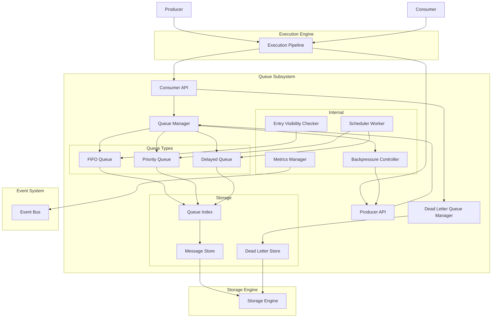
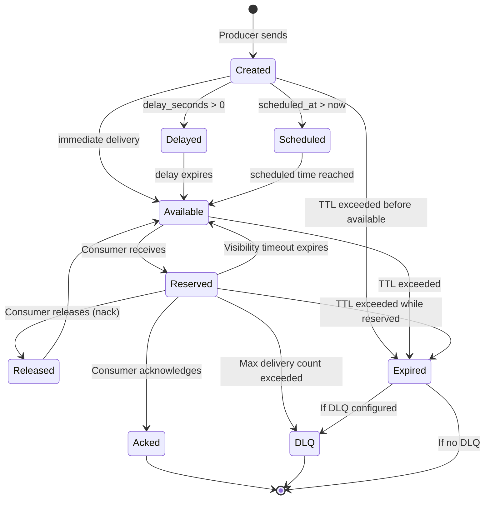
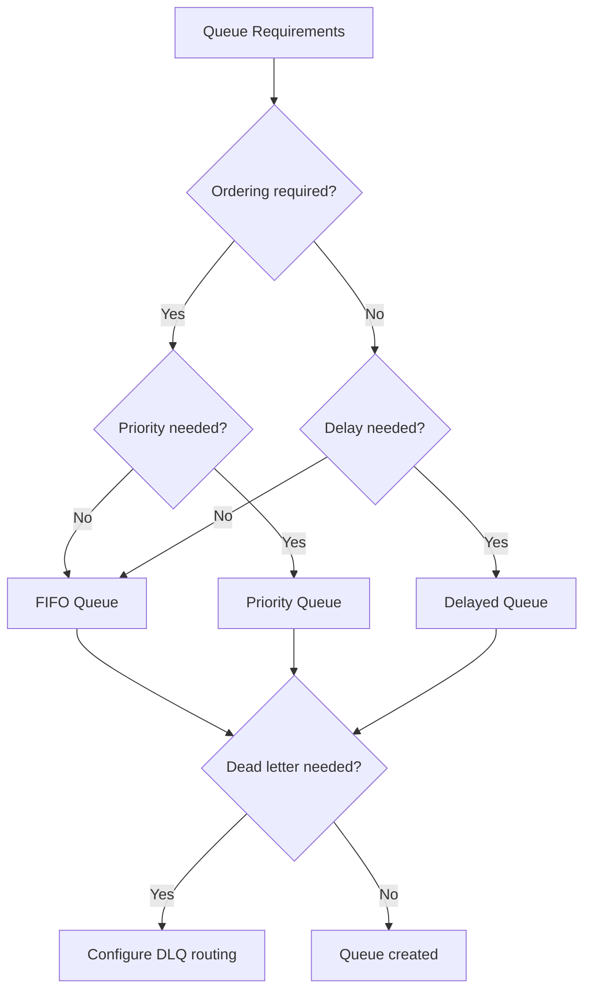
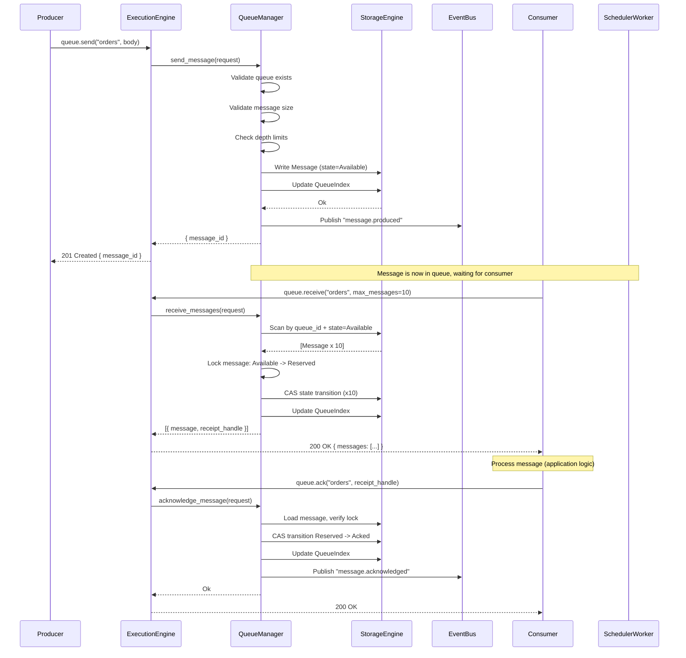
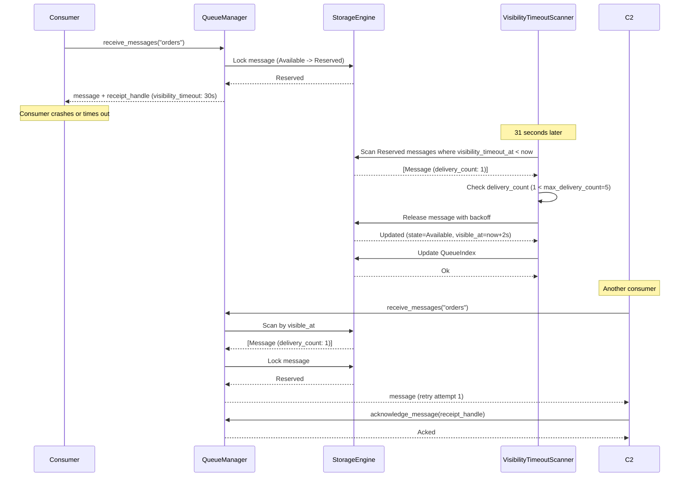
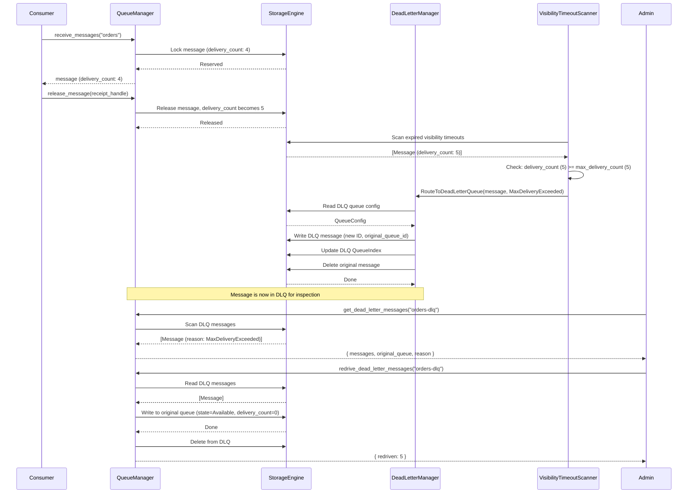
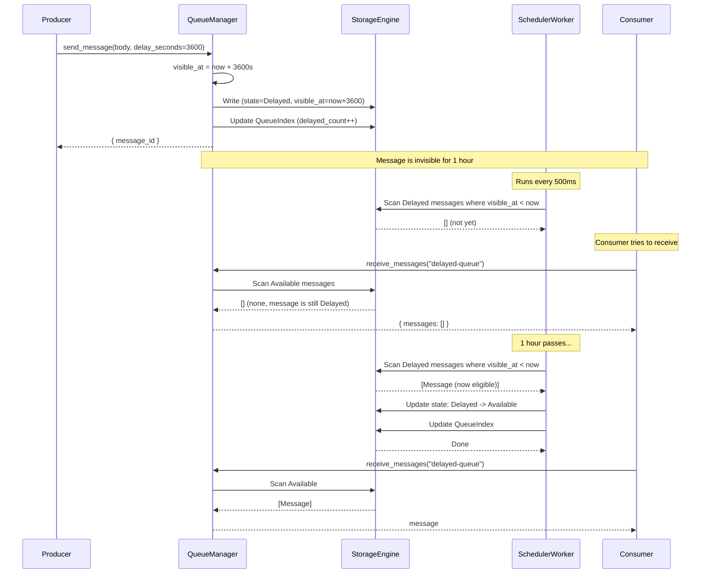
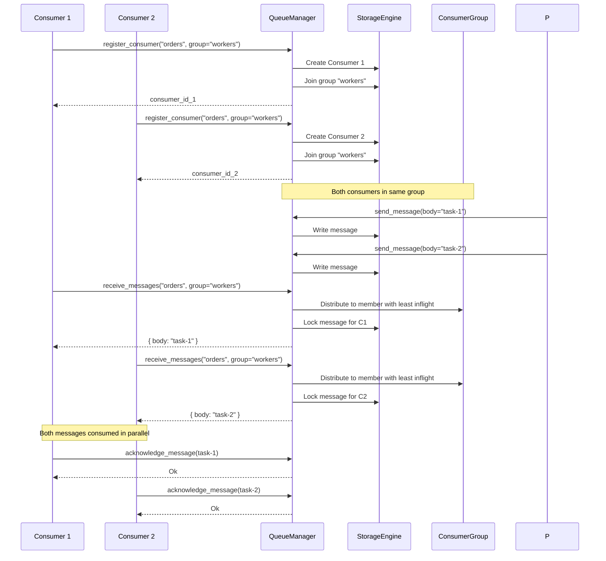

# 17. Queue Subsystem

## 1. Purpose

The Queue subsystem provides asynchronous message passing within Nova Runtime and to external consumers. It enables reliable, at-least-once message delivery with configurable ordering guarantees, persistence, and consumer semantics. The queue bridges producers and consumers across time and failure boundaries, allowing components to communicate asynchronously without tight coupling.

## 2. Scope

This document covers the complete queue messaging subsystem:

- Queue types: FIFO, priority, delayed, dead letter
- Message structure (ID, body, attributes, timestamps, metadata)
- Produce and consume APIs with batch support
- At-least-once delivery with idempotent consumer design
- Message locking with visibility timeout
- Message TTL and queue-level retention
- Queue depth limits and backpressure
- Priority levels (0-10) with weighted scheduling
- Delayed messages (future-dated visibility)
- Scheduled messages (one-shot at a specific time)
- Consumer groups for parallel consumption
- Queue monitoring and metrics
- Dead letter queue (DLQ) routing
- Storage mapping: messages stored as records in the Storage Engine

Out of scope: Message ordering across partitions (future), exactly-once delivery (future), message streaming with cursor-based consumption (future), pub/sub fan-out to multiple subscriptions (future), message compression (future).

## 3. Responsibilities

- Accept and persist messages from producers
- Deliver messages to consumers with at-least-once guarantees
- Enforce message ordering guarantees per queue type
- Implement message locking with configurable visibility timeout
- Enforce message TTL and queue retention policies
- Route expired/max-delivery messages to dead letter queues
- Provide priority-based message scheduling
- Support delayed message delivery
- Support scheduled (future-timestamp) message delivery
- Enforce queue depth limits with backpressure signaling
- Track message delivery count and metadata
- Provide consumer group management
- Emit queue metrics for monitoring

## 4. Non Responsibilities

- Message ordering across different queues
- Exactly-once delivery guarantees (requires consumer idempotency)
- Message compression or serialization format enforcement
- Streaming with cursor-based consumption (future)
- Pub/sub with multiple subscriptions per message (future)
- Message transformation or routing based on content (future)
- Dead letter queue re-drive (handled by admin API, not queue core)
- Cross-node queue replication (clustering is future)
- Consumer SDK beyond basic HTTP API

## 5. Architecture

### 5.1 High-Level Architecture



### 5.2 Message Lifecycle



### 5.3 Queue Types Decision Tree



## 6. Data Structures

### 6.1 Queue Configuration

```rust
struct QueueConfig {
    /// Queue ID (UUIDv4)
    id: [u8; 16],                    // 16 bytes
    /// Queue name (unique within the runtime)
    name: String,                     // variable, max 256 bytes
    /// Queue type: fifo, priority, delayed
    queue_type: QueueType,           // 1 byte enum
    /// FIFO ordering: strict, best_effort, none
    ordering: OrderingMode,          // 1 byte enum
    
    // Retention and limits
    /// Default message TTL in nanoseconds (default: 345_600_000_000_000 = 4 days)
    default_message_ttl: i64,        // 8 bytes
    /// Maximum queue depth in messages (default: 1_000_000)
    max_depth: u64,                  // 8 bytes
    /// Maximum message size in bytes (default: 262_144 = 256 KB)
    max_message_size: u64,           // 8 bytes
    /// Maximum total queue size in bytes (default: 1_073_741_824 = 1 GB)
    max_queue_size_bytes: u64,       // 8 bytes
    
    // Delivery settings
    /// Default visibility timeout in nanoseconds (default: 30_000_000_000 = 30s)
    default_visibility_timeout: i64, // 8 bytes
    /// Maximum delivery attempts before DLQ (default: 5)
    max_delivery_count: u32,        // 4 bytes
    
    // Dead letter configuration
    /// Dead letter queue ID (None = no DLQ)
    dead_letter_queue_id: Option<[u8; 16]>, // 16 bytes
    /// DLQ routing after max deliveries
    dlq_routing: DlqRouting,         // 1 byte enum: on_max_delivery, on_ttl_expiry, both, disabled
    
    // Consumer configuration
    /// Maximum number of inflight messages per consumer (default: 10)
    max_inflight_per_consumer: u32,  // 4 bytes
    /// Delay between re-poll attempts in nanoseconds (default: 100_000_000 = 100ms)
    poll_delay: i64,                 // 8 bytes
    /// Whether to send new message events via event bus
    event_notifications: bool,       // 1 byte
    
    // Priority-specific
    /// Default priority for messages (default: 5)
    default_priority: u8,            // 1 byte (0-10)
    
    // Delayed-specific
    /// Maximum delay in nanoseconds (default: 604_800_000_000_000 = 7 days)
    max_delay: i64,                  // 8 bytes
    
    // Timestamps
    created_at: i64,                 // 8 bytes
    updated_at: i64,                 // 8 bytes
}
// Total: ~118 bytes + variable fields
```

### 6.2 Message

```rust
struct Message {
    /// Message ID (ULID: timestamp + random, 16 bytes)
    id: [u8; 16],                    // 16 bytes
    /// Queue ID this message belongs to
    queue_id: [u8; 16],             // 16 bytes
    /// Message body (raw bytes)
    body: Vec<u8>,                   // variable, max 262144 bytes
    /// Content type of body (e.g., "application/json")
    content_type: Option<String>,    // variable, max 128 bytes
    
    // Message attributes/metadata
    /// User-defined key-value attributes
    attributes: HashMap<String, String>, // variable, max 64 entries
    
    // Timing
    /// Message creation timestamp (Unix nanoseconds)
    created_at: i64,                 // 8 bytes
    /// Timestamp when message becomes visible (Unix nanoseconds)
    visible_at: i64,                 // 8 bytes
    /// Message expiry timestamp (Unix nanoseconds)
    expires_at: i64,                 // 8 bytes
    
    // Delivery tracking
    /// Current delivery attempt count
    delivery_count: u32,            // 4 bytes
    /// Maximum allowed delivery attempts
    max_delivery_count: u32,        // 4 bytes
    /// Current visibility timeout end (Unix nanoseconds)
    visibility_timeout_at: Option<i64>, // 8 bytes
    /// Consumer ID currently holding the lock (None if available)
    locked_by: Option<ConsumerId>,    // variable
    /// Lock token for atomic release/ack
    lock_token: Option<[u8; 32]>,    // 32 bytes
    
    // Priority (for priority queues)
    /// Message priority 0-10 (higher = delivered first)
    priority: u8,                    // 1 byte
    
    // Status
    /// Current message state
    state: MessageState,             // 1 byte enum
    
    // Scheduling
    /// Scheduled delivery timestamp (for scheduled messages)
    scheduled_at: Option<i64>,       // 8 bytes
    /// Delay in nanoseconds from creation
    delay_duration: Option<i64>,     // 8 bytes
    
    // Dead letter tracking
    /// Reason for DLQ routing
    dlq_reason: Option<DlqReason>,   // 1 byte enum
    /// Original queue ID (when in DLQ)
    original_queue_id: Option<[u8; 16]>, // 16 bytes
    
    // Timestamps
    updated_at: i64,                 // 8 bytes
}
// Minimum: ~156 bytes + body + attributes
// Maximum: ~262 KB (body limit)
```

### 6.3 Consumer

```rust
struct Consumer {
    /// Consumer ID (UUIDv4)
    id: [u8; 16],                    // 16 bytes
    /// Queue ID this consumer is attached to
    queue_id: [u8; 16],             // 16 bytes
    /// Consumer group name (for group coordination)
    group_name: Option<String>,      // variable, max 128 bytes
    /// Consumer name/label
    name: Option<String>,            // variable, max 128 bytes
    
    // Capabilities
    /// Current inflight message count
    inflight_count: u32,            // 4 bytes
    /// Maximum inflight messages allowed
    max_inflight: u32,              // 4 bytes
    
    // Configuration
    /// Preferred visibility timeout (overrides queue default)
    preferred_visibility_timeout: Option<i64>, // 8 bytes
    
    // Heartbeat
    /// Last heartbeat timestamp (Unix nanoseconds)
    last_heartbeat_at: i64,          // 8 bytes
    /// Consumer is considered dead if heartbeat older than 60s
    heartbeat_timeout: i64,          // 8 bytes (default: 60_000_000_000)
    
    // State
    /// Whether consumer is active
    active: bool,                    // 1 byte
    /// Creation timestamp (Unix nanoseconds)
    created_at: i64,                 // 8 bytes
    /// Last activity timestamp (Unix nanoseconds)
    last_active_at: i64,            // 8 bytes
}
// Total: ~102 bytes + variable fields
```

### 6.4 Consumer Group

```rust
struct ConsumerGroup {
    /// Group ID (UUIDv4)
    id: [u8; 16],                    // 16 bytes
    /// Queue ID
    queue_id: [u8; 16],             // 16 bytes
    /// Group name
    name: String,                    // variable, max 128 bytes
    
    // Member management
    /// Current members
    members: Vec<ConsumerId>,        // variable
    
    // Distribution strategy
    /// How messages are distributed: round_robin, random, least_inflight
    distribution_strategy: DistributionStrategy, // 1 byte enum
    
    // Configuration
    /// Minimum consumers for high availability (for monitoring)
    min_consumers: u32,             // 4 bytes
    /// Maximum consumers
    max_consumers: u32,             // 4 bytes
    
    /// Creation timestamp (Unix nanoseconds)
    created_at: i64,                 // 8 bytes
}
// Total: ~56 bytes + variable fields
```

### 6.5 MessageEntry (Storage Index)

```rust
/// The actual record stored in the Storage Engine.
/// Messages are stored in a queue-specific partition,
/// indexed by (queue_id, visible_at, id) for efficient scanning.
struct MessageEntry {
    /// Composite key: queue_id + visible_at + message_id
    pk: Vec<u8>,                     // 40 bytes = 16 + 8 + 16
    /// Serialized message record
    message: Message,
    
    // Storage Engine metadata
    partition: u64,                  // 8 bytes
    record_version: u32,            // 4 bytes
}
```

### 6.6 Queue Metrics (Ephemeral)

```rust
struct QueueMetrics {
    /// Current queue depth (available messages)
    depth_available: AtomicI64,      // 8 bytes
    /// Current inflight messages
    depth_inflight: AtomicI64,       // 8 bytes
    /// Current delayed messages
    depth_delayed: AtomicI64,        // 8 bytes
    /// Current scheduled messages
    depth_scheduled: AtomicI64,      // 8 bytes
    /// Total messages produced
    total_produced: AtomicU64,       // 8 bytes
    /// Total messages consumed (acked)
    total_consumed: AtomicU64,       // 8 bytes
    /// Total messages expired
    total_expired: AtomicU64,        // 8 bytes
    /// Total messages sent to DLQ
    total_dlq: AtomicU64,            // 8 bytes
    /// Total bytes stored
    total_bytes: AtomicU64,          // 8 bytes
    /// Current consumer count
    consumer_count: AtomicI64,       // 8 bytes
    /// Average processing latency (ns)
    avg_latency_ns: AtomicI64,      // 8 bytes
    /// P95 processing latency (ns)
    p95_latency_ns: AtomicI64,      // 8 bytes
    /// Throughput messages/sec (sliding window)
    throughput_1m: AtomicF64,       // 8 bytes
}
// Total: ~128 bytes per queue
```

### 6.7 Queue Index (Level-Based)

```rust
/// Multi-level index structure for efficient queue operations.
/// Maintained as records in the Storage Engine.
struct QueueIndex {
    queue_id: [u8; 16],
    
    // Level 0: Available messages (by priority, then by visible_at)
    available_count: u64,           // 8 bytes
    next_available_at: Option<i64>,  // 8 bytes
    highest_priority_available: Option<u8>, // 1 byte
    
    // Level 1: Delayed messages (by visible_at)
    delayed_count: u64,             // 8 bytes
    next_delayed_visible_at: Option<i64>, // 8 bytes
    
    // Level 2: Inflight messages (by visibility_timeout_at)
    inflight_count: u64,            // 8 bytes
    next_visibility_timeout_at: Option<i64>, // 8 bytes
    
    // Summary
    total_count: u64,               // 8 bytes
    total_bytes: u64,               // 8 bytes
    last_message_id: Option<[u8; 16]>, // 16 bytes
    updated_at: i64,                // 8 bytes
}
// Total: ~82 bytes
```

## 7. Algorithms

### 7.1 Message Produce

```
Algorithm: ProduceMessage
Input:
  - queue_id: UUID
  - body: Vec<u8>
  - content_type: Option<String>
  - attributes: HashMap<String, String>
  - delay_seconds: Option<u64>
  - scheduled_at: Option<i64>
  - priority: Option<u8>
  - message_ttl: Option<i64>
  - current_time: i64

Output:
  - message_id: UUID
  - message: Message

Steps:
  1. Load QueueConfig from Storage Engine (or cache)
     If queue not found, return Err(QueueNotFound)
  
  2. Validate message size:
     If body.len() > queue.max_message_size:
       Return Err(MessageTooLarge(queue.max_message_size))
  
  3. Check queue depth limits:
     Load QueueIndex
     If index.total_count >= queue.max_depth:
       Return Err(QueueFull(queue.max_depth))
     If index.total_bytes + body.len() > queue.max_queue_size_bytes:
       Return Err(QueueStorageFull)
  
  4. Create Message:
     id = new_ulid(current_time)  // 16 bytes: timestamp + random
     queue_id = queue_id
     body = body
     content_type = content_type
     attributes = attributes (limit to 64 entries, truncate keys to 128 chars)
     created_at = current_time
     delivery_count = 0
     max_delivery_count = queue.max_delivery_count
     priority = priority.unwrap_or(queue.default_priority)
       // Clamp to 0-10
     state = Pending

  5. Calculate visible_at:
     If delay_seconds is Some:
       visible_at = current_time + (delay_seconds * 1_000_000_000)
       If visible_at - current_time > queue.max_delay:
         Return Err(DelayTooLarge(queue.max_delay))
       state = Delayed
     Else if scheduled_at is Some:
       visible_at = scheduled_at
       If visible_at <= current_time:
         visible_at = current_time  // immediate if in the past
       else:
         state = Scheduled
     Else:
       visible_at = current_time
       state = Available
       
     message.visible_at = visible_at
     message.scheduled_at = scheduled_at
     message.delay_duration = delay_seconds.map(|s| s * 1_000_000_000)

  6. Calculate expires_at:
     If message_ttl is Some:
       expires_at = current_time + message_ttl
     Else:
       expires_at = current_time + queue.default_message_ttl
     
     // Clamp to max retention (30 days)
     max_retention = 30 * 24 * 60 * 60 * 1_000_000_000_i64  // 30 days
     If expires_at > current_time + max_retention:
       expires_at = current_time + max_retention
     
     message.expires_at = expires_at
     message.visible_at = visible_at

  7. Generate lock_token for future locking:
     lock_token = generate_random(32 bytes)
     message.lock_token = Some(lock_token)

  8. Store message in Storage Engine:
     key = compose(queue_id, visible_at, message.id)
     Store Message as record at key
     Update QueueIndex:
       Increment total_count
       Add body.len() to total_bytes
       Update next_available_at if visible_at <= current_time
       Update next_delayed_visible_at if state == Delayed
       Update highest_priority_available

  9. If queue.event_notifications:
     Publish "queue.message.produced" event via Event System
       Include: queue_id, message_id, state, priority, visible_at

  10. Return (message_id, message)
```

### 7.2 Message Receive (Consume)

```
Algorithm: ReceiveMessages
Input:
  - queue_id: UUID
  - consumer_id: UUID
  - max_messages: u32 (default: 1, max: 20)
  - visibility_timeout_override: Option<Duration>
  - wait_time_seconds: u32 (long poll, 0-20 seconds)
  - current_time: i64

Output:
  - messages: Vec<RcvdMessage>  (each with message, receipt_handle)

Steps:
  1. Load QueueConfig
     If queue not found, return Err(QueueNotFound)
  
  2. Load Consumer
     If consumer not found, create or return Err
     If consumer exists but not active:
       Return Err(ConsumerNotActive)
  
  3. Check consumer limits:
     If consumer.inflight_count >= consumer.max_inflight:
       Return Err(InflightLimitReached(consumer.max_inflight))
     
     available_slots = min(
       max_messages,
       consumer.max_inflight - consumer.inflight_count
     )

  4. Acquire queue read lock (shared, allows concurrent reads)

  5. Collect candidates:
     candidates = []
     
     // Priority queue: scan in priority order (highest first)
     If queue.queue_type == Priority:
       For priority in 10..0 (descending):
         Scan messages with state=Available AND priority=priority
           ordered by visible_at ASC
         candidates.extend(found_messages)
         If candidates.len() >= available_slots:
           Break
    
     // FIFO queue: FCFS by visible_at
     Else:
       Scan messages with state=Available
         ordered by visible_at ASC, id ASC
       candidates.extend(found_messages)
    
     // Delayed messages: eligible once visible_at <= current_time
     // (handled by same scan, delayed messages have future visible_at)

  6. If candidates is empty AND wait_time_seconds > 0:
     // Long poll: wait for new messages
     Release queue read lock
     Wait on condition variable, max wait_time_seconds
     Re-acquire lock and repeat step 5
     If still empty after wait, return empty list

  7. Lock candidates (atomic update):
     locked_messages = []
     For each candidate message in candidates (up to available_slots):
       // Optimistic lock: try to transition Available -> Reserved
       Begin transaction
         Read current message state
         If state != Available:
           Skip (another consumer got it)
           Continue
         
         Update message:
           state = Reserved
           locked_by = consumer.id
           visibility_timeout_at = current_time + effective_visibility_timeout
           delivery_count += 1
           lock_token = rotate_lock_token(message)
         
         Write updated message
         Update QueueIndex:
           Decrement available
           Increment inflight
       Commit transaction
       
       If transaction succeeded:
         Add to locked_messages
         Increment consumer.inflight_count
     
     Update consumer.last_active_at

  8. If long poll and no messages after wait:
     Release queue read lock
     Return empty list

  9. Emit metrics update

  10. Return locked_messages with receipt handles:
      receipt_handle = base64url(
        message.id ++ message.lock_token ++ message.visibility_timeout_at
      )
```

### 7.3 Message Acknowledge (Delete)

```
Algorithm: AcknowledgeMessage
Input:
  - queue_id: UUID
  - receipt_handle: String
  - consumer_id: UUID
  - current_time: i64

Output:
  - success: bool

Steps:
  1. Parse receipt_handle:
     Decode base64url to get:
       - message_id (16 bytes)
       - lock_token (32 bytes)
       - visibility_timeout_at (8 bytes)
     If parse fails, return Err(InvalidReceiptHandle)

  2. Load message from Storage Engine
     If not found, return Err(MessageNotFound)

  3. Validate lock:
     If message.locked_by != Some(consumer_id):
       Return Err(NotMessageOwner)
     If message.lock_token != Some(lock_token):
       Return Err(InvalidLockToken)
     If message.state != Reserved:
       Return Err(MessageNotReserved)
     If message.visibility_timeout_at != Some(visibility_timeout_at):
       Return Err(InvalidReceiptHandle)

  4. Begin transaction:
     Update message:
       state = Acked
       updated_at = current_time
     
     // Mark for deletion (soft delete + background cleanup)
     Write tombstone record with expiry
     
     Update QueueIndex:
       Decrement inflight
       Decrement total_count
       Decrement total_bytes by message.body.len()
     
     Update consumer.inflight_count -= 1
     Update consumer.last_active_at = current_time
   Commit transaction

  5. Emit metrics:
     total_consumed += 1
     latency = current_time - message.created_at
     Update avg_latency_ns with exponential moving average

  6. If queue.event_notifications:
     Publish "queue.message.acknowledged" event

  7. Return true
```

### 7.4 Message Release (Nack)

```
Algorithm: ReleaseMessage
Input:
  - queue_id: UUID
  - receipt_handle: String
  - consumer_id: UUID
  - visibility_timeout_override: Option<Duration>
  - current_time: i64

Output:
  - success: bool

Steps:
  1. Parse receipt_handle (same as Acknowledge)

  2. Load message
  3. Validate lock (same as Acknowledge)

  4. Check delivery count vs max:
     If message.delivery_count >= message.max_delivery_count:
       // Route to DLQ
       Call RouteToDeadLetterQueue(message, "Max delivery count exceeded")
       Return true  // Message is now in DLQ

  5. Calculate new visible_at:
     If visibility_timeout_override is Some:
       delay = visibility_timeout_override.as_nanos()
       visible_at = current_time + delay
     Else:
       // Progressive backoff on retries: 2^delivery_count seconds
       backoff = min(2^message.delivery_count, 300)  // max 5 minutes
       visible_at = current_time + (backoff * 1_000_000_000)

  6. Begin transaction:
     Update message:
       state = Available
       visible_at = visible_at
       locked_by = None
       lock_token = generate_random(32)
       visibility_timeout_at = None
       updated_at = current_time
     
     Update QueueIndex:
       Decrement inflight
       Increment available
       Update next_available_at if visible_at < current
     
     Update consumer.inflight_count -= 1
   Commit transaction

  7. Return true
```

### 7.5 Message Routing to Dead Letter Queue

```
Algorithm: RouteToDeadLetterQueue
Input:
  - message: Message
  - reason: DlqReason
  - current_time: i64

Output:
  - success: bool

Steps:
  1. Load queue's QueueConfig to get DLQ ID
     If no DLQ configured, just delete message and return

  2. Load DLQ queue config
     If DLQ not found, log error and delete message

  3. Create DLQ message:
     dlq_message = Message {
       id: new_ulid(current_time),
       queue_id: dlq_queue.id,
       body: message.body,
       content_type: message.content_type,
       attributes: message.attributes.clone(),
       created_at: current_time,
       visible_at: current_time,
       expires_at: current_time + dlq_queue.default_message_ttl,
       delivery_count: 0,
       max_delivery_count: dlq_queue.max_delivery_count,
       state: Available,
       original_queue_id: Some(message.queue_id),
       dlq_reason: Some(reason),
       priority: 0,  // DLQ is FIFO
       ..default()
     }

  4. Store DLQ message in Storage Engine
     Update DLQ QueueIndex

  5. Delete original message (mark tombstone)

  6. Publish "queue.message.dlq_routed" event

  7. Return true
```

### 7.6 Visibility Timeout Expiry Scanner

```
Algorithm: VisibilityTimeoutScanner
Runs: Periodically (every 1 second)
Input:
  - current_time: i64

Steps:
  1. For each queue with inflight_count > 0:
     a. Scan messages where state == Reserved AND
        visibility_timeout_at <= current_time
        Limit: 1000 messages per scan cycle
     
     b. For each expired message:
        Begin transaction:
          Read current state (re-check for race)
          If state != Reserved:
            Skip (already released or acked)
          
          If message.delivery_count >= message.max_delivery_count:
            Route to DLQ
          Else:
            // Make available again with backoff
            backoff = min(2^message.delivery_count, 300)
            new_visible_at = current_time + (backoff * 1_000_000_000)
            
            Update message:
              state = Available
              visible_at = new_visible_at
              locked_by = None
              visibility_timeout_at = None
              updated_at = current_time
            
            Update QueueIndex:
              Decrement inflight
              Increment available
        
        End transaction
        Emit "queue.message.visibility_timeout" event

  2. Sleep 1 second, repeat
```

### 7.7 Message Expiry Scanner

```
Algorithm: MessageExpiryScanner
Runs: Periodically (every 60 seconds)
Input:
  - current_time: i64

Steps:
  1. For each queue:
     a. Scan messages where expires_at <= current_time
        and state != Acked
        Limit: 10000 messages per scan cycle
     
     b. For each expired message:
        If dead_letter_queue_id is Some and dlq_routing includes on_ttl_expiry:
          RouteToDeadLetterQueue(message, TtlExpired)
        Else:
          Begin transaction:
            Update message.state = Expired
            Update QueueIndex:
              Decrement appropriate counter (available/inflight/delayed)
              Decrement total_count
              Decrement total_bytes
          
          Emit "queue.message.expired" event

  2. Clean up Acked tombstones older than 24 hours:
     Delete tombstone records (storage reclamation)

  3. Sleep 60 seconds, repeat
```

### 7.8 Scheduled/Delayed Message Promotion

```
Algorithm: ScheduledMessagePromoter
Runs: Periodically (every 500ms)
Input:
  - current_time: i64

Steps:
  1. For each queue:
     a. Scan messages where state == Delayed OR state == Scheduled
        AND visible_at <= current_time
        Limit: 1000 messages per scan cycle
     
     b. For each promotable message:
        Begin transaction:
          Read current state (re-check)
          If state != Delayed and state != Scheduled:
            Skip
          
          Update message:
            state = Available
            updated_at = current_time
          
          Update QueueIndex:
            Decrement delayed/scheduled count
            Increment available count
            Update highest_priority_available
            Update next_available_at
        
        End transaction
        Emit "queue.message.promoted" event

  2. Sleep 500ms, repeat
```

### 7.9 Consumer Heartbeat

```
Algorithm: ConsumerHeartbeat
Input:
  - queue_id: UUID
  - consumer_id: UUID
  - current_time: i64

Steps:
  1. Load Consumer record
     If not found, return Err(ConsumerNotFound)

  2. Update consumer:
     last_heartbeat_at = current_time
     last_active_at = current_time

  3. Write consumer to Storage Engine

  4. Return true

/// Called by consumer dead detector
Algorithm: DetectDeadConsumers
Runs: Periodically (every 30 seconds)
Input:
  - current_time: i64

Steps:
  1. For each queue:
     a. Scan consumers where active == true AND
        last_heartbeat_at < current_time - heartbeat_timeout
     
     b. For each dead consumer:
        // Release all their inflight messages
        For each message locked by this consumer:
          Call ReleaseMessage(queue_id, message.receipt_handle, consumer_id)
        
        Update consumer.active = false
        Emit "queue.consumer.dead" event

  2. Sleep 30 seconds, repeat
```

### 7.10 Backpressure

```
Algorithm: BackpressureDecision
Input:
  - queue_id: UUID
  - current_metrics: QueueMetrics

Output:
  - action: BackpressureAction (Allow, Slow, Reject)

Constants:
  DEPTH_WARN_THRESHOLD = 0.8    // 80% of max_depth
  DEPTH_CRITICAL_THRESHOLD = 0.95  // 95% of max_depth
  BYTES_WARN_THRESHOLD = 0.8
  BYTES_CRITICAL_THRESHOLD = 0.95

Steps:
  1. Load QueueConfig
  
  2. Calculate depth_ratio = current_metrics.depth_available / queue.max_depth
  3. Calculate bytes_ratio = current_metrics.total_bytes / queue.max_queue_size_bytes
  
  4. If depth_ratio >= CRITICAL or bytes_ratio >= CRITICAL:
     Return Reject  // Return QueueFull to producer
  
  5. If depth_ratio >= WARN or bytes_ratio >= WARN:
     Return Slow  // Producer should delay (response includes suggested_delay_ms)
  
  6. Return Allow

// On Slow action, producer receives:
struct SlowResponse {
    suggested_delay_ms: u64,  // = (depth_ratio - 0.8) * 10000, min 100ms, max 5000ms
    current_depth: u64,
    max_depth: u64,
    queue_name: String,
}
```

### 7.11 Priority Queue Scheduling

```
Algorithm: PrioritySchedule
// Determines which message to deliver next in a priority queue
Input:
  - available_by_priority: HashMap<u8, Vec<Message>>
    (grouped by priority level 0-10)

Output:
  - next_message: Option<Message>

Weighting:
  Priority 10: weight 1024
  Priority 9:  weight 512
  Priority 8:  weight 256
  Priority 7:  weight 128
  Priority 6:  weight 64
  Priority 5:  weight 32 (default)
  Priority 4:  weight 16
  Priority 3:  weight 8
  Priority 2:  weight 4
  Priority 1:  weight 2
  Priority 0:  weight 1

Algorithm:
  1. For each non-empty priority level P (10..0):
     weight = 2^P  // priority 10 = 1024, priority 0 = 1
  
  2. Calculate total_weight = sum of weights of non-empty levels
  
  3. random_value = random(0, total_weight)
  
  4. cumulative_weight = 0
     For each non-empty priority level P (10..0):
       cumulative_weight += weight(P)
       If random_value < cumulative_weight:
         Pop and return first message from this priority level
         (FIFO within same priority level)

  5. Return None (no messages available)

NOTE: This weighted random selection ensures higher priority messages
are delivered more frequently, but lower priority messages are not
starved completely. For strict priority (no starvation), use mode = "strict"
where highest priority is always served first until empty.
```

### 7.12 Long Polling Wait

```
Algorithm: LongPollWait
Input:
  - queue_id: UUID
  - wait_time_seconds: u32 (0-20)
  - current_time: i64

Steps:
  1. If wait_time_seconds == 0:
     Return immediately

  2. Acquire queue notification mutex
     (per-queue condition variable)

  3. elapsed = 0
     While elapsed < wait_time_seconds * 1_000_000_000:
       a. Check for available messages (fast check)
          If available_count > 0:
            Return (found messages)
       
       b. Wait on condition variable with timeout:
          timeout = min(
            remaining_time,
            1_000_000_000  // max 1 second wait per iteration
          )
          WaitForSignal(timeout)
       
       c. elapsed = current_time - start_time

  4. Return (no messages found within wait time)
```

## 8. Interfaces

### 8.1 Queue Manager

```rust
struct QueueManager {
    storage: Arc<StorageEngine>,
    event_bus: Arc<EventBus>,
    config: QueueSystemConfig,
    metrics_registry: Arc<MetricsRegistry>,
}

impl QueueManager {
    fn new(
        storage: Arc<StorageEngine>,
        event_bus: Arc<EventBus>,
        config: QueueSystemConfig,
    ) -> Self;
    
    // Queue lifecycle
    fn create_queue(&self, config: CreateQueueRequest) -> Result<QueueConfig, QueueError>;
    fn get_queue(&self, queue_id: &[u8; 16]) -> Result<QueueConfig, QueueError>;
    fn get_queue_by_name(&self, name: &str) -> Result<QueueConfig, QueueError>;
    fn update_queue(&self, queue_id: &[u8; 16], updates: UpdateQueueRequest) -> Result<QueueConfig, QueueError>;
    fn delete_queue(&self, queue_id: &[u8; 16]) -> Result<(), QueueError>;
    // delete_queue fails if queue has messages
    // Force delete with purge first (separate API)
    
    fn list_queues(&self, filter: Option<QueueFilter>) -> Result<Vec<QueueConfig>, QueueError>;
    fn purge_queue(&self, queue_id: &[u8; 16]) -> Result<u64, QueueError>;
    // Returns count of purged messages
    
    // Produce
    fn send_message(&self, request: SendMessageRequest) -> Result<SendMessageResponse, QueueError>;
    fn send_messages_batch(&self, requests: Vec<SendMessageRequest>) -> Result<Vec<SendMessageResponse>, QueueError>;
    // Batch: max 10 messages per batch
    
    // Consume
    fn receive_messages(&self, request: ReceiveMessageRequest) -> Result<Vec<ReceivedMessage>, QueueError>;
    fn acknowledge_message(&self, queue_id: &[u8; 16], receipt_handle: &str, consumer_id: &[u8; 16]) -> Result<(), QueueError>;
    fn release_message(&self, queue_id: &[u8; 16], receipt_handle: &str, consumer_id: &[u8; 16], visibility_timeout_override: Option<Duration>) -> Result<(), QueueError>;
    
    // Consumer management
    fn register_consumer(&self, request: RegisterConsumerRequest) -> Result<Consumer, QueueError>;
    fn unregister_consumer(&self, consumer_id: &[u8; 16]) -> Result<(), QueueError>;
    fn consumer_heartbeat(&self, queue_id: &[u8; 16], consumer_id: &[u8; 16]) -> Result<(), QueueError>;
    fn list_consumers(&self, queue_id: &[u8; 16]) -> Result<Vec<Consumer>, QueueError>;
    
    // Consumer groups
    fn create_consumer_group(&self, request: CreateConsumerGroupRequest) -> Result<ConsumerGroup, QueueError>;
    fn join_consumer_group(&self, group_id: &[u8; 16], consumer_id: &[u8; 16]) -> Result<(), QueueError>;
    fn leave_consumer_group(&self, group_id: &[u8; 16], consumer_id: &[u8; 16]) -> Result<(), QueueError>;
    
    // Dead letter queue
    fn get_dead_letter_messages(&self, dlq_id: &[u8; 16], max_messages: u32) -> Result<Vec<ReceivedMessage>, QueueError>;
    fn redrive_dead_letter_messages(&self, dlq_id: &[u8; 16], max_messages: u32) -> Result<u64, QueueError>;
    // Returns messages to original queue
    
    // Monitoring
    fn get_queue_metrics(&self, queue_id: &[u8; 16]) -> Result<QueueMetrics, QueueError>;
    fn get_queue_stats(&self, queue_id: &[u8; 16], window: Duration) -> Result<QueueStats, QueueError>;
    
    // Internal maintenance
    fn run_maintenance_cycle(&self) -> Result<MaintenanceReport, QueueError>;
}
```

### 8.2 Execution Engine Queue Extension

```rust
// These are the functions exposed to the Execution Engine
// for use by the API Runtime and SDK handlers.

impl ExecutionEngine {
    // Queue operations available as internal runtime functions
    fn queue_send(&self, ctx: &ExecutionContext, params: QueueSendParams) -> Result<Value, RuntimeError>;
    fn queue_receive(&self, ctx: &ExecutionContext, params: QueueReceiveParams) -> Result<Value, RuntimeError>;
    fn queue_ack(&self, ctx: &ExecutionContext, params: QueueAckParams) -> Result<Value, RuntimeError>;
    fn queue_release(&self, ctx: &ExecutionContext, params: QueueReleaseParams) -> Result<Value, RuntimeError>;
    fn queue_create(&self, ctx: &ExecutionContext, params: QueueCreateParams) -> Result<Value, RuntimeError>;
}

struct QueueSendParams {
    queue: String,
    body: Value,
    content_type: Option<String>,
    attributes: Option<HashMap<String, String>>,
    delay_seconds: Option<u64>,
    priority: Option<u8>,
}

struct QueueReceiveParams {
    queue: String,
    max_messages: Option<u32>,
    visibility_timeout: Option<u32>,
    wait_time_seconds: Option<u32>,
}

struct QueueAckParams {
    queue: String,
    receipt_handle: String,
}

struct QueueReleaseParams {
    queue: String,
    receipt_handle: String,
    visibility_timeout: Option<u32>,
}
```

### 8.3 Storage Engine Interface (Internal)

```rust
// Storage API used by Queue subsystem
impl StorageEngine {
    // Prefix scan by queue_id + visible_at range
    fn scan_queue_messages(
        &self,
        queue_id: &[u8; 16],
        state: MessageState,
        visible_before: i64,
        limit: u64,
        priority_filter: Option<u8>,
    ) -> Result<Vec<MessageEntry>, StorageError>;
    
    // Point read/write
    fn read_message(
        &self,
        queue_id: &[u8; 16],
        message_id: &[u8; 16],
    ) -> Result<Option<MessageEntry>, StorageError>;
    
    fn write_message(
        &self,
        entry: MessageEntry,
    ) -> Result<(), StorageError>;
    
    fn delete_message(
        &self,
        queue_id: &[u8; 16],
        message_id: &[u8; 16],
    ) -> Result<(), StorageError>;
    
    // Atomic compare-and-swap for message state transitions
    fn cas_message_state(
        &self,
        queue_id: &[u8; 16],
        message_id: &[u8; 16],
        expected_state: MessageState,
        new_state: MessageState,
        updates: &HashMap<String, Value>,
    ) -> Result<bool, StorageError>;
    
    // Queue index operations
    fn read_queue_index(&self, queue_id: &[u8; 16]) -> Result<Option<QueueIndex>, StorageError>;
    fn update_queue_index(&self, index: QueueIndex) -> Result<(), StorageError>;
}
```

### 8.4 Error Types

```rust
enum QueueError {
    // Queue not found
    QueueNotFound(String),
    QueueAlreadyExists(String),
    
    // Message errors
    MessageNotFound,
    MessageTooLarge(u64),  // max size
    MessageExpired,
    MessageNotAvailable,
    MessageNotReserved,
    
    // Receipt errors
    InvalidReceiptHandle,
    InvalidLockToken,
    NotMessageOwner,
    
    // Capacity errors
    QueueFull(u64),         // current depth
    QueueStorageFull(u64),  // current bytes
    InflightLimitReached(u32),
    
    // Consumer errors
    ConsumerNotFound,
    ConsumerNotActive,
    ConsumerAlreadyExists,
    
    // Group errors
    GroupNotFound,
    GroupFull(u32),
    
    // Configuration errors
    InvalidConfiguration(String),
    DelayTooLarge(i64),     // max delay
    InvalidPriority(u8),
    InvalidBatchSize(u32),  // max batch size
    
    // Storage errors
    StorageError(String),
    
    // Rate limiting
    RateLimited(u64),  // retry_after_ms
    
    // Internal errors
    Internal(String),
}
```

## 9. Sequence Diagrams

### 9.1 Basic Produce and Consume Flow



### 9.2 Visibility Timeout Expiry and Retry



### 9.3 Dead Letter Queue Routing



### 9.4 Priority Queue Delivery

```mermaid
sequenceDiagram
    participant P1 as Producer 1
    participant P2 as Producer 2
    participant QM as QueueManager
    participant SE as StorageEngine
    participant C as Consumer

    P1->>QM: send_message(priority=0, body="low")
    QM->>SE: Write (state=Available, priority=0)
    
    P2->>QM: send_message(priority=10, body="urgent")
    QM->>SE: Write (state=Available, priority=10)
    
    P1->>QM: send_message(priority=5, body="normal")
    QM->>SE: Write (state=Available, priority=5)
    
    Note over C: Consumer requests messages
    C->>QM: receive_messages("priority-orders", max_messages=5)
    
    QM->>SE: Scan by priority desc (10, 9, ..., 0)
    
    Note over QM: Priority 10 weight: 1024
    Note over QM: Priority 5 weight: 32
    Note over QM: Priority 0 weight: 1
    
    QM->>QM: Weighted random selection
    Note over QM: Urgent message (p10) is ~97% likely to be first
    Note over QM: Low-priority message (p0) still has ~0.1% chance
    
    QM->>SE: Lock selected messages
    SE-->>QM: Reserved
    QM-->>C: [{ body: "urgent", priority: 10 },
    C       { body: "normal", priority: 5 },
    C       { body: "low", priority: 0 }]
    
    Note over C: Even with strict priority mode:
    Note over C: All p10 delivered before p9, etc.
```

### 9.5 Delayed Message Flow



### 9.6 Consumer Group Coordination



## 10. Failure Modes

### 10.1 Message Failures

| Failure | Cause | Effect |
|---------|-------|--------|
| Message body too large | Producer sends > 256 KB | Rejected with MessageTooLarge error |
| Queue at max depth | Queue has 1M+ messages | Rejected with QueueFull error; producer must retry |
| Storage full | Disk space exhausted | All produce operations fail; consumers can still read |
| Message expired TTL | Message sat in queue too long | Message moved to DLQ or deleted; consumer never sees it |
| Message corruption | Storage Engine bit rot | CAS fails; message becomes unprocessable |
| Duplicate message (de-duplication window) | Producer retried | Detected via message deduplication ID; second produce returns same message_id |

### 10.2 Consumer Failures

| Failure | Cause | Effect |
|---------|-------|--------|
| Consumer crashes | Process kill, network partition | Inflight messages remain Reserved until visibility timeout; delayed redelivery |
| Consumer heartbeat timeout | Network issue, overloaded consumer | Consumer marked dead; all its inflight messages released |
| Consumer processes too slowly | Backpressure from downstream | Inflight limit reached; no new messages delivered |
| Consumer acknowledges wrong message | Bug in consumer code | Receipt handle validation fails; message not acknowledged |
| Consumer group imbalance | Uneven message distribution | Some consumers idle while others overloaded |

### 10.3 Storage Failures

| Failure | Cause | Effect |
|---------|-------|--------|
| Storage Engine write failure | I/O error, disk full | Produce fails; message lost (unless producer retries) |
| Storage Engine read failure | Disk error, corruption | Receive fails; consumer gets empty response |
| Queue index corruption | Storage Engine bug | Queue metrics incorrect; scan operations may skip messages |
| Message state inconsistency | CAS race condition | Rare: message might be delivered twice or lost |

### 10.4 Scheduler Failures

| Failure | Cause | Effect |
|---------|-------|--------|
| Visibility timeout scanner delay | Overloaded system | Messages stay reserved longer than visibility timeout; delayed redelivery |
| Delayed message promotion delay | Scheduler worker pauses | Messages become available later than scheduled |
| Clock skew | NTP failure or drift | Late messages: scheduled messages become available early or late. Timeout calculations wrong |
| Maintenance cycle skipped | Worker crash | Expired messages not cleaned up; storage grows unbounded |

### 10.5 Dead Letter Queue Failures

| Failure | Cause | Effect |
|---------|-------|--------|
| DLQ not configured | Administrator oversight | Messages with max deliveries are silently deleted |
| DLQ at capacity | DLQ queue full | Messages cannot be routed to DLQ; lost permanently |
| DLQ messages never processed | No admin monitoring | DLQ accumulates unbounded; storage grows |

## 11. Recovery Strategy

### 11.1 Message Failure Recovery

| Failure | Recovery |
|---------|---------|
| Message too large | 1. Client receives specific error with max size. 2. Client should chunk data or use Blob Storage. 3. Configurable per-queue limit. |
| Queue full | 1. Backpressure signals producer to slow down. 2. Producer receives QueueFull with current depth. 3. Auto-scaling consumers (if configured) should be triggered. 4. Admin can increase max_depth or purge old messages. |
| Storage full | 1. Expired message cleanup runs every 60s. 2. Admin alert at 80% disk usage. 3. Automatic purge of oldest expired messages if critical. |
| Message corruption | 1. Message includes checksum in attributes (producer responsibility). 2. CAS failure prevents state transitions of corrupted messages. 3. Admin can manually delete corrupted messages via admin API. |

### 11.2 Consumer Failure Recovery

| Failure | Recovery |
|---------|---------|
| Consumer crash | 1. Visibility timeout auto-releases messages (default 30s). 2. Messages redelivered to another consumer. 3. Consumer can use idempotency key to handle duplicates. |
| Consumer heartbeat timeout | 1. Dead consumer detector runs every 30s. 2. Releases all inflight messages. 3. Consumer must re-register on reconnect. |
| Slow consumer | 1. Inflight limit prevents queue backlog growth. 2. Add more consumers to consumer group. 3. Increase max_inflight_per_consumer. 4. Consider increasing consumer processing capacity. |
| Multiple deliveries | 1. Message has unique ID for idempotent processing. 2. Consumer should store processed message IDs. 3. At-least-once delivery guarantee means duplicates are possible. |

### 11.3 Storage Failure Recovery

| Failure | Recovery |
|---------|---------|
| Storage Engine write failure | 1. Producer receives error; should retry with exponential backoff. 2. Message deduplication ID prevents duplicate processing. 3. Storage Engine performs WAL recovery on restart. |
| Queue index corruption | 1. Full queue index rebuild via scan of all messages in queue partition. 2. Admin API `rebuild_queue_index(queue_id)`. 3. During rebuild, queue operates in degraded mode (full scan instead of index seek). |
| State inconsistency | 1. Periodic consistency checker validates all message states. 2. Fixes detected inconsistencies (e.g., Reserved but no lock holder). 3. Admin API for manual state correction. |

### 11.4 Scheduler Failure Recovery

| Failure | Recovery |
|---------|---------|
| Visibility timeout scanner delay | 1. On restart, scanner processes all expired timeouts. 2. Messages may experience extended visibility but are not lost. |
| Delayed message promotion delay | 1. On restart, promoter processes all eligible messages. 2. Small delay in delivery is acceptable. 3. Max catch-up: scanner processes up to 10,000 messages per cycle. |
| Clock skew | 1. NTP daemon on host. 2. All timestamps are absolute (Unix nanoseconds), not relative. 3. After clock correction, scanner adjusts: if visible_at < now, promote immediately. |

### 11.5 DLQ Failure Recovery

| Failure | Recovery |
|---------|---------|
| DLQ not configured | 1. Admin should configure DLQ for production queues. 2. Default on queue creation: DLQ enabled (auto-create DLQ queue with suffix "-dlq"). |
| DLQ at capacity | 1. DLQ uses same backpressure as regular queues. 2. Admin should monitor DLQ depth. 3. Automated alert when DLQ > 10,000 messages. 4. Redrive DLQ messages back to original queue after issue resolved. |

## 12. Performance Considerations

### 12.1 Computational Complexity

| Operation | Complexity | Notes |
|-----------|------------|-------|
| Send message | O(1) + O(log N) index update | Single storage write + B-tree insert |
| Receive messages (FIFO) | O(K log N) where K = max_messages | Scan by queue_id + visible_at index |
| Receive messages (Priority) | O(K × P log N) where P = priority levels | Scans up to 11 priority levels |
| Acknowledge message | O(1) | Point delete + index update |
| Release message | O(1) | Point update + index update |
| Visibility timeout scan | O(Inflight) per queue | Scans reserved messages where timeout < now |
| Scheduled promotion | O(Delayed) per queue | Scans delayed/scheduled messages where visible < now |
| Expiry cleanup | O(Total) amortized | Background scan of all expired messages |

### 12.2 Memory Usage

| Component | Memory | Notes |
|-----------|--------|-------|
| Queue index cache | ~82 bytes per queue × 1000 queues = ~82 KB | Negligible |
| Message body (in transit) | Up to 256 KB per message × max_inflight | Consumer-side allocation |
| Queue metrics | ~128 bytes per queue × 1000 queues = ~128 KB | Negligible |
| Consumer tracking | ~102 bytes per consumer × 10000 = ~1 MB | Ephemeral |
| Lock tokens | 32 bytes per inflight message × 10000 = ~320 KB | Ephemeral |

### 12.3 I/O Characteristics

| Operation | I/O Pattern | Frequency |
|-----------|-------------|-----------|
| Send message | 1 write (message) + 1 write (index) | Per produce |
| Receive (locked) | 1 scan (index seek) + K writes (message update) | Per poll |
| Acknowledge | 1 read + 1 delete + 1 index update | Per ack |
| Visibility scan | 1 scan per queue every 1s | Background |
| Delayed promotion | 1 scan per queue every 500ms | Background |
| Expiry cleanup | 1 scan per queue every 60s | Background |

### 12.4 Storage Overhead

| Component | Overhead per Message | Notes |
|-----------|---------------------|-------|
| Message record | ~156 bytes + body | Minimum overhead |
| Queue index entry | ~82 bytes per queue | Shared across all messages |
| Lock token | 32 bytes (ephemeral) | Not persisted |
| Tombstone | ~40 bytes (cleaned after 24h) | Transient |

For a 1 KB message body: ~1.2 KB total storage per message (20% overhead)
For a 256 KB message body: ~256.2 KB total storage per message (0.08% overhead)

### 12.5 Throughput Targets

| Configuration | Target Throughput | Notes |
|---------------|-------------------|-------|
| FIFO queue, 1KB messages | 50,000 msg/s | Single node, SSD storage |
| FIFO queue, 256KB messages | 2,000 msg/s | Bandwidth limited |
| Priority queue, 1KB messages | 30,000 msg/s | More complex scan |
| Delayed queue, 1KB messages | 45,000 msg/s | ~10% overhead vs FIFO |
| Batch receive (10 msgs) | 10,000 polls/s | Effectively 100,000 msg/s |

### 12.6 Bottlenecks

- **Storage Engine WAL**: Every message write goes through WAL. Mitigation: Group commit with 1ms window.
- **Priority scan**: Scanning 11 priority levels increases I/O. Mitigation: Keep per-priority index pointers.
- **Visibility timeout scan**: Full scan of inflight messages per queue. Mitigation: Index on (queue_id, state, visibility_timeout_at).
- **Consumer concurrency**: Mutex on queue index updates. Mitigation: Sharded index (per-priority shards for priority queues).

## 13. Security

### 13.1 Threat Model

| Threat | Vector | Impact | Severity |
|--------|--------|--------|----------|
| Unauthorized message read | Lack of auth on queue endpoint | Data exposure | Critical |
| Unauthorized message write | Lack of auth on produce endpoint | Queue poisoning | Critical |
| Message tampering | Man-in-middle or storage access | Corrupted data processing | High |
| Replay attack | Captured valid receipt handle | Duplicate ack/release | Medium |
| Queue enumeration | List queues without auth | Information disclosure | Medium |
| Denial of service (queue flood) | Rapid produce without limits | Queue fills, legitimate messages delayed | High |
| Denial of service (poison pill) | Message that causes consumer crash | Consumer stuck in crash loop | High |
| Dead letter queue snooping | Unauthorized access to DLQ | Data exposure of failed messages | Medium |
| Message attribute injection | Malicious attributes | Consumer metadata processing vulnerability | Low |

### 13.2 Mitigations

| Threat | Mitigation |
|--------|------------|
| Unauthorized access | 1. All queue operations authenticated via Auth subsystem. 2. Per-queue RBAC permissions (queue:<name>:produce, queue:<name>:consume, queue:<name>:admin). 3. Default: deny all. |
| Message tampering | 1. TLS for transport. 2. Message body stored as-is; integrity via Storage Engine checksums. 3. Consumer responsible for application-level signatures if needed. |
| Replay of receipt handles | 1. Single-use receipt handle (message_id + lock_token + visibility_timeout). 2. Lock token rotated on each receive. 3. Receipt handle expires after visibility timeout. |
| Queue flood | 1. Per-queue depth limits. 2. Per-producer rate limiting. 3. Backpressure signaling. 4. Message TTL prevents infinite accumulation. |
| Poison pill | 1. Max delivery count routes to DLQ. 2. Consumer should use message timeouts. 3. Dead letter queue isolates problematic messages. |
| Attribute injection | 1. Attribute keys and values validated (no null bytes, max length 1024 chars each). 2. Max 64 attributes per message. |

### 13.3 Message Validation

- Body size: <= 256 KB (configurable per queue, max 1 MB)
- Attributes: <= 64 entries, key max 128 chars, value max 1024 chars
- Content type: must match `^[a-zA-Z0-9]+/[a-zA-Z0-9\\.\\-\\+]+$` pattern
- Message ID: ULID format (verified on client-side, not cryptographically enforced)
- Priority: 0-10 (clamped to valid range)

## 14. Testing

### 14.1 Unit Tests

```
Test Suite: QueueManager
  - test_create_queue_defaults
  - test_create_queue_duplicate_name
  - test_delete_queue_with_messages_fails
  - test_purge_queue_empties_all_messages
  - test_get_queue_by_name
  - test_update_queue_configuration
  - test_max_depth_enforcement
  - test_max_message_size_enforcement

Test Suite: MessageProduce
  - test_send_message_fifo
  - test_send_message_with_delay
  - test_send_message_with_scheduled_time
  - test_send_message_with_priority
  - test_send_message_with_ttl
  - test_send_message_with_attributes
  - test_send_message_to_nonexistent_queue
  - test_batch_send_messages
  - test_batch_send_exceeds_max_size
  - test_message_deduplication_id

Test Suite: MessageConsume
  - test_receive_message_fifo_order
  - test_receive_message_priority_order
  - test_receive_message_max_messages_limit
  - test_receive_message_visibility_timeout
  - test_receive_message_long_poll
  - test_receive_message_no_available
  - test_acknowledge_message
  - test_acknowledge_message_invalid_receipt
  - test_acknowledge_message_wrong_consumer
  - test_release_message
  - test_release_message_with_override_timeout

Test Suite: MessageLifecycle
  - test_message_created_to_acked
  - test_message_created_to_expired
  - test_message_delayed_to_available
  - test_message_scheduled_to_available
  - test_message_released_reappears
  - test_message_max_retries_to_dlq
  - test_message_ttl_expiry_to_dlq

Test Suite: VisibilityTimeout
  - test_visibility_timeout_expiry_releases_message
  - test_visibility_timeout_expiry_increments_delivery_count
  - test_visibility_timeout_multiple_messages
  - test_visibility_timeout_expiry_backoff_calculation
  - test_message_not_released_before_timeout

Test Suite: DeadLetterQueue
  - test_route_to_dlq_on_max_delivery
  - test_route_to_dlq_on_ttl_expiry
  - test_dlq_preserves_original_queue
  - test_dlq_redrive_to_original_queue
  - test_dlq_not_configured_message_deleted
  - test_dlq_full_handling

Test Suite: ConsumerManagement
  - test_register_consumer
  - test_unregister_consumer_releases_inflight
  - test_consumer_heartbeat
  - test_dead_consumer_detection
  - test_consumer_inflight_limit_enforcement
  - test_create_consumer_group
  - test_join_leave_consumer_group
  - test_consumer_group_distribution

Test Suite: Backpressure
  - test_backpressure_allow_at_normal_depth
  - test_backpressure_slow_at_warn_threshold
  - test_backpressure_reject_at_critical_threshold
  - test_backpressure_per_queue_independence
  - test_suggested_delay_calculation

Test Suite: IndexUpdates
  - test_index_updated_on_produce
  - test_index_updated_on_consume
  - test_index_updated_on_release
  - test_index_updated_on_expiry
  - test_index_rebuild_from_scan
  - test_index_consistency_check
```

### 14.2 Integration Tests

```
Test Suite: Queue End-to-End
  - test_produce_consume_fifo_queue
  - test_produce_consume_priority_queue
  - test_produce_consume_delayed_queue
  - test_produce_consume_with_consumer_group
  - test_long_poll_delivers_when_message_arrives
  - test_message_survives_restart
  - test_visibility_timeout_with_real_clock
  - test_dlq_redrive_end_to_end

Test Suite: Execution Engine Integration
  - test_queue_send_via_execution_engine
  - test_queue_receive_via_execution_engine
  - test_queue_ack_via_execution_engine
  - test_queue_auth_middleware_integration
  - test_queue_permission_checking

Test Suite: Storage Engine Integration
  - test_queue_storage_persistence
  - test_queue_storage_recovery_after_crash
  - test_queue_index_rebuild
  - test_large_message_storage_and_retrieval
```

### 14.3 Property-Based Tests

```
Property: FIFO Ordering
  - For any sequence of produces to a FIFO queue, messages are received in the same order
  - If message A is produced before message B, A is received before B
  - (Except when A is delayed and B is not)

Property: At-Least-Once Delivery
  - Every produced message is eventually either:
    a. Acknowledged by exactly one consumer (after 0 or more deliveries)
    b. Routed to DLQ
    c. Expired (if TTL reached)
  - No produced message is silently lost

Property: Message Locking
  - At any point in time, a message is locked by at most one consumer
  - After visibility timeout, the message lock is released
  - Two consumers cannot simultaneously hold the same message

Property: Priority Ordering
  - Over a long sequence, higher priority messages are consumed before lower priority messages
  - Lower priority messages are not starved indefinitely
  - Within the same priority, FIFO ordering is preserved

Property: Consumer Group Fairness
  - In a consumer group with N consumers each with max_inflight=M,
    no consumer gets more than M messages ahead of another consumer
  - Over a large sample, message distribution is uniform (±10%)
```

### 14.4 Chaos Tests

```
Test: Storage Engine Crash During Produce
  - Crash after message written but before index updated
  - Verify queue index is consistent on recovery
  - Verify no message duplication

Test: Storage Engine Crash During Consume
  - Crash after CAS state change but before response to consumer
  - Verify message is either Reserved or Available
  - Verify no message loss

Test: Consumer Crash After Receive
  - Consumer receives message but crashes before ack
  - Verify message becomes available after visibility timeout
  - Verify delivery count incremented

Test: Network Partition Between Consumer and Queue
  - Consumer receives message, network drops
  - Consumer reconnects, tries to ack with old receipt handle
  - Verify: ack rejected, message redelivered
  - Consumer processes idempotently

Test: Clock Jump (Forward/Backward)
  - Clock jumps forward 1 hour
  - Verify: delayed messages become available immediately
  - Verify: visibility timeouts expire immediately
  - Clock jumps backward 1 hour
  - Verify: no messages become available prematurely
  - Verify: no messages expire prematurely
```

### 14.5 Edge Cases

```
- Empty message body: allowed (0 bytes)
- Message body of exactly max_size: allowed
- Message body of max_size + 1: rejected
- Zero delay_seconds: immediate delivery
- Negative delay_seconds: treated as 0
- Priority 11: clamped to 10
- Priority 255: clamped to 10
- Max messages received > 20: capped at 20
- Wait time seconds > 20: capped at 20
- Consumer creating duplicate (same ID): idempotent (update heartbeat)
- acknowledge_message after visibility timeout: rejected (receipt handle invalid)
- release_message after ack: rejected (message not Reserved)
- Release message that was already released by timeout: CAS fails, message state preserved
- Delete queue while consumers active: fails, must stop consumers first
- Purge queue while messages inflight: inflight messages excluded from purge
- DLQ redrive to deleted queue: error, must restore queue first
- Batch produce with mixture of valid/invalid: all-or-nothing (atomic batch)
- Concurrent produce and consume on same queue: serialized via queue-level lock
- Message with TTL of 0: expires immediately, goes to DLQ or deleted
- Message with TTL > 30 days: capped at 30 days
```

## 15. Future Work

1. **Exactly-Once Delivery**: Implement exactly-once semantics using transactional outbox pattern with consumer-side idempotency enforcement (deduplication window stored in Storage Engine).
2. **Message Streaming**: Cursor-based consumption for replay. Allow consumer to specify start position (from beginning, from specific timestamp, from specific message ID).
3. **Pub/Sub**: Fan-out to multiple subscriptions per message. Each subscription maintains its own cursor.
4. **Scheduled Queue**: Built-in cron-triggered message production (currently handled by Scheduler subsystem).
5. **Message Compression**: Automatic compression of message bodies larger than 4 KB using zstd.
6. **Message Transformation**: Server-side message transformation pipeline (enrich, filter, route based on content).
7. **Queue Auto-Scaling**: Automatically adjust max_depth and consumer count based on backlog metrics.
8. **Queue Pausing**: Ability to pause/resume queue consumption without deleting messages.
9. **Message Redrive from DLQ with Filter**: Selective redrive of specific messages from DLQ.
10. **Queue Import/Export**: Bulk message import/export for migration.
11. **Transactional Produce**: Atomic produce across multiple queues (coordinated via Storage Engine transactions).
12. **Queue Replication**: Cross-node queue replication for high availability (requires clustering).
13. **Message Priority Promotion**: Automatically increase priority of messages that have been waiting beyond a threshold.
14. **Dead Letter Queue Analysis**: Built-in tools for analyzing DLQ message patterns.
15. **Webhook Queue**: Automatic HTTP delivery to webhook endpoints with retry.

## 16. Open Questions

1. **Ordering guarantee granularity**: FIFO queues guarantee strict order within a single node. Should we document this limitation or implement partition-based ordering now? Decision: Document as single-node guarantee only. Cluster partitioning is future work.

2. **De-duplication window**: Should we implement message deduplication based on a user-provided ID? This enables idempotent produce. Decision: Yes, optional `deduplication_id` field with 5-minute window. The ID is stored in a deduplication index and checked on produce. Cost: additional storage for the deduplication window.

3. **Queue metrics persistence**: Should queue metrics be persisted (survive restart) or ephemeral? Decision: Ephemeral (in-memory) for performance. Historical metrics stored in the monitoring system. This means metrics reset on restart.

4. **Batch atomicity**: Should batch operations (send/receive) be atomic? Decision: Send batch is all-or-nothing (single transaction). Receive batch is best-effort (lock as many as possible within available limits). Trade-off: Atomic receive would hold locks longer, reducing concurrency.

5. **Consumer rebalancing**: When consumers join/leave a group, should messages be redistributed? Decision: No rebalancing in v1. New consumers pick up new messages; existing inflight messages remain with original consumer. Rebalancing adds complexity that can be added later.

6. **Message priority starvation**: Strict priority can starve low-priority messages. Weighted random selection prevents starvation but weakens guarantees. Decision: Provide both modes. Default to weighted random (no starvation). Strict mode available for queues that need it.

7. **Long polling vs WebSocket**: Long polling (HTTP) is simple but less efficient than streaming. Decision: Long polling for v1 (max 20s wait). WebSocket streaming for future real-time consumers.

8. **Max queue count**: What's the maximum number of queues? Decision: 10,000 queues per runtime instance. Each queue adds minimal overhead (~200 bytes in index cache). Beyond 10k, memory for indexes and scanner overhead becomes significant.

9. **Message versioning**: Should message schema have a version field for evolution? Decision: Not in v1. Versioning is application-level concern. Content-type header provides basic schema hint.

10. **Dead letter queue retention**: How long should DLQ messages be retained? Decision: 30 days (configurable, same as message TTL). Admin must process or redrive within that window.

## 17. References

1. **Amazon SQS API**: Amazon Simple Queue Service Developer Guide.
   - https://docs.aws.amazon.com/AWSSimpleQueueService/latest/SQSDeveloperGuide/welcome.html

2. **RabbitMQ Messaging**: RabbitMQ Server Documentation — Queues and Messages.
   - https://www.rabbitmq.com/queues.html

3. **Apache Kafka**: Apache Kafka Documentation — Kafka 3.5.
   - https://kafka.apache.org/documentation/

4. **ULID Specification**: Universally Unique Lexicographically Sortable Identifier.
   - https://github.com/ulid/spec

5. **At-Least-Once Delivery**: Helland, P. (2007). Life beyond Distributed Transactions: an Apostate's Opinion. CIDR.

6. **Idempotent Consumer Pattern**: Enterprise Integration Patterns — Idempotent Receiver.
   - https://www.enterpriseintegrationpatterns.com/patterns/messaging/IdempotentReceiver.html

7. **Dead Letter Channel**: Enterprise Integration Patterns — Dead Letter Channel.
   - https://www.enterpriseintegrationpatterns.com/patterns/messaging/DeadLetterChannel.html

8. **Visibility Timeout Pattern**: AWS. SQS Visibility Timeout.
   - https://docs.aws.amazon.com/AWSSimpleQueueService/latest/SQSDeveloperGuide/sqs-visibility-timeout.html

9. **Priority Queue**: Cormen, T. et al. Introduction to Algorithms (3rd ed.), Chapter 6.5 — Priority Queues.

10. **Backpressure**: Reactive Streams Specification. Reactive Streams.
    - https://www.reactive-streams.org/
