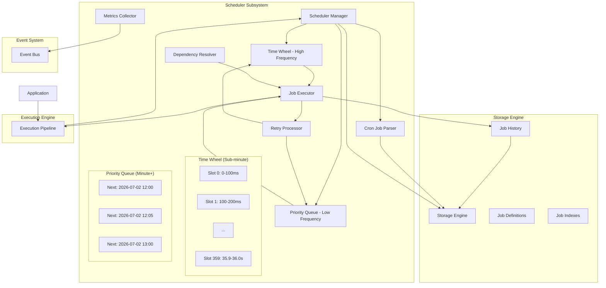
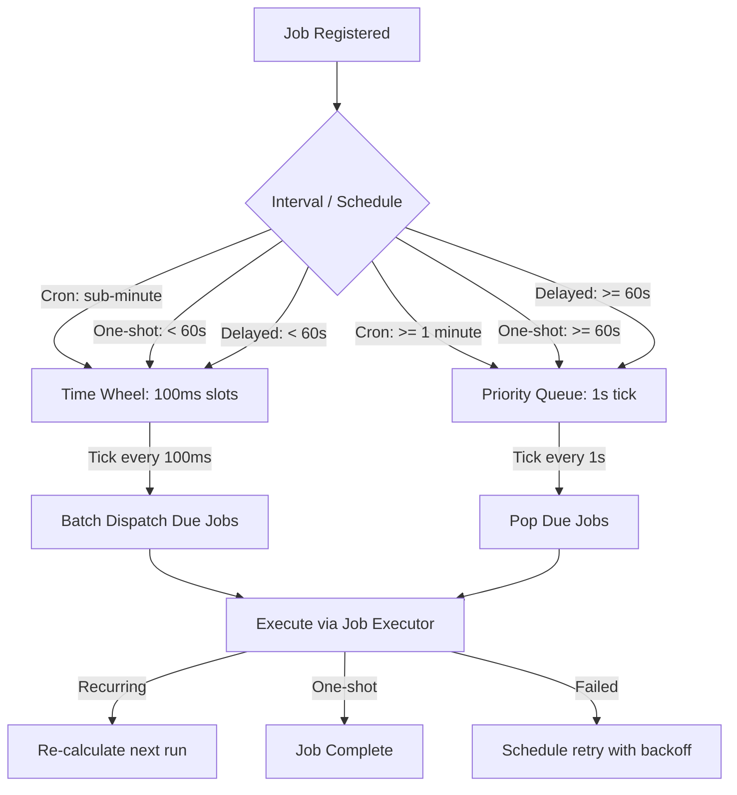
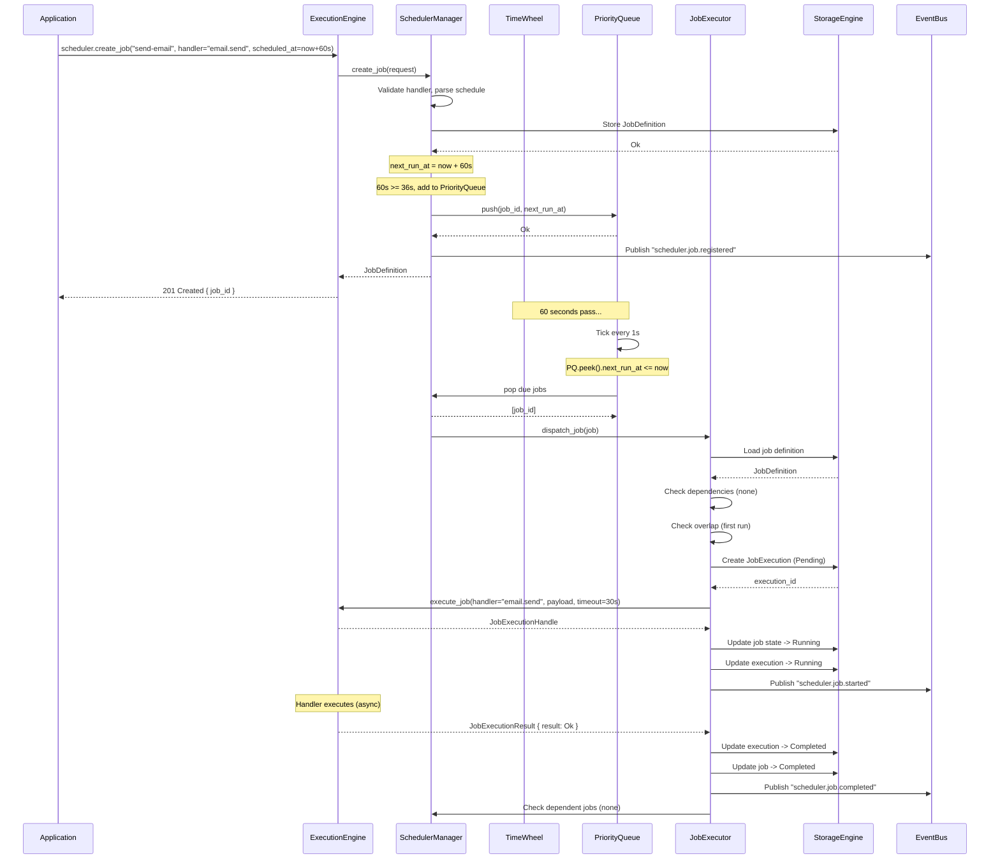
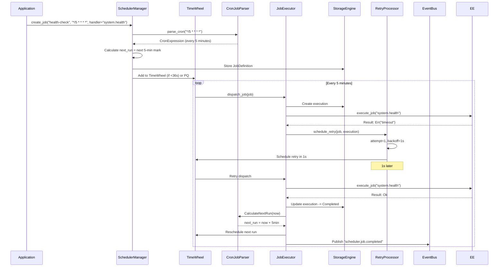
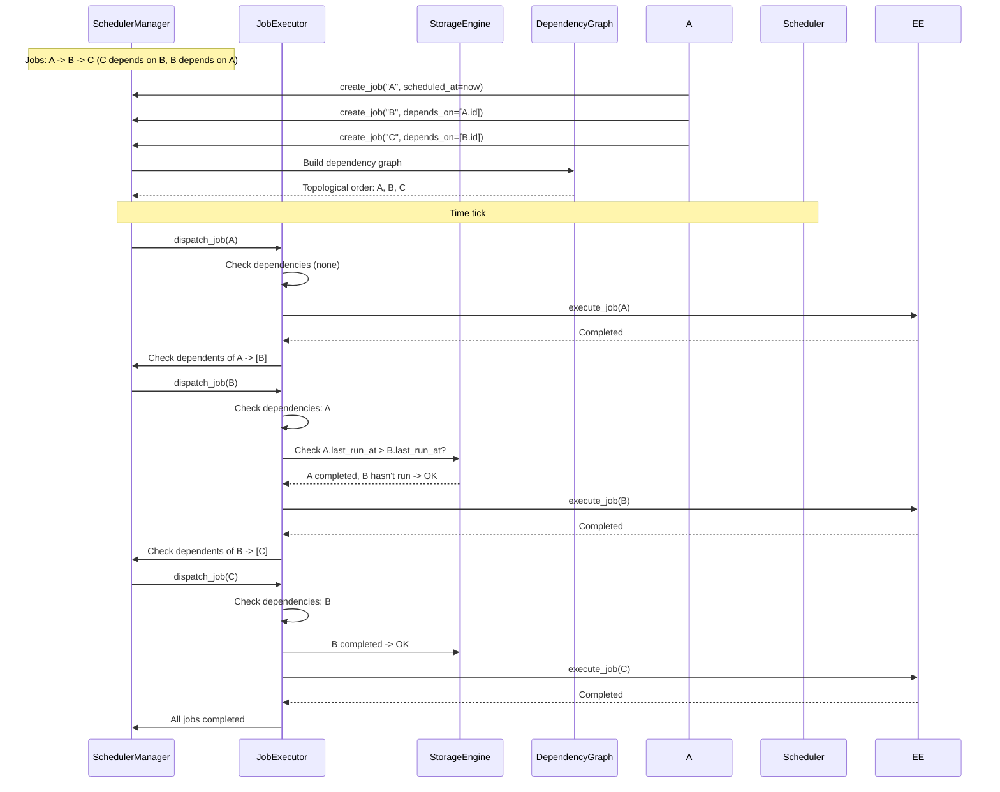
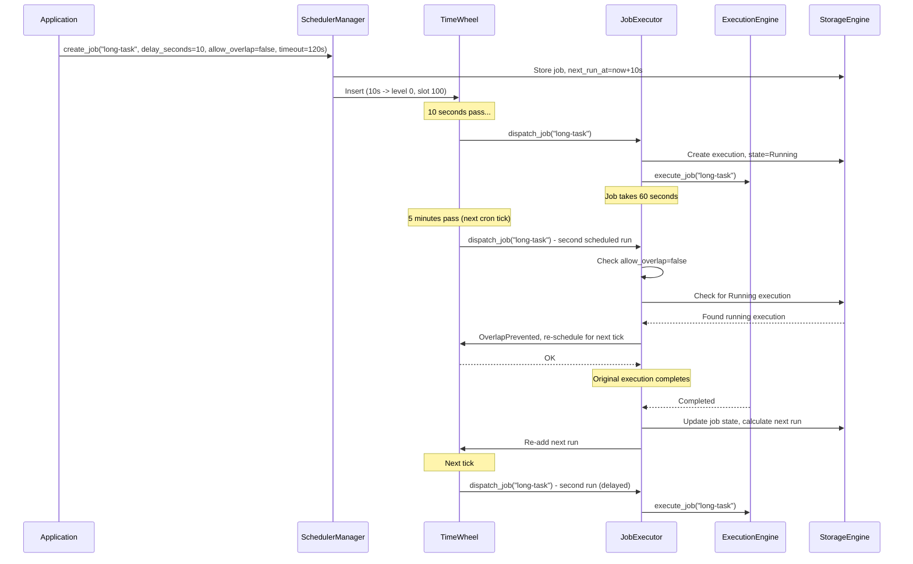
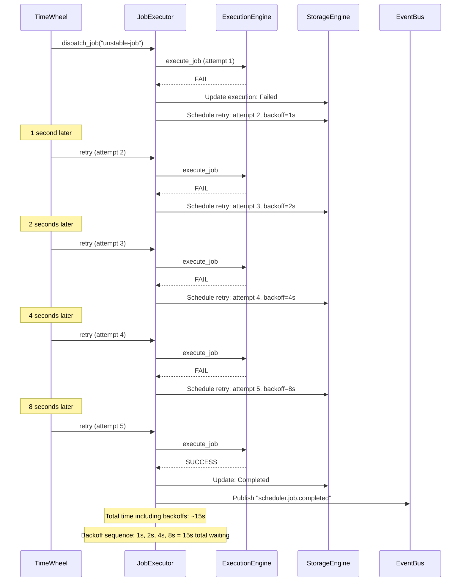

# 18. Scheduler Subsystem

## 1. Purpose

The Scheduler subsystem provides time-based job execution within Nova Runtime. It enables applications to schedule work to be executed at specific times (one-shot), on recurring schedules (cron), or after configurable delays. The scheduler bridges the gap between the Queue subsystem (message-oriented, transient processing) and the need for future-dated, persistent, and recurring task execution with retry semantics.

## 2. Scope

This document covers the complete scheduling subsystem:

- Job types: one-time (fire-and-forget), recurring (cron expressions), delayed (relative offset)
- Job structure (ID, handler, payload, schedule, metadata)
- Scheduling algorithm: time-wheel for high-frequency (sub-minute) jobs, priority queue for lower-frequency jobs
- Job persistence: all jobs stored in the Storage Engine
- Job execution with retry policy (exponential backoff: 1s, 2s, 4s, 8s, ... max 5min, max 10 retries)
- Job timeouts (default 30s, configurable per job)
- Overlapping execution prevention (skip if still running)
- Job dependencies (DAG-based execution ordering)
- Missed catch-up policy (execute missed runs or skip)
- Scheduler precision: 100ms granularity for sub-minute jobs, 1s for longer intervals
- Job lifecycle from scheduling to completion
- Integration with the Execution Engine for job handler invocation

Out of scope: Distributed job scheduling across cluster nodes (future), job chaining with complex workflow engines (future), calendar-based scheduling beyond cron (future), job priority within same tick.

## 3. Responsibilities

- Accept job registrations from applications via the Execution Engine
- Persist job definitions and schedules in the Storage Engine
- Maintain in-memory time-wheel for high-frequency job dispatch
- Maintain priority queue for lower-frequency job dispatch
- Trigger job execution at the scheduled time with configured precision
- Execute job handlers through the Execution Engine
- Enforce retry policy with exponential backoff and max attempt limits
- Enforce job timeout (kill job if exceeds limit)
- Prevent overlapping executions for singleton jobs
- Resolve and enforce job dependency ordering (DAG)
- Handle missed job runs according to catch-up policy
- Provide job lifecycle events via the Event System
- Track job execution history (last run, next run, run count)
- Support job lifecycle management (pause, resume, cancel, update)

## 4. Non Responsibilities

- Distributed coordination of job execution across nodes (future)
- Complex workflow orchestration with branching and conditions (future)
- Calendar-based scheduling beyond standard cron (e.g., business calendars)
- Job handler implementation (provided by application code)
- Message queuing for immediate delivery (handled by Queue subsystem)
- Real-time stream processing (handled by Queue with consumer groups)
- Dynamic job creation from within job handlers without formal registration

## 5. Architecture

### 5.1 High-Level Architecture



### 5.2 Job State Machine

```mermaid
stateDiagram-v2
    [*] --> Created: Job registered
    Created --> Scheduled: Schedule resolved
    Scheduled --> Queued: Due for execution
    Queued --> Running: Executor picks up
    Running --> Completed: Handler returns success
    Running --> Failed: Handler returns error
    Running --> TimedOut: Execution time exceeded
    Failed --> Queued: Retry scheduled (backoff)
    Failed --> Completed: No more retries needed? No
    Failed --> Archived: Max retries exceeded
    TimedOut --> Queued: Retry scheduled
    Completed --> Scheduled: Recurring job (next interval)
    Completed --> Archived: One-time job
    Archived --> [*]
    Created --> Cancelled: User cancels
    Scheduled --> Cancelled: User cancels
    Queued --> Cancelled: User cancels (skip execution)
    Cancelled --> [*]
    Scheduled --> Paused: User pauses
    Paused --> Scheduled: User resumes
```



### 5.3 Scheduling Precision Architecture



## 6. Data Structures

### 6.1 Job Definition

```rust
struct JobDefinition {
    /// Job ID (UUIDv4)
    id: [u8; 16],                    // 16 bytes
    /// Job name (unique within runtime)
    name: String,                     // variable, max 256 bytes
    /// Job description
    description: Option<String>,      // variable, max 1024 bytes
    
    // Handler configuration
    /// Handler name registered in Execution Engine
    handler: String,                  // variable, max 256 bytes
    /// Handler payload (JSON or MessagePack encoded)
    payload: Vec<u8>,                 // variable, max 65536 bytes (64 KB)
    /// Content type of payload
    payload_content_type: String,     // variable, default "application/json"
    
    // Schedule configuration
    /// Schedule type: one_shot, recurring_cron, delayed
    schedule_type: ScheduleType,      // 1 byte enum
    /// Cron expression (for recurring jobs)
    cron_expression: Option<String>,  // variable, max 256 bytes
    /// Timezone for cron evaluation (IANA tz, default "UTC")
    timezone: Option<String>,         // variable, max 64 bytes
    /// Delay in seconds (for delayed one-shot)
    delay_seconds: Option<u64>,       // 8 bytes
    /// Specific scheduled time (for one-shot absolute)
    scheduled_at: Option<i64>,        // 8 bytes
    
    // Execution configuration
    /// Job timeout in nanoseconds (default: 30_000_000_000 = 30s)
    timeout_ns: i64,                  // 8 bytes
    /// Maximum retry attempts (default: 10, 0 = no retries)
    max_retries: u32,                // 4 bytes
    /// Retry backoff base in nanoseconds (default: 1_000_000_000 = 1s)
    retry_backoff_base_ns: i64,      // 8 bytes
    /// Whether overlapping executions are allowed (default: false)
    allow_overlap: bool,             // 1 byte
    /// Catch-up policy: catch_up, skip, skip_all (default: catch_up)
    catch_up_policy: CatchUpPolicy,  // 1 byte enum
    /// Whether job is enabled
    enabled: bool,                    // 1 byte
    
    // Dependencies
    /// Jobs that must complete before this job runs
    depends_on: Vec<[u8; 16]>,       // variable, max 64 dependencies
    /// Dependency failure policy: fail, skip, wait (default: fail)
    dependency_failure_policy: DependencyFailurePolicy, // 1 byte enum
    
    // State
    /// Current job state
    state: JobState,                  // 1 byte enum
    
    // Timing
    /// Creation timestamp (Unix nanoseconds)
    created_at: i64,                  // 8 bytes
    /// Last modification timestamp (Unix nanoseconds)
    updated_at: i64,                  // 8 bytes
    /// Last run timestamp (Unix nanoseconds)
    last_run_at: Option<i64>,         // 8 bytes
    /// Next scheduled run timestamp (Unix nanoseconds)
    next_run_at: Option<i64>,        // 8 bytes
    /// Previous run timestamp before last (for catch-up)
    previous_run_at: Option<i64>,     // 8 bytes
    
    // Statistics
    /// Total execution count
    run_count: u64,                  // 8 bytes
    /// Total success count
    success_count: u64,              // 8 bytes
    /// Total failure count
    failure_count: u64,              // 8 bytes
    /// Last error message
    last_error: Option<String>,       // variable, max 4096 bytes
    
    // Metadata
    /// User-defined tags for filtering
    tags: Vec<String>,                // variable, max 32 tags, 64 chars each
    /// Owner principal ID
    owner_id: Option<[u8; 16]>,      // 16 bytes
}
// Minimum: ~128 bytes + variable fields
// Typical: ~500 bytes per job definition
```

### 6.2 Job Execution Record

```rust
struct JobExecution {
    /// Execution ID (UUIDv4)
    id: [u8; 16],                    // 16 bytes
    /// Job definition ID
    job_id: [u8; 16],               // 16 bytes
    
    // Execution context
    /// Scheduled timestamp for this execution (Unix nanoseconds)
    scheduled_at: i64,               // 8 bytes
    /// Actual start timestamp (Unix nanoseconds)
    started_at: Option<i64>,         // 8 bytes
    /// Completion timestamp (Unix nanoseconds)
    completed_at: Option<i64>,       // 8 bytes
    /// Duration in nanoseconds (computed)
    duration_ns: Option<i64>,        // 8 bytes
    
    // Handler execution
    /// Execution Engine request ID
    execution_request_id: Option<[u8; 16]>, // 16 bytes
    /// Handler return value (JSON encoded)
    result: Option<Vec<u8>>,         // variable
    /// Error message if failed
    error: Option<String>,           // variable, max 4096 bytes
    
    // Retry tracking
    /// Attempt number (1-based)
    attempt: u32,                    // 4 bytes
    /// Whether this execution is a retry
    is_retry: bool,                  // 1 byte
    
    // Status
    status: ExecutionStatus,         // 1 byte enum
    // running, completed, failed, timed_out, skipped, cancelled
    
    // Dependency tracking
    /// Job execution IDs that this execution depended on
    dependency_execution_ids: Vec<[u8; 16]>, // variable
    
    // Timestamps
    created_at: i64,                 // 8 bytes
    updated_at: i64,                 // 8 bytes
}
// Minimum: ~104 bytes + variable fields
```

### 6.3 Cron Expression (Parsed)

```rust
struct CronExpression {
    /// Original expression string
    raw: String,                      // variable
    
    /// Parsed fields (0-based, inclusive ranges where applicable)
    minute: CronField,                // 0-59
    hour: CronField,                  // 0-23
    day_of_month: CronField,          // 1-31
    month: CronField,                 // 1-12
    day_of_week: CronField,           // 0-7 (0 and 7 = Sunday)
    
    /// Special support
    include_year: Option<CronField>,  // optional 6th field
    include_seconds: Option<CronField>, // optional leading second field
}

struct CronField {
    /// Field type: any, exact, range, step, list, composite
    field_type: CronFieldType,       // 1 byte enum
    /// Values (for exact, range, step)
    values: Vec<u8>,                  // variable
    /// Step value (for step fields like */5)
    step: Option<u8>,                // 1 byte
    /// List of sub-fields (for composite like "1,3,5")
    sub_fields: Option<Vec<CronField>>, // variable
}
```

### 6.4 Time Wheel

```rust
/// In-memory data structure for high-frequency job scheduling.
/// Uses hierarchical time wheel:
///   Level 0: 360 slots × 100ms = 36 seconds
///   Level 1: 60 slots × 36s = 36 minutes
///   Level 2: 24 slots × 36min = 14.4 hours
///   Level 3: 7 slots × 14.4h = 4.2 days
/// 
/// Jobs are placed in the slot corresponding to their remaining time.
/// On each tick, the current slot's jobs are dispatched and re-inserted
/// into lower levels if their remaining time spans multiple levels.

struct TimeWheel {
    /// Number of levels (default: 4)
    levels: u32,                      // 4 bytes
    /// Number of slots per level (default: 360, 60, 24, 7)
    slots_per_level: Vec<u32>,       // variable
    
    /// Wheel data: level -> slot -> Vec<JobRef>
    /// Each slot contains job references for that time bucket
    wheels: Vec<Vec<VecDeque<JobRef>>>, // variable
    
    /// Current cursor position per level
    cursors: Vec<AtomicU64>,          // position in each level
    
    /// Tick interval in nanoseconds (default: 100_000_000 = 100ms)
    tick_interval_ns: i64,            // 8 bytes
    
    /// Last tick timestamp (Unix nanoseconds)
    last_tick: AtomicI64,             // 8 bytes
    
    /// Mutex for wheel operations
    lock: RwLock<()>,                 // synchronization
}

struct JobRef {
    /// Job definition ID
    job_id: [u8; 16],                // 16 bytes
    /// Next scheduled run timestamp
    next_run_at: i64,                // 8 bytes
    /// Whether this is a recurring job
    is_recurring: bool,              // 1 byte
    /// Recurring interval in nanoseconds (for simple intervals, not cron)
    interval_ns: Option<i64>,        // 8 bytes
    /// Reference to job definition (loaded lazily)
    cached_job: Option<Arc<JobDefinition>>, // 8 bytes (pointer)
}
// Minimum: ~33 bytes + pointer
// Maximum (with cached job): ~533 bytes
```

### 6.5 Priority Queue (Heap-Based)

```rust
/// Min-heap ordered by next_run_at.
/// Used for low-frequency jobs (interval >= 1 minute).
/// Implemented as a binary heap.

struct SchedulerPriorityQueue {
    /// Internal heap storage
    heap: BinaryHeap<PriorityJobEntry>, // variable
    
    /// Reverse index: job_id -> position in heap
    position_map: HashMap<[u8; 16], usize>, // variable
    
    /// Next scheduled run time (cached min)
    next_run_at: AtomicI64,           // 8 bytes
    
    /// Lock for heap operations
    lock: Mutex<()>,                  // synchronization
}

struct PriorityJobEntry {
    /// Job definition ID
    job_id: [u8; 16],                // 16 bytes
    /// Next scheduled run time (Unix nanoseconds)
    next_run_at: i64,                // 8 bytes
    /// Comparison priority (lower = more urgent)
    priority: u8,                    // 1 byte
    
    impl Ord for PriorityJobEntry {
        fn cmp(&self, other: &Self) -> Ordering {
            // Reverse ordering for min-heap
            other.next_run_at.cmp(&self.next_run_at)
                .then_with(|| self.priority.cmp(&other.priority))
        }
    }
}
// Minimum: 25 bytes per entry
// Maximum heap size: 100,000 entries (all scheduled jobs)
```

### 6.6 Retry State

```rust
struct RetryState {
    /// Job definition ID
    job_id: [u8; 16],                // 16 bytes
    /// Current retry attempt (1-based)
    attempt: u32,                    // 4 bytes
    /// Maximum retries
    max_retries: u32,                // 4 bytes
    /// Next retry timestamp (Unix nanoseconds)
    next_retry_at: i64,              // 8 bytes
    /// Retry backoff base in nanoseconds
    backoff_base_ns: i64,            // 8 bytes
    /// Last error from execution
    last_error: String,              // variable, max 4096 bytes
    /// Execution IDs of previous attempts
    execution_ids: Vec<[u8; 16]>,    // variable, up to max_retries
    /// Created at
    created_at: i64,                 // 8 bytes
    /// Updated at
    updated_at: i64,                 // 8 bytes
}
// Minimum: ~48 bytes + variable fields
```

### 6.7 Job Dependency Graph (DAG)

```rust
struct JobDependencyGraph {
    /// Adjacency list: job_id -> list of dependent job_ids
    /// (a depends on b means edge b -> a; a runs after b completes)
    adjacency: HashMap<[u8; 16], Vec<[u8; 16]>>, // variable
    
    /// Reverse adjacency: job_id -> list of dependencies
    /// (a depends on b means b is in reverse[a])
    reverse_adjacency: HashMap<[u8; 16], Vec<[u8; 16]>>, // variable
    
    /// Topologically sorted order (for execution planning)
    topological_order: Option<Vec<[u8; 16]>>, // variable
    
    /// Version counter (incremented on change)
    version: u64,                    // 8 bytes
}
```

### 6.8 Scheduler Configuration

```rust
struct SchedulerConfig {
    /// Tick interval for time wheel in nanoseconds (default: 100_000_000 = 100ms)
    time_wheel_tick_ns: i64,         // 8 bytes
    /// Tick interval for priority queue in nanoseconds (default: 1_000_000_000 = 1s)
    priority_queue_tick_ns: i64,     // 8 bytes
    
    /// Number of time wheel levels (default: 4)
    time_wheel_levels: u32,          // 4 bytes
    /// Slots per level (default: [360, 60, 24, 7])
    time_wheel_slots: Vec<u32>,      // variable
    
    /// Maximum number of jobs dispatched per tick (default: 100)
    max_jobs_per_tick: u32,         // 4 bytes
    
    /// Maximum scheduled jobs (default: 100,000)
    max_scheduled_jobs: u32,        // 4 bytes
    
    /// Default job timeout in nanoseconds (default: 30_000_000_000 = 30s)
    default_job_timeout_ns: i64,    // 8 bytes
    /// Maximum job timeout in nanoseconds (default: 3_600_000_000_000 = 1h)
    max_job_timeout_ns: i64,        // 8 bytes
    
    /// Default max retries (default: 10)
    default_max_retries: u32,       // 4 bytes
    /// Maximum retries (default: 100)
    max_retries: u32,               // 4 bytes
    
    /// Default retry backoff base in nanoseconds (default: 1_000_000_000 = 1s)
    default_retry_backoff_ns: i64,  // 8 bytes
    /// Maximum retry backoff in nanoseconds (default: 300_000_000_000 = 5min)
    max_retry_backoff_ns: i64,      // 8 bytes
    
    /// Maximum concurrent job executions (default: 100)
    max_concurrent_executions: u32, // 4 bytes
    
    /// Job history retention in nanoseconds (default: 2_592_000_000_000_000 = 30 days)
    job_history_retention_ns: i64,  // 8 bytes
}
// Total: ~88 bytes + variable fields
```

## 7. Algorithms

### 7.1 Job Registration

```
Algorithm: RegisterJob
Input:
  - name: String
  - handler: String
  - payload: Vec<u8>
  - schedule_type: ScheduleType
  - cron_expression: Option<String>
  - delay_seconds: Option<u64>
  - scheduled_at: Option<i64>
  - timeout_ns: Option<i64>
  - max_retries: Option<u32>
  - retry_backoff_base_ns: Option<i64>
  - allow_overlap: bool
  - catch_up_policy: CatchUpPolicy
  - depends_on: Vec<[u8; 16]>
  - tags: Vec<String>
  - owner_id: Option<[u8; 16]>
  - enabled: bool (default: true)
  - current_time: i64

Output:
  - job_id: [u8; 16]

Steps:
  1. Validate job name uniqueness
     If name already exists in Storage Engine, return Err(JobNameAlreadyExists)
  
  2. Validate handler exists in Execution Engine registry
     If not found, return Err(HandlerNotFound(handler))
  
  3. Parse and validate schedule:
     If schedule_type == RecurringCron:
       Parse cron_expression
       If invalid, return Err(InvalidCronExpression(details))
       Calculate next_run_at from cron
       If next_run_at > current_time + 10 years:
         return Err(ScheduleTooFar)
     
     If schedule_type == Delayed:
       If delay_seconds is None:
         return Err(MissingDelay)
       If delay_seconds > 3_155_760_00 (10 years):
         return Err(DelayTooLarge)
       next_run_at = current_time + (delay_seconds * 1_000_000_000)
     
     If schedule_type == OneShot:
       If scheduled_at is None:
         next_run_at = current_time  // immediate
       Else:
         next_run_at = scheduled_at
         If next_run_at < current_time - 60_000_000_000 (1 min in past):
           return Err(ScheduleInPast)
  
  4. Validate dependencies:
     For each dep_id in depends_on:
       Load JobDefinition for dep_id
       If not found, return Err(DependencyNotFound(dep_id))
       Check for circular dependency:
         If dep_id transitively depends on this new job:
           return Err(CircularDependency)
  
  5. Create JobDefinition:
     id = UUIDv4
     state = if enabled then Scheduled else Created
     run_count = 0
     success_count = 0
     failure_count = 0
     next_run_at = (if enabled && next_run_at > current_time) ? next_run_at : None
     (rest from input parameters)
  
  6. Validate payload size:
     If payload.len() > 65536:
       return Err(PayloadTooLarge)
  
  7. Validate timeout:
     effective_timeout = timeout_ns.unwrap_or(config.default_job_timeout_ns)
     If effective_timeout < 1_000_000_000 (1s):
       return Err(TimeoutTooSmall)
     If effective_timeout > config.max_job_timeout_ns:
       return Err(TimeoutTooLarge)
     Clamp to config.max_job_timeout_ns
  
  8. Store JobDefinition in Storage Engine
     Create index entries:
       - By name: name -> id
       - By next_run_at: next_run_at -> id (for scheduler)
       - By tags: tag -> id (for filtering)
  
  9. Add job to scheduler data structures:
     If next_run_at - current_time < 36_000_000_000 (36s):
       Add to TimeWheel (high-frequency)
     Else:
       Add to PriorityQueue (low-frequency)
  
  10. Publish "scheduler.job.registered" event
  
  11. Return job_id
```

### 7.2 Cron Expression Parser

```
Algorithm: ParseCronExpression
Input:
  - expression: String (standard 5-field or extended 6/7-field)
  
Output:
  - parsed: CronExpression
  - error: Option<String>

Supported Format:
  Standard: "minute hour day-of-month month day-of-week"
  With seconds: "second minute hour day-of-month month day-of-week"
  With year: "minute hour day-of-month month day-of-week year"
  
  Field values:
    *         = any
    NUMBER    = exact value
    RANGE     = start-end (inclusive)
    STEP      = */N or start-end/N
    LIST      = 1,3,5

Steps:
  1. Normalize expression:
     - Trim whitespace
     - Collapse multiple spaces
     - Split by space
  
  2. Count fields:
     If 5 fields: standard (minute, hour, dom, month, dow)
     If 6 fields: with seconds (second, ...)
     If 7 fields: with year (second, ..., year)
     If not 5, 6, or 7: return error
  
  3. Parse each field based on position:
     
     fn parse_field(input: &str, min: u8, max: u8) -> Result<CronField, String>:
       If input == "*":
         return CronField { field_type: Any, values: [], step: None }
       
       If input contains "/":
         Split by "/": [base, step_str]
         step = parse_int(step_str)?
         If base == "*":
           values = (min..=max).step_by(step).collect()
           return CronField { field_type: Step, values, step: Some(step) }
         Else if base contains "-":
           Parse range base and apply step
         Else:
           return error
       
       If input contains ",":
         sub_fields = input.split(",").map(|s| parse_field(s, min, max))
         return CronField { field_type: List, values: [], sub_fields }
       
       If input contains "-":
         Split by "-": [start_str, end_str]
         start = parse_int(start_str)?, end = parse_int(end_str)?
         If start > end: return error
         If start < min || end > max: return error
         values = (start..=end).collect()
         return CronField { field_type: Range, values, step: None }
       
       // Single number
       value = parse_int(input)?
       If value < min || value > max: return error
       return CronField { field_type: Exact, values: [value], step: None }
  
  4. Handle day-of-week special: 0 and 7 both mean Sunday
     Normalize 7 -> 0
  
  5. Return CronExpression with parsed fields

Special handling:
  - "@every 5m": syntactic sugar for "*/5 * * * *"
  - "@hourly": "0 * * * *"
  - "@daily": "0 0 * * *"
  - "@weekly": "0 0 * * 0"
  - "@monthly": "0 0 1 * *"
  - "@yearly": "0 0 1 1 *"
```

### 7.3 Next Run Time Calculation

```
Algorithm: CalculateNextRun
Input:
  - cron: CronExpression
  - after: i64 (Unix nanoseconds, find next run after this time)
  - timezone: String (IANA tz)

Output:
  - next_run_at: Option<i64>

Steps:
  1. Convert after timestamp to datetime in target timezone:
     dt = DateTime::from_timestamp_ns(after)
     dt_tz = dt.with_timezone(timezone)
  
  2. Start searching from the next minute (or second):
     If cron includes seconds:
       start = dt_tz + 1 second
     Else:
       start = dt_tz + 1 minute
  
  3. Limit search depth:
     max_search = 5 years (5 * 365 * 24 * 60 * 60 * 1_000_000_000 ns)
     search_deadline = after + max_search
  
  4. Iterate forward minute by minute (or second by second):
     current = start
     while current.timestamp_ns() < search_deadline:
       
       If field_matches(current.month(), cron.month) &&
          field_matches(current.day(), cron.day_of_month) &&
          field_matches(current.day_of_week(), cron.day_of_week) &&
          field_matches(current.hour(), cron.hour) &&
          field_matches(current.minute(), cron.minute):
         
         If cron has seconds:
           Find matching second
         
         Return current.timestamp_ns()
       
       // If day-of-week and day-of-month are both restricted (not *),
       // advance by 1 day (OR semantics: match either)
       If cron.day_of_month.field_type != Any && cron.day_of_week.field_type != Any:
         current = current + 1 day
       Else:
         current = current + 1 minute
  
  5. Return None (no matching time within search window)
  
Helper: field_matches(value, field):
  If field.field_type == Any: return true
  If field.field_type == Exact: return value == field.values[0]
  If field.field_type == Range: return value >= field.values[0] && value <= field.values[1]
  If field.field_type == Step: return value in field.values
  If field.field_type == List: return any(field_matches(value, sub) for sub in field.sub_fields)
  Return false
```

### 7.4 Time Wheel Tick

```
Algorithm: TimeWheelTick
Runs: Every 100ms (configurable)
Input:
  - current_time: i64

Steps:
  1. Acquire write lock on TimeWheel
  
  2. Calculate elapsed ticks:
     ticks_elapsed = (current_time - last_tick) / tick_interval_ns
     If ticks_elapsed == 0: release lock and return
     If ticks_elapsed > 360 (max 36s catch-up):
       ticks_elapsed = 360  // Don't try to catch up more than 36s
       // Missed jobs will be handled by catch-up policy
  
  3. For tick in 0..ticks_elapsed:
     a. For each level L from 0 to max_level:
        Advance cursor for level L
        slot = cursors[L]
        
        b. If slot has jobs:
           For each job_ref in wheel[L][slot]:
             // Attempt to dispatch
             result = try_dispatch_job(job_ref)
             
             If result == Dispatched:
               If job_ref.is_recurring:
                 Calculate next_run_at
                 If next_run_at - current_time < 36s:
                   Insert into appropriate wheel level
                 Else:
                   Move to PriorityQueue
             
             Else if result == DependencyNotMet:
               // Leave in wheel for next tick
               job_ref.next_run_at = current_time + tick_interval_ns
               Re-insert into current level's next slot
             
             Else if result == OverlapPrevented:
               job_ref.next_run_at = current_time + tick_interval_ns
               Re-insert
           
           Clear slot after processing
     
     // After level 0 advances, cascade overflow to lower levels
     If slot at level L overflowed (wrapped around):
       Redistribute overflow jobs from level L to level L+1
  
  4. Update last_tick = last_tick + (ticks_elapsed * tick_interval_ns)
  
  5. Release write lock
```

### 7.5 Priority Queue Tick

```
Algorithm: PriorityQueueTick
Runs: Every 1 second (configurable)
Input:
  - current_time: i64

Steps:
  1. Peek at min element of heap
     If heap is empty or min.next_run_at > current_time:
       Return (nothing due)
  
  2. Acquire lock on priority queue
  
  3. Collect due jobs:
     due_jobs = []
     While heap is not empty and heap.peek().next_run_at <= current_time:
       entry = heap.pop()
       job = load_job_definition(entry.job_id)
       
       If job is None or not enabled:
         Continue (skip deleted/disabled jobs)
       
       // Check if job should be moved to time wheel
       If job.next_run_at - current_time < 36_000_000_000 (36s):
         Add to TimeWheel instead
         Continue
       
       due_jobs.push(job)
       
       If due_jobs.len() >= config.max_jobs_per_tick:
         Break
  
  4. Release lock
  
  5. For each due_job:
     dispatch_job(due_job)
  
  6. For recurring jobs that were due:
     Calculate next_run_at
     If next_run_at - current_time < 36s:
       Add to TimeWheel
     Else:
       Re-insert into priority queue
```

### 7.6 Job Dispatch

```
Algorithm: DispatchJob
Input:
  - job: JobDefinition
  - current_time: i64

Output:
  - DispatchResult (Dispatched, Skipped, OverlapPrevented, DependencyNotMet)

Steps:
  1. If job.state != Scheduled:
     Return Skipped (job paused or cancelled)
  
  2. If not job.enabled:
     Return Skipped
  
  3. Check concurrency limit:
     If active_executions >= config.max_concurrent_executions:
       Return ResourceExhausted (re-try next tick)
  
  4. Check overlap prevention:
     If not job.allow_overlap:
       Check for running execution for this job
       If running execution exists:
         Return OverlapPrevented
  
  5. Check dependencies:
     For each dep_id in job.depends_on:
       dep_job = load_job_definition(dep_id)
       
       If dep_job.state != Completed and dep_job.state != Archived:
         // Dependency not yet completed
         If dep_job.state == Failed:
           Handle per dependency_failure_policy:
             fail -> Return DependencyFailed
             skip -> Skip this dependency check
             wait -> Return DependencyNotMet (wait for dependency)
         Else:
           Return DependencyNotMet
       
       // Check if the dependency was completed AFTER our last execution
       If job.last_run_at is Some:
         If dep_job.last_run_at is None or dep_job.last_run_at < job.last_run_at:
           // Dependency hasn't completed since our last run
           Return DependencyNotMet
   
  6. Create JobExecution record:
     execution_id = UUIDv4
     execution = JobExecution {
       id: execution_id,
       job_id: job.id,
       scheduled_at: job.next_run_at.unwrap_or(current_time),
       started_at: None,
       status: Pending,
       attempt: 1,
       is_retry: false,
       created_at: current_time,
       ...
     }
     Store execution in Storage Engine
  
  7. Invoke job handler through Execution Engine:
     execution_request = ExecutionRequest {
       handler: job.handler,
       payload: job.payload,
       content_type: job.payload_content_type,
       timeout: job.timeout_ns,
       execution_id: execution_id,
       job_id: job.id,
     }
     
     // Execution is async; handler runs in execution engine
     execution_future = execution_engine.execute(execution_request)
  
  8. Update job state:
     job.last_run_at = current_time
     job.previous_run_at = job.last_run_at
     job.state = Running
     job.run_count += 1
     Store/update job in Storage Engine
  
  9. Update execution:
     execution.started_at = current_time
     execution.status = Running
     execution.execution_request_id = execution_request.id
     Update execution in Storage Engine
  
  10. Return Dispatched
```

### 7.7 Job Completion Handler

```
Algorithm: HandleJobCompletion
Input:
  - execution_id: [u8; 16]
  - result: Result<Vec<u8>, Error>
  - current_time: i64

Steps:
  1. Load JobExecution record
     If not found, return Err(ExecutionNotFound)
  
  2. Load JobDefinition
     If not found, return Err(JobNotFound)
  
  3. Update execution:
     execution.completed_at = current_time
     execution.duration_ns = current_time - execution.started_at.unwrap()
     
     If result is Ok:
       execution.result = result
       execution.status = Completed
     Else:
       execution.error = format!("{}", result.err())
       execution.status = Failed
  
  4. Update execution in Storage Engine

  5. If result is Ok:
     // Successful execution
     job.success_count += 1
     job.last_error = None
     
     If job.schedule_type == OneShot:
       // One-shot complete
       job.state = Completed
       job.next_run_at = None
       Publish "scheduler.job.completed" event
     
     Else: // Recurring
       // Schedule next run
       new_next = CalculateNextRun(cron, after=current_time)
       If new_next is Some:
         job.next_run_at = new_next
         job.state = Scheduled
         Add job to scheduler (TimeWheel or PriorityQueue)
       Else:
         job.state = Completed  // No more runs in range
       
       Publish "scheduler.job.completed" event
  
  6. If result is Err:
     // Failed execution
     job.failure_count += 1
     job.last_error = execution.error.clone()
     
     If job.run_count >= job.max_retries + 1:
       // Max retries exceeded
       job.state = Archived
       Publish "scheduler.job.archived" event with max_retries reason
     Else:
       // Schedule retry
       retry_state = schedule_retry(job, execution, current_time)
       Publish "scheduler.job.retry_scheduled" event
  
  7. Update job in Storage Engine
  
  8. Check for dependent jobs:
     // Find jobs that depend on this completed job
     For each dependent_job in dependency_graph.reverse_adjacency[job.id]:
       dependent_job = load_job_definition(dependent_job_id)
       If dependent_job.state == Scheduled && dependent_job.enabled:
         // Attempt to dispatch dependent job
         dispatch_job(dependent_job, current_time)
```

### 7.8 Retry Scheduling

```
Algorithm: ScheduleRetry
Input:
  - job: JobDefinition
  - execution: JobExecution
  - current_time: i64

Output:
  - retry_state: RetryState

Backoff Formula:
  delay = min(base * 2^(attempt-1), max_backoff)
  Where:
    base = job.retry_backoff_base_ns (default: 1s)
    max_backoff = config.max_retry_backoff_ns (default: 5min)
  
  Sequence: 1s, 2s, 4s, 8s, 16s, 32s, 64s, 128s, 256s, 300s (capped)

Steps:
  1. Calculate next attempt number:
     next_attempt = execution.attempt + 1
  
  2. Calculate delay:
     If next_attempt == 1:
       delay = job.retry_backoff_base_ns
     Else:
       delay = min(
         job.retry_backoff_base_ns * (2 ^ (next_attempt - 1)),
         config.max_retry_backoff_ns
       )
  
  3. Calculate next_retry_at = current_time + delay
  
  4. Create new execution for retry:
     retry_execution = JobExecution {
       id: UUIDv4,
       job_id: job.id,
       scheduled_at: next_retry_at,
       attempt: next_attempt,
       is_retry: true,
       status: Pending,
       dependency_execution_ids: [execution.id],
       ...
     }
     Store retry_execution in Storage Engine
  
  5. Create RetryState:
     retry_state = RetryState {
       job_id: job.id,
       attempt: next_attempt,
       max_retries: job.max_retries,
       next_retry_at: next_retry_at,
       backoff_base_ns: job.retry_backoff_base_ns,
       last_error: execution.error.clone().unwrap_or_default(),
       execution_ids: [execution.id, retry_execution.id],
       ...
     }
     Store retry_state in Storage Engine
  
  6. Schedule retry:
     If next_retry_at - current_time < 36s:
       Add to TimeWheel
     Else:
       Add to PriorityQueue
  
  7. Update job state:
     job.state = Scheduled  // Back to scheduled for retry
     job.next_run_at = next_retry_at
     Update job in Storage Engine
  
  8. Return retry_state
```

### 7.9 Job Timeout Enforcement

```
Algorithm: TimeoutEnforcer
Runs: Every 5 seconds
Input:
  - current_time: i64

Steps:
  1. Query Storage Engine for JobExecution records:
     status == Running AND
     started_at + timeout_ns < current_time

  2. For each timed-out execution:
     a. Load JobDefinition
     b. Cancel the running execution in Execution Engine:
        execution_engine.cancel(execution.execution_request_id)
     c. Update execution:
        execution.status = TimedOut
        execution.error = "Job execution timed out after {timeout}ns"
        execution.completed_at = current_time
        execution.duration_ns = current_time - execution.started_at.unwrap()
     d. Store updated execution
     e. Handle as failed execution:
        Call HandleJobCompletion(execution, Err(TimeoutError))

  3. Sleep 5 seconds, repeat
```

### 7.10 Missed Catch-Up

```
Algorithm: HandleMissedRun
Input:
  - job: JobDefinition (recurring)
  - scheduled_run_at: i64 (the missed run time)
  - current_time: i64

Steps:
  1. If current_time <= job.next_run_at.unwrap_or(i64::MAX):
     // Not actually missed
     Return
  
  2. Compute missed_duration = current_time - job.next_run_at.unwrap()
  
  3. If missed_duration > 36_000_000_000_000 (10 hours):
     // Large gap: likely system was down
     Log warning: "Job {job.name} missed by {missed_duration}ns"
  
  4. Apply catch-up policy:
     
     If job.catch_up_policy == CatchUp:
       // Execute the missed run immediately
       Dispatch job now
       // Then calculate next run from the original scheduled time (not now)
       // This preserves the original schedule
       If job.schedule_type == RecurringCron:
         next_run = CalculateNextRun(job.cron, after=scheduled_run_at)
         If next_run <= current_time:
           // Still behind, will catch up gradually
           // Don't dispatch again immediately (rate limit to 1/tick)
     Else If job.catch_up_policy == Skip:
       // Skip the missed run, calculate next run from current_time
       If job.schedule_type == RecurringCron:
         next_run = CalculateNextRun(job.cron, after=current_time)
       job.next_run_at = next_run
       Update job in Storage Engine
       Re-add to scheduler
     Else If job.catch_up_policy == SkipAll:
       // Skip all missed runs, don't execute anything
       // Next run calculated from original schedule, but if it's in the past,
       // skip forward until we find one in the future
       If job.schedule_type == RecurringCron:
         next_run = CalculateNextRun(job.cron, after=current_time)
         If next_run is None:
           job.state = Completed
           job.next_run_at = None
         Else:
           job.next_run_at = next_run
       Update job in Storage Engine
       Re-add to scheduler
```

### 7.11 Dependency Resolution (DAG)

```
Algorithm: ResolveDependencies
Input:
  - job_id: [u8; 16]
  - jobs: HashMap<[u8; 16], JobDefinition> (all known jobs)

Output:
  - topological_order: Vec<[u8; 16]>
  - error: Option<String>

Steps:
  1. Build adjacency list from job dependencies
  2. Compute in-degree for each node:
     in_degree[job] = count of dependencies
  
  3. Initialize queue with nodes that have in_degree == 0
  4. result = []
  5. visited = 0
  
  6. While queue is not empty:
     a. Pop node from queue
     b. Add node to result
     c. visited += 1
     d. For each dependent of node:
        in_degree[dependent] -= 1
        If in_degree[dependent] == 0:
          queue.push(dependent)
  
  7. If visited != total_nodes:
     Return error: "Circular dependency detected: {remaining_nodes}"

  8. Return (result, None)
```

## 8. Interfaces

### 8.1 Scheduler Manager

```rust
struct SchedulerManager {
    storage: Arc<StorageEngine>,
    execution_engine: Arc<ExecutionEngine>,
    event_bus: Arc<EventBus>,
    time_wheel: Arc<TimeWheel>,
    priority_queue: Arc<SchedulerPriorityQueue>,
    config: SchedulerConfig,
}

impl SchedulerManager {
    fn new(
        storage: Arc<StorageEngine>,
        execution_engine: Arc<ExecutionEngine>,
        event_bus: Arc<EventBus>,
        config: SchedulerConfig,
    ) -> Self;
    
    // Job lifecycle
    fn create_job(&self, request: CreateJobRequest) -> Result<JobDefinition, SchedulerError>;
    fn get_job(&self, job_id: &[u8; 16]) -> Result<JobDefinition, SchedulerError>;
    fn get_job_by_name(&self, name: &str) -> Result<JobDefinition, SchedulerError>;
    fn update_job(&self, job_id: &[u8; 16], updates: UpdateJobRequest) -> Result<JobDefinition, SchedulerError>;
    fn delete_job(&self, job_id: &[u8; 16]) -> Result<(), SchedulerError>;
    // delete_job cancels any running execution first
    
    fn list_jobs(&self, filter: JobFilter) -> Result<Vec<JobDefinition>, SchedulerError>;
    fn list_jobs_by_tag(&self, tag: &str) -> Result<Vec<JobDefinition>, SchedulerError>;
    
    // Job control
    fn pause_job(&self, job_id: &[u8; 16]) -> Result<(), SchedulerError>;
    fn resume_job(&self, job_id: &[u8; 16]) -> Result<(), SchedulerError>;
    fn cancel_job(&self, job_id: &[u8; 16]) -> Result<(), SchedulerError>;
    fn trigger_job(&self, job_id: &[u8; 16], payload_override: Option<Vec<u8>>) -> Result<(), SchedulerError>;
    // trigger_job forces immediate execution regardless of schedule
    
    // Execution queries
    fn get_execution(&self, execution_id: &[u8; 16]) -> Result<JobExecution, SchedulerError>;
    fn list_executions(&self, job_id: &[u8; 16], filter: ExecutionFilter) -> Result<Vec<JobExecution>, SchedulerError>;
    fn list_active_executions(&self) -> Result<Vec<JobExecution>, SchedulerError>;
    
    // Retry management
    fn get_retry_state(&self, job_id: &[u8; 16]) -> Result<Option<RetryState>, SchedulerError>;
    fn reset_retry(&self, job_id: &[u8; 16]) -> Result<(), SchedulerError>;
    // reset_retry clears retry count and reschedules job
    
    // Dependency management
    fn get_dependency_graph(&self, job_id: &[u8; 16]) -> Result<JobDependencyGraph, SchedulerError>;
    fn validate_dependency_graph(&self) -> Result<(), SchedulerError>;
    
    // Monitoring
    fn get_scheduler_stats(&self) -> Result<SchedulerStats, SchedulerError>;
    fn get_job_stats(&self, job_id: &[u8; 16]) -> Result<JobStats, SchedulerError>;
}

// Request/Response types
struct CreateJobRequest {
    pub name: String,
    pub description: Option<String>,
    pub handler: String,
    pub payload: Vec<u8>,
    pub payload_content_type: String,
    pub schedule_type: ScheduleType,
    pub cron_expression: Option<String>,
    pub timezone: Option<String>,
    pub delay_seconds: Option<u64>,
    pub scheduled_at: Option<i64>,
    pub timeout_ns: Option<i64>,
    pub max_retries: Option<u32>,
    pub retry_backoff_base_ns: Option<i64>,
    pub allow_overlap: bool,
    pub catch_up_policy: CatchUpPolicy,
    pub depends_on: Vec<[u8; 16]>,
    pub dependency_failure_policy: DependencyFailurePolicy,
    pub tags: Vec<String>,
    pub enabled: bool,
}

struct UpdateJobRequest {
    pub description: Option<Option<String>>,
    pub handler: Option<String>,
    pub payload: Option<Vec<u8>>,
    pub cron_expression: Option<Option<String>>,
    pub delay_seconds: Option<Option<u64>>,
    pub scheduled_at: Option<Option<i64>>,
    pub timeout_ns: Option<i64>,
    pub max_retries: Option<u32>,
    pub allow_overlap: Option<bool>,
    pub catch_up_policy: Option<CatchUpPolicy>,
    pub enabled: Option<bool>,
    pub tags: Option<Vec<String>>,
}

struct JobFilter {
    pub name_pattern: Option<String>,
    pub handler: Option<String>,
    pub schedule_type: Option<ScheduleType>,
    pub state: Option<JobState>,
    pub tags: Option<Vec<String>>,
    pub limit: Option<u32>,
    pub offset: Option<u32>,
}

struct SchedulerStats {
    pub total_jobs: u64,
    pub active_jobs: u64,
    pub paused_jobs: u64,
    pub archived_jobs: u64,
    pub running_executions: u64,
    pub time_wheel_depth: u64,
    pub priority_queue_depth: u64,
    pub jobs_dispached_per_second: f64,
    pub avg_dispatch_latency_ns: i64,
}

struct JobStats {
    pub job: JobDefinition,
    pub recent_executions: Vec<JobExecution>,
    pub avg_duration_ns: f64,
    pub p95_duration_ns: f64,
    pub success_rate: f64,
    pub next_run_in: Option<i64>,
}
```

### 8.2 Execution Engine Integration

```rust
// Extension methods on ExecutionEngine for scheduler use
impl ExecutionEngine {
    /// Execute a job handler
    fn execute_job(
        &self,
        request: JobExecutionRequest,
    ) -> Result<JobExecutionHandle, RuntimeError>;
    
    /// Cancel a running job execution
    fn cancel_job_execution(
        &self,
        execution_request_id: &[u8; 16],
    ) -> Result<(), RuntimeError>;
}

struct JobExecutionRequest {
    pub handler: String,
    pub payload: Vec<u8>,
    pub content_type: String,
    pub timeout_ns: i64,
    pub execution_id: [u8; 16],
    pub job_id: [u8; 16],
}

struct JobExecutionHandle {
    pub request_id: [u8; 16],
    pub completion_receiver: Receiver<JobExecutionResult>,
}

struct JobExecutionResult {
    pub execution_id: [u8; 16],
    pub result: Result<Vec<u8>, String>,
    pub duration_ns: i64,
}
```

### 8.3 Error Types

```rust
enum SchedulerError {
    // Job definition errors
    JobNotFound,
    JobNameAlreadyExists(String),
    HandlerNotFound(String),
    PayloadTooLarge(u64),
    InvalidCronExpression(String),
    ScheduleTooFar,
    ScheduleInPast,
    DelayTooLarge(u64),
    TimeoutTooSmall(i64),
    TimeoutTooLarge(i64),
    
    // Job state errors
    JobAlreadyRunning,
    JobPaused,
    JobCancelled,
    JobArchived,
    CannotModifyRunningJob,
    
    // Dependency errors
    DependencyNotFound([u8; 16]),
    CircularDependency,
    DependencyFailed,
    DependencyTimeout,
    
    // Execution errors
    ExecutionNotFound,
    ExecutionAlreadyComplete,
    ExecutionCancelled,
    
    // Capacity errors
    MaxJobsExceeded(u32),
    MaxConcurrentExecutionsReached(u32),
    MaxRetriesExceeded(u32),
    
    // Storage errors
    StorageError(String),
    
    // Internal errors
    Internal(String),
}
```

### 8.4 Internal Callbacks

```rust
// Registered with the Execution Engine to receive job completion callbacks
trait SchedulerCallback: Send + Sync {
    fn on_job_completed(&self, execution_id: [u8; 16], result: Result<Vec<u8>, String>, current_time: i64);
    fn on_job_cancelled(&self, execution_id: [u8; 16], reason: String);
}

// Event bus topics emitted by scheduler
// "scheduler.job.registered" - { job_id, name, handler, schedule_type }
// "scheduler.job.started" - { job_id, execution_id, scheduled_at }
// "scheduler.job.completed" - { job_id, execution_id, duration_ns, success }
// "scheduler.job.failed" - { job_id, execution_id, attempt, error, next_retry_at }
// "scheduler.job.retry_scheduled" - { job_id, execution_id, attempt, backoff_delay }
// "scheduler.job.archived" - { job_id, reason, total_runs, total_retries }
// "scheduler.job.cancelled" - { job_id, execution_id }
// "scheduler.job.paused" - { job_id }
// "scheduler.job.resumed" - { job_id }
// "scheduler.job.timed_out" - { job_id, execution_id, timeout_ns }
// "scheduler.heartbeat" - { active_jobs, running_executions, time_wheel_depth }
```

## 9. Sequence Diagrams

### 9.1 One-Shot Job Scheduling and Execution



### 9.2 Recurring Cron Job with Retry



### 9.3 Job Dependency (DAG) Execution



### 9.4 Delayed Job with Overlap Prevention



### 9.5 Multiple Retry with Exponential Backoff



## 10. Failure Modes

### 10.1 Scheduling Failures

| Failure | Cause | Effect |
|---------|-------|--------|
| TimeWheel tick skipped | System under heavy load | Jobs dispatched late; precision degrades to best-effort |
| PriorityQueue corruption | Memory corruption, bug | Jobs lost; scheduled jobs never fire |
| Job definition lost | Storage Engine failure | Job disappears; dependent jobs wait indefinitely |
| Cron expression error | User provides invalid expression | Job registration fails at creation time |
| Clock skew (major, >1s) | NTP failure, manual adjustment | Jobs fire early or late; retry calculations wrong |
| Clock jump backward | NTP correction, DST not handled | Scheduler may skip jobs (next_run_at moves forward) |
| TimeWheel memory exhaustion | Too many high-frequency jobs | New jobs spill to PriorityQueue; precision degrades |
| PriorityQueue grows unbounded | No job expiry | Memory grows linearly with registered jobs |

### 10.2 Execution Failures

| Failure | Cause | Effect |
|---------|-------|--------|
| Handler not found | Handler deregistered while job exists | Job fails immediately on first execution |
| Handler execution timeout | Handler takes too long | Job killed; execution marked TimedOut; retry scheduled |
| Handler execution panic | Unhandled exception in handler | Execution Engine catches panic; job marked Failed |
| Execution Engine backpressure | Too many concurrent executions | Dispatch returns ResourceExhausted; job deferred |
| Execution state inconsistency | Race condition in state transitions | Duplicate execution or lost execution result |
| Completion callback lost | Event bus failure | Job stuck in "Running" state; overlapped execution blocked |

### 10.3 Retry Failures

| Failure | Cause | Effect |
|---------|-------|--------|
| Max retries exceeded without success | Persistent failures | Job archived; can be re-triggered manually |
| Retry backoff overflow | 2^(attempt) overflow at attempt > 63 | Backoff calculation overflow wraps to negative; pinned to max_backoff |
| Infinite retry loop | Bug in retry count tracking | Job retries forever; resource exhaustion |
| Retry scheduled too far | Backoff + max_retries too large | Job may not retry for hours/days |

### 10.4 Dependency Failures

| Failure | Cause | Effect |
|---------|-------|--------|
| Dependent job never runs | Job deleted or paused | Waiting job stuck in Scheduled forever |
| Circular dependency | User error during job update | Dependency resolution fails; neither job runs |
| Dependency graph changes mid-execution | User updates dependencies | Inconsistent state; may cause missed triggers |
| Orphaned dependency | Dependency target deleted | Dependent job's dependency can never be satisfied |

### 10.5 Recovery Failures

| Failure | Cause | Effect |
|---------|-------|--------|
| Scheduler restart | Process crash | In-memory TimeWheel and PriorityQueue lost; reloaded from Storage |
| Missed runs during downtime | System offline for extended period | Catch-up policy determines behavior (catch_up, skip, skip_all) |
| Duplicate dispatch after restart | Jobs in "Running" state but no active execution | Stuck jobs; need manual reset |
| Storage Engine crash mid-write | Power failure | Job definition or execution state partially written |

## 11. Recovery Strategy

### 11.1 Scheduler Restart Recovery

```
Algorithm: RecoverOnStartup
Input:
  - current_time: i64

Steps:
  1. Load all JobDefinitions from Storage Engine where:
     state == Scheduled OR state == Running
   
  2. For each Recuring job:
     a. Calculate next_run_at from current_time
     b. If next_run_at < current_time:
        // Missed run during downtime
        Apply catch_up_policy
     c. Add to TimeWheel or PriorityQueue
   
  3. For each OneShot job:
     a. If next_run_at < current_time and state == Scheduled:
        // Should have run during downtime
        Dispatch immediately (or apply catch-up)
     b. If next_run_at > current_time:
        Add to scheduler
   
  4. For each job with state == Running:
     a. Check if execution still active in Execution Engine
     b. If execution not found:
        // Execution was lost during restart
        Mark execution as Failed with "Execution lost during restart"
        Schedule retry if retries remaining
     c. If execution found:
        // Execution survived, let it continue
        Re-register completion callback
   
  5. For each job with state == Archived:
     Skip (not reloaded into scheduler)
   
  6. Start tick workers (TimeWheel and PriorityQueue)
```

### 11.2 Specific Failure Recovery

| Failure | Recovery |
|---------|---------|
| TimeWheel tick skipped | 1. On next tick, catch up by processing multiple ticks at once (max 360 ticks = 36s). 2. Jobs scheduled during skipped ticks are dispatched late but not lost. 3. Missed runs beyond catch-up window handled by catch-up policy. |
| Job not dispatched | 1. Next tick re-evaluates all due jobs. 2. Priority queue stores jobs persistently; after restart, all jobs are reloaded. 3. Exponential backoff ensures transient failures don't cause permanent loss. |
| Execution stuck in "Running" | 1. Timeout enforcer kills executions exceeding timeout. 2. On restart, orphaned executions detected and retried. 3. Admin API `reset_job_execution(job_id)` to force state reset. 4. Periodic stale execution scanner (every 30s) checks for zombies. |
| Handler not found | 1. Job creation validates handler exists. 2. If handler deregistered, job fails with clear error. 3. Admin can update job to point to new handler. |
| Dependency never satisfied | 1. Admin API `force_execute(job_id)` to bypass dependencies. 2. Dependency timeout (future) automatically releases stuck jobs. 3. Monitoring alerts on jobs stuck in Scheduled > 24h without running. |
| Circular dependency | 1. Detected at job creation/update time. 2. Admin API `validate_dependency_graph()` for auditing. 3. Break cycle by updating one job to remove dependency. |
| Missed run during downtime | 1. Catch-up policy determines behavior. 2. Default `catch_up` executes all missed runs sequentially. 3. Admin can manually trigger missed runs if needed. |
| Execution Engine overload | 1. Dispatch returns ResourceExhausted, job deferred to next tick. 2. Configurable max_concurrent_executions. 3. Backpressure prevents scheduler from overwhelming Execution Engine. |

## 11.3 Storage-Level Recovery

| Failure | Recovery |
|---------|---------|
| Job definition corruption | 1. Job regenerated from backup. 2. Dependent jobs re-linked via admin API. |
| Execution history loss | 1. Not critical for operation; jobs will re-execute. 2. Statistics reset but schedule maintained. |
| Index corruption | 1. Rebuild indexes from job definitions. 2. Scheduler continues with full scan on next tick. |

## 12. Performance Considerations

### 12.1 Computational Complexity

| Operation | Complexity | Notes |
|-----------|------------|-------|
| Job registration | O(1) + O(V+E) DAG validation | Dependency graph validation depends on graph size |
| TimeWheel tick (100ms) | O(K) where K = jobs in current slot | Typically small (1-10) |
| PriorityQueue tick (1s) | O(J log N) where J = due jobs, N = total heap size | Log factor from heap pop |
| Job dispatch | O(D) where D = dependency count | Checking each dependency |
| Job completion | O(1) + O(D') where D' = dependents | Notifying dependent jobs |
| Cron parsing | O(1) | Simple parsing, no backtracking |
| Next run calculation | O(seconds_in_5_years / step) | Up to 2.6M iterations for 5 years of minute steps |
| Retry scheduling | O(1) | Simple calculation |
| Recovery on restart | O(N) where N = scheduled jobs | Full reload from storage |

### 12.2 Memory Usage

| Component | Memory | Notes |
|-----------|--------|-------|
| TimeWheel (4 levels) | 360 + 60 + 24 + 7 = 451 slots × overhead | ~4 KB for empty slots (vectors) |
| TimeWheel job references | ~33 bytes per job in wheel | 1000 high-freq jobs = ~33 KB |
| PriorityQueue | ~25 bytes per job | 100,000 jobs = ~2.5 MB |
| Job definitions (cached) | ~500 bytes per active job | 10,000 jobs = ~5 MB |
| Execution records (active) | ~200 bytes per running job | 100 concurrent = ~20 KB |
| RetryState | ~200 bytes per retrying job | 100 retrying = ~20 KB |
| Dependency graph | O(V+E) adjacency lists | 10,000 jobs × 5 deps avg = ~3 MB |
| Total typical | ~10-15 MB | For 10k jobs, 100 concurrent |

### 12.3 I/O Characteristics

| Operation | I/O Pattern | Frequency |
|-----------|-------------|-----------|
| Job registration | 1 write (definition) + index updates | Per job creation (rare) |
| Dispatch (TimeWheel) | No I/O (in-memory) | Every 100ms tick |
| Dispatch (PriorityQueue) | 1 read (load definition) | Every 1s tick |
| Execute job | 1 write (execution record) | Per job execution |
| Job completion | 2 writes (execution + job update) | Per job completion |
| Recovery (all jobs) | N reads (batch scan) | On startup only |

### 12.4 Precision

| Scenario | Precision | Notes |
|----------|-----------|-------|
| TimeWheel (sub-minute cron, delay <36s) | ±100ms | Tick interval precision |
| PriorityQueue (minute+ intervals) | ±1s | Tick interval precision |
| Job timeout enforcement | ±5s | Timeout scanner interval |
| Retry scheduling | ±100ms (sub-minute) / ±1s (minute+) | Based on data structure used |
| Missed run detection | ±5s | Stuck job scanner interval |

### 12.5 Scalability Limits

| Resource | Limit | Reason |
|----------|-------|--------|
| Total scheduled jobs | 100,000 | Memory for priority queue and job cache |
| High-frequency jobs (sub-minute) | 1,000 | TimeWheel slot distribution; contention |
| Concurrent executions | 100 (configurable, max 1000) | Execution Engine capacity |
| Tick dispatch rate | 100 jobs/tick (configurable) | Prevents burst overwhelming execution engine |
| Job dependencies per job | 64 | Complexity of DAG evaluation |
| Cron search depth | 5 years | Prevents infinite loops on invalid expressions |
| Job timeout min | 1s | Ensures timeout enforcement is meaningful |

### 12.6 Bottlenecks

- **Cron next-run calculation**: Can be expensive for frequent (every-second) schedules. Mitigation: Cache next_run_at on job creation, only recalculate after execution.
- **PriorityQueue heap operations**: log(N) per pop/push. Mitigation: Use skip list for O(1) min access with O(log N) updates.
- **DAG validation**: O(V+E) on every job registration/update with dependencies. Mitigation: Limit dependency count to 64 per job.
- **Recovery on startup**: O(N) reads from storage. Mitigation: Batch load jobs and paginate for large numbers.

## 13. Security

### 13.1 Threat Model

| Threat | Vector | Impact | Severity |
|--------|--------|--------|----------|
| Unauthorized job creation | No auth on schedule API | Attacker creates jobs for arbitrary handler execution | Critical |
| Malicious handler execution | Job created with arbitrary handler name | Attacker executes any registered handler | Critical |
| Job payload injection | Malicious payload data | Handler processes untrusted input | High |
| Job tampering | Unauthorized job update | Attacker modifies payload, schedule, or handler | High |
| Denial of service (job flood) | Create 100k jobs | Resource exhaustion, scheduler overwhelmed | High |
| Denial of service (rapid cron) | Cron with 1-second interval | Execution Engine overloaded | Medium |
| Dependency confusion | Manipulate dependency graph | Cause stuck jobs or denial of service | Medium |
| Sensitive data in payload | Job payload contains secrets | Data exposed in execution history | High |
| Job execution observation | List jobs without auth | Information disclosure about scheduled tasks | Medium |

### 13.2 Mitigations

| Threat | Mitigation |
|--------|------------|
| Unauthorized access | 1. All scheduler operations authenticated via Auth middleware. 2. RBAC permissions: `scheduler:jobs:create`, `scheduler:jobs:read`, `scheduler:jobs:update`, `scheduler:jobs:delete`, `scheduler:jobs:execute`. 3. Default: deny all. |
| Malicious handler | 1. Handler validation on job creation: must match registered handlers. 2. Built-in handler allowlist (admin-configurable). 3. No arbitrary code execution via handler name. |
| Payload injection | 1. Payload size limited to 64 KB. 2. Content type validated. 3. Handler responsible for sanitization. |
| Job flood | 1. Max jobs per owner: 1000 (configurable). 2. Rate limiting on job creation API (100/min). 3. Global max scheduled jobs: 100,000. |
| Execution overload | 1. Max concurrent executions: 100. 2. Job timeout prevents runaway jobs. 3. max_concurrent_executions per owner. |
| Secrets in payload | 1. Job payloads stored in Storage Engine (encrypted at rest). 2. Admin API hides payload values in listings. 3. Execution history retention with automatic cleanup (30 days). |

### 13.3 Job Isolation

- Each job runs in the Execution Engine with the same isolation as any other request
- Job execution time is bounded by timeout (30s default, 1h max)
- Job failures do not affect other jobs (independent execution contexts)
- Concurrent job limit prevents resource exhaustion

## 14. Testing

### 14.1 Unit Tests

```
Test Suite: JobRegistration
  - test_create_one_shot_job
  - test_create_recurring_cron_job
  - test_create_delayed_job
  - test_create_job_duplicate_name
  - test_create_job_invalid_cron
  - test_create_job_nonexistent_handler
  - test_create_job_payload_too_large
  - test_create_job_schedule_in_past
  - test_create_job_with_dependencies
  - test_create_job_circular_dependency
  - test_create_job_with_tags
  - test_update_job_schedule
  - test_update_job_handler
  - test_delete_job
  - test_delete_job_with_dependents

Test Suite: CronParser
  - test_parse_standard_5_field_cron
  - test_parse_6_field_cron_with_seconds
  - test_parse_7_field_cron_with_year
  - test_parse_wildcard_field
  - test_parse_exact_field
  - test_parse_range_field
  - test_parse_step_field
  - test_parse_list_field
  - test_parse_composite_field
  - test_parse_invalid_expression
  - test_parse_syntactic_sugar
  - test_parse_boundary_values
  - test_next_run_calculation_simple
  - test_next_run_calculation_wrapping_month
  - test_next_run_calculation_wrapping_year
  - test_next_run_calculation_leap_year
  - test_next_run_calculation_day_of_week_and_day_of_month
  - test_next_run_calculation_timezone_aware
  - test_next_run_calculation_no_future_match

Test Suite: TimeWheel
  - test_tick_advances_cursor
  - test_tick_dispatches_due_jobs
  - test_tick_no_jobs_in_slot
  - test_tick_multiple_jobs_in_slot
  - test_tick_catches_up_skipped_ticks
  - test_tick_catch_up_limited_to_max
  - test_insert_job_into_correct_slot
  - test_insert_job_spans_levels
  - test_remove_job_from_wheel
  - test_overflow_cascades_to_next_level
  - test_concurrent_access

Test Suite: PriorityQueue
  - test_push_and_pop_returns_minimum
  - test_pop_empty_heap_returns_none
  - test_due_jobs_collected_on_tick
  - test_undue_jobs_remain_in_heap
  - test_update_job_reschedules
  - test_remove_job_by_id
  - test_peek_returns_minimum
  - test_heap_invariant_maintained
  - test_concurrent_push_pop

Test Suite: JobExecution
  - test_dispatch_job_creates_execution
  - test_dispatch_job_checks_dependencies_met
  - test_dispatch_job_dependency_not_met
  - test_dispatch_job_dependency_failed_skip
  - test_dispatch_job_dependency_failed_wait
  - test_dispatch_job_overlap_prevented
  - test_dispatch_job_overlap_allowed
  - test_dispatch_job_concurrent_limit_reached
  - test_completion_handler_success_one_shot
  - test_completion_handler_success_recurring
  - test_completion_handler_failure_with_retries
  - test_completion_handler_failure_max_retries
  - test_completion_handler_timeout
  - test_completion_handler_notifies_dependents

Test Suite: RetryLogic
  - test_retry_backoff_base
  - test_retry_backoff_exponential
  - test_retry_backoff_capped_at_max
  - test_retry_scheduling_after_failure
  - test_max_retries_archives_job
  - test_zero_retries_no_retry
  - test_retry_backoff_overflow_handling

Test Suite: CatchUpPolicy
  - test_catch_up_executes_missed_run
  - test_skip_policy_skips_missed_run
  - test_skip_all_policy_skips_all
  - test_catch_up_with_big_gap
  - test_no_catch_up_needed

Test Suite: DependencyGraph
  - test_simple_linear_dependency
  - test_fan_out_dependency
  - test_fan_in_dependency
  - test_diamond_dependency
  - test_circular_dependency_detection
  - test_self_dependency_error
  - test_disconnected_graph
  - test_topological_sort_order
  - test_graph_update_incremental
```

### 14.2 Integration Tests

```
Test Suite: Scheduler End-to-End
  - test_one_shot_job_executes_at_scheduled_time
  - test_recurring_job_executes_on_cron_schedule
  - test_delayed_job_executes_after_delay
  - test_job_retry_on_failure
  - test_job_timeout_terminates_execution
  - test_overlap_prevention_works
  - test_dependency_chain_execution
  - test_cron_job_with_timezone
  - test_job_persists_after_restart
  - test_missed_runs_handled_on_recovery

Test Suite: Execution Engine Integration
  - test_job_handler_invocation
  - test_job_handler_payload_delivery
  - test_job_handler_return_value_captured
  - test_job_handler_timeout
  - test_job_handler_panic_handling
  - test_concurrent_job_execution_limit

Test Suite: Storage Engine Integration
  - test_job_definition_persistence
  - test_execution_history_persistence
  - test_job_recovery_after_crash
  - test_job_definition_update_propagation
```

### 14.3 Property-Based Tests

```
Property: Job State Machine
  - State transitions follow the defined state machine (no illegal transitions)
  - Job always ends in one of: Completed, Archived, Cancelled
  - Execution state transitions: Pending -> Running -> Completed|Failed|TimedOut

Property: Cron Next-Run
  - CalculateNextRun always returns a time strictly after the "after" parameter
  - For a valid cron expression, there is always a next run within 5 years
  - next_run_at satisfies the cron expression's constraints

Property: Retry Backoff
  - Backoff sequence is monotonically increasing
  - Backoff never exceeds max_retry_backoff_ns (5 min)
  - Backoff never exceeds total_scheduled_backoff (no overflow)
  - Total backoff time for all retries is bounded

Property: Dependency Resolution
  - If dependencies are all satisfied, the job is dispatchable
  - If any dependency fails with "fail" policy, the job is not dispatchable
  - Dependency graph has no cycles (validated on registration)
  - Topological order respects all edges

Property: TimeWheel
  - Every job inserted is eventually dispatched (no job lost)
  - Jobs are dispatched no earlier than their scheduled time
  - Dispatched time >= scheduled_time (within tick precision)
```

### 14.4 Chaos Tests

```
Test: Scheduler Crash During Execution
  - Job is dispatched, scheduler crashes before completion callback
  - On restart, job found in "Running" state
  - Recovery detects orphaned execution and resets it
  - Job retries according to retry policy

Test: Scheduler Crash During Registration
  - Job registration partially complete (definition stored)
  - On restart, scheduler scans all definitions
  - Job is loaded and scheduled correctly

Test: Clock Jump Forward
  - Clock jumps forward 5 minutes
  - Scheduler detects large time advance
  - Dispatches all due jobs (capped at 360 ticks catch-up)
  - Catch-up policy applied for recurring jobs

Test: Clock Jump Backward
  - Clock jumps backward 5 minutes
  - Scheduler detects negative elapsed time
  - Skips tick processing, resumes at normal interval
  - No jobs dispatched early

Test: High-Frequency Job Overload
  - 1000 jobs scheduled every 100ms
  - max_jobs_per_tick = 100
  - Some jobs dispatched late each tick
  - No cascade failure; backlog gradually cleared

Test: Dependency Chain with Failures
  - Job A -> B -> C -> D chain
  - B fails consistently
  - C and D blocked waiting for B
  - Admin decides to skip dependency for C
  - C and D execute; B remains failed
```

### 14.5 Edge Cases

```
- Cron expression "@every 0s": rejected (minimum interval 1s)
- Cron expression with day-of-month=31 and month=February: no match, job never runs
- Delay of 0 seconds: job runs immediately (next tick)
- Negative delay: treated as 0
- Job with max_retries=0: no retry on failure
- Job with max_retries=100: capped to config.max_retries (100)
- Job with timeout=0: rejected (minimum 1s)
- Job with timeout > 1h: capped to max_job_timeout_ns (1h)
- Payload of 0 bytes: allowed (valid message)
- Payload of 65,536 bytes: allowed (at limit)
- Payload of 65,537 bytes: rejected (PayloadTooLarge)
- Job with 64 dependencies: allowed (at limit)
- Job with 65 dependencies: rejected
- Cron cron with year field beyond 2038: supported (i64 timestamps)
- Job with tags exceeding 32: truncated to 32
- Tag with length > 64: truncated to 64
- Concurrent updates to same job: last-writer-wins (optimistic)
- trigger_job on already running job with overlap=false: queued, runs after current
- delete_job on running job: execution cancelled, then job deleted
- pause_job on paused job: no-op
- cancel_job on completed job: no-op
```

## 15. Future Work

1. **Distributed Scheduling**: Coordinate job execution across cluster nodes using leader election and distributed locks. Prevents duplicate execution in multi-node deployment.
2. **Calendar-Based Scheduling**: Support for business calendars (skip weekends, holidays). Configurable holiday lists.
3. **Job Workflow Engine**: Complex workflow orchestration with branching, conditions, parallel execution, and error handling paths.
4. **Dynamic Job Creation**: Allow jobs to create other jobs at runtime (with governance and limits).
5. **Job Tags and Groups**: Group jobs for bulk operations (pause all, resume all). Tag-based scheduling policies.
6. **Job Priority**: Priority within same tick for more important jobs to run first.
7. **Execution Metrics Dashboard**: Built-in dashboard for job execution history, success rates, durations, and latency distributions.
8. **Webhook Trigger**: Trigger job execution via external webhook (HTTP callback).
9. **Job Templates**: Predefined job configurations for common patterns (HTTP poll, database cleanup, report generation).
10. **Job Chaining**: Automatic chaining: when Job A completes, create/schedule Job B with A's result as input.
11. **Rate-Limited Execution**: Throttle job executions to max N per hour/day.
12. **Execution Budget**: Per-tenant or per-owner execution time budget (prevent runaway jobs from consuming all resources).
13. **Cron Expression Validation Tool**: Built-in tooling to test cron expressions and preview next N runs.
14. **Job Dry-Run**: Execute job in dry-run mode to see what it would do without side effects.
15. **Schedule Visualization**: ASCII or dashboard-based visualization of job schedules and timing.

## 16. Open Questions

1. **TimeWheel vs PriorityQueue split threshold**: Why 36 seconds? This corresponds to one full rotation of level 0 (360 × 100ms). Jobs within one rotation fit efficiently in the wheel. Beyond that, PriorityQueue is more memory-efficient. Trade-off: 36s threshold means jobs at 37s are in PQ with ±1s precision instead of ±100ms. Acceptable for sub-minute vs minute+ granularity.

2. **TimeWheel levels**: Why 4 levels (36s, 36min, 14.4h, 4.2 days)? This covers the range from 100ms to ~4 days without excessive memory. Jobs beyond 4 days stay in PriorityQueue (they're low-frequency anyway). Alternative: single large wheel with 3.6M slots (1 week at 100ms). Memory: 3.6M × 8 bytes = 28 MB for empty slots. Current approach: ~4 KB for empty slots.

3. **Cron evaluation timezone**: Store in UTC or user timezone? Decision: Store next_run_at in UTC (always), but evaluate cron expression in the configured timezone. This handles DST transitions correctly: if a cron "0 2 * * *" in US/Eastern, it runs at 2 AM EST and 2 AM EDT (which are different UTC times).

4. **Missed catch-up during DST**: When clocks "spring forward", a cron at 2:30 AM is skipped. Should the scheduler run it late or skip? Decision: Skip (it never existed in local time). When clocks "fall back", the cron runs twice? Decision: Run twice (the time exists twice in local time). This matches standard cron behavior.

5. **Job execution history retention**: 30 days is the default. Should it be configurable per-job? Decision: Global config with per-job override. High-volume jobs may want shorter retention; audit-critical jobs may want longer.

6. **Overlap prevention starvation**: If a long-running job (1 hour) is scheduled every 5 minutes and overlap=false, all scheduled runs are skipped except the first. Should there be a "queue for next" option? Decision: v1 just skips. Future: "queue" mode that runs sequentially after current completes.

7. **Dependency failure cascading**: When Job A (which B depends on) fails, should all downstream jobs automatically fail? Decision: Configurable via dependency_failure_policy (fail, skip, wait). Fail cascades, skip continues without that dependency, wait keeps trying.

8. **Job deletion safety**: Delete a job that others depend on? Decision: Blocked by default with force option. Force delete leaves dependents in a broken state (dependency never satisfied). Admin must fix dependents.

9. **Cron with seconds precision**: Standard cron doesn't support seconds. We extend with 6-field format. Should this be the default? Decision: Accept both 5-field (no seconds, minute precision) and 6-field (with seconds, 100ms precision via TimeWheel). No seconds = round to next minute.

10. **Retry backoff jitter**: Should retry backoff include random jitter to avoid thundering herd? Decision: Not in v1. Jitter is beneficial for distributed systems but single-node scheduler has deterministic retry timing. Can add jitter as option.

## 17. References

1. **Cron Format**: IEEE. IEEE Std 1003.1-2017 (POSIX.1-2017). cron — schedule command.
   - https://pubs.opengroup.org/onlinepubs/9699919799/utilities/crontab.html

2. **Time Wheel**: Varghese, G. & Lauck, T. (1997). Hashed and Hierarchical Timing Wheels: Data Structures for the Efficient Implementation of a Timer Facility. IEEE/ACM Transactions on Networking, 5(6), 824-834.

3. **Cron Library (robfig/cron)**: Rob Figueiredo. A cron library for Go.
   - https://github.com/robfig/cron

4. **Exponential Backoff**: Jacobson, V. (1988). Congestion Avoidance and Control. ACM SIGCOMM Computer Communication Review, 18(4), 314-329.

5. **Binary Heap**: Williams, J.W.J. (1964). Algorithm 232: Heapsort. Communications of the ACM, 7(6), 347-348.

6. **Directed Acyclic Graph (DAG)**: Cormen, T. et al. Introduction to Algorithms (3rd ed.), Chapter 22 — Elementary Graph Algorithms.

7. **Job Scheduling Patterns**: Enterprise Integration Patterns — Scheduler pattern.
   - https://www.enterpriseintegrationpatterns.com/patterns/messaging/Scheduler.html

8. **Cron Expression Syntax**: Wikipedia. Cron — Expression syntax.
   - https://en.wikipedia.org/wiki/Cron#CRON_expression

9. **IANA Time Zone Database**: Internet Assigned Numbers Authority. Time Zone Database.
   - https://www.iana.org/time-zones

10. **Quartz Scheduler**: Terracotta Inc. Quartz Job Scheduler.
    - http://www.quartz-scheduler.org/
