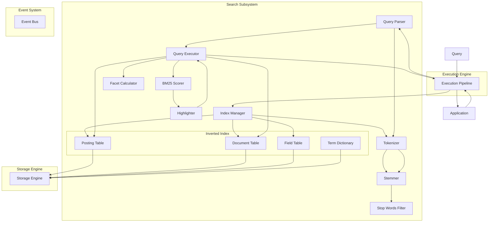
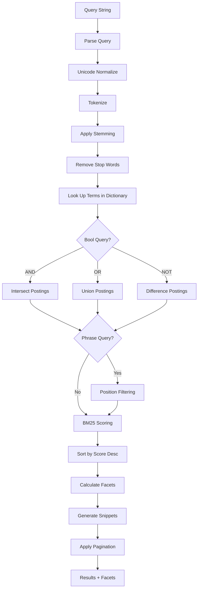
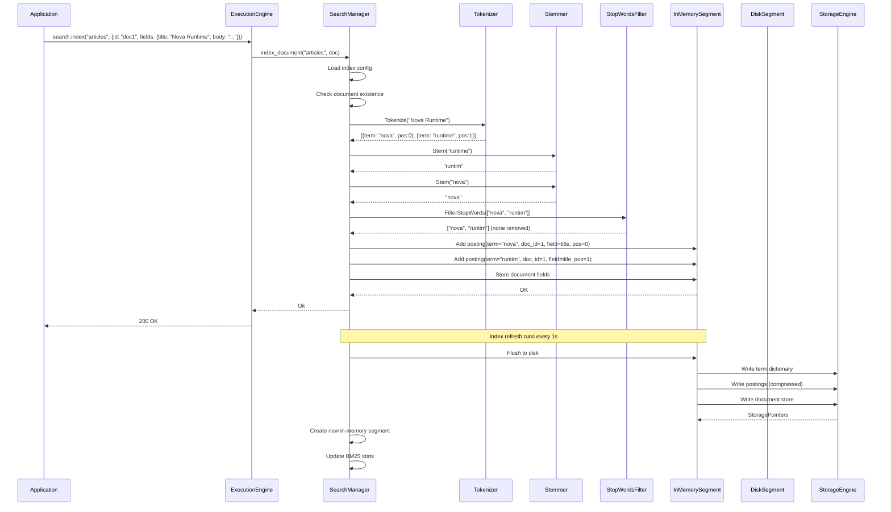
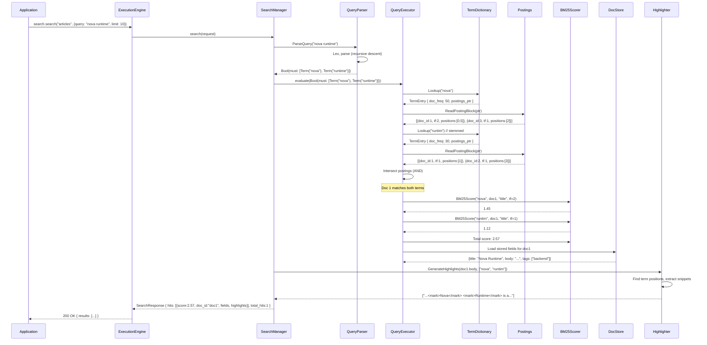
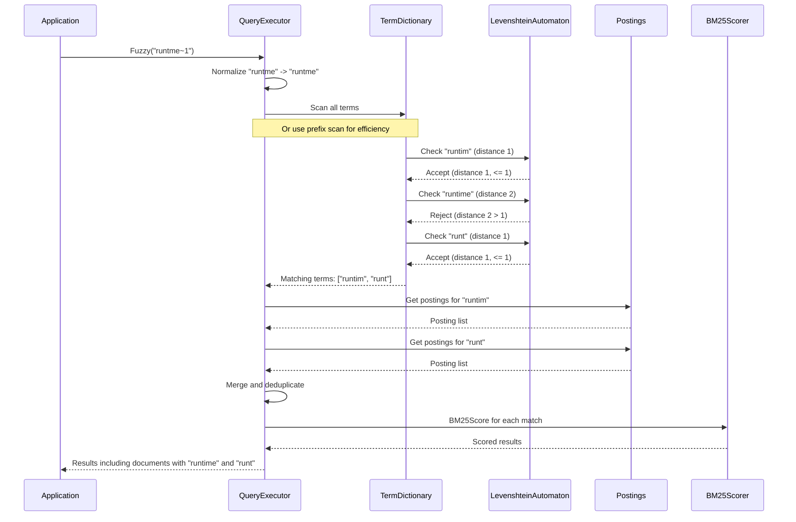
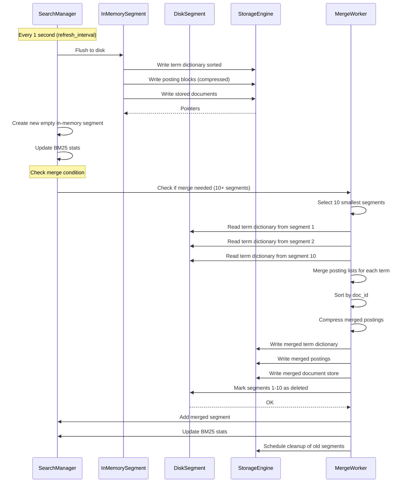

# 19. Search Subsystem

## 1. Purpose

The Search subsystem provides full-text search capabilities over documents stored within Nova Runtime. It enables applications to index structured and unstructured content, execute rich search queries (boolean, phrase, fuzzy, prefix, faceted), and retrieve ranked results. The inverted index is stored natively within the Storage Engine, eliminating the need for an external search service like Elasticsearch or Solr.

## 2. Scope

This document covers the complete search subsystem:

- Full-text search over indexed documents
- Inverted index structure stored in Storage Engine
- Tokenization (language-aware, Unicode normalized)
- Stemming (Porter stemmer for English)
- Stop words (configurable per index)
- Scoring algorithm (BM25)
- Boolean search (AND, OR, NOT)
- Phrase search (exact phrase matching)
- Prefix search (word prefix completion)
- Fuzzy search (Levenshtein distance up to 2)
- Faceted search (aggregation by field values)
- Result highlighting (snippets with matched terms)
- Pagination with deep pagination limits (max 10,000 results)
- Index updates (near-real-time with 1s refresh interval)
- Index storage mapping in Storage Engine
- Query parsing and execution flow

Out of scope: Vector search/embeddings (future), semantic search (future), cross-lingual search (future), spell checking/suggestion (future), custom scoring beyond BM25 (future), real-time indexing with sub-second latency (future).

## 3. Responsibilities

- Accept documents for indexing and maintain the inverted index
- Process search queries and return ranked results
- Tokenize text with language-aware, Unicode-normalized tokenization
- Apply stemming for English-language text
- Implement BM25 scoring for relevance ranking
- Support boolean operators (AND, OR, NOT) in queries
- Support exact phrase matching
- Support prefix queries (prefix*)
- Support fuzzy queries (term~N, N=1 or 2)
- Support faceted aggregation
- Generate highlighted result snippets
- Enforce pagination limits (max 10,000 results)
- Manage the inverted index within the Storage Engine
- Support index refresh with configurable interval (default 1s)
- Support field-specific indexing (include/exclude fields)

## 4. Non Responsibilities

- Vector/embedding-based semantic search (future)
- Machine-learned relevance ranking (future)
- Cross-lingual search (future)
- Spell correction and "did you mean" suggestions (future)
- Real-time search with sub-second consistency guarantees
- Full SQL text search replacement (handled by SQL Layer)
- External search engine synchronization (future)
- Document storage lifecycle (documents managed by application, not search)
- Search index replication across nodes (clustering is future)

## 5. Architecture

### 5.1 High-Level Architecture



### 5.2 Index Structure

```mermaid
graph LR
    subgraph "Document Store"
        D1[Doc 1: title, body, tags]
        D2[Doc 2: title, body, tags]
        D3[Doc 3: title, body, tags]
    end
    
    subgraph "Inverted Index"
        T1[Term: "runtime"] --> P1[Posting: Doc1, pos:[3,17]]
        T1 --> P2[Posting: Doc2, pos:[5]]
        T2[Term: "nova"] --> P3[Posting: Doc1, pos:[1]]
        T2 --> P4[Posting: Doc3, pos:[0,12]]
        T3[Term: "search"] --> P5[Posting: Doc2, pos:[2,8]]
        
        T1 --> DF1[DocFreq: 2]
        T2 --> DF2[DocFreq: 2]
        T3 --> DF3[DocFreq: 1]
    end
    
    subgraph "Term Dictionary"
        TD1["runtime" -> term_id: T1, doc_freq: 2]
        TD2["nova" -> term_id: T2, doc_freq: 2]
        TD3["search" -> term_id: T3, doc_freq: 1]
    end
```

### 5.3 Query Execution Pipeline



## 6. Data Structures

### 6.1 Index Configuration

```rust
struct IndexConfig {
    /// Index ID (UUIDv4)
    id: [u8; 16],                    // 16 bytes
    /// Index name (unique within runtime)
    name: String,                     // variable, max 256 bytes
    
    // Field configuration
    /// Fields to index (with per-field config)
    fields: Vec<IndexField>,          // variable
    
    // Tokenization settings
    /// Tokenizer type: standard, ngram, whitespace, regex
    tokenizer: TokenizerType,         // 1 byte enum
    /// Language for stemming (default: "en")
    language: String,                 // variable, max 8 bytes
    /// Whether to apply stemming
    enable_stemming: bool,            // 1 byte
    /// Custom stop words list (None = use default for language)
    stop_words: Option<Vec<String>>,  // variable
    
    // Indexing settings
    /// Refresh interval in nanoseconds (default: 1_000_000_000 = 1s)
    refresh_interval_ns: i64,        // 8 bytes
    /// Merge factor for segment merging (default: 10)
    merge_factor: u32,               // 4 bytes
    /// Maximum segment size before merge (default: 5_242_880 = 5 MB)
    max_segment_size: u64,           // 8 bytes
    
    // Search settings
    /// Default field weights for BM25 scoring
    field_weights: HashMap<String, f64>, // variable
    /// BM25 k1 parameter (default: 1.2)
    bm25_k1: f64,                    // 8 bytes
    /// BM25 b parameter (default: 0.75)
    bm25_b: f64,                     // 8 bytes
    /// Max results per query (default: 100, max: 10000)
    max_results: u32,                // 4 bytes
    
    // Facet configuration
    /// Fields available for faceting
    facet_fields: Vec<String>,       // variable
    
    // Storage
    /// Storage Engine partition for this index
    storage_partition: u64,          // 8 bytes
    
    // Timestamps
    created_at: i64,                 // 8 bytes
    updated_at: i64,                 // 8 bytes
}

struct IndexField {
    /// Field name (e.g., "title", "body", "tags")
    name: String,                    // variable, max 256 bytes
    /// Field type: text, keyword, integer, float, boolean, date
    field_type: FieldType,           // 1 byte enum
    /// Whether this field is indexed (searchable)
    indexed: bool,                   // 1 byte
    /// Whether this field is stored (retrievable)
    stored: bool,                    // 1 byte
    /// Whether facets can be computed on this field
    facet: bool,                     // 1 byte
    /// Weight for BM25 scoring (default: 1.0)
    weight: f64,                     // 8 bytes
    /// Analyzer for this field (overrides global)
    analyzer: Option<String>,        // variable, max 32 bytes
}
```

### 6.2 Document

```rust
struct IndexedDocument {
    /// Document ID (user-provided)
    doc_id: String,                   // variable, max 1024 bytes
    /// Index ID
    index_id: [u8; 16],             // 16 bytes
    
    /// Document fields
    fields: HashMap<String, FieldValue>, // variable
    
    /// Document-level boost (default: 1.0)
    boost: f64,                      // 8 bytes
    
    /// Document timestamp (Unix nanoseconds)
    timestamp: i64,                  // 8 bytes
    
    /// Storage Engine record version
    version: u64,                    // 8 bytes
}

enum FieldValue {
    Text(String),
    Keyword(String),
    Integer(i64),
    Float(f64),
    Boolean(bool),
    Date(i64),          // Unix nanoseconds
    Array(Vec<FieldValue>),
    Null,
}
```

### 6.3 Inverted Index - Term Dictionary

```rust
/// Stored as records in Storage Engine.
/// Key: (index_id, term)
/// Value: TermEntry
struct TermEntry {
    /// The normalized term
    term: String,                     // variable
    
    /// Term frequency across all documents (for IDF)
    doc_frequency: u64,              // 8 bytes
    /// Total occurrences across all documents (for collection stats)
    total_term_frequency: u64,       // 8 bytes
    
    /// Pointer to first posting block in Storage Engine
    posting_block_start: StoragePointer, // 16 bytes
    /// Number of posting blocks
    posting_block_count: u64,        // 8 bytes
    
    /// Field-level statistics
    field_stats: HashMap<String, FieldTermStats>, // variable
}

struct FieldTermStats {
    doc_frequency: u64,              // 8 bytes
    total_term_frequency: u64,       // 8 bytes
}

struct StoragePointer {
    partition: u64,                  // 8 bytes
    offset: u64,                     // 8 bytes
    length: u64,                     // 8 bytes
}
// Total: 24 bytes per pointer
```

### 6.4 Inverted Index - Postings

```rust
/// Each posting represents one occurrence of a term in a document.
/// Stored in blocks (compressed) in Storage Engine.
struct Posting {
    /// Document ID (internal sequential ID)
    doc_internal_id: u64,            // 8 bytes (varint encoded)
    /// Term frequency in this document
    term_frequency: u32,             // 4 bytes (varint encoded)
    /// Positions within the field (for phrase queries)
    positions: Vec<u32>,             // variable (each varint encoded)
    /// Field ID (reference to which field this term appears in)
    field_id: u16,                   // 2 bytes
}

/// A block of postings, stored contiguously
struct PostingBlock {
    /// Block header
    doc_count: u32,                  // 4 bytes
    /// Base doc ID (for delta encoding)
    base_doc_id: u64,               // 8 bytes
    
    /// Compressed posting data
    /// Format: Run of (doc_delta, term_frequency, position_count, positions...)
    ///   doc_delta: varint (difference from previous doc ID)
    ///   term_frequency: varint
    ///   position_count: varint
    ///   positions: varint array of length position_count
    compressed_data: Vec<u8>,        // variable
}
// Typical block size: 4-16 KB after compression
```

### 6.5 Document Store

```rust
/// Stores original document fields for retrieval.
/// Key: (index_id, doc_internal_id)
/// Value: StoredDocument
struct StoredDocument {
    /// Internal document ID (sequential, assigned by index)
    doc_internal_id: u64,            // 8 bytes
    /// User-provided document ID
    doc_id: String,                  // variable, max 1024 bytes
    
    /// Stored fields (field_id -> value bytes)
    stored_fields: HashMap<u16, Vec<u8>>, // variable
    
    /// Document boost
    boost: f64,                      // 8 bytes
    
    /// Timestamp (Unix nanoseconds)
    timestamp: i64,                  // 8 bytes
    
    /// Total length of all indexed text fields (for BM25 normalization)
    total_field_length: u64,         // 8 bytes
}
```

### 6.6 Segment (for Near-Real-Time Indexing)

```rust
/// The index is composed of segments. New documents go into
/// a new in-memory segment, which is periodically flushed to disk.
/// Segments are merged in the background.

struct IndexSegment {
    /// Segment ID
    id: u64,                         // 8 bytes
    /// Segment state: memory, flushing, disk, merging
    state: SegmentState,             // 1 byte enum
    
    /// In-memory term dictionary (for active segment)
    term_dict: HashMap<String, InMemoryPostingList>, // variable
    
    /// In-memory document store
    doc_store: HashMap<u64, StoredDocument>, // variable
    
    /// Current max internal doc ID
    max_doc_id: u64,                 // 8 bytes
    
    /// Segment size in bytes (approximate)
    size_bytes: u64,                 // 8 bytes
    
    /// Creation timestamp (Unix nanoseconds)
    created_at: i64,                 // 8 bytes
    
    /// Last flush timestamp (Unix nanoseconds)
    flushed_at: Option<i64>,         // 8 bytes
    
    /// Storage Engine references (after flush)
    storage_refs: SegmentStorageRefs, // variable
}

struct InMemoryPostingList {
    /// Term
    term: String,                    // variable
    /// Doc frequency (in this segment)
    doc_freq: u64,                   // 8 bytes
    /// Total term frequency (in this segment)
    total_term_freq: u64,            // 8 bytes
    /// Postings (doc_id -> Posting)
    postings: Vec<Posting>,          // variable
}

struct SegmentStorageRefs {
    /// Pointer to term dictionary storage
    term_dict_ptr: StoragePointer,   // 24 bytes
    /// Pointer to postings storage
    postings_ptr: StoragePointer,    // 24 bytes
    /// Pointer to document store storage
    doc_store_ptr: StoragePointer,   // 24 bytes
}
```

### 6.7 Query Representation

```rust
enum Query {
    /// Match all documents
    MatchAll,
    /// Match a single term
    Term {
        field: Option<String>,
        value: String,
        boost: f64,
    },
    /// Phrase query: "hello world"
    Phrase {
        field: Option<String>,
        terms: Vec<String>,
        slop: u32,          // word distance tolerance (default: 0)
    },
    /// Prefix query: "hel*"
    Prefix {
        field: Option<String>,
        prefix: String,
    },
    /// Fuzzy query: "helo~1"
    Fuzzy {
        field: Option<String>,
        term: String,
        max_distance: u8,   // 1 or 2
    },
    /// Boolean combination
    Bool {
        must: Vec<Query>,      // AND
        should: Vec<Query>,    // OR
        must_not: Vec<Query>,  // NOT
    },
    /// Range query
    Range {
        field: String,
        lower: Option<FieldValue>,
        upper: Option<FieldValue>,
        inclusive_lower: bool,
        inclusive_upper: bool,
    },
    /// Facet query (request aggregation)
    Facet {
        field: String,
        size: u32,
    },
}

struct SearchRequest {
    /// Index name
    index: String,
    /// Query string (query DSL or simple string)
    query: Option<String>,
    /// Structured query (for programmatic use)
    structured_query: Option<Query>,
    
    /// Pagination
    offset: u32,             // default: 0, max: 9900
    limit: u32,              // default: 10, max: 100
    
    /// Fields to return
    fields: Option<Vec<String>>,
    
    /// Facet requests
    facets: Option<Vec<String>>,
    
    /// Whether to generate highlights
    highlight: bool,
    /// Highlight field configuration
    highlight_fields: Option<Vec<String>>,
    /// Highlight snippet size in characters
    highlight_snippet_size: u32,  // default: 150
    /// Number of snippets per field
    highlight_snippets: u32,      // default: 3
    /// Highlight tag (pre)
    highlight_pre_tag: Option<String>,   // default: "<mark>"
    /// Highlight tag (post)
    highlight_post_tag: Option<String>,  // default: "</mark>"
    
    /// Minimum score threshold (0.0 = no threshold)
    min_score: Option<f64>,
}

struct SearchResponse {
    /// Total hits (capped at 10000)
    total_hits: u64,
    /// Time to execute query in nanoseconds
    took_ns: i64,
    /// Maximum score
    max_score: f64,
    /// Results
    hits: Vec<SearchHit>,
    /// Facet results
    facets: Option<HashMap<String, FacetResult>>,
}

struct SearchHit {
    /// Score
    score: f64,
    /// Document ID
    doc_id: String,
    /// Document fields (only requested/stored fields)
    fields: HashMap<String, FieldValue>,
    /// Highlights (field -> snippets)
    highlights: Option<HashMap<String, Vec<String>>>,
}

struct FacetResult {
    field: String,
    total: u64,
    // For text/keyword facets
    terms: Option<Vec<FacetTerm>>,
    // For numeric/date facets
    ranges: Option<Vec<FacetRange>>,
}

struct FacetTerm {
    value: String,
    count: u64,
}

struct FacetRange {
    from: Option<FieldValue>,
    to: Option<FieldValue>,
    count: u64,
}
```

### 6.8 BM25 Statistics

```rust
/// Per-index statistics for BM25 scoring.
/// Stored in Storage Engine and cached in memory.
struct Bm25Stats {
    /// Total number of documents in the index
    total_docs: u64,                 // 8 bytes
    /// Average field length (across all indexed text fields)
    avg_field_length: f64,           // 8 bytes
    
    /// Per-field statistics
    field_stats: HashMap<String, FieldBm25Stats>, // variable
}

struct FieldBm25Stats {
    /// Number of documents with this field
    doc_count: u64,                  // 8 bytes
    /// Average length of this field
    avg_field_length: f64,           // 8 bytes
    /// Sum of total term frequencies for this field
    total_terms: u64,               // 8 bytes
}
```

## 7. Algorithms

### 7.1 Tokenization

```
Algorithm: Tokenize
Input:
  - text: String
  - language: String (default: "en")
  - tokenizer_type: TokenizerType (default: Standard)

Output:
  - tokens: Vec<Token>

Token struct:
  - term: String (normalized)
  - start_offset: u32 (character offset in original text)
  - end_offset: u32
  - position: u32 (word position in document)

Steps (Standard tokenizer):
  1. Unicode normalize text to NFC form:
     text = text.nfc_normalize()
  
  2. Convert to lowercase (Unicode-aware):
     text = text.to_lowercase()
  
  3. Split into tokens using Unicode Text Segmentation
     (UAX #29 Word Boundaries):
     tokens = []
     For each word boundary segment in text:
       If segment matches [\p{L}\p{N}_]+  (letters, digits, underscore):
         tokens.push(Token {
           term: segment,
           start_offset: segment.start,
           end_offset: segment.end,
           position: tokens.len(),
         })
  
  4. Apply language-specific tokenization rules:
     If language == "en":
       - Split contractions: "don't" -> ["don", "t"]
       - Handle possessive: "john's" -> ["john"]
     If language == "de":
       - Compound splitting (future)
     If language == "ja":
       - Use n-gram tokenizer instead (character bigrams)
     If language == "zh":
       - Use n-gram tokenizer (character unigrams and bigrams)

  5. Return tokens

Steps (N-gram tokenizer):
  1. NFC normalize and lowercase (same as standard)
  2. Remove all non-letter characters
  3. Generate n-grams:
     For n in [2, 3]:
       For i in 0..(text.len() - n):
         tokens.push(text[i..i+n])
  4. Return tokens

Steps (Whitespace tokenizer):
  1. NFC normalize (but keep case)
  2. Split on whitespace characters
  3. Return each segment as a token (no filtering)
```

### 7.2 Stemming (Porter Stemmer)

```
Algorithm: Stem (English Porter Stemmer)
Input:
  - word: String

Output:
  - stem: String

Steps:
  // This is a summary of the Porter Stemmer algorithm.
  // Complete implementation follows Porter (1980).

  1. If word.len() < 3: return word

  2. Define:
     - consonant pattern: [^aeiou] optionally followed by 'y' at start
     - vowel pattern: [aeiou]
     - measure(m) = number of VC (vowel-consonant) repetitions
     - *S = ends with S, *D = ends with double consonant, *o = ends cvc

  3. Step 1a:
     Replace suffixes:
       "sses" -> "ss"
       "ies" -> "i" (if more than one letter before)
       "ss" -> "ss"
       "s" -> "" (if preceded by a vowel)

  4. Step 1b:
     If ends with "eed":
       Replace with "ee" if measure > 0
     If ends with "ed":
       Delete if preceded by vowel
       Then: "at" -> "ate", "bl" -> "ble", "iz" -> "ize"
             Double final consonant if short word
     If ends with "ing":
       Delete if preceded by vowel
       Then: same transformations as "ed"

  5. Step 1c:
     Replace trailing "y" with "i" if preceded by consonant

  6. Step 2 (double suffix):
     If measure > 0:
       Replace: "ational" -> "ate", "tional" -> "tion",
                "enci" -> "ence", "anci" -> "ance",
                "izer" -> "ize", "abli" -> "able",
                "alli" -> "al", "entli" -> "ent",
                "eli" -> "e", "ousli" -> "ous",
                "ization" -> "ize", "ation" -> "ate",
                "ator" -> "ate", "alism" -> "al",
                "iveness" -> "ive", "fulness" -> "ful",
                "ousness" -> "ous", "aliti" -> "al",
                "iviti" -> "ive", "biliti" -> "ble"

  7. Step 3:
     If measure > 0:
       Replace: "icate" -> "ic", "ative" -> "",
                "alize" -> "al", "iciti" -> "ic",
                "ical" -> "ic", "ful" -> "",
                "ness" -> ""

  8. Step 4:
     If measure > 1:
       Replace: "al" -> "", "ance" -> "", "ence" -> "",
                "er" -> "", "ic" -> "", "able" -> "",
                "ible" -> "", "ant" -> "", "ement" -> "",
                "ment" -> "", "ent" -> "", "ism" -> "",
                "ate" -> "", "iti" -> "", "ous" -> "",
                "ive" -> "", "ize" -> ""

  9. Step 5a:
     If measure > 1:
       Replace "e" -> ""
     If measure == 1 and not *o:
       Replace "e" -> ""

  10. Step 5b:
      If measure > 1 and *D and *L (ends with double consonant and L):
        Remove last consonant

  11. Return stem
```

### 7.3 Stop Words Filter

```
Algorithm: FilterStopWords
Input:
  - tokens: Vec<Token>
  - language: String
  - custom_stop_words: Option<HashSet<String>>

Output:
  - filtered_tokens: Vec<Token>

Default stop words (English, 179 words):
  a, about, above, after, again, against, all, am, an, and, any, are, 
  aren't, as, at, be, because, been, before, being, below, between, 
  both, but, by, can't, cannot, could, couldn't, did, didn't, do, does, 
  doesn't, doing, don't, down, during, each, few, for, from, further, 
  had, hadn't, has, hasn't, have, haven't, having, he, he'd, he'll, he's, 
  her, here, here's, hers, herself, him, himself, his, how, how's, i, 
  i'd, i'll, i'm, i've, if, in, into, is, isn't, it, it's, its, itself, 
  let's, me, more, most, mustn't, my, myself, no, nor, not, of, off, on, 
  once, only, or, other, ought, our, ours, ourselves, out, over, own, 
  same, shan't, she, she'd, she'll, she's, should, shouldn't, so, some, 
  such, than, that, that's, the, their, theirs, them, themselves, then, 
  there, there's, these, they, they'd, they'll, they're, they've, this, 
  those, through, to, too, under, until, up, very, was, wasn't, we, 
  we'd, we'll, we're, we've, were, weren't, what, what's, when, when's, 
  where, where's, which, while, who, who's, whom, why, why's, with, 
  won't, would, wouldn't, you, you'd, you'll, you're, you've, your, 
  yours, yourself, yourselves

Steps:
  1. Build stop_set:
     If custom_stop_words is Some:
       stop_set = custom_stop_words
     Else:
       stop_set = DEFAULT_STOP_WORDS[language]
  
  2. filtered = []
     For each token in tokens:
       If token.term not in stop_set:
         filtered.push(token)
  
  3. Return filtered
```

### 7.4 BM25 Scoring

```
Algorithm: BM25Score
Input:
  - term: String
  - doc: StoredDocument
  - field: String
  - term_frequency: u32 (TF of term in this doc/field)
  - stats: Bm25Stats
  - index_config: IndexConfig

Output:
  - score: f64

Constants:
  k1 = index_config.bm25_k1 (default: 1.2)
  b = index_config.bm25_b (default: 0.75)
  field_weight = index_config.field_weights.get(field).unwrap_or(1.0)

Steps:
  1. Get field statistics:
     field_stat = stats.field_stats.get(field)
     If field_stat is None:
       doc_count = 0
       avg_field_len = 0
       Return 0.0  // Field not found in any document
     
     avg_field_len = field_stat.avg_field_length
  
  2. Get document field length:
     doc_field_length = doc.get_field_length(field)
   
  3. Calculate IDF (Inverse Document Frequency):
     N = stats.total_docs          // total documents in index
     df = term_entry.doc_frequency  // documents containing term
     
     idf = log(1 + (N - df + 0.5) / (df + 0.5))
     // Smoothed IDF to prevent negative values
   
  4. Calculate term frequency normalization:
     tf = term_frequency as f64
     numerator = tf * (k1 + 1.0)
     denominator = tf + k1 * (1.0 - b + b * (doc_field_length / avg_field_len))
     tf_norm = numerator / denominator
   
  5. Calculate field score:
     score = idf * tf_norm * field_weight
   
  6. Return score
```

### 7.5 Query Parsing

```
Algorithm: ParseQuery
Input:
  - query_string: String

Output:
  - query: Query

Supported Syntax:
  Simple terms: "hello world" -> Bool(must: [Term("hello"), Term("world")])
  Phrase: `"hello world"` -> Phrase(["hello", "world"])
  Prefix: "hel*" -> Prefix("hel")
  Fuzzy: "helo~1" -> Fuzzy("helo", 1)
  Field: "title:hello" -> Term(field="title", "hello")
  AND: "hello AND world" -> Bool(must: [Term("hello"), Term("world")])
  OR: "hello OR world" -> Bool(should: [Term("hello"), Term("world")])
  NOT: "-hello" or "NOT hello" -> Bool(must_not: [Term("hello")])
  Grouping: "(hello world) AND test" -> nesting
  Range: "price:[10 TO 100]" -> Range(field="price", lower=10, upper=100)
  Facet: Not in query string; specified in SearchRequest.facets

Steps:
  1. If query_string is empty or "*":
     Return MatchAll
  
  2. Tokenize query string (aware of operators and syntax):
     tokens = query_lexer(query_string)
     // Produces: TERM, PHRASE, OPERATOR, FIELD, LPAREN, RPAREN, etc.
  
  3. Parse using recursive descent:
     parse_expression():
       // Handles OR (lowest precedence)
       left = parse_and_expression()
       While next token is "OR":
         consume("OR")
         right = parse_and_expression()
         left = Bool { should: [left, right], must: [], must_not: [] }
       Return left
     
     parse_and_expression():
       // Handles AND (medium precedence)
       left = parse_not_expression()
       While next token is "AND" or implicit AND (two terms):
         If next token is "AND": consume("AND")
         right = parse_not_expression()
         left = Bool { must: [left, right], should: [], must_not: [] }
       Return left
     
     parse_not_expression():
       // Handles NOT (unary prefix)
       If next token is "NOT" or "-":
         consume()
         operand = parse_primary()
         Return Bool { must: [], should: [], must_not: [operand] }
       Return parse_primary()
     
     parse_primary():
       If next token is LPAREN:
         consume("(")
         expr = parse_expression()
         consume(")")
         Return expr
       If next token is FIELD:
         field = consume().value
         consume(":")
         term = parse_primary_term()
         Apply field to term
         Return term
       Return parse_primary_term()
     
     parse_primary_term():
       If next token is PHRASE:
         return Phrase { terms: consume().value, slop: 0 }
       If next token is TERM with trailing "*":
         return Prefix { prefix: term.trim_end_matches('*') }
       If next token is TERM with "~N":
         parts = term.split('~')
         return Fuzzy { term: parts[0], max_distance: parts[1] }
       If next token is TERM:
         return Term { value: consume().value }
       If next token is RANGE:
         return parse_range()
  
  4. Apply default operator:
     If query has no explicit bool operators:
       Default operator is AND (configurable to OR)
       Insert implicit AND between adjacent term queries
     
     Example: "hello world" -> Bool(must: [Term("hello"), Term("world")])
  
  5. Return parsed Query
```

### 7.6 Query Execution

```
Algorithm: ExecuteQuery
Input:
  - query: Query
  - index_id: UUID
  - offset: u32 (max 9900)
  - limit: u32 (max 100)
  - current_time: i64

Output:
  - results: Vec<(doc_id, score, fields, highlights)>
  - total_hits: u64
  - facets: HashMap<String, FacetResult>

Steps:
  1. Load IndexConfig and BM25 stats
     If index not found, return Err(IndexNotFound)
  
  2. Evaluate query recursively:
     fn evaluate(query: Query, index: &Index) -> Vec<(doc_id, score)>:
       Match query:
         MatchAll -> return all documents with score = 1.0
         
         Term { field, value, boost } ->
           term = normalize(value)
           postings = lookup_term(term)
           For each posting:
             score = BM25Score(term, doc, field, posting.tf, stats)
             score *= boost
             Add (doc_id, score)
           Return results (sorted)
         
         Phrase { field, terms, slop } ->
           For each term, get postings with positions
           Find documents where all terms appear with:
             positions[i+1] - positions[i] <= 1 + slop
           Score = sum of individual term BM25 scores
           Return matching docs
         
         Prefix { field, prefix } ->
           normalized_prefix = normalize(prefix)
           Search term dictionary for terms starting with prefix
           For each matching term, get postings and score
           Deduplicate documents (higher score wins)
           Return results
         
         Fuzzy { field, term, max_distance } ->
           normalized_term = normalize(term)
           Search term dictionary for terms within Levenshtein distance
           For each matching term, get postings and score
           Deduplicate (higher score wins)
           Return results
         
         Bool { must, should, must_not } ->
           // Must clauses (AND): intersect
           If must is non-empty:
             results = evaluate(must[0])
             For each remaining must clause:
               other = evaluate(clause)
               results = intersect(results, other) // AND semantics
           Else:
             results = empty
           
           // Should clauses (OR): union
           If should is non-empty:
             should_results = union(evaluate(should[0]), evaluate(should[1:]))
             If no must clauses:
               results = should_results
             Else:
               // Boost documents matching should clauses
               For each doc in results:
                 If doc in should_results:
                   results[doc].score += should_results[doc].score * 0.1
           
           // Must not clauses (NOT): exclude
           If must_not is non-empty:
             exclude_set = union of all must_not clause results
             results = difference(results, exclude_set)
           
           Return results
         
         Range { field, lower, upper, inclusive } ->
           Iterate over documents in field range
           Match documents where field value in range
           Score = 1.0 (no TF-IDF for range)
           Return results
  
  3. Collect total_hits:
     total = results.len()
     capped_total = min(total, 10000)
  
  4. Sort results by score descending:
     results.sort_by(|a, b| b.score.cmp(&a.score))
  
  5. Apply offset and limit:
     If offset >= results.len() or offset >= 10000:
       Return empty result set
     paged = results[offset..min(offset+limit, results.len())]
  
  6. Load stored fields for paged results:
     For each (doc_id, _) in paged:
       doc = load_stored_document(doc_id)
       Extract requested fields
  
  7. Generate highlights (if requested):
     For each result:
       For each highlight field:
         Find matched terms in original text
         Extract snippets around matched terms
         Wrap matched terms in highlight tags
  
  8. Calculate facets (if requested):
     For each facet field:
       Collect all values across result set
       Count occurrences
       Sort by count descending
       Take top N (default: 10)
  
  9. Return (paged_results, capped_total, facets)
```

### 7.7 Levenshtein Distance (for Fuzzy Search)

```
Algorithm: LevenshteinDistance
Input:
  - s1: String
  - s2: String

Output:
  - distance: u32

Steps:
  1. Let m = s1.len(), n = s2.len()
  
  2. If m == 0: return n
     If n == 0: return m
  
  3. If |m - n| > 2 and we only care about distance <= 2:
     Return early: distance > 2 (optimization)
  
  4. Initialize dp as [0..=n]
  
  5. For i in 1..=m:
     prev = dp[0]
     dp[0] = i
     For j in 1..=n:
       temp = dp[j]
       cost = if s1[i-1] == s2[j-1] then 0 else 1
       dp[j] = min(
         dp[j] + 1,      // deletion
         dp[j-1] + 1,    // insertion
         prev + cost     // substitution
       )
       prev = temp
  
  6. Return dp[n]

// For fuzzy search with max_distance:
// - Generate all terms within distance from term dictionary
// - Use LevenshteinAutomaton for efficient dictionary traversal
// - Pre-filter by length (|len(s1) - len(s2)| <= max_distance)
```

### 7.8 Levenshtein Automaton (for Fuzzy Dictionary Traversal)

```
Algorithm: FuzzyTermSearch
Input:
  - term: String (normalized query term)
  - max_distance: u8 (1 or 2)
  - term_dictionary: Iterator<String> (sorted)

Output:
  - matching_terms: Vec<(String, u8)>  // (term, distance)

Steps:
  1. Build Levenshtein Automaton:
     - States are (position, distance) pairs
     - Initial state: (0, 0)
     - Transition on character c: (pos+1, dist) if s[pos]==c
     - Transition on any character (substitution): (pos+1, dist+1)
     - Transition on epsilon (insertion): (pos, dist+1)
     - Transition on epsilon (deletion): (pos+1, dist+1)
     - Accepting state: position == |term| and distance <= max_distance
  
  2. Convert NFA to DFA (powerset construction)
     - Precompute for common term lengths
     - Cache DFA for reuse
  
  3. For each term in dictionary (using sorted iterator):
     If |term| - |query_term| > max_distance:
       Continue (too short or too long)
     
     Run term through DFA
     If DFA accepts:
       actual_distance = LevenshteinDistance(term, query_term)
       If actual_distance <= max_distance:
         matching_terms.push((term, actual_distance))
  
  4. Return matching terms
```

### 7.9 Highlight Generation

```
Algorithm: GenerateHighlights
Input:
  - document_text: String (original field value)
  - matched_terms: Vec<String> (normalized, stemmed matched terms)
  - pre_tag: String (default: "<mark>")
  - post_tag: String (default: "</mark>")
  - snippet_size: u32 (default: 150 characters)
  - max_snippets: u32 (default: 3)

Output:
  - snippets: Vec<String>

Steps:
  1. Tokenize document_text to find term positions
     For each token, compute normalized + stemmed form
  
  2. Find matching token positions:
     match_positions = []
     For i, token in enumerate(tokens):
       If stem(normalize(token.text)) in matched_terms:
         match_positions.push(i)
  
  3. If no matches, return first snippet_size chars
  
  4. Cluster nearby matches into snippet windows:
     snippets = []
     current_window = []
     For pos in match_positions:
       If current_window is empty:
         current_window = [pos]
       Else:
         distance = token_start(pos) - token_end(current_window.last)
         If distance <= snippet_size / 2:
           // Close enough to be in same snippet
           current_window.push(pos)
         Else:
           snippets.push(build_snippet(current_window))
           current_window = [pos]
     
     If current_window is non-empty:
       snippets.push(build_snippet(current_window))
  
  5. Build snippet for each window:
     start = max(0, token_start(window[0]) - snippet_size/4)
     end = min(len, token_end(window.last) + snippet_size*3/4)
     snippet_text = document[start..end]
     
     If start > 0: prefix with "..."
     If end < len: suffix with "..."
     
     Wrap matched terms with pre_tag/post_tag in snippet
     (Case-insensitive replacement of matched terms)
  
  6. Return up to max_snippets snippets
```

### 7.10 Index Refresh

```
Algorithm: RefreshIndex
Runs: Every refresh_interval_ns (default: 1s)
Input:
  - index_id: UUID
  - current_time: i64

Steps:
  1. Acquire index write lock
  
  2. Check if in-memory segment has changes:
     If segment.doc_store.is_empty():
       Release lock and return (nothing to flush)
  
  3. Sort in-memory term dictionary:
     Convert HashMap to sorted Vec<(String, InMemoryPostingList)>
  
  4. Write term dictionary to Storage Engine:
     For each (term, posting_list):
       delta-encode doc IDs within posting list
       compress posting data (variable byte encoding or Simple8b)
       Write block to Storage Engine
       Record StoragePointer
  
  5. Write document store to Storage Engine:
     For each (doc_id, stored_doc):
       Serialize stored fields
       Write to Storage Engine
       Record StoragePointer
  
  6. Add segment to index:
     segment.state = Disk
     segment.flushed_at = current_time
     segment.size_bytes = total bytes written
     segment.storage_refs = pointer set
     Add segment to committed segments list
  
  7. Create new in-memory segment:
     old_segment = current_segment
     current_segment = IndexSegment { id: next_id, ..default() }
  
  8. Release write lock
  
  9. Update BM25 stats:
     Recalculate avg_field_length, total_docs
     Store updated stats in Storage Engine
  
  10. If total segments > merge_factor (10):
      Trigger background merge
```

### 7.11 Segment Merge

```
Algorithm: MergeSegments
Input:
  - index_id: UUID

Steps:
  1. Acquire merge lock (or skip if merge already in progress)
  
  2. Select segments to merge:
     Find the smallest K segments where K >= merge_factor (10) OR
     Find any consecutive segments that can be merged without exceeding max_segment_size
     
     If no suitable segments, return
  
  3. Create merged segment:
     new_segment = IndexSegment { state: Merging, ..default() }
  
  4. Merge term dictionaries:
     For each term appearing in any source segment:
       a. Collect all postings from all source segments
       b. Merge posting lists (union of doc sets, sum of term frequencies)
       c. Sort by doc ID
       d. Compress and write to Storage Engine
       e. Update doc_frequency and total_term_frequency
  
  5. Merge document stores:
     For each doc_id appearing in any source segment:
       a. If doc appears in multiple segments, keep latest version (by timestamp)
       b. Serialize and write to Storage Engine
  
  6. Update BM25 stats:
     Recalculate averages for merged segment
  
  7. Remove source segments:
     For each source segment:
       a. Mark as deleted
       b. Remove from committed segments list
       c. Schedule Storage Engine deletion (background)
  
  8. Add merged segment to committed segments list:
     new_segment.state = Disk
     new_segment.flushed_at = current_time
  
  9. Release merge lock
```

### 7.12 Document Indexing

```
Algorithm: IndexDocument
Input:
  - index_id: UUID
  - doc: IndexedDocument
  - current_time: i64

Output:
  - success: bool

Steps:
  1. Load IndexConfig
     If not found, return Err(IndexNotFound)
  
  2. Validate document:
     Check doc_id uniqueness (if duplicate, this is an update)
     Check field types match index config
     If doc_id exists: remove old document first
  
  3. Get or create internal doc ID:
     If new: assign next sequential ID from segment
     If update: reuse existing internal ID
  
  4. Tokenize and index each field:
     For each (field_name, field_value) in doc.fields:
       field_config = IndexConfig.fields.find(field_name)
       If field_config is None or not field_config.indexed:
         Continue (skip non-indexed fields)
       
       If field_config.field_type == Text:
         tokens = Tokenize(field_value.as_text(), language, tokenizer)
         tokens = ApplyStemming(tokens, language)
         tokens = FilterStopWords(tokens, language, stop_words)
         
         For each token:
           Add posting to in-memory segment:
             term = token.term
             In segment.term_dict:
               If term not present, create InMemoryPostingList
               Add posting: (doc_internal_id, field_id, token.position)
               Increment term_frequency
               Increment doc_frequency if new doc for this term
       
       Else if field_config.field_type == Keyword || field_config.facet:
         // Index as single token (no tokenization)
         Tokenize as single token (the entire value)
         Add posting with position 0
       
       Else if field_config.field_type is numeric:
         // Store for range queries
         Add to numeric index (B-tree in Storage Engine)
     
     If field_config.stored:
       Add to segment.doc_store
  
  5. Update segment statistics:
     Increment total_field_length for each indexed field
     Update segment.max_doc_id
     segment.size_bytes += doc serialized size
  
  6. If segment size > max_segment_size or memory threshold exceeded:
     Trigger immediate refresh
  
  7. Return true
```

## 8. Interfaces

### 8.1 Search Manager

```rust
struct SearchManager {
    storage: Arc<StorageEngine>,
    event_bus: Arc<EventBus>,
    indexes: HashMap<[u8; 16], Arc<Index>>,
    config: SearchConfig,
}

impl SearchManager {
    fn new(
        storage: Arc<StorageEngine>,
        event_bus: Arc<EventBus>,
        config: SearchConfig,
    ) -> Self;
    
    // Index management
    fn create_index(&self, request: CreateIndexRequest) -> Result<IndexConfig, SearchError>;
    fn get_index(&self, index_id: &[u8; 16]) -> Result<IndexConfig, SearchError>;
    fn get_index_by_name(&self, name: &str) -> Result<IndexConfig, SearchError>;
    fn update_index(&self, index_id: &[u8; 16], updates: UpdateIndexRequest) -> Result<IndexConfig, SearchError>;
    fn delete_index(&self, index_id: &[u8; 16]) -> Result<(), SearchError>;
    fn list_indexes(&self) -> Result<Vec<IndexConfig>, SearchError>;
    
    // Document indexing
    fn index_document(&self, index_name: &str, doc: IndexedDocument) -> Result<(), SearchError>;
    fn index_documents_batch(&self, index_name: &str, docs: Vec<IndexedDocument>) -> Result<u64, SearchError>;
    fn delete_document(&self, index_name: &str, doc_id: &str) -> Result<(), SearchError>;
    fn get_document(&self, index_name: &str, doc_id: &str) -> Result<Option<IndexedDocument>, SearchError>;
    
    // Search
    fn search(&self, request: SearchRequest) -> Result<SearchResponse, SearchError>;
    
    // Index maintenance
    fn refresh_index(&self, index_name: &str) -> Result<(), SearchError>;
    fn force_merge(&self, index_name: &str) -> Result<(), SearchError>;
    fn get_index_stats(&self, index_name: &str) -> Result<IndexStats, SearchError>;
    
    // Analyzer
    fn analyze(&self, index_name: &str, text: &str) -> Result<AnalysisResult, SearchError>;
    // Returns the tokens that would be generated for a given text
}

struct CreateIndexRequest {
    pub name: String,
    pub fields: Vec<IndexField>,
    pub tokenizer: Option<TokenizerType>,
    pub language: Option<String>,
    pub enable_stemming: Option<bool>,
    pub stop_words: Option<Vec<String>>,
    pub refresh_interval_ms: Option<u64>,
    pub bm25_k1: Option<f64>,
    pub bm25_b: Option<f64>,
    pub field_weights: Option<HashMap<String, f64>>,
    pub facet_fields: Option<Vec<String>>,
}

struct UpdateIndexRequest {
    pub fields: Option<Vec<IndexField>>,
    pub tokenizer: Option<TokenizerType>,
    pub language: Option<String>,
    pub enable_stemming: Option<bool>,
    pub stop_words: Option<Vec<String>>,
    pub refresh_interval_ms: Option<u64>,
    pub bm25_k1: Option<f64>,
    pub bm25_b: Option<f64>,
    pub field_weights: Option<HashMap<String, f64>>,
    pub facet_fields: Option<Vec<String>>,
}

struct IndexStats {
    pub index_name: String,
    pub num_docs: u64,
    pub num_segments: u32,
    pub index_size_bytes: u64,
    pub term_count: u64,
    pub avg_doc_length: f64,
    pub last_refresh_at: Option<i64>,
    pub is_merging: bool,
}

struct AnalysisResult {
    pub tokens: Vec<AnalyzedToken>,
    pub stemmed_terms: Vec<String>,
    pub filtered_terms: Vec<String>,
}

struct AnalyzedToken {
    pub term: String,
    pub stem: String,
    pub is_stop_word: bool,
}
```

### 8.2 Execution Engine Search Extension

```rust
impl ExecutionEngine {
    fn search_index(&self, ctx: &ExecutionContext, params: SearchParams) -> Result<Value, RuntimeError>;
    fn index_document(&self, ctx: &ExecutionContext, params: IndexDocParams) -> Result<Value, RuntimeError>;
    fn delete_indexed_doc(&self, ctx: &ExecutionContext, params: DeleteDocParams) -> Result<Value, RuntimeError>;
    fn create_search_index(&self, ctx: &ExecutionContext, params: CreateIndexParams) -> Result<Value, RuntimeError>;
}

struct SearchParams {
    pub index: String,
    pub query: String,
    pub offset: Option<u32>,
    pub limit: Option<u32>,
    pub fields: Option<Vec<String>>,
    pub facets: Option<Vec<String>>,
    pub highlight: Option<bool>,
}

struct IndexDocParams {
    pub index: String,
    pub doc_id: String,
    pub fields: HashMap<String, Value>,
    pub boost: Option<f64>,
}
```

### 8.3 Storage Engine Interface (Internal)

```rust
impl StorageEngine {
    // Term dictionary access
    fn read_term_entry(&self, index_id: &[u8; 16], term: &str) -> Result<Option<TermEntry>, StorageError>;
    fn write_term_entry(&self, entry: TermEntry) -> Result<(), StorageError>;
    fn scan_terms_by_prefix(&self, index_id: &[u8; 16], prefix: &str, limit: u64) -> Result<Vec<TermEntry>, StorageError>;
    fn scan_all_terms(&self, index_id: &[u8; 16]) -> Result<Vec<TermEntry>, StorageError>;
    
    // Postings access
    fn read_posting_block(&self, ptr: &StoragePointer) -> Result<PostingBlock, StorageError>;
    fn write_posting_block(&self, index_id: &[u8; 16], block: &PostingBlock) -> Result<StoragePointer, StorageError>;
    fn delete_posting_block(&self, ptr: &StoragePointer) -> Result<(), StorageError>;
    
    // Document store access
    fn read_stored_document(&self, index_id: &[u8; 16], doc_internal_id: u64) -> Result<Option<StoredDocument>, StorageError>;
    fn write_stored_document(&self, index_id: &[u8; 16], doc: &StoredDocument) -> Result<(), StorageError>;
    fn delete_stored_document(&self, index_id: &[u8; 16], doc_internal_id: u64) -> Result<(), StorageError>;
    
    // BM25 stats
    fn read_bm25_stats(&self, index_id: &[u8; 16]) -> Result<Option<Bm25Stats>, StorageError>;
    fn write_bm25_stats(&self, index_id: &[u8; 16], stats: &Bm25Stats) -> Result<(), StorageError>;
    
    // Segment metadata
    fn read_segment_metadata(&self, index_id: &[u8; 16]) -> Result<Vec<IndexSegment>, StorageError>;
    fn write_segment_metadata(&self, index_id: &[u8; 16], segments: &[IndexSegment]) -> Result<(), StorageError>;
}
```

### 8.4 Error Types

```rust
enum SearchError {
    // Index errors
    IndexNotFound(String),
    IndexAlreadyExists(String),
    InvalidFieldConfiguration(String),
    
    // Document errors
    DocumentNotFound,
    DocumentAlreadyExists,
    DocumentTooLarge(u64),
    InvalidFieldValue(String),
    
    // Query errors
    InvalidQuery(String),       // Parse error with details
    UnsupportedQuery(String),   // Query type not supported
    TooManyClauses(u32),        // Max clause limit exceeded
    
    // Pagination errors
    DeepPaginationExceeded,     // offset > 9900
    ResultWindowTooLarge,       // offset + limit > 10000
    
    // Search errors
    TooManyTerms(u32),          // Too many terms in query
    TooManyFacets(u32),         // Too many facet requests
    
    // Capacity errors
    IndexFull(u64),             // Max documents reached
    SegmentMergeInProgress,
    
    // Storage errors
    StorageError(String),
    
    // Internal errors
    Internal(String),
}
```

## 9. Sequence Diagrams

### 9.1 Document Indexing Flow



### 9.2 Search Query Execution



### 9.3 Fuzzy Search Flow



### 9.4 Index Refresh and Segment Merge



## 10. Failure Modes

### 10.1 Indexing Failures

| Failure | Cause | Effect |
|---------|-------|--------|
| Document too large | Field exceeds max size (16 MB) | IndexDocument returns DocumentTooLarge |
| Invalid field value | Type mismatch with index config | IndexDocument returns InvalidFieldValue |
| Index not found | Index deleted between create and index | IndexDocument returns IndexNotFound |
| In-memory segment full | Memory limit reached (512 MB) | Automatic flush to disk; indexing briefly delayed |
| Duplicate document ID | Document with same ID indexed twice | Previous document replaced (upsert semantics) |

### 10.2 Search Failures

| Failure | Cause | Effect |
|---------|-------|--------|
| Query parse error | Malformed query string | Search returns InvalidQuery error with details |
| Deep pagination exceeded | offset > 9900 | Search returns DeepPaginationExceeded |
| Too many terms | Query has > 1024 terms | Search returns TooManyTerms |
| Index not found | Search on non-existent index | Search returns IndexNotFound |
| Term dictionary corruption | Storage Engine bit rot | Term lookup returns empty; results missing |
| Segment not found | Orphaned storage pointer | Search skips missing segment; partial results |

### 10.3 Refresh/Merge Failures

| Failure | Cause | Effect |
|---------|-------|--------|
| Refresh fails | Storage Engine write error | In-memory segment retained; data not lost but not searchable |
| Merge fails | Storage Engine error during merge | Old segments retained; merge retried on next cycle |
| Merge takes too long | Very large segments (>1 GB) | Search performance degraded during merge (extra segments) |
| Merge filles up disk | Too many segments before merge consolidation | Write operations fail; searches succeed with degraded performance |

### 10.4 Consistency Failures

| Failure | Cause | Effect |
|---------|-------|--------|
| Document indexed but not yet searchable | Within refresh interval (1s) | Eventual consistency: document appears within 1s |
| Document deleted but still searchable | Within refresh interval | Document appears in results for up to 1s after deletion |
| Segment partially written | Crash during flush | Segment discarded on recovery; documents not indexed |
| BM25 stats stale | Stats not updated after merge | Scoring slightly inaccurate until stats refresh |

## 11. Recovery Strategy

### 11.1 Index Recovery

| Failure | Recovery |
|---------|---------|
| In-memory segment lost on restart | 1. All committed segments (on disk) are reloaded from Storage Engine. 2. In-memory segment is rebuilt from scratch (empty). 3. Documents indexed but not flushed before crash are lost. Applications should re-index if needed. |
| Partial segment write | 1. Segment writes are atomic (single Storage Engine write). 2. If write failed, the segment doesn't exist in the committed list. 3. No partial segment is loaded. |
| Segment metadata corruption | 1. Rebuild segment list from Storage Engine by scanning for segment markers. 2. Reconstruct BM25 stats from all found segments. 3. Report missing segments for admin investigation. |

### 11.2 Search Recovery

| Failure | Recovery |
|---------|---------|
| Term dictionary corruption | 1. Rebuild term dictionary from posting blocks (full scan). 2. Note: expensive but preserves index. 3. Admin API for index rebuild. |
| Posting block corruption | 1. Skip corrupted block, process remaining. 2. Log warning for admin. 3. Rebuild affected segment from source documents. |

### 11.3 Merge Recovery

| Failure | Recovery |
|---------|---------|
| Merge interrupted (crash) | 1. Merging segment is discarded (no committed segments reference it). 2. Source segments remain intact. 3. Merge retried on next cycle. |
| Merge disk full | 1. Merge operation fails gracefully. 2. Source segments preserved. 3. Admin alerted to free disk space. 4. Merge retried after space is available. |

## 12. Performance Considerations

### 12.1 Computational Complexity

| Operation | Complexity | Notes |
|-----------|------------|-------|
| Index document | O(T) where T = tokens | Tokenization + posting insertion |
| Search (single term) | O(log N + K) where N = terms, K = results | Dictionary lookup + scan postings |
| Search (boolean AND) | O(K1 + K2 + ...) | Intersection of posting lists |
| Search (boolean OR) | O(K1 + K2 + ...) | Union of posting lists |
| Search (phrase) | O(K + P) where P = position checks | Position list intersection |
| Search (fuzzy) | O(T_dict) worst case | Scans term dictionary |
| Search (prefix) | O(log N + M) where M = prefix matches | Dictionary prefix scan |
| BM25 scoring | O(1) per (doc, term) | Simple formula evaluation |
| Index refresh | O(T + D) where T = terms, D = docs | Flush memory to disk |
| Segment merge | O(T_merged) | Full merge of all terms |
| Highlight | O(S) where S = snippet size | Per-result processing |

### 12.2 Memory Usage

| Component | Memory | Notes |
|-----------|--------|-------|
| In-memory segment | Up to 512 MB (configurable) | Before auto-flush |
| Term dictionary (cached) | ~50 bytes per unique term | 100K terms = ~5 MB |
| Posting list cache | Variable | LRU cache, configurable (default 64 MB) |
| Document field cache | Variable | LRU cache, configurable (default 128 MB) |
| Segment list | ~100 bytes per segment | Typically 10-50 segments |
| BM25 stats | ~64 bytes per field | Negligible |
| Query parse tree | O(Q) where Q = query complexity | Freed after query execution |

### 12.3 I/O Characteristics

| Operation | I/O Pattern | Frequency |
|-----------|-------------|-----------|
| Document indexing | Write to in-memory (no I/O until flush) | Per document |
| Index refresh | Sequential write: term dict + postings + docs | Every 1s |
| Search query | Random read: term dict + postings + doc store | Per search |
| Term dictionary lookup | 1 Storage Engine read | Per unique term in query |
| Posting list read | 1-n Storage Engine reads | Per term (variable blocks) |
| Document retrieval | 1 Storage Engine read | Per result in page |
| Segment merge | Sequential read + sequential write | Background, infrequent |

### 12.4 Index Size Overhead

| Component | Overhead | Example |
|-----------|----------|---------|
| Term dictionary | ~50 bytes per unique term | 100K terms = 5 MB |
| Postings (positions) | ~6 bytes per occurrence | 10 words/doc x 1M docs = 60 MB |
| Postings (no positions) | ~4 bytes per occurrence | 10M occurrences = 40 MB |
| Document store | Raw field data + overhead | Variable |
| Segment overhead | ~1% of index size | For 10 segments |

Total estimated index size: 30-50% of original document text size for typical content.
For 1 GB of documents: ~300-500 MB index.

### 12.5 Query Performance Targets

| Query Type | Target Latency (p99) | Notes |
|------------|---------------------|-------|
| Single term | < 10ms | Indexed term lookup |
| Boolean (2-3 terms) | < 20ms | Posting list intersection |
| Phrase (3-5 terms) | < 30ms | Position list intersection |
| Prefix | < 15ms | Dictionary prefix scan |
| Fuzzy (distance 1) | < 50ms | Dictionary scan with automaton |
| Fuzzy (distance 2) | < 200ms | Larger dictionary scan |
| Faceted (10 facets) | + < 10ms | Facet calculation on results |
| Highlight | + < 5ms per result | Text extraction + term marking |
| MatchAll | < 100ms | Full scan or max 10K results |

### 12.6 Bottlenecks

- **Tokenization**: CPU-bound for large documents. Mitigation: Tokenize during indexing (background), not during search.
- **Posting list intersection**: I/O-bound for non-cached terms. Mitigation: Posting list cache (LRU, 64 MB).
- **Fuzzy search**: Term dictionary scan for distance 2. Mitigation: Pre-filter by length prefix; use Levenshtein automaton.
- **Phrase search**: Position list comparison for common terms. Mitigation: Skip-position encoding; early termination on long lists.
- **Segment merge**: I/O and CPU bound. Mitigation: Rate-limit merge to background I/O budget.

## 13. Security

### 13.1 Threat Model

| Threat | Vector | Impact | Severity |
|--------|--------|--------|----------|
| Unauthorized index access | No auth on search endpoints | Data exposure via search results | Critical |
| Indexed document exposure | Search by known doc_id | Reading specific documents | High |
| Query injection | Malformed query syntax | Unexpected behavior or resource exhaustion | Medium |
| Index bombing | Index massive documents with random terms | Index size explosion, denial of service | High |
| Query flood | Rapid search requests | Resource exhaustion, denial of service | Medium |
| Regex/expensive query | Fuzzy queries on large indexes | CPU exhaustion | Medium |
| Term dictionary enumeration | Systematic queries to enumerate all terms | Information disclosure about indexed content | Low |
| Index configuration theft | List indexes without auth | Knowledge of indexed fields and structure | Low |

### 13.2 Mitigations

| Threat | Mitigation |
|--------|------------|
| Unauthorized access | 1. All search/index operations authenticated via Auth subsystem. 2. Per-index RBAC permissions: `search:<index>:search`, `search:<index>:index`, `search:<index>:manage`. 3. Default: deny all. |
| Document exposure | 1. Per-document access control (future). 2. Document-level filtering in search results. 3. Sensitive fields marked as non-stored (indexed but not retrievable). |
| Query injection | 1. Query parser validates all syntax. 2. Maximum query length: 4096 characters. 3. Maximum clause nesting depth: 10. 4. Maximum terms: 1024. |
| Index bombing | 1. Maximum document size: 16 MB. 2. Maximum index size: 1 TB (configurable). 3. Rate limiting on index operations. 4. Token limit per document: 100,000 tokens. |
| Query flood | 1. Rate limiting on search API. 2. max_results limit (100 default, 10000 max). 3. Query timeout: 10s. |
| Expensive query prevention | 1. Fuzzy search only up to distance 2. 2. No regex queries. 3. Prefix queries limited to 10,000 expansions. |
| Term enumeration | 1. Index stats not exposed to non-admin users. 2. Query results don't expose term frequency. 3. Error messages don't reveal index structure. |

### 13.3 Document-Level Security

In v1, access control is at the index level (can you search this index at all). Future versions will support:
- Per-document access control lists (ACLs)
- Field-level security (hide sensitive fields from certain roles)
- Document-level filtering based on principal attributes

## 14. Testing

### 14.1 Unit Tests

```
Test Suite: Tokenizer
  - test_standard_tokenizer_basic
  - test_standard_tokenizer_unicode
  - test_standard_tokenizer_punctuation
  - test_standard_tokenizer_numbers
  - test_standard_tokenizer_urls
  - test_standard_tokenizer_email
  - test_standard_tokenizer_contractions
  - test_standard_tokenizer_possessive
  - test_ngram_tokenizer_bigrams
  - test_ngram_tokenizer_trigrams
  - test_whitespace_tokenizer
  - test_empty_input
  - test_unicode_normalization_nfc
  - test_case_folding

Test Suite: Stemmer (Porter)
  - test_stem_basic_regular_plurals
  - test_stem_irregular_plurals
  - test_stem_verb_forms
  - test_stem_adjective_forms
  - test_stem_adverb_forms
  - test_stem_measure_two
  - test_stem_short_words
  - test_stem_non_english
  - test_stem_empty_string
  - test_stem_no_change_words

Test Suite: StopWordsFilter
  - test_filter_removes_stop_words
  - test_filter_preserves_content_words
  - test_filter_custom_stop_words
  - test_filter_empty_input
  - test_filter_all_stop_words

Test Suite: BM25Scorer
  - test_score_increases_with_tf
  - test_score_decreases_with_doc_length
  - test_score_higher_for_rare_terms
  - test_score_zero_for_missing_term
  - test_field_weight_affects_score
  - test_k1_parameter_effect
  - test_b_parameter_effect
  - test_score_consistency

Test Suite: QueryParser
  - test_parse_single_term
  - test_parse_multiple_terms
  - test_parse_phrase
  - test_parse_prefix
  - test_parse_fuzzy
  - test_parse_field_specific
  - test_parse_bool_and
  - test_parse_bool_or
  - test_parse_bool_not
  - test_parse_nested_groups
  - test_parse_range
  - test_parse_complex_expressions
  - test_parse_empty
  - test_parse_wildcard
  - test_parse_invalid_syntax
  - test_parse_implicit_and

Test Suite: QueryExecutor
  - test_term_query_returns_matching_docs
  - test_phrase_query_requires_adjacent_positions
  - test_phrase_query_with_slop
  - test_prefix_query_matches_expansions
  - test_fuzzy_query_matches_similar_terms
  - test_bool_and_intersects_results
  - test_bool_or_unions_results
  - test_bool_not_excludes_results
  - test_range_query_inclusive
  - test_range_query_exclusive
  - test_match_all
  - test_score_ordering_descending
  - test_pagination_offset
  - test_pagination_deep_limit
  - test_empty_index_returns_nothing

Test Suite: PostingsList
  - test_write_and_read_posting_block
  - test_delta_encode_decode
  - test_skip_list_iteration
  - test_intersect_two_postings_lists
  - test_union_two_postings_lists
  - test_difference_postings_lists
  - test_advance_to_doc
  - test_next_doc_sequential
  - test_empty_posting_list

Test Suite: FuzzySearch
  - test_levenshtein_distance_identical
  - test_levenshtein_distance_substitution
  - test_levenshtein_distance_insertion
  - test_levenshtein_distance_deletion
  - test_levenshtein_distance_transposition_not_handled
  - test_levenshtein_automaton_accepts
  - test_levenshtein_automaton_rejects
  - test_fuzzy_search_distance_1
  - test_fuzzy_search_distance_2

Test Suite: HighlightGenerator
  - test_highlight_single_term
  - test_highlight_multiple_terms
  - test_highlight_snippet_boundaries
  - test_highlight_max_snippets
  - test_highlight_empty_text
  - test_highlight_no_matches
  - test_highlight_case_insensitive

Test Suite: FacetCalculator
  - test_facet_terms_count
  - test_facet_terms_sorted_by_count
  - test_facet_term_limit
  - test_facet_missing_field
  - test_facet_empty_results
```

### 14.2 Integration Tests

```
Test Suite: Index End-to-End
  - test_index_document_and_search
  - test_index_batch_and_search
  - test_update_document_and_search
  - test_delete_document_and_search
  - test_refresh_makes_documents_searchable
  - test_search_across_multiple_segments
  - test_index_survives_restart

Test Suite: Search Scenarios
  - test_boolean_search_blog_posts
  - test_phrase_search_exact_title
  - test_faceted_search_by_category
  - test_fuzzy_search_typo_tolerance
  - test_prefix_search_autocomplete
  - test_highlighted_results
  - test_pagination_through_results
  - test_deep_pagination_limit

Test Suite: Execution Engine Integration
  - test_search_via_execution_engine
  - test_index_via_execution_engine
  - test_auth_middleware_on_search
  - test_permission_checking_on_index
```

### 14.3 Property-Based Tests

```
Property: Search Consistency
  - After indexing document D, searching for a term in D returns D
  - After deleting document D, searching for a term unique to D does not return D
  - Searching with the same query twice returns the same results (within refresh boundaries)
  - Pagination: results[offset:offset+limit] == results[0:limit] advanced by offset

Property: Tokenization
  - Tokenization is idempotent: tokenize(tokenize(text)) == tokenize(text)
  - Unicode normalization ensures equivalent strings produce the same tokens
  - Stemming is consistent: stem(stem(word)) == stem(word)

Property: BM25 Scoring
  - Score is always non-negative
  - For the same term, higher TF gives higher or equal score
  - For the same TF, shorter doc gives higher score
  - IDF(rare term) > IDF(common term)

Property: Boolean Logic
  - (A AND B) ⊆ A and (A AND B) ⊆ B
  - (A OR B) ⊇ A and (A OR B) ⊇ B
  - NOT(NOT(A)) = A (within the document universe)

Property: Fuzzy Distance
  - Levenshtein distance is a metric: d(a,b) = 0 iff a=b, d(a,b) = d(b,a), d(a,c) <= d(a,b) + d(b,c)
  - If |len(a) - len(b)| > max_distance, then d(a,b) > max_distance
```

### 14.4 Chaos Tests

```
Test: Crash During Index Refresh
  - Index documents, trigger refresh, crash mid-flush
  - On restart, verify no data corruption
  - Verify in-memory changes are lost (acceptable)
  - Verify previously committed data is intact

Test: Search During Merge
  - Start background merge of large segments
  - Execute concurrent search queries
  - Verify all queries complete correctly
  - Verify merge does not block searches

Test: Large Document Indexing
  - Index 1000 documents of 10 MB each
  - Verify tokenization completes within timeout
  - Verify index size growth is bounded
  - Verify search still works on large index

Test: Concurrent Indexing and Searching
  - 10 concurrent indexers, 10 concurrent searchers
  - Verify no deadlocks
  - Verify search results eventually consistent (within refresh)
  - Verify no crashes or hangs
```

### 14.5 Edge Cases

```
- Empty string query: returns MatchAll (all documents)
- Single character term: indexed and searchable (unless it's a stop word like "a")
- Very long term (> 512 chars): truncated to 512
- Term with special characters: Unicode characters preserved, punctuation stripped
- Document with all stop words: indexed but fields are empty after filtering
- Duplicate terms in query: deduplicated
- Missing field in document: field treated as empty
- All boolean operators uppercase: "AND", "OR", "NOT" recognized; lowercase treated as terms
- Field name with special characters: quoted field names supported
- Very large offset (9900) + limit (100) = exactly 10000, allowed
- offset 9901: rejected (DeepPaginationExceeded)
- Negative offset: treated as 0
- Negative limit: treated as default (10)
- limit > 100: capped to 100
- Fuzzy query with distance 0: treated as exact match
- Fuzzy query with distance > 2: capped to 2
- Phrase query with empty terms: returns nothing
- Prefix query with empty prefix: treated as MatchAll (expensive, warn)
- Colon in field value: escaped with backslash
- Nested boolean depth > 10: rejected
- Multiple facets on same field: last wins
- Index with 0 fields: created but cannot index documents
- Document with empty body (0 bytes): indexed but has no terms
```

## 15. Future Work

1. **Vector Search**: Approximate nearest neighbor (ANN) search using HNSW or IVF indexes for semantic search capabilities. Requires embedding model integration.

2. **Learning to Rank (LTR)**: Machine-learned ranking model that combines BM25 with user behavior signals (clicks, dwell time) for improved relevance.

3. **Cross-Lingual Search**: Support for multiple languages in a single index. Language detection per document field. Language-specific stemming and stop words.

4. **Spell Correction**: "Did you mean" suggestions based on term frequency and edit distance. Integration with fuzzy search.

5. **Search-as-You-Type**: Real-time search suggestions as the user types. Uses prefix search with frequency-based ranking.

6. **Custom Scoring Scripts**: Allow users to define custom scoring functions (e.g., recency boost, popularity boost).

7. **Index Aliases**: Point to different index versions for blue-green deployment of index configuration changes.

8. **Index Snapshots**: Point-in-time snapshot of an index for backup and restore.

9. **Search Replication**: Replicate index across cluster nodes for high availability.

10. **Percolator (Search on Index)**: Inverse search: given a query, find which documents match. Useful for alerting and routing.

11. **More-Like-This (MLT)**: Find documents similar to a given document based on shared terms.

12. **Custom Analyzers**: User-defined analyzers with custom tokenization, stemming, and filtering pipeline.

13. **Index Rollover**: Automatically create a new index when the current one reaches capacity, with alias management.

14. **Scheduled Index Maintenance**: Automatic optimization, segment defragmentation during low-usage periods.

15. **Binary Vector Compression**: PQ (Product Quantization) for reducing vector search memory footprint.

## 16. Open Questions

1. **Refresh interval vs search freshness**: 1s refresh means documents are visible within 1s. For some use cases (real-time dashboards), this is too slow. Trade-off: shorter interval means more I/O overhead. Decision: Configurable per index (100ms - 60s). Default 1s balances freshness and write amplification.

2. **Segment merge strategy**: Tiered merge (like Lucene's LogByteSizeMergePolicy) vs log merge (merge equal-sized segments). Decision: Tiered merge with merge_factor=10. This reduces write amplification for large indexes.

3. **Posting list compression**: Variable byte encoding vs Simple8b vs BFLOAT. Decision: Variable byte encoding for simplicity and good compression ratio. Future: Simple8b for ~30% better compression.

4. **Positions storage**: Store positions for all fields or only fields with phrase queries enabled? Decision: Store positions for all text fields. Cost: ~2 extra bytes per occurrence. Benefit: phrase queries work on all fields without re-indexing.

5. **Fuzzy search performance**: Scanning the entire term dictionary for fuzzy search is expensive. Decision: Use Levenshtein automaton with prefix filtering (first 3 chars must match within distance). This reduces the scan space by ~80%.

6. **Deep pagination hard limit**: Why 10,000? Beyond this, query performance degrades significantly (must compute and sort all results). Users should use cursor-based pagination or filtered queries for deep navigation. If necessary, this limit can be increased with performance implications.

7. **Index memory threshold**: When to flush in-memory segment? Decision: 512 MB or 1 minute, whichever comes first. This provides batching for write efficiency while bounding memory usage.

8. **BM25 field length normalization**: Should field length be computed per document or per field? Decision: Per field. Each field has its own avg_field_length for normalization. This prevents bias from long fields like "body" in mixed-field queries.

9. **Case sensitivity**: Are searches case-insensitive? Decision: Yes. All text is lowercased during indexing and querying. Exception: keyword fields preserve case.

10. **Stop words for non-English**: Which languages to support initially? Decision: English only in v1. Language detection and per-language stop word sets for future versions. Non-English indexing still works but without stemming or stop word filtering.

## 17. References

1. **BM25**: Robertson, S. & Zaragoza, H. (2009). The Probabilistic Relevance Framework: BM25 and Beyond. Foundations and Trends in Information Retrieval, 3(4), 333-389.

2. **Porter Stemmer**: Porter, M. F. (1980). An algorithm for suffix stripping. Program, 14(3), 130-137.

3. **Inverted Index**: Zobel, J. & Moffat, A. (2006). Inverted Files for Text Search Engines. ACM Computing Surveys, 38(2), Article 6.

4. **Levenshtein Distance**: Levenshtein, V. I. (1966). Binary Codes Capable of Correcting Deletions, Insertions, and Reversals. Soviet Physics Doklady, 10(8), 707-710.

5. **Levenshtein Automaton**: Schulz, K. & Mihov, S. (2002). Fast String Correction with Levenshtein Automata. International Journal on Document Analysis and Recognition, 5(1), 67-85.

6. **Lucene**: Apache Lucene — High-performance, full-featured search engine library.
   - https://lucene.apache.org/

7. **Elasticsearch**: Elasticsearch Reference — Mapping, Analysis, and Search.
   - https://www.elastic.co/guide/en/elasticsearch/reference/current/index.html

8. **Unicode Text Segmentation**: Unicode Standard Annex #29 — Unicode Text Segmentation.
   - https://unicode.org/reports/tr29/

9. **Unicode Normalization**: Unicode Standard Annex #15 — Unicode Normalization Forms.
   - https://unicode.org/reports/tr15/

10. **Variable Byte Encoding**: Williams, H. E. & Zobel, J. (1999). Compressing Integers for Fast File Access. The Computer Journal, 42(3), 193-201.

11. **Simple8b**: Anh, V. N. & Moffat, A. (2007). Index Compression Using 64-bit Words. Software: Practice and Experience, 40(2), 131-147.

12. **LogByteSizeMergePolicy**: Apache Lucene. IndexMergePolicy documentation.
    - https://lucene.apache.org/core/8_0_0/core/org/apache/lucene/index/LogByteSizeMergePolicy.html
