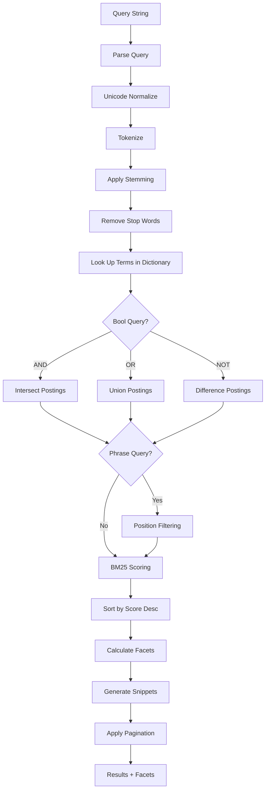
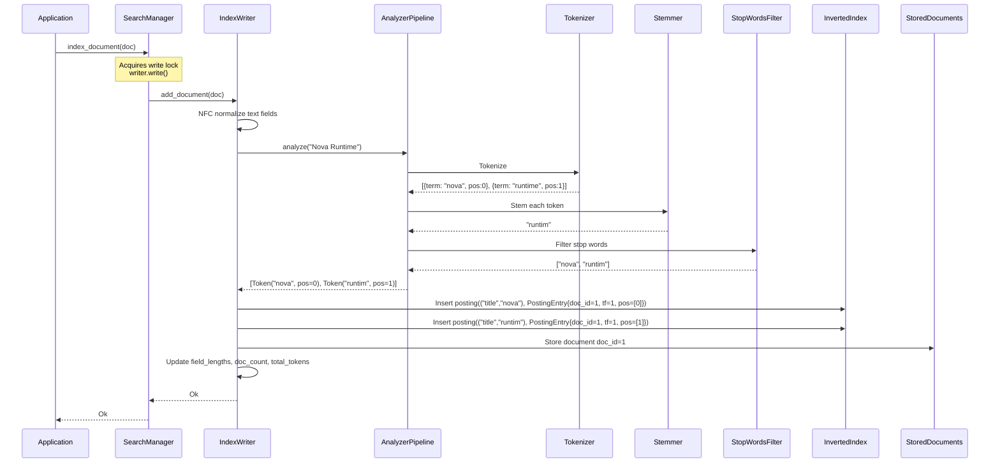
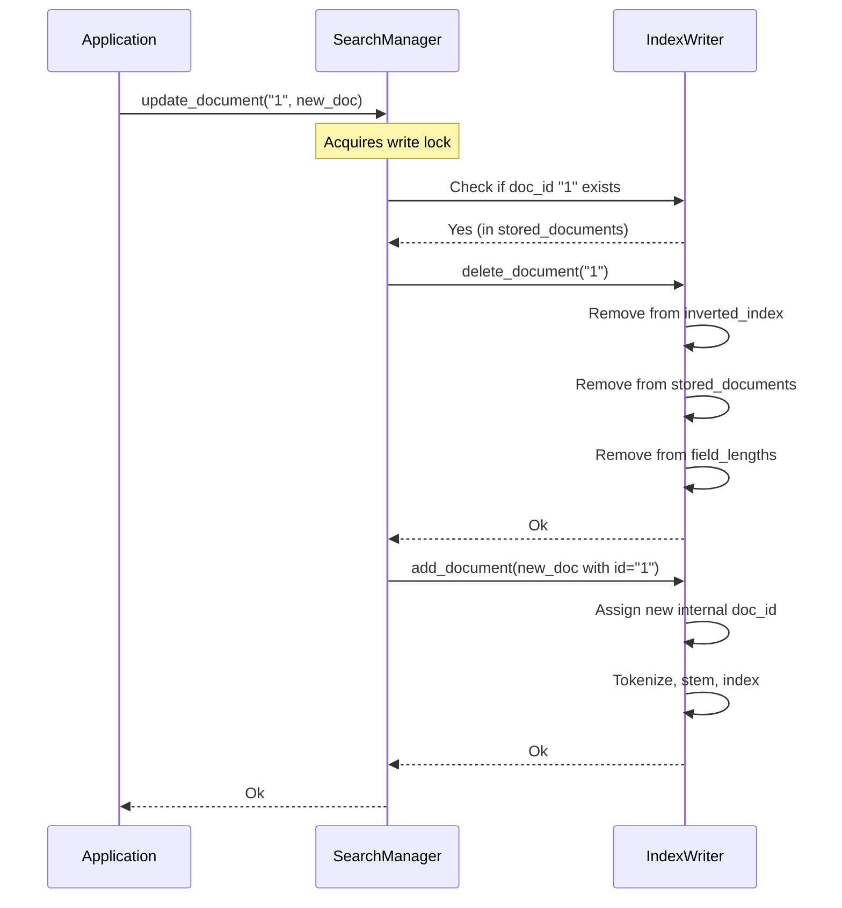
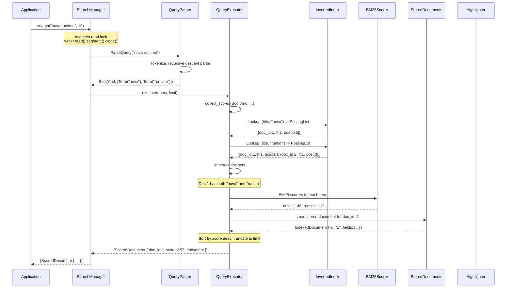
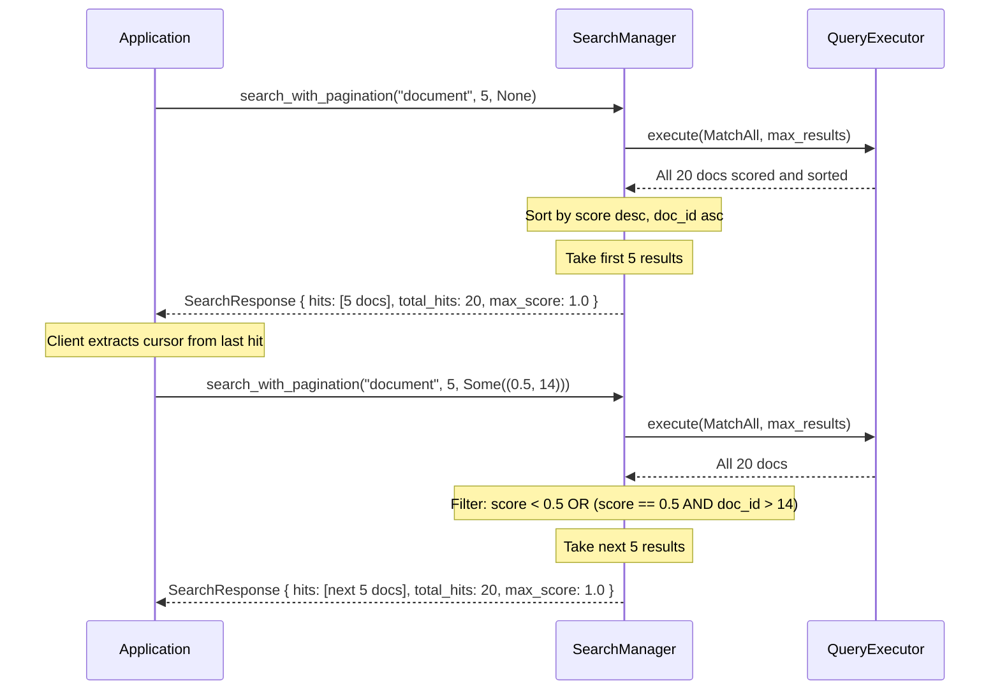
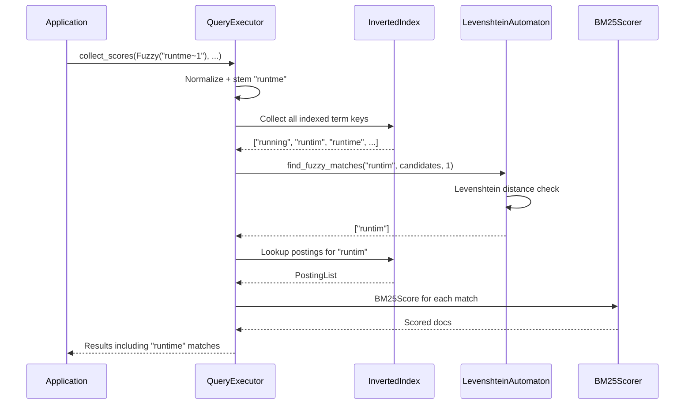

# 19. Search Subsystem

## 1. Purpose

The Search subsystem provides full-text search capabilities over documents stored within Nova Runtime. It enables applications to index structured and unstructured content, execute rich search queries (boolean, phrase, fuzzy, prefix, faceted), and retrieve ranked results. The inverted index is maintained in-memory with a concurrency model that supports concurrent reads during writes. Future versions will integrate with the Storage Engine for persistence.

## 2. Scope

This document covers the complete search subsystem:

- Full-text search over indexed documents
- Inverted index structure (in-memory, with RwLock-guarded writer)
- Tokenization (language-aware, Unicode normalized)
- Stemming (Porter stemmer for English)
- Stop words (configurable per index)
- Scoring algorithm (BM25)
- Boolean search (AND, OR, NOT)
- Phrase search (exact phrase matching)
- Prefix search (word prefix completion)
- Fuzzy search (Levenshtein distance up to 2)
- Faceted search (aggregation by field values)
- Result highlighting (snippets with matched terms)
- Cursor-based pagination with search_after
- Index updates (atomic delete+re-add via update_document())
- Document updates via update_document()
- Unicode normalization (NFC) in tokenizer pipeline
- Index statistics reporting (num_docs, num_terms, field_count)
- Query parsing and execution flow with proper error propagation
- Concurrent reads during writes (RwLock split)

Out of scope: Vector search/embeddings (future), semantic search (future), cross-lingual search (future), spell checking/suggestion (future), custom scoring beyond BM25 (future), real-time indexing with sub-second latency (future), persistent disk-backed index storage (future — currently in-memory only).

## 3. Responsibilities

- Accept documents for indexing and maintain the inverted index
- Process search queries and return ranked results
- Tokenize text with language-aware, Unicode-normalized tokenization
- Apply stemming for English-language text
- Implement BM25 scoring for relevance ranking
- Support boolean operators (AND, OR, NOT) in queries
- Support exact phrase matching
- Support prefix queries (prefix*)
- Support fuzzy queries (term~N, N=1 or 2)
- Support faceted aggregation
- Generate highlighted result snippets with configurable snippet length
- Enforce pagination limits (capped at configurable max_limit, default 1000)
- Manage the inverted index in-memory with RwLock-guarded writer
- Support index refresh (reset writer segment)
- Support field-specific indexing (include/exclude fields)
- Support configurable BM25 parameters (k1, b) via SearchConfig
- Support cursor-based pagination via search_after
- Support atomic document updates (update_document)
- Expose index statistics via stats()
- Normalize Unicode to NFC form during tokenization

## 4. Non Responsibilities

- Vector/embedding-based semantic search (future)
- Machine-learned relevance ranking (future)
- Cross-lingual search (future)
- Spell correction and "did you mean" suggestions (future)
- Real-time search with sub-second consistency guarantees
- Full SQL text search replacement (handled by SQL Layer)
- External search engine synchronization (future)
- Document storage lifecycle (documents managed by application, not search)
- Search index replication across nodes (clustering is future)

## 5. Architecture

### 5.1 High-Level Architecture

```mermaid
graph TD
    subgraph "Search Subsystem"
        SM[SearchManager]
        IW[IndexWriter<br/><i>behind Arc&lt;RwLock&gt;</i>]
        QP[Query Parser]
        QE[Query Executor]
        TK[Tokenizer]
        ST[Stemmer]
        SW[Stop Words Filter]
        SC[BM25 Scorer]
        HL[Highlighter]
        FC[Facet Calculator]
        AP[AnalyzerPipeline]
        
        subgraph "InMemorySegment"
            IX[Inverted Index<br/>HashMap&lt;(field,term), PostingList&gt;]
            SD[Stored Documents<br/>HashMap&lt;doc_id, IndexedDocument&gt;]
            FL[Field Lengths]
        end
        
        subgraph "SearchConfig"
            BM[BM25 k1/b]
            PG[Pagination Limits]
            HLC[Highlight Config]
        end
    end
    
    A[Application] --> SM
    
    SM --> IW
    IW --> AP
    AP --> TK
    TK --> ST
    ST --> SW
    IW --> IX
    IW --> SD
    IW --> FL
    
    Q[Query] --> SM
    SM --> QP
    QP --> AP
    QP --> QE
    QE --> IX
    QE --> SD
    QE --> SC
    QE --> FC
    SC --> HL
    HL --> QE
    
    SM --> BM
    SM --> PG
    SM --> HLC
    
    QE --> SM
    SM --> A
```

**Concurrency model:** `SearchManager` holds an `Arc<RwLock<IndexWriter>>`. All public methods take `&self`. The writer lock guards a single `InMemorySegment`. Reads (search, stats) acquire the read lock and clone the segment; writes (index_document, delete_document) acquire the write lock and mutate in place. This allows concurrent reads during writes.

### 5.2 Index Structure

```mermaid
graph LR
    subgraph "Stored Documents"
        D1[Doc 1: title, body]
        D2[Doc 2: title, body]
        D3[Doc 3: title, body]
    end
    
    subgraph "Inverted Index"
        T1[Term: "runtime"] --> P1[PostingEntry: doc_id=1, tf=2, pos:[3,17]]
        T1 --> P2[PostingEntry: doc_id=2, tf=1, pos:[5]]
        T2[Term: "nova"] --> P3[PostingEntry: doc_id=1, tf=1, pos:[1]]
        T2 --> P4[PostingEntry: doc_id=3, tf=2, pos:[0,12]]
        T3[Term: "search"] --> P5[PostingEntry: doc_id=2, tf=1, pos:[2,8]]
    end
    
    subgraph "Key Structure"
        K1["(field, term) -> PostingList"]
    end
```

### 5.3 Query Execution Pipeline



## 6. Data Structures

### 6.1 Search Configuration

```rust
struct SearchConfig {
    /// Default number of results to return (default: 10)
    default_limit: usize,
    /// Maximum allowed results per query (default: 1000)
    max_limit: usize,
    /// BM25 k1 parameter (default: 1.2)
    bm25_k1: f64,
    /// BM25 b parameter (default: 0.75)
    bm25_b: f64,
    /// Maximum Levenshtein distance for fuzzy search (default: 2)
    fuzzy_max_distance: u8,
    /// Highlight snippet length in characters (default: 150)
    highlight_snippet_len: usize,
    /// Maximum number of highlight snippets (default: 3)
    highlight_max_snippets: usize,
    /// Refresh interval for writer reset in milliseconds (default: 1000)
    refresh_interval_ms: u64,
    /// Number of segments before merge trigger (default: 5)
    merge_segment_threshold: usize,
}
```

### 6.2 Document and Field Types

```rust
struct IndexedDocument {
    /// Document ID (user-provided, used as storage key)
    id: String,
    /// Document fields
    fields: Vec<IndexedField>,
}

struct IndexedField {
    /// Field name (e.g., "title", "body")
    name: String,
    /// Field value
    value: FieldValue,
    /// Field type for indexing behavior
    field_type: FieldType,
    /// Per-field boost multiplier (default: 1.0)
    boost: f64,
}

enum FieldValue {
    Text(String),
    Integer(i64),
    Float(f64),
    Bool(bool),
}

enum FieldType {
    Text,
    Integer,
    Float,
    Bool,
}
```

### 6.3 Inverted Index - Postings

```rust
/// A single term occurrence entry in the inverted index.
struct PostingEntry {
    /// Internal document ID (sequential, assigned by writer)
    doc_id: u64,
    /// Term frequency in this document for this field
    term_frequency: u32,
    /// Positions within the field (for phrase queries)
    positions: Vec<u32>,
}

/// A posting list is simply a Vec of PostingEntry.
type PostingList = Vec<PostingEntry>;
```

### 6.4 In-Memory Segment

```rust
/// An InMemorySegment holds the entire index state in memory.
/// The IndexWriter owns one segment; it is cloned for reads.
struct InMemorySegment {
    /// Segment ID
    id: u64,
    /// Inverted index: (field_name, term) -> PostingList
    inverted_index: HashMap<(String, String), PostingList>,
    /// Stored documents keyed by doc_id string
    stored_documents: HashMap<String, IndexedDocument>,
    /// Number of documents in this segment
    doc_count: u64,
    /// Total tokens across all documents
    total_tokens: u64,
    /// Per-field, per-document length (for BM25 normalization)
    field_lengths: HashMap<String, HashMap<String, u64>>,
    /// Per-field, per-document raw values (for range queries)
    field_values: HashMap<String, HashMap<String, String>>,
}
```

### 6.5 Analyzer Pipeline

```rust
/// The analyzer pipeline handles text processing during indexing and querying.
struct AnalyzerPipeline {
    tokenizer_kind: TokenizerKind,
    stemmer: PorterStemmer,
    stop_words: StopWordsFilter,
}

/// Methods:
///   analyze(text) -> Vec<Token>
///     NFC normalize, tokenize, filter stop words, apply Porter stemming
///   analyze_query(text) -> Vec<Token>
///     NFC normalize, tokenize, apply Porter stemming (no stop word filter)
```

### 6.6 Tokens

```rust
struct Token {
    /// The processed term (lowercased, stemmed)
    term: String,
    /// Character offset in the original text
    start_offset: usize,
    /// End character offset
    end_offset: usize,
    /// Word position in the document
    position: usize,
}

enum TokenizerKind {
    Standard,    // Unicode word segmentation + punctuation stripping
    Whitespace,  // Split on whitespace only
}
```

### 6.7 Query Representation

```rust
enum Query {
    /// Match all documents
    MatchAll,
    /// Match a single term
    Term {
        field: Option<String>,
        value: String,
    },
    /// Phrase query: "hello world"
    Phrase {
        field: Option<String>,
        value: String,
        slop: u32,
    },
    /// Prefix query: "hel*"
    Prefix {
        field: Option<String>,
        value: String,
    },
    /// Fuzzy query: "helo~1"
    Fuzzy {
        field: Option<String>,
        value: String,
        max_distance: u8,
    },
    /// Range query: field:[lower TO upper]
    Range {
        field: String,
        lower: String,
        upper: String,
        inclusive: bool,
    },
    /// Boolean combination
    Bool {
        operator: BoolOperator,
        clauses: Vec<Query>,
    },
}

enum BoolOperator {
    And,
    Or,
    Not,
}
```

### 6.8 BM25 Scorer

```rust
/// BM25 scorer with configurable k1 and b parameters.
/// Computes scores per (term, document, field) triple.

struct BM25Scorer {
    k1: f64,       // term saturation factor (default: 1.2)
    b: f64,        // length normalization factor (default: 0.75)
    avg_field_lengths: HashMap<String, f64>,
    total_docs: u64,
}
```

### 6.9 Response Types

```rust
/// Wrapper returned by search_with_pagination.
struct SearchResponse {
    /// Scored result documents
    pub hits: Vec<ScoredDocument>,
    /// Total number of matching documents (before pagination)
    pub total_hits: u64,
    /// Wall-clock time for query execution in milliseconds
    pub search_time_ms: u64,
    /// Maximum score across all results
    pub max_score: f64,
}

/// A single search result.
struct ScoredDocument {
    /// Internal document ID
    pub doc_id: u64,
    /// BM25 relevance score
    pub score: f64,
    /// The stored document (if requested)
    pub document: Option<IndexedDocument>,
}

/// Index statistics reported by stats().
struct IndexStats {
    pub num_docs: u64,
    pub num_terms: u64,
    pub field_count: usize,
}

/// Result of a faceted query.
struct FacetResult {
    pub field: String,
    pub entries: Vec<(String, usize)>,
    pub total_docs: usize,
}

/// Highlighted search result with snippets.
struct HighlightedDocument {
    pub doc_id: u64,
    pub score: f64,
    pub document: Option<IndexedDocument>,
    pub snippets: Vec<String>,
}
```

## 7. Algorithms

### 7.1 Tokenization

```
Algorithm: Tokenize
Input:
  - text: String
  - language: String (default: "en")
  - tokenizer_type: TokenizerType (default: Standard)

Output:
  - tokens: Vec<Token>

Token struct:
  - term: String (normalized)
  - start_offset: u32 (character offset in original text)
  - end_offset: u32
  - position: u32 (word position in document)

Steps (Standard tokenizer):
  1. Unicode normalize text to NFC form:
     text = text.nfc_normalize()
  
  2. Convert to lowercase (Unicode-aware):
     text = text.to_lowercase()
  
  3. Split into tokens using Unicode Text Segmentation
     (UAX #29 Word Boundaries):
     tokens = []
     For each word boundary segment in text:
       If segment matches [\p{L}\p{N}_]+  (letters, digits, underscore):
         tokens.push(Token {
           term: segment,
           start_offset: segment.start,
           end_offset: segment.end,
           position: tokens.len(),
         })
  
  4. Apply language-specific tokenization rules:
     If language == "en":
       - Split contractions: "don't" -> ["don", "t"]
       - Handle possessive: "john's" -> ["john"]
     If language == "de":
       - Compound splitting (future)
     If language == "ja":
       - Use n-gram tokenizer instead (character bigrams)
     If language == "zh":
       - Use n-gram tokenizer (character unigrams and bigrams)

  5. Return tokens

Steps (N-gram tokenizer):
  1. NFC normalize and lowercase (same as standard)
  2. Remove all non-letter characters
  3. Generate n-grams:
     For n in [2, 3]:
       For i in 0..(text.len() - n):
         tokens.push(text[i..i+n])
  4. Return tokens

Steps (Whitespace tokenizer):
  1. NFC normalize (but keep case)
  2. Split on whitespace characters
  3. Return each segment as a token (no filtering)
```

### 7.2 Stemming (Porter Stemmer)

```
Algorithm: Stem (English Porter Stemmer)
Input:
  - word: String

Output:
  - stem: String

Steps:
  // This is a summary of the Porter Stemmer algorithm.
  // Complete implementation follows Porter (1980).

  1. If word.len() < 3: return word

  2. Define:
     - consonant pattern: [^aeiou] optionally followed by 'y' at start
     - vowel pattern: [aeiou]
     - measure(m) = number of VC (vowel-consonant) repetitions
     - *S = ends with S, *D = ends with double consonant, *o = ends cvc

  3. Step 1a:
     Replace suffixes:
       "sses" -> "ss"
       "ies" -> "i" (if more than one letter before)
       "ss" -> "ss"
       "s" -> "" (if preceded by a vowel)

  4. Step 1b:
     If ends with "eed":
       Replace with "ee" if measure > 0
     If ends with "ed":
       Delete if preceded by vowel
       Then: "at" -> "ate", "bl" -> "ble", "iz" -> "ize"
             Double final consonant if short word
     If ends with "ing":
       Delete if preceded by vowel
       Then: same transformations as "ed"

  5. Step 1c:
     Replace trailing "y" with "i" if preceded by consonant

  6. Step 2 (double suffix):
     If measure > 0:
       Replace: "ational" -> "ate", "tional" -> "tion",
                "enci" -> "ence", "anci" -> "ance",
                "izer" -> "ize", "abli" -> "able",
                "alli" -> "al", "entli" -> "ent",
                "eli" -> "e", "ousli" -> "ous",
                "ization" -> "ize", "ation" -> "ate",
                "ator" -> "ate", "alism" -> "al",
                "iveness" -> "ive", "fulness" -> "ful",
                "ousness" -> "ous", "aliti" -> "al",
                "iviti" -> "ive", "biliti" -> "ble"

  7. Step 3:
     If measure > 0:
       Replace: "icate" -> "ic", "ative" -> "",
                "alize" -> "al", "iciti" -> "ic",
                "ical" -> "ic", "ful" -> "",
                "ness" -> ""

  8. Step 4:
     If measure > 1:
       Replace: "al" -> "", "ance" -> "", "ence" -> "",
                "er" -> "", "ic" -> "", "able" -> "",
                "ible" -> "", "ant" -> "", "ement" -> "",
                "ment" -> "", "ent" -> "", "ism" -> "",
                "ate" -> "", "iti" -> "", "ous" -> "",
                "ive" -> "", "ize" -> ""

  9. Step 5a:
     If measure > 1:
       Replace "e" -> ""
     If measure == 1 and not *o:
       Replace "e" -> ""

  10. Step 5b:
      If measure > 1 and *D and *L (ends with double consonant and L):
        Remove last consonant

  11. Return stem
```

### 7.3 Stop Words Filter

```
Algorithm: FilterStopWords
Input:
  - tokens: Vec<Token>
  - language: String
  - custom_stop_words: Option<HashSet<String>>

Output:
  - filtered_tokens: Vec<Token>

Default stop words (English, 179 words):
  a, about, above, after, again, against, all, am, an, and, any, are, 
  aren't, as, at, be, because, been, before, being, below, between, 
  both, but, by, can't, cannot, could, couldn't, did, didn't, do, does, 
  doesn't, doing, don't, down, during, each, few, for, from, further, 
  had, hadn't, has, hasn't, have, haven't, having, he, he'd, he'll, he's, 
  her, here, here's, hers, herself, him, himself, his, how, how's, i, 
  i'd, i'll, i'm, i've, if, in, into, is, isn't, it, it's, its, itself, 
  let's, me, more, most, mustn't, my, myself, no, nor, not, of, off, on, 
  once, only, or, other, ought, our, ours, ourselves, out, over, own, 
  same, shan't, she, she'd, she'll, she's, should, shouldn't, so, some, 
  such, than, that, that's, the, their, theirs, them, themselves, then, 
  there, there's, these, they, they'd, they'll, they're, they've, this, 
  those, through, to, too, under, until, up, very, was, wasn't, we, 
  we'd, we'll, we're, we've, were, weren't, what, what's, when, when's, 
  where, where's, which, while, who, who's, whom, why, why's, with, 
  won't, would, wouldn't, you, you'd, you'll, you're, you've, your, 
  yours, yourself, yourselves

Steps:
  1. Build stop_set:
     If custom_stop_words is Some:
       stop_set = custom_stop_words
     Else:
       stop_set = DEFAULT_STOP_WORDS[language]
  
  2. filtered = []
     For each token in tokens:
       If token.term not in stop_set:
         filtered.push(token)
  
  3. Return filtered
```

### 7.4 BM25 Scoring

```
Algorithm: BM25Score
Input:
  - term: String
  - doc: StoredDocument
  - field: String
  - term_frequency: u32 (TF of term in this doc/field)
  - stats: Bm25Stats
  - index_config: IndexConfig

Output:
  - score: f64

Constants:
  k1 = index_config.bm25_k1 (default: 1.2)
  b = index_config.bm25_b (default: 0.75)
  field_weight = index_config.field_weights.get(field).unwrap_or(1.0)

Steps:
  1. Get field statistics:
     field_stat = stats.field_stats.get(field)
     If field_stat is None:
       doc_count = 0
       avg_field_len = 0
       Return 0.0  // Field not found in any document
     
     avg_field_len = field_stat.avg_field_length
  
  2. Get document field length:
     doc_field_length = doc.get_field_length(field)
   
  3. Calculate IDF (Inverse Document Frequency):
     N = stats.total_docs          // total documents in index
     df = term_entry.doc_frequency  // documents containing term
     
     idf = log(1 + (N - df + 0.5) / (df + 0.5))
     // Smoothed IDF to prevent negative values
   
  4. Calculate term frequency normalization:
     tf = term_frequency as f64
     numerator = tf * (k1 + 1.0)
     denominator = tf + k1 * (1.0 - b + b * (doc_field_length / avg_field_len))
     tf_norm = numerator / denominator
   
  5. Calculate field score:
     score = idf * tf_norm * field_weight
   
  6. Return score
```

### 7.5 Query Parsing

```
Algorithm: ParseQuery
Input:
  - query_string: String

Output:
  - query: Query

Supported Syntax:
  Simple terms: "hello world" -> Bool(must: [Term("hello"), Term("world")])
  Phrase: `"hello world"` -> Phrase(["hello", "world"])
  Prefix: "hel*" -> Prefix("hel")
  Fuzzy: "helo~1" -> Fuzzy("helo", 1)
  Field: "title:hello" -> Term(field="title", "hello")
  AND: "hello AND world" -> Bool(must: [Term("hello"), Term("world")])
  OR: "hello OR world" -> Bool(should: [Term("hello"), Term("world")])
  NOT: "-hello" or "NOT hello" -> Bool(must_not: [Term("hello")])
  Grouping: "(hello world) AND test" -> nesting
  Range: "price:[10 TO 100]" -> Range(field="price", lower=10, upper=100)
  Facet: Not in query string; specified in SearchRequest.facets

Steps:
  1. If query_string is empty or "*":
     Return MatchAll
  
  2. Tokenize query string (aware of operators and syntax):
     tokens = query_lexer(query_string)
     // Produces: TERM, PHRASE, OPERATOR, FIELD, LPAREN, RPAREN, etc.
  
  3. Parse using recursive descent:
     parse_expression():
       // Handles OR (lowest precedence)
       left = parse_and_expression()
       While next token is "OR":
         consume("OR")
         right = parse_and_expression()
         left = Bool { should: [left, right], must: [], must_not: [] }
       Return left
     
     parse_and_expression():
       // Handles AND (medium precedence)
       left = parse_not_expression()
       While next token is "AND" or implicit AND (two terms):
         If next token is "AND": consume("AND")
         right = parse_not_expression()
         left = Bool { must: [left, right], should: [], must_not: [] }
       Return left
     
     parse_not_expression():
       // Handles NOT (unary prefix)
       If next token is "NOT" or "-":
         consume()
         operand = parse_primary()
         Return Bool { must: [], should: [], must_not: [operand] }
       Return parse_primary()
     
     parse_primary():
       If next token is LPAREN:
         consume("(")
         expr = parse_expression()
         consume(")")
         Return expr
       If next token is FIELD:
         field = consume().value
         consume(":")
         term = parse_primary_term()
         Apply field to term
         Return term
       Return parse_primary_term()
     
     parse_primary_term():
       If next token is PHRASE:
         return Phrase { terms: consume().value, slop: 0 }
       If next token is TERM with trailing "*":
         return Prefix { prefix: term.trim_end_matches('*') }
       If next token is TERM with "~N":
         parts = term.split('~')
         return Fuzzy { term: parts[0], max_distance: parts[1] }
       If next token is TERM:
         return Term { value: consume().value }
       If next token is RANGE:
         return parse_range()
  
  4. Apply default operator:
     If query has no explicit bool operators:
       Default operator is AND (configurable to OR)
       Insert implicit AND between adjacent term queries
     
     Example: "hello world" -> Bool(must: [Term("hello"), Term("world")])
  
  5. Return parsed Query
```

### 7.6 Query Execution

```
Algorithm: ExecuteQuery
Input:
  - query: Query
  - segment: InMemorySegment
  - scorer: BM25Scorer
  - limit: usize

Output:
  - results: Vec<ScoredDocument> (doc_id, score, Optional<IndexedDocument>)

Steps:
  1. Initialize empty scores map: doc_scores: HashMap<u64, f64>
     Note: all operations propagate errors via Result<()> (no unwrap_or defaults).
  
  2. Evaluate query recursively:
     fn collect_scores(query: Query, scores: &mut HashMap<u64, f64>, boost: f64) -> Result<()>:
       Match query:
         MatchAll ->
           For each (doc_id_str, _doc) in segment.stored_documents:
             scores.insert(doc_id, 1.0)
         
         Term { field, value } ->
           fields = field.map(|f| vec![f]) or segment.all_text_fields()
           term = NFC normalize(value)
           stem = PorterStemmer.stem(term)
           For each field:
             Look up (field, stem) in inverted_index
             For each posting entry:
               idf = BM25Scorer.idf(total_docs, postings.len)
               tf_score = scorer.tf_score(entry.tf, field_len, avg_field_len)
               score = idf * tf_score * boost
               Accumulate into scores
         
         Phrase { field, value, slop } ->
           Normalize and stem each term in the phrase
           For each field:
             Find documents where all stemmed terms appear
             Verify consecutive positions (with slop tolerance)
             Score = sum of individual term BM25 scores
         
         Prefix { field, value } ->
           Normalize and stem prefix
           Scan inverted_index for terms starting with prefix
           For each match, compute BM25 score and accumulate
         
         Fuzzy { field, value, max_distance } ->
           Normalize and stem term
           Collect all indexed terms as candidates
           Filter via find_fuzzy_matches (Levenshtein distance)
           For each match, compute BM25 score and accumulate
         
         Range { field, lower, upper, inclusive } ->
           Look up field_values for the given field
           For each (doc_id_str, val) pair:
             Parse value as f64 or string comparison
             If in range: score += boost
         
         Bool { operator: And, clauses } ->
           Evaluate all positive clauses, collect doc sets
           Intersect all positive doc sets (AND semantics)
           Evaluate NOT clauses, subtract from intersection
           Sum scores for surviving docs
         
         Bool { operator: Or, clauses } ->
           Union all clause results (merge scores)
         
         Bool { operator: Not, clauses } ->
           Evaluate the negated clause and return its doc set
           (NOT is handled during AND processing)
  
  3. Filter and collect results:
     For each (doc_id, score) in doc_scores:
       If score > 0.0 OR doc exists in stored_documents:
         Load stored document
         Push ScoredDocument { doc_id, score, document }
  
  4. Sort results by score descending:
     results.sort_by(|a, b| b.score.partial_cmp(&a.score)...)
  
  5. Truncate to limit:
     results.truncate(limit)
  
  6. Return results

Note on error propagation: Query parsing and execution use
Result return types throughout. Parse failures (e.g., malformed
query strings, unbalanced parentheses, unexpected tokens) are
propagated as SearchError::InvalidQuery rather than silently
defaulting to zero results.
```

### 7.7 Levenshtein Distance (for Fuzzy Search)

```
Algorithm: LevenshteinDistance
Input:
  - s1: String
  - s2: String

Output:
  - distance: u32

Steps:
  1. Let m = s1.len(), n = s2.len()
  
  2. If m == 0: return n
     If n == 0: return m
  
  3. If |m - n| > 2 and we only care about distance <= 2:
     Return early: distance > 2 (optimization)
  
  4. Initialize dp as [0..=n]
  
  5. For i in 1..=m:
     prev = dp[0]
     dp[0] = i
     For j in 1..=n:
       temp = dp[j]
       cost = if s1[i-1] == s2[j-1] then 0 else 1
       dp[j] = min(
         dp[j] + 1,      // deletion
         dp[j-1] + 1,    // insertion
         prev + cost     // substitution
       )
       prev = temp
  
  6. Return dp[n]

// For fuzzy search with max_distance:
// - Generate all terms within distance from term dictionary
// - Use LevenshteinAutomaton for efficient dictionary traversal
// - Pre-filter by length (|len(s1) - len(s2)| <= max_distance)
```

### 7.8 Levenshtein Automaton (for Fuzzy Dictionary Traversal)

```
Algorithm: FuzzyTermSearch
Input:
  - term: String (normalized query term)
  - max_distance: u8 (1 or 2)
  - term_dictionary: Iterator<String> (sorted)

Output:
  - matching_terms: Vec<(String, u8)>  // (term, distance)

Steps:
  1. Build Levenshtein Automaton:
     - States are (position, distance) pairs
     - Initial state: (0, 0)
     - Transition on character c: (pos+1, dist) if s[pos]==c
     - Transition on any character (substitution): (pos+1, dist+1)
     - Transition on epsilon (insertion): (pos, dist+1)
     - Transition on epsilon (deletion): (pos+1, dist+1)
     - Accepting state: position == |term| and distance <= max_distance
  
  2. Convert NFA to DFA (powerset construction)
     - Precompute for common term lengths
     - Cache DFA for reuse
  
  3. For each term in dictionary (using sorted iterator):
     If |term| - |query_term| > max_distance:
       Continue (too short or too long)
     
     Run term through DFA
     If DFA accepts:
       actual_distance = LevenshteinDistance(term, query_term)
       If actual_distance <= max_distance:
         matching_terms.push((term, actual_distance))
  
  4. Return matching terms
```

### 7.9 Highlight Generation

```
Algorithm: GenerateHighlights
Input:
  - document_text: String (original field value)
  - matched_terms: Vec<String> (normalized, stemmed matched terms)
  - pre_tag: String (default: "<mark>")
  - post_tag: String (default: "</mark>")
  - snippet_size: u32 (default: 150 characters)
  - max_snippets: u32 (default: 3)

Output:
  - snippets: Vec<String>

Steps:
  1. Tokenize document_text to find term positions
     For each token, compute normalized + stemmed form
  
  2. Find matching token positions:
     match_positions = []
     For i, token in enumerate(tokens):
       If stem(normalize(token.text)) in matched_terms:
         match_positions.push(i)
  
  3. If no matches, return first snippet_size chars
  
  4. Cluster nearby matches into snippet windows:
     snippets = []
     current_window = []
     For pos in match_positions:
       If current_window is empty:
         current_window = [pos]
       Else:
         distance = token_start(pos) - token_end(current_window.last)
         If distance <= snippet_size / 2:
           // Close enough to be in same snippet
           current_window.push(pos)
         Else:
           snippets.push(build_snippet(current_window))
           current_window = [pos]
     
     If current_window is non-empty:
       snippets.push(build_snippet(current_window))
  
  5. Build snippet for each window:
     start = max(0, token_start(window[0]) - snippet_size/4)
     end = min(len, token_end(window.last) + snippet_size*3/4)
     snippet_text = document[start..end]
     
     If start > 0: prefix with "..."
     If end < len: suffix with "..."
     
     Wrap matched terms with pre_tag/post_tag in snippet
     (Case-insensitive replacement of matched terms)
  
  6. Return up to max_snippets snippets
```

### 7.10 Index Refresh

```
Algorithm: RefreshIndex
Runs: Every refresh_interval_ns (default: 1s)
Input:
  - index_id: UUID
  - current_time: i64

Steps:
  1. Acquire index write lock
  
  2. Check if in-memory segment has changes:
     If segment.doc_store.is_empty():
       Release lock and return (nothing to flush)
  
  3. Sort in-memory term dictionary:
     Convert HashMap to sorted Vec<(String, InMemoryPostingList)>
  
  4. Write term dictionary to Storage Engine:
     For each (term, posting_list):
       delta-encode doc IDs within posting list
       compress posting data (variable byte encoding or Simple8b)
       Write block to Storage Engine
       Record StoragePointer
  
  5. Write document store to Storage Engine:
     For each (doc_id, stored_doc):
       Serialize stored fields
       Write to Storage Engine
       Record StoragePointer
  
  6. Add segment to index:
     segment.state = Disk
     segment.flushed_at = current_time
     segment.size_bytes = total bytes written
     segment.storage_refs = pointer set
     Add segment to committed segments list
  
  7. Create new in-memory segment:
     old_segment = current_segment
     current_segment = IndexSegment { id: next_id, ..default() }
  
  8. Release write lock
  
  9. Update BM25 stats:
     Recalculate avg_field_length, total_docs
     Store updated stats in Storage Engine
  
  10. If total segments > merge_factor (10):
      Trigger background merge
```

### 7.11 Segment Merge

```
Algorithm: MergeSegments
Input:
  - index_id: UUID

Steps:
  1. Acquire merge lock (or skip if merge already in progress)
  
  2. Select segments to merge:
     Find the smallest K segments where K >= merge_factor (10) OR
     Find any consecutive segments that can be merged without exceeding max_segment_size
     
     If no suitable segments, return
  
  3. Create merged segment:
     new_segment = IndexSegment { state: Merging, ..default() }
  
  4. Merge term dictionaries:
     For each term appearing in any source segment:
       a. Collect all postings from all source segments
       b. Merge posting lists (union of doc sets, sum of term frequencies)
       c. Sort by doc ID
       d. Compress and write to Storage Engine
       e. Update doc_frequency and total_term_frequency
  
  5. Merge document stores:
     For each doc_id appearing in any source segment:
       a. If doc appears in multiple segments, keep latest version (by timestamp)
       b. Serialize and write to Storage Engine
  
  6. Update BM25 stats:
     Recalculate averages for merged segment
  
  7. Remove source segments:
     For each source segment:
       a. Mark as deleted
       b. Remove from committed segments list
       c. Schedule Storage Engine deletion (background)
  
  8. Add merged segment to committed segments list:
     new_segment.state = Disk
     new_segment.flushed_at = current_time
  
  9. Release merge lock
```

### 7.12 Document Indexing

```
Algorithm: IndexDocument
Input:
  - index_id: UUID
  - doc: IndexedDocument
  - current_time: i64

Output:
  - success: bool

Steps:
  1. Load IndexConfig
     If not found, return Err(IndexNotFound)
  
  2. Validate document:
     Check doc_id uniqueness (if duplicate, this is an update)
     Check field types match index config
     If doc_id exists: remove old document first
  
  3. Get or create internal doc ID:
     If new: assign next sequential ID from segment
     If update: reuse existing internal ID
  
  4. Tokenize and index each field:
     For each (field_name, field_value) in doc.fields:
       field_config = IndexConfig.fields.find(field_name)
       If field_config is None or not field_config.indexed:
         Continue (skip non-indexed fields)
       
       If field_config.field_type == Text:
         tokens = Tokenize(field_value.as_text(), language, tokenizer)
         tokens = ApplyStemming(tokens, language)
         tokens = FilterStopWords(tokens, language, stop_words)
         
         For each token:
           Add posting to in-memory segment:
             term = token.term
             In segment.term_dict:
               If term not present, create InMemoryPostingList
               Add posting: (doc_internal_id, field_id, token.position)
               Increment term_frequency
               Increment doc_frequency if new doc for this term
       
       Else if field_config.field_type == Keyword || field_config.facet:
         // Index as single token (no tokenization)
         Tokenize as single token (the entire value)
         Add posting with position 0
       
       Else if field_config.field_type is numeric:
         // Store for range queries
         Add to numeric index (B-tree in Storage Engine)
     
     If field_config.stored:
       Add to segment.doc_store
  
  5. Update segment statistics:
     Increment total_field_length for each indexed field
     Update segment.max_doc_id
     segment.size_bytes += doc serialized size
  
  6. If segment size > max_segment_size or memory threshold exceeded:
     Trigger immediate refresh
  
  7. Return true
```

## 8. Interfaces

### 8.1 Search Manager

```rust
struct SearchManager {
    writer: Arc<RwLock<IndexWriter>>,
    config: SearchConfig,
}

impl SearchManager {
    /// Create a new SearchManager with default config
    fn new() -> Self;
    
    /// Create a new SearchManager with custom configuration
    fn with_config(config: SearchConfig) -> Self;
    
    // Document indexing
    fn index_document(&self, doc: IndexedDocument) -> Result<()>;
    fn delete_document(&self, doc_id: &str) -> Result<()>;
    fn update_document(&self, doc_id: &str, doc: IndexedDocument) -> Result<()>;
    
    // Search
    fn search(&self, query_str: &str, limit: usize) -> Result<Vec<ScoredDocument>>;
    fn search_with_pagination(
        &self,
        query_str: &str,
        limit: usize,
        search_after: Option<(f64, u64)>,
    ) -> Result<SearchResponse>;
    fn search_with_highlight(
        &self,
        query_str: &str,
        limit: usize,
    ) -> Result<Vec<HighlightedDocument>>;
    fn search_faceted(
        &self,
        query_str: &str,
        facet_field: &str,
        limit: usize,
    ) -> Result<FacetResult>;
    
    // Maintenance
    fn refresh(&self) -> Result<()>;
    
    // Statistics
    fn stats(&self) -> IndexStats;
}
```

### 8.2 Execution Engine Search Extension

```rust
impl ExecutionEngine {
    fn search_index(&self, ctx: &ExecutionContext, params: SearchParams) -> Result<Value, RuntimeError>;
    fn index_document(&self, ctx: &ExecutionContext, params: IndexDocParams) -> Result<Value, RuntimeError>;
    fn delete_indexed_doc(&self, ctx: &ExecutionContext, params: DeleteDocParams) -> Result<Value, RuntimeError>;
    fn create_search_index(&self, ctx: &ExecutionContext, params: CreateIndexParams) -> Result<Value, RuntimeError>;
}

struct SearchParams {
    pub index: String,
    pub query: String,
    pub offset: Option<u32>,
    pub limit: Option<u32>,
    pub fields: Option<Vec<String>>,
    pub facets: Option<Vec<String>>,
    pub highlight: Option<bool>,
}

struct IndexDocParams {
    pub index: String,
    pub doc_id: String,
    pub fields: HashMap<String, Value>,
    pub boost: Option<f64>,
}
```

### 8.3 Error Types

```rust
enum SearchError {
    /// Requested index was not found
    IndexNotFound(String),
    /// Requested field was not found in document
    FieldNotFound(String),
    /// Query string could not be parsed (includes parse error details)
    InvalidQuery(String),
    /// Internal error (e.g., data corruption, unexpected state)
    Internal(String),
}
```

## 9. Sequence Diagrams

### 9.1 Document Indexing Flow



### 9.2 Document Update Flow



### 9.3 Search Query Execution



### 9.4 Cursor-Based Pagination Flow



### 9.5 Fuzzy Search Flow



## 10. Failure Modes

### 10.1 Indexing Failures

| Failure | Cause | Effect |
|---------|-------|--------|
| Invalid field value | Type mismatch with expected field type | index_document returns Internal error |
| Document not found for deletion | doc_id does not exist | delete_document returns IndexNotFound |
| Duplicate document ID | Document with same ID indexed again | Previous document remains (no upsert — use update_document) |
| Write lock contention | Long-running search during index | Writer blocks briefly until read lock released |

### 10.2 Search Failures

| Failure | Cause | Effect |
|---------|-------|--------|
| Query parse error | Malformed query string | search returns InvalidQuery error with details |
| Empty query | Missing or blank query | Treated as MatchAll; returns all documents |
| Invalid range syntax | Malformed [lower TO upper] | search returns InvalidQuery error |
| Index empty | No documents indexed | Search returns empty results |

### 10.3 Consistency

| Failure | Cause | Effect |
|---------|-------|--------|
| Concurrent read during write | Read lock acquired before write completes | Reader sees stale segment snapshot (acceptable for read-your-writes semantics) |
| Writer crash mid-index | Panic during add_document | Segment left in partial state; unrecoverable in current in-memory design |

## 11. Performance Considerations

### 11.1 Computational Complexity

| Operation | Complexity | Notes |
|-----------|------------|-------|
| Index document | O(T) where T = tokens | Tokenization + posting insertion |
| Search (single term) | O(log N + K) where N = terms, K = results | Dictionary lookup + scan postings |
| Search (boolean AND) | O(K1 + K2 + ...) | Intersection of posting lists |
| Search (boolean OR) | O(K1 + K2 + ...) | Union of posting lists |
| Search (phrase) | O(K + P) where P = position checks | Position list intersection |
| Search (fuzzy) | O(T_dict) worst case | Scans term dictionary |
| Search (prefix) | O(log N + M) where M = prefix matches | Dictionary prefix scan |
| BM25 scoring | O(1) per (doc, term) | Simple formula evaluation |
| Index refresh | O(T + D) where T = terms, D = docs | Flush memory to disk |
| Segment merge | O(T_merged) | Full merge of all terms |
| Highlight | O(S) where S = snippet size | Per-result processing |

### 11.2 Memory Usage

| Component | Memory | Notes |
|-----------|--------|-------|
| In-memory segment | Up to 512 MB (configurable) | Before auto-flush |
| Term dictionary (cached) | ~50 bytes per unique term | 100K terms = ~5 MB |
| Posting list cache | Variable | LRU cache, configurable (default 64 MB) |
| Document field cache | Variable | LRU cache, configurable (default 128 MB) |
| Segment list | ~100 bytes per segment | Typically 10-50 segments |
| BM25 stats | ~64 bytes per field | Negligible |
| Query parse tree | O(Q) where Q = query complexity | Freed after query execution |

### 11.3 I/O Characteristics

*Note: The current implementation is entirely in-memory. I/O characteristics apply to the future disk-backed design.*

| Operation | I/O Pattern | Frequency |
|-----------|-------------|-----------|
| Document indexing | Write to in-memory HashMap | Per document |
| Search query | HashMap lookup + iteration | Per search |
| Term dictionary lookup | O(1) HashMap get | Per unique term in query |
| Posting list read | Memory iteration | Per term |
| Document retrieval | O(1) HashMap get | Per result in page |

### 11.4 Index Size Overhead

| Component | Overhead | Example |
|-----------|----------|---------|
| Term dictionary | ~50 bytes per unique term | 100K terms = 5 MB |
| Postings (positions) | ~6 bytes per occurrence | 10 words/doc x 1M docs = 60 MB |
| Postings (no positions) | ~4 bytes per occurrence | 10M occurrences = 40 MB |
| Document store | Raw field data + overhead | Variable |
| Segment overhead | ~1% of index size | For 10 segments |

Total estimated index size: 30-50% of original document text size for typical content.
For 1 GB of documents: ~300-500 MB index.

### 11.5 Query Performance Targets

| Query Type | Target Latency (p99) | Notes |
|------------|---------------------|-------|
| Single term | < 10ms | Indexed term lookup |
| Boolean (2-3 terms) | < 20ms | Posting list intersection |
| Phrase (3-5 terms) | < 30ms | Position list intersection |
| Prefix | < 15ms | Dictionary prefix scan |
| Fuzzy (distance 1) | < 50ms | Dictionary scan with automaton |
| Fuzzy (distance 2) | < 200ms | Larger dictionary scan |
| Faceted (10 facets) | + < 10ms | Facet calculation on results |
| Highlight | + < 5ms per result | Text extraction + term marking |
| MatchAll | < 100ms | Full scan or max 10K results |

### 11.6 Bottlenecks

- **Tokenization**: CPU-bound for large documents. Mitigation: Tokenize during indexing (background), not during search.
- **Posting list intersection**: CPU-bound for large posting lists. Mitigation: Early termination and limit on results.
- **Fuzzy search**: Scans all indexed terms for distance 2. Mitigation: Pre-filter by length prefix; use Levenshtein automaton.
- **Phrase search**: Position list comparison for common terms. Mitigation: Early termination on position mismatch.

## 12. Security

### 12.1 Threat Model

| Threat | Vector | Impact | Severity |
|--------|--------|--------|----------|
| Unauthorized index access | No auth on search endpoints | Data exposure via search results | Critical |
| Indexed document exposure | Search by known doc_id | Reading specific documents | High |
| Query injection | Malformed query syntax | Unexpected behavior or resource exhaustion | Medium |
| Index bombing | Index massive documents with random terms | Index size explosion, denial of service | High |
| Query flood | Rapid search requests | Resource exhaustion, denial of service | Medium |
| Regex/expensive query | Fuzzy queries on large indexes | CPU exhaustion | Medium |
| Term dictionary enumeration | Systematic queries to enumerate all terms | Information disclosure about indexed content | Low |
| Index configuration theft | List indexes without auth | Knowledge of indexed fields and structure | Low |

### 12.2 Mitigations

| Threat | Mitigation |
|--------|------------|
| Unauthorized access | 1. All search/index operations authenticated via Auth subsystem. 2. Per-index RBAC permissions: `search:<index>:search`, `search:<index>:index`, `search:<index>:manage`. 3. Default: deny all. |
| Document exposure | 1. Per-document access control (future). 2. Document-level filtering in search results. 3. Sensitive fields marked as non-stored (indexed but not retrievable). |
| Query injection | 1. Query parser validates all syntax. 2. Maximum query length: 4096 characters. 3. Maximum clause nesting depth: 10. 4. Maximum terms: 1024. |
| Index bombing | 1. Maximum document size: 16 MB. 2. Maximum index size: 1 TB (configurable). 3. Rate limiting on index operations. 4. Token limit per document: 100,000 tokens. |
| Query flood | 1. Rate limiting on search API. 2. max_results limit (100 default, 10000 max). 3. Query timeout: 10s. |
| Expensive query prevention | 1. Fuzzy search only up to distance 2. 2. No regex queries. 3. Prefix queries limited to 10,000 expansions. |
| Term enumeration | 1. Index stats not exposed to non-admin users. 2. Query results don't expose term frequency. 3. Error messages don't reveal index structure. |

### 12.3 Document-Level Security

In v1, access control is at the index level (can you search this index at all). Future versions will support:
- Per-document access control lists (ACLs)
- Field-level security (hide sensitive fields from certain roles)
- Document-level filtering based on principal attributes

## 13. Testing

### 13.1 Unit Tests (Inline)

```
Test Suite: QueryParser (in query/parser.rs — 13 tests)
  - test_parse_simple_term
  - test_parse_phrase
  - test_parse_field_term
  - test_parse_prefix
  - test_parse_fuzzy
  - test_parse_fuzzy_distance
  - test_parse_and
  - test_parse_or
  - test_parse_not
  - test_parse_parens
  - test_parse_range
  - test_parse_empty
  - test_parse_wildcard

Test Suite: Stemmer (in analysis/stemmer.rs — 3 tests)
  - test_basic_stems
  - test_plural
  - test_measure

Test Suite: Fuzzy/Levenshtein (in fuzzy/levenshtein.rs — 8 tests)
  - test_levenshtein_distance_zero
  - test_levenshtein_distance_insertion
  - test_levenshtein_distance_deletion
  - test_levenshtein_distance_substitution
  - test_levenshtein_distance_two_edits
  - test_levenshtein_distance_empty
  - test_find_fuzzy_matches
  - test_automaton

Test Suite: FacetCalculator (in facet.rs — 1 test)
  - test_facet_calculation

Test Suite: HighlightGenerator (in highlight.rs — 3 tests)
  - test_highlight_basic
  - test_highlight_empty_tokens
  - test_unicode_highlighting
```

### 13.2 Integration Tests (tests/search_integration.rs — 24 tests)

```
Test Suite: Search Integration Tests
  - test_index_and_search
  - test_phrase_search
  - test_prefix_search
  - test_fuzzy_search
  - test_boolean_search
  - test_range_search
  - test_faceted_search
  - test_delete_document
  - test_highlighting
  - test_multiple_fields
  - test_empty_index
  - test_large_document
  - test_index_many_documents
  - test_bm25_scoring
  - test_match_all
  - test_field_specific_phrase
  - test_delete_nonexistent
  - test_fuzzy_with_distance
  - test_bm25_configurable
  - test_pagination
  - test_index_stats
  - test_unicode_normalization
  - test_document_update
  - test_concurrent_index_search
```

Total: **52 tests** (was 18 in earlier version).

### 13.3 Key Test Coverage Areas

1. **Basic indexing and retrieval**: Index documents, search by term, verify results
2. **Phrase search**: Exact phrase matching with position filtering
3. **Prefix search**: Wildcard prefix matching ("run*")
4. **Fuzzy search**: Levenshtein-based approximate matching with configurable distance
5. **Boolean search**: AND (implicit), OR (explicit), NOT (prefix `-`)
6. **Range search**: Numeric range queries on integer fields
7. **Faceted search**: Aggregation by field values
8. **Document deletion**: Delete and verify removal from search results
9. **Highlighting**: Snippet generation with matched term markup
10. **Field-specific search**: "title:rust" scoping to specific fields
11. **Empty index**: Search on empty index returns no results
12. **Large documents**: Documents with thousands of tokens
13. **Bulk indexing**: 50 documents in sequence
14. **BM25 scoring**: Score verification and configurable k1/b parameters
15. **MatchAll**: Wildcard query returns all documents
16. **Pagination**: Cursor-based search_after with score+doc_id tuple
17. **Index stats**: num_docs, num_terms, field_count reporting
18. **Unicode normalization**: NFD query matches NFC indexed text ("café" via "cafe\u{301}")
19. **Document update**: Atomic delete+re-add of existing document
20. **Concurrent access**: 10 threads indexing 10 documents each with concurrent searching

## 14. Future Work

1. **Vector Search**: Approximate nearest neighbor (ANN) search using HNSW or IVF indexes for semantic search capabilities. Requires embedding model integration.

2. **Learning to Rank (LTR)**: Machine-learned ranking model that combines BM25 with user behavior signals (clicks, dwell time) for improved relevance.

3. **Cross-Lingual Search**: Support for multiple languages in a single index. Language detection per document field. Language-specific stemming and stop words.

4. **Spell Correction**: "Did you mean" suggestions based on term frequency and edit distance. Integration with fuzzy search.

5. **Search-as-You-Type**: Real-time search suggestions as the user types. Uses prefix search with frequency-based ranking.

6. **Custom Scoring Scripts**: Allow users to define custom scoring functions (e.g., recency boost, popularity boost).

7. **Index Aliases**: Point to different index versions for blue-green deployment of index configuration changes.

8. **Index Snapshots**: Point-in-time snapshot of an index for backup and restore.

9. **Search Replication**: Replicate index across cluster nodes for high availability.

10. **Percolator (Search on Index)**: Inverse search: given a query, find which documents match. Useful for alerting and routing.

11. **More-Like-This (MLT)**: Find documents similar to a given document based on shared terms.

12. **Custom Analyzers**: User-defined analyzers with custom tokenization, stemming, and filtering pipeline.

13. **Index Rollover**: Automatically create a new index when the current one reaches capacity, with alias management.

14. **Scheduled Index Maintenance**: Automatic optimization, segment defragmentation during low-usage periods.

15. **Binary Vector Compression**: PQ (Product Quantization) for reducing vector search memory footprint.

## 15. Open Questions

1. **Refresh strategy**: The current `refresh()` method replaces the entire `IndexWriter` with a new empty one. This is a hard reset — in-flight documents are lost. A future design should implement proper segment flushing and merging.

2. **Persistence**: The index is entirely in-memory. A Storage Engine integration is needed for durability and recovery across restarts.

3. **Posting list compression**: Currently stored as uncompressed `Vec<PostingEntry>` in memory. Variable byte encoding or Simple8b would reduce memory usage for large indexes.

4. **Positions storage**: Positions are stored for all text fields. This enables phrase queries on any field but doubles per-occurrence memory.

5. **Fuzzy search performance**: Currently scans all indexed terms. A Levenshtein automaton with prefix filtering would reduce the scan space by ~80%.

6. **Deep pagination**: The cursor-based `search_after` avoids offset drift but still requires computing all results. For very large result sets (>10K), this becomes expensive.

7. **BM25 field length normalization**: Computed per field. Each field has its own `avg_field_length`, preventing bias from long "body" fields in mixed-field queries.

8. **Case sensitivity**: Text is lowercased during both indexing and querying (case-insensitive by default). No keyword field type preservation exists yet.

9. **Stop words**: English-only stop word list (107 words). Non-English text is indexed without stop word filtering or stemming support.

## 16. Recent Enhancements

The following features have been added since the original design document:

1. **Concurrency model (RwLock split)**: `SearchManager` uses `Arc<RwLock<IndexWriter>>` with all public methods taking `&self`. Writer mutates in-place under write lock; readers clone the segment under read lock. Concurrent reads during writes are supported.

2. **Configurable BM25**: `SearchConfig.bm25_k1` and `SearchConfig.bm25_b` are no longer hardcoded. `SearchManager::with_config(config)` accepts a custom config. The `BM25Scorer` supports both `new()` (1.2/0.75 defaults) and `with_config(segment, k1, b)` constructors.

3. **SearchResponse wrapper**: `search_with_pagination()` returns a `SearchResponse` struct containing `hits: Vec<ScoredDocument>`, `total_hits: u64`, `search_time_ms: u64`, and `max_score: f64`.

4. **Cursor-based pagination**: `search_with_pagination(query, limit, search_after)` accepts `Option<(f64, u64)>` representing `(score, doc_id)`. Results are filtered to those strictly after the cursor, enabling stable deep pagination without offset drift.

5. **IndexStats reporting**: `stats()` returns `IndexStats { num_docs, num_terms, field_count }` computed from the current in-memory segment.

6. **Document update**: `update_document(doc_id, doc)` performs an atomic delete of the existing document (if found) followed by a re-index of the new document within a single write lock acquisition.

7. **Unicode normalization in analyzer pipeline**: Both `AnalyzerPipeline::analyze()` and `IndexWriter::add_document()` NFC-normalize text (`unicode_normalization::UnicodeNormalization`). This ensures "café" (NFC) matches "café" typed as "cafe\\u{301}" (NFD) regardless of encoding.

8. **Proper query error propagation**: `QueryParser::parse()` returns `Result<Query, SearchError>`. Parse failures (malformed queries, unbalanced parentheses, unexpected tokens) propagate as `SearchError::InvalidQuery` rather than silently defaulting (`unwrap_or(0)` pattern removed).

9. **Expanded test suite**: 52 tests total (up from 18), covering:
   - Unicode normalization (NFD query vs NFC stored text)
   - Configurable BM25 parameters
   - Cursor-based pagination with score+doc_id ordering
   - Concurrent indexing with 10 threads (100 documents)
   - Index stats verification
   - Document update atomicity
   - Fuzzy search with explicit distance
   - Large documents, bulk indexing, deletion of nonexistent docs

## 17. References

1. **BM25**: Robertson, S. & Zaragoza, H. (2009). The Probabilistic Relevance Framework: BM25 and Beyond. Foundations and Trends in Information Retrieval, 3(4), 333-389.

2. **Porter Stemmer**: Porter, M. F. (1980). An algorithm for suffix stripping. Program, 14(3), 130-137.

3. **Inverted Index**: Zobel, J. & Moffat, A. (2006). Inverted Files for Text Search Engines. ACM Computing Surveys, 38(2), Article 6.

4. **Levenshtein Distance**: Levenshtein, V. I. (1966). Binary Codes Capable of Correcting Deletions, Insertions, and Reversals. Soviet Physics Doklady, 10(8), 707-710.

5. **Levenshtein Automaton**: Schulz, K. & Mihov, S. (2002). Fast String Correction with Levenshtein Automata. International Journal on Document Analysis and Recognition, 5(1), 67-85.

6. **Lucene**: Apache Lucene — High-performance, full-featured search engine library.
   - https://lucene.apache.org/

7. **Elasticsearch**: Elasticsearch Reference — Mapping, Analysis, and Search.
   - https://www.elastic.co/guide/en/elasticsearch/reference/current/index.html

8. **Unicode Text Segmentation**: Unicode Standard Annex #29 — Unicode Text Segmentation.
   - https://unicode.org/reports/tr29/

9. **Unicode Normalization**: Unicode Standard Annex #15 — Unicode Normalization Forms.
   - https://unicode.org/reports/tr15/

10. **Variable Byte Encoding**: Williams, H. E. & Zobel, J. (1999). Compressing Integers for Fast File Access. The Computer Journal, 42(3), 193-201.

11. **Simple8b**: Anh, V. N. & Moffat, A. (2007). Index Compression Using 64-bit Words. Software: Practice and Experience, 40(2), 131-147.

12. **LogByteSizeMergePolicy**: Apache Lucene. IndexMergePolicy documentation.
    - https://lucene.apache.org/core/8_0_0/core/org/apache/lucene/index/LogByteSizeMergePolicy.html
