# 20. Blob Storage Subsystem

## 1. Purpose

The Blob Storage subsystem provides object storage capabilities within Nova Runtime, enabling applications to store, retrieve, and manage arbitrary binary data (blobs). Unlike the Queue (transient messages) or Search (indexed text), Blob Storage is designed for durable, large-object persistence with content-addressable deduplication, streaming upload/download, and optional TTL-based expiry. It is the system's general-purpose binary data lake.

## 2. Scope

This document covers the complete blob storage subsystem:

- Blob structure (ID, content, content type, size, checksum, metadata, timestamps)
- Chunking algorithm (fixed-size configurable chunks with SHA-256 integrity)
- Deduplication (content-addressed storage using SHA-256)
- Upload mechanism (direct single-shot and multipart/chunked upload)
- Download mechanism (full and range requests for partial downloads)
- TTL/expiry for temporary blobs
- Maximum blob size (10 GB default, configurable)
- Storage mapping (chunks stored as files on the filesystem)
- Blob metadata management (JSON-serialized metadata files)
- Checksum verification for data integrity
- Garbage collection for orphaned chunks and expired blobs
- Namespace validation and management
- Dedup state persistence across restarts

Out of scope: CDN integration (future), compression at rest (future), encryption at rest (future), S3-compatible API layer (future), cross-region replication (future).

## 3. Responsibilities

- Accept blob data via single-shot and multipart uploads
- Store blob data as fixed-size chunks in the filesystem backend
- Compute and verify content hashes (SHA-256) for integrity
- Implement content-addressable deduplication (identical content stored once)
- Support full and ranged downloads
- Maintain blob metadata (content type, size, checksum, user metadata)
- Enforce blob TTL/expiry for temporary storage
- Manage multipart upload lifecycle (initiate, upload parts, complete, abort)
- Verify chunk integrity on read using per-chunk SHA-256
- Provide checksums for uploaded and downloaded data
- Track blob storage usage and quotas
- Garbage collect orphaned chunks (no blob references them) and expired blobs
- Validate namespace names for security (path traversal prevention)
- Persist and restore deduplication state across restarts
- Report storage metrics (total size, chunk count, deduplication ratio)

## 4. Non Responsibilities

- CDN integration or edge caching (future)
- Server-side compression (future; client may compress before uploading)
- Encryption at rest (future; Storage Engine will support encryption)
- S3-compatible API layer (future; exposes internal API initially)
- Cross-region replication (clustering is future)
- Versioning beyond blob ID (handled by application)
- Image/video transcoding or processing (future)
- File system mounting or FUSE integration (future)
- Backup and archival tiering (hot/cold storage separation, future)

## 5. Architecture

### 5.1 High-Level Architecture

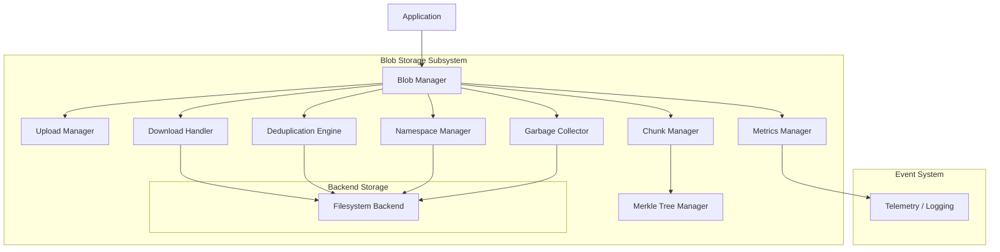

### 5.2 Blob Chunking Structure

```mermaid
graph TD
    B[Blob: 5.2 MB]
    C1[Chunk 1: 1 MB]
    C2[Chunk 2: 1 MB]
    C3[Chunk 3: 1 MB]
    C4[Chunk 4: 1 MB]
    C5[Chunk 5: 1 MB]
    C6[Chunk 6: 0.2 MB]
    
    B --> C1
    B --> C2
    B --> C3
    B --> C4
    B --> C5
    B --> C6
    
    H1[SHA-256 of Chunk 1]
    H2[SHA-256 of Chunk 2]
    H3[SHA-256 of Chunk 3]
    H4[SHA-256 of Chunk 4]
    H5[SHA-256 of Chunk 5]
    H6[SHA-256 of Chunk 6]
    
    C1 -.-> H1
    C2 -.-> H2
    C3 -.-> H3
    C4 -.-> H4
    C5 -.-> H5
    C6 -.-> H6
    
    LH1[SHA-256 of (H1 + H2)]
    LH2[SHA-256 of (H3 + H4)]
    LH3[SHA-256 of (H5 + H6)]
    
    H1 + H2 -.-> LH1
    H3 + H4 -.-> LH2
    H5 + H6 -.-> LH3
    
    RH1[SHA-256 of (LH1 + LH2)]
    RH2[SHA-256 of (LH3)]
    
    LH1 + LH2 -.-> RH1
    LH3 -.-> RH2
    
    TH[Top Hash: SHA-256 of (RH1 + RH2)]
    
    RH1 + RH2 -.-> TH
```

### 5.3 Upload Flow

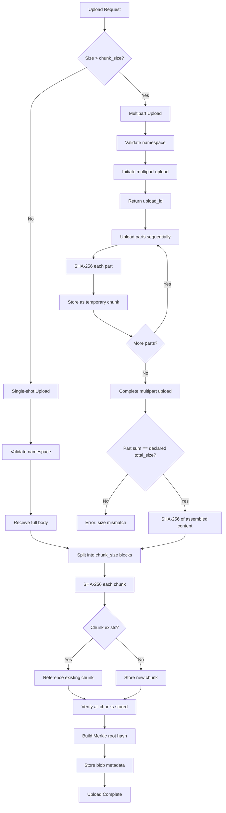

### 5.4 Filesystem Layout

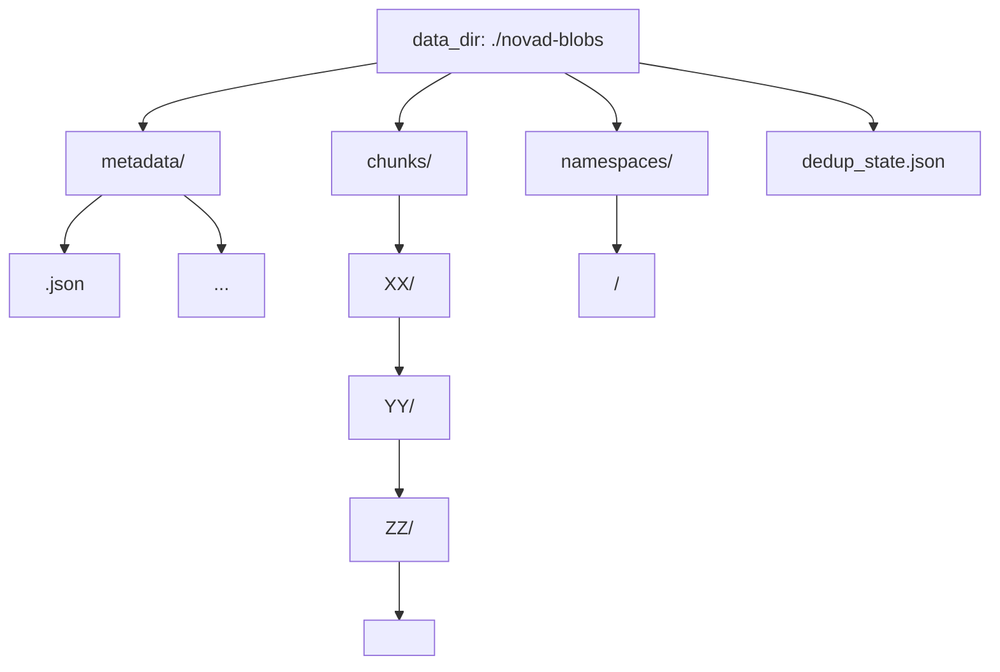

## 6. Data Structures

### 6.1 Blob Metadata

```rust
struct BlobMetadata {
    /// Blob ID (UUIDv4 as string)
    id: String,
    /// Storage namespace/bucket
    namespace: String,
    
    // Content info
    /// Total blob size in bytes
    size: u64,
    /// MIME content type
    content_type: String,
    
    // Checksums
    /// SHA-256 hex string of the entire blob
    sha256: String,                    // 64 hex chars
    /// Merkle root hash (hex string)
    merkle_root: String,              // 64 hex chars
    
    // Chunking
    /// Chunk size in bytes (default: 1_048_576 = 1 MiB)
    chunk_size: usize,
    /// Number of chunks
    chunk_count: u32,
    /// List of chunk hashes (SHA-256 hex strings)
    chunk_hashes: Vec<String>,        // 64 chars each
    
    // Multipart upload
    /// Upload ID (for multipart uploads)
    upload_id: Option<String>,
    /// Upload state: pending, completed, aborted
    upload_state: UploadState,
    
    // User metadata
    /// User-defined key-value metadata
    metadata: HashMap<String, String>,
    
    // Lifecycle
    /// Creation timestamp (Unix seconds)
    created_at: i64,
    /// Expiry timestamp (None = no expiry)
    expires_at: Option<i64>,
}
```

### 6.2 Chunk Record

```rust
/// A single chunk of blob data tracked by the dedup engine.
/// Key: SHA-256 hash of chunk content (hex string)
struct ChunkRecord {
    /// SHA-256 hex hash (content address, also the key)
    hash: String,                      // 64 hex chars
    /// Chunk data size in bytes
    size: u32,
    /// Number of blobs referencing this chunk
    ref_count: u64,
    /// Creation timestamp (Unix seconds)
    created_at: i64,
}
```

### 6.3 Upload Session

```rust
struct UploadSession {
    /// Upload ID (UUIDv4)
    upload_id: String,
    /// Namespace
    namespace: String,
    /// Blob ID (assigned on initiate)
    blob_id: String,
    /// Content type
    content_type: String,
    /// Declared total size
    total_size: u64,
    /// Uploaded part data buffers
    uploaded_parts: Vec<Vec<u8>>,
    /// Whether upload is completed
    completed: bool,
    /// Whether upload is aborted
    aborted: bool,
    /// User metadata
    metadata: HashMap<String, String>,
    /// Creation timestamp (Unix seconds)
    created_at: i64,
}

struct PartInfo {
    /// Part number (1-based)
    part_number: usize,
    /// Part size in bytes
    size: u64,
    /// SHA-256 hex hash of part content
    hash: String,
}
```

### 6.4 Namespace Quota

```rust
struct NamespaceQuota {
    pub max_blobs: u64,
    pub max_total_bytes: u64,
    pub current_blobs: u64,
    pub current_bytes: u64,
}
```

### 6.5 Blob Statistics

```rust
struct BlobStats {
    /// Total number of blobs
    total_blobs: u64,
    /// Total logical bytes stored
    total_bytes: u64,
    /// Total chunks (including duplicates)
    total_chunks: u64,
    /// Unique chunks tracked by dedup
    unique_chunks: u64,
    /// Dedup savings (ref_count > 1 contributions)
    chunk_dedup_savings: u64,
    /// Active multipart uploads
    active_uploads: u64,
    /// Number of namespaces
    namespaces: u64,
}
```

## 7. Algorithms

### 7.0 Namespace Validation

```
Algorithm: ValidateNamespace
Input:
  - name: &str

Output:
  - Result<()>

Steps:
  1. If name.is_empty():
     Return Err("namespace name cannot be empty")
  2. If name.len() > 255:
     Return Err("namespace name too long")
  3. If name contains '/' or '\\' or '..' or '\0':
     Return Err("invalid namespace name")
  4. If name contains characters other than alphanumeric, '-', '_', '.':
     Return Err("namespace must be alphanumeric")
  5. Return Ok

This validation is applied to all namespace operations:
  - create_namespace, delete_namespace (via ensure_namespace)
  - list_blobs_paginated
  - initiate_upload
  - create_blob (via ensure_namespace)
```

### 7.1 Single-Shot Upload

```
Algorithm: UploadBlob (create_blob)
Input:
  - namespace: &str
  - data: &[u8]
  - content_type: &str
  - metadata: HashMap<String, String>

Output:
  - BlobMetadata

Steps:
  1. Validate and ensure namespace exists:
     ensure_namespace(namespace)
     Check quota (blob count + byte size)
     If namespace doesn't exist, auto-create it
   
  2. Chunk the data:
     chunk_size = config.chunk_size (default: 1 MiB)
     chunks, chunk_hashes = ChunkManager::split(data)
   
  3. Compute blob SHA-256:
     sha256 = SHA-256(data) as hex string
   
  4. Build Merkle root:
     merkle_root = MerkleTree::build(&chunk_hashes)
   
  5. Deduplicate and store chunks:
     For each (chunk, hash) in (chunks, chunk_hashes):
       is_dup = dedup.record_chunk(hash, chunk.len())
       If not is_dup:
         store.put_chunk(hash, chunk)
   
  6. Create and store BlobMetadata:
     blob_id = UUIDv4
     metadata = { id, namespace, size, content_type, sha256,
                  merkle_root, chunk_size, chunk_count, chunk_hashes,
                  upload_state: Completed, metadata, created_at: now }
     store.put_metadata(&metadata)
   
  7. Update usage tracking:
     ns_manager.increment_usage(namespace, size)
     stats.increment_blobs(1), add_bytes(size), increment_chunks(chunk_count)
   
  8. Return metadata
```

### 7.2 Multipart Upload (Initiate)

```
Algorithm: InitiateMultipartUpload
Input:
  - namespace: &str
  - content_type: &str
  - metadata: HashMap<String, String>
  - declared_total_size: u64

Output:
  - UploadSession

Steps:
  1. Validate namespace (validate_namespace)
  2. Ensure namespace exists (ensure_namespace)
  3. Generate upload_id = UUIDv4, blob_id = UUIDv4
  4. Create UploadSession with state:
     upload_id, blob_id, namespace, content_type, total_size,
     empty uploaded_parts, completed: false, aborted: false
  5. Store session in memory
  6. Return UploadSession
```

### 7.3 Multipart Upload (Upload Part)

```
Algorithm: UploadPart
Input:
  - upload_id: &str
  - data: Vec<u8>

Output:
  - Result<()>

Steps:
  1. Load UploadSession by upload_id
     If not found: Return Err(UploadNotFound)
     If completed: Return Err("upload already completed")
     If aborted: Return Err("upload aborted")
   
  2. Validate total size:
     accumulated = sum of existing parts + data.len()
     If accumulated > config.max_blob_size:
       Return Err(QuotaExceeded)
   
  3. Append data to session.uploaded_parts
   
  4. Update session in memory
```

### 7.4 Multipart Upload (Complete)

```
Algorithm: CompleteMultipartUpload
Input:
  - upload_id: &str

Output:
  - BlobMetadata

Steps:
  1. Load and remove UploadSession by upload_id
     If aborted: Return Err("upload aborted")
   
  2. Validate size:
     actual_size = sum of all uploaded part sizes
     If actual_size != session.total_size:
       Return Err("declared total size does not match actual part sizes")
   
  3. Assemble data from parts:
     all_data = concat(session.uploaded_parts)
   
  4. Chunk assembled data:
     (chunks, chunk_hashes) = ChunkManager::split(&all_data)
   
  5. Compute blob SHA-256 and Merkle root
   
  6. Create BlobMetadata and store chunks via dedup
     (same as single-shot upload steps 5-7)
   
  7. Return metadata
```

### 7.5 Multipart Upload (Abort)

```
Algorithm: AbortMultipartUpload
Input:
  - upload_id: &str

Steps:
  1. Load UploadSession
  2. Mark session.aborted = true
  3. In-memory only; part buffers are dropped on session removal
```

### 7.6 Part Listing

```
Algorithm: ListParts
Input:
  - upload_id: &str

Output:
  - Vec<PartInfo>

Steps:
  1. Load UploadSession by upload_id
  2. For each uploaded part at index i:
     part_info = {
       part_number: i + 1,
       size: data.len(),
       hash: SHA-256(data) as hex
     }
  3. Return all part_infos
```

### 7.7 Blob Download (Full)

```
Algorithm: DownloadBlob
Input:
  - blob_id: &str

Output:
  - Vec<u8> (blob data)

Steps:
  1. Load BlobMetadata by blob_id
     If not found: Return Err(NotFound)
   
  2. Load all chunks:
     For each chunk_hash in metadata.chunk_hashes:
       chunk_data = store.get_chunk(chunk_hash)
       actual_hash = SHA-256(chunk_data) as hex
       If actual_hash != chunk_hash:
         Return Err(ChecksumMismatch)
       Append chunk_data to result
   
  3. Verify full blob integrity:
     full_hash = SHA-256(result) as hex
     If full_hash != metadata.sha256:
       Return Err(ChecksumMismatch)
   
  4. Return assembled blob data
```

### 7.8 Blob Download (Partial/Range)

```
Algorithm: DownloadBlobRange
Input:
  - blob_id: &str
  - offset: u64
  - length: u64

Output:
  - Vec<u8> (range data)

Steps:
  1. Load BlobMetadata
  2. Validate range:
     If offset >= metadata.size: Return Err(InvalidRange)
     end = min(offset + length, metadata.size)
   
  3. Determine which chunks to load:
     chunk_size = metadata.chunk_size
     start_chunk = offset / chunk_size
     end_chunk = (end - 1) / chunk_size
   
  4. Load relevant chunks and extract sub-range:
     For chunk_idx in start_chunk..=end_chunk:
       chunk_data = store.get_chunk(metadata.chunk_hashes[chunk_idx])
       Calculate chunk_start, chunk_end within chunk
       Extract chunk_data[chunk_start..chunk_end]
       Append to result
   
  5. Return extracted range data
```

### 7.9 Chunk Deduplication

```
Algorithm: DedupEngine::record_chunk
Input:
  - hash: &str (SHA-256 hex of chunk content)
  - size: u32

Output:
  - bool (true if duplicate, false if new)

Steps:
  1. Look up hash in in-memory map:
     If found:
       Record.ref_count += 1
       Return true (duplicate)
     If not found:
       Insert new ChunkRecord { hash, size, ref_count: 1, created_at: now }
       Return false (new chunk)
```

### 7.10 Dedup State Persistence

```
Algorithm: DedupEngine::save_state
Input:
  - path: &Path

Steps:
  1. Serialize in-memory chunk HashMap to JSON bytes
  2. Create parent directory if needed
  3. Write JSON bytes to file at path

Algorithm: DedupEngine::load_state
Input:
  - path: &Path

Steps:
  1. If file doesn't exist at path, return Ok
  2. Read file bytes
  3. Deserialize JSON into HashMap<String, ChunkRecord>
  4. Replace in-memory chunk map with deserialized data

On BlobManager initialization:
  - After backend init, call load_dedup_state()
  - On shutdown(), call save_dedup_state()
```

### 7.11 Merkle Tree Construction

```
Algorithm: MerkleTree::build
Input:
  - chunk_hashes: &[String] (hex SHA-256 hashes)

Output:
  - root_hash: String

Steps:
  1. If chunk_hashes.is_empty():
     Return SHA-256("") as hex
   
  2. Initialize current_level = chunk_hashes
   
  3. While current_level.len() > 1:
     next_level = []
     For each pair in current_level (chunks of 2):
       If pair has 2 elements:
         combined = pair[0] || pair[1] (string concatenation)
         hash = SHA-256(combined) as hex
         next_level.push(hash)
       Else:
         next_level.push(pair[0])  (promote odd element)
     current_level = next_level
   
  4. Return current_level[0] (root hash)
```

### 7.12 Garbage Collection

```
Algorithm: GarbageCollector::run_once
Input:
  - (self) references store, dedup, config

Output:
  - total_items_collected: usize

Steps:
  1. Collect unreferenced chunks:
     candidates = dedup.collect_unreferenced(gc_grace_period_secs)
     For each hash in candidates:
       store.delete_chunk(hash)
       dedup.remove_tracked(hash)
   
  2. Clean up expired blobs (TTL enforcement):
     expired_count = cleanup_expired_blobs()
   
  3. Log summary
     Return total (unreferenced + expired)

Algorithm: CleanupExpiredBlobs
Steps:
  1. List all namespaces via store
  2. For each namespace:
     List all blob IDs via store
     For each blob_id:
       Load metadata, check expires_at
       If expires_at is Some and expires_at <= now:
         Release all chunk references via dedup
         Delete chunks with ref_count reaching 0
         Delete blob metadata
         Increment count
  3. Return count of expired blobs deleted
```

### 7.13 GC Background Loop

```
Algorithm: GarbageCollector::start_background
Input:
  - self: Arc<Self>
  - interval: Duration
  - cancel: CancellationToken

Output:
  - JoinHandle<()>

Steps:
  1. Spawn tokio task with loop:
     tokio::select! {
       _ = sleep(interval) => run_once()
       _ = cancel.cancelled() => break (shutdown)
     }
```

### 7.14 Blob Deletion

```
Algorithm: DeleteBlob
Input:
  - blob_id: &str

Steps:
  1. Load BlobMetadata
  2. For each chunk_hash in metadata.chunk_hashes:
     ref_count = dedup.release_chunk(chunk_hash)
     If ref_count == 0:
       store.delete_chunk(chunk_hash)
  3. store.delete_metadata(blob_id)
  4. Update usage tracking:
     ns_manager.decrement_usage(namespace, size)
     stats.decrement_blobs(1), remove_bytes(size)
```

### 7.15 Blob Listing (Paginated)

```
Algorithm: ListBlobsPaginated
Input:
  - namespace: &str
  - offset: usize
  - limit: usize

Output:
  - (blob_ids: Vec<String>, total_count: usize)

Steps:
  1. Validate namespace (validate_namespace)
  2. List all blob IDs in namespace (via backend)
  3. Calculate total = all.len()
  4. Apply offset + limit: page = all[offset..offset+limit]
  5. Return (page, total)
```

## 8. Interfaces

### 8.1 Blob Manager

```rust
struct BlobManager {
    store: Arc<dyn BlobStore>,
    chunk_manager: ChunkManager,
    dedup: Arc<DeduplicationEngine>,
    upload_mgr: UploadManager,
    download_handler: DownloadHandler,
    gc: GarbageCollector,
    ns_manager: NamespaceManager,
    stats: Arc<StatsCollector>,
    config: BlobConfig,
}

impl BlobManager {
    async fn new(config: BlobConfig) -> Result<Self>;
    fn new_with_backend(store: Arc<dyn BlobStore>, config: BlobConfig) -> Self;
    
    // Lifecycle
    async fn shutdown(&self) -> Result<()>;
    async fn save_dedup_state(&self) -> Result<()>;
    
    // Namespace management
    async fn create_namespace(&self, namespace: &str) -> Result<()>;
    async fn delete_namespace(&self, namespace: &str) -> Result<()>;
    async fn namespace_exists(&self, namespace: &str) -> Result<bool>;
    fn set_namespace_quota(&self, namespace: &str, max_blobs: u64, max_total_bytes: u64);
    
    // Single-shot upload/download
    async fn create_blob(&self, namespace: &str, data: &[u8],
        content_type: &str, metadata: HashMap<String, String>) -> Result<BlobMetadata>;
    async fn get_blob(&self, blob_id: &str) -> Result<Vec<u8>>;
    async fn get_blob_range(&self, blob_id: &str, offset: u64, length: u64) -> Result<Vec<u8>>;
    async fn delete_blob(&self, blob_id: &str) -> Result<()>;
    async fn get_metadata(&self, blob_id: &str) -> Result<BlobMetadata>;
    async fn list_blobs(&self, namespace: &str) -> Result<Vec<String>>;
    async fn list_blobs_paginated(&self, namespace: &str, offset: usize, limit: usize)
        -> Result<(Vec<String>, usize)>;
    
    // Multipart upload
    async fn initiate_upload(&self, namespace: &str, content_type: &str,
        metadata: HashMap<String, String>, declared_total_size: u64) -> Result<UploadSession>;
    async fn upload_part(&self, upload_id: &str, data: Vec<u8>) -> Result<()>;
    async fn complete_upload(&self, upload_id: &str) -> Result<BlobMetadata>;
    async fn abort_upload(&self, upload_id: &str) -> Result<()>;
    fn list_parts(&self, upload_id: &str) -> Result<Vec<PartInfo>>;
    fn get_upload_session(&self, upload_id: &str) -> Result<UploadSession>;
    
    // GC
    async fn run_gc(&self) -> Result<usize>;
    
    // Monitoring
    fn stats(&self) -> BlobStats;
    fn dedup(&self) -> &Arc<DeduplicationEngine>;
    fn store(&self) -> &Arc<dyn BlobStore>;
    fn chunk_manager(&self) -> &ChunkManager;
}

struct BlobConfig {
    pub chunk_size: usize,                    // default: 1_048_576 (1 MiB)
    pub max_blob_size: u64,                   // default: 10 GB
    pub gc_interval_secs: u64,                // default: 3600 (1h)
    pub gc_grace_period_secs: u64,            // default: 86400 (24h)
    pub data_dir: String,                     // default: "./novad-blobs"
    pub chunk_nesting_depth: usize,           // default: 3
}
```

### 8.2 BlobStore Trait

```rust
#[async_trait]
trait BlobStore: Send + Sync {
    async fn put_metadata(&self, metadata: &BlobMetadata) -> Result<()>;
    async fn get_metadata(&self, blob_id: &str) -> Result<BlobMetadata>;
    async fn delete_metadata(&self, blob_id: &str) -> Result<()>;
    async fn put_chunk(&self, hash: &str, data: &[u8]) -> Result<()>;
    async fn get_chunk(&self, hash: &str) -> Result<Vec<u8>>;
    async fn delete_chunk(&self, hash: &str) -> Result<()>;
    async fn list_blobs(&self, namespace: &str) -> Result<Vec<String>>;
    async fn list_blobs_paginated(&self, namespace: &str, offset: usize, limit: usize)
        -> Result<(Vec<String>, usize)>;
    async fn namespace_exists(&self, namespace: &str) -> Result<bool>;
    async fn create_namespace(&self, namespace: &str) -> Result<()>;
    async fn delete_namespace(&self, namespace: &str) -> Result<()>;
    async fn list_namespaces(&self) -> Result<Vec<String>>;
}
```

### 8.3 Error Types

```rust
enum BlobError {
    NotFound(String),           // blob or chunk not found
    NamespaceNotFound(String),
    UploadNotFound(String),
    ChecksumMismatch { expected: String, actual: String },
    QuotaExceeded(String),
    InvalidRange(String),
    InvalidInput(String),
    Internal(String),           // wraps IO, serialization, etc.
}

impl From<std::io::Error> for BlobError;  // mapped to Internal
```

## 9. Sequence Diagrams

### 9.1 Single-Shot Upload

```mermaid
sequenceDiagram
    participant A as Application
    participant BM as BlobManager
    participant NS as NamespaceManager
    participant DE as DedupEngine
    participant ST as BlobStore
    participant MT as MerkleTree

    A->>BM: create_blob("images", data, content_type)
    BM->>NS: ensure_namespace("images")
    NS->>NS: validate_namespace("images")
    NS->>ST: create_namespace (if new)
    
    BM->>BM: Split data into chunks (7 chunks for 6.2MB)
    
    loop For each chunk
        BM->>DE: record_chunk(hash, size)
        alt Chunk exists (dedup)
            DE-->>BM: true (ref_count++)
        else New chunk
            DE-->>BM: false
            BM->>ST: put_chunk(hash, data)
        end
    end
    
    BM->>MT: MerkleTree::build(chunk_hashes)
    MT-->>BM: root_hash
    
    BM->>ST: put_metadata(metadata)
    BM->>NS: increment_usage(namespace, size)
    
    BM-->>A: BlobMetadata { id, size, sha256 }
```

### 9.2 Chunk Deduplication

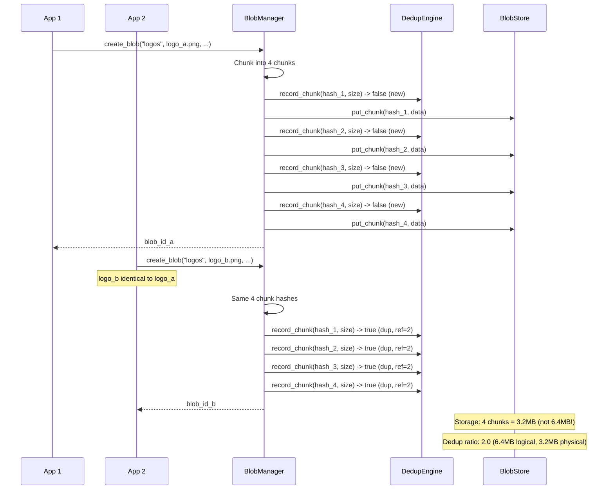

### 9.3 Multipart Upload (Large File)

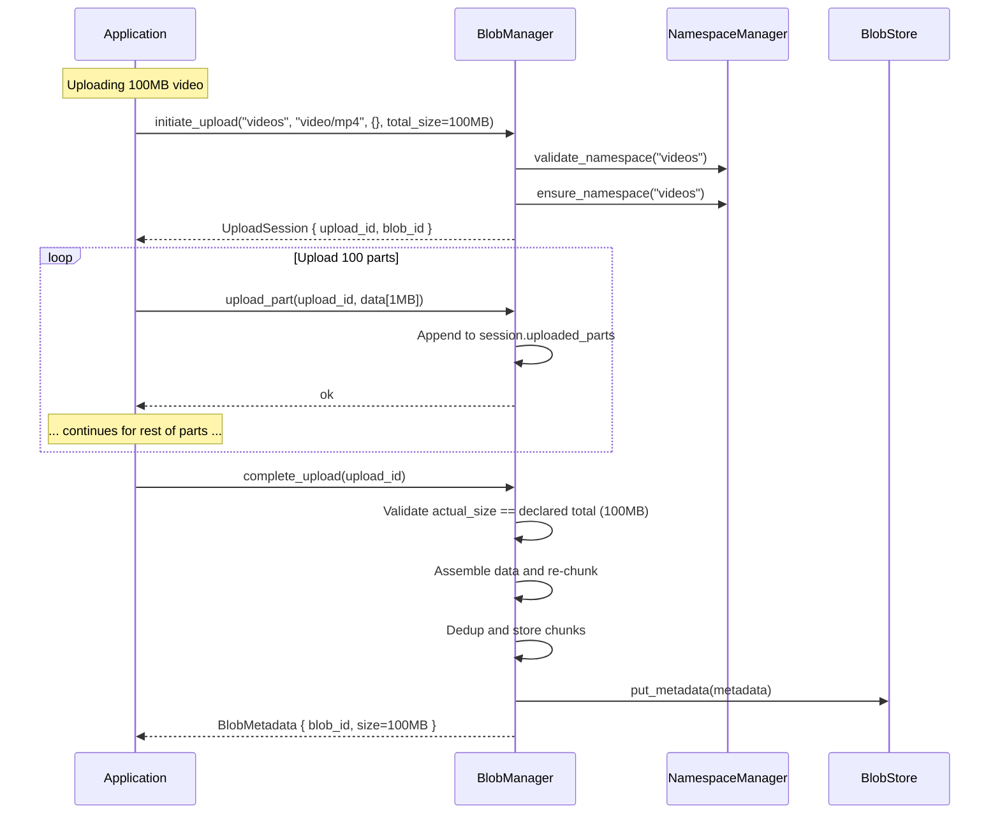

### 9.4 Full Download

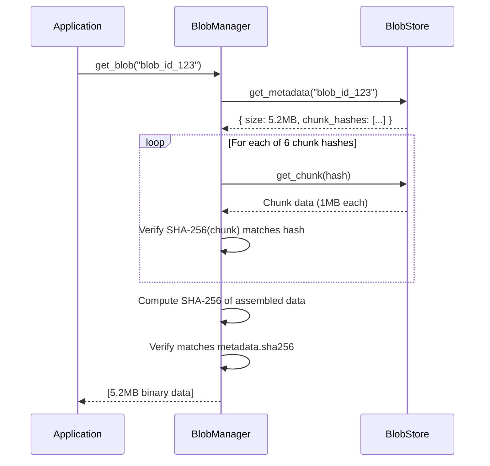

### 9.5 Range Download

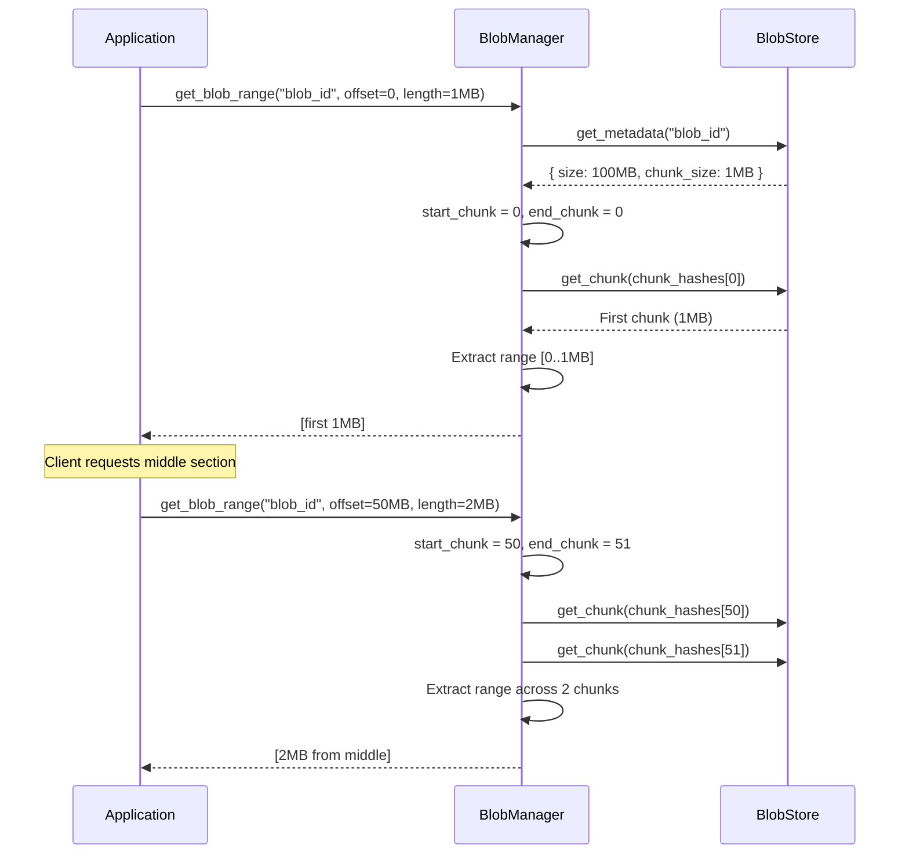

### 9.6 Garbage Collection

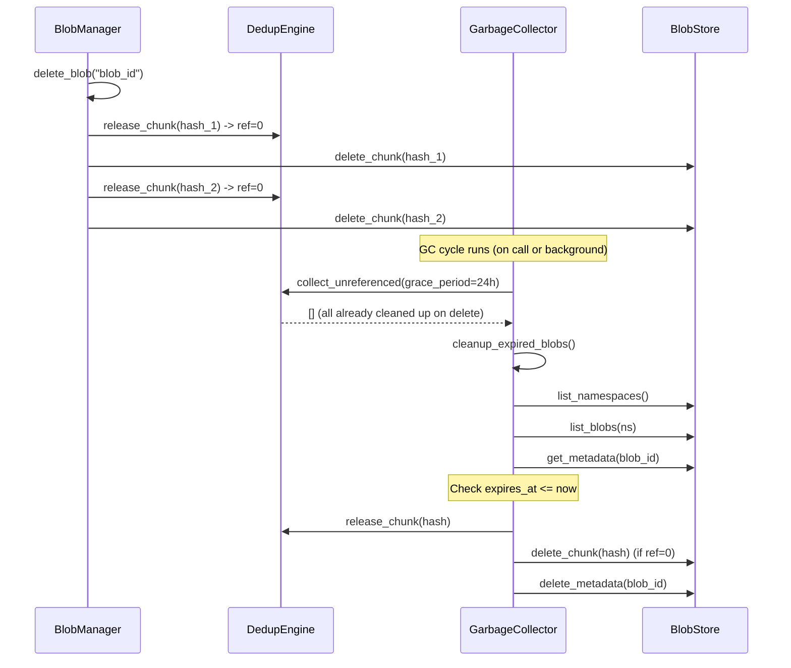

### 9.7 GC Background Loop with Graceful Shutdown

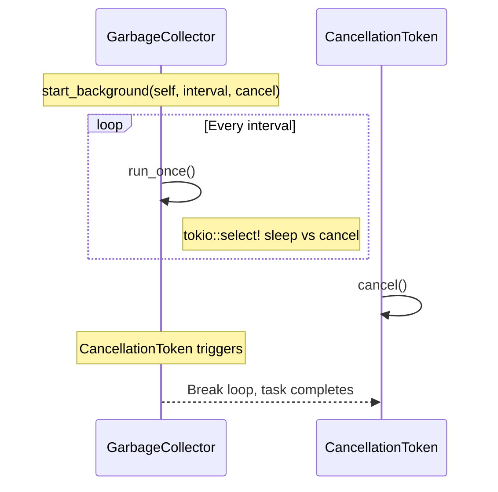

### 9.8 Dedup State Persistence on Startup/Shutdown

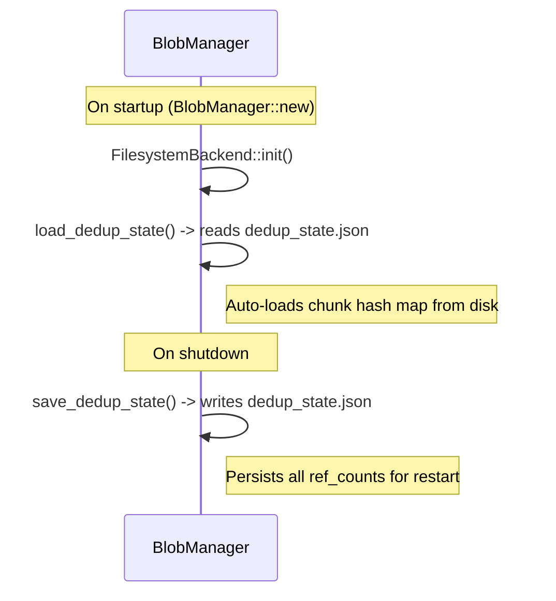

## 10. Failure Modes

### 10.1 Upload Failures

| Failure | Cause | Effect |
|---------|-------|--------|
| Blob too large | data > max_blob_size (10 GB) | Upload rejected with QuotaExceeded |
| Checksum mismatch | Data corruption | Download/read returns ChecksumMismatch |
| Chunk store failure | Filesystem full or IO error | Upload fails with Internal error |
| Part size mismatch | Declared total_size != actual part sum | complete_upload rejected with size mismatch |
| Namespace invalid | Empty, contains `/`, `\\`, `..`, `\0`, non-alphanumeric, >255 chars | Upload rejected with InvalidInput |
| Upload already completed | Client calls upload_part after complete | Error: "upload already completed" |
| Upload aborted | Client calls upload_part after abort | Error: "upload aborted" |

### 10.2 Download Failures

| Failure | Cause | Effect |
|---------|-------|--------|
| Blob not found | Blob ID invalid or deleted | Download returns NotFound |
| Blob expired | TTL reached before download | GC deletes blob; download returns NotFound |
| Chunk not found | Orphaned chunk reference | Download returns NotFound(chunk) |
| Data corruption | Bit rot on stored chunk | SHA-256 verification fails; ChecksumMismatch |
| Range invalid | offset >= blob size | Download returns InvalidRange |

### 10.3 Deduplication Failures

| Failure | Cause | Effect |
|---------|-------|--------|
| Chunk ref_count overflow | > 2^64 references to same chunk | Theoretical; essentially impossible |
| Chunk deleted while referenced | Race condition | Download fails with NotFound |
| Hash collision | SHA-256 collision | Two different chunks map to same hash; data corruption |
| Dedup state lost | No persistence file or corruption | On restart, previously stored chunks treated as new (dedup ratio reset) |

### 10.4 Garbage Collection Failures

| Failure | Cause | Effect |
|---------|-------|--------|
| Chunk in use but marked for deletion | Race condition during concurrent upload | Chunk deleted while being referenced |
| GC deletes chunk still referenced | Ref count tracking bug | Irrecoverable data loss |
| GC misses expired blobs | GC cycle fails or delayed | Storage grows unbounded with expired data |
| GC background task fails | CancellationToken cancelled | Next cycle resumes on restart |

### 10.5 Integrity Failures

| Failure | Cause | Effect |
|---------|-------|--------|
| Chunk reference points to wrong hash | Metadata corruption | SHA-256 verification catches on read |
| Duplicate blob IDs | UUID collision (negligible) | Blob metadata overwritten |

## 11. Recovery Strategy

### 11.1 Upload Failure Recovery

| Failure | Recovery |
|---------|---------|
| Upload interrupted | 1. Single-shot: client retries entire upload. 2. Multipart: client retries only failed parts. 3. Incomplete parts dropped with session. |
| Checksum mismatch | 1. Client should retry with correct data. 2. Server returns specific error identifying mismatch. |
| Chunk store failure during upload | 1. Already-stored unique chunks remain (ref_count persists). 2. Client retries; dedup identifies already-stored chunks. |
| Part size mismatch | 1. Client specifies correct total_size on initiate. 2. complete_upload validates sum matches declared total. |
| Namespace validation failure | 1. Client supplies valid alphanumeric namespace (3-255 chars). 2. Namespace must not contain path separators. |

### 11.2 Download Failure Recovery

| Failure | Recovery |
|---------|---------|
| Chunk not found | 1. Blob may have been partially deleted. 2. Re-upload blob. |
| Data corruption detected | 1. SHA-256 per chunk verifies integrity on read. 2. Re-upload corrupted blob. |
| Expired blob | 1. Client should refresh TTL before expiry. 2. Expired blob cleaned up by GC. |

### 11.3 Integrity Recovery

| Failure | Recovery |
|---------|---------|
| Checksum mismatch | 1. Per-chunk SHA-256 verification detects which chunk is corrupted. 2. Re-upload the blob. |
| Hash collision | 1. SHA-256 collision is practically impossible (2^-256). For paranoid deployments, SHA-512 option (future). |

### 11.4 GC Failure Recovery

| Failure | Recovery |
|---------|---------|
| Chunk deleted prematurely | 1. GC grace period (24h) prevents immediate deletion. 2. If chunk is re-referenced during grace, deletion is canceled. |
| GC backlog | 1. Multiple cycles clear backlog. 2. Admin can trigger manual GC. |

## 12. Performance Considerations

### 12.1 Computational Complexity

| Operation | Complexity | Notes |
|-----------|------------|-------|
| Single-shot upload | O(N) where N = file size | Chunking + hashing + storage |
| Multipart upload (per part) | O(P) where P = part size | Hashing + storage per part |
| Full download | O(N) | Read chunks + assemble |
| Range download | O(C) where C = chunks in range | Read subset of chunks |
| Dedup check | O(1) hash lookup | In-memory HashMap lookup |
| Merkle tree build | O(C) where C = chunks | Build tree from leaves |
| Merkle tree verify | O(log C) | Verify single chunk |
| GC cycle | O(M) where M = chunks + blobs | Scan and delete |

### 12.2 Memory Usage

| Component | Memory | Notes |
|-----------|--------|-------|
| Upload buffer | Up to max_blob_size (10 GB worst case) | Parts held in memory until complete |
| Dedup index | ~60 bytes per unique chunk | HashMap of ChunkRecord |
| Metadata cache | Variable | Per-blob metadata loaded on demand |
| Merkle tree | ~64 bytes per chunk (hex strings) | Only root hash stored; rebuilt on demand |

### 12.3 I/O Characteristics

| Operation | I/O Pattern | Frequency |
|-----------|-------------|-----------|
| Upload (single) | Sequential write of N chunks | Per blob upload |
| Upload (multipart) | Sequential writes to memory | Per part upload |
| Download (full) | Sequential read of N chunk files | Per blob download |
| Download (range) | Random read of C chunk files | Per range request |
| Dedup persistence | 1 write on shutdown, 1 read on startup | Per lifecycle |
| GC cycle | Sequential scan of namespaces/blobs | Every gc_interval_secs |

### 12.4 Storage Overhead

| Component | Overhead | Notes |
|-----------|----------|-------|
| Blob metadata | ~200 bytes + chunk hashes | JSON file per blob |
| Chunk data | chunk_size bytes + file overhead | Filesystem-level storage |
| Dedup state | ~60 bytes per unique chunk | dedup_state.json |
| Namespace marker | 0 bytes (empty directory) | Directory entry |

For 1 GB blob (1024 chunks):
- Metadata: ~200 + 1024 * 64 = ~65 KB
- Chunk data: 1024 * 1,048,576 = 1 GB
- Dedup state entry: ~60 bytes per unique chunk
- Total overhead: ~65 KB on 1 GB = ~0.006% overhead

### 12.5 Throughput Targets

| Operation | Target | Notes |
|-----------|--------|-------|
| Single-shot upload (1 MB) | 10,000 blobs/s | Small files, max throughput |
| Single-shot upload (10 MB) | 1,000 blobs/s | Limited by chunking + hashing |
| Single-shot upload (1 GB) | 10 blobs/s | Large file, sequential write |
| Multipart upload (per part) | 5,000 parts/s | Sequential parts |
| Full download (1 MB) | 15,000 downloads/s | Single chunk read |
| Full download (10 MB) | 1,500 downloads/s | Sequential read |
| Range download (1 MB) | 15,000 requests/s | Single chunk read |
| GC cleanup | 10,000 items/cycle | Rate-limited to avoid I/O spikes |

### 12.6 Bottlenecks

- **SHA-256 hashing**: CPU-bound. Each chunk requires SHA-256 for dedup. Mitigation: Use hardware-accelerated SHA (SHA-NI instructions).
- **Chunk storage writes**: I/O-bound. Each unique chunk requires a filesystem write.
- **Large blob assembly**: Memory-bound for very large blobs. Mitigation: Streaming assembly (future).
- **Dedup hash lookups**: In-memory, fast (HashMap). State persistence is a single read/write.

## 13. Security

### 13.1 Threat Model

| Threat | Vector | Impact | Severity |
|--------|--------|--------|----------|
| Unauthorized blob read | No auth on download | Data exposure | Critical |
| Unauthorized blob write | No auth on upload | Malware storage, storage fill | High |
| Namespace injection | Malicious namespace with path separators | Directory traversal, arbitrary file write | Critical |
| Path traversal via namespace | Namespace containing `..` or `/` | Access files outside data_dir | Critical |
| Storage quota bypass | Upload without namespace limits | Storage exhaustion | High |
| Metadata injection | Malicious metadata keys/values | Metadata processing vulnerability | Low |
| Chunk hash collision | Theoretical SHA-256 collision | Wrong data returned (negligible risk) | Low |
| Multipart upload abuse | Initiate many uploads without completing | Memory exhaustion | Medium |

### 13.2 Mitigations

| Threat | Mitigation |
|--------|------------|
| Unauthorized access | All blob operations authenticated via Auth subsystem. Per-namespace RBAC. |
| Namespace injection / path traversal | `validate_namespace()` rejects names with `/`, `\\`, `..`, `\0`, non-alphanumeric chars, and names > 255 chars. Applied to ALL namespace operations. |
| Storage quota abuse | Per-namespace max_blobs and max_total_bytes quotas. Global max_blob_size limit (10 GB). |
| Metadata injection | Metadata key/value stored as-is (application responsibility). |
| Chunk content integrity | SHA-256 per chunk verified on every read. Full blob SHA-256 verified on download. |

### 13.3 Content Verification

- All blobs have SHA-256 checksum computed on upload
- Chunk-level SHA-256 computed for each chunk
- On download, each chunk hash is verified
- On download, full blob SHA-256 is verified
- Merkle root hash provides additional integrity layer

### 13.4 Data Isolation

- Blobs are isolated by namespace (logical bucket)
- Namespace names are validated for security
- Chunk nesting depth configurable to spread files across directories
- No cross-namespace access without explicit auth

## 14. Testing

### 14.1 Unit Tests

```
Test Suite: ChunkManager (5 tests)
  - test_split_small_data
  - test_split_empty_data
  - test_split_multiple_chunks
  - test_hash_consistency
  - test_chunk_count

Test Suite: DeduplicationEngine (4 tests)
  - test_record_new_chunk
  - test_record_duplicate_chunk
  - test_release_chunk
  - test_is_duplicate

Test Suite: MerkleTree (4 tests)
  - test_build_single_chunk
  - test_verify_valid_proof
  - test_verify_invalid_proof
  - test_build_empty

Test Suite: DownloadHandler (4 tests)
  - test_download_full
  - test_download_range_middle
  - test_download_range_exact_end
  - test_download_range_invalid_offset

Test Suite: GarbageCollector (2 tests)
  - test_gc_no_unreferenced
  - test_gc_collects_unreferenced
```

### 14.2 Integration Tests

```
Test Suite: BlobManager Integration (15 tests)
  - test_create_and_get
  - test_metadata_roundtrip
  - test_delete
  - test_namespace_isolation
  - test_range_download
  - test_chunk_dedup
  - test_empty_blob
  - test_merkle_integrity
  - test_namespace_validation
      - empty namespace rejected
      - namespace with '/' rejected
      - namespace with '\' rejected
      - namespace with '..' rejected
      - namespace with null byte rejected
      - namespace >255 chars rejected
      - valid alphanumeric namespace accepted
  - test_blob_listing_pagination
      - 25 blobs split across 3 pages (10, 10, 5)
      - total count returned correctly
      - no overlap between pages
  - test_ttl_expiry
      - expired blob (expires_at = 0) cleaned up by GC
  - test_gc_shutdown
      - CancellationToken cancels background GC loop
  - test_dedup_persistence
      - Saved dedup state survives manager restart
  - test_upload_part_listing
      - list_parts returns correct part_number, size, hash
  - test_upload_size_validation
      - complete_upload fails when actual != declared total_size
      - complete_upload succeeds when sizes match
```

### 14.3 Edge Cases

```
- Empty blob (0 bytes): stored with 1 empty chunk.
- Single byte blob: stored as 1 chunk of 1 byte.
- Blob exactly chunk_size: stored as exactly 1 chunk.
- Blob of chunk_size + 1: stored as 2 chunks.
- Blob at maximum size (10 GB): stored as 10,240 chunks.
- Namespace with '-' '_' '.' characters: allowed.
- Namespace empty, '/', '\\', '..', '\0': rejected.
- Namespace > 255 chars: rejected.
- Namespace non-alphanumeric: rejected.
- Multipart upload with actual size != declared total: rejected.
- TTL of 0: expires immediately (epoch 0).
- Concurrent uploads of same blob_id: each gets different UUID.
```

## 15. Future Work

1. **Encryption at Rest**: Transparent encryption of chunk data using AES-256-GCM. Per-namespace encryption keys. Key rotation support.

2. **Server-Side Compression**: Compress chunks using zstd before storage. Configurable per namespace or per blob (based on content type).

3. **S3-Compatible API Layer**: Expose S3-compatible REST API for tooling compatibility (AWS SDK, S3 clients).

4. **CDN Integration**: Integrate with CDN providers for large-file delivery. Cache headers and signed URLs.

5. **Versioning**: Blob versioning with immutable version IDs. Point-in-time restore capability.

6. **Blob Events**: Webhook notifications for blob creation, deletion, and access (for content processing pipelines).

7. **Image Processing**: Server-side image resize, format conversion, and thumbnail generation.

8. **Presigned URLs**: Time-limited URLs for direct upload/download without authentication headers.

9. **Storage Tiers**: Hot (SSD), Warm (HDD), Cold (S3-compatible) tiering with automated lifecycle policies.

10. **Cross-Region Replication**: Replicate blob data across multiple Nova Runtime instances (requires clustering).

11. **Content-Type Validation**: Validate uploaded content matches declared content type (magic byte detection).

12. **Antivirus Scanning**: Integrate with ClamAV or similar for upload-time virus scanning.

13. **Dedup at Blob Level**: Whole-blob deduplication (if entire blob is identical, reference existing).

14. **Incremental Backup**: Efficient incremental backup using Merkle tree (transfer only changed chunks).

15. **FUSE Mount**: Mount a namespace as a FUSE filesystem for direct file system access.

## 16. Open Questions

1. **Chunk size why 1 MiB?**: 1 MiB provides a good balance between: (a) reasonable granularity for deduplication, (b) manageable number of chunks for large files (10K chunks per 10 GB), (c) efficient I/O (sequential reads of 1 MiB are fast on modern SSDs). Smaller chunks (256 KB) would increase dedup ratio but also increase metadata overhead and I/O operations. Larger chunks (4 MiB) would reduce metadata but also reduce dedup opportunities.

2. **Deduplication at chunk level vs blob level**: Chunk-level dedup detects partial content matches (e.g., two ISO files that share most blocks). Blob-level dedup only catches exact duplicates. Chunk-level dedup adds complexity (ref counting, GC). Decision: Chunk-level.

3. **To compress or not to compress**: Compression reduces storage but (a) prevents simple range requests (must decompress to seek), (b) adds CPU cost, (c) reduces dedup effectiveness (same content compressed differently). Decision: No compression in v1.

4. **Maximum blob size: 10 GB default**: The 10 GB limit is chosen as the practical limit for single-shot upload (memory and timeout considerations). Multipart upload allows up to 10 GB as well. The limit is configurable via BlobConfig.

5. **Multipart part size flexibility**: AWS S3 requires all parts except the last to be the same size. Decision: We don't enforce this; parts can be different sizes. On completion, we re-chunk into chunk_size blocks anyway.

6. **Garbage collection strategy: reference counting vs mark-sweep**: Reference counting is simpler and immediate but can leak if ref counts are missed. Decision: Reference counting with GC grace period (24h) to prevent premature deletion.

7. **Dedup state persistence**: On restart, previously tracked chunks are reloaded from dedup_state.json. Without persistence, the dedup ratio resets (chunks are re-stored, but filesystem storage is not duplicated — only in-memory ref counts are lost).

8. **Namespace vs bucket vs collection**: We use "namespace" as the container term. It maps directly to a filesystem directory in the backend. Namespaces are validated to prevent path traversal.

9. **Integrity verification frequency**: SHA-256 is verified on every chunk read and on full blob download. Merkle tree verification is optional and available via the MerkleTree module.

10. **Content addressing with SHA-256 why not BLAKE3?**: SHA-256 is FIPS-compliant, hardware-accelerated (SHA-NI), and widely understood. BLAKE3 is faster but less universally supported. Decision: SHA-256. Future migration to BLAKE3 if performance becomes a bottleneck.

## 17. References

1. **Content-Addressable Storage**: Quinlan, S. & Dorward, S. (2002). Venti: A New Approach to Archival Storage. USENIX FAST.

2. **Merkle Tree**: Merkle, R. C. (1980). Protocols for Public Key Cryptosystems. IEEE Symposium on Security and Privacy.

3. **SHA-256**: NIST. FIPS PUB 180-4: Secure Hash Standard (SHS).
   - https://nvlpubs.nist.gov/nistpubs/FIPS/NIST.FIPS.180-4.pdf

4. **Amazon S3 Multipart Upload**: AWS. Uploading objects using multipart upload.
   - https://docs.aws.amazon.com/AmazonS3/latest/userguide/mpuoverview.html

5. **UUIDv4**: Leach, P., Mealling, M., & Salz, R. (2005). A Universally Unique IDentifier (UUID) URN Namespace. RFC 4122.
   - https://tools.ietf.org/html/rfc4122

## 18. Recent Enhancements

### 18.1 Namespace Validation (namespace.rs:23-37)

The `validate_namespace()` function provides comprehensive input sanitization for all namespace operations. It rejects:

- Empty strings
- Names containing `/`, `\\`, `..`, or `\0` (path traversal prevention)
- Non-alphanumeric characters (only `-`, `_`, `.` allowed in addition to alphanumeric)
- Names longer than 255 characters

Validation is enforced in `ensure_namespace()`, `delete_namespace()`, `list_blobs_paginated()`, and `initiate_upload()`, covering every entry point that accepts user-supplied namespace values.

### 18.2 Blob Listing with Pagination (manager.rs:185-188, filesystem.rs:147-152)

The `list_blobs_paginated(namespace, offset, limit)` method returns `(Vec<String>, usize)` — a page of blob IDs and the total count across all pages. This allows efficient paginated browsing of namespaces. The backend implements pagination by fetching all blobs, filtering by namespace, then applying offset/limit in memory. Namespace validation is applied before listing.

### 18.3 TTL Enforcement via GC (gc.rs:65-103)

The `cleanup_expired_blobs()` method iterates all namespaces and blobs, checking each blob's `expires_at` field against the current time. Expired blobs are fully cleaned up: chunk ref counts are decremented, chunks with zero refs are deleted from the filesystem, and blob metadata is removed. This is called as part of every `run_once()` GC cycle.

### 18.4 GC Graceful Shutdown (gc.rs:105-126)

The background GC loop was rearchitected from a busy-loop pattern to a proper cooperative shutdown using `tokio::select!` and `tokio_util::sync::CancellationToken`:

- `start_background(self: Arc<Self>, interval: Duration, cancel: CancellationToken) -> JoinHandle<()>` spawns a `tokio::spawn` task
- Inside the loop, `tokio::select!` races `tokio::time::sleep(interval)` against `cancel.cancelled()`
- On cancellation, the loop breaks cleanly and the task completes
- `shutdown()` sets an internal `AtomicBool` flag for state tracking

### 18.5 Upload Part Listing (upload.rs:183-199)

The `list_parts(upload_id)` method returns `Vec<PartInfo>` with each part's `part_number`, `size` (bytes), and `hash` (SHA-256 hex). This enables clients to inspect the current state of a multipart upload, verify which parts have been received, and resume incomplete uploads.

### 18.6 Upload Size Validation (upload.rs:113-129)

`complete_upload()` validates that the sum of all uploaded part sizes exactly matches the `declared_total_size` provided during `initiate_upload()`. If `actual_size != session.total_size`, the completion fails with an error message detailing the mismatch. This prevents silent data truncation and ensures client-server agreement on blob size.

### 18.7 Dedup State Persistence (dedup.rs:88-112, manager.rs:66-89)

The `DeduplicationEngine` now supports `save_state(path)` and `load_state(path)` methods that serialize/deserialize the in-memory chunk hash map to JSON. The `BlobManager`:

- Auto-loads state from `<data_dir>/dedup_state.json` on initialization (`load_dedup_state()`)
- Explicitly saves state via `save_dedup_state()` and on `shutdown()`
- Uses `serde_json` for serialization

This ensures dedup ref counts survive process restarts, preventing duplicate storage after a restart.

### 18.8 Configurable Chunk Nesting Depth (config.rs:16, filesystem.rs:40-48)

The `chunk_nesting_depth` configuration parameter (default: 3) controls the directory structure for chunk storage. Instead of a flat directory or hardcoded 2-level nesting, the chunk path is computed as:

```
<data_dir>/chunks/XX/YY/ZZ/<full_hash>
```

Where `XX`, `YY`, `ZZ` are successive 2-character prefixes of the SHA-256 hash. A depth of 3 produces 4096^3 = ~68 billion possible leaf directories, preventing any single directory from containing too many entries. The nesting depth is configurable per `BlobConfig` instance.

### 18.9 Filesystem Error Handling (filesystem.rs:108-117)

Directory cleanup after chunk deletion was improved from silent error swallowing:

```
// Before: let _ = fs::remove_dir(...)
// After: tracing::warn!("failed to clean up dir {:?}: {}", ancestor, e)
```

Failed directory removals during chunk deletion ancestor cleanup now produce warning logs instead of being silently ignored. This aids debugging of filesystem permission issues and disk quota problems.

### 18.10 Default data_dir (config.rs:23)

The default data directory was changed from `/var/lib/novad/blobs` to `./novad-blobs`. This makes the system immediately usable without root privileges and aligns with convention-over-configuration for development deployments. Production deployments should explicitly configure the data directory.

### 18.11 Test Coverage Expansion

The test suite grew from 8 integration tests to 19 integration tests (in `blob_integration.rs`) plus 19 unit tests across modules. New test categories include:

- **Namespace Validation** (6 test cases): empty, `/`, `\\`, `..`, null byte, >255 chars, valid names
- **Blob Listing Pagination**: 25 blobs across 3 pages, disjointness verification, total count correctness
- **TTL Expiry**: Expired blob cleanup via GC
- **GC Shutdown**: CancellationToken-based graceful shutdown verification
- **Dedup Persistence**: State save/load roundtrip across separate `BlobManager` instances
- **Upload Part Listing**: Correct part_number, size, hash for multipart uploads
- **Upload Size Validation**: Declared total vs actual part sum mismatch detection

### 18.12 Security: Path Traversal Prevention

Namespace validation (`validate_namespace()`) serves as the primary defense against path traversal attacks. By rejecting `/`, `\\`, `..`, `\0`, and non-alphanumeric characters, the system ensures that namespace values cannot escape the configured `data_dir`. This prevents an attacker from reading or writing arbitrary files outside the blob storage directory by crafting malicious namespace names. Combined with UUIDv4 blob IDs (non-sequential, 122 bits of entropy), the system provides strong isolation between namespaces and resistance to enumeration.
