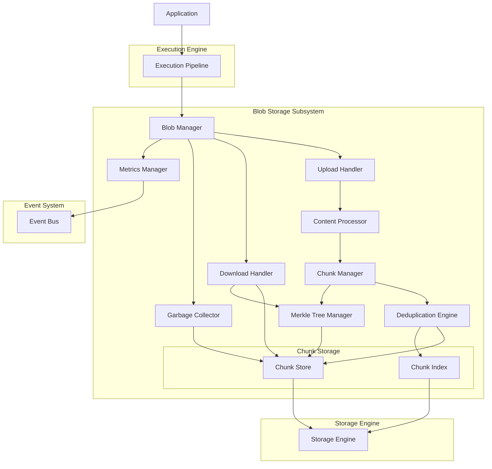
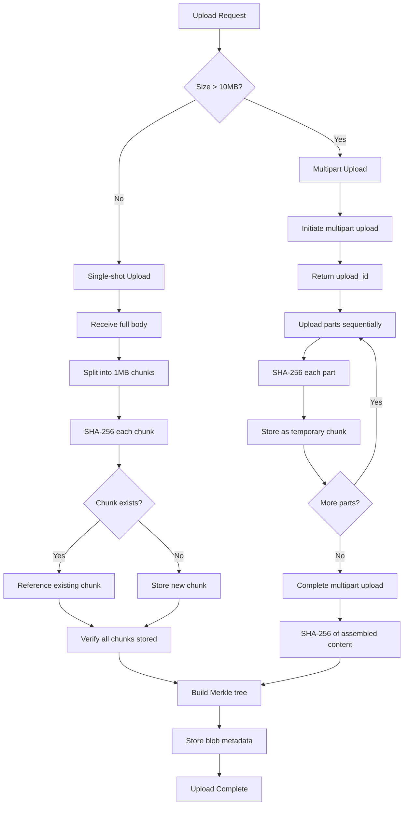
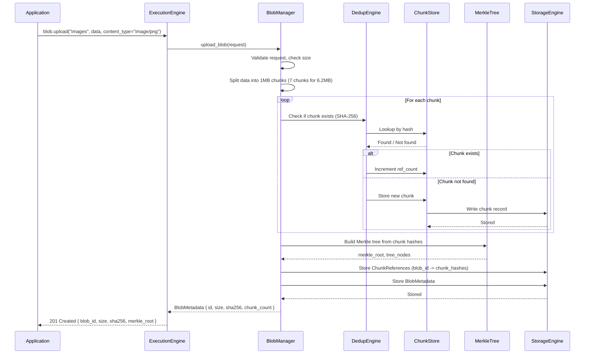
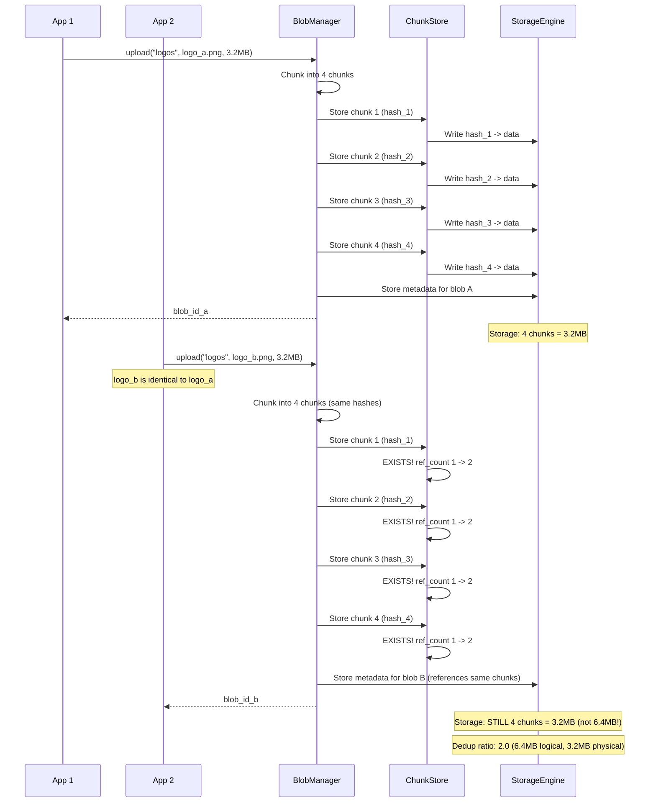
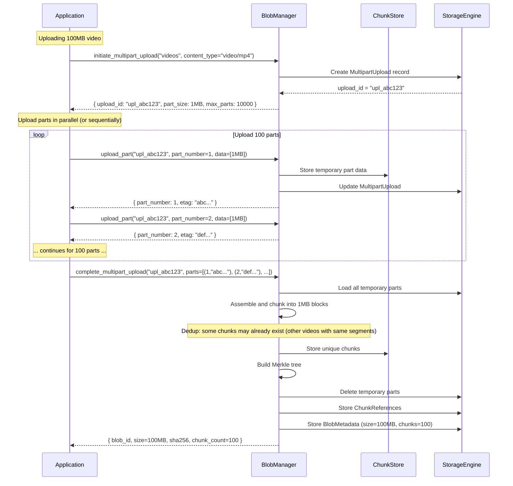
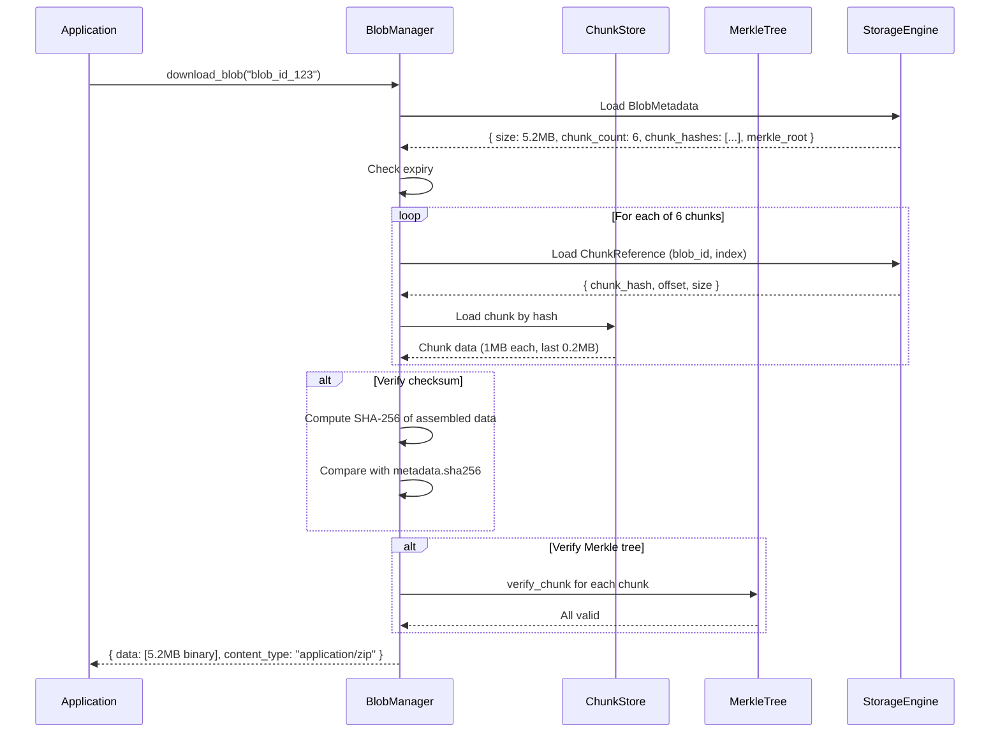
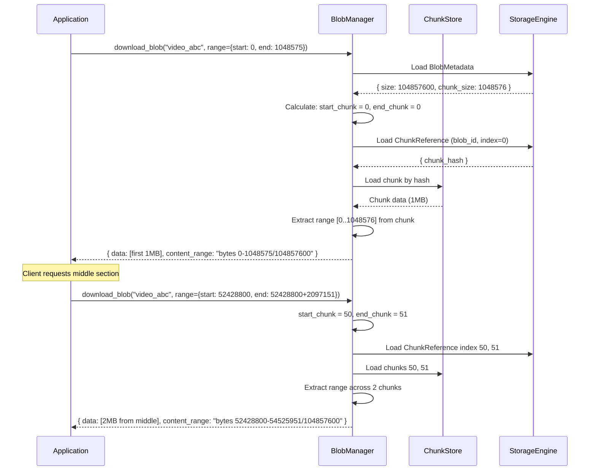
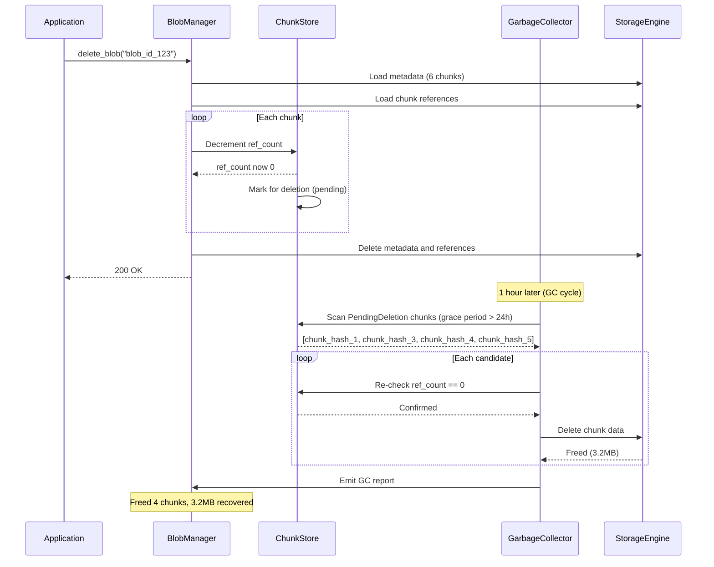

# 20. Blob Storage Subsystem

## 1. Purpose

The Blob Storage subsystem provides object storage capabilities within Nova Runtime, enabling applications to store, retrieve, and manage arbitrary binary data (blobs). Unlike the Queue (transient messages) or Search (indexed text), Blob Storage is designed for durable, large-object persistence with content-addressable deduplication, streaming upload/download, and optional TTL-based expiry. It is the system's general-purpose binary data lake.

## 2. Scope

This document covers the complete blob storage subsystem:

- Blob structure (ID, content, content type, size, checksum, metadata, timestamps)
- Chunking algorithm (fixed-size 1 MB chunks with Merkle tree integrity)
- Deduplication (content-addressed storage using SHA-256)
- Upload mechanism (direct single-shot and multipart/chunked upload)
- Download mechanism (full and range requests for partial downloads)
- TTL/expiry for temporary blobs
- Maximum blob size (5 TB effective, 10 GB recommended)
- Storage mapping (chunks stored as records in Storage Engine)
- Blob metadata management
- Checksum verification for data integrity
- Garbage collection for orphaned chunks

Out of scope: CDN integration (future), compression at rest (future), encryption at rest (future), S3-compatible API layer (future), cross-region replication (future).

## 3. Responsibilities

- Accept blob data via single-shot and multipart uploads
- Store blob data as fixed-size chunks in the Storage Engine
- Compute and verify content hashes (SHA-256) for integrity
- Implement content-addressable deduplication (identical content stored once)
- Support full and ranged downloads
- Maintain blob metadata (content type, size, checksum, user metadata)
- Enforce blob TTL/expiry for temporary storage
- Manage multipart upload lifecycle (initiate, upload parts, complete, abort)
- Verify chunk integrity on read using Merkle tree
- Provide checksums for uploaded and downloaded data
- Track blob storage usage and quotas
- Garbage collect orphaned chunks (no blob references them)
- Report storage metrics (total size, chunk count, deduplication ratio)

## 4. Non Responsibilities

- CDN integration or edge caching (future)
- Server-side compression (future; client may compress before uploading)
- Encryption at rest (future; Storage Engine will support encryption)
- S3-compatible API layer (future; exposes internal API initially)
- Cross-region replication (clustering is future)
- Versioning beyond blob ID (handled by application)
- Image/video transcoding or processing (future)
- File system mounting or FUSE integration (future)
- Backup and archival tiering (hot/cold storage separation, future)

## 5. Architecture

### 5.1 High-Level Architecture



### 5.2 Blob Chunking Structure

```mermaid
graph TD
    B[Blob: 5.2 MB]
    C1[Chunk 1: 1 MB]
    C2[Chunk 2: 1 MB]
    C3[Chunk 3: 1 MB]
    C4[Chunk 4: 1 MB]
    C5[Chunk 5: 1 MB]
    C6[Chunk 6: 0.2 MB]
    
    B --> C1
    B --> C2
    B --> C3
    B --> C4
    B --> C5
    B --> C6
    
    H1[SHA-256 of Chunk 1]
    H2[SHA-256 of Chunk 2]
    H3[SHA-256 of Chunk 3]
    H4[SHA-256 of Chunk 4]
    H5[SHA-256 of Chunk 5]
    H6[SHA-256 of Chunk 6]
    
    C1 -.-> H1
    C2 -.-> H2
    C3 -.-> H3
    C4 -.-> H4
    C5 -.-> H5
    C6 -.-> H6
    
    LH1[SHA-256 of (H1 + H2)]
    LH2[SHA-256 of (H3 + H4)]
    LH3[SHA-256 of (H5 + H6)]
    
    H1 + H2 -.-> LH1
    H3 + H4 -.-> LH2
    H5 + H6 -.-> LH3
    
    RH1[SHA-256 of (LH1 + LH2)]
    RH2[SHA-256 of (LH3)]
    
    LH1 + LH2 -.-> RH1
    LH3 -.-> RH2
    
    TH[Top Hash: SHA-256 of (RH1 + RH2)]
    
    RH1 + RH2 -.-> TH
```

### 5.3 Upload Flow



## 6. Data Structures

### 6.1 Blob Metadata

```rust
struct BlobMetadata {
    /// Blob ID (UUIDv4)
    id: [u8; 16],                    // 16 bytes
    /// Storage namespace/bucket
    namespace: String,                // variable, max 128 bytes
    
    // Content info
    /// Total blob size in bytes
    size: u64,                       // 8 bytes
    /// MIME content type
    content_type: String,             // variable, max 128 bytes
    /// Content encoding (e.g., "gzip")
    content_encoding: Option<String>, // variable, max 32 bytes
    
    // Checksums
    /// SHA-256 of the entire blob
    sha256: [u8; 32],                // 32 bytes
    /// SHA-256 of the Merkle root (top hash)
    merkle_root_hash: [u8; 32],      // 32 bytes
    
    // Chunking
    /// Chunk size in bytes (fixed: 1_048_576 = 1 MiB)
    chunk_size: u32,                 // 4 bytes
    /// Number of chunks
    chunk_count: u64,                // 8 bytes
    /// List of chunk hashes (SHA-256 of each chunk)
    chunk_hashes: Vec<[u8; 32]>,     // 32 bytes each
    /// Merkle tree (all internal nodes, breadth-first)
    merkle_tree: Option<Vec<[u8; 32]>>, // variable
    
    // Deduplication
    /// Number of unique chunks (for dedup ratio calculation)
    unique_chunk_count: u64,         // 8 bytes
    /// Storage size after deduplication
    storage_size: u64,               // 8 bytes
    
    // Multipart upload
    /// Upload ID (for multipart uploads)
    upload_id: Option<String>,        // variable, max 64 bytes
    /// Upload state: pending, active, completed, aborted
    upload_state: Option<UploadState>, // 1 byte
    
    // User metadata
    /// User-defined key-value metadata
    metadata: HashMap<String, String>, // variable, max 64 entries, 8 KB total
    
    // Lifecycle
    /// Creation timestamp (Unix nanoseconds)
    created_at: i64,                 // 8 bytes
    /// Last modification timestamp (Unix nanoseconds)
    updated_at: i64,                 // 8 bytes
    /// Expiry timestamp (None = no expiry)
    expires_at: Option<i64>,         // 8 bytes
    
    // Access tracking
    /// Last access timestamp (Unix nanoseconds)
    last_accessed_at: Option<i64>,   // 8 bytes
    /// Access count
    access_count: u64,              // 8 bytes
    
    // Owner
    /// Owner principal ID
    owner_id: Option<[u8; 16]>,     // 16 bytes
}
// Minimum: ~144 bytes + variable fields
// With 100 chunks: ~144 + 3200 = ~3344 bytes
```

### 6.2 Chunk Record

```rust
/// A single chunk of blob data.
/// Key: SHA-256 hash of chunk content (content-addressed)
/// Value: ChunkRecord
struct ChunkRecord {
    /// SHA-256 hash (content address, also the key)
    hash: [u8; 32],                  // 32 bytes
    
    /// Chunk data
    data: Vec<u8>,                   // variable, max 1_048_576 bytes (1 MiB)
    
    /// Compression info
    /// Whether chunk is compressed (future)
    compressed: bool,                // 1 byte
    /// Original size before compression
    original_size: Option<u64>,      // 8 bytes
    
    // Reference counting
    /// Number of blobs referencing this chunk
    ref_count: u64,                  // 8 bytes
    
    /// Creation timestamp (Unix nanoseconds)
    created_at: i64,                 // 8 bytes
    /// Last reference update (Unix nanoseconds)
    last_ref_update: i64,           // 8 bytes
    
    // Storage info
    /// Storage Engine partition
    partition: u64,                  // 8 bytes
    /// Storage Engine record version
    record_version: u32,            // 4 bytes
}
// Minimum: ~70 bytes + data
// Typical chunk: 1 MB data + ~70 bytes overhead = ~1,000,070 bytes
```

### 6.3 Chunk Reference

```rust
/// Maps blob chunks to their content hashes.
/// Key: (blob_id, chunk_index)
/// Value: ChunkReference
struct ChunkReference {
    /// Blob ID
    blob_id: [u8; 16],              // 16 bytes
    /// Chunk index (0-based)
    chunk_index: u64,                // 8 bytes
    /// SHA-256 hash of chunk content
    chunk_hash: [u8; 32],           // 32 bytes
    /// Chunk offset in blob
    offset: u64,                     // 8 bytes
    /// Chunk size (last chunk may be smaller)
    size: u32,                       // 4 bytes
}
// Total: 68 bytes per chunk reference
```

### 6.4 Multipart Upload

```rust
struct MultipartUpload {
    /// Upload ID (UUIDv4)
    id: String,                      // 36 bytes
    /// Blob ID (if already assigned)
    blob_id: Option<[u8; 16]>,      // 16 bytes
    /// Namespace
    namespace: String,               // variable, max 128 bytes
    
    /// Upload state
    state: UploadState,              // 1 byte enum
    /// Creation timestamp (Unix nanoseconds)
    created_at: i64,                 // 8 bytes
    /// Last activity timestamp (Unix nanoseconds)
    last_active_at: i64,            // 8 bytes
    
    // Upload configuration
    /// Content type
    content_type: String,            // variable, max 128 bytes
    /// Content encoding
    content_encoding: Option<String>, // variable, max 32 bytes
    /// User metadata
    metadata: HashMap<String, String>, // variable
    
    // Parts tracking
    /// Number of parts
    part_count: u32,                // 4 bytes
    /// Parts received (part_number -> PartInfo)
    parts: HashMap<u32, PartInfo>,   // variable
    /// Expected total size (if known)
    expected_size: Option<u64>,      // 8 bytes
    
    // Completion
    /// Blob SHA-256 (computed from parts)
    blob_sha256: Option<[u8; 32]>,  // 32 bytes
    /// Merkle root hash
    merkle_root: Option<[u8; 32]>,  // 32 bytes
}

struct PartInfo {
    /// Part number (1-based)
    part_number: u32,               // 4 bytes
    /// Part size in bytes
    size: u64,                      // 8 bytes
    /// SHA-256 of part content
    sha256: [u8; 32],               // 32 bytes
    /// ETag (for client reference)
    etag: String,                    // variable, 32 bytes (hex of sha256)
    /// Chunk hash (if part maps to a single chunk)
    chunk_hash: Option<[u8; 32]>,   // 32 bytes
    /// Received timestamp (Unix nanoseconds)
    received_at: i64,               // 8 bytes
}
// Total per part: ~92 bytes + etag string
```

### 6.5 Upload Request

```rust
struct UploadBlobRequest {
    /// Namespace/bucket
    pub namespace: String,
    /// Blob ID (optional, generated if not provided)
    pub blob_id: Option<String>,
    /// Content type (MIME)
    pub content_type: String,
    /// Content encoding
    pub content_encoding: Option<String>,
    /// Blob data
    pub data: Vec<u8>,
    /// SHA-256 of data (for client-side verification)
    pub content_sha256: Option<[u8; 32]>,
    /// User metadata
    pub metadata: HashMap<String, String>,
    /// TTL (optional, in nanoseconds from now)
    pub ttl_ns: Option<i64>,
    /// Maximum blob size override
    pub max_size: Option<u64>,
}
```

### 6.6 Multipart Upload Request Types

```rust
struct InitiateMultipartUploadRequest {
    pub namespace: String,
    pub content_type: String,
    pub content_encoding: Option<String>,
    pub metadata: HashMap<String, String>,
    pub ttl_ns: Option<i64>,
    pub expected_size: Option<u64>,
}

struct InitiateMultipartUploadResponse {
    pub upload_id: String,
    pub blob_id: [u8; 16],
    pub namespace: String,
    pub part_size: u32,  // 1 MiB
    pub max_parts: u32,  // 10000
}

struct UploadPartRequest {
    pub upload_id: String,
    pub part_number: u32,  // 1-10000
    pub data: Vec<u8>,
    pub content_sha256: Option<[u8; 32]>,
}

struct UploadPartResponse {
    pub part_number: u32,
    pub etag: String,     // SHA-256 hex of part
    pub chunk_hash: [u8; 32],
}

struct CompleteMultipartUploadRequest {
    pub upload_id: String,
    pub parts: Vec<PartIdentifier>,  // list of (part_number, etag)
}

struct PartIdentifier {
    pub part_number: u32,
    pub etag: String,
}

struct AbortMultipartUploadRequest {
    pub upload_id: String,
}
```

### 6.7 Download Request Types

```rust
struct DownloadBlobRequest {
    pub blob_id: String,
    /// Byte range (optional, for partial download)
    pub range: Option<ByteRange>,
    /// Whether to verify checksum on download
    pub verify_checksum: bool,
}

struct ByteRange {
    pub start: u64,
    pub end: u64,         // inclusive
}

struct DownloadBlobResponse {
    pub blob: BlobMetadata,
    pub data: Vec<u8>,
    pub content_range: Option<String>,  // "bytes start-end/total"
}

struct BlobListEntry {
    pub blob_id: [u8; 16],
    pub namespace: String,
    pub size: u64,
    pub content_type: String,
    pub created_at: i64,
    pub expires_at: Option<i64>,
    pub metadata: HashMap<String, String>,
}
```

### 6.8 Blob Statistics

```rust
struct BlobStats {
    /// Total number of blobs
    total_blobs: u64,                // 8 bytes
    /// Total logical size (sum of all blob sizes)
    total_logical_size: u64,        // 8 bytes
    /// Total storage size (after dedup)
    total_storage_size: u64,        // 8 bytes
    /// Deduplication ratio (logical / storage)
    dedup_ratio: f64,               // 8 bytes
    
    /// Number of unique chunks
    unique_chunks: u64,             // 8 bytes
    /// Total chunks (including duplicates)
    total_chunks: u64,              // 8 bytes
    
    /// Number of multipart uploads in progress
    active_multipart_uploads: u64,  // 8 bytes
    /// Number of expired blobs pending cleanup
    pending_cleanup: u64,           // 8 bytes
    
    /// Storage per namespace
    namespace_stats: HashMap<String, NamespaceBlobStats>, // variable
}

struct NamespaceBlobStats {
    pub blob_count: u64,
    pub logical_size: u64,
    pub storage_size: u64,
}
```

### 6.9 Merkle Tree (Internal)

```rust
/// Binary Merkle tree for chunk integrity verification.
/// Constructed from the list of chunk hashes.

struct MerkleTree {
    /// All nodes in breadth-first order.
    /// Leaf nodes are chunk hashes.
    /// Internal nodes are SHA-256(child_left || child_right).
    nodes: Vec<[u8; 32]>,            // variable
    
    /// Number of leaf nodes (= number of chunks)
    leaf_count: u64,                 // 8 bytes
    /// Total number of nodes
    node_count: u64,                 // 8 bytes
    
    /// Height of the tree (number of levels)
    height: u32,                     // 4 bytes
    
    /// Root hash (top of tree)
    root_hash: [u8; 32],            // 32 bytes
}

// Construction:
// Given chunk hashes [H1, H2, H3, H4, H5, H6]:
// Level 0 (leaves): [H1, H2, H3, H4, H5, H6]
// Level 1: [SHA256(H1+H2), SHA256(H3+H4), SHA256(H5+H6)]
// Level 2: [SHA256(L1_0+L1_1), SHA256(L1_2)]
// Level 3 (root): [SHA256(L2_0+L2_1)]
//
// nodes = [root, L2_0, L2_1, L1_0, L1_1, L1_2, H1, H2, H3, H4, H5, H6]
// (breadth-first from root to leaves)
//
// Verification:
// To verify chunk at index i:
//   Compute sibling path from leaf to root
//   Recompute root from known correct sibling hashes
//   Compare with stored root_hash
```

## 7. Algorithms

### 7.1 Single-Shot Upload

```
Algorithm: UploadBlob
Input:
  - request: UploadBlobRequest
  - current_time: i64
  - config: BlobConfig

Output:
  - blob_id: [u8; 16]
  - metadata: BlobMetadata

Steps:
  1. Validate request:
     If request.data.len() > config.max_blob_size (default: 10 GB):
       Return Err(BlobTooLarge(config.max_blob_size))
     If request.namespace not found and auto-create disabled:
       Return Err(NamespaceNotFound)
     If request.content_type is empty:
       content_type = "application/octet-stream"
     If request.namespace is empty:
       Return Err(InvalidNamespace)
     If request.metadata has > 64 entries or total size > 8192 bytes:
       Return Err(MetadataTooLarge)
  
  2. If request.blob_id is Some:
     blob_id = parse UUID from request.blob_id
     Check if blob_id already exists:
       If exists, Return Err(BlobAlreadyExists)
  3. Else:
     blob_id = UUIDv4
  
  4. Validate content integrity (if client provided SHA-256):
     If request.content_sha256 is Some:
       computed = SHA-256(request.data)
       If computed != request.content_sha256:
         Return Err(ChecksumMismatch)
  
  5. Chunk the data:
     chunk_size = 1_048_576 (1 MiB)
     chunks = []
     For offset in 0..data.len() step chunk_size:
       end = min(offset + chunk_size, data.len())
       chunk_data = data[offset..end]
       chunk_hash = SHA-256(chunk_data)
       chunks.push(Chunk { offset, data: chunk_data, hash: chunk_hash })
  
  6. Deduplicate and store chunks:
     unique_chunks = 0
     total_storage_size = 0
     For each chunk in chunks:
       existing = lookup_chunk(chunk.hash)
       If existing is None:
         // New unique chunk
         store_chunk(chunk.hash, chunk.data)
         chunk.ref_count = 1
         unique_chunks += 1
         total_storage_size += chunk.data.len()
       Else:
         // Duplicate: increment ref count
         existing.ref_count += 1
         update_chunk(existing)
         total_storage_size += 0  // dedup savings
     
     // Also account for first chunk if it already existed:
     // (ref_count was already incremented above)
  
  7. Build Merkle tree:
     leaf_hashes = chunks.map(|c| c.hash)
     merkle_tree = MerkleTree::build(leaf_hashes)
  
  8. Store blob references:
     For i, chunk in enumerate(chunks):
       ref = ChunkReference {
         blob_id,
         chunk_index: i as u64,
         chunk_hash: chunk.hash,
         offset: chunk.offset,
         size: chunk.data.len() as u32,
       }
       store_chunk_reference(ref)
  
  9. Create BlobMetadata:
     metadata = BlobMetadata {
       id: blob_id,
       namespace: request.namespace,
       size: request.data.len() as u64,
       content_type: request.content_type,
       content_encoding: request.content_encoding,
       sha256: SHA-256(request.data),
       merkle_root_hash: merkle_tree.root_hash,
       chunk_size: 1_048_576,
       chunk_count: chunks.len() as u64,
       chunk_hashes: leaf_hashes,
       merkle_tree: Some(merkle_tree.nodes),
       unique_chunk_count: unique_chunks,
       storage_size: total_storage_size,
       metadata: request.metadata,
       created_at: current_time,
       updated_at: current_time,
       expires_at: request.ttl_ns.map(|ttl| current_time + ttl),
       last_accessed_at: None,
       access_count: 0,
       owner_id: None,  // set by auth middleware
     }
     store_blob_metadata(metadata)
  
  10. Emit "blob.created" event:
      { blob_id, namespace, size, content_type, chunk_count, unique_chunks }
  
  11. Return (blob_id, metadata)
```

### 7.2 Multipart Upload (Initiate)

```
Algorithm: InitiateMultipartUpload
Input:
  - request: InitiateMultipartUploadRequest
  - current_time: i64

Output:
  - response: InitiateMultipartUploadResponse

Steps:
  1. Validate request:
     If request.expected_size is Some and > config.max_blob_size:
       Return Err(BlobTooLarge)
  
  2. Generate upload_id = UUIDv4 as string
  3. Generate blob_id = UUIDv4
  4. Create MultipartUpload record:
     upload = MultipartUpload {
       id: upload_id,
       blob_id: Some(blob_id),
       namespace: request.namespace,
       state: Active,
       created_at: current_time,
       last_active_at: current_time,
       content_type: request.content_type,
       content_encoding: request.content_encoding,
       metadata: request.metadata,
       part_count: 0,
       parts: HashMap::new(),
       expected_size: request.expected_size,
       blob_sha256: None,
       merkle_root: None,
     }
     store_multipart_upload(upload)
  
  5. Return response with:
     upload_id, blob_id, part_size = 1 MiB, max_parts = 10000
```

### 7.3 Multipart Upload (Upload Part)

```
Algorithm: UploadPart
Input:
  - request: UploadPartRequest
  - current_time: i64

Output:
  - response: UploadPartResponse

Steps:
  1. Load MultipartUpload by request.upload_id
     If not found: Return Err(UploadNotFound)
     If state != Active: Return Err(UploadNotActive)
     If expected_size reached: Return Err(UploadComplete)
  
  2. Validate part_number:
     If part_number < 1 or part_number > 10000:
       Return Err(InvalidPartNumber)
     If part_number already uploaded:
       Return Err(PartAlreadyUploaded(part_number))
  
  3. Validate part size:
     If request.data.len() > 5 * 1_048_576 (5 MiB per part):
       Return Err(PartTooLarge)
     // Note: last part can be any size, other parts should be chunk_size
     // But we don't strictly enforce this; we handle variable-size parts
  
  4. Compute SHA-256 of part data:
     part_hash = SHA-256(request.data)
     If request.content_sha256 is Some and request.content_sha256 != part_hash:
       Return Err(ChecksumMismatch)
  
  5. Store part data as temporary chunk:
     chunk_hash = part_hash
     Part data will be finalized on complete; store temporarily
     store_temporary_part_chunk(upload_id, part_number, request.data)
  
  6. Create PartInfo:
     part_info = PartInfo {
       part_number,
       size: request.data.len() as u64,
       sha256: part_hash,
       etag: hex::encode(part_hash),
       chunk_hash,
       received_at: current_time,
     }
     upload.parts.insert(part_number, part_info)
     upload.part_count += 1
     upload.last_active_at = current_time
     update_multipart_upload(upload)
  
  7. Return response with part_number, etag, chunk_hash
```

### 7.4 Multipart Upload (Complete)

```
Algorithm: CompleteMultipartUpload
Input:
  - request: CompleteMultipartUploadRequest
  - current_time: i64

Output:
  - blob_id: [u8; 16]
  - metadata: BlobMetadata

Steps:
  1. Load MultipartUpload by request.upload_id
     If not found: Return Err(UploadNotFound)
     If state != Active: Return Err(UploadNotActive)
  
  2. Validate parts list:
     Verify all part_numbers from 1 to upload.part_count are present
     Verify each etag matches the stored part's SHA-256
     If mismatch: Return Err(ChecksumMismatch)
  
  3. Assemble data from parts (in order):
     all_data = Vec::new()
     For part_number in 1..=upload.part_count:
       part_data = load_temporary_part_chunk(upload_id, part_number)
       all_data.extend(part_data)
  
  4. Chunk the assembled data (same as single-shot upload):
     chunk_size = 1_048_576
     chunks = []
     For offset in 0..all_data.len() step chunk_size:
       end = min(offset + chunk_size, all_data.len())
       chunk_data = all_data[offset..end]
       chunk_hash = SHA-256(chunk_data)
       chunks.push(Chunk { offset, data: chunk_data, hash: chunk_hash })
  
  5. Deduplicate and store chunks (same as single-shot upload)
  
  6. Build Merkle tree (same as single-shot upload)
  
  7. Compute blob SHA-256:
     blob_sha256 = SHA-256(all_data)
  
  8. Store chunk references (same as single-shot upload)
  
  9. Create and store BlobMetadata (same as single-shot upload)
  
  10. Clean up temporary data:
      For each part:
        delete_temporary_part_chunk(upload_id, part_number)
      upload.state = Completed
      update_multipart_upload(upload)
      // Keep upload record for reference (ttl: 7 days)
  
  11. Emit "blob.created" event
  
  12. Return (blob_id, metadata)
```

### 7.5 Multipart Upload (Abort)

```
Algorithm: AbortMultipartUpload
Input:
  - upload_id: String

Steps:
  1. Load MultipartUpload
     If not found: Return Err(UploadNotFound)
  
  2. For each part:
     delete_temporary_part_chunk(upload_id, part_number)
  
  3. upload.state = Aborted
     update_multipart_upload(upload)
  
  4. Emit "blob.upload.aborted" event
```

### 7.6 Blob Download (Full)

```
Algorithm: DownloadBlob
Input:
  - blob_id: [u8; 16]
  - verify_checksum: bool (default: true)

Output:
  - metadata: BlobMetadata
  - data: Vec<u8>

Steps:
  1. Load BlobMetadata by blob_id
     If not found: Return Err(BlobNotFound)
  
  2. Check expiry:
     If metadata.expires_at is Some and current_time > metadata.expires_at:
       Return Err(BlobExpired)
  
  3. Load all chunks:
     data = Vec::with_capacity(metadata.size as usize)
     For i in 0..metadata.chunk_count:
       ref = load_chunk_reference(blob_id, i)
       chunk = load_chunk(ref.chunk_hash)
       If chunk is None:
         Return Err(ChunkNotFound(ref.chunk_hash))
       data.extend_from_slice(&chunk.data)
  
  4. Verify integrity:
     If verify_checksum:
       computed_sha256 = SHA-256(&data)
       If computed_sha256 != metadata.sha256:
         Return Err(DataCorruption)
       
       // Verify Merkle tree (optional, heavier)
       reconstructed_leaves = compute_chunk_hashes(metadata.chunk_count)
       If reconstruct_merkle_root(reconstructed_leaves) != metadata.merkle_root_hash:
         Return Err(MerkleRootMismatch)
  
  5. Update access tracking:
     metadata.access_count += 1
     metadata.last_accessed_at = current_time
     update_blob_metadata(metadata)  // async, best-effort
  
  6. Return (metadata, data)
```

### 7.7 Blob Download (Partial/Range)

```
Algorithm: DownloadBlobRange
Input:
  - blob_id: [u8; 16]
  - range: ByteRange { start, end }

Output:
  - metadata: BlobMetadata
  - data: Vec<u8>
  - content_range: String

Steps:
  1. Load BlobMetadata
  2. Check expiry
  
  3. Validate range:
     If start >= metadata.size:
       Return Err(InvalidRange)
     end = min(end, metadata.size - 1)
     If start > end:
       Return Err(InvalidRange)
  
  4. Determine which chunks to load:
     chunk_size = metadata.chunk_size as u64
     start_chunk = start / chunk_size
     end_chunk = end / chunk_size
     chunk_count = end_chunk - start_chunk + 1
  
  5. Load chunks and extract range:
     data = Vec::new()
     For i in start_chunk..=end_chunk:
       ref = load_chunk_reference(blob_id, i)
       chunk = load_chunk(ref.chunk_hash)
       
       If i == start_chunk:
         chunk_start = start % chunk_size
       Else:
         chunk_start = 0
       
       If i == end_chunk:
         chunk_end = end % chunk_size + 1
       Else:
         chunk_end = chunk.data.len()
       
       data.extend_from_slice(&chunk.data[chunk_start..chunk_end])
  
  6. Update access tracking (async, best-effort)
  
  7. Return:
     metadata, data, content_range = "bytes {start}-{end}/{metadata.size}"
```

### 7.8 Chunk Deduplication

```
Algorithm: StoreChunk
Input:
  - chunk_hash: [u8; 32]
  - chunk_data: Vec<u8>

Steps:
  1. Check if chunk already exists:
     existing = load_chunk(chunk_hash)
     If existing is Some:
       // Chunk exists, just increment ref count
       existing.ref_count += 1
       existing.last_ref_update = current_time
       update_chunk(existing)
       Return  // No new storage needed
  
  2. Create new chunk record:
     chunk = ChunkRecord {
       hash: chunk_hash,
       data: chunk_data,
       compressed: false,
       ref_count: 1,
       created_at: current_time,
       last_ref_update: current_time,
     }
     store_chunk(chunk)
  
  3. Emit "blob.chunk.stored" event with chunk size
```

```
Algorithm: ReleaseChunk (on blob delete)
Input:
  - chunk_hash: [u8; 32]

Steps:
  1. Load chunk record
     If not found: Return (orphan, but should not happen)
  
  2. Decrement ref count:
     chunk.ref_count -= 1
     
     If chunk.ref_count == 0:
       // No more blobs reference this chunk
       // Either delete immediately or mark for GC
       mark_chunk_for_deletion(chunk.hash)
       chunk.state = PendingDeletion
     
     update_chunk(chunk)
```

### 7.9 Merkle Tree Construction

```
Algorithm: MerkleTree::build
Input:
  - leaf_hashes: Vec<[u8; 32]>

Output:
  - merkle_tree: MerkleTree

Steps:
  1. If leaf_hashes.is_empty():
     leaf_hashes = [SHA-256(empty_bytes)]  // hash of empty data
  
  2. Initialize current_level = leaf_hashes.clone()
  3. nodes = []  // will store root-first BFS
  4. levels = [leaf_hashes]  // leaf level at index [0]
  
  5. While current_level.len() > 1:
     next_level = []
     For i in 0..current_level.len() step 2:
       left = current_level[i]
       If i + 1 < current_level.len():
         right = current_level[i + 1]
       Else:
         right = left  // duplicate last if odd
       
       combined = [left, right].concat()
       parent_hash = SHA-256(&combined)
       next_level.push(parent_hash)
     
     levels.push(next_level)
     current_level = next_level
  
  6. root_hash = current_level[0] (single hash at top)
  
  7. Build BFS node array (root first):
     bfs_nodes = []
     For level in levels.reverse():  // top to bottom
       bfs_nodes.extend(level)
  
  8. Return MerkleTree {
     nodes: bfs_nodes,
     leaf_count: leaf_hashes.len(),
     node_count: bfs_nodes.len(),
     height: levels.len(),
     root_hash,
   }
```

### 7.10 Merkle Tree Verification

```
Algorithm: MerkleTree::verify_chunk
Input:
  - chunk_index: u64
  - chunk_data: Vec<u8>
  - merkle_tree: MerkleTree

Output:
  - valid: bool

Steps:
  1. Compute chunk_hash = SHA-256(chunk_data)
  
  2. Get all leaf hashes from tree:
     leaf_start = merkle_tree.node_count - merkle_tree.leaf_count
     leaf_hash = merkle_tree.nodes[leaf_start + chunk_index]
     
     If chunk_hash != leaf_hash:
       Return false  // Chunk data doesn't match stored hash
  
  3. Compute sibling path to root:
     // Structure: BFS from root. For leaf at position P in level L:
     // sibling is at position P+1 if P even, P-1 if P odd
     
     current_hash = chunk_hash
     current_index = leaf_start + chunk_index
     
     While current_index > 0:
       sibling_index = if current_index % 2 == 0:
         current_index - 1  // left sibling
       else:
         current_index + 1  // right sibling
       
       parent_index = (current_index - 1) / 2  // integer division
       
       // Order matters: left || right
       If current_index % 2 == 0:
         // I'm right child, sibling is left
         combined = [merkle_tree.nodes[sibling_index], current_hash].concat()
       Else:
         // I'm left child, sibling is right
         combined = [current_hash, merkle_tree.nodes[sibling_index]].concat()
       
       parent_hash = SHA-256(&combined)
       
       If parent_hash != merkle_tree.nodes[parent_index]:
         Return false  // Integrity violation
       
       current_hash = parent_hash
       current_index = parent_index
  
  4. Return current_hash == merkle_tree.root_hash
```

### 7.11 Garbage Collection

```
Algorithm: GarbageCollectChunks
Runs: Periodically (every 3600 seconds = 1 hour)
Input:
  - current_time: i64

Steps:
  1. Scan for chunks with state == PendingDeletion and
     last_ref_update < current_time - 86400_000_000_000 (24 hours grace period)
     // Grace period prevents deleting chunks that might be re-referenced
     // during concurrent writes
  
  2. For each candidate chunk:
     a. Verify ref_count is still 0 (re-check to avoid race)
     b. If confirmed 0:
        delete_chunk(chunk.hash)
        Emit "blob.chunk.deleted" event
        freed_bytes += chunk.data.len()
  
  3. Scan for expired temporary multipart uploads:
     uploads where state == Active AND
     last_active_at < current_time - 86400_000_000_000 (24 hours no activity)
     
     For each expired upload:
       Call AbortMultipartUpload (cleans up temp parts)
       Emit "blob.upload.expired" event
  
  4. Scan for expired blobs:
     blobs where expires_at is Some AND expires_at < current_time
     
     For each expired blob:
       Call DeleteBlob (cleans up chunks, decrements ref counts)
  
  5. Log GC report:
     { chunks_freed, bytes_freed, uploads_aborted, blobs_expired, duration_ns }
```

### 7.12 Blob Deletion

```
Algorithm: DeleteBlob
Input:
  - blob_id: [u8; 16]

Steps:
  1. Load BlobMetadata
     If not found: Return Err(BlobNotFound)
  
  2. Load all ChunkReferences for blob_id
  
  3. For each chunk reference:
     // Decrement chunk ref count
     chunk = load_chunk(ref.chunk_hash)
     If chunk is Some:
       chunk.ref_count -= 1
       If chunk.ref_count == 0:
         mark_chunk_for_deletion(chunk.hash)
       update_chunk(chunk)
  
  4. Delete all chunk references for blob_id
  
  5. Delete BlobMetadata
  
  6. Emit "blob.deleted" event with blob_id and size
```

### 7.13 Blob Listing and Pagination

```
Algorithm: ListBlobs
Input:
  - namespace: String
  - prefix: Option<String>  (filter by blob_id prefix)
  - offset: u32
  - limit: u32 (max: 1000)
  - sort_by: SortBy (created_at, size, name; default: created_at desc)

Output:
  - blobs: Vec<BlobListEntry>
  - total_count: u64
  - next_offset: Option<u32>

Steps:
  1. Query Storage Engine for blobs in namespace
     Filter by prefix if provided
     Sort by specified field
     Apply offset and limit
     Count total (capped at 100,000)
  
  2. Return paginated results with next_offset for continuation

// For namespace management:
Algorithm: CreateNamespace
  - Create namespace record (just a name + config)
  
Algorithm: DeleteNamespace
  - Delete namespace (fails if non-empty, force option available)
  
Algorithm: GetNamespaceStats
  - Return blob count and total size for namespace
```

## 8. Interfaces

### 8.1 Blob Manager

```rust
struct BlobManager {
    storage: Arc<StorageEngine>,
    event_bus: Arc<EventBus>,
    dedup: Arc<DeduplicationEngine>,
    gc: Arc<GarbageCollector>,
    config: BlobConfig,
}

impl BlobManager {
    fn new(
        storage: Arc<StorageEngine>,
        event_bus: Arc<EventBus>,
        config: BlobConfig,
    ) -> Self;
    
    // Namespace management
    fn create_namespace(&self, name: &str, config: NamespaceConfig) -> Result<(), BlobError>;
    fn delete_namespace(&self, name: &str, force: bool) -> Result<(), BlobError>;
    fn list_namespaces(&self) -> Result<Vec<String>, BlobError>;
    fn get_namespace_stats(&self, name: &str) -> Result<NamespaceBlobStats, BlobError>;
    
    // Single-shot upload/download
    fn upload_blob(&self, request: UploadBlobRequest) -> Result<BlobMetadata, BlobError>;
    fn download_blob(&self, request: DownloadBlobRequest) -> Result<DownloadBlobResponse, BlobError>;
    fn delete_blob(&self, blob_id: &[u8; 16]) -> Result<(), BlobError>;
    fn get_blob_metadata(&self, blob_id: &[u8; 16]) -> Result<BlobMetadata, BlobError>;
    fn list_blobs(&self, namespace: &str, filter: BlobFilter) -> Result<Vec<BlobListEntry>, BlobError>;
    
    // Multipart upload
    fn initiate_multipart_upload(&self, request: InitiateMultipartUploadRequest) -> Result<InitiateMultipartUploadResponse, BlobError>;
    fn upload_part(&self, request: UploadPartRequest) -> Result<UploadPartResponse, BlobError>;
    fn complete_multipart_upload(&self, request: CompleteMultipartUploadRequest) -> Result<BlobMetadata, BlobError>;
    fn abort_multipart_upload(&self, upload_id: &str) -> Result<(), BlobError>;
    fn list_parts(&self, upload_id: &str) -> Result<Vec<PartInfo>, BlobError>;
    
    // Blob management
    fn update_blob_metadata(&self, blob_id: &[u8; 16], updates: UpdateMetadataRequest) -> Result<BlobMetadata, BlobError>;
    fn set_blob_ttl(&self, blob_id: &[u8; 16], ttl_ns: Option<i64>) -> Result<(), BlobError>;
    fn copy_blob(&self, source_id: &[u8; 16], destination_namespace: &str) -> Result<BlobMetadata, BlobError>;
    // copy_blob copies metadata only; chunks shared via ref counting
    
    // Monitoring
    fn get_blob_stats(&self) -> Result<BlobStats, BlobError>;
    fn check_blob_exists(&self, blob_id: &[u8; 16]) -> Result<bool, BlobError>;
    fn get_chunk_info(&self, chunk_hash: &[u8; 32]) -> Result<ChunkRecord, BlobError>;
}

struct BlobConfig {
    pub max_blob_size: u64,              // default: 10 GB (10_737_418_240)
    pub max_blob_size_effective: u64,    // default: 5 TB (5_497_558_138_880)
    pub chunk_size: u32,                 // default: 1_048_576 (1 MiB)
    pub max_parts: u32,                  // default: 10000
    pub max_part_size: u64,              // default: 5_242_880 (5 MiB)
    pub max_metadata_entries: u32,       // default: 64
    pub max_metadata_size: u64,          // default: 8192 (8 KB)
    pub default_ttl_ns: Option<i64>,     // default: None (no expiry)
    pub multipart_timeout_ns: i64,       // default: 86400_000_000_000 (24h)
    pub gc_interval_ns: i64,             // default: 3600_000_000_000 (1h)
    pub gc_grace_period_ns: i64,         // default: 86400_000_000_000 (24h)
}

struct NamespaceConfig {
    pub max_blobs: Option<u64>,          // max blobs in namespace
    pub max_total_size: Option<u64>,     // max total storage in namespace
    pub default_ttl_ns: Option<i64>,     // default ttl for blobs in namespace
    pub allow_public_access: bool,       // future
}

struct BlobFilter {
    pub prefix: Option<String>,
    pub offset: u32,
    pub limit: u32,
    pub sort_by: Option<SortBy>,
    pub sort_order: Option<SortOrder>,
}

struct UpdateMetadataRequest {
    pub content_type: Option<String>,
    pub metadata: Option<HashMap<String, Option<String>>>,  // Some = set, None = remove
    pub content_encoding: Option<Option<String>>,
}
```

### 8.2 Execution Engine Blob Extension

```rust
impl ExecutionEngine {
    fn blob_upload(&self, ctx: &ExecutionContext, params: BlobUploadParams) -> Result<Value, RuntimeError>;
    fn blob_download(&self, ctx: &ExecutionContext, params: BlobDownloadParams) -> Result<Value, RuntimeError>;
    fn blob_delete(&self, ctx: &ExecutionContext, blob_id: &str) -> Result<Value, RuntimeError>;
    fn blob_metadata(&self, ctx: &ExecutionContext, blob_id: &str) -> Result<Value, RuntimeError>;
    fn blob_list(&self, ctx: &ExecutionContext, params: BlobListParams) -> Result<Value, RuntimeError>;
    fn blob_initiate_multipart(&self, ctx: &ExecutionContext, params: MultipartInitParams) -> Result<Value, RuntimeError>;
    fn blob_upload_part(&self, ctx: &ExecutionContext, params: PartUploadParams) -> Result<Value, RuntimeError>;
    fn blob_complete_multipart(&self, ctx: &ExecutionContext, params: MultipartCompleteParams) -> Result<Value, RuntimeError>;
    fn blob_abort_multipart(&self, ctx: &ExecutionContext, upload_id: &str) -> Result<Value, RuntimeError>;
}

struct BlobUploadParams {
    pub namespace: String,
    pub data: Vec<u8>,
    pub content_type: Option<String>,
    pub filename: Option<String>,
    pub metadata: Option<HashMap<String, String>>,
    pub ttl_seconds: Option<u64>,
}

struct BlobDownloadParams {
    pub blob_id: String,
    pub range_start: Option<u64>,
    pub range_end: Option<u64>,
}

struct BlobListParams {
    pub namespace: String,
    pub prefix: Option<String>,
    pub offset: Option<u32>,
    pub limit: Option<u32>,
}
```

### 8.3 Error Types

```rust
enum BlobError {
    // Blob errors
    BlobNotFound,
    BlobAlreadyExists,
    BlobExpired,
    BlobTooLarge(u64),         // max size
    BlobCorrupted,
    
    // Namespace errors
    NamespaceNotFound(String),
    NamespaceAlreadyExists(String),
    NamespaceNotEmpty(String),
    NamespaceQuotaExceeded,
    
    // Upload errors
    UploadNotFound(String),
    UploadNotActive(String),
    UploadComplete(String),
    UploadExpired(String),
    InvalidPartNumber(u32),
    PartAlreadyUploaded(u32),
    PartTooLarge(u64),
    PartOrderInvalid,
    
    // Chunk errors
    ChunkNotFound([u8; 32]),
    ChunkCorrupted([u8; 32]),
    
    // Checksum errors
    ChecksumMismatch,
    MerkleRootMismatch,
    DataCorruption,
    
    // Range errors
    InvalidRange,
    RangeNotSatisfiable(u64),  // total size
    
    // Metadata errors
    MetadataTooLarge(u64),
    InvalidContentType(String),
    
    // Configuration errors
    InvalidConfiguration(String),
    
    // Storage errors
    StorageError(String),
    
    // Quota errors
    StorageQuotaExceeded,
    BlobCountQuotaExceeded,
    
    // Internal errors
    Internal(String),
}
```

## 9. Sequence Diagrams

### 9.1 Single-Shot Upload



### 9.2 Chunk Deduplication



### 9.3 Multipart Upload (Large File)



### 9.4 Full Download



### 9.5 Range Download



### 9.6 Garbage Collection



## 10. Failure Modes

### 10.1 Upload Failures

| Failure | Cause | Effect |
|---------|-------|--------|
| Blob too large | data > max_blob_size (10 GB) | Upload rejected with BlobTooLarge |
| Checksum mismatch | Network corruption or client error | Upload rejected with ChecksumMismatch |
| Chunk store failure | Storage Engine full | Upload fails partway; partial chunks stored as orphans |
| Multipart upload timeout | Client abandons upload > 24h | Upload auto-aborted; temporary parts cleaned up |
| Part too large | Part > 5 MiB (for multipart) | Part rejected with PartTooLarge |
| Duplicate part number | Client sends same part twice | Second upload rejected with PartAlreadyUploaded |

### 10.2 Download Failures

| Failure | Cause | Effect |
|---------|-------|--------|
| Blob not found | Blob ID invalid or deleted | Download returns BlobNotFound |
| Blob expired | TTL reached before download | Download returns BlobExpired |
| Chunk not found | Orphaned chunk reference | Download returns ChunkNotFound |
| Data corruption | Bit rot on stored chunk | Checksum or Merkle verification fails; DataCorruption error |
| Range invalid | start > end or start > blob size | Download returns InvalidRange |

### 10.3 Deduplication Failures

| Failure | Cause | Effect |
|---------|-------|--------|
| Chunk ref_count overflow | > 2^64 references to same chunk | Theoretical; essentially impossible |
| Chunk deleted while referenced | Race condition in ref counting | Download fails with ChunkNotFound |
| Hash collision | SHA-256 collision | Two different chunks map to same hash; data corruption |
| Ref count leak | Blob deleted but chunk ref not decremented | Orphaned chunks accumulate; storage leak |

### 10.4 Garbage Collection Failures

| Failure | Cause | Effect |
|---------|-------|--------|
| Chunk in use but marked for deletion | Race condition during concurrent upload | Chunk deleted while being referenced |
| GC deletes chunk still referenced | Ref count tracking bug | Irrecoverable data loss |
| GC misses expired blobs | GC cycle fails or delayed | Storage grows unbounded with expired data |
| GC backlog too large | Millions of chunks pending deletion | Next GC cycle takes too long |

### 10.5 Integrity Failures

| Failure | Cause | Effect |
|---------|-------|--------|
| Merkle tree corruption | Storage Engine bit rot on tree nodes | Verification fails for all chunks |
| Chunk reference points to wrong hash | Metadata corruption | Wrong data returned for blob |
| Duplicate blob IDs | UUID collision (negligible) | BlobAlreadyExists on upload |
| Metadata size mismatch | Metadata says size X, but chunks total different | Partial or truncated download |

## 11. Recovery Strategy

### 11.1 Upload Failure Recovery

| Failure | Recovery |
|---------|---------|
| Upload interrupted | 1. Single-shot: client retries entire upload. 2. Multipart: client retries only failed parts. 3. Temporary parts cleaned up by GC after 24h. |
| Checksum mismatch | 1. Client should retry with correct data. 2. Client should compute SHA-256 before sending. 3. Server returns specific error identifying mismatch. |
| Chunk store failure during upload | 1. Already-stored unique chunks remain (ref_count persists). 2. Client retries; dedup identifies already-stored chunks. 3. No data loss for previously stored chunks. |
| Multipart upload timeout | 1. GC auto-aborts after 24h inactivity. 2. Temporary parts cleaned up. 3. Client can restart with new upload. |

### 11.2 Download Failure Recovery

| Failure | Recovery |
|---------|---------|
| Chunk not found | 1. Admin should investigate orphaned references. 2. Blob integrity check tool reports missing chunks. 3. Blob marked as corrupted; admin may re-upload. |
| Data corruption detected | 1. Merkle tree identifies which chunk is corrupted. 2. Admin can re-upload the specific chunk (if source available). 3. Blob-level checksum (SHA-256) provides second verification. |
| Expired blob | 1. Client should refresh TTL before expiry. 2. Admin can extend TTL if blob still needed. 3. Expired blob marked for GC but not immediately deleted. |

### 11.3 Integrity Recovery

| Failure | Recovery |
|---------|---------|
| Merkle tree corruption | 1. Rebuild Merkle tree from chunk hashes stored in metadata. 2. Root hash compared with stored root. 3. If metadata corrupted, rebuild from chunk references + data. |
| Hash collision | 1. SHA-256 collision is practically impossible (2^-256). 2. No special recovery needed. 3. For paranoid deployments, SHA-512 option (future). |

### 11.4 GC Failure Recovery

| Failure | Recovery |
|---------|---------|
| Chunk deleted prematurely | 1. GC grace period (24h) prevents immediate deletion. 2. If chunk is re-referenced during grace, deletion is canceled. 3. Worst case: blob is corrupted, manual re-upload needed. |
| GC backlog | 1. GC is rate-limited (max 10,000 chunks per cycle). 2. Multiple cycles clear backlog. 3. Admin can trigger manual GC via admin API. |

## 12. Performance Considerations

### 12.1 Computational Complexity

| Operation | Complexity | Notes |
|-----------|------------|-------|
| Single-shot upload | O(N) where N = file size | Chunking + hashing + storage |
| Multipart upload (per part) | O(P) where P = part size | Hashing + storage per part |
| Full download | O(N) | Read chunks + assemble |
| Range download | O(C) where C = chunks in range | Read subset of chunks |
| Dedup check | O(1) hash lookup | Content-addressed lookup |
| Merkle tree build | O(C) where C = chunks | Build tree from leaves |
| Merkle tree verify | O(log C) | Verify single chunk |
| GC cycle | O(M) where M = pending chunks | Scan and delete |

### 12.2 Memory Usage

| Component | Memory | Notes |
|-----------|--------|-------|
| Upload buffer | Up to 10 GB (worst case) | Streamed, not held entirely in memory |
| Chunk cache (hot data) | Configurable, default 256 MB | LRU eviction for frequently accessed chunks |
| Metadata cache | ~3 KB per blob | 100K blobs = ~300 MB |
| Merkle tree (in memory) | ~32 bytes × 2× chunks = ~64 bytes/chunk | 10K chunks = ~640 KB |
| Temporary multipart data | Up to 5 TB spread across parts | Stored in Storage Engine, not in memory |

### 12.3 I/O Characteristics

| Operation | I/O Pattern | Frequency |
|-----------|-------------|-----------|
| Upload (single) | Sequential write of N chunks | Per blob upload |
| Upload (multipart) | Random writes (parts may arrive out of order) | Per part upload |
| Download (full) | Sequential read of N chunks | Per blob download |
| Download (range) | Random read of C chunks | Per range request |
| Dedup lookup | 1 random read per chunk | Per chunk during upload |
| GC scan | Sequential scan of pending chunks | Every 1 hour |

### 12.4 Storage Overhead

| Component | Overhead | Notes |
|-----------|----------|-------|
| Blob metadata | ~3 KB per blob | Fixed + chunk hashes |
| Chunk reference | 68 bytes per chunk | Per chunk per blob |
| Chunk data | 1 MB + ~70 bytes overhead | Content + record overhead |
| Merkle tree | ~32 bytes × (2*chunks - 1) | BFS nodes, one extra leaf level |

For 1 GB blob (1024 chunks):
- Metadata: ~3 KB + 1024 × 32 bytes = ~35 KB
- Chunk references: 1024 × 68 bytes = ~70 KB
- Chunk data: 1024 × 1,000,070 = ~1,000,071,680 bytes (~977 MB after dedup)
- Merkle tree: ~32 × 2047 = ~65 KB
- Total overhead: ~170 KB on 1 GB = ~0.017% overhead

### 12.5 Throughput Targets

| Operation | Target | Notes |
|-----------|--------|-------|
| Single-shot upload (1 MB) | 10,000 blobs/s | Small files, max throughput |
| Single-shot upload (10 MB) | 1,000 blobs/s | Limited by chunking + hashing |
| Single-shot upload (1 GB) | 10 blobs/s | Large file, sequential write |
| Multipart upload (per part) | 5,000 parts/s | Parallel uploads |
| Full download (1 MB) | 15,000 downloads/s | Cached chunks |
| Full download (10 MB) | 1,500 downloads/s | Sequential read |
| Range download (1 MB) | 15,000 requests/s | Single chunk read |
| GC cleanup | 10,000 chunks/cycle | Rate-limited to avoid I/O spikes |

### 12.6 Bottlenecks

- **SHA-256 hashing**: CPU-bound. Each chunk requires SHA-256 for dedup. Mitigation: Use hardware-accelerated SHA (SHA-NI instructions).
- **Chunk storage writes**: I/O-bound. Each unique chunk requires a storage write. Mitigation: Batch small chunks (if content under 1 MB, still stored as single chunk).
- **Large blob assembly**: Memory-bound for very large blobs. Mitigation: Streaming assembly that writes directly to response instead of buffering.
- **Dedup hash lookups**: I/O-bound for first-time uploads (all new chunks). Mitigation: Write-through cache for recently created hashes.

## 13. Security

### 13.1 Threat Model

| Threat | Vector | Impact | Severity |
|--------|--------|--------|----------|
| Unauthorized blob read | No auth on download | Data exposure | Critical |
| Unauthorized blob write | No auth on upload | Malware storage, storage fill | High |
| Blob ID enumeration | Sequential or predictable IDs | Information disclosure | Medium |
| Storage quota bypass | Upload without namespace limits | Storage exhaustion, denial of service | High |
| Metadata injection | Malicious metadata keys/values | Metadata processing vulnerability | Low |
| Chunk hash collision | Theoretical SHA-256 collision | Wrong data returned (negligible risk) | Low |
| Timing attack on blob existence | Different response times for existing/non-existing | Information leakage | Low |
| Multipart upload abuse | Initiate many uploads without completing | Temporary storage fill, denial of service | Medium |

### 13.2 Mitigations

| Threat | Mitigation |
|--------|------------|
| Unauthorized access | 1. All blob operations authenticated via Auth subsystem. 2. Per-namespace RBAC permissions: `blob:<namespace>:read`, `blob:<namespace>:write`, `blob:<namespace>:delete`, `blob:<namespace>:admin`. 3. Default: deny all. |
| Malware storage | 1. Content-type validation. 2. Maximum blob size limits. 3. Namespace-level quotas. 4. Future: virus scanning integration. |
| Blob ID enumeration | 1. UUIDv4 blob IDs (random, 122 bits of entropy). 2. No sequential IDs exposed. 3. List operations require auth per namespace. |
| Storage quota abuse | 1. Per-namespace max_blobs and max_total_size quotas. 2. Global storage limit enforced by Storage Engine. 3. Rate limiting on upload API. |
| Metadata injection | 1. Metadata key/value length limits. 2. Keys must match `^[a-zA-Z0-9_-]{1,128}$`. 3. Total metadata size limited to 8 KB. |

### 13.3 Content Verification

- All blobs have SHA-256 checksum computed on upload
- Chunk-level SHA-256 computed for each 1 MB chunk
- Merkle tree provides efficient partial blob verification
- Client can optionally provide expected SHA-256 for upload verification
- On download, SHA-256 is verified (configurable)
- Background integrity checker scans chunks periodically (future)

### 13.4 Data Isolation

- Blobs are isolated by namespace (logical bucket)
- Each namespace can have its own auth configuration
- Cross-namespace blob access is blocked by default
- Blob metadata does not expose sensitive internal information

## 14. Testing

### 14.1 Unit Tests

```
Test Suite: ChunkManager
  - test_chunk_data_into_1mb_blocks
  - test_chunk_last_block_smaller
  - test_chunk_exact_1mb
  - test_chunk_empty_data
  - test_chunk_single_byte
  - test_chunk_large_file_10gb
  - test_chunk_verify_integrity

Test Suite: DeduplicationEngine
  - test_store_new_chunk
  - test_store_existing_chunk_increments_refcount
  - test_release_chunk_decrements_refcount
  - test_release_chunk_to_zero_marks_for_deletion
  - test_lookup_existing_chunk
  - test_lookup_nonexistent_chunk
  - test_dedup_ratio_calculation

Test Suite: MerkleTree
  - test_build_single_chunk
  - test_build_two_chunks
  - test_build_power_of_two_chunks
  - test_build_odd_number_of_chunks
  - test_build_empty (computes hash of empty)
  - test_verify_valid_chunk
  - test_verify_corrupted_chunk
  - test_verify_wrong_chunk
  - test_root_hash_consistency

Test Suite: BlobManager
  - test_upload_small_blob
  - test_upload_large_blob
  - test_upload_blob_with_checksum_verification
  - test_upload_blob_checksum_mismatch
  - test_upload_blob_metadata_too_large
  - test_download_full_blob
  - test_download_range_first_chunk
  - test_download_range_middle
  - test_download_range_last_chunk
  - test_download_range_cross_chunk_boundary
  - test_download_nonexistent_blob
  - test_download_expired_blob
  - test_delete_blob_cleans_references
  - test_copy_blob_shares_chunks
  - test_list_blobs_pagination

Test Suite: MultipartUpload
  - test_initiate_multipart_upload
  - test_upload_part_valid
  - test_upload_part_duplicate_number
  - test_upload_part_invalid_number
  - test_complete_multipart_upload
  - test_complete_multipart_checksum_verify
  - test_abort_multipart_upload
  - test_abort_cleans_temporary_data
  - test_multipart_upload_timeout
  - test_complete_with_missing_parts
  - test_complete_with_wrong_etag

Test Suite: NamespaceManager
  - test_create_namespace
  - test_delete_empty_namespace
  - test_delete_nonempty_namespace_without_force_fails
  - test_delete_nonempty_namespace_with_force
  - test_namespace_quota_enforcement
  - test_namespace_blob_count_limit

Test Suite: GarbageCollector
  - test_collect_pending_chunks
  - test_skip_chunks_in_grace_period
  - test_skip_chunks_with_positive_refcount
  - test_cleanup_expired_blobs
  - test_cleanup_expired_multipart_uploads
  - test_gc_rate_limiting
```

### 14.2 Integration Tests

```
Test Suite: Upload-Download End-to-End
  - test_upload_then_download_returns_same_data
  - test_upload_then_range_download
  - test_multipart_upload_then_download
  - test_dedup_same_content_multiple_times
  - test_upload_with_ttl_expiry_and_cleanup
  - test_blob_persistence_across_restart

Test Suite: Storage Engine Integration
  - test_chunk_storage_and_retrieval
  - test_chunk_reference_consistency
  - test_metadata_persistence
  - test_large_blob_stress_test
  - test_concurrent_upload_and_download

Test Suite: Execution Engine Integration
  - test_blob_upload_via_execution_engine
  - test_blob_download_via_execution_engine
  - test_blob_auth_middleware
  - test_blob_permission_checking

Test Suite: GC Integration
  - test_gc_cleans_orphaned_chunks
  - test_gc_does_not_remove_referenced_chunks
  - test_gc_cleans_expired_blobs
  - test_gc_handles_multiple_cycles
```

### 14.3 Property-Based Tests

```
Property: Upload-Download Roundtrip
  - For any byte sequence B, upload(B) followed by download(id) returns B
  - For any byte sequence B and any valid range R in B,
    upload(B) followed by download(id, R) returns B[R]

Property: Deduplication
  - upload(B) then upload(B) results in the same chunks stored (dedup)
  - Storage size after second upload is less than or equal to first
  - Both blobs return correct data on download

Property: Checksum Verification
  - SHA-256(upload(B)) == SHA-256(download(id))
  - Merkle root of uploaded blob matches stored root
  - Merkle verification of any valid chunk succeeds

Property: Chunk Reference Counting
  - After N blobs reference the same chunk, ref_count == N
  - After deleting K of those blobs, ref_count == N - K
  - When ref_count reaches 0, chunk is marked for deletion
  - A chunk with ref_count > 0 is never garbaged collected

Property: Multipart Upload
  - Multipart upload of data B produces the same blob as single-shot upload of B
  - Parts can be uploaded in any order (but completed in order)
  - Aborted multipart upload does not create a visible blob
  - All temporary parts are cleaned up after abort or completion
```

### 14.4 Chaos Tests

```
Test: Crash During Single-Shot Upload
  - Server crashes after storing some chunks but before metadata
  - On restart, orphaned chunks exist (no blob references them)
  - GC eventually cleans up orphaned chunks
  - Client retries, blob is created correctly

Test: Crash During Blob Download
  - Server crashes while streaming a large blob
  - Client reconnects and retries with range request
  - Partial download resumes from where it left off

Test: Disk Full During Upload
  - Storage Engine runs out of space mid-upload
  - Upload fails with storage error
  - Partial chunks remain as orphans
  - After space is freed, GC cleans up orphans
  - Client retries upload

Test: Concurrent Upload of Same Content
  - 10 clients upload the same 1 GB file simultaneously
  - All succeed, all reference the same chunks
  - ref_count for each chunk = 10
  - Storage used = 1 GB (not 10 GB)

Test: Concurrent Upload and Delete
  - Client A uploading blob X
  - Client B deleting blob X's only unique chunk (different blob)
  - ref_count race condition
  - Verify: no data corruption, either delete succeeds or upload succeeds

Test: Long-Running Multipart Upload
  - Client initiates multipart, uploads 1 part per hour
  - After 23 hours, still active
  - After 25 hours, auto-aborted by GC
  - Client must restart with new upload
```

### 14.5 Edge Cases

```
- Empty blob (0 bytes): stored with 1 chunk (SHA-256 of empty). Download returns empty data.
- Single byte blob: stored as 1 chunk of 1 byte. Minimally possible.
- Blob exactly 1 MiB (1,048,576 bytes): stored as exactly 1 chunk. No padding.
- Blob of 1 MiB + 1 byte: stored as 2 chunks (1 MiB + 1 byte).
- Blob at maximum recommended size (10 GB): stored as 10,240 chunks.
- Blob at effective maximum (5 TB): stored as 5,242,880 chunks. Metadata includes all chunk hashes.
- Metadata with 64 entries: allowed (at limit).
- Metadata with 65 entries: rejected.
- Content type with 0 characters: defaults to "application/octet-stream".
- Content type with 256 characters: rejected.
- Namespace with special characters: validated to match ^[a-z0-9_-]{3,128}$.
- Blob ID in wrong UUID format: rejected.
- Multipart upload with 10,000 parts: allowed (at limit).
- Multipart upload with 10,001 parts: rejected.
- Part number 0: rejected (1-based).
- Range request with start > end: rejected.
- Range request with start == end: returns single byte.
- Range request with start > blob size: returns InvalidRange.
- Copy blob across namespaces: copies metadata, shares chunks via ref counting.
- TTL of 0: expires immediately. Upload succeeds but blob immediately expired.
- TTL negative: treated as 0 (immediate expiry).
- Delete blob that is already being deleted: idempotent (no-op if already deleted).
- Concurrent uploads of same blob_id: second upload fails with BlobAlreadyExists.
```

## 15. Future Work

1. **Encryption at Rest**: Transparent encryption of chunk data using AES-256-GCM. Per-namespace encryption keys. Key rotation support.

2. **Server-Side Compression**: Compress chunks using zstd before storage. Configurable per namespace or per blob (based on content type).

3. **S3-Compatible API Layer**: Expose S3-compatible REST API for tooling compatibility (AWS SDK, S3 clients).

4. **CDN Integration**: Integrate with CDN providers for large-file delivery. Cache headers and signed URLs.

5. **Versioning**: Blob versioning with immutable version IDs. Point-in-time restore capability.

6. **Blob Events**: Webhook notifications for blob creation, deletion, and access (for content processing pipelines).

7. **Image Processing**: Server-side image resize, format conversion, and thumbnail generation.

8. **Presigned URLs**: Time-limited URLs for direct upload/download without authentication headers.

9. **Storage Tiers**: Hot (SSD), Warm (HDD), Cold (S3-compatible) tiering with automated lifecycle policies.

10. **Cross-Region Replication**: Replicate blob data across multiple Nova Runtime instances (requires clustering).

11. **Content-Type Validation**: Validate uploaded content matches declared content type (magic byte detection).

12. **Antivirus Scanning**: Integrate with ClamAV or similar for upload-time virus scanning.

13. **Dedup at Blob Level**: Whole-blob deduplication (if entire blob is identical, reference existing).

14. **Incremental Backup**: Efficient incremental backup using Merkle tree (transfer only changed chunks).

15. **FUSE Mount**: Mount a namespace as a FUSE filesystem for direct file system access.

## 16. Open Questions

1. **Chunk size why 1 MiB?**: 1 MiB provides a good balance between: (a) reasonable granularity for deduplication, (b) manageable number of chunks for large files (10K chunks per 10 GB), (c) efficient I/O (sequential reads of 1 MiB are fast on modern SSDs). Smaller chunks (256 KB) would increase dedup ratio but also increase metadata overhead and I/O operations. Larger chunks (4 MiB) would reduce metadata but also reduce dedup opportunities.

2. **Deduplication at chunk level vs blob level**: Chunk-level dedup detects partial content matches (e.g., two ISO files that share most blocks). Blob-level dedup only catches exact duplicates. Chunk-level dedup adds complexity (ref counting, GC). Decision: Chunk-level. The storage savings for content that shares common blocks (container images, database dumps) is substantial.

3. **To compress or not to compress**: Compression reduces storage but (a) prevents simple range requests (must decompress to seek), (b) adds CPU cost, (c) reduces dedup effectiveness (same content compressed differently). Decision: No compression in v1. Configurable per namespace in future.

4. **Maximum blob size: 10 GB recommended vs 5 TB effective**: 10 GB is the practical limit for single-shot upload (memory and timeout considerations). Multipart upload allows the effective limit of 5 TB (10,000 parts × ~500 MB per part). The 5 TB limit is chosen because the metadata entry would contain ~5.2M chunk hashes at ~170 MB of metadata, which is manageable.

5. **Multipart part size flexibility**: AWS S3 requires all parts except the last to be the same size. Decision: We don't enforce this; parts can be different sizes. On completion, we re-chunk into 1 MiB blocks anyway. This simplifies client implementation.

6. **Garbage collection strategy: reference counting vs mark-sweep**: Reference counting is simpler and immediate but can leak if ref counts are missed. Mark-sweep is comprehensive but requires full index scan. Decision: Reference counting with periodic mark-sweep verification (future). The GC grace period (24h) prevents premature deletion.

7. **Temporary part storage durability**: Multipart upload parts are stored in the Storage Engine but considered "temporary". Should they survive a restart? Decision: Yes, they survive restart. The 24h inactivity timeout prevents indefinite accumulation.

8. **Namespace vs bucket vs collection**: We use "namespace" as the container term. It maps directly to a storage partition in the Storage Engine. This is similar to S3 buckets but doesn't support S3's universal uniqueness requirement.

9. **Integrity verification frequency**: Should we verify all blob data on every read? Decision: Verify SHA-256 on download by default (configurable). Merkle tree verification is optional (more expensive). Background integrity scanner (future) would run periodically for silent data corruption detection.

10. **Content addressing with SHA-256 why not BLAKE3?**: SHA-256 is FIPS-compliant, hardware-accelerated (SHA-NI), and widely understood. BLAKE3 is faster but less universally supported. Decision: SHA-256. Future migration to BLAKE3 if performance becomes a bottleneck.

## 17. References

1. **Content-Addressable Storage**: Quinlan, S. & Dorward, S. (2002). Venti: A New Approach to Archival Storage. USENIX FAST.

2. **Merkle Tree**: Merkle, R. C. (1980). Protocols for Public Key Cryptosystems. IEEE Symposium on Security and Privacy.

3. **SHA-256**: NIST. FIPS PUB 180-4: Secure Hash Standard (SHS).
   - https://nvlpubs.nist.gov/nistpubs/FIPS/NIST.FIPS.180-4.pdf

4. **Amazon S3 API**: Amazon Simple Storage Service Developer Guide.
   - https://docs.aws.amazon.com/AmazonS3/latest/API/Welcome.html

5. **Amazon S3 Multipart Upload**: AWS. Uploading objects using multipart upload.
   - https://docs.aws.amazon.com/AmazonS3/latest/userguide/mpuoverview.html

6. **Content Range (HTTP)**: Fielding, R. et al. (1999). Hypertext Transfer Protocol -- HTTP/1.1. RFC 2616, Section 14.16.

7. **CAS (Content-Addressable Storage)**: Wikipedia. Content-addressable storage.
   - https://en.wikipedia.org/wiki/Content-addressable_storage

8. **Deduplication**: Meyer, D. T. & Bolosky, W. J. (2008). A Study of Practical Deduplication. USENIX FAST.

9. **Chunking Strategies**: Kraska, T. et al. (2013). A Survey of Deduplication Techniques. University of Warsaw.

10. **UUIDv4**: Leach, P., Mealling, M., & Salz, R. (2005). A Universally Unique IDentifier (UUID) URN Namespace. RFC 4122.
    - https://tools.ietf.org/html/rfc4122
