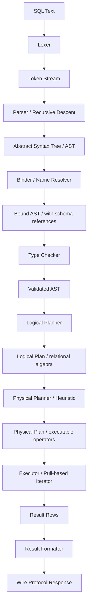
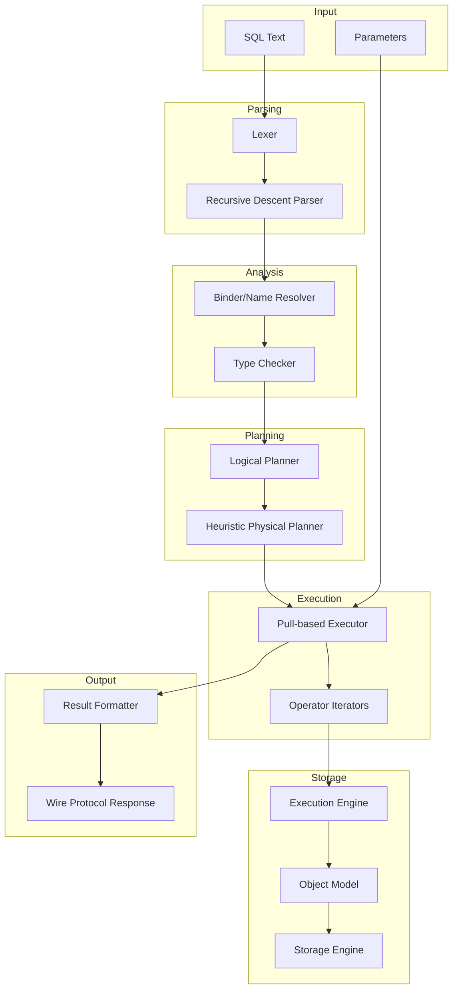
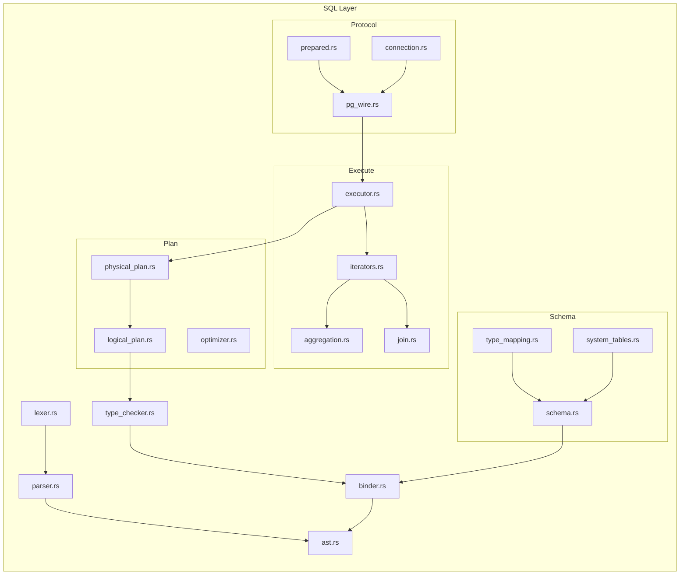
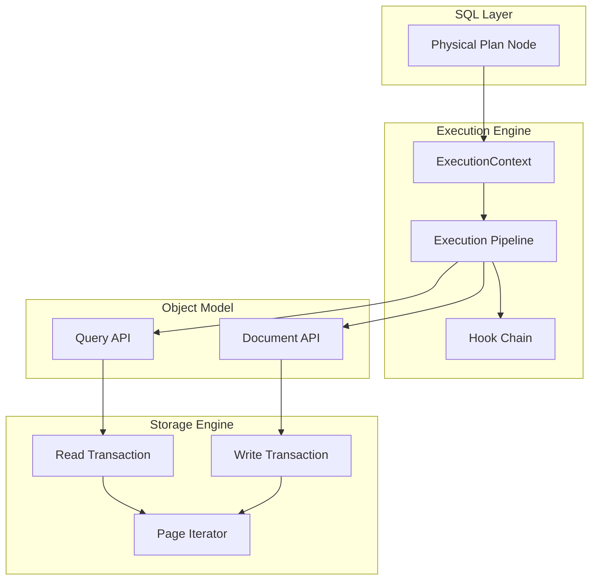
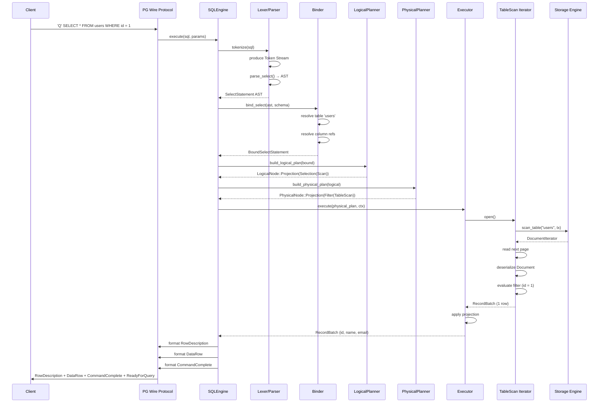
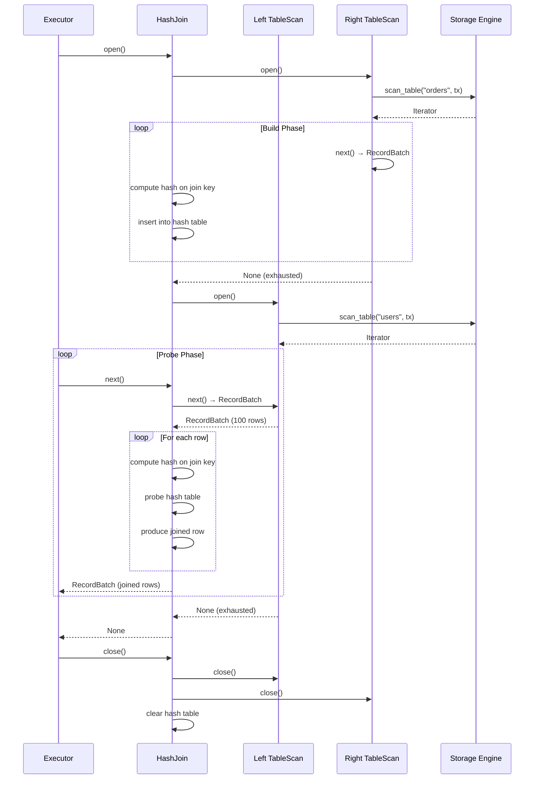
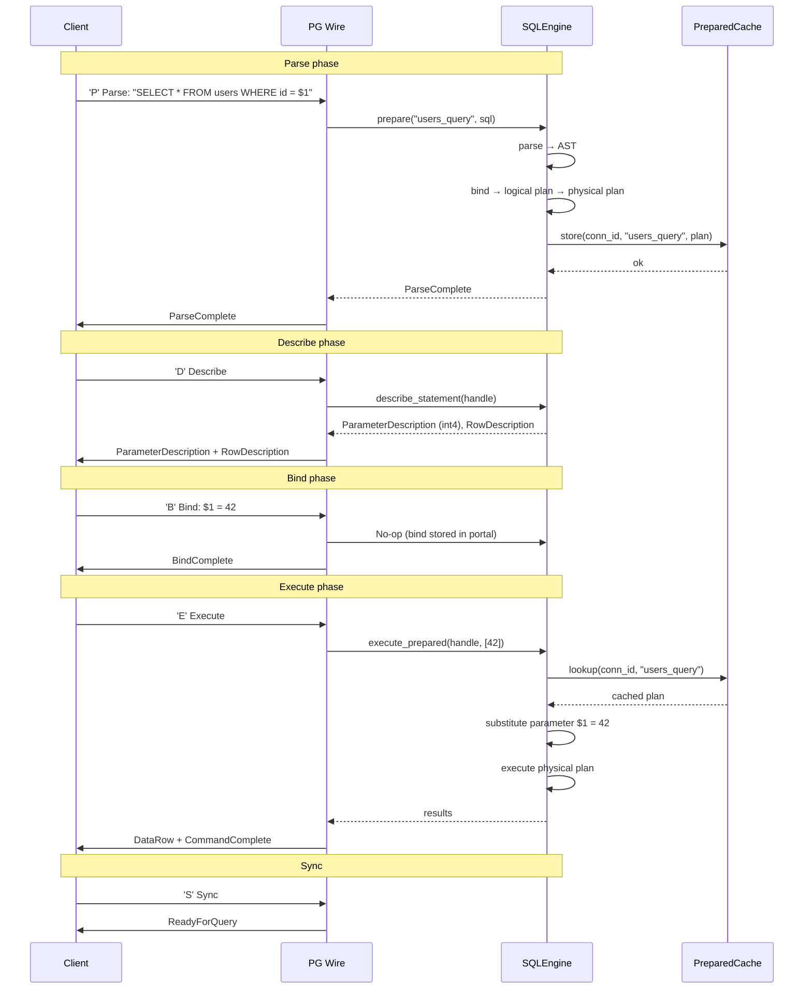
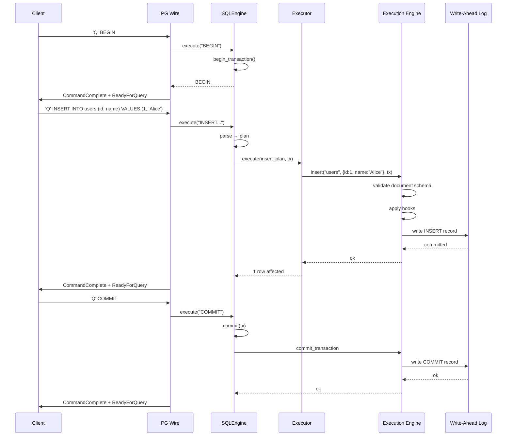
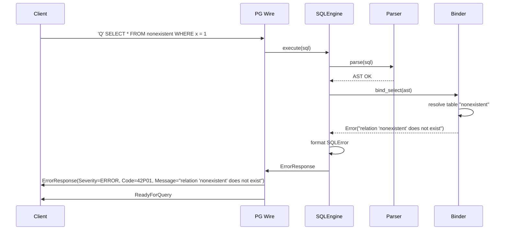

# 21. SQL Layer

## 1. Purpose

The SQL Layer provides a SQL interface over Nova Runtime's Object Model and Storage Engine. It allows users to interact with stored data using standard SQL syntax, translating relational query semantics into operations on the unified Document type system. This enables drop-in compatibility for applications that expect a SQL database backend, while preserving Nova's core principle that every operation passes through the Execution Engine.

## 2. Scope

The SQL Layer encompasses the full query processing pipeline from SQL text ingestion to result production:

- SQL tokenization and parsing into an Abstract Syntax Tree (AST)
- Semantic analysis and name resolution against the Object Model schema
- Logical plan construction from validated AST
- Physical plan selection using heuristic (non-cost-based) rules
- Query execution via a pull-based iterator model
- Type mapping between SQL column types and Object Model Document fields
- Parameterized query support with prepared statement caching
- Connection management and pooling for SQL protocol listeners
- DDL operations (CREATE, ALTER, DROP) mapped to Object Model schema mutations
- DML operations (SELECT, INSERT, UPDATE, DELETE) mapped to Storage Engine operations
- Transaction semantics mapped to Execution Engine transaction boundaries

The SQL Layer does NOT implement:
- A full SQL:2023 standard (it implements a carefully chosen subset)
- Cost-based query optimization
- Parallel query execution within a single query
- Distributed query execution
- Full-text search (delegated to Search subsystem)
- Stored procedures or triggers beyond simple execution pipeline hooks
- Foreign key constraint enforcement (application-level concern per Object Model design)

## 3. Responsibilities

1. **SQL Parsing**: Convert SQL text into a validated AST using a recursive descent parser
2. **Name Resolution**: Resolve table names, column names, and aliases against the current schema
3. **Type Checking**: Validate SQL types against Object Model field types and perform implicit coercions where safe
4. **Query Planning**: Convert AST into a logical plan then select a physical plan using heuristic rules
5. **Query Execution**: Execute the physical plan, pulling results from Storage Engine via iterators
6. **Result Formatting**: Convert Storage Engine Documents into row-oriented result sets with proper SQL types
7. **Prepared Statement Management**: Cache parsed and planned statements keyed by (connection_id, statement_id)
8. **Parameter Binding**: Substitute positional ($1, $2) or named ($name) parameters into parameterized queries
9. **Connection Management**: Accept SQL protocol connections (PostgreSQL wire protocol compatible), manage connection lifecycle
10. **Schema Reflection**: Expose system tables (pg_catalog equivalent) for tooling compatibility
11. **Error Reporting**: Return structured SQL error codes with message text, detail, and hint fields
12. **Transaction Management**: Map BEGIN/COMMIT/ROLLBACK to Execution Engine transaction boundaries

## 4. Non Responsibilities

- **Full SQL Compliance**: Not all SQL features are supported; deviations are documented with error codes
- **Cost-Based Optimization**: Statistics collection, histogram building, cost model tuning are excluded
- **Parallel Execution**: Single-threaded per-query execution only; no intra-query parallelism
- **Foreign Keys**: Referential integrity is enforced at the application layer through the Execution Engine
- **Stored Procedures**: Pl/pgSQL or similar procedural languages are not implemented
- **Triggers**: Event-driven hooks exist in the Event System, not as SQL triggers
- **Views**: Materialized or virtual views are not supported initially (future work)
- **Full-Text Indexes**: Text search capabilities are provided by the Search subsystem
- **Window Functions**: ROW_NUMBER, RANK, etc. are not supported initially
- **Recursive CTEs**: Common Table Expressions are non-recursive only
- **Spatial Types**: No GIS or spatial index support

## 5. Architecture

### 5.1 Overall Pipeline





### 5.2 Module Layout



### 5.3 Integration with Execution Engine



## 6. Data Structures

### 6.1 Token Types

```rust
enum Token {
    // Keywords
    Select, From, Where, Insert, Into, Values, Update, Set, Delete,
    Create, Table, Drop, Alter, Add, Column, Primary, Key, Not, Null,
    Default, And, Or, In, Between, Like, Is, Distinct, As, On, Join,
    Inner, Left, Right, Full, Outer, Cross, Using, Group, By, Order,
    Asc, Desc, Having, Limit, Offset, Union, All, Except, Intersect,
    Exists, Case, When, Then, Else, End, Cast, True, False, NullLit,
    
    // Identifiers
    Identifier(String),
    QuotedIdentifier(String),
    
    // Literals
    Number(String),       // Parsed as string to preserve precision
    String(String),       // Single-quoted string
    Boolean(bool),
    Null,
    
    // Operators
    Plus, Minus, Star, Slash, Percent, Eq, Neq, Lt, Gt, Lte, Gte,
    Assignment,           // = in SET clauses
    Concat,               // ||
    
    // Delimiters
    OpenParen, CloseParen, Comma, Semicolon, Dot,
    
    // Parameters
    PositionalParam(u32), // $1, $2
    NamedParam(String),   // $name
    
    // Special
    EOF,
    Comment(String),
}
```

### 6.2 Abstract Syntax Tree

```rust
struct ASTNode {
    location: SourceLocation, // line:col pairs for error reporting
    node_type: ASTNodeType,
}

struct SourceLocation {
    line: u32,
    column: u32,
    offset: u64,
}

enum ASTNodeType {
    // Top-level statements
    Statement(Statement),
    // Expression nodes
    Expression(Expr),
}

enum Statement {
    Select(SelectStatement),
    Insert(InsertStatement),
    Update(UpdateStatement),
    Delete(DeleteStatement),
    CreateTable(CreateTableStatement),
    DropTable(DropTableStatement),
    AlterTable(AlterTableStatement),
    BeginTransaction,
    CommitTransaction,
    RollbackTransaction,
    Prepare(PrepareStatement),
    Execute(ExecuteStatement),
    Deallocate(DeallocateStatement),
    Explain(ExplainStatement),
}

struct SelectStatement {
    with: Option<Vec<CommonTableExpr>>,
    select_list: Vec<SelectItem>,
    from: Vec<TableRef>,
    where_clause: Option<Expr>,
    group_by: Vec<Expr>,
    having: Option<Expr>,
    order_by: Vec<OrderByExpr>,
    limit: Option<Expr>,
    offset: Option<Expr>,
    distinct: bool,
}

enum SelectItem {
    Wildcard,                    // *
    QualifiedWildcard(String),   // table.*
    Expr { expr: Expr, alias: Option<String> },
}

enum TableRef {
    Table { 
        name: String, 
        alias: Option<String>,
        schema: Option<String>,
    },
    Subquery {
        query: Box<SelectStatement>,
        alias: String,
    },
    Join {
        left: Box<TableRef>,
        right: Box<TableRef>,
        join_type: JoinType,
        condition: JoinCondition,
    },
}

enum JoinType {
    Inner,
    LeftOuter,
    RightOuter,   // Rewritten to LeftOuter during planning
    Cross,
}

enum JoinCondition {
    On(Expr),
    Using(Vec<String>),
    Natural,
}

struct InsertStatement {
    table_name: String,
    columns: Vec<String>,
    values: Vec<Vec<Expr>>,       // Multiple row values
    or_replace: bool,             // For upsert behavior
}

struct UpdateStatement {
    table_name: String,
    assignments: Vec<Assignment>,
    where_clause: Option<Expr>,
}

struct Assignment {
    column: String,
    value: Expr,
}

struct DeleteStatement {
    table_name: String,
    using: Vec<TableRef>,
    where_clause: Option<Expr>,
}

struct CreateTableStatement {
    name: String,
    columns: Vec<ColumnDef>,
    if_not_exists: bool,
}

struct ColumnDef {
    name: String,
    data_type: SQLType,
    not_null: bool,
    default: Option<Expr>,
    primary_key: bool,
    unique: bool,
    comment: Option<String>,
}

struct OrderByExpr {
    expr: Expr,
    direction: OrderDirection,
    nulls_first: bool,
}

enum OrderDirection {
    Asc,
    Desc,
}

struct CommonTableExpr {
    alias: String,
    columns: Vec<String>,
    query: Box<SelectStatement>,
    recursive: bool,
}

// --- Expressions ---

enum Expr {
    // Literals
    Literal(LiteralValue),
    
    // Identifiers
    Identifier(String),                  // column
    QualifiedIdentifier(Vec<String>),     // schema.table.column
    
    // Column reference resolved during binding
    ColumnRef { table: String, column: String },
    
    // Unary operators
    UnaryOp { op: UnaryOp, expr: Box<Expr> },
    
    // Binary operators
    BinaryOp { op: BinaryOp, left: Box<Expr>, right: Box<Expr> },
    
    // Functions
    Function { name: String, args: Vec<Expr>, distinct: bool },
    Aggregate { name: String, args: Vec<Expr>, distinct: bool },
    
    // Special constructs
    Cast { expr: Box<Expr>, target_type: SQLType },
    Case { operand: Option<Box<Expr>>, when_then: Vec<WhenThen>, else_expr: Option<Box<Expr>> },
    Exists { subquery: Box<SelectStatement> },
    Subquery { query: Box<SelectStatement> },
    InList { expr: Box<Expr>, list: Vec<Expr> },
    InSubquery { expr: Box<Expr>, subquery: Box<SelectStatement> },
    Between { expr: Box<Expr>, low: Box<Expr>, high: Box<Expr> },
    Like { expr: Box<Expr>, pattern: Box<Expr>, negated: bool },
    IsNull { expr: Box<Expr> },
    IsNotNull { expr: Box<Expr> },
    Parameter { position: u32 },         // Positional $1, $2
    NamedParameter { name: String },     // $name
}

struct WhenThen {
    when: Expr,
    then: Expr,
}

enum LiteralValue {
    Null,
    Boolean(bool),
    Integer(i64),
    Float(f64),
    String(String),
    Blob(Vec<u8>),
    Date(String),           // ISO 8601 date
    Timestamp(String),      // ISO 8601 timestamp
    Time(String),           // ISO 8601 time
    Interval(String),       // ISO 8601 duration
}

enum UnaryOp {
    Not,
    Plus,
    Minus,
}

enum BinaryOp {
    // Arithmetic
    Add, Subtract, Multiply, Divide, Modulo,
    // Comparison
    Eq, Neq, Lt, Gt, Lte, Gte,
    // Logical
    And, Or,
    // String
    Concat,
}
```

### 6.3 SQL Type System

```rust
enum SQLType {
    // Numeric types
    TinyInt,           // i8, 1 byte
    SmallInt,          // i16, 2 bytes
    Integer,           // i32, 4 bytes
    BigInt,            // i64, 8 bytes
    Float,             // f32, 4 bytes
    Double,            // f64, 8 bytes
    Decimal(u8, u8),   // precision, scale, up to 38 digits
    
    // String types
    Char(u32),         // Fixed-length, padded with spaces
    VarChar(u32),      // Variable-length, 1-65535
    Text,              // Unlimited length (up to 2^31-1)
    
    // Binary types
    Binary(u32),       // Fixed-length binary
    VarBinary(u32),    // Variable-length binary
    Blob,              // Unlimited binary (up to 2^31-1)
    
    // Date/Time types
    Date,              // Date only, 4 bytes
    Time(u8),          // Time with precision, 4 bytes
    Timestamp(u8),     // Timestamp with precision, 8 bytes
    TimestampTz(u8),   // Timestamp with timezone, 8 bytes
    Interval,          // Time interval, 16 bytes
    
    // Other
    Boolean,           // 1 byte
    Uuid,              // 16 bytes
    Json,              // JSON text storage
    JsonB,             // JSON binary storage (parsed)
    
    // Object Model bridge
    Document,          // Full Object Model document reference
    Array(SQLType),    // Array of element type
    Map(SQLType),      // Map with string keys and value type
}

// Size in bytes for fixed-width types
impl SQLType {
    fn fixed_width(&self) -> Option<u32> {
        match self {
            SQLType::TinyInt => Some(1),
            SQLType::SmallInt => Some(2),
            SQLType::Integer => Some(4),
            SQLType::BigInt => Some(8),
            SQLType::Float => Some(4),
            SQLType::Double => Some(8),
            SQLType::Boolean => Some(1),
            SQLType::Uuid => Some(16),
            SQLType::Date => Some(4),
            SQLType::Time(_) => Some(4),
            SQLType::Timestamp(_) => Some(8),
            SQLType::TimestampTz(_) => Some(8),
            SQLType::Interval => Some(16),
            _ => None,
        }
    }
}
```

### 6.4 Type Mapping: SQL → Object Model

```rust
enum ObjectModelType {
    Null,
    Bool,
    Int64,
    Float64,
    String,
    Bytes,
    Timestamp,       // Unix nanos, i64
    Array(Box<ObjectModelType>),
    Map(Box<ObjectModelType>),     // String-keyed
    Document,        // Nested document
}

// SQLType -> ObjectModelType mapping
fn map_sql_to_om(sql_type: &SQLType) -> ObjectModelType {
    match sql_type {
        SQLType::TinyInt | SQLType::SmallInt | SQLType::Integer | SQLType::BigInt 
            => ObjectModelType::Int64,
        SQLType::Float | SQLType::Double | SQLType::Decimal(_, _) 
            => ObjectModelType::Float64,
        SQLType::Char(_) | SQLType::VarChar(_) | SQLType::Text 
            => ObjectModelType::String,
        SQLType::Binary(_) | SQLType::VarBinary(_) | SQLType::Blob 
            => ObjectModelType::Bytes,
        SQLType::Boolean => ObjectModelType::Bool,
        SQLType::Date | SQLType::Time(_) | SQLType::Timestamp(_) | SQLType::TimestampTz(_)
            => ObjectModelType::Timestamp,
        SQLType::Uuid => ObjectModelType::String,     // Stored as string
        SQLType::Json | SQLType::JsonB => ObjectModelType::String,
        SQLType::Array(t) => ObjectModelType::Array(Box::new(map_sql_to_om(t))),
        SQLType::Map(t) => ObjectModelType::Map(Box::new(map_sql_to_om(t))),
        SQLType::Document => ObjectModelType::Document,
    }
}
```

### 6.5 Logical Plan

```rust
enum LogicalNode {
    Scan {
        table: String,
        alias: Option<String>,
        schema: Schema,
    },
    Projection {
        input: Box<LogicalNode>,
        exprs: Vec<LogicalExpr>,
        aliases: Vec<Option<String>>,
    },
    Selection {
        input: Box<LogicalNode>,
        predicate: LogicalExpr,
    },
    Join {
        left: Box<LogicalNode>,
        right: Box<LogicalNode>,
        join_type: JoinType,
        condition: LogicalExpr,
    },
    Aggregate {
        input: Box<LogicalNode>,
        group_exprs: Vec<LogicalExpr>,
        aggregate_exprs: Vec<AggregateExpr>,
    },
    Sort {
        input: Box<LogicalNode>,
        order_by: Vec<LogicalSortExpr>,
    },
    Limit {
        input: Box<LogicalNode>,
        limit: usize,
        offset: usize,
    },
    CrossJoin {
        left: Box<LogicalNode>,
        right: Box<LogicalNode>,
    },
    Distinct {
        input: Box<LogicalNode>,
    },
    Values {
        values: Vec<Vec<LogicalExpr>>,
    },
    Insert {
        table: String,
        columns: Vec<String>,
        input: Box<LogicalNode>,
        or_replace: bool,
    },
    Update {
        table: String,
        assignments: Vec<(String, LogicalExpr)>,
        input: Box<LogicalNode>,
    },
    Delete {
        table: String,
        input: Box<LogicalNode>,
    },
}

struct Schema {
    columns: Vec<ColumnInfo>,
}

struct ColumnInfo {
    name: String,
    data_type: SQLType,
    nullable: bool,
}

struct LogicalSortExpr {
    expr: LogicalExpr,
    direction: OrderDirection,
    nulls_first: bool,
}

struct AggregateExpr {
    name: String,       // COUNT, SUM, AVG, MIN, MAX
    arg: LogicalExpr,
    distinct: bool,
    return_type: SQLType,
}

enum LogicalExpr {
    ColumnRef { index: usize, name: String },
    Literal(LiteralValue),
    BinaryOp { op: BinaryOp, left: Box<LogicalExpr>, right: Box<LogicalExpr> },
    UnaryOp { op: UnaryOp, expr: Box<LogicalExpr> },
    Function { name: String, args: Vec<LogicalExpr> },
    Cast { expr: Box<LogicalExpr>, target_type: SQLType },
    ScalarSubquery { plan: Box<LogicalNode> },
    InSubquery { expr: Box<LogicalExpr>, plan: Box<LogicalNode> },
    Exists { plan: Box<LogicalNode> },
    Case { when_then: Vec<(LogicalExpr, LogicalExpr)>, else_expr: Option<Box<LogicalExpr>> },
    Parameter(u32),
}
```

### 6.6 Physical Plan

```rust
enum PhysicalNode {
    TableScan {
        table: String,
        columns: Vec<usize>,          // Column indices to read
        filter: Option<PhysicalExpr>,  // Pushdown predicate
        limit: Option<usize>,          // Pushdown limit
    },
    Projection {
        input: Box<PhysicalNode>,
        exprs: Vec<PhysicalExpr>,
        schema: Schema,
    },
    Filter {
        input: Box<PhysicalNode>,
        predicate: PhysicalExpr,
    },
    HashJoin {
        left: Box<PhysicalNode>,
        right: Box<PhysicalNode>,
        join_type: JoinType,
        left_keys: Vec<PhysicalExpr>,
        right_keys: Vec<PhysicalExpr>,
    },
    NestedLoopJoin {
        left: Box<PhysicalNode>,
        right: Box<PhysicalNode>,
        join_type: JoinType,
        condition: PhysicalExpr,
    },
    HashAggregate {
        input: Box<PhysicalNode>,
        group_keys: Vec<PhysicalExpr>,
        aggregates: Vec<PhysicalAggregate>,
    },
    Sort {
        input: Box<PhysicalNode>,
        order_by: Vec<PhysicalSortExpr>,
    },
    TopN {
        input: Box<PhysicalNode>,
        order_by: Vec<PhysicalSortExpr>,
        limit: usize,
    },
    Limit {
        input: Box<PhysicalNode>,
        limit: usize,
        offset: usize,
    },
    ValuesScan {
        values: Vec<Vec<LiteralValue>>,
        schema: Schema,
    },
    Insert {
        table: String,
        columns: Vec<String>,
        input: Box<PhysicalNode>,
        or_replace: bool,
    },
    Update {
        table: String,
        assignments: Vec<(String, PhysicalExpr)>,
        input: Box<PhysicalNode>,
    },
    Delete {
        table: String,
        input: Box<PhysicalNode>,
    },
}

enum PhysicalExpr {
    ColumnRef { index: usize },
    Literal(LiteralValue),
    BinaryOp { op: BinaryOp, left: Box<PhysicalExpr>, right: Box<PhysicalExpr> },
    UnaryOp { op: UnaryOp, expr: Box<PhysicalExpr> },
    Function { name: String, args: Vec<PhysicalExpr> },
    Cast { expr: Box<PhysicalExpr>, target_type: SQLType },
    Parameter(u32),
}

struct PhysicalSortExpr {
    expr: PhysicalExpr,
    direction: OrderDirection,
}

struct PhysicalAggregate {
    name: String,
    arg: PhysicalExpr,
    distinct: bool,
    return_type: SQLType,
}
```

### 6.7 Execution State

```rust
struct ExecutionContext {
    transaction: TransactionHandle,
    parameters: Vec<Option<LiteralValue>>,
    batch_size: usize,           // Rows per page, default 100
    max_rows: usize,             // Max rows returned, default 10000
    deadline: Instant,           // Query deadline
    memory_limit: usize,         // Memory limit in bytes, default 64MB
}

struct TransactionHandle {
    tx_id: u64,
    read_ts: u64,                // MVCC read timestamp
    state: TransactionState,
}

enum TransactionState {
    Active,
    Committed,
    RolledBack,
    Error(String),
}
```

### 6.8 Prepared Statement Cache

```rust
struct PreparedStatementCache {
    max_size: usize,              // Maximum entries, default 1000
    statements: HashMap<PreparedStatementKey, CachedStatement>,
    lru: LruList<PreparedStatementKey>,
}

struct PreparedStatementKey {
    connection_id: u64,
    statement_name: String,       // Named or auto-generated
}

struct CachedStatement {
    ast: Box<Statement>,
    logical_plan: LogicalNode,
    physical_plan: PhysicalNode,
    parameter_types: Vec<SQLType>,
    result_schema: Schema,
    created_at: Instant,
    access_count: u64,
    last_accessed: Instant,
}
```

## 7. Algorithms

### 7.1 Recursive Descent Parser

The parser is hand-written recursive descent with one token lookahead. It follows the grammar structure:

```
ALGORITHM: parse_statement
INPUT:  token stream
OUTPUT: Statement AST

1. Peek at current token
2. Match first token to determine statement type:
   - SELECT/KSELECT  -> parse_select()
   - INSERT          -> parse_insert()
   - UPDATE          -> parse_update()
   - DELETE          -> parse_delete()
   - CREATE          -> parse_create()
   - DROP            -> parse_drop()
   - ALTER           -> parse_alter()
   - BEGIN           -> parse_begin()
   - COMMIT          -> parse_commit()
   - ROLLBACK        -> parse_rollback()
   - PREPARE         -> parse_prepare()
   - EXECUTE         -> parse_execute()
   - DEALLOCATE      -> parse_deallocate()
   - EXPLAIN         -> parse_explain()
3. Consume terminating semicolon (if present)
4. Return Statement AST

ALGORITHM: parse_select
INPUT:  token stream (current token is SELECT)
OUTPUT: SelectStatement

1. Consume SELECT
2. Check for DISTINCT, set flag
3. Parse select_list (one or more select_item separated by commas)
4. If FROM present, parse table_refs (one or more comma-separated or joined)
5. If WHERE present, parse_expr() as predicate
6. If GROUP BY present, parse one or more expr
7. If HAVING present, parse_expr() as predicate
8. If ORDER BY present, parse one or more order_by_expr
9. If LIMIT present, parse_expr() (must be integer literal or param)
10. If OFFSET present, parse_expr() (must be integer literal or param)
11. Return SelectStatement


ALGORITHM: parse_expr (precedence climbing)
INPUT:  token stream, min_precedence
OUTPUT: Expr

Precedence table (higher = binds tighter):
  15: Unary + - NOT
  14: CAST, EXISTS, subquery
  13: * / %
  12: + - ||
  11: BETWEEN, IN, LIKE, IS
  10: < <= > >=
  9:  = != <>
  8:  AND
  7:  OR
  6:  Assignment (= in SET)
  1:  DEFAULT

Parsing logic:
1. Parse atomic expression (literal, identifier, function call, subquery, parameter, parenthesized expr)
2. While next token is a binary operator with precedence >= min_precedence:
   a. Consume operator
   b. Parse right operand with precedence = operator_precedence + 1
   c. Combine left and right into new left node
3. Return result


ALGORITHM: parse_atomic
INPUT:  token stream
OUTPUT: Expr

1. Match current token:
   a. NUMBER(str) -> parse numeric literal (try i64 first, fall back to f64)
   b. STRING(s) -> Expr::Literal(String(s))
   c. TRUE/FALSE -> Expr::Literal(Boolean(val))
   d. NULL -> Expr::Literal(Null)
   e. IDENTIFIER(name) followed by OPENPAREN -> parse_function_call(name)
   f. IDENTIFIER(name) -> Expr::Identifier(name)
   g. QUOTEDIDENTIFIER(name) -> Expr::Identifier(name)
   h. POSITIONALPARAM(n) -> Expr::Parameter(n)
   i. NAMEDPARAM(name) -> Expr::NamedParameter(name)
   j. OPENPAREN -> parse_grouped_expr()
   k. SELECT -> parse_scalar_subquery() or parse_exists()
   l. CASE -> parse_case_expr()
   m. CAST -> parse_cast_expr()
   n. EXISTS -> parse_exists()
2. Return Expr
```

### 7.2 Binder / Name Resolution

```
ALGORITHM: bind_select
INPUT:  SelectStatement, schema context (available tables/columns)
OUTPUT: BoundSelectStatement or Error

1. FROM phase: resolve all table references
   a. For each TableRef::Table(name, alias, schema):
      - Look up table in current schema/context
      - If not found, return error "table not found: {name}"
      - Resolve column list from schema definition
      - Register table alias (or table name if no alias) in scope
   b. For each Join:
      - Bind left and right table refs
      - Resolve join condition columns
      - If USING, verify columns exist in both sides
   c. For Subquery:
      - Bind inner SelectStatement in new scope
      - Register subquery columns using alias

2. SELECT phase: resolve select list expressions
   a. For Wildcard (*): expand to all columns from all FROM tables
   b. For QualifiedWildcard(t.*): expand to all columns from table t
   c. For expr with alias: resolve expression, attach alias
   d. Verify all column references exist in current scope
   e. If GROUP BY present, verify select list contains only:
      - GROUP BY expressions
      - Aggregate functions

3. WHERE phase: bind and type-check predicate expression
   a. Resolve all column references
   b. Verify predicate returns boolean type
   c. Mark subqueries in WHERE for execution

4. GROUP BY phase:
   a. Verify each GROUP BY expr is valid (column ref or literal)
   b. If aggregation present, verify HAVING is valid

5. ORDER BY phase:
   a. Resolve column references (may refer to select_list aliases)
   b. Verify sort expressions are valid types

6. Return bound SelectStatement with resolved schema references
```

### 7.3 Logical Plan Construction

```
ALGORITHM: build_logical_plan
INPUT:  BoundSelectStatement
OUTPUT: LogicalNode (tree)

1. Start with base LogicalNode from FROM clause:
   a. Single table -> LogicalNode::Scan(table, schema)
   b. Join -> LogicalNode::Join(left, right, type, condition)
   c. Subquery -> build_logical_plan(sub_select)
   d. Multiple tables (comma) -> chain of CrossJoin or Joined

2. Apply WHERE clause as LogicalNode::Selection(input, predicate)
   - Predicate decomposition: split AND conditions
   - Pushdown: extract predicates that can be evaluated at Scan level

3. Apply GROUP BY as LogicalNode::Aggregate(input, group_exprs, aggr_exprs)
   - If no GROUP BY but aggregates present, single-group aggregation

4. Apply HAVING as LogicalNode::Selection(aggregate, predicate)

5. Apply SELECT list as LogicalNode::Projection(input, exprs, aliases)
   - Compute final output expressions

6. Apply DISTINCT as LogicalNode::Distinct(input)
   - If no ORDER BY, sort by all columns; else sort by ORDER BY columns

7. Apply ORDER BY as LogicalNode::Sort(input, order_by)
   - If LIMIT is present, combine into LogicalNode::TopN

8. Apply LIMIT/OFFSET as LogicalNode::Limit(input, limit, offset)
   - If combined with ORDER BY that can use TopN, rewrite
```

### 7.4 Heuristic Physical Planning

```
ALGORITHM: build_physical_plan
INPUT:  LogicalNode tree
OUTPUT: PhysicalNode tree

Rules applied in order:

RULE 1: Scan -> TableScan
  - Extract column indices needed from projection or selection
  - Pushdown filter predicates that reference only this table's columns
  - Pushdown limit if no filter/expression on top
  - SELECT * without WHERE -> TableScan with all columns, no filter

RULE 2: Selection -> Filter or pushdown
  - If input is TableScan: merge predicate into TableScan.filter
  - If input is Join: attempt to push predicate to left/right side
  - Otherwise: PhysicalNode::Filter(input, predicate)

RULE 3: Join selection
  - If join condition has equality predicates:
    - Check if build side (right for hash join) fits in memory budget
    - If yes: PhysicalNode::HashJoin
    - If no: PhysicalNode::NestedLoopJoin
  - If no equality predicates: PhysicalNode::NestedLoopJoin
  - Right outer joins rewritten as left outer joins

RULE 4: Aggregate -> HashAggregate
  - Always use hash-based aggregation
  - Memory estimate: group_keys * 64 bytes + aggregates * 16 bytes
  - If estimate exceeds memory limit, fall back to sort-based

RULE 5: Sort + Limit -> TopN
  - Use binary heap for TopN if input is small (< 10,000 rows)
  - Otherwise full sort then take

RULE 6: Distinct -> Sort + projection
  - Distinct implemented as Sort all columns + emit unique

RULE 7: Insert/Update/Delete
  - Insert: ValuesScan input -> Insert executor
  - Update: TableScan + Filter -> Update executor
  - Delete: TableScan + Filter -> Delete executor
```

### 7.5 Pull-based Execution (Iterator Model)

```
ALGORITHM: execute_physical_plan
INPUT:  PhysicalNode, ExecutionContext
OUTPUT: Stream of RecordBatch

Each physical node implements:
  fn open(&mut self, ctx: &ExecutionContext) -> Result<()>
  fn next(&mut self) -> Result<Option<RecordBatch>>
  fn close(&mut self)

ALGORITHM: TableScan::next
1. If first call, open Storage Engine iterator on table's primary index
2. Retrieve next page from Storage Engine
3. Deserialize Documents from page
4. If filter present, evaluate filter on each Document
5. Extract requested columns into RecordBatch columns
6. Return RecordBatch or None if exhausted

ALGORITHM: Filter::next
1. Pull next batch from input child
2. Evaluate predicate expression on each row
3. Collect matching rows into new batch
4. If resulting batch is empty, pull next batch from input
5. Return non-empty batch or None if exhausted

ALGORITHM: HashJoin::next
1. open(): build hash table from right input
   a. Pull all rows from right child
   b. For each row, compute hash of join key
   c. Insert into HashMap<HashKey, Vec<Row>>
2. next(): probe hash table with left input rows
   a. Pull batch from left child
   b. For each left row, compute join key hash
   c. Look up matching right rows in hash table
   d. For each match, produce joined row
   e. Accumulate into output batch
   f. Return batch or continue until left input exhausted
3. close(): clear hash table

Memory budget for hash table: up to 64MB
If right input exceeds 64MB, emit warning and use nested loop fallback

ALGORITHM: HashAggregate::next
1. open(): consume all input, build group map
   a. Initialize HashMap<GroupKey, Accumulators>
   b. Pull all batches from input child
   c. For each row, compute group key from group expressions
   d. If group not in map, create new accumulators
   e. Update accumulators (COUNT, SUM, AVG, MIN, MAX)
2. next(): return accumulated results
   a. If first call, iterate group map and emit batch
   b. Return None on subsequent calls
3. close(): clear group map

Accumulator types:
- CountAccumulator: i64 count
- SumAccumulator: f64 sum for floats, i64 sum for integers
- AvgAccumulator: (sum: f64, count: i64)
- MinAccumulator: current min value
- MaxAccumulator: current max value

ALGORITHM: TopN::next
1. open(): consume all input, maintain binary heap of N largest/smallest
   a. Create BinaryHeap with custom comparator (ASC/DESC)
   b. Pull all batches from input child
   c. For each row, push into heap
   d. If heap size > limit, pop extreme element
2. next(): drain heap in sorted order
   a. Pop all elements from heap (reverse sorted)
   b. Emit in correct order
3. close(): clear heap

ALGORITHM: Insert::next
1. For each batch from input child:
   a. Convert row values to Object Model Document fields
   b. Call ExecutionEngine::insert(table, document, or_replace)
   c. Accumulate count
2. Return single batch with count

ALGORITHM: Update::next
1. For each batch from input child:
   a. Read primary key from existing row
   b. Apply assignment expressions to compute new values
   c. Call ExecutionEngine::update(table, pk, updated_document)
   d. Accumulate count
2. Return single batch with count

ALGORITHM: Delete::next
1. For each batch from input child:
   a. Read primary key from row
   b. Call ExecutionEngine::delete(table, pk)
   c. Accumulate count
2. Return single batch with count
```

### 7.6 Expression Evaluation

```
ALGORITHM: evaluate_expression
INPUT:  PhysicalExpr, Row (column values), Parameters
OUTPUT: LiteralValue or Error

1. Match expression type:
   a. ColumnRef(index) -> return row[index]
   b. Literal(val) -> return val
   c. Parameter(n) -> return parameters[n] or error if null and not nullable
   d. BinaryOp(op, left, right):
      - Evaluate left, evaluate right
      - If either is Null and op is comparison, return Null (three-valued logic)
      - Apply operation based on types:
        * Numeric + Numeric: arithmetic operation
        * String + String: concatenation
        * Boolean + Boolean: AND/OR
        * Comparison: returns Boolean or Null
      - Type coercion: promote i64 -> f64, f64 -> Decimal as needed
   e. UnaryOp(Not, expr):
      - Evaluate expr
      - If Null, return Null
      - Return !bool_val
   f. Function(name, args):
      - Evaluate all arguments
      - Dispatch to function implementation by name
   g. Cast(expr, type):
      - Evaluate expr
      - Convert to target type (may error on overflow/format)

Three-valued logic for NULLs:
  - NULL AND TRUE = NULL
  - NULL AND FALSE = FALSE
  - NULL OR TRUE = TRUE
  - NULL OR FALSE = NULL
  - NULL = NULL = NULL (not TRUE)
  - NULL IS NULL = TRUE
  - NULL IS NOT NULL = FALSE
```

### 7.7 Join Algorithm Selection

```
ALGORITHM: select_join_strategy
INPUT:  JoinCondition, left_cardinality_est, right_cardinality_est, memory_budget
OUTPUT: JoinStrategy

1. If condition contains at least one equi-join predicate:
   a. Estimate right side size: right_cardinality_est * avg_row_size_est
   b. If within memory_budget (64MB default):
      - Use HashJoin strategy
      - Build hash table on right side (smaller side if known)
   c. If exceeds memory budget:
      - Use NestedLoopJoin strategy
      - Log warning about inefficient join

2. If condition has no equi-join predicates:
   a. Use NestedLoopJoin strategy
   b. Estimate cost: O(left_cardinality * right_cardinality)

3. If no condition (CROSS JOIN):
   a. Use NestedLoopJoin with trivial condition

Cardinality estimates (heuristic, no statistics):
  - Base table: storage engine row count approximation
  - With filter: assume 50% selectivity (no stats available)
  - After join: assume 25% selectivity
  - After GROUP BY: assume number of distinct values in group keys
```

### 7.8 Subquery Execution

```
ALGORITHM: execute_subquery
INPUT:  PhysicalPlan (subquery), OuterRow, ExecutionContext
OUTPUT: SubqueryResult

Subquery types:
1. Scalar subquery (returns single value):
   - Execute subquery plan
   - Pull exactly one row
   - Return single value
   - Error if more than one row returned (if unqualified)
   - Return NULL if no rows

2. EXISTS subquery:
   - Execute subquery plan
   - Pull one row
   - Return TRUE if row exists, FALSE otherwise

3. IN subquery:
   - Execute subquery plan once (uncorrelated)
   - Materialize results into HashSet
   - Test membership
   - If correlated, execute for each outer row

4. Correlated subquery:
   - For each outer row, bind outer column values as parameters
   - Execute subquery with bound parameters
   - Cache results per unique parameter combination (memoization)

Correlated subquery memoization:
  - Key: hash of outer column values used in correlation
  - Value: subquery result
  - Cache size limit: 1024 entries, LRU eviction
```

### 7.9 Prepared Statement Flow

```
ALGORITHM: prepare_statement
INPUT:  SQL text, connection_id, statement_name
OUTPUT: PreparedStatementHandle

1. Lex and parse SQL text into AST
2. Bind and type-check AST
3. Build logical and physical plan
4. Determine parameter types from AST (parameter placeholders)
5. Store in PreparedStatementCache with key (connection_id, statement_name)
6. Return handle with statement metadata (parameter count, result schema)

ALGORITHM: execute_prepared
INPUT:  PreparedStatementHandle, parameter_values
OUTPUT: ResultStream

1. Look up cached plan in PreparedStatementCache
2. Bind parameter values to physical plan
3. Execute physical plan with bound parameters
4. Return result stream

Parameter binding:
- Positional ($1, $2, ...): indexed into parameter values array
- Named ($name): looked up by name
- Type coercion: convert string/JSON parameters to expected types
- Missing parameters: error (all parameters must be provided)
```

### 7.10 PostgreSQL Wire Protocol

```
ALGORITHM: pg_wire_handler
INPUT:  TCP connection
OUTPUT: none (loop until connection close)

Message flow:
1. StartupMessage:
   - Read protocol version (196608 = 3.0)
   - Read parameters (user, database, application_name)
   - Authenticate (AuthenticationOK or AuthenticationMD5Password)
   - Send ReadyForQuery

2. Main loop:
   - Read message type byte + length + payload
   - Dispatch by type:
     'Q' SimpleQuery:
       - Parse SQL text
       - Execute
       - Send RowDescription + DataRows + CommandComplete + ReadyForQuery
     'P' Parse:
       - Parse and prepare statement
       - Send ParseComplete
     'B' Bind:
       - Bind parameters to prepared statement
       - Send BindComplete
     'E' Execute:
       - Execute bound statement
       - Send results
     'D' Describe:
       - Return statement or portal info
       - Send ParameterDescription or RowDescription or NoData
     'H' Flush:
       - Force send pending output
     'S' Sync:
       - Send ReadyForQuery
     'X' Terminate:
       - Close connection
     'C' Close:
       - Deallocate prepared statement / portal
       - Send CloseComplete

3. Error handling:
   - Send ErrorResponse with fields: Severity, Code, Message, Detail, Hint
   - Rollback transaction if in error state
   - Return to ReadyForQuery

Message format:
Header:
  byte: type
  int32: length (including self)
Payload: type-specific

ErrorResponse fields:
  byte: 'S' severity string (ERROR, FATAL, PANIC)
  byte: 'C' SQLSTATE code (5 chars)
  byte: 'M' message text
  byte: 'D' detail (optional)
  byte: 'H' hint (optional)
  byte: 'P' position (optional)
  byte: '\0' terminator
```

## 8. Interfaces

### 8.1 SQL Layer Public API

```rust
// --- SQL Engine ---

struct SQLEngine {
    execution_engine: Arc<ExecutionEngine>,
    object_model: Arc<ObjectModel>,
    config: SQLConfig,
    prepared_cache: PreparedStatementCache,
}

impl SQLEngine {
    /// Create new SQL engine
    fn new(execution_engine: Arc<ExecutionEngine>, object_model: Arc<ObjectModel>, config: SQLConfig) -> Self;

    /// Execute SQL text with optional parameters
    /// Returns a result stream
    fn execute(
        &self,
        sql: &str,
        params: &[LiteralValue],
        tx: Option<TransactionHandle>,
    ) -> Result<Box<dyn ResultStream>>;

    /// Prepare a statement for later execution
    fn prepare(
        &self,
        connection_id: u64,
        statement_name: &str,
        sql: &str,
    ) -> Result<PreparedStatementHandle>;

    /// Execute a prepared statement with bound parameters
    fn execute_prepared(
        &self,
        handle: &PreparedStatementHandle,
        params: &[LiteralValue],
        tx: Option<TransactionHandle>,
    ) -> Result<Box<dyn ResultStream>>;

    /// Deallocate a prepared statement
    fn deallocate(&self, connection_id: u64, statement_name: &str) -> Result<()>;

    /// Begin a transaction
    fn begin_transaction(&self) -> Result<TransactionHandle>;

    /// Commit a transaction
    fn commit(&self, tx: TransactionHandle) -> Result<()>;

    /// Rollback a transaction
    fn rollback(&self, tx: TransactionHandle) -> Result<()>;

    /// Returns the result schema for a prepared statement
    fn describe_statement(&self, handle: &PreparedStatementHandle) -> Result<Schema>;

    /// Validate SQL syntax without executing
    fn validate_sql(&self, sql: &str) -> Result<ValidationResult>;
}

// --- Configuration ---

struct SQLConfig {
    max_statement_cache_size: usize,          // default: 1000
    max_batch_size: usize,                    // default: 100 rows
    max_result_rows: usize,                   // default: 10000
    default_memory_limit: usize,              // default: 64 * 1024 * 1024 (64MB)
    max_query_timeout_ms: u64,                // default: 30000 (30s)
    max_connections: u32,                     // default: 100
    max_parameters_per_query: u32,            // default: 65535
    pg_wire_port: u16,                        // default: 5432
    pg_wire_enabled: bool,                    // default: true
    max_ast_depth: u32,                       // default: 64
    max_join_tables: u32,                     // default: 32
    max_subquery_depth: u32,                  // default: 8
    max_in_list_size: u32,                    // default: 1000
}

// --- Result Stream ---

trait ResultStream {
    /// Get the schema of the result
    fn schema(&self) -> &Schema;

    /// Pull next batch of rows
    fn next_batch(&mut self) -> Result<Option<RecordBatch>>;

    /// Get number of rows affected (for DML)
    fn rows_affected(&self) -> u64;

    /// Get execution stats
    fn stats(&self) -> ExecutionStats;
}

struct RecordBatch {
    columns: Vec<Column>,
    row_count: usize,
}

enum Column {
    Nulls(usize),
    Booleans(Vec<Option<bool>>),
    Integers(Vec<Option<i64>>),
    Floats(Vec<Option<f64>>),
    Strings(Vec<Option<String>>),
    Bytes(Vec<Option<Vec<u8>>>),
    Timestamps(Vec<Option<i64>>),          // Unix nanos
}

struct ExecutionStats {
    rows_scanned: u64,
    pages_read: u64,
    duration_us: u64,
    memory_used: usize,
}

struct ValidationResult {
    valid: bool,
    errors: Vec<SQLError>,
    warnings: Vec<String>,
    statement_type: StatementType,
}

enum StatementType {
    Select,
    Insert,
    Update,
    Delete,
    DDL,
    TCL,
}

// --- Prepared Statement Handle ---

struct PreparedStatementHandle {
    statement_id: u64,
    parameter_count: u32,
    parameter_types: Vec<SQLType>,
    result_schema: Schema,
}

// --- SQL Errors ---

struct SQLError {
    severity: ErrorSeverity,
    code: SQLStateCode,         // Standard SQLSTATE (5 chars)
    message: String,
    detail: Option<String>,
    hint: Option<String>,
    position: Option<SourceLocation>,
}

enum ErrorSeverity {
    Error,
    Fatal,
    Panic,
}

struct SQLStateCode([u8; 5]);     // e.g., "42P01" for undefined_table

const SQLSTATE_SYNTAX_ERROR: SQLStateCode = SQLStateCode(*b"42601");
const SQLSTATE_UNDEFINED_TABLE: SQLStateCode = SQLStateCode(*b"42P01");
const SQLSTATE_UNDEFINED_COLUMN: SQLStateCode = SQLStateCode(*b"42703");
const SQLSTATE_TYPE_MISMATCH: SQLStateCode = SQLStateCode(*b"42804");
const SQLSTATE_NOT_NULL_VIOLATION: SQLStateCode = SQLStateCode(*b"23502");
const SQLSTATE_UNIQUE_VIOLATION: SQLStateCode = SQLStateCode(*b"23505");
const SQLSTATE_PARAMETER_MISSING: SQLStateCode = SQLStateCode(*b"42P02");
const SQLSTATE_DEADLOCK: SQLStateCode = SQLStateCode(*b"40P01");
const SQLSTATE_SERIALIZATION: SQLStateCode = SQLStateCode(*b"40001");
const SQLSTATE_INTERNAL: SQLStateCode = SQLStateCode(*b"XX000");
```

### 8.2 Internal Planner Interfaces

```rust
trait LogicalPlanner {
    fn plan_select(&self, stmt: &BoundSelectStatement) -> Result<LogicalNode>;
    fn plan_insert(&self, stmt: &BoundInsertStatement) -> Result<LogicalNode>;
    fn plan_update(&self, stmt: &BoundUpdateStatement) -> Result<LogicalNode>;
    fn plan_delete(&self, stmt: &BoundDeleteStatement) -> Result<LogicalNode>;
}

trait PhysicalPlanner {
    fn plan(&self, logical: LogicalNode, ctx: &PlanningContext) -> Result<PhysicalNode>;
}

struct PlanningContext {
    memory_limit: usize,
    enable_hash_join: bool,
    enable_topn: bool,
    default_batch_size: usize,
}
```

### 8.3 Storage Engine Bridge

```rust
/// Interface between SQL layer and Execution Engine
trait StorageBridge {
    /// Scan a table, returning an iterator over Documents
    fn scan_table(&self, table: &str, tx: &TransactionHandle) -> Result<Box<dyn DocumentIterator>>;

    /// Scan a table with primary key prefix
    fn scan_range(
        &self,
        table: &str,
        range: &KeyRange,
        tx: &TransactionHandle,
    ) -> Result<Box<dyn DocumentIterator>>;

    /// Insert a document
    fn insert_document(&self, table: &str, doc: Document, or_replace: bool, tx: &TransactionHandle) -> Result<()>;

    /// Update a document by primary key
    fn update_document(&self, table: &str, key: &DocumentKey, doc: Document, tx: &TransactionHandle) -> Result<()>;

    /// Delete a document by primary key
    fn delete_document(&self, table: &str, key: &DocumentKey, tx: &TransactionHandle) -> Result<()>;

    /// Count documents in a table
    fn count_documents(&self, table: &str, tx: &TransactionHandle) -> Result<u64>;

    /// Get approximate table size
    fn table_size(&self, table: &str) -> Result<(u64, u64)>; // (rows, bytes)
}

trait DocumentIterator {
    fn next(&mut self) -> Result<Option<Document>>;
}

struct Document {
    fields: Vec<(String, Value)>,
    primary_key: DocumentKey,
    version: u64,
}

struct DocumentKey {
    parts: Vec<Value>,
}

enum Value {
    Null,
    Bool(bool),
    Int64(i64),
    Float64(f64),
    String(String),
    Bytes(Vec<u8>),
    Timestamp(i64),
    Array(Vec<Value>),
    Map(Vec<(String, Value)>),
    Document(Vec<(String, Value)>),
}
```

## 9. Sequence Diagrams

### 9.1 Simple SELECT Execution



### 9.2 Hash Join Execution



### 9.3 Prepared Statement Flow



### 9.4 Insert with Transaction



### 9.5 Error Handling



## 10. Failure Modes

### 10.1 Parse Errors

| Cause | Effect | Detection |
|-------|--------|-----------|
| Invalid SQL syntax | ParseError returned to client | Parser returns ParseError variant |
| Unclosed string literal | ParseError, position reported | Lexer fails to find closing quote |
| Unknown keyword | ParseError at unexpected token | Parser match failure |
| Exceeded max AST depth (64) | ParseError: query too complex | Recursive descent depth counter |
| Exceeded max join tables (32) | ParseError: too many tables | FROM clause parser counter |

### 10.2 Semantic Errors

| Cause | Effect | Detection |
|-------|--------|-----------|
| Referenced table does not exist | Error: relation not found | Binder table lookup failure |
| Referenced column does not exist | Error: column not found | Binder column lookup failure |
| Ambiguous column name | Error: column reference ambiguous | Binder finds multiple matches |
| Type mismatch in WHERE clause | Error: type mismatch | Type checker comparison |
| Type mismatch in INSERT/UPDATE | Error: type mismatch or coercion failure | Type checker validation |
| NOT NULL violation | Error: null value in NOT NULL column | Insert/Update executor check |
| PRIMARY KEY violation | Error: duplicate key | Storage Engine unique constraint |
| ORDER BY column not in select list | Error: cannot ORDER BY non-selected column | Binder validation (DISTINCT mode) |
| GROUP BY clause with non-aggregate, non-grouped column | Error: column must appear in GROUP BY | Binder GROUP BY validation |

### 10.3 Execution Errors

| Cause | Effect | Detection |
|-------|--------|-----------|
| Storage Engine failure | Execution error propagated | Storage Engine returns error |
| Transaction conflict | Serialization error | MVCC conflict detection |
| Deadlock detected | Deadlock error, tx rolled back | Lock manager timeout |
| Memory budget exceeded | OutOfMemory error during execution | ExecutionContext memory tracking |
| Timeout exceeded | QueryCanceled error | ExecutionContext deadline check |
| Parameter count mismatch | Error: wrong number of parameters | Binder validation |
| Invalid parameter type | Coercion error | Parameter binding type check |
| Divide by zero | DivisionByZero error | Expression evaluator check |
| Numeric overflow | Overflow error | Expression evaluator overflow check |

### 10.4 Connection Errors

| Cause | Effect | Detection |
|-------|--------|-----------|
| Max connection limit reached | Connection rejected | Connection pool limit check |
| Authentication failure | Connection rejected | Auth plugin rejects credentials |
| Connection reset by peer | Connection closed, transaction aborted | Socket read/write error |
| TLS handshake failure | Connection rejected | TLS library returns error |
| SSL not enabled but requested | Connection rejected | Config check during startup |

### 10.5 Prepared Statement Errors

| Cause | Effect | Detection |
|-------|--------|-----------|
| Cache full (max 1000) | Oldest entry evicted (LRU) | Cache insert check |
| Statement not found | Error: prepared statement not found | Cache lookup miss |
| Parameters changed between prepares | New plan replaces old | Cache insert overwrite |

## 11. Recovery Strategy

### 11.1 Parse/Semantic Errors

```
RECOVERY: SQL parse/semantic errors are client errors
1. Format detailed ErrorResponse with PostgreSQL-compatible error fields
2. Do NOT roll back transaction (no state changed)
3. Return ReadyForQuery
4. Client should fix SQL and retry

For batch queries (multi-statement):
1. Execute statements sequentially
2. On error, stop execution of remaining statements
3. Return error for the failed statement
4. Previous statements in batch remain committed/rolled back according to their own TX
```

### 11.2 Execution Errors (Timeout)

```
RECOVERY: Query timeout
1. Cancel query execution
2. Set transaction to ABORT state if in transaction
3. Return error response with SQLSTATE "57014" (query_canceled)
4. Client should retry with simpler query or increase timeout
```

### 11.3 Execution Errors (Memory)

```
RECOVERY: Memory budget exceeded
1. Immediately stop consuming input from child operators
2. Close all open iterators
3. Return error response with SQLSTATE "53200" (out_of_memory)
4. Suggest client simplify query (fewer joins, smaller batch, more restrictive WHERE)
```

### 11.4 Transaction Conflicts

```
RECOVERY: Serialization failure
1. Return error with SQLSTATE "40001" (serialization_failure)
2. Transaction is automatically rolled back
3. Client must retry the entire transaction
4. Recommend using simpler transaction patterns
5. Exponential backoff suggested: 10ms, 20ms, 40ms, 80ms, max 1s
```

### 11.5 Connection Failures

```
RECOVERY: Connection lost
1. If transaction active, automatically rollback
2. Release connection resources (prepared statements cleared)
3. Log connection closure
4. Connection pool slot becomes available for new connections
```

### 11.6 Prepared Statement Cache Corruption

```
RECOVERY: Cache inconsistency
1. If cached plan validation fails (schema changed):
   a. Remove stale entry from cache
   b. Re-parse and re-plan the statement
   c. Cache new plan
   d. Execute with warning log
2. If hash mismatch detected (planner version changed):
   a. Clear all cached entries
   b. Log "prepared statement cache cleared"
   c. Client must re-prepare statements
```

## 12. Performance Considerations

### 12.1 Memory

- **RecordBatch**: Target 100 rows per batch, ~4KB-64KB depending on row width
- **HashTable**: Up to 64MB for hash join build side
- **Aggregation**: Group map proportional to unique group keys, each entry ~128 bytes + key/value storage
- **Sort**: Input materialization up to memory budget, spilling to disk after 64MB
- **TopN**: Binary heap of N elements, each entry ~row_size bytes
- **PreparedStatementCache**: 1000 entries, each ~1KB-10KB (AST + plans)
- **Parser**: AST allocation proportional to query size, ~100 bytes per node
- **Lexer**: Token stream size ~1.5x SQL text size
- **Expression evaluation**: No allocations for simple expressions; complex expressions allocate intermediate values

### 12.2 CPU

- **Parsing**: O(n) for tokenization, O(n) for parsing where n = SQL text length
- **Name Resolution**: O(t + c) where t = tables in FROM, c = columns referenced
- **Logical Planning**: O(n) where n = AST node count
- **Physical Planning**: O(n) with constant factor for rule application
- **TableScan**: O(p) where p = pages read, with filter evaluation overhead
- **HashJoin**: O(|L| + |R|) for build + probe phases
- **NestedLoopJoin**: O(|L| * |R|) - use only for small right-hand sides
- **HashAggregate**: O(|I|) for input rows, O(|G|) for group output
- **Sort**: O(n log n) where n = input rows
- **TopN**: O(n log k) where k = limit, n = input rows
- **Expression Evaluation**: O(1) per node, tree walk

### 12.3 I/O

- **TableScan**: Sequential page read pattern, one Storage Engine page (default 4KB-16KB) per next() call
- **With filter pushdown**: Pages read = total pages (sequential scan), not all rows returned
- **Without filter**: Pages read = total pages
- **With equality filter on primary key**: Direct page lookup, I/O = 1-2 pages
- **Write operations**: WAL write + page write, ~2 I/O operations per mutation
- **Batch inserts**: Append to WAL buffer, flush on commit or buffer full (64KB)

### 12.4 Complexity Summary

| Operation | Time Complexity | I/O Complexity | Memory |
|-----------|----------------|----------------|--------|
| Scan (full table) | O(R) | O(P) | O(B) |
| Scan (point lookup) | O(1) | O(1) | O(1) |
| Filter | O(R) | O(P) | O(B) |
| Hash Join | O(L + R + J) | O(P_L + P_R) | O(min(L, R)) |
| Nested Loop Join | O(L * R) | O(P_L + P_R) | O(1) |
| Hash Aggregate | O(I) | O(P_i) | O(G) |
| Sort | O(n log n) | O(P_i + P_o) | O(M) |
| TopN | O(n log k) | O(P_i) | O(k) |
| Insert | O(1) | O(2) | O(1) |
| Update | O(log R) | O(3) | O(1) |
| Delete | O(log R) | O(2) | O(1) |

R = rows, P = pages, B = batch size, L/R = left/right input rows, J = join output rows
G = group count, n = sort input rows, k = limit, M = memory budget, I = input rows

### 12.5 Optimization Targets

| Query Pattern | Target Response Time (p50) | Target (p99) | Max Memory |
|--------------|---------------------------|---------------|------------|
| Point SELECT (by PK) | < 1ms | < 5ms | 64KB |
| SELECT with filter (100 rows) | < 5ms | < 20ms | 1MB |
| SELECT with JOIN (2 tables, 1K rows) | < 20ms | < 100ms | 16MB |
| SELECT with GROUP BY (10K rows) | < 50ms | < 200ms | 32MB |
| INSERT single row | < 1ms | < 5ms | 64KB |
| INSERT batch (100 rows) | < 5ms | < 20ms | 256KB |
| UPDATE by PK | < 1ms | < 5ms | 64KB |
| DELETE by PK | < 1ms | < 5ms | 64KB |

## 13. Security

### 13.1 Threat Model

| Threat | Vector | Risk Level |
|--------|--------|------------|
| SQL Injection | String concatenation in query building | HIGH |
| Unauthorized access | SQL connection without auth | HIGH |
| Privilege escalation | CREATE/DROP without authorization | HIGH |
| Data exfiltration | Slow query extraction (timing attacks) | MEDIUM |
| Denial of Service | Complex query resource exhaustion | MEDIUM |
| Prepared statement overflow | Exhaust prepared cache | LOW |
| Schema enumeration | Error messages revealing schema details | LOW |

### 13.2 SQL Injection Prevention

```
Strategy: Parameterized queries + input validation

1. Parameterized queries are MANDATORY for user-provided values
   - Positional parameters: $1, $2, ...
   - Named parameters: $name
   - Values are type-checked and coerced at bind time

2. Dynamic identifiers (table names, column names):
   - Whitelist validation: compare against list of valid identifiers
   - Reject any identifier containing special characters: ; -- ' " /* */
   - Quote identifiers with double-quotes when necessary

3. String escaping for literal strings in SQL:
   - Single quotes escaped as doubled single quotes ('')
   - Backslash escapes disabled by default (standard_conforming_strings = on)

4. Query validation checks:
   - Reject queries containing multiple semicolons (unless multi-statement is explicitly enabled)
   - Max query length: 1MB
   - Max parameter count: 65535
   - Max string literal length: 1MB
```

### 13.3 Authentication

```
Authentication modes:
1. No auth (development only):
   - Only bind to localhost (127.0.0.1)
   - Warning log on startup: "SQL layer running without authentication"
   - Disabled in production configuration enforcement

2. Password auth (production):
   - Supported: MD5, SCRAM-SHA-256
   - Passwords hashed and stored in auth subsystem
   - Connection rejected with error code "28P01" (invalid_password)

3. TLS (recommended):
   - Required for remote connections
   - Certificate verification
   - TLS version minimum: 1.2
   - Cipher suites: TLS_AES_256_GCM_SHA384, TLS_CHACHA20_POLY1305_SHA256
```

### 13.4 Authorization

```
Authorization model:
- SQL users mapped to auth subsystem principals
- Table-level permissions: SELECT, INSERT, UPDATE, DELETE, CREATE, DROP, ALTER
- Default: no permissions (explicit GRANT required)
- Permission check at each statement execution

Permission checks:
1. On Binder: verify user has SELECT on table for SELECT queries
2. On Executor: verify user has INSERT/UPDATE/DELETE for DML
3. On Planning: verify user has CREATE/DROP/ALTER for DDL
```

### 13.5 Rate Limiting

```
Query rate limiting:
- Per-connection: max 100 queries/second (configurable)
- Per-user: max 1000 queries/second (configurable)
- Burst allowance: 2x sustained rate

Resource limits:
- Max query execution time: 30s (configurable)
- Max memory per query: 64MB (configurable)
- Max rows returned: 10000 (configurable, can be overridden with explicit limit up to 100000)
- Max join tables: 32
- Max subquery depth: 8
- Max AST depth: 64
```

## 14. Testing

### 14.1 Unit Tests

```rust
// Parser tests
#[test]
fn test_parse_simple_select() { ... }
#[test]
fn test_parse_select_with_where() { ... }
#[test]
fn test_parse_insert() { ... }
#[test]
fn test_parse_update() { ... }
#[test]
fn test_parse_delete() { ... }
#[test]
fn test_parse_create_table() { ... }
#[test]
fn test_parse_parameterized_query() { ... }
#[test]
fn test_parse_subquery() { ... }
#[test]
fn test_parse_join() { ... }
#[test]
fn test_parse_aggregation() { ... }
#[test]
fn test_parse_nested_expressions() { ... }
#[test]
fn test_parse_error_syntax() { ... }
#[test]
fn test_parse_error_unclosed_string() { ... }

// Binder tests
#[test]
fn test_bind_simple_select() { ... }
#[test]
fn test_bind_qualified_columns() { ... }
#[test]
fn test_bind_table_not_found() { ... }
#[test]
fn test_bind_column_not_found() { ... }
#[test]
fn test_bind_ambiguous_column() { ... }
#[test]
fn test_bind_aggregate_without_group_by() { ... }

// Planner tests
#[test]
fn test_planner_select_pushdown() { ... }
#[test]
fn test_planner_join_strategy_selection() { ... }
#[test]
fn test_planner_topn_optimization() { ... }
#[test]
fn test_planner_insert_plan() { ... }

// Executor tests
#[test]
fn test_executor_table_scan() { ... }
#[test]
fn test_executor_filter() { ... }
#[test]
fn test_executor_projection() { ... }
#[test]
fn test_executor_hash_join() { ... }
#[test]
fn test_executor_nested_loop_join() { ... }
#[test]
fn test_executor_hash_aggregate() { ... }
#[test]
fn test_executor_sort() { ... }
#[test]
fn test_executor_topn() { ... }
#[test]
fn test_executor_limit() { ... }
#[test]
fn test_executor_insert() { ... }
#[test]
fn test_executor_update() { ... }
#[test]
fn test_executor_delete() { ... }
#[test]
fn test_executor_expression_eval() { ... }
#[test]
fn test_executor_null_three_valued_logic() { ... }
#[test]
fn test_executor_division_by_zero() { ... }
```

### 14.2 Integration Tests

```
Test categories:

1. SQL → Result roundtrip:
   - Execute SQL, verify result set matches expected
   - Test all supported statement types
   - Test with parameters
   - Test prepared statements

2. Transaction tests:
   - BEGIN/COMMIT: verify data persisted
   - BEGIN/ROLLBACK: verify data not persisted
   - Nested transactions (savepoints)
   - Transaction isolation behavior

3. Error handling:
   - Each error code triggered and verified
   - Error response format compliance

4. Type coercion:
   - Verify all implicit type conversions
   - Verify overflow detection
   - Verify invalid conversion errors

5. Edge cases:
   - Empty tables (SELECT returns 0 rows)
   - NULL handling in all contexts
   - Very wide rows (up to 64KB)
   - Very long SQL queries (up to 1MB)
   - Unicode identifiers and string values
   - Special characters in strings
```

### 14.3 Property-Based Tests

```rust
// Use proptest crate for property-based testing

#[test]
fn test_select_roundtrip_property() {
    // For any valid table schema and any inserted data:
    //   INSERT row -> SELECT * WHERE pk = inserted_pk -> returns exactly that row
}

#[test]
fn test_insert_update_roundtrip() {
    // For any valid update:
    //   INSERT row -> UPDATE row -> SELECT row -> returns updated row
}

#[test]
fn test_delete_is_idempotent() {
    // DELETE by PK twice:
    //   After first DELETE, row is gone
    //   After second DELETE, 0 rows affected (no error)
}

#[test]
fn test_transaction_atomicity() {
    // For any valid transaction:
    //   BEGIN -> INSERT n rows -> ROLLBACK -> SELECT count = 0
}

#[test]
fn test_expression_evaluation() {
    // For any valid expression tree:
    //   Evaluate with same inputs -> same result (determinism)
}
```

### 14.4 Chaos Tests

```
1. Concurrent query mix:
   - 10 concurrent connections
   - Mix of SELECT, INSERT, UPDATE, DELETE queries
   - Verify no deadlocks or data corruption
   - Run for 60 seconds minimum

2. Connection storms:
   - Rapid connect/disconnect cycles
   - 100 connections per second
   - Verify connection pool handles correctly

3. Large result sets:
   - SELECT returning 100K rows with LIMIT 10000
   - Verify pagination/cursor behavior

4. Prepared statement stress:
   - Prepare 2000 statements (exceeds cache limit of 1000)
   - Verify LRU eviction works correctly
   - Verify no memory leak

5. Parameter injection:
   - Malformed parameter values (NaN, infinity, very large numbers)
   - SQL injection attempts in parameter values
   - Verify parameters are properly escaped/quoted
```

### 14.5 SQL Compliance Tests

```
Test against known SQL test suites:

1. SQLite test suite (subset relevant to supported features)
2. PostgreSQL regression tests (syntax compatibility subset)
3. Custom Nova SQL test suite covering:
   - All supported statement types
   - All expression types
   - All type coercions
   - All error conditions with correct SQLSTATE codes
   - All join types
   - All aggregation functions
   - ORDER BY with NULLS FIRST/LAST
   - Subquery types (scalar, EXISTS, IN)
```

## 15. Future Work

1. **Window Functions**: ROW_NUMBER(), RANK(), DENSE_RANK(), LEAD(), LAG() with OVER clause and PARTITION BY
2. **Common Table Expressions**: Recursive CTEs for hierarchical queries
3. **Full-Text Search Integration**: Direct SQL access to Search subsystem indexes via MATCH() function
4. **Cost-Based Optimizer**: Collect table statistics (row count, distinct values, histogram) and use cost model
5. **Parallel Query Execution**: Partition scan across multiple worker threads
6. **Foreign Key Enforcement**: Optional referential integrity at the storage engine level
7. **Views**: Virtual (SQL-computed) and materialized (cached) views
8. **Stored Procedures**: Lightweight scripting language for server-side logic
9. **Triggers**: Event-driven hooks on INSERT/UPDATE/DELETE
10. **UPSERT**: INSERT ... ON CONFLICT DO UPDATE/SET
11. **MERGE**: Standard SQL MERGE statement (2016 SQL standard)
12. **INTERSECT/EXCEPT**: Set operations beyond UNION
13. **Array and JSON Operators**: Deeper integration with array and JSON types
14. **Table Sampling**: TABLESAMPLE for approximate queries
15. **EXPLAIN ANALYZE**: Detailed execution statistics with row counts and timing
16. **Prepared Statement Persistence**: Cache prepared plans across restarts
17. **Cursor Support**: DECLARE/FETCH for large result sets
18. **Savepoints**: Nested transaction savepoints via SAVEPOINT/ROLLBACK TO
19. **SQL Standard Compliance Report**: Automated tracking of SQL feature coverage
20. **MySQL Wire Protocol**: Additional wire protocol listener for MySQL compatibility

## 16. Open Questions

1. **Should correlated subqueries use query unrolling (magic decorrelation) instead of per-row execution?**
   - Unrolling transforms correlated subquery into join, enabling hash join
   - Trade-off: More complex optimizer vs. much better performance
   - Decision: Implement per-row first, add decorrelation as optimization later

2. **Should the SQL layer provide its own caching, or rely entirely on the Storage Engine's page cache?**
   - SQL-level caching: Result cache for identical queries, LRU with TTL
   - Storage Engine cache: Page-level, benefits all operations
   - Decision: Rely on Storage Engine page cache, add query result cache as optional future work

3. **Should we implement the PostgreSQL extended query protocol or only simple query?**
   - Extended protocol: Parse/Bind/Execute phases for prepared statements
   - Simple protocol: SQL text only, no parameterized queries
   - Decision: Implement both; extended protocol is essential for parameterized queries

4. **What is the exact SQL compatibility target?**
   - Option A: Target PostgreSQL dialect compatibility
   - Option B: Target MySQL dialect compatibility
   - Option C: Custom minimal SQL dialect
   - Decision: Target PostgreSQL wire protocol compatibility with PostgreSQL SQL dialect subset

5. **Should the SQL layer support cross-collection joins (i.e., joins across Object Model collections)?**
   - Object Model collections map to SQL tables
   - Joins between collections are supported via the standard FROM clause
   - Decision: Yes, cross-collection joins are a core feature

6. **How to handle schema changes while prepared statements exist?**
   - Option A: Invalidate all prepared statements on DDL
   - Option B: Version-prepared statements, re-plan on execution if schema version changed
   - Option C: Allow stale plans, error on execution if column missing
   - Decision: Option B - re-plan on schema version mismatch with automatic cache invalidation

7. **Should SELECT * expand all Object Model fields or only top-level scalar fields?**
   - Object Model supports nested documents and arrays
   - Decision: SELECT * expands all top-level fields only; nested fields require explicit path specification

8. **What is the transactional isolation level?**
   - Option A: Read Committed (simplest, matches common expectations)
   - Option B: Repeatable Read (prevents non-repeatable reads)
   - Option C: Serializable (strongest guarantees, highest overhead)
   - Decision: Read Committed as default, with Serializable available via SET transaction_isolation = 'serializable'

## 17. References

1. PostgreSQL Documentation: Frontend/Backend Protocol - https://www.postgresql.org/docs/current/protocol.html
2. PostgreSQL Documentation: SQL Language - https://www.postgresql.org/docs/current/sql.html
3. SQL Standard ISO/IEC 9075:2016
4. "Query Processing in a Relational Database Management System" - Selinger et al. (1979)
5. "Access Path Selection in a Relational Database Management System" - Selinger et al. (1979)
6. "The Cascades Framework for Query Optimization" - Goetz Graefe (1995)
7. "Volcano - An Extensible and Parallel Query Evaluation System" - Graefe (1994)
8. "Iterator Model" - Classic Volcano iterator model for query execution
9. "Efficiently Compiling Efficient Query Plans for Modern Hardware" - Neumann (2011)
10. SQLite Source Code - https://sqlite.org/src - Reference for recursive descent parser
11. DuckDB Source Code - https://github.com/duckdb/duckdb - Reference for embedded SQL engine design
12. "SQL Grammar" - PostgreSQL SQL grammar in BNF - https://www.postgresql.org/docs/current/sql-grammar.html
13. PostgreSQL SQLSTATE Codes - https://www.postgresql.org/docs/current/errcodes-appendix.html
14. RFC 5802 - SCRAM-SHA-256 SASL Mechanism
15. Nova Runtime Architecture Documents (docs/01 through docs/20)
