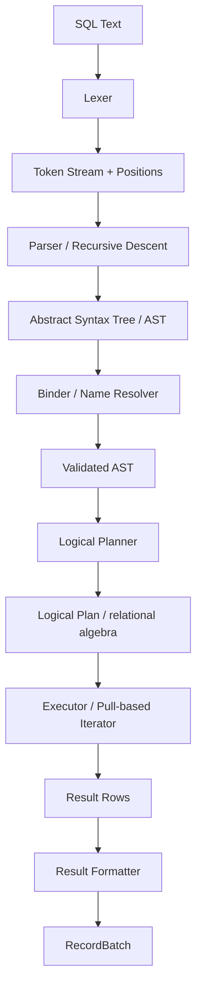
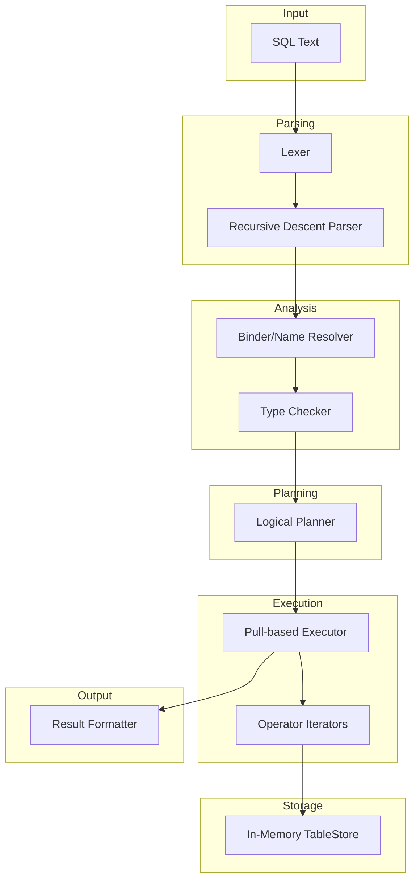
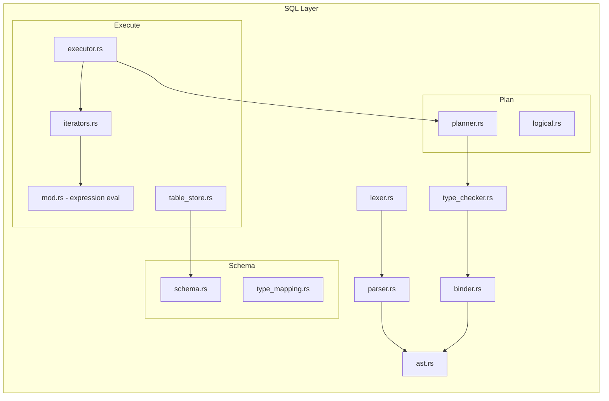
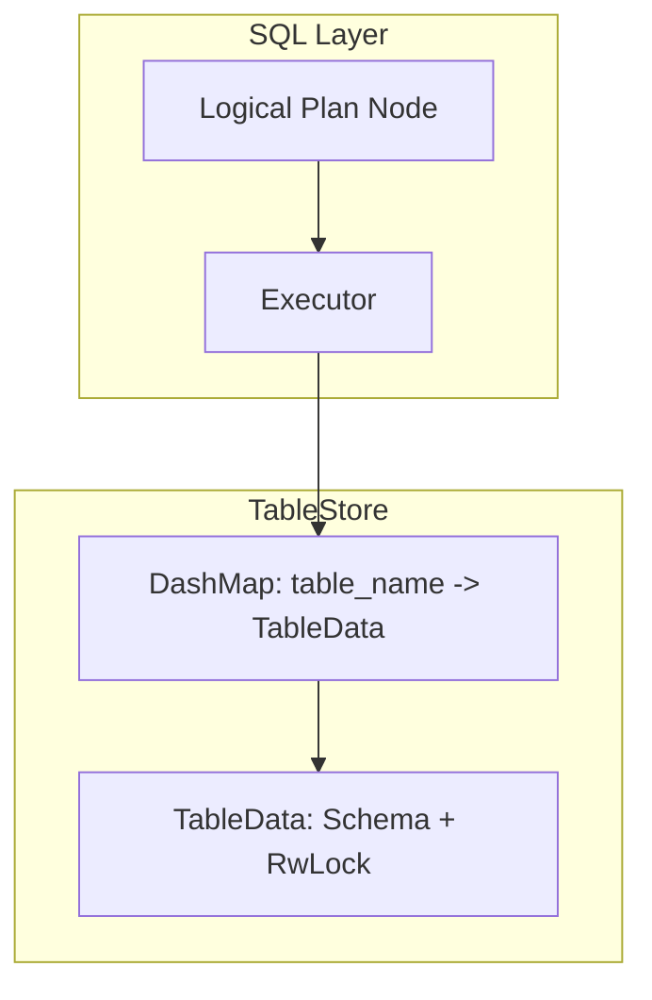
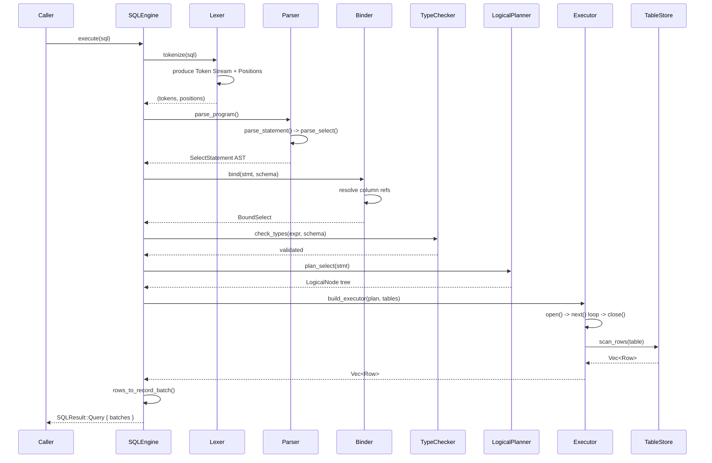
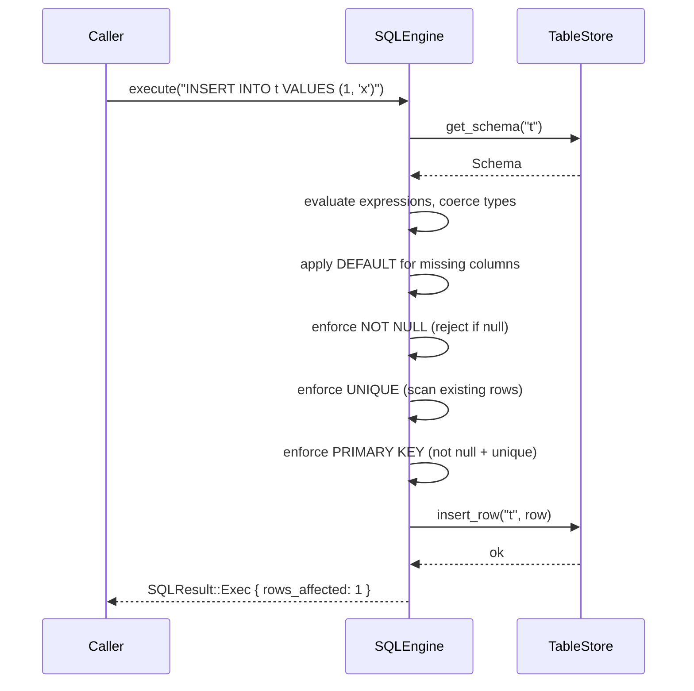

# 21. SQL Layer

## 1. Purpose

The SQL Layer provides a SQL interface over Nova Runtime's in-memory data structures. It allows users to interact with stored data using standard SQL syntax, translating relational query semantics into operations on a table-oriented data model. This enables drop-in compatibility for applications that expect a SQL database backend.

## 2. Scope

The SQL Layer encompasses the full query processing pipeline from SQL text ingestion to result production:

- SQL tokenization and parsing into an Abstract Syntax Tree (AST)
- Semantic analysis and name resolution against table schemas
- Logical plan construction from validated AST
- Query execution via a pull-based iterator model
- Type mapping between SQL column types and runtime value types
- Constraint enforcement (NOT NULL, DEFAULT, UNIQUE, PRIMARY KEY)
- DDL operations (CREATE TABLE, DROP TABLE)
- DML operations (SELECT, INSERT, UPDATE, DELETE)

The SQL Layer does NOT implement:
- A full SQL:2023 standard (it implements a carefully chosen subset)
- Cost-based query optimization
- Parallel query execution within a single query
- Distributed query execution
- Full-text search (delegated to Search subsystem)
- Stored procedures or triggers
- Foreign key constraint enforcement
- PostgreSQL wire protocol
- Prepared statements
- Transactions
- Joins
- Subqueries
- Common Table Expressions (CTEs)
- Window functions

## 3. Responsibilities

1. **SQL Parsing**: Convert SQL text into a validated AST using a recursive descent parser with one-token lookahead
2. **Name Resolution**: Resolve table names and column names against the current schema
3. **Type Checking**: Validate SQL types against table field types and perform implicit coercions where safe
4. **Query Planning**: Convert AST into a logical plan tree
5. **Query Execution**: Execute the logical plan, pulling results from the in-memory TableStore via iterators
6. **Result Formatting**: Convert Row values into column-oriented result sets with proper SQL types
7. **Constraint Enforcement**: Validate NOT NULL, DEFAULT, UNIQUE, and PRIMARY KEY constraints during INSERT
8. **Error Reporting**: Return structured SQL error codes with message text and position information
9. **Error Position Tracking**: Syntax errors include (start, end) position from the lexer

## 4. Non Responsibilities

- **Full SQL Compliance**: Not all SQL features are supported; deviations are documented with error codes
- **Cost-Based Optimization**: Statistics collection, histogram building, cost model tuning are excluded
- **Parallel Execution**: Single-threaded per-query execution only; no intra-query parallelism
- **Foreign Keys**: Referential integrity is enforced at the application layer
- **Stored Procedures**: Pl/pgSQL or similar procedural languages are not implemented
- **Triggers**: Event-driven hooks exist in the Event System, not as SQL triggers
- **Views**: Materialized or virtual views are not supported
- **Full-Text Indexes**: Text search capabilities are provided by the Search subsystem
- **Window Functions**: ROW_NUMBER, RANK, etc. are not supported
- **Recursive CTEs**: Common Table Expressions are not supported
- **Joins**: Cross-table joins are not implemented (single-table queries only)
- **Subqueries**: Subqueries in FROM, WHERE, or SELECT are not implemented
- **Prepared Statements**: Parameterized query caching is not implemented
- **Transactions**: BEGIN/COMMIT/ROLLBACK are not implemented

## 5. Architecture

### 5.1 Overall Pipeline





### 5.2 Module Layout



### 5.3 Integration with In-Memory Store



## 6. Data Structures

### 6.1 Token Types

```rust
enum Token {
    // Keywords
    Select, From, Where, Insert, Into, Values, Update, Set, Delete,
    Create, Table, Drop, And, Or, Not, Null, Is, In, Between, Like,
    ILike, True, False, As, On, Group, By, Having, Order, Asc, Desc,
    Limit, Offset, Distinct, All, Exists, Default,
    Count, Sum, Avg, Min, Max, Case, When, Then, Else, End, Cast,
    Primary, Key, Unique, Nulls, First, Last,
    
    // Identifiers & literals
    Identifier(String),
    Number(String),       // Parsed as string to preserve precision
    String(String),       // Single-quoted string
    
    // Operators
    Plus, Minus, Star, Slash, Percent,
    Eq, NotEq, Lt, LtEq, Gt, GtEq, Concat, ColonColon,
    
    // Punctuation
    LParen, RParen, Comma, Semicolon, Dot,
    
    // Special
    EOF,
}
```

### 6.2 Abstract Syntax Tree

```rust
enum Statement {
    Select(SelectStatement),
    Insert(InsertStatement),
    Update(UpdateStatement),
    Delete(DeleteStatement),
    CreateTable(CreateTableStatement),
    DropTable(DropTableStatement),
}

struct SelectStatement {
    distinct: bool,
    select_list: Vec<SelectItem>,
    from: TableRef,
    where_clause: Option<Expr>,
    group_by: Vec<Expr>,
    having: Option<Expr>,
    order_by: Vec<OrderByExpr>,
    limit: Option<usize>,
    offset: Option<usize>,
}

enum SelectItem {
    Expr { expr: Expr, alias: Option<String> },
    Wildcard,
}

struct TableRef {
    name: String,
    alias: Option<String>,
}

struct InsertStatement {
    table: TableRef,
    columns: Vec<String>,
    values: Vec<Vec<Expr>>,
}

struct UpdateStatement {
    table: TableRef,
    assignments: Vec<Assignment>,
    where_clause: Option<Expr>,
}

struct Assignment {
    column: String,
    value: Expr,
}

struct DeleteStatement {
    table: TableRef,
    where_clause: Option<Expr>,
}

struct CreateTableStatement {
    table: TableRef,
    columns: Vec<ColumnDef>,
}

struct DropTableStatement {
    table: TableRef,
}

struct ColumnDef {
    name: String,
    sql_type: SQLType,
    nullable: bool,
    default: Option<LiteralValue>,
    unique: bool,
    is_primary_key: bool,
}

struct OrderByExpr {
    expr: Expr,
    asc: bool,
    nulls_first: Option<bool>,
}
```

### 6.3 Expressions

```rust
enum Expr {
    Column(String),
    Literal(LiteralValue),
    BinaryOp {
        left: Box<Expr>,
        op: BinaryOperator,
        right: Box<Expr>,
    },
    UnaryOp {
        op: UnaryOperator,
        expr: Box<Expr>,
    },
    Function {
        name: String,
        args: Vec<Expr>,
    },
    IsNull(Box<Expr>),
    IsNotNull(Box<Expr>),
    In {
        expr: Box<Expr>,
        list: Vec<Expr>,
    },
    Between {
        expr: Box<Expr>,
        low: Box<Expr>,
        high: Box<Expr>,
    },
    Like {
        expr: Box<Expr>,
        pattern: Box<Expr>,
    },
    ILike {
        expr: Box<Expr>,
        pattern: Box<Expr>,
    },
    Case {
        whens: Vec<(Expr, Expr)>,
        else_val: Option<Box<Expr>>,
    },
    Cast {
        expr: Box<Expr>,
        target_type: SQLType,
    },
}

enum LiteralValue {
    Null,
    Boolean(bool),
    Integer(i64),
    Float(f64),
    String(String),
}

enum BinaryOperator {
    Plus, Minus, Multiply, Divide, Modulo,
    Eq, NotEq, Lt, LtEq, Gt, GtEq,
    And, Or, Concat,
}

enum UnaryOperator {
    Neg, Not,
}
```

### 6.4 SQL Type System

```rust
enum SQLType {
    Null,
    Boolean,
    Integer,
    Float,
    Text,
}
```

### 6.5 Logical Plan

```rust
enum LogicalNode {
    Scan {
        table_name: String,
        alias: Option<String>,
    },
    Projection {
        input: Box<LogicalNode>,
        exprs: Vec<(Expr, Option<String>)>,
    },
    Selection {
        input: Box<LogicalNode>,
        predicate: Expr,
    },
    Sort {
        input: Box<LogicalNode>,
        order_by: Vec<OrderByExpr>,
    },
    Limit {
        input: Box<LogicalNode>,
        limit: usize,
        offset: usize,
    },
    Aggregate {
        input: Box<LogicalNode>,
        exprs: Vec<(Expr, Option<String>)>,
    },
    Dedup {
        input: Box<LogicalNode>,
    },
}
```

### 6.6 Schema

```rust
struct Schema {
    columns: Vec<ColumnInfo>,
}

struct ColumnInfo {
    name: String,
    sql_type: SQLType,
    nullable: bool,
    default: Option<LiteralValue>,
    ordinal: usize,
    unique: bool,
    is_primary_key: bool,
}

struct TableSchema {
    name: String,
    schema: Schema,
}
```

### 6.7 Row and TableStore

```rust
struct Row {
    values: Vec<Option<LiteralValue>>,
}

struct TableData {
    schema: Schema,
    rows: RwLock<Vec<Row>>,
    next_row_id: RwLock<u64>,
}

struct TableStore {
    tables: DashMap<String, Arc<TableData>>,
}

type TableStoreRef = Arc<TableStore>;
```

### 6.8 RecordBatch (Result)

```rust
struct RecordBatch {
    columns: Vec<Column>,
    num_rows: usize,
}

enum Column {
    Integer(Vec<Option<i64>>),
    Float(Vec<Option<f64>>),
    Boolean(Vec<Option<bool>>),
    String(Vec<Option<String>>),
    Null(usize),
}

enum SQLResult {
    Query {
        batches: Vec<RecordBatch>,
        stats: ExecutionStats,
    },
    Exec {
        rows_affected: u64,
        stats: ExecutionStats,
    },
}

struct ExecutionStats {
    rows_scanned: u64,
    rows_returned: u64,
    execution_time_ms: u64,
}
```

## 7. Algorithms

### 7.1 Lexer

```
ALGORITHM: tokenize
INPUT:  SQL text string
OUTPUT: Vec<Token>, Vec<(start: usize, end: usize)>

1. Iterate over characters by position:
   a. Skip whitespace
   b. Record current position as start
   c. Match character:
      - Single quote (') -> read_string(): consume until closing quote,
        handle doubled quotes ('') as literal quote
      - Digit (0-9) -> read_number(): consume digits, optional decimal point,
        optional exponent (e/E [+/-] digits)
      - Alpha or underscore -> read_identifier_or_keyword():
        consume alphanumeric + underscore, lowercase match against keyword list,
        return Identifier(word) if no keyword match
      - Operator or punctuation -> read_operator_or_punct():
        match single/multi-character operators, return Result<Token>
        (never panics, returns proper syntax errors)
   d. Record end position, emit (token, (start, end))
2. Return token vector and position vector

Keyword list: SELECT, FROM, WHERE, INSERT, INTO, VALUES, UPDATE, SET, DELETE,
CREATE, TABLE, DROP, AND, OR, NOT, NULL, IS, IN, BETWEEN, LIKE, ILIKE, TRUE,
FALSE, AS, ON, GROUP, BY, HAVING, ORDER, ASC, DESC, LIMIT, OFFSET, DISTINCT,
ALL, EXISTS, DEFAULT, COUNT, SUM, AVG, MIN, MAX, CASE, WHEN, THEN, ELSE, END,
CAST, PRIMARY, KEY, UNIQUE, NULLS, FIRST, LAST

Line comments (-- ...) are skipped entirely (no token emitted).
```

### 7.2 Recursive Descent Parser

```
ALGORITHM: parse_program
INPUT:  token stream with positions
OUTPUT: Vec<Statement> or Error

Parse statements separated by semicolons.
Continue until EOF token is reached.

ALGORITHM: parse_statement
INPUT:  token stream
OUTPUT: Statement

Match first token to determine statement type:
   SELECT -> parse_select()
   INSERT -> parse_insert()
   UPDATE -> parse_update()
   DELETE -> parse_delete()
   CREATE -> parse_create_table()
   DROP   -> parse_drop_table()
   other  -> SyntaxError


ALGORITHM: parse_select
INPUT:  token stream (current token is SELECT)
OUTPUT: SelectStatement

1. Consume SELECT
2. Check for DISTINCT, set flag
3. Parse select_list (one or more select_item separated by commas)
4. Expect FROM, parse table_ref (single table, no joins)
5. If WHERE present, parse_expression() as predicate
6. If GROUP BY present, parse one or more expr
7. If HAVING present, parse_expression() as predicate
8. If ORDER BY present, parse one or more order_by_expr
9. If LIMIT present, parse usize literal
10. If OFFSET present, parse usize literal
11. Return SelectStatement


ALGORITHM: parse_expression (precedence climbing)
INPUT:  token stream, min_precedence
OUTPUT: Expr

MAX_NESTING_DEPTH = 64 recursion guard at entry.

Precedence (high to low):
   1. PRIMARY: literals, identifiers, functions, CASE, CAST, parenthesized
   2. UNARY: - (negation), NOT
   3. FACTOR: * / %
   4. TERM: + - ||
   5. COMPARISON: < <= > >=
   6. EQUALITY: = != <>
   7. AND
   8. OR

Parsing logic:
1. Parse unary expression (handles -expr, NOT expr)
2. Parse primary expression:
   a. Literal: NULL, TRUE, FALSE, Number, String
   b. Column reference: Identifier (may be followed by ::type cast)
   c. Function call: name(args...)
   d. Aggregate function: COUNT/SUM/AVG/MIN/MAX(args...)
   e. CASE expression: CASE WHEN cond THEN val [ELSE val] END
   f. CAST expression: CAST(expr AS type)
   g. Parenthesized expression: (expr)
3. After primary, check for postfix operators:
   a. IS NULL / IS NOT NULL
   b. IN (list)
   c. BETWEEN expr AND expr
   d. LIKE pattern / ILIKE pattern
   e. NOT IN / NOT BETWEEN / NOT LIKE / NOT ILIKE


ALGORITHM: parse_column_def
INPUT:  token stream
OUTPUT: ColumnDef

1. Parse identifier (column name)
2. Parse type keyword (INTEGER, FLOAT, TEXT, BOOLEAN)
3. Parse constraint keywords in any order:
   a. NOT NULL -> nullable = false
   b. NULL -> nullable = true
   c. DEFAULT literal -> default = Some(value)
   d. PRIMARY KEY -> is_primary_key = true, nullable = false
   e. UNIQUE -> unique = true


ALGORITHM: parse_order_by_expr
INPUT:  token stream
OUTPUT: OrderByExpr

1. Parse expression
2. If ASC present -> asc = true (also default)
3. If DESC present -> asc = false
4. If NULLS FIRST -> nulls_first = Some(true)
5. If NULLS LAST -> nulls_first = Some(false)


Error positions:
All syntax errors include (start, end) position from the lexer position vector,
indexed by the current parser token position.
```

### 7.3 Binder / Name Resolution

```
ALGORITHM: bind
INPUT:  SelectStatement, Schema
OUTPUT: BoundSelect or Error

1. For each SelectItem:
   a. Wildcard -> expand to all schema columns
   b. Expr { expr, alias } -> resolve_expr(expr, schema)
      - Column(name): verify column exists in schema, error if not
      - Recursively resolve nested expressions: BinaryOp, UnaryOp,
        Function, IsNull, IsNotNull, In, Between, Like, ILike, Case, Cast

2. Return BoundSelect with resolved column references

All Expr variants are traversed for column resolution:
  Column, Literal, BinaryOp, UnaryOp, Function,
  IsNull, IsNotNull, In, Between, Like, ILike, Case, Cast
```

### 7.4 Type Checking

```
ALGORITHM: check_types
INPUT:  Expr, Schema
OUTPUT: SQLType or Error

1. Column(name) -> lookup schema, return column type
2. Literal(val) -> literal_type(val): Null->Null, Boolean->Boolean, Integer->Integer, Float->Float, String->Text
3. BinaryOp(left, op, right):
   - AND/OR: both sides must be Boolean
   - Eq/NotEq: unify types of both sides
   - Lt/LtEq/Gt/GtEq: unify types, result is Boolean
   - Concat: unify types, result is Text
   - Arithmetic: unify types, result is the unified type
4. UnaryOp:
   - Neg: inner must be Integer or Float
   - Not: inner must be Boolean
5. Function: dispatch by name (COUNT->Integer, SUM/AVG->numeric, MIN/MAX->same as arg)
6. IsNull/IsNotNull -> Boolean
7. In: unify expr type with all list item types, result is Boolean
8. Between: unify expr type with low and high types, result is Boolean
9. Like/ILike: result is Boolean
10. Case: unify all WHEN result types with ELSE type
11. Cast: target type is returned (coercion checked at evaluation)


ALGORITHM: unify_types
INPUT:  type A, type B
OUTPUT: unified type or error

1. Null + anything = anything
2. Same types = that type
3. Integer + Float = Float
4. Integer + Text = Integer
5. Float + Text = Float
6. Otherwise = TypeMismatch error


ALGORITHM: coerce_value
INPUT:  LiteralValue, target SQLType
OUTPUT: coerced LiteralValue or error

Supported coercions:
  Null -> any type (returns Null)
  Integer -> Float, Text
  Float -> Integer, Text
  String -> Integer (parse), Float (parse), Text, Boolean
  Boolean -> Text
  Integer -> Boolean (0=false, non-zero=true)
```

### 7.5 Logical Plan Construction

```
ALGORITHM: plan_select
INPUT:  SelectStatement
OUTPUT: LogicalNode (tree)

1. Start with LogicalNode::Scan(table_name, alias)

2. If WHERE present:
   node = LogicalNode::Selection(input, predicate)

3. If ORDER BY present:
   node = LogicalNode::Sort(input, order_by)

4. Build projection/aggregate expressions from select_list:
   - If any expression contains an aggregate function (COUNT, SUM, AVG, MIN, MAX):
     node = LogicalNode::Aggregate(input, exprs)
   - Else:
     node = LogicalNode::Projection(input, exprs)

5. If DISTINCT:
   node = LogicalNode::Dedup(input)

6. Apply LIMIT/OFFSET (default limit = usize::MAX, offset = 0):
   node = LogicalNode::Limit(input, limit, offset)
```

### 7.6 Pull-based Execution (Iterator Model)

```
ALGORITHM: build_executor
INPUT:  LogicalNode, TableStoreRef
OUTPUT: Box<dyn Executor>

Recursively build executor tree from logical plan:
  Scan      -> ScanExecutor
  Selection -> FilterExecutor
  Projection -> ProjectionExecutor
  Aggregate -> AggregateExecutor
  Sort      -> SortExecutor
  Limit     -> LimitExecutor
  Dedup     -> DedupExecutor

Each executor implements the trait:
  fn open(&mut self) -> Result<()>
  fn next(&mut self) -> Result<Option<Row>>
  fn close(&mut self) -> Result<()>


ALGORITHM: ScanExecutor::next
1. On open(): scan all rows from TableStore for the given table name
2. On next(): return rows one at a time from the in-memory buffer
3. On close(): clear buffer


ALGORITHM: FilterExecutor::next
1. Pull rows from input child
2. For each row, evaluate predicate expression
3. Return first row where predicate evaluates to Boolean(true)
4. Return None when input is exhausted


ALGORITHM: ProjectionExecutor::next
1. Pull row from input child
2. For each expression, evaluate against the row's column values
3. Return new Row with projected values


ALGORITHM: DedupExecutor::next
1. Pull rows from input child
2. Compute hash of each row (Row::row_hash)
3. If hash already seen, skip row (continue)
4. Record hash and return first unique row
5. Return None when input is exhausted

Hash computation: hash each value variant using DefaultHasher.
  Null -> 0u64, None -> 1u64, Boolean, Integer, Float (to_bits), String


ALGORITHM: AggregateExecutor
1. On open(): consume ALL rows from input child
2. For each expression in the select list:
   a. If it is a Function (COUNT/SUM/AVG/MIN/MAX):
      - Evaluate the aggregate across all input rows
      - COUNT: count rows (or non-null values per column)
      - SUM: sum all numeric values as f64
      - AVG: average of numeric values as f64
      - MIN/MAX: compare all values using the appropriate comparison operator
   b. If it is a non-aggregate expression:
      - Evaluate on all rows, return the last value
3. Return a single result row


ALGORITHM: SortExecutor
1. On open(): consume ALL rows from input child
2. Sort rows using a custom comparator:
   a. For each OrderByExpr, evaluate the expression on both rows
   b. Compare values using compare_values() which handles NULL ordering
   c. NULLS FIRST: nulls sort before non-nulls
   d. NULLS LAST: nulls sort after non-nulls
   e. ASC/DESC: reverse comparison for DESC
3. Return sorted rows one by one on next()

compare_values() logic:
  Null vs Null     -> Equal
  Null vs non-Null -> Less if nulls_first, Greater otherwise
  non-Null vs Null -> Greater if nulls_first, Less otherwise
  Integer vs Integer -> numeric comparison
  Float vs Float     -> total_cmp
  Integer vs Float   -> promote to Float
  Boolean vs Boolean -> bool cmp
  String vs String   -> lexicographic cmp


ALGORITHM: LimitExecutor
1. On open(): skip `offset` rows from input, set remaining limit
2. On next(): return up to `limit` rows from input, then None
```

### 7.7 Expression Evaluation

```
ALGORITHM: evaluate_expr
INPUT:  Expr, Row (column values), Schema
OUTPUT: LiteralValue or Error

1. Column(name) -> lookup index in schema, return row[index] or Null
2. Literal(val) -> return clone of val
3. BinaryOp { left, op, right }:
   - Evaluate left and right
   - And/Or: coerce to bool, apply logic
   - Eq/NotEq: if either operand is Null, return Null (three-valued logic)
   - Comparisons (Lt/LtEq/Gt/GtEq): coerce pair, compare
   - Arithmetic: coerce numeric pair, compute
   - Concat: convert both to string, concatenate
4. UnaryOp:
   - Neg: negate Integer or Float, Null->Null
   - Not: negate Boolean, Null->Null
5. Function(name, args): evaluate args, dispatch by name
6. IsNull(expr): evaluate, return Boolean(true) if Null
7. IsNotNull(expr): evaluate, return Boolean(true) if not Null
8. In { expr, list }: evaluate expr, compare against each list item
9. Between { expr, low, high }: evaluate all, return (val >= low AND val <= high)
10. Like { expr, pattern }: evaluate both, convert LIKE pattern to regex,
    test match. Pattern conversion: % -> .*, _ -> ., escape regex metachars
11. ILike { expr, pattern }: same as Like but case-insensitive
    (lowercase both string and pattern before matching)
12. Case { whens, else_val }: evaluate WHEN conditions sequentially,
    return first THEN where condition is true; if none match, return ELSE or Null
13. Cast { expr, target_type }: evaluate expr, apply type_coercion

Three-valued logic for NULLs:
  NULL AND TRUE = NULL      NULL OR TRUE = TRUE
  NULL AND FALSE = FALSE    NULL OR FALSE = NULL
  NULL = NULL = NULL        NULL IS NULL = TRUE
  NULL != NULL = NULL       NULL IS NOT NULL = FALSE

LIKE pattern to regex conversion:
  %  -> .*    (any sequence)
  _  -> .     (single character)
  \% -> %     (escaped percent)
  \_ -> _     (escaped underscore)
  \\ -> \\    (escaped backslash)
  regex special chars (. + * ? ^ $ ( ) [ ] { } |) -> escaped with backslash
```

### 7.8 INSERT with Constraint Enforcement

```
ALGORITHM: execute_insert
INPUT:  InsertStatement, TableStore
OUTPUT: SQLResult

1. Look up table schema from TableStore
2. Determine column indices (explicit columns or all columns in order)
3. Validate value count matches column count
4. For each value row:
   a. Evaluate each expression against an empty context
   b. Coerce each value to the target column type
   c. Apply DEFAULT values for missing (unspecified) columns
   d. Enforce NOT NULL: if column is NOT NULL and value is NULL -> ConstraintViolation
   e. Enforce UNIQUE: if column is UNIQUE or PRIMARY KEY, scan existing rows
      for duplicate values -> ConstraintViolation
   f. Insert the row into TableStore
5. Return Exec result with row count


ALGORITHM: execute_update
INPUT:  UpdateStatement, TableStore
OUTPUT: SQLResult

1. Look up table schema
2. Scan all rows from TableStore
3. For each row:
   a. If WHERE present, evaluate predicate; skip if not true
   b. For each SET assignment:
      - Evaluate expression against current row values
      - Coerce to column type
      - Update row value
4. Re-create the table (drop + create) and insert all rows


ALGORITHM: execute_delete
INPUT:  DeleteStatement, TableStore
OUTPUT: SQLResult

1. Look up table schema
2. Scan all rows from TableStore
3. Filter rows:
   a. If WHERE present: keep rows where predicate is NOT true
   b. If no WHERE: delete all rows
4. Re-create the table (drop + create) and insert kept rows
```

## 8. Implemented Features

### 8.1 Constraint Enforcement

| Constraint | Implementation |
|------------|----------------|
| NOT NULL   | Rejects NULL values on INSERT. Checked after expression evaluation and DEFAULT application. Returns `ConstraintViolation("column 'X' cannot be null")`. |
| DEFAULT    | Substitutes a literal default value for missing columns on INSERT. Only applied when the column is not specified in the INSERT column list. Explicit NULL overrides DEFAULT. |
| UNIQUE     | Checks on INSERT by scanning existing rows for duplicate values. Returns `ConstraintViolation("duplicate value for unique column 'X'")`. |
| PRIMARY KEY | Implies NOT NULL + UNIQUE. Sets nullable=false and unique=true in schema, both constraints are enforced independently. |

### 8.2 DISTINCT

```
SELECT DISTINCT * FROM table

Parser token: Token::Distinct
AST: SelectStatement.distinct = bool
Plan: LogicalNode::Dedup { input }
Executor: DedupExecutor

Implementation: Hash-based dedup. For each row, compute a hash of all column
values using DefaultHasher. Track seen hashes in a Vec<u64>. Skip rows whose
hash has already been seen. Note: hash collisions are possible but not handled
(current implementation uses simple linear scan of seen hashes).
```

### 8.3 BETWEEN

```
x BETWEEN a AND b

AST: Expr::Between { expr, low, high }
Parser: parsed as postfix operator after primary expression
Evaluation: val >= low AND val <= high (using GtEq and LtEq binary operators)
Also supports NOT BETWEEN via Expr::UnaryOp(Not, Between(...))
```

### 8.4 IN Operator

```
x IN (a, b, c)

AST: Expr::In { expr, list }
Parser: parsed as postfix operator after primary expression
Evaluation: compare expr against each list item using equality (==).
Returns Boolean(true) on first match, Boolean(false) if no match.
Also supports NOT IN via Expr::UnaryOp(Not, In(...)).
List is evaluated as expressions (currently only literals in practice).
```

### 8.5 CASE/WHEN

```
CASE WHEN cond1 THEN val1 WHEN cond2 THEN val2 ELSE default END

AST: Expr::Case { whens: Vec<(Expr, Expr)>, else_val: Option<Box<Expr>> }
Parser: sequential parsing of WHEN/THEN/ELSE/END clauses
Evaluation: evaluate each WHEN condition in order; return first THEN value
where condition is Boolean(true); if no match, evaluate and return ELSE
value; if no ELSE, return Null.

CASE without ELSE returns NULL when no condition matches.
At least one WHEN is required (parse error otherwise).
```

### 8.6 CAST

```
CAST(x AS type)   -- function syntax
x :: type         -- PostgreSQL-style syntax

AST: Expr::Cast { expr: Box<Expr>, target_type: SQLType }
Parser: two forms - CAST(expr AS type) and identifier::type
Evaluation: evaluate expr, then delegate to TypeChecker::coerce_value()
for type conversion. Errors on invalid conversion (e.g., non-numeric string
to Integer).
```

### 8.7 LIKE / ILIKE

```
x LIKE pattern      -- case-sensitive pattern matching
x ILIKE pattern     -- case-insensitive pattern matching
x NOT LIKE pattern  -- negated

AST: Expr::Like { expr, pattern } / Expr::ILike { expr, pattern }
Parser: postfix operator after primary expression. NOT LIKE wraps in UnaryOp(Not, Like(...)).

Evaluation:
1. Convert SQL LIKE pattern to regex:
   %  -> .*    (match any sequence of characters)
   _  -> .     (match any single character)
   \% -> %    (literal percent, escaped)
   \_ -> _    (literal underscore, escaped)
   \\ -> \\   (literal backslash)
   All regex metacharacters (.+*?^$()[]{}|) are escaped with backslash
2. For ILIKE, lowercase both the input string and the pattern before matching
3. Use the regex crate to test the match

Supports escape character (backslash) for literal % and _.
```

### 8.8 GROUP BY and HAVING

```
SELECT category, SUM(value) FROM t GROUP BY category HAVING SUM(value) > 100

Parser: GROUP BY parses comma-separated expressions; HAVING parses an expression
AST: SelectStatement.group_by: Vec<Expr>, having: Option<Expr>
Plan: Aggregate node is created when expressions contain aggregate functions
Execution: AggregateExecutor consumes all rows and produces a single result row
          (multi-group aggregation is not yet fully implemented)
```

### 8.9 ORDER BY NULLS FIRST/LAST

```
SELECT * FROM t ORDER BY a NULLS FIRST
SELECT * FROM t ORDER BY a NULLS LAST

AST: OrderByExpr { expr, asc, nulls_first: Option<bool> }
Parser: parses NULLS { FIRST | LAST } after ASC/DESC
Plan: passes through to SortExecutor
Execution: compare_values() uses nulls_first flag for NULL ordering:
  - nulls_first = Some(true): NULLs sort before non-NULLs
  - nulls_first = Some(false): NULLs sort after non-NULLs
  - nulls_first = None: defaults to false (NULLs last)
```

### 8.10 Error Position Tracking

All lexer and parser errors carry (start, end) byte positions from the
original SQL input. The lexer records character offsets for each token,
and the parser propagates these positions into SQLError::Syntax variants.

```
SQLError::Syntax { message: String, start: usize, end: usize }
```

The lexer never panics. Invalid characters (bare `|`, bare `:`, etc.) return
proper `Result::Err(SQLError::Syntax { ... })` with position information.
All `panic!()` and `unreachable!()` calls in the lexer and parser have been
replaced with proper `Result` returns.

### 8.11 Query Complexity Limits

```
MAX_NESTING_DEPTH = 64

Applied in parse_expression(). If exceeded, returns:
  SQLError::QueryTooComplex("max nesting depth exceeded")

Prevents stack overflow from deeply nested expressions.
```

### 8.12 TableStore Concurrency

```rust
struct TableStore {
    tables: DashMap<String, Arc<TableData>>,
}

struct TableData {
    schema: Schema,
    rows: RwLock<Vec<Row>>,
    next_row_id: RwLock<u64>,
}
```

- DashMap provides fine-grained per-table locking (lock striping)
- Each table's rows have an independent RwLock for concurrent reads
- read/write lock scopes are minimized (lock, perform operation, release)
- Arc shared ownership for safe concurrent access

### 8.13 execute_query() Error Propagation

`SQLEngine::execute_query()` returns the actual error from the SQL engine
rather than wrapping it in a generic error type. All error variants from
`SQLError` are propagated directly to the caller:

```rust
pub fn execute_query(&self, sql: &str) -> Result<Vec<RecordBatch>> {
    match self.execute(sql)? {
        SQLResult::Query { batches, .. } => Ok(batches),
        SQLResult::Exec { .. } => Err(SQLError::syntax("query did not return results")),
    }
}
```

## 9. Interfaces

### 9.1 SQL Engine Public API

```rust
struct SQLEngine {
    config: SQLConfig,
    tables: Arc<TableStore>,
}

impl SQLEngine {
    fn new(config: SQLConfig) -> Self;

    /// Execute SQL text. Returns SQLResult (Query or Exec).
    fn execute(&self, sql: &str) -> Result<SQLResult>;

    /// Execute SQL text, expecting a Query result.
    /// Returns Vec<RecordBatch> or error.
    fn execute_query(&self, sql: &str) -> Result<Vec<RecordBatch>>;
}
```

### 9.2 Configuration

```rust
struct SQLConfig {
    max_batch_size: usize,   // default: 1024
    max_columns: usize,      // default: 256
    default_limit: usize,    // default: 1000
}
```

### 9.3 Executor Trait

```rust
trait Executor {
    fn open(&mut self) -> Result<()>;
    fn next(&mut self) -> Result<Option<Row>>;
    fn close(&mut self) -> Result<()>;
}
```

### 9.4 SQL Errors

```rust
enum SQLError {
    Syntax { message: String, start: usize, end: usize },
    TableNotFound(String),
    ColumnNotFound(String),
    TypeMismatch { expected: String, actual: String },
    Internal(String),
    ConstraintViolation(String),
    QueryTooComplex(String),
}
```

## 10. Sequence Diagrams

### 10.1 Simple SELECT Execution



### 10.2 INSERT with Constraint Enforcement



## 11. Failure Modes

### 11.1 Parse Errors

| Cause | Effect | Detection |
|-------|--------|-----------|
| Invalid SQL syntax | Syntax error with position | Parser match failure |
| Unclosed string literal | Syntax error | Lexer reaches EOF while reading string |
| Unknown keyword at statement start | Syntax error | parse_statement() match failure |
| Invalid operator (bare `|` or `:`) | Syntax error with position | read_operator_or_punct() |
| Exceeded max AST depth (64) | QueryTooComplex error | parse_expression() depth counter |

### 11.2 Semantic Errors

| Cause | Effect | Detection |
|-------|--------|-----------|
| Referenced table does not exist | TableNotFound error | TableStore schema lookup |
| Referenced column does not exist | ColumnNotFound error | Binder/expression column lookup |
| Type mismatch in expression | TypeMismatch error | Type checker or expression evaluator |
| NOT NULL violation | ConstraintViolation error | Insert executor post-evaluation check |
| UNIQUE violation | ConstraintViolation error | Insert executor scan for duplicates |
| PRIMARY KEY violation | ConstraintViolation error | Combined NOT NULL + UNIQUE check |
| Type coercion failure | TypeMismatch error | TypeChecker::coerce_value() |

### 11.3 Execution Errors

| Cause | Effect | Detection |
|-------|--------|-----------|
| Divide by zero | Internal error | eval_binary_op() divisor check |
| Invalid LIKE pattern | Internal error | regex compilation failure |
| Empty statement | Syntax error | execute() returns None |

## 12. Implementation Status

### 12.1 Currently Implemented

| Feature | Status | Details |
|---------|--------|---------|
| Lexer tokenization | Done | Position tracking, keyword recognition, no panics |
| Recursive descent parser | Done | Precedence climbing, MAX_NESTING_DEPTH=64 |
| CREATE / DROP TABLE | Done | INTEGER, FLOAT, TEXT, BOOLEAN types |
| SELECT with WHERE | Done | AND/OR, comparison operators, IS NULL/IS NOT NULL |
| INSERT | Done | Multi-row, column selection |
| UPDATE | Done | SET assignments, WHERE filter |
| DELETE | Done | WHERE filter |
| ORDER BY ASC/DESC | Done | Sort executor |
| LIMIT / OFFSET | Done | Limit executor with offset skipping |
| Arithmetic expressions | Done | +, -, *, /, %, with Integer/Float coercion |
| String concatenation | Done | \|\| operator |
| Aggregation (COUNT, SUM, AVG, MIN, MAX) | Done | Aggregate executor, single-group |
| Type coercion | Done | Integer/Float/String/Boolean conversions |
| DISTINCT | Done | DedupExecutor with hash-based dedup |
| BETWEEN | Done | Expr::Between, decomposed to >= AND <= |
| IN operator | Done | Expr::In, literal list comparison |
| NOT IN / NOT BETWEEN / NOT LIKE | Done | UnaryOp(Not, ...) wrapping |
| CASE / WHEN / THEN / ELSE / END | Done | Sequential evaluation, ELSE defaults to NULL |
| CAST | Done | CAST(x AS type) and x::type syntax |
| LIKE / ILIKE | Done | Regex-based, % and _ wildcards, escape support |
| GROUP BY + HAVING | Done | Parsed and planned, single-group aggregate |
| ORDER BY NULLS FIRST / LAST | Done | compare_values() null ordering |
| NOT NULL constraint | Done | Rejects NULL on INSERT |
| DEFAULT constraint | Done | Substitutes default for missing columns |
| UNIQUE constraint | Done | Scans existing rows for duplicates on INSERT |
| PRIMARY KEY constraint | Done | NOT NULL + UNIQUE combined |
| Error position tracking | Done | (start, end) in Syntax errors |
| Query nesting limit | Done | MAX_NESTING_DEPTH=64, QueryTooComplex error |
| No panics in lexer/parser | Done | All panic!/unreachable! replaced with Result |
| Error swallowing fix | Done | execute_query() propagates actual errors |
| TableStore concurrency | Done | DashMap + RwLock fine-grained locking |
| 37 integration tests | Done | All features covered, including error paths |

### 12.2 Planned / Future

| Feature | Status | Notes |
|---------|--------|-------|
| PostgreSQL wire protocol | Planned | Not yet implemented |
| Prepared statements | Planned | Not yet implemented |
| Transactions (BEGIN/COMMIT/ROLLBACK) | Planned | Not yet implemented |
| Joins (INNER, LEFT, OUTER, CROSS) | Planned | Not yet implemented |
| Subqueries (scalar, EXISTS, IN) | Planned | Not yet implemented |
| Common Table Expressions (WITH) | Planned | Not yet implemented |
| Window functions | Planned | Not yet implemented |
| Full-text search integration | Planned | Not yet implemented |
| Cost-based optimizer | Planned | Not yet implemented |
| Parallel query execution | Planned | Not yet implemented |
| Views | Planned | Not yet implemented |
| Stored procedures | Planned | Not yet implemented |
| Triggers | Planned | Not yet implemented |
| UPSERT (ON CONFLICT) | Planned | Not yet implemented |
| MERGE | Planned | Not yet implemented |
| INTERSECT / EXCEPT | Planned | Not yet implemented |
| EXPLAIN ANALYZE | Planned | Not yet implemented |
| Savepoints | Planned | Not yet implemented |
| MySQL wire protocol | Planned | Not yet implemented |
| Foreign key enforcement | Future | Application-level concern |
| UPSERT (INSERT OR REPLACE) | Not implemented | |
| Array and JSON operators | Not implemented | |

## 13. Performance Considerations

### 13.1 Memory

- **TableStore**: All rows are held in memory (Vec<Row>) per table
- **Row**: Each row stores Vec<Option<LiteralValue>>, proportional to column count
- **Sort**: Materializes all input rows into Vec before sorting
- **Aggregate**: Consumes all input rows into Vec before computing
- **Dedup**: Maintains Vec<u64> of seen hashes, proportional to unique output rows
- **Parser**: AST allocation proportional to query size
- **Lexer**: Token stream size proportional to SQL text size

### 13.2 CPU

- **Parsing**: O(n) for tokenization, O(n) for parsing where n = SQL text length
- **Name Resolution**: O(c) where c = columns referenced
- **Logical Planning**: O(n) where n = AST node count
- **TableScan**: O(R) where R = rows in table
- **Filter**: O(R) per scan
- **Sort**: O(n log n) where n = input rows
- **Dedup**: O(n) with hash lookup per row
- **Aggregate**: O(R * E) where R = rows, E = expressions
- **Expression Evaluation**: O(1) per node, tree walk
- **Unique constraint check**: O(R) per INSERT (scans all existing rows)
- **UPDATE/DELETE**: O(R) full table scan + rewrite

### 13.3 Complexity Summary

| Operation | Time Complexity |
|-----------|----------------|
| Scan (full table) | O(R) |
| Filter | O(R) |
| Sort | O(n log n) |
| Aggregate | O(R * E) |
| Dedup (DISTINCT) | O(n) |
| Limit/Offset | O(offset + limit) |
| Insert (no constraints) | O(1) |
| Insert (with UNIQUE check) | O(R) per row |
| Update | O(R + N) |
| Delete | O(R) |

R = rows in table, n = input rows, E = expressions, N = updated rows

## 14. Testing

### 14.1 Integration Tests

37 integration tests covering all implemented features and error paths.

**Core DML/DDL** (18 tests):
- test_create_table_and_insert
- test_simple_select
- test_select_with_where
- test_select_with_where_and_or
- test_select_projection
- test_select_limit
- test_select_order_by
- test_select_is_null
- test_select_arithmetic
- test_drop_table
- test_insert_multiple_rows
- test_select_count
- test_nested_expressions
- test_type_coercion
- test_empty_table_select
- test_syntax_error
- test_table_not_found_error
- test_column_not_found_error

**New Features** (19 tests):
- test_select_distinct
- test_between
- test_in_operator
- test_case_when
- test_cast
- test_like_pattern
- test_ilike
- test_not_null_constraint
- test_default_value
- test_unique_constraint
- test_primary_key_constraint
- test_group_by_having
- test_order_by_nulls
- test_query_nesting_limit
- test_lexer_panic_error
- test_multiple_errors
- test_in_operator_with_not
- test_like_special_chars
- test_case_no_else

### 14.2 Test Structure

All tests use `SQLEngine::new(SQLConfig::default())` and execute SQL strings
against the in-memory TableStore. Tests verify:
- Row counts and column values in Query results
- Rows affected counts in Exec results
- Error types and messages for error paths
- Column ordering and type correctness

## 15. Future Work

1. **Subqueries**: Scalar, EXISTS, and IN subqueries
2. **Joins**: INNER, LEFT, RIGHT, CROSS JOIN with hash and nested-loop strategies
3. **Common Table Expressions**: WITH clause, recursive CTEs
4. **Window Functions**: ROW_NUMBER(), RANK(), LEAD(), LAG() with OVER/PARTITION BY
5. **Prepared Statements**: Cached parsed/planned statements with parameter binding
6. **Transactions**: BEGIN/COMMIT/ROLLBACK with MVCC
7. **PostgreSQL Wire Protocol**: PG-compatible network protocol listener
8. **Full-Text Search Integration**: MATCH() function for Search subsystem
9. **Cost-Based Optimizer**: Statistics collection and cost model
10. **Parallel Query Execution**: Multi-threaded scan and aggregation
11. **Views**: Virtual and materialized views
12. **Stored Procedures**: Lightweight scripting for server-side logic
13. **UPSERT**: INSERT ... ON CONFLICT DO UPDATE
14. **MERGE**: Standard SQL MERGE statement
15. **INTERSECT/EXCEPT**: Set operations
16. **EXPLAIN ANALYZE**: Detailed execution statistics
17. **Savepoints**: Nested transaction savepoints
18. **MySQL Wire Protocol**: Additional wire protocol listener
19. **Array and JSON Operators**: Deeper type system integration
20. **Foreign Key Enforcement**: Optional referential integrity

## 16. References

1. PostgreSQL Documentation: SQL Language - https://www.postgresql.org/docs/current/sql.html
2. SQL Standard ISO/IEC 9075:2016
3. "Query Processing in a Relational Database Management System" - Selinger et al. (1979)
4. "Volcano - An Extensible and Parallel Query Evaluation System" - Graefe (1994)
5. SQLite Source Code - https://sqlite.org/src - Reference for recursive descent parser
6. DuckDB Source Code - https://github.com/duckdb/duckdb - Reference for embedded SQL engine design
7. "SQL Grammar" - PostgreSQL SQL grammar in BNF - https://www.postgresql.org/docs/current/sql-grammar.html
8. Nova Runtime Architecture Documents (docs/01 through docs/20)
