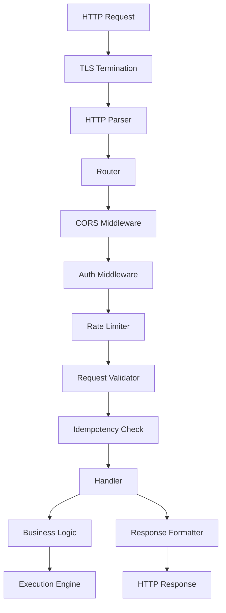
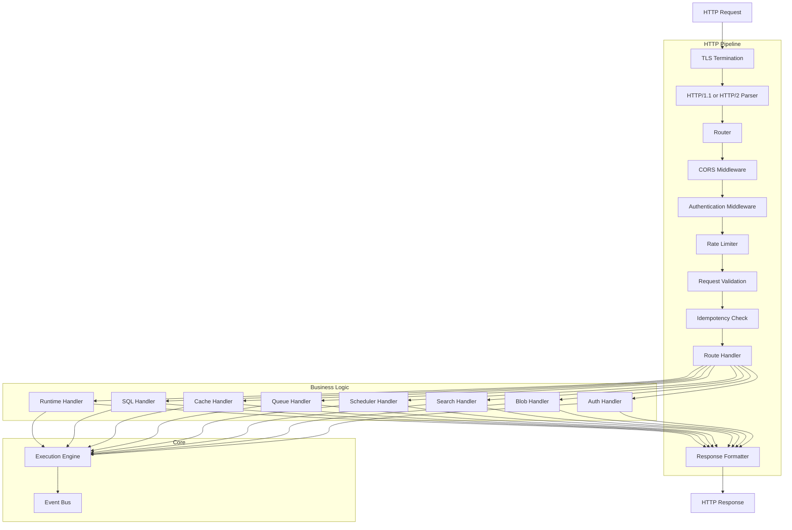
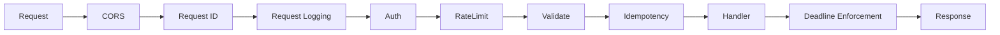
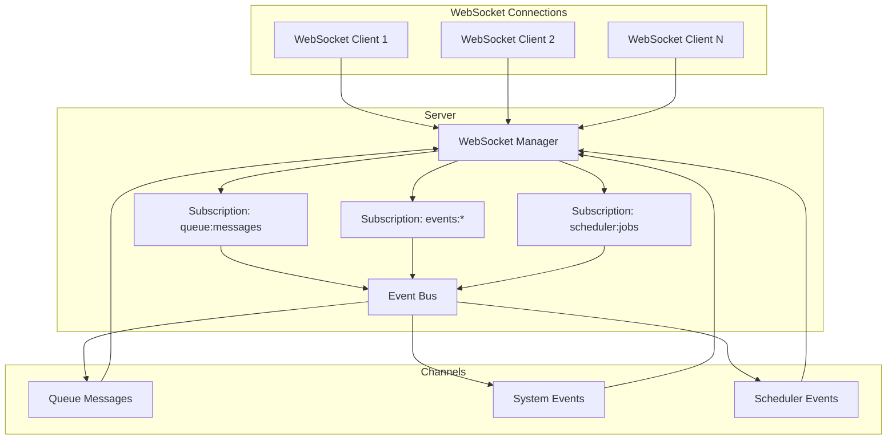
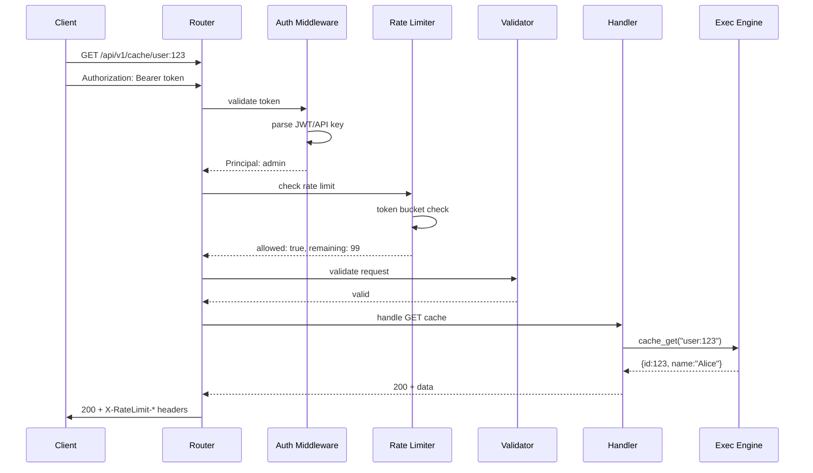
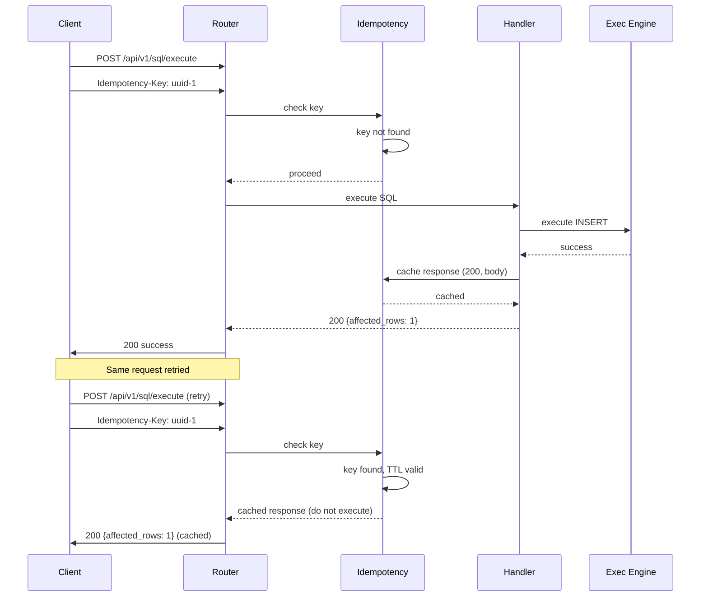
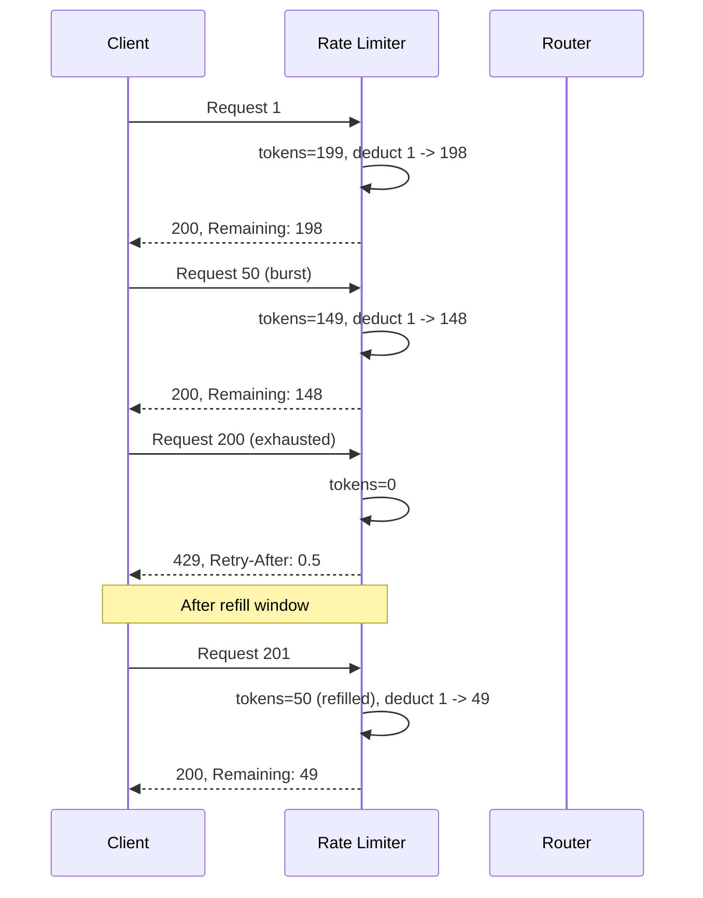

# 23. REST API

> **Implementation Status:** This document is the design specification written before implementation. The actual implemented endpoints are listed below. Design sections may contain aspirational features not yet implemented (e.g. cursor pagination, rate limiting at HTTP level, TLS).

## Actual Implemented Endpoints

**Base URL:** `http://127.0.0.1:8642`

### System (admin.rs)

| Route | Method | Description |
|-------|--------|-------------|
| `/health` | GET | System health with subsystem status, memory, disk |
| `/ready` | GET | Readiness probe |
| `/live` | GET | Liveness probe |
| `/metrics` | GET | Prometheus-format metrics |
| `/admin/config` | GET | Full runtime configuration (all 16 sections) |
| `/admin/config` | PUT | Update config at runtime (partial JSON merge with validation) |
| `/admin/status` | GET | Pipeline status and metrics |
| `/openapi.json` | GET | OpenAPI 3.0.3 spec stub |
| `/runtime/status` | GET | Subsystem health status |
| `/runtime/info` | GET | Version and uptime |
| `/runtime/config` | GET | Alias for `/admin/config` |

### Auth (`/api/v1/auth` — auth.rs)

| Route | Method | Description |
|-------|--------|-------------|
| `/api/v1/auth/login` | POST | Login with username/password → JWT |
| `/api/v1/auth/refresh` | POST | Refresh JWT token |
| `/api/v1/auth/logout` | POST | Invalidate session |
| `/api/v1/auth/api-keys` | GET | List API keys |
| `/api/v1/auth/api-keys` | POST | Create API key |
| `/api/v1/auth/api-keys/:id` | DELETE | Revoke API key |
| `/api/v1/auth/users` | GET | List users |
| `/api/v1/auth/users` | POST | Create user |
| `/api/v1/auth/users/:id` | GET | Get user |
| `/api/v1/auth/users/:id` | DELETE | Delete user |
| `/api/v1/auth/users/:id/roles` | PUT | Update user roles |
| `/api/v1/auth/users/:id/password` | PUT | Change password |

### SQL (`/api/v1/sql` — sql.rs)

| Route | Method | Description |
|-------|--------|-------------|
| `/api/v1/sql/query` | POST | Run SELECT query |
| `/api/v1/sql/execute` | POST | Run INSERT/UPDATE/DELETE/CREATE/DROP |
| `/api/v1/sql/tables` | GET | List tables |
| `/api/v1/sql/tables/:table/schema` | GET | Get table schema |

### Cache (`/api/v1/cache` — cache.rs)

| Route | Method | Description |
|-------|--------|-------------|
| `/api/v1/cache/:key` | GET | Get cache entry |
| `/api/v1/cache/:key` | POST | Set cache entry |
| `/api/v1/cache/:key` | DELETE | Delete cache entry |
| `/api/v1/cache/keys` | GET | List cache keys |
| `/api/v1/cache/batch` | POST | Batch set |
| `/api/v1/cache/stats` | GET | Cache statistics |

### Queue (`/api/v1/queues` — queue.rs)

| Route | Method | Description |
|-------|--------|-------------|
| `/api/v1/queues/` | GET | List queues |
| `/api/v1/queues/` | POST | Create queue |
| `/api/v1/queues/:name` | GET | Get queue |
| `/api/v1/queues/:name` | DELETE | Delete queue |
| `/api/v1/queues/:name/messages` | POST | Publish message |
| `/api/v1/queues/:name/messages/poll` | POST | Poll messages |
| `/api/v1/queues/:name/messages/:id/ack` | POST | Acknowledge message |
| `/api/v1/queues/:name/purge` | POST | Purge queue |
| `/api/v1/queues/:name/stats` | GET | Queue statistics |

### Scheduler (`/api/v1/scheduler` — scheduler.rs)

| Route | Method | Description |
|-------|--------|-------------|
| `/api/v1/scheduler/jobs` | GET | List jobs |
| `/api/v1/scheduler/jobs` | POST | Create job |
| `/api/v1/scheduler/jobs/:id` | GET | Get job |
| `/api/v1/scheduler/jobs/:id` | DELETE | Delete job |
| `/api/v1/scheduler/jobs/:id/trigger` | POST | Trigger job |
| `/api/v1/scheduler/jobs/:id/pause` | POST | Pause job |
| `/api/v1/scheduler/jobs/:id/resume` | POST | Resume job |
| `/api/v1/scheduler/stats` | GET | Scheduler statistics |

### Search (`/api/v1/search` — search.rs)

| Route | Method | Description |
|-------|--------|-------------|
| `/api/v1/search/indexes` | GET | List indexes |
| `/api/v1/search/indexes` | POST | Create index |
| `/api/v1/search/indexes/:name` | GET | Get index |
| `/api/v1/search/indexes/:name` | DELETE | Delete index |
| `/api/v1/search/indexes/:name/documents` | POST | Index documents |
| `/api/v1/search/indexes/:name/query` | POST | Search query |
| `/api/v1/search/indexes/:name/stats` | GET | Index statistics |

### Blob (`/api/v1/blobs` — blob.rs)

| Route | Method | Description |
|-------|--------|-------------|
| `/api/v1/blobs/` | GET | List blobs |
| `/api/v1/blobs/` | POST | Upload blob |
| `/api/v1/blobs/:id` | GET | Download blob |
| `/api/v1/blobs/:id` | DELETE | Delete blob |
| `/api/v1/blobs/:id/info` | GET | Blob metadata |
| `/api/v1/blobs/stats` | GET | Blob statistics |

### WebSocket (ws.rs)

| Route | Method | Description |
|-------|--------|-------------|
| `/api/v1/ws` | WebSocket | Real-time event streaming |

### Not Yet Implemented

The following features from the design spec are not yet implemented at the HTTP layer:
- **Rate limiting** — exists in pipeline middleware only, not at axum level
- **TLS** — config struct exists but listener is not wired
- **Cursor-based pagination** — list endpoints return flat arrays
- **Dashboard-specific routes** (`/api/v1/dashboard/*`) — never implemented
- **HTTP-level auth middleware** — auth is handled per-route, not as axum middleware
- **`POST /admin/reload`** — SIGHUP is used for config reload instead

---

## 1. Purpose

The REST API provides external programmatic access to all Nova Runtime subsystems via standard HTTP/1.1 and HTTP/2. It is the primary interface for external clients (SDKs, integrations, dashboards) to interact with Nova. The API follows RESTful conventions where every resource is identified by a URL and manipulated via standard HTTP methods.

## 2. Scope

The REST API covers all external-facing endpoints for every Nova subsystem:

- **Runtime**: Server health, metrics, configuration endpoints
- **Database (SQL)**: SQL query execution via HTTP, schema management
- **Cache**: Key-value operations with TTL
- **Queue**: Message production, consumption, queue management
- **Scheduler**: Job CRUD, trigger, and status operations
- **Search**: Index management, document indexing, query operations
- **Blob Storage**: Upload, download, delete, list operations
- **Authentication**: User management, API key management, token operations

The API does NOT cover:
- Internal subsystem communication (uses native Rust function calls)
- Cluster management (single-node by design)
- Direct Storage Engine access (goes through Execution Engine)
- Administrative OS-level operations (backup/restore lifecycle is covered by CLI)

## 3. Responsibilities

1. **Endpoint routing**: Dispatch HTTP requests to appropriate subsystem handlers
2. **Request parsing**: Deserialize JSON request bodies into validated domain types
3. **Authentication**: Validate Bearer tokens or API keys on every request
4. **Authorization**: Check principal permissions against resource-level access control
5. **Rate limiting**: Enforce per-principal and per-IP rate limits with burst allowance
6. **Validation**: Validate all input parameters, query strings, and request bodies
7. **Idempotency**: Ensure mutation endpoints can be safely retried with idempotency keys
8. **Pagination**: Provide consistent cursor-based pagination for list endpoints
9. **Error formatting**: Return consistent RFC 7807 Problem Details errors
10. **Response formatting**: Serialize response bodies as JSON (or other negotiated format)
11. **CORS**: Handle cross-origin requests for browser-based clients
12. **Versioning**: Support API versioning via URL prefix or Accept header
13. **WebSocket**: Manage WebSocket connections for push events and real-time updates
14. **Metrics**: Expose Prometheus-format metrics at /metrics
15. **Documentation**: Serve OpenAPI specification at /openapi.json

## 4. Non Responsibilities

- **HTML rendering**: The API returns JSON only; dashboard/UI is the Dashboard subsystem
- **Session management**: No cookie-based sessions; stateless authentication only
- **File upload processing**: Large blobs streamed directly to blob storage, not buffered in memory
- **Request retry**: The API does not retry failed operations; clients handle retries via SDK
- **Cross-datacenter replication**: Not applicable in single-node architecture
- **GraphQL interface**: Separate subsystem (doc 23)
- **SQL wire protocol**: Separate subsystem (doc 21)

## 5. Architecture

### 5.1 Request/Response Pipeline





### 5.2 Middleware Stack Order



### 5.3 WebSocket Architecture



### 5.4 API Key Hierarchy

```mermaid
flowchart TB
    subgraph Root
        Root[Root Key<br/>Full Access]
    end
    subgraph Admin
        A1[Admin Key 1]
        AN[Admin Key N]
    end
    subgraph Service
        S1[Service Key 1<br/>Scoped: db, cache]
        S2[Service Key 2<br/>Scoped: queue, scheduler]
    end
    subgraph User
        U1[User Key 1]
        UN[User Key N]
    end
    Root --> A1 & AN
    A1 --> S1 & U1
    AN --> S2 & UN
```

## 6. Data Structures

### 6.1 Standard Request/Response Envelope

```typescript
interface ListResponse<T> {
    data: T[];
    pagination: Pagination;
}
interface ResourceResponse<T> {
    data: T;
}
interface MutationResponse {
    id: string;
    status: "created" | "updated" | "deleted";
    affected_count?: number;
}
// RFC 7807 Problem Details
interface ProblemDetails {
    type: string;
    title: string;
    status: number;
    detail: string;
    instance: string;
    errors?: FieldError[];
    trace_id?: string;
}
interface FieldError {
    field: string;
    message: string;
    code: string;
}
```

### 6.2 Pagination

```typescript
interface Pagination {
    cursor: string | null;
    previous_cursor: string | null;
    limit: number;
    has_more: boolean;
    total?: number;
}
// Cursor is base64-encoded JSON:
// base64({sort_key: "...", id: "...", direction: "next"|"prev"})
```

### 6.3 Rate Limit Headers

All responses include: X-RateLimit-Limit, X-RateLimit-Remaining, X-RateLimit-Reset. On 429 responses: Retry-After header with seconds to wait.

### 6.4 Idempotency Key

Header: `Idempotency-Key: <UUID v4>`. Server caches response for 24h, returns cached result for duplicate keys. Only 2xx responses are cached. Max 10000 keys in cache.

```typescript
interface IdempotencyRecord {
    key: string;
    response_status: number;
    response_body: string;
    created_at: number;
    ttl_seconds: number;  // default 86400
}
```

### 6.5 Configuration

```typescript
interface APIConfig {
    host: string;                       // "0.0.0.0"
    port: number;                       // 8080
    tls_port: number;                   // 8443
    tls_enabled: boolean;               // false
    http2_enabled: boolean;             // true
    rate_limit_enabled: boolean;        // true
    rate_limit_default: number;         // 100 req/s
    rate_limit_burst: number;           // 200
    cors_enabled: boolean;              // true
    cors_allowed_origins: string[];     // ["*"]
    auth_enabled: boolean;              // true
    auth_bypass_paths: string[];        // ["/health","/metrics","/openapi.json"]
    max_body_size: number;              // 10485760 (10MB)
    max_url_length: number;             // 8192
    default_page_limit: number;         // 50
    max_page_limit: number;             // 1000
    websocket_max_connections: number;  // 256
    websocket_ping_interval_ms: number; // 30000
    idempotency_ttl_seconds: number;    // 86400
    api_version: string;                // "v1"
}
```

## 7. Algorithms

### 7.1 Authentication Token Validation

```
ALGORITHM: validate_auth_token
INPUT:  Authorization header value
OUTPUT: Principal or Error

1. Check header exists; if missing return 401
2. Split on space: scheme + credentials
3. Verify scheme is "Bearer" (case-sensitive)
4. Decode credentials:
   a. If pattern {prefix}.{random}: API key
      - Look up by prefix in key store
      - Constant-time compare full key hash
      - Return associated principal
   b. If JWT pattern (header.payload.signature):
      - Validate JWT signature with server secret
      - Check expiration (exp) and not-before (nbf)
      - Extract principal from sub claim
   c. Otherwise: return 401
5. If token not found or expired: return 401
6. Return principal with roles and permissions
```

### 7.2 Authorization

```
ALGORITHM: authorize_request
INPUT:  Principal, HTTP method, resource path
OUTPUT: bool

1. Determine required permission from method + path:
   - GET/HEAD: read permission
   - POST: create permission
   - PUT/PATCH: update permission
   - DELETE: delete permission
2. Look up principal permissions (cached, TTL 60s)
3. Root key: allow all
4. Permission match required; no implicit allow
5. If no matching permission: deny (403 Forbidden)
```

### 7.3 Rate Limiting (Token Bucket)

```
ALGORITHM: rate_limiter_check
INPUT:  Principal ID (or IP), config
OUTPUT: (allowed, remaining, reset)

Uses token bucket algorithm with 256 shards for concurrency:
1. Key = principal_id (authenticated) or source_ip (anonymous)
2. Look up bucket in concurrent HashMap
3. If not found: create bucket with full tokens (burst)
4. If found: calculate refill
   - elapsed_ms = now_ms - bucket.last_refill_ms
   - refill = elapsed_ms * (rate_limit / 1000)
   - bucket.tokens = min(burst, bucket.tokens + refill)
   - bucket.last_refill_ms = now_ms
5. If tokens >= 1: decrement, return (true, remaining, reset_time)
6. If tokens < 1: return (false, 0, reset_time)
Cleanup: remove buckets inactive > 1h, every 5 minutes
```

### 7.4 Cursor-Based Pagination

```
ALGORITHM: paginate_list
INPUT:  query results, cursor, limit, sort_field
OUTPUT: ListResponse

1. Decode cursor (base64 JSON): {sort_key, id, direction}
2. If cursor: skip to cursor position in results
3. Take limit + 1 items (extra for has_more check)
4. has_more = len(results) > limit
5. If has_more: remove last item from response
6. Encode next cursor from last item's sort_key
7. Encode prev cursor from first item's sort_key
8. Return response with pagination metadata
```

### 7.5 Idempotency Key Processing

```
ALGORITHM: process_idempotency_key
INPUT:  Idempotency-Key header, method, path, body
OUTPUT: (cached, response)

1. Skip if method not POST/PUT/PATCH/DELETE or header missing
2. Validate UUID v4 format via regex
3. Compute cache key = SHA256(method + path + key)
4. Look up in idempotency cache:
   a. Found + not expired: return cached response, do not execute
   b. Found + expired: remove, continue to handler
   c. Not found: execute handler, cache if 2xx response
5. Return (cached=false, response=handler_result)
```

### 7.6 Request Validation

```
ALGORITHM: validate_request
INPUT:  HTTP request, endpoint schema
OUTPUT: ValidatedParams or ValidationError

1. Validate headers: Content-Type, Accept, required headers, size limits
2. Validate URL: length <= 8192, path params match schema, query params typed
3. Validate body (if present):
   a. Size <= max_body_size (10MB)
   b. Valid JSON
   c. Matches schema: required fields, types, formats, string lengths, number ranges
   d. Enum values valid
   e. Nested objects validated recursively
4. Return validated parameters or collect all validation errors
```

## 8. Interfaces

### 8.1 Base URL and Versioning

```
Base URL: http://{host}:{port}/api/v1
Base URL (TLS): https://{host}:{tls_port}/api/v1
Alternative: Accept: application/vnd.nova.v1+json
```

### 8.2 Runtime Endpoints

```
GET    /health                          - Health check (no auth)
GET    /metrics                         - Prometheus metrics (no auth)
GET    /openapi.json                    - OpenAPI spec (no auth)
GET    /runtime/status                  - Runtime status (admin)
GET    /runtime/info                    - Version info (authenticated)
GET    /runtime/config                  - Configuration (admin)
```

#### GET /health
Response 200:
```json
{"status":"ok","version":"1.0.0","uptime_seconds":3600,"timestamp":"2026-07-02T12:00:00Z"}
```

#### GET /runtime/status
Auth: admin. Response 200:
```json
{
  "status": "running",
  "subsystems": {
    "database": {"status":"healthy","uptime_seconds":3600},
    "cache": {"status":"healthy","hit_rate":0.95},
    "queue": {"status":"healthy","total_messages":5000},
    "scheduler": {"status":"healthy","active_jobs":12},
    "search": {"status":"healthy","index_count":5},
    "blob": {"status":"healthy","total_size_bytes":1073741824}
  },
  "memory_used_mb": 256,
  "cpu_usage_percent": 15.2,
  "connection_count": 42
}
```

### 8.3 Database (SQL) Endpoints

```
POST   /sql/query                       - Execute read-only SQL query
POST   /sql/execute                     - Execute SQL mutation
POST   /sql/prepare                     - Prepare SQL statement
POST   /sql/execute-prepared            - Execute prepared statement
GET    /sql/tables                      - List tables (see SQL Layer doc 21 for schema details)
GET    /sql/tables/{table}/schema       - Get table schema (see SQL Layer doc 21 for type mapping)
POST   /sql/tables                      - Create table (DDL, see SQL Layer doc 21 for DDL grammar)
DELETE /sql/tables/{table}              - Drop table (DDL, see SQL Layer doc 21 for DDL grammar)
```

#### POST /sql/query
Auth: authenticated (read). Request:
```json
{
  "query": "SELECT id, name FROM users WHERE status = $1",
  "params": ["active"],
  "limit": 50,
  "format": "objects"
}
```
Response 200:
```json
{
  "columns": ["id","name"],
  "types": ["integer","text"],
  "rows": [[1,"Alice"],[2,"Bob"]],
  "row_count": 2,
  "truncated": false,
  "execution_time_ms": 1.5
}
```
Errors: 400 for syntax error, 422 for type error.

#### POST /sql/execute
Auth: authenticated (write). Response 200: `{"affected_rows": 1, "execution_time_ms": 0.8}`

#### GET /sql/tables
Auth: authenticated (read). Response 200:
```json
{
  "data": [
    {"name":"users","type":"table","row_count_estimate":1000,"size_bytes":65536,"created_at":"..."}
  ],
  "pagination": {"cursor":null,"limit":50,"has_more":false}
}
```

### 8.4 Cache Endpoints

```
GET    /cache/{key}                     - Get value
POST   /cache/{key}                     - Set value
DELETE /cache/{key}                     - Delete value
POST   /cache/{key}/touch               - Extend TTL (implemented in Cache subsystem)
GET    /cache/batch?keys=k1,k2,k3       - Batch get
POST   /cache/batch                     - Batch set
DELETE /cache/batch?keys=k1,k2,k3       - Batch delete
GET    /cache/keys?pattern=user:*       - List keys by pattern
GET    /cache/stats                     - Cache statistics
DELETE /cache/flush                     - Flush all entries (admin)
```

#### GET /cache/{key}
Auth: authenticated (read). Response 200:
```json
{"key":"user:123","value":{"id":123},"ttl_remaining_ms":45000,"created_at":"2026-07-02T11:59:00Z"}
```
404: `{"title":"Key not found","status":404,"detail":"..."}`

#### POST /cache/{key}
Auth: authenticated (write). Request: `{"value":{...},"ttl_ms":60000}`. Response 200: `{"status":"set"}`

#### GET /cache/stats
Auth: admin. Response:
```json
{"keys":1500,"hits":95000,"misses":5000,"hit_rate":0.95,"memory_bytes":67108864,"evictions":120}
```

### 8.5 Queue Endpoints

```
POST   /queues                          - Create queue
GET    /queues                          - List queues
GET    /queues/{queue}                  - Get queue info
DELETE /queues/{queue}                  - Delete queue
POST   /queues/{queue}/messages         - Publish messages
POST   /queues/{queue}/messages/poll    - Poll for messages
POST   /queues/{queue}/messages/{id}/ack      - Acknowledge
POST   /queues/{queue}/messages/{id}/nack     - Negative ack
POST   /queues/{queue}/messages/{id}/requeue  - Requeue (supported by Queue subsystem)
GET    /queues/{queue}/stats                   - Statistics
POST   /queues/{queue}/purge                   - Purge all
```

#### POST /queues
Auth: admin. Request:
```json
{"name":"orders","durable":true,"max_length":100000,"max_message_size":65536}
```
Response 201: `{"id":"q_abc123","name":"orders","status":"created"}`

#### POST /queues/{queue}/messages
Auth: authenticated (write). Request:
```json
{"messages":[{"body":{"order_id":1},"delay_ms":0}]}
```
Response 201: `{"published_count":1,"message_ids":["msg_001"]}`

#### POST /queues/{queue}/messages/poll
Auth: authenticated (read). Request: `{"count":10,"visibility_timeout_ms":30000}`
Response 200:
```json
{"messages":[{"id":"msg_001","body":{...},"visibility_deadline":"...","delivery_attempt":1}],"message_count":1}
```

### 8.6 Scheduler Endpoints

```
POST   /scheduler/jobs                  - Create job
GET    /scheduler/jobs                  - List jobs
GET    /scheduler/jobs/{id}             - Get job details
DELETE /scheduler/jobs/{id}             - Delete job
POST   /scheduler/jobs/{id}/trigger     - Trigger immediately
POST   /scheduler/jobs/{id}/pause       - Pause job
POST   /scheduler/jobs/{id}/resume      - Resume job
GET    /scheduler/jobs/{id}/executions  - List executions (supported by Scheduler subsystem)
GET    /scheduler/stats                 - Scheduler statistics
```

#### POST /scheduler/jobs
Auth: admin. Request:
```json
{
  "name":"daily-report",
  "type":"cron",
  "schedule":"0 6 * * *",
  "timezone":"UTC",
  "action":{"type":"http","url":"https://hooks.example.com/report","method":"POST"},
  "max_retries":3,
  "retry_delay_ms":60000,
  "enabled":true
}
```
Response 201: `{"id":"job_xyz789","name":"daily-report","status":"created","next_run_at":"2026-07-03T06:00:00Z"}`

#### GET /scheduler/jobs
Auth: authenticated (read). Query: `?status=active&type=cron&limit=50`. Response:
```json
{"data":[{"id":"job_xyz789","name":"daily-report","type":"cron","enabled":true,"state":"active","last_run_at":null,"next_run_at":"2026-07-03T06:00:00Z","execution_count":0}],"pagination":{...}}
```

### 8.7 Search Endpoints

```
POST   /search/indexes                          - Create index
GET    /search/indexes                          - List indexes
GET    /search/indexes/{index}                  - Get index info
DELETE /search/indexes/{index}                  - Delete index
POST   /search/indexes/{index}/documents        - Index documents
DELETE /search/indexes/{index}/documents/{id}   - Delete document
GET    /search/indexes/{index}/documents/{id}   - Get document
POST   /search/indexes/{index}/search           - Search
POST   /search/indexes/{index}/reindex          - Rebuild index
GET    /search/indexes/{index}/stats            - Statistics
```

#### POST /search/indexes
Auth: admin. Request:
```json
{
  "name":"products",
  "fields":[
    {"name":"title","type":"text","analyzer":"english","boost":2.0},
    {"name":"description","type":"text","analyzer":"english"},
    {"name":"price","type":"float","filterable":true},
    {"name":"category","type":"keyword","filterable":true,"facet":true}
  ]
}
```
Response 201: `{"id":"idx_def456","name":"products","status":"building"}`

#### POST /search/indexes/{index}/search
Auth: authenticated (read). Request:
```json
{
  "query":"blue running shoes",
  "filters":{"category":["footwear"],"in_stock":true,"price":{"gte":50,"lte":200}},
  "sort":{"field":"price","order":"asc"},
  "limit":20,"offset":0,
  "facets":["category"],
  "highlight":{"fields":["title"],"fragment_size":100}
}
```
Response 200:
```json
{
  "hits":[{"id":"doc_001","score":5.234,"source":{"title":"Blue Running Shoes","price":129.99,"category":"footwear"},"highlights":{"title":"<em>Blue</em> <em>Running</em> <em>Shoes</em>"}}],
  "total_hits":47,
  "facets":{"category":[{"value":"footwear","count":47}]},
  "execution_time_ms":8.3
}
```

### 8.8 Blob Storage Endpoints

```
POST   /blobs                           - Upload blob (multipart)
GET    /blobs/{id}                      - Download blob
GET    /blobs/{id}/info                 - Get metadata
DELETE /blobs/{id}                      - Delete blob
GET    /blobs                           - List blobs
POST   /blobs/batch/delete              - Batch delete
PUT    /blobs/{id}/metadata             - Update metadata
GET    /blobs/stats                     - Storage statistics
```

#### POST /blobs
Auth: authenticated (write). Content-Type: multipart/form-data.
Fields: `file` (binary), `metadata` (JSON string, optional).
Response 201:
```json
{"id":"blob_a1b2c3d4","size_bytes":24576,"content_type":"image/png","checksum_sha256":"e3b0c442...","created_at":"2026-07-02T12:00:00Z"}
```

#### GET /blobs/{id}
Auth: authenticated (read). Response: binary content.
Headers: X-Blob-Size, X-Blob-Checksum-SHA256, Content-Disposition.

#### GET /blobs
Auth: authenticated (read). Query: `?prefix=images/&limit=50`.
Response: ListResponse of `{id, filename, size_bytes, content_type, checksum_sha256, tags, created_at, updated_at}`.

### 8.9 Authentication Endpoints

```
POST   /auth/login                      - Login (create JWT)
POST   /auth/refresh                    - Refresh token
POST   /auth/logout                     - Invalidate token
POST   /auth/api-keys                   - Create API key
GET    /auth/api-keys                   - List API keys
DELETE /auth/api-keys/{id}              - Revoke API key
GET    /auth/users                      - List users
POST   /auth/users                      - Create user
PUT    /auth/users/{id}                 - Update user
DELETE /auth/users/{id}                 - Delete user
GET    /auth/users/{id}                 - Get user details
PUT    /auth/users/{id}/roles           - Update roles
PUT    /auth/users/{id}/password        - Change password
```

#### POST /auth/login
Auth: none. Request: `{"username":"admin","password":"...","ttl_seconds":3600}`
Response 200:
```json
{"token_type":"Bearer","access_token":"eyJ...","expires_in":3600,"refresh_token":"eyJ...","refresh_expires_in":86400}
```
Errors: 401 for invalid credentials.

#### POST /auth/api-keys
Auth: admin. Request:
```json
{"name":"CI Key","permissions":["db:read","db:write"],"expires_at":"2027-01-01T00:00:00Z"}
```
Response 201:
```json
{"id":"key_789abc","name":"CI Key","key":"nr_abc123def456...","prefix":"nr_abc123","permissions":["db:read","db:write"],"expires_at":"...","created_at":"..."}
```
Full key only shown at creation time.

### 8.10 WebSocket Endpoint

```
WS /api/v1/ws                           - WebSocket endpoint
```

Auth: Bearer token in query string `?token=...` or in first message.

Subscription messages (client to server):
```json
{"type":"subscribe","channel":"queue:orders:messages"}
{"type":"unsubscribe","channel":"queue:orders:messages"}
{"type":"ping"}
```

Event messages (server to client):
```json
{"type":"event","channel":"queue:orders:messages","data":{...},"ts":"2026-07-02T12:00:00Z"}
{"type":"subscribed","channel":"queue:orders:messages"}
{"type":"pong"}
```

Channel naming:
- `queue:{name}:messages` - New queue messages
- `scheduler:jobs` - Job state changes
- `scheduler:job:{id}:executions` - Specific job executions
- `events:system:*` - All system events
- `search:index:{name}:*` - Index changes
- `blob:{bucket}:*` - Blob changes

### 8.11 Standard Query Parameters

Pagination: `?limit=50&cursor=base64encoded`
Filtering: `?field=value` - exact match; `?field__gt=10` - range operators
Sorting: `?sort=field1,-field2` (ascending, descending with -)
Field selection: `?fields=id,name,email` (sparse fieldsets)

### 8.12 HTTP Status Codes

| Code | Usage |
|------|-------|
| 200 | Successful GET, PUT, PATCH |
| 201 | Successful POST (resource created) |
| 204 | Successful DELETE |
| 400 | Bad request (validation error) |
| 401 | Missing or invalid authentication |
| 403 | Authenticated but not authorized |
| 404 | Resource not found |
| 409 | Conflict (duplicate, version mismatch) |
| 422 | Unprocessable entity (semantic error) |
| 429 | Rate limit exceeded |
| 500 | Internal server error |
| 503 | Service unavailable |

### 8.13 Error Response Format

All errors follow RFC 7807 Problem Details:
```json
{
  "type": "https://nova.runtime/errors/validation-error",
  "title": "Validation Error",
  "status": 422,
  "detail": "The request body contains invalid fields",
  "instance": "/api/v1/sql/query",
  "errors": [
    {"field": "/query", "message": "Syntax error at position 42", "code": "SQL_SYNTAX_ERROR"}
  ],
  "trace_id": "trace_abc123"
}
```

### 8.14 CORS Configuration

```typescript
interface CORSConfig {
    allowed_origins: string[];     // ["*"] for development
    allowed_methods: string[];     // ["GET","POST","PUT","PATCH","DELETE","OPTIONS"]
    allowed_headers: string[];     // ["Authorization","Content-Type","Idempotency-Key"]
    exposed_headers: string[];     // ["X-RateLimit-*","X-Request-Id"]
    allow_credentials: boolean;    // true
    max_age_seconds: number;       // 86400
}
```

## 9. Sequence Diagrams

### 9.1 Authenticated Request Flow



### 9.2 Idempotent Mutation Flow



### 9.3 Rate Limiting Flow



## 10. Failure Modes

| Failure | Cause | Effect | HTTP Status |
|---------|-------|--------|-------------|
| Invalid token | Expired/bad JWT, revoked API key | Request rejected | 401 |
| Insufficient permissions | Valid token but no access | Request rejected | 403 |
| Rate limited | Token bucket empty | Request rejected | 429 |
| Validation error | Malformed request body/params | Request rejected | 400/422 |
| Idempotency key reuse | Same key, different body | Conflict error | 409 |
| Resource not found | Non-existent key/table/job | Not found | 404 |
| Conflict | Duplicate key on insert | Conflict error | 409 |
| Backend timeout | Execution engine timeout | Gateway timeout | 504 |
| Backend unavailable | Storage engine down | Service unavailable | 503 |
| Body too large | Request > max_body_size | Entity too large | 413 |
| Malformed JSON | Invalid JSON in body | Bad request | 400 |
| Missing content-type | No Content-Type header | Unsupported media type | 415 |
| Websocket limit | Max connections reached | Connection rejected | 503 |

## 11. Recovery Strategy

### 11.1 Token Expiry
Client detects 401, uses refresh token to get new access token, retries original request.

### 11.2 Rate Limit Hit
Client reads Retry-After header, waits specified seconds, retries. SDK auto-waits with exponential backoff.

### 11.3 Idempotency Key Collision
Client generates new UUID v4 key for different operations. Same key for retries of same operation.

### 11.4 Backend Failure
API returns 503. Client retries with exponential backoff: 100ms, 200ms, 400ms, 800ms, max 30s.

### 11.5 Server Restart
In-flight mutations return 503. Idempotency cache lost (in-memory). Clients retry with same idempotency keys; operations are safe to re-execute.

## 12. Performance Considerations

### 12.1 Memory
- Request context: ~2KB per in-flight request
- Response buffer: up to 1MB per response (configurable)
- Idempotency cache: up to 10000 entries, each ~8KB avg = 80MB max
- Rate limiter buckets: 256 shards, each ~10KB = 2.56MB
- WebSocket connections: ~16KB per connection + message buffers
- Total baseline: ~150MB for API layer

### 12.2 CPU
- JSON serialization/deserialization dominates (up to 70% of handler time)
- Auth token validation: ~1ms for JWT verification, ~0.5ms for API key lookup
- Rate limiter: O(1) per request via HashMap lookup
- Request validation: O(n) where n = request body size

### 12.3 I/O
- Request/response I/O through HTTP parser (non-blocking)
- No disk I/O in API layer (delegated to handlers/execution engine)
- WebSocket events pushed in real-time via Event Bus subscription

### 12.4 Throughput Targets

| Endpoint Type | Target Throughput | Target Latency (p99) |
|---------------|-------------------|----------------------|
| Simple GET (cache key) | 10000 req/s | 5ms |
| Complex GET (search) | 1000 req/s | 50ms |
| Simple POST (cache set) | 5000 req/s | 10ms |
| SQL query | 500 req/s | 100ms |
| SQL execute | 1000 req/s | 50ms |
| Blob upload (1MB) | 100 req/s | 2000ms |
| WebSocket message | 5000 msg/s | 10ms |

## 13. Security

### 13.1 Threat Model

| Threat | Vector | Risk |
|--------|--------|------|
| Token theft | Interception, XSS | HIGH |
| API key leakage | Logs, source code, env vars | HIGH |
| Brute force login | Repeated POST /auth/login | MEDIUM |
| CSRF | Browser-based requests | LOW (API uses auth header, not cookies) |
| Request forgery | SSRF via scheduler HTTP actions | MEDIUM |
| Injection via SQL endpoint | SQL in POST /sql/query | HIGH |
| Path traversal | Blob download paths | MEDIUM |
| DoS via large payload | Oversized requests | MEDIUM |
| DoS via complex query | Expensive SQL/search | MEDIUM |
| JWT algorithm confusion | alg: none attack | HIGH |

### 13.2 Mitigations

1. **Token security**: JWTs signed with HMAC-SHA256, short TTL (1h default), refresh token rotation
2. **API keys**: Prefix-based lookup for O(1), bcrypt hash at rest, shown once at creation
3. **Login rate limit**: 5 attempts per minute per IP, 10 per minute per username
4. **CORS**: Restricted origins in production, preflight caching
5. **SQL injection**: Parameterized queries only; no string concatenation for values
6. **Path traversal**: Reject paths with ".." or leading "/" in blob identifiers
7. **Request size limits**: 10MB max body, 8KB max URL, 100 max headers
8. **Query complexity**: Max 30s timeout, 64MB memory limit per query
9. **JWT validation**: Explicit algorithm whitelist (HS256 only), reject "none" algorithm
10. **TLS**: Minimum TLS 1.2, strong cipher suites only
11. **Headers**: HSTS, X-Content-Type-Options: nosniff, X-Frame-Options: DENY

## 14. Testing

### 14.1 Unit Tests

- Request validation for each endpoint
- Auth token parsing and validation
- Rate limiter token bucket logic
- Cursor encoding/decoding roundtrip
- Error formatting (RFC 7807 compliance)
- CORS header generation
- Idempotency key hashing and caching

### 14.2 Integration Tests

```python
# Test authenticated request flow
def test_authenticated_request():
    token = create_jwt({"sub": "admin", "roles": ["admin"]})
    response = client.get("/api/v1/cache/test", headers={"Authorization": f"Bearer {token}"})
    assert response.status_code == 200
    assert "X-RateLimit-Remaining" in response.headers

# Test rate limiting
def test_rate_limit_exceeded():
    for _ in range(201):  # burst = 200
        client.get("/health", headers=auth_header)
    response = client.get("/health", headers=auth_header)
    assert response.status_code == 429

# Test idempotency
def test_idempotency_key():
    key = str(uuid.uuid4())
    body = {"query": "INSERT INTO t VALUES (1)", "params": []}
    r1 = client.post("/sql/execute", json=body, headers={"Idempotency-Key": key})
    r2 = client.post("/sql/execute", json=body, headers={"Idempotency-Key": key})
    assert r1.status_code == 200 and r2.status_code == 200
    assert r1.json() == r2.json()

# Test pagination cursor
def test_pagination_cursor():
    r1 = client.get("/cache/keys?limit=2&pattern=*")
    assert r1.json()["pagination"]["has_more"]
    cursor = r1.json()["pagination"]["cursor"]
    r2 = client.get(f"/cache/keys?limit=2&cursor={cursor}")
    assert r2.status_code == 200
```

### 14.3 Property-Based Tests

- Auth token: For any valid principal, token encode -> decode yields same principal
- Pagination: For any list + cursor + limit, forward then backward returns to start
- Idempotency: For any mutation request, identical key yields identical response
- Rate limiting: For any rate, actual request rate never exceeds configured rate

### 14.4 Chaos Tests

- Burst 1000 concurrent requests to a single endpoint
- Mix of valid and invalid auth tokens
- Simultaneous WebSocket connections and disconnections
- Large payload stress test (>1MB bodies)
- Idempotency key collision with 10000 keys in cache

## 15. Future Work

1. **HTTP/3 (QUIC) support**: Lower latency for mobile clients
2. **Conditional requests**: ETag/If-None-Match for caching
3. **Bulk operations**: Batch POST/PATCH/DELETE endpoints
4. **Server-Sent Events (SSE)**: Alternative to WebSocket for one-way events
5. **OpenAPI 3.1 generation**: Automatic spec generation from route definitions
6. **API version deprecation**: Sunset header, migration guides
7. **Webhook delivery**: Outbound webhooks for event-driven integration
8. **Rate limit tiers**: Per-plan rate limiting (free/pro/enterprise)
9. **Request compression**: Accept-Encoding: gzip, brotli
10. **OAuth 2.0 / OIDC**: Third-party identity provider integration

## 16. Open Questions

1. **Versioning strategy: URL prefix vs Accept header?**
   - URL prefix (/v1/): Simpler for clients, cache-friendly
   - Accept header: More RESTful, doesn't pollute URLs
   - Decision: Support both; URL prefix is primary

2. **Should the idempotency cache be persisted to disk?**
   - In-memory: Faster, lost on restart (replay risk)
   - Persisted: Slower, survives restart
   - Decision: In-memory for v1; idempotency is best-effort, operations should be safe to re-execute

3. **Should rate limits be per-endpoint or global?**
   - Per-endpoint: Finer control, more complex
   - Global: Simpler, single token bucket
   - Decision: Per-principal global limit with optional per-endpoint overrides

4. **What is the maximum WebSocket message size?**
   - Default 256KB; configurable up to 1MB
   - Larger messages should use blob storage with reference

5. **Should the API support partial updates (PATCH) differently from PUT?**
   - PUT: Full resource replacement
   - PATCH: JSON Merge Patch (RFC 7396)
   - Decision: Implement both; PATCH uses merge semantics

## 17. References

1. RFC 7230-7235: HTTP/1.1 Specification
2. RFC 7540: HTTP/2
3. RFC 7807: Problem Details for HTTP APIs
4. RFC 6455: WebSocket Protocol
5. RFC 7396: JSON Merge Patch
6. RFC 7519: JSON Web Token (JWT)
7. JSON:API Specification - https://jsonapi.org/
8. OpenAPI 3.0 Specification - https://spec.openapis.org/oas/v3.0.3
9. Prometheus Exposition Format - https://prometheus.io/docs/instrumenting/exposition_formats/
10. Rate Limiting Best Practices - Stripe API, GitHub API
11. Nova Runtime Architecture Documents (docs/01-20)
