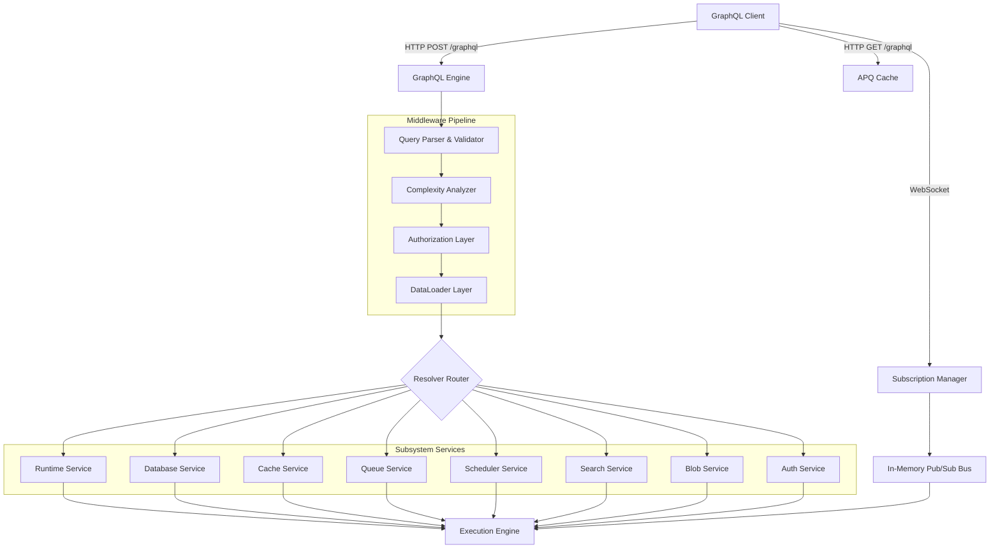
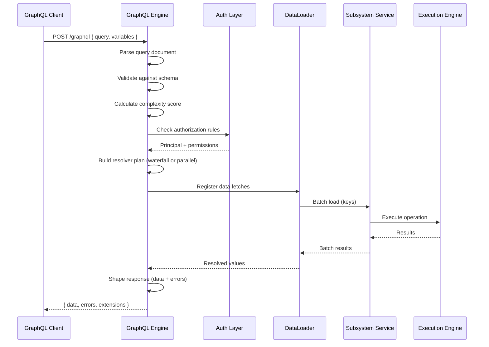
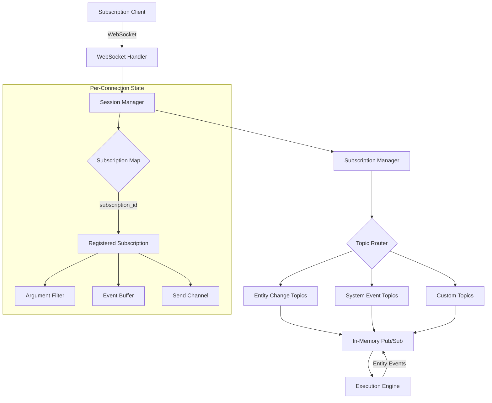
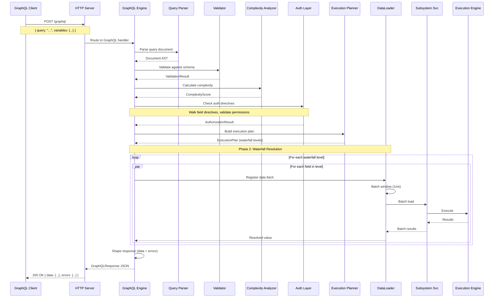
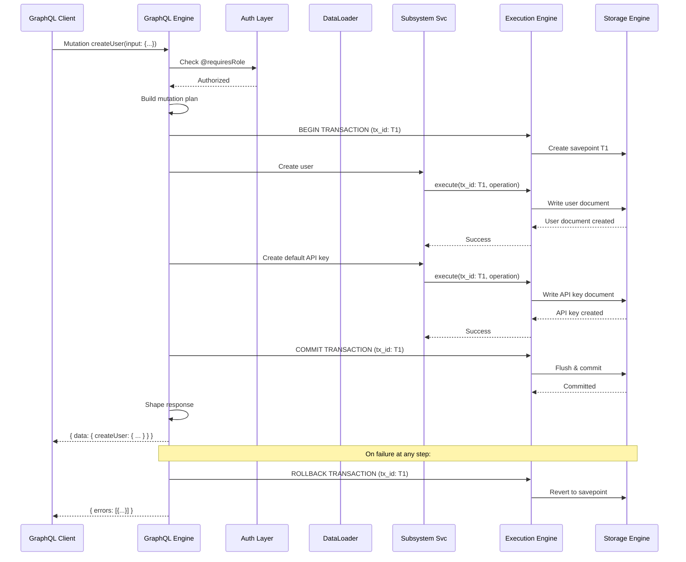
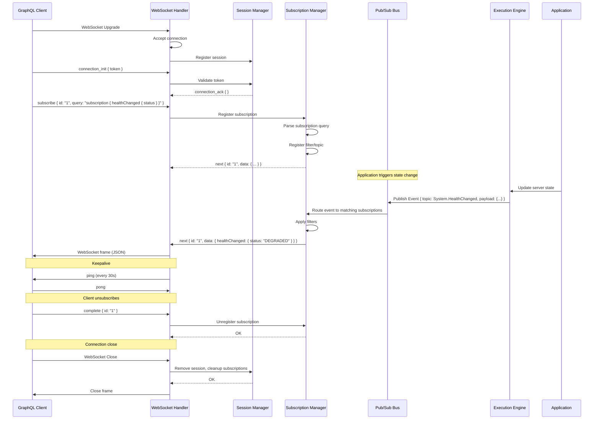
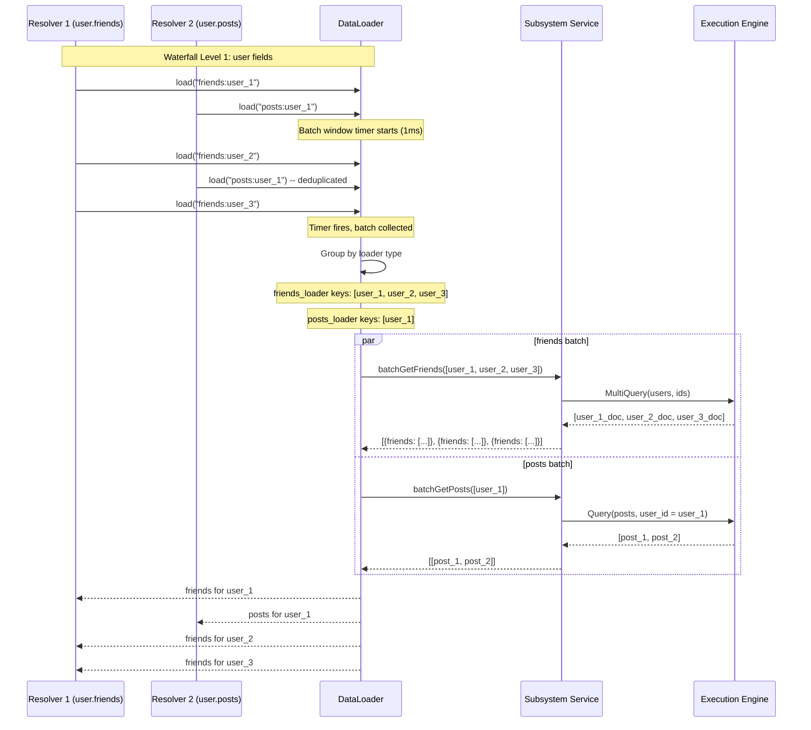
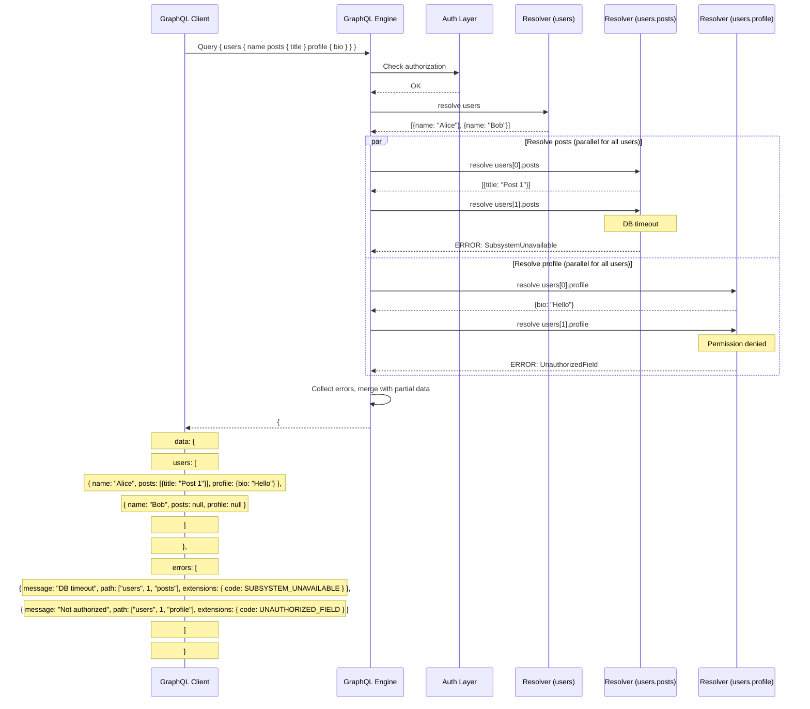

# 24. GraphQL API

> **Implementation Status:** A partial GraphQL implementation exists in `nova-gql/` with an `updateConfiguration` mutation that handles 3 fields in-memory only. The full schema, queries, subscriptions, and DataLoader batching described in this spec are not implemented. The GraphQL endpoint is conditionally compiled and mounted at `/graphql`.

## 1. Purpose

The GraphQL API provides a flexible, declarative data-fetching interface to all Nova Runtime subsystems. Unlike the REST API which exposes fixed resource endpoints, the GraphQL API allows clients to request exactly the data they need, aggregate across subsystems in a single round-trip, and subscribe to real-time updates via GraphQL subscriptions. The API follows the GraphQL June 2018 specification and uses a schema-first design where every capability is explicitly typed.

## 2. Scope

The GraphQL API covers all query, mutation, and subscription operations across every Nova subsystem:

- **Runtime**: Server health, metrics queries, configuration mutations
- **Database (SQL)**: SQL query execution, schema introspection, table management
- **Cache**: Key-value operations with TTL, cache statistics
- **Queue**: Message production, consumption, queue management, dead-letter inspection
- **Scheduler**: Job CRUD, trigger operations, execution history queries
- **Search**: Index management, document indexing, full-text search queries
- **Blob Storage**: Upload/download via base64, metadata queries, blob listing
- **Authentication**: User management, API key management, role management, token operations
- **WebSocket/Push**: Real-time subscription events for entity changes

The API does NOT cover:
- Internal subsystem communication (uses native Rust function calls)
- Cluster management (single-node by design)
- Direct Storage Engine access (goes through Execution Engine)
- Administrative OS-level operations (covered by CLI)

## 3. Responsibilities

1. **Schema definition**: Maintain a complete GraphQL schema with types, inputs, enums, unions, interfaces, directives, and descriptions
2. **Query resolution**: Resolve root Query fields against the appropriate subsystem service layer
3. **Mutation execution**: Process root Mutation fields as atomic operations with validation and authorization
4. **Subscription management**: Manage WebSocket connections for subscription lifecycle, publish events to subscribed clients
5. **DataLoader batching**: Batch and deduplicate nested resolver calls using DataLoader patterns for N+1 prevention
6. **Complexity analysis**: Analyze query complexity before execution, reject or cost-limit overly complex queries
7. **Depth limiting**: Enforce maximum query depth to prevent deeply nested malicious queries
8. **Authorization**: Validate principal permissions at the field and type level using schema directives
9. **Rate limiting**: Apply per-principal query cost budgets with token-bucket algorithm
10. **Pagination**: Provide Relay-style cursor-based pagination for all list fields via Connections
11. **Error handling**: Return structured errors in `errors[]` array with extensions for error codes, locations, and paths
12. **Introspection**: Serve the schema introspection system for tooling compatibility (disabled in production by default)
13. **Apollo Federation**: Support Federation 2 subgraph schema for integration into federated gateways
14. **Persisted queries**: Support Apollo-style persisted queries (automatic) and trust-on-first-use (TOFU) patterns
15. **Caching**: Set Cache-Control headers on GET requests for automatic persisted queries, support `@cacheControl` directive

## 4. Non Responsibilities

- **REST replacement**: GraphQL is complementary to REST; clients may choose either interface
- **File uploads**: Binary blob uploads use REST multipart or dedicated blob endpoints; GraphQL handles metadata only
- **SQL proxy**: GraphQL is not a SQL query proxy; complex analytical queries should use REST SQL endpoint
- **Full CRUD for every entity**: GraphQL exposes a curated subset optimized for common frontend patterns
- **Automatic schema generation**: Schema is hand-crafted, not auto-generated from database schema
- **Offline support**: Client-side caching and offline mutation queuing is the SDK's responsibility

## 5. Architecture





### 5.1 Resolver Execution Model

The GraphQL Engine executes resolvers in a three-phase model:

**Phase 1 - Planning (synchronous)**: The engine walks the parsed query tree and builds an execution plan. Each field is classified as:
- **Scalar**: Directly resolved from parent object, no additional I/O
- **Simple relation**: One-to-one or one-to-many relation resolvable with a single batch
- **Cross-subsystem**: Requires data from multiple subsystem services
- **Computed**: Derived from other fields via a resolver function

The plan identifies fields that can be batched via DataLoader and fields that must be resolved sequentially due to data dependencies.

**Phase 2 - Waterfall resolution**: The engine executes resolver levels bottom-up, starting from the root. Within each level, fields are resolved in parallel (via `futures::join_all`). Cross-level data dependencies force sequential level execution.

**Phase 3 - Response shaping**: The engine walks the resolved value tree and shapes it into the final response, applying field transforms, serializing custom scalars, and collecting field-level errors.

### 5.2 Connection (Relay Pagination)

All list fields return a Relay-style Connection type:

```graphql
type AggregateCacheEntryConnection {
  edges: [CacheEntryEdge!]!
  pageInfo: PageInfo!
  totalCount: Int!
}

type CacheEntryEdge {
  node: CacheEntry!
  cursor: String!
}

type PageInfo {
  hasNextPage: Boolean!
  hasPreviousPage: Boolean!
  startCursor: String
  endCursor: String
}
```

Arguments:
- `first: Int` — forward pagination limit (max 100, default 25)
- `after: String` — cursor for forward pagination
- `last: Int` — backward pagination limit (max 100)
- `before: String` — cursor for backward pagination
- `filter: XxxFilter` — field-level filtering
- `sort: [XxxSort!]` — multi-field sorting (field + direction)

Cursors are base64-encoded opaque strings containing the internal document key and sort order position.

### 5.3 Subscription Architecture



Subscriptions use the graphql-transport-ws protocol (graphql-ws). The lifecycle is:

1. **Connection init**: Client sends `connection_init` message with authentication token
2. **Server ack**: Server validates token, sends `connection_ack` with connection timeout
3. **Subscribe**: Client sends `subscribe` message with subscription query ID
4. **Event stream**: Server publishes events matching the subscription topic + argument filters
5. **Complete**: Server sends `complete` when subscription is done or client sends `complete`
6. **Disconnect**: Either side closes the WebSocket

Events are published to an in-memory pub/sub bus. Each subscription registers a filter function that receives the raw event and returns a boolean (include/exclude) and an optional transform function.

## 6. Data Structures

### 6.1 Schema Types

```rust
/// Top-level schema definition
pub struct GraphQLSchema {
    pub query_type: TypeDefinition,
    pub mutation_type: Option<TypeDefinition>,
    pub subscription_type: Option<TypeDefinition>,
    pub type_definitions: HashMap<String, TypeDefinition>,
    pub directives: Vec<DirectiveDefinition>,
    pub description: Option<String>,
}

/// A type definition in the schema
pub enum TypeDefinition {
    Object(ObjectType),
    InputObject(InputObjectType),
    Enum(EnumType),
    Union(UnionType),
    Interface(InterfaceType),
    Scalar(ScalarType),
}

pub struct ObjectType {
    pub name: String,
    pub description: Option<String>,
    pub fields: Vec<FieldDefinition>,
    pub interfaces: Vec<String>,
    pub directives: Vec<Directive>,
}

pub struct FieldDefinition {
    pub name: String,
    pub description: Option<String>,
    pub field_type: TypeRef,
    pub arguments: Vec<InputValueDefinition>,
    pub directives: Vec<Directive>,
    pub resolver: Option<ResolverFn>,
    pub complexity_weight: f64,
    pub cache_control_max_age: Option<u32>,
}

pub enum TypeRef {
    Named(String),
    NonNull(Box<TypeRef>),
    List(Box<TypeRef>),
}

pub struct InputValueDefinition {
    pub name: String,
    pub description: Option<String>,
    pub value_type: TypeRef,
    pub default_value: Option<Value>,
    pub directives: Vec<Directive>,
}
```

### 6.2 Query Representation

```rust
/// Parsed and validated query document (internal representation)
pub struct ExecutableDocument {
    pub operations: Vec<Operation>,
    pub fragments: HashMap<String, FragmentDefinition>,
    pub referenced_types: HashSet<String>,
    pub complexity: ComplexityScore,
}

pub struct Operation {
    pub kind: OperationKind, // Query | Mutation | Subscription
    pub name: Option<String>,
    pub variable_definitions: Vec<VariableDefinition>,
    pub directives: Vec<Directive>,
    pub selection_set: SelectionSet,
    pub operation_id: OperationId,
}

pub struct SelectionSet {
    pub fields: Vec<FieldSelection>,
    pub type_condition: Option<String>,
}

pub struct FieldSelection {
    pub name: String,
    pub alias: Option<String>,
    pub arguments: Vec<(String, Value)>,
    pub directives: Vec<Directive>,
    pub selection_set: Option<SelectionSet>,
    pub field_definition: FieldDefinition, // resolved from schema
    pub resolved_type: TypeRef,             // resolved from schema
}

pub struct FragmentDefinition {
    pub name: String,
    pub type_condition: String,
    pub directives: Vec<Directive>,
    pub selection_set: SelectionSet,
}

pub struct VariableDefinition {
    pub name: String,
    pub variable_type: TypeRef,
    pub default_value: Option<Value>,
}

pub struct ComplexityScore {
    pub total: f64,
    pub depth: u32,
    pub node_count: u32,
    pub data_fetch_count: u32,
}
```

### 6.3 Execution Structures

```rust
/// Execution context passed to every resolver
pub struct ResolverContext {
    pub principal: AuthenticatedPrincipal,
    pub request_id: RequestId,
    pub operation: OperationId,
    pub data_loaders: HashMap<&'static str, DataLoader>,
    pub db: DatabaseHandle,
    pub cache: CacheHandle,
    pub queue: QueueHandle,
    pub scheduler: SchedulerHandle,
    pub search: SearchHandle,
    pub blob: BlobHandle,
    pub runtime: RuntimeHandle,
    pub now: Instant,
}

/// A DataLoader batches and deduplicates loads from a single data source
pub struct DataLoader {
    pub batch_fn: Box<dyn Fn(Vec<DataLoaderKey>) -> BoxFuture<Vec<DataLoaderResult>>>,
    pub cache: HashMap<DataLoaderKey, Option<DataLoaderResult>>,
    pub pending_queue: Vec<(DataLoaderKey, tokio::sync::oneshot::Sender<DataLoaderResult>)>,
    pub max_batch_size: usize,
    pub batch_schedule_delay: Duration, // default 1ms
    pub cached: bool,                    // cache within request
}

pub type DataLoaderKey = u64; // hash of the composite key
pub type DataLoaderResult = Result<Option<serde_json::Value>, GraphQLError>;

/// Resolved value tree
pub enum ResolvedValue {
    Null,
    Boolean(bool),
    Int(i64),
    Float(f64),
    String(String),
    List(Vec<ResolvedValue>),
    Object(HashMap<String, ResolvedValue>),
    Enum(String),
    CustomScalar(String, serde_json::Value),
}
```

### 6.4 Error Types

```rust
/// A GraphQL error returned in the errors[] array
pub struct GraphQLError {
    pub message: String,
    pub locations: Vec<SourceLocation>,
    pub path: Vec<PathSegment>,
    pub extensions: ErrorExtensions,
}

pub struct SourceLocation {
    pub line: u32,
    pub column: u32,
}

pub enum PathSegment {
    FieldName(String),
    Index(u32),
}

pub struct ErrorExtensions {
    pub code: ErrorCode,
    pub subsystem: Subsystem,
    pub retryable: bool,
    pub retry_after_ms: Option<u64>,
    pub internal_code: Option<String>,
    pub fields: Option<Vec<String>>,
}

pub enum ErrorCode {
    // Validation errors (4xx range semantics)
    BadRequest,
    ValidationError,
    InvalidSyntax,
    InvalidType,
    UnknownField,
    MissingField,
    InvalidArgument,
    InvalidEnumValue,
    // Auth errors
    Unauthenticated,
    UnauthorizedField,
    InsufficientPermissions,
    TokenExpired,
    TokenInvalid,
    // Resource errors
    NotFound,
    AlreadyExists,
    Conflict,
    RateLimited,
    ResourceExhausted,
    // System errors (5xx range semantics)
    InternalError,
    SubsystemUnavailable,
    Timeout,
    DeadlockDetected,
    // Query errors
    QueryTooDeep,
    QueryTooComplex,
    QueryCostExceeded,
    IntrospectionDisabled,
    PersistedQueryNotFound,
    PersistedQueryNotSupported,
}

pub enum Subsystem {
    Runtime,
    Database,
    Cache,
    Queue,
    Scheduler,
    Search,
    Blob,
    Auth,
    GraphQL, // error in the GraphQL engine itself
}
```

### 6.5 Subscription Data Structures

```rust
/// A registered subscription
pub struct SubscriptionRegistration {
    pub id: SubscriptionId,
    pub session_id: SessionId,
    pub topic: Topic,
    pub filter: Option<Box<dyn Fn(&Event) -> bool + Send + Sync>>,
    pub transform: Option<Box<dyn Fn(Event) -> ResolvedValue + Send + Sync>>,
    pub send_tx: mpsc::UnboundedSender<GraphQLResponse>,
    pub created_at: Instant,
    pub last_activity: Instant,
}

/// Events published on the pub/sub bus
pub struct Event {
    pub id: EventId,
    pub topic: Topic,
    pub subsystem: Subsystem,
    pub event_type: EventType,
    pub payload: serde_json::Value,
    pub metadata: EventMetadata,
    pub timestamp: Instant,
}

pub enum Topic {
    EntityCreated(String),    // entity type name
    EntityUpdated(String),    // entity type name
    EntityDeleted(String),    // entity type name
    System(SystemTopic),
    Custom(String),
}

pub enum SystemTopic {
    ServerHealth,
    ConfigurationChange,
    SchemaChange,
    MetricThreshold,
}

pub struct EventMetadata {
    pub principal_id: Option<String>,
    pub request_id: Option<String>,
    pub previous_value: Option<serde_json::Value>,
    pub changed_fields: Option<Vec<String>>,
}

/// Session manager tracks all active WebSocket connections
pub struct SessionManager {
    pub sessions: HashMap<SessionId, WebSocketSession>,
    pub session_count: u64,
    pub max_sessions: u64,
}

pub struct WebSocketSession {
    pub id: SessionId,
    pub principal: AuthenticatedPrincipal,
    pub connected_at: Instant,
    pub subscriptions: HashMap<SubscriptionId, SubscriptionRegistration>,
    pub transport: WebSocketTransportType, // graphql-ws
    pub last_ping: Instant,
    pub keepalive_interval: Duration,
}
```

### 6.6 Complexity Constants

```rust
/// Complexity analysis constants
pub const COMPLEXITY: ComplexityConfig = ComplexityConfig {
    max_depth: 16,
    max_nodes: 500,
    max_complexity: 1000.0,
    max_data_fetches: 100,

    field_weights: FieldWeights {
        scalar_field: 1.0,
        object_field: 2.0,
        list_field: 5.0,
        connection_field: 10.0,
        cross_subsystem: 15.0,
        mutation: 10.0,
        subscription: 20.0,
    },

    list_size_estimates: ListSizeEstimates {
        default_page_size: 25,
        max_page_size: 100,
        list_overfetch_multiplier: 2.0, // assume 2x requested for incomplete pages
    },

    cost_budget: CostBudget {
        per_request: 1000.0,
        per_second: 5000.0,   // token bucket refill rate
        burst: 10000.0,        // token bucket capacity
    },
};
```

### 6.7 Auth Directives (Schema SDL)

```rust
/// Auth directives attached to schema types/fields
#[derive(Debug, Clone, Serialize, Deserialize)]
pub struct AuthDirective {
    pub require: Vec<AuthRequirement>,
}

#[derive(Debug, Clone, Serialize, Deserialize)]
pub enum AuthRequirement {
    /// Require specific role
    Role(String),
    /// Require specific permission
    Permission(String),
    /// Require field-level access with conditions
    FieldLevel { field: String, condition: AccessCondition },
    /// Allow public access (no auth required)
    Public,
    /// Require authentication (any valid token)
    Authenticated,
}

#[derive(Debug, Clone, Serialize, Deserialize)]
pub enum AccessCondition {
    Equals(String),
    In(Vec<String>),
    Owner,          // principal_id == field_value
    Custom(String), // custom predicate function name
}
```

### 6.8 APQ (Automatic Persisted Queries) Cache

```rust
pub struct APQCache {
    pub store: HashMap<Sha256Hash, PersistedQuery>,
    pub max_entries: usize, // default 10,000
    pub ttl: Duration,       // default 7 days
    pub tofu: bool,          // trust-on-first-use enabled
}

pub struct PersistedQuery {
    pub hash: Sha256Hash,
    pub query: String,
    pub created_at: Instant,
    pub last_accessed: Instant,
    pub access_count: u64,
}

pub struct Sha256Hash([u8; 32]);
```

## 7. Algorithms

### 7.1 Query Complexity Analysis

The complexity analyzer computes a weighted score for every operation before execution:

```
Algorithm: CalculateQueryComplexity
Input: Operation selection tree, ComplexityConfig
Output: ComplexityScore

1. Walk the selection set depth-first
2. For each field:
   a. Look up field_definition.complexity_weight (overrides default)
   b. If no override, use default weight from ComplexityConfig based on type:
      - scalar_field: 1.0
      - object_field: 2.0
      - list_field: 5.0 * estimated_page_size / default_page_size
      - connection_field: 10.0 * estimated_page_size / default_page_size
      - cross_subsystem: 15.0
      - mutation: 10.0
      - subscription: 20.0
   c. Multiply weight by parent weight (weight cascades down)
   d. Add to total_complexity
   e. Increment node_count
3. Track depth: max depth of nested selection sets
4. Track data_fetch_count: number of fields requiring I/O (not computed/scalar)
5. Check constraints:
   - If depth > max_depth: reject with QUERY_TOO_DEEP
   - If node_count > max_nodes: reject with QUERY_TOO_COMPLEX
   - If total > max_complexity: reject with QUERY_COST_EXCEEDED
   - If data_fetch_count > max_data_fetches: reject with QUERY_TOO_COMPLEX
6. Return ComplexityScore { total, depth, node_count, data_fetch_count }
```

### 7.2 DataLoader Batching

```
Algorithm: DataLoaderBatch
Input: Batch of keys collected during resolver phase
Output: Batch of results

1. Wait for batch_schedule_delay (1ms) to collect more keys
2. If queued keys > max_batch_size: flush immediately
3. When batch fires:
   a. Collect all pending keys as a Vec<DataLoaderKey>
   b. Call batch_fn with the keys
   c. The batch_fn implementation:
      i.   Deconstruct keys into their original form (entity type + filters)
      ii.  Build a single batched query to the subsystem:
           - Cache: MultiGet command
           - Queue: Peek multiple
           - Scheduler: MultiQuery
           - Search: MultiSearch
           - Blob: MultiHead
           - Database: IN query with multiple keys
      iii. Execute one I/O operation
      iv.  Map results back to original keys preserving order
   d. Dispatch results to each waiting oneshot sender
   e. Empty the pending queue

Key: The DataLoader key is a u64 hash of (loader_name, composite_key).
This ensures deterministic routing to the correct batch function.
Two different loaders never share key space.
```

### 7.3 Complexity-Based Rate Limiting

```
Algorithm: TokenBucketRateLimiter
Input: Principal ID, ComplexityScore
Output: Allow/Reject decision

Constants:
  - REFILL_RATE = 5000.0 (tokens per second)
  - BUCKET_CAPACITY = 10000.0 (max tokens)
  - PER_REQUEST_CAP = 1000.0 (max complexity per request)

State (per principal):
  - tokens: f64 (current tokens, initialized to BUCKET_CAPACITY)
  - last_refill: Instant

1. On each request:
   a. If score.total > PER_REQUEST_CAP:
      Reject with QUERY_COST_EXCEEDED
   b. Now = current time
   c. Elapsed = (Now - last_refill).as_seconds_f64()
   d. tokens = min(BUCKET_CAPACITY, tokens + Elapsed * REFILL_RATE)
   e. last_refill = Now
   f. If tokens >= score.total:
      tokens -= score.total
      Allow
   g. Else:
      Reject with RATE_LIMITED, retry_after_ms = (score.total - tokens) / REFILL_RATE * 1000
```

### 7.4 Subscription Event Matching

```
Algorithm: MatchEventToSubscriptions
Input: Event, Active subscriptions map
Output: Vec of (SubscriptionRegistration, ResolvedValue) to send

1. For each active subscription:
   a. If subscription.topic != Event.topic: skip
   b. If subscription.filter exists:
      Call filter(&Event)
      If false: skip
   c. Map event payload through subscription.transform if present
   d. Push (subscription, transformed_value) to result list
2. For each matched subscription:
   a. Build GraphQLResponse with subscription_id in extensions
   b. Send via send_tx (non-blocking try_send)
   c. If send fails (channel full/clogged):
      - Log warning
      - Increment dropped_event counter
      - If consecutive_drops > threshold (10):
        Close subscription, send Error to client
3. Cleanup:
   - Remove subscriptions where last_activity > idle_timeout (30 min)
   - Remove sessions where last_ping > ping_timeout (60s)
```

### 7.5 Introspection Response Caching

```
Algorithm: ServeIntrospection
Input: Schema, request context
Output: Introspection JSON

1. If production mode AND introspection_disabled:
   - Reject with INTROSPECTION_DISABLED error
2. Compute schema hash from SDL text (SHA-256 of normalized SDL)
3. Check introspection cache (per-schema LRU, max 10 entries):
   - If cached and TTL valid (< 1 hour): return cached response
4. Execute introspection query against schema meta-types:
   - __schema, __type, __directive, __typename
5. Serialize result to JSON
6. Cache result keyed by schema_hash
7. Return JSON

The cached introspection response is ~50KB for the full schema.
Cache invalidation occurs when the schema is updated via DDL mutation.
```

## 8. Interfaces

### 8.1 Type System

```graphql
# ============================================================
# SCALARS
# ============================================================

scalar DateTime      # ISO 8601 datetime string
scalar Date          # ISO 8601 date string
scalar Time          # ISO 8601 time string
scalar Decimal       # Arbitrary precision decimal number (string encoded)
scalar JSON          # Arbitrary JSON value
scalar UUID          # UUID v4 string
scalar Long          # 64-bit integer (string encoded for JS safety)
scalar ByteArray     # Base64-encoded binary data
scalar Email         # Validated email address string
scalar URL           # Validated URL string
scalar IPAddress     # IPv4 or IPv6 address string
scalar Cursor        # Opaque pagination cursor string

# ============================================================
# DIRECTIVES
# ============================================================

"""Requires the specified role to access the target"""
directive @requiresRole(roles: [String!]!) on OBJECT | FIELD_DEFINITION

"""Requires the specified permission"""
directive @requiresPermission(permissions: [String!]!) on OBJECT | FIELD_DEFINITION

"""Marks field as public (no authentication required)"""
directive @public on FIELD_DEFINITION

"""Field-level access condition"""
directive @fieldAccess(
  field: String!
  condition: AccessCondition!
) on FIELD_DEFINITION

enum AccessCondition {
  EQUALS
  IN
  OWNER
}

"""Cache control settings for the field"""
directive @cacheControl(
  maxAge: Int!
  scope: CacheControlScope = PUBLIC
) on FIELD_DEFINITION | OBJECT

enum CacheControlScope {
  PUBLIC
  PRIVATE
}

"""Marks an input field as deprecated"""
directive @deprecated(
  reason: String = "No longer supported"
) on FIELD_DEFINITION | ENUM_VALUE

"""Maps a field to a specific subsystem"""
directive @subsystem(name: SubsystemName!) on FIELD_DEFINITION | OBJECT

enum SubsystemName {
  RUNTIME
  DATABASE
  CACHE
  QUEUE
  SCHEDULER
  SEARCH
  BLOB
  AUTH
}

# ============================================================
# COMMON TYPES
# ============================================================

interface Node {
  id: UUID!
  createdAt: DateTime!
  updatedAt: DateTime!
}

type PageInfo {
  hasNextPage: Boolean!
  hasPreviousPage: Boolean!
  startCursor: Cursor
  endCursor: Cursor
}

input PaginationInput {
  first: Int  = 25
  after: Cursor
  last: Int
  before: Cursor
}

input SortInput {
  field: String!
  direction: SortDirection = ASC
}

enum SortDirection {
  ASC
  DESC
}

enum NullHandling {
  NULLS_FIRST
  NULLS_LAST
}
```

### 8.2 Runtime Schema

```graphql
extend type Query {
  """Server health status"""
  health: HealthStatus!

  """Server configuration (requires admin role)"""
  configuration: ServerConfiguration! @requiresRole(roles: ["admin"])

  """Server metrics snapshot"""
  metrics(input: MetricsInput): MetricsSnapshot!

  """Active connections and their status"""
  connections(input: ConnectionFilter): ConnectionConnection!

  """Server version information"""
  version: VersionInfo!
}

type HealthStatus {
  status: HealthState!
  uptimeSeconds: Long!
  version: String!
  subsystems: [SubsystemHealth!]!
  lastStartup: DateTime!
}

enum HealthState {
  HEALTHY
  DEGRADED
  UNHEALTHY
}

type SubsystemHealth {
  name: SubsystemName!
  status: HealthState!
  latencyMs: Float!
  lastError: String
  lastChecked: DateTime!
}

type ServerConfiguration {
  version: String!
  buildMode: BuildMode!
  logLevel: String!
  maxConnections: Int!
  queryTimeoutMs: Int!
  subsystems: SubsystemConfigs!
}

enum BuildMode {
  DEBUG
  RELEASE
  PROFILING
}

type SubsystemConfigs {
  database: DatabaseConfig!
  cache: CacheConfig!
  queue: QueueConfig!
  scheduler: SchedulerConfig!
  search: SearchConfig!
  blob: BlobConfig!
  auth: AuthConfig!
  graphql: GraphQLConfig!
}

type DatabaseConfig {
  maxConnections: Int!
  statementCacheSize: Int!
  defaultFetchSize: Int!
  transactionTimeoutMs: Int!
}

type CacheConfig {
  maxMemoryMb: Int!
  defaultTtlMs: Int!
  evictionPolicy: EvictionPolicy!
  maxItemSizeBytes: Int!
}

enum EvictionPolicy {
  LRU
  LFU
  FIFO
  TTL
}

type QueueConfig {
  maxQueues: Int!
  defaultVisibilityTimeoutMs: Int!
  maxMessageSizeBytes: Int!
  messageRetentionMs: Int!
  deadLetterMaxReceives: Int!
}

type SchedulerConfig {
  maxJobs: Int!
  schedulerIntervalMs: Int!
  maxRetries: Int!
  defaultTimeoutMs: Int!
}

type SearchConfig {
  maxIndexes: Int!
  defaultAnalyzer: String!
  maxResultWindow: Int!
}

type BlobConfig {
  maxBlobSizeMb: Int!
  storagePath: String!
  defaultTier: StorageTier!
}

type AuthConfig {
  tokenExpiryMs: Int!
  refreshTokenExpiryMs: Int!
  maxApiKeysPerUser: Int!
  sessionTimeoutMs: Int!
  passwordMinLength: Int!
  bcryptCost: Int!
}

type GraphQLConfig {
  maxDepth: Int!
  maxComplexity: Float!
  maxNodes: Int!
  introspectionEnabled: Boolean!
  persistedQueriesEnabled: Boolean!
  subscriptionPingIntervalMs: Int!
  subscriptionIdleTimeoutMs: Int!
}

input MetricsInput {
  since: DateTime
  resolution: MetricsResolution = ONE_MINUTE
}

enum MetricsResolution {
  ONE_SECOND
  ONE_MINUTE
  FIVE_MINUTES
  FIFTEEN_MINUTES
  ONE_HOUR
}

type MetricsSnapshot {
  collectedAt: DateTime!
  timeRange: MetricsTimeRange!
  system: SystemMetrics!
  subsystems: SubsystemMetrics!
}

type MetricsTimeRange {
  start: DateTime!
  end: DateTime!
}

type SystemMetrics {
  cpuUsagePercent: Float!
  memoryUsageBytes: Long!
  memoryTotalBytes: Long!
  diskUsageBytes: Long!
  diskTotalBytes: Long!
  networkBytesIn: Long!
  networkBytesOut: Long!
  openFileDescriptors: Int!
  goroutines: Int!
}

type SubsystemMetrics {
  database: DatabaseMetrics
  cache: CacheMetrics
  queue: QueueMetrics
  scheduler: SchedulerMetrics
  search: SearchMetrics
  blob: BlobMetrics
  graphql: GraphQLMetrics
}

type DatabaseMetrics {
  queriesTotal: Long!
  queriesPerSecond: Float!
  avgLatencyMs: Float!
  p50LatencyMs: Float!
  p95LatencyMs: Float!
  p99LatencyMs: Float!
  activeConnections: Int!
  cacheHitRate: Float!
  transactionsCommitted: Long!
  transactionsRolledBack: Long!
}

type CacheMetrics {
  hits: Long!
  misses: Long!
  hitRate: Float!
  entries: Int!
  memoryUsedBytes: Long!
  evictions: Long!
  avgTtlRemainingMs: Float!
}

type QueueMetrics {
  messagesSent: Long!
  messagesReceived: Long!
  messagesDeleted: Long!
  messagesDeadLettered: Long!
  queuesCount: Int!
  totalMessages: Long!
  avgLatencyMs: Float!
  deadLetterCount: Long!
}

type SchedulerMetrics {
  jobsExecuted: Long!
  jobsFailed: Long!
  jobsSkipped: Long!
  activeJobs: Int!
  avgExecutionTimeMs: Float!
  p95ExecutionTimeMs: Float!
  triggersFired: Long!
}

type SearchMetrics {
  queriesTotal: Long!
  indexingTotal: Long!
  avgQueryLatencyMs: Float!
  p95QueryLatencyMs: Float!
  indexesCount: Int!
  documentsIndexed: Long!
  avgIndexTimeMs: Float!
}

type BlobMetrics {
  uploadsTotal: Long!
  downloadsTotal: Long!
  deletesTotal: Long!
  totalBlobs: Long!
  totalStorageBytes: Long!
  avgUploadSizeBytes: Float!
  avgDownloadLatencyMs: Float!
}

type GraphQLMetrics {
  queriesTotal: Long!
  mutationsTotal: Long!
  subscriptionsTotal: Long!
  queriesRejected: Long!
  avgResolutionTimeMs: Float!
  p95ResolutionTimeMs: Float!
  p99ResolutionTimeMs: Float!
  activeSubscriptions: Int!
  introspectionQueries: Long!
}

type ConnectionConnection {
  edges: [ConnectionEdge!]!
  pageInfo: PageInfo!
  totalCount: Int!
}

type ConnectionEdge {
  node: ConnectionInfo!
  cursor: Cursor!
}

type ConnectionInfo {
  id: UUID!
  principalId: String
  protocol: ConnectionProtocol!
  connectedAt: DateTime!
  lastActivity: DateTime!
  userAgent: String
  remoteAddress: String!
  subsystem: SubsystemName!
  status: ConnectionStatus!
}

enum ConnectionProtocol {
  HTTP_1_1
  HTTP_2
  WEB_SOCKET
  POSTGRESQL_WIRE
}

enum ConnectionStatus {
  ACTIVE
  IDLE
  CLOSING
}

input ConnectionFilter {
  subsystem: SubsystemName
  status: ConnectionStatus
  protocol: ConnectionProtocol
}

type VersionInfo {
  version: String!
  buildCommit: String!
  buildDate: DateTime!
  rustVersion: String!
  graphqlVersion: String!
}

extend type Mutation {
  """Update server configuration (requires admin role)"""
  updateConfiguration(input: ConfigurationInput!): ServerConfiguration!
    @requiresRole(roles: ["admin"])

  """Set log level dynamically"""
  setLogLevel(level: LogLevel!): ServerConfiguration!
    @requiresRole(roles: ["admin"])

  """Gracefully shutdown the server"""
  shutdown(reason: String): Boolean! @requiresRole(roles: ["admin"])
}

enum LogLevel {
  TRACE
  DEBUG
  INFO
  WARN
  ERROR
}

input ConfigurationInput {
  logLevel: LogLevel
  queryTimeoutMs: Int
  maxConnections: Int
  database: DatabaseConfigInput
  cache: CacheConfigInput
  graphql: GraphQLConfigInput
}

input DatabaseConfigInput {
  statementCacheSize: Int
  defaultFetchSize: Int
  transactionTimeoutMs: Int
}

input CacheConfigInput {
  maxMemoryMb: Int
  defaultTtlMs: Int
  maxItemSizeBytes: Int
}

input GraphQLConfigInput {
  maxDepth: Int
  maxComplexity: Float
  maxNodes: Int
  introspectionEnabled: Boolean
  subscriptionPingIntervalMs: Int
  subscriptionIdleTimeoutMs: Int
}

extend type Subscription {
  """Subscribes to health status changes"""
  healthChanged: HealthStatus!

  """Subscribes to server metric threshold alerts"""
  metricAlert(thresholds: MetricThresholdInput!): MetricAlert!

  """Subscribes to configuration changes"""
  configurationChanged: ServerConfiguration!
    @requiresRole(roles: ["admin"])
}

input MetricThresholdInput {
  cpuPercent: Float
  memoryPercent: Float
  diskPercent: Float
  queryLatencyMs: Float
  errorRate: Float
}

type MetricAlert {
  metric: String!
  currentValue: Float!
  threshold: Float!
  severity: AlertSeverity!
  timestamp: DateTime!
  message: String!
}

enum AlertSeverity {
  INFO
  WARNING
  CRITICAL
}
```

### 8.3 Database (SQL) Schema

```graphql
extend type Query {
  """Execute a SQL query with bound parameters"""
  sqlQuery(query: String!, params: [JSON] = [], options: SQLQueryOptions): SQLQueryResult!

  """List all tables in the database"""
  tables(input: PaginationInput, filter: TableFilter): TableConnection!

  """Get table schema and metadata"""
  table(name: String!): Table!

  """Get schema version and metadata"""
  schema: SchemaInfo!

  """Explain query execution plan without executing"""
  explain(query: String!, params: [JSON] = []): SQLExplainResult!

  """Get database statistics"""
  databaseStats: DatabaseStats!
}

type SQLQueryResult {
  columns: [ColumnInfo!]!
  rows: [JSON!]!
  rowCount: Int!
  executionTimeMs: Float!
  warnings: [String!]
}

type ColumnInfo {
  name: String!
  dataType: SQLDataType!
  nullable: Boolean!
  primaryKey: Boolean!
  defaultValue: JSON
  comment: String
}

enum SQLDataType {
  BOOLEAN
  TINYINT
  SMALLINT
  INTEGER
  BIGINT
  REAL
  DOUBLE
  DECIMAL
  VARCHAR
  CHAR
  TEXT
  BLOB
  DATE
  TIME
  TIMESTAMP
  TIMESTAMPTZ
  UUID
  JSON
  JSONB
  ARRAY
  ENUM
}

input SQLQueryOptions {
  timeoutMs: Int
  maxRows: Int
  fetchSize: Int
  readOnly: Boolean
}

type TableConnection {
  edges: [TableEdge!]!
  pageInfo: PageInfo!
  totalCount: Int!
}

type TableEdge {
  node: Table!
  cursor: Cursor!
}

type Table {
  name: String!
  schema: String!
  columns: [ColumnInfo!]!
  primaryKey: [String!]
  indexes: [IndexInfo!]!
  rowCount: Long!
  sizeBytes: Long!
  createdAt: DateTime!
  updatedAt: DateTime!
  comment: String
}

type IndexInfo {
  name: String!
  columns: [String!]!
  unique: Boolean!
  primary: Boolean!
  indexType: IndexType!
}

enum IndexType {
  BTREE
  HASH
  GIN
  GIANT
  FULLTEXT
}

type SchemaInfo {
  version: Int!
  tables: Int!
  sizeBytes: Long!
  lastMigration: DateTime!
}

type SQLExplainResult {
  plan: JSON!
  estimatedRows: Long!
  estimatedCost: Float!
  warnings: [String!]
}

type DatabaseStats {
  queryCount: Long!
  avgQueryTimeMs: Float!
  p95QueryTimeMs: Float!
  cacheHitRate: Float!
  activeConnections: Int!
  deadlocksDetected: Int!
  transactions: TransactionStats!
}

type TransactionStats {
  committed: Long!
  rolledBack: Long!
  active: Int!
  avgDurationMs: Float!
}

input TableFilter {
  schema: String
  namePattern: String
}

extend type Mutation {
  """Execute a SQL mutation (INSERT, UPDATE, DELETE, DDL)"""
  sqlExecute(
    query: String!
    params: [JSON] = []
    options: SQLExecuteOptions
  ): SQLExecuteResult!

  """Create a new table"""
  createTable(name: String!, definition: TableDefinitionInput!): Table!

  """Drop a table"""
  dropTable(name: String!, ifExists: Boolean = false): Boolean!

  """Create an index"""
  createIndex(table: String!, definition: IndexDefinitionInput!): IndexInfo!

  """Drop an index"""
  dropIndex(table: String!, index: String!, ifExists: Boolean = false): Boolean!
}

input SQLExecuteOptions {
  timeoutMs: Int
  transactionId: UUID
  dryRun: Boolean = false
}

type SQLExecuteResult {
  affectedRows: Int!
  executionTimeMs: Float!
  lastInsertedId: UUID
  warnings: [String!]
}

input TableDefinitionInput {
  columns: [ColumnDefinitionInput!]!
  primaryKey: [String!]
  indexes: [IndexDefinitionInput!]
  ifNotExists: Boolean = false
  comment: String
}

input ColumnDefinitionInput {
  name: String!
  dataType: SQLDataType!
  nullable: Boolean = true
  defaultValue: JSON
  primaryKey: Boolean = false
  unique: Boolean = false
  comment: String
}

input IndexDefinitionInput {
  name: String!
  columns: [String!]!
  unique: Boolean = false
  indexType: IndexType = BTREE
}

extend type Subscription {
  """Subscribe to query execution events"""
  queryExecuted(table: String): QueryExecutedEvent!

  """Subscribe to schema changes"""
  schemaChanged: SchemaChangedEvent!
}

type QueryExecutedEvent {
  query: String!
  queryType: QueryType!
  table: String!
  durationMs: Float!
  rowsAffected: Int!
  timestamp: DateTime!
}

enum QueryType {
  SELECT
  INSERT
  UPDATE
  DELETE
  DDL
  OTHER
}

type SchemaChangedEvent {
  changeType: SchemaChangeType!
  table: String!
  timestamp: DateTime!
  details: String!
}

enum SchemaChangeType {
  TABLE_CREATED
  TABLE_DROPPED
  TABLE_ALTERED
  INDEX_CREATED
  INDEX_DROPPED
}
```

### 8.4 Cache Schema

```graphql
extend type Query {
  """Get a cache entry by key"""
  cacheGet(key: String!): CacheEntry

  """Get multiple cache entries"""
  cacheMultiGet(keys: [String!]!): [CacheEntry!]!

  """Check if a key exists"""
  cacheExists(key: String!): Boolean!

  """Get cache statistics"""
  cacheStats: CacheStats!

  """List cache keys with optional pattern matching"""
  cacheKeys(
    pattern: String = "*"
    input: PaginationInput!
  ): CacheEntryConnection!
}

type CacheEntry {
  key: String!
  value: JSON
  dataType: CacheDataType!
  ttlMs: Long
  expiresAt: DateTime
  sizeBytes: Int!
  createdAt: DateTime!
  lastAccessedAt: DateTime!
  accessCount: Long!
}

enum CacheDataType {
  STRING
  INTEGER
  FLOAT
  BOOLEAN
  JSON
  BINARY
  NULL
}

type CacheEntryConnection {
  edges: [CacheEntryEdge!]!
  pageInfo: PageInfo!
  totalCount: Int!
}

type CacheEntryEdge {
  node: CacheEntry!
  cursor: Cursor!
}

type CacheStats {
  hitCount: Long!
  missCount: Long!
  hitRate: Float!
  entryCount: Int!
  memoryUsedBytes: Long!
  maxMemoryBytes: Long!
  evictionCount: Long!
  avgTtlMs: Float!
  keyspaceHits: Long!
  keyspaceMisses: Long!
}

extend type Mutation {
  """Set a cache entry"""
  cacheSet(input: CacheSetInput!): CacheEntry!

  """Set multiple cache entries"""
  cacheMultiSet(inputs: [CacheSetInput!]!): [CacheEntry!]!

  """Delete a cache entry"""
  cacheDelete(key: String!): Boolean!

  """Delete multiple cache entries"""
  cacheMultiDelete(keys: [String!]!): Boolean!

  """Delete cache entries matching a pattern"""
  cacheDeletePattern(pattern: String!): Int!

  """Increment a numeric cache value"""
  cacheIncrement(key: String!, amount: Long = 1): Long!

  """Set a cache entry with NX (only if not exists)"""
  cacheSetNX(input: CacheSetInput!): CacheEntry

  """Update the TTL of an existing key"""
  cacheExpire(key: String!, ttlMs: Long!): Boolean!

  """Clear all cache entries"""
  cacheFlush: Boolean! @requiresRole(roles: ["admin"])
}

input CacheSetInput {
  key: String!
  value: JSON!
  ttlMs: Long
  nx: Boolean = false
  dataType: CacheDataType = JSON
}

extend type Subscription {
  """Subscribe to cache changes for a specific key pattern"""
  cacheChanges(keyPattern: String = "*"): CacheChangeEvent!
}

type CacheChangeEvent {
  key: String!
  changeType: CacheChangeType!
  value: JSON
  oldValue: JSON
  timestamp: DateTime!
}

enum CacheChangeType {
  SET
  DELETE
  EXPIRE
  FLUSH
}
```

### 8.5 Queue Schema

```graphql
extend type Query {
  """List all queues"""
  queues(input: PaginationInput, filter: QueueFilter): QueueConnection!

  """Get a specific queue by name"""
  queue(name: String!): Queue!

  """Get queue statistics"""
  queueStats: QueueOverallStats!

  """Peek at messages in a queue without consuming"""
  queuePeek(queue: String!, input: PaginationInput): MessageConnection!

  """Get a specific message by ID"""
  queueMessage(queue: String!, messageId: UUID!): QueueMessage!

  """Inspect dead letter queue"""
  deadLetterQueue(queue: String!, input: PaginationInput): DeadLetterConnection!

  """Get queue dead letter stats"""
  deadLetterStats(queue: String!): DeadLetterStats!
}

type QueueConnection {
  edges: [QueueEdge!]!
  pageInfo: PageInfo!
  totalCount: Int!
}

type QueueEdge {
  node: Queue!
  cursor: Cursor!
}

type Queue {
  name: String!
  description: String
  createdAt: DateTime!
  updatedAt: DateTime!
  messageCount: Long!
  messagesSent: Long!
  messagesReceived: Long!
  messagesDeleted: Long!
  messagesDeadLettered: Long!
  oldestMessageAgeMs: Long!
  config: QueueConfigStats!
}

type QueueConfigStats {
  visibilityTimeoutMs: Int!
  maxMessageSizeBytes: Int!
  messageRetentionMs: Long!
  deadLetterMaxReceives: Int!
  deadLetterQueue: Boolean!
  deliveryDelayMs: Int!
}

type QueueOverallStats {
  totalQueues: Int!
  totalMessages: Long!
  totalMessagesSent: Long!
  totalMessagesReceived: Long!
  totalMessagesDeadLettered: Long!
  avgQueueDepth: Float!
  avgProcessingTimeMs: Float!
}

type MessageConnection {
  edges: [MessageEdge!]!
  pageInfo: PageInfo!
  totalCount: Int!
}

type MessageEdge {
  node: QueueMessage!
  cursor: Cursor!
}

type QueueMessage {
  id: UUID!
  body: JSON!
  contentType: String!
  sentAt: DateTime!
  firstReceivedAt: DateTime
  receiveCount: Int!
  visibilityTimeoutExpiresAt: DateTime
  delayUntil: DateTime
  attributes: MessageAttributes!
}

type MessageAttributes {
  priority: MessagePriority!
  deduplicationId: String
  groupId: String
  sender: String
  custom: JSON
}

enum MessagePriority {
  LOW
  NORMAL
  HIGH
  CRITICAL
}

type DeadLetterConnection {
  edges: [DeadLetterEdge!]!
  pageInfo: PageInfo!
  totalCount: Int!
}

type DeadLetterEdge {
  node: DeadLetterMessage!
  cursor: Cursor!
}

type DeadLetterMessage {
  id: UUID!
  originalMessage: QueueMessage!
  deadLetteredAt: DateTime!
  reason: String!
  receiveCount: Int!
  originalQueue: String!
}

type DeadLetterStats {
  totalDeadLettered: Long!
  totalDeadLetterQueues: Int!
  topReasons: [DeadLetterReason!]!
}

type DeadLetterReason {
  reason: String!
  count: Long!
  lastOccurrence: DateTime!
}

input QueueFilter {
  namePattern: String
  minMessages: Int
  hasDeadLetter: Boolean
}

extend type Mutation {
  """Create a new queue"""
  createQueue(input: CreateQueueInput!): Queue!

  """Delete a queue"""
  deleteQueue(name: String!, force: Boolean = false): Boolean!

  """Send a message to a queue"""
  queueSend(queue: String!, input: QueueSendInput!): QueueMessage!

  """Send multiple messages in batch"""
  queueSendBatch(queue: String!, inputs: [QueueSendInput!]!): [QueueMessage!]!

  """Receive (consume) messages from a queue"""
  queueReceive(queue: String!, maxMessages: Int = 1, visibilityTimeoutMs: Int): [QueueMessage!]!

  """Delete a message from a queue"""
  queueDeleteMessage(queue: String!, messageId: UUID!): Boolean!

  """Extend the visibility timeout of a message"""
  queueExtendVisibility(
    queue: String!
    messageId: UUID!
    visibilityTimeoutMs: Int!
  ): Boolean!

  """Purge all messages from a queue"""
  queuePurge(name: String!): Int! @requiresRole(roles: ["admin"])

  """Re-drive dead letter messages back to the original queue"""
  queueRedriveDeadLetters(
    queue: String!
    maxMessages: Int
  ): Int! @requiresRole(roles: ["admin"])

  """Update queue configuration"""
  updateQueue(name: String!, input: UpdateQueueInput!): Queue!
}

input CreateQueueInput {
  name: String!
  description: String
  visibilityTimeoutMs: Int = 30000
  maxMessageSizeBytes: Int = 262144
  messageRetentionMs: Long = 345600000
  deadLetterMaxReceives: Int = 5
  enableDeadLetterQueue: Boolean = true
  deliveryDelayMs: Int = 0
}

input QueueSendInput {
  body: JSON!
  contentType: String = "application/json"
  delayMs: Int
  priority: MessagePriority = NORMAL
  deduplicationId: String
  groupId: String
  attributes: JSON
}

input UpdateQueueInput {
  description: String
  visibilityTimeoutMs: Int
  maxMessageSizeBytes: Int
  messageRetentionMs: Long
  deadLetterMaxReceives: Int
  deliveryDelayMs: Int
}

extend type Subscription {
  """Subscribe to messages in a queue"""
  queueMessages(queue: String!, filter: QueueSubscriptionFilter): QueueMessageEvent!

  """Subscribe to queue metric changes"""
  queueMetricsChanged(queue: String): QueueMetricEvent!
}

input QueueSubscriptionFilter {
  priority: MessagePriority
  groupId: String
}

type QueueMessageEvent {
  queue: String!
  message: QueueMessage!
  eventType: QueueEventType!
  timestamp: DateTime!
}

enum QueueEventType {
  SENT
  RECEIVED
  DELETED
  DEAD_LETTERED
  PURGED
}

type QueueMetricEvent {
  queue: String!
  metric: String!
  value: Float!
  threshold: Float
  timestamp: DateTime!
}
```

### 8.6 Scheduler Schema

```graphql
extend type Query {
  """List all scheduled jobs"""
  jobs(input: PaginationInput, filter: JobFilter): JobConnection!

  """Get a specific job by ID"""
  job(id: UUID!): Job!

  """Get job execution history"""
  jobHistory(
    jobId: UUID!
    input: PaginationInput
    filter: ExecutionFilter
  ): ExecutionConnection!

  """Get scheduler statistics"""
  schedulerStats: SchedulerStats!

  """List all triggers"""
  triggers(input: PaginationInput): TriggerConnection!
}

type JobConnection {
  edges: [JobEdge!]!
  pageInfo: PageInfo!
  totalCount: Int!
}

type JobEdge {
  node: Job!
  cursor: Cursor!
}

type Job {
  id: UUID!
  name: String!
  description: String
  type: JobType!
  state: JobState!
  schedule: CronExpression
  maxRetries: Int!
  retryCount: Int!
  timeoutMs: Int!
  createdAt: DateTime!
  updatedAt: DateTime!
  lastExecutedAt: DateTime
  lastError: String
  nextExecutionAt: DateTime
  tags: [String!]
  input: JSON
  metadata: JobMetadata!
}

enum JobType {
  CRON
  SCHEDULED_ONCE
  EVENT_DRIVEN
}

enum JobState {
  ACTIVE
  PAUSED
  COMPLETED
  FAILED
  CANCELLED
}

type CronExpression {
  expression: String!
  description: String!
  timezone: String!
  nextFireTimes: [DateTime!]!
}

type JobMetadata {
  totalExecutions: Long!
  successfulExecutions: Long!
  failedExecutions: Long!
  avgDurationMs: Float!
  totalDurationMs: Long!
  lastExecutionId: UUID
}

type ExecutionConnection {
  edges: [ExecutionEdge!]!
  pageInfo: PageInfo!
  totalCount: Int!
}

type ExecutionEdge {
  node: JobExecution!
  cursor: Cursor!
}

type JobExecution {
  id: UUID!
  jobId: UUID!
  jobName: String!
  status: ExecutionStatus!
  startedAt: DateTime!
  completedAt: DateTime
  durationMs: Float!
  retryAttempt: Int!
  trigger: ExecutionTrigger!
  input: JSON
  output: JSON
  error: ExecutionError
  logs: [ExecutionLogEntry!]
}

enum ExecutionStatus {
  PENDING
  RUNNING
  SUCCESS
  FAILED
  SKIPPED
  TIMEOUT
  CANCELLED
}

enum ExecutionTrigger {
  SCHEDULED
  MANUAL
  EVENT
  RETRY
}

type ExecutionError {
  message: String!
  code: String!
  stackTrace: String
  subsystem: SubsystemName
}

type ExecutionLogEntry {
  timestamp: DateTime!
  level: LogLevel!
  message: String!
  metadata: JSON
}

type SchedulerStats {
  totalJobs: Int!
  activeJobs: Int!
  pausedJobs: Int!
  failedJobs: Int!
  completedJobs: Int!
  executionsTotal: Long!
  executionsToday: Long!
  avgExecutionTimeMs: Float!
  p95ExecutionTimeMs: Float!
  p99ExecutionTimeMs: Float!
  successRate: Float!
  triggersFiredTotal: Long!
}

type TriggerConnection {
  edges: [TriggerEdge!]!
  pageInfo: PageInfo!
  totalCount: Int!
}

type TriggerEdge {
  node: SchedulerTrigger!
  cursor: Cursor!
}

type SchedulerTrigger {
  id: UUID!
  jobId: UUID!
  type: TriggerType!
  firedAt: DateTime!
  result: ExecutionStatus!
  error: String
}

enum TriggerType {
  CRON
  MANUAL
  RETRY
  EVENT
}

input JobFilter {
  namePattern: String
  state: JobState
  type: JobType
  tags: [String!]
}

input ExecutionFilter {
  status: ExecutionStatus
  trigger: ExecutionTrigger
  startedAfter: DateTime
  startedBefore: DateTime
}

extend type Mutation {
  """Create a new scheduled job"""
  createJob(input: CreateJobInput!): Job!

  """Update an existing job"""
  updateJob(id: UUID!, input: UpdateJobInput!): Job!

  """Delete a job"""
  deleteJob(id: UUID!): Boolean!

  """Pause a job (stop scheduled execution)"""
  pauseJob(id: UUID!): Job!

  """Resume a paused job"""
  resumeJob(id: UUID!): Job!

  """Trigger a job immediately"""
  triggerJob(id: UUID!, input: JSON): JobExecution!

  """Cancel a running job execution"""
  cancelExecution(executionId: UUID!): Boolean!

  """Retry a failed job execution"""
  retryExecution(executionId: UUID!): JobExecution!

  """Clear job execution history"""
  clearJobHistory(jobId: UUID!, olderThan: DateTime): Int!
    @requiresRole(roles: ["admin"])
}

input CreateJobInput {
  name: String!
  description: String
  type: JobType!
  schedule: String
  maxRetries: Int = 3
  timeoutMs: Int = 30000
  tags: [String!]
  input: JSON
  startAt: DateTime
}

input UpdateJobInput {
  name: String
  description: String
  schedule: String
  maxRetries: Int
  timeoutMs: Int
  tags: [String!]
  input: JSON
  state: JobState
}

extend type Subscription {
  """Subscribe to job execution events"""
  jobEvents(jobId: UUID, status: ExecutionStatus): JobEvent!

  """Subscribe to scheduler metric alerts"""
  schedulerAlerts: SchedulerAlert!
}

type JobEvent {
  jobId: UUID!
  jobName: String!
  executionId: UUID!
  eventType: JobEventType!
  status: ExecutionStatus!
  timestamp: DateTime!
  error: ExecutionError
}

enum JobEventType {
  EXECUTION_STARTED
  EXECUTION_COMPLETED
  EXECUTION_FAILED
  EXECUTION_TIMEOUT
  RETRY_SCHEDULED
  JOB_PAUSED
  JOB_RESUMED
  JOB_CANCELLED
}

type SchedulerAlert {
  alertType: SchedulerAlertType!
  jobId: UUID
  jobName: String
  message: String!
  currentValue: Float!
  threshold: Float!
  timestamp: DateTime!
}

enum SchedulerAlertType {
  HIGH_FAILURE_RATE
  HIGH_LATENCY
  CONSECUTIVE_FAILURES
  MISSED_SCHEDULE
}
```

### 8.7 Search Schema

```graphql
extend type Query {
  """Full-text search across indexed documents"""
  search(
    index: String!
    query: String!
    input: PaginationInput!
    options: SearchOptions
  ): SearchResultConnection!

  """Multi-index search"""
  multiSearch(
    queries: [MultiSearchInput!]!
  ): [SearchResultConnection!]!

  """Get search suggestions/autocomplete"""
  searchSuggest(
    index: String!
    prefix: String!
    field: String
    size: Int = 5
  ): [Suggestion!]!

  """List all search indexes"""
  searchIndexes(input: PaginationInput): SearchIndexConnection!

  """Get a specific search index"""
  searchIndex(name: String!): SearchIndex!

  """Get search index statistics"""
  searchStats: SearchStats!

  """Get document by ID"""
  searchDocument(index: String!, documentId: UUID!): SearchDocument!

  """More-like-this query"""
  moreLikeThis(
    index: String!
    documentId: UUID!
    input: PaginationInput!
    options: MLTOptions
  ): SearchResultConnection!
}

type SearchResultConnection {
  edges: [SearchResultEdge!]!
  pageInfo: PageInfo!
  totalCount: Int!
  maxScore: Float!
  tookMs: Float!
  aggregations: SearchAggregations
}

type SearchResultEdge {
  node: SearchResult!
  cursor: Cursor!
  score: Float!
  highlight: HighlightResult
}

type SearchResult {
  id: UUID!
  index: String!
  document: JSON!
  score: Float!
}

type HighlightResult {
  fragments: [String!]!
  field: String!
}

type SearchAggregations {
  terms: [TermAggregation!]
  ranges: [RangeAggregation!]
  dateHistogram: [DateHistogramBucket!]
}

type TermAggregation {
  field: String!
  buckets: [TermBucket!]!
  docCountErrorUpperBound: Int!
}

type TermBucket {
  key: String!
  docCount: Int!
  subAggregations: SearchAggregations
}

type RangeAggregation {
  field: String!
  buckets: [RangeBucket!]!
}

type RangeBucket {
  from: Float
  to: Float
  docCount: Int!
}

type DateHistogramBucket {
  key: DateTime!
  docCount: Int!
}

type Suggestion {
  text: String!
  score: Float!
  frequency: Int!
  payload: JSON
}

input SearchOptions {
  filters: [SearchFilter!]
  sort: [SearchSort!]
  fields: [String!]
  highlight: HighlightOptions
  aggs: [AggregationInput!]
  minScore: Float
  explain: Boolean = false
  profile: Boolean = false
  analyzer: String
}

input SearchFilter {
  field: String!
  operator: FilterOperator!
  value: JSON!
}

enum FilterOperator {
  EQ
  NEQ
  GT
  GTE
  LT
  LTE
  IN
  NOT_IN
  EXISTS
  NOT_EXISTS
  RANGE
  PREFIX
  WILDCARD
  REGEX
  TERMS
}

input SearchSort {
  field: String!
  direction: SortDirection = DESC
  mode: SortMode = MIN
}

enum SortMode {
  MIN
  MAX
  SUM
  AVG
  MEDIAN
}

input HighlightOptions {
  fields: [String!]!
  preTag: String = "<em>"
  postTag: String = "</em>"
  fragmentSize: Int = 100
  numberOfFragments: Int = 3
}

input AggregationInput {
  name: String!
  field: String!
  type: AggregationType!
  size: Int = 10
  ranges: [RangeInput!]
  interval: String
  subAggregations: [AggregationInput!]
}

enum AggregationType {
  TERMS
  RANGE
  DATE_HISTOGRAM
  CARDINALITY
  STATS
  EXTENDED_STATS
  PERCENTILES
}

input RangeInput {
  from: Float
  to: Float
  key: String
}

input MultiSearchInput {
  index: String!
  query: String!
  options: SearchOptions
}

input MLTOptions {
  fields: [String!]
  minTermFrequency: Int = 2
  maxQueryTerms: Int = 12
  minDocFrequency: Int = 5
  maxDocFrequency: Int = 1000
}

type SearchIndexConnection {
  edges: [SearchIndexEdge!]!
  pageInfo: PageInfo!
  totalCount: Int!
}

type SearchIndexEdge {
  node: SearchIndex!
  cursor: Cursor!
}

type SearchIndex {
  name: String!
  documentCount: Long!
  sizeBytes: Long!
  fieldCount: Int!
  analyzer: String!
  createdAt: DateTime!
  updatedAt: DateTime!
  fields: [IndexField!]!
}

type IndexField {
  name: String!
  type: IndexFieldType!
  searchable: Boolean!
  sortable: Boolean!
  facetable: Boolean!
  stored: Boolean!
  analyzer: String
  boost: Float!
}

enum IndexFieldType {
  TEXT
  KEYWORD
  INTEGER
  FLOAT
  BOOLEAN
  DATE
  OBJECT
  ARRAY
  GEO_POINT
  IP_ADDRESS
}

type SearchStats {
  totalIndexes: Int!
  totalDocuments: Long!
  totalSizeBytes: Long!
  avgIndexTimeMs: Float!
  avgQueryTimeMs: Float!
  p95QueryTimeMs: Float!
  queriesTotal: Long!
  indexingTotal: Long!
}

type SearchDocument {
  id: UUID!
  index: String!
  document: JSON!
  indexedAt: DateTime!
  lastUpdatedAt: DateTime!
  version: Int!
}

extend type Mutation {
  """Create a new search index"""
  createSearchIndex(input: CreateSearchIndexInput!): SearchIndex!

  """Delete a search index"""
  deleteSearchIndex(name: String!): Boolean!

  """Index a document"""
  indexDocument(index: String!, document: JSON!, id: UUID): SearchDocument!

  """Index multiple documents in batch"""
  indexDocuments(
    index: String!
    documents: [BulkDocumentInput!]!
  ): BulkIndexResult!

  """Update a document"""
  updateDocument(
    index: String!
    id: UUID!
    document: JSON!
  ): SearchDocument!

  """Delete a document"""
  deleteDocument(index: String!, id: UUID!): Boolean!

  """Delete documents matching a query"""
  deleteByQuery(index: String!, query: String!): Int!

  """Update search index settings"""
  updateSearchIndex(name: String!, input: UpdateSearchIndexInput!): SearchIndex!
}

input CreateSearchIndexInput {
  name: String!
  fields: [IndexFieldInput!]!
  analyzer: String = "standard"
}

input IndexFieldInput {
  name: String!
  type: IndexFieldType!
  searchable: Boolean = true
  sortable: Boolean = false
  facetable: Boolean = false
  stored: Boolean = true
  analyzer: String
  boost: Float = 1.0
}

input UpdateSearchIndexInput {
  fields: [IndexFieldInput!]
  analyzer: String
}

input BulkDocumentInput {
  id: UUID
  document: JSON!
}

type BulkIndexResult {
  indexedCount: Int!
  failedCount: Int!
  errors: [BulkIndexError!]
  tookMs: Float!
}

type BulkIndexError {
  id: UUID
  error: String!
  code: String!
}

extend type Subscription {
  """Subscribe to search indexing events"""
  indexingEvents(index: String): IndexingEvent!

  """Subscribe to search query events"""
  searchEvents(index: String): SearchQueryEvent!
}

type IndexingEvent {
  index: String!
  documentId: UUID!
  eventType: IndexingEventType!
  timestamp: DateTime!
  error: String
}

enum IndexingEventType {
  DOCUMENT_INDEXED
  DOCUMENT_UPDATED
  DOCUMENT_DELETED
  INDEX_CLEARED
  BULK_COMPLETED
  BULK_FAILED
}

type SearchQueryEvent {
  index: String!
  query: String!
  resultCount: Int!
  tookMs: Float!
  timestamp: DateTime!
}
```

### 8.8 Blob Storage Schema

```graphql
extend type Query {
  """Get blob metadata by key"""
  blob(key: String!): Blob!

  """List blobs with optional prefix filtering"""
  blobs(
    prefix: String = ""
    delimiter: String = "/"
    input: PaginationInput!
    filter: BlobFilter
  ): BlobConnection!

  """Get blob statistics"""
  blobStats: BlobStats!

  """Check if blob exists"""
  blobExists(key: String!): Boolean!
}

type BlobConnection {
  edges: [BlobEdge!]!
  pageInfo: PageInfo!
  totalCount: Int!
  prefixes: [String!]!
}

type BlobEdge {
  node: Blob!
  cursor: Cursor!
}

type Blob {
  key: String!
  sizeBytes: Long!
  contentType: String!
  contentEncoding: String
  etag: String!
  md5: String!
  sha256: String!
  storageTier: StorageTier!
  createdAt: DateTime!
  updatedAt: DateTime!
  expiresAt: DateTime
  metadata: BlobMetadata!
  url: URL!
}

type BlobMetadata {
  filename: String
  description: String
  tags: [String!]
  custom: JSON
}

enum StorageTier {
  HOT
  WARM
  COLD
}

type BlobStats {
  totalBlobs: Long!
  totalSizeBytes: Long!
  totalHotBytes: Long!
  totalWarmBytes: Long!
  totalColdBytes: Long!
  avgBlobSizeBytes: Float!
  largestBlobBytes: Long!
  uploadsTotal: Long!
  downloadsTotal: Long!
  deletesTotal: Long!
}

input BlobFilter {
  contentType: String
  storageTier: StorageTier
  minSizeBytes: Long
  maxSizeBytes: Long
  createdAfter: DateTime
  createdBefore: DateTime
  tags: [String!]
}

extend type Mutation {
  """Upload a blob (base64-encoded content)"""
  blobUpload(input: BlobUploadInput!): Blob!

  """Delete a blob"""
  blobDelete(key: String!): Boolean!

  """Delete multiple blobs"""
  blobMultiDelete(keys: [String!]!): Int!

  """Copy a blob to a new key"""
  blobCopy(source: String!, destination: String!): Blob!

  """Move/rename a blob"""
  blobMove(source: String!, destination: String!): Blob!

  """Change blob storage tier"""
  blobChangeTier(key: String!, tier: StorageTier!): Blob!

  """Set blob expiry"""
  blobSetExpiry(key: String!, expiresAt: DateTime!): Blob!

  """Remove blob expiry"""
  blobRemoveExpiry(key: String!): Blob!
}

input BlobUploadInput {
  key: String!
  content: ByteArray!
  contentType: String = "application/octet-stream"
  contentEncoding: String
  storageTier: StorageTier = HOT
  expiresAt: DateTime
  metadata: BlobMetadataInput
  overwrite: Boolean = true
}

input BlobMetadataInput {
  filename: String
  description: String
  tags: [String!]
  custom: JSON
}

extend type Subscription {
  """Subscribe to blob storage events"""
  blobEvents(keyPrefix: String = ""): BlobEvent!
}

type BlobEvent {
  key: String!
  eventType: BlobEventType!
  sizeBytes: Long!
  contentType: String!
  timestamp: DateTime!
  metadata: BlobMetadata
}

enum BlobEventType {
  UPLOADED
  DELETED
  COPIED
  MOVED
  TIER_CHANGED
  EXPIRED
}
```

### 8.9 Authentication Schema

```graphql
extend type Query {
  """Get current authenticated user"""
  me: User!

  """Get a specific user by ID (admin only)"""
  user(id: UUID!): User @requiresRole(roles: ["admin"])

  """List all users (admin only)"""
  users(input: PaginationInput, filter: UserFilter): UserConnection!
    @requiresRole(roles: ["admin"])

  """Get a specific API key by ID"""
  apiKey(id: UUID!): ApiKey!

  """List API keys for the current user"""
  apiKeys(input: PaginationInput): ApiKeyConnection!

  """Get all roles (admin only)"""
  roles: [Role!]! @requiresRole(roles: ["admin"])

  """Get all permissions (admin only)"""
  permissions: [Permission!]! @requiresRole(roles: ["admin"])

  """Get auth configuration (admin only)"""
  authConfig: AuthConfig! @requiresRole(roles: ["admin"])
}

type UserConnection {
  edges: [UserEdge!]!
  pageInfo: PageInfo!
  totalCount: Int!
}

type UserEdge {
  node: User!
  cursor: Cursor!
}

type User {
  id: UUID!
  username: String!
  email: Email!
  displayName: String!
  avatarUrl: URL
  roles: [Role!]!
  status: UserStatus!
  emailVerified: Boolean!
  createdAt: DateTime!
  updatedAt: DateTime!
  lastLoginAt: DateTime
  metadata: UserMetadata!
}

type UserMetadata {
  department: String
  title: String
  phone: String
  custom: JSON
}

enum UserStatus {
  ACTIVE
  INACTIVE
  SUSPENDED
  PENDING_VERIFICATION
}

type Role {
  name: String!
  description: String!
  permissions: [Permission!]!
  isSystem: Boolean!
  createdAt: DateTime!
  updatedAt: DateTime!
  userCount: Int!
}

type Permission {
  name: String!
  resource: String!
  action: PermissionAction!
  description: String!
}

enum PermissionAction {
  CREATE
  READ
  UPDATE
  DELETE
  ADMIN
  EXECUTE
}

type ApiKeyConnection {
  edges: [ApiKeyEdge!]!
  pageInfo: PageInfo!
  totalCount: Int!
}

type ApiKeyEdge {
  node: ApiKey!
  cursor: Cursor!
}

type ApiKey {
  id: UUID!
  name: String!
  keyPrefix: String!  # first 8 chars of the key
  permissions: [String!]!
  roles: [String!]
  expiresAt: DateTime
  lastUsedAt: DateTime
  createdAt: DateTime!
  isActive: Boolean!
  rateLimitOverride: RateLimitOverride
}

type RateLimitOverride {
  maxComplexity: Float
  maxRequestsPerSecond: Float
  maxBurst: Float
}

input UserFilter {
  status: UserStatus
  role: String
  namePattern: String
  emailPattern: String
}

extend type Mutation {
  """Register a new user account"""
  register(input: RegisterInput!): AuthResult!

  """Login with username/email and password"""
  login(input: LoginInput!): AuthResult!

  """Refresh an access token"""
  refreshToken(refreshToken: String!): AuthResult!

  """Logout (invalidate current session)"""
  logout: Boolean!

  """Change password"""
  changePassword(input: ChangePasswordInput!): Boolean!

  """Reset password (requires reset token)"""
  resetPassword(input: ResetPasswordInput!): Boolean!

  """Request password reset email"""
  requestPasswordReset(email: Email!): Boolean!

  """Create a new API key"""
  createApiKey(input: CreateApiKeyInput!): ApiKeyFull!

  """Revoke an API key"""
  revokeApiKey(id: UUID!): Boolean!

  """Update user profile"""
  updateProfile(input: UpdateProfileInput!): User!

  """Create a new role (admin only)"""
  createRole(input: CreateRoleInput!): Role! @requiresRole(roles: ["admin"])

  """Delete a role (admin only)"""
  deleteRole(name: String!): Boolean! @requiresRole(roles: ["admin"])

  """Update user roles (admin only)"""
  updateUserRoles(userId: UUID!, roleNames: [String!]!): User!
    @requiresRole(roles: ["admin"])

  """Suspend a user (admin only)"""
  suspendUser(userId: UUID!, reason: String!): User!
    @requiresRole(roles: ["admin"])

  """Activate a suspended user (admin only)"""
  activateUser(userId: UUID!): User! @requiresRole(roles: ["admin"])
}

input RegisterInput {
  username: String!
  email: Email!
  password: String!
  displayName: String!
  metadata: UserMetadataInput
}

input LoginInput {
  username: String
  email: Email
  password: String!
  rememberMe: Boolean = false
}

input ChangePasswordInput {
  currentPassword: String!
  newPassword: String!
}

input ResetPasswordInput {
  token: String!
  newPassword: String!
}

input CreateApiKeyInput {
  name: String!
  permissions: [String!]!
  roles: [String!]
  expiresAt: DateTime
  rateLimitOverride: RateLimitOverrideInput
}

input RateLimitOverrideInput {
  maxComplexity: Float
  maxRequestsPerSecond: Float
  maxBurst: Float
}

input UpdateProfileInput {
  displayName: String
  avatarUrl: URL
  metadata: UserMetadataInput
}

input UserMetadataInput {
  department: String
  title: String
  phone: String
  custom: JSON
}

input CreateRoleInput {
  name: String!
  description: String!
  permissions: [String!]!
}

type AuthResult {
  accessToken: String!
  refreshToken: String!
  expiresIn: Long!
  tokenType: String!
  user: User!
}

"""Full API key including the raw key value (only shown once at creation)"""
type ApiKeyFull {
  apiKey: ApiKey!
  rawKey: String!
}

extend type Subscription {
  """Subscribe to authentication events"""
  authEvents: AuthEvent! @requiresRole(roles: ["admin"])
}

type AuthEvent {
  eventType: AuthEventType!
  userId: UUID
  username: String
  ipAddress: String!
  timestamp: DateTime!
  success: Boolean!
  failureReason: String
}

enum AuthEventType {
  LOGIN_SUCCESS
  LOGIN_FAILURE
  LOGOUT
  TOKEN_REFRESH
  PASSWORD_CHANGE
  PASSWORD_RESET
  ACCOUNT_LOCKED
  API_KEY_CREATED
  API_KEY_REVOKED
  SUSPICIOUS_ACTIVITY
}
```

### 8.10 Resolver Function Signatures

```rust
/// Standard resolver function signature for all GraphQL fields
pub type ResolverFn = Arc<
    dyn Fn(
        parent: Option<ResolvedValue>,
        args: HashMap<String, Value>,
        ctx: ResolverContext,
        info: FieldInfo,
    ) -> BoxFuture<ResolveResult>
    + Send
    + Sync,
>;

pub type ResolveResult = Result<ResolvedValue, GraphQLError>;

/// Field information passed to resolvers
pub struct FieldInfo {
    pub field_name: String,
    pub return_type: TypeRef,
    pub is_list: bool,
    pub is_non_null: bool,
    pub directives: Vec<Directive>,
    pub schema: Arc<GraphQLSchema>,
}

/// DataLoader factory function
pub type DataLoaderFactory =
    Box<dyn Fn(&str) -> DataLoader + Send + Sync>;

/// Middleware function for the resolver pipeline
pub trait ResolverMiddleware: Send + Sync {
    fn before_resolve(
        &self,
        field: &FieldDefinition,
        ctx: &mut ResolverContext,
    ) -> Result<(), GraphQLError>;

    fn after_resolve(
        &self,
        field: &FieldDefinition,
        result: &mut ResolveResult,
        ctx: &ResolverContext,
    );
}

/// Built-in middleware implementations
pub struct AuthMiddleware;      // checks @requiresRole, @requiresPermission, @public
pub struct ComplexityMiddleware; // tracks and enforces complexity budget
pub struct CacheControlMiddleware; // sets Cache-Control headers on response
pub struct LoggingMiddleware;  // logs resolver execution times
pub struct MetricsMiddleware;  // records resolver-level metrics
pub struct TracingMiddleware;  // adds OpenTelemetry spans
```

## 9. Sequence Diagrams

### 9.1 Query Execution



### 9.2 Mutation with Transaction



### 9.3 Subscription Lifecycle



### 9.4 DataLoader Batching Detail



### 9.5 Error Propagation



## 10. Failure Modes

### 10.1 Query Parsing Failures

| Failure Mode | Cause | Detection | Error Code | Recovery |
|---|---|---|---|---|
| Invalid syntax | Malformed query document | Parser error | `INVALID_SYNTAX` | Return error at location, parse next operation |
| Unknown field | Field not in schema | Validation error | `UNKNOWN_FIELD` | Return error with suggestion, continue parsing |
| Invalid type | Wrong type for argument | Validation error | `INVALID_TYPE` | Same as above |
| Missing required variable | Variable not provided | Validation error | `MISSING_FIELD` | Same as above |
| Invalid enum value | Value not in enum | Validation error | `INVALID_ENUM_VALUE` | Same as above |
| Deeply nested query | Depth > max_depth | Complexity check | `QUERY_TOO_DEEP` | Reject query, no execution |
| Overly complex query | Score > max_complexity | Complexity check | `QUERY_COST_EXCEEDED` | Reject query, no execution |

### 10.2 Resolver Failures

| Failure Mode | Cause | Detection | Error Code | Recovery |
|---|---|---|---|---|
| Subsystem unavailable | Service not responding | Timeout/resolver error | `SUBSYSTEM_UNAVAILABLE` | Set field to null, include error in errors[] |
| Database timeout | Query exceeds timeout | Timeout | `TIMEOUT` | Same as above |
| Deadlock detected | Transaction conflict | Storage engine | `DEADLOCK_DETECTED` | Retry mutation (SDK responsibility) |
| Rate limit exceeded | Too many requests | Rate limiter | `RATE_LIMITED` | Return error with retry_after_ms |
| Authorization denied | Insufficient permissions | Auth middleware | `UNAUTHORIZED_FIELD` | Set field to null, include error |
| Resource not found | Key/document missing | Resolver | `NOT_FOUND` | Set nullable field to null, non-null propagates |
| Mutation conflict | Concurrent modification | Storage engine | `CONFLICT` | Return error, client retries |
| DataLoader batch failure | Batch I/O error | DataLoader | `INTERNAL_ERROR` | Propagate to individual keys |

### 10.3 Subscription Failures

| Failure Mode | Cause | Detection | Error Code | Recovery |
|---|---|---|---|---|
| WebSocket disconnect | Network interruption | Ping timeout | N/A | Cleanup subscriptions, client reconnects |
| Slow consumer | Client not reading fast enough | Channel full | N/A | Drop events, increment dropped counter |
| Subscription filter error | Filter panics | Catch unwind | `INTERNAL_ERROR` | Close subscription, send error |
| Event bus overflow | Too many events queued | Memory threshold | `RESOURCE_EXHAUSTED` | Backpressure: block publisher |
| Session limit reached | Too many connections | Session manager | `RATE_LIMITED` | Reject new connection |

### 10.4 Schema Failures

| Failure Mode | Cause | Detection | Error Code | Recovery |
|---|---|---|---|---|
| Schema definition error | Invalid SDL | Schema build | `INTERNAL_ERROR` | Server fails to start (schema is validated at build time) |
| Schema mismatch | Type referenced but not defined | Schema build | `INTERNAL_ERROR` | Same as above |
| Directive validation error | Invalid directive usage | Schema build | `INTERNAL_ERROR` | Same as above |
| Runtime schema change | DDL mutation while queries in-flight | Schema version mismatch | `CONFLICT` | Old schema cached per request, new request gets new schema |

### 10.5 Error Recovery Strategy

```
On resolver error (non-null field):
1. Propagate null up to the nearest nullable parent
2. If no nullable parent found, null the entire data object
3. Include error in errors[] array with path and location

On resolver error (nullable field):
1. Set field to null
2. Include error in errors[] array
3. Continue resolving sibling fields

On mutation error:
1. If within transaction: ROLLBACK
2. Include error in errors[] array
3. data field for the mutation is null

On subscription error:
1. Send error event to subscriber
2. Close the subscription
3. Log the error for monitoring

On catastrophic failure (OOM, panic):
1. Catch unwind in resolver
2. Set field to null with INTERNAL_ERROR
3. Log full stack trace
4. Do NOT crash the server
```

## 11. Recovery Strategy

### 11.1 Automatic Recovery

1. **WebSocket reconnection**: The server supports session resumption if the client reconnects within `reconnect_timeout` (30s). The session ID is included in `connection_ack`. If the client presents a valid session ID within the timeout, subscriptions are re-established without re-executing the initial subscription query.

2. **Subscription backfill**: On reconnection, the server sends the last-known event timestamp per subscription. The client can request a backfill of missed events since that timestamp.

3. **DataLoader cache per request**: If a DataLoader batch fails partway through, successfully loaded keys return their values while failed keys return errors. No partial state leaks between requests.

4. **Rate limiter state**: Rate limiter state is in-memory. On server restart, all rate limit tokens reset to full capacity. This is acceptable for single-node architecture.

### 11.2 Manual Recovery (Admin)

1. **Reset rate limiter**: Mutation `resetRateLimiter(principalId: String!)` clears rate limit state for a principal.
2. **Drain active subscriptions**: Mutation `drainSubscriptions(sessionId: UUID!)` force-closes all subscriptions for a session.
3. **Clear APQ cache**: Mutation `clearAPQCache` removes all persisted queries from cache.
4. **Reset complexity limits**: Config mutation to temporarily increase limits during maintenance windows.

### 11.3 Client Recovery Guidelines

```
Clients should implement the following retry strategy:
1. On RATE_LIMITED: wait retry_after_ms, then retry
2. On TIMEOUT/SUBSYSTEM_UNAVAILABLE: exponential backoff (1s, 2s, 4s, 8s, max 30s)
3. On INTERNAL_ERROR: retry once after 1s, then give up
4. On UNAUTHORIZED/UNAUTHENTICATED: refresh token, retry once
5. On QUERY_TOO_DEEP/QUERY_COST_EXCEEDED: do not retry, fix query
6. On CONFLICT: retry with fresh data (read-modify-write pattern)
```

## 12. Performance Considerations

### 12.1 Query Execution Performance

| Metric | Target | Degradation Threshold |
|---|---|---|
| P50 query resolution time | < 5ms | > 20ms |
| P95 query resolution time | < 50ms | > 200ms |
| P99 query resolution time | < 200ms | > 500ms |
| Mutation execution time | < 50ms | > 200ms |
| Subscription event latency | < 10ms | > 100ms |
| Introspection response time | < 100ms | > 500ms |
| Max concurrent queries | 1000 | > 2000 |
| Max concurrent subscriptions | 10000 | > 50000 |

### 12.2 Optimization Techniques

1. **DataLoader batching delay**: 1ms collection window batches multiple loads into single I/O. Tune based on observed concurrency:
   - Low concurrency (< 100 QPS): 2ms delay
   - Medium concurrency (100-1000 QPS): 1ms delay
   - High concurrency (> 1000 QPS): 0.5ms delay

2. **Result caching**:
   - Introspection response cached for 1 hour (or until schema changes)
   - Field-level `@cacheControl(maxAge: 3600)` sets Cache-Control headers for CDN caching
   - DataLoader per-request cache prevents duplicate loads within the same query

3. **Subscription event deduplication**: Events with the same `topic` and `payload.id` are deduplicated within a 100ms window before publishing to subscribers. This prevents duplicate notifications from rapid entity updates.

4. **Query planning optimization**:
   - Parallel field resolution within each waterfall level using `futures::join_all`
   - Waterfall levels minimized by reordering fields based on dependency analysis
   - Fields with no data dependencies resolved in the first level (computed fields)

5. **Memory management**:
   - Response JSON built incrementally using a streaming serializer
   - Large lists streamed to response without full materialization (cursor-based)
   - Subscription event buffers limited to 1000 events per subscription (LRU eviction)

6. **Connection pooling**: Subsystem service connections are pooled and reused. Each resolver gets a connection from the pool; the pool size is `max_connections = num_cpus * 4`.

### 12.3 Bottleneck Analysis

```
Query execution time breakdown (typical):
  Parse + Validate:         5-15%  (CPU-bound, schema validation)
  Complexity analysis:      1-3%   (CPU-bound, tree walk)
  Authorization:            2-5%   (CPU-bound, permission check)
  DataLoader batching:      1-2%   (I/O wait + scheduling)
  Subsystem I/O:            60-80% (I/O-bound, storage engine)
  Response serialization:   5-10%  (CPU-bound, JSON encoding)

Optimization priorities:
1. Reduce subsystem I/O: better DataLoader batching, cache hot data
2. Parallelize I/O: resolve independent fields concurrently
3. Minimize serialization: selective field inclusion, streaming
4. Cache schema validation: pre-validated persisted queries
```

## 13. Security

### 13.1 Authentication

1. **Token-based auth**: All GraphQL requests (except `login` and `register` mutations) require a Bearer token in the `Authorization` header.
2. **JWT format**: Tokens are JWT with claims: `sub` (user ID), `roles` (array of role names), `permissions` (array of permission strings), `iat`, `exp`, `jti` (token ID).
3. **Token validation**: Each request validates: signature (HMAC-SHA256), expiry (`exp`), not-before (`nbf`), issuer (`iss`), and audience (`aud`).
4. **Refresh tokens**: Long-lived (30 day) refresh tokens are stored as SHA-256 hashes in the auth store. Rotation on every use (old token invalidated, new token issued).
5. **API keys**: Alternative to JWT for machine-to-machine. Validated by prefix lookup (first 8 chars) then full hash comparison. No expiry by default, but can be set at creation.

### 13.2 Authorization (Field-Level)

1. **@requiresRole**: Check that the principal has at least one of the specified roles.
2. **@requiresPermission**: Check that the principal has the specified permissions.
3. **@public**: Skip authorization entirely (for health checks, login, etc.).
4. **@fieldAccess**: Dynamic field-level access control based on the field value:
   - `OWNER`: Principal ID must match the field value (e.g., `ownerId` field)
   - `EQUALS`: Field value must equal the specified value
   - `IN`: Field value must be in the specified list

Authorization is checked at the schema level (type + field directives). Unauthorized fields return `null` with an `UNAUTHORIZED_FIELD` error, but sibling fields continue resolving.

### 13.3 Query Security

1. **Depth limiting**: Maximum query depth of 16 levels prevents exponential blowup from deeply nested queries.
2. **Complexity budgeting**: Each query has a complexity score. Queries exceeding per-request or per-second budgets are rejected.
3. **Query allowlisting**: Optional mode where only persisted queries (by hash) are accepted. All other queries are rejected.
4. **Variable coercion**: Variable values are type-checked and coerced to the declared type. No arbitrary JSON injection.
5. **Alias limiting**: Maximum 50 field aliases per operation to prevent alias-based complexity attacks.
6. **Introspection control**: Introspection queries are disabled in production by default. Can be re-enabled via configuration for internal tooling.

### 13.4 Subscription Security

1. **Connection authentication**: WebSocket connections must authenticate via `connection_init` message before any subscriptions are accepted.
2. **Subscription authorization**: Each subscription's root field is authorized independently. A client cannot subscribe to fields they cannot query.
3. **Event filtering**: Events are filtered by topic and subscription arguments. A client receives only events they are authorized to see.
4. **Rate limiting**: Subscription creation is rate-limited (max 10 subscriptions per second per client). Event delivery rate is capped per subscription.

### 13.5 Rate Limiting Configuration

```rust
pub const RATE_LIMIT_CONFIG: RateLimitConfig = RateLimitConfig {
    /// Default complexity budget per principal
    default_budget: ComplexityBudget {
        per_request: 1000.0,
        per_second: 5000.0,
        burst: 10000.0,
    },

    /// Anonymous (unauthenticated) budget
    anonymous_budget: ComplexityBudget {
        per_request: 100.0,
        per_second: 100.0,
        burst: 200.0,
    },

    /// Per-IP rate limit for connection init
    connection_rate: Rate {
        per_second: 10,
        burst: 20,
    },

    /// Per-IP rate limit for subscriptions
    subscription_rate: Rate {
        per_second: 5,
        burst: 10,
    },

    /// Rate limit headers sent in response
    headers: RateLimitHeaders {
        enabled: true,
        format: RateLimitHeaderFormat::Draft06,
    },
};
```

### 13.6 Request Validation

```rust
/// All inputs validated against these rules
pub const VALIDATION_RULES: ValidationRules = ValidationRules {
    max_query_length: 1_000_000,        // 1MB max query document
    max_operation_count: 50,            // max operations per document
    max_field_count: 500,               // max total requested fields
    max_alias_count: 50,                // max aliases per operation
    max_fragment_count: 100,            // max named fragments
    max_fragment_depth: 10,             // max fragment nesting
    max_variable_count: 100,            // max variables per operation
    max_argument_count: 50,             // max args per field
    max_directive_count: 20,            // max directives per field
    max_list_argument_size: 10_000,     // max elements in list arguments
    max_string_length: 1_000_000,       // 1MB max string value
    max_document_size: 16_777_216,      // 16MB max document size
};
```

## 14. Testing

### 14.1 Unit Testing

| Test Category | What to Test | Example |
|---|---|---|
| Parser | Parse valid SDL, reject invalid SDL | Parse `type Query { hello: String! }` |
| Validator | Validate operations against schema | Reject unknown field references |
| Complexity | Calculate correct scores | Nested query with 10 fields = score 10 |
| DataLoader | Batching and deduplication | 10 loads for same key = 1 batch call |
| Rate limiter | Token consumption and refill | 1000 cost consumes tokens correctly |
| Auth middleware | Role/permission enforcement | Admin role can access admin fields |
| Resolver | Field resolution with mock services | health resolver returns HealthStatus |
| Subscription | Event matching and filtering | Filter matches topic, filter excludes correctly |
| Error propagation | Null propagation rules | Non-null field error propagates to nullable parent |

### 14.2 Integration Testing

| Test | Setup | Validation |
|---|---|---|
| Full query lifecycle | Send valid query, verify response | Correct data shaped correctly |
| Mutation with transaction | Send mutation, verify persisted state | Data stored, transaction committed |
| Nested query with DataLoader | Send query with nested relations | N+1 queries prevented, correct data returned |
| Subscription event delivery | Open subscription, trigger event | Event received within timeout |
| Complexity rejection | Send overly complex query | Error returned, query not executed |
| Auth enforcement | Send query without token | Error returned |
| APQ flow | Send persisted query hash | Query executed from cache |
| Introspection | Send introspection query (dev mode) | Full schema returned |

### 14.3 Performance Testing

| Test | Target | Methodology |
|---|---|---|
| Query throughput | > 10,000 QPS (simple), > 1,000 QPS (complex) | k6 or wrk with realistic queries |
| Mutation throughput | > 5,000 mutations/s | Batch mutations |
| Subscription throughput | > 100,000 events/s published | Synthetic event stream |
| Latency under load | P99 < 200ms at 80% capacity | Incremental load test |
| Concurrent subscriptions | > 10,000 simultaneous | Gradual connection ramp |
| Memory stability | No leak over 24h at 50% capacity | Constant load + heap monitoring |

### 14.4 Testing Utilities

```rust
/// Test helper for building GraphQL requests
pub fn graphql_test_request(
    query: &str,
    variables: serde_json::Value,
    principal: Option<AuthenticatedPrincipal>,
) -> http::Request<hyper::Body> {
    let body = serde_json::json!({
        "query": query,
        "variables": variables,
    });
    let mut req = http::Request::post("/graphql")
        .header("content-type", "application/json")
        .body(hyper::Body::from(body.to_string()))
        .unwrap();
    if let Some(p) = principal {
        let token = generate_test_token(p);
        req.headers_mut()
            .insert("authorization", format!("Bearer {}", token).parse().unwrap());
    }
    req
}

/// Test helper for asserting GraphQL response structure
pub fn assert_graphql_success(response: serde_json::Value) {
    assert!(response.get("errors").is_none(),
        "Expected no errors, got: {:?}", response.get("errors"));
    assert!(response.get("data").is_some(),
        "Expected data field");
}

pub fn assert_graphql_error(response: serde_json::Value, expected_codes: &[&str]) {
    let errors = response.get("errors")
        .and_then(|e| e.as_array())
        .expect("Expected errors array");
    for error in errors {
        let code = error["extensions"]["code"].as_str().unwrap_or("");
        assert!(expected_codes.contains(&code),
            "Unexpected error code: {}", code);
    }
}

/// Mock subsystem service for resolver testing
pub struct MockSubsystemService {
    pub health_fn: Option<Box<dyn Fn() -> HealthStatus + Send + Sync>>,
    pub query_fn: Option<Box<dyn Fn(&str, &[Value]) -> Result<Value, Error> + Send + Sync>>,
    pub cache_get_fn: Option<Box<dyn Fn(&str) -> Result<Option<Value>, Error> + Send + Sync>>,
}
```

## 15. Future Work

### 15.1 Short Term (Next 3 Months)

1. **Apollo Federation 2 support**: Expose the GraphQL schema as a Federation 2 subgraph with `@key`, `@external`, `@provides`, `@requires` directives for integration into federated gateways.
2. **Persisted query management API**: CRUD operations for managing persisted queries (add, remove, list, update) via admin mutations.
3. **Subscription backpressure**: Implement WebSocket-level backpressure using `graphql-ws` PONG-based flow control. Slow consumers are notified and disconnected if they cannot keep up.
4. **Query batching**: Support for batched queries (multiple operations in a single request) with individual operation results.

### 15.2 Medium Term (3-6 Months)

1. **Schema registry integration**: Integration with external schema registry (Apollo Studio, Hive) for schema checks, linting, and change validation.
2. **Rate limiting with Redis backend**: Optional Redis-backed rate limiter for rate limit state persistence across server restarts.
3. **File upload via multipart request spec**: Implement GraphQL multipart request specification for file uploads with `Upload` scalar type.
4. **Query cost analysis cache**: Cache complexity analysis results per query document hash to avoid re-analyzing the same query.
5. **Streaming responses**: `@defer` and `@stream` directive support for incremental delivery of large query results.

### 15.3 Long Term (6-12 Months)

1. **Edge caching with response hints**: CDN integration with `@cacheControl` hints for edge-level caching of query results.
2. **Subscription event persistence**: Optional persistence layer for subscription events (backed by queue subsystem) for guaranteed delivery.
3. **GraphQL over HTTP spec compliance**: Full compliance with the GraphQL over HTTP specification for cache headers, status codes, and content negotiation.
4. **Query cost estimation from history**: Machine learning-based cost estimation using historical query execution metrics.
5. **Distributed subscriptions**: Support for multi-node subscription event distribution via the queue subsystem's pub/sub pattern.

## 16. Open Questions

1. **Field-level cache control**: Should `@cacheControl` on nested fields override or compound with parent field cache settings? Current design: parent maxAge is the ceiling, child can reduce but not extend.
2. **Subscription event ordering**: Should events within a single subscription be strictly ordered (FIFO) or can they be delivered out of order? Strict ordering adds latency but guarantees consistency.
3. **Complexity budget allocation**: Should complexity budgets be per-endpoint or global per principal? Current: global per principal. Open to per-endpoint for fine-grained control.
4. **Persisted query TOFU vs explicit registration**: Should we require explicit persisted query registration, or allow trust-on-first-use (TOFU)? Default: TOFU enabled. Explicit registration is available for security-critical environments.
5. **Null propagation for non-null fields**: GraphQL spec says non-null field error propagates to the nearest nullable parent. Should we deviate from spec for better error granularity? Current: follow spec strictly.
6. **DataLoader batch size limits**: Should we expose DataLoader batch size as a tunable per-query parameter? Current: fixed per loader type. Open to per-query hints via directives.
7. **Subscription event bus capacity**: What is the maximum number of in-flight events the pub/sub bus should buffer before applying backpressure? Initial: 100,000 per topic.
8. **Schema evolution policy**: How do we handle breaking schema changes? Current: versioned schema with deprecation period. Breaking changes require a new API version.

## 17. References

1. GraphQL June 2018 Specification: https://spec.graphql.org/June2018/
2. GraphQL over HTTP Specification: https://graphql.github.io/graphql-over-http/
3. graphql-transport-ws Protocol: https://github.com/enisdenjo/graphql-ws/blob/master/PROTOCOL.md
4. Relay Connection Specification: https://relay.dev/graphql/connections.htm
5. Apollo Federation 2 Specification: https://www.apollographql.com/docs/federation/federation-spec/
6. DataLoader Pattern (Facebook): https://github.com/graphql/dataloader
7. GraphQL Multipart Request Specification: https://github.com/jaydenseric/graphql-multipart-request-spec
8. Persisted Queries (Apollo): https://www.apollographql.com/docs/apollo-server/performance/apq/
9. GraphQL Query Complexity Analysis: https://github.com/slicknode/graphql-query-complexity
10. Complexity-Based Rate Limiting: https://www.apollographql.com/docs/graphos/operations/usage-reporting/
11. RFC 7807 Problem Details: https://tools.ietf.org/html/rfc7807
12. Nova Runtime REST API Specification (doc 22): ../22-rest-api.md
13. Nova Runtime Object Model Specification (doc 03): ../03-object-model.md
14. Nova Runtime Execution Engine Specification (doc 05): ../05-execution-engine.md
15. Nova Runtime Storage Engine Specification (doc 04): ../04-storage-engine.md
