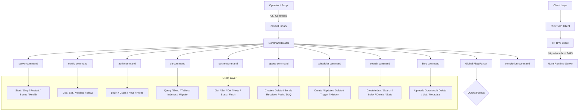
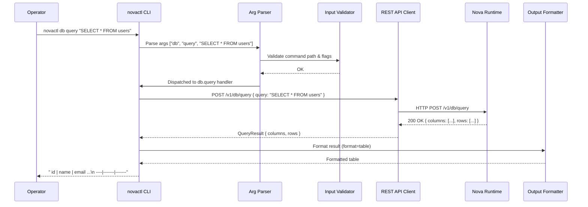
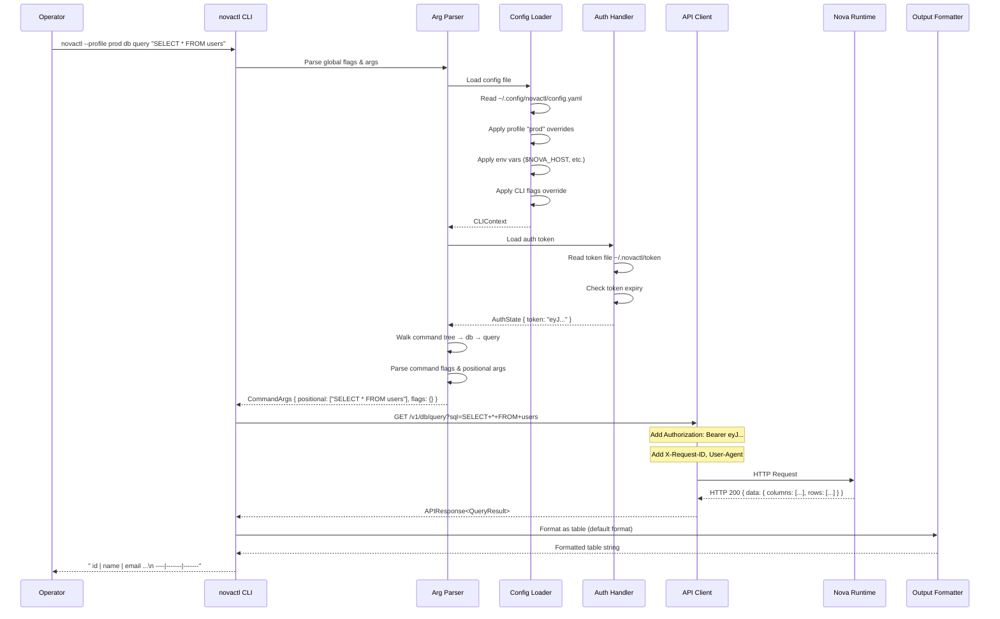
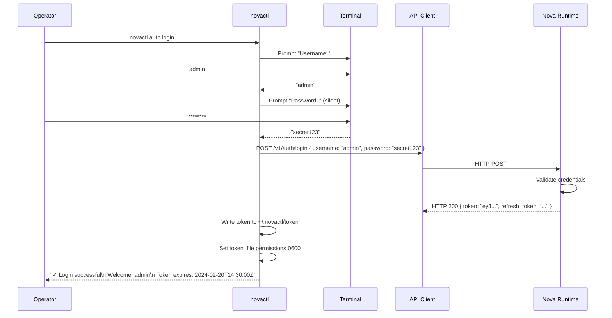
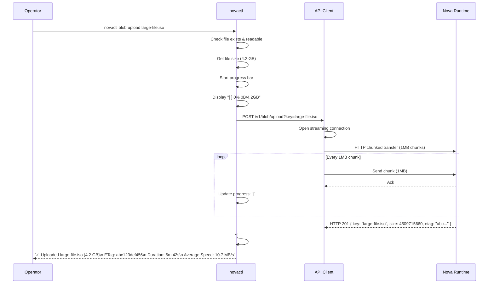
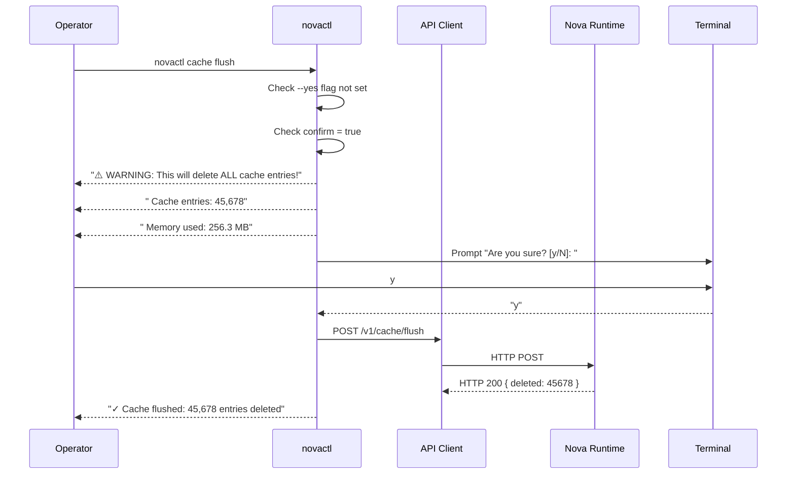
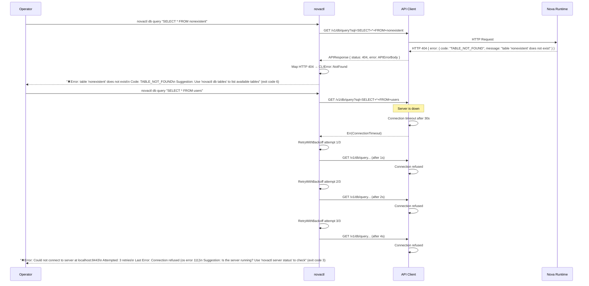

# 25. CLI (novactl)

> **Implementation Status:** This document is the design specification written before implementation. The actual CLI implementation is documented below. Design sections may contain aspirational features not yet implemented.

## Actual Implementation

### Global Flags

| Flag | Description |
|------|-------------|
| `-c, --config <PATH>` | Config file path |
| `-o, --output <FORMAT>` | Output format: `table` (default), `json`, `yaml` |
| `-a, --address <URL>` | Server address (default: `http://127.0.0.1:8642`) |
| `--api-key <KEY>` | API key for authentication |

### Implemented Commands

| Group | Command | Description |
|-------|---------|-------------|
| **runtime** | `status` | Show runtime status |
| | `start [--daemonize]` | Start the runtime (prints help — use `novad` binary instead) |
| | `stop [--force]` | Stop the runtime (prints help — use `kill` instead) |
| | `restart` | Restart the runtime (prints help) |
| | `reload` | Reload runtime configuration |
| **config** | `show [SECTION]` | Show config (optionally filtered to a section) |
| | `get <KEY>` | Get a config value by dot-separated key (e.g. `logging.level`) |
| | `set <KEY> <VALUE>` | Set a config value via API (e.g. `config set logging.level debug`) |
| | `validate <PATH>` | Validate a TOML config file |
| | `default` | Print built-in default config |
| **auth** | `create-user <USERNAME> [ROLE]` | Create a user with optional role |
| | `delete-user <USERNAME>` | Delete a user |
| | `list-users` | List all users |
| | `create-api-key <NAME>` | Create a new API key |
| | `revoke-api-key <KEY_ID>` | Revoke an API key |
| **queue** | `list` | List all queues |
| | `create <NAME> [--durable]` | Create a queue |
| | `delete <NAME>` | Delete a queue |
| | `publish <QUEUE> <MESSAGE>` | Publish a message |
| | `consume <QUEUE> [--count N]` | Consume messages |
| | `stats <NAME>` | Show queue statistics |
| **scheduler** | `list` | List all jobs |
| | `create <NAME> <SCHEDULE> <COMMAND>` | Create a cron job |
| | `delete <NAME>` | Delete a job |
| | `pause <NAME>` | Pause a job |
| | `resume <NAME>` | Resume a job |
| **search** | `query <QUERY> [--collection C] [--limit N]` | Run search query |
| | `create-index <NAME> <COLLECTION> <FIELD>...` | Create a search index |
| | `drop-index <NAME>` | Drop a search index |
| | `list-indexes` | List all search indexes |
| **blob** | `list [--prefix P]` | List blobs |
| | `put <KEY> <FILE>` | Upload a file as a blob |
| | `get <KEY> [OUTPUT_FILE]` | Download a blob |
| | `delete <KEY>` | Delete a blob |
| **sql** | `query <SQL> [--format FMT]` | Execute a SQL query |
| | `execute <FILE>` | Execute a SQL file |
| | `schema [TABLE]` | Show schema |
| **db** | `list` | List all databases |
| | `create <NAME>` | Create a database |
| | `drop <NAME>` | Drop a database |
| | `collections <DATABASE>` | List collections |
| | `create-collection <DB> <COL>` | Create a collection |
| | `drop-collection <DB> <COL>` | Drop a collection |
| | `stats [DATABASE]` | Show statistics |
| **cache** | `stats` | Show cache statistics |
| | `clear` | Clear the cache |
| | `flush` | Flush cache to disk |
| | `list [--pattern P]` | List cache keys |
| **completion** | `bash` / `zsh` / `fish` / `power-shell` | Generate shell completions |

**Total: 12 top-level commands, 52 subcommands.**

### Design Notes

The design specification below describes the original vision for the CLI. Some features are implemented differently than described, and some are aspirational (not yet implemented). The `runtime start/stop/restart` commands print informational messages rather than performing the action — use the `novad` binary directly for server lifecycle.

---

## 1. Purpose

The CLI (`novactl`) provides a command-line interface for managing all Nova Runtime subsystems. It is the primary administrative interface, enabling operators to configure, monitor, and debug the Nova Runtime instance without requiring a GUI or SDK. The CLI follows a hierarchical command structure with consistent flags, output formatting, and exit codes across all subcommands.

## 2. Scope

The CLI covers every operational aspect of Nova Runtime:

- **Server management**: Start, stop, restart, health check, configuration management
- **Database operations**: SQL query execution, schema management, migration, debugging
- **Cache operations**: Key CRUD, pattern search, statistics, flush
- **Queue operations**: Queue CRUD, message send/receive/delete, dead letter management
- **Scheduler operations**: Job CRUD, trigger, history inspection
- **Search operations**: Index CRUD, document indexing, search queries
- **Blob storage operations**: Upload, download, delete, list, metadata
- **Authentication**: User management, API key management, token operations
- **Configuration**: View and update runtime configuration
- **Monitoring**: Metrics, logs, connection status, performance diagnostics

The CLI does NOT cover:
- Internal Storage Engine direct access (goes through Execution Engine)
- OS-level process management beyond starting/stopping the server
- Cluster management (single-node by design)
- GUI-based dashboard functionality (delegated to Dashboard subsystem)

## 3. Responsibilities

1. **Command routing**: Parse command-line arguments and dispatch to appropriate handler
2. **API client**: Communicate with the Nova Runtime REST API for all operations
3. **Output formatting**: Present results as formatted tables, JSON, YAML, or plain text
4. **Authentication**: Manage authentication tokens for API access
5. **Configuration management**: Read, validate, and apply configuration changes
6. **Health monitoring**: Check server health and subsystem status
7. **Data export/import**: Export and import data across all subsystems
8. **Scriptability**: Support non-interactive mode with JSON output for scripting
9. **Completion**: Provide shell completion scripts (bash, zsh, fish)
10. **Help system**: Provide comprehensive help with examples for every command
11. **Error handling**: Return appropriate exit codes and actionable error messages
12. **Progress indication**: Show progress bars for long-running operations (upload, download, index)
13. **Connection management**: Configure and manage multiple server profiles

## 4. Non Responsibilities

- **GUI**: The CLI is text-only; visual dashboards are the Dashboard subsystem
- **Performance optimization**: No automatic query tuning or index recommendations
- **Backup orchestration**: Backup lifecycle managed by dedicated backup scripts
- **CI/CD integration**: No pipeline integration (can be called from CI scripts)
- **Real-time monitoring**: Real-time metrics dashboards are web-based
- **Package management**: Not a package manager; no plugin/module installation

## 5. Architecture





### 5.1 Command Tree

```
novactl
├── server
│   ├── start          Start the Nova Runtime server
│   ├── stop           Stop the running server
│   ├── restart        Restart the server
│   ├── status         Show server status
│   ├── health         Check server health (all subsystems)
│   └── version        Show version information
├── config
│   ├── show           Show current configuration
│   ├── get <key>      Get a specific configuration value
│   ├── set <key> <val> Set a configuration value
│   ├── validate       Validate configuration file
│   └── reset          Reset configuration to defaults
├── auth
│   ├── login          Authenticate and get token
│   ├── logout         Clear stored credentials
│   ├── whoami         Show current user info
│   ├── users
│   │   ├── list       List all users
│   │   ├── get <id>   Get user details
│   │   ├── create     Create a new user
│   │   ├── update     Update user
│   │   ├── delete     Delete user
│   │   └── suspend/resume  Manage user status
│   ├── keys
│   │   ├── list       List API keys
│   │   ├── create     Create API key
│   │   ├── revoke     Revoke API key
│   │   └── update     Update API key
│   └── roles
│       ├── list       List roles
│       ├── create     Create role
│       ├── update     Update role
│       ├── delete     Delete role
│       └── grant      Grant role to user
├── db
│   ├── query <sql>    Execute a SQL query (SELECT)
│   ├── exec <sql>     Execute a SQL statement (INSERT/UPDATE/DELETE/DDL)
│   ├── tables         List all tables
│   ├── table <name>   Describe table schema
│   ├── indexes        List indexes
│   ├── create-table   Create a new table
│   ├── drop-table     Drop a table
│   ├── migrate        Run database migrations
│   ├── explain <sql>  Show query execution plan
│   └── stats          Show database statistics
├── cache
│   ├── get <key>      Get a cache value
│   ├── set <key> <val> Set a cache value
│   ├── del <key>      Delete a cache entry
│   ├── multi-get      Get multiple keys
│   ├── multi-set      Set multiple keys
│   ├── multi-del      Delete multiple keys
│   ├── keys [pattern] List keys matching pattern
│   ├── ttl <key>      Get TTL of a key
│   ├── expire <key>   Set TTL on a key
│   ├── incr <key>     Increment a numeric value
│   ├── stats          Show cache statistics
│   └── flush          Clear all cache entries
├── queue
│   ├── list           List all queues
│   ├── create         Create a new queue
│   ├── delete         Delete a queue
│   ├── info <name>    Get queue information
│   ├── send <queue>   Send a message to a queue
│   ├── receive <queue> Receive messages from a queue
│   ├── peek <queue>   Peek at messages without consuming
│   ├── delete-msg     Delete a specific message
│   ├── purge          Purge all messages from a queue
│   ├── dlq
│   │   ├── list       List dead letter queue messages
│   │   ├── stats      Show DLQ statistics
│   │   └── redrive    Redrive DLQ messages to source queue
│   └── stats          Show queue statistics
├── scheduler
│   ├── jobs
│   │   ├── list       List all jobs
│   │   ├── get <id>   Get job details
│   │   ├── create     Create a new scheduled job
│   │   ├── update     Update a job
│   │   ├── delete     Delete a job
│   │   ├── pause      Pause a job
│   │   ├── resume     Resume a paused job
│   │   └── trigger    Trigger a job immediately
│   ├── history
│   │   ├── list       List execution history
│   │   ├── get <id>   Get execution details
│   │   └── logs <id>  Get execution logs
│   └── stats          Show scheduler statistics
├── search
│   ├── indexes
│   │   ├── list       List search indexes
│   │   ├── create     Create a new search index
│   │   ├── get <name> Get index details
│   │   ├── update     Update index settings
│   │   ├── delete     Delete an index
│   │   └── stats      Show index statistics
│   ├── index          Index a document
│   ├── index-batch    Index multiple documents
│   ├── query <index>  Search an index
│   ├── suggest        Get search suggestions
│   ├── get <id>       Get document by ID
│   ├── update         Update a document
│   ├── delete         Delete a document
│   └── stats          Show search statistics
├── blob
│   ├── upload <file>  Upload a file
│   ├── download <key> Download a blob
│   ├── delete <key>   Delete a blob
│   ├── list [prefix]  List blobs with optional prefix
│   ├── info <key>     Get blob metadata
│   ├── copy           Copy a blob
│   ├── move           Move/rename a blob
│   ├── set-tier       Change storage tier
│   ├── set-expiry     Set blob expiry
│   └── stats          Show blob storage statistics
├── completion
│   ├── bash           Generate bash completion script
│   ├── zsh            Generate zsh completion script
│   └── fish           Generate fish completion script
├── help [command]     Show help for a command
├── --version          Show version
├── --help             Show general help
└── --output           Output format (table, json, yaml, text)
```

### 5.2 Configuration and Connection

```
Configuration file locations (precedence):
1. --config <path> flag (explicit)
2. $NOVA_CONFIG environment variable
3. $HOME/.config/novactl/config.yaml
4. $HOME/.novactl.yaml

Connection configuration (config.yaml):
---
server:
  host: "localhost"
  port: 8443
  protocol: "https"
  timeout: 30s
  tls:
    ca_cert: "/etc/nova/ca.pem"
    client_cert: "/etc/nova/client.pem"
    client_key: "/etc/nova/client-key.pem"
    insecure: false         # skip TLS verify (dev only)

auth:
  token: ""                 # JWT token (auto-populated on login)
  token_file: "~/.novactl/token"
  api_key: ""               # API key (alternative to token)
  default_profile: "default"

profiles:
  default:
    host: "localhost"
    port: 8443
    protocol: "https"
  staging:
    host: "staging.nova.example.com"
    port: 8443
  production:
    host: "nova.example.com"
    port: 443
    auth:
      api_key_file: "~/.novactl/prod-api-key"

output:
  format: "table"           # default output format
  color: auto               # auto, always, never
  pagination: true          # paginate long lists
  page_size: 50             # default page size
```

## 6. Data Structures

### 6.1 CLI Argument Parsing

```rust
/// Root CLI application definition
pub struct CLIDefinition {
    pub name: String,
    pub version: String,
    pub description: String,
    pub commands: Vec<CommandDefinition>,
    pub global_flags: Vec<FlagDefinition>,
}

/// A single command in the command tree
pub struct CommandDefinition {
    pub name: String,
    pub aliases: Vec<String>,
    pub description: String,
    pub long_description: String,
    pub usage: String,
    pub examples: Vec<Example>,
    pub subcommands: Vec<CommandDefinition>,
    pub flags: Vec<FlagDefinition>,
    pub handler: Option<CommandHandler>,
    pub hidden: bool,
    pub deprecated: bool,
    pub deprecation_message: Option<String>,
    pub min_args: usize,
    pub max_args: usize,
    pub arg_placeholders: Vec<String>,      // for help text
    pub arg_validators: Vec<ArgValidator>,   // per-position validators
    pub requires_auth: bool,                 // most commands require auth
    pub requires_server: bool,               // most commands require running server
}

pub enum ArgValidator {
    Regex(String),
    Enum(Vec<String>),
    UUID,
    Email,
    URL,
    FileExists,
    Directory,
    Numeric { min: Option<f64>, max: Option<f64> },
    JSON,
    SQL,
}

pub struct FlagDefinition {
    pub name: String,
    pub aliases: Vec<String>,
    pub description: String,
    pub flag_type: FlagType,
    pub default: Option<FlagValue>,
    pub required: bool,
    pub env_var: Option<String>,    // fallback from env
    pub hidden: bool,
}

pub enum FlagType {
    Bool,
    String,
    StringSlice,
    Int,
    Int64,
    Uint,
    Float64,
    Duration,
    FilePath,
    DirectoryPath,
    Choice(Vec<String>),
    KeyValuePairs,
}

pub enum FlagValue {
    Bool(bool),
    String(String),
    Int(i64),
    Float(f64),
}

pub struct Example {
    pub description: String,
    pub command: String,
}

pub type CommandHandler = Arc<dyn Fn(CLIContext, CommandArgs) -> Result<Output, CLIError> + Send + Sync>;
```

### 6.2 Runtime Context

```rust
/// Context assembled from global flags + config file
pub struct CLIContext {
    pub server: ServerConnection,
    pub auth: AuthState,
    pub output: OutputConfig,
    pub debug: bool,
    pub verbose: bool,
    pub quiet: bool,
    pub no_color: bool,
    pub progress: bool,           // show progress bars
    pub confirm: bool,            // require confirmation for destructive ops
    pub timeout: Duration,
    pub retry_attempts: u32,
    pub retry_delay: Duration,
}

pub struct ServerConnection {
    pub host: String,
    pub port: u16,
    pub protocol: String,
    pub tls_config: Option<TLSConfig>,
}

pub struct TLSConfig {
    pub ca_cert: Option<String>,
    pub client_cert: Option<String>,
    pub client_key: Option<String>,
    pub insecure: bool,
}

pub struct AuthState {
    pub token: Option<String>,
    pub token_file: Option<String>,
    pub api_key: Option<String>,
    pub profile: String,
    pub auto_login: bool,     // auto-login using stored credentials
}

pub struct OutputConfig {
    pub format: OutputFormat,
    pub color: ColorMode,
    pub paginate: bool,
    pub page_size: usize,
}

pub enum OutputFormat {
    Table,
    JSON,
    YAML,
    Text,
    CSV,
    TSV,
    None,          // suppress output
}

pub enum ColorMode {
    Auto,
    Always,
    Never,
}

/// Parsed arguments for a command
pub struct CommandArgs {
    pub positional: Vec<String>,
    pub flags: HashMap<String, FlagValue>,
    pub raw_args: Vec<String>,
}
```

### 6.3 Output Types

```rust
/// Generic output from any CLI command
pub enum Output {
    Table(TableOutput),
    JSON(serde_json::Value),
    YAML(serde_yaml::Value),
    Text(String),
    Message(String, MessageLevel),
    Progress(ProgressOutput),
    None,
}

pub struct TableOutput {
    pub headers: Vec<String>,
    pub rows: Vec<Vec<String>>,
    pub caption: Option<String>,
    pub max_width: Option<usize>,      // terminal width truncation
    pub sortable: bool,
}

pub enum MessageLevel {
    Info,
    Success,
    Warning,
    Error,
    Important,       // bright/emphasized
}

pub struct ProgressOutput {
    pub total: u64,
    pub completed: u64,
    pub message: String,
    pub unit: String,       // "bytes", "items", "documents"
    pub show_speed: bool,
    pub show_eta: bool,
}

/// Error returned by any CLI command
pub struct CLIError {
    pub code: CLIErrorCode,
    pub message: String,
    pub details: Vec<String>,
    pub suggestion: Option<String>,
    pub exit_code: i32,
}

pub enum CLIErrorCode {
    // General errors (1-19)
    Unknown,
    InvalidArguments,
    MissingArguments,
    InvalidFlag,
    MissingFlag,
    InvalidValue,
    // Config errors (20-39)
    ConfigNotFound,
    ConfigParseError,
    ConfigValidationError,
    ProfileNotFound,
    // Connection errors (40-59)
    ConnectionFailed,
    ConnectionTimeout,
    TLSFailed,
    ServerUnreachable,
    // Authentication errors (60-79)
    AuthenticationFailed,
    TokenExpired,
    TokenInvalid,
    NotAuthenticated,
    InsufficientPermissions,
    // API errors (80-99)
    APIError,
    APIResponseError,
    RateLimited,
    NotFound,
    Conflict,
    // I/O errors (100-119)
    FileNotFound,
    FileReadError,
    FileWriteError,
    PermissionDenied,
    // Subsystem errors (120-139)
    DatabaseError,
    CacheError,
    QueueError,
    SchedulerError,
    SearchError,
    BlobError,
}

impl CLIError {
    pub fn exit_code(&self) -> i32 {
        match self.code {
            CLIErrorCode::InvalidArguments => 1,
            CLIErrorCode::MissingArguments => 1,
            CLIErrorCode::InvalidFlag => 1,
            CLIErrorCode::MissingFlag => 1,
            CLIErrorCode::ConfigNotFound => 2,
            CLIErrorCode::ConfigParseError => 2,
            CLIErrorCode::ConnectionFailed => 3,
            CLIErrorCode::ConnectionTimeout => 3,
            CLIErrorCode::AuthenticationFailed => 4,
            CLIErrorCode::TokenExpired => 4,
            CLIErrorCode::NotAuthenticated => 4,
            CLIErrorCode::InsufficientPermissions => 5,
            CLIErrorCode::NotFound => 6,
            CLIErrorCode::FileNotFound => 7,
            CLIErrorCode::FileReadError => 7,
            CLIErrorCode::FileWriteError => 7,
            _ => 1,
        }
    }
}
```

### 6.4 API Response Mapping

```rust
/// Generic API response wrapper
pub struct APIResponse<T> {
    pub status: u16,
    pub data: Option<T>,
    pub error: Option<APIErrorBody>,
    pub headers: HeaderMap,
}

/// Maps REST API responses to CLI output
impl<T: Into<Output>> APIResponse<T> {
    pub fn to_output(self, format: OutputFormat) -> Result<Output, CLIError> {
        match self.status {
            200..=299 => {
                self.data.map(|d| d.into())
                    .ok_or(CLIError::APIError {
                        message: "Empty response body".into(),
                        code: CLIErrorCode::APIResponseError,
                    })
            }
            401 => Err(CLIError::TokenExpired {
                message: "Token expired, please re-authenticate".into(),
            }),
            403 => Err(CLIError::InsufficientPermissions {
                message: self.error.unwrap().message,
            }),
            404 => Err(CLIError::NotFound {
                message: self.error.unwrap().message,
            }),
            429 => Err(CLIError::RateLimited {
                message: format!("Rate limited. Retry after {}s",
                    self.headers.get("retry-after").unwrap_or("60")),
            }),
            _ => Err(CLIError::APIError {
                message: self.error.unwrap_or(APIErrorBody {
                    message: "Unknown error".into(),
                    code: format!("HTTP_{}", self.status),
                }).message,
            }),
        }
    }
}

pub struct APIErrorBody {
    pub message: String,
    pub code: String,
    pub details: Option<Vec<String>>,
    pub suggestion: Option<String>,
}
```

### 6.5 Shell Completion Structures

```rust
/// Shell completion context
pub struct CompletionContext {
    pub shell: ShellType,
    pub current_word: String,
    pub previous_words: Vec<String>,
    pub cursor_position: usize,
}

pub enum ShellType {
    Bash,
    Zsh,
    Fish,
    PowerShell,
}

impl CompletionContext {
    /// Generate completion suggestions for the current word
    pub fn suggest(&self, commands: &[CommandDefinition]) -> Vec<CompletionSuggestion> {
        // Walk the command tree based on previous_words
        // Match current_word against command/flag names
        // Return matching suggestions with descriptions
    }
}

pub struct CompletionSuggestion {
    pub value: String,
    pub description: String,
    pub kind: SuggestionKind,    // command, flag, flag_value, file, directory, etc.
}

pub enum SuggestionKind {
    Command,
    Flag,
    FlagValue,
    File,
    Directory,
    Subcommand,
    Argument,
}
```

## 7. Algorithms

### 7.1 Argument Parsing

```
Algorithm: ParseCLIArguments
Input: raw_args: Vec<String>, command_tree: CommandDefinition
Output: (matched_command: CommandDefinition, parsed: CommandArgs)

1. Initialize parser state:
   - current = command_tree (root)
   - positional = []
   - flags = {}
   - i = 1 (skip program name)

2. Parse global flags:
   While i < raw_args.len() AND raw_args[i] starts with '-':
     a. If raw_args[i] == '--': i += 1; break (end of flags)
     b. If raw_args[i] == '--help': show help and exit 0
     c. If raw_args[i] == '--version': show version and exit 0
     d. Parse the flag:
        - Long form: --flag=value or --flag value
        - Short form: -f value or -fVALUE (combined)
        - Bool flags: --flag (true), --no-flag (false)
        - Repeatable flags: --filter key=val --filter key2=val2
     e. Validate flag against global_flags
     f. If unknown flag and strict mode: error
     g. i += parsed_length

3. Walk command tree:
   While i < raw_args.len() AND raw_args[i] does NOT start with '-':
     a. Look for subcommand in current.subcommands matching raw_args[i] (name or alias)
     b. If found: current = matched_subcommand; i += 1; continue
     c. If not found AND current accepts positional args: break (positional starts)
     d. If not found AND current has no subcommands: treat as positional
     e. If not found AND current has subcommands: suggest similar commands

4. Parse command-specific flags:
   While i < raw_args.len() AND raw_args[i] starts with '-':
     a. Same as step 2, but validate against current.flags
     b. Handle special flags:
        - --help: show command-specific help
        - --output, -o: set output format
        - --format, -f: alias for output format

5. Collect positional arguments:
   While i < raw_args.len():
     a. Append raw_args[i] to positional
     b. i += 1

6. Validate:
   a. Check required flags are present
   b. Check positional count: min_args <= len <= max_args
   c. Run per-position arg_validators
   d. Check mutually exclusive flag groups
   e. Check dependent flags (flag A requires flag B)

7. Return (current, CommandArgs { positional, flags })
```

### 7.2 Output Formatting

```
Algorithm: FormatOutput
Input: output: Output, format: OutputFormat, config: OutputConfig
Output: String (formatted for terminal display)

Switch (output):
  Case Message:
    - Apply color based on level
    - Info: blue, Success: green, Warning: yellow, Error: red, Important: bold
    - Append newline
    - Return colored_string

  Case Text:
    - Return text as-is (no formatting)

  Case Table:
    a. Determine column widths:
       - header_width = max(header.len, max_row_value.len) for each column
       - total_width = sum(column_widths) + (col_count * 3) + 1
       - If total_width > terminal_width AND config.max_width:
         Truncate columns proportionally
    b. Build separator line: "+---...---+---...---+"
    c. Build header row: "| Header1 | Header2 |"
    d. Build separator line
    e. For each row: build "| val1 | val2 |"
    f. If config.paginate AND rows > page_size:
       - Split into pages, show less prompt
       - "Press any key to continue, q to quit"
    g. Build footer: row count, caption
    h. Return formatted string

  Case JSON:
    a. Serialize to pretty-printed JSON (indent=2)
    b. Return

  Case YAML:
    a. Serialize to YAML
    b. Return

  Case Progress:
    a. If not progress_enabled: return ""
    b. Build progress bar: "[====>      ] 45% 123/256 items"
    c. Show speed if enabled: "12.5 MB/s"
    d. Show ETA if enabled: "ETA 12s"
    e. Update in-place using carriage return (\r)
    f. On completion: print final state with newline
```

### 7.3 Auto-Retry with Exponential Backoff

```
Algorithm: RetryWithBackoff
Input: operation: Fn() -> Result<T, CLIError>, context: CLIContext
Output: Result<T, CLIError>

1. If retry_attempts == 0: execute once, return result
2. For attempt in 0..retry_attempts:
   a. result = operation()
   b. If result is Ok: return result
   c. If error is not retryable:
      - Errors NOT retried: InvalidArguments, MissingArguments,
        InvalidFlag, AuthenticationFailed, InsufficientPermissions,
        NotFound, ConfigParseError
      - Return error immediately
   d. If error is retryable:
      - Retriable: ConnectionFailed, ConnectionTimeout, ServerUnreachable,
        RateLimited, APIError (5xx)
      - delay = retry_delay * (2 ^ attempt)  [exponential]
      - If rate limited: delay = max(delay, retry_after_header)
      - If verbose: print "Retry attempt {attempt+1}/{retry_attempts} in {delay}s..."
      - Sleep(delay)
3. Return last error (all attempts exhausted)
```

### 7.4 Progress Bar for Upload/Download

```
Algorithm: ProgressBar
Input: total: u64, reader: Read, chunk_size: usize
Output: Vec<u8> (data)

1. Initialize:
   - completed = 0
   - start_time = now()
   - bar_width = min(40, terminal_width - 30)
   - spinner = ["|", "/", "-", "\\"]

2. Loop:
   a. chunk = reader.read(chunk_size)
   b. If chunk is empty: break
   c. completed += chunk.len()
   d. elapsed = now() - start_time
   e. speed = completed / elapsed
   f. percent = (completed / total) * 100
   g. filled_width = (bar_width * percent) / 100
   h. bar = "[" + "#" * filled_width + " " * (bar_width - filled_width) + "]"
   i. eta = (total - completed) / speed
   j. status = "{percent}% {bar} {completed}/{total} {speed}/s ETA {eta}s"
   k. Print "\r{status}" (overwrite line)
   l. Append chunk to output

3. Print final line: "\r[{'#' * bar_width}] 100% {total}/{total} Complete\n"
4. Return output data
```

### 7.5 Config File Merging

```
Algorithm: MergeConfigFiles
Input: config_paths: Vec<Path>, cli_flags: HashMap<String, FlagValue>
Output: CLIContext

1. Initialize default CLIContext
2. For each config_path in config_paths (in order of precedence, lowest first):
   a. If file does not exist: skip (warning in verbose mode)
   b. Parse YAML file into ConfigFile struct
   c. Deep-merge into current context:
      - Scalar values: override if non-null
      - Maps: recursive merge (new keys added, existing keys overridden)
      - Lists: override (not append)
3. Apply environment variable overrides:
   - For each flag with env_var set:
     If env_var is set in environment: override flag value
4. Apply CLI flag overrides:
   - For each flag in cli_flags: override context value
5. Validate final context:
   - Check server.host is set
   - Check either auth.token or auth.api_key is set (unless auto-login)
   - Validate URL format
   - Validate port range
6. Return CLIContext
```

## 8. Interfaces

### 8.1 Global Flags

```
Global flags available on every command:

  --help, -h              Show help for any command
  --version, -v           Show version information
  --output, -o <format>   Output format: table, json, yaml, text (default: table)
  --config <path>         Path to configuration file
  --profile <name>        Connection profile to use (default: default)
  --host <host>           Server hostname (overrides config)
  --port <port>           Server port (overrides config)
  --protocol <proto>      Connection protocol: http, https (default: https)
  --timeout <duration>    Request timeout (default: 30s)
  --insecure              Skip TLS certificate verification (dev only)
  --token <token>         JWT token for authentication
  --api-key <key>         API key for authentication
  --format <format>       Alias for --output
  --color <mode>          Color mode: auto, always, never
  --no-color              Disable color output (shorthand)
  --debug                 Enable debug output
  --verbose, -V           Enable verbose output
  --quiet, -q             Suppress non-error output
  --no-progress           Disable progress bars
  --yes, -y               Auto-confirm destructive operations
  --retry <n>             Number of retry attempts (default: 3)
  --retry-delay <d>       Delay between retries (default: 1s)
```

### 8.2 server Command

```
novactl server start [flags]

  Start the Nova Runtime server.

  The server runs as a foreground process by default. Use --daemon
  to run in the background. Logs are written to stdout/stderr
  or to --log-file when daemonized.

  Flags:
    --config <path>         Path to server configuration file (default: nova.yaml)
    --daemon, -d            Run as a daemon (background process)
    --log-file <path>       Write logs to file (default: stdout)
    --log-level <level>     Log level: trace, debug, info, warn, error (default: info)
    --pid-file <path>       Write PID to file (default: /var/run/nova.pid)
    --port <port>           Server port (default: 8443)
    --bind <addr>           Bind address (default: 0.0.0.0)
    --db-path <path>        Database storage path
    --data-dir <path>       Data directory for all persistent storage

  Examples:
    novactl server start
    novactl server start --daemon --log-file /var/log/nova.log
    novactl server start --port 9443 --db-path /data/nova/db

---

novactl server stop [flags]

  Stop the running Nova Runtime server.

  Sends SIGTERM to the server process. If the server does not
  stop within the grace period, sends SIGKILL.

  Flags:
    --grace-period <d>     Grace period before force kill (default: 30s)
    --pid-file <path>      PID file location (default: /var/run/nova.pid)

  Examples:
    novactl server stop
    novactl server stop --grace-period 60s

---

novactl server restart [flags]

  Restart the Nova Runtime server.

  Combines stop and start with automatic wait for health check.

  Flags:
    Same as start + stop
    --wait-healthy <d>     Wait for healthy status (default: 60s)
    --no-wait              Do not wait for healthy status

---

novactl server status [flags]

  Show server process status.

  Displays PID, uptime, memory usage, CPU usage, and connection count.

  Output fields:
    PID                  Process ID
    Uptime               Server uptime
    Version              Server version
    Status               Running / Stopped / Restarting
    Memory               Resident memory usage
    CPU                  CPU usage percentage
    Connections          Active connection count
    PidFile              PID file location
    ConfigFile           Configuration file location
    DataDir              Data directory location

---

novactl server health [flags]

  Check server health across all subsystems.

  Output fields:
    Overall              Overall health: healthy, degraded, unhealthy
    Uptime               Server uptime
    Subsystems:
      Database           Status + latency
      Cache              Status + latency
      Queue              Status + latency
      Scheduler          Status + latency
      Search             Status + latency
      Blob               Status + latency
      GraphQL            Status + latency

  Exit codes:
    0    All subsystems healthy
    1    Some subsystems degraded
    2    Server unhealthy / not running

---

novactl server version

  Show server version information.

  Output fields:
    Version              Semantic version
    Build Commit         Git commit hash
    Build Date           Build timestamp
    Rust Version         Rust compiler version
    OS/Arch              Operating system and architecture
```

### 8.3 config Command

```
novactl config show [flags]

  Show current server configuration.

  Displays all configuration keys and values from the running server.
  Sensitive values (passwords, tokens, keys) are masked by default.

  Flags:
    --subsystem <name>   Filter by subsystem (database, cache, queue, etc.)
    --key <key>          Show specific key only
    --reveal-sensitive   Show sensitive values (requires admin)

  Examples:
    novactl config show
    novactl config show --subsystem database
    novactl config show --key server.port
    novactl config show --format json

---

novactl config get <key> [flags]

  Get a specific configuration value.

  Supports dot-notation key paths:
    server.port
    database.max_connections
    cache.default_ttl_ms
    auth.token_expiry_ms
    graphql.max_depth

  Examples:
    novactl config get server.port
    novactl config get database.max_connections

---

novactl config set <key> <value> [flags]

  Set a configuration value on the running server.

  The change is applied immediately and persisted to the
  configuration file. Some changes may require a restart.

  Flags:
    --persist             Persist to config file (default: true)
    --no-persist          Apply in-memory only (lost on restart)
    --restart             Restart server after change if required

  Examples:
    novactl config set log.level debug
    novactl config set cache.max_memory_mb 2048
    novactl config set server.port 9443 --restart

  Note: Changing server.port requires restart.
```

### 8.4 auth Command

```
novactl auth login [flags]

  Authenticate with the Nova Runtime server.

  Prompts for username and password interactively, or accepts
  them via flags. Stores the JWT token in the configured token file.

  Flags:
    --username, -u <name>    Username (prompts if not provided)
    --password, -p <pass>    Password (prompts if not provided)
    --api-key-name <name>    Name for API key to create on login
    --store-token            Store token in token file (default: true)
    --token-file <path>      Token file location (overrides config)
    --remember-me            Request extended token expiry

  Examples:
    novactl auth login
    novactl auth login --username admin
    novactl auth login --username admin --password-file /tmp/pass

---

novactl auth logout

  Clear stored authentication token.

  Removes the token file. Does NOT invalidate the token server-side;
  the token remains valid until its natural expiry.

---

novactl auth whoami

  Show current authenticated user information.

  Output fields:
    ID                   User UUID
    Username             User login name
    Email                User email address
    Display Name         User display name
    Roles                Comma-separated role list
    Permissions          Comma-separated permission list
    Token Expiry         Token expiration time
    Token ID             JWT token ID (jti)

---

novactl auth users list [flags]

  List all users (requires admin role).

  Flags:
    --status <status>    Filter by status: active, inactive, suspended
    --role <name>        Filter by role
    --search <q>         Search by name or email

  Output fields:
    ID                   User UUID
    Username             Login name
    Email                Email address
    Display Name         Display name
    Roles                Roles assigned
    Status               User status
    Last Login           Last login timestamp
    Created              Account creation date

---

novactl auth users create <username> [flags]

  Create a new user (requires admin role).

  Flags:
    --email, -e <email>         Email address (required)
    --password, -p <pass>       Password (auto-generated if not provided)
    --display-name, -d <name>   Display name (defaults to username)
    --roles, -r <roles>         Comma-separated role names
    --send-invite               Send invitation email

  Examples:
    novactl auth users create jdoe --email jdoe@example.com --roles developer
    novactl auth users create admin --email admin@example.com --roles admin

---

novactl auth keys create <name> [flags]

  Create a new API key.

  The API key is shown only once at creation. Store it securely.

  Flags:
    --permissions <perms>    Comma-separated permission names
    --roles <roles>          Comma-separated role names
    --expires-in <d>         Key expiry duration (e.g., 30d, 90d)
    --never-expires          Key never expires

  Output:
    Name                 Key name
    Key Prefix           First 8 characters of the key
    Key                  Full key (shown once)
    Permissions          Granted permissions
    Expires At           Expiration date
    Created At           Creation date

  Examples:
    novactl auth keys create deploy-key --roles deploy
    novactl auth keys create readonly-key --permissions "db:read,cache:read"
```

### 8.5 db Command

```
novactl db query <sql> [flags]

  Execute a SQL SELECT query and display results.

  Supports parameterized queries with positional ($1, $2, ...)
  or named ($name) parameters.

  Flags:
    --params, -p <json>      JSON array/object of bind parameters
    --param-file <path>      Read parameters from JSON file
    --timeout <d>            Query timeout (default: 30s)
    --max-rows <n>           Maximum rows to return (default: 1000)
    --fetch-size <n>         Rows per fetch (default: 100)

  Output format (table):
    id  | name       | email                 | created_at
    ----|------------|-----------------------|--------------------------
    1   | John Doe   | john@example.com      | 2024-01-15T10:30:00Z
    2   | Jane Smith | jane@example.com      | 2024-01-16T14:20:00Z

  Examples:
    novactl db query "SELECT * FROM users"
    novactl db query "SELECT * FROM users WHERE id = $1" --params '[1]'
    novactl db query "SELECT name, email FROM users ORDER BY created_at DESC LIMIT 10"
    novactl db query "SELECT * FROM users" --format json

---

novactl db exec <sql> [flags]

  Execute a SQL statement (INSERT, UPDATE, DELETE, DDL).

  Returns the number of affected rows.

  Flags:
    --params, -p <json>      JSON bind parameters
    --param-file <path>      Read parameters from file
    --timeout <d>            Statement timeout
    --dry-run                Show what would be executed without executing
    --tx, --transaction      Execute within a transaction

  Output:
    Affected Rows: 42
    Execution Time: 12.5ms
    Warnings: []

  Examples:
    novactl db exec "INSERT INTO users (name, email) VALUES ($1, $2)" \
      --params '["Alice", "alice@example.com"]'
    novactl db exec "UPDATE users SET status = 'active' WHERE id = $1" --params '[5]'
    novactl db exec "DROP TABLE IF EXISTS temp_data" --dry-run

---

novactl db tables [flags]

  List all tables in the database.

  Flags:
    --schema <name>      Filter by schema
    --pattern <p>        Filter by name pattern (SQL LIKE)
    --include-sizes      Include table size information (slower)

  Output:
    Table Name    | Schema  | Columns | Rows   | Size    | Created
    --------------|---------|---------|--------|---------|---------------------
    users         | public  | 12      | 15432  | 2.1 MB  | 2024-01-15T10:30:00Z
    posts         | public  | 8       | 89234  | 15.3 MB | 2024-01-16T14:20:00Z
    comments      | public  | 6       | 345678 | 45.2 MB | 2024-01-17T09:00:00Z

---

novactl db table <name> [flags]

  Describe a table's schema and metadata.

  Output:
    Table: users
    Schema: public
    Row Count: 15,432
    Size: 2.1 MB
    Created: 2024-01-15T10:30:00Z

    Columns:
    Name       | Type        | Nullable | PK | Default           | Comment
    -----------|-------------|----------|----|-------------------|----------------
    id         | UUID        | NO       | PK | gen_random_uuid() |
    name       | VARCHAR(255)| NO       |    |                   | User display name
    email      | VARCHAR(255)| NO       |    |                   | Login email
    status     | ENUM        | NO       |    | 'active'          | Account status
    ...

    Indexes:
    Name            | Columns     | Unique | Type
    ----------------|-------------|--------|-------
    users_pkey      | id          | YES    | BTREE
    users_email_idx | email       | YES    | BTREE

---

novactl db explain <sql> [flags]

  Show the query execution plan without executing.

  Flags:
    --params <json>      Query bind parameters
    --analyze            Execute and collect actual timing (runs the query)

  Output:
    Query Plan:
    ┌────────────────────────────────────────────────────────────┐
    │ Limit  (cost=0.15..12.47 rows=10 width=64)                │
    │   ->  Index Scan using users_email_idx on users           │
    │         Index Cond: (email = 'alice@example.com'::text)   │
    │         (cost=0.15..12.47 rows=10 width=64)               │
    └────────────────────────────────────────────────────────────┘

    Estimated Rows: 10
    Estimated Cost: 12.47
```

### 8.6 cache Command

```
novactl cache get <key> [flags]

  Get a cache entry by key.

  Flags:
    --raw                Return raw value without metadata

  Output (default):
    Key:       user:123
    Value:     {"name": "Alice", "email": "alice@example.com"}
    Type:      JSON
    TTL:       345s remaining
    Created:   2024-01-20T10:30:00Z
    Accessed:  2024-01-20T11:00:00Z
    Hits:      42

  Output (--raw):
    {"name": "Alice", "email": "alice@example.com"}

---

novactl cache set <key> <value> [flags]

  Set a cache entry.

  Flags:
    --ttl <d>            TTL duration (e.g., 300s, 1h, 7d) (default: 3600s)
    --type <type>        Data type hint: string, json, int, float, bool (default: json)
    --nx                 Only set if key does NOT exist

  Examples:
    novactl cache set greeting "Hello World" --ttl 3600s --type string
    novactl cache set user:123 '{"name":"Alice"}' --ttl 1h
    novactl cache set counter 0 --type int --nx

---

novactl cache del <key> [flags]

  Delete a cache entry.

  Flags:
    --pattern            Interpret key as a glob pattern

  Examples:
    novactl cache del user:123
    novactl cache del "session:*" --pattern

---

novactl cache keys [pattern] [flags]

  List cache keys matching a pattern.

  Uses glob-style pattern matching:
    *       Matches any number of characters
    ?       Matches any single character
    [abc]   Matches any character in brackets

  Flags:
    --count              Only show count, not keys

  Output:
    user:*
    ├── user:123
    ├── user:456
    └── user:789

    session:*
    ├── session:abc
    └── session:def

    Total keys: 5

---

novactl cache stats

  Show cache statistics.

  Output:
    Cache Statistics
    ┌──────────────────────────┬──────────────┐
    │ Metric                   │ Value        │
    ├──────────────────────────┼──────────────┤
    │ Hit Rate                 │ 94.2%        │
    │ Hits                     │ 1,234,567    │
    │ Misses                   │ 76,543       │
    │ Entries                  │ 45,678       │
    │ Memory Used              │ 256.3 MB     │
    │ Max Memory               │ 1.0 GB       │
    │ Evictions                │ 1,234        │
    │ Avg TTL                  │ 45.2m        │
    │ Keyspace Hits            │ 1,234,567    │
    │ Keyspace Misses          │ 76,543       │
    └──────────────────────────┴──────────────┘

---

novactl cache flush [flags]

  Clear all cache entries.

  This operation is destructive and requires confirmation
  (unless --yes flag is provided).

  Flags:
    --yes, -y            Skip confirmation prompt
```

### 8.7 queue Command

```
novactl queue list [flags]

  List all queues.

  Output:
    Queue Name       | Messages | Sent     | Received | DLQ     | Created
    -----------------|----------|----------|----------|---------|---------------------
    email-queue      | 1,234    | 50,000   | 48,766   | 120     | 2024-01-15T10:30:00Z
    task-queue       | 567      | 100,000  | 99,433   | 45      | 2024-01-15T10:31:00Z
    notification-ql  | 89       | 25,000   | 24,911   | 12      | 2024-01-16T09:00:00Z

---

novactl queue create <name> [flags]

  Create a new queue.

  Flags:
    --description <s>            Queue description
    --visibility-timeout <d>     Message visibility timeout (default: 30s)
    --max-message-size <bytes>   Max message size in bytes (default: 262144)
    --message-retention <d>      Message retention duration (default: 4d)
    --dlq-max-receives <n>       Max receives before DLQ (default: 5)
    --no-dlq                     Disable dead letter queue
    --delivery-delay <d>         Default delivery delay (default: 0s)

  Examples:
    novactl queue create email-queue --description "Transactional email queue"
    novactl queue create priority-queue --visibility-timeout 60s --dlq-max-receives 10

---

novactl queue send <queue> [flags]

  Send a message to a queue.

  Reads message body from argument, stdin, or file.

  Flags:
    --body, -b <json>            Message body (inline JSON)
    --body-file <path>           Read message body from file
    --content-type <type>        Content type (default: application/json)
    --delay <d>                  Message delivery delay
    --priority <p>               Priority: low, normal, high, critical
    --deduplication-id <id>      Deduplication ID
    --group-id <id>              Message group ID
    --attributes <json>          Custom message attributes

  Examples:
    novactl queue send email-queue --body '{"to":"user@example.com","subject":"Welcome"}'
    novactl queue send task-queue --body-file /tmp/task.json
    echo '{"data":"value"}' | novactl queue send my-queue --body -

---

novactl queue receive <queue> [flags]

  Receive (consume) messages from a queue.

  By default, receives one message and displays it. Messages
  are hidden from other consumers for the visibility timeout.

  Flags:
    --max-messages, -n <n>       Max messages to receive (default: 1)
    --visibility-timeout <d>     Visibility timeout for received messages
    --auto-delete                Delete messages immediately after display
    --poll                        Continuously poll for messages (long-poll)
    --poll-timeout <d>           Long-poll timeout (default: 20s)
    --ack                        Acknowledge/delete after processing

  Output:
    Messages Received: 3
    ┌──────┬─────────────────────┬──────────────────┬──────────┐
    │ ID   │ Body                │ Sent             │ Receives │
    ├──────┼─────────────────────┼──────────────────┼──────────┤
    │ abc  │ {"task":"sendmail"} │ 12:34:56         │ 1        │
    │ def  │ {"task":"report"}   │ 12:35:00         │ 2        │
    │ ghi  │ {"task":"cleanup"}  │ 12:35:30         │ 1        │
    └──────┴─────────────────────┴──────────────────┴──────────┘

---

novactl queue dlq list <queue> [flags]

  List dead letter queue messages.

  Output:
    Message ID   | Reason              | Receives | Dead Lettered
    -------------|---------------------|----------|--------------------------
    msg-001      | Max receives exceeded| 5        | 2024-01-20T14:30:00Z
    msg-002      | Processing timeout   | 3        | 2024-01-20T14:35:00Z

---

novactl queue dlq redrive <queue>

  Redrive dead letter messages back to the source queue.

  Flags:
    --max-messages <n>       Max messages to redrive (default: all)

  Output:
    Redriving dead letter messages...
    [###############       ] 75% 150/200 messages redriven
    Successfully redriven 150 messages
    50 messages could not be redriven (see --verbose for details)

---

novactl queue stats [name]

  Show queue statistics for all queues or a specific queue.

  Output:
    Overall Queue Statistics
    ┌────────────────────────┬──────────────┐
    │ Metric                 │ Value        │
    ├────────────────────────┼──────────────┤
    │ Total Queues           │ 5            │
    │ Total Messages         │ 1,890        │
    │ Messages Sent (total)  │ 175,000      │
    │ Messages Received      │ 173,110      │
    │ Messages DLQ'd         │ 177          │
    │ Avg Queue Depth        │ 378          │
    │ Avg Processing Time    │ 45ms         │
    └────────────────────────┴──────────────┘
```

### 8.8 scheduler Command

```
novactl scheduler jobs list [flags]

  List all scheduled jobs.

  Flags:
    --state <state>      Filter: active, paused, completed, failed, cancelled
    --type <type>        Filter: cron, scheduled_once, event_driven
    --tags <tags>        Filter by comma-separated tags

  Output:
    ID        | Name         | Type   | State  | Schedule   | Next Run
    ----------|--------------|--------|--------|------------|---------------------
    job-001   | daily-report | CRON   | ACTIVE | 0 6 * * *  | 2024-01-21T06:00:00Z
    job-002   | hourly-sync  | CRON   | ACTIVE | 0 * * * *  | 2024-01-20T15:00:00Z
    job-003   | oneoff-task  | ONCE   | DONE   | -          | -
    job-004   | cleanup      | CRON   | PAUSED | 0 0 * * 0  | -

---

novactl scheduler jobs create <name> [flags]

  Create a new scheduled job.

  Flags:
    --type <type>              Job type: cron, scheduled_once, event_driven (default: cron)
    --schedule, -s <cron>      Cron expression (required for cron type)
    --description <s>          Job description
    --max-retries <n>          Maximum retry attempts (default: 3)
    --timeout <d>              Job execution timeout (default: 30s)
    --tags <tags>              Comma-separated tags
    --input <json>             Job input data (JSON)
    --input-file <path>        Read input from file
    --start-at <datetime>      Schedule for specific time (for ONCE type)

  Examples:
    novactl scheduler jobs create daily-report \
      --schedule "0 6 * * *" \
      --input '{"report":"daily"}' \
      --description "Generate daily report"

    novactl scheduler jobs create oneoff-migration \
      --type scheduled_once \
      --start-at "2024-02-01T03:00:00Z" \
      --input '{"migration":"v2"}' \
      --timeout 300s

---

novactl scheduler jobs trigger <id> [flags]

  Trigger a job immediately regardless of its schedule.

  Flags:
    --input <json>       Override job input for this execution

  Output:
    Execution ID: exec-abc123
    Status: PENDING
    Triggered At: 2024-01-20T14:30:00Z

---

novactl scheduler history list [flags]

  List job execution history.

  Flags:
    --job-id <id>        Filter by job ID
    --status <status>    Filter: success, failed, timeout, cancelled
    --since <datetime>   Show executions since this time
    --until <datetime>   Show executions until this time
    --limit <n>          Max results (default: 50)

  Output:
    Execution ID | Job Name      | Status    | Started            | Duration
    -------------|---------------|-----------|--------------------|---------
    exec-001     | daily-report  | SUCCESS   | 2024-01-20T06:00:01Z | 12.3s
    exec-002     | hourly-sync   | SUCCESS   | 2024-01-20T14:00:00Z | 5.1s
    exec-003     | hourly-sync   | FAILED    | 2024-01-20T13:00:00Z | 30.0s
    exec-004     | cleanup       | TIMEOUT   | 2024-01-20T00:00:00Z | 60.0s

---

novactl scheduler stats

  Show scheduler statistics.

  Output:
    Scheduler Statistics
    ┌────────────────────────┬──────────────┐
    │ Metric                 │ Value        │
    ├────────────────────────┼──────────────┤
    │ Total Jobs             │ 12           │
    │ Active Jobs            │ 8            │
    │ Paused Jobs            │ 2            │
    │ Failed Jobs            │ 1            │
    │ Completed Jobs         │ 1            │
    │ Total Executions       │ 42,567       │
    │ Success Rate           │ 98.3%        │
    │ Avg Execution Time     │ 8.5s         │
    │ P95 Execution Time     │ 45.2s        │
    │ Triggers Fired (total) │ 42,890       │
    └────────────────────────┴──────────────┘
```

### 8.9 search Command

```
novactl search indexes list [flags]

  List all search indexes.

  Output:
    Index Name      | Documents | Size     | Fields | Analyzer | Created
    -----------------|-----------|----------|--------|----------|---------------------
    articles        | 45,678    | 256 MB   | 12     | standard | 2024-01-15T10:30:00Z
    products        | 12,345    | 89 MB    | 8      | english  | 2024-01-16T14:20:00Z
    logs            | 1,234,567 | 1.2 GB   | 15     | standard | 2024-01-10T09:00:00Z

---

novactl search indexes create <name> [flags]

  Create a new search index.

  Flags:
    --fields <json>          Index field definitions (JSON)
    --fields-file <path>     Read field definitions from file
    --analyzer <name>        Text analyzer (default: standard)

  Field definition format (JSON):
    [
      {"name": "title", "type": "text", "searchable": true, "boost": 2.0},
      {"name": "body", "type": "text", "searchable": true},
      {"name": "author", "type": "keyword", "sortable": true, "facetable": true},
      {"name": "date", "type": "date", "sortable": true},
      {"name": "price", "type": "float", "sortable": true, "facetable": true}
    ]

  Examples:
    novactl search indexes create articles --fields-file /tmp/fields.json
    novactl search indexes create products \
      --fields '[{"name":"name","type":"text"},{"name":"price","type":"float"}]'

---

novactl search query <index> <query> [flags]

  Search an index.

  Supports full-text search query syntax:
    term             Match documents containing "term"
    "phrase query"   Match documents containing the exact phrase
    field:term       Match in specific field
    term1 AND term2  Match both terms
    term1 OR term2   Match either term
    -term            Exclude documents with this term
    term*            Prefix match

  Flags:
    --limit, -n <n>          Max results per page (default: 25)
    --offset <n>             Result offset (default: 0)
    --filter <json>          Field filters (JSON array)
    --sort <field>           Sort field
    --sort-dir <dir>         Sort direction: asc, desc
    --fields <fields>        Comma-separated field list to return
    --highlight <fields>     Comma-separated fields to highlight
    --explain                Show score explanation

  Output:
    45,678 results in 12ms

    Score  | Title                          | Author     | Date
    -------|--------------------------------|------------|---------------------
    12.45  | Understanding Rust             | A. Smith   | 2024-01-15
    11.23  | Advanced TypeScript Patterns   | B. Jones   | 2024-01-14
    9.87   | Building with GraphQL          | C. Lee     | 2024-01-13

  Examples:
    novactl search query articles "rust performance"
    novactl search query products "laptop" --sort price --sort-dir asc --limit 10
    novactl search query logs "ERROR database" --filter '[{"field":"level","operator":"EQ","value":"ERROR"}]'

---

novactl search index <index> [flags]

  Index a document.

  Flags:
    --id <id>                Document ID (auto-generated if not provided)
    --document, -d <json>    Document to index (JSON)
    --document-file <path>   Read document from file

  Examples:
    novactl search index articles \
      --id doc-123 \
      --document '{"title":"Hello World","body":"Content here","author":"alice"}'

---

novactl search index-batch <index> [flags]

  Index multiple documents in batch.

  Reads documents from a JSON file (array of objects) or stdin.

  Flags:
    --file <path>            JSON file with array of documents
    --batch-size <n>         Documents per batch request (default: 500)

  Examples:
    novactl search index-batch products --file /tmp/products.json
    cat /tmp/docs.json | novactl search index-batch articles

---

novactl search stats

  Show search subsystem statistics.

  Output:
    Search Statistics
    ┌────────────────────────┬──────────────┐
    │ Metric                 │ Value        │
    ├────────────────────────┼──────────────┤
    │ Total Indexes          │ 3            │
    │ Total Documents        │ 1,292,590    │
    │ Total Size             │ 1.5 GB       │
    │ Avg Index Time         │ 2.3ms        │
    │ Avg Query Time         │ 8.7ms        │
    │ P95 Query Time         │ 45.1ms       │
    │ Queries Total          │ 890,123      │
    │ Documents Indexed      │ 1,500,000    │
    └────────────────────────┴──────────────┘
```

### 8.10 blob Command

```
novactl blob upload <file> [flags]

  Upload a file to blob storage.

  Flags:
    --key, -k <key>          Blob key (defaults to filename)
    --content-type <type>    Content type (auto-detected if omitted)
    --tier <tier>            Storage tier: hot, warm, cold (default: hot)
    --expires-in <d>         Blob expiration duration
    --tags <tags>            Comma-separated tags
    --description <s>        File description

  Examples:
    novactl blob upload ~/photos/sunset.jpg --key photos/sunset.jpg
    novactl blob upload data.json --content-type application/json
    novactl blob upload backup.sql.gz --tier cold --expires-in 90d

---

novactl blob download <key> [flags]

  Download a blob to a file.

  If no output path is specified, the blob is downloaded to the
  current directory using the key's filename component.

  Flags:
    --output, -o <path>      Output file path
    --stdout                 Write blob content to stdout

  Examples:
    novactl blob download photos/sunset.jpg
    novactl blob download data/backup.sql.gz --output /tmp/restore.sql.gz
    novactl blob download config.json --stdout | jq

---

novactl blob list [prefix] [flags]

  List blobs with optional prefix.

  Supports hierarchical listing with delimiter support for
  simulating directory structure.

  Flags:
    --delimiter <d>          Path delimiter (default: /)
    --recursive              List all blobs recursively
    --filter <json>          Filter criteria (JSON)
    --include-metadata       Include blob metadata in listing

  Output:
    Blobs in "photos/":
    Key                     | Size     | Type   | Tier | Modified
    ------------------------|----------|--------|------|---------------------
    photos/sunset.jpg       | 2.3 MB   | image  | HOT  | 2024-01-20T14:30:00Z
    photos/vacation/        | (dir)    |        |      |
    photos/vacation/beach   | 1.5 MB   | image  | HOT  | 2024-01-19T10:00:00Z

    Total: 12 blobs, 45.6 MB

---

novactl blob info <key> [flags]

  Get blob metadata.

  Output:
    Key:           photos/sunset.jpg
    Size:          2,345,678 bytes (2.3 MB)
    Content Type:  image/jpeg
    ETag:          "abc123def456"
    MD5:           d41d8cd98f00b204e9800998ecf8427e
    SHA256:        2c6ee5e5b4f0e1c8f9a0b1c2d3e4f5a6b7c8d9e0f1a2b3c4d5e6f7a8b9c0d1
    Storage Tier:  HOT
    Created:       2024-01-20T14:30:00Z
    Updated:       2024-01-20T14:30:00Z
    Expires:       Never
    Tags:          vacation, sunset, 2024
    Description:   Sunset at the beach

---

novactl blob stats

  Show blob storage statistics.

  Output:
    Blob Storage Statistics
    ┌────────────────────────┬──────────────┐
    │ Metric                 │ Value        │
    ├────────────────────────┼──────────────┤
    │ Total Blobs            │ 45,678       │
    │ Total Storage          │ 12.3 GB      │
    │ Hot Storage            │ 8.1 GB       │
    │ Warm Storage           │ 2.7 GB       │
    │ Cold Storage           │ 1.5 GB       │
    │ Avg Blob Size          │ 276.4 KB     │
    │ Largest Blob           │ 2.1 GB       │
    │ Uploads Total          │ 89,012       │
    │ Downloads Total        │ 345,678      │
    │ Deletes Total          │ 43,334       │
    └────────────────────────┴──────────────┘
```

### 8.11 completion Command

```
novactl completion bash

  Generate bash completion script.

  To use, source the output in your shell:
    source <(novactl completion bash)

  To install permanently:
    novactl completion bash > /etc/bash_completion.d/novactl

---

novactl completion zsh

  Generate zsh completion script.

  To use, source the output in your shell:
    source <(novactl completion zsh)

  To install permanently:
    novactl completion zsh > /usr/local/share/zsh/site-functions/_novactl

---

novactl completion fish

  Generate fish completion script.

  To use, source the output in your shell:
    novactl completion fish | source

  To install permanently:
    novactl completion fish > ~/.config/fish/completions/novactl.fish
```

## 9. Sequence Diagrams

### 9.1 Full Command Lifecycle



### 9.2 Interactive Login



### 9.3 Blob Upload with Progress



### 9.4 Interactive Confirmation for Destructive Operations



### 9.5 Error Handling Flow



## 10. Failure Modes

### 10.1 Configuration and Startup Failures

| Failure Mode | Cause | Detection | Exit Code | Recovery |
|---|---|---|---|---|
| Config file not found | Missing config file | File not found | 2 | Fall back to defaults, warn user |
| Config file parse error | Invalid YAML syntax | YAML parse error | 2 | Show line number and error details |
| Profile not found | Referenced profile missing | Profile lookup | 2 | List available profiles |
| Invalid config value | Out of range, wrong type | Validation | 2 | Show allowed values |

### 10.2 Connection Failures

| Failure Mode | Cause | Detection | Exit Code | Recovery |
|---|---|---|---|---|
| Connection refused | Server not running | TCP connect | 3 | Suggest `server status` or `server start` |
| DNS resolution failed | Unknown host | DNS lookup | 3 | Check hostname spelling |
| TLS handshake failed | Certificate error | TLS verify | 3 | Suggest `--insecure` for dev, show cert details |
| Connection timeout | Server overloaded | Timeout | 3 | Show retry suggestion |
| Proxy error | Misconfigured proxy | HTTP error | 3 | Check HTTPS_PROXY env var |

### 10.3 Authentication Failures

| Failure Mode | Cause | Detection | Exit Code | Recovery |
|---|---|---|---|---|
| Token expired | Token past expiry | 401 response | 4 | Suggest `auth login` again |
| Token not found | No stored token | File missing | 4 | Suggest `auth login` |
| Invalid credentials | Wrong password | 401 | 4 | Show remaining attempts |
| Insufficient permissions | Missing role/permission | 403 | 5 | Show required permission |
| API key revoked | Key deleted | 401 | 4 | Create new key |

### 10.4 API Failures

| Failure Mode | Cause | Detection | Exit Code | Recovery |
|---|---|---|---|---|
| Rate limited | Too many requests | 429 | 1 | Show retry-after header |
| Not found | Resource missing | 404 | 6 | List available resources |
| Conflict | Concurrent modification | 409 | 1 | Retry with fresh data |
| Server error | Internal error | 5xx | 1 | Retry with backoff |
| Request timeout | Query too slow | 408 | 1 | Add timeout flag, optimize query |

### 10.5 I/O Failures

| Failure Mode | Cause | Detection | Exit Code | Recovery |
|---|---|---|---|---|
| File not found | Input file missing | File open | 7 | Show absolute path |
| Permission denied | Can't read/write | File access | 7 | Check file permissions |
| Disk full | No space for download | Write error | 7 | Free disk space |
| Pipe broken | Stdout closed | Write error | 1 | Check piping |

### 10.6 Error Response Format

All errors are displayed in a consistent format:

```
✖ Error: <human-readable message>
  Code: <ERROR_CODE>
  Server Trace: <request_id or trace_id>
  Details:
    - <detail line 1>
    - <detail line 2>
  Suggestion: <actionable recovery suggestion>
```

In JSON output mode:

```json
{
  "error": {
    "code": "TABLE_NOT_FOUND",
    "message": "table 'nonexistent' does not exist",
    "details": ["Available tables: users, posts, comments"],
    "suggestion": "Use 'novactl db tables' to list available tables",
    "exit_code": 6
  }
}
```

## 11. Recovery Strategy

### 11.1 Automatic Recovery

1. **Retry with backoff**: Transient network and server errors are automatically retried with exponential backoff (1s, 2s, 4s, 8s) up to `retry_attempts` (default 3).
2. **Token refresh**: If a 401 response is received and a refresh token is available, automatically attempt token refresh and retry the original request once.
3. **Reconnection**: Long-running operations (watch, poll) automatically reconnect on connection drop with backoff.

### 11.2 Manual Recovery

1. **Config reset**: `novactl config reset` restores default configuration.
2. **Auth relogin**: `novactl auth login` re-authenticates and refreshes the token.
3. **Force operations**: `--yes` flag skips confirmation prompts for scripting.

### 11.3 Troubleshooting Commands

```
Diagnostic commands:
  novactl server health          # Check all subsystem health
  novactl server status          # Server process status
  novactl config show            # Current configuration
  novactl config get server.port # Specific configuration key
  novactl auth whoami            # Authentication status
```

## 12. Performance Considerations

### 12.1 CLI Startup Time

| Operation | Target | Notes |
|---|---|---|
| Cold start (no cache) | < 100ms | Parse args, load config, connect |
| Warm start (cached) | < 50ms | OS-level file cache |
| Help output | < 20ms | No server connection needed |
| Completion generation | < 50ms | Pre-compiled completion data |

### 12.2 Optimization Techniques

1. **Lazy loading**: Command definitions are lazily loaded. Only the matched command path is fully initialized.
2. **Config caching**: Configuration file hash is cached. On subsequent calls, if the file hasn't changed, skip re-parsing.
3. **Connection pooling**: HTTP/2 connection is kept alive for the duration of the command. Connection reuse across multiple API calls within a single command.
4. **Streaming output**: Large result sets are streamed directly to the output formatter without full materialization in memory.
5. **Progress throttling**: Progress bar updates are throttled to 10Hz (every 100ms) to avoid terminal flicker and CPU waste.
6. **Pagination**: List commands automatically paginate results with lazy loading (fetch next page only when scrolling).
7. **JSON streaming**: JSON output uses a streaming serializer for large arrays to avoid building the entire JSON string in memory.

### 12.3 Memory Budget

| Component | Budget | Notes |
|---|---|---|
| CLI binary size | < 15 MB | Stripped release build |
| RSS (idle) | < 5 MB | After startup, before API call |
| RSS (db query, 10K rows) | < 50 MB | Streaming to output |
| RSS (blob download, 1GB) | < 20 MB | Streaming to file |
| RSS (search, 100K results) | < 30 MB | Paged results |
| Temporary allocations | < 10 MB | Per-command allocations |

## 13. Security

### 13.1 Credential Handling

1. **Token storage**: JWT tokens are stored in `~/.novactl/token` with permissions `0600` (user-read-only).
2. **API key storage**: API keys in config file are stored in a `keys` section that is masked in output.
3. **Password input**: Passwords are never echoed, displayed, or logged. Password prompt uses `rpassword` crate for secure terminal input.
4. **Token in memory**: Tokens are stored in a `SecretString` wrapper that zeroes memory on drop and prevents accidental logging.
5. **Token refresh**: Refresh tokens are one-time-use. Old token is invalidated when new token is issued.

### 13.2 TLS Security

1. **Default HTTPS**: All connections default to HTTPS. HTTP is only allowed with explicit `--protocol http` flag.
2. **Certificate verification**: TLS certificate verification is enabled by default. `--insecure` flag warns on use.
3. **Certificate pinning**: Optional certificate fingerprint pinning via `tls.pinned_fingerprint` config.
4. **Min TLS version**: TLS 1.2 minimum. TLS 1.3 preferred. SSL 3.0 / TLS 1.0 / TLS 1.1 rejected.

### 13.3 Output Security

1. **Secret masking**: Configuration output masks values for keys containing: `password`, `token`, `secret`, `key`, `credential`.
2. **File permissions**: Downloaded files inherit umask. Token file explicitly set to `0600`.
3. **Command history**: Commands containing `--password` or `--token` flags are not written to shell history (use `--password-file` or `--token-file` instead).
4. **Environment leakage**: The CLI does not print or log environment variables. `--debug` mode logs request headers but redacts `Authorization`.

### 13.4 Input Validation

1. **SQL injection prevention**: SQL queries are sent as parameters to the API, not interpreted by the CLI. The API validates and parameterizes before execution.
2. **Path traversal prevention**: Blob key paths are validated to prevent directory traversal (`../`, `..\\`, absolute paths).
3. **JSON injection**: JSON input values are validated using `serde_json`. Malformed JSON produces a clear error.
4. **Command injection**: All command-line arguments are treated as data, not shell commands. The CLI uses `std::env::args_os()` which preserves argument boundaries.

## 14. Testing

### 14.1 Unit Testing

| Test Category | What to Test | Example |
|---|---|---|
| Argument parsing | Parse valid args, reject invalid args | `db query "SELECT 1"` parses correctly |
| Config loading | Load config, merge profiles, env vars | Profile overrides test |
| Output formatting | Table, JSON, YAML, text formats | 3-column table renders correctly |
| Error handling | Map API errors to CLI errors | 401 → TokenExpired |
| Retry logic | Retry count, backoff delays | 3 retries with 1s/2s/4s delays |
| Progress bar | Percentage calculation, ETA | 50% with 10s elapsed → ETA 10s |
| Validation | Argument validation rules | UUID validator rejects bad UUID |
| Completion | Shell completion suggestions | `novactl d<tab>` → `db` |

### 14.2 Integration Testing

| Test | Setup | Validation |
|---|---|---|
| Full command lifecycle | Run `novactl db query "SELECT 1"` against test server | Correct exit code, correct output |
| Login flow | Run `novactl auth login` with credentials | Token file created, valid token |
| Auth failure | Run command without token | Exit code 4, auth error message |
| Rate limiting | Rapid commands against rate limiter | 429 error handled gracefully |
| Server unavailable | Run command against stopped server | Exit code 3, clear error |
| Binary output | Run `novactl blob download` | File written correctly, same checksum |

### 14.3 Testing Framework

```rust
#[cfg(test)]
mod tests {
    use super::*;
    use assert_cmd::Command;
    use predicates::prelude::*;
    use tempfile::tempdir;

    /// Test helper: run a novactl command and assert
    fn novactl() -> Command {
        Command::cargo_bin("novactl").unwrap()
    }

    #[test]
    fn test_db_query_success() {
        let mut cmd = novactl();
        cmd.args(["db", "query", "SELECT 1"])
            .env("NOVA_HOST", "localhost")
            .env("NOVA_PORT", "8443")
            .env("NOVA_TOKEN", "test-token")
            .assert()
            .success()
            .stdout(predicate::str::contains("1"));
    }

    #[test]
    fn test_db_query_no_auth() {
        let mut cmd = novactl();
        cmd.args(["db", "query", "SELECT 1"])
            .env("NOVA_HOST", "localhost")
            .env("NOVA_PORT", "8443")
            // No token set
            .assert()
            .failure()
            .code(4);
    }

    #[test]
    fn test_cache_set_get() {
        let mut set_cmd = novactl();
        set_cmd.args(["cache", "set", "test-key", "42", "--type", "int"])
            .env("NOVA_TOKEN", "test-token")
            .assert()
            .success();

        let mut get_cmd = novactl();
        get_cmd.args(["cache", "get", "test-key"])
            .env("NOVA_TOKEN", "test-token")
            .assert()
            .success()
            .stdout(predicate::str::contains("42"));
    }

    #[test]
    fn test_config_merge_precedence() {
        let dir = tempdir().unwrap();
        let config_path = dir.path().join("config.yaml");
        std::fs::write(&config_path, r#"
server:
  host: config-host
  port: 9000
"#).unwrap();

        // CLI flag overrides config file
        let mut cmd = novactl();
        cmd.args(["server", "status"])
            .arg("--config")
            .arg(config_path.to_str().unwrap())
            .arg("--port")
            .arg("9443")
            .env("NOVA_TOKEN", "test-token")
            .assert()
            .success();
        // Verify port 9443 used (not 9000)
    }

    #[test]
    fn test_output_json_format() {
        let mut cmd = novactl();
        cmd.args(["server", "health", "--output", "json"])
            .env("NOVA_TOKEN", "test-token")
            .assert()
            .success()
            .stdout(predicate::str::is_match(r#"\"status\""#).unwrap());
    }

    #[test]
    fn test_destructive_command_confirmation() {
        let mut cmd = novactl();
        cmd.args(["cache", "flush"])
            .env("NOVA_TOKEN", "test-token")
            .write_stdin("n\n")  // Answer "no" to confirmation
            .assert()
            .success()
            .stdout(predicate::str::contains("Cancelled"));
    }

    #[test]
    fn test_completion_bash() {
        let mut cmd = novactl();
        cmd.args(["completion", "bash"])
            .assert()
            .success()
            .stdout(predicate::str::contains("_novactl"));
    }
}
```

### 14.4 End-to-End Testing

```
# E2E test script (bash)
#!/bin/bash
set -euo pipefail

NOVACTL="./novactl"
HOST="localhost:8443"
TOKEN=$( $NOVACTL auth login --username admin --password admin123 --output json | jq -r '.token' )
export NOVA_TOKEN=$TOKEN

echo "=== E2E Test Suite ==="

# Test 1: Health check
echo "Test 1: Health check"
$NOVACTL server health --output json | jq -e '.status == "healthy"'

# Test 2: Database operations
echo "Test 2: Database operations"
$NOVACTL db exec "CREATE TABLE test_cli (id UUID PRIMARY KEY, name VARCHAR(100))"
$NOVACTL db query "SELECT * FROM test_cli" --format json
$NOVACTL db exec "INSERT INTO test_cli (id, name) VALUES (gen_random_uuid(), 'test')"
$NOVACTL db query "SELECT count(*) as cnt FROM test_cli" --format json | jq -e '.rows[0].cnt == 1'
$NOVACTL db exec "DROP TABLE test_cli"

# Test 3: Cache operations
echo "Test 3: Cache operations"
$NOVACTL cache set test-key "hello" --type string --ttl 300s
$NOVACTL cache get test-key --raw | grep -q "hello"
$NOVACTL cache del test-key

# Test 4: Queue operations
echo "Test 4: Queue operations"
$NOVACTL queue create test-queue
$NOVACTL queue send test-queue --body '{"test": true}'
$NOVACTL queue receive test-queue --max-messages 1 --output json | jq -e '.messages | length == 1'
$NOVACTL queue delete test-queue --yes

# Test 5: Search operations
echo "Test 5: Search operations"
$NOVACTL search indexes create test-index \
  --fields '[{"name":"title","type":"text"},{"name":"content","type":"text"}]'
$NOVACTL search index test-index \
  --id doc-1 --document '{"title":"Hello","content":"World"}'
$NOVACTL search query test-index "hello" --output json | jq -e '.total_count == 1'
$NOVACTL search indexes delete test-index --yes

# Test 6: Output formats
echo "Test 6: Output formats"
$NOVACTL server health --format table
$NOVACTL server health --format json | jq '.'
$NOVACTL server health --format yaml | grep "status:"

echo "=== All E2E Tests Passed ==="
```

## 15. Future Work

### 15.1 Short Term (Next 3 Months)

1. **Watch mode**: `novactl server logs --follow` and `novactl queue watch <name>` for real-time log/message streaming.
2. **Configuration diff**: `novactl config diff --from <file> --to <file>` to compare configuration versions.
3. **Batch operations**: `novactl cache multi-set --file <json>` for bulk operations from JSON files.
4. **Alias support**: User-defined command aliases in config file (e.g., `alias: sq = db query`).

### 15.2 Medium Term (3-6 Months)

1. **Interactive TUI**: Basic terminal UI mode (`novactl tui`) with real-time monitoring dashboard using `ratatui`.
2. **Configuration profiles management**: `novactl config profile create/edit/delete` commands.
3. **Server log viewer**: `novactl server logs --level error --since 1h` with filtering and search.
4. **WebSocket-based watch**: Long-lived connections for `watch` commands instead of polling.
5. **Export/import**: `novactl db export --format sql` and `novactl db import < file.sql` for data migration.

### 15.3 Long Term (6-12 Months)

1. **Plugin system**: Dynamic plugin loading for custom commands and output formatters.
2. **Scripting language**: Embedded Rhai or Lua scripting for complex automation workflows.
3. **Multi-server management**: Commands that operate across multiple Nova instances from a single CLI.
4. **Visual diff**: Side-by-side diff output for configuration comparison.
5. **AI-assisted diagnostics**: Automated error analysis with remediation suggestions using LLM integration.

## 16. Open Questions

1. **Output format negotiation**: Should the CLI auto-detect JSON output when piped to another command (e.g., `novactl db query "..." | jq`)? Current: no, explicit `--format json` required. Pro: better UX. Con: surprising behavior.
2. **Configuration file format**: YAML vs TOML vs JSON? Current: YAML. Considered: TOML for simplicity. Decision: YAML for multi-line strings and anchor support.
3. **Password input mechanisms**: Should we support `--password-stdin` for CI/CD pipelines? Current: `--password` flag accepted (security concern) and interactive prompt. Planned: `--password-file` and `--password-stdin` for non-interactive use.
4. **Progress bar in non-TTY**: Should progress bars be suppressed when stdout is not a terminal? Current: auto-detected via `atty` crate. Overridable via `--no-progress`.
5. **Colored output in pipes**: Should we auto-disable colors when piping? Current: auto-detected. Overridable via `--color always`.
6. **API key rotation**: Should CLI support automated API key rotation? Current: manual rotation via `keys create` then update app config. Planned: `keys rotate` command for seamless rotation.
7. **Idempotent operations**: Should queue create, user create, and other mutations be idempotent? Current: no (returns error on duplicate). Future: add `--if-not-exists` flag.
8. **Binary size optimization**: Current target <15MB. Can we achieve <5MB with LTO and stripping? Trade-off: build time vs binary size.

## 17. References

1. clap (Rust CLI Argument Parser): https://docs.rs/clap/latest/clap/
2. clap Complete Engine: https://docs.rs/clap_complete/latest/clap_complete/
3. colored (Terminal Coloring): https://docs.rs/colored/latest/colored/
4. indicatif (Progress Bars): https://docs.rs/indicatif/latest/indicatif/
5. serde (Serialization): https://serde.rs/
6. reqwest (HTTP Client): https://docs.rs/reqwest/latest/reqwest/
7. tokio (Async Runtime): https://tokio.rs/
8. Nova Runtime REST API Specification (doc 22): ../22-rest-api.md
9. Nova Runtime Authentication Specification (doc 12): ../12-authentication.md
10. Nova Runtime Configuration Specification (doc 02): ../02-configuration.md
11. Command Line Interface Guidelines: https://clig.dev/
12. 12 Factor CLI: https://medium.com/@jdxcode/12-factor-cli-apps-dd3c227a0e46
13. OpenAPI 3.0 Specification: https://spec.openapis.org/oas/v3.0.3
14. Shell Completion Specification (Bash): https://www.gnu.org/software/bash/manual/html_node/Programmable-Completion.html
