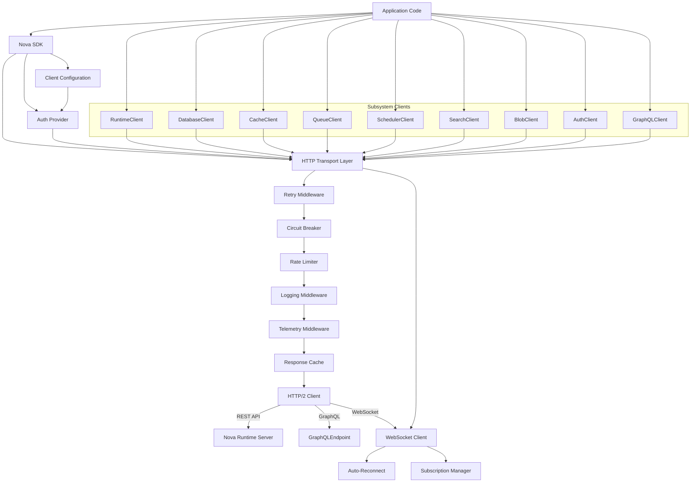
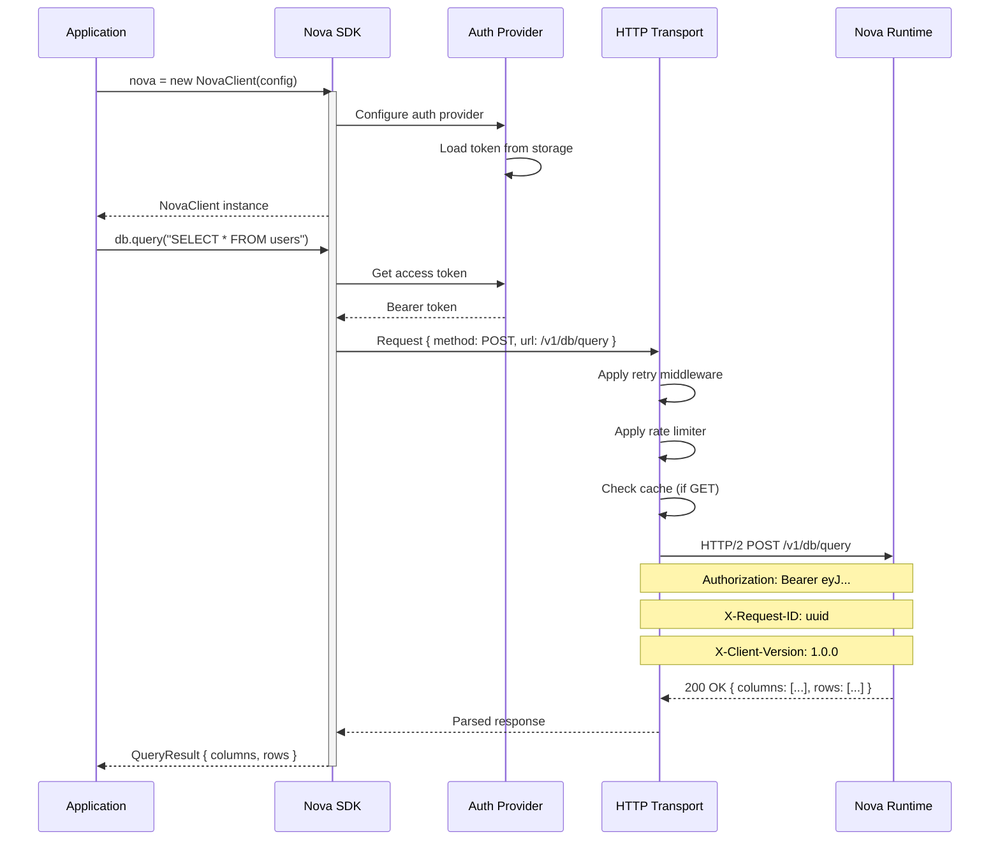
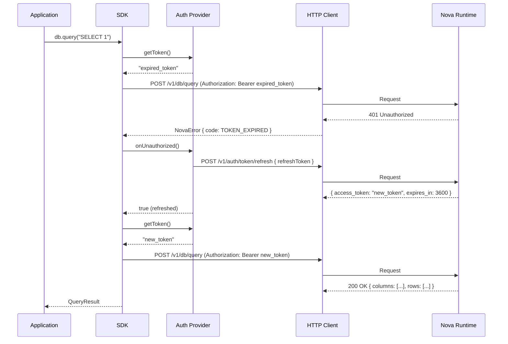
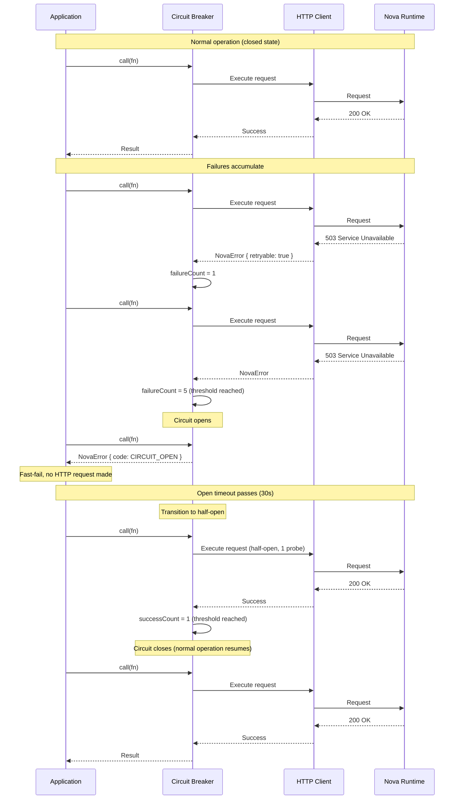
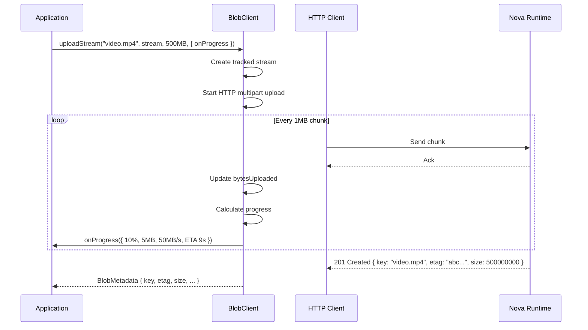

# 25. SDK (TypeScript)

## 1. Purpose

The Nova Runtime SDK provides a first-class TypeScript client library that abstracts the REST and GraphQL APIs into a typed, promise-based interface. It handles connection management, authentication, retry logic, pagination, streaming, error handling, and serialization so that application developers can interact with Nova Runtime subsystems using idiomatic TypeScript patterns without dealing with HTTP details.

## 2. Scope

The SDK covers all Nova Runtime subsystems with typed client interfaces:

- **RuntimeClient**: Server health, configuration, metrics, connection management
- **DatabaseClient**: SQL queries, prepared statements, schema operations, migrations
- **CacheClient**: Key-value operations, TTL management, batch operations, pub/sub
- **QueueClient**: Queue management, message production, consumption, DLQ
- **SchedulerClient**: Job CRUD, triggers, execution history
- **SearchClient**: Index management, document indexing, search queries, suggestions
- **BlobClient**: Upload, download, streaming, metadata, tier management
- **AuthClient**: Authentication, user management, API keys, roles
- **GraphQLClient**: Typed GraphQL queries and mutations with code generation

The SDK does NOT cover:
- Internal storage engine access (goes through Execution Engine via REST/GraphQL)
- OS-level operations (covered by CLI)
- Dashboard/UI components
- Infrastructure provisioning

## 3. Responsibilities

1. **API abstraction**: Provide typed interfaces for all REST and GraphQL API endpoints
2. **Authentication management**: Handle JWT token acquisition, refresh, and API key authentication
3. **Retry and resilience**: Implement exponential backoff, retry policies, circuit breakers
4. **Connection pooling**: HTTP/2 connection reuse, keep-alive management
5. **Pagination**: Transparent cursor-based pagination with async iterators
6. **Streaming**: WebSocket-based subscription support with reconnection
7. **Serialization**: Automatic JSON serialization/deserialization with type validation
8. **Error handling**: Structured error types with codes, details, and recovery hints
9. **Logging**: Configurable logging with correlation IDs
10. **Telemetry**: OpenTelemetry integration for distributed tracing
11. **Caching**: Response caching for idempotent GET/Query operations
12. **Code generation**: GraphQL type generation from schema for type-safe queries
13. **File upload**: Streaming multipart upload support for blob operations
14. **Rate limiting**: Client-side rate limit awareness with backoff

## 4. Non Responsibilities

- **Server-side logic**: The SDK does not implement business logic; it calls server APIs
- **Offline queue**: No built-in offline mutation queue (application concern)
- **Data validation**: Server-side validation is authoritative; client validation is best-effort
- **UI components**: No React/Vue/Angular components included
- **Database driver**: Not a direct database driver; always goes through Nova Runtime server

## 5. Architecture





### 5.1 Package Structure

```
@novaruntime/sdk/
├── src/
│   ├── index.ts                    # Public API exports
│   ├── client.ts                   # NovaClient main class
│   ├── config.ts                   # Client configuration types
│   ├── errors.ts                   # Error types and handling
│   ├── types.ts                    # Common types
│   │
│   ├── auth/
│   │   ├── auth-provider.ts        # AuthProvider interface
│   │   ├── token-auth.ts           # JWT token auth implementation
│   │   ├── api-key-auth.ts         # API key auth implementation
│   │   ├── refresh-auth.ts         # Auto-refresh token auth
│   │   └── storage.ts              # Token storage (memory, file, custom)
│   │
│   ├── transport/
│   │   ├── http-client.ts          # HTTP/2 client core
│   │   ├── websocket-client.ts     # WebSocket client with reconnection
│   │   ├── retry.ts                # Retry middleware
│   │   ├── circuit-breaker.ts      # Circuit breaker implementation
│   │   ├── rate-limiter.ts         # Client-side rate limiter
│   │   ├── cache.ts                # Response cache
│   │   ├── telemetry.ts            # OpenTelemetry integration
│   │   └── logging.ts              # Request/response logging
│   │
│   ├── clients/
│   │   ├── runtime-client.ts       # Runtime subsystem client
│   │   ├── database-client.ts      # Database subsystem client
│   │   ├── cache-client.ts         # Cache subsystem client
│   │   ├── queue-client.ts         # Queue subsystem client
│   │   ├── scheduler-client.ts     # Scheduler subsystem client
│   │   ├── search-client.ts        # Search subsystem client
│   │   ├── blob-client.ts          # Blob storage subsystem client
│   │   ├── auth-client.ts          # Authentication subsystem client
│   │   └── graphql-client.ts       # GraphQL client
│   │
│   ├── streaming/
│   │   ├── subscription.ts         # Subscription management
│   │   ├── event-emitter.ts        # Typed event emitter
│   │   └── backpressure.ts         # Backpressure handling
│   │
│   ├── pagination/
│   │   ├── paginator.ts            # Cursor-based pagination
│   │   └── async-iterable.ts       # Async iterator for pagination
│   │
│   ├── utils/
│   │   ├── serializer.ts           # JSON serialization
│   │   ├── validators.ts           # Input validation
│   │   ├── id-generator.ts         # Request ID generation
│   │   ├── backoff.ts              # Exponential backoff
│   │   └── streams.ts              # Stream utilities
│   │
│   └── generated/                  # Auto-generated GraphQL types
│       ├── schema.ts               # Generated TypeScript types
│       └── operations.ts           # Typed operation helpers
│
├── test/
│   ├── unit/                       # Unit tests
│   ├── integration/                # Integration tests
│   └── fixtures/                   # Test fixtures
│
├── examples/                       # Usage examples
├── package.json
├── tsconfig.json
├── jest.config.ts
├── rollup.config.ts                # Build configuration
└── README.md
```

### 5.2 Module Organization

```typescript
// src/index.ts - Main entry point

export { NovaClient, createClient } from './client';
export type { NovaClientConfig } from './config';
export type {
  // Common types
  QueryResult,
  ColumnInfo,
  PageInfo,
  Connection,
  Edge,
  Cursor,
  // Error types
  NovaError,
  ErrorCode,
  ErrorExtensions,
} from './types';

// Subsystem clients
export { RuntimeClient } from './clients/runtime-client';
export { DatabaseClient } from './clients/database-client';
export { CacheClient } from './clients/cache-client';
export { QueueClient } from './clients/queue-client';
export { SchedulerClient } from './clients/scheduler-client';
export { SearchClient } from './clients/search-client';
export { BlobClient } from './clients/blob-client';
export { AuthClient } from './clients/auth-client';
export { GraphQLClient } from './clients/graphql-client';

// Auth providers
export { TokenAuthProvider } from './auth/token-auth';
export { ApiKeyAuthProvider } from './auth/api-key-auth';
export { RefreshAuthProvider } from './auth/refresh-auth';
export type { AuthProvider, AuthState } from './auth/auth-provider';

// Utils
export { exponentialBackoff } from './utils/backoff';
export { generateId } from './utils/id-generator';
export type { RetryConfig, RetryPolicy } from './transport/retry';
```

## 6. Data Structures

### 6.1 Configuration Types

```typescript
// src/config.ts

export interface NovaClientConfig {
  /** Server connection settings */
  server: ServerConfig;

  /** Authentication configuration */
  auth: AuthConfig;

  /** HTTP transport settings */
  transport?: TransportConfig;

  /** Retry policy configuration */
  retry?: RetryConfig;

  /** Circuit breaker configuration */
  circuitBreaker?: CircuitBreakerConfig;

  /** Rate limiter configuration */
  rateLimiter?: RateLimiterConfig;

  /** Response cache configuration */
  cache?: CacheConfig;

  /** Logging configuration */
  logging?: LoggingConfig;

  /** Telemetry configuration */
  telemetry?: TelemetryConfig;

  /** Default request options */
  defaults?: RequestDefaults;
}

export interface ServerConfig {
  /** Server hostname (default: localhost) */
  host?: string;
  /** Server port (default: 8443) */
  port?: number;
  /** Protocol (default: https) */
  protocol?: 'http' | 'https';
  /** Base API path (default: /v1) */
  basePath?: string;
  /** Connection timeout in ms (default: 30000) */
  timeout?: number;
  /** TLS settings */
  tls?: TLSConfig;
}

export interface TLSConfig {
  /** CA certificate path or content */
  caCert?: string;
  /** Client certificate path or content */
  clientCert?: string;
  /** Client key path or content */
  clientKey?: string;
  /** Skip TLS verification (dev only, default: false) */
  insecure?: boolean;
  /** Server name override for TLS SNI */
  serverName?: string;
}

export type AuthConfig =
  | { type: 'token'; token: string }
  | { type: 'api-key'; apiKey: string; apiKeyName?: string }
  | { type: 'refresh'; clientId: string; clientSecret: string }
  | { type: 'provider'; provider: AuthProvider }
  | { type: 'none' };

export interface TransportConfig {
  /** Max concurrent connections (default: 4) */
  maxConcurrent?: number;
  /** Connection pool size (default: 4) */
  poolSize?: number;
  /** Keep-alive interval in ms (default: 30000) */
  keepAliveMs?: number;
  /** User agent string (default: @novaruntime/sdk/<version>) */
  userAgent?: string;
  /** Additional headers to include on every request */
  defaultHeaders?: Record<string, string>;
}

export interface RetryConfig {
  /** Max retry attempts (default: 3) */
  maxRetries?: number;
  /** Base delay in ms (default: 1000) */
  baseDelayMs?: number;
  /** Max delay in ms (default: 30000) */
  maxDelayMs?: number;
  /** Retry on status codes */
  retryableStatuses?: number[];
  /** Retry on error codes */
  retryableErrors?: ErrorCode[];
  /** Backoff strategy (default: exponential) */
  strategy?: 'exponential' | 'linear' | 'fixed';
  /** Jitter factor (default: 0.2, 0 = no jitter) */
  jitterFactor?: number;
}

export interface CircuitBreakerConfig {
  /** Failure threshold to open circuit (default: 5) */
  failureThreshold?: number;
  /** Success threshold to close circuit (default: 2) */
  successThreshold?: number;
  /** Open state timeout in ms (default: 30000) */
  openTimeoutMs?: number;
  /** Half-open max requests (default: 1) */
  halfOpenMaxRequests?: number;
}

export interface RateLimiterConfig {
  /** Max requests per second (default: 0 = disabled) */
  maxRequestsPerSecond?: number;
  /** Max burst (default: maxRequestsPerSecond * 2) */
  maxBurst?: number;
  /** Token bucket refill rate (default: maxRequestsPerSecond) */
  refillRate?: number;
  /** Whether to queue or reject when rate limited */
  strategy?: 'queue' | 'reject' | 'throttle';
}

export interface CacheConfig {
  /** Max cache entries (default: 500) */
  maxEntries?: number;
  /** Default TTL in ms (default: 60000) */
  defaultTtlMs?: number;
  /** Whether to cache GET/Query responses */
  enabled?: boolean;
  /** Cache key prefix */
  keyPrefix?: string;
}

export interface LoggingConfig {
  /** Log level (default: warn) */
  level?: 'trace' | 'debug' | 'info' | 'warn' | 'error';
  /** Custom logger implementation */
  logger?: Logger;
  /** Log request bodies (default: false) */
  logRequestBody?: boolean;
  /** Log response bodies (default: false) */
  logResponseBody?: boolean;
  /** Mask sensitive headers in logs */
  maskSensitiveHeaders?: boolean;
}

export interface TelemetryConfig {
  /** Enable OpenTelemetry (default: false) */
  enabled?: boolean;
  /** Service name for traces */
  serviceName?: string;
  /** OTLP exporter endpoint */
  exporterEndpoint?: string;
  /** Enable tracing (default: true) */
  tracing?: boolean;
  /** Enable metrics (default: true) */
  metrics?: boolean;
  /** Sampling rate (default: 1.0) */
  samplingRate?: number;
  /** Additional attributes to attach to spans */
  attributes?: Record<string, string>;
}

export interface RequestDefaults {
  /** Default timeout for all requests */
  timeoutMs?: number;
  /** Default request tags for telemetry */
  tags?: Record<string, string>;
  /** Default request priority */
  priority?: 'background' | 'normal' | 'high';
  /** Whether to wait for server-side commit acknowledgment */
  waitForCommit?: boolean;
}

export interface Logger {
  trace(message: string, meta?: Record<string, unknown>): void;
  debug(message: string, meta?: Record<string, unknown>): void;
  info(message: string, meta?: Record<string, unknown>): void;
  warn(message: string, meta?: Record<string, unknown>): void;
  error(message: string, meta?: Record<string, unknown>): void;
}
```

### 6.2 Common Types

```typescript
// src/types.ts

/** Generic paginated connection (Relay-style) */
export interface Connection<T, C = Cursor> {
  edges: Edge<T, C>[];
  pageInfo: PageInfo;
  totalCount: number;
}

export interface Edge<T, C = Cursor> {
  node: T;
  cursor: C;
}

export interface PageInfo {
  hasNextPage: boolean;
  hasPreviousPage: boolean;
  startCursor: Cursor | null;
  endCursor: Cursor | null;
}

export type Cursor = string;

/** Pagination input for list operations */
export interface PaginationInput {
  first?: number;
  after?: Cursor;
  last?: number;
  before?: Cursor;
}

/** Sorting input */
export interface SortInput {
  field: string;
  direction: 'ASC' | 'DESC';
}

/** Typed query result from database */
export interface QueryResult<T = Record<string, unknown>> {
  columns: ColumnInfo[];
  rows: T[];
  rowCount: number;
  executionTimeMs: number;
  warnings?: string[];
}

export interface ColumnInfo {
  name: string;
  dataType: string;
  nullable: boolean;
  primaryKey: boolean;
  defaultValue: unknown;
  comment?: string;
}

/** Database table information */
export interface TableInfo {
  name: string;
  schema: string;
  columns: ColumnInfo[];
  primaryKey: string[];
  indexes: IndexInfo[];
  rowCount: number;
  sizeBytes: number;
  createdAt: string;
  updatedAt: string;
}

export interface IndexInfo {
  name: string;
  columns: string[];
  unique: boolean;
  primary: boolean;
  indexType: 'BTREE' | 'HASH' | 'GIN' | 'GIANT' | 'FULLTEXT';
}

/** Health status response */
export interface HealthStatus {
  status: 'healthy' | 'degraded' | 'unhealthy';
  uptimeSeconds: number;
  version: string;
  subsystems: SubsystemHealth[];
  lastStartup: string;
}

export interface SubsystemHealth {
  name: string;
  status: 'healthy' | 'degraded' | 'unhealthy';
  latencyMs: number;
  lastError?: string;
  lastChecked: string;
}

/** Metrics snapshot */
export interface MetricsSnapshot {
  collectedAt: string;
  timeRange: { start: string; end: string };
  system: SystemMetrics;
  subsystems: SubsystemMetrics;
}

export interface SystemMetrics {
  cpuUsagePercent: number;
  memoryUsageBytes: number;
  memoryTotalBytes: number;
  diskUsageBytes: number;
  diskTotalBytes: number;
  networkBytesIn: number;
  networkBytesOut: number;
  openFileDescriptors: number;
  connections: number;
}

export interface SubsystemMetrics {
  database?: DatabaseMetrics;
  cache?: CacheMetrics;
  queue?: QueueMetrics;
  scheduler?: SchedulerMetrics;
  search?: SearchMetrics;
  blob?: BlobMetrics;
  graphql?: GraphQLMetrics;
}

export interface DatabaseMetrics {
  queriesTotal: number;
  queriesPerSecond: number;
  avgLatencyMs: number;
  p50LatencyMs: number;
  p95LatencyMs: number;
  p99LatencyMs: number;
  activeConnections: number;
  cacheHitRate: number;
}

export interface CacheMetrics {
  hits: number;
  misses: number;
  hitRate: number;
  entries: number;
  memoryUsedBytes: number;
  evictions: number;
}

export interface QueueMetrics {
  messagesSent: number;
  messagesReceived: number;
  messagesDeleted: number;
  messagesDeadLettered: number;
  queuesCount: number;
  totalMessages: number;
  avgLatencyMs: number;
}

export interface SchedulerMetrics {
  jobsExecuted: number;
  jobsFailed: number;
  activeJobs: number;
  avgExecutionTimeMs: number;
  successRate: number;
}

export interface SearchMetrics {
  queriesTotal: number;
  indexingTotal: number;
  avgQueryLatencyMs: number;
  indexesCount: number;
  documentsIndexed: number;
}

export interface BlobMetrics {
  uploadsTotal: number;
  downloadsTotal: number;
  totalBlobs: number;
  totalStorageBytes: number;
}

export interface GraphQLMetrics {
  queriesTotal: number;
  mutationsTotal: number;
  subscriptionsTotal: number;
  queriesRejected: number;
  avgResolutionTimeMs: number;
  activeSubscriptions: number;
}
```

### 6.3 Error Types

```typescript
// src/errors.ts

/** Base error class for all SDK errors */
export class NovaError extends Error {
  public readonly code: ErrorCode;
  public readonly httpStatus?: number;
  public readonly extensions?: ErrorExtensions;
  public readonly retryable: boolean;
  public readonly requestId?: string;

  constructor(params: NovaErrorParams) {
    super(params.message);
    this.name = 'NovaError';
    this.code = params.code;
    this.httpStatus = params.httpStatus;
    this.extensions = params.extensions;
    this.retryable = params.retryable ?? false;
    this.requestId = params.requestId;
  }

  /** Whether the operation can be safely retried */
  public isRetryable(): boolean {
    return this.retryable;
  }

  /** Get retry delay from server, if provided */
  public retryAfterMs(): number | undefined {
    return this.extensions?.retryAfterMs;
  }

  /** Human-readable error summary */
  public toSummary(): string {
    return `[${this.code}] ${this.message}${this.requestId ? ` (req: ${this.requestId})` : ''}`;
  }
}

export interface NovaErrorParams {
  code: ErrorCode;
  message: string;
  httpStatus?: number;
  extensions?: ErrorExtensions;
  requestId?: string;
}

export interface ErrorExtensions {
  subsystem?: string;
  retryAfterMs?: number;
  internalCode?: string;
  fields?: string[];
  details?: string[];
  suggestion?: string;
}

export type ErrorCode =
  // Validation errors
  | 'BAD_REQUEST'
  | 'VALIDATION_ERROR'
  | 'INVALID_SYNTAX'
  | 'INVALID_TYPE'
  | 'MISSING_FIELD'
  | 'INVALID_ARGUMENT'
  // Auth errors
  | 'UNAUTHENTICATED'
  | 'UNAUTHORIZED'
  | 'TOKEN_EXPIRED'
  | 'TOKEN_INVALID'
  | 'INSUFFICIENT_PERMISSIONS'
  // Resource errors
  | 'NOT_FOUND'
  | 'ALREADY_EXISTS'
  | 'CONFLICT'
  | 'RATE_LIMITED'
  | 'RESOURCE_EXHAUSTED'
  // Server errors
  | 'INTERNAL_ERROR'
  | 'SUBSYSTEM_UNAVAILABLE'
  | 'TIMEOUT'
  | 'GATEWAY_TIMEOUT'
  | 'SERVICE_UNAVAILABLE'
  // SDK errors
  | 'CONNECTION_ERROR'
  | 'CONNECTION_TIMEOUT'
  | 'DNS_ERROR'
  | 'TLS_ERROR'
  | 'CIRCUIT_OPEN'
  | 'MAX_RETRIES_EXCEEDED'
  | 'INVALID_CONFIG'
  | 'STREAM_ERROR'
  | 'CANCELLED';

/** Helper to create common errors */
export const Errors = {
  notFound: (message: string, meta?: Partial<NovaErrorParams>) =>
    new NovaError({ code: 'NOT_FOUND', message, httpStatus: 404, ...meta }),

  unauthorized: (message = 'Authentication required') =>
    new NovaError({ code: 'UNAUTHENTICATED', message, httpStatus: 401 }),

  tokenExpired: () =>
    new NovaError({ code: 'TOKEN_EXPIRED', message: 'Access token has expired', httpStatus: 401, retryable: true }),

  rateLimited: (retryAfterMs: number) =>
    new NovaError({
      code: 'RATE_LIMITED',
      message: 'Request rate limited',
      httpStatus: 429,
      retryable: true,
      extensions: { retryAfterMs },
    }),

  timeout: (message = 'Request timed out') =>
    new NovaError({ code: 'TIMEOUT', message, retryable: true }),

  connectionError: (cause: string) =>
    new NovaError({ code: 'CONNECTION_ERROR', message: `Connection error: ${cause}`, retryable: true }),

  circuitOpen: () =>
    new NovaError({ code: 'CIRCUIT_OPEN', message: 'Circuit breaker is open, request rejected' }),

  fromHttpStatus: (status: number, body: any, requestId?: string): NovaError => {
    const code = statusCodeMap[status] ?? 'INTERNAL_ERROR';
    const msg = body?.error?.message ?? body?.message ?? `HTTP ${status}`;
    return new NovaError({
      code,
      message: msg,
      httpStatus: status,
      extensions: body?.error?.extensions,
      requestId,
      retryable: status >= 500 || status === 429,
    });
  },
};

const statusCodeMap: Record<number, ErrorCode> = {
  400: 'BAD_REQUEST',
  401: 'UNAUTHENTICATED',
  403: 'INSUFFICIENT_PERMISSIONS',
  404: 'NOT_FOUND',
  409: 'CONFLICT',
  422: 'VALIDATION_ERROR',
  429: 'RATE_LIMITED',
  500: 'INTERNAL_ERROR',
  502: 'SUBSYSTEM_UNAVAILABLE',
  503: 'SERVICE_UNAVAILABLE',
  504: 'GATEWAY_TIMEOUT',
};
```

### 6.4 Auth Provider Types

```typescript
// src/auth/auth-provider.ts

/** Authentication provider interface */
export interface AuthProvider {
  /** Get the current access token */
  getToken(): Promise<string>;

  /** Called when a 401 response is received, allowing token refresh */
  onUnauthorized?(): Promise<boolean>;

  /** Cleanup on client shutdown */
  dispose?(): Promise<void>;
}

export interface AuthState {
  type: 'token' | 'api-key' | 'refresh';
  token: string;
  expiresAt?: Date;
  refreshToken?: string;
}

// src/auth/token-auth.ts
export class TokenAuthProvider implements AuthProvider {
  constructor(private token: string) {}

  async getToken(): Promise<string> {
    return this.token;
  }
}

// src/auth/api-key-auth.ts
export class ApiKeyAuthProvider implements AuthProvider {
  constructor(
    private apiKey: string,
    private keyName?: string
  ) {}

  async getToken(): Promise<string> {
    return this.apiKey;
  }

  getAuthHeader(): Record<string, string> {
    return { 'X-API-Key': this.apiKey };
  }
}

// src/auth/refresh-auth.ts
export class RefreshAuthProvider implements AuthProvider {
  private accessToken: string | null = null;
  private refreshToken: string;
  private expiresAt: number = 0;
  private refreshPromise: Promise<boolean> | null = null;

  constructor(
    private config: { clientId: string; clientSecret: string },
    private httpClient: HttpClient,
    refreshToken?: string
  ) {
    this.refreshToken = refreshToken ?? '';
  }

  async getToken(): Promise<string> {
    // If token is expired or about to expire (within 60s), refresh
    if (!this.accessToken || Date.now() >= this.expiresAt - 60000) {
      const refreshed = await this.performRefresh();
      if (!refreshed) {
        throw Errors.unauthorized('Unable to obtain access token');
      }
    }
    return this.accessToken!;
  }

  async onUnauthorized(): Promise<boolean> {
    return this.performRefresh();
  }

  private async performRefresh(): Promise<boolean> {
    if (this.refreshPromise) {
      return this.refreshPromise;
    }

    this.refreshPromise = this._doRefresh();
    try {
      return await this.refreshPromise;
    } finally {
      this.refreshPromise = null;
    }
  }

  private async _doRefresh(): Promise<boolean> {
    try {
      const response = await this.httpClient.request({
        method: 'POST',
        path: '/v1/auth/token',
        body: {
          grant_type: 'client_credentials',
          client_id: this.config.clientId,
          client_secret: this.config.clientSecret,
          refresh_token: this.refreshToken || undefined,
        },
      });
      this.accessToken = response.access_token;
      this.refreshToken = response.refresh_token ?? this.refreshToken;
      this.expiresAt = Date.now() + response.expires_in * 1000;
      return true;
    } catch {
      return false;
    }
  }
}
```

### 6.5 Transport Types

```typescript
// src/transport/http-client.ts

/** HTTP request definition */
export interface HttpRequest {
  method: 'GET' | 'POST' | 'PUT' | 'PATCH' | 'DELETE' | 'HEAD' | 'OPTIONS';
  path: string;
  query?: Record<string, string | number | boolean | string[] | undefined>;
  headers?: Record<string, string>;
  body?: unknown;
  responseType?: 'json' | 'text' | 'stream' | 'buffer';
  timeoutMs?: number;
  signal?: AbortSignal;
  priority?: 'background' | 'normal' | 'high';
  idempotencyKey?: string;
}

/** HTTP response definition */
export interface HttpResponse<T = unknown> {
  status: number;
  headers: Record<string, string>;
  data: T;
  requestId: string;
  durationMs: number;
}

/** HTTP client interface */
export interface HttpClient {
  request<T = unknown>(req: HttpRequest): Promise<HttpResponse<T>>;
  get<T = unknown>(path: string, options?: Partial<HttpRequest>): Promise<HttpResponse<T>>;
  post<T = unknown>(path: string, body?: unknown, options?: Partial<HttpRequest>): Promise<HttpResponse<T>>;
  put<T = unknown>(path: string, body?: unknown, options?: Partial<HttpRequest>): Promise<HttpResponse<T>>;
  patch<T = unknown>(path: string, body?: unknown, options?: Partial<HttpRequest>): Promise<HttpResponse<T>>;
  delete<T = unknown>(path: string, options?: Partial<HttpRequest>): Promise<HttpResponse<T>>;
}

// src/transport/retry.ts

export interface RetryPolicy {
  /** Whether the error should trigger a retry */
  shouldRetry(error: NovaError, attempt: number): boolean;
  /** Calculate delay before next retry */
  getDelay(error: NovaError, attempt: number): number;
}

export function createRetryPolicy(config: Required<RetryConfig>): RetryPolicy {
  return {
    shouldRetry(error: NovaError, attempt: number): boolean {
      if (attempt >= config.maxRetries) return false;
      if (!error.retryable) return false;
      if (error.httpStatus && !config.retryableStatuses.includes(error.httpStatus)) return false;
      if (config.retryableErrors.length > 0 && !config.retryableErrors.includes(error.code)) return false;
      return true;
    },

    getDelay(error: NovaError, attempt: number): number {
      const baseDelay = error.extensions?.retryAfterMs ?? config.baseDelayMs;
      let delay: number;
      switch (config.strategy) {
        case 'linear':
          delay = baseDelay * (attempt + 1);
          break;
        case 'fixed':
          delay = baseDelay;
          break;
        case 'exponential':
        default:
          delay = baseDelay * Math.pow(2, attempt);
          break;
      }
      delay = Math.min(delay, config.maxDelayMs);
      // Apply jitter: random ± jitterFactor
      const jitter = delay * config.jitterFactor * (Math.random() * 2 - 1);
      return Math.max(0, delay + jitter);
    },
  };
}
```

### 6.6 Pagination Types

```typescript
// src/pagination/paginator.ts

/** Async iterator for paginated results */
export class Paginator<T, F = PaginationInput> implements AsyncIterable<T> {
  private currentCursor: Cursor | null = null;
  private hasMore: boolean = true;
  private pageSize: number;
  private fetchedCount: number = 0;

  constructor(
    private fetchPage: (input: F) => Promise<Connection<T>>,
    private buildInput: (cursor: Cursor | null, pageSize: number) => F,
    options?: { pageSize?: number }
  ) {
    this.pageSize = options?.pageSize ?? 25;
  }

  async *[Symbol.asyncIterator](): AsyncIterator<T> {
    while (this.hasMore) {
      const input = this.buildInput(this.currentCursor, this.pageSize);
      const page = await this.fetchPage(input);

      for (const edge of page.edges) {
        yield edge.node;
        this.fetchedCount++;
      }

      this.hasMore = page.pageInfo.hasNextPage;
      this.currentCursor = page.pageInfo.endCursor;
    }
  }

  /** Get total count without iterating (if available) */
  async getTotalCount(): Promise<number> {
    if (this.fetchedCount === 0) {
      const input = this.buildInput(null, 1);
      const page = await this.fetchPage(input);
      return page.totalCount;
    }
    // Approximate from fetched data
    return this.fetchedCount;
  }

  /** Collect all results into an array */
  async toArray(): Promise<T[]> {
    const items: T[] = [];
    for await (const item of this) {
      items.push(item);
    }
    return items;
  }
}

/** Auto-pagination helper that fetches all pages */
export async function paginateAll<T, F = PaginationInput>(
  fetchPage: (input: F) => Promise<Connection<T>>,
  buildInput: (cursor: Cursor | null, pageSize: number) => F,
  options?: { pageSize?: number }
): Promise<T[]> {
  const paginator = new Paginator(fetchPage, buildInput, options);
  return paginator.toArray();
}
```

### 6.7 Blob Types

```typescript
// src/clients/blob-client.ts

export interface BlobMetadata {
  key: string;
  sizeBytes: number;
  contentType: string;
  contentEncoding?: string;
  etag: string;
  md5: string;
  sha256: string;
  storageTier: StorageTier;
  createdAt: string;
  updatedAt: string;
  expiresAt?: string;
  metadata?: BlobUserMetadata;
  url: string;
}

export interface BlobUserMetadata {
  filename?: string;
  description?: string;
  tags?: string[];
  custom?: Record<string, unknown>;
}

export type StorageTier = 'HOT' | 'WARM' | 'COLD';

export interface BlobUploadInput {
  key: string;
  content: Buffer | ReadStream | Blob | string;
  contentType?: string;
  contentEncoding?: string;
  storageTier?: StorageTier;
  expiresAt?: Date;
  metadata?: BlobUserMetadata;
  overwrite?: boolean;
  /** Progress callback */
  onProgress?: (progress: UploadProgress) => void;
}

export interface UploadProgress {
  bytesUploaded: number;
  totalBytes: number;
  percentage: number;
  speedBytesPerSecond: number;
  etaMs: number;
}

export interface BlobDownloadOptions {
  outputPath?: string;
  startByte?: number;
  endByte?: number;
  onProgress?: (progress: DownloadProgress) => void;
  signal?: AbortSignal;
}

export interface DownloadProgress {
  bytesDownloaded: number;
  totalBytes: number;
  percentage: number;
  speedBytesPerSecond: number;
}

export interface BlobFilter {
  contentType?: string;
  storageTier?: StorageTier;
  minSizeBytes?: number;
  maxSizeBytes?: number;
  createdAfter?: Date;
  createdBefore?: Date;
  tags?: string[];
}

export interface BlobListEntry {
  key: string;
  sizeBytes: number;
  contentType: string;
  storageTier: StorageTier;
  createdAt: string;
  etag: string;
  isPrefix: boolean;  // true for directory-like prefixes
}
```

### 6.8 Queue Types

```typescript
// src/clients/queue-client.ts

export interface Queue {
  name: string;
  description?: string;
  createdAt: string;
  updatedAt: string;
  messageCount: number;
  messagesSent: number;
  messagesReceived: number;
  messagesDeleted: number;
  messagesDeadLettered: number;
  oldestMessageAgeMs: number;
  config: QueueConfig;
}

export interface QueueConfig {
  visibilityTimeoutMs: number;
  maxMessageSizeBytes: number;
  messageRetentionMs: number;
  deadLetterMaxReceives: number;
  deadLetterQueue: boolean;
  deliveryDelayMs: number;
}

export interface QueueMessage<T = unknown> {
  id: string;
  body: T;
  contentType: string;
  sentAt: string;
  firstReceivedAt?: string;
  receiveCount: number;
  visibilityTimeoutExpiresAt?: string;
  delayUntil?: string;
  attributes: MessageAttributes;
}

export interface MessageAttributes {
  priority: 'LOW' | 'NORMAL' | 'HIGH' | 'CRITICAL';
  deduplicationId?: string;
  groupId?: string;
  sender?: string;
  custom?: Record<string, unknown>;
}

export interface QueueSendInput<T = unknown> {
  body: T;
  contentType?: string;
  delayMs?: number;
  priority?: 'LOW' | 'NORMAL' | 'HIGH' | 'CRITICAL';
  deduplicationId?: string;
  groupId?: string;
  attributes?: Record<string, unknown>;
}

export interface QueueCreateInput {
  name: string;
  description?: string;
  visibilityTimeoutMs?: number;
  maxMessageSizeBytes?: number;
  messageRetentionMs?: number;
  deadLetterMaxReceives?: number;
  enableDeadLetterQueue?: boolean;
  deliveryDelayMs?: number;
}

export interface DeadLetterMessage<T = unknown> {
  id: string;
  originalMessage: QueueMessage<T>;
  deadLetteredAt: string;
  reason: string;
  receiveCount: number;
  originalQueue: string;
}

export interface QueueStats {
  totalQueues: number;
  totalMessages: number;
  totalMessagesSent: number;
  totalMessagesReceived: number;
  totalMessagesDeadLettered: number;
  avgQueueDepth: number;
  avgProcessingTimeMs: number;
}
```

### 6.9 Scheduler Types

```typescript
// src/clients/scheduler-client.ts

export interface Job {
  id: string;
  name: string;
  description?: string;
  type: 'CRON' | 'SCHEDULED_ONCE' | 'EVENT_DRIVEN';
  state: 'ACTIVE' | 'PAUSED' | 'COMPLETED' | 'FAILED' | 'CANCELLED';
  schedule?: CronExpression;
  maxRetries: number;
  retryCount: number;
  timeoutMs: number;
  createdAt: string;
  updatedAt: string;
  lastExecutedAt?: string;
  lastError?: string;
  nextExecutionAt?: string;
  tags?: string[];
  input?: unknown;
  metadata: JobMetadata;
}

export interface CronExpression {
  expression: string;
  description: string;
  timezone: string;
  nextFireTimes: string[];
}

export interface JobMetadata {
  totalExecutions: number;
  successfulExecutions: number;
  failedExecutions: number;
  avgDurationMs: number;
  lastExecutionId?: string;
}

export interface JobExecution {
  id: string;
  jobId: string;
  jobName: string;
  status: ExecutionStatus;
  startedAt: string;
  completedAt?: string;
  durationMs: number;
  retryAttempt: number;
  trigger: ExecutionTrigger;
  input?: unknown;
  output?: unknown;
  error?: ExecutionError;
  logs?: ExecutionLogEntry[];
}

export type ExecutionStatus =
  | 'PENDING' | 'RUNNING' | 'SUCCESS' | 'FAILED'
  | 'SKIPPED' | 'TIMEOUT' | 'CANCELLED';

export type ExecutionTrigger = 'SCHEDULED' | 'MANUAL' | 'EVENT' | 'RETRY';

export interface ExecutionError {
  message: string;
  code: string;
  stackTrace?: string;
  subsystem?: string;
}

export interface ExecutionLogEntry {
  timestamp: string;
  level: string;
  message: string;
  metadata?: Record<string, unknown>;
}

export interface CreateJobInput {
  name: string;
  description?: string;
  type: 'CRON' | 'SCHEDULED_ONCE' | 'EVENT_DRIVEN';
  schedule?: string;
  maxRetries?: number;
  timeoutMs?: number;
  tags?: string[];
  input?: unknown;
  startAt?: Date;
}

export interface UpdateJobInput {
  name?: string;
  description?: string;
  schedule?: string;
  maxRetries?: number;
  timeoutMs?: number;
  tags?: string[];
  input?: unknown;
  state?: 'ACTIVE' | 'PAUSED' | 'CANCELLED';
}

export interface SchedulerStats {
  totalJobs: number;
  activeJobs: number;
  pausedJobs: number;
  failedJobs: number;
  completedJobs: number;
  executionsTotal: number;
  executionsToday: number;
  avgExecutionTimeMs: number;
  p95ExecutionTimeMs: number;
  successRate: number;
  triggersFiredTotal: number;
}
```

### 6.10 Search Types

```typescript
// src/clients/search-client.ts

export interface SearchIndex {
  name: string;
  documentCount: number;
  sizeBytes: number;
  fieldCount: number;
  analyzer: string;
  createdAt: string;
  updatedAt: string;
  fields: IndexField[];
}

export interface IndexField {
  name: string;
  type: 'TEXT' | 'KEYWORD' | 'INTEGER' | 'FLOAT' | 'BOOLEAN' | 'DATE' | 'OBJECT' | 'ARRAY';
  searchable: boolean;
  sortable: boolean;
  facetable: boolean;
  stored: boolean;
  analyzer?: string;
  boost: number;
}

export interface SearchResult<T = Record<string, unknown>> {
  id: string;
  index: string;
  document: T;
  score: number;
  highlight?: HighlightResult;
}

export interface HighlightResult {
  fragments: string[];
  field: string;
}

export interface SearchOptions {
  filters?: SearchFilter[];
  sort?: SearchSort;
  fields?: string[];
  highlight?: string[];
  minScore?: number;
  explain?: boolean;
  analyzer?: string;
}

export interface SearchFilter {
  field: string;
  operator: FilterOperator;
  value: unknown;
}

export type FilterOperator =
  | 'EQ' | 'NEQ' | 'GT' | 'GTE' | 'LT' | 'LTE'
  | 'IN' | 'NOT_IN' | 'EXISTS' | 'NOT_EXISTS'
  | 'RANGE' | 'PREFIX' | 'WILDCARD' | 'REGEX';

export interface SearchSort {
  field: string;
  direction: 'ASC' | 'DESC';
}

export interface SearchAggregations {
  terms?: TermAggregation[];
  ranges?: RangeAggregation[];
  dateHistogram?: DateHistogramBucket[];
}

export interface TermAggregation {
  field: string;
  buckets: TermBucket[];
}

export interface TermBucket {
  key: string;
  docCount: number;
}

export interface RangeAggregation {
  field: string;
  buckets: RangeBucket[];
}

export interface RangeBucket {
  from?: number;
  to?: number;
  docCount: number;
}

export interface DateHistogramBucket {
  key: string;
  docCount: number;
}

export interface SearchStats {
  totalIndexes: number;
  totalDocuments: number;
  totalSizeBytes: number;
  avgIndexTimeMs: number;
  avgQueryTimeMs: number;
  p95QueryTimeMs: number;
  queriesTotal: number;
  indexingTotal: number;
}

export interface Suggestion {
  text: string;
  score: number;
  frequency: number;
}

export interface CreateIndexInput {
  name: string;
  fields: IndexFieldInput[];
  analyzer?: string;
}

export interface IndexFieldInput {
  name: string;
  type: IndexFieldType;
  searchable?: boolean;
  sortable?: boolean;
  facetable?: boolean;
  stored?: boolean;
  analyzer?: string;
  boost?: number;
}

export type IndexFieldType =
  | 'TEXT' | 'KEYWORD' | 'INTEGER' | 'FLOAT'
  | 'BOOLEAN' | 'DATE' | 'OBJECT' | 'ARRAY';
```

## 7. Algorithms

### 7.1 Token Bucket Rate Limiter

```typescript
// src/transport/rate-limiter.ts

export class TokenBucketRateLimiter {
  private tokens: number;
  private lastRefill: number;
  private readonly maxTokens: number;
  private readonly refillRate: number; // tokens per second
  private readonly queue: Array<{
    resolve: () => void;
    reject: (err: NovaError) => void;
  }> = [];
  private readonly strategy: 'queue' | 'reject' | 'throttle';

  constructor(config: Required<RateLimiterConfig>) {
    this.maxTokens = config.maxBurst;
    this.tokens = config.maxBurst;
    this.refillRate = config.refillRate;
    this.lastRefill = Date.now();
    this.strategy = config.strategy;
  }

  async acquire(cost: number = 1): Promise<void> {
    this.refill();

    if (this.tokens >= cost) {
      this.tokens -= cost;
      return;
    }

    switch (this.strategy) {
      case 'reject':
        throw Errors.rateLimited(this.getWaitTimeMs(cost));
      case 'throttle':
        // Wait until tokens are available
        const waitMs = this.getWaitTimeMs(cost);
        await this.delay(waitMs);
        this.tokens -= cost;
        return;
      case 'queue':
        // Queue the request
        return new Promise<void>((resolve, reject) => {
          this.queue.push({ resolve, reject });
          this.processQueue();
        });
    }
  }

  private refill(): void {
    const now = Date.now();
    const elapsed = (now - this.lastRefill) / 1000;
    const newTokens = elapsed * this.refillRate;
    this.tokens = Math.min(this.maxTokens, this.tokens + newTokens);
    this.lastRefill = now;
  }

  private getWaitTimeMs(cost: number): number {
    const deficit = cost - this.tokens;
    return (deficit / this.refillRate) * 1000;
  }

  private processQueue(): void {
    if (this.queue.length === 0) return;

    this.refill();
    while (this.queue.length > 0 && this.tokens >= 1) {
      const item = this.queue.shift()!;
      this.tokens -= 1;
      item.resolve();
    }
  }

  private delay(ms: number): Promise<void> {
    return new Promise(resolve => setTimeout(resolve, ms));
  }
}
```

### 7.2 Circuit Breaker

```typescript
// src/transport/circuit-breaker.ts

type CircuitState = 'closed' | 'open' | 'half-open';

export class CircuitBreaker {
  private state: CircuitState = 'closed';
  private failureCount: number = 0;
  private successCount: number = 0;
  private lastFailureTime: number = 0;
  private readonly failureThreshold: number;
  private readonly successThreshold: number;
  private readonly openTimeoutMs: number;
  private readonly halfOpenMaxRequests: number;
  private halfOpenRequests: number = 0;
  private readonly lock = new Mutex();

  constructor(config: Required<CircuitBreakerConfig>) {
    this.failureThreshold = config.failureThreshold;
    this.successThreshold = config.successThreshold;
    this.openTimeoutMs = config.openTimeoutMs;
    this.halfOpenMaxRequests = config.halfOpenMaxRequests;
  }

  async call<T>(fn: () => Promise<T>): Promise<T> {
    await this.checkState();

    try {
      const result = await fn();
      await this.onSuccess();
      return result;
    } catch (error) {
      await this.onFailure(error as Error);
      throw error;
    }
  }

  private async checkState(): Promise<void> {
    if (this.state === 'open') {
      const elapsed = Date.now() - this.lastFailureTime;
      if (elapsed >= this.openTimeoutMs) {
        await this.transitionTo('half-open');
      } else {
        throw Errors.circuitOpen();
      }
    }

    if (this.state === 'half-open') {
      if (this.halfOpenRequests >= this.halfOpenMaxRequests) {
        throw Errors.circuitOpen();
      }
      this.halfOpenRequests++;
    }
  }

  private async onSuccess(): Promise<void> {
    await this.lock.acquire();
    try {
      this.failureCount = 0;
      if (this.state === 'half-open') {
        this.successCount++;
        if (this.successCount >= this.successThreshold) {
          await this.transitionTo('closed');
        }
      }
    } finally {
      this.lock.release();
    }
  }

  private async onFailure(error: Error): Promise<void> {
    if (!(error instanceof NovaError) || !error.retryable) return;

    await this.lock.acquire();
    try {
      this.failureCount++;
      this.lastFailureTime = Date.now();
      if (this.state === 'closed' && this.failureCount >= this.failureThreshold) {
        await this.transitionTo('open');
      }
      if (this.state === 'half-open') {
        await this.transitionTo('open');
      }
    } finally {
      this.lock.release();
    }
  }

  private async transitionTo(newState: CircuitState): Promise<void> {
    this.state = newState;
    if (newState === 'closed') {
      this.failureCount = 0;
      this.successCount = 0;
    }
    if (newState === 'half-open') {
      this.halfOpenRequests = 0;
      this.successCount = 0;
    }
  }
}
```

### 7.3 Exponential Backoff

```typescript
// src/utils/backoff.ts

export interface BackoffOptions {
  baseDelayMs: number;
  maxDelayMs: number;
  multiplier?: number;
  jitterFactor?: number;
}

export function exponentialBackoff(
  attempt: number,
  options: BackoffOptions
): number {
  const {
    baseDelayMs,
    maxDelayMs,
    multiplier = 2,
    jitterFactor = 0.2,
  } = options;

  // Calculate delay: base * multiplier ^ attempt
  let delay = baseDelayMs * Math.pow(multiplier, attempt);
  delay = Math.min(delay, maxDelayMs);

  // Apply jitter: random ± jitterFactor
  if (jitterFactor > 0) {
    const jitter = delay * jitterFactor * (Math.random() * 2 - 1);
    delay = Math.max(0, delay + jitter);
  }

  return Math.round(delay);
}
```

### 7.4 Subscription Reconnection

```typescript
// src/streaming/subscription.ts

export interface SubscriptionOptions<T = unknown> {
  query: string;
  variables?: Record<string, unknown>;
  onNext: (data: T) => void;
  onError?: (error: NovaError) => void;
  onComplete?: () => void;
  reconnect?: boolean;
  maxReconnectAttempts?: number;
  reconnectDelayMs?: number;
}

export class Subscription<T = unknown> {
  private ws: WebSocket | null = null;
  private reconnectAttempts: number = 0;
  private isDisposed: boolean = false;
  private readonly config: SubscriptionOptions<T>;
  private readonly url: string;
  private readonly authProvider: AuthProvider;

  constructor(
    url: string,
    authProvider: AuthProvider,
    config: SubscriptionOptions<T>
  ) {
    this.url = url;
    this.authProvider = authProvider;
    this.config = {
      reconnect: true,
      maxReconnectAttempts: 10,
      reconnectDelayMs: 1000,
      ...config,
    };
  }

  async connect(): Promise<void> {
    const token = await this.authProvider.getToken();
    const wsUrl = new URL(this.url);
    wsUrl.searchParams.set('token', token);
    wsUrl.searchParams.set('protocol', 'graphql-transport-ws');

    this.ws = new WebSocket(wsUrl.toString());

    this.ws.onopen = () => {
      this.reconnectAttempts = 0;
      this.sendMessage({ type: 'connection_init' });
      this.sendMessage({
        type: 'subscribe',
        id: this.generateId(),
        payload: {
          query: this.config.query,
          variables: this.config.variables,
        },
      });
    };

    this.ws.onmessage = (event) => {
      const message = JSON.parse(event.data);
      this.handleMessage(message);
    };

    this.ws.onclose = (event) => {
      if (!this.isDisposed) {
        this.handleDisconnect(event);
      }
    };

    this.ws.onerror = (error) => {
      this.config.onError?.(
        new NovaError({
          code: 'CONNECTION_ERROR',
          message: 'WebSocket error',
        })
      );
    };
  }

  private handleMessage(message: GraphQLWSMessage): void {
    switch (message.type) {
      case 'connection_ack':
        // Connection established successfully
        break;
      case 'next':
        this.config.onNext(message.payload.data as T);
        break;
      case 'error':
        this.config.onError?.(
          new NovaError({
            code: 'STREAM_ERROR',
            message: message.payload?.errors?.[0]?.message ?? 'Subscription error',
            extensions: message.payload?.errors?.[0]?.extensions,
          })
        );
        break;
      case 'complete':
        this.config.onComplete?.();
        break;
    }
  }

  private handleDisconnect(event: CloseEvent): void {
    if (!this.config.reconnect || this.isDisposed) return;

    if (this.reconnectAttempts >= (this.config.maxReconnectAttempts ?? 10)) {
      this.config.onError?.(
        new NovaError({
          code: 'MAX_RETRIES_EXCEEDED',
          message: 'Max reconnection attempts exceeded',
        })
      );
      return;
    }

    const delay = exponentialBackoff(this.reconnectAttempts, {
      baseDelayMs: this.config.reconnectDelayMs ?? 1000,
      maxDelayMs: 30000,
    });

    this.reconnectAttempts++;
    setTimeout(() => this.connect(), delay);
  }

  async unsubscribe(): Promise<void> {
    this.isDisposed = true;
    if (this.ws?.readyState === WebSocket.OPEN) {
      this.sendMessage({ type: 'complete', id: this.currentId });
      this.ws.close(1000, 'Client unsubscribe');
    }
    this.ws = null;
  }

  private sendMessage(msg: GraphQLWSMessage): void {
    if (this.ws?.readyState === WebSocket.OPEN) {
      this.ws.send(JSON.stringify(msg));
    }
  }

  private currentId: string = '1';
  private generateId(): string {
    return (parseInt(this.currentId) + 1).toString();
  }
}

interface GraphQLWSMessage {
  type: string;
  id?: string;
  payload?: any;
}
```

### 7.5 Retry Middleware

```
Algorithm: RetryMiddleware
Input: request: HttpRequest, retryPolicy: RetryPolicy
Output: HttpResponse

1. attempt = 0
2. Loop:
   a. try:
      response = await httpClient.send(request)
      return response
   b. catch (error):
      if error is NovaError:
        if retryPolicy.shouldRetry(error, attempt):
          delay = retryPolicy.getDelay(error, attempt)
          log.warn("Request failed, retrying in {delay}ms (attempt {attempt+1}/{maxRetries})")
          await sleep(delay)
          attempt++
          continue
        throw error
      throw error
   c. catch (non-NovaError):
      // Network errors, TLS errors, etc.
      error = Errors.connectionError(String(originalError))
      if retryPolicy.shouldRetry(error, attempt):
        delay = retryPolicy.getDelay(error, attempt)
        await sleep(delay)
        attempt++
        continue
      throw error
```

### 7.6 Response Cache

```
Algorithm: ResponseCache
Input: request: HttpRequest, response: HttpResponse, cache: CacheConfig
Output: HttpResponse (possibly from cache)

1. Determine cacheability:
   - Only cache GET, Query operations
   - Only cache 2xx responses
   - Skip cache if request has Cache-Control: no-cache
   - Skip cache if response has Cache-Control: no-store

2. Generate cache key:
   - key = SHA256(method + path + sorted(query) + body)
   - Prefix with cache.keyPrefix if set

3. Read-through:
   a. Check cache for key
   b. If found AND not expired:
      - Increment hit counter
      - Return cached response
   c. If not found or expired:
      - Execute actual request
      - If cacheable, store in cache with TTL
        - TTL = min(response.Cache-Control.max-age, cache.defaultTtlMs)
        - Store only if size < 1MB
        - Evict oldest entry if maxEntries reached
      - Return response

4. Cache invalidation:
   - Mutation operations invalidate related cache entries
   - Exact path match: invalidate /db/query?sql=...
   - Prefix match: invalidate /db/* (if mutation targets db subsystem)
   - Manual: cache.clear() / cache.invalidate(key)
```

### 7.7 Blob Upload with Multipart Streaming

```
Algorithm: BlobUploadStream
Input: key: string, content: Readable, options: BlobUploadInput
Output: BlobMetadata

1. Determine file size from stat() or content-length
2. Start progress tracking:
   - bytesUploaded = 0
   - startTime = now()
3. Create multipart upload request:
   - Content-Type: multipart/form-data; boundary=xxxx
   - Parts:
     Part 1: metadata (JSON)
       { key, contentType, storageTier, expiresAt, ... }
     Part 2: file content
       Content-Type: <contentType>
       Content-Transfer-Encoding: binary

4. Stream content in chunks (1MB per chunk):
   For each chunk:
     a. Stream chunk to HTTP request body
     b. Track bytesUploaded += chunk.length
     c. If onProgress callback:
        - elapsed = now() - startTime
        - speed = bytesUploaded / elapsed
        - percentage = (bytesUploaded / totalBytes) * 100
        - eta = (totalBytes - bytesUploaded) / speed
        - Call onProgress({ bytesUploaded, totalBytes, percentage, speed, eta })

5. Read response:
   - 201 Created: return parsed BlobMetadata
   - 413 Payload Too Large: throw Errors with code RESOURCE_EXHAUSTED
   - Other error: throw Errors.fromHttpStatus(...)
```

## 8. Interfaces

### 8.1 NovaClient (Main Entry Point)

```typescript
// src/client.ts

export class NovaClient {
  public readonly runtime: RuntimeClient;
  public readonly db: DatabaseClient;
  public readonly cache: CacheClient;
  public readonly queue: QueueClient;
  public readonly scheduler: SchedulerClient;
  public readonly search: SearchClient;
  public readonly blob: BlobClient;
  public readonly auth: AuthClient;
  public readonly graphql: GraphQLClient;

  private readonly config: Required<NovaClientConfig>;
  private readonly httpClient: HttpClient;
  private readonly authProvider: AuthProvider;
  private readonly circuitBreaker: CircuitBreaker;
  private readonly rateLimiter: TokenBucketRateLimiter;

  constructor(config: NovaClientConfig) {
    this.config = this.resolveConfig(config);
    this.authProvider = this.createAuthProvider();
    this.rateLimiter = new TokenBucketRateLimiter(this.config.rateLimiter);
    this.circuitBreaker = new CircuitBreaker(this.config.circuitBreaker);
    this.httpClient = new HttpClientImpl(this.config, this.authProvider);

    this.runtime = new RuntimeClient(this.httpClient, this.config);
    this.db = new DatabaseClient(this.httpClient, this.config);
    this.cache = new CacheClient(this.httpClient, this.config);
    this.queue = new QueueClient(this.httpClient, this.config);
    this.scheduler = new SchedulerClient(this.httpClient, this.config);
    this.search = new SearchClient(this.httpClient, this.config);
    this.blob = new BlobClient(this.httpClient, this.config);
    this.auth = new AuthClient(this.httpClient, this.config);
    this.graphql = new GraphQLClient(this.httpClient, this.config, this.authProvider);
  }

  /** Health check */
  async health(): Promise<HealthStatus> {
    return this.runtime.health();
  }

  /** Dispose the client, closing all connections */
  async dispose(): Promise<void> {
    await this.httpClient.dispose();
    await this.authProvider.dispose?.();
  }

  private resolveConfig(config: NovaClientConfig): Required<NovaClientConfig> {
    // Merge with defaults
    return deepMerge(DEFAULT_CONFIG, config) as Required<NovaClientConfig>;
  }

  private createAuthProvider(): AuthProvider {
    switch (this.config.auth.type) {
      case 'token': return new TokenAuthProvider(this.config.auth.token);
      case 'api-key': return new ApiKeyAuthProvider(this.config.auth.apiKey, this.config.auth.apiKeyName);
      case 'refresh': return new RefreshAuthProvider(
        { clientId: this.config.auth.clientId, clientSecret: this.config.auth.clientSecret },
        this.httpClient
      );
      case 'provider': return this.config.auth.provider;
      case 'none': return new TokenAuthProvider('');
    }
  }
}

const DEFAULT_CONFIG: Required<NovaClientConfig> = {
  server: { host: 'localhost', port: 8443, protocol: 'https', basePath: '/v1', timeout: 30000 },
  auth: { type: 'none' },
  transport: { maxConcurrent: 4, poolSize: 4, keepAliveMs: 30000, userAgent: '@novaruntime/sdk' },
  retry: { maxRetries: 3, baseDelayMs: 1000, maxDelayMs: 30000, retryableStatuses: [429, 500, 502, 503, 504], retryableErrors: [], strategy: 'exponential', jitterFactor: 0.2 },
  circuitBreaker: { failureThreshold: 5, successThreshold: 2, openTimeoutMs: 30000, halfOpenMaxRequests: 1 },
  rateLimiter: { maxRequestsPerSecond: 0, maxBurst: 0, refillRate: 0, strategy: 'queue' },
  cache: { maxEntries: 500, defaultTtlMs: 60000, enabled: true, keyPrefix: 'sdk:' },
  logging: { level: 'warn', logRequestBody: false, logResponseBody: false, maskSensitiveHeaders: true },
  telemetry: { enabled: false, serviceName: 'nova-client', tracing: true, metrics: true, samplingRate: 1.0 },
  defaults: { timeoutMs: 30000, priority: 'normal', waitForCommit: true },
};

/** Factory function for simpler creation */
export function createClient(config: NovaClientConfig): NovaClient {
  return new NovaClient(config);
}
```

### 8.2 RuntimeClient

```typescript
// src/clients/runtime-client.ts

export class RuntimeClient {
  constructor(
    private http: HttpClient,
    private config: Required<NovaClientConfig>
  ) {}

  /** Check server health */
  async health(): Promise<HealthStatus> {
    const response = await this.http.get<HealthStatus>('/runtime/health');
    return response.data;
  }

  /** Get server configuration */
  async getConfig(key?: string, subsystem?: string): Promise<Record<string, unknown>> {
    const response = await this.http.get<Record<string, unknown>>('/runtime/config', {
      query: { key, subsystem },
    });
    return response.data;
  }

  /** Update server configuration */
  async updateConfig(key: string, value: unknown): Promise<Record<string, unknown>> {
    const response = await this.http.post<Record<string, unknown>>('/runtime/config', {
      key, value,
    });
    return response.data;
  }

  /** Get metrics snapshot */
  async getMetrics(options?: {
    since?: Date;
    resolution?: '1s' | '1m' | '5m' | '15m' | '1h';
  }): Promise<MetricsSnapshot> {
    const response = await this.http.get<MetricsSnapshot>('/runtime/metrics', {
      query: {
        since: options?.since?.toISOString(),
        resolution: options?.resolution,
      },
    });
    return response.data;
  }

  /** Get server version */
  async getVersion(): Promise<{ version: string; buildCommit: string; buildDate: string }> {
    const response = await this.http.get<{ version: string; buildCommit: string; buildDate: string }>(
      '/runtime/version'
    );
    return response.data;
  }

  /** List active connections */
  async listConnections(options?: {
    subsystem?: string;
    status?: string;
    pagination?: PaginationInput;
  }): Promise<Connection<ConnectionInfo>> {
    const response = await this.http.get<Connection<ConnectionInfo>>('/runtime/connections', {
      query: {
        subsystem: options?.subsystem,
        status: options?.status,
        ...options?.pagination,
      },
    });
    return response.data;
  }
}

export interface ConnectionInfo {
  id: string;
  principalId?: string;
  protocol: string;
  connectedAt: string;
  lastActivity: string;
  remoteAddress: string;
  subsystem: string;
  status: string;
}
```

### 8.3 DatabaseClient

```typescript
// src/clients/database-client.ts

export class DatabaseClient {
  constructor(
    private http: HttpClient,
    private config: Required<NovaClientConfig>
  ) {}

  /** Execute a SQL query (SELECT) */
  async query<T = Record<string, unknown>>(
    sql: string,
    params?: unknown[],
    options?: {
      timeoutMs?: number;
      maxRows?: number;
      fetchSize?: number;
    }
  ): Promise<QueryResult<T>> {
    const response = await this.http.post<QueryResult<T>>('/db/query', {
      query: sql,
      params: params ?? [],
      ...options,
    });
    return response.data;
  }

  /** Execute a parameterized prepared statement */
  async execute(
    sql: string,
    params?: unknown[],
    options?: {
      timeoutMs?: number;
      dryRun?: boolean;
    }
  ): Promise<{ affectedRows: number; executionTimeMs: number; lastInsertedId?: string; warnings?: string[] }> {
    const response = await this.http.post('/db/exec', {
      query: sql,
      params: params ?? [],
      ...options,
    });
    return response.data;
  }

  /** List all tables */
  async listTables(options?: {
    schema?: string;
    pattern?: string;
    pagination?: PaginationInput;
  }): Promise<Connection<TableInfo>> {
    const response = await this.http.get<Connection<TableInfo>>('/db/tables', {
      query: { ...options?.pagination, schema: options?.schema, pattern: options?.pattern },
    });
    return response.data;
  }

  /** Get table details */
  async getTable(name: string): Promise<TableInfo> {
    const response = await this.http.get<TableInfo>(`/db/tables/${encodeURIComponent(name)}`);
    return response.data;
  }

  /** Create a new table */
  async createTable(input: CreateTableInput): Promise<TableInfo> {
    const response = await this.http.post<TableInfo>('/db/tables', input);
    return response.data;
  }

  /** Drop a table */
  async dropTable(name: string, ifExists?: boolean): Promise<void> {
    await this.http.delete(`/db/tables/${encodeURIComponent(name)}`, {
      query: { ifExists },
    });
  }

  /** Get query execution plan */
  async explain(sql: string, params?: unknown[]): Promise<{ plan: unknown; estimatedRows: number; estimatedCost: number }> {
    const response = await this.http.post('/db/explain', { query: sql, params: params ?? [] });
    return response.data;
  }

  /** Get database statistics */
  async getStats(): Promise<DatabaseMetrics> {
    const response = await this.http.get<DatabaseMetrics>('/db/stats');
    return response.data;
  }
}

export interface CreateTableInput {
  name: string;
  columns: CreateColumnInput[];
  primaryKey?: string[];
  indexes?: CreateIndexInput[];
  ifNotExists?: boolean;
}

export interface CreateColumnInput {
  name: string;
  type: string;
  nullable?: boolean;
  defaultValue?: unknown;
  primaryKey?: boolean;
  unique?: boolean;
}

export interface CreateIndexInput {
  name: string;
  columns: string[];
  unique?: boolean;
  type?: 'BTREE' | 'HASH' | 'GIN' | 'FULLTEXT';
}
```

### 8.4 CacheClient

```typescript
// src/clients/cache-client.ts

export class CacheClient {
  constructor(
    private http: HttpClient,
    private config: Required<NovaClientConfig>
  ) {}

  /** Get a cache entry */
  async get<T = unknown>(key: string): Promise<T | null> {
    try {
      const response = await this.http.get<{ value: T }>(`/cache/${encodeURIComponent(key)}`);
      return response.data.value;
    } catch (error) {
      if (error instanceof NovaError && error.code === 'NOT_FOUND') return null;
      throw error;
    }
  }

  /** Get multiple cache entries */
  async multiGet<T = unknown>(keys: string[]): Promise<Map<string, T | null>> {
    const response = await this.http.post<Array<{ key: string; value: T | null }>>('/cache/multi-get', { keys });
    const map = new Map<string, T | null>();
    for (const entry of response.data) {
      map.set(entry.key, entry.value);
    }
    return map;
  }

  /** Set a cache entry */
  async set<T = unknown>(
    key: string,
    value: T,
    options?: { ttlMs?: number; nx?: boolean }
  ): Promise<void> {
    await this.http.post(`/cache/${encodeURIComponent(key)}`, {
      value,
      ttlMs: options?.ttlMs,
      nx: options?.nx,
    });
  }

  /** Set multiple cache entries */
  async multiSet<T = unknown>(entries: Array<{ key: string; value: T; ttlMs?: number }>): Promise<void> {
    await this.http.post('/cache/multi-set', { entries });
  }

  /** Delete a cache entry */
  async del(key: string): Promise<boolean> {
    const response = await this.http.delete<{ deleted: boolean }>(`/cache/${encodeURIComponent(key)}`);
    return response.data.deleted;
  }

  /** Delete multiple cache entries */
  async multiDel(keys: string[]): Promise<number> {
    const response = await this.http.post<{ deleted: number }>('/cache/multi-del', { keys });
    return response.data.deleted;
  }

  /** Delete entries matching a pattern */
  async delPattern(pattern: string): Promise<number> {
    const response = await this.http.post<{ deleted: number }>('/cache/del-pattern', { pattern });
    return response.data.deleted;
  }

  /** List cache keys matching a pattern */
  async keys(pattern?: string, options?: PaginationInput): Promise<Connection<string>> {
    const response = await this.http.get<Connection<string>>('/cache/keys', {
      query: { pattern, ...options },
    });
    return response.data;
  }

  /** Get TTL of a key (returns remaining ms, -1 for no TTL, null if not found) */
  async ttl(key: string): Promise<number | null> {
    const response = await this.http.get<{ ttlMs: number | null }>(`/cache/${encodeURIComponent(key)}/ttl`);
    return response.data.ttlMs;
  }

  /** Set TTL on an existing key */
  async expire(key: string, ttlMs: number): Promise<boolean> {
    const response = await this.http.post<{ updated: boolean }>(`/cache/${encodeURIComponent(key)}/expire`, { ttlMs });
    return response.data.updated;
  }

  /** Increment a numeric value */
  async incr(key: string, amount?: number): Promise<number> {
    const response = await this.http.post<{ value: number }>(`/cache/${encodeURIComponent(key)}/incr`, {
      amount: amount ?? 1,
    });
    return response.data.value;
  }

  /** Get cache statistics */
  async stats(): Promise<CacheMetrics> {
    const response = await this.http.get<CacheMetrics>('/cache/stats');
    return response.data;
  }

  /** Flush all cache entries */
  async flush(): Promise<number> {
    const response = await this.http.post<{ deleted: number }>('/cache/flush');
    return response.data.deleted;
  }
}
```

### 8.5 QueueClient

```typescript
// src/clients/queue-client.ts

export class QueueClient {
  constructor(
    private http: HttpClient,
    private config: Required<NovaClientConfig>
  ) {}

  /** List all queues */
  async listQueues(options?: PaginationInput & { namePattern?: string }): Promise<Connection<Queue>> {
    const response = await this.http.get<Connection<Queue>>('/queue', { query: options });
    return response.data;
  }

  /** Get queue details */
  async getQueue(name: string): Promise<Queue> {
    const response = await this.http.get<Queue>(`/queue/${encodeURIComponent(name)}`);
    return response.data;
  }

  /** Create a new queue */
  async createQueue(input: QueueCreateInput): Promise<Queue> {
    const response = await this.http.post<Queue>('/queue', input);
    return response.data;
  }

  /** Delete a queue */
  async deleteQueue(name: string, force?: boolean): Promise<void> {
    await this.http.delete(`/queue/${encodeURIComponent(name)}`, { query: { force } });
  }

  /** Send a message to a queue */
  async send<T = unknown>(queueName: string, input: QueueSendInput<T>): Promise<QueueMessage<T>> {
    const response = await this.http.post<QueueMessage<T>>(`/queue/${encodeURIComponent(queueName)}/messages`, input);
    return response.data;
  }

  /** Send multiple messages in batch */
  async sendBatch<T = unknown>(queueName: string, inputs: QueueSendInput<T>[]): Promise<QueueMessage<T>[]> {
    const response = await this.http.post<QueueMessage<T>[]>(
      `/queue/${encodeURIComponent(queueName)}/messages/batch`, { messages: inputs }
    );
    return response.data;
  }

  /** Receive messages from a queue */
  async receive<T = unknown>(
    queueName: string,
    options?: {
      maxMessages?: number;
      visibilityTimeoutMs?: number;
    }
  ): Promise<QueueMessage<T>[]> {
    const response = await this.http.post<QueueMessage<T>[]>(
      `/queue/${encodeURIComponent(queueName)}/messages/receive`, options ?? {}
    );
    return response.data;
  }

  /** Delete a message from a queue */
  async deleteMessage(queueName: string, messageId: string): Promise<void> {
    await this.http.delete(
      `/queue/${encodeURIComponent(queueName)}/messages/${messageId}`
    );
  }

  /** Peek at messages without consuming */
  async peek<T = unknown>(
    queueName: string,
    options?: PaginationInput
  ): Promise<Connection<QueueMessage<T>>> {
    const response = await this.http.get<Connection<QueueMessage<T>>>(
      `/queue/${encodeURIComponent(queueName)}/messages/peek`, { query: options }
    );
    return response.data;
  }

  /** Purge all messages from a queue */
  async purge(queueName: string): Promise<number> {
    const response = await this.http.post<{ deleted: number }>(
      `/queue/${encodeURIComponent(queueName)}/purge`
    );
    return response.data.deleted;
  }

  /** List dead letter queue messages */
  async listDLQ<T = unknown>(
    queueName: string,
    options?: PaginationInput
  ): Promise<Connection<DeadLetterMessage<T>>> {
    const response = await this.http.get<Connection<DeadLetterMessage<T>>>(
      `/queue/${encodeURIComponent(queueName)}/dlq`, { query: options }
    );
    return response.data;
  }

  /** Redrive dead letter messages back to source queue */
  async redriveDLQ(queueName: string, maxMessages?: number): Promise<number> {
    const response = await this.http.post<{ redriven: number }>(
      `/queue/${encodeURIComponent(queueName)}/dlq/redrive`, { maxMessages }
    );
    return response.data.redriven;
  }

  /** Get queue statistics */
  async getStats(queueName?: string): Promise<QueueStats> {
    const path = queueName ? `/queue/${encodeURIComponent(queueName)}/stats` : '/queue/stats';
    const response = await this.http.get<QueueStats>(path);
    return response.data;
  }
}
```

### 8.6 SchedulerClient

```typescript
// src/clients/scheduler-client.ts

export class SchedulerClient {
  constructor(
    private http: HttpClient,
    private config: Required<NovaClientConfig>
  ) {}

  /** List all jobs */
  async listJobs(options?: {
    state?: string;
    type?: string;
    tags?: string[];
    pagination?: PaginationInput;
  }): Promise<Connection<Job>> {
    const response = await this.http.get<Connection<Job>>('/scheduler/jobs', {
      query: { ...options?.pagination, state: options?.state, type: options?.type, tags: options?.tags?.join(',') },
    });
    return response.data;
  }

  /** Get a job by ID */
  async getJob(id: string): Promise<Job> {
    const response = await this.http.get<Job>(`/scheduler/jobs/${id}`);
    return response.data;
  }

  /** Create a new scheduled job */
  async createJob(input: CreateJobInput): Promise<Job> {
    const response = await this.http.post<Job>('/scheduler/jobs', input);
    return response.data;
  }

  /** Update an existing job */
  async updateJob(id: string, input: UpdateJobInput): Promise<Job> {
    const response = await this.http.patch<Job>(`/scheduler/jobs/${id}`, input);
    return response.data;
  }

  /** Delete a job */
  async deleteJob(id: string): Promise<void> {
    await this.http.delete(`/scheduler/jobs/${id}`);
  }

  /** Pause a job */
  async pauseJob(id: string): Promise<Job> {
    const response = await this.http.post<Job>(`/scheduler/jobs/${id}/pause`);
    return response.data;
  }

  /** Resume a paused job */
  async resumeJob(id: string): Promise<Job> {
    const response = await this.http.post<Job>(`/scheduler/jobs/${id}/resume`);
    return response.data;
  }

  /** Trigger a job immediately */
  async triggerJob(id: string, input?: unknown): Promise<JobExecution> {
    const response = await this.http.post<JobExecution>(`/scheduler/jobs/${id}/trigger`, { input });
    return response.data;
  }

  /** Get job execution history */
  async getJobHistory(
    jobId: string,
    options?: {
      status?: string;
      since?: Date;
      until?: Date;
      pagination?: PaginationInput;
    }
  ): Promise<Connection<JobExecution>> {
    const response = await this.http.get<Connection<JobExecution>>(
      `/scheduler/jobs/${jobId}/history`, {
        query: {
          ...options?.pagination,
          status: options?.status,
          since: options?.since?.toISOString(),
          until: options?.until?.toISOString(),
        },
      }
    );
    return response.data;
  }

  /** Get execution details */
  async getExecution(executionId: string): Promise<JobExecution> {
    const response = await this.http.get<JobExecution>(`/scheduler/executions/${executionId}`);
    return response.data;
  }

  /** Cancel a running execution */
  async cancelExecution(executionId: string): Promise<void> {
    await this.http.post(`/scheduler/executions/${executionId}/cancel`);
  }

  /** Retry a failed execution */
  async retryExecution(executionId: string): Promise<JobExecution> {
    const response = await this.http.post<JobExecution>(`/scheduler/executions/${executionId}/retry`);
    return response.data;
  }

  /** Get scheduler statistics */
  async getStats(): Promise<SchedulerStats> {
    const response = await this.http.get<SchedulerStats>('/scheduler/stats');
    return response.data;
  }
}
```

### 8.7 SearchClient

```typescript
// src/clients/search-client.ts

export class SearchClient {
  constructor(
    private http: HttpClient,
    private config: Required<NovaClientConfig>
  ) {}

  /** Search an index */
  async search<T = Record<string, unknown>>(
    index: string,
    query: string,
    options?: {
      pagination?: PaginationInput;
      filters?: SearchFilter[];
      sort?: SearchSort;
      fields?: string[];
      highlight?: string[];
      minScore?: number;
      explain?: boolean;
    }
  ): Promise<SearchResponse<T>> {
    const response = await this.http.post<SearchResponse<T>>(
      `/search/${encodeURIComponent(index)}/query`, {
        query,
        ...options,
        ...options?.pagination,
      }
    );
    return response.data;
  }

  /** Get search suggestions */
  async suggest(
    index: string,
    prefix: string,
    options?: { field?: string; size?: number }
  ): Promise<Suggestion[]> {
    const response = await this.http.get<Suggestion[]>(
      `/search/${encodeURIComponent(index)}/suggest`, {
        query: { prefix, ...options },
      }
    );
    return response.data;
  }

  /** List all search indexes */
  async listIndexes(options?: PaginationInput): Promise<Connection<SearchIndex>> {
    const response = await this.http.get<Connection<SearchIndex>>('/search/indexes', {
      query: options,
    });
    return response.data;
  }

  /** Get index details */
  async getIndex(name: string): Promise<SearchIndex> {
    const response = await this.http.get<SearchIndex>(`/search/indexes/${encodeURIComponent(name)}`);
    return response.data;
  }

  /** Create a search index */
  async createIndex(input: CreateIndexInput): Promise<SearchIndex> {
    const response = await this.http.post<SearchIndex>('/search/indexes', input);
    return response.data;
  }

  /** Delete a search index */
  async deleteIndex(name: string): Promise<void> {
    await this.http.delete(`/search/indexes/${encodeURIComponent(name)}`);
  }

  /** Index a document */
  async indexDocument<T = Record<string, unknown>>(
    index: string,
    document: T,
    id?: string
  ): Promise<{ id: string; indexed: boolean }> {
    const response = await this.http.post<{ id: string; indexed: boolean }>(
      `/search/${encodeURIComponent(index)}/documents`, { document, id }
    );
    return response.data;
  }

  /** Index multiple documents in batch */
  async indexDocuments<T = Record<string, unknown>>(
    index: string,
    documents: Array<{ id?: string; document: T }>
  ): Promise<{ indexedCount: number; failedCount: number; errors?: string[] }> {
    const response = await this.http.post(
      `/search/${encodeURIComponent(index)}/documents/batch`, { documents }
    );
    return response.data;
  }

  /** Delete a document */
  async deleteDocument(index: string, id: string): Promise<void> {
    await this.http.delete(`/search/${encodeURIComponent(index)}/documents/${id}`);
  }

  /** Get search statistics */
  async getStats(): Promise<SearchStats> {
    const response = await this.http.get<SearchStats>('/search/stats');
    return response.data;
  }
}

export interface SearchResponse<T> {
  edges: Array<{ node: T; cursor: string; score: number; highlight?: HighlightResult }>;
  pageInfo: PageInfo;
  totalCount: number;
  maxScore: number;
  tookMs: number;
  aggregations?: SearchAggregations;
}
```

### 8.8 BlobClient

```typescript
// src/clients/blob-client.ts

export class BlobClient {
  constructor(
    private http: HttpClient,
    private config: Required<NovaClientConfig>
  ) {}

  /** Upload a blob (from buffer) */
  async upload(
    key: string,
    content: Buffer | string,
    options?: Omit<BlobUploadInput, 'key' | 'content'>
  ): Promise<BlobMetadata> {
    // For small payloads, use base64 encoding in JSON
    const body: Record<string, unknown> = {
      key,
      content: content instanceof Buffer ? content.toString('base64') : content,
      contentType: options?.contentType,
      contentEncoding: content instanceof Buffer ? 'base64' : options?.contentEncoding,
      storageTier: options?.storageTier,
      expiresAt: options?.expiresAt?.toISOString(),
      metadata: options?.metadata,
      overwrite: options?.overwrite,
    };

    const response = await this.http.post<BlobMetadata>('/blob/upload', body);
    return response.data;
  }

  /** Upload a blob from a readable stream with progress tracking */
  async uploadStream(
    key: string,
    stream: NodeJS.ReadableStream,
    contentLength: number,
    options?: Omit<BlobUploadInput, 'key' | 'content'>
  ): Promise<BlobMetadata> {
    // For large files, use streaming multipart upload
    // This is a simplified version; real implementation uses
    // form-data or chunked transfer encoding
    const onProgress = options?.onProgress;
    const startTime = Date.now();
    let bytesUploaded = 0;

    const trackedStream = new (require('stream').Transform)({
      transform(chunk: Buffer, encoding: string, callback: Function) {
        bytesUploaded += chunk.length;
        if (onProgress) {
          const elapsed = (Date.now() - startTime) / 1000;
          const speed = elapsed > 0 ? bytesUploaded / elapsed : 0;
          const percentage = (bytesUploaded / contentLength) * 100;
          const eta = speed > 0 ? (contentLength - bytesUploaded) / speed * 1000 : 0;
          onProgress({ bytesUploaded, totalBytes: contentLength, percentage, speedBytesPerSecond: speed, etaMs: eta });
        }
        this.push(chunk);
        callback();
      },
    });

    stream.pipe(trackedStream);

    const response = await this.http.post<BlobMetadata>('/blob/upload/stream', trackedStream, {
      headers: {
        'Content-Type': 'application/octet-stream',
        'X-Blob-Key': key,
        'X-Blob-Metadata': JSON.stringify(options ?? {}),
        'Content-Length': String(contentLength),
      },
      responseType: 'json',
      timeoutMs: 600000, // 10 min for large uploads
    });
    return response.data;
  }

  /** Download a blob to buffer */
  async download(key: string, options?: BlobDownloadOptions): Promise<Buffer> {
    const response = await this.http.get<Buffer>(`/blob/${encodeURIComponent(key)}`, {
      responseType: 'buffer',
      headers: {
        Range: options?.startByte !== undefined
          ? `bytes=${options.startByte}-${options.endByte ?? ''}`
          : undefined,
      },
      signal: options?.signal,
    });
    return response.data;
  }

  /** Download a blob to a file */
  async downloadToFile(
    key: string,
    outputPath: string,
    options?: Omit<BlobDownloadOptions, 'outputPath'>
  ): Promise<void> {
    const fs = require('fs');
    const response = await this.http.get<Buffer>(`/blob/${encodeURIComponent(key)}/download`, {
      responseType: 'buffer',
      signal: options?.signal,
    });
    fs.writeFileSync(outputPath, response.data);
  }

  /** Delete a blob */
  async del(key: string): Promise<boolean> {
    const response = await this.http.delete<{ deleted: boolean }>(`/blob/${encodeURIComponent(key)}`);
    return response.data.deleted;
  }

  /** Delete multiple blobs */
  async multiDel(keys: string[]): Promise<number> {
    const response = await this.http.post<{ deleted: number }>('/blob/multi-delete', { keys });
    return response.data.deleted;
  }

  /** List blobs with optional prefix */
  async list(
    prefix?: string,
    options?: {
      delimiter?: string;
      pagination?: PaginationInput;
      filter?: BlobFilter;
    }
  ): Promise<Connection<BlobListEntry>> {
    const response = await this.http.get<Connection<BlobListEntry>>('/blob', {
      query: { prefix, delimiter: options?.delimiter, ...options?.pagination },
    });
    return response.data;
  }

  /** Get blob metadata */
  async info(key: string): Promise<BlobMetadata> {
    const response = await this.http.get<BlobMetadata>(`/blob/${encodeURIComponent(key)}/info`);
    return response.data;
  }

  /** Copy a blob */
  async copy(source: string, destination: string): Promise<BlobMetadata> {
    const response = await this.http.post<BlobMetadata>('/blob/copy', { source, destination });
    return response.data;
  }

  /** Move/rename a blob */
  async move(source: string, destination: string): Promise<BlobMetadata> {
    const response = await this.http.post<BlobMetadata>('/blob/move', { source, destination });
    return response.data;
  }

  /** Change blob storage tier */
  async setTier(key: string, tier: StorageTier): Promise<BlobMetadata> {
    const response = await this.http.post<BlobMetadata>(`/blob/${encodeURIComponent(key)}/tier`, { tier });
    return response.data;
  }

  /** Set blob expiry */
  async setExpiry(key: string, expiresAt: Date): Promise<BlobMetadata> {
    const response = await this.http.post<BlobMetadata>(
      `/blob/${encodeURIComponent(key)}/expiry`, { expiresAt: expiresAt.toISOString() }
    );
    return response.data;
  }

  /** Remove blob expiry */
  async removeExpiry(key: string): Promise<BlobMetadata> {
    const response = await this.http.delete<BlobMetadata>(`/blob/${encodeURIComponent(key)}/expiry`);
    return response.data;
  }

  /** Get blob storage statistics */
  async getStats(): Promise<BlobStats> {
    const response = await this.http.get<BlobStats>('/blob/stats');
    return response.data;
  }
}
```

### 8.9 AuthClient

```typescript
// src/clients/auth-client.ts

export class AuthClient {
  constructor(
    private http: HttpClient,
    private config: Required<NovaClientConfig>
  ) {}

  /** Login with credentials */
  async login(username: string, password: string): Promise<AuthResult> {
    const response = await this.http.post<AuthResult>('/auth/login', { username, password });
    return response.data;
  }

  /** Register a new user */
  async register(input: RegisterInput): Promise<AuthResult> {
    const response = await this.http.post<AuthResult>('/auth/register', input);
    return response.data;
  }

  /** Refresh an access token */
  async refreshToken(refreshToken: string): Promise<AuthResult> {
    const response = await this.http.post<AuthResult>('/auth/token/refresh', { refreshToken });
    return response.data;
  }

  /** Logout (invalidate current session) */
  async logout(): Promise<void> {
    await this.http.post('/auth/logout');
  }

  /** Get current user */
  async me(): Promise<User> {
    const response = await this.http.get<User>('/auth/me');
    return response.data;
  }

  /** List users (admin only) */
  async listUsers(options?: {
    status?: string;
    role?: string;
    search?: string;
    pagination?: PaginationInput;
  }): Promise<Connection<User>> {
    const response = await this.http.get<Connection<User>>('/auth/users', { query: options });
    return response.data;
  }

  /** Get user by ID (admin only) */
  async getUser(id: string): Promise<User> {
    const response = await this.http.get<User>(`/auth/users/${id}`);
    return response.data;
  }

  /** Create user (admin only) */
  async createUser(input: {
    username: string;
    email: string;
    password?: string;
    displayName?: string;
    roles?: string[];
  }): Promise<User> {
    const response = await this.http.post<User>('/auth/users', input);
    return response.data;
  }

  /** Update user */
  async updateUser(id: string, input: {
    displayName?: string;
    email?: string;
    metadata?: Record<string, unknown>;
  }): Promise<User> {
    const response = await this.http.patch<User>(`/auth/users/${id}`, input);
    return response.data;
  }

  /** Delete user (admin only) */
  async deleteUser(id: string): Promise<void> {
    await this.http.delete(`/auth/users/${id}`);
  }

  /** Suspend user (admin only) */
  async suspendUser(id: string, reason?: string): Promise<User> {
    const response = await this.http.post<User>(`/auth/users/${id}/suspend`, { reason });
    return response.data;
  }

  /** Activate user (admin only) */
  async activateUser(id: string): Promise<User> {
    const response = await this.http.post<User>(`/auth/users/${id}/activate`);
    return response.data;
  }

  /** List API keys */
  async listApiKeys(options?: PaginationInput): Promise<Connection<ApiKey>> {
    const response = await this.http.get<Connection<ApiKey>>('/auth/keys', { query: options });
    return response.data;
  }

  /** Create an API key */
  async createApiKey(input: {
    name: string;
    permissions?: string[];
    roles?: string[];
    expiresAt?: Date;
  }): Promise<ApiKeyFull> {
    const response = await this.http.post<ApiKeyFull>('/auth/keys', input);
    return response.data;
  }

  /** Revoke an API key */
  async revokeApiKey(id: string): Promise<void> {
    await this.http.delete(`/auth/keys/${id}`);
  }

  /** List roles (admin only) */
  async listRoles(): Promise<Role[]> {
    const response = await this.http.get<Role[]>('/auth/roles');
    return response.data;
  }

  /** Create role (admin only) */
  async createRole(input: { name: string; description: string; permissions: string[] }): Promise<Role> {
    const response = await this.http.post<Role>('/auth/roles', input);
    return response.data;
  }

  /** Delete role (admin only) */
  async deleteRole(name: string): Promise<void> {
    await this.http.delete(`/auth/roles/${encodeURIComponent(name)}`);
  }

  /** Grant role to user (admin only) */
  async grantRole(userId: string, roleName: string): Promise<User> {
    const response = await this.http.post<User>(`/auth/users/${userId}/roles`, { role: roleName });
    return response.data;
  }

  /** Revoke role from user (admin only) */
  async revokeRole(userId: string, roleName: string): Promise<User> {
    const response = await this.http.delete<User>(`/auth/users/${userId}/roles/${encodeURIComponent(roleName)}`);
    return response.data;
  }
}

export interface AuthResult {
  accessToken: string;
  refreshToken: string;
  expiresIn: number;
  tokenType: string;
  user: User;
}

export interface User {
  id: string;
  username: string;
  email: string;
  displayName: string;
  roles: Role[];
  status: string;
  emailVerified: boolean;
  createdAt: string;
  updatedAt: string;
  lastLoginAt?: string;
}

export interface Role {
  name: string;
  description: string;
  permissions: string[];
  isSystem: boolean;
  createdAt: string;
}

export interface ApiKey {
  id: string;
  name: string;
  keyPrefix: string;
  permissions: string[];
  roles?: string[];
  expiresAt?: string;
  lastUsedAt?: string;
  createdAt: string;
  isActive: boolean;
}

export interface ApiKeyFull {
  apiKey: ApiKey;
  rawKey: string;
}

export interface RegisterInput {
  username: string;
  email: string;
  password: string;
  displayName: string;
}
```

### 8.10 GraphQLClient

```typescript
// src/clients/graphql-client.ts

export class GraphQLClient {
  private subscriptionManager: SubscriptionManager;

  constructor(
    private http: HttpClient,
    private config: Required<NovaClientConfig>,
    private authProvider: AuthProvider
  ) {
    this.subscriptionManager = new SubscriptionManager(http, authProvider, config);
  }

  /** Execute a GraphQL query */
  async query<T = unknown, V = Record<string, unknown>>(
    query: string,
    variables?: V,
    options?: {
      operationName?: string;
      signal?: AbortSignal;
      cache?: boolean;
    }
  ): Promise<GraphQLResponse<T>> {
    const cacheKey = options?.cache !== false
      ? `gql:${this.hashQuery(query)}:${JSON.stringify(variables)}`
      : null;

    const response = await this.http.post<GraphQLResponse<T>>('/graphql', {
      query,
      variables,
      operationName: options?.operationName,
    }, { signal: options?.signal });

    if (response.data.errors?.length) {
      throw new GraphQLError(response.data.errors[0].message, response.data.errors);
    }

    return response.data;
  }

  /** Execute a GraphQL mutation */
  async mutate<T = unknown, V = Record<string, unknown>>(
    mutation: string,
    variables?: V,
    options?: { operationName?: string }
  ): Promise<GraphQLResponse<T>> {
    return this.query<T, V>(mutation, variables, { ...options, cache: false });
  }

  /** Create a GraphQL subscription */
  subscribe<T = unknown, V = Record<string, unknown>>(
    subscription: string,
    variables?: V,
    options?: SubscriptionOptions<T>
  ): Subscription<T> {
    const wsUrl = this.getWebSocketUrl();
    return new Subscription<T>(wsUrl, this.authProvider, {
      query: subscription,
      variables,
      ...options,
    });
  }

  /** Generate TypeScript types from the GraphQL schema (requires introspection) */
  async generateTypes(): Promise<string> {
    const introspectionQuery = `
      query IntrospectionQuery {
        __schema {
          types { ...FullType }
          directives { name description locations args { ...InputValue } }
        }
      }
      fragment FullType on __Type {
        kind name description fields(includeDeprecated: true) {
          name description args { ...InputValue } type { ...TypeRef }
        }
        inputFields { ...InputValue }
        interfaces { ...TypeRef }
        enumValues(includeDeprecated: true) { name description }
        possibleTypes { ...TypeRef }
      }
      fragment InputValue on __InputValue {
        name description type { ...TypeRef } defaultValue
      }
      fragment TypeRef on __Type {
        kind name ofType { kind name ofType { kind name ofType { kind name } } }
      }
    `;

    const response = await this.query<IntrospectionSchema>(introspectionQuery);
    return this.convertIntrospectionToTypes(response.data.__schema);
  }

  private getWebSocketUrl(): string {
    const protocol = this.config.server.protocol === 'https' ? 'wss' : 'ws';
    return `${protocol}://${this.config.server.host}:${this.config.server.port}/graphql`;
  }

  private hashQuery(query: string): string {
    // Simple hash for cache key
    let hash = 0;
    for (let i = 0; i < query.length; i++) {
      const char = query.charCodeAt(i);
      hash = ((hash << 5) - hash) + char;
      hash |= 0;
    }
    return Math.abs(hash).toString(36);
  }

  private convertIntrospectionToTypes(schema: IntrospectionSchemaData): string {
    // Generate TypeScript interfaces from the introspection result
    // Full implementation generates types for all object types, enums, inputs, etc.
    let output = '// Auto-generated by @novaruntime/sdk\n\n';

    for (const type of schema.types) {
      if (type.name.startsWith('__') || type.name === '') continue;

      switch (type.kind) {
        case 'OBJECT':
          output += this.generateObjectType(type);
          break;
        case 'ENUM':
          output += this.generateEnumType(type);
          break;
        case 'INPUT_OBJECT':
          output += this.generateInputType(type);
          break;
        case 'SCALAR':
          output += this.generateScalarType(type);
          break;
      }
    }

    return output;
  }

  private generateObjectType(type: any): string {
    const fields = type.fields?.map((f: any) => {
      const tsType = this.graphqlToTypeScript(f.type);
      return `  ${f.name}${f.type.kind === 'NON_NULL' ? '' : '?'}: ${tsType};`;
    }).join('\n') ?? '';

    return `export interface ${type.name} {\n${fields}\n}\n\n`;
  }

  private generateEnumType(type: any): string {
    const values = type.enumValues?.map((v: any) => `  ${v.name} = '${v.name}'`).join(',\n') ?? '';
    return `export enum ${type.name} {\n${values}\n}\n\n`;
  }

  private generateInputType(type: any): string {
    const fields = type.inputFields?.map((f: any) => {
      const tsType = this.graphqlToTypeScript(f.type);
      return `  ${f.name}${f.type.kind === 'NON_NULL' ? '' : '?'}: ${tsType};`;
    }).join('\n') ?? '';
    return `export interface ${type.name} {\n${fields}\n}\n\n`;
  }

  private generateScalarType(type: any): string {
    const scalarMap: Record<string, string> = {
      String: 'string',
      Int: 'number',
      Float: 'number',
      Boolean: 'boolean',
      ID: 'string',
      DateTime: 'string',
      Date: 'string',
      Time: 'string',
      Decimal: 'string',
      JSON: 'Record<string, unknown>',
      UUID: 'string',
      Long: 'string | number',
      ByteArray: 'string',
      Email: 'string',
      URL: 'string',
      Cursor: 'string',
    };
    return `export type ${type.name} = ${scalarMap[type.name] ?? 'unknown'};\n\n`;
  }

  private graphqlToTypeScript(type: any): string {
    if (type.kind === 'NON_NULL') {
      return this.graphqlToTypeScript(type.ofType);
    }
    if (type.kind === 'LIST') {
      return `${this.graphqlToTypeScript(type.ofType)}[]`;
    }
    if (type.kind === 'NAMED') {
      return type.name;
    }
    return 'unknown';
  }
}

export interface GraphQLResponse<T = unknown> {
  data?: T;
  errors?: GraphQLErrorDetail[];
  extensions?: Record<string, unknown>;
}

export interface GraphQLErrorDetail {
  message: string;
  locations?: Array<{ line: number; column: number }>;
  path?: (string | number)[];
  extensions?: Record<string, unknown>;
}

export class GraphQLError extends NovaError {
  public readonly errors: GraphQLErrorDetail[];

  constructor(message: string, errors: GraphQLErrorDetail[]) {
    super({
      code: 'INTERNAL_ERROR',
      message,
      extensions: {
        details: errors.map(e => e.message),
      },
    });
    this.name = 'GraphQLError';
    this.errors = errors;
  }
}

interface IntrospectionSchema {
  __schema: IntrospectionSchemaData;
}

interface IntrospectionSchemaData {
  types: any[];
  directives: any[];
}
```

## 9. Sequence Diagrams

### 9.1 Query with Auto-Pagination

```mermaid
sequenceDiagram
    participant App as Application
    participant SDK as SDK
    participant Paginator as Paginator
    participant HTTP as HTTP Client
    participant Server as Nova Runtime

    App->>SDK: db.query("SELECT * FROM large_table")
    SDK-->>App: QueryResult (first page, 1000 rows)

    App->>SDK: paginator = db.listTables().paginate()
    SDK->>App: Paginator instance

    App->>Paginator: for await (table of paginator)
    Paginator->>HTTP: GET /v1/db/tables?first=25
    HTTP->>Server: Request
    Server-->>HTTP: { edges: [25 items], pageInfo: { hasNextPage: true, endCursor: "abc" } }
    HTTP-->>Paginator: Page 1
    Paginator-->>App: yield table[0]
    Paginator-->>App: yield table[1]
    ...

    App->>Paginator: next iteration
    Paginator->>HTTP: GET /v1/db/tables?first=25&after="abc"
    HTTP->>Server: Request
    Server-->>HTTP: { edges: [25 items], pageInfo: { hasNextPage: false } }
    HTTP-->>Paginator: Page 2 (last)
    Paginator-->>App: yield table[25]
    ...
```

### 9.2 Token Refresh Flow



### 9.3 Circuit Breaker Open/Close



### 9.4 Blob Upload with Progress



## 10. Failure Modes

### 10.1 Connection Failures

| Failure Mode | Cause | SDK Behavior | Recovery |
|---|---|---|---|
| Connection refused | Server not running | NovaError with CONNECTION_ERROR | Retry with backoff (3 attempts) |
| DNS resolution failed | Unknown host | NovaError with DNS_ERROR | Fail fast, no retry |
| TLS handshake failed | Invalid cert | NovaError with TLS_ERROR | Show cert details, suggest insecure |
| Connection timeout | Server overloaded | NovaError with CONNECTION_TIMEOUT | Retry with backoff |
| WebSocket disconnect | Network interruption | Auto-reconnect up to 10 attempts | Exponential backoff reconnection |
| HTTP/2 GOAWAY | Server restarting | Retry with new connection | Transparent to application |

### 10.2 API Errors

| Error Code | HTTP Status | SDK Behavior | Recovery |
|---|---|---|---|
| RATE_LIMITED | 429 | NovaError, check retryAfterMs | Wait and retry |
| TOKEN_EXPIRED | 401 | Auto-refresh token, retry request | Transparent to app if refresh succeeds |
| NOT_FOUND | 404 | NovaError | Handle by app |
| CONFLICT | 409 | NovaError | App should retry with fresh data |
| INTERNAL_ERROR | 500 | NovaError, retryable | Retry with backoff |
| SUBSYSTEM_UNAVAILABLE | 503 | NovaError, retryable | Retry with backoff |

### 10.3 SDK Errors

| Error Code | Cause | SDK Behavior | Recovery |
|---|---|---|---|
| CIRCUIT_OPEN | Too many failures | Fast-fail without HTTP request | Wait for half-open probe |
| MAX_RETRIES_EXCEEDED | All retries exhausted | NovaError with last error details | App should escalate |
| INVALID_CONFIG | Bad configuration | NovaError on client creation | Fix configuration |
| STREAM_ERROR | Subscription stream error | onError callback, auto-reconnect | Depends on subscription config |
| CANCELLED | AbortSignal triggered | NovaError with CANCELLED | App initiated cancellation |

### 10.4 Error Recovery Strategy

```
SDK Error Recovery Hierarchy:
1. Transparent recovery (no app involvement):
   - Token refresh on 401
   - Rate limit wait-and-retry
   - Subscription auto-reconnect
   - Idempotent operation retry

2. Automatic retry (configurable):
   - Retryable network errors (3 attempts by default)
   - Retryable server errors (5xx, 3 attempts by default)
   - Exponential backoff with jitter

3. Circuit breaker protection:
   - After 5 consecutive failures, circuit opens
   - Requests fail fast (no HTTP call)
   - Half-open probe after 30s
   - Full recovery on 2 consecutive successes

4. App-level handling:
   - Catch NovaError in application code
   - Check error.code for decision making
   - Implement business-level retry if needed
   - Escalate to operator if persistent
```

## 11. Recovery Strategy

### 11.1 Automatic Recovery

1. **Token refresh**: SDK automatically refreshes expired tokens using refresh token or client credentials. Refreshed token is cached and reused.
2. **Retry with backoff**: Transient failures are retried with exponential backoff up to `maxRetries` (default 3).
3. **Subscription reconnection**: WebSocket subscriptions auto-reconnect on disconnect with exponential backoff (up to 10 attempts).
4. **Circuit breaker**: After `failureThreshold` consecutive failures, circuit opens and all requests fail fast. After `openTimeoutMs`, half-open probe tests recovery.
5. **Connection pooling**: Failed connections are evicted from the pool. New connections are established on demand.

### 11.2 Manual Recovery

1. **Force token refresh**: `sdk.auth.refreshToken()` to manually trigger token refresh.
2. **Reset circuit breaker**: Circuit breaker state resets automatically on success. No manual reset needed.
3. **Reconnect subscriptions**: `subscription.unsubscribe()` + `subscription.connect()` to manually reconnect.
4. **Clear response cache**: SDK cache is automatically invalidated on mutations. Can be manually cleared if needed.

### 11.3 Client-Side Caching Strategy

```
Cache invalidation rules:
1. GET /db/query: invalidated on POST /db/exec for the same table
2. GET /cache/*: invalidated on POST /cache/* for the same key
3. GET /queue/*: invalidated on POST /queue/*/messages
4. GET /scheduler/*: invalidated on POST /scheduler/jobs/*
5. GET /search/*: invalidated on POST /search/*/documents
6. GET /blob/*: invalidated on POST /blob/upload, DELETE /blob/*
7. GET /auth/users: invalidated on POST/PATCH/DELETE /auth/users/*

Cache key generation:
  key = sha256(method + path + sorted(queryParams))
  TTL = min(response.cacheControl.maxAge, config.defaultTtlMs)
```

## 12. Performance Considerations

### 12.1 Latency Budgets

| Operation | Target P50 | Target P95 | Target P99 |
|---|---|---|---|
| Simple query (SELECT 1) | < 5ms | < 20ms | < 100ms |
| Complex query (JOIN, aggregation) | < 20ms | < 100ms | < 500ms |
| Cache get (hot) | < 2ms | < 10ms | < 50ms |
| Cache set | < 3ms | < 15ms | < 100ms |
| Queue send | < 5ms | < 25ms | < 100ms |
| Queue receive | < 5ms | < 25ms | < 100ms |
| Search query | < 20ms | < 100ms | < 500ms |
| Blob upload (1MB) | < 100ms | < 500ms | < 2s |
| Blob download (1MB) | < 50ms | < 200ms | < 1s |
| Auth login | < 100ms | < 500ms | < 2s |
| GraphQL query (simple) | < 10ms | < 50ms | < 200ms |

### 12.2 Optimization Techniques

1. **HTTP/2 multiplexing**: All requests share a single HTTP/2 connection. No connection overhead per request.
2. **Connection keep-alive**: Idle connections are kept alive for 30s. Pool size of 4 concurrent connections.
3. **Response caching**: Read-only GET/Query responses are cached in-memory with TTL. Mutations invalidate related cache entries.
4. **Request batching**: DataLoader-like batching of cache multi-get, queue send batch, search index batch.
5. **Streaming responses**: Large result sets are streamed (JSON streaming, chunked transfer) rather than buffered in memory.
6. **Compression**: Accept-Encoding: gzip, br (brotli) for all requests. Server returns compressed responses.
7. **Header compression**: HTTP/2 HPACK header compression reduces overhead for repeated headers.
8. **Connection coalescing**: Multiple clients sharing the same server configuration reuse the same HTTP/2 connection.

### 12.3 Memory Budget

| Component | Budget | Notes |
|---|---|---|
| SDK bundle size (minified) | < 50 KB | Tree-shaken, no external dependencies |
| Runtime memory (idle) | < 1 MB | No active requests |
| Runtime memory (1K concurrent) | < 50 MB | Includes request tracking, response buffers |
| Cache storage (maxEntries=500) | < 10 MB | Assuming avg 20KB per response |
| Subscription state (per sub) | < 1 KB | Query hash, variables, event buffer |
| WebSocket connection | < 50 KB | Per active subscription |

## 13. Security

### 13.1 Credential Handling

1. **Token in memory**: Access tokens are stored in memory only, never written to disk by the SDK.
2. **Token refresh**: Refresh tokens are kept in memory and never exposed to application code.
3. **API key handling**: API keys are accepted via configuration, not hardcoded in source.
4. **Secure storage**: Optional `tokenStorage` interface for persistent token storage (e.g., keychain, encrypted file).
5. **Automatic cleanup**: Tokens are zeroed on `dispose()`.

### 13.2 Transport Security

1. **TLS verification**: All HTTPS connections verify server certificates by default. `insecure: true` required to disable (dev only).
2. **Certificate pinning**: Optional SHA-256 fingerprint pinning via `tls.pinnedFingerprint` config.
3. **Hostname verification**: Server certificate must match configured hostname.
4. **Min TLS version**: TLS 1.2 enforced. TLS 1.3 preferred.

### 13.3 Request Security

1. **Authorization header**: Bearer tokens / API keys sent as `Authorization` header. Never included in URL query strings.
2. **Idempotency keys**: Mutation requests include `Idempotency-Key` header for safe retries.
3. **Request IDs**: Every request includes `X-Request-ID` for tracing and debugging.
4. **User agent**: Client identifies itself with `User-Agent: @novaruntime/sdk/<version>`.
5. **Origin validation**: CORS headers are validated for browser environments.

### 13.4 Input Validation

1. **SQL injection**: SDK does not interpolate values into SQL strings. Uses parameterized queries via the REST API.
2. **Path traversal**: Blob keys are validated against path traversal patterns (`../`, `..\\`, absolute paths).
3. **JSON serialization**: All request bodies are serialized using `JSON.stringify()` with no arbitrary code execution risk.
4. **Size limits**: SDK enforces client-side limits (max query length, max body size) before sending.

## 14. Testing

### 14.1 Unit Testing

| Test Category | What to Test | Example |
|---|---|---|
| Auth providers | Token retrieval, refresh, error handling | TokenAuth returns configured token |
| HTTP client | Request building, header injection | Authorization header added |
| Retry middleware | Retry logic, backoff calculation | 3 retries with increasing delays |
| Circuit breaker | State transitions, fast-fail | Opens after 5 failures |
| Rate limiter | Token consumption, queueing | 10 req/s limit enforced |
| Response cache | Cache hit/miss, invalidation | Cache key matches, TTL honored |
| Paginator | Async iteration, cursor tracking | Iterates all 100 items in 4 pages |
| Subscription | Reconnection, message handling | Reconnects on WebSocket close |
| Error mapping | HTTP status → NovaError | 429 → NovaError with RATE_LIMITED |

### 14.2 Integration Testing

| Test | Setup | Validation |
|---|---|---|
| Full query lifecycle | Create client, execute query | Correct result returned |
| Token refresh flow | Use expired token, execute request | Token refreshed, request succeeds |
| Circuit breaker open | Send 5 failing requests | 6th request fails fast |
| Pagination | List 100 items with page size 10 | All 100 items returned |
| Subscription | Subscribe, trigger event, unsubscribe | Event received, clean unsubscribe |
| Retry with backoff | Server returns 503 for 3 requests | 4th request succeeds |
| Cache invalidation | Query cached, mutation executed | Cache cleared after mutation |

### 14.3 Testing Utilities

```typescript
// test/fixtures/mock-server.ts

export class MockNovaServer {
  private handlers: Map<string, Handler> = new Map();
  private server: http.Server;

  constructor() {
    this.server = http.createServer((req, res) => {
      const handler = this.handlers.get(req.method + ' ' + req.url);
      if (handler) {
        handler(req, res);
      } else {
        res.writeHead(404);
        res.end(JSON.stringify({ error: { message: 'Not found' } }));
      }
    });
  }

  on(method: string, path: string, handler: Handler): void {
    this.handlers.set(method + ' ' + path, handler);
  }

  async start(port: number = 0): Promise<number> {
    return new Promise(resolve => {
      this.server.listen(port, () => resolve((this.server.address() as any).port));
    });
  }

  async stop(): Promise<void> {
    return new Promise(resolve => this.server.close(() => resolve()));
  }
}

type Handler = (req: http.IncomingMessage, res: http.ServerResponse) => void;

// test/fixtures/mock-auth.ts

export class MockAuthProvider implements AuthProvider {
  private shouldFail: boolean = false;
  private token: string = 'mock-token';

  setToken(token: string): void {
    this.token = token;
  }

  setShouldFail(fail: boolean): void {
    this.shouldFail = fail;
  }

  async getToken(): Promise<string> {
    if (this.shouldFail) throw new Error('Auth failed');
    return this.token;
  }

  async onUnauthorized(): Promise<boolean> {
    return !this.shouldFail;
  }
}

// test/helpers/test-client.ts

export function createTestClient(serverPort: number, options?: Partial<NovaClientConfig>): NovaClient {
  return new NovaClient({
    server: {
      host: 'localhost',
      port: serverPort,
      protocol: 'http',
    },
    auth: { type: 'token', token: 'test-token' },
    retry: { maxRetries: 0 }, // Disable retries for test predictability
    ...options,
  });
}
```

### 14.4 Example Tests

```typescript
// test/unit/retry.test.ts

describe('RetryMiddleware', () => {
  it('should retry on retryable errors up to maxRetries', async () => {
    let attempts = 0;
    const policy = createRetryPolicy({
      maxRetries: 3,
      baseDelayMs: 10,
      maxDelayMs: 1000,
      retryableStatuses: [500],
      retryableErrors: [],
      strategy: 'fixed',
      jitterFactor: 0,
    });

    const fn = async () => {
      attempts++;
      if (attempts < 3) {
        throw new NovaError({ code: 'INTERNAL_ERROR', message: 'Server error', httpStatus: 500, retryable: true });
      }
      return 'success';
    };

    const result = await withRetry(fn, policy);
    expect(result).toBe('success');
    expect(attempts).toBe(3);
  });

  it('should not retry on non-retryable errors', async () => {
    const policy = createRetryPolicy({
      maxRetries: 3,
      baseDelayMs: 10,
      maxDelayMs: 1000,
      retryableStatuses: [500],
      retryableErrors: [],
      strategy: 'fixed',
      jitterFactor: 0,
    });

    const fn = async () => {
      throw new NovaError({ code: 'NOT_FOUND', message: 'Not found', httpStatus: 404 });
    };

    await expect(withRetry(fn, policy)).rejects.toThrow(NovaError);
  });
});

// test/integration/database.test.ts

describe('DatabaseClient (integration)', () => {
  let server: MockNovaServer;
  let client: NovaClient;
  let port: number;

  beforeAll(async () => {
    server = new MockNovaServer();
    server.on('POST', '/v1/db/query', (req, res) => {
      res.writeHead(200, { 'Content-Type': 'application/json' });
      res.end(JSON.stringify({
        columns: [{ name: 'id', dataType: 'INTEGER' }, { name: 'name', dataType: 'VARCHAR' }],
        rows: [{ id: 1, name: 'Alice' }, { id: 2, name: 'Bob' }],
        rowCount: 2,
        executionTimeMs: 5,
      }));
    });
    port = await server.start();
    client = createTestClient(port);
  });

  afterAll(async () => {
    await client.dispose();
    await server.stop();
  });

  it('should execute query and return typed results', async () => {
    const result = await client.db.query('SELECT * FROM users');
    expect(result.rows).toHaveLength(2);
    expect(result.rows[0].name).toBe('Alice');
    expect(result.columns[0].name).toBe('id');
  });
});
```

## 15. Future Work

### 15.1 Short Term (Next 3 Months)

1. **GraphQL code generation CLI**: `npx @novaruntime/sdk codegen` CLI tool that generates TypeScript types and typed query hooks from the GraphQL schema.
2. **React hooks**: `@novaruntime/react` package with `useQuery`, `useMutation`, `useSubscription`, `usePaginator` hooks.
3. **Offline mutation queue**: Queue mutations when offline, replay when connection restored. Conflict resolution via compare-and-swap.
4. **Request compression**: Client-side request body compression (gzip/deflate) for large payloads.

### 15.2 Medium Term (3-6 Months)

1. **Vue.js composables**: `@novaruntime/vue` package with `useNovaQuery`, `useNovaMutation` composables.
2. **File upload progress tracking**: Enhanced progress events with speed averages, ETA variance, and Pause/Resume for large uploads.
3. **Connection health monitoring**: Periodic health check pings with automatic reconnection and degraded mode warnings.
4. **Type-safe SQL builder**: Typed SQL query builder that generates parameterized queries with compile-time validation.

### 15.3 Long Term (6-12 Months)

1. **WebSocket fallback**: Automatic fallback from WebSocket to HTTP SSE (Server-Sent Events) and then to long-polling for environments where WebSockets are blocked.
2. **Distributed tracing**: Full OpenTelemetry integration with trace context propagation across SDK and server.
3. **Plugin system**: SDK middleware plugin system for custom interceptors, transformers, and logging.
4. **Edge runtime support**: Compatibility with Cloudflare Workers, Deno, and Bun runtimes.

## 16. Open Questions

1. **Tree-shaking**: Can we achieve sub-10KB bundle for apps using only a single subsystem (e.g., only CacheClient)? Current: all clients included. Future: per-client entry points (`@novaruntime/sdk/cache`).
2. **WebSocket in serverless**: How should subscriptions work in serverless environments (AWS Lambda, Vercel) where WebSocket connections are not persistent? Current: not supported. Future: WebSocket → HTTP polling adapter.
3. **Authentication in browser**: Should the SDK support OAuth2 PKCE flow for browser-based apps? Current: JWT + API key only. Planned: OAuth2 PKCE with redirect flow.
4. **Response size limits**: Should the SDK enforce a maximum response size to prevent memory overflow? Current: no limit. Future: configurable `maxResponseSizeBytes` with streaming.
5. **SDK version compatibility**: How to handle server version vs SDK version mismatches? Current: best-effort compatibility. Future: version negotiation on connect.
6. **Reconnection backoff for subscriptions**: Current: exponential backoff with jitter (1s, 2s, 4s, 8s, 16s, max 30s). Should we add server-side backoff hints? Open to `retry-after` header on WS close.
7. **Concurrent request limit**: Should the SDK have a configurable limit on concurrent in-flight requests? Current: no limit (relies on HTTP/2 stream limit). Future: configurable concurrency.
8. **Automatic retry for mutations**: Retrying mutations is risky (double-execution). Current: idempotency keys make mutations safe for retry. Default: retry mutations with idempotency keys.

## 17. References

1. TypeScript Handbook: https://www.typescriptlang.org/docs/handbook/
2. Node.js HTTP/2 Client: https://nodejs.org/api/http2.html
3. WebSocket API (MDN): https://developer.mozilla.org/en-US/docs/Web/API/WebSocket
4. OpenTelemetry JavaScript SDK: https://opentelemetry.io/docs/instrumentation/js/
5. graphql-ws Protocol: https://github.com/enisdenjo/graphql-ws/blob/master/PROTOCOL.md
6. Exponential Backoff (AWS): https://aws.amazon.com/blogs/architecture/exponential-backoff-and-jitter/
7. Circuit Breaker Pattern (Martin Fowler): https://martinfowler.com/bliki/CircuitBreaker.html
8. Token Bucket Algorithm: https://en.wikipedia.org/wiki/Token_bucket
9. Relay Connection Specification: https://relay.dev/graphql/connections.htm
10. RFC 7234 HTTP Caching: https://tools.ietf.org/html/rfc7234
11. Nova Runtime REST API Specification (doc 22): ../22-rest-api.md
12. Nova Runtime GraphQL API Specification (doc 23): ../23-graphql.md
13. Nova Runtime Authentication Specification (doc 12): ../12-authentication.md
14. Fetch API (WHATWG): https://fetch.spec.whatwg.org/
15. AbortController (DOM Spec): https://dom.spec.whatwg.org/#interface-abortcontroller
