# Document 26: Dashboard

## 1. Purpose

The Nova Dashboard provides a web-based graphical management interface for Nova Runtime. It enables operators and developers to monitor system health, manage data and configuration, inspect runtime state, and perform administrative operations without requiring CLI access. The dashboard serves as the primary human interface for day-to-day operations, debugging, and observability.

## 2. Scope

This document covers the complete architecture, design, and implementation specification for the Nova Dashboard subsystem including:

- Frontend application architecture (React/TypeScript)
- Backend API integration layer within the Nova daemon
- Real-time communication via WebSocket
- All dashboard pages and their component hierarchies
- Authentication and authorization for dashboard access
- Metrics and observability integration
- Alert configuration and management
- Wireframes and layout specifications

The dashboard is an optional subsystem. Nova Runtime operates fully without the dashboard running. The dashboard communicates exclusively with the Nova daemon's REST API and WebSocket endpoints. It does not access storage directly.

## 3. Responsibilities

- Provide real-time system health overview (CPU, memory, disk, network, throughput, latency)
- Enable document browsing, query execution, and schema inspection for the Database subsystem
- Display cache hit rates, memory usage, and key-value browsing for the Cache subsystem
- Provide queue management including message lists, publishing test messages, and purge operations
- Enable scheduler job management: list jobs, view execution history, trigger manual execution
- Provide search index management and query testing
- Enable blob storage bucket browsing, file upload/download testing
- Manage users and API keys (create, revoke, list, assign roles)
- Provide configuration viewer and editor with validation
- Display live and historical logs with filtering and search
- Expose Prometheus-compatible metrics endpoint configuration
- Manage alert rules and notification channels
- Present wireframe-level layouts for all pages
- Maintain WebSocket connection for real-time updates
- Handle session management and authentication token lifecycle

## 4. Non Responsibilities

- The dashboard does not implement business logic that duplicates the execution engine
- The dashboard does not access storage subsystems directly; all operations go through the REST API
- The dashboard is not a replacement for the CLI; advanced operations remain CLI-only
- The dashboard does not perform database migrations or schema changes
- The dashboard does not implement its own authentication system; it delegates to the Nova Auth subsystem
- The dashboard does not replace Prometheus/Grafana for production monitoring; it provides an integrated view
- The dashboard is not designed for programmatic access; use the REST API or SDK for automation
- The dashboard does not support plugin or extension loading in v1
- The dashboard is not a real-time monitoring system with alerting on its own; it configures the daemon's alert engine

## 5. Architecture

### 5.1 High-Level Architecture

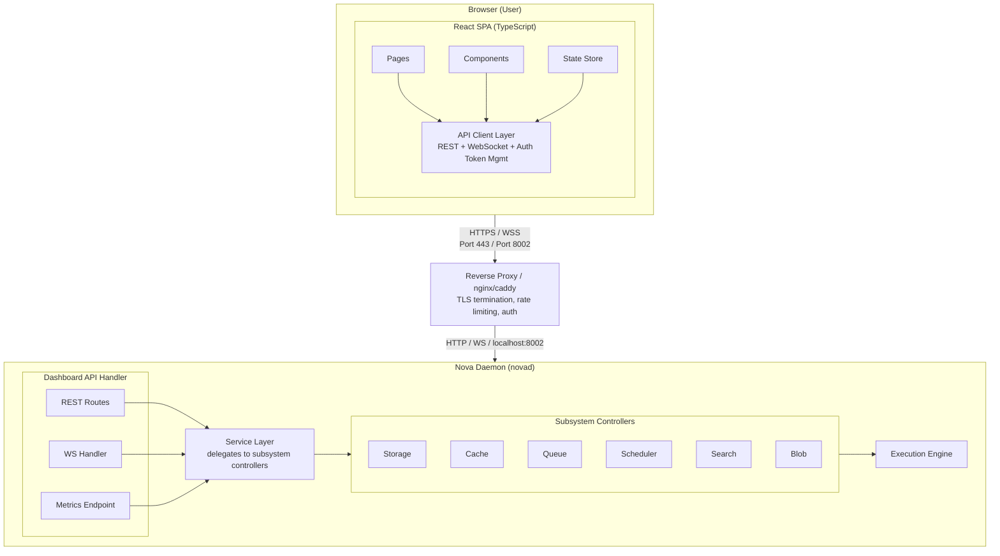

### 5.2 Frontend Architecture

The dashboard frontend is a single-page application (SPA) built with:

- **Framework**: React 18+ with TypeScript 5+
- **State Management**: Zustand (lightweight, type-safe, no boilerplate)
- **Routing**: React Router v6 with lazy loading per page
- **HTTP Client**: fetch-based custom client with token refresh interception
- **WebSocket**: Native WebSocket with reconnection logic
- **UI Components**: Custom component library built on Radix UI primitives
- **Styling**: Tailwind CSS with dark/light theme support
- **Charts**: Recharts for time-series and metric visualization
- **Build Tool**: Vite for development and production builds
- **Testing**: Vitest + React Testing Library + Playwright for e2e
- **Bundle Size Target**: Initial load < 200KB gzipped, total < 500KB gzipped

### 5.3 Backend Architecture (Daemon Side)

The dashboard API is served by the Nova daemon on a dedicated HTTP listener (default port 8002, configurable). It is a separate service from the primary REST API (port 8000) and GraphQL API (port 8001). This separation ensures:

- Dashboard access can be firewalled independently
- Dashboard does not compete for connections with application traffic
- Dashboard can bind to localhost only by default
- Different authentication requirements (session-based vs token-based)

### 5.4 Data Flow

```mermaid
graph LR
    UserAction[User Action] --> ReactComponent[React Component]
    ReactComponent --> ZustandAction[Zustand Action]
    ZustandAction --> APIClient[API Client]
    APIClient --> HTTPRequest[HTTP Request]
    HTTPRequest --> DashboardAPI[Dashboard API Handler]
    DashboardAPI --> ServiceLayer[Service Layer]
    ServiceLayer --> SubsystemController[Subsystem Controller]
    SubsystemController --> ExecEngine[Execution Engine]
    ExecEngine --> Storage[Storage]
    Storage --> ServiceLayerResponse[Service Layer]
    ServiceLayerResponse --> JSONResponse[JSON Response]
    JSONResponse --> APIClientBack[API Client]
    APIClientBack --> ZustandUpdate[Zustand Store Update]
    ZustandUpdate --> ReactRender[React Re-render]
```

For real-time updates:

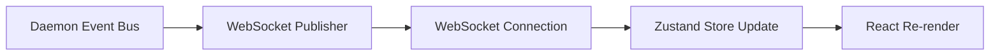

### 5.5 Component Tree

```
<App>
  <ThemeProvider>
    <AuthProvider>
      <Router>
        <Layout>
          <Sidebar>
            <NavItem icon="dashboard" label="Overview" />
            <NavItem icon="database" label="Database" />
            <NavItem icon="cache" label="Cache" />
            <NavItem icon="queue" label="Queue" />
            <NavItem icon="schedule" label="Scheduler" />
            <NavItem icon="search" label="Search" />
            <NavItem icon="storage" label="Blob Storage" />
            <NavItem icon="users" label="Users & API Keys" />
            <NavItem icon="settings" label="Configuration" />
            <NavItem icon="logs" label="Logs" />
            <NavItem icon="chart" label="Metrics" />
            <NavItem icon="bell" label="Alerts" />
          </Sidebar>
          <Header>
            <Breadcrumbs />
            <ThemeToggle />
            <UserMenu />
            <ConnectionStatus />
          </Header>
          <MainContent>
            <Routes>
              <Route path="/" element={<OverviewPage />} />
              <Route path="/database" element={<DatabasePage />} />
              <Route path="/database/:collection" element={<CollectionBrowser />} />
              <Route path="/database/query" element={<QueryEditor />} />
              <Route path="/cache" element={<CachePage />} />
              <Route path="/queue" element={<QueuePage />} />
              <Route path="/queue/:name" element={<QueueDetail />} />
              <Route path="/scheduler" element={<SchedulerPage />} />
              <Route path="/scheduler/:job" element={<JobDetail />} />
              <Route path="/search" element={<SearchPage />} />
              <Route path="/search/:index" element={<IndexDetail />} />
              <Route path="/blob" element={<BlobStoragePage />} />
              <Route path="/blob/:bucket" element={<BucketBrowser />} />
              <Route path="/users" element={<UsersPage />} />
              <Route path="/config" element={<ConfigPage />} />
              <Route path="/logs" element={<LogsPage />} />
              <Route path="/metrics" element={<MetricsPage />} />
              <Route path="/alerts" element={<AlertsPage />} />
              <Route path="/alerts/:rule" element={<AlertRuleDetail />} />
            </Routes>
          </MainContent>
        </Layout>
        <ToastContainer />
        <ConfirmDialog />
        <NotificationPanel />
      </Router>
    </AuthProvider>
  </ThemeProvider>
</App>
```

### 5.6 Wireframe Descriptions

**Overview Page Layout:**
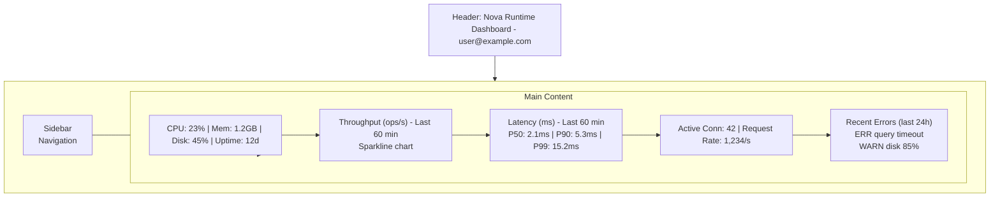

**Database Page Layout:**
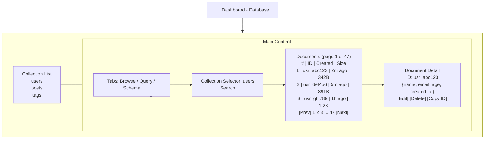

**Query Editor Layout:**
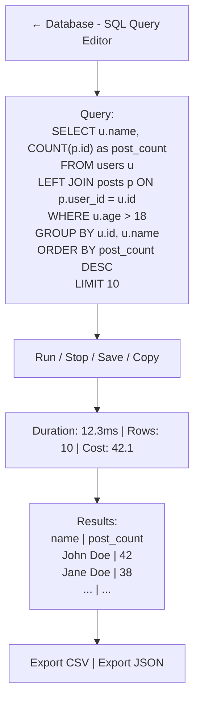

**Cache Page Layout:**
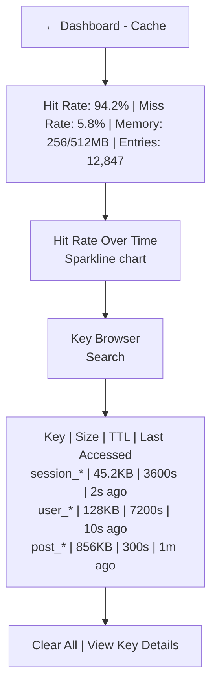

**Queue Page Layout:**
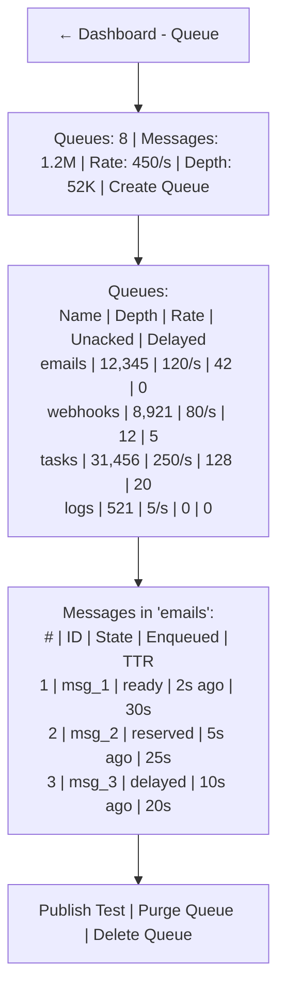

**Scheduler Page Layout:**
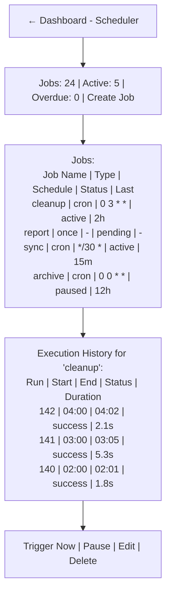

**Search Page Layout:**
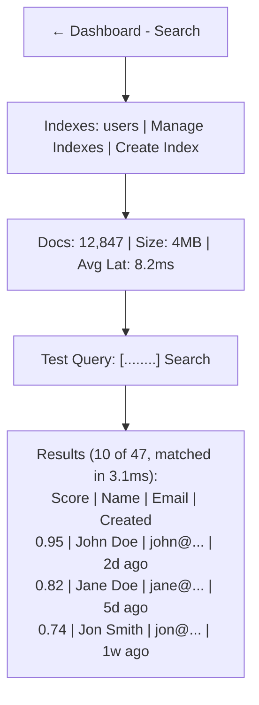

### 5.7 Page Layout Specifications

All pages follow a consistent layout pattern:

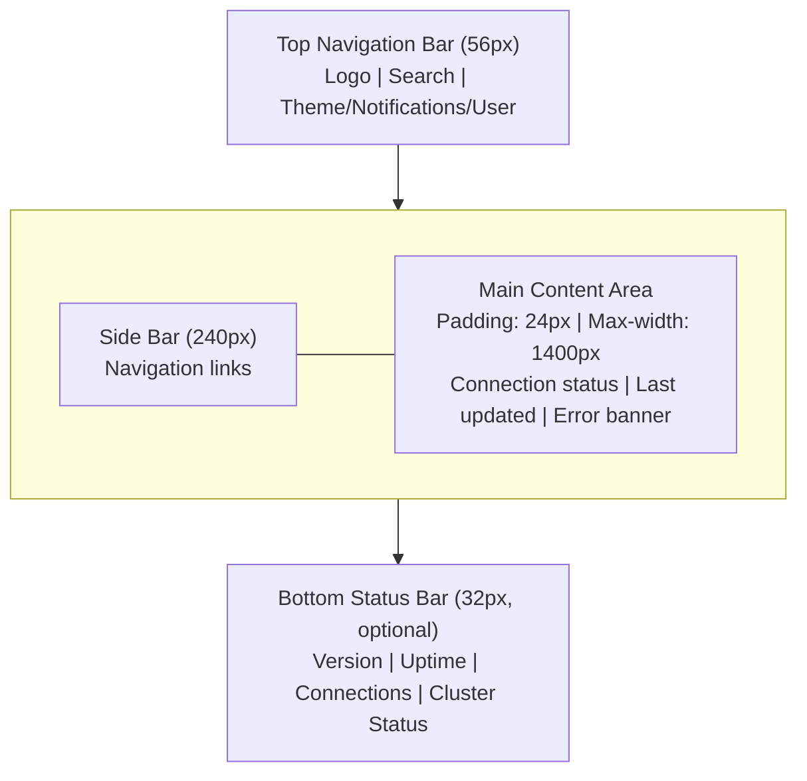

### 5.8 Color Scheme

```css
/* Light Theme */
--color-bg-primary: #ffffff;
--color-bg-secondary: #f8f9fa;
--color-bg-tertiary: #e9ecef;
--color-text-primary: #212529;
--color-text-secondary: #6c757d;
--color-text-muted: #adb5bd;
--color-accent: #4361ee;
--color-accent-hover: #3a56d4;
--color-success: #2ec4b6;
--color-warning: #ff9f1c;
--color-danger: #e71d36;
--color-info: #4cc9f0;
--color-border: #dee2e6;

/* Dark Theme */
--color-bg-primary: #1a1b2e;
--color-bg-secondary: #232542;
--color-bg-tertiary: #2d2f54;
--color-text-primary: #e8e9f3;
--color-text-secondary: #a0a3c2;
--color-text-muted: #6b6f8a;
--color-accent: #4cc9f0;
--color-accent-hover: #3ab8df;
--color-success: #2ec4b6;
--color-warning: #ff9f1c;
--color-danger: #e71d36;
--color-info: #4361ee;
--color-border: #2d2f54;
```

### 5.9 Responsive Breakpoints

```css
/* Breakpoints */
--bp-mobile: 480px;
--bp-tablet: 768px;
--bp-desktop: 1024px;
--bp-wide: 1400px;
```

## 6. Data Structures

### 6.1 Core Type Definitions

```typescript
// ============================================================
// Dashboard Configuration
// ============================================================

interface DashboardConfig {
  enabled: boolean;                    // default: true
  host: string;                        // default: "127.0.0.1"
  port: number;                        // default: 8002
  tls_cert_path: string | null;        // optional TLS
  tls_key_path: string | null;         // optional TLS
  allowed_origins: string[];           // CORS origins, default: ["http://localhost:5173"]
  session_ttl_seconds: number;         // default: 3600 (1 hour)
  max_session_per_user: number;        // default: 5
  rate_limit_per_minute: number;       // default: 60
  max_body_size_bytes: number;         // default: 10485760 (10MB)
  static_dir: string | null;           // custom static files location
  metrics_enabled: boolean;            // default: true
  metrics_path: string;                // default: "/v1/metrics"
}

// ============================================================
// Authentication & Session
// ============================================================

interface DashboardSession {
  session_id: string;                  // 32-byte random hex
  user_id: string;                     // reference to auth user
  username: string;                    // display name
  role: UserRole;                      // admin, operator, viewer
  created_at: number;                  // unix timestamp ms
  expires_at: number;                  // unix timestamp ms
  last_activity_at: number;            // unix timestamp ms
  ip_address: string;                  // source IP
  user_agent: string;                  // browser user agent
}

enum UserRole {
  Admin = "admin",                     // full access
  Operator = "operator",               // operational access, no config changes
  Viewer = "viewer",                   // read-only
}

interface LoginRequest {
  username: string;
  password: string;
  remember_me: boolean;                // extends session to 30 days
}

interface LoginResponse {
  session_id: string;
  token: string;                       // JWT for API calls
  expires_at: number;
  user: UserProfile;
}

interface UserProfile {
  id: string;
  username: string;
  email: string;
  role: UserRole;
  avatar_url: string | null;
  created_at: number;
  last_login_at: number;
  mfa_enabled: boolean;
}

// ============================================================
// System Health
// ============================================================

interface SystemHealth {
  status: HealthStatus;                // healthy, degraded, critical
  uptime_seconds: number;
  version: string;
  build_info: BuildInfo;
  cpu: CpuInfo;
  memory: MemoryInfo;
  disk: DiskInfo;
  network: NetworkInfo;
  subsystems: SubsystemStatus[];
  last_checked: number;
}

enum HealthStatus {
  Healthy = "healthy",
  Degraded = "degraded",
  Critical = "critical",
}

interface BuildInfo {
  commit_hash: string;
  build_time: number;
  rust_version: string;
  features: string[];
}

interface CpuInfo {
  usage_percent: number;               // 0.0 - 100.0
  load_avg_1m: number;
  load_avg_5m: number;
  load_avg_15m: number;
  cores: number;
  temperature_celsius: number | null;
}

interface MemoryInfo {
  total_bytes: number;
  used_bytes: number;
  resident_bytes: number;              // RSS
  allocated_bytes: number;             // heap allocated
  cache_bytes: number;                 // page cache
  swap_used_bytes: number;
  swap_total_bytes: number;
}

interface DiskInfo {
  data_path: string;
  total_bytes: number;
  used_bytes: number;
  free_bytes: number;
  fs_type: string;
  read_ops_per_sec: number;
  write_ops_per_sec: number;
  read_bytes_per_sec: number;
  write_bytes_per_sec: number;
  io_wait_percent: number;
}

interface NetworkInfo {
  rx_bytes_per_sec: number;
  tx_bytes_per_sec: number;
  rx_packets_per_sec: number;
  tx_packets_per_sec: number;
  connections_active: number;
  connection_errors: number;
  tcp_retransmit_percent: number;
}

interface SubsystemStatus {
  name: string;                        // "storage", "cache", "queue", etc.
  status: HealthStatus;
  uptime_seconds: number;
  metrics: Record<string, number>;     // subsystem-specific metrics
  last_error: string | null;
  last_error_time: number | null;
}

// ============================================================
// Metrics & Timeseries
// ============================================================

interface MetricsSnapshot {
  timestamp: number;
  metrics: MetricPoint[];
}

interface MetricPoint {
  name: string;                        // e.g., "nova_ops_total"
  labels: Record<string, string>;     // e.g., { subsystem: "database", op: "read" }
  value: number;
  type: MetricType;                    // counter, gauge, histogram
}

enum MetricType {
  Counter = "counter",
  Gauge = "gauge",
  Histogram = "histogram",
}

interface TimeseriesQuery {
  metric_names: string[];
  labels: Record<string, string>;
  start_time: number;
  end_time: number;
  aggregation_window: string;          // "1s", "5s", "1m", "5m", "1h"
  aggregation_fn: AggregationFn;       // avg, sum, min, max, p50, p90, p99
}

enum AggregationFn {
  Avg = "avg",
  Sum = "sum",
  Min = "min",
  Max = "max",
  P50 = "p50",
  P90 = "p90",
  P99 = "p99",
}

// ============================================================
// Dashboard Subsystem Data (returned by REST endpoints)
// ============================================================

// Database
interface CollectionInfo {
  name: string;
  document_count: number;
  total_size_bytes: number;
  average_document_size_bytes: number;
  index_count: number;
  created_at: number;
  last_updated_at: number;
}

interface Document {
  id: string;
  collection: string;
  data: Record<string, unknown>;
  created_at: number;
  updated_at: number;
  version: number;                     // MVCC version
  size_bytes: number;
}

interface QueryRequest {
  collection: string;
  filter: Record<string, unknown>;
  projection: string[] | null;
  sort: Record<string, 1 | -1> | null;
  skip: number;                        // default: 0
  limit: number;                       // default: 100, max: 1000
  explain: boolean;                    // return query plan instead
  include_count: boolean;              // include total matching count
}

interface QueryResult {
  documents: Document[];
  total_count: number | null;          // null if !include_count
  execution_time_ms: number;
  plan: QueryPlan | null;              // if explain
  warning: string | null;
}

interface QueryPlan {
  collection_scan: boolean;
  index_used: string | null;
  keys_examined: number;
  docs_examined: number;
  estimated_cost: number;
}

// Cache
interface CacheStats {
  hit_count: number;
  miss_count: number;
  hit_ratio: number;                   // 0.0 - 1.0
  total_entries: number;
  current_size_bytes: number;
  max_size_bytes: number;
  eviction_count: number;
  ttl_expired_count: number;
  memory_fragmentation_ratio: number;
  oldest_entry_age_seconds: number;
  newest_entry_age_seconds: number;
}

interface CacheEntry {
  key: string;
  value_size_bytes: number;
  created_at: number;
  expires_at: number | null;
  last_access_at: number;
  access_count: number;
  ttl_seconds: number | null;
}

// Queue
interface QueueInfo {
  name: string;
  message_count: number;               // total
  ready_count: number;
  reserved_count: number;
  delayed_count: number;
  buried_count: number;
  dead_letter_count: number;
  enqueue_rate_per_sec: number;
  dequeue_rate_per_sec: number;
  average_message_size_bytes: number;
  oldest_message_age_seconds: number;
  created_at: number;
  max_length: number;                  // 0 = unlimited
  dead_letter_queue: string | null;
  visibility_timeout_seconds: number;
  retention_seconds: number;
}

interface QueueMessage {
  id: string;
  body: string;                        // raw body
  state: MessageState;
  priority: number;                    // 0-255, higher = sooner
  enqueued_at: number;
  reserved_at: number | null;
  delayed_until: number | null;
  attempts: number;
  error_count: number;
  last_error: string | null;
  ttr_seconds: number;                 // time to release
}

enum MessageState {
  Ready = "ready",
  Reserved = "reserved",
  Delayed = "delayed",
  Buried = "buried",
  DeadLetter = "dead_letter",
}

// Scheduler
interface JobInfo {
  id: string;
  name: string;
  type: JobType;
  schedule: string | null;             // cron expression or null for one-shot
  handler: string;                     // handler function reference
  payload: Record<string, unknown>;
  status: JobStatus;
  max_retries: number;
  retry_delay_seconds: number;
  timeout_seconds: number;
  created_at: number;
  updated_at: number;
  last_run_at: number | null;
  next_run_at: number | null;
  tags: string[];
  concurrency_policy: ConcurrencyPolicy;
}

enum JobType {
  Cron = "cron",
  Once = "once",
  Interval = "interval",
}

enum JobStatus {
  Active = "active",
  Paused = "paused",
  Disabled = "disabled",
  Completed = "completed",
  Failed = "failed",
}

enum ConcurrencyPolicy {
  Allow = "allow",                     // allow concurrent runs
  Skip = "skip",                       // skip if running
  Queue = "queue",                     // queue if running
}

interface JobExecution {
  id: string;
  job_id: string;
  status: ExecutionStatus;
  started_at: number;
  finished_at: number | null;
  duration_ms: number | null;
  result: string | null;
  error: string | null;
  retry_attempt: number;
  trigger: ExecutionTrigger;
}

enum ExecutionStatus {
  Running = "running",
  Success = "success",
  Failed = "failed",
  Timeout = "timeout",
  Cancelled = "cancelled",
}

enum ExecutionTrigger {
  Scheduled = "scheduled",
  Manual = "manual",
  Retry = "retry",
}

// Search
interface IndexInfo {
  name: string;
  document_count: number;
  index_size_bytes: number;
  field_count: number;
  fields: IndexField[];
  last_indexed_at: number;
  average_index_time_ms: number;
  query_count: number;
  average_query_time_ms: number;
}

interface IndexField {
  name: string;
  type: FieldType;
  indexed: boolean;
  stored: boolean;
  analyzer: string;                    // "standard", "keyword", "ngram", "custom"
  sortable: boolean;
  facet: boolean;
}

enum FieldType {
  Text = "text",
  Keyword = "keyword",
  Integer = "integer",
  Float = "float",
  Boolean = "boolean",
  Date = "date",
  GeoPoint = "geo_point",
}

interface SearchQuery {
  index: string;
  query: string;
  filters: Record<string, unknown>;
  sort: string | null;
  order: "asc" | "desc";
  skip: number;
  limit: number;                       // max: 100
  fields: string[];                    // fields to return
  highlight: boolean;
  explain: boolean;
}

interface SearchResult {
  hits: SearchHit[];
  total: number;
  execution_time_ms: number;
  max_score: number;
  suggestions: string[];
  facets: Record<string, FacetBucket[]>;
}

interface SearchHit {
  score: number;
  id: string;
  fields: Record<string, unknown>;
  highlights: Record<string, string[]> | null;
}

interface FacetBucket {
  value: string;
  count: number;
}

// Blob Storage
interface BucketInfo {
  name: string;
  file_count: number;
  total_size_bytes: number;
  created_at: number;
  last_modified_at: number;
  allowed_mime_types: string[];
  max_file_size_bytes: number;
  versioning_enabled: boolean;
  public: boolean;
}

interface BlobObject {
  key: string;
  size_bytes: number;
  mime_type: string;
  etag: string;                        // MD5 hex
  created_at: number;
  last_modified_at: number;
  version_id: string | null;
  metadata: Record<string, string>;
  checksum_sha256: string;
}

// Users & API Keys
interface ApiKey {
  id: string;
  name: string;                        // human-readable label
  key_prefix: string;                  // first 8 chars of key
  role: UserRole;
  permissions: string[];               // granular permissions
  created_at: number;
  last_used_at: number | null;
  expires_at: number | null;
  enabled: boolean;
}

interface DashboardUser {
  id: string;
  username: string;
  email: string;
  role: UserRole;
  mfa_enabled: boolean;
  created_at: number;
  last_login_at: number | null;
  enabled: boolean;
}

// Configuration
interface ConfigEntry {
  key: string;                         // dot-notation path
  value: unknown;
  type: ConfigValueType;
  description: string;
  mutable: boolean;                    // can be changed at runtime
  requires_restart: boolean;
  default_value: unknown;
  validation_rules: ValidationRule[];
}

enum ConfigValueType {
  String = "string",
  Number = "number",
  Boolean = "boolean",
  Array = "array",
  Object = "object",
  Duration = "duration",
  Size = "size",
}

interface ValidationRule {
  rule: string;                        // "min", "max", "pattern", "enum", "required"
  value: unknown;
}

// Logs
interface LogEntry {
  timestamp: number;
  level: LogLevel;
  subsystem: string;
  message: string;
  fields: Record<string, unknown>;
  file: string;
  line: number;
  trace_id: string | null;
  span_id: string | null;
}

enum LogLevel {
  Trace = "trace",
  Debug = "debug",
  Info = "info",
  Warn = "warn",
  Error = "error",
  Fatal = "fatal",
}

interface LogQuery {
  levels: LogLevel[];
  subsystems: string[];
  search: string;
  start_time: number;
  end_time: number;
  limit: number;                       // default: 100, max: 10000
  offset: number;
  order: "asc" | "desc";
  trace_id: string | null;
}

interface LogQueryResponse {
  entries: LogEntry[];
  total_count: number;
  has_more: boolean;
}

// Alerts
interface AlertRule {
  id: string;
  name: string;
  description: string;
  metric: string;                      // metric name to watch
  condition: AlertCondition;
  threshold: number;
  duration_seconds: number;            // must persist for this long
  severity: AlertSeverity;
  channels: string[];                  // notification channel IDs
  enabled: boolean;
  cooldown_seconds: number;            // min between notifications
  last_fired_at: number | null;
  created_at: number;
  updated_at: number;
}

enum AlertCondition {
  Above = "above",
  Below = "below",
  Equals = "equals",
  Changes = "changes",                 // any change from baseline
  Absence = "absence",                 // no data received
}

enum AlertSeverity {
  Info = "info",
  Warning = "warning",
  Critical = "critical",
}

interface AlertEvent {
  id: string;
  rule_id: string;
  rule_name: string;
  severity: AlertSeverity;
  metric: string;
  actual_value: number;
  threshold: number;
  condition: AlertCondition;
  message: string;
  fired_at: number;
  resolved_at: number | null;
  acknowledged: boolean;
  acknowledged_by: string | null;
}

interface NotificationChannel {
  id: string;
  name: string;
  type: NotificationChannelType;
  config: Record<string, unknown>;
  enabled: boolean;
  verified: boolean;
}

enum NotificationChannelType {
  Email = "email",
  Slack = "slack",
  Webhook = "webhook",
  PagerDuty = "pager_duty",
  Discord = "discord",
  Telegram = "telegram",
}

// ============================================================
// WebSocket Messages
// ============================================================

type WsMessage =
  | WsSystemHealthUpdate
  | WsMetricUpdate
  | WsLogEntry
  | WsAlertEvent
  | WsSubsystemStatusChange
  | WsConfigurationChange;

interface WsSystemHealthUpdate {
  type: "system_health";
  data: SystemHealth;
}

interface WsMetricUpdate {
  type: "metric_update";
  data: MetricsSnapshot;
}

interface WsLogEntry {
  type: "log_entry";
  data: LogEntry;
}

interface WsAlertEvent {
  type: "alert_event";
  data: AlertEvent;
}

interface WsSubsystemStatusChange {
  type: "subsystem_status";
  data: SubsystemStatus;
}

interface WsConfigurationChange {
  type: "config_change";
  key: string;
  old_value: unknown;
  new_value: unknown;
}

// ============================================================
// Pagination
// ============================================================

interface PaginatedResponse<T> {
  data: T[];
  pagination: {
    page: number;
    per_page: number;
    total: number;
    total_pages: number;
    has_next: boolean;
    has_prev: boolean;
  };
}
```

### 6.2 State Store Structure (Zustand)

```typescript
interface DashboardStore {
  // Connection
  connection: {
    status: "connected" | "disconnected" | "reconnecting";
    server_version: string | null;
    last_ping_ms: number;
    reconnect_attempts: number;
  };

  // Auth
  auth: {
    session: DashboardSession | null;
    profile: UserProfile | null;
    loading: boolean;
    error: string | null;
  };

  // System
  system: {
    health: SystemHealth | null;
    health_history: TimeseriesPoint[];
    loading: boolean;
    error: string | null;
  };

  // Database
  database: {
    collections: CollectionInfo[];
    documents: Document[];
    query_result: QueryResult | null;
    selected_collection: string | null;
    selected_document: Document | null;
    loading: boolean;
    error: string | null;
  };

  // Cache
  cache: {
    stats: CacheStats | null;
    entries: CacheEntry[];
    selected_key: string | null;
    loading: boolean;
    error: string | null;
  };

  // Queue
  queue: {
    queues: QueueInfo[];
    messages: QueueMessage[];
    selected_queue: string | null;
    selected_message: QueueMessage | null;
    loading: boolean;
    error: string | null;
  };

  // Scheduler
  scheduler: {
    jobs: JobInfo[];
    executions: JobExecution[];
    selected_job: string | null;
    loading: boolean;
    error: string | null;
  };

  // Search
  search: {
    indexes: IndexInfo[];
    query_result: SearchResult | null;
    selected_index: string | null;
    loading: boolean;
    error: string | null;
  };

  // Blob Storage
  blob: {
    buckets: BucketInfo[];
    objects: BlobObject[];
    selected_bucket: string | null;
    loading: boolean;
    error: string | null;
  };

  // Users & API Keys
  users: {
    users: DashboardUser[];
    api_keys: ApiKey[];
    loading: boolean;
    error: string | null;
  };

  // Configuration
  config: {
    entries: ConfigEntry[];
    selected_key: string | null;
    editing_key: string | null;
    loading: boolean;
    error: string | null;
    saving: boolean;
    save_error: string | null;
  };

  // Logs
  logs: {
    entries: LogEntry[];
    streaming: boolean;
    filters: LogQuery;
    auto_scroll: boolean;
    loading: boolean;
    error: string | null;
  };

  // Metrics
  metrics: {
    timeseries: TimeseriesPoint[];
    selected_metrics: string[];
    time_range: TimeRange;
    aggregation: AggregationFn;
    loading: boolean;
    error: string | null;
  };

  // Alerts
  alerts: {
    rules: AlertRule[];
    events: AlertEvent[];
    channels: NotificationChannel[];
    selected_rule: string | null;
    loading: boolean;
    error: string | null;
  };

  // UI State
  ui: {
    theme: "light" | "dark";
    sidebar_collapsed: boolean;
    active_page: string;
    toasts: Toast[];
    confirm_dialog: ConfirmDialogState | null;
    modals: ModalState[];
  };
}
```

### 6.3 API Route Definitions

```typescript
// All routes are prefixed with /api/v1/dashboard

interface ApiRoutes {
  // Auth
  "POST   /auth/login":                    { req: LoginRequest; res: LoginResponse };
  "POST   /auth/logout":                   { req: {}; res: {} };
  "POST   /auth/refresh":                  { req: {}; res: { token: string; expires_at: number } };
  "GET    /auth/session":                  { req: {}; res: DashboardSession };
  "POST   /auth/change-password":          { req: { old_password: string; new_password: string }; res: {} };

  // System
  "GET    /system/health":                 { req: {}; res: SystemHealth };
  "GET    /system/info":                   { req: {}; res: BuildInfo };

  // Database
  "GET    /database/collections":          { req: {}; res: CollectionInfo[] };
  "GET    /database/collections/:name":    { req: {}; res: CollectionInfo };
  "GET    /database/collections/:name/docs": { req: PaginationParams; res: PaginatedResponse<Document> };
  "GET    /database/collections/:name/docs/:id": { req: {}; res: Document };
  "POST   /database/query":                { req: QueryRequest; res: QueryResult };
  "GET    /database/schema":               { req: {}; res: SchemaInfo };

  // Cache
  "GET    /cache/stats":                   { req: {}; res: CacheStats };
  "GET    /cache/keys":                    { req: { search?: string; page: number }; res: PaginatedResponse<CacheEntry> };
  "GET    /cache/keys/:key":              { req: {}; res: CacheEntry & { value: unknown } };
  "DELETE /cache/keys/:key":              { req: {}; res: {} };
  "POST   /cache/clear":                   { req: {}; res: {} };

  // Queue
  "GET    /queue":                         { req: {}; res: QueueInfo[] };
  "GET    /queue/:name":                  { req: {}; res: QueueInfo };
  "GET    /queue/:name/messages":         { req: PaginationParams & { state?: string }; res: PaginatedResponse<QueueMessage> };
  "POST   /queue/:name/messages":         { req: { body: string; priority?: number; delay_seconds?: number }; res: QueueMessage };
  "DELETE /queue/:name":                  { req: {}; res: {} };
  "POST   /queue/:name/purge":            { req: {}; res: { purged_count: number } };

  // Scheduler
  "GET    /scheduler/jobs":               { req: {}; res: JobInfo[] };
  "GET    /scheduler/jobs/:id":           { req: {}; res: JobInfo };
  "POST   /scheduler/jobs":               { req: CreateJobRequest; res: JobInfo };
  "PUT    /scheduler/jobs/:id":           { req: UpdateJobRequest; res: JobInfo };
  "DELETE /scheduler/jobs/:id":           { req: {}; res: {} };
  "POST   /scheduler/jobs/:id/trigger":   { req: {}; res: JobExecution };
  "POST   /scheduler/jobs/:id/pause":     { req: {}; res: JobInfo };
  "POST   /scheduler/jobs/:id/resume":    { req: {}; res: JobInfo };
  "GET    /scheduler/jobs/:id/executions": { req: PaginationParams; res: PaginatedResponse<JobExecution> };

  // Search
  "GET    /search/indexes":               { req: {}; res: IndexInfo[] };
  "GET    /search/indexes/:name":         { req: {}; res: IndexInfo };
  "POST   /search/indexes":               { req: CreateIndexRequest; res: IndexInfo };
  "DELETE /search/indexes/:name":         { req: {}; res: {} };
  "POST   /search/indexes/:name/query":   { req: SearchQuery; res: SearchResult };

  // Blob Storage
  "GET    /blob/buckets":                 { req: {}; res: BucketInfo[] };
  "GET    /blob/buckets/:name":           { req: {}; res: BucketInfo };
  "POST   /blob/buckets":                 { req: { name: string; public?: boolean }; res: BucketInfo };
  "DELETE /blob/buckets/:name":           { req: {}; res: {} };
  "GET    /blob/buckets/:name/objects":   { req: PaginationParams; res: PaginatedResponse<BlobObject> };
  "GET    /blob/buckets/:name/objects/:key/download": { req: {}; res: binary };

  // Users & API Keys
  "GET    /users":                        { req: {}; res: DashboardUser[] };
  "GET    /users/:id":                   { req: {}; res: DashboardUser };
  "POST   /users":                        { req: CreateUserRequest; res: DashboardUser };
  "PUT    /users/:id":                   { req: UpdateUserRequest; res: DashboardUser };
  "DELETE /users/:id":                   { req: {}; res: {} };
  "GET    /api-keys":                     { req: {}; res: ApiKey[] };
  "POST   /api-keys":                     { req: { name: string; role: UserRole }; res: ApiKey & { full_key: string } };
  "DELETE /api-keys/:id":                { req: {}; res: {} };

  // Configuration
  "GET    /config":                       { req: {}; res: ConfigEntry[] };
  "GET    /config/:key":                 { req: {}; res: ConfigEntry };
  "PUT    /config/:key":                 { req: { value: unknown }; res: ConfigEntry };
  "GET    /config/diff":                  { req: {}; res: { pending_changes: { key: string; old: unknown; new: unknown }[] } };
  "POST   /config/apply":                 { req: {}; res: { requires_restart: boolean } };
  "POST   /config/reload":                { req: {}; res: {} };

  // Logs
  "GET    /logs":                         { req: LogQuery; res: LogQueryResponse };
  "WS     /logs/stream":                  { req: { levels?: LogLevel[]; subsystems?: string[] }; res: stream<LogEntry> };

  // Metrics
  "GET    /metrics":                      { req: TimeseriesQuery; res: TimeseriesPoint[] };
  "GET    /v1/metrics":                   { req: {}; res: prometheus_text_format };  // prometheus endpoint

  // Alerts
  "GET    /alerts/rules":                 { req: {}; res: AlertRule[] };
  "POST   /alerts/rules":                 { req: CreateAlertRuleRequest; res: AlertRule };
  "PUT    /alerts/rules/:id":            { req: UpdateAlertRuleRequest; res: AlertRule };
  "DELETE /alerts/rules/:id":            { req: {}; res: {} };
  "GET    /alerts/events":               { req: PaginationParams; res: PaginatedResponse<AlertEvent> };
  "POST   /alerts/events/:id/acknowledge": { req: {}; res: AlertEvent };
  "GET    /alerts/channels":              { req: {}; res: NotificationChannel[] };
  "POST   /alerts/channels":              { req: CreateChannelRequest; res: NotificationChannel };
  "PUT    /alerts/channels/:id":          { req: UpdateChannelRequest; res: NotificationChannel };
  "DELETE /alerts/channels/:id":          { req: {}; res: {} };
  "POST   /alerts/channels/:id/test":     { req: {}; res: {} };
}
```

## 7. Algorithms

### 7.1 Session Management Algorithm

```
Algorithm: DashboardSessionManagement
Purpose: Create, validate, refresh, and expire dashboard sessions

CREATE_SESSION(user_id, username, role, ip, user_agent, remember_me):
  session_id = generate_random_hex(32)       // 256-bit random
  ttl = remember_me ? 2_592_000 : 3_600     // 30 days or 1 hour
  expires_at = now() + ttl
  session = {
    session_id, user_id, username, role,
    created_at: now(), expires_at,
    last_activity_at: now(), ip, user_agent
  }
  store session in internal session map      // keyed by session_id
  enforce_max_sessions(user_id, max_per_user=5)
    → evict oldest session if exceeded
  token = create_jwt({
    sub: user_id,
    session_id: session_id,
    role: role,
    exp: expires_at,
    iat: now()
  }, signing_key = server_secret)
  return (session, token)

VALIDATE_SESSION(token):
  try:
    claims = verify_jwt(token, server_secret)
    if claims.exp < now(): return expired_error
    session = lookup_session(claims.session_id)
    if session is None: return invalid_error
    if session.expires_at < now():
      delete_session(session.session_id)
      return expired_error
    // Sliding expiration: extend if within last 25% of TTL
    remaining = session.expires_at - now()
    total_ttl = session.expires_at - session.created_at
    if remaining < total_ttl * 0.25:
      session.expires_at = now() + min(total_ttl, 3600)
      session.last_activity_at = now()
    return valid(session)
  except JWTError:
    return invalid_error

ENFORCE_MAX_SESSIONS(user_id, max_sessions):
  sessions = get_sessions_for_user(user_id)
  if len(sessions) > max_sessions:
    // Sort by last_activity_at ascending, evict oldest
    sessions.sort_by(last_activity_at)
    to_evict = sessions[0:len(sessions) - max_sessions]
    for s in to_evict:
      delete_session(s.session_id)
```

### 7.2 Rate Limiting Algorithm

```
Algorithm: TokenBucketRateLimiter
Purpose: Rate-limit dashboard API requests per session

RATE_LIMIT(session_id, bucket_capacity=60, refill_rate=1.0):
  // 60 tokens capacity, refill 1 token per second
  bucket = rate_limit_buckets[session_id]
  if bucket is None:
    bucket = { tokens: bucket_capacity, last_refill: now() }
    rate_limit_buckets[session_id] = bucket

  elapsed = now() - bucket.last_refill
  new_tokens = elapsed * refill_rate
  bucket.tokens = min(bucket_capacity, bucket.tokens + new_tokens)
  bucket.last_refill = now()

  if bucket.tokens < 1:
    return rate_limited(retry_after = int(1 / refill_rate * 1000))
  bucket.tokens -= 1
  return allowed

CLEANUP_EXPIRED_BUCKETS(interval_seconds=300):
  while running:
    sleep(interval_seconds)
    for session_id, bucket in rate_limit_buckets:
      if no_active_session(session_id):
        delete rate_limit_buckets[session_id]
```

### 7.3 Metrics Aggregation Algorithm

```
Algorithm: MetricsAggregation
Purpose: Aggregate raw metric points into time-series windows

AGGREGATE(raw_points, window_size_seconds, start_time, end_time, fn):
  // raw_points: stream of (timestamp, value)
  // window_size: e.g., 60 for 1-minute windows
  buckets = {}
  for point in raw_points where start_time <= point.ts <= end_time:
    bucket_key = floor(point.ts / window_size_seconds) * window_size_seconds
    if bucket_key not in buckets:
      buckets[bucket_key] = []
    buckets[bucket_key].push(point.value)

  results = []
  for bucket_key in sorted(buckets.keys()):
    values = buckets[bucket_key]
    agg = apply_aggregation_fn(values, fn)
    results.push({ timestamp: bucket_key, value: agg })

  return results

APPLY_AGGREGATION_FN(values, fn):
  switch fn:
    case "avg":  return sum(values) / len(values)
    case "sum":  return sum(values)
    case "min":  return min(values)
    case "max":  return max(values)
    case "p50":  return percentile(values, 50)
    case "p90":  return percentile(values, 90)
    case "p99":  return percentile(values, 99)
    case "count": return len(values)
```

### 7.4 Log Streaming Algorithm

```
Algorithm: LogStreaming
Purpose: Stream logs from daemon to dashboard via WebSocket

HANDLE_LOG_STREAM(ws_connection, filters):
  // filters: { levels: ["info","warn","error"], subsystems: ["database","cache"] }
  subscriber_id = generate_uuid()
  log_subscribers[subscriber_id] = {
    ws: ws_connection,
    filters: filters,
    buffer: circular_buffer(100),  // last 100 messages for backfill
    created_at: now()
  }

  // Backfill: send last 100 matching entries
  for entry in recent_logs_buffer where matches_filters(entry, filters):
    ws_connection.send(json({ type: "log_entry", data: entry }, batch=true))

  // Live streaming loop
  on ws_connection.close():
    remove log_subscribers[subscriber_id]

  // Heartbeat: send ping every 30 seconds
  heartbeat_interval = set_interval(30_000):
    ws_connection.send(json({ type: "ping" }))

MATCHES_FILTERS(entry, filters):
  if filters.levels is not empty and entry.level not in filters.levels:
    return false
  if filters.subsystems is not empty and entry.subsystem not in filters.subsystems:
    return false
  if filters.search and entry.message.lower() does not contain filters.search.lower():
    return false
  return true
```

### 7.5 Alert Evaluation Algorithm

```
Algorithm: AlertEvaluation
Purpose: Evaluate alert rules against metric data

EVALUATE_ALERTS(rules, metrics_stream, interval_seconds=10):
  // Runs every 10 seconds on the daemon
  for rule in rules where rule.enabled:
    recent_metrics = get_recent_metrics(
      rule.metric, duration: rule.duration_seconds
    )
    if len(recent_metrics) == 0:
      if rule.condition == "absence":
        fire_alert(rule, actual_value: null, message: "No data received")
      continue

    latest_value = recent_metrics[-1].value
    should_fire = evaluate_condition(rule.condition, latest_value, rule.threshold)

    if should_fire:
      // Check cooldown
      if rule.last_fired_at is not None:
        if now() - rule.last_fired_at < rule.cooldown_seconds:
          continue
      fire_alert(rule, latest_value)
    else:
      // Check if alert was previously firing → resolve
      if has_active_alert(rule.id):
        resolve_alert(rule.id)

EVALUATE_CONDITION(condition, actual, threshold):
  switch condition:
    case "above":   return actual > threshold
    case "below":   return actual < threshold
    case "equals":  return abs(actual - threshold) < 0.001
    case "changes": return abs(actual - baseline(rule.metric)) > threshold
    case "absence": return false  // handled above

FIRE_ALERT(rule, actual_value):
  alert = AlertEvent(
    id: generate_uuid(),
    rule_id: rule.id,
    rule_name: rule.name,
    severity: rule.severity,
    metric: rule.metric,
    actual_value: actual_value,
    threshold: rule.threshold,
    condition: rule.condition,
    message: format_alert_message(rule, actual_value),
    fired_at: now(),
    resolved_at: null,
    acknowledged: false,
    acknowledged_by: null
  )
  store_alert(alert)
  rule.last_fired_at = now()
  notify_channels(rule.channels, alert)
  broadcast_via_websocket(alert)
```

## 8. Interfaces

### 8.1 REST API Endpoints

All endpoints are served under `/api/v1/dashboard/`. Request/response bodies are JSON unless noted. Authentication is via Bearer token in the `Authorization` header.

```
=== Authentication ===

POST /api/v1/dashboard/auth/login
  Request:  { username: string, password: string, remember_me?: boolean }
  Response: { session_id: string, token: string, expires_at: number, user: UserProfile }
  Errors:
    401 - Invalid credentials
    429 - Rate limit exceeded
    503 - Authentication subsystem unavailable

POST /api/v1/dashboard/auth/logout
  Request:  {}
  Response: {}
  Errors:
    401 - Invalid or expired token

POST /api/v1/dashboard/auth/refresh
  Request:  {}
  Response: { token: string, expires_at: number }
  Errors:
    401 - Session expired (re-login required)

GET /api/v1/dashboard/auth/session
  Request:  {}
  Response: DashboardSession
  Errors:
    401 - Not authenticated


=== System ===

GET /api/v1/dashboard/system/health
  Request:  {}
  Response: SystemHealth
  Errors:
    503 - System health check failed (partial data may be returned)
  Performance: O(1) cached result, refreshed every 5s

GET /api/v1/dashboard/system/info
  Request:  {}
  Response: BuildInfo


=== Database ===

GET /api/v1/dashboard/database/collections
  Request:  {}
  Response: CollectionInfo[]
  Errors:
    503 - Storage subsystem unavailable

GET /api/v1/dashboard/database/collections/:name
  Request:  {}
  Response: CollectionInfo
  Errors:
    404 - Collection not found

GET /api/v1/dashboard/database/collections/:name/docs
  Query:    page?=1&per_page?=20&sort?=created_at&order?=desc
  Response: PaginatedResponse<Document>
  Errors:
    404 - Collection not found
    400 - Invalid pagination parameters

GET /api/v1/dashboard/database/collections/:name/docs/:id
  Request:  {}
  Response: Document
  Errors:
    404 - Document not found

POST /api/v1/dashboard/database/query
  Request:  QueryRequest
  Response: QueryResult
  Errors:
    400 - Invalid query syntax
    422 - Query timeout (exceeded max_execution_time_ms)
    429 - Too many concurrent queries
    503 - Storage subsystem unavailable
  Limits:
    max_execution_time_ms: 30000
    max_limit: 1000


=== Cache ===

GET /api/v1/dashboard/cache/stats
  Request:  {}
  Response: CacheStats
  Errors:
    503 - Cache subsystem unavailable

GET /api/v1/dashboard/cache/keys
  Query:    search?=&page?=1&per_page?=50
  Response: PaginatedResponse<CacheEntry>
  Notes: search filters by key prefix

GET /api/v1/dashboard/cache/keys/:key
  Request:  {}
  Response: CacheEntry & { value: unknown }
  Errors:
    404 - Key not found

DELETE /api/v1/dashboard/cache/keys/:key
  Request:  {}
  Response: {}
  Errors:
    404 - Key not found
    403 - Cache is read-only

POST /api/v1/dashboard/cache/clear
  Request:  {}
  Response: {}
  Notes: Bypasses cache, directly clears underlying store


=== Queue ===

GET /api/v1/dashboard/queue
  Request:  {}
  Response: QueueInfo[]

GET /api/v1/dashboard/queue/:name
  Request:  {}
  Response: QueueInfo
  Errors:
    404 - Queue not found

GET /api/v1/dashboard/queue/:name/messages
  Query:    page?=1&per_page?=20&state?=ready
  Response: PaginatedResponse<QueueMessage>
  Errors:
    404 - Queue not found

POST /api/v1/dashboard/queue/:name/messages
  Request:  { body: string, priority?: number, delay_seconds?: number }
  Response: QueueMessage
  Errors:
    404 - Queue not found
    413 - Message body exceeds max_size (default 256KB)
    429 - Queue at max capacity

DELETE /api/v1/dashboard/queue/:name
  Request:  {}
  Response: {}
  Errors:
    404 - Queue not found
    409 - Queue has active consumers (force delete by adding ?force=true)

POST /api/v1/dashboard/queue/:name/purge
  Request:  {}
  Response: { purged_count: number }
  Errors:
    404 - Queue not found


=== Scheduler ===

GET /api/v1/dashboard/scheduler/jobs
  Request:  {}
  Response: JobInfo[]

GET /api/v1/dashboard/scheduler/jobs/:id
  Request:  {}
  Response: JobInfo
  Errors:
    404 - Job not found

POST /api/v1/dashboard/scheduler/jobs
  Request:  CreateJobRequest
  Response: JobInfo
  Errors:
    400 - Invalid cron expression
    400 - Invalid handler name
    422 - Handler not registered

PUT /api/v1/dashboard/scheduler/jobs/:id
  Request:  UpdateJobRequest
  Response: JobInfo
  Errors:
    404 - Job not found

DELETE /api/v1/dashboard/scheduler/jobs/:id
  Request:  {}
  Response: {}
  Errors:
    404 - Job not found

POST /api/v1/dashboard/scheduler/jobs/:id/trigger
  Request:  {}
  Response: JobExecution
  Errors:
    404 - Job not found
    409 - Job is disabled
    429 - Concurrency policy violated (Skip policy)

POST /api/v1/dashboard/scheduler/jobs/:id/pause
  Request:  {}
  Response: JobInfo
  Errors:
    404 - Job not found

POST /api/v1/dashboard/scheduler/jobs/:id/resume
  Request:  {}
  Response: JobInfo
  Errors:
    404 - Job not found

GET /api/v1/dashboard/scheduler/jobs/:id/executions
  Query:    page?=1&per_page?=20
  Response: PaginatedResponse<JobExecution>
  Errors:
    404 - Job not found


=== Search ===

GET /api/v1/dashboard/search/indexes
  Request:  {}
  Response: IndexInfo[]

GET /api/v1/dashboard/search/indexes/:name
  Request:  {}
  Response: IndexInfo
  Errors:
    404 - Index not found

POST /api/v1/dashboard/search/indexes
  Request:  { name: string, fields: IndexField[], ... }
  Response: IndexInfo
  Errors:
    409 - Index already exists
    400 - Invalid field definition

DELETE /api/v1/dashboard/search/indexes/:name
  Request:  {}
  Response: {}
  Errors:
    404 - Index not found

POST /api/v1/dashboard/search/indexes/:name/query
  Request:  SearchQuery
  Response: SearchResult
  Errors:
    404 - Index not found
    400 - Invalid query syntax
    422 - Query timeout (> 10s)


=== Blob Storage ===

GET /api/v1/dashboard/blob/buckets
  Request:  {}
  Response: BucketInfo[]

GET /api/v1/dashboard/blob/buckets/:name
  Request:  {}
  Response: BucketInfo
  Errors:
    404 - Bucket not found

POST /api/v1/dashboard/blob/buckets
  Request:  { name: string, public?: boolean }
  Response: BucketInfo
  Errors:
    409 - Bucket already exists
    400 - Invalid bucket name (must match ^[a-z0-9_-]{3,63}$)

DELETE /api/v1/dashboard/blob/buckets/:name
  Request:  {}
  Response: {}
  Errors:
    404 - Bucket not found
    409 - Bucket is not empty (use ?force=true)

GET /api/v1/dashboard/blob/buckets/:name/objects
  Query:    page?=1&per_page?=50&prefix?=
  Response: PaginatedResponse<BlobObject>

GET /api/v1/dashboard/blob/buckets/:name/objects/:key/download
  Request:  {}
  Response: binary (application/octet-stream)
  Headers:  Content-Type, Content-Length, ETag, Last-Modified


=== Users & API Keys ===

GET /api/v1/dashboard/users
  Request:  {}
  Response: DashboardUser[]
  Errors:
    403 - Insufficient permissions (Admin only)

GET /api/v1/dashboard/users/:id
  Request:  {}
  Response: DashboardUser
  Errors:
    403 - Insufficient permissions
    404 - User not found

POST /api/v1/dashboard/users
  Request:  { username: string, email: string, password: string, role: UserRole }
  Response: DashboardUser
  Errors:
    403 - Insufficient permissions
    409 - Username already exists
    422 - Password does not meet strength requirements

PUT /api/v1/dashboard/users/:id
  Request:  { username?: string, email?: string, role?: UserRole, enabled?: boolean }
  Response: DashboardUser
  Errors:
    403 - Insufficient permissions
    404 - User not found

DELETE /api/v1/dashboard/users/:id
  Request:  {}
  Response: {}
  Errors:
    403 - Insufficient permissions
    404 - User not found
    409 - Cannot delete self
    409 - Cannot delete last admin

GET /api/v1/dashboard/api-keys
  Request:  {}
  Response: ApiKey[]

POST /api/v1/dashboard/api-keys
  Request:  { name: string, role: UserRole, permissions?: string[] }
  Response: ApiKey & { full_key: string }
  Notes: full_key is only returned once on creation
  Errors:
    403 - Insufficient permissions

DELETE /api/v1/dashboard/api-keys/:id
  Request:  {}
  Response: {}
  Errors:
    403 - Insufficient permissions
    404 - ApiKey not found


=== Configuration ===

GET /api/v1/dashboard/config
  Request:  {}
  Response: ConfigEntry[]

GET /api/v1/dashboard/config/:key
  Request:  {}
  Response: ConfigEntry
  Errors:
    404 - Config key not found

PUT /api/v1/dashboard/config/:key
  Request:  { value: unknown }
  Response: ConfigEntry
  Errors:
    403 - Config key is not mutable
    422 - Validation failed
    404 - Config key not found

GET /api/v1/dashboard/config/diff
  Request:  {}
  Response: { pending_changes: ConfigChange[] }

POST /api/v1/dashboard/config/apply
  Request:  {}
  Response: { requires_restart: boolean }

POST /api/v1/dashboard/config/reload
  Request:  {}
  Response: {}
  Errors:
    503 - Config reload failed


=== Logs ===

GET /api/v1/dashboard/logs
  Query:    levels=&subsystems=&search=&start_time=&end_time=&limit=&offset=&order=
  Response: LogQueryResponse
  Errors:
    422 - Time range exceeds max (7 days)
    422 - Limit exceeds max (10000)

WS /api/v1/dashboard/logs/stream
  Query:    ?levels=info,error&subsystems=database,cache
  Messages: { type: "log_entry", data: LogEntry }
  Heartbeat: server sends { type: "ping" } every 30s
  Client should send { type: "pong" } in response


=== Metrics ===

GET /api/v1/dashboard/metrics
  Query:    metric_names=&labels=&start_time=&end_time=&window=&fn=
  Response: TimeseriesPoint[]
  Errors:
    422 - Time range exceeds max (30 days)
    422 - Too many metric_names (> 10)

GET /v1/metrics
  Request:  {}
  Response: text/plain (Prometheus format)
  Errors: none (always returns, possibly empty)


=== Alerts ===

GET /api/v1/dashboard/alerts/rules
  Request:  {}
  Response: AlertRule[]

POST /api/v1/dashboard/alerts/rules
  Request:  CreateAlertRuleRequest
  Response: AlertRule
  Errors:
    400 - Invalid metric name
    400 - Invalid condition
    422 - Notification channel not found

PUT /api/v1/dashboard/alerts/rules/:id
  Request:  UpdateAlertRuleRequest
  Response: AlertRule
  Errors:
    404 - Rule not found

DELETE /api/v1/dashboard/alerts/rules/:id
  Request:  {}
  Response: {}
  Errors:
    404 - Rule not found

GET /api/v1/dashboard/alerts/events
  Query:    page?=1&per_page?=20&severity?=&acknowledged?=
  Response: PaginatedResponse<AlertEvent>

POST /api/v1/dashboard/alerts/events/:id/acknowledge
  Request:  {}
  Response: AlertEvent
  Errors:
    404 - Event not found
    409 - Event already acknowledged

GET /api/v1/dashboard/alerts/channels
  Request:  {}
  Response: NotificationChannel[]

POST /api/v1/dashboard/alerts/channels
  Request:  CreateChannelRequest
  Response: NotificationChannel
  Errors:
    400 - Invalid channel type
    422 - Channel configuration validation failed

PUT /api/v1/dashboard/alerts/channels/:id
  Request:  UpdateChannelRequest
  Response: NotificationChannel
  Errors:
    404 - Channel not found

DELETE /api/v1/dashboard/alerts/channels/:id
  Request:  {}
  Response: {}
  Errors:
    404 - Channel not found
    409 - Channel is in use by active alert rules

POST /api/v1/dashboard/alerts/channels/:id/test
  Request:  {}
  Response: {}
  Errors:
    422 - Channel configuration is invalid
    503 - Notification service unavailable
```

### 8.2 WebSocket Protocol

```
WebSocket Handshake:
  URL:     ws://host:8002/api/v1/dashboard/logs/stream
  Headers: Authorization: Bearer <token>

Server → Client Messages:
  { "type": "system_health",   "data": SystemHealth }
  { "type": "metric_update",   "data": MetricsSnapshot }
  { "type": "log_entry",       "data": LogEntry }
  { "type": "alert_event",     "data": AlertEvent }
  { "type": "subsystem_status","data": SubsystemStatus }
  { "type": "config_change",   "data": { key, old_value, new_value } }
  { "type": "ping" }
  { "type": "error",           "data": { code: int, message: string } }

Client → Server Messages:
  { "type": "pong" }
  { "type": "subscribe",      "data": { channels: string[] } }
  { "type": "unsubscribe",    "data": { channels: string[] } }

Reconnection:
  - Client should reconnect with exponential backoff:
      1s, 2s, 4s, 8s, 16s, max 30s
  - Server should support at most 100 concurrent WebSocket connections
  - Connections idle for > 5 minutes without pong should be closed
```

### 8.3 Frontend Component Interfaces

```typescript
// Core Layout Components

interface LayoutProps {
  children: React.ReactNode;
}

interface SidebarProps {
  items: NavItem[];
  collapsed: boolean;
  onToggle: () => void;
}

interface NavItem {
  id: string;
  label: string;
  icon: React.ComponentType;
  path: string;
  badge?: number;
  children?: NavItem[];
}

interface HeaderProps {
  breadcrumbs: Breadcrumb[];
  user: UserProfile | null;
  connectionStatus: ConnectionStatus;
  onThemeToggle: () => void;
}

interface PageContainerProps {
  title: string;
  description?: string;
  actions?: React.ReactNode;
  loading?: boolean;
  error?: string | null;
  onRetry?: () => void;
  children: React.ReactNode;
}

// Data Display Components

interface DataTableProps<T> {
  columns: Column<T>[];
  data: T[];
  loading: boolean;
  pagination: PaginationInfo;
  onPageChange: (page: number) => void;
  onSort?: (column: string, direction: "asc" | "desc") => void;
  onRowClick?: (row: T) => void;
  selectedId?: string;
  emptyMessage?: string;
}

interface Column<T> {
  key: string;
  header: string;
  sortable?: boolean;
  render?: (value: unknown, row: T) => React.ReactNode;
  width?: string;
  align?: "left" | "center" | "right";
}

interface MetricCardProps {
  title: string;
  value: string | number;
  unit?: string;
  change?: number;           // percentage change
  changeDirection?: "up" | "down";
  changeLabel?: string;
  icon?: React.ComponentType;
  color?: "accent" | "success" | "warning" | "danger" | "info";
  trend?: number[];          // sparkline data
  loading?: boolean;
}

interface ChartProps {
  type: "line" | "area" | "bar";
  data: TimeseriesPoint[];
  xKey: string;
  yKey: string;
  color?: string;
  height?: number;
  showLegend?: boolean;
  showGrid?: boolean;
  tooltip?: boolean;
  loading?: boolean;
  yAxisLabel?: string;
  xAxisLabel?: string;
}

interface StatsGridProps {
  items: MetricCardProps[];
  columns?: 2 | 3 | 4;
}

// Form Components

interface JsonEditorProps {
  value: unknown;
  onChange: (value: unknown) => void;
  readOnly?: boolean;
  height?: string;
  schema?: object;      // JSON Schema for validation
}

interface QueryEditorProps {
  value: string;
  onChange: (value: string) => void;
  onRun: () => void;
  onStop: () => void;
  onSave: () => void;
  running?: boolean;
  language: "sql" | "json" | "text";
}

interface FilterBarProps {
  filters: Filter[];
  onFilterChange: (key: string, value: unknown) => void;
  onClear: () => void;
}

interface Filter {
  key: string;
  label: string;
  type: "text" | "select" | "date-range" | "multiselect" | "boolean";
  value: unknown;
  options?: { label: string; value: unknown }[];
}

// Feedback Components

interface Toast {
  id: string;
  type: "success" | "error" | "warning" | "info";
  title: string;
  message?: string;
  duration?: number;     // ms, 0 = persistent
  action?: { label: string; onClick: () => void };
}

interface ConfirmDialogProps {
  open: boolean;
  title: string;
  message: string;
  confirmLabel?: string;
  cancelLabel?: string;
  variant?: "danger" | "warning" | "info";
  onConfirm: () => void;
  onCancel: () => void;
  loading?: boolean;
}

// Specialized Components

interface LogViewerProps {
  entries: LogEntry[];
  streaming: boolean;
  autoScroll: boolean;
  filters: LogQuery;
  onFilterChange: (filters: Partial<LogQuery>) => void;
  onToggleStream: () => void;
  onToggleAutoScroll: () => void;
  loading: boolean;
  onLoadMore: () => void;
  hasMore: boolean;
  maxHeight?: string;
}

interface MetricsExplorerProps {
  availableMetrics: string[];
  selectedMetrics: string[];
  onMetricsChange: (metrics: string[]) => void;
  timeRange: TimeRange;
  onTimeRangeChange: (range: TimeRange) => void;
  aggregation: AggregationFn;
  onAggregationChange: (fn: AggregationFn) => void;
  data: TimeseriesPoint[];
  loading: boolean;
}

interface TimeRange {
  preset: "5m" | "15m" | "1h" | "6h" | "24h" | "7d" | "30d" | "custom";
  start?: number;
  end?: number;
}

interface AlertRuleEditorProps {
  rule?: AlertRule;
  onSave: (rule: Partial<AlertRule>) => Promise<void>;
  onDelete?: () => void;
  channels: NotificationChannel[];
  loading?: boolean;
}
```

## 9. Sequence Diagrams

### 9.1 User Login Flow

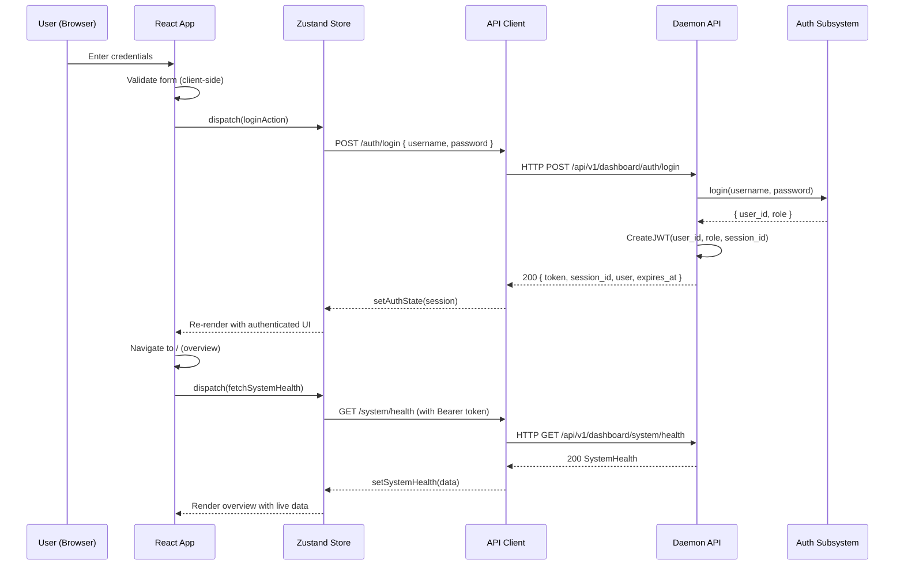

### 9.2 Database Query Flow

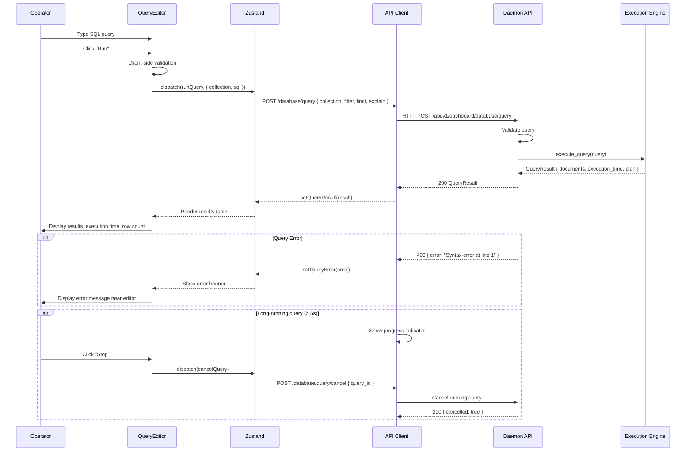

### 9.3 Real-Time Log Streaming Flow

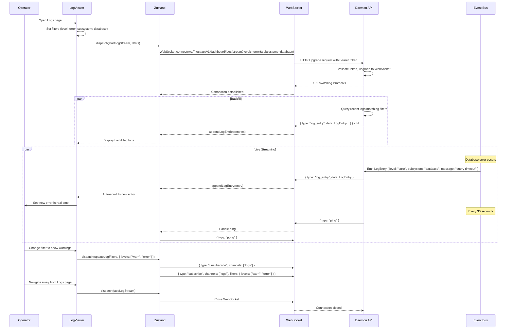

### 9.4 Alert Firing Flow

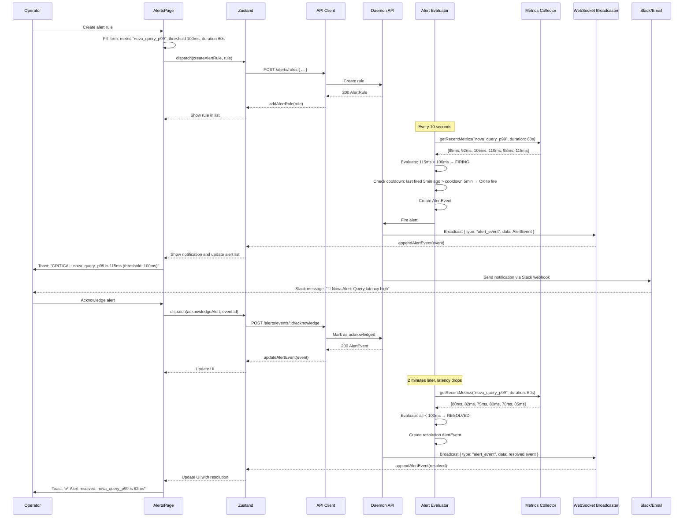

### 9.5 Configuration Change Flow

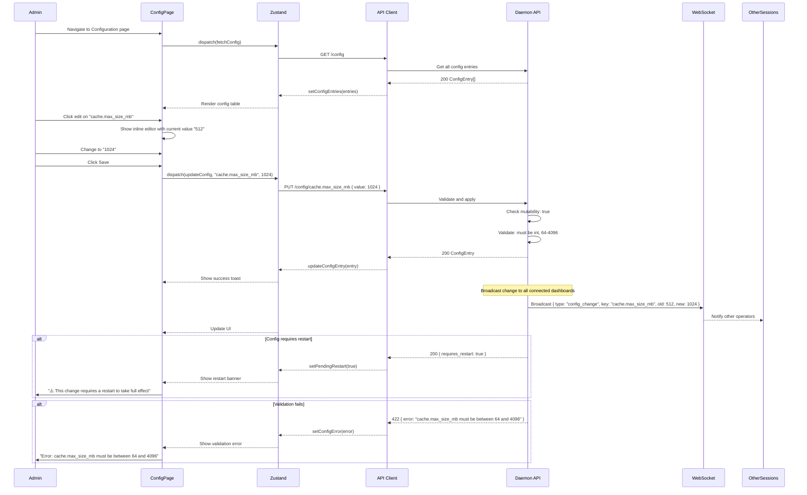

## 10. Failure Modes

| ID | Failure Mode | Cause | Effect | Detection | Severity |
|----|-------------|-------|--------|-----------|----------|
| F01 | Dashboard API unavailable | Daemon crash, port conflict, OOM kill | All dashboard pages return connection errors | Browser shows "Connection Lost" banner, WebSocket disconnects | Critical |
| F02 | Authentication failure | Auth subsystem down, credential store corrupted | Cannot login, all API calls return 401 | Login returns 401, session validation fails | Critical |
| F03 | Token expiry without refresh | Session TTL exceeded, refresh token expired | User redirected to login page | API client detects 401 on any request | High |
| F04 | WebSocket disconnection | Network interruption, daemon restart, proxy timeout | Real-time updates stop, stale data displayed | WebSocket onclose fires, reconnection timer starts | High |
| F05 | Backend subsystem unavailable | Individual subsystem crash (cache, queue, etc.) | Specific dashboard pages show error state | Health check returns degraded/critical for subsystem | High |
| F06 | Slow API response | Backend under load, slow queries, resource contention | Dashboard feels slow, pages time out | API response > 5s threshold, loading spinners persist | Medium |
| F07 | Rate limit exceeded | Too many rapid requests, client bug, scripted access | API returns 429, dashboard shows rate limit warning | Request returns 429 status | Medium |
| F08 | CORS violation | Mismatched origin in config, reverse proxy misconfiguration | Browser blocks API requests (CORS preflight fails) | Console shows CORS error, API calls fail silently | Medium |
| F09 | Stale data displayed | WebSocket disconnected without detection | Numbers don't update, user sees cached state | Compare last_update timestamp with expected interval | Medium |
| F10 | Configuration save race | Two admins save simultaneously | One overwrites the other's change without notification | Last-write-wins without conflict detection | Medium |
| F11 | Invalid query crashes UI | Malformed query response, unexpected null value | Dashboard page crashes, white screen | React error boundary catches the error | Medium |
| F12 | XSS via log entry | Malicious content in log message or field | Embedded script executes in dashboard context | Input not sanitized before rendering | High |
| F13 | Session fixation | Attacker obtains valid session token | Unauthorized access to dashboard | Token leaked in log, URL, or referrer header | Critical |
| F14 | CSRF on mutating requests | Attacker tricks authenticated user into making state-changing requests | Unauthorized configuration change, message publish, job trigger | Missing CSRF token validation | High |
| F15 | Browser memory exhaustion | Streaming logs for extended period, large metric datasets | Tab becomes unresponsive, browser crashes | Memory usage exceeds 500MB in browser task manager | Medium |
| F16 | Websocket message queuing | Network slow, client can't keep up with message rate | Messages pile up in WS buffer, OOM or stale display | WS buffer size > 1000 messages | Medium |
| F17 | Invalid alert rule | Bad metric name, incorrect threshold, infinite evaluation loop | Alert never fires or fires constantly | Alert evaluator detects misconfigured rules | Medium |
| F18 | Large file upload | > 10MB blob upload through dashboard | Upload hangs, browser memory pressure, timeout | Client-side validation should catch early | Low |
| F19 | Prometheus endpoint overload | Too many scrapes, too many metrics | Performance degradation of daemon | High CPU in metrics serialization | Low |
| F20 | Timezone confusion | User and server in different timezones | Log timestamps, schedule times displayed incorrectly | Display UTC time with TZ offset indicator | Low |

## 11. Recovery Strategy

### 11.1 Automatic Recovery

| Failure Mode | Recovery Strategy | Time to Recover | User Impact |
|-------------|-------------------|-----------------|-------------|
| F01 Dashboard API unavailable | Daemon health check restarts dashboard listener; systemd restart if process not respawning | < 5s for listener restart | Brief disconnection, auto-reconnect on retry |
| F02 Authentication failure | Auth subsystem auto-restart; sessions remain valid until they expire | < 2s for subsystem restart | Existing sessions continue; new logins fail until recovery |
| F04 WebSocket disconnection | Client exponential backoff reconnection: 1s, 2s, 4s, 8s, 16s, 30s max | < 60s worst case | Polling fallback to REST API every 5s during disconnect |
| F08 CORS violation | Client detects preflight failure, shows CORS configuration guide | N/A (configuration fix) | Manual fix required; guide provides nginx/Caddy config snippet |
| F11 Invalid query crashes UI | React error boundary catches, shows "Page crashed" with reload button | < 1s | Temporary page loss; other pages remain functional |

### 11.2 Manual Recovery

| Failure Mode | Recovery Steps |
|-------------|----------------|
| F03 Token expiry | 1. Automatic: API client attempts refresh on 401<br>2. If refresh fails: redirect to login page<br>3. User re-enters credentials<br>4. New session created, old sessions cleaned up |
| F05 Subsystem unavailable | 1. Dashboard shows degraded status for affected subsystem<br>2. User investigates via health page<br>3. Subsystem auto-restart attempted<br>4. If persistent: operator uses CLI to restart subsystem or escalate |
| F06 Slow API response | 1. Dashboard shows loading timeout after 30s<br>2. User can cancel pending requests<br>3. Reduce query complexity or time range<br>4. Investigate backend resource usage |
| F07 Rate limit exceeded | 1. Dashboard shows "Too many requests" banner<br>2. Requests queued client-side with 1s delay<br>3. Rate limit resets after 1 minute window<br>4. If persistent: check for client loop bug |
| F09 Stale data | 1. Dashboard shows "Last updated: X seconds ago" indicator<br>2. Manual refresh button on each page<br>3. Auto-refresh on page focus (visibility API)<br>4. Force reconnection on stale detection > 60s |
| F10 Configuration save race | 1. Config endpoint uses last-write-wins<br>2. Dashboard shows "config changed by another session" banner<br>3. Operator reviews pending changes on Config > Diff page<br>4. Can revert to previous values |
| F12 XSS via log entry | 1. All log content rendered as escaped text (not innerHTML)<br>2. React's default escaping handles most cases<br>3. Additional DOMPurify step for any HTML rendering<br>4. CSP headers prevent inline script execution |
| F13 Session fixation | 1. Immediate: revoke all sessions for the affected user<br>2. Dashboard provides "Log out all devices" option<br>3. Force password change<br>4. Audit log investigation |
| F14 CSRF | 1. All state-changing endpoints validate Origin header<br>2. Double-submit cookie pattern with session token<br>3. CSRF token embedded in page meta<br>4. SameSite=Strict cookie attribute |
| F15 Browser memory exhaustion | 1. Log streaming pauses when buffer > 10000 entries<br>2. Virtual scrolling (react-window) for large lists<br>3. "Pause streaming" button prominent when buffer grows<br>4. Automatic GC hint by clearing off-screen entries |
| F17 Invalid alert rule | 1. Alert evaluator validates rules on creation<br>2. If rule fires constantly (every evaluation cycle), auto-disable<br>3. Send notification to admin: "Alert rule X has been auto-disabled"<br>4. Dashboard shows disabled rules in separate list |

### 11.3 Health Check Endpoints

```
GET /api/v1/dashboard/health/live  (liveness probe)
  Response: 200 { status: "alive" }
  Purpose: Check if dashboard HTTP server is running

GET /api/v1/dashboard/health/ready (readiness probe)
  Response: 200 { status: "ready", subsystems: { ... } }
  Purpose: Check if dashboard is functional and backing subsystems are reachable
  Returns 503 if any critical subsystem is unreachable
```

## 12. Performance Considerations

### 12.1 Frontend Performance

| Metric | Target | Measurement |
|--------|--------|-------------|
| Initial bundle size | < 200KB gzipped | Webpack/Vite bundle analyzer |
| Time to Interactive (TTI) | < 2s on 4G | Lighthouse audit |
| First Contentful Paint (FCP) | < 1s | Lighthouse audit |
| Largest Contentful Paint (LCP) | < 1.5s | Lighthouse audit |
| Cumulative Layout Shift (CLS) | < 0.1 | Lighthouse audit |
| First Input Delay (FID) | < 100ms | Lighthouse audit |
| Page transition time | < 300ms | React profiler |
| API response rendering | < 100ms for 1000 rows | React profiler |
| WebSocket message → DOM update | < 50ms | Performance.now() measurement |

### 12.2 Backend Performance (Dashboard API)

| Metric | Target | Notes |
|--------|--------|-------|
| API response time (p50) | < 10ms | Excluding subsystem processing time |
| API response time (p99) | < 50ms | For simple read operations |
| Concurrent dashboard connections | 100 | Limited by WebSocket handler pool |
| Rate limit | 60 req/min per session | Configurable |
| Metrics aggregation latency | < 100ms | For 30-day window with 1m resolution |
| Log query latency | < 500ms | For 7-day range with filters |
| WebSocket message throughput | 1000 msg/s | Single connection |
| Max log streaming rate | 1000 entries/s | Before backpressure kicks in |
| Authentication overhead | < 5ms per request | JWT validation is fast |

### 12.3 Complexity Analysis

| Operation | Time Complexity | Space Complexity | Notes |
|-----------|----------------|-----------------|-------|
| Session creation | O(1) | O(1) | Single map insert |
| Session validation | O(1) | O(1) | JWT decode + map lookup |
| Rate limit check | O(1) | O(1) | Token bucket |
| Collection list | O(n) collections | O(n) | n = number of collections |
| Document list | O(log n) index + O(k) scan | O(k) | k = page size |
| Query execution | O(query complexity) | O(result size) | Delegated to execution engine |
| Cache stats | O(1) | O(1) | Atomically updated counters |
| Queue stats | O(n) queues | O(1) | Aggregated counters |
| Job list | O(n) jobs | O(n) | n = number of jobs |
| Log query | O(log n) index + O(k) scan | O(k) | k = result limit |
| Metrics aggregation | O(m) data points | O(w) buckets | m = raw points, w = window count |
| Alert evaluation | O(r * m) | O(1) | r = rules, m = metric points |
| Config validation | O(1) per key | O(1) | Schema-driven |

### 12.4 Memory Budget

| Component | Memory Budget | Notes |
|-----------|--------------|-------|
| React app (browser) | < 100MB baseline | Increases with data visible |
| Log buffer (browser) | < 50MB | Virtual scrolled, max 10000 entries |
| Metrics data (browser) | < 50MB | Aggregated, never raw |
| Zustand store | < 10MB | State only, no cached responses |
| WebSocket message queue | < 50MB | Backpressure at 1000 queued messages |
| API response cache | Disabled by design | Always fetch fresh data |

### 12.5 Caching Strategy

The dashboard does NOT cache API responses aggressively. Rationale:

- Dashboard is an operational tool; stale data leads to incorrect operator decisions
- Most API responses are small (KB-range) and fast (< 10ms)
- WebSocket provides real-time updates, making cache invalidation complex
- Limited number of concurrent dashboard users (target: < 10 concurrent)

Exceptions:
- System health snapshot: cached 5s on daemon side, refreshed via background goroutine
- Collection list: cached 10s, invalidated on write operations
- Config entries: cached 30s, invalidated on config change

## 13. Security

### 13.1 Threat Model

| Threat | Attack Vector | Impact | Likelihood | Mitigation |
|--------|--------------|--------|------------|------------|
| T01 Unauthorized access | Brute force login, credential stuffing | Full dashboard access | Medium | Rate limiting, account lockout after 5 failed attempts, MFA support |
| T02 Session hijacking | XSS, network sniffing, token leak | Attacker impersonates user | Medium | HttpOnly cookies, Secure flag, short TTL, token binding to IP |
| T03 CSRF | Malicious site triggers state-changing API calls | Unauthorized operations | Medium | SameSite cookies, CSRF tokens, Origin header validation |
| T04 XSS | Log injection, query result injection | Script execution in dashboard | Medium | React's auto-escaping, Content-Security-Policy, input sanitization |
| T05 Privilege escalation | Horizontal/vertical access by modifying role in request | Access to restricted features | Low | Server-side role enforcement, never trust client role claims |
| T06 API key theft | Key exposed in client-side code, log, or network | Programmatic access | Medium | Keys returned once on creation, prefix-based identification, rotation |
| T07 WebSocket hijacking | CSWSH (Cross-Site WebSocket Hijacking) | Real-time data access | Low | Origin validation, token required in connection handshake |
| T08 Information disclosure | Error messages exposing internals, stack traces | System knowledge for attacker | Low | Production error responses are generic, detailed errors logged server-side |
| T09 Denial of service | Excessive API requests, large queries, many WebSocket connections | Dashboard unavailable | Medium | Rate limiting, max connections, query timeout, body size limits |
| T10 Clickjacking | Embedding dashboard in iframe | Trick user into performing actions | Low | X-Frame-Options: DENY header |

### 13.2 Security Headers

```
Content-Security-Policy: default-src 'self';
  script-src 'self';
  style-src 'self' 'unsafe-inline';
  img-src 'self' data:;
  connect-src 'self' ws://localhost:8002 wss://*.example.com;
  font-src 'self';
  object-src 'none';
  frame-ancestors 'none';
  base-uri 'self';
  form-action 'self';

X-Content-Type-Options: nosniff
X-Frame-Options: DENY
X-XSS-Protection: 1; mode=block
Referrer-Policy: strict-origin-when-cross-origin
Strict-Transport-Security: max-age=31536000; includeSubDomains
Permissions-Policy: camera=(), microphone=(), geolocation=()
```

### 13.3 Authentication & Authorization

```
Authentication Flow:
1. User submits credentials
2. Server validates against Auth subsystem
3. Server creates JWT with claims: { sub, session_id, role, iat, exp }
4. Token returned in response body AND set as HttpOnly cookie
5. Subsequent requests validated via Authorization header or cookie
6. Token refreshed automatically when > 75% of TTL elapsed
7. On logout: token invalidated server-side, cookie cleared

Authorization Levels:
  admin:     Full access to all dashboard features
  operator:  All read + operational write (publish test message, trigger job)
             Cannot modify config, manage users, manage API keys
  viewer:    Read-only access. No state-changing operations.

Authorization Enforcement:
  - Enforced server-side on every API call
  - Frontend hides/show UI elements based on role
  - Server rejects unauthorized requests regardless of UI state
```

### 13.4 Password Policy

```
Minimum length: 12 characters
Required character classes: uppercase, lowercase, digit, special character
Maximum length: 128 characters
Password history: last 10 passwords remembered
Password expiry: optional, configurable (default: never expires)
Account lockout: 5 failed attempts → 15 minute lockout
Rate limiting: 10 login attempts per minute per IP
Session limit: 5 concurrent sessions per user
```

### 13.5 API Key Security

```
- Full API key returned exactly once on creation
- Keys stored as bcrypt hash (cost factor 12)
- Key prefix (first 8 chars) used for identification
- Keys can be scoped to specific permissions
- Keys have optional expiry date
- Maximum 100 API keys per account
- Keys are 40 characters: "nova_" + 34 random alphanumeric chars (192-bit entropy)
```

### 13.6 Audit Logging

All state-changing dashboard operations are logged:

```
Events logged:
  - Login / Logout (with IP, user agent)
  - Config changes (before/after values)
  - User management (create, update, delete)
  - API key operations (create, delete)
  - Message publish to queue
  - Job trigger (manual)
  - Blob upload/download through dashboard
  - Alert rule CRUD
  - Failed login attempts

Audit log format:
  { timestamp, user_id, session_id, action, resource, details, ip, user_agent }
```

## 14. Testing

### 14.1 Unit Tests

| Test Area | Tests | Framework | Coverage Target |
|-----------|-------|-----------|-----------------|
| API client | Request building, response parsing, error handling, retry logic, token refresh | Vitest | 95% |
| Zustand store | State mutations, action dispatch, selector memoization | Vitest | 90% |
| React components | Rendering, props, state changes, event handlers, edge cases | React Testing Library | 90% |
| Utility functions | Date formatting, number formatting, validation, string escaping | Vitest | 95% |
| TypeScript types | Type guards, discriminated unions, exhaustive switch checks | ts-expect-error | 100% |
| WebSocket client | Connection, reconnection, message parsing, heartbeat | Vitest + mock WS | 95% |
| Auth helpers | Token storage, token parsing, role checking | Vitest | 95% |
| Alert evaluation logic | Condition evaluation, threshold comparison, cool-down logic | Vitest | 100% |

### 14.2 Integration Tests

| Test Area | Approach | Framework |
|-----------|----------|-----------|
| API client + backend | Mock HTTP server, test full request/response cycle | Vitest + MSW |
| WebSocket + backend | Mock WebSocket server, test subscription channels | Vitest + ws mock |
| Zustand + API | Store actions that call API, test full data flow | Vitest + integration |
| React + backend | Component renders with real API response fixtures | React Testing Library |
| Auth flow | Full login → session → token refresh → logout cycle | Vitest + integration |
| Metrics aggregation | Submit raw points, verify aggregated output | Vitest |
| Alert lifecycle | Create rule → trigger → fire → acknowledge → resolve | Vitest |

### 14.3 E2E Tests (Playwright)

| Test Scenario | Pages | Assertions |
|--------------|-------|------------|
| Login/logout flow | Login, Overview | Successfully authenticated, redirected to overview, session persists across refresh, logout clears session |
| Overview page loads with data | Overview | Health cards render with values, charts render, no errors |
| Browse database collections | Database | Collections list renders, click collection shows documents, pagination works |
| Execute SQL query | Database/Query | Query executes, results table renders, error on invalid SQL |
| View cache stats | Cache | Stats cards render, key browser loads, search filters keys |
| Browse queues and messages | Queue | Queue list renders, click queue shows messages, message details load |
| Trigger scheduled job | Scheduler | Job list renders, trigger shows execution, history updates |
| Test search query | Search | Indexes render, query executes, results show with scores |
| Browse blob buckets | Blob | Buckets list renders, objects load, download works |
| Create/revoke API key | Users | API key created, full key displayed once, key revoked |
| Modify config entry | Config | Config table loads, edit works, validation errors show, save succeeds |
| Stream logs | Logs | Logs load, streaming updates appear, filters work, auto-scroll works |
| View metrics | Metrics | Chart renders, time range selector works, aggregation changes |
| Create alert rule | Alerts | Rule creation form validates, rule appears in list, events tab loads |
| Theme toggle | All | Dark/light theme persists across pages, toggle works |
| Responsive layout | All | Sidebar collapses on mobile, content reflows |

### 14.4 Performance Tests

| Test | Tool | Threshold |
|------|------|-----------|
| Bundle size check | bundlesize | < 200KB gzipped initial |
| Lighthouse audit | Lighthouse CI | Scores > 90 for all categories |
| API response times | k6, custom benchmark | p50 < 10ms, p99 < 50ms |
| Page load with 10k log entries | Playwright + Performance API | < 2s to interactive |
| WebSocket with 100 msg/s | Custom WS client | < 1% message loss |
| 100 concurrent API requests | k6 | 0% error rate at 100 req/s |

### 14.5 Security Tests

| Test | Tool | Scenario |
|------|------|----------|
| XSS injection | OWASP ZAP, manual | Inject script tags in log entries, query results |
| CSRF | Manual test | Submit form from external origin to dashboard |
| CORS misconfiguration | curl | Verify only allowed origins succeed |
| JWT tampering | Manual | Modify token claims, verify rejection |
| Rate limiting | k6 | Send 100 requests/minute, verify 429 after 60 |
| Session fixation | Manual | Use stolen token, verify IP binding check |
| SQL injection via dashboard | Manual | Inject SQL in query editor, verify parameterized queries |
| CSP bypass | OWASP ZAP | Test all CSP directives for bypass opportunities |

### 14.6 Test Fixtures

```typescript
// Test data factories

const createMockHealth = (overrides?: Partial<SystemHealth>): SystemHealth => ({
  status: "healthy",
  uptime_seconds: 3600 * 24 * 12,
  version: "0.1.0",
  build_info: {
    commit_hash: "abc123def456",
    build_time: 1748822400,
    rust_version: "1.80.0",
    features: ["database", "cache", "queue"],
  },
  cpu: { usage_percent: 23.5, load_avg_1m: 0.5, load_avg_5m: 0.4, load_avg_15m: 0.3, cores: 4, temperature_celsius: 65 },
  memory: { total_bytes: 8589934592, used_bytes: 1288490188, resident_bytes: 524288000, allocated_bytes: 268435456, cache_bytes: 1073741824, swap_used_bytes: 0, swap_total_bytes: 2147483648 },
  disk: { data_path: "/var/lib/novad", total_bytes: 107374182400, used_bytes: 48318382080, free_bytes: 59055800320, fs_type: "ext4", read_ops_per_sec: 120, write_ops_per_sec: 85, read_bytes_per_sec: 5242880, write_bytes_per_sec: 2097152, io_wait_percent: 1.2 },
  network: { rx_bytes_per_sec: 1048576, tx_bytes_per_sec: 524288, rx_packets_per_sec: 1200, tx_packets_per_sec: 800, connections_active: 42, connection_errors: 0, tcp_retransmit_percent: 0.01 },
  subsystems: [
    { name: "storage", status: "healthy", uptime_seconds: 3600 * 24 * 12, metrics: { ops_total: 1234567, errors_total: 0 }, last_error: null, last_error_time: null },
    { name: "cache", status: "healthy", uptime_seconds: 3600 * 24 * 12, metrics: { hit_ratio: 0.94, entries: 12847 }, last_error: null, last_error_time: null },
  ],
  last_checked: Date.now(),
  ...overrides,
});

const createMockDocument = (overrides?: Partial<Document>): Document => ({
  id: generateId("doc"),
  collection: "users",
  data: { name: "John Doe", email: "john@example.com", age: 42 },
  created_at: Date.now() - 3600000,
  updated_at: Date.now() - 120000,
  version: 3,
  size_bytes: 342,
  ...overrides,
});

const createMockLogEntry = (overrides?: Partial<LogEntry>): LogEntry => ({
  timestamp: Date.now(),
  level: "info",
  subsystem: "database",
  message: "Query executed successfully",
  fields: { duration_ms: 2.3, rows_returned: 10 },
  file: "src/storage/engine.rs",
  line: 142,
  trace_id: "trace_abc123",
  span_id: "span_def456",
  ...overrides,
});

const createMockAlertRule = (overrides?: Partial<AlertRule>): AlertRule => ({
  id: generateId("rule"),
  name: "High query latency",
  description: "Alert when P99 query latency exceeds 100ms for 60 seconds",
  metric: "nova_query_latency_p99",
  condition: "above",
  threshold: 100,
  duration_seconds: 60,
  severity: "critical",
  channels: ["channel_slack"],
  enabled: true,
  cooldown_seconds: 300,
  last_fired_at: null,
  created_at: Date.now() - 86400000,
  updated_at: Date.now() - 86400000,
  ...overrides,
});

const generateId = (prefix: string): string =>
  `${prefix}_${Array.from({ length: 16 }, () => Math.random().toString(36)[2]).join('')}`;
```

## 15. Future Work

### 15.1 v1.1 Features

- **Dashboard plugins**: Allow third-party React components to be loaded as dashboard plugins, registered via configuration
- **Custom dashboards**: User-configurable dashboard layouts with drag-and-drop widgets
- **Saved queries**: Named, parameterized SQL queries that can be shared between dashboard users
- **Dashboard themes**: Custom theming API with CSS variable overrides
- **Keyboard shortcuts**: Global shortcut system for common operations (Cmd+R run query, etc.)
- **Multi-language support**: i18n with react-intl, initially supporting English and Chinese

### 15.2 v1.2 Features

- **Dark mode scheduler**: Schedule dashboard actions (e.g., "run report at 3 AM and email")
- **Dashboard API documentation**: Interactive OpenAPI/Swagger UI for dashboard API
- **Webhook test panel**: UI for testing webhook endpoints with custom payloads
- **Tracing visualization**: Jaeger/Zipkin-style trace viewer for distributed tracing
- **Cluster view**: When clustering is implemented, show all nodes, their health, and data distribution
- **Performance advisor**: Automated suggestions based on observed metrics (e.g., "Consider increasing cache size from 512MB to 768MB based on 94% hit rate")

### 15.3 v2.0 Features

- **Mobile app**: React Native dashboard for mobile monitoring
- **Dashboard SSO**: SAML/OIDC integration with Okta, Azure AD, Google Workspace
- **Advanced analytics**: Built-in query analytics showing slow queries, hot collections, access patterns
- **Custom metrics**: User-defined metrics via dashboard without daemon restart
- **Multi-tenancy**: Team-based dashboard access with resource-level permissions
- **Dashboard export/import**: Export dashboard configuration as YAML for version control

## 16. Open Questions

1. **Should the dashboard server be a separate process from the daemon?**
   - Option A: Embedded in daemon (current design). Simpler deployment, single process to manage, shared memory space. Risk: dashboard issues could affect core daemon.
   - Option B: Separate process. Independent crash isolation, can be deployed on separate infrastructure. Complexity: communication between processes, two deployments.
   - Decision: Embedded in daemon for v1. Separation can be extracted later using the same API contract. The dashboard runs on a separate HTTP listener with its own thread pool, providing process-style isolation within the daemon.

2. **Should the dashboard use client-side routing or server-side routing?**
   - Client-side routing (React Router) chosen for SPA responsiveness. Server-side rendering evaluation deferred to v1.1 if initial load time becomes an issue.

3. **What is the authentication story for the dashboard?**
   - v1: Local Nova auth subsystem (username/password stored in Nova). SSO (OIDC/SAML) deferred to v1.1.

4. **Should the dashboard support real-time collaboration?**
   - Deferred to v2.0. v1 is single-user-session-focused. Multiple sessions can be open but there is no awareness of other sessions.

5. **How do we handle very large datasets in the browser?**
   - Virtual scrolling (react-window) for lists. Server-side pagination. Metrics aggregation happens server-side. Log viewer uses virtual scrolling capped at 10,000 visible entries.

6. **Should the dashboard expose a public API?**
   - The dashboard API is for the dashboard client only. Programmatic access should use the main REST API or GraphQL API. Dashboard API routes are subject to change without notice.

7. **What is the upgrade story for the dashboard frontend?**
   - Dashboard assets are embedded in the daemon binary using `rust-embed`. On daemon upgrade, the dashboard is automatically updated. No separate frontend deployment needed.

8. **Should we support custom branding/whitelabeling?**
   - Deferred to v2.0. v1 uses Nova branding with configurable title and logo via config.

9. **How do we handle browser compatibility?**
   - Support last 2 versions of Chrome, Firefox, Safari, Edge. No IE11 support. ES2020 target for TypeScript compilation.

10. **Should the dashboard have a "dark mode" by default?**
    - Yes. Dark mode is default (matches the CLI aesthetic). Light mode is available via toggle. Preference is persisted in localStorage and synced to server if authenticated.

## 17. References

1. **React 18 Documentation** - https://react.dev/
2. **TypeScript Handbook** - https://www.typescriptlang.org/docs/
3. **Zustand State Management** - https://github.com/pmndrs/zustand
4. **Radix UI Primitives** - https://www.radix-ui.com/
5. **Recharts** - https://recharts.org/
6. **Tailwind CSS** - https://tailwindcss.com/
7. **Vite** - https://vitejs.dev/
8. **Playwright** - https://playwright.dev/
9. **OWASP Top Ten** - https://owasp.org/www-project-top-ten/
10. **Prometheus Exposition Format** - https://prometheus.io/docs/instrumenting/exposition_formats/
11. **Content Security Policy** - https://developer.mozilla.org/en-US/docs/Web/HTTP/CSP
12. **WebSocket API (MDN)** - https://developer.mozilla.org/en-US/docs/Web/API/WebSocket
13. **React Error Boundaries** - https://react.dev/reference/react/Component#catching-rendering-errors-with-an-error-boundary
14. **JSON Web Token (RFC 7519)** - https://datatracker.ietf.org/doc/html/rfc7519
15. **Token Bucket Algorithm** - https://en.wikipedia.org/wiki/Token_bucket
16. **rust-embed** - https://github.com/pyros2097/rust-embed
17. **Pattern: API Gateway / Backend for Frontend** - https://microservices.io/patterns/apigateway.html
