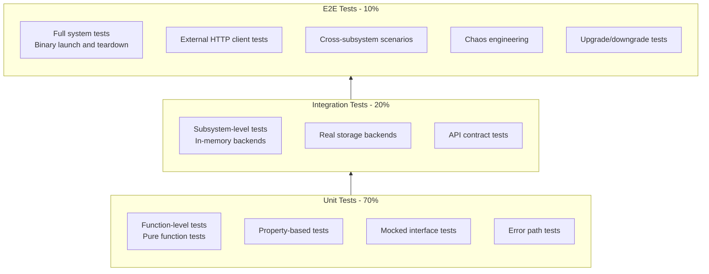
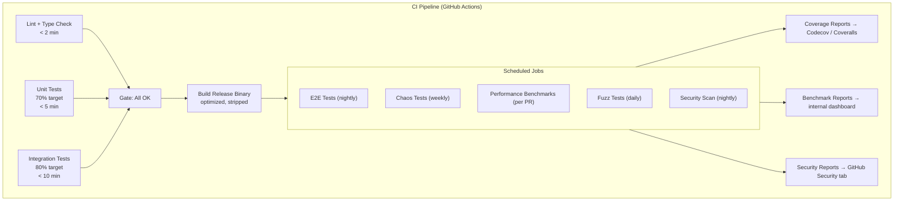
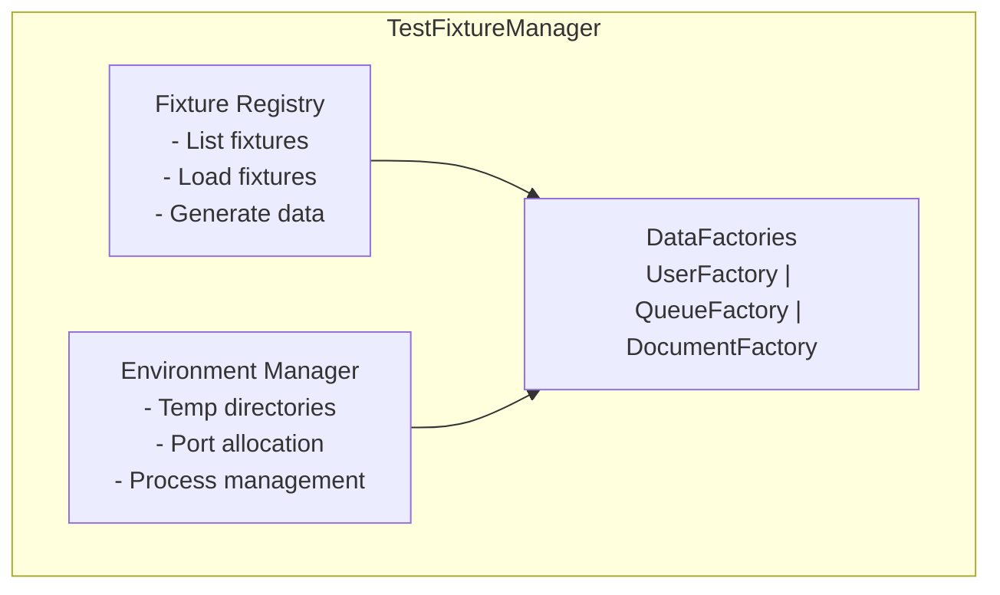
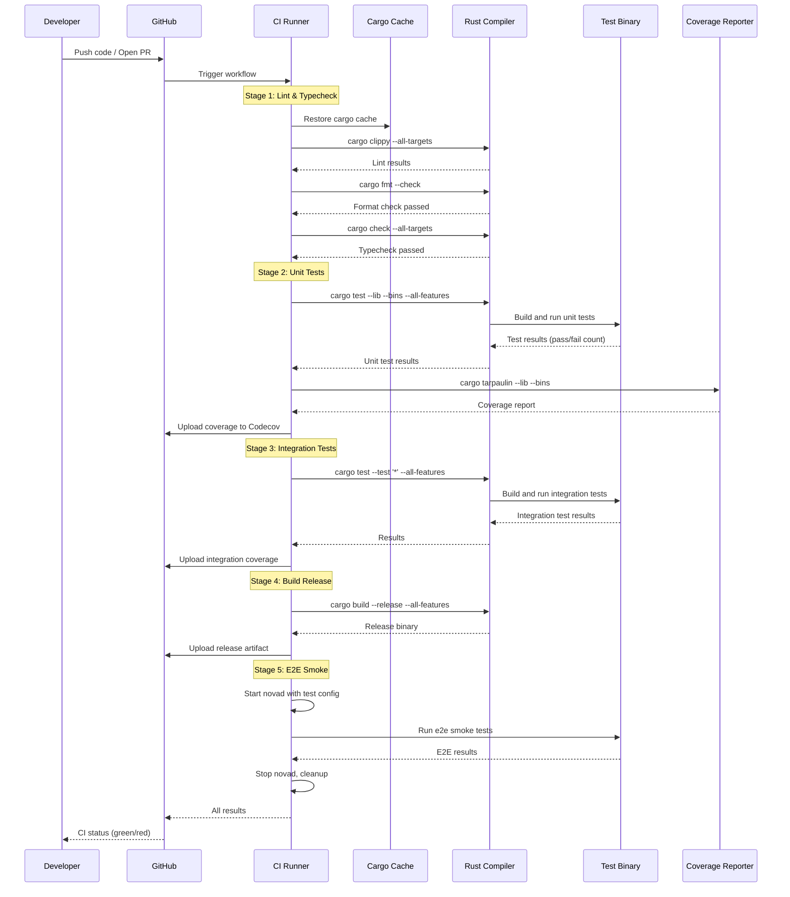
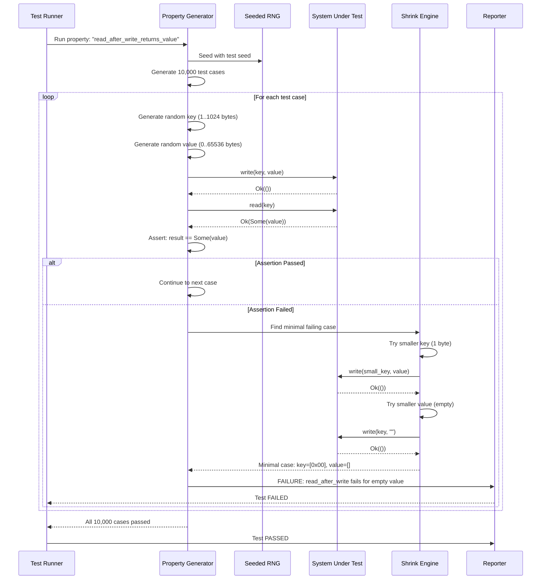
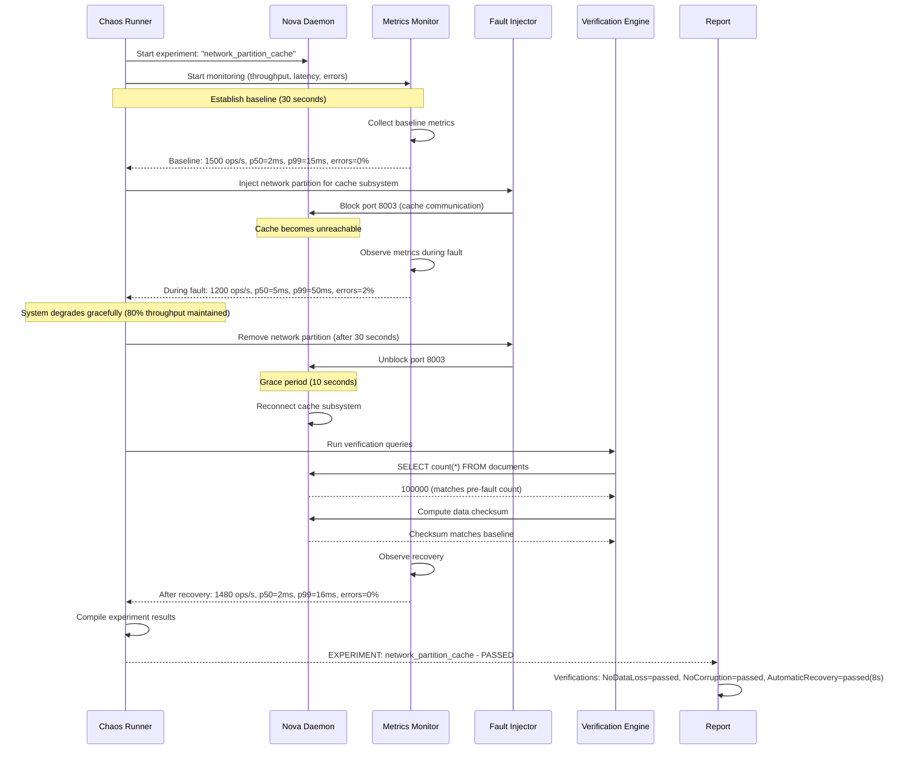
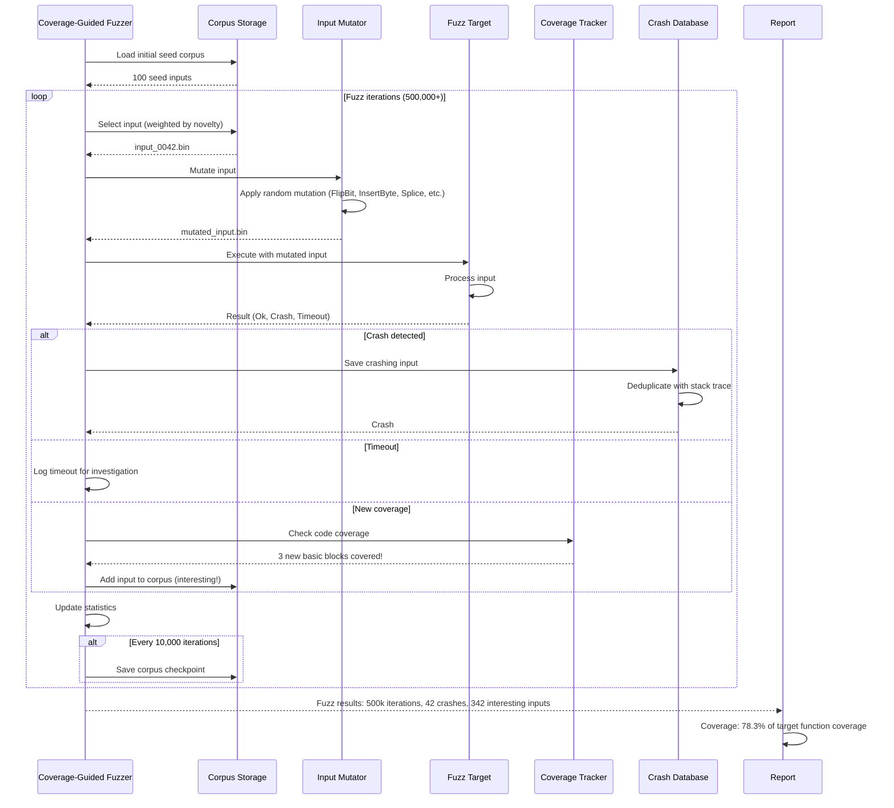

# Document 27: Testing Strategy

## 1. Purpose

This document defines the comprehensive testing strategy for Nova Runtime. It establishes the principles, methodologies, tools, and processes for ensuring correctness, reliability, and performance of the system. The strategy covers all levels of the test pyramid, from unit tests through chaos engineering, and integrates with the CI/CD pipeline for continuous quality assurance.

Testing is not an afterthought in Nova Runtime. The development philosophy mandates "Implementation Fourth, Optimization Fifth" — testing is embedded into every phase of implementation. No feature is considered complete until its tests pass at all levels of the pyramid.

## 2. Scope

This document covers:

- Test pyramid breakdown: unit (70%), integration (20%), end-to-end (10%)
- Unit testing strategy: property-based testing, mocking, trait-based testability
- Integration testing: subsystem-level tests, in-memory backends, real storage
- End-to-end testing: full system tests, external HTTP clients, binary execution
- Chaos engineering: fault injection, network partition simulation, crash recovery
- Fuzz testing: API, SQL parser, event deserialization, blob format
- Performance testing: regression detection, profiling, flamegraph generation
- Security testing: SAST, DAST, dependency scanning, fuzzing
- CI/CD pipeline: per-commit testing, per-PR benchmarks, nightly e2e
- Test infrastructure: fixtures, factories, environment management, data generation
- Coverage targets and measurement

## 3. Responsibilities

- **Unit tests**: Responsibility of the developer implementing the code. Enforced by CI.
- **Integration tests**: Written by the developer, reviewed by subsystem lead. Run on every PR.
- **E2E tests**: Written by QA team (or developer in QA role). Run nightly and on release branches.
- **Fuzz tests**: Run continuously in CI on a schedule (daily). Results reviewed weekly.
- **Performance tests**: Run on every PR that touches performance-sensitive code. Reviewed by performance engineer.
- **Security tests**: Run nightly. Findings triaged by security lead within 24 hours for critical, 72 hours for high.
- **Chaos tests**: Run weekly. Results reviewed by infrastructure team.
- **Coverage enforcement**: CI will fail if coverage drops below targets.
- **Test infrastructure maintenance**: Shared responsibility of platform team.

## 4. Non Responsibilities

- Testing does not replace code review. All production code must be reviewed regardless of test coverage.
- Testing does not guarantee absence of bugs. The goal is to make bugs unlikely and detectable, not impossible.
- Cli integration tests (testing the CLI tool itself) are covered in document 24 (CLI), not here.
- Dashboard e2e tests are covered in document 26 (Dashboard), though referenced here for the CI pipeline.
- Manual testing is not a primary strategy. All testing should be automated where feasible.
- Testing does not include formal verification (model checking, theorem proving) in v1.

## 5. Architecture

### 5.1 Test Pyramid



### 5.2 Test Directory Structure

```
nova/
├── src/                          # Production source code
├── tests/                        # Integration and E2E tests
│   ├── integration/              # Subsystem integration tests
│   │   ├── storage/             # Storage engine integration
│   │   ├── cache/               # Cache integration
│   │   ├── queue/               # Queue integration
│   │   ├── scheduler/           # Scheduler integration
│   │   ├── search/              # Search integration
│   │   ├── blob/                # Blob storage integration
│   │   ├── auth/                # Auth integration
│   │   ├── sql/                 # SQL layer integration
│   │   ├── api/                 # REST API integration
│   │   └── graphql/             # GraphQL integration
│   ├── e2e/                     # End-to-end tests
│   │   ├── scenarios/           # Cross-subsystem scenarios
│   │   ├── chaos/               # Chaos engineering tests
│   │   ├── upgrade/             # Upgrade/downgrade tests
│   │   └── fixtures/            # Test data for e2e
│   ├── fuzz/                    # Fuzz test targets
│   │   ├── api_fuzz.rs         # API request fuzzing
│   │   ├── sql_fuzz.rs         # SQL parser fuzzing
│   │   ├── event_fuzz.rs       # Event deserialization
│   │   └── blob_fuzz.rs        # Blob format fuzzing
│   └── benches/                 # Benchmarks (see doc 28)
├── fuzz/                        # Cargo-fuzz targets
│   ├── Cargo.toml
│   └── targets/
├── scripts/
│   ├── test.sh                  # Main test runner
│   ├── coverage.sh              # Coverage report generator
│   └── chaos.sh                 # Chaos test runner
└── nova-dashboard/              # Dashboard frontend (separate test setup)
    ├── src/
    │   ├── __tests__/           # Unit tests (Vitest)
    │   └── __integration__/     # Integration tests (Vitest + MSW)
    ├── e2e/                     # Playwright tests
    └── playwright.config.ts
```

### 5.3 Test Infrastructure



### 5.4 Test Execution Environments

| Environment | Purpose | Spec | Tools |
|-------------|---------|------|-------|
| CI-small | Unit + Integration tests | 2 vCPU, 4GB RAM, 30GB SSD | cargo test, cargo nextest |
| CI-large | E2E + Benchmark tests | 4 vCPU, 8GB RAM, 50GB SSD | cargo test --release, k6 |
| Dev | Local development | Developer machine | cargo test, cargo nextest |
| Pre-release | Full suite before release | 8 vCPU, 16GB RAM, 100GB SSD | Full test matrix |
| Fuzz | Continuous fuzzing | 4 vCPU, 8GB RAM, 24h runtime | cargo-fuzz, afl.rs |

### 5.5 Test Fixture Architecture



## 6. Data Structures

### 6.1 Test Configuration

```rust
/// Global test configuration loaded from environment or config file
#[derive(Debug, Clone)]
pub struct TestConfig {
    /// Path to novad binary (for e2e tests)
    pub novad_binary_path: Option<PathBuf>,

    /// Data directory for test storage
    pub data_dir: PathBuf,

    /// Port range for test servers (start, end)
    pub port_range: (u16, u16),

    /// Whether to use in-memory backends (faster, less realistic)
    pub use_in_memory_backends: bool,

    /// Timeout for test operations in seconds
    pub operation_timeout_secs: u64,

    /// Timeout for entire test suite in seconds
    pub suite_timeout_secs: u64,

    /// Seed for deterministic test data generation
    pub seed: u64,

    /// Whether to preserve test data after test completion
    pub preserve_data: bool,

    /// Log level for test output
    pub log_level: LogLevel,

    /// Database type for SQL tests
    pub sql_backend: SqlBackend,
}

#[derive(Debug, Clone, PartialEq)]
pub enum SqlBackend {
    InMemory,
    Sqlite,
    NovaStorage,
}

#[derive(Debug, Clone, PartialEq)]
pub enum LogLevel {
    Trace,
    Debug,
    Info,
    Warn,
    Error,
}
```

### 6.2 Test Result Types

```rust
/// Structured test result for reporting
#[derive(Debug, Clone, Serialize)]
pub struct TestResult {
    pub name: String,
    pub category: TestCategory,
    pub status: TestStatus,
    pub duration_ms: u64,
    pub assertions: u64,
    pub failures: Vec<TestFailure>,
    pub coverage: Option<CoverageSnapshot>,
    pub timestamp: DateTime<Utc>,
}

#[derive(Debug, Clone, PartialEq, Serialize)]
pub enum TestCategory {
    Unit,
    Integration,
    E2e,
    Fuzz,
    Performance,
    Security,
    Chaos,
}

#[derive(Debug, Clone, PartialEq, Serialize)]
pub enum TestStatus {
    Passed,
    Failed,
    Skipped,
    Flaky,
    TimedOut,
}

#[derive(Debug, Clone, Serialize)]
pub struct TestFailure {
    pub file: String,
    pub line: u32,
    pub message: String,
    pub expected: Option<String>,
    pub actual: Option<String>,
    pub backtrace: Option<String>,
}

#[derive(Debug, Clone, Serialize)]
pub struct CoverageSnapshot {
    pub line_coverage: f64,
    pub branch_coverage: f64,
    pub function_coverage: f64,
    pub files: Vec<FileCoverage>,
}

#[derive(Debug, Clone, Serialize)]
pub struct FileCoverage {
    pub path: String,
    pub line_coverage: f64,
    pub uncovered_lines: Vec<u32>,
}
```

### 6.3 Property-Based Test Structure

```rust
/// Property test configuration
#[derive(Debug, Clone)]
pub struct PropertyTestConfig {
    /// Number of test cases to generate
    pub test_cases: u64,

    /// Maximum size of generated data
    pub max_data_size: usize,

    /// Seed for reproducibility
    pub seed: Option<u64>,

    /// Shrink attempts to find minimal failing case
    pub shrink_attempts: u64,

    /// Timeout per test case
    pub case_timeout_ms: u64,

    /// Whether to collect statistics about generated values
    pub collect_stats: bool,
}

impl Default for PropertyTestConfig {
    fn default() -> Self {
        Self {
            test_cases: 10_000,
            max_data_size: 1024 * 1024, // 1MB
            seed: None,
            shrink_attempts: 100,
            case_timeout_ms: 5000,
            collect_stats: true,
        }
    }
}
```

### 6.4 Chaos Test Definitions

```rust
/// Chaos experiment definition
#[derive(Debug, Clone, Serialize, Deserialize)]
pub struct ChaosExperiment {
    pub name: String,
    pub description: String,
    pub target: ChaosTarget,
    pub action: ChaosAction,
    pub duration_secs: u64,
    pub grace_period_secs: u64,
    pub expected_behavior: ExpectedBehavior,
    pub verification_queries: Vec<String>,
}

#[derive(Debug, Clone, PartialEq, Serialize, Deserialize)]
pub enum ChaosTarget {
    Process,           // Kill or restart the process
    Network,           // Network partition or latency
    Disk,              // Disk full, slow I/O, or failure
    Memory,            // Memory pressure or OOM
    Cpu,               // CPU starvation
    Clock,             // Clock skew or jump
    Subsystem(String), // Specific subsystem (cache, queue, etc.)
}

#[derive(Debug, Clone, PartialEq, Serialize, Deserialize)]
pub enum ChaosAction {
    Kill,
    Restart,
    Pause(Duration),
    InjectLatency { mean_ms: u64, jitter_ms: u64 },
    DropPackets { percentage: f64 },
    CorruptData { probability: f64 },
    FillDisk { size_mb: u64 },
    ThrottleCpu { quota_percent: f64 },
    AdvanceClock { offset_secs: i64 },
    SubsystemPanic,
    SubsystemDeadlock,
}

#[derive(Debug, Clone, PartialEq, Serialize, Deserialize)]
pub enum ExpectedBehavior {
    GracefulDegradation,
    AutomaticRecovery,
    NoDataLoss,
    NoCorruption,
    CrashWithRestart,
    ReadOnlyMode,
}
```

### 6.5 Fuzz Test Structure

```rust
/// Fuzz test target definition
#[derive(Debug, Clone)]
pub struct FuzzTarget {
    pub name: &'static str,
    pub description: &'static str,
    pub input_type: FuzzInputType,
    pub max_input_size: usize,
    pub timeout_secs: u64,
    pub corpus_dir: PathBuf,
    pub artifacts_dir: PathBuf,
}

#[derive(Debug, Clone, PartialEq)]
pub enum FuzzInputType {
    Bytes,
    String,
    Json,
    HttpRequest,
    SqlQuery,
    EventMessage,
    BlobChunk,
    ConfigYaml,
}
```

### 6.6 Mock Infrastructure

```rust
/// Generic trait for making storage engines testable
#[async_trait]
pub trait StorageEngine: Send + Sync {
    async fn read(&self, key: &[u8]) -> Result<Option<Vec<u8>>, StorageError>;
    async fn write(&self, key: &[u8], value: &[u8]) -> Result<(), StorageError>;
    async fn delete(&self, key: &[u8]) -> Result<bool, StorageError>;
    async fn scan(&self, prefix: &[u8]) -> Result<Vec<(Vec<u8>, Vec<u8>)>, StorageError>;
    async fn flush(&self) -> Result<(), StorageError>;
}

/// In-memory implementation for tests
pub struct InMemoryStorage {
    data: RwLock<BTreeMap<Vec<u8>, Vec<u8>>>,
}

#[async_trait]
impl StorageEngine for InMemoryStorage {
    async fn read(&self, key: &[u8]) -> Result<Option<Vec<u8>>, StorageError> {
        let data = self.data.read().await;
        Ok(data.get(key).cloned())
    }

    async fn write(&self, key: &[u8], value: &[u8]) -> Result<(), StorageError> {
        let mut data = self.data.write().await;
        data.insert(key.to_vec(), value.to_vec());
        Ok(())
    }

    async fn delete(&self, key: &[u8]) -> Result<bool, StorageError> {
        let mut data = self.data.write().await;
        Ok(data.remove(key).is_some())
    }

    async fn scan(&self, prefix: &[u8]) -> Result<Vec<(Vec<u8>, Vec<u8>)>, StorageError> {
        let data = self.data.read().await;
        Ok(data
            .range(prefix.to_vec()..)
            .take_while(|(k, _)| k.starts_with(prefix))
            .map(|(k, v)| (k.clone(), v.clone()))
            .collect())
    }

    async fn flush(&self) -> Result<(), StorageError> {
        Ok(())
    }
}

/// Mock that records all operations for assertions
pub struct MockStorage {
    operations: Arc<Mutex<Vec<StorageOperation>>>,
    read_results: Arc<Mutex<HashMap<Vec<u8>, Result<Option<Vec<u8>>, StorageError>>>>,
}

#[derive(Debug, Clone, PartialEq)]
pub enum StorageOperation {
    Read { key: Vec<u8> },
    Write { key: Vec<u8>, value_size: usize },
    Delete { key: Vec<u8> },
    Scan { prefix: Vec<u8> },
    Flush,
}

impl MockStorage {
    pub fn new() -> Self { ... }
    pub fn stub_read(&self, key: &[u8], result: Result<Option<Vec<u8>>, StorageError>) { ... }
    pub fn assert_operation_count(&self, op: StorageOperation, count: usize) { ... }
    pub fn assert_operations_in_order(&self, ops: &[StorageOperation]) { ... }
    pub fn assert_read_count(&self, key: &[u8], count: usize) { ... }
    pub fn clear(&self) { ... }
}
```

## 7. Algorithms

### 7.1 Property-Based Test Generation

```
Algorithm: PropertyTestGenerator
Purpose: Generate test cases that verify invariants of storage engine operations

GENERATE_PROPERTY_TESTS(engine_type, seed):
  rng = SeededRng(seed)
  tests = []

  // Invariant 1: Read-after-write returns written value
  tests.push({
    name: "read_after_write_returns_value",
    run: || {
      key = random_bytes(rng, 1..1024)
      value = random_bytes(rng, 0..65536)
      engine.write(key, value).await.unwrap()
      result = engine.read(key).await.unwrap()
      assert_eq(result, Some(value))
    }
  })

  // Invariant 2: Read-after-delete returns None
  tests.push({
    name: "read_after_delete_returns_none",
    run: || {
      key = random_bytes(rng, 1..1024)
      value = random_bytes(rng, 0..65536)
      engine.write(key, value).await.unwrap()
      engine.delete(key).await.unwrap()
      result = engine.read(key).await.unwrap()
      assert_eq(result, None)
    }
  })

  // Invariant 3: Scan returns all written keys with prefix
  tests.push({
    name: "scan_returns_prefix_matches",
    run: || {
      prefix = random_bytes(rng, 1..16)
      expected_keys = []
      for i in 0..random_int(rng, 0..100):
        key = concat(prefix, random_bytes(rng, 1..32))
        value = random_bytes(rng, 0..1024)
        engine.write(key, value).await.unwrap()
        if key starts_with prefix:
          expected_keys.push(key)

      // Also write non-matching keys
      for i in 0..random_int(rng, 0..50):
        key = random_bytes(rng, 1..64)  // unlikely to match prefix
        engine.write(key, random_bytes(rng, 0..1024)).await.unwrap()

      results = engine.scan(prefix).await.unwrap()
      result_keys = results.map(|(k, _)| k)
      assert_eq(sort(result_keys), sort(expected_keys))
    }
  })

  // Invariant 4: Double delete is idempotent
  tests.push({
    name: "double_delete_is_idempotent",
    run: || {
      key = random_bytes(rng, 1..1024)
      engine.write(key, random_bytes(rng, 0..1024)).await.unwrap()
      result1 = engine.delete(key).await.unwrap()
      result2 = engine.delete(key).await.unwrap()
      assert_eq(result1, true)
      assert_eq(result2, false)  // second delete returns false
    }
  })

  // Invariant 5: Concurrent writes are linearizable
  tests.push({
    name: "concurrent_writes_are_linearizable",
    run: || {
      key = b"shared_key"
      threads = 8
      handles = []
      for i in 0..threads:
        value = format!("value_{}", i).into_bytes()
        handles.push(spawn(engine.write(key, value)))

      join_all(handles).await
      final_value = engine.read(key).await.unwrap()
      assert(final_value is Some)
      // Value should be one of the written values
      assert(expected_values.contains(final_value))
    }
  })

  return tests

RUN_PROPERTY_TESTS(engine, tests, config):
  for each test in tests:
    for iteration in 0..config.test_cases:
      result = test.run()
      if result is Err:
        shrunk = shrink_test_case(test, iteration, config)
        report_failure(test.name, shrunk)
        return FAILED
      if iteration > 0 and iteration % 1000 == 0:
        print_progress(test.name, iteration, config.test_cases)
  return PASSED
```

### 7.2 Coverage-Guided Fuzz Testing

```
Algorithm: CoverageGuidedFuzzer
Purpose: Fuzz test inputs while maximizing code coverage

FUZZ_TARGET(target, config):
  // Initialize with corpus
  corpus = load_corpus(target.corpus_dir)  // seed inputs
  coverage_map = HashMap<CodeRegion, bool>()
  mutator = Mutator::new(target.input_type)
  stats = FuzzStats { total: 0, crashes: 0, coverage: 0 }

  while stats.total < max_iterations:
    // Select input from corpus (weighted by novelty)
    input = select_input(corpus, coverage_map)

    // Mutate the input
    mutated = mutator.mutate(input)

    // Execute target with mutated input
    result = execute_with_timeout(target, mutated, target.timeout_secs)

    stats.total += 1

    if result is Crash:
      stats.crashes += 1
      save_artifact(target.artifacts_dir, mutated, "crash")
      continue

    if result is Timeout:
      save_artifact(target.artifacts_dir, mutated, "timeout")
      continue

    // Check coverage
    new_coverage = get_new_coverage(mutated, coverage_map)
    if new_coverage:
      stats.coverage += 1
      corpus.push(mutated)
      coverage_map.merge(new_coverage)

    // Periodically save corpus
    if stats.total % 10000 == 0:
      save_corpus(target.corpus_dir, corpus)
      report_progress(stats)

  report_final_summary(stats)
  return stats

MUTATE(input, input_type):
  strategies = match input_type:
    Bytes => [FlipBit, FlipByte, InsertByte, DeleteByte, ShuffleBytes, Splice]
    SqlQuery => [AddWhitespace, ReplaceKeyword, ChangeOperator,
                 NestParens, AddWhereClause, BreakString]
    HttpRequest => [ChangeMethod, AddHeader, ModifyPath,
                    CorruptBody, SplitChunks]
    // ... other input types

  strategy = pick_weighted(strategies)
  return strategy.apply(input)
```

### 7.3 Flaky Test Detection

```
Algorithm: FlakyTestDetector
Purpose: Detect flaky tests by running them multiple times

DETECT_FLAKY_TESTS(test_suite, reruns=10, threshold=0.3):
  // threshold: 30% of runs must agree
  flaky_tests = []

  for test in test_suite:
    results = []
    for i in 0..reruns:
      result = run_test(test, isolate=true, seed=i)
      results.push(result)

    pass_count = count(results, PASSED)
    fail_count = count(results, FAILED)

    if pass_count > 0 and fail_count > 0:
      flakiness = min(pass_count, fail_count) / reruns
      if flakiness >= threshold:
        flaky_tests.push({
          name: test.name,
          flakiness: flakiness,
          pass_rate: pass_count / reruns,
          sample_failures: sample(results, 3) where FAILED
        })

  return flaky_tests

QUARANTINE_FLAKY_TEST(test):
  // Move flaky test to quarantine suite
  // Run in CI but don't fail build
  // Notify team lead
  // Auto-re-enable if passes 10 consecutive runs
  move_to_quarantine(test)
  while true:
    results = []
    for i in 0..10:
      results.push(run_test(test))
    if all(results == PASSED):
      promote_from_quarantine(test)
      notify("Test {} is no longer flaky", test.name)
      break
    sleep(1 day)
```

### 7.4 Chaos Test Execution

```
Algorithm: ChaosTestExecutor
Purpose: Execute chaos experiments and verify system behavior

EXECUTE_CHAOS_EXPERIMENT(experiment, system):
  system.log("Starting experiment: {}", experiment.name)
  system.log("Target: {}, Action: {:?}", experiment.target, experiment.action)

  // Step 1: Establish baseline
  baseline = system.measure_baseline(duration: 30_seconds)
  system.assert_healthy()

  // Step 2: Start verification monitoring
  monitor = system.start_monitoring(
    metrics: [throughput, latency_p50, latency_p99, error_rate],
    interval: 1_second
  )

  // Step 3: Inject fault
  system.log("Injecting fault...")
  fault_handle = system.inject_fault(
    target: experiment.target,
    action: experiment.action
  )

  // Step 4: Wait for fault duration
  sleep(experiment.duration_secs)

  // Step 5: Remove fault
  system.log("Removing fault...")
  fault_handle.remove()
  system.log("Grace period: {}s", experiment.grace_period_secs)
  sleep(experiment.grace_period_secs)

  // Step 6: Verify expectations
  results = monitor.stop()

  verifications = []

  // Verify no data loss
  if experiment.expected_behavior includes NoDataLoss:
    for query in experiment.verification_queries:
      result = system.execute_query(query)
      data_loss = baseline.matching_count(query) - result.count
      verifications.push({
        check: "NoDataLoss",
        query: query,
        passed: data_loss == 0,
        data_loss: data_loss
      })

  // Verify no corruption
  if experiment.expected_behavior includes NoCorruption:
    checksum = system.compute_checksum()
    verifications.push({
      check: "NoCorruption",
      passed: checksum == baseline.checksum
    })

  // Verify automatic recovery
  if experiment.expected_behavior includes AutomaticRecovery:
    recovery_time = results.time_until_stable(baseline)
    verifications.push({
      check: "AutomaticRecovery",
      passed: recovery_time < Duration::seconds(30),
      recovery_time: recovery_time
    })

  // Verify graceful degradation
  if experiment.expected_behavior includes GracefulDegradation:
    degraded_throughput = results.metrics.throughput.during_fault
    degraded_errors = results.metrics.error_rate.during_fault
    verifications.push({
      check: "GracefulDegradation",
      passed: degraded_throughput > 0 && degraded_errors < 0.5,
      metrics: {
        throughput_pct: degraded_throughput / baseline.throughput,
        error_rate: degraded_errors
      }
    })

  // Step 7: Report results
  experiment_result = {
    experiment: experiment.name,
    duration: experiment.duration_secs,
    verifications: verifications,
    all_passed: all(verifications.passed),
    metrics_summary: results.summary()
  }

  system.log("Experiment complete: {}", experiment.name)
  return experiment_result
```

### 7.5 Regression Detection

```
Algorithm: RegressionDetector
Purpose: Detect performance regressions from benchmark results

DETECT_REGRESSION(new_results, baseline, config):
  regressions = []

  for metric in new_results.metrics:
    new_value = new_results.get(metric)
    baseline_value = baseline.get(metric)

    if baseline_value == 0:
      continue  // No baseline to compare

    change_pct = abs(new_value - baseline_value) / baseline_value * 100
    change_direction = "worse" if is_worse(metric, new_value, baseline_value) else "better"

    if change_pct > config.regression_threshold_pct:
      regressions.push({
        metric: metric,
        baseline: baseline_value,
        current: new_value,
        change_pct: change_pct,
        direction: change_direction,
        threshold: config.regression_threshold_pct
      })

  // Check if same commit hash → update baseline
  if new_results.commit_hash == baseline.commit_hash:
    update_baseline(new_results)

  return regressions

IS_WORSE(metric, new_value, baseline_value):
  // For metrics where lower is better (latency, memory, startup time)
  lower_is_better = [
    "latency_p50_ms", "latency_p90_ms", "latency_p99_ms",
    "memory_rss_mb", "startup_time_ms", "recovery_time_ms",
    "error_rate", "cpu_usage_pct"
  ]
  // For metrics where higher is better (throughput, ops/s)
  higher_is_better = ["throughput_ops_s", "connections_count"]

  if metric in lower_is_better:
    return new_value > baseline_value  // regression
  if metric in higher_is_better:
    return new_value < baseline_value  // regression
  return abs(new_value) > abs(baseline_value)  // default: larger is worse
```

## 8. Interfaces

### 8.1 Test Runner CLI

```
nova-test [OPTIONS] [TEST_FILTERS]

Options:
  --unit              Run only unit tests
  --integration       Run only integration tests
  --e2e               Run only end-to-end tests
  --fuzz              Run fuzz tests
  --bench             Run benchmarks
  --chaos             Run chaos experiments
  --security          Run security tests
  --all               Run all available tests

  --profile <name>    Use predefined test profile (ci-small, ci-large, dev, pre-release)

  --coverage          Generate coverage report
  --coverage-format <format>  lcov|cobertura|html (default: lcov)
  --coverage-threshold <pct>  Fail if coverage below threshold

  --filter <pattern>  Run tests matching pattern (supports glob)
  --exclude <pattern> Exclude tests matching pattern

  --jobs <N>          Number of parallel test jobs (default: num_cpus)
  --retries <N>       Number of retries for flaky tests (default: 0)
  --seed <N>          Random seed for property tests

  --report-format <fmt>  json|junit|pretty (default: pretty)
  --report-file <path>   Output report to file

  --timeout <secs>    Per-test timeout (default: 300)
  --suite-timeout <secs>  Suite timeout (default: 3600)

  --data-dir <path>   Test data directory (default: temp dir)
  --preserve-data     Don't clean up test data on exit
  --binary-path <path>  Path to novad binary for e2e tests

  --verbose           Increase verbosity
  --quiet             Suppress output except failures

Examples:
  nova-test --unit                       # Run all unit tests
  nova-test --integration --filter storage*  # Run storage integration tests
  nova-test --e2e --binary-path ./target/release/novad  # E2E with specific binary
  nova-test --all --coverage --coverage-threshold 80  # Full suite with coverage gate
  nova-test --bench --profile ci-small   # Benchmarks in CI environment
  nova-test --chaos --filter network*    # Run network chaos experiments
```

### 8.2 Test Harness Traits

```rust
/// Core test harness trait
#[async_trait]
pub trait TestHarness {
    /// Test name (fully qualified)
    fn name(&self) -> &str;

    /// Category of the test
    fn category(&self) -> TestCategory;

    /// Setup before test execution
    async fn setup(&mut self, config: &TestConfig) -> Result<(), TestError>;

    /// Execute the test
    async fn execute(&self) -> Result<(), TestError>;

    /// Teardown after test execution
    async fn teardown(&mut self) -> Result<(), TestError>;

    /// Timeout for this test
    fn timeout_secs(&self) -> u64 { 300 }

    /// Whether this test requires release binary
    fn requires_release(&self) -> bool { false }
}

/// Integration test specific harness
#[async_trait]
pub trait IntegrationTest: TestHarness {
    /// Required subsystems for this test
    fn required_subsystems(&self) -> Vec<SubsystemKind>;

    /// Get subsystem handles after setup
    fn subsystems(&self) -> &TestSubsystems;
}

/// E2E test specific harness
#[async_trait]
pub trait E2ETest: TestHarness {
    /// Path to novad binary
    fn novad_path(&self) -> PathBuf;

    /// Additional arguments for novad
    fn novad_args(&self) -> Vec<String>;

    /// Port to use for HTTP API
    fn api_port(&self) -> u16;

    /// Wait for daemon to be ready
    async fn wait_for_ready(&self, timeout: Duration) -> Result<(), TestError>;
}

/// Fixture factory trait
#[async_trait]
pub trait FixtureFactory<T> {
    /// Create a fixture with default values
    async fn create_default(&self) -> T;

    /// Create a fixture with overridden values
    async fn create(&self, overrides: HashMap<String, serde_json::Value>) -> T;

    /// Create N fixtures in batch
    async fn create_batch(&self, count: usize) -> Vec<T>;

    /// Create a fixture with specific properties for edge case testing
    async fn create_edge_case(&self, case: EdgeCase) -> T;
}

#[derive(Debug, Clone, PartialEq)]
pub enum EdgeCase {
    Empty,
    MaxSize,
    MinValue,
    MaxValue,
    SpecialCharacters,
    Unicode,
    NullValues,
    DeeplyNested,
    CircularReference(usize),
    VeryLongString(usize),
    BinaryContent,
}
```

### 8.3 Assertion Macros

```rust
// Custom assertion macros for richer error messages

/// Assert that two values are equal within a tolerance (for floating point)
macro_rules! assert_approx_eq {
    ($left:expr, $right:expr, $eps:expr) => {{
        let left_val = $left;
        let right_val = $right;
        let eps_val = $eps;
        if (left_val - right_val).abs() > eps_val {
            panic!(
                "assertion failed: `(left ≈ right)`\n  left: `{:?}`\n  right: `{:?}`\n  eps: `{:?}`",
                left_val, right_val, eps_val
            );
        }
    }};
}

/// Assert that an operation completes within a timeout
macro_rules! assert_completes_within {
    ($duration:expr, $body:expr) => {{
        let deadline = tokio::time::Instant::now() + $duration;
        let result = tokio::time::timeout($duration, async { $body }).await;
        assert!(
            result.is_ok(),
            "operation did not complete within {:?}",
            $duration
        );
        result.unwrap()
    }};
}

/// Assert that storage operation count matches
macro_rules! assert_storage_ops {
    ($mock:expr, $op:pat, $count:expr) => {{
        let ops = $mock.operations();
        let matching = ops.iter().filter(|op| matches!(op, $op)).count();
        assert_eq!(
            matching,
            $count,
            "expected {} storage operation(s) matching {:?}, found {} in {:?}",
            $count,
            stringify!($op),
            matching,
            ops
        );
    }};
}

/// Assert that a result contains an error of specific variant
macro_rules! assert_err_variant {
    ($result:expr, $pattern:pat) => {{
        let result = $result;
        assert!(
            result.is_err(),
            "expected error, got Ok({:?})",
            result.unwrap()
        );
        let err = result.unwrap_err();
        assert!(
            matches!(err, $pattern),
            "error does not match pattern: {:?}",
            err
        );
    }};
}
```

### 8.4 Test Data Factories

```rust
/// Factory for creating test users
pub struct UserFactory {
    counter: AtomicU64,
}

impl UserFactory {
    pub fn new() -> Self { Self { counter: AtomicU64::new(0) } }

    pub fn create(&self, overrides: Option<UserOverrides>) -> User {
        let id = self.counter.fetch_add(1, Ordering::SeqCst);
        User {
            id: format!("test_user_{}", id),
            username: overrides.as_ref().and_then(|o| o.username.clone())
                .unwrap_or_else(|| format!("user_{}", id)),
            email: overrides.as_ref().and_then(|o| o.email.clone())
                .unwrap_or_else(|| format!("user{}@test.example.com", id)),
            password_hash: hash_password(
                overrides.as_ref().and_then(|o| o.password.clone())
                    .unwrap_or_else(|| "password123".to_string())
            ),
            role: overrides.as_ref().and_then(|o| o.role)
                .unwrap_or(Role::User),
            enabled: overrides.as_ref().and_then(|o| o.enabled)
                .unwrap_or(true),
            created_at: Utc::now(),
            updated_at: Utc::now(),
        }
    }

    pub fn create_admin(&self) -> User {
        self.create(Some(UserOverrides {
            role: Some(Role::Admin),
            ..Default::default()
        }))
    }

    pub fn create_disabled(&self) -> User {
        self.create(Some(UserOverrides {
            enabled: Some(false),
            ..Default::default()
        }))
    }

    pub fn create_batch(&self, count: usize) -> Vec<User> {
        (0..count).map(|_| self.create(None)).collect()
    }
}

/// Factory for creating test documents
pub struct DocumentFactory {
    counter: AtomicU64,
}

impl DocumentFactory {
    pub fn new() -> Self { Self { counter: AtomicU64::new(0) } }

    pub fn create(&self, overrides: Option<DocumentOverrides>) -> Document {
        let id = self.counter.fetch_add(1, Ordering::SeqCst);
        Document {
            id: format!("doc_{}", id),
            collection: overrides.as_ref().and_then(|o| o.collection.clone())
                .unwrap_or_else(|| "default".to_string()),
            data: overrides.as_ref().and_then(|o| o.data.clone())
                .unwrap_or_else(|| serde_json::json!({
                    "title": format!("Document {}", id),
                    "content": "Lorem ipsum dolor sit amet...",
                    "tags": ["test", "fixture"],
                    "count": id,
                    "active": true,
                    "score": 42.5,
                })),
            created_at: Utc::now(),
            updated_at: Utc::now(),
            version: 1,
        }
    }

    pub fn create_nested(&self, depth: usize) -> Document {
        let mut data = serde_json::json!({"leaf": true});
        for _ in 0..depth {
            data = serde_json::json!({"nested": data, "depth": depth});
        }
        self.create(Some(DocumentOverrides {
            data: Some(data),
            ..Default::default()
        }))
    }

    pub fn create_large(&self, size_kb: usize) -> Document {
        let content = "A".repeat(size_kb * 1024);
        self.create(Some(DocumentOverrides {
            data: Some(serde_json::json!({"large_field": content})),
            ..Default::default()
        }))
    }
}

/// Factory for generating test data for performance/benchmark tests
pub struct BulkDataGenerator {
    rng: SeededRng,
}

impl BulkDataGenerator {
    pub fn new(seed: u64) -> Self { ... }

    /// Generate N documents for benchmark tests
    pub fn generate_documents(&mut self, count: usize, size_distribution: &SizeDistribution) -> Vec<Document> {
        (0..count)
            .map(|_| {
                let size = match size_distribution {
                    SizeDistribution::Uniform(min, max) => self.rng.gen_range(*min..=*max),
                    SizeDistribution::Realistic => self.rng.gen_pareto(1.5, 256),
                    SizeDistribution::AllSmall => self.rng.gen_range(32..512),
                    SizeDistribution::AllLarge => self.rng.gen_range(4096..65536),
                };
                Document {
                    data: serde_json::json!({
                        "padding": "X".repeat(size),
                        "index": self.rng.gen::<u64>(),
                        "created": Utc::now().to_rfc3339(),
                    }),
                    ..Default::default()
                }
            })
            .collect()
    }
}
```

### 8.5 CI/CD Pipeline Configuration

```yaml
# .github/workflows/test.yml
name: Test Suite
on:
  push:
    branches: [main, develop]
  pull_request:
    branches: [main]

concurrency:
  group: ${{ github.workflow }}-${{ github.ref }}
  cancel-in-progress: true

env:
  CARGO_TERM_COLOR: always
  RUSTFLAGS: "-D warnings"
  RUSTDOCFLAGS: "-D warnings"

jobs:
  # Stage 1: Fast checks
  lint:
    runs-on: ubuntu-latest
    steps:
      - uses: actions/checkout@v4
      - uses: actions-rust-lang/setup-rust-toolchain@v1
        with:
          components: clippy, rustfmt
      - run: cargo clippy --all-targets --all-features -- -D warnings
      - run: cargo fmt --check
      - run: cargo deny check  # Dependency security audit

  typecheck:
    runs-on: ubuntu-latest
    steps:
      - uses: actions/checkout@v4
      - uses: actions-rust-lang/setup-rust-toolchain@v1
      - run: cargo check --all-targets --all-features

  # Stage 2: Unit tests
  unit-tests:
    needs: [lint, typecheck]
    runs-on: ubuntu-latest
    strategy:
      matrix:
        rust: [stable, beta]
    steps:
      - uses: actions/checkout@v4
      - uses: actions-rust-lang/setup-rust-toolchain@v1
        with:
          toolchain: ${{ matrix.rust }}
      - uses: actions/cache@v4
        with:
          path: |
            ~/.cargo/registry
            ~/.cargo/git
            target
          key: ${{ runner.os }}-cargo-${{ hashFiles('**/Cargo.lock') }}
      - run: cargo test --lib --bins --all-features
        env:
          RUST_TEST_THREADS: 4
      - run: cargo tarpaulin --lib --bins --all-features --out lcov --skip-clean
        if: matrix.rust == 'stable'
      - uses: codecov/codecov-action@v4
        if: matrix.rust == 'stable'
        with:
          file: ./lcov.info
          flags: unit

  dashboard-lint-and-test:
    needs: [lint]
    runs-on: ubuntu-latest
    defaults:
      run:
        working-directory: ./nova-dashboard
    steps:
      - uses: actions/checkout@v4
      - uses: actions/setup-node@v4
        with:
          node-version: 20
          cache: 'npm'
          cache-dependency-path: ./nova-dashboard/package-lock.json
      - run: npm ci
      - run: npm run lint
      - run: npm run typecheck
      - run: npm test -- --coverage
      - uses: codecov/codecov-action@v4
        with:
          file: ./nova-dashboard/coverage/lcov.info
          flags: dashboard

  # Stage 3: Integration tests
  integration-tests:
    needs: [unit-tests]
    runs-on: ubuntu-latest
    steps:
      - uses: actions/checkout@v4
      - uses: actions-rust-lang/setup-rust-toolchain@v1
      - uses: actions/cache@v4
        with:
          path: |
            ~/.cargo/registry
            ~/.cargo/git
            target
          key: ${{ runner.os }}-cargo-${{ hashFiles('**/Cargo.lock') }}
      - run: cargo test --test '*' --all-features
        env:
          RUST_TEST_THREADS: 2
          NOVA_TEST_USE_IN_MEMORY: 1
      - run: cargo tarpaulin --tests --all-features --out lcov --skip-clean
      - uses: codecov/codecov-action@v4
        with:
          file: ./lcov.info
          flags: integration

  # Stage 4: Build release binary
  build-release:
    needs: [unit-tests, integration-tests]
    if: github.event_name == 'pull_request'
    runs-on: ubuntu-latest
    steps:
      - uses: actions/checkout@v4
      - uses: actions-rust-lang/setup-rust-toolchain@v1
      - uses: actions/cache@v4
        with:
          path: |
            ~/.cargo/registry
            ~/.cargo/git
            target
          key: ${{ runner.os }}-cargo-release-${{ hashFiles('**/Cargo.lock') }}
      - run: cargo build --release --all-features
      - uses: actions/upload-artifact@v4
        with:
          name: novad-release
          path: target/release/novad
          retention-days: 7

  # Stage 5: E2E tests (PR gate - quick smoke tests)
  e2e-smoke:
    needs: [build-release]
    runs-on: ubuntu-latest
    steps:
      - uses: actions/checkout@v4
      - uses: actions/download-artifact@v4
        with:
          name: novad-release
      - run: chmod +x novad
      - run: ./scripts/test_e2e_smoke.sh --binary ./novad
        timeout-minutes: 10

  # Stage 6: Coverage gate
  coverage-gate:
    needs: [unit-tests, integration-tests]
    if: github.event_name == 'pull_request'
    runs-on: ubuntu-latest
    steps:
      - uses: codecov/codecov-action@v4
        with:
          fail_ci_if_error: true
          verbose: true

  # Report
  report:
    needs: [unit-tests, integration-tests, e2e-smoke, coverage-gate]
    if: always()
    runs-on: ubuntu-latest
    steps:
      - run: |
          echo "## Test Results" >> $GITHUB_STEP_SUMMARY
          echo "All CI test stages completed." >> $GITHUB_STEP_SUMMARY

---

# Nightly full test suite
# .github/workflows/nightly.yml
name: Nightly Test Suite
on:
  schedule:
    - cron: '0 4 * * *'  # 04:00 UTC daily
  workflow_dispatch:

jobs:
  # Full e2e suite
  e2e-full:
    runs-on: ubuntu-latest
    steps:
      - uses: actions/checkout@v4
      - run: cargo build --release --all-features
      - run: cargo test --test e2e --all-features -- --nocapture
        timeout-minutes: 60

  # Fuzz tests (8 hours)
  fuzz:
    runs-on: ubuntu-latest
    steps:
      - uses: actions/checkout@v4
      - run: cargo install cargo-fuzz
      - run: cargo fuzz run api_fuzz -- -max_total_time=14400  # 4h
      - run: cargo fuzz run sql_fuzz -- -max_total_time=7200   # 2h
      - run: cargo fuzz run event_fuzz -- -max_total_time=7200 # 2h

  # Chaos tests
  chaos:
    runs-on: ubuntu-latest
    steps:
      - uses: actions/checkout@v4
      - run: cargo build --release --all-features
      - run: cargo test --test chaos --all-features -- --nocapture
        timeout-minutes: 60
      - run: ./scripts/chaos.sh --binary ./target/release/novad --duration 30m
        timeout-minutes: 40

  # Security scan
  security-scan:
    runs-on: ubuntu-latest
    steps:
      - uses: actions/checkout@v4
      - run: cargo install cargo-audit
      - run: cargo audit
      - uses: github/codeql-action/init@v3
        with:
          languages: rust, javascript, typescript
      - uses: github/codeql-action/analyze@v3
      - run: cargo install cargo-deny
      - run: cargo deny check advisories
      - run: cargo deny check licenses
      - name: Trivy scan
        uses: aquasecurity/trivy-action@master
        with:
          scan-type: 'filesystem'
          scan-ref: '.'
          format: 'sarif'
          output: 'trivy-results.sarif'
      - uses: github/codeql-action/upload-sarif@v3
        with:
          sarif_file: 'trivy-results.sarif'

  # Perf regression detection
  perf-regression:
    runs-on: ubuntu-latest
    steps:
      - uses: actions/checkout@v4
        with:
          fetch-depth: 0
      - run: cargo build --release --all-features
      - run: cargo bench --all-features
      - run: ./scripts/check_regression.sh --baseline main --current HEAD

  # Dashboard E2E
  dashboard-e2e:
    runs-on: ubuntu-latest
    defaults:
      run:
        working-directory: ./nova-dashboard
    steps:
      - uses: actions/checkout@v4
      - uses: actions/setup-node@v4
        with:
          node-version: 20
      - run: npm ci
      - run: npx playwright install --with-deps
      - run: npm run build
      - name: Start novad for dashboard e2e
        run: |
          ./target/release/novad --config ./test/ci/dashboard-test.yaml &
          sleep 2
      - run: npm run test:e2e
      - uses: actions/upload-artifact@v4
        if: failure()
        with:
          name: playwright-screenshots
          path: nova-dashboard/test-results/
```

## 9. Sequence Diagrams

### 9.1 Test Execution Flow (CI Pipeline)



### 9.2 Property-Based Test Execution



### 9.3 Chaos Experiment Execution



### 9.4 Fuzz Testing Workflow



### 9.5 Regression Detection Pipeline

```mermaid
sequenceDiagram
    participant CI as CI Pipeline
    participant Bench as Benchmark Runner
    participant Baseline as Baseline DB
    participant Detect as Regression Detector
    participant Report as PR Comment Bot

    CI->>Bench: Run performance benchmarks (PR #234)
    Bench->>Bench: Execute benchmark suite
    Note over Bench: 1. Startup time
    Note over Bench: 2. Throughput (empty DB)
    Note over Bench: 3. Throughput (1M records)
    Note over Bench: 4. Latency P50/P90/P99
    Note over Bench: 5. Memory RSS

    Bench-->>CI: Results JSON

    CI->>Baseline: Fetch baseline for branch "main"
    Baseline-->>CI: Baseline results (from last main commit)

    CI->>Detect: Compare PR results vs baseline
    Detect->>Detect: For each metric:
    Detect->>Detect:   Calculate change percentage
    Detect->>Detect:   Check against 5% threshold

    alt No regression (all within threshold)
        Detect-->>CI: No significant changes detected
        CI->>Report: ✅ Performance: no regressions detected
        Report->>PR: Comment: "No performance regressions detected."
    else Regression detected
        Detect-->>CI: Regression in 3 metrics
        CI->>Report: ❌ Performance regression detected!
        Report->>PR: Comment with table:
        Note over PR: | Metric | Baseline | Current | Change |
            | latency_p99_ms | 15.2 | 18.7 | +23.0% |
            | memory_rss_mb | 128 | 156 | +21.9% |
            | throughput ops/s | 52000 | 48000 | -7.7% |
        PR->>PR: Flag for review, block merge
    end
```

## 10. Failure Modes

| ID | Failure Mode | Cause | Effect | Detection | Severity |
|----|-------------|-------|--------|-----------|----------|
| FT01 | Flaky test | Timing dependence, shared state, race condition | CI fails intermittently, erodes trust | FlakyDetector identifies > 30% variance | Medium |
| FT02 | Coverage regression | New code without tests, removed tests | Coverage drops below threshold | CI coverage gate blocks merge | Medium |
| FT03 | Test pollution | Test modifies shared state, doesn't clean up | Subsequent tests fail unpredictably | Running tests in different order produces different results | High |
| FT04 | Non-deterministic property test | Random seed not fixed, external dependency | Fails on some runs, passes on others | Seed reproducibility check fails | Medium |
| FT05 | CI timeout | Test suite grows too large, slow test | Pipeline takes > 1 hour | Timeout in CI configuration | Medium |
| FT06 | Test environment inconsistency | Different OS, kernel, or dependency versions | Tests pass locally but fail in CI | CI vs local comparison | High |
| FT07 | Disk space exhaustion in CI | Large test data, many artifacts | CI fails with no space | Disk usage monitoring | Low |
| FT08 | Port conflict | Multiple test processes in parallel | E2E tests fail to start daemon | Port allocation collision detection | Medium |
| FT09 | Resource leak | Test doesn't clean up processes, connections | Zombie processes, port exhaustion | Process monitoring after test suite | Medium |
| FT10 | Fuzz test false positive | Fuzzer finds crash in unreachable code | Wasted investigation time | Code review of crash stack trace | Low |
| FT11 | Performance regression false positive | Noisy benchmark environment | False CI failure, wasted investigation | Statistical analysis, multiple runs | Medium |
| FT12 | Mock implementation drift | Mock doesn't match real implementation | Tests pass but production fails | Contract tests between mock and real impl | High |
| FT13 | Property test failure in CI but not locally | Different hardware characteristics | Hard to reproduce | Log seed and all parameters | Medium |
| FT14 | Security scanner false positive | Outdated vulnerability database | Blocked dependency update | Manual review | Low |
| FT15 | Test data corruption | Concurrent test access to shared fixtures | Random test failures | Fixture isolation | Medium |

## 11. Recovery Strategy

### 11.1 Automatic Recovery

| Failure Mode | Recovery Strategy | Time to Recover |
|-------------|-------------------|-----------------|
| FT01 Flaky test | Auto-retry flaky tests up to 3 times. If still failing, quarantine and notify. | < 30s |
| FT02 Coverage regression | CI blocks merge with clear message of which files need tests. | Immediate |
| FT05 CI timeout | Split test suite into parallel jobs. Increase runner count. | Next run |
| FT07 Disk space | Auto-clean test artifacts and caches before each run. | < 1s |
| FT09 Resource leak | Test runner kills all orphaned processes after suite. | < 5s |
| FT11 Performance false positive | Run benchmark 5 times, use median. Require 3 consecutive failures. | Next run |

### 11.2 Manual Recovery

| Failure Mode | Recovery Steps |
|-------------|----------------|
| FT03 Test pollution | 1. Identify the polluting test by running tests in isolation<br>2. Add fixture isolation (separate DB, temp dir per test)<br>3. Add cleanup in Drop implementation or test teardown<br>4. Verify all tests pass when run in random order (`cargo test --test-threads=1 -- --test-threads=1 --shuffle`) |
| FT04 Non-deterministic property test | 1. Reproduce with the failing seed: `nova-test --seed <seed>`<br>2. Reduce test case with shrinking<br>3. Fix the code or test to handle the edge case<br>4. Add the failing seed to CI regression suite |
| FT06 Environment inconsistency | 1. Use containerized CI environment (Docker)<br>2. Pin exact toolchain versions in `rust-toolchain.toml`<br>3. Use `actions-rust-lang/setup-rust-toolchain` with locked component versions |
| FT08 Port conflict | 1. Use dynamic port allocation (port 0 → OS assigns)<br>2. Implement retry with exponential backoff for port binding<br>3. Kill any process on the port before claiming it |
| FT12 Mock drift | 1. Add contract tests that run both mock and real implementation<br>2. Run contract tests in CI on every PR<br>3. On interface change, mock must be updated first (compile-time check via trait) |
| FT14 Security false positive | 1. Review the CVE in the security advisory database<br>2. If false positive: add to ignore list with expiration date<br>3. If real: schedule dependency update per severity |
| FT15 Data corruption | 1. Isolate each test to its own data directory<br>2. Use `tempfile::TempDir` for automatic cleanup<br>3. Run test cleanup hooks even on test failure (Drop, panic hook) |

## 12. Performance Considerations

### 12.1 Test Execution Performance

| Metric | Target | Notes |
|--------|--------|-------|
| Unit test suite time (CI-small) | < 5 minutes | ~1359 tests across library and binary |
| Integration test suite time (CI-small) | < 10 minutes | ~500 integration tests |
| E2E smoke tests | < 5 minutes | 20 critical path scenarios |
| Full E2E suite (nightly) | < 60 minutes | 200+ scenarios |
| Fuzz (daily) | 8 hours | API + SQL + Event targets |
| Chaos (weekly) | 30 minutes | 10 experiments |
| Dashboard unit tests | < 2 minutes | 500+ tests (Vitest) |
| Dashboard E2E (Playwright) | < 10 minutes | 50 scenarios across 3 browsers |
| Coverage report generation | < 2 minutes | tarpaulin for Rust, Istanbul for TS |
| Test compilation (cold cache) | < 15 minutes | First CI run on new branch |
| Test compilation (warm cache) | < 3 minutes | Subsequent runs with sccache |
| Parallel test jobs | 4 (CI-small), 8 (CI-large) | Controlled by RUST_TEST_THREADS |

### 12.2 Test Optimization Strategies

1. **Incremental compilation**: Use `sccache` for Rust compilation caching across CI runs. Store `~/.cargo` and `target/` in GitHub Actions cache.

2. **Test grouping**: Group tests by speed. Fast tests (< 10ms) run together. Slow tests (> 1s) run in separate jobs.

3. **Selective test execution**: On PRs, only run tests for changed code areas using `cargo test --changed` (requires tracking).

4. **In-memory backends**: Integration tests use in-memory storage implementation by default, reducing I/O overhead by ~100x.

5. **Parallelism**: Use `cargo nextest` instead of default `cargo test` for better parallelism and per-test timeouts.

6. **Release vs Debug**: Unit and integration tests run in debug mode (fast compilation). E2E and benchmarks run against release binary.

7. **Flaky test retries**: Use `cargo nextest` retry mechanism with 2 retries for unit, 1 retry for integration.

### 12.3 Resource Budget for Tests

| Resource | CI-small | CI-large | Dev | Pre-release |
|----------|----------|----------|-----|-------------|
| vCPU | 2 | 4 | N/A | 8 |
| RAM | 4 GB | 8 GB | N/A | 16 GB |
| Disk (ephemeral) | 30 GB | 50 GB | N/A | 100 GB |
| Max test duration | 30 min | 120 min | N/A | 240 min |
| RUST_TEST_THREADS | 4 | 8 | N/A | 16 |
| Max concurrent tests | 20 | 50 | N/A | 100 |

### 12.4 Test Data Size Management

```
Test data size limits:
  Unit test fixture max:    1 KB per fixture
  Integration test DB:      10 MB max per test
  E2E test data:            100 MB max per scenario
  Benchmark data:           10 GB max (generated once, reused)
  Fuzz corpus:              1 GB max (rotated, low-priority entries removed)
  Coverage artifacts:       500 MB max per run
  CI cache:                 < 5 GB (pruned weekly)
```

### 12.5 Complexity Analysis

| Test Type | Time Complexity | Space Complexity | Notes |
|-----------|----------------|-----------------|-------|
| Unit (single function) | O(1) per test | O(1) | Linear with test count |
| Integration (subsystem) | O(n) where n = ops | O(n) for result vectors | Scales with data size |
| E2E (full system) | O(n + m) setup + ops | O(n + m) | n = data, m = operations |
| Property-based | O(k * n) | O(1) per case | k = cases, n = data per case |
| Fuzz | O(k * t) | O(corpus_size) | k = iterations, t = target time |
| Chaos | O(experiments) | O(baseline_data) | Fixed number of experiments |

## 13. Security

### 13.1 Security Testing Threat Model

| Threat | Attack Vector | Test Method | Detection |
|--------|--------------|-------------|-----------|
| Input injection | SQL injection via API | Fuzz API with SQL injection payloads | SAST + DAST + Fuzz |
| Path traversal | Blob storage path manipulation | Try `../../../etc/passwd` in blob key | Integration test with path traversal payloads |
| Buffer overflow | Large inputs to any parser | Fuzz with maximum-size and malformed inputs | Fuzz + AddressSanitizer |
| Integer overflow | Arithmetic in storage engine | Property test with MAX/MIN values | Property-based + UndefinedBehaviorSanitizer |
| Race condition | Concurrent access to shared state | ThreadSanitizer tests with high concurrency | Integration test + ThreadSanitizer |
| Uninitialized memory | Memory not zeroed after free | Run tests with MemorySanitizer | MemorySanitizer in CI |
| Authentication bypass | JWT tampering, missing auth check | Integration test without authentication header | DAST + manual test |
| Authorization escalation | Lower role accessing admin endpoint | Test each endpoint with each role | Integration test matrix |
| Deserialization attack | Malformed JSON/MsgPack/Protobuf | Fuzz deserialization with corrupted data | Fuzz + AddressSanitizer |
| Side-channel | Timing attack on password comparison | Constant-time comparison verification | Unit test with timing measurement |
| Resource exhaustion | Unbounded memory allocation | Send requests with large payloads | Integration test with memory monitoring |
| Cryptographic weakness | Weak key generation, predictable RNG | Test cryptographic outputs for randomness | Unit test with statistical tests |

### 13.2 Security Tooling

```
Static Analysis:
  cargo clippy -- -D warnings        # Linting with security rules
  cargo audit                         # Dependency vulnerability scan
  cargo deny check advisories         # Advisory DB check
  cargo deny check licenses           # License compliance
  cargo udeps                         # Unused dependency detection
  semgrep --config=security           # Custom security rules
  CodeQL (GitHub)                     # Semantic code analysis

Dynamic Analysis:
  cargo test -- --test-threads=1 sanitizers  # With ASan, TSan, Memsan
  k6 with malicious payloads          # API security testing
  OWASP ZAP (scheduled)               # Web security scanning

Tool Configuration:
  [tool.cargo-deny]
  targets = [{ triple = "x86_64-unknown-linux-gnu" }]
  [advisories]
  ignore = []  # Only with expiration date
  [licenses]
  allow = ["MIT", "Apache-2.0", "BSD-3-Clause", "ISC", "Unicode-DFS-2016"]
  deny = ["GPL-3.0", "GPL-2.0", "AGPL-3.0", "CC-BY-NC-4.0"]
```

### 13.3 Secrets in Tests

- Test secrets (passwords, keys, tokens) must never match production values
- All test credentials are generated deterministically at test time
- No real credentials are committed to the repository
- Test database uses in-memory or temporary files
- API keys used in tests have invalid prefixes (`test_` instead of `nova_`)
- JWT tokens in tests use a dedicated test signing key

### 13.4 Fuzzing Security

```
All fuzz targets run with:
- AddressSanitizer (detect buffer overflows, use-after-free)
- LeakSanitizer (detect memory leaks)
- UndefinedBehaviorSanitizer (detect UB)
- Coverage instrumentation for guidance

Fuzz crash triage:
1. Deduplicate by stack trace hash
2. Minimize crashing input
3. Assign severity: Critical (RCE, data corruption), High (crash), Medium (panic), Low (assertion)
4. File issue with minimized input and stack trace
5. Add to regression suite after fix
```

## 14. Testing

### 14.1 Unit Test Coverage Targets

| Module | Target Coverage | Key Tests |
|--------|----------------|-----------|
| Storage Engine | 95% line, 90% branch | CRUD operations, transactions, MVCC, WAL, checkpoint, recovery |
| Memory Model | 95% line, 90% branch | Allocation, deallocation, fragmentation, arena management |
| Execution Engine | 95% line, 90% branch | Pipeline stages, error propagation, context management |
| Event System | 95% line, 90% branch | Event creation, dispatch, subscription, filtering |
| Object Model | 95% line, 90% branch | Serialization, deserialization, validation, type coercion |
| Networking | 90% line, 85% branch | Connection handling, TLS, HTTP parsing, WebSocket |
| Configuration | 95% line, 90% branch | Parsing, validation, merging, hot-reload |
| Cache | 95% line, 90% branch | Set/get/delete, TTL, eviction, LRU, LFU (43 tests) |
| Queue | 95% line, 90% branch | Enqueue, dequeue, TTR, delay, dead letter, priority (21 tests) |
| Scheduler | 95% line, 90% branch | Cron parsing, job execution, retry, concurrency (27 tests) |
| Search | 95% line, 90% branch | Indexing, querying, scoring, facets, tokenization (55 tests) |
| Blob Storage | 95% line, 90% branch | Upload, download, streaming, versioning, metadata (37 tests) |
| Authentication | 95% line, 90% branch | Login, password hashing, token generation, MFA (75 tests) |
| SQL Layer | 90% line, 85% branch | SQL parsing, query planning, optimization, execution (37 tests) |
| REST API | 90% line, 85% branch | Request handling, validation, routing, error formatting |
| CLI | 80% line, 75% branch | Command parsing, argument validation, subcommand dispatch |

### 14.2 Integration Test Coverage Targets

| Integration | Target Coverage | Key Scenarios |
|-------------|----------------|---------------|
| Storage + Execution | 90% line | Operations through engine, transaction commits/rollbacks, multi-version reads |
| Cache + Storage | 90% | Cache population from storage, invalidation, write-through, write-around |
| Queue + Storage | 90% | Persistent queue, message state persistence, crash recovery |
| Scheduler + Queue | 90% | Scheduled job → queue message pipeline, retry mechanism |
| Search + Storage | 90% | Index building from documents, incremental indexing |
| Blob + Storage | 85% | Chunked upload, streaming download, checksum verification |
| Auth + All | 90% | Token validation across all endpoints, role-based access |
| SQL + Execution | 85% | End-to-end query execution, join operations, aggregation |
| REST API + All | 90% | Full request/response cycle for each endpoint |
| Config + All | 85% | Config change propagation to all subsystems |

### 14.3 Phase 3 — Data Subsystem Test Types

The following test types were introduced with the Phase 3 crates (nova-cache, nova-blob, nova-search, nova-sql):

| Test Type | Crate | Description |
|-----------|-------|-------------|
| TTL sweeper tests | nova-cache | Verify expired entries are removed by background sweeper, TTL accuracy under clock skew, sweeper back-pressure on large eviction batches |
| GC cancellation tests | nova-blob | Verify blob garbage collection can be cancelled mid-scan, orphaned chunk cleanup on partial upload, concurrent GC and read isolation |
| Pagination tests | nova-search | Verify cursor-based pagination returns correct slices, total-hits estimation accuracy, pagination with dynamic scoring (BM25 re-scoring across pages) |
| Constraint enforcement tests | nova-sql | Verify NOT NULL, UNIQUE, CHECK, FOREIGN KEY constraints reject invalid mutations, constraint error messages, deferrable constraint semantics |
| Unicode normalization tests | nova-sql | Verify NFC/NFD normalization on VARCHAR columns, collation-aware ordering for UTF-8 strings, Unicode identifier support in SQL |

### 14.4 Phase 4 — Async Subsystem Test Types

The following test types were introduced with the Phase 4 crates (nova-queue, nova-scheduler, nova-auth):

| Test Type | Crate | Description |
|-----------|-------|-------------|
| Visibility timeout tests | nova-queue | Verify message becomes visible after timeout expires, extend-visibility-time API, max receive count triggers DLQ |
| Delayed message tests | nova-queue | Verify messages with delay are not visible before delay elapses, delay accuracy under clock skew, batch delay with mixed delays |
| Dead letter queue tests | nova-queue | Verify messages exceeding max delivery attempts move to DLQ, DLQ retention and replay, DLQ max entries enforcement |
| Concurrent consumer tests | nova-queue | Verify multiple consumers don't receive same message, fair distribution, consumer disconnect and rebalance |
| Cron expression tests | nova-scheduler | Verify standard cron (5-field) parsing, extended cron (6-field with seconds), invalid cron rejection, cron with timezone offsets |
| Job execution tests | nova-scheduler | Verify one-shot job executes at scheduled time, recurring job executes at correct intervals, job cancellation before execution |
| Retry with backoff tests | nova-scheduler | Verify exponential backoff, max retries enforcement, backoff reset after success, retry with jitter |
| Concurrency policy tests | nova-scheduler | Verify max-concurrent-jobs limit, job queuing when at capacity, priority-based job ordering |
| Password hashing tests | nova-auth | Verify Argon2id hash format validation, hash verification with correct/incorrect passwords, hash upgrade on login |
| JWT token tests | nova-auth | Verify access token generation and validation, refresh token rotation, token expiry enforcement, RS256 signing verification |
| Session management tests | nova-auth | Verify session creation from token, session expiry and cleanup, session invalidation on logout, concurrent session limits |
| OIDC integration tests | nova-auth | Verify OIDC discovery document parsing, token exchange, ID token validation, JWKS key rotation |
| RBAC tests | nova-auth | Verify role-based access control, permission inheritance, deny-override semantics, role hierarchy |

### 14.5 E2E Test Scenarios

```rust
/// Critical path E2E scenarios (run on every PR)
const CRITICAL_SCENARIOS: &[&str] = &[
    "system_startup_and_health_check",
    "create_document_and_read_back",
    "update_document_and_verify",
    "delete_document_and_confirm",
    "cache_set_get_and_ttl",
    "queue_enqueue_dequeue",
    "scheduler_create_and_trigger_job",
    "full_data_pipeline: write → index → search",
    "blob_upload_download_verify",
    "authentication_login_logout",
    "api_key_authenticated_request",
    "config_change_and_verify",
    "concurrent_reads_and_writes",
    "server_graceful_shutdown",
];

/// Full E2E scenarios (run nightly)
const FULL_SCENARIOS: &[&str] = &[
    // All critical paths
    ...CRITICAL_SCENARIOS,
    // Extended scenarios
    "document_with_all_data_types",
    "collection_with_1M_documents_query",
    "cache_eviction_under_pressure",
    "queue_with_100k_messages_throughput",
    "scheduler_concurrent_job_execution",
    "search_full_text_with_facets",
    "blob_streaming_large_file_100mb",
    "blob_versioning_and_restore",
    "multi_user_authentication_and_authorization",
    "sql_complex_joins_with_indexes",
    "sql_aggregation_functions",
    "graphql_query_with_fragments",
    "graphql_mutation_with_validation",
    "webhook_delivery_and_retry",
    "rate_limiting_enforcement",
    "tls_encrypted_communication",
    "configuration_hot_reload",
    "data_export_and_import",
    "system_under_continuous_load_1h",
    "database_backup_and_restore",
    "log_streaming_while_under_load",
    "metrics_endpoint_while_under_load",
];
```

### 14.6 Dashboard Test Scenarios

```typescript
// Dashboard E2E test scenarios (Playwright)

const DASHBOARD_E2E_SCENARIOS = [
  {
    name: 'login_with_valid_credentials',
    steps: [
      'Navigate to /login',
      'Enter username and password',
      'Click login',
      'Assert redirected to / (overview)',
      'Assert user menu shows username',
    ],
  },
  {
    name: 'login_with_invalid_credentials',
    steps: [
      'Navigate to /login',
      'Enter wrong credentials',
      'Click login',
      'Assert error message displayed',
      'Assert still on /login',
    ],
  },
  {
    name: 'overview_page_shows_system_health',
    steps: [
      'Login as admin',
      'Assert overview page loads',
      'Assert CPU card displays value',
      'Assert Memory card displays value',
      'Assert throughput chart renders',
      'Assert no error banners visible',
    ],
  },
  {
    name: 'database_browse_collections',
    steps: [
      'Navigate to /database',
      'Assert collection list renders',
      'Click on a collection',
      'Assert documents list renders',
      'Assert pagination controls visible',
      'Click on a document',
      'Assert document detail drawer opens',
    ],
  },
  {
    name: 'database_execute_query',
    steps: [
      'Navigate to /database/query',
      'Type SELECT * FROM users LIMIT 10',
      'Click Run',
      'Assert results table renders with 10 rows',
      'Assert execution time displayed',
    ],
  },
  // ... 45 more scenarios
];
```

### 14.7 Coverage Enforcement

```rust
/// Coverage gate configuration
const COVERAGE_GATES: &[(CoverageDomain, f64, f64)] = &[
    // (domain, line_coverage_min, branch_coverage_min)
    (CoverageDomain::UnitTests,   90.0, 85.0),
    (CoverageDomain::Integration, 80.0, 75.0),
    (CoverageDomain::Storage,     95.0, 90.0),
    (CoverageDomain::Memory,      95.0, 90.0),
    (CoverageDomain::Engine,      95.0, 90.0),
    (CoverageDomain::Security,    95.0, 90.0),
    (CoverageDomain::Config,      90.0, 85.0),
    (CoverageDomain::Networking,  85.0, 80.0),
];

/// Coverage gates that block CI if not met
const BLOCKING_GATES: &[CoverageDomain] = &[
    CoverageDomain::UnitTests,
    CoverageDomain::Storage,
    CoverageDomain::Engine,
    CoverageDomain::Security,
];

/// Coverage thresholds that trigger warnings but don't block
const WARNING_GATES: &[CoverageDomain] = &[
    CoverageDomain::Integration,
    CoverageDomain::Memory,
    CoverageDomain::Networking,
    CoverageDomain::Config,
];
```

### 14.8 Test Data Management

```rust
/// Data lifecycle for test fixtures
impl TestDataManager {
    /// Generate deterministic test data with a seed
    pub fn generate(&self, seed: u64, size: DataSize) -> TestDataset {
        let mut rng = SeededRng::new(seed);

        // Data sizes
        let (doc_count, blob_count, queue_msgs) = match size {
            DataSize::Tiny => (100, 10, 100),
            DataSize::Small => (1_000, 100, 1_000),
            DataSize::Medium => (10_000, 1_000, 10_000),
            DataSize::Large => (100_000, 10_000, 100_000),
            DataSize::XLarge => (1_000_000, 100_000, 1_000_000),
        };

        TestDataset {
            documents: (0..doc_count)
                .map(|i| Document {
                    id: format!("doc_{:08x}", i),
                    collection: select_weighted(&rng, &[
                        ("users", 0.4),
                        ("posts", 0.3),
                        ("products", 0.2),
                        ("events", 0.1),
                    ]),
                    data: generate_document_body(&mut rng),
                    created_at: Utc::now() - Duration::days(rng.gen_range(0..90)),
                    updated_at: Utc::now(),
                    version: rng.gen_range(1..10),
                })
                .collect(),
            blobs: (0..blob_count)
                .map(|i| BlobObject {
                    key: format!("blobs/{:04}/file_{:08x}.dat", i / 100, i),
                    size_bytes: rng.gen_range(1024..1048576),
                    content_type: select(&rng, &["image/jpeg", "application/pdf", "text/plain"]),
                    ..Default::default()
                })
                .collect(),
            queue_messages: (0..queue_msgs)
                .map(|i| QueueMessage {
                    id: format!("msg_{:08x}", i),
                    body: generate_message_body(&mut rng),
                    state: select(&rng, &[MessageState::Ready, MessageState::Delayed, MessageState::Reserved]),
                    ..Default::default()
                })
                .collect(),
        }
    }
}
```

### 14.9 Benchmark Test Infrastructure

(Detailed in Document 28: Benchmark Strategy. This section covers the test infrastructure used by benchmark tests.)

```rust
/// Benchmark test helper for performance regression detection
pub struct BenchmarkTestHelper {
    baseline_path: PathBuf,
    current: BenchmarkResults,
    config: RegressionConfig,
}

#[derive(Debug, Clone)]
pub struct RegressionConfig {
    pub threshold_pct: f64,             // default: 5.0
    pub warmup_ops: u64,                // default: 10_000
    pub measurement_duration_secs: u64, // default: 30
    pub min_samples: u64,               // default: 1000
    pub outlier_std_threshold: f64,       // default: 3.0
    pub required_consecutive_failures: u32, // default: 3
}

impl BenchmarkTestHelper {
    pub fn new(baseline_path: PathBuf, config: RegressionConfig) -> Self { ... }

    pub fn record(&mut self, metric: &str, value: f64) { ... }

    pub fn check_regression(&self) -> Vec<Regression> {
        if !self.baseline_path.exists() {
            return vec![];  // No baseline, can't detect regression
        }
        let baseline = load_baseline(&self.baseline_path);
        let mut regressions = vec![];
        for (metric, current_value) in &self.current.metrics {
            if let Some(baseline_value) = baseline.get(metric) {
                let change = (current_value - baseline_value).abs() / baseline_value.abs();
                if change > self.config.threshold_pct / 100.0 {
                    regressions.push(Regression {
                        metric: metric.clone(),
                        baseline: *baseline_value,
                        current: *current_value,
                        change_pct: change * 100.0,
                        is_regression: is_performance_regression(metric, *current_value, *baseline_value),
                    });
                }
            }
        }
        regressions
    }

    pub fn save_baseline(&self) -> Result<(), Error> { ... }
}
```

## 15. Future Work

### 15.1 v1.1 Testing Improvements

- **Deterministic simulation testing**: Use `loom` or `shuttle` for concurrency model checking to verify locking and data race freedom under all interleavings
- **State machine testing**: Model the storage engine as a state machine and verify all state transitions for correctness
- **Smoke test suite for cloud environments**: Test deployment on AWS, GCP, and Azure
- **Test impact analysis**: Use `cargo test --changed` to run only tests for changed code areas on PRs
- **Visual regression testing**: Add Percy or Chromatic for dashboard visual regression testing

### 15.2 v1.2 Testing Improvements

- **Fuzzing orchestration**: Distribute fuzzing across multiple machines using ClusterFuzz or similar
- **Property-based testing for SQL**: Generate random SQL queries and verify correctness against SQLite reference
- **Load testing automation**: Automated load test scenarios that run weekly with trend analysis
- **Chaos engineering platform**: Dedicated chaos testing infrastructure with experiment orchestration
- **Test cost tracking**: Track test execution cost (CI minutes) per module and optimize
- **Self-healing tests**: Tests that detect and recover from infrastructure issues automatically

### 15.3 v2.0 Testing Improvements

- **Formal verification**: Use Kani Rust Verifier or Proptest for proving critical invariants
- **Synthesis of tests**: AI-based test generation from code and documentation
- **Performance budget enforcement**: CI checks that benchmark results stay within approved budgets
- **Cross-version compatibility tests**: Run tests against rolling releases to catch regressions early
- **Multi-node testing**: When clustering is implemented, full multi-node test infrastructure

## 16. Open Questions

1. **Should we use `cargo test` or `cargo nextest` as the default test runner?**
   - `cargo nextest` provides better parallelism, per-test timeouts, and retry handling. However, it's an external dependency. For v1, use `cargo test` as the baseline and add `cargo nextest` as optional for CI. Evaluate switching default in v1.1.

2. **How do we handle tests that require specific hardware features (e.g., AVX-512)?**
   - Detect CPU features at runtime and skip tests if not available. Use `#[cfg(any(target_feature = "avx2"))]` for compile-time gates. Document required features for each test.

3. **Should we test with actual file I/O or use in-memory file systems?**
   - Integration tests: 80% in-memory, 20% real file I/O (random sampling). E2E tests: 100% real file I/O. The in-memory backend should behave identically to the real backend (verified by contract tests).

4. **What is the policy for test-only code in production binaries?**
   - Test-only code must be behind `#[cfg(test)]` or in the `tests/` directory. No test-only symbols in release binaries. Use `#[cfg(debug_assertions)]` for debug-only safety checks.

5. **How do we manage test database migrations?**
   - Tests should use the same migration logic as production, applied at test setup. Schema changes are tested by running migrations against a temporary database and verifying the result.

6. **Should we snapshot-test the REST API responses?**
   - Yes, for stable endpoints that return deterministic responses. Use `insta` for Rust and `jest-snapshot` for TypeScript. Review and update snapshots on intentional API changes.

7. **How do we handle testing of time-dependent code?**
   - Use a `Clock` trait that can be swapped for a `MockClock` in tests. The production clock uses `SystemTime::now()`, while the mock clock allows manual time advancement and timeouts.

8. **What is the strategy for testing clustering (future)?**
   - Use a `TestCluster` builder that starts multiple daemon processes on localhost with different ports and data directories. Simulate network conditions with `tc` (traffic control) for chaos tests.

9. **Should we run sanitizers in CI for every commit?**
   - Running full sanitizer suites (ASan, TSan, Memsan) on every commit is too expensive. Run on nightly builds only. For PRs touching unsafe code, trigger sanitizer run via label.

10. **How do we test the WebSocket reconnection logic?**
    - Use a mock WebSocket server that can inject disconnections at arbitrary points. Verify that the client reconnects with exponential backoff, replays missed messages, and recovers state correctly.

## 17. References

1. **The Test Pyramid** - Martin Fowler: https://martinfowler.com/bliki/TestPyramid.html
2. **Property-Based Testing (Proptest)** - https://proptest-rs.github.io/proptest/
3. **Coverage-Guided Fuzzing (libFuzzer)** - https://llvm.org/docs/LibFuzzer.html
4. **Chaos Engineering Principles** - https://principlesofchaos.org/
5. **OWASP Testing Guide** - https://owasp.org/www-project-web-security-testing-guide/
6. **Rust Fuzz Book** - https://rust-fuzz.github.io/book/
7. **cargo-nextest** - https://nexte.st/
8. **Cargo Tarpaulin** - https://github.com/xd009642/tarpaulin
9. **Playwright** - https://playwright.dev/
10. **k6 Load Testing** - https://k6.io/
11. **Principles of Chaos Engineering** - https://www.principiachaos.com/
12. **Cargo Audit** - https://rustsec.org/
13. **Cargo Deny** - https://embarkstudios.github.io/cargo-deny/
14. **CodeQL** - https://codeql.github.com/
15. **Testing Distributed Systems** - https://asatarin.github.io/testing-distributed-systems/
16. **How Rust Tests Work** - https://doc.rust-lang.org/book/ch11-00-testing.html
17. **Microsoft: Aftersight Testing** - https://www.microsoft.com/en-us/research/publication/aftersight-testing/
18. **Flaky Test Management** - https://testing.googleblog.com/2021/08/how-google-handles-flaky-tests.html
