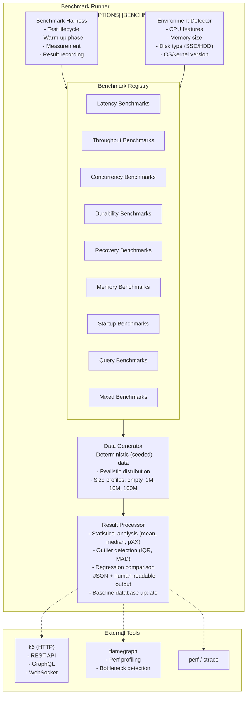
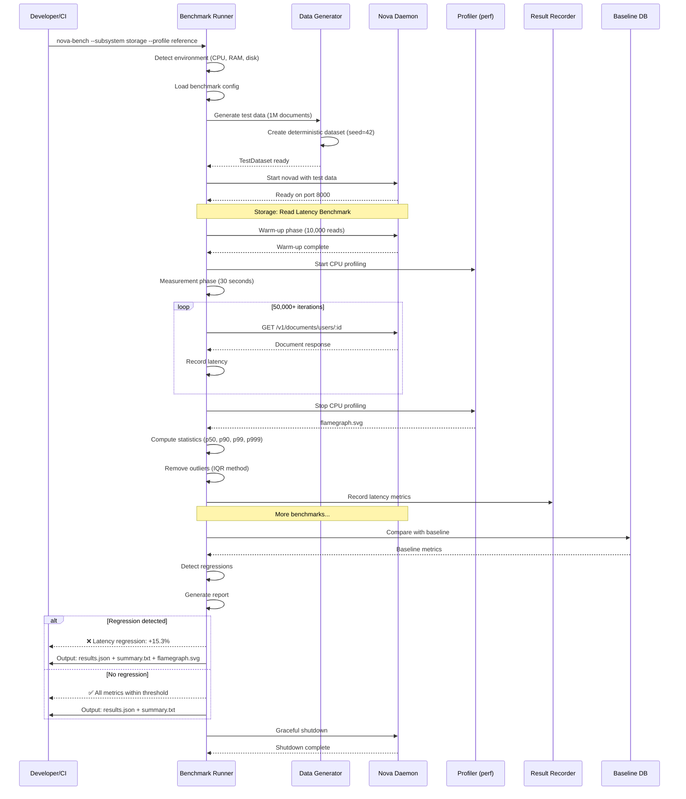
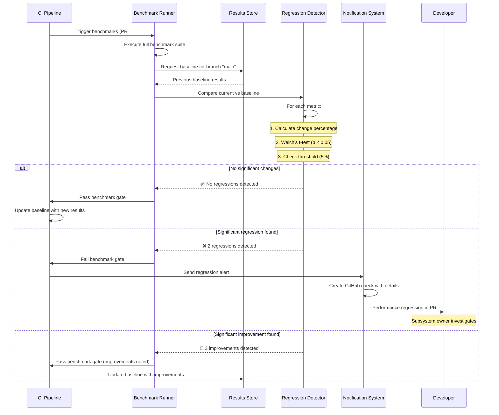
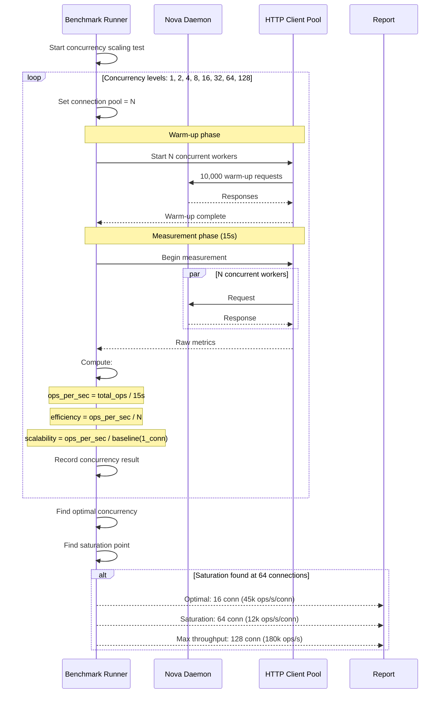
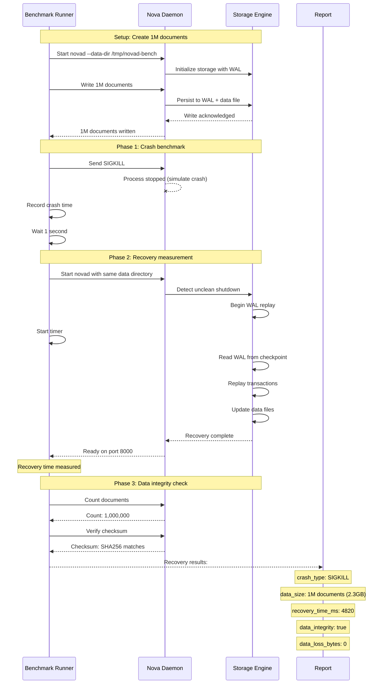

# Document 28: Benchmark Strategy

## 1. Purpose

This document defines the comprehensive performance benchmark strategy for Nova Runtime. It establishes the methodology, tooling, environments, scenarios, and reporting framework for measuring and tracking the performance characteristics of the system across all subsystems. Benchmarks serve three primary purposes:

1. **Regression detection**: Automatically detect performance degradations introduced by code changes
2. **Capacity planning**: Provide performance data to inform deployment sizing decisions
3. **Optimization targeting**: Identify performance bottlenecks to guide optimization efforts

The benchmark strategy follows the development philosophy: "Optimization Fifth" — benchmarks are established first (Research First), used to verify optimizations, and never trusted without understanding the measurement methodology.

## 2. Scope

This document covers:

- Benchmark categories: latency, throughput, concurrency, durability, recovery, memory, startup, query
- Benchmark tools: custom Rust benchmark suite, k6 for HTTP load testing
- Benchmark environments: CI-small, reference, minimum, and production specifications
- Benchmark scenarios: empty database, 1M records, 10M records, 100M records
- Data generation strategies for realistic workloads
- Warm-up and measurement methodology
- Result reporting: machine-readable JSON and human-readable summary
- Regression detection with statistical significance
- Baseline tracking and historical trend analysis
- Per-subsystem benchmarks: storage, cache, queue, scheduler, search, blob, SQL, API

## 3. Responsibilities

- **Benchmark suite maintenance**: Performance engineering team
- **Running benchmarks on PRs**: CI pipeline (automated)
- **Reviewing regression reports**: Subsystem owners (triaged weekly)
- **Baseline management**: Performance engineering team updates baseline after verified releases
- **Target number definition**: Chief Architect with input from subsystem owners
- **Benchmark environment management**: Platform/Infrastructure team
- **Performance budget enforcement**: CI pipeline blocks merges on regression > 5%
- **Historical trend analysis**: Performance engineering team (monthly review)

## 4. Non Responsibilities

- Benchmarks do not replace correctness tests. All functional tests must pass before benchmarks are meaningful.
- Benchmarks are not a replacement for production monitoring. They measure synthetic workloads, not user traffic patterns.
- Benchmarks do not predict absolute production performance. They measure relative changes between code versions.
- This document does not cover hardware selection for production deployment.
- Micro-benchmarks of individual CPU instructions are out of scope.
- Energy efficiency/power consumption benchmarking is out of scope for v1.

## 5. Architecture

### 5.1 Benchmark Suite Architecture



### 5.2 Benchmark Categories

| Category | Unit | Methodology | Target Priority |
|----------|------|-------------|-----------------|
| Latency | ms (p50/p90/p99/p999) | Single-op benchmark under load | P0 (every PR) |
| Throughput | ops/s | Sustained load test | P0 (every PR) |
| Concurrency | connections | Ramp-up test | P1 (nightly) |
| Durability | ops/s with fsync | fsync benchmark | P1 (nightly) |
| Recovery | seconds | Crash + restart | P1 (nightly) |
| Memory | MB (RSS, heap) | Process measurement | P0 (every PR) |
| Startup | ms to ready | Cold/warm start | P1 (nightly) |
| Query (SQL) | ms, rows/s | Various workloads | P0 (every PR) |

### 5.3 Benchmark Environments

| Environment | CPU | RAM | Disk | Network | Usage |
|-------------|-----|-----|------|---------|-------|
| CI-small | 2 vCPU (x86_64) | 4 GB | 30GB NVMe SSD | N/A (localhost) | Per-PR benchmarks |
| Reference | 4 vCPU (x86_64) | 8 GB | 100GB NVMe SSD | 1 Gbps | Official target numbers |
| Minimum | 1 vCPU (x86_64) | 512 MB | 5GB SSD | 100 Mbps | Minimum viable deployment |
| Production | 8 vCPU (x86_64) | 16 GB | 500GB NVMe SSD | 10 Gbps | Real-world performance |
| Development | Developer machine | Varies | Varies | Varies | Local benchmarking |

### 5.4 Benchmark Scenarios

| Scenario | Documents | Collections | Blobs | Queue Messages |
|----------|-----------|-------------|-------|----------------|
| Empty DB | 0 | 0 | 0 | 0 |
| Small DB | 1,000 | 5 | 100 | 1,000 |
| Medium DB | 1,000,000 | 20 | 10,000 | 100,000 |
| Large DB | 10,000,000 | 50 | 100,000 | 1,000,000 |
| X-Large DB | 100,000,000 | 100 | 1,000,000 | 10,000,000 |
| SQL Bench | 1,000,000 | 10 | 0 | 0 |
| Search | 1,000,000 | 5 | 0 | 0 |
| Mixed | 1,000,000 | 20 | 10,000 | 100,000 |

### 5.5 Workload Profiles

```rust
/// Workload profile defines the operation mix for benchmarks
#[derive(Debug, Clone)]
pub struct WorkloadProfile {
    pub name: &'static str,
    pub operations: Vec<WeightedOp>,
}

#[derive(Debug, Clone)]
pub struct WeightedOp {
    pub op: Operation,
    pub weight: f64,       // 0.0 - 1.0, sum of all weights = 1.0
    pub data_size: DataSizeDistribution,
}

#[derive(Debug, Clone)]
pub enum Operation {
    // Database operations
    ReadDocument { key_distribution: KeyDistribution },
    WriteDocument { key_distribution: KeyDistribution },
    UpdateDocument { key_distribution: KeyDistribution },
    DeleteDocument { key_distribution: KeyDistribution },
    ScanCollection { prefix: &'static str, limit: Range<usize> },
    
    // Cache operations
    CacheGet { hit_probability: f64 },
    CacheSet,
    CacheDelete,
    
    // Queue operations
    QueueEnqueue,
    QueueDequeue,
    QueuePeek,
    
    // Search operations
    SearchQuery,
    SearchIndex,
    
    // Blob operations
    BlobUpload { size_distribution: SizeDistribution },
    BlobDownload { size_distribution: SizeDistribution },
    BlobDelete,
    
    // SQL operations
    SqlSelect { complexity: QueryComplexity },
    SqlInsert { batch_size: Range<usize> },
    SqlUpdate,
    SqlDelete,
    SqlJoin,
    SqlAggregate,
}

#[derive(Debug, Clone)]
pub enum KeyDistribution {
    Uniform,
    Zipfian { alpha: f64 },         // 80/20 distribution
    Latest,                          // Recent data
    Hotspot { hot_fraction: f64 },   // Certain keys are "hot"
    Sequential,
    Random,
}

#[derive(Debug, Clone)]
pub enum SizeDistribution {
    Uniform { min: usize, max: usize },
    Pareto { alpha: f64, scale: usize },
    Normal { mean: f64, stddev: f64 },
    Fixed(usize),
}

#[derive(Debug, Clone)]
pub enum DataSizeDistribution {
    Small,    // 32-256 bytes
    Medium,   // 256-4096 bytes
    Large,    // 4KB-64KB
    Mixed,    // Pareto distribution
}

const READ_HEAVY: WorkloadProfile = WorkloadProfile {
    name: "read_heavy",
    operations: &[
        WeightedOp { op: Operation::ReadDocument { key_distribution: KeyDistribution::Zipfian { alpha: 0.9 } }, weight: 0.70, data_size: DataSizeDistribution::Small },
        WeightedOp { op: Operation::WriteDocument { key_distribution: KeyDistribution::Latest }, weight: 0.10, data_size: DataSizeDistribution::Medium },
        WeightedOp { op: Operation::UpdateDocument { key_distribution: KeyDistribution::Zipfian { alpha: 0.9 } }, weight: 0.10, data_size: DataSizeDistribution::Medium },
        WeightedOp { op: Operation::ScanCollection { prefix: "user_", limit: 10..50 }, weight: 0.10, data_size: DataSizeDistribution::Small },
    ],
};

const WRITE_HEAVY: WorkloadProfile = WorkloadProfile {
    name: "write_heavy",
    operations: &[
        WeightedOp { op: Operation::WriteDocument { key_distribution: KeyDistribution::Random }, weight: 0.50, data_size: DataSizeDistribution::Medium },
        WeightedOp { op: Operation::UpdateDocument { key_distribution: KeyDistribution::Latest }, weight: 0.25, data_size: DataSizeDistribution::Medium },
        WeightedOp { op: Operation::ReadDocument { key_distribution: KeyDistribution::Latest }, weight: 0.20, data_size: DataSizeDistribution::Small },
        WeightedOp { op: Operation::DeleteDocument { key_distribution: KeyDistribution::Random }, weight: 0.05, data_size: DataSizeDistribution::Small },
    ],
};

const MIXED: WorkloadProfile = WorkloadProfile {
    name: "mixed",
    operations: &[
        WeightedOp { op: Operation::ReadDocument { key_distribution: KeyDistribution::Zipfian { alpha: 0.9 } }, weight: 0.35, data_size: DataSizeDistribution::Mixed },
        WeightedOp { op: Operation::WriteDocument { key_distribution: KeyDistribution::Latest }, weight: 0.15, data_size: DataSizeDistribution::Medium },
        WeightedOp { op: Operation::UpdateDocument { key_distribution: KeyDistribution::Zipfian { alpha: 0.9 } }, weight: 0.15, data_size: DataSizeDistribution::Medium },
        WeightedOp { op: Operation::CacheGet { hit_probability: 0.9 }, weight: 0.10, data_size: DataSizeDistribution::Small },
        WeightedOp { op: Operation::QueueEnqueue, weight: 0.10, data_size: DataSizeDistribution::Small },
        WeightedOp { op: Operation::ScanCollection { prefix: "post_", limit: 10..20 }, weight: 0.15, data_size: DataSizeDistribution::Small },
    ],
};
```

## 6. Data Structures

### 6.1 Benchmark Configuration

```rust
/// Top-level benchmark suite configuration
#[derive(Debug, Clone, Serialize, Deserialize)]
pub struct BenchmarkConfig {
    pub suite_name: String,
    pub suite_version: String,
    pub environment: EnvironmentConfig,
    pub reporting: ReportingConfig,
    pub regression: RegressionConfig,
    pub scenarios: Vec<ScenarioConfig>,
}

#[derive(Debug, Clone, Serialize, Deserialize)]
pub struct EnvironmentConfig {
    pub label: EnvironmentLabel,
    pub cpu_cores: u32,
    pub cpu_model: String,
    pub ram_mb: u64,
    pub disk_type: DiskType,
    pub disk_speed_mbps: u64,
    pub os: String,
    pub kernel: String,
    pub rust_version: String,
    pub novad_version: String,
    pub build_profile: BuildProfile,
}

#[derive(Debug, Clone, PartialEq, Serialize, Deserialize)]
pub enum EnvironmentLabel {
    CiSmall,
    Reference,
    Minimum,
    Production,
    Development,
}

#[derive(Debug, Clone, PartialEq, Serialize, Deserialize)]
pub enum DiskType {
    Unknown,
    Hdd,
    SataSsd,
    NvmeSsd,
    RamDisk,
}

#[derive(Debug, Clone, PartialEq, Serialize, Deserialize)]
pub enum BuildProfile {
    Debug,
    Release,
    ReleaseLto,
}

#[derive(Debug, Clone, Serialize, Deserialize)]
pub struct ReportingConfig {
    pub output_dir: PathBuf,
    pub json_output: bool,
    pub human_readable: bool,
    pub upload_to_dashboard: bool,
    pub dashboard_url: Option<String>,
    pub save_baseline: bool,
    pub baseline_path: Option<PathBuf>,
}

#[derive(Debug, Clone, Serialize, Deserialize)]
pub struct RegressionConfig {
    pub enabled: bool,
    pub threshold_pct: f64,
    pub compare_to_branch: String,
    pub required_consecutive_failures: u32,
    pub fail_on_regression: bool,
    pub warn_on_regression: bool,
    pub exclude_metrics: Vec<String>,
}

#[derive(Debug, Clone, Serialize, Deserialize)]
pub struct ScenarioConfig {
    pub name: String,
    pub data_size: DataSize,
    pub workload: WorkloadProfile,
    pub duration_secs: u64,
    pub warmup_ops: u64,
    pub threads: Range<u32>,
    pub clients: Range<u32>,
    pub rate_limit: Option<u64>,
}
```

### 6.2 Benchmark Results

```rust
/// Complete benchmark suite results
#[derive(Debug, Clone, Serialize, Deserialize)]
pub struct BenchmarkResults {
    pub metadata: BenchmarkMetadata,
    pub suite_name: String,
    pub timestamp: DateTime<Utc>,
    pub duration_secs: f64,
    pub environment: EnvironmentConfig,
    pub categories: Vec<BenchmarkCategoryResults>,
}

#[derive(Debug, Clone, Serialize, Deserialize)]
pub struct BenchmarkMetadata {
    pub commit_hash: String,
    pub branch: String,
    pub pr_number: Option<u32>,
    pub run_id: String,
    pub trigger: BenchmarkTrigger,
}

#[derive(Debug, Clone, Serialize, Deserialize)]
pub enum BenchmarkTrigger {
    Manual,
    PerCommit,
    PerPr,
    Nightly,
    Release,
}

#[derive(Debug, Clone, Serialize, Deserialize)]
pub struct BenchmarkCategoryResults {
    pub category: BenchmarkCategory,
    pub subsystem: String,
    pub scenario: String,
    pub data_size: DataSize,
    pub metrics: Vec<BenchmarkMetric>,
    pub samples: u64,
    pub duration_secs: f64,
}

#[derive(Debug, Clone, Serialize, Deserialize)]
pub enum BenchmarkCategory {
    Latency,
    Throughput,
    Concurrency,
    Durability,
    Recovery,
    Memory,
    Startup,
    Query,
}

#[derive(Debug, Clone, Serialize, Deserialize)]
pub struct BenchmarkMetric {
    pub name: String,
    pub unit: String,
    pub value: f64,
    pub p50: f64,
    pub p90: f64,
    pub p99: f64,
    pub p999: f64,
    pub min: f64,
    pub max: f64,
    pub mean: f64,
    pub stddev: f64,
    pub count: u64,
    pub outliers_removed: u64,
}

#[derive(Debug, Clone, Serialize, Deserialize)]
pub struct LatencyResult {
    pub operation: String,
    pub subsystem: String,
    pub p50_ms: f64,
    pub p90_ms: f64,
    pub p99_ms: f64,
    pub p999_ms: f64,
    pub mean_ms: f64,
    pub stddev_ms: f64,
    pub throughput_ops_s: f64,
    pub concurrency: u32,
}

#[derive(Debug, Clone, Serialize, Deserialize)]
pub struct ThroughputResult {
    pub operation: String,
    pub subsystem: String,
    pub ops_per_sec: f64,
    pub total_ops: u64,
    pub duration_secs: f64,
    pub batch_size: Option<usize>,
}

#[derive(Debug, Clone, Serialize, Deserialize)]
pub struct MemoryResult {
    pub rss_mb: f64,
    pub heap_mb: f64,
    pub allocated_mb: f64,
    pub metadata_mb: f64,
    pub fragmentation_ratio: f64,
    pub total_entries: u64,
}

#[derive(Debug, Clone, Serialize, Deserialize)]
pub struct RecoveryResult {
    pub scenario: String,
    pub crash_type: CrashType,
    pub data_size: DataSize,
    pub recovery_time_ms: f64,
    pub data_integrity: bool,
    pub data_loss_bytes: u64,
}

#[derive(Debug, Clone, Serialize, Deserialize)]
pub enum CrashType {
    ProcessKill(Signal),
    PowerLoss,
    Panic,
    OomKill,
    DiskFull,
}

#[derive(Debug, Clone, Serialize, Deserialize)]
pub struct StartupResult {
    pub startup_type: StartupType,
    pub data_size: DataSize,
    pub total_time_ms: f64,
    pub binary_load_ms: f64,
    pub config_load_ms: f64,
    pub storage_init_ms: f64,
    pub subsystem_init_ms: f64,
    pub ready_ms: f64,
    pub binary_size_kb: u64,
}

#[derive(Debug, Clone, Serialize, Deserialize)]
pub enum StartupType {
    ColdStart,
    WarmStart,
    RecoveryStart,
}

#[derive(Debug, Clone, Serialize, Deserialize)]
pub struct QueryResult {
    pub query_type: QueryType,
    pub execution_time_ms: f64,
    pub planning_time_ms: f64,
    pub rows_processed: u64,
    pub rows_returned: u64,
    pub index_used: Option<String>,
    pub sort_used: bool,
    pub approx_memory_kb: u64,
    pub complexity_estimate: f64,
}

#[derive(Debug, Clone, Serialize, Deserialize)]
pub enum QueryType {
    PointLookup,
    RangeScan,
    FullScan,
    Aggregation,
    Join,
    SubQuery,
    FullTextSearch,
    GeoQuery,
    Mixed,
}
```

### 6.3 Baseline Database Schema

```sql
-- Baseline database for tracking performance history
CREATE TABLE benchmark_runs (
    id UUID PRIMARY KEY,
    suite_name TEXT NOT NULL,
    timestamp TIMESTAMPTZ NOT NULL,
    commit_hash TEXT NOT NULL,
    branch TEXT NOT NULL,
    pr_number INTEGER,
    trigger TEXT NOT NULL,
    environment_label TEXT NOT NULL,
    duration_secs DOUBLE PRECISION,
    UNIQUE(commit_hash, environment_label, suite_name)
);

CREATE TABLE benchmark_metrics (
    id UUID PRIMARY KEY,
    run_id UUID REFERENCES benchmark_runs(id),
    category TEXT NOT NULL,
    subsystem TEXT NOT NULL,
    scenario TEXT NOT NULL,
    data_size TEXT NOT NULL,
    metric_name TEXT NOT NULL,
    unit TEXT NOT NULL,
    value DOUBLE PRECISION NOT NULL,
    p50 DOUBLE PRECISION,
    p90 DOUBLE PRECISION,
    p99 DOUBLE PRECISION,
    p999 DOUBLE PRECISION,
    min_val DOUBLE PRECISION,
    max_val DOUBLE PRECISION,
    mean DOUBLE PRECISION,
    stddev DOUBLE PRECISION,
    sample_count INTEGER,
    created_at TIMESTAMPTZ DEFAULT NOW()
);

CREATE INDEX idx_metrics_run ON benchmark_metrics(run_id);
CREATE INDEX idx_metrics_category ON benchmark_metrics(category, subsystem);
CREATE INDEX idx_metrics_name ON benchmark_metrics(metric_name);

CREATE TABLE benchmark_baselines (
    id UUID PRIMARY KEY,
    category TEXT NOT NULL,
    subsystem TEXT NOT NULL,
    scenario TEXT NOT NULL,
    data_size TEXT NOT NULL,
    metric_name TEXT NOT NULL,
    baseline_value DOUBLE PRECISION NOT NULL,
    baseline_stddev DOUBLE PRECISION,
    baseline_run_id UUID REFERENCES benchmark_runs(id),
    created_at TIMESTAMPTZ DEFAULT NOW(),
    updated_at TIMESTAMPTZ DEFAULT NOW(),
    UNIQUE(category, subsystem, scenario, data_size, metric_name)
);

CREATE TABLE benchmark_regressions (
    id UUID PRIMARY KEY,
    run_id UUID REFERENCES benchmark_runs(id),
    metric_name TEXT NOT NULL,
    baseline_value DOUBLE PRECISION NOT NULL,
    current_value DOUBLE PRECISION NOT NULL,
    change_pct DOUBLE PRECISION NOT NULL,
    threshold_pct DOUBLE PRECISION NOT NULL,
    direction TEXT NOT NULL, -- 'worse' or 'better'
    status TEXT NOT NULL,    -- 'new', 'acknowledged', 'investigating', 'fixed'
    assigned_to TEXT,
    notes TEXT,
    created_at TIMESTAMPTZ DEFAULT NOW(),
    resolved_at TIMESTAMPTZ
);
```

## 7. Algorithms

### 7.1 Benchmark Execution

```
Algorithm: ExecuteBenchmarkSuite
Purpose: Run the complete benchmark suite and collect results

EXECUTE_SUITE(config):
  results = BenchmarkResults {
    metadata: generate_metadata(),
    environment: detect_environment(),
    categories: [],
  }

  for scenario in config.scenarios:
    print_progress("Running scenario: {}", scenario.name)
    
    // Step 1: Generate test data
    data = generate_data(
      size: scenario.data_size,
      seed: deterministic_seed(scenario.name),
      engine: get_storage_engine()
    )
    
    // Step 2: Attach profiling if needed
    if config.profiling_enabled:
      profiler = start_profiling()
    
    // Step 3: Warm-up phase
    print("Warm-up: {} operations", scenario.warmup_ops)
    warmup_result = RUN_LOAD(data, scenario.workload, scenario.warmup_ops, warmup: true)
    
    // Step 4: Measurement phase
    print("Measurement: {} seconds", scenario.duration_secs)
    measurement = RUN_LOAD(data, scenario.workload, 
      duration: scenario.duration_secs,
      warmup: false
    )
    
    // Step 5: Cleanup profiling
    if config.profiling_enabled:
      profile_data = profiler.stop()
      save_profile(scenario.name, profile_data)
    
    // Step 6: Compute metrics
    metrics = COMPUTE_METRICS(measurement)
    results.categories.push(metrics)
    
  // Step 7: Compare with baseline
  if config.regression.enabled:
    regressions = COMPARE_WITH_BASELINE(results, config.regression)
    results.regressions = regressions
  
  // Step 8: Report results
  REPORT_RESULTS(results, config.reporting)
  
  // Step 9: Update baseline
  if config.reporting.save_baseline:
    UPDATE_BASELINE(results)
  
  // Step 10: Check regression gate
  if has_blocking_regressions(regressions):
    exit(1)  // CI should fail
  
  return results
```

### 7.2 Warm-up and Measurement

```
Algorithm: WarmupAndMeasurement
Purpose: Execute operations with warm-up phase and steady-state measurement

RUN_LOAD(data, workload, duration_secs, warmup_ops, warmup=false):
  state = LoadState {
    data: data,
    rng: SeededRng(seed),
    completed_ops: 0,
    latencies: RingBuffer(1_000_000),  // store last 1M latencies
    errors: 0,
  }
  
  threads = launch_worker_threads(
    count: detect_optimal_threads(),
    workload: workload,
    state: state,
  )
  
  if warmup:
    // Fast warmup: just execute operations without measurement
    execute_operations(state, workload, warmup_ops)
    
    // Verify system is stable
    verify_stable(state, stability_window: 1000_ops)
    
    return empty_measurement
  
  // Measurement phase
  start_time = now()
  deadline = start_time + duration_secs
  measurement_window = RingBuffer(seconds: duration_secs)
  
  while now() < deadline:
    op = select_weighted_operation(workload, state.rng)
    
    op_start = high_resolution_clock()
    result = execute_operation(op, state)
    op_end = high_resolution_clock()
    
    latency = op_end - op_start
    state.latencies.push(latency)
    measurement_window.push({ op, latency, result })
    
    state.completed_ops += 1
    
    if result is Error:
      state.errors += 1
    
    // Dynamic rate limiting: maintain target throughput if configured
    if workload.rate_limit:
      adjust_pace(state, workload.rate_limit)
  
  // Compute results
  return {
    total_ops: state.completed_ops,
    duration: now() - start_time,
    ops_per_sec: state.completed_ops / (now() - start_time),
    latencies: compute_percentiles(state.latencies),
    error_rate: state.errors / state.completed_ops,
    error_count: state.errors,
    window: measurement_window,
  }
```

### 7.3 Statistical Outlier Detection

```
Algorithm: OutlierDetection
Purpose: Remove statistical outliers from benchmark measurements

REMOVE_OUTLIERS(samples, method="iqr", threshold=1.5):
  sorted_samples = sort(samples)
  n = len(sorted_samples)
  
  switch method:
    case "iqr":
      q1 = sorted_samples[n / 4]
      q3 = sorted_samples[3 * n / 4]
      iqr = q3 - q1
      lower_bound = q1 - threshold * iqr
      upper_bound = q3 + threshold * iqr
      
      clean = [x for x in samples if lower_bound <= x <= upper_bound]
      removed = len(samples) - len(clean)
      
    case "mad":  // Median Absolute Deviation
      median = sorted_samples[n / 2]
      deviations = [abs(x - median) for x in samples]
      mad = median(sort(deviations))
      mad_threshold = 3.0  // More robust than IQR
      
      clean = [x for x in samples if abs(x - median) / (mad + 1e-10) < mad_threshold]
      removed = len(samples) - len(clean)
    
    case "chauvenet":
      mean = average(samples)
      stddev = standard_deviation(samples)
      clean = []
      for x in samples:
        z = abs(x - mean) / stddev
        probability = 2 * (1 - CDF_NORMAL(z))  // two-tailed
        if probability * n >= 0.5:  // Chauvenet's criterion
          clean.push(x)
      removed = len(samples) - len(clean)
  
  return { clean, removed, method, threshold }

COMPUTE_PERCENTILES(samples):
  sorted = sort(samples)
  n = len(sorted)
  
  return {
    p50:  sorted[(int)(n * 0.50)],
    p90:  sorted[(int)(n * 0.90)],
    p99:  sorted[(int)(n * 0.99)],
    p999: sorted[(int)(n * 0.999)],
    min:  sorted[0],
    max:  sorted[n - 1],
    mean: average(samples),
    stddev: standard_deviation(samples),
  }
```

### 7.4 Regression Detection

```
Algorithm: RegressionDetection
Purpose: Detect statistically significant performance regressions

DETECT_REGRESSION(new_results, baseline, config):
  regressions = []
  
  for metric in new_results.metrics:
    if metric.name in config.exclude_metrics:
      continue
    
    baseline_metric = find_baseline(baseline, metric.name)
    if baseline_metric is None:
      continue  // New metric, no baseline yet
    
    // Calculate change
    change = (metric.value - baseline_metric.value) / baseline_metric.value
    
    // Statistical significance test
    // Use Welch's t-test for unequal variance
    t_stat = (metric.value - baseline_metric.value) / 
             sqrt(pow(metric.stddev, 2)/metric.count + pow(baseline_metric.stddev, 2)/baseline_metric.count)
    
    // Degrees of freedom (Welch-Satterthwaite)
    df = pow(pow(metric.stddev, 2)/metric.count + pow(baseline_metric.stddev, 2)/baseline_metric.count, 2) /
         (pow(pow(metric.stddev, 2)/metric.count, 2)/(metric.count - 1) +
          pow(pow(baseline_metric.stddev, 2)/baseline_metric.count, 2)/(baseline_metric.count - 1))
    
    p_value = 2 * (1 - T_CDF(abs(t_stat), df))  // two-tailed
    
    is_significant = p_value < 0.05  // 95% confidence
    exceeds_threshold = abs(change * 100) > config.threshold_pct
    
    if is_significant and exceeds_threshold:
      direction = "regression" if is_performance_regression(metric.name, metric.value, baseline_metric.value)
                  else "improvement"
      regressions.push({
        metric: metric.name,
        baseline: baseline_metric.value,
        current: metric.value,
        change_pct: change * 100,
        direction: direction,
        p_value: p_value,
        t_statistic: t_stat,
        degrees_freedom: df,
        significant: is_significant,
      })
  
  return regressions

IS_PERFORMANCE_REGRESSION(metric_name, current, baseline):
  // Metrics where lower is better
  lower_better = [
    "latency_p50_ms", "latency_p90_ms", "latency_p99_ms", "latency_p999_ms",
    "memory_rss_mb", "memory_heap_mb", "startup_time_ms", "recovery_time_ms",
    "execution_time_ms", "planning_time_ms", "error_rate",
    "cpu_usage_pct", "disk_io_per_op", "fragmentation_ratio",
  ]
  // Metrics where higher is better
  higher_better = [
    "throughput_ops_s", "connections_count", "cache_hit_ratio",
    "requests_per_sec", "rows_per_sec", "batch_ops_per_sec",
    "uptime_seconds", "durability_ops_s",
  ]
  
  if metric_name in lower_better:
    return current > baseline  // regression: got slower
  if metric_name in higher_better:
    return current < baseline  // regression: got slower
  return abs(current) > abs(baseline)  // default
```

### 7.5 Data Generation

```
Algorithm: DataGenerator
Purpose: Generate realistic benchmark data at scale

GENERATE_DATA(size: DataSize, seed: u64):
  rng = SeededRng(seed)
  data = DataGeneratorState { rng, next_id: 0 }
  
  documents = []
  for i in 0..size.document_count:
    doc = generate_document(data, size.average_doc_size_bytes)
    documents.push(doc)
    if i % 100000 == 0:
      print_progress("Documents: {}/{}", i, size.document_count)
  
  // Generate realistic access patterns
  access_patterns = generate_access_patterns(data, size)
  
  // Generate indexes
  indexes = generate_indexes(data, size)
  
  return TestDataset {
    documents,
    access_patterns,
    indexes,
    metadata: { seed, timestamp: now(), version: 1 },
  }

GENERATE_DOCUMENT(data, avg_size):
  id = format!("doc_{:016x}", data.next_id++)
  collection = select_weighted(data.rng, &[
    ("users", 0.30),
    ("posts", 0.25),
    ("comments", 0.15),
    ("products", 0.10),
    ("orders", 0.08),
    ("events", 0.07),
    ("sessions", 0.05),
  ])
  
  base_size = match collection {
    "users" => generate_user_document(data, avg_size),
    "posts" => generate_post_document(data, avg_size),
    "comments" => generate_comment_document(data, avg_size),
    "products" => generate_product_document(data, avg_size),
    "orders" => generate_order_document(data, avg_size),
    "events" => generate_event_document(data, avg_size),
    "sessions" => generate_session_document(data, avg_size),
    _ => generate_generic_document(data, avg_size),
  }
  
  // Add common fields
  doc = base_size
  doc["_id"] = id
  doc["_collection"] = collection
  doc["_created"] = random_timestamp(data.rng, days_back: 365)
  doc["_updated"] = doc["_created"] + random_duration(data.rng, max_hours: 72)
  doc["_version"] = data.rng.gen_range(1..10)
  
  // Pad to target size if needed
  current_size = estimate_json_size(doc)
  if current_size < avg_size * 0.8:
    padding_needed = avg_size - current_size
    doc["_padding"] = "x".repeat(padding_needed)
  
  return doc

GENERATE_ACCESS_PATTERNS(data, size):
  // Generate sequence of key accesses that follow Zipfian distribution
  // 80% of accesses go to 20% of keys (hot keys)
  pattern = []
  hot_keys = sample(data.rng, size.documents, (int)(size.document_count * 0.2))
  cold_keys = sample(data.rng, size.documents, (int)(size.document_count * 0.8))
  
  for i in 0..1000000:  // 1M access patterns
    if data.rng.gen_f64() < 0.80:
      pattern.push(select(hot_keys))
    else:
      pattern.push(select(cold_keys))
  
  return pattern
```

### 7.6 Concurrency Scaling

```
Algorithm: ConcurrencyScaling
Purpose: Measure how performance scales with concurrent connections

MEASURE_CONCURRENCY_SCALING(data, workload, max_connections):
  results = []
  
  // Start from 1 connection, scaling up to max
  for conn_count in [1, 2, 4, 8, 16, 32, 64, 128, max_connections]:
    print("Testing concurrency: {}", conn_count)
    
    measurement = run_load_with_connections(
      data: data,
      workload: workload,
      connections: conn_count,
      duration: 15_seconds,
      warmup: 5_seconds,
    )
    
    efficiency = measurement.ops_per_sec / conn_count
    scalability = measurement.ops_per_sec / baseline_ops_per_sec(1_connection)
    
    results.push({
      connections: conn_count,
      ops_per_sec: measurement.ops_per_sec,
      p50_latency: measurement.p50,
      p99_latency: measurement.p99,
      efficiency: efficiency,
      scalability: scalability,
      error_rate: measurement.error_rate,
    })
  
  // Find optimal concurrency point
  optimal = find_max(results, "efficiency")
  saturation = find_first(results, "scalability < 0.8")  // < 80% linear
  
  return {
    results,
    optimal_concurrency: optimal.connections,
    saturation_concurrency: saturation.connections,
    max_throughput: max(results, "ops_per_sec"),
  }
```

## 8. Interfaces

### 8.1 Benchmark CLI

```
nova-bench [OPTIONS] [BENCHMARK_FILTERS]

Options:
  --list                  List available benchmarks without running
  --suite <name>          Run specific benchmark suite (default: full)
  --scenario <name>       Run specific scenario
  --subsystem <name>      Run benchmarks for specific subsystem

  --profile <name>        Use environment profile (ci-small, reference, minimum, production)
  --data-dir <path>       Temporary data directory (default: system temp)
  --binary-path <path>    Path to novad binary (default: ./target/release/novad)

  --duration <secs>       Measurement duration override (default: 30)
  --warmup <ops>          Warm-up operation count override (default: 10000)
  --concurrency <N>       Fixed concurrency level (default: auto-detect)
  --rate-limit <N>        Target operations per second (default: unlimited)

  --data-size <size>      Data size profile (empty, small, medium, large, xlarge)
  --workload <name>       Workload profile (read-heavy, write-heavy, mixed)

  --baseline <path>       Baseline results file for comparison
  --save-baseline         Save results as new baseline
  --threshold <pct>       Regression detection threshold (default: 5.0)

  --json                  Output results as JSON
  --output <path>         Output file path
  --pretty                Pretty-print human-readable output

  --profile-cpu           Enable CPU profiling (perf/flamegraph)
  --profile-heap          Enable heap profiling (jemalloc heap profiling)
  --profile-io            Enable I/O tracing

  --verbose               Verbose output
  --quiet                 Suppress all output except results

Examples:
  nova-bench --list                                 # List all benchmarks
  nova-bench --subsystem storage --data-size medium  # Storage benchmarks with 1M records
  nova-bench --profile reference --json --output results.json  # Reference run as JSON
  nova-bench --scenario "latency_read" --concurrency 16  # Fixed concurrency latency test
  nova-bench --baseline baseline.json --threshold 3.0  # Compare with 3% threshold
  nova-bench --profile-cpu --subsystem sql  # CPU profiling of SQL subsystem
```

### 8.2 Benchmark Harness

```rust
/// Core benchmark harness
pub trait Benchmark {
    /// Benchmark name (unique identifier)
    fn name(&self) -> &str;
    
    /// Category of this benchmark
    fn category(&self) -> BenchmarkCategory;
    
    /// Subsystem being benchmarked
    fn subsystem(&self) -> &str;
    
    /// Required data size
    fn required_data_size(&self) -> DataSize;
    
    /// Setup before benchmark (e.g., create data, start daemon)
    fn setup(&mut self, config: &BenchmarkConfig) -> Result<(), BenchmarkError>;
    
    /// Warm-up phase
    fn warmup(&mut self, ops: u64) -> Result<(), BenchmarkError>;
    
    /// Execute benchmark measurement
    fn measure(&mut self, duration: Duration) -> Result<BenchmarkCategoryResults, BenchmarkError>;
    
    /// Cleanup after benchmark
    fn teardown(&mut self) -> Result<(), BenchmarkError>;
    
    /// Timeout for this benchmark
    fn timeout(&self) -> Duration {
        Duration::from_secs(300)
    }
}

/// Latency benchmark
pub struct LatencyBenchmark {
    subsystem: String,
    operation: String,
    data: TestDataset,
    engine: Box<dyn StorageEngine>,
    results: Vec<f64>,
}

impl Benchmark for LatencyBenchmark {
    fn name(&self) -> &str {
        &format!("latency_{}_{}", self.subsystem, self.operation)
    }
    
    fn category(&self) -> BenchmarkCategory { BenchmarkCategory::Latency }
    fn subsystem(&self) -> &str { &self.subsystem }
    fn required_data_size(&self) -> DataSize { DataSize::Medium }
    
    fn setup(&mut self, config: &BenchmarkConfig) -> Result<(), BenchmarkError> {
        // Initialize storage engine with test data
        self.engine = create_engine(&config.data_dir)?;
        for doc in &self.data.documents {
            self.engine.write(doc.id.as_bytes(), &serde_json::to_vec(&doc.data)?)?;
        }
        Ok(())
    }
    
    fn warmup(&mut self, ops: u64) -> Result<(), BenchmarkError> {
        let rng = SeededRng::new(42);
        for _ in 0..ops {
            let doc = self.data.documents[rng.gen_range(0..self.data.documents.len())];
            let _ = self.engine.read(doc.id.as_bytes())?;
        }
        Ok(())
    }
    
    fn measure(&mut self, duration: Duration) -> Result<BenchmarkCategoryResults, BenchmarkError> {
        let deadline = Instant::now() + duration;
        let rng = SeededRng::new(43);
        let mut latencies = Vec::with_capacity(1_000_000);
        let mut ops_count = 0u64;
        
        while Instant::now() < deadline {
            let doc = &self.data.documents[rng.gen_range(0..self.data.documents.len())];
            let start = Instant::now();
            let _ = self.engine.read(doc.id.as_bytes())?;
            let elapsed = start.elapsed();
            latencies.push(elapsed.as_secs_f64() * 1000.0);  // Convert to ms
            ops_count += 1;
        }
        
        let stats = compute_percentiles(&latencies);
        Ok(BenchmarkCategoryResults {
            category: BenchmarkCategory::Latency,
            subsystem: self.subsystem.clone(),
            scenario: self.operation.clone(),
            data_size: DataSize::Medium,
            metrics: vec![
                BenchmarkMetric {
                    name: format!("latency_{}_read_ms", self.subsystem),
                    unit: "ms".to_string(),
                    value: stats.p50,
                    p50: stats.p50,
                    p90: stats.p90,
                    p99: stats.p99,
                    p999: stats.p999,
                    min: stats.min,
                    max: stats.max,
                    mean: stats.mean,
                    stddev: stats.stddev,
                    count: ops_count,
                    outliers_removed: 0,
                },
                BenchmarkMetric {
                    name: format!("throughput_{}_read_ops_s", self.subsystem),
                    unit: "ops/s".to_string(),
                    value: ops_count as f64 / duration.as_secs_f64(),
                    p50: 0.0, p90: 0.0, p99: 0.0, p999: 0.0,
                    min: 0.0, max: 0.0, mean: 0.0, stddev: 0.0,
                    count: ops_count,
                    outliers_removed: 0,
                },
            ],
            samples: ops_count,
            duration_secs: duration.as_secs_f64(),
        })
    }
    
    fn teardown(&mut self) -> Result<(), BenchmarkError> {
        Ok(())
    }
}
```

### 8.3 k6 Integration

```javascript
// k6 benchmark script for HTTP API benchmarks
import http from 'k6/http';
import { check, sleep } from 'k6';
import { Rate, Trend } from 'k6/metrics';

const latencyTrend = new Trend('api_latency_ms');
const errorRate = new Rate('api_error_rate');

export const options = {
  scenarios: {
    ramp_up: {
      executor: 'ramping-arrival-rate',
      startRate: 10,
      timeUnit: '1s',
      stages: [
        { target: 100, duration: '30s' },
        { target: 500, duration: '30s' },
        { target: 1000, duration: '60s' },
        { target: 2000, duration: '60s' },
        { target: 0, duration: '30s' },
      ],
      preAllocatedVUs: 100,
      maxVUs: 200,
    },
  },
  thresholds: {
    http_req_duration: ['p(99)<100', 'p(95)<50', 'avg<20'],
    http_req_failed: ['rate<0.01'],
    api_error_rate: ['rate<0.01'],
  },
};

const BASE_URL = __ENV.NOVA_URL || 'http://localhost:8000';
const API_KEY = __ENV.NOVA_API_KEY || 'test_api_key';

const ENDPOINTS = [
  { method: 'GET', path: '/v1/health', weight: 5 },
  { method: 'GET', path: '/v1/documents/users/:id', weight: 30 },
  { method: 'POST', path: '/v1/documents/users', weight: 15 },
  { method: 'PUT', path: '/v1/documents/users/:id', weight: 10 },
  { method: 'GET', path: '/v1/documents/users/:id/related', weight: 10 },
  { method: 'GET', path: '/v1/query', weight: 20 },
  { method: 'GET', path: '/v1/cache/:key', weight: 5 },
  { method: 'POST', path: '/v1/queue/:name/messages', weight: 5 },
];

const USER_IDS = Array.from({ length: 10000 }, (_, i) => `user_${i}`);

function selectEndpoint() {
  const totalWeight = ENDPOINTS.reduce((sum, e) => sum + e.weight, 0);
  let r = Math.random() * totalWeight;
  for (const endpoint of ENDPOINTS) {
    r -= endpoint.weight;
    if (r <= 0) return endpoint;
  }
  return ENDPOINTS[0];
}

export default function () {
  const endpoint = selectEndpoint();
  let url = `${BASE_URL}${endpoint.path}`;
  
  // Replace path parameters
  if (url.includes(':id')) {
    const userId = USER_IDS[Math.floor(Math.random() * USER_IDS.length)];
    url = url.replace(':id', userId);
  }
  if (url.includes(':key')) {
    url = url.replace(':key', `benchmark_${Math.floor(Math.random() * 1000)}`);
  }
  if (url.includes(':name')) {
    url = url.replace(':name', 'benchmark_queue');
  }
  
  const params = {
    headers: {
      'Authorization': `Bearer ${API_KEY}`,
      'Content-Type': 'application/json',
    },
  };
  
  let body;
  if (endpoint.method === 'POST' || endpoint.method === 'PUT') {
    body = JSON.stringify({
      name: `test_${Date.now()}`,
      value: Math.random(),
      timestamp: new Date().toISOString(),
    });
  }
  
  const start = Date.now();
  const response = http.request(endpoint.method, url, body, params);
  const latency = Date.now() - start;
  
  latencyTrend.add(latency);
  errorRate.add(response.status >= 400);
  
  check(response, {
    'status is 2xx': (r) => r.status >= 200 && r.status < 300,
    'response time < 100ms': (r) => latency < 100,
  });
  
  sleep(Math.random() * 0.1);  // 0-100ms think time
}
```

### 8.4 Result Report Format

```json
{
  "$schema": "nova-bench-results-schema.json",
  "metadata": {
    "suite_name": "nova-bench-v1",
    "commit_hash": "a1b2c3d4e5f6...",
    "branch": "feature/cache-optimization",
    "pr_number": 234,
    "timestamp": "2026-07-02T10:00:00Z",
    "duration_secs": 845.3
  },
  "environment": {
    "label": "reference",
    "cpu_cores": 4,
    "cpu_model": "Intel(R) Xeon(R) Platinum 8375C CPU @ 2.90GHz",
    "ram_mb": 8192,
    "disk_type": "nvme_ssd",
    "disk_speed_mbps": 3500,
    "os": "Linux 6.2.0-1017-aws",
    "rust_version": "1.80.0",
    "novad_version": "0.1.0",
    "build_profile": "release-lto"
  },
  "categories": [
    {
      "category": "latency",
      "subsystem": "storage",
      "scenario": "read_heavy",
      "data_size": "medium",
      "metrics": [
        {
          "name": "latency_storage_read_ms",
          "unit": "ms",
          "value": 0.85,
          "p50": 0.42,
          "p90": 1.23,
          "p99": 4.87,
          "p999": 12.3,
          "min": 0.02,
          "max": 45.2,
          "mean": 0.93,
          "stddev": 1.2,
          "count": 52341,
          "outliers_removed": 12
        },
        {
          "name": "throughput_storage_read_ops_s",
          "unit": "ops/s",
          "value": 1744.7,
          "p50": 0,
          "p90": 0,
          "p99": 0,
          "p999": 0,
          "min": 0,
          "max": 0,
          "mean": 1744.7,
          "stddev": 0,
          "count": 52341,
          "outliers_removed": 0
        }
      ],
      "samples": 52341,
      "duration_secs": 30.0
    }
  ],
  "regressions": [
    {
      "metric": "latency_storage_read_ms",
      "baseline": 0.72,
      "current": 0.85,
      "change_pct": 15.3,
      "direction": "regression",
      "p_value": 0.003,
      "threshold": 5.0,
      "significant": true
    }
  ],
  "conclusion": {
    "status": "has_regressions",
    "total_Categories": 8,
    "passed": 6,
    "regressions": 1,
    "improvements": 1,
    "new_metrics": 0
  }
}
```

## 9. Sequence Diagrams

### 9.1 Benchmark Execution Flow



### 9.2 Regression Detection Flow



### 9.3 Concurrency Scaling Measurement



### 9.4 Recovery Benchmark



## 10. Failure Modes

| ID | Failure Mode | Cause | Effect | Detection | Severity |
|----|-------------|-------|--------|-----------|----------|
| BF01 | Noisy benchmark environment | CPU throttling, background processes, VM co-tenancy | Results have high variance, false regression detection | Detection: stddev > 20% of mean in 5 consecutive runs | High |
| BF02 | Benchmark data generation failure | Disk full, timeout, memory exhaustion | Benchmark cannot start | Benchmark runner exits with error | Critical |
| BF03 | Daemon crash during benchmark | Bug in code under test, OOM | Incomplete results, CI failure | Benchmark runner detects process exit | Critical |
| BF04 | Cache warming from previous benchmark | Sequential benchmarks in same process | Later benchmarks show unrealistically good performance | Detection: compare with isolated run | Medium |
| BF05 | Clock instability | NTP sync during measurement, VM clock jump | Negative latency measurements, distribution distortion | Detection: check for negative latencies, clock jump > 1ms | Medium |
| BF06 | Resource leaks across benchmarks | Previous benchmark didn't clean up | Progressive degradation, non-deterministic results | Detection: memory/CPU not returning to baseline | High |
| BF07 | Baseline drift over time | OS updates, kernel changes, hardware degradation | Gradual regression detection failure | Detection: long-term trend analysis (> 30 days) | Medium |
| BF08 | Configuration mismatch | Benchmark config differs from production | Results not representative of real workloads | Manual review | Low |
| BF09 | Profiling overhead | `perf` or heap profiler adds significant latency | Measurement includes profiling overhead, not true performance | Compare with/without profiling | Medium |
| BF10 | Insufficient warm-up | System not in steady state when measurement starts | Results include startup transients, not steady-state | Detection: coefficient of variation > 5% in measurement window | Medium |
| BF11 | Outlier removal too aggressive | High-threshold outlier removal removes legitimate data | Results understate real latency distribution | Review removal rate: should be < 1% of samples | Medium |
| BF12 | Concurrency test port exhaustion | Too many concurrent connections exhaust port range | Connection failures, increased latency | Detection: EADDRNOTAVAIL errors | Low |
| BF13 | Data inconsistency across benchmarks | Shared data directory, concurrent writer | Corrupted benchmark data | Checksum verification before each benchmark | Critical |
| BF14 | k6 test script error | Syntactically invalid script, wrong URL | Benchmarks don't run or produce invalid results | CI validation step for test scripts | Medium |
| BF15 | Environment label incorrect | Hardware changed but label not updated | Results compared against wrong baseline | Detection: CPU model mismatch warning | Low |

## 11. Recovery Strategy

### 11.1 Automatic Recovery

| Failure Mode | Recovery Strategy | Time to Recover |
|-------------|-------------------|-----------------|
| BF01 Noisy environment | Run benchmark 5 times, use median. Require 3 consecutive scans with < 20% stddev. | < 30 min |
| BF02 Data generation failure | Retry generation with exponential backoff (1s, 2s, 4s). Clear disk space if full. | < 2 min |
| BF03 Daemon crash | Auto-restart daemon, restart benchmark from warm-up phase. Max 3 retries. | < 10s |
| BF04 Cache warming | Run benchmarks in random order. Add 2s cooldown between benchmarks. Clear caches. | < 5s |
| BF05 Clock instability | Use `CLOCK_MONOTONIC_RAW` for measurement. NTP sync → warn in report. | N/A |
| BF06 Resource leaks | Kill and restart daemon between benchmarks. Memory/CFD threshold monitoring. | < 5s |
| BF10 Insufficient warm-up | Extend warm-up automatically until COV < 5% over 1000 operations. | < 30s |

### 11.2 Manual Recovery

| Failure Mode | Recovery Steps |
|-------------|----------------|
| BF07 Baseline drift | 1. Check OS/kernel updates around the drift time<br>2. Run full baseline recalibration on reference hardware<br>3. Review last 30 days of metrics to establish new baseline<br>4. Document the drift cause and update baseline |
| BF08 Configuration mismatch | 1. Compare benchmark config with production config<br>2. Update benchmark config to match production<br>3. Re-run benchmarks and document the difference<br>4. Add config validation to benchmark runner |
| BF09 Profiling overhead | 1. Run benchmark without profiling first<br>2. Compare with profiling run<br>3. Document overhead factor for each profiling tool<br>4. Consider sampling profiler instead of tracing |
| BF11 Outlier removal too aggressive | 1. Review outlier removal rate: should be < 1%<br>2. Adjust IQR threshold from 1.5 to 3.0<br>3. Re-run benchmark and compare<br>4. Use MAD method as it's more robust |
| BF12 Port exhaustion | 1. Increase local port range: `sysctl -w net.ipv4.ip_local_port_range="1024 65535"`<br>2. Enable `SO_REUSEADDR` on benchmark client<br>3. Add 10ms delay between connection teardown and next one |
| BF13 Data inconsistency | 1. Verify data checksum against known good state<br>2. Regenerate data from seed if checksum mismatch<br>3. Isolate each benchmark to its own data directory |
| BF15 Environment label mismatch | 1. Auto-detect environment and warn if label doesn't match detected hardware<br>2. Force environment label via explicit flag: `--environment-label reference`<br>3. Log actual hardware in results regardless |

## 12. Performance Considerations

### 12.1 Target Performance Numbers

```rust
/// Performance targets for all benchmark categories
/// These are the official target numbers for the Reference environment (4 vCPU / 8GB RAM / NVMe SSD)
const PERFORMANCE_TARGETS: &[PerformanceTarget] = &[
    // Storage Engine
    PerformanceTarget { category: "latency", subsystem: "storage", operation: "point_read", data_size: "medium", metric: "p50_ms", target: 0.5, tolerance: 0.2, unit: "ms" },
    PerformanceTarget { category: "latency", subsystem: "storage", operation: "point_read", data_size: "medium", metric: "p99_ms", target: 5.0, tolerance: 2.0, unit: "ms" },
    PerformanceTarget { category: "latency", subsystem: "storage", operation: "point_write", data_size: "medium", metric: "p50_ms", target: 1.0, tolerance: 0.5, unit: "ms" },
    PerformanceTarget { category: "latency", subsystem: "storage", operation: "point_write", data_size: "medium", metric: "p99_ms", target: 10.0, tolerance: 3.0, unit: "ms" },
    PerformanceTarget { category: "latency", subsystem: "storage", operation: "range_scan_100", data_size: "medium", metric: "p50_ms", target: 5.0, tolerance: 2.0, unit: "ms" },
    PerformanceTarget { category: "throughput", subsystem: "storage", operation: "read", data_size: "medium", metric: "ops_s", target: 50000, tolerance: 5000, unit: "ops/s" },
    PerformanceTarget { category: "throughput", subsystem: "storage", operation: "write", data_size: "medium", metric: "ops_s", target: 25000, tolerance: 2500, unit: "ops/s" },
    PerformanceTarget { category: "throughput", subsystem: "storage", operation: "mixed", data_size: "medium", metric: "ops_s", target: 30000, tolerance: 3000, unit: "ops/s" },
    
    // Cache
    PerformanceTarget { category: "latency", subsystem: "cache", operation: "get", data_size: "medium", metric: "p50_ms", target: 0.05, tolerance: 0.03, unit: "ms" },
    PerformanceTarget { category: "latency", subsystem: "cache", operation: "get", data_size: "medium", metric: "p99_ms", target: 0.5, tolerance: 0.2, unit: "ms" },
    PerformanceTarget { category: "latency", subsystem: "cache", operation: "set", data_size: "medium", metric: "p50_ms", target: 0.1, tolerance: 0.05, unit: "ms" },
    PerformanceTarget { category: "throughput", subsystem: "cache", operation: "get", data_size: "medium", metric: "ops_s", target: 500000, tolerance: 50000, unit: "ops/s" },
    PerformanceTarget { category: "throughput", subsystem: "cache", operation: "set", data_size: "medium", metric: "ops_s", target: 200000, tolerance: 20000, unit: "ops/s" },
    
    // Queue
    PerformanceTarget { category: "latency", subsystem: "queue", operation: "enqueue", data_size: "medium", metric: "p50_ms", target: 1.0, tolerance: 0.5, unit: "ms" },
    PerformanceTarget { category: "latency", subsystem: "queue", operation: "dequeue", data_size: "medium", metric: "p50_ms", target: 1.5, tolerance: 0.5, unit: "ms" },
    PerformanceTarget { category: "throughput", subsystem: "queue", operation: "enqueue", data_size: "medium", metric: "ops_s", target: 10000, tolerance: 1000, unit: "ops/s" },
    PerformanceTarget { category: "throughput", subsystem: "queue", operation: "dequeue", data_size: "medium", metric: "ops_s", target: 8000, tolerance: 800, unit: "ops/s" },
    
    // Scheduler
    PerformanceTarget { category: "latency", subsystem: "scheduler", operation: "schedule_job", data_size: "medium", metric: "p50_ms", target: 5.0, tolerance: 2.0, unit: "ms" },
    PerformanceTarget { category: "throughput", subsystem: "scheduler", operation: "execute_jobs", data_size: "medium", metric: "jobs_s", target: 100, tolerance: 20, unit: "jobs/s" },
    
    // Search
    PerformanceTarget { category: "latency", subsystem: "search", operation: "query", data_size: "medium", metric: "p50_ms", target: 10.0, tolerance: 3.0, unit: "ms" },
    PerformanceTarget { category: "latency", subsystem: "search", operation: "query", data_size: "medium", metric: "p99_ms", target: 50.0, tolerance: 15.0, unit: "ms" },
    PerformanceTarget { category: "latency", subsystem: "search", operation: "index", data_size: "medium", metric: "p50_ms", target: 50.0, tolerance: 20.0, unit: "ms" },
    PerformanceTarget { category: "throughput", subsystem: "search", operation: "query", data_size: "medium", metric: "ops_s", target: 2000, tolerance: 200, unit: "ops/s" },
    
    // Blob Storage
    PerformanceTarget { category: "latency", subsystem: "blob", operation: "upload_1mb", data_size: "medium", metric: "p50_ms", target: 50.0, tolerance: 20.0, unit: "ms" },
    PerformanceTarget { category: "latency", subsystem: "blob", operation: "download_1mb", data_size: "medium", metric: "p50_ms", target: 20.0, tolerance: 10.0, unit: "ms" },
    PerformanceTarget { category: "throughput", subsystem: "blob", operation: "upload", data_size: "medium", metric: "mb_s", target: 50, tolerance: 10, unit: "MB/s" },
    PerformanceTarget { category: "throughput", subsystem: "blob", operation: "download", data_size: "medium", metric: "mb_s", target: 100, tolerance: 20, unit: "MB/s" },
    
    // SQL Layer
    PerformanceTarget { category: "latency", subsystem: "sql", operation: "point_select", data_size: "medium", metric: "p50_ms", target: 2.0, tolerance: 1.0, unit: "ms" },
    PerformanceTarget { category: "latency", subsystem: "sql", operation: "range_select_100", data_size: "medium", metric: "p50_ms", target: 10.0, tolerance: 3.0, unit: "ms" },
    PerformanceTarget { category: "latency", subsystem: "sql", operation: "simple_join", data_size: "medium", metric: "p50_ms", target: 20.0, tolerance: 5.0, unit: "ms" },
    PerformanceTarget { category: "latency", subsystem: "sql", operation: "aggregation", data_size: "medium", metric: "p50_ms", target: 50.0, tolerance: 15.0, unit: "ms" },
    PerformanceTarget { category: "throughput", subsystem: "sql", operation: "point_select", data_size: "medium", metric: "ops_s", target: 10000, tolerance: 1000, unit: "ops/s" },
    PerformanceTarget { category: "throughput", subsystem: "sql", operation: "range_select", data_size: "medium", metric: "ops_s", target: 3000, tolerance: 300, unit: "ops/s" },
    
    // REST API
    PerformanceTarget { category: "latency", subsystem: "api", operation: "rest_get", data_size: "medium", metric: "p50_ms", target: 2.0, tolerance: 1.0, unit: "ms" },
    PerformanceTarget { category: "latency", subsystem: "api", operation: "rest_get", data_size: "medium", metric: "p99_ms", target: 15.0, tolerance: 5.0, unit: "ms" },
    PerformanceTarget { category: "latency", subsystem: "api", operation: "rest_write", data_size: "medium", metric: "p50_ms", target: 3.0, tolerance: 1.0, unit: "ms" },
    PerformanceTarget { category: "throughput", subsystem: "api", operation: "rest_read", data_size: "medium", metric: "ops_s", target: 15000, tolerance: 1500, unit: "req/s" },
    
    // System-level
    PerformanceTarget { category: "memory", subsystem: "system", operation: "idle", data_size: "empty", metric: "rss_mb", target: 15, tolerance: 5, unit: "MB" },
    PerformanceTarget { category: "memory", subsystem: "system", operation: "loaded", data_size: "medium", metric: "rss_mb", target: 200, tolerance: 50, unit: "MB" },
    PerformanceTarget { category: "memory", subsystem: "system", operation: "loaded", data_size: "large", metric: "rss_mb", target: 800, tolerance: 200, unit: "MB" },
    PerformanceTarget { category: "startup", subsystem: "system", operation: "cold_start", data_size: "empty", metric: "time_ms", target: 500, tolerance: 200, unit: "ms" },
    PerformanceTarget { category: "startup", subsystem: "system", operation: "cold_start", data_size: "medium", metric: "time_ms", target: 2000, tolerance: 500, unit: "ms" },
    PerformanceTarget { category: "startup", subsystem: "system", operation: "cold_start", data_size: "large", metric: "time_ms", target: 10000, tolerance: 3000, unit: "ms" },
    PerformanceTarget { category: "recovery", subsystem: "system", operation: "crash_recovery", data_size: "medium", metric: "time_ms", target: 5000, tolerance: 2000, unit: "ms" },
    PerformanceTarget { category: "recovery", subsystem: "system", operation: "crash_recovery", data_size: "large", metric: "time_ms", target: 30000, tolerance: 10000, unit: "ms" },
    PerformanceTarget { category: "durability", subsystem: "storage", operation: "write_with_fsync", data_size: "medium", metric: "ops_s", target: 5000, tolerance: 1000, unit: "ops/s" },
    
    // Concurrency
    PerformanceTarget { category: "concurrency", subsystem: "api", operation: "optimal", data_size: "medium", metric: "connections", target: 64, tolerance: 16, unit: "conn" },
    PerformanceTarget { category: "concurrency", subsystem: "api", operation: "saturation", data_size: "medium", metric: "connections", target: 256, tolerance: 64, unit: "conn" },
    PerformanceTarget { category: "concurrency", subsystem: "api", operation: "max_connections", data_size: "medium", metric: "connections", target: 1024, tolerance: 0, unit: "conn" },
];
```

### 12.2 Benchmark Runtime Estimates

| Benchmark Suite | Scenarios | Duration (Reference) | Duration (CI-small) |
|----------------|-----------|----------------------|---------------------|
| Storage latency | 6 | 5 min | 8 min |
| Storage throughput | 4 | 4 min | 6 min |
| Cache benchmarks | 4 | 3 min | 4 min |
| Queue benchmarks | 3 | 3 min | 4 min |
| Scheduler benchmarks | 2 | 2 min | 3 min |
| Search benchmarks | 3 | 5 min | 8 min |
| Blob benchmarks | 4 | 8 min | 12 min |
| SQL benchmarks | 6 | 10 min | 15 min |
| API benchmarks (k6) | 4 | 8 min | 12 min |
| Memory benchmarks | 3 | 5 min | 8 min |
| Startup benchmarks | 3 | 3 min | 4 min |
| Recovery benchmarks | 2 | 5 min | 8 min |
| Concurrency benchmarks | 1 | 5 min | 8 min |
| **Total** | **45** | **~66 min** | **~100 min** |

### 12.3 Data Storage Requirements

| Data Size | Documents | Raw Data | Indexes | WAL | Total |
|-----------|-----------|----------|---------|-----|-------|
| Empty | 0 | 0 B | 0 B | 0 B | ~10 MB (minimal) |
| Small | 1,000 | ~1 MB | ~0.5 MB | ~1 MB | ~12 MB |
| Medium | 1,000,000 | ~1 GB | ~500 MB | ~200 MB | ~1.7 GB |
| Large | 10,000,000 | ~10 GB | ~5 GB | ~2 GB | ~17 GB |
| X-Large | 100,000,000 | ~100 GB | ~50 GB | ~20 GB | ~170 GB |

### 12.4 Complexity Analysis

| Benchmark | Time Complexity | Space Complexity | I/O Pattern |
|-----------|----------------|-----------------|-------------|
| Point read (random) | O(log n) tree lookup | O(1) | 1 random read |
| Point write (random) | O(log n) + WAL append | O(1) | 1 random write + sequential WAL |
| Range scan (100) | O(log n + 100) | O(100) | 1 random + sequential reads |
| Full table scan | O(n) | O(1) streaming | Sequential scan |
| Cache get (hot) | O(1) hash lookup | O(1) | In-memory only |
| Queue enqueue | O(1) append | O(1) | Sequential write |
| Queue dequeue | O(1) pop | O(1) | Sequential read + write |
| Search query | O(k log n) | O(results) | Index scan + document fetch |
| Search index | O(n log n) | O(n) | Full read + sequential write |
| Blob upload (1MB) | O(size) | O(size) | Sequential write (1MB) |
| Blob download (1MB) | O(size) | O(size) | Sequential read (1MB) |
| SQL point select | O(log n) | O(1) | Index lookup |
| SQL join (2 tables) | O(n log m) or O(n + m) | O(result) | Index lookup + merge |
| SQL aggregate | O(n) | O(group_count) | Full scan or index scan |
| Crash recovery | O(WAL_size) | O(1) | Sequential WAL replay |

### 12.5 Statistical Methodology

```
Sample size determination:
  For latency benchmarks, we need enough samples to get stable percentiles.
  
  Required samples for P99 with 95% confidence within 20% relative error:
  n = (z * sqrt(p * (1-p)) / (r * p))^2
  where:
    z = 1.96 (95% confidence)
    p = 0.99 (P99)
    r = 0.20 (20% relative error)
  
  n = (1.96 * sqrt(0.99 * 0.01) / (0.20 * 0.99))^2
  n = (1.96 * 0.0995 / 0.198)^2
  n = (0.985)^2
  n ≈ 1 sample? No, this is wrong for P99.

  Better approach: Use batch means method
  
  1. Run measurement for fixed duration (30s default)
  2. Divide into B batches of equal size (B = 20)
  3. Compute mean of each batch
  4. Compute overall mean and standard error
  5. If standard error / mean > 5%, run longer

Warm-up detection:
  - Monitor rolling average of throughput over 100-observation windows
  - System is "warm" when 5 consecutive windows have < 5% variance
  - Minimum warm-up: 10,000 operations
  - Maximum warm-up: 100,000 operations (forced start after this)
```

## 13. Security

### 13.1 Benchmark Security Considerations

| Concern | Mitigation |
|---------|------------|
| Benchmark data may contain PII-like data | All generated data is synthetic using deterministic seeding. No real user data is used. |
| Benchmark results leak system information | Results are CI-internal only. Public releases contain only aggregate data without exact environment specs. |
| k6 scripts executed against production | Benchmark runner validates target URL against allowlist. Production URLs require explicit `--allow-production` flag. |
| Profiling tools capture sensitive data | Profiling runs in isolated containers. Only aggregate statistics are stored. |
| Benchmark runner has elevated privileges | Runs with minimum required capabilities. No root access. |
| Data generation creates disk pressure | All data is generated in sandboxed directories with size limits. CI cleanup enforced. |
| Network benchmarks impact production | All benchmarks target localhost only. Remote targets require explicit configuration. |

### 13.2 Benchmark Data Isolation

- Each benchmark run uses a fresh temporary directory
- Data directories are created with 0700 permissions
- Processes run as non-root with `CAP_SYS_ADMIN` dropped for non-profiling runs
- Benchmark runner validates no existing novad process before starting
- On crash, benchmark runner kills all child processes
- Results are written with 0600 permissions

## 14. Testing

### 14.1 Benchmark Suite Tests

| Test | Description | Validation |
|------|-------------|------------|
| Benchmark data generation | Verify deterministic output for same seed | Same seed → identical dataset across runs |
| Warm-up detection | Verify system enters steady-state before measurement | COV < 5% in last 5 windows |
| Outlier removal | Verify IQR method removes correct proportion | < 1% removal for clean data, > 10% for noisy data |
| Statistical computation | Verify p50/p90/p99/p999 against reference implementation | Match within 0.1% of numpy |
| Regression detection | Verify it catches known 5% degradation | Detects 5.1% degradation, ignores 4.9% |
| Concurrency scaling | Verify it finds correct optimal point | Optimal matches known hardware limits |
| Recovery benchmark | Verify it correctly measures crash recovery | Recovery time ±10% of manual measurement |
| k6 integration | Verify k6 test script produces valid results | HTTP 200 on all endpoints |
| Environment detection | Verify CPU/RAM/disk detection accuracy | Within 5% of /proc/cpuinfo and /proc/meminfo |

### 14.2 Benchmark Suite Self-Tests

```rust
#[cfg(test)]
mod benchmark_tests {
    use super::*;
    
    #[test]
    fn test_data_generation_determinism() {
        let data1 = generate_data(DataSize::Small, 42);
        let data2 = generate_data(DataSize::Small, 42);
        assert_eq!(data1.documents, data2.documents);
    }
    
    #[test]
    fn test_different_seeds_different_data() {
        let data1 = generate_data(DataSize::Small, 42);
        let data2 = generate_data(DataSize::Small, 43);
        assert_ne!(data1.documents, data2.documents);
    }
    
    #[test]
    fn test_percentile_computation() {
        let samples = vec![1.0, 2.0, 3.0, 4.0, 5.0, 6.0, 7.0, 8.0, 9.0, 10.0];
        let stats = compute_percentiles(&samples);
        assert_approx_eq!(stats.p50, 5.5, 0.01);
        assert_approx_eq!(stats.p90, 9.1, 0.01);
        assert_approx_eq!(stats.p99, 9.91, 0.01);
    }
    
    #[test]
    fn test_outlier_removal_iqr() {
        let samples = vec![1.0, 2.0, 2.0, 3.0, 3.0, 3.0, 4.0, 4.0, 5.0, 100.0];
        let result = remove_outliers(&samples, "iqr", 1.5);
        assert_eq!(result.clean.len(), 9);
        assert_eq!(result.removed, 1);
        assert!(!result.clean.contains(&100.0));
    }
    
    #[test]
    fn test_regression_detection_detects_regression() {
        let config = RegressionConfig {
            threshold_pct: 5.0,
            ..Default::default()
        };
        let baseline = create_metric("latency_ms", 10.0, 1.0, 1000);
        let current = create_metric("latency_ms", 11.0, 1.0, 1000);  // 10% increase
        let regressions = detect_regression(&baseline, &current, &config);
        assert_eq!(regressions.len(), 1);
        assert_approx_eq!(regressions[0].change_pct, 10.0, 0.01);
    }
    
    #[test]
    fn test_regression_detection_ignores_noise() {
        let config = RegressionConfig {
            threshold_pct: 5.0,
            ..Default::default()
        };
        let baseline = create_metric("latency_ms", 10.0, 1.0, 1000);
        let current = create_metric("latency_ms", 10.3, 1.0, 1000);  // 3% increase
        let regressions = detect_regression(&baseline, &current, &config);
        assert_eq!(regressions.len(), 0);  // Within threshold
    }
    
    #[test]
    fn test_concurrency_scaling_optimal_point() {
        let data = generate_concurrency_test_data();
        let result = find_optimal_concurrency(&data);
        assert!(result.connections > 0);
        assert!(result.efficiency > 0.5);
    }
    
    #[test]
    fn test_workload_profile_weighting() {
        let profile = MIXED;
        let total_weight: f64 = profile.operations.iter().map(|op| op.weight).sum();
        assert_approx_eq!(total_weight, 1.0, 0.001);  // Weights must sum to 1.0
    }
    
    #[test]
    fn test_environment_detection() {
        let env = detect_environment();
        assert!(env.cpu_cores > 0);
        assert!(env.ram_mb > 0);
        assert!(!env.cpu_model.is_empty());
    }
}
```

## 15. Future Work

### 15.1 v1.1 Benchmark Improvements

- **Distributed benchmarks**: Run benchmarks across multiple machines for network-aware measurements
- **Custom workload recording**: Record production workloads and replay them as benchmarks
- **Long-duration stability tests**: 24-hour+ test runs to detect memory leaks and performance degradation
- **Benchmark composability**: Allow composing multiple workload profiles into a single benchmark scenario

### 15.2 v1.2 Benchmark Improvements

- **Multi-dimensional regression detection**: Correlate multiple metrics to detect cross-subsystem regressions
- **Predictive performance modeling**: Use historical data to predict performance for new configurations
- **Adaptive baseline**: Baseline that adjusts for environment changes (OS updates, kernel changes)
- **Benchmark visualization dashboard**: Web UI for exploring historical benchmark results
- **Anomaly detection**: ML-based detection of unusual performance patterns

### 15.3 v2.0 Benchmark Improvements

- **Formal performance contracts**: Each subsystem commits to performance SLAs verified by CI
- **Performance budget enforcement**: CI rejects PRs that exceed subsystem-specific performance budgets
- **Cross-version performance compatibility**: Guarantee that data from v1.0 performs well on v2.0
- **Real-user monitoring replay**: Record RUM data and replay as benchmarks

## 16. Open Questions

1. **Should we benchmark with warm cache or cold cache?**
   - Both. Cold cache benchmarks measure worst-case latency. Warm cache benchmarks measure steady-state throughput. Report both metrics.

2. **How do we handle multi-tenancy simulation?**
   - For v1, bench with single user. Multi-tenancy is architectural but benchmarked separately. Use connection-per-user simulation.

3. **Should we benchmark with the WAL fsynced on every write?**
   - Yes for durability benchmarks. No for throughput benchmarks (WAL is still written, but fsync is configurable). Report both numbers.

4. **What is the minimum benchmark duration?**
   - 15 seconds for quick checks (CI), 30 seconds for standard, 60+ seconds for stable measurements. Shorter durations have higher variance.

5. **How do we benchmark search relevance (not just latency)?**
   - Use NDCG (Normalized Discounted Cumulative Gain) metric with human-annotated relevance judgments. Create test queries with expected results.

6. **Should we benchmark with TLS enabled?**
   - Yes, as a separate test suite. TLS adds latency and CPU overhead. Report both with-TLS and without-TLS numbers.

7. **How do we handle JIT/warm-up effects in the Rust code?**
   - Rust doesn't have JIT. However, CPU caches, branch predictors, and page tables stabilize after warm-up. This is why we have a warm-up phase.

8. **Should we measure tail latency (P999) in CI?**
   - P999 requires many samples (> 1000) for statistical significance. For CI, measure P50 and P99. P999 measured in nightly benchmarks.

9. **How do we compare results across different hardware?**
   - Normalize by CPU frequency, memory bandwidth, and disk speed. Store hardware specs in results for apples-to-apples comparison. Only compare same-environment results.

10. **Should we benchmark with debug assertions enabled?**
    - No. All benchmarks run with release build (`--release`). Debug assertions add overhead and produce non-representative results.

## 17. References

1. **The Art of Computer Systems Performance Analysis** - Raj Jain, Wiley, 1991
2. **Benchmarking Handbook** - Jim Gray, Morgan Kaufmann, 1993
3. **How NOT to Measure Latency** - Gil Tene, https://www.youtube.com/watch?v=lJ8ydIuPFeU
4. **Percentiles and Outliers** - https://www.desmos.com/calculator/7ljiqgxqvu
5. **Welch's t-test** - https://en.wikipedia.org/wiki/Welch%27s_t-test
6. **Chauvenet's Criterion** - https://en.wikipedia.org/wiki/Chauvenet%27s_criterion
7. **IQR Method for Outlier Detection** - https://en.wikipedia.org/wiki/Interquartile_range
8. **HdrHistogram** - http://hdrhistogram.org/
9. **k6 Load Testing** - https://k6.io/
10. **perf Linux Profiler** - https://perf.wiki.kernel.org/
11. **Flamegraphs (Brendan Gregg)** - https://www.brendangregg.com/flamegraphs.html
12. **Zipfian Distribution** - https://en.wikipedia.org/wiki/Zipf%27s_law
13. **Pareto Distribution** - https://en.wikipedia.org/wiki/Pareto_distribution
14. **NDCG (Search Relevance)** - https://en.wikipedia.org/wiki/Discounted_cumulative_gain
15. **YCSB (Yahoo Cloud Serving Benchmark)** - https://github.com/brianfrankcooper/YCSB
16. **TSBS (Time Series Benchmark Suite)** - https://github.com/timescale/tsbs
17. **ClickBench (ClickHouse Benchmark)** - https://benchmark.clickhouse.com/
18. **DeathStarBench** - https://github.com/delimitrou/DeathStarBench
