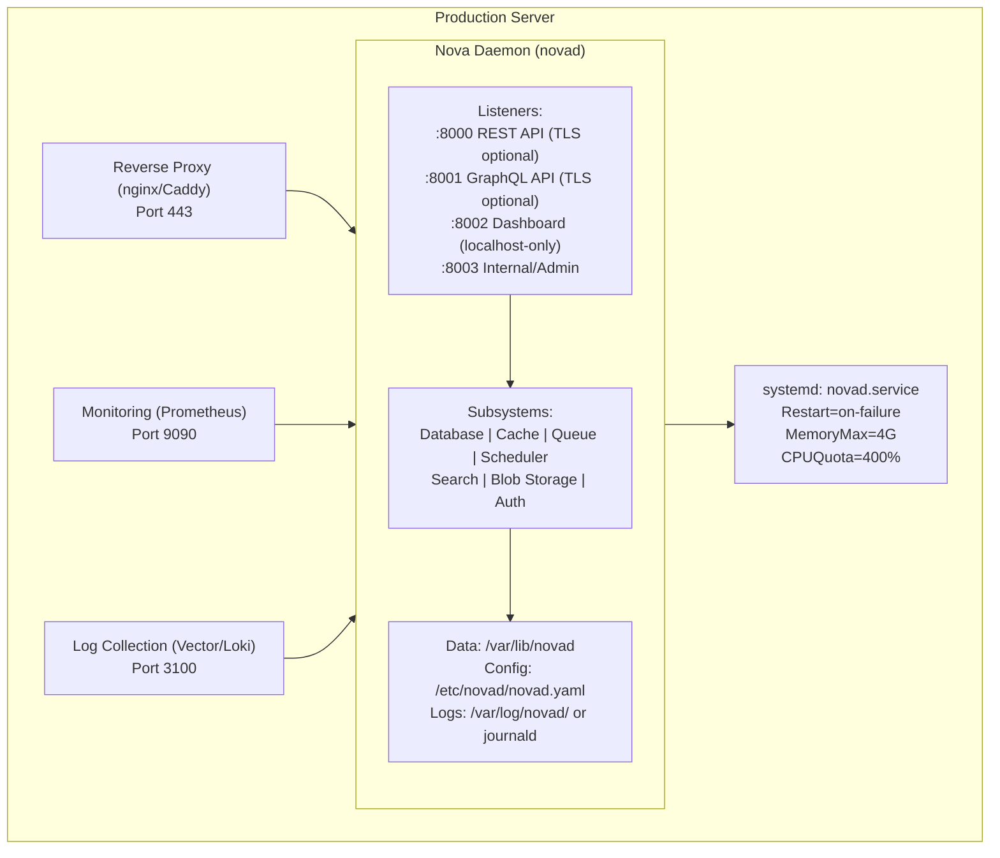
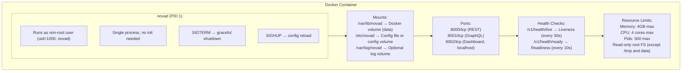
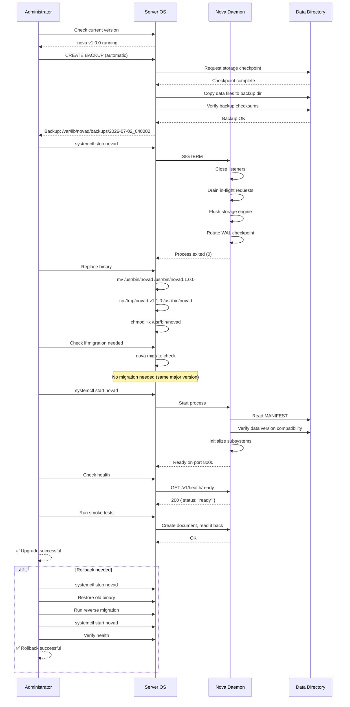
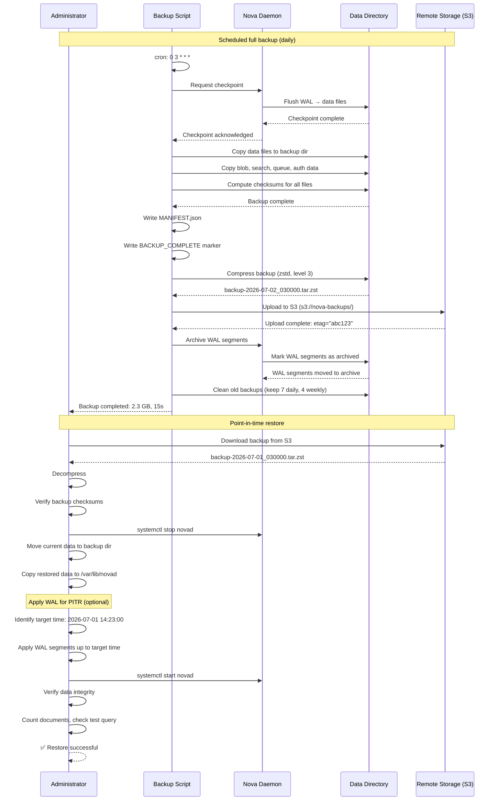
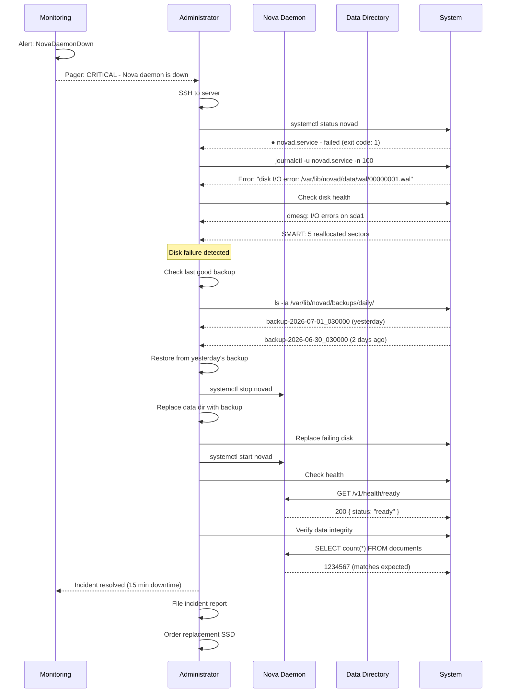

# Document 29: Deployment

## 1. Purpose

This document defines the complete deployment strategy for Nova Runtime. It covers installation methods, configuration, system integration, monitoring, backup/recovery, upgrade procedures, and operational runbooks. The goal is to enable operators to deploy, configure, maintain, and troubleshoot Nova Runtime in production environments with minimal downtime and maximum reliability.

Nova Runtime is designed for single-node deployment on commodity VPS or bare metal hardware. Clustering and multi-node deployment are future concerns.

## 2. Scope

This document covers:

- Installation methods: apt/rpm/dnf packages, Docker images, static binary, build from source
- Systemd service configuration with complete service file
- Dockerfile with multi-stage build and distroless target
- Configuration file location, format, and discovery
- Data directory layout and management
- Log configuration: journald, file, stdout
- Backup strategy: WAL archiving, periodic full snapshots
- Restore procedures for all failure scenarios
- Monitoring integration: Prometheus metrics, health check endpoints
- Upgrade procedure: binary swap with graceful restart (SIGHUP)
- Downgrade compatibility and procedures
- Resource limits configuration
- Firewall and network recommendations
- Reverse proxy configuration (nginx, Caddy)
- Complete runbook for common operations

## 3. Responsibilities

- **System Administrator**: Installs, configures, and maintains Nova Runtime in production
- **Operator**: Performs day-to-day operations: backup, monitoring, upgrades
- **Platform Team**: Manages deployment infrastructure (Docker, orchestration)
- **Developer**: Builds and packages releases; provides migration tools
- **Security Team**: Reviews deployment security; manages certificates and secrets
- **SRE**: Responds to incidents; performs recovery procedures

## 4. Non Responsibilities

- This document does not cover clustering or multi-node deployment (future work)
- Application-level backup (backing up application data through the API) is covered in the SDK document
- Performance tuning beyond deployment-level configuration is covered in the Benchmark Strategy document
- CI/CD pipeline for the NOVA project itself is covered in the Testing Strategy document
- This document does not cover cloud-provider-specific deployment (Terraform modules, etc.) for v1

## 5. Architecture

### 5.1 Deployment Architecture



### 5.2 Network Architecture

```mermaid
graph TB
    Internet[Internet] --> Firewall[Firewall<br/>Port 443]
    Firewall --> ReverseProxy[Reverse Proxy<br/>TLS termination<br/>Rate limiting<br/>WAF (optional)]

    ReverseProxy --> REST[REST API :8000]
    ReverseProxy --> GraphQL[GraphQL :8001]
    ReverseProxy --> Dashboard[Dashboard :8002]

    REST --> Daemon[Nova Daemon (novad)<br/>internal]
    Dashboard --> Daemon

    subgraph FirewallRules["Firewall Rules"]
        Inbound["Inbound:<br/>- 443/tcp: HTTPS (public)<br/>- 22/tcp: SSH (admin only, VPN/allowlist)"]
        Outbound["Outbound:<br/>- 443/tcp: Outbound HTTPS (webhooks)<br/>- 25/tcp: SMTP (email alerts)<br/>- 53/udp: DNS"]
        Internal["Internal (localhost only):<br/>- 8000/tcp: REST API<br/>- 8001/tcp: GraphQL API<br/>- 8002/tcp: Dashboard<br/>- 9090/tcp: Prometheus metrics"]
    end
```

### 5.3 Data Directory Layout

```
/var/lib/novad/
├── data/
│   ├── storage/
│   │   ├── data-000001.novadb       # Main data file(s)
│   │   ├── data-000002.novadb
│   │   ├── index-000001.novidx      # Index files
│   │   ├── index-000002.novidx
│   │   └── MANIFEST                 # Data file manifest
│   ├── wal/
│   │   ├── 0000000000000001.wal     # WAL segments, 64MB each
│   │   ├── 0000000000000002.wal
│   │   ├── ...
│   │   └── WAL_MANIFEST            # WAL metadata
│   ├── blob/
│   │   ├── buckets/
│   │   │   └── <bucket_name>/
│   │   │       ├── objects/         # Blob content files
│   │   │       ├── metadata/        # Blob metadata (JSON)
│   │   │       └── versions/        # Version history (if enabled)
│   │   └── MANIFEST
│   ├── search/
│   │   ├── indexes/
│   │   │   └── <index_name>/
│   │   │       ├── segments/        # Index segments
│   │   │       ├── dictionary/      # Term dictionary
│   │   │       └── meta.json        # Index metadata
│   │   └── MANIFEST
│   ├── queue/
│   │   ├── queues/
│   │   │   └── <queue_name>/
│   │   │       ├── messages.wal     # Queue WAL
│   │   │       └── state.json       # Queue state
│   │   └── MANIFEST
│   ├── scheduler/
│   │   ├── jobs/                    # Job definitions
│   │   ├── executions/              # Execution history
│   │   └── MANIFEST
│   ├── auth/
│   │   ├── users/                   # User database
│   │   ├── keys/                    # API key database
│   │   └── MANIFEST
│   ├── config/
│   │   ├── runtime.yaml             # Runtime-applied config changes
│   │   └── MANIFEST
│   └── SYSTEM                       # System metadata, version info
├── backups/
│   ├── daily/                       # Daily full snapshots
│   ├── weekly/                      # Weekly full snapshots
│   └── wal_archive/                 # Archived WAL segments
├── tmp/                             # Temporary files during operations
└── logs/                            # Log files (if file logging configured)
    ├── novad.log                    # Current log
    ├── novad.log.2026-07-01        # Rotated log
    └── novad.log.2026-06-30

Files:
  MANIFEST        — JSON file describing all files in the directory with checksums
  SYSTEM          — Binary or JSON file with data version, compatibility info
```

### 5.4 Configuration File Discovery

```
Default search paths (in order of precedence):
  1. --config <path>           Command-line flag (highest priority)
  2. $NOVA_CONFIG              Environment variable
  3. ./novad.yaml              Current working directory
  4. $XDG_CONFIG_HOME/novad/   User config directory
  5. /etc/novad/novad.yaml     System config directory
  6. /etc/novad/               System config directory

Config files are merged with later files having lower priority.
Values from higher-priority sources override lower-priority ones.

Environment variable overrides:
  NOVA_LOG_LEVEL=debug         Override log level
  NOVA_DATA_DIR=/custom/path   Override data directory
  NOVA_LISTEN_ADDR=127.0.0.1   Override listen address
  NOVA_PORT=8000               Override default port
```

### 5.5 Docker Architecture



## 6. Data Structures

### 6.1 Configuration File Schema

```yaml
# /etc/novad/novad.yaml
# Nova Runtime v1.0 Configuration
# YAML format, UTF-8 encoded

# ============================================================
# General Settings
# ============================================================
general:
  # Node name for identification in logs and metrics
  node_name: "nova-prod-01"
  
  # Data directory (must be writable by novad user)
  data_dir: "/var/lib/novad"
  
  # PID file location (systemd manages this usually)
  pid_file: "/run/novad/novad.pid"
  
  # Maximum number of concurrent operations
  # 0 = auto-detect based on CPU cores
  max_concurrency: 0
  
  # Shutdown timeout (seconds) — force kill after this
  shutdown_timeout_secs: 30

# ============================================================
# Networking
# ============================================================
networking:
  # REST API listener
  rest:
    enabled: true
    host: "127.0.0.1"           # Bind address
    port: 8000                   # Listen port
    tls:                         # Optional TLS
      enabled: false
      cert_file: "/etc/novad/certs/novad.crt"
      key_file: "/etc/novad/certs/novad.key"
      min_version: "1.2"         # TLS 1.2 minimum
    max_body_size: "10MB"
    read_timeout_secs: 30
    write_timeout_secs: 60
    idle_timeout_secs: 120
    max_connections: 1024
  
  # GraphQL API listener
  graphql:
    enabled: true
    host: "127.0.0.1"
    port: 8001
    tls:
      enabled: false
    max_query_depth: 10
    max_query_complexity: 1000
    max_batch_size: 50
  
  # Dashboard listener
  dashboard:
    enabled: true
    host: "127.0.0.1"           # Bind to localhost by default
    port: 8002
    tls:
      enabled: false
    allowed_origins:
      - "http://localhost:5173"
      - "https://dashboard.example.com"
    session_ttl_secs: 3600
    rate_limit_per_minute: 60
    max_body_size: "10MB"

# ============================================================
# Storage Engine
# ============================================================
storage:
  # Maximum data file size before rotation
  max_data_file_size: "4GB"
  
  # WAL configuration
  wal:
    enabled: true
    segment_size: "64MB"
    max_segments: 64              # Maximum WAL segments before checkpoint
    sync_interval: "100ms"        # fsync interval
    sync_mode: "async"            # async | sync | sync_full
    archive_mode: "off"           # off | on (for WAL archiving)
    archive_command: ""           # e.g., "cp %p /var/lib/novad/backups/wal_archive/%f"
  
  # Checkpoint configuration
  checkpoint:
    interval_secs: 300            # 5 minutes between checkpoints
    min_size_before_checkpoint: "256MB"  # Minimum WAL size to trigger checkpoint
    max_checkpoint_time_secs: 60  # Maximum checkpoint duration
  
  # Compression
  compression: "zstd"             # none | zstd | lz4 | gzip
  compression_level: 3            # 1-22 for zstd
  
  # Cache
  cache_size: "256MB"             # In-memory page cache

# ============================================================
# Cache Subsystem
# ============================================================
cache:
  enabled: true
  max_size: "256MB"               # Maximum cache size
  default_ttl_secs: 3600          # Default TTL (1 hour)
  max_entry_size: "1MB"           # Maximum single entry size
  eviction_policy: "lru"          # lru | lfu | ttl
  cleanup_interval_secs: 60

# ============================================================
# Queue Subsystem
# ============================================================
queue:
  enabled: true
  default_visibility_timeout_secs: 30
  default_retention_secs: 259200  # 3 days
  max_message_size: "256KB"
  max_queue_length: 1000000       # 0 = unlimited
  dead_letter_enabled: true
  max_delivery_attempts: 3
  cleanup_interval_secs: 3600

# ============================================================
# Scheduler Subsystem
# ============================================================
scheduler:
  enabled: true
  tick_interval_secs: 1           # Scheduler tick interval
  max_concurrent_jobs: 100
  default_timeout_secs: 300       # 5 minutes
  max_retries: 3
  retry_delay_secs: 60
  history_retention_days: 7
  timezone: "UTC"

# ============================================================
# Search Subsystem
# ============================================================
search:
  enabled: true
  max_index_size: "2GB"
  default_analyzer: "standard"
  indexing_batch_size: 100
  indexing_interval_secs: 5       # Near-real-time indexing interval
  max_query_time_ms: 5000
  max_results: 100

# ============================================================
# Blob Storage Subsystem
# ============================================================
blob:
  enabled: true
  max_bucket_count: 1000
  max_object_size: "5GB"
  default_upload_timeout_secs: 300
  streaming_chunk_size: "8MB"
  versioning_enabled_default: false
  checksum_algorithm: "sha256"

# ============================================================
# Authentication Subsystem
# ============================================================
auth:
  enabled: true
  password_min_length: 12
  password_hashing_cost: 12       # bcrypt cost factor
  session_ttl_secs: 86400         # 24 hours
  max_sessions_per_user: 10
  mfa_enabled: false
  jwt_signing_algorithm: "HS256"
  jwt_expiry_secs: 3600
  rate_limit_login_per_minute: 10
  account_lockout_threshold: 5
  account_lockout_duration_secs: 900  # 15 minutes

# ============================================================
# Logging
# ============================================================
logging:
  level: "info"                   # trace | debug | info | warn | error | fatal
  format: "json"                  # json | text | pretty
  output: "stdout"                # stdout | stderr | file | journald
  
  # File logging (only if output: "file")
  file:
    path: "/var/log/novad/novad.log"
    max_size: "100MB"
    max_files: 10
    max_age_days: 30
  
  # Journald (only if output: "journald")
  journald:
    identifier: "novad"
  
  # Structured fields added to every log entry
  fields:
    node: "${NODE_NAME}"

# ============================================================
# Monitoring
# ============================================================
monitoring:
  # Prometheus metrics
  prometheus:
    enabled: true
    path: "/v1/metrics"           # Metrics endpoint path
    prefix: "nova_"               # Metric name prefix
    histogram_buckets:            # Custom histogram buckets (ms)
      - 0.5
      - 1.0
      - 2.5
      - 5.0
      - 10.0
      - 25.0
      - 50.0
      - 100.0
      - 250.0
      - 500.0
      - 1000.0
  
  # Health checks
  health:
    liveness_path: "/v1/health/live"
    readiness_path: "/v1/health/ready"
    subsystem_timeout_ms: 5000
  
  # Distributed tracing (OpenTelemetry)
  tracing:
    enabled: false
    exporter: "otlp"              # otlp | jaeger | zipkin
    endpoint: "http://localhost:4317"
    sampling_ratio: 0.1           # Sample 10% of requests

# ============================================================
# Alerts
# ============================================================
alerts:
  evaluator_interval_secs: 10
  default_cooldown_secs: 300
  notification_retry_count: 3
  notification_retry_delay_secs: 30

# ============================================================
# Security
# ============================================================
security:
  # Secrets and encryption
  encryption:
    enabled: false
    key_file: "/etc/novad/keys/encryption.key"
    algorithm: "aes-256-gcm"
  
  # Rate limiting (global, per IP)
  rate_limiting:
    enabled: true
    requests_per_minute: 1000
    burst_size: 100
  
  # CORS
  cors:
    enabled: true
    allowed_origins:
      - "https://app.example.com"
    allowed_methods:
      - "GET"
      - "POST"
      - "PUT"
      - "DELETE"
      - "OPTIONS"
    allowed_headers:
      - "Authorization"
      - "Content-Type"
    max_age_secs: 3600

# ============================================================
# System Resource Limits
# ============================================================
resources:
  memory:
    max_rss: "4GB"                # Target maximum RSS
    gc_threshold: "3GB"           # Trigger aggressive GC above this
  cpu:
    max_cores: 0                  # 0 = all available
    throttle_threshold: 0.9       # Throttle at 90% CPU
  disk:
    min_free_space: "1GB"         # Enter read-only mode below this
    warning_threshold: "5GB"      # Warning log below this
```

### 6.2 Systemd Service File

```ini
# /etc/systemd/system/novad.service
[Unit]
Description=Nova Runtime Daemon
Documentation=https://nova-runtime.dev/docs
After=network-online.target
Wants=network-online.target

[Service]
Type=simple
User=novad
Group=novad
WorkingDirectory=/var/lib/novad

# Executable and arguments
ExecStart=/usr/bin/novad --config /etc/novad/novad.yaml
ExecReload=/bin/kill -HUP $MAINPID
ExecStop=/bin/kill -TERM $MAINPID

# Restart behavior
Restart=on-failure
RestartSec=5
StartLimitIntervalSec=60
StartLimitBurst=3

# Timeouts
TimeoutStartSec=30
TimeoutStopSec=30
TimeoutSec=30

# File descriptors
LimitNOFILE=65536
LimitNPROC=4096
LimitMEMLOCK=infinity

# Resource limits
MemoryMax=4G
MemoryHigh=3.5G
CPUQuota=400%
IOReadBandwidthMax=/var/lib/novad 100M
IOWriteBandwidthMax=/var/lib/novad 200M

# Security hardening
CapabilityBoundingSet=CAP_NET_BIND_SERVICE
NoNewPrivileges=yes
ProtectSystem=strict
ProtectHome=yes
PrivateTmp=yes
PrivateDevices=yes
ProtectKernelTunables=yes
ProtectKernelModules=yes
ProtectControlGroups=yes
RestrictAddressFamilies=AF_INET AF_INET6 AF_UNIX AF_NETLINK
RestrictNamespaces=yes
RestrictRealtime=yes
SystemCallArchitectures=native
MemoryDenyWriteExecute=no  # Required for JIT-like codegen if any

# Read-only paths
ReadWritePaths=/var/lib/novad /var/log/novad /etc/novad
ReadOnlyPaths=/usr/bin/novad

# Standard output
StandardOutput=journal
StandardError=journal

[Install]
WantedBy=multi-user.target
```

### 6.3 Dockerfile

```dockerfile
# ============================================================
# Stage 1: Build
# ============================================================
FROM rust:1.80-slim-bookworm AS builder

# Install build dependencies
RUN apt-get update && apt-get install -y --no-install-recommends \
    pkg-config \
    libssl-dev \
    && rm -rf /var/lib/apt/lists/*

# Create build user
RUN adduser --disabled-password --gecos "" --uid 1000 builder

# Build dependencies first (caching)
WORKDIR /build
COPY Cargo.toml Cargo.lock ./
RUN mkdir src && echo "fn main() {}" > src/main.rs
RUN cargo build --release --all-features 2>/dev/null || true

# Copy source and build
COPY src/ src/
RUN touch src/main.rs
RUN cargo build --release --all-features

# Strip binary
RUN strip target/release/novad

# ============================================================
# Stage 2: Dashboard build (if applicable)
# ============================================================
FROM node:20-slim AS dashboard-builder

WORKDIR /build
COPY nova-dashboard/ .
RUN npm ci && npm run build

# ============================================================
# Stage 3: Runtime (distroless)
# ============================================================
FROM gcr.io/distroless/cc-debian12:nonroot AS runtime

# Copy binary
COPY --from=builder /build/target/release/novad /usr/bin/novad

# Copy dashboard static files (embedded in binary, but provide override)
COPY --from=dashboard-builder /build/dist/ /usr/share/novad/dashboard/

# Create required directories
USER root
RUN mkdir -p /var/lib/novad /etc/novad /var/log/novad && \
    chown -R 1000:1000 /var/lib/novad /etc/novad /var/log/novad
USER 1000

# Default configuration
COPY novad.yaml /etc/novad/novad.yaml

# Expose ports
EXPOSE 8000 8001 8002

# Health checks
HEALTHCHECK --interval=30s --timeout=5s --start-period=10s --retries=3 \
    CMD ["/usr/bin/novad", "health", "--liveness"]

# Default command
ENTRYPOINT ["/usr/bin/novad"]
CMD ["--config", "/etc/novad/novad.yaml"]

# ============================================================
# Alternative: Alpine-based runtime (smaller)
# ============================================================
FROM alpine:3.20 AS runtime-alpine

RUN apk add --no-cache ca-certificates tzdata libgcc

COPY --from=builder /build/target/release/novad /usr/bin/novad
COPY --from=dashboard-builder /build/dist/ /usr/share/novad/dashboard/

RUN adduser -D -u 1000 novad && \
    mkdir -p /var/lib/novad /etc/novad /var/log/novad && \
    chown -R novad:novad /var/lib/novad /etc/novad /var/log/novad

USER novad
COPY novad.yaml /etc/novad/novad.yaml

EXPOSE 8000 8001 8002

HEALTHCHECK --interval=30s --timeout=5s --start-period=10s --retries=3 \
    CMD ["/usr/bin/novad", "health", "--liveness"]

ENTRYPOINT ["/usr/bin/novad"]
CMD ["--config", "/etc/novad/novad.yaml"]
```

### 6.4 Docker Compose

```yaml
# docker-compose.yml
version: "3.9"

services:
  novad:
    image: novaruntime/novad:latest
    container_name: novad
    restart: unless-stopped
    ports:
      - "127.0.0.1:8000:8000"  # REST API (localhost only)
      - "127.0.0.1:8001:8001"  # GraphQL (localhost only)
      - "127.0.0.1:8002:8002"  # Dashboard (localhost only)
    volumes:
      - novad-data:/var/lib/novad
      - ./novad.yaml:/etc/novad/novad.yaml:ro
      - ./certs:/etc/novad/certs:ro
      - novad-logs:/var/log/novad
    environment:
      - TZ=UTC
      - NOVA_LOG_LEVEL=info
    cap_drop:
      - ALL
    cap_add:
      - NET_BIND_SERVICE
    security_opt:
      - no-new-privileges:true
    read_only: true
    tmpfs:
      - /tmp:size=100M
    healthcheck:
      test: ["CMD", "/usr/bin/novad", "health", "--liveness"]
      interval: 30s
      timeout: 5s
      retries: 3
      start_period: 10s
    deploy:
      resources:
        limits:
          memory: 4G
          cpus: "4.0"
        reservations:
          memory: 1G

  # Optional: Prometheus for metrics collection
  prometheus:
    image: prom/prometheus:latest
    container_name: novad-prometheus
    restart: unless-stopped
    ports:
      - "127.0.0.1:9090:9090"
    volumes:
      - ./prometheus.yml:/etc/prometheus/prometheus.yml:ro
      - prometheus-data:/prometheus
    command:
      - "--config.file=/etc/prometheus/prometheus.yml"
      - "--storage.tsdb.path=/prometheus"
      - "--storage.tsdb.retention.time=30d"

volumes:
  novad-data:
    driver: local
  novad-logs:
    driver: local
  prometheus-data:
    driver: local
```

### 6.5 Reverse Proxy Configuration

```nginx
# /etc/nginx/sites-available/novad.conf
# Nginx reverse proxy configuration for Nova Runtime

upstream novad_rest {
    server 127.0.0.1:8000;
    keepalive 64;
}

upstream novad_graphql {
    server 127.0.0.1:8001;
    keepalive 64;
}

upstream novad_dashboard {
    server 127.0.0.1:8002;
    keepalive 16;
}

# HTTP → HTTPS redirect
server {
    listen 80;
    server_name nova.example.com;
    return 301 https://$server_name$request_uri;
}

# HTTPS server
server {
    listen 443 ssl http2;
    server_name nova.example.com;

    # TLS configuration
    ssl_certificate /etc/letsencrypt/live/nova.example.com/fullchain.pem;
    ssl_certificate_key /etc/letsencrypt/live/nova.example.com/privkey.pem;
    ssl_protocols TLSv1.2 TLSv1.3;
    ssl_ciphers ECDHE-ECDSA-AES128-GCM-SHA256:ECDHE-RSA-AES128-GCM-SHA256:ECDHE-ECDSA-AES256-GCM-SHA384:ECDHE-RSA-AES256-GCM-SHA384;
    ssl_prefer_server_ciphers on;
    ssl_session_cache shared:SSL:10m;
    ssl_session_timeout 10m;
    ssl_session_tickets off;

    # Security headers
    add_header Strict-Transport-Security "max-age=31536000; includeSubDomains" always;
    add_header X-Content-Type-Options nosniff;
    add_header X-Frame-Options DENY;
    add_header X-XSS-Protection "1; mode=block";
    add_header Referrer-Policy strict-origin-when-cross-origin;

    # Request size limits
    client_max_body_size 10M;
    client_body_timeout 30s;
    client_header_timeout 30s;

    # Rate limiting zones
    limit_req_zone $binary_remote_addr zone=api:10m rate=100r/s;
    limit_req_zone $binary_remote_addr zone=graphql:10m rate=50r/s;
    limit_req_zone $binary_remote_addr zone=auth:10m rate=10r/s;

    # REST API
    location /v1/ {
        limit_req zone=api burst=200 nodelay;
        proxy_pass http://novad_rest;
        proxy_http_version 1.1;
        proxy_set_header Host $host;
        proxy_set_header X-Real-IP $remote_addr;
        proxy_set_header X-Forwarded-For $proxy_add_x_forwarded_for;
        proxy_set_header X-Forwarded-Proto $scheme;
        proxy_read_timeout 60s;
        proxy_send_timeout 60s;
    }

    # GraphQL API
    location /graphql {
        limit_req zone=graphql burst=100 nodelay;
        proxy_pass http://novad_graphql;
        proxy_http_version 1.1;
        proxy_set_header Host $host;
        proxy_set_header X-Real-IP $remote_addr;
        proxy_set_header X-Forwarded-For $proxy_add_x_forwarded_for;
        proxy_set_header X-Forwarded-Proto $scheme;
        proxy_read_timeout 120s;  # GraphQL queries can be long
    }

    # Dashboard
    location /dashboard/ {
        proxy_pass http://novad_dashboard;
        proxy_http_version 1.1;
        proxy_set_header Host $host;
        proxy_set_header X-Real-IP $remote_addr;
        proxy_set_header X-Forwarded-For $proxy_add_x_forwarded_for;
        proxy_set_header X-Forwarded-Proto $scheme;
        proxy_set_header Upgrade $http_upgrade;
        proxy_set_header Connection "upgrade";
        proxy_read_timeout 3600s;  # WebSocket connections
        proxy_send_timeout 3600s;
    }

    # Metrics endpoint (restricted access)
    location /v1/metrics {
        # Allow prometheus server IP only
        allow 10.0.0.100;
        allow 127.0.0.1;
        deny all;
        proxy_pass http://novad_rest;
        proxy_http_version 1.1;
        proxy_set_header Host $host;
    }

    # Health check endpoints (unrestricted)
    location /v1/health/ {
        proxy_pass http://novad_rest;
        proxy_http_version 1.1;
        proxy_set_header Host $host;
    }

    # Root redirect to dashboard
    location / {
        return 301 /dashboard/;
    }
}
```

```caddy
# /etc/caddy/Caddyfile
# Caddy reverse proxy configuration for Nova Runtime

nova.example.com {
    # TLS with automatic certificate management
    tls admin@example.com

    # Security headers
    header {
        Strict-Transport-Security "max-age=31536000; includeSubDomains"
        X-Content-Type-Options "nosniff"
        X-Frame-Options "DENY"
        X-XSS-Protection "1; mode=block"
        Referrer-Policy "strict-origin-when-cross-origin"
    }

    # Request size limit
    request_body {
        max_size 10MB
    }

    # Rate limiting
    rate_limit {
        zone api {
            key {remote_host}
            events 200
            window 1s
        }
        zone auth {
            key {remote_host}
            events 10
            window 1m
        }
    }

    # REST API
    handle_path /v1/* {
        reverse_proxy http://127.0.0.1:8000 {
            header_up Host {host}
            header_up X-Real-IP {remote_host}
            header_up X-Forwarded-For {remote_host}
            header_up X-Forwarded-Proto {scheme}
        }
    }

    # GraphQL
    handle_path /graphql {
        reverse_proxy http://127.0.0.1:8001 {
            header_up Host {host}
            header_up X-Real-IP {remote_host}
        }
    }

    # Dashboard (with WebSocket support)
    handle_path /dashboard/* {
        reverse_proxy http://127.0.0.1:8002 {
            header_up Host {host}
            header_up X-Real-IP {remote_host}
            # WebSocket support
            header_up Connection {>Connection}
            header_up Upgrade {>Upgrade}
        }
    }

    # Metrics (restricted)
    handle_path /v1/metrics {
        @denied not remote_ip 10.0.0.100 127.0.0.1
        respond @denied "Forbidden" 403
        reverse_proxy http://127.0.0.1:8000
    }

    # Health checks
    handle_path /v1/health/* {
        reverse_proxy http://127.0.0.1:8000
    }

    # Root
    handle {
        redir /dashboard/ 302
    }
}
```

### 6.6 Prometheus Configuration

```yaml
# /etc/prometheus/prometheus.yml
global:
  scrape_interval: 15s
  evaluation_interval: 15s
  scrape_timeout: 10s

rule_files:
  - "alerts.yml"

scrape_configs:
  - job_name: "novad"
    static_configs:
      - targets:
          - "localhost:8000"       # Via REST API /v1/metrics
          - "127.0.0.1:8000"
    metrics_path: "/v1/metrics"
    scheme: http
    scrape_interval: 15s
    scrape_timeout: 10s

  - job_name: "novad-system"
    static_configs:
      - targets:
          - "localhost:9100"       # Node exporter (optional)
    metrics_path: "/metrics"
    scheme: http

# Alerting rules
# /etc/prometheus/alerts.yml
groups:
  - name: novad
    rules:
      - alert: NovaDaemonDown
        expr: up{job="novad"} == 0
        for: 1m
        labels:
          severity: critical
        annotations:
          summary: "Nova Runtime daemon is down"
      
      - alert: NovaHighLatency
        expr: histogram_quantile(0.99, rate(nova_request_duration_seconds_bucket[5m])) > 0.1
        for: 5m
        labels:
          severity: warning
        annotations:
          summary: "High P99 latency ({{ $value }}s)"
      
      - alert: NovaDiskSpaceLow
        expr: (nova_disk_free_bytes / nova_disk_total_bytes) < 0.1
        for: 5m
        labels:
          severity: critical
        annotations:
          summary: "Disk space below 10%"
      
      - alert: NovaMemoryHigh
        expr: (nova_memory_rss_bytes / nova_memory_total_bytes) > 0.9
        for: 5m
        labels:
          severity: warning
        annotations:
          summary: "Memory usage above 90%"
      
      - alert: NovaErrorRateHigh
        expr: rate(nova_errors_total[5m]) > 0.01
        for: 5m
        labels:
          severity: warning
        annotations:
          summary: "Error rate above 1%"
```

## 7. Algorithms

### 7.1 Graceful Shutdown

```
Algorithm: GracefulShutdown
Purpose: Shut down Nova Runtime gracefully, ensuring data integrity

HANDLE_SIGTERM():
  logger.info("Received SIGTERM, initiating graceful shutdown")
  
  // Step 1: Stop accepting new connections
  http_listener.close()
  dashboard_listener.close()
  metrics_listener.close()
  logger.info("Listeners closed, no new connections accepted")
  
  // Step 2: Drain in-flight requests
  drain_deadline = now() + 30_seconds
  active_requests = get_active_request_count()
  while active_requests > 0 and now() < drain_deadline:
    logger.info("Waiting for {} active requests", active_requests)
    sleep(1_second)
    active_requests = get_active_request_count()
  
  if active_requests > 0:
    logger.warn("Force-closing {} active requests after timeout", active_requests)
    force_close_active_requests()
  
  // Step 3: Pause schedulers
  scheduler.pause()
  logger.info("Scheduler paused")
  
  // Step 4: Drain queues
  queue.drain_in_flight_messages()
  logger.info("Queue drained")
  
  // Step 5: Flush storage engine
  storage.flush()
  logger.info("Storage flushed")
  
  // Step 6: Rotate WAL
  wal.checkpoint()
  logger.info("WAL checkpointed")
  
  // Step 7: Close subsystems
  for subsystem in subsystems:
    subsystem.shutdown()
    logger.info("Subsystem {} shut down", subsystem.name)
  
  // Step 8: Write shutdown marker
  write_shutdown_marker(data_dir)
  
  logger.info("Graceful shutdown complete")
  process.exit(0)

HANDLE_SIGHUP():
  logger.info("Received SIGHUP, reloading configuration")
  
  try:
    new_config = load_config(config_path)
    validate_config(new_config)
    
    // Apply hot-reloadable settings without restart
    for setting in HOT_RELOADABLE_SETTINGS:
      if new_config[setting] != current_config[setting]:
        apply_setting(setting, new_config[setting])
        logger.info("Applied config change: {} = {}", setting, new_config[setting])
    
    // Check if restart is needed
    requires_restart = false
    for setting in RESTART_REQUIRED_SETTINGS:
      if new_config[setting] != current_config[setting]:
        requires_restart = true
        logger.warn("Config change for {} requires restart", setting)
    
    if requires_restart:
      logger.warn("Some config changes will take effect after restart")
    
    current_config = new_config
    logger.info("Configuration reloaded successfully")
  
  except Error as e:
    logger.error("Failed to reload configuration: {}", e)

HOT_RELOADABLE_SETTINGS = [
  "logging.level",
  "logging.format",
  "cache.max_size",
  "cache.eviction_policy",
  "monitoring.prometheus.enabled",
  "alerts.*",
  "security.cors.*",
  "security.rate_limiting.*",
]

RESTART_REQUIRED_SETTINGS = [
  "networking.rest.port",
  "networking.rest.tls.*",
  "storage.*",
  "data_dir",
  "auth.jwt_signing_algorithm",
]
```

### 7.2 Backup Algorithm

```
Algorithm: CreateBackup
Purpose: Create a consistent backup of all Nova data

CREATE_BACKUP(backup_type):
  // backup_type: "full" | "wal_archive"
  timestamp = now().format("YYYY-MM-DD_HHmmss")
  backup_dir = "{}/backups/{}/{}".format(data_dir, backup_type, timestamp)
  mkdir_p(backup_dir)
  
  // Step 1: Request checkpoint (ensure consistent state)
  storage.request_checkpoint()
  logger.info("Checkpoint completed for consistent backup")
  
  // Step 2: Flush all WAL segments to data files
  wal.flush_all()
  logger.info("WAL flushed")
  
  // Step 3: Create manifest
  manifest = {
    backup_version: 1,
    novad_version: get_version(),
    timestamp: timestamp,
    type: backup_type,
    files: []
  }
  
  if backup_type == "full":
    // Step 4: Copy data files
    for file in list_files("{}/data/".format(data_dir)):
      if file.ends_with(".novadb") or file.ends_with(".novidx") or file.ends_with("MANIFEST"):
        checksum = sha256(file)
        copy(file, "{}/data/".format(backup_dir))
        manifest.files.push({
          path: file,
          checksum_algorithm: "sha256",
          checksum: checksum,
          size: file.size()
        })
    
    // Step 5: Copy subsystem data
    for subsystem_dir in ["blob", "search", "queue", "scheduler", "auth"]:
      if exists("{}/data/{}".format(data_dir, subsystem_dir)):
        recursive_copy(
          "{}/data/{}".format(data_dir, subsystem_dir),
          "{}/data/{}".format(backup_dir, subsystem_dir)
        )
    
    // Step 6: Copy WAL for point-in-time recovery
    if wal_archive_enabled:
      copy_current_wal(backup_dir)
  
  elif backup_type == "wal_archive":
    // Step 7: Archive WAL segments since last backup
    for segment in list_unarchived_wal_segments():
      checksum = sha256(segment)
      copy(segment, backup_dir)
      manifest.files.push({
        path: segment,
        checksum_algorithm: "sha256",
        checksum: checksum,
        size: segment.size()
      })
      mark_wal_as_archived(segment)
  
  // Step 8: Write manifest
  write_json("{}/MANIFEST.json".format(backup_dir), manifest)
  
  // Step 9: Create verification marker
  write("{}/BACKUP_COMPLETE".format(backup_dir), "OK")
  
  // Step 10: Clean old backups
  if backup_type == "full":
    keep_count = 7  // Keep 7 daily backups
    cleanup_old_backups("daily", keep_count)
    // Weekly: keep 4 weekly backups
    if is_sunday():
      copy_backup_to_weekly(backup_dir)
      cleanup_old_backups("weekly", 4)
  
  logger.info("Backup completed: {} ({} files, {} MB)", 
    backup_dir, manifest.files.len(), total_size_mb)
  
  return backup_dir

VERIFY_BACKUP(backup_dir):
  manifest = read_json("{}/MANIFEST.json".format(backup_dir))
  
  // Verify all files exist with correct checksums
  for entry in manifest.files:
    if not exists(entry.path):
      return false, "Missing file: {}".format(entry.path)
    
    actual_checksum = sha256(entry.path)
    if actual_checksum != entry.checksum:
      return false, "Checksum mismatch: {}".format(entry.path)
  
  return true, "Backup verified successfully"
```

### 7.3 Restore Algorithm

```
Algorithm: RestoreFromBackup
Purpose: Restore Nova data from a backup

RESTORE_FROM_BACKUP(backup_dir, target_dir):
  logger.info("Starting restore from {} to {}", backup_dir, target_dir)
  
  // Step 1: Verify backup integrity
  is_valid, message = VERIFY_BACKUP(backup_dir)
  if not is_valid:
    logger.error("Backup verification failed: {}", message)
    return false
  
  // Step 2: Stop daemon (must be stopped before restore)
  if is_running("novad"):
    logger.error("Nova daemon must be stopped before restore")
    return false
  
  // Step 3: Create backup of current data
  current_backup_dir = "{}/backups/pre-restore/{}".format(
    data_dir, now().format("YYYY-MM-DD_HHmmss")
  )
  if exists(target_dir):
    move(target_dir, current_backup_dir)
    logger.info("Existing data backed up to {}", current_backup_dir)
  
  // Step 4: Create target directory
  mkdir_p(target_dir)
  
  // Step 5: Copy data files
  for entry in manifest.files:
    source = "{}/{}".format(backup_dir, entry.path)
    dest = "{}/{}".format(target_dir, entry.path)
    mkdir_p(dirname(dest))
    copy(source, dest)
  
  // Step 6: Apply WAL segments for point-in-time recovery
  if primary_wal_dir = "{}/data/wal".format(backup_dir):
    if exists(primary_wal_dir):
      copy_all(primary_wal_dir, "{}/data/wal".format(target_dir))
  
  // Step 7: Write restore marker
  write("{}/RESTORED_FROM".format(target_dir), backup_dir)
  
  logger.info("Restore completed successfully")
  logger.info("Target: {}", target_dir)
  logger.info("Original data preserved at: {}", current_backup_dir)
  
  return true

RESTORE_POINT_IN_TIME(backup_dir, target_time):
  // Requires full backup + WAL archive
  logger.info("Starting PITR to {}", target_time)
  
  // Step 1: Restore from full backup
  full_backup = find_latest_full_backup(backup_dir)
  if full_backup is None:
    logger.error("No full backup found")
    return false
  
  RESTORE_FROM_BACKUP(full_backup, target_dir)
  
  // Step 2: Apply WAL segments up to target time
  wal_segments = get_wal_segments_before(timestamp, backup_dir)
  for segment in wal_segments:
    logger.info("Applying WAL segment: {}", segment)
    apply_wal_segment(segment, target_dir)
  
  // Step 3: Truncate to target time
  truncate_data_to_time(target_dir, target_time)
  
  logger.info("PITR completed to {}", target_time)
  return true
```

### 7.4 Upgrade Procedure

```
Algorithm: UpgradeProcedure
Purpose: Upgrade Nova Runtime to a new version with minimal downtime

UPGRADE(version_from, version_to):
  logger.info("Starting upgrade from {} to {}", version_from, version_to)
  
  // Step 1: Pre-upgrade checks
  if compatibility_check(version_from, version_to) fails:
    logger.error("Incompatible upgrade path")
    return false
  
  backup_result = CREATE_BACKUP("full")
  logger.info("Pre-upgrade backup: {}", backup_result)
  
  // Step 2: Download new binary
  download_binary(version_to, "/tmp/novad-new")
  verify_checksum("/tmp/novad-new", version_to)
  
  // Step 3: Graceful shutdown
  systemctl("stop novad")
  logger.info("Daemon stopped")
  
  // Step 4: Backup binary
  move("/usr/bin/novad", "/usr/bin/novad.{}".format(version_from))
  
  // Step 5: Install new binary
  copy("/tmp/novad-new", "/usr/bin/novad")
  chmod("/usr/bin/novad", 0755)
  
  // Step 6: Run data migration (if needed)
  if needs_migration(version_from, version_to):
    migration_result = run_migration("/usr/bin/novad", "/var/lib/novad")
    if migration_result fails:
      logger.error("Migration failed, initiating rollback")
      ROLLBACK(version_to, version_from)
      return false
    logger.info("Data migration completed")
  
  // Step 7: Start new version
  systemctl("start novad")
  
  // Step 8: Verify health
  for i in 0..30:  // Wait up to 30 seconds
    health = http_get("http://localhost:8000/v1/health/ready")
    if health.status == 200 and health.body.status == "healthy":
      logger.info("New version is healthy")
      break
    sleep(1)
  
  if not healthy:
    logger.error("New version failed health check, initiating rollback")
    ROLLBACK(version_to, version_from)
    return false
  
  // Step 9: Run smoke tests
  smoke_result = run_smoke_tests()
  if smoke_result fails:
    logger.warn("Smoke tests failed, new version may have issues")
    // Don't rollback automatically - operator decides
  
  logger.info("Upgrade to {} completed successfully", version_to)
  return true

ROLLBACK(version_failed, version_rollback_to):
  logger.info("Rolling back from {} to {}", version_failed, version_rollback_to)
  
  systemctl("stop novad")
  
  // Restore old binary
  move("/usr/bin/novad", "/usr/bin/novad.failed.{}".format(version_failed))
  copy("/usr/bin/novad.{}".format(version_rollback_to), "/usr/bin/novad")
  
  // Run reverse migration (if needed)
  if needs_reverse_migration(version_failed, version_rollback_to):
    run_reverse_migration("/var/lib/novad")
  
  systemctl("start novad")
  
  // Verify health
  health = wait_for_health("http://localhost:8000/v1/health/ready", timeout=30)
  if health:
    logger.info("Rollback completed successfully")
  else:
    logger.error("Rollback failed, manual intervention required")
  
  return health

COMPATIBILITY_CHECK(from_ver, to_ver):
  // Check version compatibility
  // v1.x can upgrade to any v1.x (minor versions)
  // v1.x can upgrade to v1.x+1 (major versions with migration)
  // Skipping major versions is not allowed
  
  from_parts = parse_version(from_ver)  // [major, minor, patch]
  to_parts = parse_version(to_ver)
  
  if from_parts[0] != to_parts[0]:
    // Major version change
    if from_parts[0] + 1 != to_parts[0]:
      return false  // Can't skip major versions
    if from_parts[1] > 0:
      return false  // Must be at latest minor of current major
    return true  // Needs migration
  
  // Same major version
  if from_parts[1] + 1 == to_parts[1]:
    return true  // Minor version bump, no migration needed
  
  if from_parts[1] == to_parts[1]:
    return true  // Patch version, no migration needed
  
  return false  // Can't go backwards in minor version
```

## 8. Interfaces

### 8.1 CLI Operations

```
nova                          # Start daemon (foreground)
nova --config /path/config.yaml  # Start with custom config
nova --version                # Print version and exit
nova --help                   # Print help

nova health --liveness        # Health check (exit code 0 = healthy)
nova health --ready           # Readiness check
nova config validate          # Validate config file
nova config show              # Show effective config
nova config diff              # Show pending changes
nova status                   # Show daemon status
nova version                  # Show version info

nova backup create            # Create full backup
nova backup create --type wal # Create WAL archive backup
nova backup list              # List available backups
nova backup verify <backup>   # Verify backup integrity

nova restore <backup>         # Restore from backup
nova restore --pitr <time>    # Point-in-time recovery

nova migrate check            # Check if migration is needed
nova migrate run              # Run data migration
nova migrate status           # Show migration status

nova debug metrics            # Print current metrics to stdout
nova debug connections        # Show active connections
nova debug subsystems         # Show subsystem status
nova debug profile <duration> # Run CPU profiler for N seconds

nova admin reset-password <username>  # Reset user password
nova admin rotate-secrets             # Rotate encryption keys
nova admin reindex                    # Rebuild all search indexes
nova admin compact                    # Compact storage data files
```

### 8.2 Health Check Endpoints

```
GET /v1/health/live
Purpose: Liveness probe — is the process alive?
Response (200):
  { "status": "alive" }
Response (always 200 if process is running)

GET /v1/health/ready
Purpose: Readiness probe — is the daemon ready to serve traffic?
Response (200):
  {
    "status": "ready",
    "version": "1.0.0",
    "uptime_seconds": 12345,
    "subsystems": {
      "storage": "healthy",
      "cache": "healthy",
      "queue": "healthy",
      "scheduler": "healthy",
      "search": "healthy",
      "blob": "healthy",
      "auth": "healthy"
    }
  }
Response (503):
  {
    "status": "not_ready",
    "reason": "Storage engine not initialized"
  }

GET /v1/health/check
Purpose: Comprehensive health check with diagnostic info
Response (200):
  {
    "status": "healthy",
    "version": "1.0.0",
    "build": {
      "commit": "a1b2c3d4e5f6...",
      "build_time": "2026-07-01T10:00:00Z",
      "rust_version": "1.80.0"
    },
    "system": {
      "cpu_usage_pct": 23.5,
      "memory_rss_mb": 156,
      "disk_free_mb": 45200,
      "disk_total_mb": 102400,
      "uptime_seconds": 12345
    },
    "subsystems": {
      "storage": {
        "status": "healthy",
        "metrics": {
          "total_documents": 1234567,
          "total_size_mb": 2345,
          "ops_per_sec": 1500
        }
      },
      "cache": {
        "status": "healthy",
        "metrics": {
          "hit_ratio": 0.94,
          "entries": 12847,
          "memory_mb": 256
        }
      }
    }
  }
```

### 8.3 Metrics Endpoint

```
GET /v1/metrics
Purpose: Prometheus-compatible metrics endpoint
Response: text/plain
Example:
  # HELP nova_build_info Build information
  # TYPE nova_build_info gauge
  nova_build_info{version="1.0.0",commit="a1b2c3d4e5f6",rust="1.80.0"} 1
  
  # HELP nova_uptime_seconds System uptime
  # TYPE nova_uptime_seconds counter
  nova_uptime_seconds 12345
  
  # HELP nova_requests_total Total requests
  # TYPE nova_requests_total counter
  nova_requests_total{subsystem="storage",operation="read",status="success"} 1234567
  nova_requests_total{subsystem="storage",operation="read",status="error"} 42
  nova_requests_total{subsystem="storage",operation="write",status="success"} 987654
  nova_requests_total{subsystem="storage",operation="write",status="error"} 15
  
  # HELP nova_request_duration_seconds Request duration
  # TYPE nova_request_duration_seconds histogram
  nova_request_duration_seconds_bucket{subsystem="storage",operation="read",le="0.001"} 500000
  nova_request_duration_seconds_bucket{subsystem="storage",operation="read",le="0.005"} 900000
  nova_request_duration_seconds_bucket{subsystem="storage",operation="read",le="0.01"} 990000
  nova_request_duration_seconds_bucket{subsystem="storage",operation="read",le="0.05"} 999000
  nova_request_duration_seconds_bucket{subsystem="storage",operation="read",le="+Inf"} 1000000
  nova_request_duration_seconds_sum{subsystem="storage",operation="read"} 2500.5
  nova_request_duration_seconds_count{subsystem="storage",operation="read"} 1000000
  
  # HELP nova_database_documents_total Total documents
  # TYPE nova_database_documents_total gauge
  nova_database_documents_total{collection="users"} 50000
  nova_database_documents_total{collection="posts"} 150000
  
  # HELP nova_database_size_bytes Database size
  # TYPE nova_database_size_bytes gauge
  nova_database_size_bytes{type="data"} 2147483648
  nova_database_size_bytes{type="wal"} 268435456
  nova_database_size_bytes{type="index"} 536870912
  
  # HELP nova_cache_hit_ratio Cache hit ratio
  # TYPE nova_cache_hit_ratio gauge
  nova_cache_hit_ratio{engine="lru"} 0.94
  
  # HELP nova_queue_depth Queue depth
  # TYPE nova_queue_depth gauge
  nova_queue_depth{queue="emails"} 12345
  nova_queue_depth{queue="webhooks"} 8921
  
  # HELP nova_queue_rate Queue operations per second
  # TYPE nova_queue_rate gauge
  nova_queue_rate{queue="emails",operation="enqueue"} 120
  nova_queue_rate{queue="emails",operation="dequeue"} 115
  
  # HELP nova_memory_rss_bytes Resident memory in bytes
  # TYPE nova_memory_rss_bytes gauge
  nova_memory_rss_bytes 163577856
  
  # HELP nova_cpu_usage_percent CPU usage percent
  # TYPE nova_cpu_usage_percent gauge
  nova_cpu_usage_percent{cpu="total"} 23.5
  
  # HELP nova_disk_free_bytes Free disk space
  # TYPE nova_disk_free_bytes gauge
  nova_disk_free_bytes{path="/var/lib/novad"} 47425617920
  
  # HELP nova_connections_active Active connections
  # TYPE nova_connections_active gauge
  nova_connections_active{type="http"} 42
  nova_connections_active{type="ws"} 3
```

## 9. Sequence Diagrams

### 9.1 Upgrade Process



### 9.2 Backup and Restore



### 9.3 Incident Response



## 10. Failure Modes

| ID | Failure Mode | Cause | Effect | Detection | Severity |
|----|-------------|-------|--------|-----------|----------|
| D01 | Process crash | Bug, OOM, segfault | Daemon stops, all services unavailable | systemd restarts, monitoring alert | Critical |
| D02 | Disk full | Log growth, data growth, no cleanup | Write operations fail, daemon enters read-only mode | Disk usage monitoring alert | Critical |
| D03 | Disk failure | Hardware failure, bad sectors | Data corruption, I/O errors | SMART monitoring, kernel I/O errors | Critical |
| D04 | Data corruption | Bug, hardware fault, power loss | Inconsistent data, crashes on read | Checksum verification fails on read | Critical |
| D05 | WAL corruption | Partial write, disk failure | Can't replay WAL on recovery | WAL CRC check fails during startup | Critical |
| D06 | Backup failure | Disk full, network issue for remote | No recent backup, increased data loss risk | Backup script failure alert | High |
| D07 | Restore failure | Corrupt backup, incompatible version | Can't recover data | Restore script fails during verification | Critical |
| D08 | Upgrade failure | Migration bug, incompatible data format | Daemon fails to start after upgrade | Health check failure after upgrade | Critical |
| D09 | Config error | Syntax error, invalid values, incompatible settings | Daemon fails to start | Config validation fails | High |
| D10 | Port conflict | Another service using same port | Listener fails to bind | Daemon log: "address already in use" | High |
| D11 | TLS certificate expiry | Certificate expired over 30 days | TLS connections fail | Certificate monitoring, browser warnings | High |
| D12 | Reverse proxy misconfig | Incorrect proxy settings | Routes unavailable, WebSocket fails | Can't access certain endpoints | Medium |
| D13 | OOM kill | Memory leak, workload spike, insufficient limits | Process killed by kernel OOM killer | dmesg: "Out of memory: killed process novad" | Critical |
| D14 | Zombie process | Improper process management | Resource leak, can't restart service | ps shows defunct novad processes | Medium |
| D15 | Time synchronization issue | NTP not running, clock drift | Log timestamps wrong, auth token validation fails | Clock skew > 5 minutes | Medium |
| D16 | Filesystem full from blobs | Blob storage growing without limit | Blob write fails, then all writes fail | Disk usage monitoring | High |
| D17 | SELinux/AppArmor policy | Security policy blocking operations | Daemon crashes or operations fail | audit.log shows denials | High |
| D18 | Network partition | Firewall change, network failure | API unreachable but process running | Health check from external fails | High |
| D19 | Backup encryption key lost | Key file deleted, backup (if encrypted) unrecoverable | Can't restore from encrypted backup | Key file missing notification | Critical |
| D20 | Kernel update incompatibility | Kernel update changes behavior | Daemon crash after reboot | Boot-time failure | Medium |

## 11. Recovery Strategy

### 11.1 Runbook: Daemon Crash

```markdown
## Runbook: Daemon Crash Recovery

### Symptoms
- Monitoring alert: NovaDaemonDown
- API endpoints return connection refused
- systemctl status novad shows failed

### Initial Assessment
1. SSH to server
2. Check service status:
   ```
   systemctl status novad
   journalctl -u novad.service -n 50 --no-pager
   ```
3. Determine crash cause:
   - OOM: Check `dmesg | grep -i oom`
   - Panic: Look for "panic:" in journal
   - Signal: Note the signal number (SIGKILL=9, SIGSEGV=11)

### Recovery Steps

**Case A: OOM Kill**
1. Check memory usage before crash:
   ```
   journalctl -u novad.service -n 100 | grep memory
   ```
2. Increase MemoryMax in systemd service:
   ```
   systemctl edit novad
   [Service]
   MemoryMax=6G
   ```
3. Restart:
   ```
   systemctl start novad
   ```
4. Monitor memory usage:
   ```
   systemctl status novad
   ```

**Case B: Software Bug (Panic/Segfault)**
1. Capture debug info:
   ```
   coredumpctl list
   coredumpctl dump novad > /tmp/novad-coredump
   ```
2. Check if known issue: grep the panic message
3. Restart with previous version:
   ```
   systemctl stop novad
   cp /usr/bin/novad.{working-version} /usr/bin/novad
   systemctl start novad
   ```
4. File bug report with coredump

**Case C: Unknown Signal**
1. Check system logs for cause:
   ```
   journalctl -u novad.service -n 200
   dmesg -T | tail -20
   ```
2. Restart and monitor:
   ```
   systemctl start novad
   journalctl -u novad.service -f
   ```

### Verification
1. Health check:
   ```
   curl http://localhost:8000/v1/health/ready
   ```
2. Verify data:
   ```
   nova status
   ```
3. Run quick smoke test:
   ```
   curl -X POST http://localhost:8000/v1/documents/test \
     -H "Content-Type: application/json" \
     -d '{"hello": "world"}'
   ```

### Escalation
If root cause is not clear, collect:
- journalctl output
- Core dump
- /etc/novad/novad.yaml
- Disk usage: `df -h`
- Memory info: `free -m`
Send to #nova-dev with runbook reference
```

### 11.2 Runbook: Data Corruption Recovery

```markdown
## Runbook: Data Corruption Recovery

### Symptoms
- Daemon fails to start with checksum error
- Read operations return CRC mismatch errors
- "Database corruption detected" in logs

### Immediate Action
1. Stop daemon immediately to prevent further writes:
   ```
   systemctl stop novad
   ```
2. Preserve the corrupted data directory:
   ```
   cp -a /var/lib/novad /var/lib/novad.corrupted
   ```

### Recovery from Backup

1. List available backups:
   ```
   ls -la /var/lib/novad/backups/daily/
   ```

2. Verify newest backup:
   ```
   nova backup verify /var/lib/novad/backups/daily/2026-07-01_030000
   ```

3. Restore from backup:
   ```
   nova restore /var/lib/novad/backups/daily/2026-07-01_030000
   ```

4. Start daemon:
   ```
   systemctl start novad
   ```

### Point-in-Time Recovery (if WAL archive available)

1. Find full backup and WAL archives:
   ```
   ls -la /var/lib/novad/backups/
   ```

2. Restore to specific time:
   ```
   nova restore --pitr "2026-07-01T14:30:00Z" \
     /var/lib/novad/backups/daily/2026-07-01_030000
   ```

### Recovery without Backup (Last Resort)

1. Try to repair corrupted files:
   ```
   nova repair /var/lib/novad
   ```
   (This will discard corrupted data)

2. If repair succeeds, start daemon:
   ```
   systemctl start novad
   ```

3. If repair fails, initialize new database and re-import:
   ```
   rm -rf /var/lib/novad/data
   systemctl start novad
   # Re-import data from application-level backup
   ```

### Post-Recovery Verification
1. Run full data integrity check:
   ```
   nova admin integrity-check
   ```
2. Verify document count matches expected
3. Run application-level smoke tests
4. Check search indexes are consistent

### Root Cause Investigation
1. Check hardware:
   ```
   smartctl -a /dev/sda
   dmesg | grep -i error
   ```
2. Check last boot and power events:
   ```
   last reboot
   journalctl --list-boots
   ```
3. File bug report with corrupted data sample

### Prevention
1. Enable WAL archiving for PITR capability
2. Increase backup frequency
3. Set up SMART monitoring
4. Add UPS for clean power
```

### 11.3 Runbook: Upgrade Rollback

```markdown
## Runbook: Upgrade Rollback

### Symptoms
- Daemon fails to start after upgrade
- Critical subsystem fails after upgrade
- Error rate spikes after upgrade
- Performance degradation > 50%

### When to Rollback
- Daemon won't start (immediate rollback)
- Data corruption detected (immediate rollback)
- Performance regression > 50% (rollback after confirmation)
- Migration takes > 30 minutes (assess, may rollback)

### Rollback Procedure

1. Stop daemon:
   ```
   systemctl stop novad
   ```

2. Preserve logs and crash dumps:
   ```
   journalctl -u novad.service -n 500 > /tmp/novad-upgrade-failure.log
   ```

3. Restore old binary:
   ```
   cd /usr/bin
   cp novad novad.failed
   cp novad.1.0.0 novad
   ```

4. Run reverse migration (if any):
   ```
   nova migrate reverse
   ```

5. Start daemon:
   ```
   systemctl start novad
   ```

6. Verify:
   ```
   systemctl status novad
   curl http://localhost:8000/v1/health/ready
   ```

7. Run smoke tests:
   ```
   nova test smoke
   ```

### Post-Rollback
1. File bug report with:
   - Upgrade failure log
   - System info (OS, kernel, hardware)
   - Config file (redacted)
2. Monitor system for stability
3. Do NOT attempt upgrade again until bug is fixed
```

### 11.4 Runbook: Disaster Recovery (Complete Server Loss)

```markdown
## Runbook: Disaster Recovery — Complete Server Loss

### Prerequisites
- Access to remote backup (S3, another server, etc.)
- Fresh server with matching OS
- Nova Runtime installation packages or Docker image
- Backup encryption key (if encrypted)

### Recovery Steps

1. Provision new server with:
   - Same OS version (or compatible)
   - Sufficient CPU/RAM (at least original spec)
   - SSD storage (at least original size + 20%)

2. Install Nova Runtime:
   ```
   # apt-based
   curl -fsSL https://packages.nova-runtime.dev/gpg | gpg --dearmor > /usr/share/keyrings/nova.gpg
   echo "deb [signed-by=/usr/share/keyrings/nova.gpg] https://packages.nova-runtime.dev/apt stable main" > /etc/apt/sources.list.d/nova.list
   apt update && apt install novad
   
   # or Docker
   docker pull novaruntime/novad:latest
   ```

3. Restore config:
   - Retrieve config from your config management (Ansible, Terraform, etc.)
   - Or from backup: `cp backup/novad.yaml /etc/novad/novad.yaml`

4. Download latest backup:
   ```
   aws s3 cp s3://nova-backups/backup-2026-07-01_030000.tar.zst /tmp/
   cd /tmp && tar --zstd -xf backup-2026-07-01_030000.tar.zst
   nova backup verify /tmp/backup/
   ```

5. Stop daemon (if running from initial install):
   ```
   systemctl stop novad
   ```

6. Restore data:
   ```
   rm -rf /var/lib/novad/data
   nova restore /tmp/backup/
   ```

7. Set correct permissions:
   ```
   chown -R novad:novad /var/lib/novad
   ```

8. Start daemon:
   ```
   systemctl start novad
   ```

9. Verify:
   ```
   curl http://localhost:8000/v1/health/ready
   nova status
   nova admin integrity-check
   ```

10. Restore reverse proxy config:
    - Apply nginx/Caddy config
    - Update DNS if IP changed

11. Verify external access:
    - HTTPS endpoint
    - Dashboard
    - API endpoint

### Expected Recovery Time
- From warm standby: 5-10 minutes
- From backup download: 30-60 minutes
- From full rebuild: 1-4 hours

### Post-Recovery
1. Verify all subsystems are operational
2. Check all application integrations
3. Schedule root cause analysis
4. Update disaster recovery plan if gaps found
```

## 12. Performance Considerations

### 12.1 Resource Requirements by Deployment Size

| Deployment | CPU | RAM | Disk | Max Data Size | Max Ops/s |
|------------|-----|-----|------|---------------|-----------|
| Minimal | 1 vCPU | 512 MB | 5 GB | 1 GB | 500 |
| Small | 2 vCPU | 2 GB | 20 GB | 10 GB | 5,000 |
| Medium | 4 vCPU | 8 GB | 100 GB | 50 GB | 25,000 |
| Large | 8 vCPU | 16 GB | 500 GB | 250 GB | 100,000 |
| X-Large | 16 vCPU | 32 GB | 1 TB | 500 GB | 250,000 |

### 12.2 Performance Thresholds and Limits

| Resource | Soft Limit | Hard Limit | Behavior at Limit |
|----------|-----------|------------|-------------------|
| Memory (RSS) | 80% of max | 90% of max | GC trigger at 80%, throttling at 90% |
| CPU | 80% sustained | 95% sustained | Request throttling at 95% |
| Disk (data) | 80% full | 95% full | Warnings at 80%, read-only at 95% |
| Disk (temp) | 1 GB | 500 MB | Upload failures at limit |
| File descriptors | 60% of max | 80% of max | Connection refusal at 80% |
| Connections | 80% of max | 95% of max | Graceful reduction at limit |

### 12.3 Startup Time Estimates

| Data Size | Cold Start (no cache) | Warm Start (with cache) | Recovery Start |
|-----------|----------------------|------------------------|----------------|
| Empty | < 500 ms | < 200 ms | N/A |
| 1 GB | < 2 s | < 500 ms | < 5 s |
| 10 GB | < 10 s | < 2 s | < 30 s |
| 100 GB | < 60 s | < 10 s | < 5 min |
| 500 GB | < 5 min | < 30 s | < 20 min |

### 12.4 Backup Performance

| Data Size | Backup Time (local) | Backup Time (remote S3) | Backup Size (zstd-3) |
|-----------|--------------------|------------------------|---------------------|
| 1 GB | < 5 s | < 30 s | ~300 MB |
| 10 GB | < 30 s | < 5 min | ~3 GB |
| 100 GB | < 5 min | < 30 min | ~30 GB |
| 500 GB | < 20 min | < 2 hours | ~150 GB |

### 12.5 I/O Patterns

```
Read patterns:
  - Point reads: Small random I/O (4-64 KB)
  - Range scans: Sequential I/O (increasing sizes)
  - Search queries: Random index I/O + sequential doc fetch
  - Blob downloads: Sequential streaming (large)
  - WAL replay: Sequential read (WAL segments)
  - Recovery: Sequential WAL scan + random data page writes

Write patterns:
  - Point writes: WAL append (sequential) + lazy data write (random)
  - Batch writes: WAL append (sequential, batched)
  - Blob uploads: Sequential write (large chunks)
  - Checkpoints: Sequential data file writes
  - Index writes: Random I/O (B-tree updates)

I/O amplification:
  - Write: 1x (WAL) + 1x (data file on checkpoint) = 2x base
  - Update: 1x (WAL) + 1x (data file) = 2x base (no in-place update)
  - Delete: 1x (WAL) + 0x (tombstone, compacted later)
  - WAL checkpoint: Reads old data + writes new data file
```

## 13. Security

### 13.1 Deployment Security Checklist

```
□ Dedicated non-root user (novad) for daemon
□ Data directory owned by novad user (0700 permissions)
□ Configuration files owned by root:novad (0640 permissions)
□ TLS enabled for all external-facing endpoints
□ TLS minimum version 1.2
□ Dashboard bound to localhost only (127.0.0.1)
□ Firewall restricts ports 8000-8002 to localhost
□ Reverse proxy handles TLS termination
□ HSTS enabled with max-age=31536000
□ Content-Security-Policy headers configured
□ X-Frame-Options: DENY
□ rate limiting enabled for API and auth endpoints
□ Failed login attempt monitoring
□ SSH access restricted (key-only, VPN or IP allowlist)
□ System updates enabled (unattended-upgrades for security)
□ Fail2ban or equivalent configured for SSH
□ Audit logging enabled
□ Regular backup verification
□ WAL archiving enabled for production
□ Prometheus monitoring of disk space
□ OOM killer monitoring
□ SELinux/AppArmor enforcing (permissive mode for testing)
□ Docker: read-only root filesystem, no-new-privileges
□ Docker: drop all capabilities, add only NET_BIND_SERVICE
□ Secrets (encryption keys, passwords) stored in secure vault
□ API keys rotated every 90 days
```

### 13.2 Secrets Management

```yaml
# Secrets that must be protected:
# 1. JWT signing key (auth.jwt_secret)
# 2. Encryption key (security.encryption.key_file)
# 3. Dashboard session secret
# 4. Database passwords for external integrations
# 5. Webhook secrets
# 6. SMTP credentials (for alert emails)

# Recommended: Use environment variables or a vault

# Via environment variables (supports .env file):
#   NOVA_AUTH_JWT_SECRET=...
#   NOVA_ENCRYPTION_KEY=...
#   NOVA_SMTP_PASSWORD=...

# Via Vault (HashiCorp Vault integration - future):
#   vault read secret/novad/production

# Via systemd LoadCredential:
#   LoadCredential=jwt-secret:/etc/novad/secrets/jwt.key
#   Environment=NOVA_AUTH_JWT_SECRET=%d/jwt-secret

# File permissions:
#   /etc/novad/secrets/        → 0700 root:novad
#   /etc/novad/secrets/*.key   → 0400 root:novad
```

### 13.3 Firewall Configuration

```bash
#!/bin/bash
# Firewall setup for Nova Runtime

# Using nftables (modern Linux)
# /etc/nftables.conf

table inet filter {
    chain input {
        type filter hook input priority 0; policy drop;
        
        # Allow established connections
        ct state established,related accept
        
        # Allow loopback
        iifname lo accept
        
        # SSH (restricted)
        tcp dport 22 accept
        
        # HTTPS (public)
        tcp dport 443 accept
        
        # Nova REST API (localhost only for safety; proxy serves external)
        tcp dport 8000 ip saddr 127.0.0.1 accept
        tcp dport 8001 ip saddr 127.0.0.1 accept
        tcp dport 8002 ip saddr 127.0.0.1 accept
        
        # ICMP (ping) - rate limited
        ip protocol icmp limit rate 10/second accept
        
        # Log and drop everything else
        log prefix "nftables-drop: " limit rate 1/minute
        reject
    }
    
    chain forward {
        type filter hook forward priority 0; policy drop;
    }
}
```

### 13.4 Container Security

```dockerfile
# Docker security best practices applied in the Dockerfile:
# - Distroless base image (no shell, no package manager)
# - Non-root user (UID 1000)
# - Read-only root filesystem
# - No setuid binaries
# - Minimal capabilities

# Runtime security options:
docker run -d \
  --name novad \
  --restart unless-stopped \
  --security-opt=no-new-privileges:true \
  --security-opt=seccomp=seccomp-profile.json \
  --cap-drop=ALL \
  --cap-add=NET_BIND_SERVICE \
  --read-only \
  --tmpfs /tmp:size=100M,noexec,nosuid,nodev \
  --tmpfs /run:size=50M,noexec,nosuid,nodev \
  -v novad-data:/var/lib/novad \
  -v /path/to/novad.yaml:/etc/novad/novad.yaml:ro \
  -v /path/to/secrets:/etc/novad/secrets:ro \
  -p 127.0.0.1:8000:8000 \
  -p 127.0.0.1:8001:8001 \
  -p 127.0.0.1:8002:8002 \
  novaruntime/novad:latest
```

## 14. Testing

### 14.1 Deployment Tests

| Test | Method | Frequency |
|------|--------|-----------|
| Fresh installation | Install from package manager, verify binary exists and runs | Per release |
| Docker image | Build Docker image, run container, verify health endpoint | Per commit |
| Systemd service | Install service file, start/stop/restart, verify journal logging | Per release |
| Configuration discovery | Test all config file locations and merge behavior | Per release |
| TLS configuration | Start with TLS enabled, verify HTTPS works | Per release |
| Port conflict recovery | Start with conflicting port, verify error message | Per release |
| Graceful shutdown | Send SIGTERM, verify clean shutdown and data integrity | Per release |
| SIGHUP reload | Send SIGHUP, verify config changes applied without restart | Per release |
| Backup creation | Run backup, verify files exist with correct checksums | Per release |
| Backup verification | Verify backup with corrupt data → fails; with valid data → passes | Per release |
| Restore procedure | Create backup, delete data, restore, verify data is identical | Per release |
| Full upgrade cycle | Install v1.0, upgrade to v1.1, verify data, rollback, verify | Per minor release |
| Reverse proxy integration | Start with nginx/Caddy frontend, verify all routes work | Per release |
| Prometheus metrics | Scrape metrics endpoint, verify all metrics present | Per release |
| Health check endpoints | Test liveness, readiness, and full health check | Per release |
| Resource limit enforcement | Set memory/CPU limits, verify daemon throttles correctly | Per release |
| Read-only mode | Fill disk to trigger read-only mode, verify writes fail | Per release |
| Firewall rules | Apply nftables ruleset, verify only allowed ports accessible | Per release |
| Container security | Run container with security options, verify no privileged operations | Per release |
| Zero-downtime restart | Perform upgrade on live system, verify no connection drops | Per release |

### 14.2 Deployment Test Script

```bash
#!/bin/bash
# /scripts/test_deployment.sh
# Automated deployment testing

set -euo pipefail

TEST_DIR=$(mktemp -d)
trap "rm -rf $TEST_DIR" EXIT

BINARY=${1:-"./target/release/novad"}
CONFIG="$TEST_DIR/novad.yaml"

echo "=== Deployment Test Suite ==="

# Test 1: Config discovery
echo "Test 1: Config file discovery"
cat > "$CONFIG" <<EOF
general:
  node_name: "test-node"
networking:
  rest:
    port: 18900
  graphql:
    port: 18901
  dashboard:
    port: 18902
EOF

$BINARY --config "$CONFIG" --test-parse-config || exit 1

# Test 2: Startup and shutdown
echo "Test 2: Graceful startup and shutdown"
$BINARY --config "$CONFIG" &
PID=$!
sleep 2
kill -TERM $PID
wait $PID || true
echo "  → PID $PID exited cleanly"

# Test 3: Health checks
echo "Test 3: Health check endpoints"
$BINARY --config "$CONFIG" &
PID=$!
sleep 2

curl -sf http://localhost:18900/v1/health/live > /dev/null && echo "  → Liveness: OK"
curl -sf http://localhost:18900/v1/health/ready > /dev/null && echo "  → Readiness: OK"

kill -TERM $PID
wait $PID || true

# Test 4: Backup and restore
echo "Test 4: Backup and restore"
$BINARY --config "$CONFIG" --data-dir "$TEST_DIR/data" &
PID=$!
sleep 2

# Write some test data
curl -s -X POST http://localhost:18900/v1/documents/test \
  -H "Content-Type: application/json" \
  -d '{"hello": "world"}' > /dev/null

# Create backup
$BINARY --config "$CONFIG" backup create --data-dir "$TEST_DIR/data" --output "$TEST_DIR/backup"
echo "  → Backup created"

# Stop and restore
kill -TERM $PID
wait $PID || true

rm -rf "$TEST_DIR/data"
$BINARY --config "$CONFIG" backup restore "$TEST_DIR/backup" --data-dir "$TEST_DIR/data"
echo "  → Restore completed"

# Start and verify
$BINARY --config "$CONFIG" --data-dir "$TEST_DIR/data" &
PID=$!
sleep 2
COUNT=$(curl -s http://localhost:18900/v1/documents/test | grep -c "hello")
[ "$COUNT" -ge 1 ] && echo "  → Data integrity: OK"

kill -TERM $PID
wait $PID || true

echo "=== All deployment tests passed ==="
```

## 15. Future Work

### 15.1 v1.1 Deployment Improvements

- **Ansible playbooks**: Ansible roles for installing and configuring Nova on Ubuntu/Debian and RHEL
- **Terraform modules**: AWS, GCP, and Azure modules for provisioning Nova servers
- **Kubernetes operator**: Custom controller for managing Nova on Kubernetes
- **Configuration validation tool**: `nova config validate` with detailed error messages and fix suggestions
- **Health dashboard**: Simple web page showing basic health metrics (separate from main dashboard)

### 15.2 v1.2 Deployment Improvements

- **Monitoring stack template**: Prometheus + Grafana dashboard pack for Nova
- **Log aggregation configuration**: Vector/Fluentd configurations for shipping logs to Loki/Elasticsearch
- **Auto-scaling**: Horizontal scaling based on load metrics (single node for now, but orchestration ready)
- **Blue-green deployment script**: Script for zero-downtime blue-green deployment with load balancer
- **Configuration drift detection**: Detect when runtime config differs from config file

### 15.3 v2.0 Deployment Improvements

- **Cluster deployment**: Full multi-node deployment documentation with consensus protocol
- **Multi-region disaster recovery**: Cross-region backup and replication
- **Immutable infrastructure**: Packer images with Nova pre-installed
- **Service mesh integration**: Istio/Linkerd configuration for cluster communication
- **Automated performance tuning**: Auto-tune resource limits based on workload patterns

## 16. Open Questions

1. **Should we support rolling upgrades for clustering?**
   - Clustering is not in v1. For v1, upgrades require a brief downtime (10-30 seconds). This is acceptable for a single-node system.

2. **What is the recommended backup frequency?**
   - Full backup: daily (recommended at 3 AM when load is minimal)
   - WAL archiving: continuous (every WAL segment rotation, ~64MB)
   - Backup retention: 7 daily + 4 weekly + 12 monthly

3. **Should we encrypt backups by default?**
   - Backup encryption is optional in v1. Recommended for production. Use `gpg --symmetric` or integrate with cloud KMS.

4. **How do we handle configuration secrets?**
   - Via environment variables or mounted secret files (Kubernetes secrets, systemd LoadCredential). Never in the config file itself.

5. **Should the daemon support configuration hot-reload via API?**
   - Yes, for a limited subset of settings. The `/v1/config` endpoint supports hot-reload of logging level, cache size, rate limits, etc. Settings that require restart are documented in the config schema.

6. **What is the strategy for monitoring?**
   - Prometheus metrics endpoint is the primary monitoring interface. Grafana dashboards are recommended but not bundled. Alertmanager integration for alerting.

7. **Should we support systemd socket activation?**
   - Low priority. socket activation doesn't provide significant benefit for a single daemon. Deferred to v1.1.

8. **How do we handle log rotation?**
   - By default, log to journald (systemd handles rotation). When file logging is configured, the daemon handles rotation internally with configurable max size and count.

9. **Should the Docker image use Alpine or Distroless?**
   - Both are provided. Distroless is the default (smaller, more secure). Alpine is available for users who need debugging tools.

10. **What is the upgrade compatibility window?**
    - Within same major version: direct upgrade (minor versions)
    - Across major versions: must go through latest of previous major version
    - Data format is forward-compatible within v1.x; major version changes may require migration

## 17. References

1. **systemd.service(5)** - https://www.freedesktop.org/software/systemd/man/systemd.service.html
2. **Dockerfile Best Practices** - https://docs.docker.com/develop/dev-best-practices/
3. **Distroless Base Images** - https://github.com/GoogleContainerTools/distroless
4. **Nginx Reverse Proxy** - https://docs.nginx.com/nginx/admin-guide/web-server/reverse-proxy/
5. **Caddy Server** - https://caddyserver.com/docs/
6. **Prometheus Exposition Format** - https://prometheus.io/docs/instrumenting/exposition_formats/
7. **WAL Archiving (PostgreSQL Inspired)** - https://www.postgresql.org/docs/current/continuous-archiving.html
8. **Systemd Security Hardening** - https://www.freedesktop.org/software/systemd/man/systemd.exec.html#Security
9. **Nftables** - https://wiki.nftables.org/
10. **Let's Encrypt / Certbot** - https://certbot.eff.org/
11. **12 Factor App (Config)** - https://12factor.net/config
12. **Backup Best Practices** - https://www.usenix.org/publications/login/articles/backup-best-practices
13. **Disaster Recovery Planning** - https://en.wikipedia.org/wiki/Disaster_recovery
14. **OpenTelemetry** - https://opentelemetry.io/
15. **Health Check Pattern** - https://microservices.io/patterns/observability/health-check-api.html
