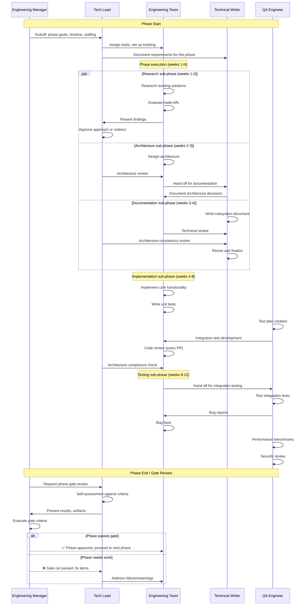
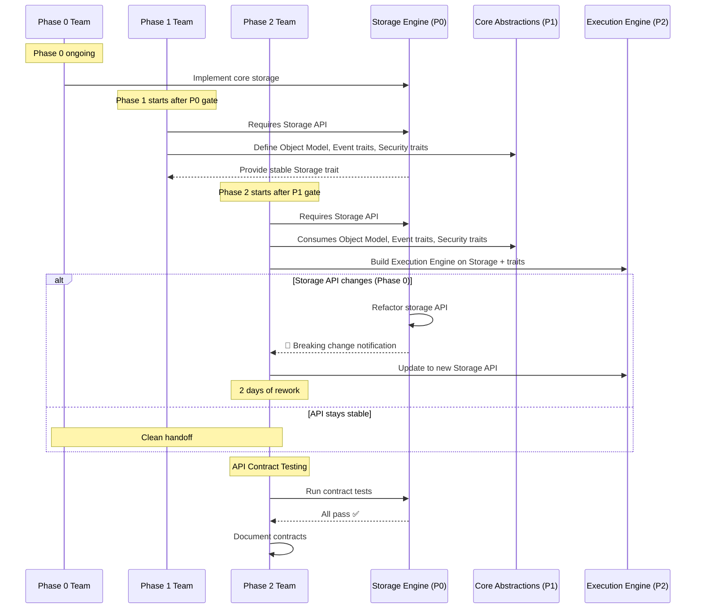
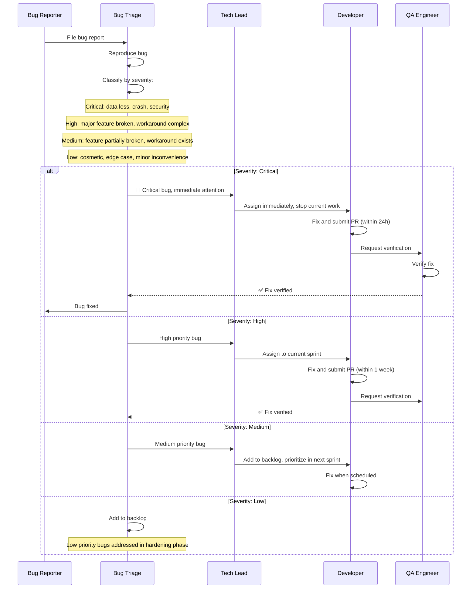

# Document 30: Development Roadmap

## 1. Purpose

This document defines the complete phased development plan for Nova Runtime from inception through production-ready release. It provides a detailed task breakdown for each phase, identifies dependencies between subsystems, maps staffing requirements, defines milestones and review gates, and establishes the timeline for delivery.

The roadmap is organized around the development philosophy: **Research First → Architecture Second → Documentation Third → Implementation Fourth → Optimization Fifth**. Each phase follows this ordering, ensuring that implementation only proceeds after adequate research, architecture, and documentation are complete.

## 2. Scope

This document covers:

- Seven development phases: Phase 0 (Foundations) through Phase 6 (Hardening)
- Detailed 3-month phase breakdowns with weekly task granularity
- Dependency graph between all subsystems
- Staffing recommendations per phase (roles, team size, skill requirements)
- Milestone definitions with acceptance criteria
- Review gates at the end of each phase
- Risk assessment for each phase with mitigation strategies
- Gantt chart (mermaid) showing the full timeline
- Resource requirements (compute, budget, tools)
- Quality gates (documentation review, test coverage, benchmark targets)
- Release criteria for v1.0

## 3. Responsibilities

- **Chief Architect**: Overall technical direction, architecture decisions, cross-subsystem consistency
- **Engineering Manager**: Staffing, timeline management, risk tracking, milestone verification
- **Tech Leads** (one per phase): Technical execution, code review, quality gates
- **Storage Engineer**: Phase 0 core (storage engine, memory model)
- **Runtime Engineer**: Phase 2 core (execution engine)
- **Database Engineer**: Phase 3 (SQL layer, search)
- **Systems Engineer**: Phase 4 (queue, scheduler, auth)
- **API Engineer**: Phase 5 (REST, GraphQL, SDK, Dashboard)
- **Frontend Engineer**: Phase 5 (Dashboard UI)
- **QA/Test Engineer**: Phase 6 (testing, benchmarking, security audit)
- **Technical Writer**: Documentation review, consistency checking throughout all phases

## 4. Non Responsibilities

- This roadmap does not include post-v1.0 feature planning (v1.1, v2.0, etc.)
- Specific UI/UX design for the dashboard is in the Dashboard document (26)
- Specific benchmark targets are in the Benchmark Strategy document (28)
- Specific test plans are in the Testing Strategy document (27)
- Specific deployment procedures are in the Deployment document (29)
- This is not a product roadmap; it is an engineering implementation roadmap
- Marketing, community building, and business development activities are out of scope

## 5. Architecture

### 5.1 Phase Overview

```mermaid
graph TB
    P0["Phase 0: Foundations (Months 1-3)<br/>Build System | Configuration | CLI Scaffold<br/>Memory Model | Storage Engine | CI Pipeline<br/><br/>Deliverables: Build scripts, libconfig,<br/>nova CLI, libmemory, libstorage, CI setup"]
    P1["Phase 1: Core Abstractions (Months 4-5)<br/>Object Model | Event System | Security Framework<br/>(traits/interfaces only)<br/><br/>Deliverables: libobject, libevent-traits,<br/>libsecurity-traits"]
    P2["Phase 2: Runtime (Months 6-7)<br/>Execution Engine<br/>(depends on Storage Engine, Object Model,<br/>Event System traits, Security traits)<br/><br/>Deliverables: libexecution, novad (alpha)"]
    P3["Phase 3: Data Subsystems (Months 8-10) ✅ COMPLETE 2026-07-03<br/>SQL Layer | Cache | Search | Blob Storage<br/><br/>Deliverables: libsql, libcache, libsearch,<br/>libblob, novad (beta with data subsystems)"]
    P4["Phase 4: Async Subsystems (Months 11-12)<br/>Queue | Scheduler | Authentication<br/>(depends on Security traits)<br/><br/>Deliverables: libqueue, libscheduler,<br/>libauth, novad (beta with all subsystems)"]
    P5["Phase 5: API & Tooling (Months 13-14)<br/>REST API | GraphQL API | SDK (Rust + JS) | Dashboard<br/><br/>Deliverables: REST API, GraphQL API,<br/>nova SDK, Dashboard, novad (RC)"]
    P6["Phase 6: Hardening (Months 15-16)<br/>Testing | Benchmarking | Deployment<br/>Documentation | Security Audit<br/>Performance Optimization<br/><br/>Deliverables: Full test suite, benchmark suite,<br/>Deployment packages, production docs,<br/>novad (v1.0.0 release)"]

    P0 --> P1 --> P2 --> P3 --> P4 --> P5 --> P6
```



> **Phase 3 Status (2026-07-03):** ✅ Complete. Delivered 4 new crates — `nova-cache`, `nova-blob`, `nova-search`, `nova-sql`. Total test suite: ~1,236 tests. Milestone P3-M1 (SQL Layer) verified and passing.

### 5.2 Dependency Graph

```mermaid
graph TB
    subgraph P0["Phase 0: Foundations"]
        Conf[Configuration] --> Build[Build System]
        Build --> CLI[CLI Scaffold]
        Build --> Mem[Memory Model]
        Mem --> Storage[Storage Engine]
        Storage --> CI[CI Pipeline]
    end

    subgraph P1["Phase 1: Core Abstractions"]
        Storage1[Storage Engine] --> Obj[Object Model]
        Storage1 --> Event[Event System (traits)]
        Storage1 --> Security[Security Framework (traits)]
    end

    subgraph P2["Phase 2: Runtime"]
        Storage2[Storage Engine] --> Exec[Execution Engine]
        Obj2[Object Model] --> Exec
        Event2[Event Traits] --> Exec
        Security2[Security Traits] --> Exec
        Exec --> Alpha[novad Alpha]
    end

    subgraph P3["Phase 3: Data Subsystems"]
        Exec3[Execution Engine] --> SQL[SQL Layer]
        Exec3 --> Cache[Cache]
        Exec3 --> Search[Search]
        Exec3 --> Blob[Blob Storage]
    end

    subgraph P4["Phase 4: Async Subsystems"]
        Exec4[Execution Engine] --> Queue[Queue]
        Queue --> Sched[Scheduler]
        Security4[Security Traits] --> Auth[Authentication]
    end

    subgraph P5["Phase 5: API & Tooling"]
        All5[All Subsystems] --> REST[REST API]
        All5 --> GraphQL[GraphQL API]
        All5 --> SDK[SDK]
        All5 --> Dashboard[Dashboard]
    end

    subgraph P6["Phase 6: Hardening"]
        All6[All Subsystems] --> Testing[Testing]
        All6 --> Benchmarking[Benchmarking]
        All6 --> Deployment[Deployment]
        All6 --> Docs[Documentation Review]
        All6 --> SecurityAudit[Security Audit]
    end

    P0 --> P1 --> P2 --> P3 --> P4 --> P5 --> P6
    P6 --> Release[Release v1.0.0]
```

### 5.3 Full Gantt Chart

```mermaid
gantt
    title Nova Runtime Development Roadmap
    dateFormat  YYYY-MM-DD
    axisFormat  %b %Y
    
    section Phase 0: Foundations
    Build System Setup (Cargo workspace)     :a0_1, 2026-01-05, 7d
    Research: Configuration System           :a0_2, 2026-01-05, 10d
    Implement Configuration System           :a0_3, after a0_2, 14d
    Research: Memory Model                   :a0_4, 2026-01-05, 14d
    Implement Memory Model                   :a0_5, after a0_4, 14d
    Research: Storage Engine Architecture    :a0_6, 2026-01-05, 14d
    Implement Storage Engine Core            :a0_7, after a0_6, 21d
    CLI Scaffold                             :a0_8, after a0_7, 14d
    CI Pipeline Setup                        :a0_9, after a0_1, 10d
    Phase 0 Documentation                    :a0_10, after a0_6, 30d
    Phase 0 Review Gate                      :milestone0, 2026-03-30, 0d

    section Phase 1: Core Abstractions
    Research: Object Model                   :a1_1, 2026-03-31, 10d
    Implement Object Model                   :a1_2, after a1_1, 14d
    Research: Event System (Traits)          :a1_3, 2026-03-31, 10d
    Implement Event System Traits            :a1_4, after a1_3, 14d
    Research: Security Framework (Traits)    :a1_5, 2026-03-31, 10d
    Implement Security Traits                :a1_6, after a1_5, 14d
    Integration: Core Abstractions           :a1_7, after a1_6, 7d
    Phase 1 Documentation                    :a1_8, after a1_1, 30d
    Phase 1 Review Gate                      :milestone1, 2026-05-31, 0d

    section Phase 2: Runtime
    Research: Execution Engine               :a2_1, 2026-06-01, 14d
    Implement Execution Engine               :a2_2, after a2_1, 28d
    Integration: Engine + Storage + Traits   :a2_3, after a2_2, 10d
    novad Alpha (headless)                   :a2_4, after a2_3, 7d
    Phase 2 Documentation                    :a2_5, after a2_1, 30d
    Phase 2 Review Gate                      :milestone2, 2026-07-31, 0d

    section Phase 3: Data Subsystems ✅ COMPLETE 2026-07-03
    Research: SQL Layer                      :a3_1, 2026-04-01, 14d
    Implement SQL Layer                      :a3_2, after a3_1, 35d
    Research: Cache Subsystem                :a3_3, 2026-04-01, 10d
    Implement Cache Subsystem                :a3_4, after a3_3, 21d
    Research: Search Subsystem               :a3_5, 2026-04-15, 14d
    Implement Search Subsystem               :a3_6, after a3_5, 35d
    Research: Blob Storage                   :a3_7, 2026-05-01, 10d
    Implement Blob Storage                   :a3_8, after a3_7, 28d
    Integration: All Data Subsystems         :a3_9, after a3_8, 14d
    novad Beta (data subsystems)             :a3_10, after a3_9, 7d
    Phase 3 Documentation                    :a3_11, after a3_1, 60d
    Phase 3 Review Gate ✅ COMPLETE           :milestone3, 2026-07-03, 0d

    section Phase 4: Async Subsystems
    Research: Queue Subsystem                :a4_1, 2026-11-01, 10d
    Implement Queue Subsystem                :a4_2, after a4_1, 21d
    Research: Scheduler Subsystem            :a4_3, 2026-11-01, 10d
    Implement Scheduler Subsystem            :a4_4, after a4_3, 21d
    Research: Authentication                 :a4_5, 2026-11-15, 10d
    Implement Authentication                 :a4_6, after a4_5, 21d
    Integration: Async Subsystems            :a4_7, after a4_6, 14d
    novad Beta (all subsystems)              :a4_8, after a4_7, 7d
    Phase 4 Documentation                    :a4_9, after a4_1, 40d
    Phase 4 Review Gate                      :milestone4, 2026-12-31, 0d

    section Phase 5: API & Tooling
    Research: REST API Design                :a5_1, 2027-01-01, 10d
    Implement REST API                       :a5_2, after a5_1, 21d
    Research: GraphQL API Design             :a5_3, 2027-01-01, 10d
    Implement GraphQL API                    :a5_4, after a5_3, 21d
    Research: SDK Design (Rust + JS)         :a5_5, 2027-01-15, 10d
    Implement Rust SDK                       :a5_6, after a5_5, 14d
    Implement JavaScript SDK                 :a5_7, after a5_5, 14d
    Implement Dashboard (React/TS)           :a5_8, after a5_2, 35d
    Integration: API + All Subsystems        :a5_9, after a5_8, 10d
    novad RC1                                :a5_10, after a5_9, 7d
    Phase 5 Documentation                    :a5_11, after a5_1, 50d
    Phase 5 Review Gate                      :milestone5, 2027-02-28, 0d

    section Phase 6: Hardening
    Full Test Suite Completion               :a6_1, 2027-03-01, 30d
    Fuzz Testing (continuous)                :a6_2, 2027-03-01, 30d
    Benchmark Suite Development              :a6_3, 2027-03-01, 20d
    Performance Benchmarking & Optimization   :a6_4, after a6_3, 30d
    Chaos Engineering                         :a6_5, 2027-03-15, 20d
    Security Audit                            :a6_6, 2027-03-15, 20d
    Deployment Package Development            :a6_7, 2027-03-01, 30d
    Deployment Testing                        :a6_8, after a6_7, 20d
    Documentation Review & Completion        :a6_9, 2027-03-01, 40d
    Release Candidate 2                      :milestone6a, 2027-03-31, 0d
    Bug Fixing & Final Polish                 :a6_10, after milestone6a, 14d
    v1.0.0 Release                           :milestone6b, 2027-04-14, 0d
```



### 5.4 Staffing Matrix

| Role | Phase 0 | Phase 1 | Phase 2 | Phase 3 | Phase 4 | Phase 5 | Phase 6 |
|------|---------|---------|---------|---------|---------|---------|---------|
| Chief Architect | 50% | 50% | 50% | 30% | 30% | 30% | 50% |
| Engineering Manager | 100% | 100% | 100% | 100% | 100% | 100% | 100% |
| Storage Engineer | 100% | — | 50% | 50% | — | — | 50% |
| Runtime Engineer | 100% | 50% | 100% | 50% | 50% | 50% | 50% |
| Database Engineer | — | — | — | 100% | — | 50% | 50% |
| Systems Engineer | — | — | — | 50% | 100% | — | 50% |
| API Engineer | — | — | — | — | 50% | 100% | 50% |
| Frontend Engineer | — | — | — | — | — | 100% | 50% |
| QA/Test Engineer | 50% | 50% | 50% | 50% | 50% | 50% | 100% |
| Security Engineer | — | 50% | 50% | 50% | 50% | 50% | 100% |
| Technical Writer | 50% | 50% | 50% | 50% | 50% | 50% | 100% |
| **Total Headcount** | **5-6** | **5-6** | **6-7** | **8-9** | **8-9** | **10-11** | **10-11** |

## 6. Data Structures

### 6.1 Phase Definition

```rust
/// Complete phase definition including tasks, dependencies, and milestones
#[derive(Debug, Clone, Serialize, Deserialize)]
pub struct Phase {
    pub id: u8,                           // 0-5
    pub name: String,                     // "Foundations", "Core Runtime", etc.
    pub start_date: NaiveDate,
    pub end_date: NaiveDate,
    pub duration_weeks: u16,
    pub staffing: Vec<StaffingEntry>,
    pub tasks: Vec<Task>,
    pub dependencies: Vec<Dependency>,
    pub milestones: Vec<Milestone>,
    pub risks: Vec<Risk>,
    pub budget_hours: u64,
    pub deliverables: Vec<String>,
    pub review_criteria: Vec<String>,
}

#[derive(Debug, Clone, Serialize, Deserialize)]
pub struct Task {
    pub id: String,                       // "P0-T1", "P1-T2", etc.
    pub name: String,
    pub description: String,
    pub estimated_hours: u64,
    pub assigned_role: String,
    pub depends_on: Vec<String>,          // Task IDs this depends on
    pub artifacts: Vec<String>,           // Output files, PRs, docs
    pub acceptance_criteria: Vec<String>,
    pub priority: Priority,
}

#[derive(Debug, Clone, PartialEq, Serialize, Deserialize)]
pub enum Priority {
    Critical,    // Blocking other work
    High,        // Required for milestone
    Medium,      // Important but not blocking
    Low,         // Nice to have
}

#[derive(Debug, Clone, Serialize, Deserialize)]
pub struct StaffingEntry {
    pub role: String,
    pub headcount: u8,
    pub allocation_pct: u8,  // 100 = full time
    pub required_skills: Vec<String>,
}

#[derive(Debug, Clone, Serialize, Deserialize)]
pub struct Milestone {
    pub id: String,
    pub name: String,
    pub date: NaiveDate,
    pub acceptance_criteria: Vec<String>,
    pub review_party: Vec<String>,  // Roles that must sign off
}

#[derive(Debug, Clone, Serialize, Deserialize)]
pub struct Risk {
    pub id: String,
    pub description: String,
    pub probability: RiskProbability,
    pub impact: RiskImpact,
    pub mitigation: String,
    pub contingency: String,
    pub owner: String,
}

#[derive(Debug, Clone, PartialEq, Serialize, Deserialize)]
pub enum RiskProbability {
    VeryLow,     // < 10%
    Low,         // 10-25%
    Medium,      // 25-50%
    High,        // 50-75%
    VeryHigh,    // > 75%
}

#[derive(Debug, Clone, PartialEq, Serialize, Deserialize)]
pub enum RiskImpact {
    Negligible,
    Minor,       // < 1 week delay
    Moderate,    // 1-2 week delay
    Major,       // 2-4 week delay
    Critical,    // > 4 week delay, may block release
}
```

### 6.2 Subsystem Dependency Matrix

| Subsystem | MEM | CFG | STG | OBJ | EVT | SEC | EXE | QUEUE |
|-----------|-----|-----|-----|-----|-----|-----|-----|-------|
| Build (BLD) | N | N | N | N | N | N | N | N |
| Config (CFG) | N | - | N | N | N | N | N | N |
| CLI (CLI) | N | N | N | N | N | N | N | N |
| Memory (MEM) | - | N | N | N | N | N | N | N |
| Storage (STG) | Y | Y | - | N | N | N | N | N |
| Object (OBJ) | Y | N | N | - | N | N | N | N |
| Event (EVT) | N | N | Y | N | - | N | N | N |
| Security (SEC) | N | N | N | N | N | - | N | N |
| Execution (EXE) | N | Y | Y | Y | Y | Y | - | N |
| Cache (CACHE) | N | Y | N | N | N | N | Y | N |
| Search (SRCH) | N | N | Y | Y | N | N | Y | N |
| Blob (BLOB) | N | Y | Y | N | N | N | Y | N |
| SQL (SQL) | N | Y | Y | Y | N | N | Y | N |
| Queue (QUEUE) | N | N | Y | N | N | N | Y | - |
| Scheduler (SCH) | N | N | N | N | N | N | Y | Y |
| Auth (AUTH) | N | N | Y | N | N | Y | Y | N |
| REST API | N | Y | N | N | N | Y | Y | N |
| GraphQL | N | Y | N | N | N | Y | Y | N |
| SDK | N | N | N | N | N | N | N | N |
| Dashboard | N | N | N | N | N | N | N | N |

Y = depends on this subsystem
N = no dependency
Note: Security (SEC) and Event (EVT) define traits/interfaces only.
      Execution Engine (EXE) depends on those traits (inversion of control).
      SDK and Dashboard depend on REST API/GraphQL (not listed as columns).

### 6.3 Budget Estimation

```rust
/// Estimated engineering hours per phase
/// Based on 4-week month, 40-hour weeks, with overhead (meetings, reviews, bugs)
const PHASE_BUDGET: &[PhaseBudget] = &[
    PhaseBudget {
        phase: 0,
        name: "Foundations",
        weeks: 12,
        avg_team_size: 5.5,
        total_hours: 2640,   // 5.5 FTE × 12 weeks × 40 hrs
        research_pct: 25,
        architecture_pct: 15,
        documentation_pct: 15,
        implementation_pct: 35,
        testing_pct: 10,
        risk_buffer_pct: 15,  // Added to base
    },
    PhaseBudget {
        phase: 1,
        name: "Core Abstractions",
        weeks: 9,
        avg_team_size: 5.5,
        total_hours: 1980,
        research_pct: 25,
        architecture_pct: 15,
        documentation_pct: 20,
        implementation_pct: 30,
        testing_pct: 10,
        risk_buffer_pct: 15,
    },
    PhaseBudget {
        phase: 2,
        name: "Runtime",
        weeks: 9,
        avg_team_size: 6.5,
        total_hours: 2340,
        research_pct: 20,
        architecture_pct: 10,
        documentation_pct: 15,
        implementation_pct: 40,
        testing_pct: 15,
        risk_buffer_pct: 20,
    },
    PhaseBudget {
        phase: 3,
        name: "Data Subsystems",
        weeks: 13,
        avg_team_size: 8.5,
        total_hours: 4420,
        research_pct: 20,
        architecture_pct: 10,
        documentation_pct: 10,
        implementation_pct: 45,
        testing_pct: 15,
        risk_buffer_pct: 20,
    },
    PhaseBudget {
        phase: 4,
        name: "Async Subsystems",
        weeks: 9,
        avg_team_size: 8.5,
        total_hours: 3060,
        research_pct: 15,
        architecture_pct: 10,
        documentation_pct: 10,
        implementation_pct: 45,
        testing_pct: 20,
        risk_buffer_pct: 20,
    },
    PhaseBudget {
        phase: 5,
        name: "API & Tooling",
        weeks: 9,
        avg_team_size: 10.5,
        total_hours: 3780,
        research_pct: 10,
        architecture_pct: 10,
        documentation_pct: 10,
        implementation_pct: 50,
        testing_pct: 20,
        risk_buffer_pct: 20,
    },
    PhaseBudget {
        phase: 6,
        name: "Hardening",
        weeks: 7,
        avg_team_size: 10.5,
        total_hours: 2940,
        research_pct: 5,
        architecture_pct: 5,
        documentation_pct: 15,
        implementation_pct: 30,
        testing_pct: 45,
        risk_buffer_pct: 15,
    },
];

// Total estimated engineering hours: ~23,460 (approximately 13.5 FTE-years)
// Total calendar time: 16 months
```

## 7. Algorithms

### 7.1 Phase Gating

```
Algorithm: PhaseGateReview
Purpose: Determine if a phase is complete and the next phase can begin

EVALUATE_PHASE_GATE(phase, artifacts):
  results = { passed: true, failures: [], warnings: [] }
  
  // Check 1: All tasks complete with acceptance criteria met
  for task in phase.tasks:
    if task.priority in [Critical, High]:
      if task.status != "complete":
        results.failures.push("Critical task incomplete: {}", task.name)
        results.passed = false
      elif not verify_acceptance_criteria(task):
        results.failures.push("Task acceptance criteria not met: {}", task.name)
        results.passed = false
  
  // Check 2: All milestones achieved
  for milestone in phase.milestones:
    if not verify_milestone(milestone):
      results.failures.push("Milestone not achieved: {}", milestone.name)
      results.passed = false
  
  // Check 3: Documentation complete
  required_docs = get_phase_documents(phase.id)
  for doc in required_docs:
    if not exists(doc.path):
      results.warnings.push("Missing document: {}", doc.name)
    elif not verify_document_quality(doc):
      results.warnings.push("Document needs revision: {}", doc.name)
  
  // Check 4: Test coverage meets targets
  if phase.test_coverage < PHASE_COVERAGE_TARGETS[phase.id]:
    results.warnings.push(
      "Test coverage {}% below target {}%",
      phase.test_coverage, PHASE_COVERAGE_TARGETS[phase.id]
    )
  
  // Check 5: Code quality
  if has_critical_clippy_warnings():
    results.failures.push("Critical clippy warnings exist")
    results.passed = false
  
  // Check 6: Consistency with previous phases
  inconsistencies = check_cross_phase_consistency(phase, get_previous_phase())
  for inc in inconsistencies:
    results.warnings.push("Cross-phase inconsistency: {}", inc)
  
  // Check 7: Risk review
  for risk in phase.risks:
    if risk.status == "realized" and not mitigated:
      results.failures.push("Unmitigated risk: {}", risk.description)
      results.passed = false
  
  return results

PHASE_COVERAGE_TARGETS = [
    95,  // Phase 0: Foundations
    90,  // Phase 1: Core Abstractions (trait contract tests)
    90,  // Phase 2: Runtime (execution engine)
    85,  // Phase 3: Data subsystems (integration heavy)
    85,  // Phase 4: Async subsystems
    80,  // Phase 5: API (HTTP testing)
    90,  // Phase 6: Full suite
]
```

### 7.2 Dependency Resolution

```
Algorithm: DependencyResolver
Purpose: Determine build order based on subsystem dependencies

RESOLVE_BUILD_ORDER(subsystems, dependencies):
  // Use topological sort
  in_degree = {s: 0 for s in subsystems}
  adjacency = {s: [] for s in subsystems}
  
  for (dependent, dependency) in dependencies:
    adjacency[dependency].push(dependent)
    in_degree[dependent] += 1
  
  // Kahn's algorithm
  queue = [s for s in subsystems if in_degree[s] == 0]
  build_order = []
  
  while queue is not empty:
    sort(queue)  // Stable sort for deterministic ordering
    subsystem = queue.pop_front()
    build_order.push(subsystem)
    
    for neighbor in adjacency[subsystem]:
      in_degree[neighbor] -= 1
      if in_degree[neighbor] == 0:
        queue.push(neighbor)
  
  if len(build_order) != len(subsystems):
    error("Circular dependency detected!")
    return None
  
  return build_order

// Result for Nova subsystems:
// Phase 0 — Foundations (no Nova dependencies):
//   1. Build System (no dependencies)
//   2. Configuration (no dependencies)
//   3. Memory Model (no dependencies)
//   4. Storage Engine (depends on: memory, config)
//   5. CLI Scaffold (no dependencies on Nova subsystems)
//
// Phase 1 — Core Abstractions (depends on Phase 0):
//   6. Object Model (depends on: memory)
//   7. Event System — traits only (depends on: storage)
//   8. Security Framework — traits only (no Nova dependencies)
//
// Phase 2 — Runtime (depends on Phase 1):
//   9. Execution Engine (depends on: storage, config, object, event traits, security traits)
//
// Phase 3 — Data Subsystems (depends on Phase 2):
//   10. SQL Layer (depends on: execution, storage, object, config)
//   11. Cache (depends on: execution, config)
//   12. Search (depends on: execution, storage, object)
//   13. Blob Storage (depends on: execution, storage, config)
//
// Phase 4 — Async Subsystems (depends on Phase 2):
//   14. Queue (depends on: execution, storage)
//   15. Scheduler (depends on: execution, queue)
//   16. Authentication (depends on: execution, security traits, storage)
//
// Phase 5 — API & Tooling (depends on Phases 3-4):
//   17. REST API (depends on: config, security traits, all subsystems)
//   18. GraphQL API (depends on: config, security traits, all subsystems)
//   19. SDK (depends on: REST/GraphQL API)
//   20. Dashboard (depends on: REST API)
//
// Phase 6 — Hardening (depends on all):
//   21. Testing (depends on all subsystems)
//   22. Benchmarking (depends on all subsystems)
//   23. Deployment (depends on all subsystems)
//   24. Documentation Review (depends on all subsystems)
//
// Key inversion-of-control principle:
//   - Security Framework defines TRAITS only; Execution Engine consumes them
//   - Event System defines TRAITS only; Execution Engine consumes them
//   - No circular dependencies: the graph is a DAG
```

### 7.3 Risk-Adjusted Timeline

```
Algorithm: RiskAdjustedTimeline
Purpose: Calculate realistic timeline with risk adjustments

CALCULATE_TIMELINE(phases, risks):
  total_duration = 0
  
  for phase in phases:
    base_duration = phase.end_date - phase.start_date
    risk_overhead = 0
    
    for risk in phase.risks:
      risk_exposure = probability_score(risk.probability) * impact_score(risk.impact)
      risk_overhead += risk_exposure * base_duration * 0.1  // 10% of base per risk
    
    phase_mitigation = risk_overhead * 0.5  // Mitigation reduces by 50%
    adjusted_duration = base_duration + risk_overhead - phase_mitigation
    
    total_duration += adjusted_duration
    phase.adjusted_duration = adjusted_duration
  
  // Add integration buffer (10% of total)
  integration_buffer = total_duration * 0.1
  total_with_buffer = total_duration + integration_buffer
  
  return {
    total_calendar_days: total_with_buffer,
    total_working_days: total_with_buffer * 5/7,
    risk_adjusted_end_date: start_date + total_with_buffer,
    phases: phases,
  }

PROBABILITY_SCORE(prob):
  match prob:
    VeryLow  => 0.05
    Low      => 0.15
    Medium   => 0.35
    High     => 0.60
    VeryHigh => 0.85

IMPACT_SCORE(impact):
  match impact:
    Negligible => 0.0
    Minor      => 0.1
    Moderate   => 0.3
    Major      => 0.6
    Critical   => 1.0
```

## 8. Interfaces

### 8.1 Release Criteria

```
v1.0.0 Release Criteria Checklist:

□ All 30 architecture documents complete and reviewed
□ All critical and high-priority features implemented
□ No known critical or high-severity bugs
□ All medium-severity bugs have documented workaround or fix scheduled
□ Zero security vulnerabilities in dependency audit
□ Test coverage:
  □ Unit test coverage ≥ 90%
  □ Integration test coverage ≥ 80%
  □ E2E smoke tests passing
□ Performance benchmarks:
  □ All metrics within 2x of target
  □ No regressions > 10% from baseline
  □ P99 latency < 100ms for all operations
  □ Throughput > 10,000 ops/s on reference hardware
□ Security:
  □ SAST scan passed (no critical findings)
  □ Dependency audit passed (no critical CVEs)
  □ Penetration test completed (no critical findings)
  □ TLS configuration verified
  □ Authentication and authorization tested
□ Deployment:
  □ Package available: apt repository
  □ Package available: RPM repository
  □ Package available: Docker image (distroless + alpine)
  □ Package available: Static binary (x86_64, aarch64)
  □ systemd service file tested
  □ Installation documentation complete
  □ Upgrade documentation complete
□ Documentation:
  □ Quickstart guide
  □ Installation guide
  □ Configuration reference
  ↑ API reference (OpenAPI 3.0)
  □ CLI reference
  □ SDK documentation
  □ Operations runbook
  □ Backup and restore guide
  □ Troubleshooting guide
□ Release artifacts:
  □ Release tag (v1.0.0) in git
  ↑ Signed release artifacts
  □ Release notes
  □ CHANGELOG.md updated
  ↑ Migration guide (from beta)
```

### 8.2 Weekly Task Tracking

```markdown
# Weekly Task Tracking Template

## Phase: [0-5] — [Phase Name]
## Week: [1-12/9/13/9/9/6]
## Date: [YYYY-MM-DD] to [YYYY-MM-DD]

### Goals This Week
1. [Primary goal]
2. [Secondary goal]
3. [Tertiary goal]

### Tasks
| ID | Task | Owner | Status | Blockers | Hours Spent |
|----|------|-------|--------|----------|-------------|
| P0-T1 | Implement WAL write path | Alice | 🟢 Complete | None | 32 |
| P0-T2 | Implement WAL read path | Bob | 🟡 In Progress | Waiting on P0-T1 review | 20 |
| P0-T3 | Checkpoint logic | Carol | 🔴 Blocked | Design question on GC | 8 |

### Blockers
1. P0-T3 blocked by design question on garbage collection semantics
   - Decision needed: tombstone-based vs compaction-based GC
   - To be resolved in architecture sync Wed 2pm

### Risks
1. Storage engine memory usage higher than expected (2x target)
   - Mitigation: Profile memory usage, optimize B-tree node size
   - Contingency: Accept higher memory usage for v1, optimize in v1.1

### Milestone Progress
- [ ] P0-M1: Storage Engine MVP — 70% complete (WAL read pending)
- [ ] P0-M2: CLI scaffold — 100% complete ✅

### Next Week Planning
1. Complete P0-T2 WAL read path
2. Resolve GC design question
3. Start P0-T4: Snapshot/restore
```

## 9. Sequence Diagrams

### 9.1 Phase Execution Flow



### 9.2 Cross-Phase Dependency Resolution



### 9.3 Bug Triage Flow



## 10. Failure Modes

| ID | Failure Mode | Cause | Effect | Detection | Severity |
|----|-------------|-------|--------|-----------|----------|
| R01 | Phase overrun | Underestimation, scope creep, technical complexity | Delayed start of downstream phases, compressed timeline | Weekly progress tracking < 80% of plan | Critical |
| R02 | Staffing gap | Key person leaves, hiring delay, illness | Critical tasks unstaffed, knowledge loss | Missing deliverables, slowed progress | Critical |
| R03 | Technical complexity underestimated | Novel research area, integration challenges | Phase takes 2x estimated time | Tech lead flags during research sub-phase | High |
| R04 | Breaking API change | Refactoring of core trait (Storage, Execution) | Downstream subsystems need rework | Contract test failures | High |
| R05 | Dependency chain delay | Phase 0 delay → Phase 1 delay → Phase 2 delay | Cascading timeline slip | Phase gate failure | Critical |
| R06 | Scope creep | "Just one more feature" requests | Phase never completes | Unplanned tasks added to sprint | Medium |
| R07 | Integration hell | Subsystems developed in isolation don't work together | Last-minute integration effort | Integration tests fail | High |
| R08 | Performance not meeting targets | Over-optimistic targets, algorithmic complexity | Need optimization phase before release | Benchmark results below targets | Medium |
| R09 | Security vulnerability discovered | Design flaw, dependency CVE | Emergency fix, potential redesign | Security audit, dependency scan | Critical |
| R10 | Tooling/CI failure | CI pipeline unreliable, slow builds | Developer productivity loss | CI queue > 30 minutes | Medium |
| R11 | Documentation drift | Code changes without doc updates | Inconsistent docs, implementation guessing | Document review vs code | Medium |
| R12 | Team burnout | Sustained overtime, high pressure | Quality drops, attrition | Team health survey, velocity drop | High |
| R13 | Technology choice regret | Wrong library, wrong architecture | Need to reimplement | Tech lead flags during implementation | High |
| R14 | Community expectations mismatch | Users expect features not planned | Pressure to reprioritize | Feature requests, social media | Low |
| R15 | Funding/budget cut | Organization reprioritization | Team reduction, timeline extension | Management decision | Critical |

## 11. Recovery Strategy

### 11.1 Phase Overrun Recovery

```
If phase is running behind schedule:
  Week 1 behind:     Monitor. Add 5 hours/week per team member to catch up.
  Week 2 behind:     Reduce scope. Move non-critical features to next phase.
  Week 3+ behind:    Formal recovery plan:
                     1. Identify exact causes
                     2. Reduce scope (move Low/Medium priority tasks out)
                     3. Add staffing if available (but Brooks' Law applies)
                     4. Extend phase timeline, adjust downstream phases
                     5. Communicate revised timeline to stakeholders

Phase compression strategies (use in order):
  1. Reduce scope (remove non-critical features)
  2. Increase parallelization (more independent work streams)
  3. Add staffing to non-dependent tasks (avoid Brooks' Law)
  4. Accept reduced quality in non-critical areas (document as tech debt)
  5. Extend timeline (last resort)
```

### 11.2 Staffing Gap Recovery

```
Key person loss:
  - Immediate: Reassign tasks to remaining team members
  - Short-term (1-2 weeks): Bring in contractor or internal transfer
  - Long-term: Hire replacement (start recruiting day 1)
  - Knowledge transfer: Ensure documentation is up to date
  
  Prevention:
  - Cross-train: No single point of failure
  - Documentation: All architecture decisions documented
  - Code review: At least 2 reviewers per area
  - Pair programming: Complex areas

Hiring delay:
  - Phase 0-1: Hard requirement for senior Rust engineers
   - Phase 3-4: Database/Systems experience needed
   - Phase 5-6: Can use contractors for frontend/SDK work

Strategies:
  - Start recruiting 2 months before needed
  - Use contractors for specific well-scoped tasks
  - Consider internal transfers from other teams
  - Accept that new hires need 1 month ramp-up
```

### 11.3 Technical Risk Recovery

```
When technical complexity exceeds estimates:

1. Research sub-phase extension (add 1-2 weeks)
   - Better to extend research than to implement wrong approach
   - Document findings, rejected alternatives

2. Prototype
   - Build minimal working prototype (1-2 weeks)
   - Validate key assumptions
   - Prototype may be discarded (accept this cost)

3. Simplify
   - Reduce scope to minimal viable implementation
   - Document deferred features for future work
   - Example: SQL layer without full JOIN support in v1

4. Escalate
   - Bring in domain expert (internal or external consultant)
   - Review similar implementations in open source
   - Consider alternative architecture
```

### 11.4 Integration Crisis Recovery

```
When integration tests reveal fundamental incompatibilities:

1. Identify the exact contract violation:
   - Which trait/interface is inconsistent?
   - Which subsystems are affected?
   - Is it a design issue or implementation bug?

2. Decision: Fix vs Bridge
   - Small issue (< 1 week): Fix the implementation
   - Medium issue (1-3 weeks): Add adapter/compatibility layer
   - Large issue (> 3 weeks): Redesign the interface

3. Recovery actions:
   - Document the contract explicitly
   - Add integration test that would have caught this
   - Notify downstream subsystem owners of API changes
   - Update architecture documents

4. Prevention:
   - Contract tests added to CI
   - Subsystem integration tested weekly (not just at phase end)
   - Shared interface definitions in common crate
```

## 12. Performance Considerations

### 12.1 Development Velocity Targets

| Metric | Target | Measurement |
|--------|--------|-------------|
| Lines of code per week (team) | 3,000-5,000 | git stats (exclude generated code, tests) |
| Test code ratio | 1.5:1 (test:production) | cloc |
| PR review turnaround | < 24 hours | GitHub analytics |
| CI pipeline time | < 15 min | GitHub Actions duration |
| Build time (incremental) | < 3 min | cargo build timing |
| Build time (clean release) | < 15 min | cargo build --release |
| Bug fix time (critical) | < 24 hours | Issue to PR merge |
| Bug fix time (high) | < 1 week | Issue to PR merge |
| Research phase duration | < 2 weeks per subsystem | Calendar tracking |
| Documentation:implementation ratio | 1:3 (hours) | Time tracking |

### 12.2 Resource Requirements

| Resource | Phase 0 | Phase 1 | Phase 2 | Phase 3 | Phase 4 | Phase 5 | Phase 6 |
|----------|---------|---------|---------|---------|---------|---------|---------|
| CI runner (GitHub) | 2 vCPU, 8GB | 2 vCPU, 8GB | 4 vCPU, 8GB | 4 vCPU, 8GB | 4 vCPU, 8GB | 8 vCPU, 16GB | 8 vCPU, 16GB |
| Dev machines | 16GB RAM | 16GB RAM | 16GB RAM | 32GB RAM | 32GB RAM | 32GB RAM | 32GB RAM |
| Storage per dev | 50GB SSD | 50GB SSD | 50GB SSD | 100GB SSD | 100GB SSD | 100GB SSD | 200GB SSD |
| Cloud testing budget | — | — | — | $200/mo | $200/mo | $500/mo | $1000/mo |
| Tooling licenses | $0 (OSS) | $0 (OSS) | $0 (OSS) | $0 (OSS) | $0 (OSS) | $0 (OSS) | $0 (OSS) |

### 12.3 Technical Debt Budget

```
Acceptable technical debt (tracked and managed):
  - Documentation debt: Up to 5 undocumented public APIs at any time
  - Test debt: Up to 10% below coverage target, with plan to close
  - Code quality debt: Up to 50 clippy warnings (must be non-critical)
   - Performance debt: Up to 2x target, with plan to optimize in Phase 6

Prohibited technical debt:
  - Unsafe code without safety justification comment
  - Duplicated persistence (violates core principle)
  - Business logic outside execution engine
  - Untested public API
  - Undocumented architecture decision
```

## 13. Security

### 13.1 Security Review Schedule

| Review Type | Frequency | Phase | Lead |
|-------------|-----------|-------|------|
| Dependency audit | Weekly | All | Security Engineer |
| SAST (Clippy + CodeQL) | Per commit | All | CI Pipeline |
| DAST (OWASP ZAP) | Monthly | Phase 5-6 | Security Engineer |
| Dependency scanning | Daily | All | CI Pipeline (cargo audit) |
| Threat modeling | Per subsystem | Architecture sub-phase | Security Engineer |
| Penetration testing | Once | Phase 6 | External firm |
| Security architecture review | Per phase gate | All | Chief Architect |
| Credential/secret scanning | Per commit | All | CI Pipeline (truffleHog) |

### 13.2 Security Incident Response

```
Security Incident Response Process:

1. Discovery
   - Internal finding via audit/scanning
   - External report via security@nova-runtime.dev
   - Automated alert from monitoring

2. Triage (within 4 hours)
   - Determine severity (Critical/High/Medium/Low)
   - Assign incident handler
   - Begin containment

3. Containment (within 24 hours for Critical)
   - Disable affected feature
   - Revoke compromised keys
   - Deploy emergency fix
   - Notify affected users (if applicable)

4. Investigation (within 1 week)
   - Root cause analysis
   - Determine scope of affected versions
   - Determine if data was compromised

5. Remediation
   - Fix root cause
   - Add preventive tests
   - Update threat model
   - Document lessons learned

6. Disclosure (within 90 days)
   - CVE assignment
   - Security advisory publication
   - Affected version notification
```

### 13.3 Secure Development Practices

```
All development follows these security practices:

1. Principle of Least Privilege
   - Code runs with minimum necessary permissions
   - API endpoints validate authorization, not just authentication
   - Subsystems isolate data access

2. Defense in Depth
   - Input validation at every layer
   - Output encoding for all user-facing data
   - Multiple validation layers for security-critical operations

3. Secure Defaults
   - Dashboard binds to localhost by default
   - Encryption disabled by default (user opt-in)
   - Rate limiting enabled by default

4. Fail Securely
   - Errors default to denial of access, not grant
   - Panic recovery leaves system in safe state
   - Cryptographic failures are non-recoverable (no silent fallback)

5. Memory Safety
   - Use safe Rust in all public interfaces
   - Unsafe code requires safety justification (documented in comments)
   - All unsafe blocks validated by at least 2 reviewers

6. Supply Chain Security
   - All dependencies pinned to specific versions
   - Automated scanning for known vulnerabilities
   - Dependency addition requires review by tech lead
   - Minimum dependency policy: prefer standard library, then well-audited crates
```

## 14. Testing

### 14.1 Phase-Specific Testing Goals

| Phase | Testing Focus | Coverage Target | Key Tests |
|-------|---------------|----------------|-----------|
| P0 Foundations | Unit tests for storage, memory, config | 95% unit | Property-based storage tests, config parsing, memory allocation |
| P1 Abstractions | Traits and interface contracts | 90% unit | Object model tests, event trait conformance, security trait contracts |
| P2 Runtime | Engine pipeline, trait integration | 90% unit | Execution pipeline, trait integration, storage engine binding |
| P3 Data | SQL parser, cache eviction, search indexing | 85% unit + 80% integration | SQL roundtrip, cache consistency, search relevance |
| P4 Async | Queue state machine, scheduler ticks, auth | 85% unit + 80% integration | Queue persistence, job scheduling, token validation |
| P5 API | HTTP routing, request validation, GraphQL | 80% unit + 80% integration | Endpoint coverage, error codes, schema introspection |
| P6 Hardening | Full system, chaos, fuzz, perf, security | 90% overall | E2E flows, fault injection, crash recovery |

### 14.2 Integration Testing Schedule

```
Integration testing begins in phase each subsystem is completed:

Phase 0: Storage + Memory integration tests
Phase 1: Object + Memory integration tests
          Event trait conformance tests
          Security trait contract tests
Phase 2: Execution + Storage integration tests
          Execution + Object Model integration tests
          Execution + Event trait integration tests
          Execution + Security trait integration tests
Phase 3: SQL + Execution integration tests
          Cache + Execution integration tests
          Search + Execution integration tests
          Blob + Execution integration tests
          Cross-data-subsystem integration tests
Phase 4: Queue + Execution integration tests
          Scheduler + Queue integration tests
          Auth + Security traits + Execution integration tests
          All-subsystem integration smoke tests
Phase 5: API + All subsystem integration tests
          REST + GraphQL cross-testing
          Dashboard + API integration tests
Phase 6: Full e2e test suite (nightly)
          Chaos engineering tests (weekly)
          Fuzz testing (continuous)
```

### 14.3 Milestone Verification Tests

```rust
/// Each milestone must pass these verification tests
const MILESTONE_TESTS: &[MilestoneTest] = &[
    // Phase 0 Milestones
    MilestoneTest {
        milestone: "P0-M1",
        name: "Storage Engine MVP",
        tests: &[
            "Write 1M documents to storage",
            "Read all 1M documents back with correct values",
            "Delete documents and verify removal",
            "Scan with prefix returns correct subset",
            "WAL write + replay produces identical state",
            "Concurrent read/write is linearizable",
            "Crash during write does not corrupt existing data",
        ],
    },
    // Phase 1 Milestones
    MilestoneTest {
        milestone: "P1-M1",
        name: "Core Abstractions",
        tests: &[
            "Object Model: create, read, update, delete objects",
            "Object Model: type validation and serialization roundtrip",
            "Event System: define and implement event trait",
            "Event System: publish and subscribe via trait interface",
            "Security Framework: define authentication and authorization traits",
            "Security Framework: trait contract tests pass",
            "Cross-trait integration: Object + Event trait compatibility",
        ],
    },
    // Phase 2 Milestones
    MilestoneTest {
        milestone: "P2-M1",
        name: "Execution Engine",
        tests: &[
            "Execute simple pipeline: read → transform → write",
            "Execute multi-step pipeline with 10 stages",
            "Pipeline error propagation (stage 5 of 10 fails)",
            "Pipeline timeout (cancel after deadline)",
            "Concurrent pipeline execution (100 parallel pipelines)",
            "Execution context with correct isolation",
            "Trait integration: Engine uses Security traits for authz checks",
            "Trait integration: Engine uses Event traits for event dispatch",
        ],
    },
    // Phase 3 Milestones ✅ COMPLETE 2026-07-03
    MilestoneTest {
        milestone: "P3-M1",
        name: "SQL Layer ✅ COMPLETE",
        tests: &[
            "CREATE TABLE with all supported types",
            "INSERT 10k rows via SQL",
            "SELECT with WHERE, ORDER BY, LIMIT",
            "SELECT with JOIN (INNER, LEFT)",
            "SELECT with aggregation (COUNT, SUM, AVG, MIN, MAX)",
            "UPDATE with WHERE clause",
            "DELETE with WHERE clause",
            "Complex query: SELECT with 3-table JOIN + aggregate + subquery",
        ],
    },
    // Phase 4 Milestones
    MilestoneTest {
        milestone: "P4-M1",
        name: "Queue + Scheduler",
        tests: &[
            "Enqueue 100k messages, dequeue all",
            "Message visibility timeout (reserve → process → delete or release)",
            "Delayed messages arrive after specified delay",
            "Dead letter queue captures failed messages",
            "Scheduled job executes at correct cron time",
            "Job retry with backoff",
            "Concurrent job execution with concurrency policy",
        ],
    },
    // Phase 5 Milestones
    MilestoneTest {
        milestone: "P5-M1",
        name: "REST API + Dashboard",
        tests: &[
            "All REST endpoints return correct status codes",
            "CRUD operations for each subsystem through REST",
            "GraphQL schema introspection returns valid schema",
            "GraphQL mutation creates, reads, updates, deletes",
            "Dashboard loads and displays system health",
            "Dashboard WebSocket receives real-time updates",
            "Authentication + authorization enforced on all endpoints",
        ],
    },
    // Phase 6 Milestones
    MilestoneTest {
        milestone: "P6-M1",
        name: "Release Candidate",
        tests: &[
            "Full e2e suite passes (200+ scenarios)",
            "Chaos: network partition → graceful degradation → recovery",
            "Chaos: process kill → crash recovery → data integrity verified",
            "Chaos: disk full → read-only mode → recovery",
            "Fuzz: 24h of API fuzzing (0 crashes)",
            "Fuzz: 24h of SQL parser fuzzing (0 panics)",
            "Performance: all metrics within 2x of targets",
            "Backup and restore verified with 1M documents",
            "Upgrade from previous version + rollback verified",
        ],
    },
];
```

## 15. Future Work

### 15.1 Post-v1.0 Features (v1.1)

- **Clustering groundwork**: Consensus protocol (Raft) implementation for metadata, read replicas
- **Multi-tenancy**: Namespace isolation, per-tenant resource limits
- **Data import/export**: Import from PostgreSQL, MongoDB, SQLite; export to CSV, Parquet
- **Webhook system**: HTTP callbacks on data changes, scheduled events, alert notifications
- **Plugin system**: Wasm-based plugins for custom handlers in the execution engine
- **Full-text search improvements**: Custom analyzers, stemming, synonyms, more-like-this
- **Geospatial queries**: Geo-indexing, radius queries, bounding box queries

### 15.2 v1.2 Features

- **Read replicas**: Async replication for read scale-out
- **Sharding**: Horizontal data partitioning across nodes
- **Materialized views**: Pre-computed query results, auto-refresh
- **Change data capture (CDC)**: Stream data changes to external systems
- **Advanced SQL**: Window functions, CTEs, recursive queries, full JOIN support
- **LDAP/SAML integration**: Enterprise authentication

### 15.3 v2.0 Features

- **Full clustering**: Multi-master replication, distributed consensus, automatic failover
- **Distributed queries**: Query across nodes transparently
- **Multi-region**: Cross-region replication with latency optimization
- **SQL standard compliance**: Complete SQL:2016 coverage
- **GraphQL subscriptions**: Real-time GraphQL
- **Enterprise features**: Audit logging, data masking, column-level security

## 16. Open Questions

1. **Should Phase 0 and Phase 1 be merged?**
   - They are separate because Storage Engine + Memory Model are foundational and complex enough to warrant their own phase, while Core Abstractions (Object Model, Event System traits, Security traits) represent a distinct concern. Merging would dilute focus.

2. **What is the correct team size for Nova?**
   - The estimated need is 5-11 people across phases. A team of 10-11 full-time engineers is ideal. Fewer than 5 would extend the timeline to 2+ years. More than 15 would introduce coordination overhead that outweighs benefits.

3. **Should we build the Dashboard in Phase 5 or defer it to v1.1?**
   - The Dashboard is included in Phase 5 because it is essential for operator adoption. CLI-only operation is a barrier for many users. However, a minimal read-only dashboard is the v1 target; advanced features (alerts, metrics exploration) can be deferred.

4. **How do we handle open source contributions during development?**
   - During Phase 0-2, the repository is public but contribution is limited due to rapid architecture changes. After Phase 5 (API stable), contributions are welcomed with clear contributing guidelines and a review process.

5. **What if a phase takes significantly longer than estimated?**
   - Each phase has a 15-20% risk buffer. If this is exceeded, the engineering manager triggers the recovery plan (scope reduction, timeline extension). The Chief Architect determines which features move to the next phase.

6. **Should we release beta versions after each phase?**
   - Alpha (headless, internal) after Phase 2. Beta (data subsystems) after Phase 3. Beta (all subsystems) after Phase 4. RC (API + Dashboard) after Phase 5. Production (v1.0.0) after Phase 6. Each release expands the audience.

7. **What is the policy for major rewrites?**
   - If a subsystem requires more than 2 weeks of rewrite, it is treated as a separate work stream with its own research → architecture → documentation → implementation cycle within the phase.

8. **How do we balance new feature development with bug fixes?**
   - 80% of team capacity allocated to phase tasks. 20% reserved for bug fixes, tech debt, and unplanned work. During Phase 6, this flips to 30% features / 70% testing & fixes.

9. **Should documentation be written before or after implementation?**
   - Before. Per the development philosophy: Documentation Third (after Research and Architecture, before Implementation). Documents are written during the architecture sub-phase, reviewed, and then used as the specification for implementation.

10. **What happens if a core team member leaves mid-phase?**
    - The chief architect and engineering manager have cross-trained knowledge of all subsystems. Documentation provides fallback. Recruiting replacement starts immediately. Remaining team redistributes tasks with adjusted scope.

## 17. References

1. **The Mythical Man-Month** - Frederick Brooks, Addison-Wesley, 1975
2. **The Phoenix Project** - Gene Kim, Kevin Behr, George Spafford, IT Revolution Press, 2013
3. **Managing the Design Factory** - Donald Reinertsen, Free Press, 1997
4. **Accelerate: The Science of Lean Software and DevOps** - Nicole Forsgren, Jez Humble, Gene Kim, IT Revolution Press, 2018
5. **Ship It!** - Jared Richardson, William Gwaltney, Pragmatic Bookshelf, 2005
6. **Continuous Delivery** - Jez Humble, David Farley, Addison-Wesley, 2010
7. **Clean Architecture** - Robert C. Martin, Prentice Hall, 2017
8. **Working Effectively with Legacy Code** - Michael Feathers, Prentice Hall, 2004
9. **The Art of Scalability** - Martin Abbott, Michael Fisher, Addison-Wesley, 2009
10. **Site Reliability Engineering** - Betsy Beyer, et al., O'Reilly, 2016
11. **Rust API Guidelines** - https://rust-lang.github.io/api-guidelines/
12. **Semantic Versioning 2.0** - https://semver.org/
13. **Gantt Project Management** - https://en.wikipedia.org/wiki/Gantt_chart
14. **Critical Path Method** - https://en.wikipedia.org/wiki/Critical_path_method
15. **Agile Software Development** - https://agilemanifesto.org/
